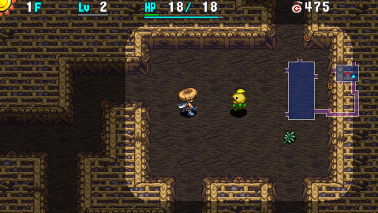
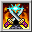

  

A PSP version exclusive series favorite daytime-only unidentified items post-game dungeon. The premise might sound similar to Bayside Monster Cave, but the dungeon plays out very differently due to an adjusted item and monster table, along with a guaranteed Monster House every 10 floors.

The best items like Monster Detector, Wall Clip Bracelet, and Revival Grass are Elite Shop exclusive, and Pick-A-Choice shops don't appear so you're quite unlikely to obtain them in a run.

One could say where Bayside Monster Cave focuses on run away play using powerful items, Asura Realm focuses on upgrading equipment and using consumable items to cut down monsters.

<ul class="quickLinksUL">
  <li><a href="#overview">Overview</a></li>
  <li><a href="#strategy">Strategy</a></li>
  <li><a href="#floor-guide">Floor Guide</a></li>
  <li><a href="#monsters">Monsters</a></li>
  <li><a href="#items">Items</a></li>
  <li><a href="#traps">Traps</a></li>
</ul>

# Overview

<table class="dungeonOverview">
  <tr>
    <th>Unlock</th>
    <td class="highlightYellow">Go to Novice House after clearing the main story.</td>
  </tr>
  <tr>
    <th>Entrance</th>
    <td class="highlightYellow">Boronga Village (Girl in Novice House)</td>
  </tr>
</table>

<table class="dungeonTable">
  <tr>
    <th>Floors</th>
    <td>99F</td>
    <th>Day / Night</th>
    <td>Day</td>
  </tr>
  <tr>
    <th>Bring Items</th>
    <td>No</td>
    <th>Allies</th>
    <td>No</td>
  </tr>
  <tr>
    <th>Unidentified</th>
    <td colspan="3">All categories</td>
  </tr>
  <tr>
    <th>Shops</th>
    <td>Regular, Elite</td>
    <th>Monster Houses</th>
    <td>Regular, Special, Sudden</td>
  </tr>
  <tr>
    <th>Initial Enemies</th>
    <td></td>
    <th>Spawn Rate</th>
    <td>30</td>
  </tr>
  <tr>
    <th>Ominous aura</th>
    <td>Yes (1200 turns)</td>
    <th>Winds of Kron</th>
    <td>1st: 1200 / 4th: 1500</td>
  </tr>
  <tr>
    <th>Clear Icon</th>
    <td class="clearIcon"></td>
    <th>Clear Bonus</th>
    <td>100,000,000</td>
  </tr>
  <tr>
    <th>Reward</th>
    <td colspan="3">Worthy Sword</td>
  </tr>
</table>

# Strategy

[Quick Links]

[Content]

# Monsters

See [Monsters](/system/monsters) for individual monster details.

- N = N'dubba Lv1 Lv2 Lv3 Lv4
- M = Maneater Lv1 Lv2 Lv3 Lv4

Enemy Colors: Farming Useful Destroys Items High Offense Dangerous Very Dangerous

<table class="monsterTable">
  <thead>
    <tr>
      <th>F</th>
      <th colspan="8">Day</th>
      <th>N</th>
      <th>M</th>
    </tr>
  </thead>
  <tbody>
    <tr>
      <th>1</th>
      <td>Mamel</td>
      <td>Seedie</td>
      <td class="highlightGray"></td>
      <td class="highlightGray"></td>
      <td class="highlightGray"></td>
      <td class="highlightGray"></td>
      <td class="highlightGray"></td>
      <td class="highlightGray"></td>
      <td class="highlightGray"></td>
      <td rowspan="9" class="monsterTableManeater">1</td>
    </tr>
    <tr>
      <th>2</th>
      <td>Mamel</td>
      <td>Seedie</td>
      <td>Chintala</td>
      <td>Pit Mamel</td>
      <td class="highlightGray"></td>
      <td class="highlightGray"></td>
      <td class="highlightGray"></td>
      <td class="highlightGray"></td>
      <td class="highlightGray"></td>
    </tr>
    <tr>
      <th>3</th>
      <td>Hopodile</td>
      <td>Seedie</td>
      <td>Chintala</td>
      <td>Pit Mamel</td>
      <td>Squid King</td>
      <td class="highlightGray"></td>
      <td class="highlightGray"></td>
      <td class="highlightGray"></td>
      <td class="highlightGray"></td>
    </tr>
    <tr>
      <th>4</th>
      <td>Hopodile</td>
      <td>Blade Bee</td>
      <td>Chintala</td>
      <td>Pit Mamel</td>
      <td>Squid King</td>
      <td>Banana Novice</td>
      <td class="highlightGray"></td>
      <td class="highlightGray"></td>
      <td class="highlightGray"></td>
    </tr>
    <tr>
      <th>5</th>
      <td>Hopodile</td>
      <td>Blade Bee</td>
      <td>Boy Cart</td>
      <td class="highlightGray"></td>
      <td>Squid King</td>
      <td>Banana Novice</td>
      <td class="highlightGray"></td>
      <td class="highlightGray"></td>
      <td class="highlightGray"></td>
    </tr>
    <tr>
      <th>6</th>
      <td>Absorbiphant</td>
      <td>Blade Bee</td>
      <td>Boy Cart</td>
      <td class="highlightGray"></td>
      <td>Field Knave</td>
      <td>Banana Novice</td>
      <td>Firepuff</td>
      <td class="highlightGray"></td>
      <td class="highlightGray"></td>
    </tr>
    <tr>
      <th>7</th>
      <td>Absorbiphant</td>
      <td>Blade Bee</td>
      <td>Boy Cart Cross Cart</td>
      <td>Ironhead</td>
      <td>Field Knave</td>
      <td>Banana Novice</td>
      <td>Firepuff</td>
      <td>Slime</td>
      <td rowspan="3" class="monsterTableNdubba">1</td>
    </tr>
    <tr>
      <th>8</th>
      <td>Absorbiphant</td>
      <td>Blade Bee</td>
      <td>Cross Cart</td>
      <td>Ironhead</td>
      <td>Cheer Ham</td>
      <td>Snacky</td>
      <td>Firepuff</td>
      <td>Slime</td>
    </tr>
    <tr>
      <th>9</th>
      <td>Mutaikon</td>
      <td>Blade Bee</td>
      <td>Cross Cart Strong Cart</td>
      <td>Ironhead</td>
      <td>Cheer Ham</td>
      <td>Snacky</td>
      <td>Crow Tengu</td>
      <td>Foly</td>
    </tr>
    <tr>
      <th>10</th>
      <td class="highlightOrange"></td>
      <td class="highlightOrange"></td>
      <td class="highlightOrange">Flamepuff</td>
      <td class="highlightOrange">Squid Lord</td>
      <td class="highlightOrange">Spin Polygon</td>
      <td class="highlightOrange">Dagger Bee</td>
      <td class="highlightOrange">Beanie</td>
      <td class="highlightOrange"></td>
      <td class="highlightOrange"></td>
      <td class="highlightOrange"></td>
    </tr>
    <tr>
      <th>11</th>
      <td>Mutaikon</td>
      <td>Yanpii</td>
      <td>Strong Cart</td>
      <td>Ironhead</td>
      <td>Explochin</td>
      <td>Scorpion</td>
      <td>Crow Tengu</td>
      <td>Foly</td>
      <td class="monsterTableNdubba">1</td>
      <td rowspan="9" class="monsterTableVilleater">2</td>
    </tr>
    <tr>
      <th>12</th>
      <td>Mutaikon</td>
      <td>Yanpii</td>
      <td>Mixer</td>
      <td>Porky</td>
      <td>Explochin</td>
      <td>Scorpion</td>
      <td>Crow Tengu</td>
      <td>Foly</td>
      <td class="highlightGray"></td>
    </tr>
    <tr>
      <th>13</th>
      <td>Floaty</td>
      <td>Yanpii</td>
      <td>Mixer</td>
      <td>Porky</td>
      <td>Explochin</td>
      <td>Scorpion</td>
      <td class="highlightGray"></td>
      <td class="highlightGray"></td>
      <td class="highlightGray"></td>
    </tr>
    <tr>
      <th>14</th>
      <td>Floaty</td>
      <td>Yanpii</td>
      <td>Mixer</td>
      <td>Porky</td>
      <td>Gyadon</td>
      <td>Scorpion</td>
      <td>Curse Girl</td>
      <td>Pierce Cart</td>
      <td class="highlightGray"></td>
    </tr>
    <tr>
      <th>15</th>
      <td>Floaty</td>
      <td>Yanpii</td>
      <td>Zapdon</td>
      <td>Porky</td>
      <td>Gyadon</td>
      <td>Spin Polygon</td>
      <td>Curse Girl</td>
      <td>Pierce Cart</td>
      <td class="highlightGray"></td>
    </tr>
    <tr>
      <th>16</th>
      <td>Flash Bird</td>
      <td>Dagger Bee</td>
      <td>Zapdon</td>
      <td>Porky</td>
      <td>Gyadon</td>
      <td>Spin Polygon</td>
      <td>Curse Girl</td>
      <td>Pierce Cart</td>
      <td class="highlightGray"></td>
    </tr>
    <tr>
      <th>17</th>
      <td>Flash Bird</td>
      <td>Dagger Bee</td>
      <td>Zapdon</td>
      <td>Froggucci</td>
      <td>Flamepuff</td>
      <td>Spin Polygon</td>
      <td class="highlightGray"></td>
      <td class="highlightGray"></td>
      <td class="highlightGray"></td>
    </tr>
    <tr>
      <th>18</th>
      <td>Flash Bird</td>
      <td>Dagger Bee</td>
      <td>Zapdon</td>
      <td>Froggucci</td>
      <td>Flamepuff</td>
      <td class="highlightGray"></td>
      <td>Squid Lord</td>
      <td class="highlightGray"></td>
      <td class="highlightGray"></td>
    </tr>
    <tr>
      <th>19</th>
      <td>Beanie</td>
      <td>Dagger Bee</td>
      <td>Go Ham</td>
      <td>Froggucci</td>
      <td>Flamepuff</td>
      <td class="highlightGray"></td>
      <td>Squid Lord</td>
      <td class="highlightGray"></td>
      <td class="highlightGray"></td>
    </tr>
    <tr>
      <th>20</th>
      <td class="highlightOrange"></td>
      <td class="highlightOrange"></td>
      <td class="highlightOrange">Mixermon</td>
      <td class="highlightOrange">MC Mage</td>
      <td class="highlightOrange">Banana Morph</td>
      <td class="highlightOrange">Pumphantom</td>
      <td class="highlightOrange">Chainhead</td>
      <td class="highlightOrange"></td>
      <td class="highlightOrange"></td>
      <td class="highlightOrange"></td>
    </tr>
    <tr>
      <th>21</th>
      <td>Beanie</td>
      <td>Gyaza</td>
      <td>Go Ham</td>
      <td>Sr. Yanpii</td>
      <td class="highlightGray"></td>
      <td>Dragon</td>
      <td>Pop Tank</td>
      <td class="highlightGray"></td>
      <td rowspan="3" class="monsterTableNtwyn">2</td>
      <td rowspan="5" class="monsterTableVilleater">2</td>
    </tr>
    <tr>
      <th>22</th>
      <td>Beanie</td>
      <td>Gyaza</td>
      <td>Go Ham</td>
      <td>Sr. Yanpii</td>
      <td>Kappa Pest</td>
      <td>Dragon</td>
      <td>Pop Tank</td>
      <td>Big Chintala</td>
    </tr>
    <tr>
      <th>23</th>
      <td>Beanie</td>
      <td>Gyaza</td>
      <td class="highlightGray"></td>
      <td>Sr. Yanpii</td>
      <td>Kappa Pest</td>
      <td>Dragon</td>
      <td>Curse Sister</td>
      <td>Big Chintala</td>
    </tr>
    <tr>
      <th>24</th>
      <td class="highlightGray"></td>
      <td>Gyaza</td>
      <td>Grime</td>
      <td>Sr. Yanpii</td>
      <td>Kappa Pest</td>
      <td>Dragon</td>
      <td>Curse Sister</td>
      <td>Big Chintala</td>
      <td class="highlightGray"></td>
    </tr>
    <tr>
      <th>25</th>
      <td>Eligan</td>
      <td>Gyaza</td>
      <td>Grime</td>
      <td>Concusschin</td>
      <td>Mixermon</td>
      <td>Dragon</td>
      <td>Curse Sister</td>
      <td>Big Chintala</td>
      <td class="highlightGray"></td>
    </tr>
    <tr>
      <th>26</th>
      <td>Eligan</td>
      <td>Gyaza</td>
      <td>Grime</td>
      <td>Concusschin</td>
      <td>Mixermon</td>
      <td>MC Mage</td>
      <td class="highlightGray"></td>
      <td>Big Chintala</td>
      <td class="highlightGray"></td>
      <td rowspan="4" class="monsterTableMounteater">3</td>
    </tr>
    <tr>
      <th>27</th>
      <td>Eligan</td>
      <td>Banana Morph</td>
      <td>Grime</td>
      <td>Concusschin</td>
      <td>Mixermon</td>
      <td>MC Mage</td>
      <td>Glare Bird</td>
      <td class="highlightGray"></td>
      <td class="highlightGray"></td>
    </tr>
    <tr>
      <th>28</th>
      <td>Eligan</td>
      <td>Banana Morph</td>
      <td class="highlightGray"></td>
      <td>Concusschin</td>
      <td>Pumphantom</td>
      <td>MC Mage</td>
      <td>Glare Bird</td>
      <td class="highlightGray"></td>
      <td class="highlightGray"></td>
    </tr>
    <tr>
      <th>29</th>
      <td>Eligan</td>
      <td>Banana Morph</td>
      <td>Chainhead</td>
      <td>Demon Scorp</td>
      <td>Pumphantom</td>
      <td>MC Mage</td>
      <td>Glare Bird</td>
      <td class="highlightGray"></td>
      <td class="highlightGray"></td>
    </tr>
    <tr>
      <th>30</th>
      <td class="highlightOrange"></td>
      <td class="highlightOrange"></td>
      <td class="highlightOrange">Nuttie</td>
      <td class="highlightOrange">Blazepuff</td>
      <td class="highlightOrange">Lt. Yanpii</td>
      <td class="highlightOrange">Gyairas</td>
      <td class="highlightOrange">Falcon Tengu</td>
      <td class="highlightOrange"></td>
      <td class="highlightOrange"></td>
      <td class="highlightOrange"></td>
    </tr>
    <tr>
      <th>31</th>
      <td>Digestiphant</td>
      <td>Grampa Tank</td>
      <td>Chainhead</td>
      <td>Demon Scorp</td>
      <td>Pumphantom</td>
      <td class="highlightGray"></td>
      <td class="highlightGray"></td>
      <td>Super Gazer</td>
      <td rowspan="9" class="monsterTableNmach">3</td>
      <td rowspan="9" class="monsterTableMounteater">3</td>
    </tr>
    <tr>
      <th>32</th>
      <td>Digestiphant</td>
      <td>Grampa Tank</td>
      <td>Chainhead</td>
      <td>Demon Scorp</td>
      <td>Pumphantom</td>
      <td>Dance Polygon</td>
      <td>Tiger Hurler</td>
      <td>Super Gazer</td>
    </tr>
    <tr>
      <th>33</th>
      <td>Digestiphant</td>
      <td>Grampa Tank</td>
      <td>Chainhead</td>
      <td>Demon Scorp</td>
      <td>Voltdon</td>
      <td>Dance Polygon</td>
      <td>Tiger Hurler</td>
      <td>Super Gazer</td>
    </tr>
    <tr>
      <th>34</th>
      <td>Digestiphant</td>
      <td>Grampa Tank</td>
      <td>Porko</td>
      <td class="highlightGray"></td>
      <td>Voltdon</td>
      <td>Dance Polygon</td>
      <td>Tiger Hurler</td>
      <td class="highlightGray"></td>
    </tr>
    <tr>
      <th>35</th>
      <td>Digestiphant</td>
      <td>Grampa Tank</td>
      <td>Porko</td>
      <td class="highlightGray"></td>
      <td>Voltdon</td>
      <td>Dance Polygon</td>
      <td>Tiger Hurler</td>
      <td class="highlightGray"></td>
    </tr>
    <tr>
      <th>36</th>
      <td>Steamroid</td>
      <td>Gyairas</td>
      <td>Porko</td>
      <td class="highlightGray"></td>
      <td>Voltdon</td>
      <td>Scarabbit</td>
      <td>Falcon Tengu</td>
      <td class="highlightGray"></td>
    </tr>
    <tr>
      <th>37</th>
      <td>Steamroid</td>
      <td>Gyairas</td>
      <td class="highlightGray"></td>
      <td class="highlightGray"></td>
      <td>Voltdon</td>
      <td>Scarabbit</td>
      <td>Falcon Tengu</td>
      <td>Crunchy</td>
    </tr>
    <tr>
      <th>38</th>
      <td>Steamroid</td>
      <td>Gyairas</td>
      <td>Nuttie</td>
      <td>Blazepuff</td>
      <td class="highlightGray"></td>
      <td>Scarabbit</td>
      <td>Falcon Tengu</td>
      <td>Crunchy</td>
    </tr>
    <tr>
      <th>39</th>
      <td>Steamroid</td>
      <td>Gyairas</td>
      <td>Nuttie</td>
      <td>Blazepuff</td>
      <td>Poofy</td>
      <td>Lt. Yanpii</td>
      <td>Falcon Tengu</td>
      <td>Crunchy</td>
    </tr>
    <tr>
      <th>40</th>
      <td class="highlightOrange"></td>
      <td class="highlightOrange"></td>
      <td class="highlightOrange">Mixergon</td>
      <td class="highlightOrange">Pandanigiri</td>
      <td class="highlightOrange">Squid Emperor</td>
      <td class="highlightOrange">Curse Mom</td>
      <td class="highlightOrange">Tiger Chucker</td>
      <td class="highlightOrange"></td>
      <td class="highlightOrange"></td>
      <td class="highlightOrange"></td>
    </tr>
    <tr>
      <th>41</th>
      <td>Ooze</td>
      <td>Killer Gyaza</td>
      <td>Nuttie</td>
      <td>Blazepuff</td>
      <td>Poofy</td>
      <td>Lt. Yanpii</td>
      <td>Falcon Tengu</td>
      <td class="highlightGray"></td>
      <td class="highlightGray"></td>
      <td rowspan="9" class="monsterTableMounteater">3</td>
    </tr>
    <tr>
      <th>42</th>
      <td>Ooze</td>
      <td>Killer Gyaza</td>
      <td>Nuttie</td>
      <td>Rally Ham</td>
      <td>Poofy</td>
      <td>Lt. Yanpii</td>
      <td>Falcon Tengu</td>
      <td>Katana Bee</td>
      <td class="highlightGray"></td>
    </tr>
    <tr>
      <th>43</th>
      <td>Ooze</td>
      <td>Killer Gyaza</td>
      <td>Nuttie</td>
      <td>Rally Ham</td>
      <td>Spongiderm</td>
      <td>Lt. Yanpii</td>
      <td>Falcon Tengu</td>
      <td>Katana Bee</td>
      <td class="highlightGray"></td>
    </tr>
    <tr>
      <th>44</th>
      <td>Ooze</td>
      <td>Killer Gyaza</td>
      <td class="highlightGray"></td>
      <td>Rally Ham</td>
      <td>Spongiderm</td>
      <td class="highlightGray"></td>
      <td class="highlightGray"></td>
      <td>Katana Bee</td>
      <td class="highlightGray"></td>
    </tr>
    <tr>
      <th>45</th>
      <td>Ooze</td>
      <td>Killer Gyaza</td>
      <td class="highlightGray"></td>
      <td>Rally Ham</td>
      <td>Spongiderm</td>
      <td>Pandanigiri</td>
      <td class="highlightGray"></td>
      <td>Katana Bee</td>
      <td class="highlightGray"></td>
    </tr>
    <tr>
      <th>46</th>
      <td>Ooze</td>
      <td>Killer Gyaza</td>
      <td class="highlightGray"></td>
      <td>Rally Ham</td>
      <td>Spongiderm</td>
      <td>Pandanigiri</td>
      <td>Froggon</td>
      <td>Katana Bee</td>
      <td class="highlightGray"></td>
    </tr>
    <tr>
      <th>47</th>
      <td>Ooze</td>
      <td class="highlightGray"></td>
      <td class="highlightGray"></td>
      <td>Mixergon</td>
      <td class="highlightGray"></td>
      <td>Pandanigiri</td>
      <td>Froggon</td>
      <td>Katana Bee</td>
      <td class="highlightGray"></td>
    </tr>
    <tr>
      <th>48</th>
      <td>Ooze</td>
      <td class="highlightGray"></td>
      <td>Squid Emperor</td>
      <td>Mixergon</td>
      <td class="highlightGray"></td>
      <td>Pandanigiri</td>
      <td>Froggon</td>
      <td>Katana Bee</td>
      <td class="highlightGray"></td>
    </tr>
    <tr>
      <th>49</th>
      <td>Ooze</td>
      <td>Sky Dragon</td>
      <td>Squid Emperor</td>
      <td>Mixergon</td>
      <td class="highlightGray"></td>
      <td>Pandanigiri</td>
      <td class="highlightGray"></td>
      <td>Katana Bee</td>
      <td class="highlightGray"></td>
    </tr>
    <tr>
      <th>50</th>
      <td class="highlightOrange"></td>
      <td class="highlightOrange"></td>
      <td class="highlightOrange">Gigahead</td>
      <td class="highlightOrange">Oingodile</td>
      <td class="highlightOrange">Blazepuff</td>
      <td class="highlightOrange">Stun Scorp</td>
      <td class="highlightOrange">Hyper Gazer</td>
      <td class="highlightOrange"></td>
      <td class="highlightOrange"></td>
      <td class="highlightOrange"></td>
    </tr>
    <tr>
      <th>51</th>
      <td>Curse Mom</td>
      <td>Sky Dragon</td>
      <td>Squid Emperor</td>
      <td>Tiger Chucker</td>
      <td>Sing Polygon</td>
      <td class="highlightGray"></td>
      <td class="highlightGray"></td>
      <td class="highlightGray"></td>
      <td class="highlightGray"></td>
      <td rowspan="9" class="monsterTableIsleater">4</td>
    </tr>
    <tr>
      <th>52</th>
      <td>Curse Mom</td>
      <td>Sky Dragon</td>
      <td>Eligagan</td>
      <td>Tiger Chucker</td>
      <td>Sing Polygon</td>
      <td class="highlightGray"></td>
      <td class="highlightGray"></td>
      <td class="highlightGray"></td>
      <td class="highlightGray"></td>
    </tr>
    <tr>
      <th>53</th>
      <td>Curse Mom</td>
      <td>Sky Dragon</td>
      <td>Eligagan</td>
      <td>Tiger Chucker</td>
      <td>Sing Polygon</td>
      <td>Banana Boss</td>
      <td>MC Wizard</td>
      <td class="highlightGray"></td>
      <td class="highlightGray"></td>
    </tr>
    <tr>
      <th>54</th>
      <td>Oingodile</td>
      <td>Fulminachin</td>
      <td>Eligagan</td>
      <td class="highlightGray"></td>
      <td>Sing Polygon</td>
      <td>Banana Boss</td>
      <td>MC Wizard</td>
      <td class="highlightGray"></td>
      <td class="highlightGray"></td>
    </tr>
    <tr>
      <th>55</th>
      <td>Oingodile</td>
      <td>Fulminachin</td>
      <td>Eligagan</td>
      <td class="highlightGray"></td>
      <td>Item Knave</td>
      <td>Banana Boss</td>
      <td>MC Wizard</td>
      <td>Mealy</td>
      <td class="highlightGray"></td>
    </tr>
    <tr>
      <th>56</th>
      <td>Oingodile</td>
      <td>Fulminachin</td>
      <td>Eligagan</td>
      <td>Vexing Kappa</td>
      <td>Item Knave</td>
      <td>Banana Boss</td>
      <td>MC Wizard</td>
      <td>Mealy</td>
      <td class="highlightGray"></td>
    </tr>
    <tr>
      <th>57</th>
      <td>Oingodile</td>
      <td class="highlightGray"></td>
      <td>Eligagan</td>
      <td>Vexing Kappa</td>
      <td>Item Knave</td>
      <td>Banana Boss</td>
      <td>MC Wizard</td>
      <td>Porkon</td>
      <td class="highlightGray"></td>
    </tr>
    <tr>
      <th>58</th>
      <td>Oingodile</td>
      <td>Gigahead</td>
      <td>Eligagan</td>
      <td>Vexing Kappa</td>
      <td>Item Knave</td>
      <td class="highlightGray"></td>
      <td>Pyrepuff</td>
      <td>Porkon</td>
      <td class="highlightGray"></td>
    </tr>
    <tr>
      <th>59</th>
      <td>Oingodile</td>
      <td>Gigahead</td>
      <td class="highlightGray"></td>
      <td>Vexing Kappa</td>
      <td>Item Knave</td>
      <td>Hyper Gazer</td>
      <td>Pyrepuff</td>
      <td>Porkon</td>
      <td class="highlightGray"></td>
    </tr>
    <tr>
      <th>60</th>
      <td class="highlightOrange"></td>
      <td class="highlightOrange"></td>
      <td class="highlightOrange">Mixerdon</td>
      <td class="highlightOrange">Sludge</td>
      <td class="highlightOrange">Grainie</td>
      <td class="highlightOrange">Pumpanshee</td>
      <td class="highlightOrange">Zanbeeto</td>
      <td class="highlightOrange"></td>
      <td class="highlightOrange"></td>
      <td class="highlightOrange"></td>
    </tr>
    <tr>
      <th>61</th>
      <td class="highlightGray"></td>
      <td>Gigahead</td>
      <td>Horrabbit</td>
      <td>Stun Scorp</td>
      <td>Twinkle Bird</td>
      <td>Hyper Gazer</td>
      <td>Pyrepuff</td>
      <td class="highlightGray"></td>
      <td rowspan="9" class="monsterTableNdup">4</td>
      <td rowspan="9" class="monsterTableIsleater">4</td>
    </tr>
    <tr>
      <th>62</th>
      <td>Dozikon</td>
      <td>Gigahead</td>
      <td>Horrabbit</td>
      <td>Stun Scorp</td>
      <td>Twinkle Bird</td>
      <td>Hyper Gazer</td>
      <td>Pyrepuff</td>
      <td class="highlightGray"></td>
    </tr>
    <tr>
      <th>63</th>
      <td>Dozikon</td>
      <td>Gigahead</td>
      <td>Horrabbit</td>
      <td>Stun Scorp</td>
      <td>Twinkle Bird</td>
      <td>Hyper Gazer</td>
      <td>Jouncy</td>
      <td class="highlightGray"></td>
    </tr>
    <tr>
      <th>64</th>
      <td>Dozikon</td>
      <td>Gigahead</td>
      <td class="highlightGray"></td>
      <td>Stun Scorp</td>
      <td>Twinkle Bird</td>
      <td class="highlightGray"></td>
      <td>Jouncy</td>
      <td class="highlightGray"></td>
    </tr>
    <tr>
      <th>65</th>
      <td>Dozikon</td>
      <td>Ornery Tank</td>
      <td>Iron Zalokleft</td>
      <td>Stun Scorp</td>
      <td>Twinkle Bird</td>
      <td class="highlightGray"></td>
      <td>Jouncy</td>
      <td class="highlightGray"></td>
    </tr>
    <tr>
      <th>66</th>
      <td>Dozikon</td>
      <td>Ornery Tank</td>
      <td>Iron Zalokleft</td>
      <td>Gyandora</td>
      <td class="highlightGray"></td>
      <td class="highlightGray"></td>
      <td>Jouncy</td>
      <td class="highlightGray"></td>
    </tr>
    <tr>
      <th>67</th>
      <td>Pumpanshee</td>
      <td>Ornery Tank</td>
      <td>Iron Zalokleft</td>
      <td>Gyandora</td>
      <td class="highlightGray"></td>
      <td class="highlightGray"></td>
      <td>Jouncy</td>
      <td class="highlightGray"></td>
    </tr>
    <tr>
      <th>68</th>
      <td>Pumpanshee</td>
      <td>Mixerdon</td>
      <td class="highlightGray"></td>
      <td>Gyandora</td>
      <td class="highlightGray"></td>
      <td>Grainie</td>
      <td class="highlightGray"></td>
      <td class="highlightGray"></td>
    </tr>
    <tr>
      <th>69</th>
      <td>Pumpanshee</td>
      <td>Mixerdon</td>
      <td class="highlightGray"></td>
      <td>Gyandora</td>
      <td>Boss Yanpii</td>
      <td>Grainie</td>
      <td>Zanbeeto</td>
      <td class="highlightGray"></td>
    </tr>
    <tr>
      <th>70</th>
      <td class="highlightOrange"></td>
      <td class="highlightOrange"></td>
      <td class="highlightOrange">MC Sorcerer</td>
      <td class="highlightOrange">Eligagon</td>
      <td class="highlightOrange">Huge Chintala</td>
      <td class="highlightOrange">Detonachin</td>
      <td class="highlightOrange">Curse Gramma</td>
      <td class="highlightOrange"></td>
      <td class="highlightOrange"></td>
      <td class="highlightOrange"></td>
    </tr>
    <tr>
      <th>71</th>
      <td class="highlightGray"></td>
      <td>Sludge</td>
      <td class="highlightGray"></td>
      <td>Gyandora</td>
      <td>Boss Yanpii</td>
      <td>Grainie</td>
      <td>Zanbeeto</td>
      <td class="highlightGray"></td>
      <td rowspan="9" class="monsterTableNdup">4</td>
      <td rowspan="9" class="monsterTableIsleater">4</td>
    </tr>
    <tr>
      <th>72</th>
      <td>Eagle Tengu</td>
      <td>Sludge</td>
      <td>Spirit Ham</td>
      <td>Hell Gyaza</td>
      <td>Boss Yanpii</td>
      <td>Grainie</td>
      <td>Zanbeeto</td>
      <td class="highlightGray"></td>
    </tr>
    <tr>
      <th>73</th>
      <td>Eagle Tengu</td>
      <td>Sludge</td>
      <td>Spirit Ham</td>
      <td>Hell Gyaza</td>
      <td>Boss Yanpii</td>
      <td class="highlightGray"></td>
      <td>Zanbeeto</td>
      <td class="highlightGray"></td>
    </tr>
    <tr>
      <th>74</th>
      <td>Eagle Tengu</td>
      <td>Sludge</td>
      <td>Spirit Ham</td>
      <td>Hell Gyaza</td>
      <td>Onigirizzly</td>
      <td class="highlightGray"></td>
      <td>Zanbeeto</td>
      <td class="highlightGray"></td>
    </tr>
    <tr>
      <th>75</th>
      <td>Eagle Tengu</td>
      <td>Sludge</td>
      <td>Spirit Ham</td>
      <td>Hell Gyaza</td>
      <td>Onigirizzly</td>
      <td class="highlightGray"></td>
      <td>MC Sorcerer</td>
      <td class="highlightGray"></td>
    </tr>
    <tr>
      <th>76</th>
      <td class="highlightGray"></td>
      <td>Sludge</td>
      <td>Spirit Ham</td>
      <td>Hell Gyaza</td>
      <td>Onigirizzly</td>
      <td class="highlightGray"></td>
      <td>MC Sorcerer</td>
      <td class="highlightGray"></td>
    </tr>
    <tr>
      <th>77</th>
      <td class="highlightGray"></td>
      <td>Sludge</td>
      <td>Detonachin</td>
      <td>Hell Gyaza</td>
      <td>Onigirizzly</td>
      <td class="highlightGray"></td>
      <td>MC Sorcerer</td>
      <td class="highlightGray"></td>
    </tr>
    <tr>
      <th>78</th>
      <td class="highlightGray"></td>
      <td>Sludge</td>
      <td>Detonachin</td>
      <td>Hell Gyaza</td>
      <td>Onigirizzly</td>
      <td class="highlightGray"></td>
      <td>MC Sorcerer</td>
      <td class="highlightGray"></td>
    </tr>
    <tr>
      <th>79</th>
      <td class="highlightGray"></td>
      <td>Sludge</td>
      <td>Detonachin</td>
      <td>Hell Gyaza</td>
      <td>Curse Gramma</td>
      <td>Eligagon</td>
      <td>MC Sorcerer</td>
      <td class="highlightGray"></td>
    </tr>
    <tr>
      <th>80</th>
      <td class="highlightOrange"></td>
      <td class="highlightOrange"></td>
      <td class="highlightOrange">Gitan Mamel</td>
      <td class="highlightOrange">Boingodile</td>
      <td class="highlightOrange">Mosh Polygon</td>
      <td class="highlightOrange">Pumptergeist</td>
      <td class="highlightOrange">Blight Scorp</td>
      <td class="highlightOrange"></td>
      <td class="highlightOrange"></td>
      <td class="highlightOrange"></td>
    </tr>
    <tr>
      <th>81</th>
      <td class="highlightGray"></td>
      <td>Shihan</td>
      <td>Detonachin</td>
      <td class="highlightGray"></td>
      <td>Curse Gramma</td>
      <td>Eligagon</td>
      <td>Huge Chintala</td>
      <td class="highlightGray"></td>
      <td class="highlightGray"></td>
      <td rowspan="9" class="monsterTableIsleater">4</td>
    </tr>
    <tr>
      <th>82</th>
      <td>Archdragon</td>
      <td>Shihan</td>
      <td>Kappa Troll</td>
      <td class="highlightGray"></td>
      <td>Curse Gramma</td>
      <td>Eligagon</td>
      <td>Huge Chintala</td>
      <td class="highlightGray"></td>
      <td class="highlightGray"></td>
    </tr>
    <tr>
      <th>83</th>
      <td>Archdragon</td>
      <td>Shihan</td>
      <td>Kappa Troll</td>
      <td class="highlightGray"></td>
      <td class="highlightGray"></td>
      <td>Eligagon</td>
      <td>Huge Chintala</td>
      <td class="highlightGray"></td>
      <td class="highlightGray"></td>
    </tr>
    <tr>
      <th>84</th>
      <td>Archdragon</td>
      <td class="highlightGray"></td>
      <td>Kappa Troll</td>
      <td>Flashdon</td>
      <td>Osmammoth</td>
      <td>Eligagon</td>
      <td>Huge Chintala</td>
      <td class="highlightGray"></td>
      <td class="highlightGray"></td>
    </tr>
    <tr>
      <th>85</th>
      <td>Archdragon</td>
      <td>Tiger Ace</td>
      <td class="highlightGray"></td>
      <td>Flashdon</td>
      <td>Osmammoth</td>
      <td>Eligagon</td>
      <td>Huge Chintala</td>
      <td class="highlightGray"></td>
      <td class="highlightGray"></td>
    </tr>
    <tr>
      <th>86</th>
      <td>Archdragon</td>
      <td>Tiger Ace</td>
      <td class="highlightGray"></td>
      <td>Flashdon</td>
      <td>Osmammoth</td>
      <td>Porgon</td>
      <td class="highlightGray"></td>
      <td class="highlightGray"></td>
      <td class="highlightGray"></td>
    </tr>
    <tr>
      <th>87</th>
      <td>Archdragon</td>
      <td>Tiger Ace</td>
      <td>Gitan Mamel</td>
      <td>Flashdon</td>
      <td class="highlightGray"></td>
      <td>Porgon</td>
      <td>Banana Master</td>
      <td class="highlightGray"></td>
      <td class="highlightGray"></td>
    </tr>
    <tr>
      <th>88</th>
      <td class="highlightGray"></td>
      <td class="highlightGray"></td>
      <td>Gitan Mamel</td>
      <td>Flashdon</td>
      <td>Pumptergeist</td>
      <td>Porgon</td>
      <td>Banana Master</td>
      <td class="highlightGray"></td>
      <td class="highlightGray"></td>
    </tr>
    <tr>
      <th>89</th>
      <td class="highlightGray"></td>
      <td class="highlightGray"></td>
      <td>Gitan Mamel</td>
      <td>Flashdon</td>
      <td>Pumptergeist</td>
      <td>Porgon</td>
      <td>Banana Master</td>
      <td>Blight Scorp</td>
      <td class="highlightGray"></td>
    </tr>
    <tr>
      <th>90</th>
      <td class="highlightOrange"></td>
      <td class="highlightOrange"></td>
      <td class="highlightOrange">Doom Gyaza</td>
      <td class="highlightOrange">Kodionigiri</td>
      <td class="highlightOrange">Gyandoron</td>
      <td class="highlightOrange">Elizgagon</td>
      <td class="highlightOrange">Cyberoid</td>
      <td class="highlightOrange"></td>
      <td class="highlightOrange"></td>
      <td class="highlightOrange"></td>
    </tr>
    <tr>
      <th>91</th>
      <td>Mesmerikon</td>
      <td>Shine Bird</td>
      <td>Gitan Mamel</td>
      <td class="highlightGray"></td>
      <td>Pumptergeist</td>
      <td>Boingodile</td>
      <td class="highlightGray"></td>
      <td>Blight Scorp</td>
      <td class="highlightGray"></td>
      <td rowspan="9" class="monsterTableIsleater">4</td>
    </tr>
    <tr>
      <th>92</th>
      <td>Mesmerikon</td>
      <td>Shine Bird</td>
      <td>Gitan Mamel</td>
      <td class="highlightGray"></td>
      <td>Pumptergeist</td>
      <td>Boingodile</td>
      <td class="highlightGray"></td>
      <td>Blight Scorp</td>
      <td class="highlightGray"></td>
    </tr>
    <tr>
      <th>93</th>
      <td>Mesmerikon</td>
      <td>Shine Bird</td>
      <td>Gitan Mamel</td>
      <td>Knave King</td>
      <td>Pumptergeist</td>
      <td>Boingodile</td>
      <td class="highlightGray"></td>
      <td>Blight Scorp</td>
      <td class="highlightGray"></td>
    </tr>
    <tr>
      <th>94</th>
      <td>Mesmerikon</td>
      <td>Shine Bird</td>
      <td>Doomhead</td>
      <td>Knave King</td>
      <td>Cranky Tank</td>
      <td>Boingodile</td>
      <td class="highlightGray"></td>
      <td>Blight Scorp</td>
      <td class="highlightGray"></td>
    </tr>
    <tr>
      <th>95</th>
      <td>Mesmerikon</td>
      <td>Shine Bird</td>
      <td>Doomhead</td>
      <td>Knave King</td>
      <td>Cranky Tank</td>
      <td>Boingodile</td>
      <td>Mosh Polygon</td>
      <td class="highlightGray"></td>
      <td class="highlightGray"></td>
    </tr>
    <tr>
      <th>96</th>
      <td>Ultra Gazer</td>
      <td>Shine Bird</td>
      <td>Doomhead</td>
      <td>Knave King</td>
      <td>Cranky Tank</td>
      <td class="highlightGray"></td>
      <td>Mosh Polygon</td>
      <td class="highlightGray"></td>
      <td class="highlightGray"></td>
    </tr>
    <tr>
      <th>97</th>
      <td>Ultra Gazer</td>
      <td>Shine Bird</td>
      <td>Doomhead</td>
      <td>Knave King</td>
      <td>Cranky Tank</td>
      <td class="highlightGray"></td>
      <td>Mosh Polygon</td>
      <td class="highlightGray"></td>
      <td class="highlightGray"></td>
    </tr>
    <tr>
      <th>98</th>
      <td>Ultra Gazer</td>
      <td>Shine Bird</td>
      <td>Doomhead</td>
      <td>Knave King</td>
      <td>Cranky Tank</td>
      <td class="highlightGray"></td>
      <td>Mosh Polygon</td>
      <td class="highlightGray"></td>
      <td class="highlightGray"></td>
    </tr>
    <tr>
      <th>99</th>
      <td>Ultra Gazer</td>
      <td>Shine Bird</td>
      <td>Doomhead</td>
      <td>Knave King</td>
      <td>Cranky Tank</td>
      <td class="highlightGray"></td>
      <td>Mosh Polygon</td>
      <td class="highlightGray"></td>
      <td class="highlightGray"></td>
    </tr>
  </tbody>
</table>

※ Monster Table might be incomplete. If you find a monster that isn't listed, please add it to the table.

# Items

- F = Floor, Monster (day)
- S = Shop, Monster (night), Maneater, Shiny Object (yellow), Peddler
- P = Presto Pot
- Z = Zalokleft
- E = Elite Shop, Shiny Object (blue)

 

<table class="dungeonItemTable">
  <tr>
    <th colspan="6" class="highlightGreen">Weapon</th>
    <th rowspan="83"></th>
    <th colspan="6" class="highlightGreen">Bracelet</th>
    <th rowspan="83"></th>
    <th colspan="6" class="highlightGreen">Scroll</th>
  </tr>
  <tr>
    <th>Name</th>
    <th>F</th>
    <th>S</th>
    <th>P</th>
    <th>Z</th>
    <th>E</th>
    <th>Name</th>
    <th>F</th>
    <th>S</th>
    <th>P</th>
    <th>Z</th>
    <th>E</th>
    <th>Name</th>
    <th>F</th>
    <th>S</th>
    <th>P</th>
    <th>Z</th>
    <th>E</th>
  </tr>
  <tr>
    <td class="leftText">Palm Stick</td>
    <td></td>
    <td></td>
    <td></td>
    <td></td>
    <td></td>
    <td class="leftText">Pierce Bracelet</td>
    <td></td>
    <td></td>
    <td></td>
    <td></td>
    <td></td>
    <td class="leftText">Navigation Scroll</td>
    <td></td>
    <td></td>
    <td></td>
    <td></td>
    <td></td>
  </tr>
  <tr>
    <td class="leftText">Copper Edge</td>
    <td>X</td>
    <td></td>
    <td></td>
    <td></td>
    <td></td>
    <td class="leftText">Heal Bracelet</td>
    <td></td>
    <td>X</td>
    <td></td>
    <td></td>
    <td></td>
    <td class="leftText">Purify Scroll</td>
    <td>X</td>
    <td></td>
    <td></td>
    <td></td>
    <td></td>
  </tr>
  <tr>
    <td class="leftText">Katana</td>
    <td></td>
    <td></td>
    <td></td>
    <td></td>
    <td></td>
    <td class="leftText">Calm Bracelet</td>
    <td>X</td>
    <td></td>
    <td></td>
    <td></td>
    <td></td>
    <td class="leftText">Identify Scroll</td>
    <td>X</td>
    <td></td>
    <td></td>
    <td></td>
    <td></td>
  </tr>
  <tr>
    <td class="leftText">Beast Fang</td>
    <td>X</td>
    <td></td>
    <td></td>
    <td></td>
    <td></td>
    <td class="leftText">Holy Bracelet</td>
    <td></td>
    <td></td>
    <td></td>
    <td></td>
    <td></td>
    <td class="leftText">Heaven Scroll</td>
    <td>X</td>
    <td></td>
    <td></td>
    <td></td>
    <td></td>
  </tr>
  <tr>
    <td class="leftText">Dotanuki</td>
    <td>X</td>
    <td></td>
    <td></td>
    <td></td>
    <td></td>
    <td class="leftText">Alert Bracelet</td>
    <td>X</td>
    <td></td>
    <td></td>
    <td></td>
    <td></td>
    <td class="leftText">Earth Scroll</td>
    <td></td>
    <td></td>
    <td></td>
    <td></td>
    <td></td>
  </tr>
  <tr>
    <td class="leftText">Meteor Edge</td>
    <td></td>
    <td>X</td>
    <td></td>
    <td></td>
    <td></td>
    <td class="leftText">Cleansing Bracelet</td>
    <td>X</td>
    <td></td>
    <td></td>
    <td></td>
    <td></td>
    <td class="leftText">Plating Scroll</td>
    <td></td>
    <td></td>
    <td></td>
    <td></td>
    <td></td>
  </tr>
  <tr>
    <td class="leftText">Red Blade</td>
    <td>X</td>
    <td></td>
    <td></td>
    <td></td>
    <td></td>
    <td class="leftText">Staunch Bracelet</td>
    <td></td>
    <td>X</td>
    <td></td>
    <td></td>
    <td></td>
    <td class="leftText">Confusion Scroll</td>
    <td>X</td>
    <td></td>
    <td></td>
    <td></td>
    <td></td>
  </tr>
  <tr>
    <td class="leftText">Kabura's Blade</td>
    <td></td>
    <td></td>
    <td></td>
    <td></td>
    <td></td>
    <td class="leftText">Strength Bracelet</td>
    <td></td>
    <td>X</td>
    <td></td>
    <td></td>
    <td></td>
    <td class="leftText">Slumber Scroll</td>
    <td>X</td>
    <td></td>
    <td></td>
    <td></td>
    <td></td>
  </tr>
  <tr>
    <td class="leftText">Rusty Pickaxe</td>
    <td>X</td>
    <td></td>
    <td></td>
    <td></td>
    <td></td>
    <td class="leftText">Bad Aim Bracelet</td>
    <td></td>
    <td></td>
    <td></td>
    <td></td>
    <td></td>
    <td class="leftText">Air Slash Scroll</td>
    <td>X</td>
    <td></td>
    <td></td>
    <td></td>
    <td></td>
  </tr>
  <tr>
    <td class="leftText">Rusty Pick</td>
    <td></td>
    <td></td>
    <td></td>
    <td></td>
    <td></td>
    <td class="leftText">Strider Bracelet</td>
    <td></td>
    <td></td>
    <td></td>
    <td></td>
    <td></td>
    <td class="leftText">Eradicate Scroll</td>
    <td></td>
    <td></td>
    <td></td>
    <td></td>
    <td></td>
  </tr>
  <tr>
    <td class="leftText">Breeze Blade</td>
    <td></td>
    <td></td>
    <td></td>
    <td></td>
    <td></td>
    <td class="leftText">Wall Clip Bracelet</td>
    <td></td>
    <td></td>
    <td></td>
    <td></td>
    <td></td>
    <td class="leftText">Fear Scroll</td>
    <td>X</td>
    <td></td>
    <td></td>
    <td></td>
    <td></td>
  </tr>
  <tr>
    <td class="leftText">Hatchet</td>
    <td></td>
    <td></td>
    <td></td>
    <td></td>
    <td></td>
    <td class="leftText">Alleyway Bracelet</td>
    <td></td>
    <td></td>
    <td></td>
    <td></td>
    <td></td>
    <td class="leftText">Trap Erase Scroll</td>
    <td>X</td>
    <td></td>
    <td></td>
    <td></td>
    <td></td>
  </tr>
  <tr>
    <td class="leftText">Shoddy Dirk</td>
    <td></td>
    <td></td>
    <td></td>
    <td></td>
    <td></td>
    <td class="leftText">Identify Bracelet</td>
    <td></td>
    <td></td>
    <td></td>
    <td></td>
    <td></td>
    <td class="leftText">Fixer Scroll</td>
    <td></td>
    <td></td>
    <td></td>
    <td></td>
    <td></td>
  </tr>
  <tr>
    <td class="leftText">Bright Blade</td>
    <td></td>
    <td></td>
    <td></td>
    <td></td>
    <td></td>
    <td class="leftText">Bind Bracelet</td>
    <td></td>
    <td></td>
    <td></td>
    <td></td>
    <td></td>
    <td class="leftText">Pot God Scroll</td>
    <td></td>
    <td>X</td>
    <td></td>
    <td></td>
    <td></td>
  </tr>
  <tr>
    <td class="leftText">Old Mallet</td>
    <td></td>
    <td></td>
    <td></td>
    <td></td>
    <td></td>
    <td class="leftText">Scout Bracelet</td>
    <td></td>
    <td></td>
    <td></td>
    <td></td>
    <td></td>
    <td class="leftText">Medicine Scroll</td>
    <td>X</td>
    <td></td>
    <td></td>
    <td></td>
    <td></td>
  </tr>
  <tr>
    <td class="leftText">Sturdy Hammer</td>
    <td></td>
    <td></td>
    <td></td>
    <td></td>
    <td></td>
    <td class="leftText">Happy Bracelet</td>
    <td></td>
    <td></td>
    <td></td>
    <td></td>
    <td></td>
    <td class="leftText">Sanctuary Scroll</td>
    <td></td>
    <td></td>
    <td></td>
    <td></td>
    <td></td>
  </tr>
  <tr>
    <td class="leftText">Dull Gold Edge</td>
    <td></td>
    <td></td>
    <td></td>
    <td></td>
    <td></td>
    <td class="leftText">Trapper Bracelet</td>
    <td></td>
    <td></td>
    <td></td>
    <td></td>
    <td></td>
    <td class="leftText">Escape Scroll</td>
    <td></td>
    <td></td>
    <td></td>
    <td></td>
    <td></td>
  </tr>
  <tr>
    <td class="leftText">Burning Blade</td>
    <td></td>
    <td></td>
    <td></td>
    <td></td>
    <td></td>
    <td class="leftText">Trap Bracelet</td>
    <td>X</td>
    <td></td>
    <td></td>
    <td></td>
    <td></td>
    <td class="leftText">Blank Scroll</td>
    <td></td>
    <td></td>
    <td></td>
    <td></td>
    <td></td>
  </tr>
  <tr>
    <td class="leftText">Baffle Axe</td>
    <td></td>
    <td></td>
    <td></td>
    <td></td>
    <td></td>
    <td class="leftText">Warp Bracelet</td>
    <td></td>
    <td></td>
    <td></td>
    <td></td>
    <td></td>
    <td class="leftText">Banana Scroll</td>
    <td></td>
    <td></td>
    <td></td>
    <td></td>
    <td></td>
  </tr>
  <tr>
    <td class="leftText">Shockuto</td>
    <td></td>
    <td></td>
    <td></td>
    <td></td>
    <td></td>
    <td class="leftText">Explosion Bracelet</td>
    <td>X</td>
    <td>X</td>
    <td></td>
    <td></td>
    <td></td>
    <td class="leftText">Muzzled Scroll</td>
    <td>X</td>
    <td></td>
    <td></td>
    <td></td>
    <td></td>
  </tr>
  <tr>
    <td class="leftText">Sealing Keisaku</td>
    <td></td>
    <td></td>
    <td></td>
    <td></td>
    <td></td>
    <td class="leftText">Regret Bracelet</td>
    <td></td>
    <td></td>
    <td></td>
    <td></td>
    <td></td>
    <td class="leftText">Grounded Scroll</td>
    <td>X</td>
    <td></td>
    <td></td>
    <td></td>
    <td></td>
  </tr>
  <tr>
    <td class="leftText">Nap Rattle</td>
    <td></td>
    <td></td>
    <td></td>
    <td></td>
    <td></td>
    <td class="leftText">Monster Summoner</td>
    <td></td>
    <td></td>
    <td></td>
    <td></td>
    <td></td>
    <td class="leftText">Swift Foe Scroll</td>
    <td></td>
    <td></td>
    <td></td>
    <td></td>
    <td></td>
  </tr>
  <tr>
    <td class="leftText">Blurry Stick</td>
    <td></td>
    <td></td>
    <td></td>
    <td></td>
    <td></td>
    <td class="leftText">Monster Detector</td>
    <td></td>
    <td></td>
    <td></td>
    <td></td>
    <td></td>
    <td class="leftText">Mon House Scroll</td>
    <td></td>
    <td></td>
    <td></td>
    <td></td>
    <td></td>
  </tr>
  <tr>
    <td class="leftText">Crescent Katana</td>
    <td>X</td>
    <td></td>
    <td></td>
    <td></td>
    <td></td>
    <td class="leftText">Item Detector</td>
    <td></td>
    <td></td>
    <td></td>
    <td></td>
    <td></td>
    <td class="leftText">Trap Scroll</td>
    <td>X</td>
    <td></td>
    <td></td>
    <td></td>
    <td></td>
  </tr>
  <tr>
    <td class="leftText">Water Cutter</td>
    <td></td>
    <td></td>
    <td></td>
    <td></td>
    <td></td>
    <th colspan="6" class="highlightGreen">Grass</th>
    <td class="leftText">Lost Scroll</td>
    <td>X</td>
    <td></td>
    <td></td>
    <td></td>
    <td></td>
  </tr>
  <tr>
    <td class="leftText">Sky Splitter</td>
    <td></td>
    <td></td>
    <td></td>
    <td></td>
    <td></td>
    <th>Name</th>
    <th>F</th>
    <th>S</th>
    <th>P</th>
    <th>Z</th>
    <th>E</th>
    <td class="leftText">Desert Scroll</td>
    <td>X</td>
    <td></td>
    <td></td>
    <td></td>
    <td></td>
  </tr>
  <tr>
    <td class="leftText">Myopic Masher</td>
    <td></td>
    <td></td>
    <td></td>
    <td></td>
    <td></td>
    <td class="leftText">Weeds</td>
    <td></td>
    <td></td>
    <td></td>
    <td></td>
    <td></td>
    <td class="leftText">Extinction Scroll</td>
    <td></td>
    <td></td>
    <td></td>
    <td></td>
    <td></td>
  </tr>
  <tr>
    <td class="leftText">Drain Slicer</td>
    <td></td>
    <td>X</td>
    <td></td>
    <td></td>
    <td></td>
    <td class="leftText">Herb</td>
    <td>X</td>
    <td></td>
    <td></td>
    <td></td>
    <td></td>
    <td class="leftText">Attraction Scroll</td>
    <td>X</td>
    <td></td>
    <td></td>
    <td></td>
    <td></td>
  </tr>
  <tr>
    <td class="leftText">Lizard Lasher</td>
    <td></td>
    <td>X</td>
    <td></td>
    <td></td>
    <td></td>
    <td class="leftText">Otogiriso</td>
    <td>X</td>
    <td>X</td>
    <td></td>
    <td></td>
    <td></td>
    <td class="leftText">Suction Scroll</td>
    <td>X</td>
    <td></td>
    <td></td>
    <td></td>
    <td></td>
  </tr>
  <tr>
    <th colspan="6" class="highlightGreen">Shield</th>
    <td class="leftText">Heal Grass</td>
    <td>X</td>
    <td>X</td>
    <td></td>
    <td></td>
    <td></td>
    <td class="leftText">Dispel Aura Scroll</td>
    <td></td>
    <td></td>
    <td></td>
    <td></td>
    <td></td>
  </tr>
  <tr>
    <th>Name</th>
    <th>F</th>
    <th>S</th>
    <th>P</th>
    <th>Z</th>
    <th>E</th>
    <td class="leftText">Life Grass</td>
    <td>X</td>
    <td></td>
    <td></td>
    <td></td>
    <td></td>
    <td class="leftText">Night-Day Scroll</td>
    <td></td>
    <td></td>
    <td></td>
    <td></td>
    <td></td>
  </tr>
  <tr>
    <td class="leftText">Palm Shield</td>
    <td></td>
    <td></td>
    <td></td>
    <td></td>
    <td></td>
    <td class="leftText">Expand Seed</td>
    <td></td>
    <td></td>
    <td></td>
    <td></td>
    <td></td>
    <td class="leftText">Tag Scroll</td>
    <td></td>
    <td></td>
    <td></td>
    <td></td>
    <td></td>
  </tr>
  <tr>
    <td class="leftText">Copper Guard</td>
    <td></td>
    <td></td>
    <td></td>
    <td></td>
    <td></td>
    <td class="leftText">Shrink Seed</td>
    <td></td>
    <td></td>
    <td></td>
    <td></td>
    <td></td>
    <td class="leftText">Invitation</td>
    <td></td>
    <td>X</td>
    <td></td>
    <td></td>
    <td></td>
  </tr>
  <tr>
    <td class="leftText">Iron Targe</td>
    <td>X</td>
    <td></td>
    <td></td>
    <td></td>
    <td></td>
    <td class="leftText">Happy Grass</td>
    <td></td>
    <td></td>
    <td></td>
    <td></td>
    <td></td>
    <td class="leftText">Replenish Scroll</td>
    <td></td>
    <td></td>
    <td></td>
    <td></td>
    <td></td>
  </tr>
  <tr>
    <td class="leftText">Clan Shield</td>
    <td></td>
    <td></td>
    <td></td>
    <td></td>
    <td></td>
    <td class="leftText">Angel Seed</td>
    <td></td>
    <td></td>
    <td></td>
    <td></td>
    <td></td>
    <th colspan="6" class="highlightGreen">Pot</th>
  </tr>
  <tr>
    <td class="leftText">Beast Shield</td>
    <td></td>
    <td></td>
    <td></td>
    <td></td>
    <td></td>
    <td class="leftText">Unlucky Seed</td>
    <td></td>
    <td>X</td>
    <td></td>
    <td></td>
    <td></td>
    <th>Name</th>
    <th>F</th>
    <th>S</th>
    <th>P</th>
    <th>Z</th>
    <th>E</th>
  </tr>
  <tr>
    <td class="leftText">Meteor Guard</td>
    <td>X</td>
    <td></td>
    <td></td>
    <td></td>
    <td></td>
    <td class="leftText">Disaster Seed</td>
    <td></td>
    <td></td>
    <td></td>
    <td></td>
    <td></td>
    <td class="leftText">Storage Pot</td>
    <td>X</td>
    <td></td>
    <td></td>
    <td></td>
    <td></td>
  </tr>
  <tr>
    <td class="leftText">Red Shield</td>
    <td></td>
    <td>X</td>
    <td></td>
    <td></td>
    <td></td>
    <td class="leftText">Antidote Grass</td>
    <td></td>
    <td></td>
    <td></td>
    <td></td>
    <td></td>
    <td class="leftText">Synthesis Pot</td>
    <td>X</td>
    <td>X</td>
    <td></td>
    <td></td>
    <td></td>
  </tr>
  <tr>
    <td class="leftText">Fuuma Shield</td>
    <td></td>
    <td></td>
    <td></td>
    <td></td>
    <td></td>
    <td class="leftText">Strength Grass</td>
    <td>X</td>
    <td></td>
    <td></td>
    <td></td>
    <td></td>
    <td class="leftText">Identify Pot</td>
    <td>X</td>
    <td></td>
    <td></td>
    <td></td>
    <td></td>
  </tr>
  <tr>
    <td class="leftText">Diet Shield</td>
    <td></td>
    <td></td>
    <td></td>
    <td></td>
    <td></td>
    <td class="leftText">Poison Grass</td>
    <td></td>
    <td></td>
    <td></td>
    <td></td>
    <td></td>
    <td class="leftText">Upgrade Pot</td>
    <td></td>
    <td></td>
    <td></td>
    <td></td>
    <td></td>
  </tr>
  <tr>
    <td class="leftText">Heavy Shield</td>
    <td>X</td>
    <td>X</td>
    <td></td>
    <td></td>
    <td></td>
    <td class="leftText">Swift Grass</td>
    <td>X</td>
    <td></td>
    <td></td>
    <td></td>
    <td></td>
    <td class="leftText">Degrade Pot</td>
    <td></td>
    <td>X</td>
    <td></td>
    <td></td>
    <td></td>
  </tr>
  <tr>
    <td class="leftText">Lizard Shield</td>
    <td></td>
    <td></td>
    <td></td>
    <td></td>
    <td></td>
    <td class="leftText">Dizzy Grass</td>
    <td>X</td>
    <td></td>
    <td></td>
    <td></td>
    <td></td>
    <td class="leftText">Purify Pot</td>
    <td></td>
    <td>X</td>
    <td></td>
    <td></td>
    <td></td>
  </tr>
  <tr>
    <td class="leftText">Counter Shield</td>
    <td></td>
    <td></td>
    <td></td>
    <td></td>
    <td></td>
    <td class="leftText">Sleep Grass</td>
    <td></td>
    <td>X</td>
    <td></td>
    <td></td>
    <td></td>
    <td class="leftText">Curse Pot</td>
    <td></td>
    <td></td>
    <td></td>
    <td></td>
    <td></td>
  </tr>
  <tr>
    <td class="leftText">Spry Shield</td>
    <td></td>
    <td></td>
    <td></td>
    <td></td>
    <td></td>
    <td class="leftText">Rage Grass</td>
    <td></td>
    <td></td>
    <td></td>
    <td></td>
    <td></td>
    <td class="leftText">Blessing Pot</td>
    <td></td>
    <td></td>
    <td></td>
    <td></td>
    <td></td>
  </tr>
  <tr>
    <td class="leftText">Shoddy Plank</td>
    <td></td>
    <td></td>
    <td></td>
    <td></td>
    <td></td>
    <td class="leftText">Amnesia Grass</td>
    <td></td>
    <td></td>
    <td></td>
    <td></td>
    <td></td>
    <td class="leftText">Mailing Pot</td>
    <td></td>
    <td></td>
    <td></td>
    <td></td>
    <td></td>
  </tr>
  <tr>
    <td class="leftText">Blast Shield</td>
    <td></td>
    <td></td>
    <td></td>
    <td></td>
    <td></td>
    <td class="leftText">Warp Grass</td>
    <td>X</td>
    <td></td>
    <td></td>
    <td></td>
    <td></td>
    <td class="leftText">Black Hole Pot</td>
    <td></td>
    <td></td>
    <td></td>
    <td></td>
    <td></td>
  </tr>
  <tr>
    <td class="leftText">Dull Gold Shield</td>
    <td></td>
    <td></td>
    <td></td>
    <td></td>
    <td></td>
    <td class="leftText">Sight Grass</td>
    <td>X</td>
    <td></td>
    <td></td>
    <td></td>
    <td></td>
    <td class="leftText">Sale Pot</td>
    <td></td>
    <td></td>
    <td></td>
    <td></td>
    <td></td>
  </tr>
  <tr>
    <td class="leftText">Steady Shield</td>
    <td></td>
    <td></td>
    <td></td>
    <td></td>
    <td></td>
    <td class="leftText">Dragon Grass</td>
    <td>X</td>
    <td></td>
    <td></td>
    <td></td>
    <td></td>
    <td class="leftText">Presto Pot</td>
    <td></td>
    <td></td>
    <td></td>
    <td></td>
    <td></td>
  </tr>
  <tr>
    <td class="leftText">Gazer Guard</td>
    <td></td>
    <td></td>
    <td></td>
    <td></td>
    <td></td>
    <td class="leftText">Power Up Grass</td>
    <td>X</td>
    <td></td>
    <td></td>
    <td></td>
    <td></td>
    <td class="leftText">Hide Pot</td>
    <td>X</td>
    <td></td>
    <td></td>
    <td></td>
    <td></td>
  </tr>
  <tr>
    <td class="leftText">Swap Shield</td>
    <td></td>
    <td></td>
    <td></td>
    <td></td>
    <td></td>
    <td class="leftText">Invincible Grass</td>
    <td></td>
    <td></td>
    <td></td>
    <td></td>
    <td></td>
    <td class="leftText">Sticky Pot</td>
    <td></td>
    <td></td>
    <td></td>
    <td></td>
    <td></td>
  </tr>
  <tr>
    <td class="leftText">Happy Shield</td>
    <td></td>
    <td></td>
    <td></td>
    <td></td>
    <td></td>
    <td class="leftText">Revival Grass</td>
    <td></td>
    <td></td>
    <td></td>
    <td></td>
    <td></td>
    <td class="leftText">4-2-8 Pot</td>
    <td></td>
    <td></td>
    <td></td>
    <td></td>
    <td></td>
  </tr>
  <tr>
    <td class="leftText">Bowl Shield</td>
    <td></td>
    <td></td>
    <td></td>
    <td></td>
    <td></td>
    <td class="leftText">Imabikiso</td>
    <td></td>
    <td></td>
    <td></td>
    <td></td>
    <td></td>
    <td class="leftText">Sturdy Pot</td>
    <td></td>
    <td></td>
    <td></td>
    <td></td>
    <td></td>
  </tr>
  <tr>
    <td class="leftText">Lock Shield</td>
    <td></td>
    <td></td>
    <td></td>
    <td></td>
    <td></td>
    <td class="leftText">Growth Seed</td>
    <td></td>
    <td></td>
    <td></td>
    <td></td>
    <td></td>
    <td class="leftText">Ordinary Pot</td>
    <td></td>
    <td></td>
    <td></td>
    <td></td>
    <td></td>
  </tr>
  <tr>
    <td class="leftText">Safe Shield</td>
    <td></td>
    <td></td>
    <td></td>
    <td></td>
    <td></td>
    <td class="leftText">Blind Grass</td>
    <td></td>
    <td></td>
    <td></td>
    <td></td>
    <td></td>
    <td class="leftText">Heal Pot</td>
    <td></td>
    <td></td>
    <td></td>
    <td></td>
    <td></td>
  </tr>
  <tr>
    <td class="leftText">Gyadon Blocker</td>
    <td></td>
    <td></td>
    <td></td>
    <td></td>
    <td></td>
    <td class="leftText">Undo Grass</td>
    <td></td>
    <td></td>
    <td></td>
    <td></td>
    <td></td>
    <td class="leftText">Zalokleft Pot</td>
    <td></td>
    <td></td>
    <td></td>
    <td></td>
    <td></td>
  </tr>
  <tr>
    <td class="leftText">Lamp Shield</td>
    <td></td>
    <td></td>
    <td></td>
    <td></td>
    <td></td>
    <th colspan="6" class="highlightGreen">Staff</th>
    <td class="leftText">Monster Pot</td>
    <td></td>
    <td></td>
    <td></td>
    <td></td>
    <td></td>
  </tr>
  <tr>
    <th colspan="6" class="highlightGreen">Projectile</th>
    <th>Name</th>
    <th>F</th>
    <th>S</th>
    <th>P</th>
    <th>Z</th>
    <th>E</th>
    <td class="leftText">Water Pot</td>
    <td></td>
    <td></td>
    <td></td>
    <td></td>
    <td></td>
  </tr>
  <tr>
    <th>Name</th>
    <th>F</th>
    <th>S</th>
    <th>P</th>
    <th>Z</th>
    <th>E</th>
    <td class="leftText">Empathy Staff</td>
    <td></td>
    <td></td>
    <td></td>
    <td></td>
    <td></td>
    <td class="leftText">Oil Pot</td>
    <td></td>
    <td></td>
    <td></td>
    <td></td>
    <td></td>
  </tr>
  <tr>
    <td class="leftText">Wood Arrow</td>
    <td></td>
    <td></td>
    <td></td>
    <td></td>
    <td></td>
    <td class="leftText">Transient Staff</td>
    <td>X</td>
    <td></td>
    <td></td>
    <td></td>
    <td></td>
    <td class="leftText">Chocolate Pot</td>
    <td></td>
    <td></td>
    <td></td>
    <td></td>
    <td></td>
  </tr>
  <tr>
    <td class="leftText">Iron Arrow</td>
    <td></td>
    <td></td>
    <td></td>
    <td></td>
    <td></td>
    <td class="leftText">Paralysis Staff</td>
    <td></td>
    <td></td>
    <td></td>
    <td></td>
    <td></td>
    <td class="leftText">Calling Pot</td>
    <td></td>
    <td></td>
    <td></td>
    <td></td>
    <td></td>
  </tr>
  <tr>
    <td class="leftText">Silver Arrow</td>
    <td></td>
    <td></td>
    <td></td>
    <td></td>
    <td></td>
    <td class="leftText">Swap Staff</td>
    <td></td>
    <td></td>
    <td></td>
    <td></td>
    <td></td>
    <th colspan="6" class="highlightGreen">Talisman</th>
  </tr>
  <tr>
    <td class="leftText">Critical Arrow</td>
    <td></td>
    <td></td>
    <td></td>
    <td></td>
    <td></td>
    <td class="leftText">Knockback Staff</td>
    <td>X</td>
    <td></td>
    <td></td>
    <td></td>
    <td></td>
    <th>Name</th>
    <th>F</th>
    <th>S</th>
    <th>P</th>
    <th>Z</th>
    <th>E</th>
  </tr>
  <tr>
    <td class="leftText">Poison Arrow</td>
    <td></td>
    <td></td>
    <td></td>
    <td></td>
    <td></td>
    <td class="leftText">Seal Staff</td>
    <td>X</td>
    <td>X</td>
    <td></td>
    <td></td>
    <td></td>
    <td class="leftText">Sleep Talisman</td>
    <td></td>
    <td></td>
    <td></td>
    <td></td>
    <td></td>
  </tr>
  <tr>
    <td class="leftText">Force Arrow</td>
    <td></td>
    <td></td>
    <td></td>
    <td></td>
    <td></td>
    <td class="leftText">Decoy Staff</td>
    <td></td>
    <td></td>
    <td></td>
    <td></td>
    <td></td>
    <td class="leftText">Seal Talisman</td>
    <td></td>
    <td></td>
    <td></td>
    <td></td>
    <td></td>
  </tr>
  <tr>
    <td class="leftText">True Arrow</td>
    <td></td>
    <td></td>
    <td></td>
    <td></td>
    <td></td>
    <td class="leftText">Balance Staff</td>
    <td></td>
    <td></td>
    <td></td>
    <td></td>
    <td></td>
    <td class="leftText">Dizzy Talisman</td>
    <td></td>
    <td></td>
    <td></td>
    <td></td>
    <td></td>
  </tr>
  <tr>
    <td class="leftText">Killer Arrow</td>
    <td></td>
    <td></td>
    <td></td>
    <td></td>
    <td></td>
    <td class="leftText">Tunnel Staff</td>
    <td></td>
    <td></td>
    <td></td>
    <td></td>
    <td></td>
    <td class="leftText">Miss Talisman</td>
    <td></td>
    <td>X</td>
    <td></td>
    <td></td>
    <td></td>
  </tr>
  <tr>
    <td class="leftText">Drain Arrow</td>
    <td></td>
    <td></td>
    <td></td>
    <td></td>
    <td></td>
    <td class="leftText">Pinning Staff</td>
    <td>X</td>
    <td></td>
    <td></td>
    <td></td>
    <td></td>
    <td class="leftText">Fear Talisman</td>
    <td></td>
    <td>X</td>
    <td></td>
    <td></td>
    <td></td>
  </tr>
  <tr>
    <td class="leftText">Rock</td>
    <td></td>
    <td>X</td>
    <td></td>
    <td></td>
    <td></td>
    <td class="leftText">Swift Staff</td>
    <td>X</td>
    <td></td>
    <td></td>
    <td></td>
    <td></td>
    <td class="leftText">Bind Talisman</td>
    <td></td>
    <td></td>
    <td></td>
    <td></td>
    <td></td>
  </tr>
  <tr>
    <td class="leftText">Porky Rock</td>
    <td></td>
    <td>X</td>
    <td></td>
    <td></td>
    <td></td>
    <td class="leftText">Slow Staff</td>
    <td>X</td>
    <td>X</td>
    <td></td>
    <td></td>
    <td></td>
    <td class="leftText">Swift Talisman</td>
    <td></td>
    <td></td>
    <td></td>
    <td></td>
    <td></td>
  </tr>
  <tr>
    <td class="leftText">Bomb Rock</td>
    <td></td>
    <td></td>
    <td></td>
    <td></td>
    <td></td>
    <td class="leftText">Happy Staff</td>
    <td></td>
    <td></td>
    <td></td>
    <td></td>
    <td></td>
    <td class="leftText">Slow Talisman</td>
    <td></td>
    <td></td>
    <td></td>
    <td></td>
    <td></td>
  </tr>
  <tr>
    <th colspan="6" class="highlightGreen">Other</th>
    <td class="leftText">Unlucky Staff</td>
    <td>X</td>
    <td></td>
    <td></td>
    <td></td>
    <td></td>
    <td class="leftText">Berserk Talisman</td>
    <td></td>
    <td></td>
    <td></td>
    <td></td>
    <td></td>
  </tr>
  <tr>
    <th>Name</th>
    <th>F</th>
    <th>S</th>
    <th>P</th>
    <th>Z</th>
    <th>E</th>
    <td class="leftText">Trap Erase Staff</td>
    <td>X</td>
    <td></td>
    <td></td>
    <td></td>
    <td></td>
    <td class="leftText">Rage Talisman</td>
    <td></td>
    <td>X</td>
    <td></td>
    <td></td>
    <td></td>
  </tr>
  <tr>
    <td class="leftText">Torch</td>
    <td></td>
    <td></td>
    <td></td>
    <td></td>
    <td></td>
    <td class="leftText">Mage Staff</td>
    <td></td>
    <td>X</td>
    <td></td>
    <td></td>
    <td></td>
    <td class="leftText">Fury Talisman</td>
    <td></td>
    <td></td>
    <td></td>
    <td></td>
    <td></td>
  </tr>
  <tr>
    <td class="leftText">Fine Torch</td>
    <td></td>
    <td></td>
    <td></td>
    <td></td>
    <td></td>
    <td class="leftText">Ordinary Staff</td>
    <td>X</td>
    <td></td>
    <td></td>
    <td></td>
    <td></td>
    <th colspan="6" class="highlightGreen">Food</th>
  </tr>
  <tr>
    <td class="leftText">Super Torch</td>
    <td></td>
    <td></td>
    <td></td>
    <td></td>
    <td></td>
    <td class="leftText">Lightning Staff</td>
    <td></td>
    <td></td>
    <td></td>
    <td></td>
    <td></td>
    <th>Name</th>
    <th>F</th>
    <th>S</th>
    <th>P</th>
    <th>Z</th>
    <th>E</th>
  </tr>
  <tr>
    <td class="leftText">Gitan</td>
    <td></td>
    <td></td>
    <td></td>
    <td></td>
    <td></td>
    <td class="leftText">Fortress Staff</td>
    <td></td>
    <td></td>
    <td></td>
    <td></td>
    <td></td>
    <td class="leftText">Green Banana</td>
    <td>X</td>
    <td></td>
    <td></td>
    <td></td>
    <td></td>
  </tr>
  <tr>
    <td rowspan="5" colspan="6" class="highlightGray"></td>
    <td rowspan="5" colspan="6" class="highlightGray"></td>
    <td class="leftText">Yellow Banana</td>
    <td>X</td>
    <td>X</td>
    <td></td>
    <td></td>
    <td></td>
  </tr>
  <tr>
    <td class="leftText">Ripe Banana</td>
    <td></td>
    <td></td>
    <td></td>
    <td></td>
    <td></td>
  </tr>
  <tr>
    <td class="leftText">Grilled Banana</td>
    <td></td>
    <td>X</td>
    <td></td>
    <td></td>
    <td></td>
  </tr>
  <tr>
    <td class="leftText">Chocolate Banana</td>
    <td></td>
    <td></td>
    <td></td>
    <td></td>
    <td></td>
  </tr>
  <tr>
    <td class="leftText">Spoiled Banana</td>
    <td>X</td>
    <td></td>
    <td></td>
    <td></td>
    <td></td>
  </tr>
</table>

※ Item Table is incomplete. If you find a drop that isn't listed, please add it to the table.

# Traps

[Trap Table]
