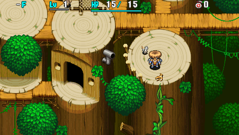
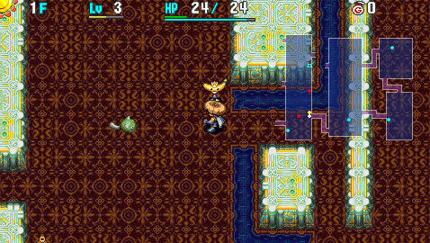
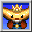

  

Dungeon where Banana Prince is a mandatory ally, and you progress through the dungeon as a team. The first clear is only 30F, so it's one of the easiest postgame dungeons to obtain a clear icon.

The second clear is 99F and is still easier than dungeons like Bayside Monster Cave or Ceiling Cave, but requires different strategies since you get a game over if Banana Prince collapses. ※ It's possible to request a rescue if Banana Prince collapses.

The clear reward is Sturdy Hammer, which is only given to you on the first clear. The level 1 version of this item is used in a side quest, so don't level it or synthesize it right away.

<ul class="quickLinksUL">
  <li><a href="#overview">Overview</a></li>
  <li><a href="#strategy">Strategy</a></li>
  <li><a href="#floor-guide">Floor Guide</a></li>
  <li><a href="#monsters">Monsters</a></li>
  <li><a href="#items">Items</a></li>
  <li><a href="#traps">Traps</a></li>
</ul>

# Overview

<table class="dungeonOverview">
  <tr>
    <th>Unlock</th>
    <td class="highlightYellow">Slip on a banana peel in Monkey Village after clearing the main story.</td>
  </tr>
  <tr>
    <th>Entrance</th>
    <td class="highlightYellow">Monkey Village (Check banana peel)</td>
  </tr>
</table>

<table class="dungeonTable">
  <tr>
    <th>Floors</th>
    <td>30F (first) / 99F</td>
    <th>Day / Night</th>
    <td>Both</td>
  </tr>
  <tr>
    <th>Bring Items</th>
    <td>No</td>
    <th>Allies</th>
    <td>Banana Prince</td>
  </tr>
  <tr>
    <th>Unidentified</th>
    <td colspan="3">None</td>
  </tr>
  <tr>
    <th>Shops</th>
    <td>Regular, Elite</td>
    <th>Monster Houses</th>
    <td>Regular</td>
  </tr>
  <tr>
    <th>Initial Enemies</th>
    <td>8~9</td>
    <th>Spawn Rate</th>
    <td>30</td>
  </tr>
  <tr>
    <th>Day Turns</th>
    <td>810 (713)</td>
    <th>Night Turns</th>
    <td>268 (236)</td>
  </tr>
  <tr>
    <th>Ominous aura</th>
    <td>No</td>
    <th>Winds of Kron</th>
    <td>1st: 1700 / 4th: 2000</td>
  </tr>
  <tr>
    <th>Clear Icon</th>
    <td class="clearIcon"></td>
    <th>Clear Bonus</th>
    <td>30,000,000</td>
  </tr>
  <tr>
    <th>Reward</th>
    <td colspan="3">Sturdy Hammer (1st clear)</td>
  </tr>
</table>

※ Numbers in () for day and night turns is when the warning is displayed.

# Strategy

<ul class="quickLinksUL">
  <li><a href="#general">General</a></li>
  <li><a href="#banana-prince">Banana Prince</a></li>
  <li><a href="#bana-powers">Bana Powers</a></li>
  <li><a href="#equipment">Equipment</a></li>
  <li><a href="#other-items">Other Items</a></li>
</ul>

### General

Mixergon on 49-51F is the only appearance of Mixer types, so equipment is hard to upgrade. Therefore, you'll want to make effective use of Banana Prince to have 2 vs 1 fights against monsters.

The adventure results in failure if Banana Prince collapses, so always keep an eye on him. There may be situations where you have to act as a wall and receive attacks to protect Banana Prince. Beware of fire and explosion damage in particular, as they turn Banana Prince into a Grilled Banana. ※ Firepuff and Explochin are the only monsters with fire or explosion damage here.

Daytime lasts a long time (810 turns), while nighttime is very short (268 turns). There are generally lots of bananas on the ground, so you're unlikely to struggle with hunger.

### Banana Prince

#### Characteristics

Banana Prince has a maximum level of 10, similar to other allies. His AI prioritizes following Shiren when Shiren is in view, though there might be some exceptions. When Shiren isn't in view, Banana Prince will begin wandering around the floor on his own. He generally won't use Bana Powers in this case, so he's far more likely to collapse when separated.

He'll try to defeat enemies during the day, and will use Bana Powers when an enemy is in range. If multiple enemies are adjacent to him, Banana Prince's target will be selected randomly. He usually avoids targeting enemies with Napping, Paralyzed, or Decoy statuses.

Banana Prince follows you to the next floor if you descend stairs even when he's in a different room. Attraction Scroll always warps Banana Prince to you, making it an excellent counter to becoming separated.

Projectiles and thrown items aimed at Banana Prince will never miss. This can be used to your advantage by making talismans far more reliable.

#### HP System

Banana Prince has a damage count based HP system instead of regular HP system. Getting hit by Weeds (2 damage) or high value blessed Gitan (999 damage) is the same thing for him, as in either case, it counts as 1 damage toward lowering in quality.

Banana Prince turns brown after getting hit 4 times, and turns black after another 4 hits. Finally, he'll collapse after getting hit 4 times when his body color is black. So if you count lowering in quality as 1 HP worth of damage, he has a total of 12 HP.

His HP is fully restored when he gets hit by a Banana Peel or any banana (excluding sealed ones). It's most cost effective to throw Banana Peels or Spoiled Bananas.

Other HP restoring methods:

- Absorb Status (Bana Power) - Heals bruising by 1 stage.
- Lv2+ Banana Novice type special attack - Fully restores HP.
- Banana Trap - Fully restores HP. (Requires Tiger Tosser or throwing a pot with items inside)

#### Weaknesses

Banana Prince turns into a Grilled Banana and instantly collapses if he receives fire or explosion damage. Similarly, getting splashed by water turns him into a Spoiled Banana and makes him instantly collapse. It's extremely important to use caution when you're around monsters or items that can cause these effects.

Some examples:

- Flame Shot (Weapon rune)
- Dragon Grass
- Water Pot or Oil Pot
- Land on a water tile

### Bana Powers

See [Bana Powers](/system/bana-powers) for details and recommended sets.

Bana Power activation conditions:

1. Banana Prince doesn't move during that turn.
2. Banana Prince is adjacent to Shiren when he is in view.
3. A target is in range of at least 1 Bana Power in the assigned set.

Examples:

- Set [1: Frightener, 2: Paralyzer, 3: Poison Grass, 4: Tosser Toss], adjacent to Shiren and a monster. Conditions are met for all 4 powers, so all 4 powers are used during that turn. ※ If the monster is defeated midway, Banana Prince will stop using Bana Powers. 　
- Set [1: Frightener, 2: Paralyzer, 3: Poison Grass, 4: Tosser Toss], adjacent to Shiren, monster within 10 tiles. Conditions are met for 3: Poison Grass, so Banana Prince throws Poison Grass during that turn. ※ Other Bana Powers don't activate. 　
- Set [1: Tosser Toss, 2: Paralyzer, 3: Poison Grass, 4: Frightener], adjacent to Shiren and a monster. Conditions are met for all 4 powers, so Banana Prince first throws the adjacent monster. However, if the thrown monster lands somewhere where it's no longer adjacent to Banana Prince, the remaining Bana Powers won't activate.

So basically, long range Bana Powers generally have more chances to activate than close range powers. Lastly, Bana Power activation rate when conditions are met is thought to be around 20\~30%.

### Equipment

#### Weapon

Only weapons with innate runes can be found on the floor, and type effective weapons are excluded. Basic and type effective weapons can only be obtained from shops or night monster drops.

<ul>
  <li>Nap Rattle, Shockuto
    <ul>
      <li>Low rune slots, but powerful effect.</li>
      <li>Synthesis can't be done without a Synthesis Pot before 49F, so use it as-is for the 1st clear.</li>
      <li>It's probably better to choose a weapon that has more rune slots for the 2nd clear.</li>
    </ul>
  </li>
  <li>Baffle Axe, Blurry Stick
    <ul>
      <li>High rune slots, and fast growth rate. (Blurry Stick is basically a worse Baffle Axe)</li>
      <li>Solid main weapon for the 2nd clear, especially if you have Bana Powers to support Shiren.</li>
      <li>Be warned that you're more likely to defeat Banana Prince if you go berserk with status weapons, so it's best to unequip your weapon on floors where MC Wizard and Bored Kappa types appear.</li>
    </ul>
  </li>
  <li>Burning Blade
    <ul>
      <li>Dangerous weapon that has the potential to turn Banana Prince into a Grilled Banana.</li>
      <li>However, if Banana Prince knows Healing Light, you have infinite use of Flame Shot, and it gains Anti-Bomb at Lv8 to help counter Explochin types.</li>
    </ul>
  </li>
  <li>Rusty Pickaxe, Rusty Pick
    <ul>
      <li>Use these as a secondary weapon to create a safe spot to pass time during the night.</li>
      <li>Not recommended to use as a main weapon.</li>
    </ul>
  </li>
  <li>Dotanuki, Beast Fang
    <ul>
      <li>Obtained from a shop or night monster drop.</li>
      <li>2 bracelet resonance isn't too important, but these are decent options if synthesis goes well.</li>
    </ul>
  </li>
  <li>Katana
    <ul>
      <li>Don't bother maining Katana or other weaker basic weapons.</li>
    </ul>
  </li>
  <li>Type Effective Weapons
    <ul>
      <li>Obtained from a shop or night monster drop.</li>
      <li>Drain Slicer is great against Absorbiphant types who can be problematic for Banana Prince.</li>
      <li>Otherwise: Water Cutter &ge; Myopic Masher &gt; Lizard Lasher &gt; Sky Splitter &gt; Crescent Katana.</li>
    </ul>
  </li>
  <li>Hatchet
    <ul>
      <li>Obtained from a shop or night monster drop.</li>
      <li>Generally better as a rune, but it's fine to main it since synthesis is difficult in this dungeon.</li>
    </ul>
  </li>
</ul>

#### Runes

See [Runes](/system/synthesis-runes) for details.

<table>
  <thead>
    <tr>
      <th>Priority</th>
      <th>Runes</th>
    </tr>
  </thead>
  <tbody>
    <tr>
      <td class="highlightRed">Top</td>
      <td>Sedating, Paralyzing, Critical</td>
    </tr>
    <tr>
      <td class="highlightPink">High</td>
      <td>Anti-Drain, Anti-Floating, Anti-Aquatic</td>
    </tr>
    <tr>
      <td class="highlightYellow">Mid</td>
      <td>Confusing, Blinding, Anti-Cyclops</td>
    </tr>
    <tr>
      <td class="highlightLightblue">Low</td>
      <td>Anti-Dragon, Anti-Bomb, Sealing</td>
    </tr>
    <tr>
      <td class="highlightGray">Avoid</td>
      <td>Wall Dig, 2 Tile Dig</td>
    </tr>
  </tbody>
</table>

#### Shield

The selection of shields found on the floor is limited, so there usually aren't many main shield options. Most higher quality shields are obtained from shops or night monster drops.

<ul>
  <li>Beast Shield
    <ul>
      <li>Probably the best main shield for this dungeon, unless you're using a Dotanuki.</li>
      <li>Note that it doesn't gain Rustproof from leveling up.</li>
    </ul>
  </li>
  <li>Clan Shield
    <ul>
      <li>Likely the 2nd best main shield after Beast Shield - Choose this if you're using Dotanuki.</li>
      <li>It gains Rustproof at Lv5, so some players prefer it over Beast Shield despite lower defense.</li>
    </ul>
  </li>
  <li>Iron Targe, Copper Guard, Palm Shield
    <ul>
      <li>Switch to a stronger shield instead of using these as a main shield.</li>
    </ul>
  </li>
  <li>Blast Shield
    <ul>
      <li>Obtained from a shop or night monster drop.</li>
      <li>Landmines and Pop Tanks don't appear here, so 1/2 Blast is only useful against Explochins.</li>
      <li>It's great as a rune, but there isn't much reason to use it as a main shield.</li>
    </ul>
  </li>
  <li>Diet Shield
    <ul>
      <li>Obtained from a shop or night monster drop.</li>
      <li>Bananas are common, so it's not as high of a priority compared to other dungeons.</li>
    </ul>
  </li>
  <li>Lizard Shield
    <ul>
      <li>Obtained from a shop or night monster drop.</li>
      <li>Dragons don't appear in this dungeon, so 1/2 Fire is only useful against Firepuffs.</li>
      <li>It gains Counter at Lv8, which helps against Gitan Mamels.</li>
    </ul>
  </li>
  <li>Lamp Shield
    <ul>
      <li>Can be found on the floor in addition to shops.</li>
      <li>Its powerful resonance effect with torches makes it far safer to explore at night.</li>
    </ul>
  </li>
  <li>Steady Shield
    <ul>
      <li>Obtained from a shop or night monster drop.</li>
      <li>Helps against Fearabbit types, and prevents becoming separated by springs.</li>
      <li>It's fine to synthesize it into your main shield, since you want to stay close to Banana Prince.</li>
    </ul>
  </li>
  <li>Swap Shield
    <ul>
      <li>Obtained from a shop or night monster drop.</li>
      <li>Counters DJ Mage types, and lets you act as a wall against magic bullets.</li>
      <li>Not a bad main shield option if you're using Burning Blade.</li>
    </ul>
  </li>
</ul>

#### Runes

See [Runes](/system/synthesis-runes) for details.

<table>
  <thead>
    <tr>
      <th>Priority</th>
      <th>Runes</th>
    </tr>
  </thead>
  <tbody>
    <tr>
      <td class="highlightRed">Top</td>
      <td>1/2 Blast, 1/2 Hunger, Magic Damage</td>
    </tr>
    <tr>
      <td class="highlightPink">High</td>
      <td>Rustproof, Unmoving</td>
    </tr>
    <tr>
      <td class="highlightYellow">Mid</td>
      <td>1/2 Fire</td>
    </tr>
  </tbody>
</table>

#### Bracelets

There are fewer types of bracelets in the item table compared to other dungeons.

<ul>
  <li>Alert Bracelet
    <ul>
      <li>Nice to keep equipped in case you step on a Sleep Trap, and makes Dozikons a non-issue.</li>
      <li>Its resonance effect with Nap Rattle raises the chance to inflict Asleep status.</li>
    </ul>
  </li>
  <li>Calm Bracelet
    <ul>
      <li>Effective against Dazikons, along with MC Mage to some degree.</li>
      <li>Its resonance effect with Baffle Axe raises the chance to inflict Confused status.</li>
    </ul>
  </li>
  <li>Cleansing Bracelet
    <ul>
      <li>Nice to have when fighting Mutaikons and Scorpion types.</li>
      <li>If Banana Prince knows Poison Grass, you can eat missed throws to replenish fullness.</li>
      <li>Don't equip it on Mesmerikon floors - Shiren getting slowed gives Banana Prince a chance to survive.</li>
    </ul>
  </li>
  <li>Staunch Bracelet
    <ul>
      <li>Nice for MC Sorcerer and higher level Scorpion floors, as opposed to Spin Polygon types.</li>
      <li>Probably not worth taking up an inventory slot unless you're near said floor ranges.</li>
    </ul>
  </li>
  <li>Pierce Bracelet
    <ul>
      <li>Lets you snipe Mesmerikons using arrows before they get within Rage Grass throwing range.</li>
      <li>It's probably fine to discard it early game, but try to keep it on hand from mid game onward.</li>
    </ul>
  </li>
  <li>Item Detector
    <ul>
      <li>Reduces time spent checking rooms for items, and gives you a rough idea of the floor's layout.</li>
      <li>Sudden and Re-entry style Monster Houses never get generated in Banana Kingdom, so this bracelet informs you of any Monster Houses with 100% certainty.</li>
    </ul>
  </li>
  <li>Monster Detector
    <ul>
      <li>Obtained from Elite Shops.</li>
      <li>Makes exploring at night far safer, but don't count on obtaining it.</li>
    </ul>
  </li>
</ul>

### Other Items

Items are generally used similarly to other dungeons, but some have extra uses related to Banana Prince.

#### Pots

Storage Pots are somewhat rare, so it's important to use other pots like Purify Pot to store items. You can restore Banana Prince's HP by luring him onto a Banana Trap and throwing a pot containing an item.

- Synthesis Pot
    - Extremely valuable - Prioritize synthesizing runes instead of upgrade value.

#### Scrolls

- Attraction Scroll
    - Warps Banana Prince to you if you became separated - Keep at least 1 on hand at all times.
    - Recover from Spring, Log Trap, DJ Mage types, Yanpii types, Fearabbit types, etc.
- Night-Day Scroll
    - Ace card to escape a dire situation - Try to keep multiple on hand at all times.
    - Also used to adjust time of day on some of the notoriously dangerous late game floors.
- Extinction Scroll
    - Choose between Mesmerikon (96-99F) during the day, or Dark Terrabbit (94-99F) at night.
- Sanctuary Scroll
    - Slightly lackluster since it doesn't protect Banana Prince when you place it down.
    - It only vanishes if Shiren steps on it again, so you can lure Banana Prince onto it to keep him safe.

#### Staves

You don't want to become separated from Banana Prince, so movement type staves are a lower priority.

- Unlucky Staff
    - Try to keep at least 1\~2 on hand at all times.
    - Counters Spongiderms and Osmammoths that powered up from Bana Powers like Room Ink Squirt.
- Swift Staff
    - Swing it at Banana Prince to boost his action speed and quickly clear out enemies.

#### Talismans

Projectiles aimed at Banana Prince never miss, so throw talismans at him to guarantee activation. This technique is particularly effective against Pumphantasms inside walls and such.

- Miss Talisman
    - Great if you become surrounded by power type monsters that only use direct attacks.
    - If Banana Prince knows Remedy, he'll cure his own Innacurate status.
- Fear Talisman
    - Afraid status prevents monsters from using their special attack.
    - Be careful not to get hit by Banana Prince if you have a Bana Power set that powers him up.
- Dizzy Talisman
    - Confused status has a longer duration compared to other talismans.
    - Extremely risky to throw at Banana Prince if you have a Bana Power set that powers him up.

#### Grass

Herb, Otogiriso, Heal Grass, and Life Grass are quite rare compared to other dungeons, meaning negative effects are more common - Keep that in mind if a Bored Kappa is standing on a grass item.

- Rage Grass
    - Somewhat common on the floor.
    - Shiren or Banana Prince can easily end up defeating each other if they go berserk.
    - It's best to dispose of it by throwing it at a monster on floors where Bored Kappa types appear.
- Dragon Grass
    - Never eat it while facing Banana Prince, and don't carry it outside of pots on Gazer floors.
    - It's a decent synthesis ingredient, so it's fine to carry it in a pot.
- Poison Grass
    - Quite common on the floor.
    - Throw it at a monster to inflict Slow status, eat it and have Banana Prince absorb status, etc.

#### Projectiles

Arrows can't be found on the floor, and Boy Carts don't appear, so arrows can only be obtained from traps. Therefore, you'll usually end up with rock type items for projectiles.

- Rock, Porky Rock
    - Rocks are more common until around 20F, and then Porky Rocks become more common.
    - Particularly effective against higher level Absorbiphant and Mamel types.
- Poison Arrow
    - Poison Arrow Trap can be generated on Traproid (19-21F) floors.
    - Effective against power type monsters.
- Iron Arrow
    - Iron Arrow Trap can be generated earlier on in the dungeon.
    - Recommended to save them for higher level Absorbiphant types.
- Bomb Rock
    - Obtained from a shop or night monster drop.
    - Be careful not to grill Banana Prince if you throw it - It's best used as a synthesis ingredient.

# Floor Guide

#### First Clear

### 1-4F

Day: Seedie (1-3F), Pit Mamel (1-4F), Banana Novice (2-5F), Squid King (2-5F), Blade Bee (3-8F) Night: Dark Foly (1-3F), Dark Bored Kappa (4-6F), etc.

Easy floor range, though Pit Mamel can be slightly tough when you're level 1. If you find the items for it, create a Cave Mamel or Gitan Mamel and defeat it to level up.

If possible, level up a Squid King and have Banana Prince learn Area Ink Squirt or Room Ink Squirt.

### 5-7F

Day: Field Knave (5-7F), DJ Mage (6-8F), Mid Chintala (6-10F), etc. Night: Dark Bored Kappa (4-6F), Dark Squid King (6-8F), Evil Hopodile (7-9F), etc.

DJ Mage's magic can warp a target, which can cause accidents if Banana Prince hasn't leveled up. That said, Banana Prince can learn Novice Magic from DJ Mage, which is useful at night. ※ Erase the daytime slot for Novice Magic after learning it.

Field Knave can appear between 5-7F, so check rooms for items quickly.

### 8-13F

Day: Absorbiphant (8-10F), Gazer (9-11F), Scorpion (9-13F), Curse Girl (11-13F), Zalokleft (11-13F), etc. Night: Dark Absorbiphant (8-12F), Foul Morph (9-11F), Dark Flash Bird (11-13F), etc.

Absorbiphant appears both day and night, so be careful if you have Bana Powers that inflict status conditions. Go ahead and learn Absorb Status if you want to build a Bana Power set that powers up Banana Prince. If Banana Prince isn't strong enough to defeat them in one hit, it's best to have Shiren fight them. Lv1 Absorbiphants don't gain a defense boost when absorbing statuses, so it shouldn't be too bad.

Hunt Zaloklefts between 11-13F for items, but watch out for Curse Girls, Gazers, and Slimes (12-14F). It's best to have Banana Prince fight all of the above monsters to avoid losing or degrading items.

### 14-18F

Day: Tiger Tosser (13-17F), Mutaikon (14-16F), Dagger Bee (14-19F), Fearabbit (15-17F), Yanpii (16-18F), etc. Night: Evil Porky (13-15F), Dark Zapdon (13-17F), Foul Curse Girl (16-18F), Dark Kappa Pest (17-21F), etc.

Mutaikon appears, so learn Poison Grass if you don't have a Bana Power that inflicts a status condition. If Banana Prince knows Restore Attack, you can conserve bananas by eating Poison Grass.

Fearabbit and Yanpii can make you become separated from Banana Prince with their special attacks. It's best to lock your Bana Powers to avoid learning Rush and Floor Magnet from these monsters. ※ Some players like to assign Floor Magnet to a night Bana Power set.

### 19-22F

Day: Zapdon (18-22F), Pumphantasm (18-23F), Traproid (19-21F), Kengo (20-22F), Gyaza (20-25F), etc. Night: Dark Kappa Pest (17-21F), Evil Dance Polygon (20-22F), Dark DJ Mage (21-23F), etc.

Pumphantasm's ability to attack from inside walls can be a problem in hallways. Throw a talisman at Banana Prince when Pumphantasm is adjacent to him if it gets too annoying.

Traproid can create Poison Arrow Traps, so linger and collect Poison Arrows if possible. The chance for Poison Arrow Trap to be selected is quite low, so don't feel bad if you don't get any arrows. Step on a Revitalize Trap to wake up Traproids around the floor instead of trying to lure an adjacent Traproid.

Kengo easily causes shield loss - Banana Prince cannot dodge your shield if it flies at him. To reiterate the point, unlike Shiren 5, allies and NPCs are not guaranteed to dodge flying equipment. Don't give up if it happens - It's not a huge loss if your shield didn't have any innate abilities or runes. All said, it's best to have Banana Prince fight Kengos to be safe, especially in hallways.

Gyaza has enough defense where even a Lv10 Banana Prince can't one-shot it with a direct attack. If you have a Bana Power set that lacks damage dealing powers, you'll quickly burn through bananas, so be sure to attack as a team instead of leaving Banana Prince to fight them alone.

Level up a Squid Lord (22-24F) to have Banana Prince learn Room Ink Squirt if you haven't done so yet.

### 23-27F

Day: Gyaza (20-25F), Go Ham (23-25F), Hipadile (23-27F), Dazikon (25-27F), Curse Sister (26-28F), etc. Night: Vile Grime (23-25F), Dark Pandanigiri (22-26F), Snide Froggucci (24-26F), Dark Hurler (24-29F), etc.

Lots of power type monsters appear, including Gyaza, Hipadile, Big Chintala (24-28F), and Eligan (26-30F). Go Ham boosts attack power by 2 stages, so be careful if one is adjacent to a power type monster.

Snide Froggucci drops blessed Gitan, which can be used as a powerful projectile. It's worth lingering to collect Gitan - Dark Pandanigiri can drop Onigiri, so hunger shouldn't be an issue. However, Dark Hurler can cause accidents if you wander around in search of Snide Frogguccis, so it's best to pick a safe spot and cycle to daytime instead.

### 28-30F

Day: Foly2 (28-30F), Eligan (26-30F), Banana Morph (28-30F), Digestiphant (29-31F), Concusschin (29-32F), etc. Night: Dark Hurler (24-29F), Foul Curse Sister (29-31F), Evil Flamepuff (30-34F), Evil Super Gazer (30-32F), etc.

Concusschin's explosion will one-shot Banana Prince if he hasn't used Icy Cold on the current floor yet. If Banana Prince doesn't know Icy Cold, DO NOT let him fight Concusschins.

Beware of Digestiphant if Banana Prince has a Bana Power set with lots of status inflicting powers. Digestiphants gain an attack boost (2 stages) each time they absorb a status condition, so their attack power can quickly get out of hand if they gain multiple boosts.

Foly2 can also be a problem in large rooms, so keep some scrolls on hand.

It's recommended to check for traps on these floors to avoid the risk of stepping on a Summon Trap. It's easier to progress at night, but be careful of Evil Flamepuff who can one-shot Banana Prince with its fire. This dungeon doesn't have a boss fight, so use up all of your items if you're aiming for the 1st clear.

#### Second Clear

### 31-36F

Day: Concusschin (29-32F), MC Mage (31-33F), Scarabbit (33-35F), Kappa Pest (34-36F), Tiger Hurler (34-36F), etc. Night: Evil Flamepuff (30-34F), Evil Super Gazer (30-32F), Dark Dazikon (32-34F), Dark Pot Knave (34-36F), etc.

Continue to be careful of Concusschin (29-32F) during the day and Evil Flamepuff (30-34F) at night.

MC Mage's Transient, Blind, and Confused effects can all cause accidents if Banana Prince gets hit. Scarabbit can cause you to become separated from Banana Prince in rooms, so use the Scout command. The Kappa Pest and Dark Pot Knave combo on 34-36F makes obtaining floor items difficult.

### 37-41F

Day: Steamroid (37-40F), Cave Mamel (37-41F), Porko (37-42F), Iai (39-41F), Killer Gyaza (40-45F), etc. Night: Dark Glare Bird (38-40F), Bad Sr. Yanpii (39-43F), Dark Vexing Kappa (41-43F), etc.

Cave Mamel resists direct attacks, so throw a rock instead of letting Banana Prince fight it. Fight Killer Gyaza as a team unless your HP is getting low, and keep an eye on remaining bananas. Porko and Iai are particularly dangerous in hallways, so it might be better to rush stairs.

Night is probably safer since there's no risk of equipment loss, but it's still on the dangerous side. Bad Sr. Yanpii's headbutt can cause you to become separated from Banana Prince at night, and Dark Kappa Pest can cause accidents if it throws a troublesome item like Rage Grass.

### 42-48F

Day: Killer Gyaza (40-45F), Blazepuff (42-44F), Lt. Yanpii (42-47F), Spongiderm (46-50F), Curse Mom (47-49F), etc. Night: Dark Scarabbit (43-45F), Dark MC Mage (44-46F), Evil Oingodile (45-49F), Dark Item Knave (47-49F), etc.

Blazepuff (42-44F) can one-shot Banana Prince if he hasn't used Icy Cold on the current floor yet. Keep in mind that Blazepuff can blow fire through hallway corners, so be careful of your positioning. Lt. Yanpii can make you become separated from Banana Prince, so use the Scout command in rooms.

Watch out for Spongiderms if Banana Prince knows status inflicting Bana Powers. Absorbing a status boosts both attack and defense (1 stage) - Use Unlucky Staff if it gained multiple boosts. Other options include rocks, Gitan, Heal Pot, and unequipping your weapon if it's a status weapon.

Mixergon is coming up soon, so do your best to avoid getting equipment cursed by Curse Mom.

Night is extremely dangerous between 43-46F due to Dark Scarabbit and Dark MC Mage. Dark MC Mage can inflict Berserk status from a distance, ending with Shiren defeating Banana Prince. It's probably safer to progress during the day even if you have a Steady Shield.

### 49-51F

Day: Spongiderm (46-50F), Curse Mom (47-49F), Mixergon (49-51F), Ooze (50-54F), Tiger Chucker (50-53F), etc. Night: Dark Onigirizzly (46-49F), Evil Jouncy (49-51F), Evil Sing Polygon (50-52F), Dark Steamroid (51-56F), etc.

Synthesize items using Mixergon - Depending on Synthesis Pot luck, this may be your first and last chance. Some players rush to 51F before synthesizing to avoid Spongiderms, but waiting until the last floor could cause you to miss out on synthesis opportunities if you're unlucky with Mixergon spawns.

Prioritize Antidote Grass (Anti-Drain) for Absorbiphants, and Desert Scroll (Anti-Aquatic) for Gyazas. Status inflicting runes are also great. Otherwise, synthesize whatever you have on hand.

### 52-57F

Day: Ooze (50-54F), Squid Emperor (52-54F), Pyrepuff (54-57F), Banana Boss (55-60F), Hyper Gazer (56-58F), etc. Night: Bad Iron Zalokleft (52-54F), Plump Munchy (53-55F), Evil Blazepuff (56-58F), etc.

Squid Emperor can inflict Blind status on both Shiren and Banana Prince from anywhere in the room. Attraction and Medicine scrolls can't be read while blind, so it's hard to help Banana Prince if it happens. One method to stick together is to continuously switch places with Banana Prince until it wears off. To make matters worse, Pyrepuff overlaps with Squid Emperor on 54F, so hurry to the stairs.

Night between 52-55F is safer, so hunt Bad Iron Zalokleft and Plump Munchy for items if desired. However, night only lasts 268 turns and daytime is dangerous, so don't push it too much.

### 58-63F

Day: Fulminachin (58-60F), Oingodile (57-62F), Gigahead (58-64F), MC Wizard (59-61F), Porkon (61-63F), etc. Night: Dark Gigahead (57-62F), Dark Twinkle Bird (62-64F), Bad Lt. Yanpii (63-65F), etc.

Lots of dangerous daytime floor ranges in a row between Fulminachin, MC Wizard, and Porkon. Remember that you can throw a talisman at Banana Prince if a troublesome enemy is adjacent to him. MC Wizard in particular can easily end a run if it inflicts Shiren with Berserk status, so don't let it act. Consider unequipping your weapon if you have lots of status runes or Flame Shot.

Dark Gigahead is scary at night if you don't have a Super Torch, but otherwise it's safer than daytime.

### 64-68F

Day: Pumpanshee (63-67F), Jouncy (64-66F), Boss Yanpii (65-70F), Horrabbit (66-68F), Item Knave (67-69F), etc. Night: Bad Lt. Yanpii (63-65F), Vile Ooze (65-69F), Dark Spongiderm (66-68F), etc.

Cycle to night before descending the stairs on 65F to avoid Horrabbit as much as possible. Alternatively, have a group of Jouncy launch you on 65F to hopefully skip past most Horrabbit floors. Use Navigation Scrolls if you have them, and a Night-Day Scroll if it changes to daytime.

Item Knave and Gyandora (68-72F) can wreck your inventory, and Boss Yanpii has ridiculous attack power, so it's very important to progress during the night instead of wandering around during the day.

### 69-81F

Day: Dozikon (70-72F), Detonachin (73-77F), MC Sorcerer (78-81F), Osmammoth (79-82F), etc. Night: Dark Gitan Mamel (72-77F), Vile Pumpanshee (75-77F), Dark Kappa Troll (77-79F), etc.

Another wave of dangerous floors starting on 70F, so just rush stairs. The Poison Grass Bana Power is ineffective against Dozikon and Vexing Kappa (70-72F). Have Banana Prince fight Gyandora, Curse Gramma, and Shihan to avoid losing items. MC Sorcerer's magic isn't too much of a problem for Banana Prince aside from leveling down by 3.

Kleptoad (74-76F) overlaps with Dark Gitan Mamel, so be careful if time of day changes. Likewise, Dark Kappa Troll overlaps with Dark Gitan Mamel on 77F, so it might throw blessed Gitan. It'd be good to stock up on high value Gitan to use as a projectile against Osmammoth.

Evil Fulminachin (80-82F) and Evil Pyrepuff (81-86F) can one-shot Banana Prince at night. Dark Ace (78-83F) can potentially throw them at Banana Prince, so don't let your guard down.

### 82-89F

Day: Kappa Troll (82-84F), Banana Master (83-86F), Pumptergeist (85-87F), Porgon (87-89F), etc. Night: Evil Pyrepuff (81-86F), Dark Ace (78-83F), Dark Shine Bird (85-87F), Dark MC Sorcerer (87-89F), etc.

Kappa Troll throws items from anywhere on the floor, which can be bad if it's Gitan or a talisman. Pumptergeist and Flashdon (85-90F) have high attack and are particularly dangerous in hallways. Porgon is quite a threat if Banana Prince doesn't know Healing Light, but otherwise it's not a big deal. Shine Bird (87-99F) makes it hard to defeat monsters - Team up with Banana Prince instead of retreating.

### 90-99F

Day: Shine Bird (87-99F), Squid Kaiser (93-95F), Mesmerikon (96-99F), Gitan Mamel (95-99F), etc. Night: Dark Osmammoth (89-91F), Dark Mesmerikon (91-93F), Dark Terrabbit (94-99F), etc.

Cycle to daytime before descending the stairs on 90F to avoid Dark Mesmerikon. Dark Mesmerikon only appears for 3 floors, so you can usually make it to 94F before it changes to night.

Squid Kaiser can blind Shiren and Banana Prince from anywhere in the room. Don't hesitate to use scrolls or staves, and have Shiren fight if Banana Prince knows Absorb Status.

Dark Terrabbit appears at night from 94-99F, and Mesmerikon during the day from 96-99F. If you have a Steady Shield and Super Toches, it's safer to progress during night. Mesmerikon throws Rage Grass within 5 tiles - Use Navigation Scrolls and Pierce Bracelet to snipe them. If you found a Blank Scroll, throw an Extinction Scroll at one or the other depending on your inventory.

# Monsters

See [Monsters](/system/monsters) for individual monster details.

Enemy Colors: Day Night

<table class="monsterTable">
  <thead>
    <tr>
      <th>F</th>
      <th colspan="6">Monsters</th>
    </tr>
  </thead>
  <tbody>
    <tr>
      <th rowspan="2">1</th>
      <td class="monsterDay">Seedie</td>
      <td class="monsterDay">Pit Mamel</td>
      <td class="highlightGray"></td>
      <td class="highlightGray"></td>
      <td class="highlightGray"></td>
      <td class="highlightGray"></td>
    </tr>
    <tr>
      <td class="monsterNight">Dark Foly</td>
      <td class="monsterNight">Dark Seedie</td>
      <td class="highlightGray"></td>
      <td class="highlightGray"></td>
      <td class="highlightGray"></td>
      <td class="highlightGray"></td>
    </tr>
    <tr>
      <th rowspan="2">2</th>
      <td class="monsterDay">Seedie</td>
      <td class="monsterDay">Pit Mamel</td>
      <td class="monsterDay">Banana Novice</td>
      <td class="monsterDay">Squid King</td>
      <td class="highlightGray"></td>
      <td class="highlightGray"></td>
    </tr>
    <tr>
      <td class="monsterNight">Dark Foly</td>
      <td class="monsterNight">Dark Seedie</td>
      <td class="highlightGray"></td>
      <td class="highlightGray"></td>
      <td class="highlightGray"></td>
      <td class="highlightGray"></td>
    </tr>
    <tr>
      <th rowspan="2">3</th>
      <td class="monsterDay">Seedie</td>
      <td class="monsterDay">Pit Mamel</td>
      <td class="monsterDay">Banana Novice</td>
      <td class="monsterDay">Squid King</td>
      <td class="monsterDay">Blade Bee</td>
      <td class="highlightGray"></td>
    </tr>
    <tr>
      <td class="monsterNight">Dark Foly</td>
      <td class="monsterNight">Dark Seedie</td>
      <td class="monsterNight">Dark Mamel</td>
      <td class="highlightGray"></td>
      <td class="highlightGray"></td>
      <td class="highlightGray"></td>
    </tr>
    <tr>
      <th rowspan="2">4</th>
      <td class="highlightGray"></td>
      <td class="monsterDay">Pit Mamel</td>
      <td class="monsterDay">Banana Novice</td>
      <td class="monsterDay">Squid King</td>
      <td class="monsterDay">Blade Bee</td>
      <td class="highlightGray"></td>
    </tr>
    <tr>
      <td class="monsterNight">Evil Chintala</td>
      <td class="monsterNight">Dark Seedie</td>
      <td class="monsterNight">Dark Mamel</td>
      <td class="monsterNight">Dark Bored Kappa</td>
      <td class="highlightGray"></td>
      <td class="highlightGray"></td>
    </tr>
    <tr>
      <th rowspan="2">5</th>
      <td class="monsterDay">Field Knave</td>
      <td class="highlightGray"></td>
      <td class="monsterDay">Banana Novice</td>
      <td class="monsterDay">Squid King</td>
      <td class="monsterDay">Blade Bee</td>
      <td class="highlightGray"></td>
    </tr>
    <tr>
      <td class="monsterNight">Evil Chintala</td>
      <td class="highlightGray"></td>
      <td class="monsterNight">Dark Mamel</td>
      <td class="monsterNight">Dark Bored Kappa</td>
      <td class="highlightGray"></td>
      <td class="highlightGray"></td>
    </tr>
    <tr>
      <th rowspan="2">6</th>
      <td class="monsterDay">Field Knave</td>
      <td class="monsterDay">DJ Mage</td>
      <td class="monsterDay">Mid Chintala</td>
      <td class="highlightGray"></td>
      <td class="monsterDay">Blade Bee</td>
      <td class="highlightGray"></td>
    </tr>
    <tr>
      <td class="monsterNight">Evil Chintala</td>
      <td class="monsterNight">Dark Squid King</td>
      <td class="monsterNight">Dark Mamel</td>
      <td class="monsterNight">Dark Bored Kappa</td>
      <td class="highlightGray"></td>
      <td class="highlightGray"></td>
    </tr>
    <tr>
      <th rowspan="2">7</th>
      <td class="monsterDay">Field Knave</td>
      <td class="monsterDay">DJ Mage</td>
      <td class="monsterDay">Mid Chintala</td>
      <td class="highlightGray"></td>
      <td class="monsterDay">Blade Bee</td>
      <td class="highlightGray"></td>
    </tr>
    <tr>
      <td class="monsterNight">Evil Chintala</td>
      <td class="monsterNight">Dark Squid King</td>
      <td class="monsterNight">Dark Mamel</td>
      <td class="monsterNight">Evil Hopodile</td>
      <td class="highlightGray"></td>
      <td class="highlightGray"></td>
    </tr>
    <tr>
      <th rowspan="2">8</th>
      <td class="monsterDay">Absorbiphant</td>
      <td class="monsterDay">DJ Mage</td>
      <td class="monsterDay">Mid Chintala</td>
      <td class="monsterDay">Ironhead</td>
      <td class="monsterDay">Blade Bee</td>
      <td class="highlightGray"></td>
    </tr>
    <tr>
      <td class="monsterNight">Dark Absorbiphant</td>
      <td class="monsterNight">Dark Squid King</td>
      <td class="monsterNight">Bad Crow Tengu</td>
      <td class="monsterNight">Evil Hopodile</td>
      <td class="highlightGray"></td>
      <td class="highlightGray"></td>
    </tr>
    <tr>
      <th rowspan="2">9</th>
      <td class="monsterDay">Absorbiphant</td>
      <td class="monsterDay">Gazer</td>
      <td class="monsterDay">Mid Chintala</td>
      <td class="monsterDay">Ironhead</td>
      <td class="monsterDay">Scorpion</td>
      <td class="highlightGray"></td>
    </tr>
    <tr>
      <td class="monsterNight">Dark Absorbiphant</td>
      <td class="monsterNight">Foul Morph</td>
      <td class="monsterNight">Bad Crow Tengu</td>
      <td class="monsterNight">Evil Hopodile</td>
      <td class="highlightGray"></td>
      <td class="highlightGray"></td>
    </tr>
    <tr>
      <th rowspan="2">10</th>
      <td class="monsterDay">Absorbiphant</td>
      <td class="monsterDay">Gazer</td>
      <td class="monsterDay">Mid Chintala</td>
      <td class="monsterDay">Ironhead</td>
      <td class="monsterDay">Scorpion</td>
      <td class="highlightGray"></td>
    </tr>
    <tr>
      <td class="monsterNight">Dark Absorbiphant</td>
      <td class="monsterNight">Foul Morph</td>
      <td class="monsterNight">Bad Crow Tengu</td>
      <td class="highlightGray"></td>
      <td class="highlightGray"></td>
      <td class="highlightGray"></td>
    </tr>
    <tr>
      <th rowspan="2">11</th>
      <td class="monsterDay">Curse Girl</td>
      <td class="monsterDay">Gazer</td>
      <td class="monsterDay">Zalokleft</td>
      <td class="monsterDay">Ironhead</td>
      <td class="monsterDay">Scorpion</td>
      <td class="highlightGray"></td>
    </tr>
    <tr>
      <td class="monsterNight">Dark Absorbiphant</td>
      <td class="monsterNight">Foul Morph</td>
      <td class="monsterNight">Dark Eligan</td>
      <td class="monsterNight">Dark Flash Bird</td>
      <td class="highlightGray"></td>
      <td class="highlightGray"></td>
    </tr>
    <tr>
      <th rowspan="2">12</th>
      <td class="monsterDay">Curse Girl</td>
      <td class="monsterDay">Slime</td>
      <td class="monsterDay">Zalokleft</td>
      <td class="monsterDay">Ironhead</td>
      <td class="monsterDay">Scorpion</td>
      <td class="highlightGray"></td>
    </tr>
    <tr>
      <td class="monsterNight">Dark Absorbiphant</td>
      <td class="highlightGray"></td>
      <td class="monsterNight">Dark Eligan</td>
      <td class="monsterNight">Dark Flash Bird</td>
      <td class="highlightGray"></td>
      <td class="highlightGray"></td>
    </tr>
    <tr>
      <th rowspan="2">13</th>
      <td class="monsterDay">Curse Girl</td>
      <td class="monsterDay">Slime</td>
      <td class="monsterDay">Zalokleft</td>
      <td class="monsterDay">Tiger Tosser</td>
      <td class="monsterDay">Scorpion</td>
      <td class="highlightGray"></td>
    </tr>
    <tr>
      <td class="monsterNight">Evil Porky</td>
      <td class="monsterNight">Dark Zapdon</td>
      <td class="monsterNight">Dark Eligan</td>
      <td class="monsterNight">Dark Flash Bird</td>
      <td class="highlightGray"></td>
      <td class="highlightGray"></td>
    </tr>
    <tr>
      <th rowspan="2">14</th>
      <td class="monsterDay">Flash Bird</td>
      <td class="monsterDay">Slime</td>
      <td class="monsterDay">Mutaikon</td>
      <td class="monsterDay">Tiger Tosser</td>
      <td class="monsterDay">Dagger Bee</td>
      <td class="highlightGray"></td>
    </tr>
    <tr>
      <td class="monsterNight">Evil Porky</td>
      <td class="monsterNight">Dark Zapdon</td>
      <td class="monsterNight">Dark Eligan</td>
      <td class="monsterNight">Evil Floaty</td>
      <td class="highlightGray"></td>
      <td class="highlightGray"></td>
    </tr>
    <tr>
      <th rowspan="2">15</th>
      <td class="monsterDay">Flash Bird</td>
      <td class="monsterDay">Fearabbit</td>
      <td class="monsterDay">Mutaikon</td>
      <td class="monsterDay">Tiger Tosser</td>
      <td class="monsterDay">Dagger Bee</td>
      <td class="highlightGray"></td>
    </tr>
    <tr>
      <td class="monsterNight">Evil Porky</td>
      <td class="monsterNight">Dark Zapdon</td>
      <td class="monsterNight">Dark Eligan</td>
      <td class="monsterNight">Evil Floaty</td>
      <td class="highlightGray"></td>
      <td class="highlightGray"></td>
    </tr>
    <tr>
      <th rowspan="2">16</th>
      <td class="monsterDay">Yanpii</td>
      <td class="monsterDay">Fearabbit</td>
      <td class="monsterDay">Mutaikon</td>
      <td class="monsterDay">Tiger Tosser</td>
      <td class="monsterDay">Dagger Bee</td>
      <td class="highlightGray"></td>
    </tr>
    <tr>
      <td class="monsterNight">Foul Curse Girl</td>
      <td class="monsterNight">Dark Zapdon</td>
      <td class="highlightGray"></td>
      <td class="monsterNight">Evil Floaty</td>
      <td class="highlightGray"></td>
      <td class="highlightGray"></td>
    </tr>
    <tr>
      <th rowspan="2">17</th>
      <td class="monsterDay">Yanpii</td>
      <td class="monsterDay">Fearabbit</td>
      <td class="monsterDay">Spin Polygon</td>
      <td class="monsterDay">Tiger Tosser</td>
      <td class="monsterDay">Dagger Bee</td>
      <td class="highlightGray"></td>
    </tr>
    <tr>
      <td class="monsterNight">Foul Curse Girl</td>
      <td class="monsterNight">Dark Zapdon</td>
      <td class="monsterNight">Mean Cheer Ham</td>
      <td class="monsterNight">Dark Kappa Pest</td>
      <td class="highlightGray"></td>
      <td class="highlightGray"></td>
    </tr>
    <tr>
      <th rowspan="2">18</th>
      <td class="monsterDay">Yanpii</td>
      <td class="monsterDay">Zapdon</td>
      <td class="monsterDay">Spin Polygon</td>
      <td class="monsterDay">Pumphantasm</td>
      <td class="monsterDay">Dagger Bee</td>
      <td class="highlightGray"></td>
    </tr>
    <tr>
      <td class="monsterNight">Foul Curse Girl</td>
      <td class="monsterNight">Vile Scorpion</td>
      <td class="monsterNight">Mean Cheer Ham</td>
      <td class="monsterNight">Dark Kappa Pest</td>
      <td class="highlightGray"></td>
      <td class="highlightGray"></td>
    </tr>
    <tr>
      <th rowspan="2">19</th>
      <td class="monsterDay">Traproid</td>
      <td class="monsterDay">Zapdon</td>
      <td class="monsterDay">Spin Polygon</td>
      <td class="monsterDay">Pumphantasm</td>
      <td class="monsterDay">Dagger Bee</td>
      <td class="highlightGray"></td>
    </tr>
    <tr>
      <td class="monsterNight">Evil Mid Chintala</td>
      <td class="monsterNight">Vile Scorpion</td>
      <td class="monsterNight">Mean Cheer Ham</td>
      <td class="monsterNight">Dark Kappa Pest</td>
      <td class="highlightGray"></td>
      <td class="highlightGray"></td>
    </tr>
    <tr>
      <th rowspan="2">20</th>
      <td class="monsterDay">Traproid</td>
      <td class="monsterDay">Zapdon</td>
      <td class="monsterDay">Kengo</td>
      <td class="monsterDay">Pumphantasm</td>
      <td class="monsterDay">Gyaza</td>
      <td class="highlightGray"></td>
    </tr>
    <tr>
      <td class="monsterNight">Evil Mid Chintala</td>
      <td class="monsterNight">Vile Scorpion</td>
      <td class="monsterNight">Evil Dance Polygon</td>
      <td class="monsterNight">Dark Kappa Pest</td>
      <td class="highlightGray"></td>
      <td class="highlightGray"></td>
    </tr>
    <tr>
      <th rowspan="2">21</th>
      <td class="monsterDay">Traproid</td>
      <td class="monsterDay">Zapdon</td>
      <td class="monsterDay">Kengo</td>
      <td class="monsterDay">Pumphantasm</td>
      <td class="monsterDay">Gyaza</td>
      <td class="highlightGray"></td>
    </tr>
    <tr>
      <td class="monsterNight">Evil Mid Chintala</td>
      <td class="monsterNight">Dark DJ Mage</td>
      <td class="monsterNight">Evil Dance Polygon</td>
      <td class="monsterNight">Dark Kappa Pest</td>
      <td class="highlightGray"></td>
      <td class="highlightGray"></td>
    </tr>
    <tr>
      <th rowspan="2">22</th>
      <td class="monsterDay">Squid Lord</td>
      <td class="monsterDay">Zapdon</td>
      <td class="monsterDay">Kengo</td>
      <td class="monsterDay">Pumphantasm</td>
      <td class="monsterDay">Gyaza</td>
      <td class="highlightGray"></td>
    </tr>
    <tr>
      <td class="monsterNight">Evil Mid Chintala</td>
      <td class="monsterNight">Dark DJ Mage</td>
      <td class="monsterNight">Evil Dance Polygon</td>
      <td class="monsterNight">Dark Pandanigiri</td>
      <td class="highlightGray"></td>
      <td class="highlightGray"></td>
    </tr>
    <tr>
      <th rowspan="2">23</th>
      <td class="monsterDay">Squid Lord</td>
      <td class="monsterDay">Go Ham</td>
      <td class="monsterDay">Hipadile</td>
      <td class="monsterDay">Pumphantasm</td>
      <td class="monsterDay">Gyaza</td>
      <td class="highlightGray"></td>
    </tr>
    <tr>
      <td class="monsterNight">Evil Mid Chintala</td>
      <td class="monsterNight">Dark DJ Mage</td>
      <td class="monsterNight">Vile Grime</td>
      <td class="monsterNight">Dark Pandanigiri</td>
      <td class="highlightGray"></td>
      <td class="highlightGray"></td>
    </tr>
    <tr>
      <th rowspan="2">24</th>
      <td class="monsterDay">Squid Lord</td>
      <td class="monsterDay">Go Ham</td>
      <td class="monsterDay">Hipadile</td>
      <td class="monsterDay">Big Chintala</td>
      <td class="monsterDay">Gyaza</td>
      <td class="highlightGray"></td>
    </tr>
    <tr>
      <td class="monsterNight">Snide Froggucci</td>
      <td class="monsterNight">Dark Hurler</td>
      <td class="monsterNight">Vile Grime</td>
      <td class="monsterNight">Dark Pandanigiri</td>
      <td class="highlightGray"></td>
      <td class="highlightGray"></td>
    </tr>
    <tr>
      <th rowspan="2">25</th>
      <td class="monsterDay">Dazikon</td>
      <td class="monsterDay">Go Ham</td>
      <td class="monsterDay">Hipadile</td>
      <td class="monsterDay">Big Chintala</td>
      <td class="monsterDay">Gyaza</td>
      <td class="highlightGray"></td>
    </tr>
    <tr>
      <td class="monsterNight">Snide Froggucci</td>
      <td class="monsterNight">Dark Hurler</td>
      <td class="monsterNight">Vile Grime</td>
      <td class="monsterNight">Dark Pandanigiri</td>
      <td class="highlightGray"></td>
      <td class="highlightGray"></td>
    </tr>
    <tr>
      <th rowspan="2">26</th>
      <td class="monsterDay">Dazikon</td>
      <td class="monsterDay">Curse Sister</td>
      <td class="monsterDay">Hipadile</td>
      <td class="monsterDay">Big Chintala</td>
      <td class="monsterDay">Eligan</td>
      <td class="highlightGray"></td>
    </tr>
    <tr>
      <td class="monsterNight">Snide Froggucci</td>
      <td class="monsterNight">Dark Hurler</td>
      <td class="monsterNight">Dark Squid Lord</td>
      <td class="monsterNight">Dark Pandanigiri</td>
      <td class="highlightGray"></td>
      <td class="highlightGray"></td>
    </tr>
    <tr>
      <th rowspan="2">27</th>
      <td class="monsterDay">Dazikon</td>
      <td class="monsterDay">Curse Sister</td>
      <td class="monsterDay">Hipadile</td>
      <td class="monsterDay">Big Chintala</td>
      <td class="monsterDay">Eligan</td>
      <td class="highlightGray"></td>
    </tr>
    <tr>
      <td class="monsterNight">Evil Poofy</td>
      <td class="monsterNight">Dark Hurler</td>
      <td class="monsterNight">Dark Squid Lord</td>
      <td class="highlightGray"></td>
      <td class="highlightGray"></td>
      <td class="highlightGray"></td>
    </tr>
    <tr>
      <th rowspan="2">28</th>
      <td class="monsterDay">Banana Morph</td>
      <td class="monsterDay">Curse Sister</td>
      <td class="monsterDay">Foly2</td>
      <td class="monsterDay">Big Chintala</td>
      <td class="monsterDay">Eligan</td>
      <td class="highlightGray"></td>
    </tr>
    <tr>
      <td class="monsterNight">Evil Poofy</td>
      <td class="monsterNight">Dark Hurler</td>
      <td class="monsterNight">Dark Squid Lord</td>
      <td class="monsterNight">Dark Eligagan</td>
      <td class="highlightGray"></td>
      <td class="highlightGray"></td>
    </tr>
    <tr>
      <th rowspan="2">29</th>
      <td class="monsterDay">Banana Morph</td>
      <td class="monsterDay">Digestiphant</td>
      <td class="monsterDay">Foly2</td>
      <td class="extremeDay monsterDay">Concusschin</td>
      <td class="monsterDay">Eligan</td>
      <td class="highlightGray"></td>
    </tr>
    <tr>
      <td class="monsterNight">Evil Poofy</td>
      <td class="monsterNight">Dark Hurler</td>
      <td class="monsterNight">Foul Curse Sister</td>
      <td class="monsterNight">Dark Eligagan</td>
      <td class="highlightGray"></td>
      <td class="highlightGray"></td>
    </tr>
    <tr>
      <th rowspan="2">30</th>
      <td class="monsterDay">Banana Morph</td>
      <td class="monsterDay">Digestiphant</td>
      <td class="monsterDay">Foly2</td>
      <td class="extremeDay monsterDay">Concusschin</td>
      <td class="monsterDay">Eligan</td>
      <td class="highlightGray"></td>
    </tr>
    <tr>
      <td class="monsterNight">Evil Super Gazer</td>
      <td class="extremeNight monsterNight">Evil Flamepuff</td>
      <td class="monsterNight">Foul Curse Sister</td>
      <td class="monsterNight">Dark Eligagan</td>
      <td class="highlightGray"></td>
      <td class="highlightGray"></td>
    </tr>
    <tr>
      <th rowspan="2">31</th>
      <td class="monsterDay">MC Mage</td>
      <td class="monsterDay">Digestiphant</td>
      <td class="monsterDay">Chainhead</td>
      <td class="extremeDay monsterDay">Concusschin</td>
      <td class="highlightGray"></td>
      <td class="highlightGray"></td>
    </tr>
    <tr>
      <td class="monsterNight">Evil Super Gazer</td>
      <td class="extremeNight monsterNight">Evil Flamepuff</td>
      <td class="monsterNight">Foul Curse Sister</td>
      <td class="monsterNight">Dark Eligagan</td>
      <td class="highlightGray"></td>
      <td class="highlightGray"></td>
    </tr>
    <tr>
      <th rowspan="2">32</th>
      <td class="monsterDay">MC Mage</td>
      <td class="monsterDay">Glare Bird</td>
      <td class="monsterDay">Chainhead</td>
      <td class="extremeDay monsterDay">Concusschin</td>
      <td class="highlightGray"></td>
      <td class="highlightGray"></td>
    </tr>
    <tr>
      <td class="monsterNight">Evil Super Gazer</td>
      <td class="extremeNight monsterNight">Evil Flamepuff</td>
      <td class="monsterNight">Dark Dazikon</td>
      <td class="highlightGray"></td>
      <td class="highlightGray"></td>
      <td class="highlightGray"></td>
    </tr>
    <tr>
      <th rowspan="2">33</th>
      <td class="monsterDay">MC Mage</td>
      <td class="monsterDay">Glare Bird</td>
      <td class="monsterDay">Chainhead</td>
      <td class="monsterDay">Scarabbit</td>
      <td class="highlightGray"></td>
      <td class="highlightGray"></td>
    </tr>
    <tr>
      <td class="monsterNight">Dark Dagger Bee</td>
      <td class="extremeNight monsterNight">Evil Flamepuff</td>
      <td class="monsterNight">Dark Dazikon</td>
      <td class="highlightGray"></td>
      <td class="highlightGray"></td>
      <td class="highlightGray"></td>
    </tr>
    <tr>
      <th rowspan="2">34</th>
      <td class="monsterDay">Tiger Hurler</td>
      <td class="monsterDay">Glare Bird</td>
      <td class="monsterDay">Chainhead</td>
      <td class="monsterDay">Scarabbit</td>
      <td class="monsterDay">Kappa Pest</td>
      <td class="highlightGray"></td>
    </tr>
    <tr>
      <td class="monsterNight">Dark Dagger Bee</td>
      <td class="extremeNight monsterNight">Evil Flamepuff</td>
      <td class="monsterNight">Dark Dazikon</td>
      <td class="monsterNight">Dark Pot Knave</td>
      <td class="highlightGray"></td>
      <td class="highlightGray"></td>
    </tr>
    <tr>
      <th rowspan="2">35</th>
      <td class="monsterDay">Tiger Hurler</td>
      <td class="monsterDay">Demon Scorp</td>
      <td class="monsterDay">Chainhead</td>
      <td class="monsterDay">Scarabbit</td>
      <td class="monsterDay">Kappa Pest</td>
      <td class="highlightGray"></td>
    </tr>
    <tr>
      <td class="monsterNight">Dark Dagger Bee</td>
      <td class="monsterNight">Foul Boss</td>
      <td class="monsterNight">Dark Chainhead</td>
      <td class="monsterNight">Dark Pot Knave</td>
      <td class="highlightGray"></td>
      <td class="highlightGray"></td>
    </tr>
    <tr>
      <th rowspan="2">36</th>
      <td class="monsterDay">Tiger Hurler</td>
      <td class="monsterDay">Demon Scorp</td>
      <td class="monsterDay">Chainhead</td>
      <td class="monsterDay">Dance Polygon</td>
      <td class="monsterDay">Kappa Pest</td>
      <td class="highlightGray"></td>
    </tr>
    <tr>
      <td class="monsterNight">Dark Dagger Bee</td>
      <td class="monsterNight">Foul Boss</td>
      <td class="monsterNight">Dark Chainhead</td>
      <td class="monsterNight">Dark Pot Knave</td>
      <td class="highlightGray"></td>
      <td class="highlightGray"></td>
    </tr>
    <tr>
      <th rowspan="2">37</th>
      <td class="monsterDay">Steamroid</td>
      <td class="monsterDay">Demon Scorp</td>
      <td class="monsterDay">Cave Mamel</td>
      <td class="monsterDay">Dance Polygon</td>
      <td class="monsterDay">Porko</td>
      <td class="highlightGray"></td>
    </tr>
    <tr>
      <td class="monsterNight">Dark Dagger Bee</td>
      <td class="monsterNight">Foul Boss</td>
      <td class="monsterNight">Dark Chainhead</td>
      <td class="highlightGray"></td>
      <td class="highlightGray"></td>
      <td class="highlightGray"></td>
    </tr>
    <tr>
      <th rowspan="2">38</th>
      <td class="monsterDay">Steamroid</td>
      <td class="monsterDay">Demon Scorp</td>
      <td class="monsterDay">Cave Mamel</td>
      <td class="monsterDay">Dance Polygon</td>
      <td class="monsterDay">Porko</td>
      <td class="highlightGray"></td>
    </tr>
    <tr>
      <td class="monsterNight">Dark Glare Bird</td>
      <td class="monsterNight">Wild Gyairas</td>
      <td class="monsterNight">Dark Chainhead</td>
      <td class="highlightGray"></td>
      <td class="highlightGray"></td>
      <td class="highlightGray"></td>
    </tr>
    <tr>
      <th rowspan="2">39</th>
      <td class="monsterDay">Steamroid</td>
      <td class="monsterDay">Demon Scorp</td>
      <td class="monsterDay">Cave Mamel</td>
      <td class="monsterDay">Iai</td>
      <td class="monsterDay">Porko</td>
      <td class="highlightGray"></td>
    </tr>
    <tr>
      <td class="monsterNight">Dark Glare Bird</td>
      <td class="monsterNight">Wild Gyairas</td>
      <td class="monsterNight">Dark Chainhead</td>
      <td class="monsterNight">Bad Sr. Yanpii</td>
      <td class="highlightGray"></td>
      <td class="highlightGray"></td>
    </tr>
    <tr>
      <th rowspan="2">40</th>
      <td class="monsterDay">Steamroid</td>
      <td class="monsterDay">Killer Gyaza</td>
      <td class="monsterDay">Cave Mamel</td>
      <td class="monsterDay">Iai</td>
      <td class="monsterDay">Porko</td>
      <td class="highlightGray"></td>
    </tr>
    <tr>
      <td class="monsterNight">Dark Glare Bird</td>
      <td class="monsterNight">Wild Gyairas</td>
      <td class="monsterNight">Vile Demon Scorp</td>
      <td class="monsterNight">Bad Sr. Yanpii</td>
      <td class="highlightGray"></td>
      <td class="highlightGray"></td>
    </tr>
    <tr>
      <th rowspan="2">41</th>
      <td class="monsterDay">Nuttie</td>
      <td class="monsterDay">Killer Gyaza</td>
      <td class="monsterDay">Cave Mamel</td>
      <td class="monsterDay">Iai</td>
      <td class="monsterDay">Porko</td>
      <td class="highlightGray"></td>
    </tr>
    <tr>
      <td class="monsterNight">Dark Vexing Kappa</td>
      <td class="monsterNight">Wild Gyairas</td>
      <td class="monsterNight">Vile Demon Scorp</td>
      <td class="monsterNight">Bad Sr. Yanpii</td>
      <td class="highlightGray"></td>
      <td class="highlightGray"></td>
    </tr>
    <tr>
      <th rowspan="2">42</th>
      <td class="monsterDay">Nuttie</td>
      <td class="monsterDay">Killer Gyaza</td>
      <td class="extremeDay monsterDay">Blazepuff</td>
      <td class="monsterDay">Lt. Yanpii</td>
      <td class="monsterDay">Porko</td>
      <td class="highlightGray"></td>
    </tr>
    <tr>
      <td class="monsterNight">Dark Vexing Kappa</td>
      <td class="monsterNight">Wild Gyairas</td>
      <td class="monsterNight">Vile Demon Scorp</td>
      <td class="monsterNight">Bad Sr. Yanpii</td>
      <td class="highlightGray"></td>
      <td class="highlightGray"></td>
    </tr>
    <tr>
      <th rowspan="2">43</th>
      <td class="monsterDay">Nuttie</td>
      <td class="monsterDay">Killer Gyaza</td>
      <td class="extremeDay monsterDay">Blazepuff</td>
      <td class="monsterDay">Lt. Yanpii</td>
      <td class="monsterDay">Katana Bee</td>
      <td class="highlightGray"></td>
    </tr>
    <tr>
      <td class="monsterNight">Dark Vexing Kappa</td>
      <td class="monsterNight">Wild Gyairas</td>
      <td class="monsterNight">Dark Scarabbit</td>
      <td class="monsterNight">Bad Sr. Yanpii</td>
      <td class="highlightGray"></td>
      <td class="highlightGray"></td>
    </tr>
    <tr>
      <th rowspan="2">44</th>
      <td class="monsterDay">Nuttie</td>
      <td class="monsterDay">Killer Gyaza</td>
      <td class="extremeDay monsterDay">Blazepuff</td>
      <td class="monsterDay">Lt. Yanpii</td>
      <td class="monsterDay">Katana Bee</td>
      <td class="highlightGray"></td>
    </tr>
    <tr>
      <td class="monsterNight">Dark MC Mage</td>
      <td class="monsterNight">Dark Eligagan</td>
      <td class="monsterNight">Dark Scarabbit</td>
      <td class="highlightGray"></td>
      <td class="highlightGray"></td>
      <td class="highlightGray"></td>
    </tr>
    <tr>
      <th rowspan="2">45</th>
      <td class="monsterDay">Nuttie</td>
      <td class="monsterDay">Killer Gyaza</td>
      <td class="monsterDay">Crunchy</td>
      <td class="monsterDay">Lt. Yanpii</td>
      <td class="monsterDay">Katana Bee</td>
      <td class="highlightGray"></td>
    </tr>
    <tr>
      <td class="monsterNight">Dark MC Mage</td>
      <td class="monsterNight">Dark Eligagan</td>
      <td class="monsterNight">Dark Scarabbit</td>
      <td class="monsterNight">Evil Oingodile</td>
      <td class="highlightGray"></td>
      <td class="highlightGray"></td>
    </tr>
    <tr>
      <th rowspan="2">46</th>
      <td class="monsterDay">Nuttie</td>
      <td class="monsterDay">Spongiderm</td>
      <td class="monsterDay">Crunchy</td>
      <td class="monsterDay">Lt. Yanpii</td>
      <td class="monsterDay">Katana Bee</td>
      <td class="highlightGray"></td>
    </tr>
    <tr>
      <td class="monsterNight">Dark MC Mage</td>
      <td class="monsterNight">Dark Eligagan</td>
      <td class="monsterNight">Dark Onigirizzly</td>
      <td class="monsterNight">Evil Oingodile</td>
      <td class="highlightGray"></td>
      <td class="highlightGray"></td>
    </tr>
    <tr>
      <th rowspan="2">47</th>
      <td class="monsterDay">Curse Mom</td>
      <td class="monsterDay">Spongiderm</td>
      <td class="monsterDay">Rally Ham</td>
      <td class="monsterDay">Lt. Yanpii</td>
      <td class="monsterDay">Katana Bee</td>
      <td class="highlightGray"></td>
    </tr>
    <tr>
      <td class="monsterNight">Dark Item Knave</td>
      <td class="monsterNight">Dark Eligagan</td>
      <td class="monsterNight">Dark Onigirizzly</td>
      <td class="monsterNight">Evil Oingodile</td>
      <td class="highlightGray"></td>
      <td class="highlightGray"></td>
    </tr>
    <tr>
      <th rowspan="2">48</th>
      <td class="monsterDay">Curse Mom</td>
      <td class="monsterDay">Spongiderm</td>
      <td class="monsterDay">Rally Ham</td>
      <td class="monsterDay">Pandanigiri</td>
      <td class="monsterDay">Katana Bee</td>
      <td class="highlightGray"></td>
    </tr>
    <tr>
      <td class="monsterNight">Dark Item Knave</td>
      <td class="monsterNight">Dark Eligagan</td>
      <td class="monsterNight">Dark Onigirizzly</td>
      <td class="monsterNight">Evil Oingodile</td>
      <td class="highlightGray"></td>
      <td class="highlightGray"></td>
    </tr>
    <tr>
      <th rowspan="2">49</th>
      <td class="monsterDay">Curse Mom</td>
      <td class="monsterDay">Spongiderm</td>
      <td class="monsterDay">Rally Ham</td>
      <td class="monsterDay">Pandanigiri</td>
      <td class="monsterDay">Mixergon</td>
      <td class="highlightGray"></td>
    </tr>
    <tr>
      <td class="monsterNight">Dark Item Knave</td>
      <td class="monsterNight">Evil Jouncy</td>
      <td class="monsterNight">Dark Onigirizzly</td>
      <td class="monsterNight">Evil Oingodile</td>
      <td class="highlightGray"></td>
      <td class="highlightGray"></td>
    </tr>
    <tr>
      <th rowspan="2">50</th>
      <td class="monsterDay">Tiger Chucker</td>
      <td class="monsterDay">Spongiderm</td>
      <td class="monsterDay">Ooze</td>
      <td class="monsterDay">Pandanigiri</td>
      <td class="monsterDay">Mixergon</td>
      <td class="highlightGray"></td>
    </tr>
    <tr>
      <td class="monsterNight">Evil Sing Polygon</td>
      <td class="monsterNight">Evil Jouncy</td>
      <td class="monsterNight">Dark Onigirizzly</td>
      <td class="monsterNight">Evil Big Chintala</td>
      <td class="highlightGray"></td>
      <td class="highlightGray"></td>
    </tr>
    <tr>
      <th rowspan="2">51</th>
      <td class="monsterDay">Tiger Chucker</td>
      <td class="monsterDay">Eligagan</td>
      <td class="monsterDay">Ooze</td>
      <td class="monsterDay">Pandanigiri</td>
      <td class="monsterDay">Mixergon</td>
      <td class="highlightGray"></td>
    </tr>
    <tr>
      <td class="monsterNight">Evil Sing Polygon</td>
      <td class="monsterNight">Evil Jouncy</td>
      <td class="monsterNight">Dark Steamroid</td>
      <td class="monsterNight">Evil Big Chintala</td>
      <td class="highlightGray"></td>
      <td class="highlightGray"></td>
    </tr>
    <tr>
      <th rowspan="2">52</th>
      <td class="monsterDay">Tiger Chucker</td>
      <td class="monsterDay">Eligagan</td>
      <td class="monsterDay">Ooze</td>
      <td class="monsterDay">Pandanigiri</td>
      <td class="monsterDay dangerDay">Squid Emperor</td>
      <td class="highlightGray"></td>
    </tr>
    <tr>
      <td class="monsterNight">Evil Sing Polygon</td>
      <td class="monsterNight">Bad Iron Zalokleft</td>
      <td class="monsterNight">Dark Steamroid</td>
      <td class="monsterNight">Evil Big Chintala</td>
      <td class="highlightGray"></td>
      <td class="highlightGray"></td>
    </tr>
    <tr>
      <th rowspan="2">53</th>
      <td class="monsterDay">Tiger Chucker</td>
      <td class="monsterDay">Eligagan</td>
      <td class="monsterDay">Ooze</td>
      <td class="monsterDay">Sing Polygon</td>
      <td class="monsterDay dangerDay">Squid Emperor</td>
      <td class="highlightGray"></td>
    </tr>
    <tr>
      <td class="monsterNight">Plump Munchy</td>
      <td class="monsterNight">Bad Iron Zalokleft</td>
      <td class="monsterNight">Dark Steamroid</td>
      <td class="monsterNight">Evil Big Chintala</td>
      <td class="highlightGray"></td>
      <td class="highlightGray"></td>
    </tr>
    <tr>
      <th rowspan="2">54</th>
      <td class="extremeDay monsterDay">Pyrepuff</td>
      <td class="monsterDay">Eligagan</td>
      <td class="monsterDay">Ooze</td>
      <td class="monsterDay">Sing Polygon</td>
      <td class="monsterDay dangerDay">Squid Emperor</td>
      <td class="highlightGray"></td>
    </tr>
    <tr>
      <td class="monsterNight">Plump Munchy</td>
      <td class="monsterNight">Bad Iron Zalokleft</td>
      <td class="monsterNight">Dark Steamroid</td>
      <td class="monsterNight">Evil Big Chintala</td>
      <td class="highlightGray"></td>
      <td class="highlightGray"></td>
    </tr>
    <tr>
      <th rowspan="2">55</th>
      <td class="extremeDay monsterDay">Pyrepuff</td>
      <td class="monsterDay">Eligagan</td>
      <td class="monsterDay">Twinkle Bird</td>
      <td class="monsterDay">Sing Polygon</td>
      <td class="monsterDay">Banana Boss</td>
      <td class="highlightGray"></td>
    </tr>
    <tr>
      <td class="monsterNight">Plump Munchy</td>
      <td class="monsterNight">Vile Pumphantom</td>
      <td class="monsterNight">Dark Steamroid</td>
      <td class="monsterNight">Dark Voltdon</td>
      <td class="highlightGray"></td>
      <td class="highlightGray"></td>
    </tr>
    <tr>
      <th rowspan="2">56</th>
      <td class="extremeDay monsterDay">Pyrepuff</td>
      <td class="monsterDay">Eligagan</td>
      <td class="monsterDay">Twinkle Bird</td>
      <td class="monsterDay">Hyper Gazer</td>
      <td class="monsterDay">Banana Boss</td>
      <td class="highlightGray"></td>
    </tr>
    <tr>
      <td class="extremeNight monsterNight">Evil Blazepuff</td>
      <td class="monsterNight">Vile Pumphantom</td>
      <td class="monsterNight">Dark Steamroid</td>
      <td class="monsterNight">Dark Voltdon</td>
      <td class="highlightGray"></td>
      <td class="highlightGray"></td>
    </tr>
    <tr>
      <th rowspan="2">57</th>
      <td class="extremeDay monsterDay">Pyrepuff</td>
      <td class="monsterDay">Oingodile</td>
      <td class="monsterDay">Twinkle Bird</td>
      <td class="monsterDay">Hyper Gazer</td>
      <td class="monsterDay">Banana Boss</td>
      <td class="highlightGray"></td>
    </tr>
    <tr>
      <td class="extremeNight monsterNight">Evil Blazepuff</td>
      <td class="monsterNight">Vile Pumphantom</td>
      <td class="monsterNight">Dark Gigahead</td>
      <td class="monsterNight">Dark Voltdon</td>
      <td class="highlightGray"></td>
      <td class="highlightGray"></td>
    </tr>
    <tr>
      <th rowspan="2">58</th>
      <td class="extremeDay monsterDay">Fulminachin</td>
      <td class="monsterDay">Oingodile</td>
      <td class="monsterDay">Gigahead</td>
      <td class="monsterDay">Hyper Gazer</td>
      <td class="monsterDay">Banana Boss</td>
      <td class="highlightGray"></td>
    </tr>
    <tr>
      <td class="extremeNight monsterNight">Evil Blazepuff</td>
      <td class="monsterNight">Foul Curse Mom</td>
      <td class="monsterNight">Dark Gigahead</td>
      <td class="monsterNight">Dark Voltdon</td>
      <td class="highlightGray"></td>
      <td class="highlightGray"></td>
    </tr>
    <tr>
      <th rowspan="2">59</th>
      <td class="extremeDay monsterDay">Fulminachin</td>
      <td class="monsterDay">Oingodile</td>
      <td class="monsterDay">Gigahead</td>
      <td class="extremeDay monsterDay">MC Wizard</td>
      <td class="monsterDay">Banana Boss</td>
      <td class="highlightGray"></td>
    </tr>
    <tr>
      <td class="monsterNight">Evil Shihan</td>
      <td class="monsterNight">Foul Curse Mom</td>
      <td class="monsterNight">Dark Gigahead</td>
      <td class="monsterNight">Dark Voltdon</td>
      <td class="highlightGray"></td>
      <td class="highlightGray"></td>
    </tr>
    <tr>
      <th rowspan="2">60</th>
      <td class="extremeDay monsterDay">Fulminachin</td>
      <td class="monsterDay">Oingodile</td>
      <td class="monsterDay">Gigahead</td>
      <td class="extremeDay monsterDay">MC Wizard</td>
      <td class="monsterDay">Banana Boss</td>
      <td class="highlightGray"></td>
    </tr>
    <tr>
      <td class="monsterNight">Evil Shihan</td>
      <td class="monsterNight">Foul Curse Mom</td>
      <td class="monsterNight">Dark Gigahead</td>
      <td class="monsterNight">Dark Katana Bee</td>
      <td class="highlightGray"></td>
      <td class="highlightGray"></td>
    </tr>
    <tr>
      <th rowspan="2">61</th>
      <td class="monsterDay">Porkon</td>
      <td class="monsterDay">Oingodile</td>
      <td class="monsterDay">Gigahead</td>
      <td class="extremeDay monsterDay">MC Wizard</td>
      <td class="monsterDay">Stun Scorp</td>
      <td class="highlightGray"></td>
    </tr>
    <tr>
      <td class="monsterNight">Evil Shihan</td>
      <td class="monsterNight">Evil Killer Gyaza</td>
      <td class="monsterNight">Dark Gigahead</td>
      <td class="monsterNight">Dark Katana Bee</td>
      <td class="highlightGray"></td>
      <td class="highlightGray"></td>
    </tr>
    <tr>
      <th rowspan="2">62</th>
      <td class="monsterDay">Porkon</td>
      <td class="monsterDay">Oingodile</td>
      <td class="monsterDay">Gigahead</td>
      <td class="monsterDay">Electroid</td>
      <td class="monsterDay">Stun Scorp</td>
      <td class="highlightGray"></td>
    </tr>
    <tr>
      <td class="monsterNight">Dark Twinkle Bird</td>
      <td class="monsterNight">Evil Killer Gyaza</td>
      <td class="monsterNight">Dark Gigahead</td>
      <td class="monsterNight">Dark Katana Bee</td>
      <td class="highlightGray"></td>
      <td class="highlightGray"></td>
    </tr>
    <tr>
      <th rowspan="2">63</th>
      <td class="monsterDay">Porkon</td>
      <td class="monsterDay">Pumpanshee</td>
      <td class="monsterDay">Gigahead</td>
      <td class="monsterDay">Electroid</td>
      <td class="monsterDay">Stun Scorp</td>
      <td class="highlightGray"></td>
    </tr>
    <tr>
      <td class="monsterNight">Dark Twinkle Bird</td>
      <td class="monsterNight">Evil Killer Gyaza</td>
      <td class="monsterNight">Bad Lt. Yanpii</td>
      <td class="monsterNight">Dark Katana Bee</td>
      <td class="highlightGray"></td>
      <td class="highlightGray"></td>
    </tr>
    <tr>
      <th rowspan="2">64</th>
      <td class="monsterDay">Jouncy</td>
      <td class="monsterDay">Pumpanshee</td>
      <td class="monsterDay">Gigahead</td>
      <td class="monsterDay">Electroid</td>
      <td class="monsterDay">Stun Scorp</td>
      <td class="highlightGray"></td>
    </tr>
    <tr>
      <td class="monsterNight">Dark Twinkle Bird</td>
      <td class="monsterNight">Evil Killer Gyaza</td>
      <td class="monsterNight">Bad Lt. Yanpii</td>
      <td class="monsterNight">Dark Katana Bee</td>
      <td class="highlightGray"></td>
      <td class="highlightGray"></td>
    </tr>
    <tr>
      <th rowspan="2">65</th>
      <td class="monsterDay">Jouncy</td>
      <td class="monsterDay">Pumpanshee</td>
      <td class="monsterDay">Boss Yanpii</td>
      <td class="monsterDay">Electroid</td>
      <td class="monsterDay">Stun Scorp</td>
      <td class="highlightGray"></td>
    </tr>
    <tr>
      <td class="monsterNight">Vile Ooze</td>
      <td class="monsterNight">Evil Killer Gyaza</td>
      <td class="monsterNight">Dark Nuttie</td>
      <td class="monsterNight">Bad Lt. Yanpii</td>
      <td class="highlightGray"></td>
      <td class="highlightGray"></td>
    </tr>
    <tr>
      <th rowspan="2">66</th>
      <td class="monsterDay">Jouncy</td>
      <td class="monsterDay">Pumpanshee</td>
      <td class="monsterDay">Boss Yanpii</td>
      <td class="monsterDay">Electroid</td>
      <td class="extremeDay monsterDay">Horrabbit</td>
      <td class="highlightGray"></td>
    </tr>
    <tr>
      <td class="monsterNight">Vile Ooze</td>
      <td class="monsterNight">Evil Killer Gyaza</td>
      <td class="monsterNight">Dark Nuttie</td>
      <td class="monsterNight">Dark Spongiderm</td>
      <td class="highlightGray"></td>
      <td class="highlightGray"></td>
    </tr>
    <tr>
      <th rowspan="2">67</th>
      <td class="monsterDay">Item Knave</td>
      <td class="monsterDay">Pumpanshee</td>
      <td class="monsterDay">Boss Yanpii</td>
      <td class="monsterDay">Munchy</td>
      <td class="extremeDay monsterDay">Horrabbit</td>
      <td class="highlightGray"></td>
    </tr>
    <tr>
      <td class="monsterNight">Vile Ooze</td>
      <td class="monsterNight">Dark Kodionigiri</td>
      <td class="monsterNight">Dark Nuttie</td>
      <td class="monsterNight">Dark Spongiderm</td>
      <td class="highlightGray"></td>
      <td class="highlightGray"></td>
    </tr>
    <tr>
      <th rowspan="2">68</th>
      <td class="monsterDay">Item Knave</td>
      <td class="monsterDay">Gyandora</td>
      <td class="monsterDay">Boss Yanpii</td>
      <td class="monsterDay">Munchy</td>
      <td class="extremeDay monsterDay">Horrabbit</td>
      <td class="highlightGray"></td>
    </tr>
    <tr>
      <td class="monsterNight">Vile Ooze</td>
      <td class="monsterNight">Dark Kodionigiri</td>
      <td class="monsterNight">Dark Nuttie</td>
      <td class="monsterNight">Dark Spongiderm</td>
      <td class="highlightGray"></td>
      <td class="highlightGray"></td>
    </tr>
    <tr>
      <th rowspan="2">69</th>
      <td class="monsterDay">Item Knave</td>
      <td class="monsterDay">Gyandora</td>
      <td class="monsterDay">Boss Yanpii</td>
      <td class="monsterDay">Munchy</td>
      <td class="monsterDay">Grainie</td>
      <td class="highlightGray"></td>
    </tr>
    <tr>
      <td class="monsterNight">Vile Ooze</td>
      <td class="monsterNight">Dark Kodionigiri</td>
      <td class="monsterNight">Dark Nuttie</td>
      <td class="monsterNight">Vile Stun Scorp</td>
      <td class="highlightGray"></td>
      <td class="highlightGray"></td>
    </tr>
    <tr>
      <th rowspan="2">70</th>
      <td class="extremeDay monsterDay">Dozikon</td>
      <td class="monsterDay">Gyandora</td>
      <td class="monsterDay">Boss Yanpii</td>
      <td class="monsterDay">Vexing Kappa</td>
      <td class="monsterDay">Grainie</td>
      <td class="highlightGray"></td>
    </tr>
    <tr>
      <td class="monsterNight">Dark Flashdon</td>
      <td class="monsterNight">Dark Kodionigiri</td>
      <td class="monsterNight">Dark Nuttie</td>
      <td class="monsterNight">Vile Stun Scorp</td>
      <td class="highlightGray"></td>
      <td class="highlightGray"></td>
    </tr>
    <tr>
      <th rowspan="2">71</th>
      <td class="extremeDay monsterDay">Dozikon</td>
      <td class="monsterDay">Gyandora</td>
      <td class="monsterDay">Zanbeeto</td>
      <td class="monsterDay">Vexing Kappa</td>
      <td class="monsterDay">Grainie</td>
      <td class="highlightGray"></td>
    </tr>
    <tr>
      <td class="monsterNight">Dark Flashdon</td>
      <td class="monsterNight">Dark Kodionigiri</td>
      <td class="monsterNight">Evil Huge Chintala</td>
      <td class="monsterNight">Vile Stun Scorp</td>
      <td class="highlightGray"></td>
      <td class="highlightGray"></td>
    </tr>
    <tr>
      <th rowspan="2">72</th>
      <td class="extremeDay monsterDay">Dozikon</td>
      <td class="monsterDay">Gyandora</td>
      <td class="monsterDay">Zanbeeto</td>
      <td class="monsterDay">Vexing Kappa</td>
      <td class="monsterDay">Grainie</td>
      <td class="highlightGray"></td>
    </tr>
    <tr>
      <td class="monsterNight">Dark Flashdon</td>
      <td class="monsterNight">Wild Gyandora</td>
      <td class="monsterNight">Evil Huge Chintala</td>
      <td class="monsterNight">Dark Gitan Mamel</td>
      <td class="highlightGray"></td>
      <td class="highlightGray"></td>
    </tr>
    <tr>
      <th rowspan="2">73</th>
      <td class="monsterDay">Curse Gramma</td>
      <td class="extremeDay monsterDay">Detonachin</td>
      <td class="monsterDay">Zanbeeto</td>
      <td class="monsterDay">Onigirizzly</td>
      <td class="monsterDay">Grainie</td>
      <td class="highlightGray"></td>
    </tr>
    <tr>
      <td class="monsterNight">Dark Flashdon</td>
      <td class="monsterNight">Wild Gyandora</td>
      <td class="monsterNight">Evil Huge Chintala</td>
      <td class="monsterNight">Dark Gitan Mamel</td>
      <td class="highlightGray"></td>
      <td class="highlightGray"></td>
    </tr>
    <tr>
      <th rowspan="2">74</th>
      <td class="monsterDay">Curse Gramma</td>
      <td class="extremeDay monsterDay">Detonachin</td>
      <td class="monsterDay">Zanbeeto</td>
      <td class="monsterDay">Onigirizzly</td>
      <td class="monsterDay">Kleptoad</td>
      <td class="highlightGray"></td>
    </tr>
    <tr>
      <td class="monsterNight">Dark Flashdon</td>
      <td class="monsterNight">Wild Gyandora</td>
      <td class="monsterNight">Evil Huge Chintala</td>
      <td class="monsterNight">Dark Gitan Mamel</td>
      <td class="highlightGray"></td>
      <td class="highlightGray"></td>
    </tr>
    <tr>
      <th rowspan="2">75</th>
      <td class="monsterDay">Curse Gramma</td>
      <td class="extremeDay monsterDay">Detonachin</td>
      <td class="monsterDay">Zanbeeto</td>
      <td class="monsterDay">Onigirizzly</td>
      <td class="monsterDay">Kleptoad</td>
      <td class="highlightGray"></td>
    </tr>
    <tr>
      <td class="monsterNight">Dark Flashdon</td>
      <td class="monsterNight">Vile Pumpanshee</td>
      <td class="monsterNight">Evil Huge Chintala</td>
      <td class="monsterNight">Dark Gitan Mamel</td>
      <td class="highlightGray"></td>
      <td class="highlightGray"></td>
    </tr>
    <tr>
      <th rowspan="2">76</th>
      <td class="monsterDay">Spirit Ham</td>
      <td class="extremeDay monsterDay">Detonachin</td>
      <td class="monsterDay">Hell Gyaza</td>
      <td class="monsterDay">Onigirizzly</td>
      <td class="monsterDay">Kleptoad</td>
      <td class="highlightGray"></td>
    </tr>
    <tr>
      <td class="monsterNight">Evil Hell Gyaza</td>
      <td class="monsterNight">Vile Pumpanshee</td>
      <td class="monsterNight">Evil Huge Chintala</td>
      <td class="monsterNight">Dark Gitan Mamel</td>
      <td class="highlightGray"></td>
      <td class="highlightGray"></td>
    </tr>
    <tr>
      <th rowspan="2">77</th>
      <td class="monsterDay">Spirit Ham</td>
      <td class="extremeDay monsterDay">Detonachin</td>
      <td class="monsterDay">Hell Gyaza</td>
      <td class="monsterDay">Onigirizzly</td>
      <td class="monsterDay">Shihan</td>
      <td class="highlightGray"></td>
    </tr>
    <tr>
      <td class="monsterNight">Evil Hell Gyaza</td>
      <td class="monsterNight">Vile Pumpanshee</td>
      <td class="monsterNight">Dark Kappa Troll</td>
      <td class="monsterNight">Dark Gitan Mamel</td>
      <td class="highlightGray"></td>
      <td class="highlightGray"></td>
    </tr>
    <tr>
      <th rowspan="2">78</th>
      <td class="monsterDay">Spirit Ham</td>
      <td class="extremeDay monsterDay">MC Sorcerer</td>
      <td class="monsterDay">Hell Gyaza</td>
      <td class="monsterDay">Onigirizzly</td>
      <td class="monsterDay">Shihan</td>
      <td class="highlightGray"></td>
    </tr>
    <tr>
      <td class="monsterNight">Evil Hell Gyaza</td>
      <td class="monsterNight">Mean Rally Ham</td>
      <td class="monsterNight">Dark Kappa Troll</td>
      <td class="monsterNight">Dark Ace</td>
      <td class="highlightGray"></td>
      <td class="highlightGray"></td>
    </tr>
    <tr>
      <th rowspan="2">79</th>
      <td class="monsterDay">Osmammoth</td>
      <td class="extremeDay monsterDay">MC Sorcerer</td>
      <td class="monsterDay">Hell Gyaza</td>
      <td class="monsterDay">Eligagon</td>
      <td class="monsterDay">Shihan</td>
      <td class="highlightGray"></td>
    </tr>
    <tr>
      <td class="monsterNight">Evil Hell Gyaza</td>
      <td class="monsterNight">Mean Rally Ham</td>
      <td class="monsterNight">Dark Kappa Troll</td>
      <td class="monsterNight">Dark Ace</td>
      <td class="highlightGray"></td>
      <td class="highlightGray"></td>
    </tr>
    <tr>
      <th rowspan="2">80</th>
      <td class="monsterDay">Osmammoth</td>
      <td class="extremeDay monsterDay">MC Sorcerer</td>
      <td class="monsterDay">Hell Gyaza</td>
      <td class="monsterDay">Eligagon</td>
      <td class="monsterDay">Sludge</td>
      <td class="highlightGray"></td>
    </tr>
    <tr>
      <td class="monsterNight">Evil Hell Gyaza</td>
      <td class="monsterNight">Mean Rally Ham</td>
      <td class="extremeNight monsterNight">Evil Fulminachin</td>
      <td class="monsterNight">Dark Ace</td>
      <td class="highlightGray"></td>
      <td class="highlightGray"></td>
    </tr>
    <tr>
      <th rowspan="2">81</th>
      <td class="monsterDay">Osmammoth</td>
      <td class="extremeDay monsterDay">MC Sorcerer</td>
      <td class="monsterDay">Huge Chintala</td>
      <td class="monsterDay">Eligagon</td>
      <td class="monsterDay">Sludge</td>
      <td class="highlightGray"></td>
    </tr>
    <tr>
      <td class="monsterNight">Evil Hell Gyaza</td>
      <td class="extremeNight monsterNight">Evil Pyrepuff</td>
      <td class="extremeNight monsterNight">Evil Fulminachin</td>
      <td class="monsterNight">Dark Ace</td>
      <td class="highlightGray"></td>
      <td class="highlightGray"></td>
    </tr>
    <tr>
      <th rowspan="2">82</th>
      <td class="monsterDay">Osmammoth</td>
      <td class="monsterDay">Kappa Troll</td>
      <td class="monsterDay">Huge Chintala</td>
      <td class="monsterDay">Eligagon</td>
      <td class="monsterDay">Sludge</td>
      <td class="highlightGray"></td>
    </tr>
    <tr>
      <td class="monsterNight">Dark Knave King</td>
      <td class="extremeNight monsterNight">Evil Pyrepuff</td>
      <td class="extremeNight monsterNight">Evil Fulminachin</td>
      <td class="monsterNight">Dark Ace</td>
      <td class="highlightGray"></td>
      <td class="highlightGray"></td>
    </tr>
    <tr>
      <th rowspan="2">83</th>
      <td class="monsterDay">Banana Master</td>
      <td class="monsterDay">Kappa Troll</td>
      <td class="monsterDay">Huge Chintala</td>
      <td class="monsterDay">Eligagon</td>
      <td class="monsterDay">Sludge</td>
      <td class="highlightGray"></td>
    </tr>
    <tr>
      <td class="monsterNight">Dark Knave King</td>
      <td class="extremeNight monsterNight">Evil Pyrepuff</td>
      <td class="monsterNight">Dark Electroid</td>
      <td class="monsterNight">Dark Ace</td>
      <td class="highlightGray"></td>
      <td class="highlightGray"></td>
    </tr>
    <tr>
      <th rowspan="2">84</th>
      <td class="monsterDay">Banana Master</td>
      <td class="monsterDay">Kappa Troll</td>
      <td class="monsterDay">Huge Chintala</td>
      <td class="monsterDay">Eligagon</td>
      <td class="monsterDay">Sludge</td>
      <td class="highlightGray"></td>
    </tr>
    <tr>
      <td class="monsterNight">Dark Knave King</td>
      <td class="extremeNight monsterNight">Evil Pyrepuff</td>
      <td class="monsterNight">Dark Electroid</td>
      <td class="monsterNight">Evil Tatsujin</td>
      <td class="highlightGray"></td>
      <td class="highlightGray"></td>
    </tr>
    <tr>
      <th rowspan="2">85</th>
      <td class="monsterDay">Banana Master</td>
      <td class="monsterDay">Pumptergeist</td>
      <td class="monsterDay">Huge Chintala</td>
      <td class="monsterDay">Flashdon</td>
      <td class="monsterDay">Sludge</td>
      <td class="highlightGray"></td>
    </tr>
    <tr>
      <td class="monsterNight">Dark Shine Bird</td>
      <td class="extremeNight monsterNight">Evil Pyrepuff</td>
      <td class="monsterNight">Dark Electroid</td>
      <td class="monsterNight">Evil Tatsujin</td>
      <td class="highlightGray"></td>
      <td class="highlightGray"></td>
    </tr>
    <tr>
      <th rowspan="2">86</th>
      <td class="monsterDay">Banana Master</td>
      <td class="monsterDay">Pumptergeist</td>
      <td class="monsterDay">Huge Chintala</td>
      <td class="monsterDay">Flashdon</td>
      <td class="monsterDay">Mealy</td>
      <td class="highlightGray"></td>
    </tr>
    <tr>
      <td class="monsterNight">Dark Shine Bird</td>
      <td class="extremeNight monsterNight">Evil Pyrepuff</td>
      <td class="monsterNight">Vile Sludge</td>
      <td class="monsterNight">Evil Tatsujin</td>
      <td class="highlightGray"></td>
      <td class="highlightGray"></td>
    </tr>
    <tr>
      <th rowspan="2">87</th>
      <td class="monsterDay">Porgon</td>
      <td class="monsterDay">Pumptergeist</td>
      <td class="highlightGray"></td>
      <td class="monsterDay">Flashdon</td>
      <td class="monsterDay">Mealy</td>
      <td class="monsterDay">Shine Bird</td>
    </tr>
    <tr>
      <td class="monsterNight">Dark Shine Bird</td>
      <td class="monsterNight">Dark Elizgagon</td>
      <td class="monsterNight">Vile Sludge</td>
      <td class="monsterNight">Dark MC Sorcerer</td>
      <td class="highlightGray"></td>
      <td class="highlightGray"></td>
    </tr>
    <tr>
      <th rowspan="2">88</th>
      <td class="monsterDay">Porgon</td>
      <td class="monsterDay">Doomhead</td>
      <td class="highlightGray"></td>
      <td class="monsterDay">Flashdon</td>
      <td class="monsterDay">Mealy</td>
      <td class="monsterDay">Shine Bird</td>
    </tr>
    <tr>
      <td class="monsterNight">Dark Zanbeeto</td>
      <td class="monsterNight">Dark Elizgagon</td>
      <td class="monsterNight">Vile Sludge</td>
      <td class="monsterNight">Dark MC Sorcerer</td>
      <td class="highlightGray"></td>
      <td class="highlightGray"></td>
    </tr>
    <tr>
      <th rowspan="2">89</th>
      <td class="monsterDay">Porgon</td>
      <td class="monsterDay">Doomhead</td>
      <td class="highlightGray"></td>
      <td class="monsterDay">Flashdon</td>
      <td class="monsterDay">Boingodile</td>
      <td class="monsterDay">Shine Bird</td>
    </tr>
    <tr>
      <td class="monsterNight">Dark Zanbeeto</td>
      <td class="monsterNight">Dark Elizgagon</td>
      <td class="monsterNight">Dark Osmammoth</td>
      <td class="monsterNight">Dark MC Sorcerer</td>
      <td class="highlightGray"></td>
      <td class="highlightGray"></td>
    </tr>
    <tr>
      <th rowspan="2">90</th>
      <td class="monsterDay">Bouncy</td>
      <td class="monsterDay">Doomhead</td>
      <td class="highlightGray"></td>
      <td class="monsterDay">Flashdon</td>
      <td class="monsterDay">Boingodile</td>
      <td class="monsterDay">Shine Bird</td>
    </tr>
    <tr>
      <td class="monsterNight">Dark Zanbeeto</td>
      <td class="monsterNight">Dark Elizgagon</td>
      <td class="monsterNight">Dark Osmammoth</td>
      <td class="monsterNight">Vile Blight Scorp</td>
      <td class="highlightGray"></td>
      <td class="highlightGray"></td>
    </tr>
    <tr>
      <th rowspan="2">91</th>
      <td class="monsterDay">Bouncy</td>
      <td class="monsterDay">Doomhead</td>
      <td class="monsterDay">Blight Scorp</td>
      <td class="monsterDay">Tiger Ace</td>
      <td class="monsterDay">Boingodile</td>
      <td class="monsterDay">Shine Bird</td>
    </tr>
    <tr>
      <td class="extremeNight monsterNight">Dark Mesmerikon</td>
      <td class="monsterNight">Dark Elizgagon</td>
      <td class="monsterNight">Dark Osmammoth</td>
      <td class="monsterNight">Vile Blight Scorp</td>
      <td class="highlightGray"></td>
      <td class="highlightGray"></td>
    </tr>
    <tr>
      <th rowspan="2">92</th>
      <td class="monsterDay">Bouncy</td>
      <td class="monsterDay">Doomhead</td>
      <td class="monsterDay">Blight Scorp</td>
      <td class="monsterDay">Tiger Ace</td>
      <td class="monsterDay">Boingodile</td>
      <td class="monsterDay">Shine Bird</td>
    </tr>
    <tr>
      <td class="extremeNight monsterNight">Dark Mesmerikon</td>
      <td class="monsterNight">Dark Elizgagon</td>
      <td class="highlightGray"></td>
      <td class="monsterNight">Vile Blight Scorp</td>
      <td class="highlightGray"></td>
      <td class="highlightGray"></td>
    </tr>
    <tr>
      <th rowspan="2">93</th>
      <td class="monsterDay">Squid Kaiser</td>
      <td class="monsterDay">Doomhead</td>
      <td class="monsterDay">Blight Scorp</td>
      <td class="monsterDay">Tiger Ace</td>
      <td class="monsterDay">Boingodile</td>
      <td class="monsterDay">Shine Bird</td>
    </tr>
    <tr>
      <td class="extremeNight monsterNight">Dark Mesmerikon</td>
      <td class="monsterNight">Wild Gyandoron</td>
      <td class="highlightGray"></td>
      <td class="monsterNight">Vile Blight Scorp</td>
      <td class="highlightGray"></td>
      <td class="highlightGray"></td>
    </tr>
    <tr>
      <th rowspan="2">94</th>
      <td class="monsterDay">Squid Kaiser</td>
      <td class="monsterDay">Kodionigiri</td>
      <td class="monsterDay">Blight Scorp</td>
      <td class="highlightGray"></td>
      <td class="monsterDay">Boingodile</td>
      <td class="monsterDay">Shine Bird</td>
    </tr>
    <tr>
      <td class="extremeNight monsterNight">Dark Terrabbit</td>
      <td class="monsterNight">Wild Gyandoron</td>
      <td class="highlightGray"></td>
      <td class="monsterNight">Vile Blight Scorp</td>
      <td class="highlightGray"></td>
      <td class="highlightGray"></td>
    </tr>
    <tr>
      <th rowspan="2">95</th>
      <td class="monsterDay">Squid Kaiser</td>
      <td class="monsterDay">Kodionigiri</td>
      <td class="monsterDay">Gitan Mamel</td>
      <td class="highlightGray"></td>
      <td class="monsterDay">Fade Zalokleft</td>
      <td class="monsterDay">Shine Bird</td>
    </tr>
    <tr>
      <td class="extremeNight monsterNight">Dark Terrabbit</td>
      <td class="monsterNight">Wild Gyandoron</td>
      <td class="monsterNight">Dark Doomhead</td>
      <td class="monsterNight">Dark Grainie</td>
      <td class="highlightGray"></td>
      <td class="highlightGray"></td>
    </tr>
    <tr>
      <th rowspan="2">96</th>
      <td class="extremeDay monsterDay">Mesmerikon</td>
      <td class="monsterDay">Kodionigiri</td>
      <td class="monsterDay">Gitan Mamel</td>
      <td class="highlightGray"></td>
      <td class="monsterDay">Fade Zalokleft</td>
      <td class="monsterDay">Shine Bird</td>
    </tr>
    <tr>
      <td class="extremeNight monsterNight">Dark Terrabbit</td>
      <td class="monsterNight">Wild Gyandoron</td>
      <td class="monsterNight">Dark Doomhead</td>
      <td class="monsterNight">Dark Grainie</td>
      <td class="highlightGray"></td>
      <td class="highlightGray"></td>
    </tr>
    <tr>
      <th rowspan="2">97</th>
      <td class="extremeDay monsterDay">Mesmerikon</td>
      <td class="monsterDay">Kodionigiri</td>
      <td class="monsterDay">Gitan Mamel</td>
      <td class="highlightGray"></td>
      <td class="monsterDay">Fade Zalokleft</td>
      <td class="monsterDay">Shine Bird</td>
    </tr>
    <tr>
      <td class="extremeNight monsterNight">Dark Terrabbit</td>
      <td class="monsterNight">Wild Gyandoron</td>
      <td class="monsterNight">Dark Doomhead</td>
      <td class="monsterNight">Dark Grainie</td>
      <td class="highlightGray"></td>
      <td class="highlightGray"></td>
    </tr>
    <tr>
      <th rowspan="2">98</th>
      <td class="extremeDay monsterDay">Mesmerikon</td>
      <td class="monsterDay">Kodionigiri</td>
      <td class="monsterDay">Gitan Mamel</td>
      <td class="highlightGray"></td>
      <td class="monsterDay">Fade Zalokleft</td>
      <td class="monsterDay">Shine Bird</td>
    </tr>
    <tr>
      <td class="extremeNight monsterNight">Dark Terrabbit</td>
      <td class="monsterNight">Wild Gyandoron</td>
      <td class="monsterNight">Dark Doomhead</td>
      <td class="monsterNight">Dark Grainie</td>
      <td class="highlightGray"></td>
      <td class="highlightGray"></td>
    </tr>
    <tr>
      <th rowspan="2">99</th>
      <td class="extremeDay monsterDay">Mesmerikon</td>
      <td class="monsterDay">Kodionigiri</td>
      <td class="monsterDay">Gitan Mamel</td>
      <td class="highlightGray"></td>
      <td class="monsterDay">Fade Zalokleft</td>
      <td class="monsterDay">Shine Bird</td>
    </tr>
    <tr>
      <td class="extremeNight monsterNight">Dark Terrabbit</td>
      <td class="monsterNight">Wild Gyandoron</td>
      <td class="monsterNight">Dark Doomhead</td>
      <td class="monsterNight">Dark Grainie</td>
      <td class="highlightGray"></td>
      <td class="highlightGray"></td>
    </tr>
  </tbody>
</table>

# Items

- F = Floor, Monster (day)
- S = Shop, Monster (night), Maneater, Shiny Object (yellow), Peddler
- P = Presto Pot
- Z = Zalokleft
- E = Elite Shop, Shiny Object (blue)

 

<table class="dungeonItemTable">
  <tr>
    <th colspan="6" class="highlightGreen">Weapon</th>
    <th rowspan="82"></th>
    <th colspan="6" class="highlightGreen">Bracelet</th>
    <th rowspan="82"></th>
    <th colspan="6" class="highlightGreen">Scroll</th>
  </tr>
  <tr>
    <th>Name</th>
    <th>F</th>
    <th>S</th>
    <th>P</th>
    <th>Z</th>
    <th>E</th>
    <th>Name</th>
    <th>F</th>
    <th>S</th>
    <th>P</th>
    <th>Z</th>
    <th>E</th>
    <th>Name</th>
    <th>F</th>
    <th>S</th>
    <th>P</th>
    <th>Z</th>
    <th>E</th>
  </tr>
  <tr>
    <td class="leftText">Palm Stick</td>
    <td></td>
    <td></td>
    <td></td>
    <td></td>
    <td></td>
    <td class="leftText">Pierce Bracelet</td>
    <td></td>
    <td></td>
    <td></td>
    <td></td>
    <td></td>
    <td class="leftText">Navigation Scroll</td>
    <td></td>
    <td></td>
    <td></td>
    <td></td>
    <td></td>
  </tr>
  <tr>
    <td class="leftText">Copper Edge</td>
    <td></td>
    <td></td>
    <td></td>
    <td></td>
    <td></td>
    <td class="leftText">Heal Bracelet</td>
    <td></td>
    <td></td>
    <td></td>
    <td></td>
    <td></td>
    <td class="leftText">Purify Scroll</td>
    <td></td>
    <td></td>
    <td></td>
    <td></td>
    <td></td>
  </tr>
  <tr>
    <td class="leftText">Katana</td>
    <td></td>
    <td></td>
    <td></td>
    <td></td>
    <td></td>
    <td class="leftText">Calm Bracelet</td>
    <td>X</td>
    <td></td>
    <td></td>
    <td></td>
    <td></td>
    <td class="leftText">Identify Scroll</td>
    <td></td>
    <td></td>
    <td></td>
    <td></td>
    <td></td>
  </tr>
  <tr>
    <td class="leftText">Beast Fang</td>
    <td></td>
    <td></td>
    <td></td>
    <td></td>
    <td></td>
    <td class="leftText">Holy Bracelet</td>
    <td></td>
    <td></td>
    <td></td>
    <td></td>
    <td></td>
    <td class="leftText">Heaven Scroll</td>
    <td></td>
    <td></td>
    <td></td>
    <td></td>
    <td></td>
  </tr>
  <tr>
    <td class="leftText">Dotanuki</td>
    <td></td>
    <td></td>
    <td></td>
    <td></td>
    <td></td>
    <td class="leftText">Alert Bracelet</td>
    <td>X</td>
    <td></td>
    <td></td>
    <td></td>
    <td></td>
    <td class="leftText">Earth Scroll</td>
    <td></td>
    <td></td>
    <td></td>
    <td></td>
    <td></td>
  </tr>
  <tr>
    <td class="leftText">Meteor Edge</td>
    <td></td>
    <td></td>
    <td></td>
    <td></td>
    <td></td>
    <td class="leftText">Cleansing Bracelet</td>
    <td></td>
    <td></td>
    <td></td>
    <td></td>
    <td></td>
    <td class="leftText">Plating Scroll</td>
    <td>X</td>
    <td></td>
    <td></td>
    <td></td>
    <td></td>
  </tr>
  <tr>
    <td class="leftText">Red Blade</td>
    <td></td>
    <td></td>
    <td></td>
    <td></td>
    <td></td>
    <td class="leftText">Staunch Bracelet</td>
    <td></td>
    <td></td>
    <td></td>
    <td></td>
    <td></td>
    <td class="leftText">Confusion Scroll</td>
    <td></td>
    <td></td>
    <td></td>
    <td></td>
    <td></td>
  </tr>
  <tr>
    <td class="leftText">Kabura's Blade</td>
    <td></td>
    <td></td>
    <td></td>
    <td></td>
    <td></td>
    <td class="leftText">Strength Bracelet</td>
    <td>X</td>
    <td></td>
    <td></td>
    <td></td>
    <td></td>
    <td class="leftText">Slumber Scroll</td>
    <td>X</td>
    <td></td>
    <td></td>
    <td></td>
    <td></td>
  </tr>
  <tr>
    <td class="leftText">Rusty Pickaxe</td>
    <td>X</td>
    <td></td>
    <td></td>
    <td></td>
    <td></td>
    <td class="leftText">Bad Aim Bracelet</td>
    <td></td>
    <td></td>
    <td></td>
    <td></td>
    <td></td>
    <td class="leftText">Air Slash Scroll</td>
    <td>X</td>
    <td></td>
    <td></td>
    <td></td>
    <td></td>
  </tr>
  <tr>
    <td class="leftText">Rusty Pick</td>
    <td></td>
    <td></td>
    <td></td>
    <td></td>
    <td></td>
    <td class="leftText">Strider Bracelet</td>
    <td></td>
    <td></td>
    <td></td>
    <td></td>
    <td></td>
    <td class="leftText">Eradicate Scroll</td>
    <td></td>
    <td></td>
    <td></td>
    <td></td>
    <td></td>
  </tr>
  <tr>
    <td class="leftText">Breeze Blade</td>
    <td></td>
    <td></td>
    <td></td>
    <td></td>
    <td></td>
    <td class="leftText">Wall Clip Bracelet</td>
    <td></td>
    <td></td>
    <td></td>
    <td></td>
    <td></td>
    <td class="leftText">Fear Scroll</td>
    <td>X</td>
    <td></td>
    <td></td>
    <td>X</td>
    <td></td>
  </tr>
  <tr>
    <td class="leftText">Hatchet</td>
    <td></td>
    <td></td>
    <td></td>
    <td></td>
    <td></td>
    <td class="leftText">Alleyway Bracelet</td>
    <td></td>
    <td></td>
    <td></td>
    <td></td>
    <td></td>
    <td class="leftText">Trap Erase Scroll</td>
    <td>X</td>
    <td></td>
    <td></td>
    <td></td>
    <td></td>
  </tr>
  <tr>
    <td class="leftText">Shoddy Dirk</td>
    <td></td>
    <td></td>
    <td></td>
    <td></td>
    <td></td>
    <td class="leftText">Identify Bracelet</td>
    <td></td>
    <td></td>
    <td></td>
    <td></td>
    <td></td>
    <td class="leftText">Fixer Scroll</td>
    <td></td>
    <td></td>
    <td></td>
    <td></td>
    <td></td>
  </tr>
  <tr>
    <td class="leftText">Bright Blade</td>
    <td></td>
    <td></td>
    <td></td>
    <td></td>
    <td></td>
    <td class="leftText">Bind Bracelet</td>
    <td></td>
    <td></td>
    <td></td>
    <td></td>
    <td></td>
    <td class="leftText">Pot God Scroll</td>
    <td></td>
    <td></td>
    <td></td>
    <td></td>
    <td></td>
  </tr>
  <tr>
    <td class="leftText">Old Mallet</td>
    <td></td>
    <td></td>
    <td></td>
    <td></td>
    <td></td>
    <td class="leftText">Scout Bracelet</td>
    <td></td>
    <td></td>
    <td></td>
    <td></td>
    <td></td>
    <td class="leftText">Medicine Scroll</td>
    <td></td>
    <td></td>
    <td></td>
    <td></td>
    <td></td>
  </tr>
  <tr>
    <td class="leftText">Sturdy Hammer</td>
    <td></td>
    <td></td>
    <td></td>
    <td></td>
    <td></td>
    <td class="leftText">Happy Bracelet</td>
    <td></td>
    <td></td>
    <td></td>
    <td></td>
    <td></td>
    <td class="leftText">Sanctuary Scroll</td>
    <td></td>
    <td></td>
    <td></td>
    <td></td>
    <td></td>
  </tr>
  <tr>
    <td class="leftText">Dull Gold Edge</td>
    <td>X</td>
    <td></td>
    <td></td>
    <td></td>
    <td></td>
    <td class="leftText">Trapper Bracelet</td>
    <td></td>
    <td></td>
    <td></td>
    <td></td>
    <td></td>
    <td class="leftText">Escape Scroll</td>
    <td></td>
    <td></td>
    <td></td>
    <td></td>
    <td></td>
  </tr>
  <tr>
    <td class="leftText">Burning Blade</td>
    <td></td>
    <td></td>
    <td></td>
    <td></td>
    <td></td>
    <td class="leftText">Trap Bracelet</td>
    <td></td>
    <td></td>
    <td></td>
    <td></td>
    <td></td>
    <td class="leftText">Blank Scroll</td>
    <td>X</td>
    <td></td>
    <td></td>
    <td></td>
    <td></td>
  </tr>
  <tr>
    <td class="leftText">Baffle Axe</td>
    <td></td>
    <td></td>
    <td></td>
    <td></td>
    <td></td>
    <td class="leftText">Warp Bracelet</td>
    <td></td>
    <td></td>
    <td></td>
    <td></td>
    <td></td>
    <td class="leftText">Banana Scroll</td>
    <td>X</td>
    <td></td>
    <td></td>
    <td></td>
    <td></td>
  </tr>
  <tr>
    <td class="leftText">Shockuto</td>
    <td></td>
    <td></td>
    <td></td>
    <td></td>
    <td></td>
    <td class="leftText">Explosion Bracelet</td>
    <td></td>
    <td></td>
    <td></td>
    <td></td>
    <td></td>
    <td class="leftText">Muzzled Scroll</td>
    <td></td>
    <td></td>
    <td></td>
    <td></td>
    <td></td>
  </tr>
  <tr>
    <td class="leftText">Sealing Keisaku</td>
    <td></td>
    <td></td>
    <td></td>
    <td></td>
    <td></td>
    <td class="leftText">Regret Bracelet</td>
    <td></td>
    <td></td>
    <td></td>
    <td></td>
    <td></td>
    <td class="leftText">Grounded Scroll</td>
    <td></td>
    <td></td>
    <td></td>
    <td></td>
    <td></td>
  </tr>
  <tr>
    <td class="leftText">Nap Rattle</td>
    <td></td>
    <td></td>
    <td></td>
    <td></td>
    <td></td>
    <td class="leftText">Monster Summoner</td>
    <td></td>
    <td></td>
    <td></td>
    <td></td>
    <td></td>
    <td class="leftText">Swift Foe Scroll</td>
    <td></td>
    <td></td>
    <td></td>
    <td></td>
    <td></td>
  </tr>
  <tr>
    <td class="leftText">Blurry Stick</td>
    <td></td>
    <td></td>
    <td></td>
    <td></td>
    <td></td>
    <td class="leftText">Monster Detector</td>
    <td></td>
    <td></td>
    <td></td>
    <td></td>
    <td></td>
    <td class="leftText">Mon House Scroll</td>
    <td></td>
    <td></td>
    <td></td>
    <td></td>
    <td></td>
  </tr>
  <tr>
    <td class="leftText">Crescent Katana</td>
    <td></td>
    <td></td>
    <td></td>
    <td></td>
    <td></td>
    <td class="leftText">Item Detector</td>
    <td></td>
    <td></td>
    <td></td>
    <td></td>
    <td></td>
    <td class="leftText">Trap Scroll</td>
    <td></td>
    <td></td>
    <td></td>
    <td></td>
    <td></td>
  </tr>
  <tr>
    <td class="leftText">Water Cutter</td>
    <td></td>
    <td></td>
    <td></td>
    <td></td>
    <td></td>
    <th colspan="6" class="highlightGreen">Grass</th>
    <td class="leftText">Lost Scroll</td>
    <td></td>
    <td></td>
    <td></td>
    <td></td>
    <td></td>
  </tr>
  <tr>
    <td class="leftText">Sky Splitter</td>
    <td></td>
    <td></td>
    <td></td>
    <td></td>
    <td></td>
    <th>Name</th>
    <th>F</th>
    <th>S</th>
    <th>P</th>
    <th>Z</th>
    <th>E</th>
    <td class="leftText">Desert Scroll</td>
    <td></td>
    <td></td>
    <td></td>
    <td>X</td>
    <td></td>
  </tr>
  <tr>
    <td class="leftText">Myopic Masher</td>
    <td></td>
    <td></td>
    <td></td>
    <td></td>
    <td></td>
    <td class="leftText">Weeds</td>
    <td></td>
    <td></td>
    <td></td>
    <td></td>
    <td></td>
    <td class="leftText">Extinction Scroll</td>
    <td></td>
    <td></td>
    <td></td>
    <td></td>
    <td></td>
  </tr>
  <tr>
    <td class="leftText">Drain Slicer</td>
    <td></td>
    <td></td>
    <td></td>
    <td></td>
    <td></td>
    <td class="leftText">Herb</td>
    <td></td>
    <td></td>
    <td></td>
    <td></td>
    <td></td>
    <td class="leftText">Attraction Scroll</td>
    <td>X</td>
    <td></td>
    <td></td>
    <td></td>
    <td></td>
  </tr>
  <tr>
    <td class="leftText">Lizard Lasher</td>
    <td></td>
    <td></td>
    <td></td>
    <td></td>
    <td></td>
    <td class="leftText">Otogiriso</td>
    <td></td>
    <td></td>
    <td></td>
    <td></td>
    <td></td>
    <td class="leftText">Suction Scroll</td>
    <td></td>
    <td></td>
    <td></td>
    <td></td>
    <td></td>
  </tr>
  <tr>
    <th colspan="6" class="highlightGreen">Shield</th>
    <td class="leftText">Heal Grass</td>
    <td></td>
    <td></td>
    <td></td>
    <td></td>
    <td></td>
    <td class="leftText">Dispel Aura Scroll</td>
    <td></td>
    <td></td>
    <td></td>
    <td></td>
    <td></td>
  </tr>
  <tr>
    <th>Name</th>
    <th>F</th>
    <th>S</th>
    <th>P</th>
    <th>Z</th>
    <th>E</th>
    <td class="leftText">Life Grass</td>
    <td>X</td>
    <td></td>
    <td></td>
    <td></td>
    <td></td>
    <td class="leftText">Night-Day Scroll</td>
    <td></td>
    <td></td>
    <td></td>
    <td></td>
    <td></td>
  </tr>
  <tr>
    <td class="leftText">Palm Shield</td>
    <td></td>
    <td></td>
    <td></td>
    <td></td>
    <td></td>
    <td class="leftText">Expand Seed</td>
    <td>X</td>
    <td></td>
    <td></td>
    <td></td>
    <td></td>
    <td class="leftText">Tag Scroll</td>
    <td></td>
    <td></td>
    <td></td>
    <td></td>
    <td></td>
  </tr>
  <tr>
    <td class="leftText">Copper Guard</td>
    <td>X</td>
    <td></td>
    <td></td>
    <td></td>
    <td></td>
    <td class="leftText">Shrink Seed</td>
    <td></td>
    <td></td>
    <td></td>
    <td></td>
    <td></td>
    <td class="leftText">Invitation</td>
    <td></td>
    <td></td>
    <td></td>
    <td></td>
    <td></td>
  </tr>
  <tr>
    <td class="leftText">Iron Targe</td>
    <td></td>
    <td></td>
    <td></td>
    <td></td>
    <td></td>
    <td class="leftText">Happy Grass</td>
    <td></td>
    <td></td>
    <td></td>
    <td></td>
    <td></td>
    <td class="leftText">Replenish Scroll</td>
    <td></td>
    <td></td>
    <td></td>
    <td></td>
    <td></td>
  </tr>
  <tr>
    <td class="leftText">Clan Shield</td>
    <td></td>
    <td></td>
    <td></td>
    <td></td>
    <td></td>
    <td class="leftText">Angel Seed</td>
    <td></td>
    <td></td>
    <td></td>
    <td></td>
    <td></td>
    <th colspan="6" class="highlightGreen">Pot</th>
  </tr>
  <tr>
    <td class="leftText">Beast Shield</td>
    <td>X</td>
    <td></td>
    <td></td>
    <td></td>
    <td></td>
    <td class="leftText">Unlucky Seed</td>
    <td></td>
    <td></td>
    <td></td>
    <td></td>
    <td></td>
    <th>Name</th>
    <th>F</th>
    <th>S</th>
    <th>P</th>
    <th>Z</th>
    <th>E</th>
  </tr>
  <tr>
    <td class="leftText">Meteor Guard</td>
    <td></td>
    <td></td>
    <td></td>
    <td></td>
    <td></td>
    <td class="leftText">Disaster Seed</td>
    <td></td>
    <td></td>
    <td></td>
    <td></td>
    <td></td>
    <td class="leftText">Storage Pot</td>
    <td>X</td>
    <td></td>
    <td></td>
    <td></td>
    <td></td>
  </tr>
  <tr>
    <td class="leftText">Red Shield</td>
    <td></td>
    <td></td>
    <td></td>
    <td></td>
    <td></td>
    <td class="leftText">Antidote Grass</td>
    <td>X</td>
    <td>X</td>
    <td></td>
    <td></td>
    <td></td>
    <td class="leftText">Synthesis Pot</td>
    <td></td>
    <td></td>
    <td></td>
    <td></td>
    <td></td>
  </tr>
  <tr>
    <td class="leftText">Fuuma Shield</td>
    <td></td>
    <td></td>
    <td></td>
    <td></td>
    <td></td>
    <td class="leftText">Strength Grass</td>
    <td>X</td>
    <td></td>
    <td></td>
    <td></td>
    <td></td>
    <td class="leftText">Identify Pot</td>
    <td></td>
    <td></td>
    <td></td>
    <td></td>
    <td></td>
  </tr>
  <tr>
    <td class="leftText">Diet Shield</td>
    <td></td>
    <td></td>
    <td></td>
    <td></td>
    <td></td>
    <td class="leftText">Poison Grass</td>
    <td>X</td>
    <td></td>
    <td></td>
    <td></td>
    <td></td>
    <td class="leftText">Upgrade Pot</td>
    <td></td>
    <td></td>
    <td></td>
    <td></td>
    <td></td>
  </tr>
  <tr>
    <td class="leftText">Heavy Shield</td>
    <td></td>
    <td></td>
    <td></td>
    <td></td>
    <td></td>
    <td class="leftText">Swift Grass</td>
    <td>X</td>
    <td></td>
    <td></td>
    <td></td>
    <td></td>
    <td class="leftText">Degrade Pot</td>
    <td></td>
    <td></td>
    <td></td>
    <td></td>
    <td></td>
  </tr>
  <tr>
    <td class="leftText">Lizard Shield</td>
    <td></td>
    <td></td>
    <td></td>
    <td></td>
    <td></td>
    <td class="leftText">Dizzy Grass</td>
    <td>X</td>
    <td></td>
    <td></td>
    <td></td>
    <td></td>
    <td class="leftText">Purify Pot</td>
    <td>X</td>
    <td></td>
    <td></td>
    <td></td>
    <td></td>
  </tr>
  <tr>
    <td class="leftText">Counter Shield</td>
    <td></td>
    <td></td>
    <td></td>
    <td></td>
    <td></td>
    <td class="leftText">Sleep Grass</td>
    <td>X</td>
    <td>X</td>
    <td></td>
    <td></td>
    <td></td>
    <td class="leftText">Curse Pot</td>
    <td></td>
    <td></td>
    <td></td>
    <td></td>
    <td></td>
  </tr>
  <tr>
    <td class="leftText">Spry Shield</td>
    <td></td>
    <td></td>
    <td></td>
    <td></td>
    <td></td>
    <td class="leftText">Rage Grass</td>
    <td>X</td>
    <td></td>
    <td></td>
    <td></td>
    <td></td>
    <td class="leftText">Blessing Pot</td>
    <td></td>
    <td></td>
    <td></td>
    <td></td>
    <td></td>
  </tr>
  <tr>
    <td class="leftText">Shoddy Plank</td>
    <td></td>
    <td></td>
    <td></td>
    <td></td>
    <td></td>
    <td class="leftText">Amnesia Grass</td>
    <td></td>
    <td></td>
    <td></td>
    <td></td>
    <td></td>
    <td class="leftText">Mailing Pot</td>
    <td></td>
    <td></td>
    <td></td>
    <td></td>
    <td></td>
  </tr>
  <tr>
    <td class="leftText">Blast Shield</td>
    <td></td>
    <td></td>
    <td></td>
    <td></td>
    <td></td>
    <td class="leftText">Warp Grass</td>
    <td>X</td>
    <td>X</td>
    <td></td>
    <td></td>
    <td></td>
    <td class="leftText">Black Hole Pot</td>
    <td></td>
    <td></td>
    <td></td>
    <td></td>
    <td></td>
  </tr>
  <tr>
    <td class="leftText">Dull Gold Shield</td>
    <td></td>
    <td></td>
    <td></td>
    <td></td>
    <td></td>
    <td class="leftText">Sight Grass</td>
    <td></td>
    <td>X</td>
    <td></td>
    <td></td>
    <td></td>
    <td class="leftText">Sale Pot</td>
    <td></td>
    <td></td>
    <td></td>
    <td></td>
    <td></td>
  </tr>
  <tr>
    <td class="leftText">Steady Shield</td>
    <td></td>
    <td></td>
    <td></td>
    <td></td>
    <td></td>
    <td class="leftText">Dragon Grass</td>
    <td></td>
    <td></td>
    <td></td>
    <td></td>
    <td></td>
    <td class="leftText">Presto Pot</td>
    <td>X</td>
    <td></td>
    <td></td>
    <td>X</td>
    <td></td>
  </tr>
  <tr>
    <td class="leftText">Gazer Guard</td>
    <td></td>
    <td></td>
    <td></td>
    <td></td>
    <td></td>
    <td class="leftText">Power Up Grass</td>
    <td>X</td>
    <td></td>
    <td></td>
    <td></td>
    <td></td>
    <td class="leftText">Hide Pot</td>
    <td>X</td>
    <td></td>
    <td></td>
    <td></td>
    <td></td>
  </tr>
  <tr>
    <td class="leftText">Swap Shield</td>
    <td></td>
    <td></td>
    <td></td>
    <td></td>
    <td></td>
    <td class="leftText">Invincible Grass</td>
    <td></td>
    <td></td>
    <td></td>
    <td></td>
    <td></td>
    <td class="leftText">Sticky Pot</td>
    <td></td>
    <td></td>
    <td></td>
    <td></td>
    <td></td>
  </tr>
  <tr>
    <td class="leftText">Happy Shield</td>
    <td></td>
    <td></td>
    <td></td>
    <td></td>
    <td></td>
    <td class="leftText">Revival Grass</td>
    <td>X</td>
    <td>X</td>
    <td></td>
    <td></td>
    <td></td>
    <td class="leftText">4-2-8 Pot</td>
    <td></td>
    <td></td>
    <td></td>
    <td></td>
    <td></td>
  </tr>
  <tr>
    <td class="leftText">Bowl Shield</td>
    <td></td>
    <td></td>
    <td></td>
    <td></td>
    <td></td>
    <td class="leftText">Imabikiso</td>
    <td></td>
    <td></td>
    <td></td>
    <td></td>
    <td></td>
    <td class="leftText">Sturdy Pot</td>
    <td></td>
    <td></td>
    <td></td>
    <td></td>
    <td></td>
  </tr>
  <tr>
    <td class="leftText">Lock Shield</td>
    <td></td>
    <td></td>
    <td></td>
    <td></td>
    <td></td>
    <td class="leftText">Growth Seed</td>
    <td>X</td>
    <td>X</td>
    <td></td>
    <td></td>
    <td></td>
    <td class="leftText">Ordinary Pot</td>
    <td></td>
    <td></td>
    <td></td>
    <td></td>
    <td></td>
  </tr>
  <tr>
    <td class="leftText">Safe Shield</td>
    <td></td>
    <td></td>
    <td></td>
    <td></td>
    <td></td>
    <td class="leftText">Blind Grass</td>
    <td>X</td>
    <td></td>
    <td></td>
    <td></td>
    <td></td>
    <td class="leftText">Heal Pot</td>
    <td></td>
    <td></td>
    <td></td>
    <td></td>
    <td></td>
  </tr>
  <tr>
    <td class="leftText">Gyadon Blocker</td>
    <td></td>
    <td></td>
    <td></td>
    <td></td>
    <td></td>
    <td class="leftText">Undo Grass</td>
    <td></td>
    <td></td>
    <td></td>
    <td></td>
    <td></td>
    <td class="leftText">Zalokleft Pot</td>
    <td></td>
    <td></td>
    <td></td>
    <td></td>
    <td></td>
  </tr>
  <tr>
    <td class="leftText">Lamp Shield</td>
    <td></td>
    <td></td>
    <td></td>
    <td></td>
    <td></td>
    <th colspan="6" class="highlightGreen">Staff</th>
    <td class="leftText">Monster Pot</td>
    <td></td>
    <td></td>
    <td></td>
    <td></td>
    <td></td>
  </tr>
  <tr>
    <th colspan="6" class="highlightGreen">Projectile</th>
    <th>Name</th>
    <th>F</th>
    <th>S</th>
    <th>P</th>
    <th>Z</th>
    <th>E</th>
    <td class="leftText">Water Pot</td>
    <td></td>
    <td></td>
    <td></td>
    <td></td>
    <td></td>
  </tr>
  <tr>
    <th>Name</th>
    <th>F</th>
    <th>S</th>
    <th>P</th>
    <th>Z</th>
    <th>E</th>
    <td class="leftText">Empathy Staff</td>
    <td></td>
    <td></td>
    <td></td>
    <td></td>
    <td></td>
    <td class="leftText">Oil Pot</td>
    <td></td>
    <td></td>
    <td></td>
    <td></td>
    <td></td>
  </tr>
  <tr>
    <td class="leftText">Wood Arrow</td>
    <td></td>
    <td></td>
    <td></td>
    <td></td>
    <td></td>
    <td class="leftText">Transient Staff</td>
    <td></td>
    <td></td>
    <td></td>
    <td></td>
    <td></td>
    <td class="leftText">Chocolate Pot</td>
    <td></td>
    <td></td>
    <td></td>
    <td></td>
    <td></td>
  </tr>
  <tr>
    <td class="leftText">Iron Arrow</td>
    <td></td>
    <td></td>
    <td></td>
    <td></td>
    <td></td>
    <td class="leftText">Paralysis Staff</td>
    <td>X</td>
    <td></td>
    <td></td>
    <td></td>
    <td></td>
    <td class="leftText">Calling Pot</td>
    <td></td>
    <td></td>
    <td></td>
    <td></td>
    <td></td>
  </tr>
  <tr>
    <td class="leftText">Silver Arrow</td>
    <td></td>
    <td></td>
    <td></td>
    <td></td>
    <td></td>
    <td class="leftText">Swap Staff</td>
    <td></td>
    <td></td>
    <td></td>
    <td></td>
    <td></td>
    <th colspan="6" class="highlightGreen">Talisman</th>
  </tr>
  <tr>
    <td class="leftText">Critical Arrow</td>
    <td></td>
    <td></td>
    <td></td>
    <td></td>
    <td></td>
    <td class="leftText">Knockback Staff</td>
    <td>X</td>
    <td></td>
    <td></td>
    <td></td>
    <td></td>
    <th>Name</th>
    <th>F</th>
    <th>S</th>
    <th>P</th>
    <th>Z</th>
    <th>E</th>
  </tr>
  <tr>
    <td class="leftText">Poison Arrow</td>
    <td></td>
    <td></td>
    <td></td>
    <td></td>
    <td></td>
    <td class="leftText">Seal Staff</td>
    <td></td>
    <td></td>
    <td></td>
    <td></td>
    <td></td>
    <td class="leftText">Sleep Talisman</td>
    <td></td>
    <td></td>
    <td></td>
    <td></td>
    <td></td>
  </tr>
  <tr>
    <td class="leftText">Force Arrow</td>
    <td></td>
    <td></td>
    <td></td>
    <td></td>
    <td></td>
    <td class="leftText">Decoy Staff</td>
    <td></td>
    <td></td>
    <td></td>
    <td></td>
    <td></td>
    <td class="leftText">Seal Talisman</td>
    <td></td>
    <td></td>
    <td></td>
    <td></td>
    <td></td>
  </tr>
  <tr>
    <td class="leftText">True Arrow</td>
    <td></td>
    <td></td>
    <td></td>
    <td></td>
    <td></td>
    <td class="leftText">Balance Staff</td>
    <td>X</td>
    <td></td>
    <td></td>
    <td></td>
    <td></td>
    <td class="leftText">Dizzy Talisman</td>
    <td>X</td>
    <td></td>
    <td></td>
    <td></td>
    <td></td>
  </tr>
  <tr>
    <td class="leftText">Killer Arrow</td>
    <td></td>
    <td></td>
    <td></td>
    <td></td>
    <td></td>
    <td class="leftText">Tunnel Staff</td>
    <td></td>
    <td></td>
    <td></td>
    <td></td>
    <td></td>
    <td class="leftText">Miss Talisman</td>
    <td></td>
    <td></td>
    <td></td>
    <td></td>
    <td></td>
  </tr>
  <tr>
    <td class="leftText">Drain Arrow</td>
    <td></td>
    <td></td>
    <td></td>
    <td></td>
    <td></td>
    <td class="leftText">Pinning Staff</td>
    <td></td>
    <td></td>
    <td></td>
    <td></td>
    <td></td>
    <td class="leftText">Fear Talisman</td>
    <td>X</td>
    <td></td>
    <td></td>
    <td></td>
    <td></td>
  </tr>
  <tr>
    <td class="leftText">Rock</td>
    <td>X</td>
    <td></td>
    <td></td>
    <td></td>
    <td></td>
    <td class="leftText">Swift Staff</td>
    <td></td>
    <td></td>
    <td></td>
    <td></td>
    <td></td>
    <td class="leftText">Bind Talisman</td>
    <td></td>
    <td></td>
    <td></td>
    <td></td>
    <td></td>
  </tr>
  <tr>
    <td class="leftText">Porky Rock</td>
    <td>X</td>
    <td></td>
    <td></td>
    <td></td>
    <td></td>
    <td class="leftText">Slow Staff</td>
    <td></td>
    <td></td>
    <td></td>
    <td></td>
    <td></td>
    <td class="leftText">Swift Talisman</td>
    <td></td>
    <td></td>
    <td></td>
    <td></td>
    <td></td>
  </tr>
  <tr>
    <td class="leftText">Bomb Rock</td>
    <td></td>
    <td></td>
    <td></td>
    <td></td>
    <td></td>
    <td class="leftText">Happy Staff</td>
    <td></td>
    <td></td>
    <td></td>
    <td></td>
    <td></td>
    <td class="leftText">Slow Talisman</td>
    <td></td>
    <td></td>
    <td></td>
    <td></td>
    <td></td>
  </tr>
  <tr>
    <th colspan="6" class="highlightGreen">Other</th>
    <td class="leftText">Unlucky Staff</td>
    <td></td>
    <td></td>
    <td></td>
    <td></td>
    <td></td>
    <td class="leftText">Berserk Talisman</td>
    <td></td>
    <td></td>
    <td></td>
    <td></td>
    <td></td>
  </tr>
  <tr>
    <th>Name</th>
    <th>F</th>
    <th>S</th>
    <th>P</th>
    <th>Z</th>
    <th>E</th>
    <td class="leftText">Trap Erase Staff</td>
    <td>X</td>
    <td></td>
    <td></td>
    <td></td>
    <td></td>
    <td class="leftText">Rage Talisman</td>
    <td></td>
    <td></td>
    <td></td>
    <td></td>
    <td></td>
  </tr>
  <tr>
    <td class="leftText">Torch</td>
    <td>X</td>
    <td></td>
    <td></td>
    <td></td>
    <td></td>
    <td class="leftText">Mage Staff</td>
    <td>X</td>
    <td></td>
    <td></td>
    <td></td>
    <td></td>
    <td class="leftText">Fury Talisman</td>
    <td></td>
    <td></td>
    <td></td>
    <td></td>
    <td></td>
  </tr>
  <tr>
    <td class="leftText">Fine Torch</td>
    <td>X</td>
    <td></td>
    <td></td>
    <td></td>
    <td></td>
    <td class="leftText">Ordinary Staff</td>
    <td></td>
    <td></td>
    <td></td>
    <td></td>
    <td></td>
    <th colspan="6" class="highlightGreen">Food</th>
  </tr>
  <tr>
    <td class="leftText">Super Torch</td>
    <td>X</td>
    <td></td>
    <td></td>
    <td></td>
    <td></td>
    <td class="leftText">Lightning Staff</td>
    <td>X</td>
    <td></td>
    <td></td>
    <td></td>
    <td></td>
    <th>Name</th>
    <th>F</th>
    <th>S</th>
    <th>P</th>
    <th>Z</th>
    <th>E</th>
  </tr>
  <tr>
    <td class="leftText">Gitan</td>
    <td>X</td>
    <td></td>
    <td></td>
    <td></td>
    <td></td>
    <td class="leftText">Fortress Staff</td>
    <td></td>
    <td></td>
    <td></td>
    <td></td>
    <td></td>
    <td class="leftText">Green Banana</td>
    <td>X</td>
    <td></td>
    <td></td>
    <td></td>
    <td></td>
  </tr>
  <tr>
    <td rowspan="4" colspan="6" class="highlightGray"></td>
    <td rowspan="4" colspan="6" class="highlightGray"></td>
    <td class="leftText">Yellow Banana</td>
    <td>X</td>
    <td></td>
    <td></td>
    <td></td>
    <td></td>
  </tr>
  <tr>
    <td class="leftText">Ripe Banana</td>
    <td></td>
    <td></td>
    <td></td>
    <td></td>
    <td></td>
  </tr>
  <tr>
    <td class="leftText">Grilled Banana</td>
    <td></td>
    <td></td>
    <td></td>
    <td></td>
    <td></td>
  </tr>
  <tr>
    <td class="leftText">Chocolate Banana</td>
    <td></td>
    <td></td>
    <td></td>
    <td></td>
    <td></td>
  </tr>
</table>

※ Item Table is incomplete. If you find a drop that isn't listed, please add it to the table.

# Traps

[Trap Table]
