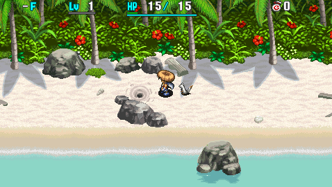
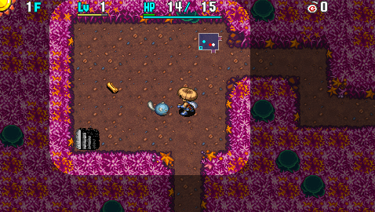
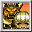

  

Dungeon that unlocks immediately after clearing Emerald Terrace. 
Shiren 4's version of the series favorite unidentified items post-game dungeon. 
It's always daytime, the item table features a wide variety of items, and NPCs don't appear.

Powerful equipment can be found on the ground, and the monster table is on the harsher side. 
It tests identification, synthesis, collecting arrows, rushing stairs, and other standard techniques. Grinding isn't as effective as Primordial Chasm in Shiren 5, since this game lacks Super status and ominous aura doesn't occur until 1500 turns elapse. (1st wind gust blows at 1700 turns)

<ul class="quickLinksUL">
  <li><a href="#overview">Overview</a></li>
  <li><a href="#strategy">Strategy</a>
    <ul>
      <li><a href="#before-entering">Before Entering</a></li>
      <li><a href="#mixer-synthesis-tips">Mixer Synthesis Tips</a></li>
      <li><a href="#identifying-items">Identifying Items</a></li>
      <li><a href="#equipment">Equipment</a></li>
      <li><a href="#other-items">Other Items</a></li>
      <li><a href="#farming">Farming</a></li>
    </ul>
  </li>
  <li><a href="#floor-guide">Floor Guide</a></li>
  <li><a href="#monsters">Monsters</a></li>
  <li><a href="#items">Items</a></li>
  <li><a href="#traps">Traps</a></li>
</ul>

# Overview

<table class="dungeonOverview">
  <tr>
    <th>Unlock</th>
    <td class="highlightYellow">Available right after clearing the main story.</td>
  </tr>
  <tr>
    <th>Entrance</th>
    <td class="highlightYellow">Beach (Examine hole)</td>
  </tr>
</table>

<table class="dungeonTable">
  <tr>
    <th>Floors</th>
    <td>99F</td>
    <th>Day / Night</th>
    <td>Day</td>
  </tr>
  <tr>
    <th>Bring Items</th>
    <td>No</td>
    <th>Allies</th>
    <td>No</td>
  </tr>
  <tr>
    <th>Unidentified</th>
    <td colspan="3">All categories</td>
  </tr>
  <tr>
    <th>Shops</th>
    <td>Regular, Elite, Pick-A-Choice</td>
    <th>Monster Houses</th>
    <td>Regular, Special, Sudden</td>
  </tr>
  <tr>
    <th>Initial Enemies</th>
    <td>6+</td>
    <th>Spawn Rate</th>
    <td>30</td>
  </tr>
  <tr>
    <th>Ominous aura</th>
    <td>Yes (1500 turns)</td>
    <th>Winds of Kron</th>
    <td>1st: 1700 / 4th: 2000</td>
  </tr>
  <tr>
    <th>Clear Icon</th>
    <td class="clearIcon"></td>
    <th>Clear Bonus</th>
    <td>40,000,000</td>
  </tr>
  <tr>
    <th>Reward</th>
    <td colspan="3">Jaguar's Shield --- Only if it's not in storehouse or warehouse.</td>
  </tr>
</table>

# Strategy

<ul class="quickLinksUL">
  <li><a href="#before-entering">Before Entering</a></li>
  <li><a href="#mixer-synthesis-tips">Mixer Synthesis Tips</a></li>
  <li><a href="#identifying-items">Identifying Items</a></li>
  <li><a href="#equipment">Equipment</a></li>
  <li><a href="#other-items">Other Items</a></li>
  <li><a href="#farming">Farming</a></li>
</ul>

### Before Entering

It's strongly recommended to register the following to the Blank Scroll list: Extinction, Eradicate, Mon House, Desert, and Lost.

Keeping the storehouse at 80/80 makes it easier to discern between Mailing Pot and Black Hole Pot. However, Mailing Pot can only be found as a shop table item or inside walls early on, so it's not necessary.

### Mixer Synthesis Tips

#### Status Conditions

Mixers drop eaten items if you make them slip, but doing so doesn't reset its eating count.

- Will eat: Decoy, Hiding, Confused, Afraid, Berserk, Blind, Apathetic
- Will not eat: Napping, Asleep, Slumbering, Sealed, Paralyzed, Slip

#### Item Identification

Eaten items will be identified if synthesis succeeds. ※ Unlike Shiren 5, the unidentified items must be thrown before equipment.

Example - Green Grass is Herb:

- Green Grass → Dotanuki = Dotanuki (HP+5), Herb is identified.
- Dotauki → Green Grass = Dotanuki (HP+5), Herb is not identified.

#### Blessing, Curse, Seal

The resulting item takes on the state of the last item thrown, including identified state.

Example - Unidentified staff is Paralysis Staff \[4\]:

- Paralysis Staff \[?\] (sealed) → Paralysis Staff \[6\] (blessed) = Paralysis Staff \[10\] (blessed)
- Paralysis Staff \[6\] (blessed) → Paralysis Staff \[?\] (sealed) = Paralysis Staff \[?\] (sealed)

#### Rune Priority

When multiple ingredients are thrown at a Mixer, synthesis occurs in order of rune priority. If a weapon or shield is used as an ingredient, the innate rune is considered top priority.

Example:

- Katana (1 open rune slot) → Dragon Grass → Shoddy Dirk+3 = Katana+3 (Degrade)

So to prevent accidents, it's best to use 2 Mixers instead:

1. Katana (1 open rune slot) → Dragon Grass = Katana (Anti-Dragon)
2. Katana (Anti-Dragon) → Shoddy Dirk+3 = Katana+3 (Anti-Dragon)

Remember, all secondary items are synthesized into the first item:

- Weapon → Grass → Shield → Grass = Both grasses are synthesized into the weapon.

#### Other Notes

Merchandise in shops can't be synthesized using a Synthesis Pot, but Mixer synthesis works. 
Of course, you'll be asked to pay for the item.

Eaten items will not vanish if a Mixer levels up, levels down, or disappears due to day/night switching. However, eaten items will vanish if an Eradicate Scroll is used to one-shot the Mixer.

### Identifying Items

See [Identifying Items](/guides/identifying-items) for an in-depth guide.

#### N'mach and N'dup

Disguised N'mach (31-40F) and N'dup (61-80F) can't be revealed using an Identify Scroll or Identify Pot. 
Only use items you can trust 100% in situations where you can't afford to make a mistake.

#### Bracelets

The best bracelets (Heal, Wall Clip, Monster Detector) cost 5000 Gitan and can be identified easily, so go ahead and equip any bracelets you find on the ground early on to check for these bracelets.

##### Price Notes

5000 / 1750

- Heal, Wall Clip, Monster Detector
    - Best bracelets in this price range - Test for Wall Clip by attacking through a corner.
- Warp, Explosion
    - Dangerous if equipped inside a shop, but never sold in shops.
- Strider, Alleyway
    - Difficult to identify from inside a shop.

2000 / 700

- Strength, Pierce, Bad Aim
    - Easily identified by equipping and shooting an arrow or throwing an item.

#### Grass

It's best to save grass until you encounter a shop or reach Mixer floors (12-14F) instead of eating them. You don't want to waste synthesis ingredients or Revival Grass, so consider using Identify Scroll or Identify Pot.

Herb, Heal Grass, Revival Grass, and Happy Grass (found on the ground) can be identified by price. Knowing the price of an unidentified grass lets you make an informed decision when attempting Mixer synthesis.

If your inventory is full and you haven't found a shop, it's fine to eat some grass items. Start with duplicate grasses, but never eat unidentified grasses obtained from Elite or Pick-A-Choice shops. (Disaster Seed, Imabikiso, Amnesia Grass, Undo Grass, Revival Grass, Invincible Grass, and Angel Seed)

##### Price Notes

100 / 35 --- 4 Types

- Warp (Anti-Floating), Antidote (Anti-Drain)
    - High priority runes.
    - Consider saving Antidote Grass until after 14F instead of synthesizing it if you lost strength.
- Otogiriso (HP+10)
    - Check for this by synthesizing the grass into a second weapon, and don't add it to your main weapon.
- Poison
    - Grass dropped by Mutaikon (9-11F) is always this grass.

300 / 105 --- 8 Types

- Sight (Anti-Cyclops), Dizzy (Confusing), Blind (Blinding)
    - Low priority runes - Not worth using Identify Scroll or Identify Pot on grasses in this price range.

500 / 175 --- 5 Types

- Dragon (Anti-Dragon, 1/2 Fire), Sleep (Sedating)
    - High priority runes.
    - Attempt synthesis with shields first when throwing 500G grasses.
- Life (HP+20)
    - Decent option for both weapons and shields.
- Rage, Strength
    - Some like to eat 500G grasses right away to get these two identified as soon as possible.

#### Scrolls

Generally, you won't have the inventory space to carry lots of unidentified scrolls, so read scrolls while standing on the stairs once you're ready to advance to the next floor. Reading scrolls right before advancing makes most negative effect scrolls a non-issue. (Grounded, Muzzled, Attraction, Trap, Mon House, etc.)

However, read scrolls while standing on a room entrance tile instead of the stairs between 1-3F. If it's a Mon House Scroll, you'll have an easier time wiping out enemies, collecting items, and utilizing traps. Special Monster Houses can't be generated on 1-3F, so there's little risk of losing your run.

It's true that Desert Scroll (Anti-Aquatic) and Lost Scroll (Bored) provide top priority runes, but given the low chance of finding them, it's better to use inventory space for grass and equipment instead. That said, some players still prefer to use Identify Scroll and Identify Pot on scrolls instead of grasses.

Since it's a daytime-only dungeon, Night-Day and Replenish scrolls are not in the item table. Eradicate and Extinction scrolls are exclusive to Elite and Pick-A-Choice shops.

##### Blind Reading

Squid King (4-5F) can inflict Blind status with its special attack, which can be used to determine if the scrolls you have are selection-based scrolls or not.

Some like to name unknown selection-based scrolls along the lines of "?As", "?Bs", and so on. ※ It's not safe to name them as 500G price range scrolls until after Identify Scroll has been identified.

#### Staves

All staves except Fortress Staff can be found on the ground starting from 1F in this dungeon. Swing staves to identify them right away, including testing whether or not they're sealed. Staves are one of the few reliable options thanks to magic bullets having 100% accuracy, so it's important to have them in a state where they can be utilized at any time.

Synthesize staves to save inventory space and identify remaining use counts.

#### Talismans

All 11 types of talismans can be found in this dungeon. Throw talismans at monsters to identify them, but beware of Swift, Berserk, Rage, and Fury talismans.

#### Pots

It's best to insert items into unidentified pots while standing on the stairs in case it's a Sticky Pot.

The standard first action is to insert an unidentified item that you don't mind losing such as a named but still unidentified talisman, Herb, or negative effect item. This identifies Storage, Presto, Sale, Identify, Sticky, and Black Hole pots.

If the pot has a capacity of 2, insert an identified item - excluding talismans, rocks, arrows. This identifies Curse (became sealed), Black Hole (vanished), and Purify (no change) pots. ※ Elite or Pick-A-Choice → Insert an identified weapon or shield to check for Blessing, Upgrade, Degrade pots.

Open type pots include Heal, Zalokleft, and Monster pots. Open them in a hallway or while standing on the stairs in case it's a Monster Pot. If you find a Heal Pot, open it 1 time when you're not in danger to check if it's real and usable.

If the above steps didn't result in an identified pot, it's best to wait for a shop, or use an Identify Scroll. If you're doing fine on food, go ahead and insert a banana to check for Chocolate Pot. Another option is to name the pot and throw it at a wall to check for 4-2-8 and Sturdy pots, but it's only recommended to do so if you find 2 or more of the same pot. Synthesis Pot can be identified by price.

##### Price Notes

※ Prices shift based on capacity - the listed values are for 3 capacity.

690 / 241

- Storage, Identify
    - Identified by inserting an unidentified item.
- 4-2-8, Ordinary
    - You won't know which one it is between these two until you throw the pot.
    - Unlike Shiren 5, throwing an unidentified 4-2-8 Pot so it explodes doesn't auto-identify it.

1150 / 402

- Presto, Sale, Chocolate
    - Identified by inserting an unneeded item, then a banana if nothing happened.
- Sturdy
    - Often mistaken for Chocolate Pot by players who don't insert a banana.
- Sticky
    - Easy to forget, but this price range includes Sticky Pot.

1840 / 644

- Purify, Curse
    - Identified by inserting an identified item - excluding talismans, rocks, arrows.
- Blessing
    - Only obtained from Elite Shop, Pick-A-Choice Shop, or blue Shiny Object.

2875 / 1006

- Black Hole, Mailing
    - You won't know which one it is between these two until you throw the pot.
    - Unless the pot was found in a shop, it's likely a Black Hole Pot.

6900 / 2415

- Synthesis
    - The only pot in this price range - Unlike Shiren 5, it can be found with less than 5 capacity.

### Equipment

Shiren 4 is balanced around avoiding damage, so weapon strength and runes are important. 2 bracelet resonance is extremely powerful since Wall Clip Bracelet can be found on the ground, so it's worth switching to a set that activates that resonance even around mid game. ※ Be careful of rune slot counts when switching over to avoid losing runes.

#### Weapon

##### Basic

<ul>
  <li>Red Blade
    <ul>
      <li>Strongest 2 bracelet resonance sword on paper, but slow growth rate and low starting rune slots. Synthesize runes into a second weapon, then merge that into the Red Blade once it's leveled up.</li>
    </ul>
  </li>
  <li>Meteor Edge
    <ul>
      <li>Fantastic balance of strength, growth rate, rune slots, and rarity.</li>
    </ul>
  </li>
  <li>Dotanuki, Beast Fang
    <ul>
      <li>Not as good as the above sets, but can still put up a fight.</li>
      <li>Dotanuki set favors weapon strength + rune slots, and Beast set favors shield strength + rune slots.</li>
    </ul>
  </li>
  <li>Katana, Copper Edge, Palm Stick
    <ul>
      <li>Switch to stronger equipment unless you're desperate for 2 bracelet resonance.</li>
      <li>Katana can somewhat keep up with its attack power, but only has 4 rune slots until Lv8.</li>
    </ul>
  </li>
  <li>Kabura's Blade
    <ul>
      <li>Its high base attack makes early game a breeze, but that's about it.</li>
      <li>It doesn't have 2 bracelet resonance, so it's best to switch to one of the above options.</li>
    </ul>
  </li>
</ul>

##### Status

<ul>
  <li>Baffle Axe
    <ul>
      <li>Low base attack, but fast growth rate and lots of rune slots.</li>
      <li>Great for those who like to overwhelm monsters with the power of runes.</li>
      <li>Keep in mind that confused monsters can defeat other monsters and level up.</li>
    </ul>
  </li>
  <li>Nap Rattle
    <ul>
      <li>Terrible base attack, and rune slots only increases to 6 even at Lv8.</li>
      <li>However, Asleep status lets you win any 1 vs 1 encounter if it activates, so it's... probably still not worth it.</li>
    </ul>
  </li>
</ul>

##### Type Effective

<ul>
  <li>Water Cutter
    <ul>
      <li>Low base attack, but solid rune count and fast growth rate.</li>
      <li>In particular, it turns fearsome Gyazas into a non-issue once leveled up.</li>
    </ul>
  </li>
  <li>Lizard Lasher
    <ul>
      <li>Higher base attack and gains 1 rune slot per level, but growth rate is slower than Red Blade.</li>
      <li>Helps against powerful Hopodiles and Dragons.</li>
    </ul>
  </li>
  <li>Myopic Masher
    <ul>
      <li>Low base attack, but very high rune count and fast growth rate.</li>
      <li>Can one-shot Gazers and Ironheads once leveled up.</li>
    </ul>
  </li>
  <li>Drain Slicer
    <ul>
      <li>Low base attack, but high rune count and pretty fast growth rate.</li>
      <li>It can one-shot Absorbiphants once leveled up, so don't hesitate to stack status inflicting runes.</li>
      <li>Scorpions and Spin Polygons can be a bit tanky, so this weapon is nice against them as well.</li>
    </ul>
  </li>
</ul>

##### Other

<ul>
  <li>Burning Blade
    <ul>
      <li>Its stats are comparable to basic weapons, and its innate Flame Shot gets stronger as it levels up.</li>
      <li>Growth rate is slower than Red Blade, and you earn 0 skill points if you defeat a target with Flame Shot.</li>
      <li>Fantastic when paired with Monster Detector, but otherwise it's a bit questionable.</li>
    </ul>
  </li>
</ul>

#### Runes

See [Runes](/system/synthesis-runes) for details.

##### Priority Chart

<table>
  <thead>
    <tr>
      <th>Priority</th>
      <th>Runes</th>
    </tr>
  </thead>
  <tbody>
    <tr>
      <td class="highlightRed">Top</td>
      <td>Anti-Aquatic, Tri-direction, Sedating, Paralyzing, Bored, Critical</td>
    </tr>
    <tr>
      <td class="highlightPink">High</td>
      <td>Anti-Floating, Anti-Drain, HP+15, HP+20, Quick Hitting</td>
    </tr>
    <tr>
      <td class="highlightYellow">Mid</td>
      <td>Confusing, Blinding, Rustproof, Anti-Dragon, Charge, Atk+8</td>
    </tr>
    <tr>
      <td class="highlightLightblue">Low</td>
      <td>Anti-Cyclops, Anti-Bomb, Flame Shot, Atk+3, HP+5, HP+10</td>
    </tr>
    <tr>
      <td class="highlightGray">Avoid</td>
      <td>Sealing, Wall Dig, 2 Tile Dig, Trap Breaker, Degrade, Level Down, 1 HP</td>
    </tr>
  </tbody>
</table>

##### Rune Notes

- Status inflicting runes are effective against Gyazas.
- HP+15 and HP+20 are quite nice due to the slow HP regen speed.
- Tri-direction is top priority only if you don't have a Wall Clip Bracelet.
- If you find a Blank Scroll before the end of Mixer floors (12-14F), turn it into a Desert Scroll and synthesize it.
- Critical has a higher activation rate than other chance based runes, and is nice against Normal types like Eligan.
- Confused or blind monsters can still hit you or other monsters, so some players prefer to skip those runes.
- Quick Hitting should be stacked with Charge, Critical, and status inflicting runes - skip adding it alone.
- Don't synthesize Quick Hitting on Mixer floors (12-14F) - it's too early to make good use of it.

#### Shield

The damage formula in this game combined with the slower HP regen speed means you want to avoid taking damage as much as possible, as opposed to building a strong shield and trading hits like earlier games. ※ If it's like Shiren 5: Damage to Shiren = [ MonsterAtk x Variance / 100 - (ShieldDef x 0.61785) ]

If you find a Steady Shield, carry it with you until you're past the Horrabbit floors (60-62F).

##### Basic

<ul>
  <li>Red Shield
    <ul>
      <li>Strongest 2 bracelet resonance shield, good rune count, but slow growth rate. Its high base defense makes it trivial to collect Iron Arrows from Cross Carts. It gains 1/2 Fire and Anti-Peck at Lv8, both of which are great for late game.</li>
    </ul>
  </li>
  <li>Meteor Guard
    <ul>
      <li>Fantastic balance of strength, growth rate, rune slots, and rarity.</li>
      <li>The difference in base defense between this and Red Shield is negligible.</li>
    </ul>
  </li>
  <li>Clan Shield, Beast Shield
    <ul>
      <li>Not as good as the above sets, but can still put up a fight.</li>
      <li>Consider switching to either of these sets if you can activate 2 bracelet resonance.</li>
    </ul>
  </li>
  <li>Iron Targe, Copper Guard, Palm Shield
    <ul>
      <li>The run is likely to go downhill with these sets as tougher monsters show up and you struggle to keep up.</li>
      <li>Palm Shield gains 1/2 Hunger at Lv8, so it can be worth leveling on the side.</li>
    </ul>
  </li>
  <li>Fuuma Shield
    <ul>
      <li>Its high base defense makes early game a breeze, but that's about it.</li>
      <li>It doesn't have 2 bracelet resonance, so it's best to switch to one of the above options.</li>
    </ul>
  </li>
</ul>

##### Other

<ul>
  <li>Lizard Shield
    <ul>
      <li>Consider leveling it to Lv4~5 as a secondary shield for Archdragon floors (82-87F).</li>
    </ul>
  </li>
  <li>Blast Shield
    <ul>
      <li>Some players level it as a secondary shield for Cranky Tank floors (94-99F).</li>
    </ul>
  </li>
  <li>Spry Shield
    <ul>
      <li>Usually synthesized, but you could give it a try as a main shield for fun.</li>
      <li>The DS version has a glitch where evasion doesn't increase as the shield levels up.</li>
    </ul>
  </li>
</ul>

#### Runes

See [Runes](/system/synthesis-runes) for details.

<table>
  <thead>
    <tr>
      <th>Priority</th>
      <th>Runes</th>
    </tr>
  </thead>
  <tbody>
    <tr>
      <td class="highlightRed">Top</td>
      <td>1/2 Hunger, 1/2 Fire, 1/2 Blast</td>
    </tr>
    <tr>
      <td class="highlightPink">High</td>
      <td>Rustproof, Anti-Peck, Agile, Def+8, HP+15, HP+20</td>
    </tr>
    <tr>
      <td class="highlightYellow">Mid</td>
      <td>Anti-Hypno, Magic Damage, Def+3, HP+10</td>
    </tr>
    <tr>
      <td class="highlightLightblue">Low</td>
      <td>Anti-Theft, Anti-Burgle, HP+5, Damage Exp, Pain Fullness</td>
    </tr>
    <tr>
      <td class="highlightGray">Avoid</td>
      <td>Hungry, Degrade, Counter, Level Down, 1 HP</td>
    </tr>
  </tbody>
</table>

##### Rune Notes

- Unmoving is top priority, but Steady Shield should be equipped on 60-62F instead of being synthesized.
- HP+15, HP+20, and Def+8 are quite nice due to the slow HP regen speed.
- Landmines are more common from 40F+, so aim to synthesize 1/2 Blast by then - Bomb Rock can be used.
- If you find a Lizard Shield, consider keeping it as a secondary shield instead of synthesizing 1/2 Fire.
- 1/2 Hunger significantly reduces the risk of starvation, and helps with utilizing Heal Bracelet.
- Agile helps in situations where you can't avoid trading hits - Sight Grass x 2 can be used.
- Anti-Hypno is mainly used for Ultra Gazers (96-99F).
- Magic Damage shines the most in the second half of the dungeon.
- Counter helps against Gitan Mamels, but makes it difficult to perform Banana Morph Factory.
- Avoid 1 HP - It sounds good on paper, but it makes Explochins instantly explode.

#### Bracelets

Monster Detector, Wall Clip Bracelet, and Heal Bracelet are the "Sacred Treasures" of this game. Any of these 3 bracelets have the power to single-handedly turn the tide of an adventure, and they're the reason why Shiren 4 is said to be the "Bracelet Game" of the series by many fans.

##### Sacred Treasures

<ul>
  <li>Monster Detector
    <ul>
      <li>Reveals the positions of enemies outside of your view. (Both on screen + on the map)</li>
      <li>Eliminates the risk of surprise attacks in hallways, lets you plan for incoming enemies, locate shops via a yellow dot (Shopkeeper), locate stairs using Transient Staff.</li>
    </ul>
  </li>
  <li>Wall Clip Bracelet
    <ul>
      <li>Lets you move through walls, but take 10 damage per turn while inside a wall.</li>
      <li>Converts any trading hits situation against a powerful monster to 10 damage per turn.</li>
      <li>The real value of this bracelet is having a one-sided fight by moving and attacking through corners.</li>
    </ul>
  </li>
  <li>Heal Bracelet
    <ul>
      <li>Speeds up natural HP regeneration, but fullness also depletes faster while equipped.</li>
      <li>Lets you quickly recover after fighting a powerful monster or stepping on a landmine.</li>
      <li>However, you'll quickly starve if you use it after every encounter, so don't neglect the basics.</li>
      <li>Fullness depletion per HP regenerated is the same with or without the bracelet equipped, so trying to conserve fullness by stepping in place with it unequipped is pointless.</li>
    </ul>
  </li>
</ul>

##### Sacred Treasures Notes

- 2 bracelet resonance (ex: Dotanuki + Clan Shield) is key to further increasing the potency of these bracelets.
- Wall Clip Bracelet is inconsistent on its own since you might step into another enemy's attack, but pair it with a Monster Detector and that weakness is removed.
- All 3 bracelets have a purchase price of 5000 Gitan. (1750 selling price)

##### Other

<ul>
  <li>Scout Bracelet
    <ul>
      <li>Better version of Monster Detector.</li>
      <li>Found in Elite or Pick-A-Choice shops.</li>
    </ul>
  </li>
  <li>Item Detector
    <ul>
      <li>Fewer turns spent going around the floor for items = fewer chances for accidents to occur.</li>
      <li>Lets you detect items buried in walls, but save Tunnel Staff uses for Pick-A-Choice shops.</li>
    </ul>
  </li>
  <li>Identify Bracelet
    <ul>
      <li>Helps with early game identification, and checking use counts and item seals late game.</li>
      <li>Found in Elite or Pick-A-Choice shops.</li>
    </ul>
  </li>
  <li>Alert Bracelet
    <ul>
      <li>Protects against Dozikons (63-65F) and Sleep Traps.</li>
      <li>Some players like to keep it equipped at all times while using 2 bracelet resonance.</li>
    </ul>
  </li>
  <li>Pierce Bracelet
    <ul>
      <li>Plays well with Monster Detector, and lets you use projectiles against Flash Birds.</li>
      <li>Keep it unequipped on Mixer floors to avoid accidents.</li>
    </ul>
  </li>
  <li>Cleansing Bracelet
    <ul>
      <li>Protects against Scorpion and Mutaikon special attacks.</li>
      <li>Keep it on hand for Mesmerikon floors (90-95F) if you don't have an Extinction Scroll.</li>
    </ul>
  </li>
  <li>Bad Aim Bracelet
    <ul>
      <li>Trap monsters by luring them onto traps and shooting arrows or throwing items.</li>
      <li>Spoil Trap → Spoiled Bananas → Grilled Bananas / Banana Peels for hunting Maneaters</li>
      <li>Spoil Traps become more rare from 30F+.</li>
    </ul>
  </li>
  <li>Strider Bracelet
    <ul>
      <li>Collect island items, unequip over water to warp, step in place over water to safely recover HP.</li>
      <li>Be warned that scrolls and bananas outside of pots will get wet or spoil.</li>
    </ul>
  </li>
  <li>Happy Bracelet
    <ul>
      <li>HP regen slows down as max HP increases, so don't equip this until after you've collected arrows.</li>
      <li>That said, it's fine to equip it if you don't plan on collecting arrows from Cross Carts.</li>
    </ul>
  </li>
  <li>Trap Bracelet
    <ul>
      <li>Can be used alongside Sight Grass to collect Poison Arrows until 10F.</li>
      <li>However, Squid King (4-5F)'s special attack cancels Sharp Eyes status.</li>
    </ul>
  </li>
</ul>

### Other Items

#### Projectiles

There are many monsters with high attack power or dangerous special attacks, so it's important to defeat problematic enemies before they become adjacent to you when possible.

Collecting arrows from traps and Boy Cart monsters early game significantly helps with consistency. Wood Arrows and Rocks are common early on, while Iron Arrows and Porky Rocks are common later on.

##### Arrows

Shiren 4 doesn't have Dodger Pot, but you can still collect arrows by getting hit by Boy Cart or Cross Cart's arrows, since projectiles have low accuracy and these enemies have lower attack power than in Shiren 5. See [Collect Arrows](#collect-arrows) for details.

##### Rocks

Porky Rocks deal a fixed 20 damage, and can be aimed diagonally to extend their range. 
Rocks can one-shot Gitan Mamels (88-93F), and Bomb Rocks can be used to synthesize 1/2 Blast and Anti-Bomb.

Rocks can also be used alongside a Tunnel Staff to cheat at Pick-A-Choice shops. See [Cheating at Pick-A-Choice (One-Choice Shop)](#cheating-at-pick-a-choice-(one-choice-shop)) for details.

#### Food

<ul>
  <li>Ripe Banana
    <ul>
      <li>Grilling it lowers the amount of fullness it replenishes (120 → 60), so keep it in a pot.</li>
      <li>Having 2~3 of these on hand gives you peace of mind.</li>
      <li>Turns into a Spoiled Banana after advancing 2 floors.</li>
    </ul>
  </li>
  <li>Grilled Banana
    <ul>
      <li>Replenishes 60 fullness, and restores 40 HP.</li>
    </ul>
  </li>
  <li>Chocolate Banana
    <ul>
      <li>Replenishes 80 fullness, and grants a random beneficial effect: Restore HP, Strength +1, Unwavering, Satiated, Ninja, Insomnia, or Identifier.</li>
      <li>Eat all Chocolate Bananas on the same floor when your HP is full to try for Identifier status.</li>
    </ul>
  </li>
  <li>Yellow Banana
    <ul>
      <li>Grilling it lowers the amount of fullness it replenishes (80 → 60), so keep it in a pot.</li>
      <li>Don't forget to take it out of the pot when changing floors to ripen it.</li>
      <li>Turns into a Ripe Banana after advancing 2 floors.</li>
    </ul>
  </li>
  <li>Green Banana
    <ul>
      <li>Replenishes 50 fullness.</li>
      <li>Ripen or grill these to turn them into a better food item.</li>
      <li>Turns into a Yellow Banana after advancing 3 floors.</li>
    </ul>
  </li>
  <li>Spoiled Banana
    <ul>
      <li>Grill these to turn them into a respectable food item.</li>
      <li>Created by triggering a Spoil Trap while a monster is standing on the trap.</li>
      <li>Bad Aim Bracelet can be used to efficiently mass produce them.</li>
      <li>Can be eaten to replenish 30 fullness if desperate - restore strength using Antidote Grass or Heal Pot.</li>
    </ul>
  </li>
  <li>Banana Peel
    <ul>
      <li>Can be stocked to hunt Maneaters, but otherwise should be used often to free up inventory space.</li>
    </ul>
  </li>
</ul>

#### Pots

<ul>
  <li>Storage Pot
    <ul>
      <li>Basic pot that expands inventory size and protects bananas from spoiling.</li>
      <li>Stop bananas from ripening, protect items from Gyadons, catch items thrown by Kappas, etc.</li>
      <li>The more pots you have, the greater your chance of losing many items at once due to Banana Morph, Lv3-4 Gyadons and Field Knaves, so split important items across multiple pots instead of one pot.</li>
    </ul>
  </li>
  <li>Identify Pot
    <ul>
      <li>Prioritize inserting 3000G bracelets.</li>
      <li>Once you've identified a decent number of items, it's fine to use it as an Ordinary Pot.</li>
      <li>Don't underestimate the value of finding out how many uses a staff has left.</li>
    </ul>
  </li>
  <li>Heal Pot
    <ul>
      <li>Restores HP and strength to max, and cures Confused, Blind, Afraid.</li>
      <li>The most common mistake players make is trying to save it until they "really need it", which results in it not being used when it could've saved a situation from deteriorating.</li>
      <li>Open it 1 time when you're not in danger to check for item seals / disguised N'dubbas.</li>
    </ul>
  </li>
  <li>Upgrade Pot
    <ul>
      <li>Unlike Shiren 5, it never randomly shatters when changing floors in this game.</li>
      <li>Synthesize inserted weapons and shields into your main equipment for a significant stat boost.</li>
      <li>The pot shatters if an inserted item reaches its upgrade limit, so insert Lv2~3 equipment.</li>
      <li>Found in Elite or Pick-A-Choice shops.</li>
    </ul>
  </li>
  <li>Blessing Pot
    <ul>
      <li>Blank Scroll and Suction Scroll are top priority.</li>
      <li>1 blessed Suction Scroll can bless up to 5 items, so it's extremely powerful.</li>
      <li>Other candidates include Revival or Undo grass, Growth Seed, or useful scrolls.</li>
      <li>Found in Elite or Pick-A-Choice shops.</li>
    </ul>
  </li>
  <li>Black Hole Pot
    <ul>
      <li>Incredible item that lets you escape dangerous situations or steal from shops risk-free.</li>
      <li>Prioritize saving it for when you need to skip a floor or escape from a single room Monster House.</li>
      <li>Seal it to prevent item loss due to Gazers, or capacity being reduced to 0 by Kappas.</li>
      <li>Can be reused if you have a Suction Scroll + Pot God Scroll on hand.</li>
    </ul>
  </li>
  <li>Purify Pot
    <ul>
      <li>Nice for removing item seals from Revival Grass or such.</li>
      <li>It can't purify cursed items you have equipped, so it's often just used as an Ordinary Pot.</li>
    </ul>
  </li>
  <li>Ordinary Pot
    <ul>
      <li>Use it as a container for items like synthesis ingredients, spare staves, and extra food.</li>
    </ul>
  </li>
  <li>Synthesis Pot
    <ul>
      <li>Mixers are the main method of synthesis, so it's only used when the next Mixer zone is far away.</li>
      <li>Some players keep it on hand in case they find a weapon or shield that activates 2 bracelet resonance.</li>
      <li>Use it to combine staves to free up inventory space in the second half.</li>
      <li>It's fine to use it as an Ordinary Pot if you're struggling to carry items.</li>
    </ul>
  </li>
  <li>Presto Pot
    <ul>
      <li>Insert 1 rock or arrow at a time. Don't break it right away if you're low on inventory space.</li>
      <li>The item table for Presto Pots is lackluster in Shiren 4 - It's mostly arrows, rocks, and food.</li>
      <li>If it doesn't contain food, throw it at an enemy standing on a Spoil Trap to get a Spoiled Banana.</li>
    </ul>
  </li>
  <li>Zalokleft Pot
    <ul>
      <li>Use it to steal from shops early game, break it and defeat Zaloklefts mid game.</li>
      <li>It's a bit wasteful, but it can also be used as an Ordinary Pot if you're low on inventory space.</li>
      <li>Can be used to obtain island items if the island is surrounded by water tiles.</li>
    </ul>
  </li>
  <li>Curse Pot
    <ul>
      <li>Can be used as a container for synthesis ingredients if you have a way to purify the result, like synthesizing a non-cursed/sealed item last. (Mixer synthesis can have unexpected results)</li>
    </ul>
  </li>
</ul>

#### Scrolls

<ul>
  <li>Blank Scroll
    <ul>
      <li>Write the name of a scroll you've read before, and use this as that scroll.</li>
      <li>Popular options include Extinction, Eradicate, Fixer, Mon House, Desert (Anti-Aquatic), and Lost (Bored).</li>
      <li>Mon House is only recommended near the start of a run.</li>
    </ul>
  </li>
  <li>Extinction Scroll
    <ul>
      <li>Throw it at a monster to make that monster family not spawn for the remainder of the adventure.</li>
      <li>Consider saving it until you get close to one of these dangerous floors instead of throwing it right away: Horrabbit (60-62F), Dozikon (63-65F), Archdragon (82-87F), Mesmerikon (90-95F), or Cranky Tank (94-99F).</li>
      <li>The scroll flies forever similar to Silver Arrows, and can miss.</li>
    </ul>
  </li>
  <li>Desert Scroll
    <ul>
      <li>Used as a synthesis ingredient for the Anti-Aquatic weapon rune.</li>
    </ul>
  </li>
  <li>Fixer Scroll
    <ul>
      <li>Fully restores HP, and grants an additional effect based on your current situation.</li>
      <li>Its ability to purify equipped items is nice in particular, since you can't do so using Purify Pot.</li>
    </ul>
  </li>
  <li>Navigation Scroll
    <ul>
      <li>Reveals the map layout and locations of items, monsters, and stairs.</li>
      <li>Helps ensure safety for the current floor, and is especially great for end game.</li>
    </ul>
  </li>
  <li>Confusion Scroll
    <ul>
      <li>Inflicts Confused status on all enemies in the room for 20 turns.</li>
      <li>Great option to help you escape emergencies like starting in a Monster House.</li>
      <li>Having 1~2 on hand gives you peace of mind.</li>
    </ul>
  </li>
  <li>Purify Scroll
    <ul>
      <li>Guaranteed to purify a selected item, and has a chance to purify all inventory items.</li>
      <li>This is the only item that can purify pots, so keep it on hand if possible.</li>
    </ul>
  </li>
  <li>Pot God Scroll
    <ul>
      <li>Powerful scroll that increases the capacity of a selected pot by 1.</li>
      <li>Good options include Storage, Heal, and Upgrade pots.</li>
    </ul>
  </li>
  <li>Identify Scroll
    <ul>
      <li>Identifies a selected item, and has a small chance to identify all items not inside pots. Be warned that it doesn't reveal N'dubba monsters disguised as items.</li>
    </ul>
  </li>
  <li>Mon House Scroll
    <ul>
      <li>Used to stock up on items from early to mid game. (Special Monster Houses can be generated from 4F+)</li>
      <li>Arrow traps can be generated until 10F, so choose a large room if you find it early on.</li>
      <li>If you don't want to collect arrows, read it in a medium sized room instead to save time checking for traps.</li>
    </ul>
  </li>
  <li>Lost Scroll
    <ul>
      <li>Used as a synthesis ingredient for the Bored weapon rune.</li>
    </ul>
  </li>
  <li>Sanctuary Scroll
    <ul>
      <li>It doesn't protect you from all attacks, but it's fantastic when the situation allows for it.</li>
      <li>Mostly used to safely synthesize on higher level Mixer floors, or to gain experience points and skill points.</li>
      <li>Unlike other games in the series, it vanishes if you step onto it again after having stepped off of it.</li>
    </ul>
  </li>
  <li>Slumber Scroll
    <ul>
      <li>Inflicts Slumbering status on all enemies in the room for 12 turns, making them unable to act.</li>
      <li>Quite a bit worse than Confusion Scroll, but usable if you don't have the latter on hand.</li>
      <li>It can be used like Fear Scroll to safely defeat multiple adjacent enemies.</li>
    </ul>
  </li>
  <li>Fear Scroll
    <ul>
      <li>Inflicts Afraid status on all enemies in a 1 tile radius, including those inside walls.</li>
      <li>Mostly used to counter Summon Traps, but can also be used to level up a monster.</li>
    </ul>
  </li>
  <li>Plating Scroll, Fate Scroll, Earth Scroll
    <ul>
      <li>Can be used as a Purify Scroll that only works on a weapon or shield.</li>
    </ul>
  </li>
  <li>Air Slash Scroll
    <ul>
      <li>Deals 40~44 damage, so it's not really an emergency escape option except for very early game.</li>
      <li>Using 2 in a row wipes out most Lv1-3 monsters, and whatever survives can be finished in 1 hit, so if you have the inventory space for it, keeping 2 on hand isn't a bad option.</li>
    </ul>
  </li>
</ul>

#### Staves

##### Movement

<ul>
  <li>Pinning Staff
    <ul>
      <li>Incredibly important staff for run away play and rushing stairs - never discard them.</li>
      <li>Use it to escape into a hallway, land on an air or water tile to warp, or reduce travel time.</li>
    </ul>
  </li>
  <li>Swap Staff
    <ul>
      <li>Use it when sandwiched in a hallway, or when you need to escape a single room Monster House.</li>
      <li>Can be used to warp if aimed at a monster who is positioned on an air or water tile.</li>
      <li>Pierce Bracelet can be used to expand its range, though it can miss when thrown.</li>
    </ul>
  </li>
</ul>

##### Disabling

<ul>
  <li>Paralysis Staff
    <ul>
      <li>Completely immobilizes and disables any target that isn't an Absorbiphant.</li>
      <li>In addition, it's a synthesis ingredient for Paralyzing - one of the best status inflicting weapon runes.</li>
      <li>Block a room entrance or hallway to safely step in place and recover HP, or use projectiles or Tri-direction to defeat enemies without taking damage.</li>
    </ul>
  </li>
  <li>Transient Staff
    <ul>
      <li>It warps the target to the stairs, but if it was an enemy with a troublesome ability, you might end up having to use a different item to deal with it - but it's nice for buying time.</li>
      <li>The warp effect still works on Absorbiphants, even if they won't be left paralyzed.</li>
      <li>Use it with a Monster Detector + Swap Staff to quickly advance floors.</li>
      <li>The target always warps to the real stairs, even if Stairs? Traps are present.</li>
    </ul>
  </li>
  <li>Decoy Staff
    <ul>
      <li>All enemies in the room change their focus to the decoy.</li>
      <li>Basically works like Confused status against a single target, so it's useful for 1-on-1 fights too.</li>
      <li>The monster who defeats the decoy levels up, so it's not an item you can use too carelessly.</li>
      <li>Higher level Dragons and Porkys won't use their special attacks if a decoy is present and out of view.</li>
    </ul>
  </li>
  <li>Seal Staff
    <ul>
      <li>Shuts down special abilities and removes auras.</li>
      <li>The target's attack power stays the same, so it's pointless against power monsters.</li>
      <li>Cranky Tank and Abyss Dragon have high stats, so they remain a threat even when sealed.</li>
      <li>Great against the long-ranged abilities of DJ Mage, Mutaikon, and Bored Kappa monsters.</li>
    </ul>
  </li>
  <li>Mage Staff
    <ul>
      <li>Generally useful as a way to disable a single target, despite its randomness.</li>
      <li>Confused enemies have a 1/8 chance to hit you, so don't let your guard down when adjacent.</li>
      <li>It's not an option you want to use in dire situations, so don't be too stingy with it.</li>
    </ul>
  </li>
  <li>Knockback Staff
    <ul>
      <li>It creates distance between you and the target, buying time to use projectiles or another staff.</li>
      <li>In particular, Swap Staff can be used as a follow-up to escape a dangerous situation.</li>
      <li>Only deals 5 damage, so it can't one-shot Cave Mamel and can't defeat Gitan Mamel in 2 hits without the help of a wall.</li>
    </ul>
  </li>
  <li>Slow Staff
    <ul>
      <li>One swing is enough to ensure safety against most regular speed monsters.</li>
      <li>Significantly reduces risk when synthesizing your main shield using Mixers.</li>
    </ul>
  </li>
</ul>

##### Other

<ul>
  <li>Tunnel Staff
    <ul>
      <li>Highly recommended to save enough uses to create a <a href="#cheating-at-pick-a-choice-(one-choice-shop)">One-Choice Shop</a>.</li>
      <li>Create a safe passageway to the stairs, or create a hallway to avoid incoming enemies.</li>
      <li>Steal from a shop by creating a line to the stairs room, followed by using a Pinning or Swap staff.</li>
      <li>The magic bullet deals 10 damage if it hits an enemy, so it can one-shot Cave Mamels.</li>
    </ul>
  </li>
  <li>Happy Staff
    <ul>
      <li>Use it on a Banana Novice to perform Banana Morph Factory, create a Gitan Mamel to gain exp, create a Doomhead, Crashdon, or Isleater to earn lots of skill points, increase the number of items a Mixer monster can swallow, etc.</li>
    </ul>
  </li>
  <li>Fortress Staff
    <ul>
      <li>Creates a wall tile directly in front of you.</li>
      <li>Cut off DJ Mage's line of sight, control the flow of enemies, steal from a shop, and so on.</li>
    </ul>
  </li>
  <li>Unlucky Staff
    <ul>
      <li>Mostly used to weaken the special attack of a target, rather than to lower their stats.</li>
      <li>Status resets when the target levels down, making it effective against boosted Absorbiphants.</li>
    </ul>
  </li>
  <li>Balance Staff
    <ul>
      <li>Low priority because enemies can't make you trip, and items can't fall in water.</li>
    </ul>
  </li>
  <li>Swift Staff
    <ul>
      <li>Used as a synthesis ingredient for the Quick Hitting weapon rune.</li>
    </ul>
  </li>
</ul>

#### Talismans

They're used in a similar manner to staves, but the fact that they can miss is an extreme drawback. However, they have the potential to surpass staves in handling tricky situations if used well. Always use a staff or scroll if you can't afford to miss, and otherwise it's fine to use talismans.

##### Pros

- The number of remaining uses is clear.
- Wide area of effect.
- Only takes up 1 inventory slot per type.
- Can't be sealed. (PSP version)
- Removes monster auras. (Seal Talisman only)

##### Cons

- It can miss. (Projectiles have 84% accuracy)
- Some monsters nullify thrown items. (Example: Flash Bird)
- Can't be blessed to boost its effect. (PSP version)

This list is roughly ordered in highest to lowest priority for talismans worth carrying.

<ul>
  <li>Fear Talisman
    <ul>
      <li>Inflicts Afraid status for 15 turns.</li>
      <li>Afraid prevents the use of special attacks, so it shuts down any type of enemy.</li>
      <li>There's risk of a monster leveling up if there's a group, but that can be used as an advantage.</li>
    </ul>
  </li>
  <li>Miss Talisman
    <ul>
      <li>Inflicts Inaccurate status for 10 turns.</li>
      <li>Monsters with Inaccurate status can still use special attacks, so it's used to disable brawlers.</li>
      <li>Floaty monsters are regular speed in Shiren 4, so this talisman can be used to warp floors.</li>
    </ul>
  </li>
  <li>Dizzy Talisman
    <ul>
      <li>Inflicts Confused status for 20 turns.</li>
      <li>Confused prevents the use of special attacks, but they have a 1/8 chance to hit an adjacent target.</li>
      <li>The long duration and random movement makes it the ideal talisman when you want to escape.</li>
      <li>It's on the common side, so it's easy to accumulate a large number of them.</li>
    </ul>
  </li>
  <li>Slow Talisman
    <ul>
      <li>Decreases action speed by 1 stage, which never wears off.</li>
      <li>Mainly used to disable monsters without ranged attacks.</li>
      <li>It doesn't remove auras, so don't bother throwing it at yellow aura monsters.</li>
    </ul>
  </li>
  <li>Sleep Talisman
    <ul>
      <li>Inflicts Asleep status for 6 turns.</li>
      <li>It's mainly used to completely disable a single target, or a small group if you have Tri-direction.</li>
    </ul>
  </li>
  <li>Seal Talisman
    <ul>
      <li>Inflicts Sealed status, which never wears off.</li>
      <li>Unlike Shiren 5, this is the only talisman that can remove monster auras.</li>
      <li>A missed throw might mean getting hit by the special attack you wanted to avoid in the first place.</li>
    </ul>
  </li>
  <li>Berserk Talisman
    <ul>
      <li>Inflicts Berserk status for 30 turns.</li>
      <li>Berserk prevents the use of special attacks, so it can be used similarly to Seal Talisman.</li>
      <li>It can also be used to have monsters fight each other and level up.</li>
    </ul>
  </li>
  <li>Bind Talisman
    <ul>
      <li>Inflicts Bound status for 10 turns.</li>
      <li>It doesn't disable the target, so it's mostly used when you want to run away.</li>
      <li>Can be used with arrows to safely defeat monsters that don't have ranged attacks.</li>
    </ul>
  </li>
  <li>Swift Talisman
    <ul>
      <li>Used as a synthesis ingredient for the Quick Hitting weapon rune.</li>
    </ul>
  </li>
</ul>

#### Grass

<ul>
  <li>Revival Grass, Undo Grass
    <ul>
      <li>Fully restores HP, strength, fullness, and status without spending a turn - reusable if blessed.</li>
      <li>Anti-Plant isn't in Shiren 4, so don't intentionally collapse to try and synthesize Weeds.</li>
    </ul>
  </li>
  <li>Otogiriso, Heal Grass
    <ul>
      <li>High priority when you're low on other HP recovery items.</li>
      <li>Not essential if you have multiple Heal Pots, but it's still not a bad idea to keep a stock.</li>
      <li>Unlike Heal Pot, Heal Grass can also cure Slow status on top of Confused and Blind.</li>
      <li>Heal Grass is worth synthesizing for the HP+15 weapon and shield rune.</li>
    </ul>
  </li>
  <li>Invincible Grass
    <ul>
      <li>Nullifies damage received for 20 turns - But you're still susceptible to status conditions.</li>
      <li>Overcome a Monster House, survive being sandwiched in a hallway, steal from a shop, etc.</li>
      <li>It's quite rare, so if you're lucky enough to find it, take good care of it.</li>
      <li>Keep in mind that Absorbiphants can absorb Invincible status.</li>
    </ul>
  </li>
  <li>Antidote Grass
    <ul>
      <li>One of the few ways to restore lost strength, with the others being Heal Pot or being revived.</li>
      <li>Synthesis ingredient for the Anti-Drain weapon rune.</li>
    </ul>
  </li>
  <li>Warp Grass
    <ul>
      <li>Can be used as an emergency escape option, but you'll get hit if you land next to an enemy.</li>
      <li>Synthesis ingredient for the Anti-Floating weapon rune.</li>
    </ul>
  </li>
  <li>Swift Grass
    <ul>
      <li>Effective for both single target and group fights. Keep 2~3 on hand if you can.</li>
      <li>Synthesis ingredient for the Quick Hitting weapon rune.</li>
    </ul>
  </li>
  <li>Strength Grass
    <ul>
      <li>It's fine to eat these as you find them, since Blessing Pot is only found in Elite or Pick-A-Choice shops, and Blessing Scroll isn't in Shiren 4, meaning you're quite unlikely to be able to bless them.</li>
    </ul>
  </li>
  <li>Life Grass
    <ul>
      <li>Used as a synthesis ingredient for the HP+20 weapon and shield rune.</li>
    </ul>
  </li>
  <li>Expand Seed
    <ul>
      <li>Increases max fullness by 10.</li>
      <li>Quite nice, since it reduces fullness going to waste when eating Ripe Bananas (120 fullness).</li>
      <li>Unlike Shiren 5, throwing it at a Mixer won't increase the number of items the Mixer can swallow.</li>
    </ul>
  </li>
  <li>Sight Grass
    <ul>
      <li>Grants Sharp Eyes status for the duration of the floor, but canceled if you become Blind.</li>
      <li>Not really worth keeping on hand, but nice for Monster Houses / locating arrow traps until 10F.</li>
      <li>Synthesis ingredient for the Anti-Cyclops weapon rune.</li>
    </ul>
  </li>
  <li>Growth Seed
    <ul>
      <li>Grants Growth status for 100 turns, multiplying skill point gain by 4.</li>
      <li>Lasts for the duration of the floor when blessed, but you're unlikely to be able to bless it.</li>
    </ul>
  </li>
</ul>

### Farming

Farming techniques are time-consuming, so they're only recommended once you've mastered the basics. Otherwise, they're basically a waste of time because you'll still collapse in common spots due to inexperience, and the time spent performing these techniques could've been used to play normally and learn from mistakes.

#### Collect Arrows

##### Arrow Traps

Wood and poison arrow traps can appear between 2\~10F, and iron arrow traps can appear between 5\~10F. You could walk along walls in rooms to check for arrow traps, but that depletes too much fullness, so only check for arrow traps if you encounter a Monster House.

- Blank Scroll or Mon House Scroll can be used.
    - Keep in mind that Special Monster Houses can appear starting from 4F.

##### Boy Cart / Cross Cart

Utilize Boy Cart (6\~8F) and Cross Cart (9\~10F) to collect arrows. 
HP regenerates quickly when max HP is low, so equip a shield with high defense and step in place while Boy Cart or Cross Cart shoots arrows at you, then collect the arrows that miss (84% accuracy). ※ This method becomes less viable if you hunt a Gitan Mamel to level up.

- If your HP gets low, enter a hallway to regenerate HP.
- Poison Arrow or Poison Grass can make up for lower defense.
- Can obtain about 1 stack of arrows if done until the wind blows, but it depletes a lot of fullness.
- Set Walk to Fast in Game Settings 2 to increase efficiency.
- A shield with \~19 defense ensures you only take 1 damage from Cross Cart.

#### Banana Morph Factory

See [Banana Morph Factory](/guides/tips-and-tricks#banana-morph-factory) for an explanation.

- Perform on 4\~5F instead of 6\~7F to avoid Field Knaves.
- Can be performed on 28\~30F as well, but it's far more dangerous.

#### Maneater Hunting

See [Maneater Hunting](/guides/tips-and-tricks#maneater-hunting) for an explanation.

- Easy to perform on 6\~7F.
    - Collect arrows from Boy Cart, then have Field Knave turn them into Weeds to linger.
    - Use Banana Peels and arrows to safely defeat Maneaters.

#### Doomhead & Crashdon Hunting

See [Level Up Monsters](/guides/tips-and-tricks#level-up-monsters) for methods.

- Ironhead (7\~11F, 6500 exp) - Collect arrows from Boy Cart or Cross Cart beforehand.
- Zapdon (15\~19F, 6000 exp) - High defense, so use fixed damage like Rocks to weaken it.

#### Cheating at Pick-A-Choice (One-Choice Shop)

See [Always Win Pick-A-Choice](/guides/tips-and-tricks#always-win-pick-a-choice) for an explanation.

##### Pick-A-Choice Items

- Items with blue names are Elite Shop, Pick-A-Choice Shop, or Shiny Object (blue) exclusive items.

 

|Category|Items|
|-|-|
|Weapon|Meteor Edge, Red Blade, Kabura's Blade, Hatchet, Breeze Blade, Burning Blade, Shoddy Dirk|
|Shield|Meteor Guard, Red Shield, Fuuma Shield, Lizard Shield, Spry Shield, Shoddy Plank|
|Bracelet|Scout, Heal, Identify, Pierce, Holy, Happy, Bind|
|Grass|Undo, Revival, Invincible, Amnesia, Angel, Unlucky, Disaster, Imabikiso|
|Scroll|Blank, Extinction, Eradicate, Pot God, Sanctuary|
|Pot|Heal, Synthesis, Blessing, Upgrade, Degrade|
|Other|Fortress Staff, Grilled Banana, Chocolate Banana|

# Floor Guide

### 1-5F

HP regenerates quickly early on, so you shouldn't struggle much. Keep an eye out for synthesis ingredients and equipment with positive upgrade value. If you find a Blank Scroll on 1-3F, consider writing Mon House Scroll on it to obtain more items.

Pick-A-Choice shops can be generated on 2-3F, so it's best to swap Gitan with inventory items. 
If you read a Fixer Scroll when your wallet is at 0G, you'll gain enough Gitan to play Pick-A-Choice a few times. There's also the benefit of defeating Cave Mamel by throwing Gitan, if an unidentified staff was a Happy Staff.

Landmines and Spoil Trap can be generated starting on 4F, so bananas might become grilled or spoiled. Insert Ripe Bananas into pots to protect them - Use Purify, Identify, or Zalokleft if you haven't found Storage.

Grilled Bananas restore 40 HP and should be used before Heal Grass, Fixer Scroll, or Heal Pot. Don't grill all of your bananas - They only replenish 60 fullness, and you don't want to starve.

If you're feeling adventurous, level up a Pit Mamel into a Gitan Mamel and defeat it using Gitan or a rock. However, increasing max HP slows down HP regeneration speed, so you'll have a harder time collecting arrows from Boy Cart (6-8F) or Cross Cart (9-10F) if you do this.

### 6-10F

Field Knave (6-7F), Boy Cart (6-8F), Ironhead (7-11F), Snacky (8-9F), Cheer Ham (8-10F), Mutaikon (9-11F), etc.

Check rooms quickly on Field Knave (6-7F) floors instead of lingering in a single room. If you have unneeded items, place them on the ground and have Field Knave turn them into Weeds. Weeds lack a special effect, but still replenish 5 fullness like any other grass item.

If you have a strong shield, collect arrows from Boy Cart (6-8F) by intentionally getting hit by its attacks. It's a slow method, but arrows are great to have on hand, so it's usually worth the trouble. You can replenish fullness at the same time by having Field Knave turn single arrows into Weeds.

If you find a shop, check prices of grasses and srolls in preparation for Mixer (12-14F) floors. Pierce Bracelet is great for Monster Houses, Shine Birds, and Mesmerikons, so don't discard it if you find one. Alert Bracelet protects against Sleep Traps and Dozikons (63-65F), so it's worth keeping it equipped. Cleansing Bracelet can be used to replenish fullness using Mutaikon (9-11F).

Consider throwing Extinction Scroll at Mutaikon if you find a Blank Scroll to make higher level ones a non-issue. Line 2 of them up before throwing it in case it misses, and 9F is best to avoid Crow Tengu (10-11F).

Maneaters (100 exp, 30 skill points) can be hunted after 1500 turns - Use Banana Peels and arrows. It's easy to linger on 6-7F thanks to Boy Cart and Field Knave, but beware of Maneaters with auras.

Doomhead (6500 exp, 500 skill points) is a juicy target, but can be tricky to defeat safely. Level up an Ironhead (7-11F), then use items like Banana Peel or Slow Staff.

### 11-14F

Explochin (11-13F), Yanpii (11-15F), Mixer (12-14F), Scorpion (12-14F), Porky (12-16F), Gyadon (14-16F), etc.

This floor range is usually the first notable wall of the dungeon for newer players. The most important thing is to avoid Explochin's blast, which reduces your current HP to 1. Hitting it 2 times with a weapon that lacks a type-effective rune generally makes it explode.

HP regeneration speed is usually slow by this point, so it's hard to regroup from 1 HP without items. If you don't use Grilled Bananas or other HP recovery items, it often ends up being a death sentence, since Yanpii or Porky special attacks can one-shot you when you have 20 or less HP - so don't be stingy.

Explochin has 62 HP, stops acting after 35 damage, and explodes after 50 damage if it's not defeated. If your attacks deal \~25 damage, either throw rocks or unequip your weapon to ensure safety.

Yanpii (11-15F) can charge at you in a straight line, dealing 20 damage and knockback. Use the Scout command if you see a red dot in the room on the map that's outside your view. Porky (12-16F) deals less damage with its direct attack than its special attack, so step toward it.

Mixers (12-14F) provide a chance to synthesize equipment - Unequip Pierce Bracelet before throwing items. Prioritize Anti-Aquatic (Desert Scroll), Anti-Floating (Warp Grass), and status inflicting runes for your weapon. It might be worth keeping some rune slots open in case you find Hatchet or Breeze Blade.

Scorpion (12-14F) appears after Mutaikons, so wait until 15F to use Antidote Grass if you lost strength. Insert staves into pots before descending past 13F to avoid losing them to Gyadon (14-16F).

### 15-19F

Spin Polygon (15-17F), Zapdon (15-19F), Dagger Bee (16-20F), Flamepuff (17-19F), Beanie (19-22F), etc.

This floor range should be easier than the previous if you managed to synthesize some runes. Zapdon hits hard, so it's best to keep your HP up when entering hallways without a Monster Detector. Spin Polygon's special attack is annoying, but not exactly life threatening, so it's not worth using items. Flamepuff can be used to grill bananas.

If you have a Happy Staff, hunt Flashdon (3000 exp, 400 skill points) or Crashdon (6000 exp, 600 skill points). Crashdon has high defense, so throw rocks to weaken it first, then finish it off with a direct attack. Don't forget to eat Growth Seed beforehand if you have one on hand.

### 20-24F

Go Ham (20-21F), Pop Tank (20-22F), Gyaza (20-26F), Sr. Yanpii (21-24F), Dragon (21-25F), Lime Zalokleft (22-24F), Curse Sister (23-25F), Big Chintala (23-26F), etc.

#### General

This floor range is the second wall of the dungeon. Lots of power type monsters appear, and Go Ham can buff their already high attack power from behind. The key to surviving is to avoid damage as much as possible, rather than trading hits.

Gyaza (20-26F) negates most non-direct attacks, so you'll likely end up having to trade hits with it. Items that heal HP or boost stats are effective, along with Anti-Aquatic, Critical, and status inflicting runes. If you don't have such runes or a Wall Clip Bracelet, it's best to hurry through these floors.

Dragon (21-25F) has 80 HP and higher attack power than Gyaza, so use items instead of trading hits. Dragons are often generated napping, so consider ignoring them if they're not an immediate threat. If your equipment isn't strong, you might need upwards of 4 direct attacks to defeat it. Banana Peels are effective, along with projectiles if there's distance in a hallway.

The situation is undoubtedly bad if you have to step in place or use HP restoring items after each encounter, so in that case rush stairs until 25F instead of checking rooms for items or shops.

If you have powerful bracelets and can handle the power types, hunt Lime Zaloklefts (22-24F) for items. Sr. Yanpii (21-24F) can knock you into a wall if you have Wall Clip Bracelet, so remember to Scout in rooms.

Use arrows, talismans, and staves against power types like Dragons and Sr. Yanpii to reduce damage taken. Heal Bracelet, Grilled Bananas, and Heal Pot should be used as needed, but if you're constantly using them, it's proof that you aren't utilizing other resources to avoid damage in the first place - Play more carefully.

#### HP Strategy

A backup plan for when you don't have Anti-Aquatic, Scout Bracelet, Monster Detector, or Wall Clip Bracelet. The idea is to boost max HP and spend HP trading hits with Gyaza while avoiding damage from other monsters.

HP regeneration slows down as your max HP increases, so raising max HP isn't a strict advantage. However, HP regeneration speed reduction caps out early at 135 HP (0.5 HP per turn) so it's not a big deal, and high max HP also has the benefit of boosting the effectiveness of Heal Grass and Heal Pot.

Synthesize HP+15 (Heal Grass) and HP+20 (Life Grass) into both your weapon and shield to boost max HP. Example: Meteor Edge (HP+10, HP+15) and Meteor Guard (HP+10, HP+15, HP+20) = +70 max HP.

Use Growth Bracelet or hunt Gitan Mamel, Maneaters, Doomhead, Flashdon and such to level up. On a good run, you can reach Lv30, 210 max HP, and Lv5 for your weapon and shield before arriving on 20F. It will likely still take around 3 hits to defeat Gyaza, but these stats usually let you at least trade hits. Try to maintain at least 80 HP at all times, and don't fight Gyaza when your HP is low.

### 25-28F

Mixermon (25-27F), Grime (25-27F), Concusschin (26-28F), Eligan (26-30F), MC Mage (27-29F), Glare Bird (27-30F), Banana Morph (28-30F), Pumphantom (28-32F), etc.

Mixermon (25-27F) provides a 2nd chance to synthesize equipment. The 1/2 Fire (Dragon Grass) and 1/2 Blast (Blast Shield or Bomb Rock) shield runes are great at this point. Lizard Shield should be leveled as a secondary shield for Archdragons (82-87F) instead of being synthesized. Likewise, keep Steady Shield as a secondary shield for Horrabbits (60-62F) instead of synthesizing it.

Eligan (26-30F) is extremely powerful, so DO NOT trade hits with it. Attack power comparison: Mixermon (26), Gyaza (36), Dragon (45), Eligan (60) It also has roughly the same defensive stats as Dragon (78 HP, 23 defense), but lacks a type-effective weakness. Consider synthesizing with Mixermons on 25F before Eligan appears.

Monsters with troublesome special attacks like MC Mage (27-29F) and Glare Bird (27-30F) appear. It's generally easier to navigate than the previous Gyaza and Dragon floors, but don't let your guard down. Throw rocks or unequip your weapon to prevent Concusschin (26-28F) from exploding, and finish it off with projectiles after it stops moving to avoid Glare Bird healing it.

Use items like Seal Staff or Paralysis Staff against Banana Morph (28-30F) to avoid item loss. It's possible to perform [Banana Morph Factory](/guides/tips-and-tricks#banana-morph-factory) if you're low on food, but it's quite risky.

### 29-35F

Chainhead (29-33F), Demon Scorp (30-32F), Super Gazer (31-32F), Grampa Tank (31-35F), N'mach (31-40F), Digestiphant (31-35F), Voltdon (33-37F), Porko (34-36F), etc.

Chainhead (29-33F) and Grampa Tank (31-35F) make it hard to utilize Tri-direction and Wall Clip Bracelet. You'll receive less damage if you fight Chainhead from inside a wall if you have a Wall Clip Bracelet. Use items against Grampa Tank if you don't have 1/2 Blast - If it levels up, use Paralysis or Transient staves.

Stepping on a Sleep Trap near either of them will likely end your run, so don't take needless steps. If you're running low on healing items, it's probably best to rush stairs.

Digestiphant (31-35F) can be a problem in Monster Houses or if you step on a Summon Trap, but they only have 48 HP so you can usually one-shot them if you have Anti-Drain.

N'mach (31-40F) won't reveal itself until you attempt to use the item. Items you find between 31-40F should be handled in specific ways to avoid accidents. Pot, Staff, Equipment: Insert/Open the pot 1 time, swing the staff 1 time, or equip the item near a Strip Trap. Grass, Scroll, Banana: Use the item, or insert it into a Storage Pot labeled "Item Seal" so you know there's risk. ※ Identify Scroll and Identify Pot will not reveal a disguised N'mach.

### 36-40F

N'mach (31-40F), Scarabbit (36-38F), Steamroid (36-40F), Crunchy (37-39F), Blazepuff (39-41F), etc.

Generally easier floor range where you can stock up on items. Crunchy (37-39F) drops shop table items, which are generally higher quality than floor table items. Have Steamroid (36-40F) create a Spoil Trap, then use projectiles until they miss to obtain Spoiled Bananas, which can then be turned into Grilled Bananas by Blazepuff (39-41F).

Voltdon (33-37F) hits hard, so consider shooting arrows in hallways if you don't have a Monster Detector. Scarabbit (36-38F) overlaps with Crunchy on 37-38F, so rush stairs if one levels up into a Horrabbit.

Remember, N'mach (31-40F) is still around - Don't neglect to organize the items you find accordingly.

### 40-46F

Lt. Yanpii (40-42F), Killer Gyaza (41-46F), Ooze (42-49F), Spongiderm (43-45F), Katana Bee (44-49F), etc.

Lots of power type monsters, so you'll want to avoid damage as much as possible. Killer Gyaza (41-46F) is easy if you have Wall Clip Bracelet or Heal Bracelet, and Power Up Grass and Swift Grass are also effective, along with paralyzing or slowing an enemy to block the gyaza.

Ooze (42-49F) can erase runes, so it's best to unequip your weapon and shield before fighting it. Monster Detector or Scout Bracelet lets you see incoming Oozes in hallways, making them far less of a threat.

Katana Bee (44-49F) can deal 100+ damage with its special attack even with a shield with 30 defense or so. It only has 57 HP though, so rocks and arrows are very effective against it.

Elite shops start to appear from here. Unlike Pick-A-Choice shops, Item Detector can be used to locate them. Merchandise is usually expensive, and Invitations are rare, so you often have to steal if you want the items. Use items like Swift Grass, Tunnel Staff, Pinning Staff, Swap Staff, Black Hole Pot, etc.

### 47-53F

Katana Bee (44-49F), Pandanigiri (46-50F), Mixergon (47-49F), Squid Emperor (49-51F), Sky Dragon (50-52F), Tiger Chucker (50-53F), Curse Mom (51-53F), Eligagan (52-58F), etc.

Mixergon (47-49F) provides a 3rd chance to synthesize items. It's best to finish leveling equipment and synthesize any remaining runes on these floors. MC Wizard and Hyper Gazer floors are coming up soon, so Magic Damage and Anti-Hypno are nice. Pandanigiri (46-50F) has a 4% chance to drop Onigiri, making it easier to linger and hunt monsters. Remember to combine staves to free up inventory space.

Tiger Chucker (50-53F) can throw Curse Mom (51-53F) or Sky Dragon (50-52F) at you, so don't drop your guard. Holy Bracelet and 1/2 Fire usually makes it safe enough to check rooms for items.

Banana Trap can be generated starting on 51F, and can easily end a run if you step on it near an enemy. To make things worse, you can't descend stairs as a banana, and fire or explosion damage one-shots you. Consider saving Sight Grass and Trap Erase Scroll for Monster Houses and Archdragon floors.

### 54-59F

Eligagan (52-58F), MC Wizard (54-57F), Oingodile (54-59F), Munchy (55-56F), Item Knave (56-58F), Vexing Kappa (57-59F), Porkon (58-60F), Gigahead (58-64F), Hyper Gazer (59-61F), etc.

Rush stairs on MC Wizard (54-57F) floors if you don't have the Magic Damage rune on your shield. Berserk status forces you to approach power types like Eligagan with direct attacks, often resulting in a collapse. Always Scout inside rooms, and avoid being lined up with MC Wizard - Use Dispel Aura Scrolls if you have them.

Munchy (55-56F) has the potential to cause accidents if a monster defeats it and levels up. It has a 100% drop rate for a shop table item, so hunt any that you see.

Item Knave (56-58F) and Vexing Kappa (57-59F) hinder item collection, so it's best to rush stairs until 59F. Pots are likely to shatter when knocked away by an Item Knave's special attack, so avoid being lined up with it. Fight Gigahead (58-64F) from inside a wall if you have a Wall Clip Bracelet to reduce damage. Porkon (58-60F) can throw Porky Rocks within a 6 tile radius.

Horrabbit (60-62F) is up next, so if you have a Steady Shield, equip it before descending past 59F.

### 60-67F

Hyper Gazer (59-61F), Horrabbit (60-62F), Twinkle Bird (62-64F), Dozikon (63-65F), Iron Zalokleft (65-67F), Ornery Tank (65-67F), Gyandora (66-71F), N'dup (61-80F), etc.

Highly recommended to rush stairs.

Particularly dangerous monsters, along with items that counter them:

- Hyper Gazer (59-61F) --- Anti-Hypno (Gazer Guard)
- Horrabbit (60-62F) --- Unmoving (Steady Shield)
- Dozikon (63-65F) --- Alert Bracelet, Cleansing Bracelet
- Ornery Tank (65-67F) --- 1/2 Blast (Blast Shield)

Horrabbit (60-62F) can warp you and other monsters to itself from anywhere on the floor. If you become surrounded by monsters, use items like Confusion, Slumber, or Fear scrolls to survive. There's risk of getting hypnotized by a Hyper Gazer on the same turn you warped between 60-61F, so you might want to use Invincible Grass or Black Hole Pot before you get warped on those floors.

If you have a Blank Scroll and lack a Steady Shield, consider throwing an Extinction Scroll at Horrabbit on 60F. It's best to line 2 of them up using Paralysis or Transient staves in case the scroll misses.

Dozikon (63-65F) appears after Horrabbit, and can throw Sleep Grass within a 3 tile radius. If you don't have an Alert Bracelet, use projectiles and avoid standing inside its 3 tile throwing range. It can't throw grass at you if you're inside a wall, so keep that in mind if you have a Wall Clip Bracelet.

If you have a Blank Scroll and lack an Alert Bracelet, consider throwing an Extinction Scroll at Dozikon on 63F. This has the advantage of making Mesmerikons (90-95F) a non-issue, provided you don't throw a second scroll. It's best to line 2 of them up using Paralysis or Transient staves in case the scroll misses.

Twinkle Birds (62-64F) can be hard to defeat with direct attacks if you don't have the Anti-Floating rune. Their body burns projectiles without a Pierce Bracelet equipped, so use staves or the area effect of talismans. Gyandora (66-71F) can reduce a pot's capacity to 0 (contents vanish), so use items against it. Iron Zaloklefts (65-67F) can be hunted for item drops if desired.

N'dup (61-80F) has an ability randomly selected from N'dubba, N'twyn, or N'mach. Treat items you find as if they might be N'mach, and note that you might be attacked when picking up an item. N'dup has high attack power, so it's best to avoid picking up or using new items if your HP is low.

### 68-81F

Mixerdon (68-70F), Zanbeeto (69-73F), Boss Yanpii (70-72F), Sludge (71-80F), Hell Gyaza (72-80F), MC Sorcerer (75-77F), Curse Gramma (79-81F), etc.

Mixerdon (68-70F) is the last chance to synthesize items unless you encounter a Greed House. Your equipment should be Lv8 by now, so go ahead and synthesize any beneficial runes.

Hell Gyaza (72-80F) is the last floor range with Gyaza types in this dungeon. It's common to have a counter such as Anti-Aquatic, Tri-direction, or Wall Clip Bracelet by now. If you encounter a Hell Gyaza with an aura, use Warp Grass, Pinning Staff, or Swap Staff to escape.

Rush stairs on MC Sorcerer (75-77F) floors if you don't have the Magic Damage rune. It's quite common to collapse against it if it inflicts Banana and Slow status at the same time.

Other threats include:

Zanbeeto (69-73F) - Deals a ridiculous amount of damage with its special attack. Boss Yanpii (70-72F) - Headbutts you from across the room, which can bury you inside a wall. Sludge (71-80F) - Erases valuable weapon or shield runes. Curse Gramma (79-81F) - Curses or seals 2 items at once.

While MC Sorcerer and Boss Yanpii have ranged attacks, the others can only attack when adjacent, so this floor range ends up being the last floor range where it's relatively safe to check rooms for items. The onslaught of ranged attacks starting on 82F is hard to overcome with just a Heal Bracelet, so try to conserve Heal Pot and Heal Grass as much as possible.

### 82-89F

Shihan (81-83F), Kappa Troll (82-84F), Archdragon (82-87F), Osmammoth (84-86F), Porgon (86-90F), Banana Master (87-89F), Gitan Mamel (88-93F), etc.

Extremely dangerous ranged attackers appear in this floor range. Rush stairs using items like Decoy Staff, Pinning Staff, Swap Staff, Tunnel Staff, and Warp Grass. Navigation Scroll or Transient Staff + Monster Detector can be used to quickly locate the stairs.

Archdragon (82-87F) can be countered with a leveled up Lizard Shield, or 1/2 Fire + HP restoring items. If you don't have the above but have a Blank Scroll, consider throwing an Extinction Scroll at an Archdragon. Banana Traps are particularly lethal since you instantly collapse from fire damage as a banana, so consider using Sight Grass, Trap Erase Scroll, or perform direct attacks to check for traps.

Kappa Troll (82-84F) throws items at you from anywhere on the floor, including Gitan. Leave 1 slot open in a Storage Pot to try and catch the item instead of getting hit by it.

Porgon (86-90F) throws Porky Rocks within a 10 tile radius - Use Pinning Staff to close the gap. Archdragon and Porgon overlap on 86-87F, and Archdragon and Banana Master overlap on 87F. Don't try to step in place to recover HP on these floors, and ignore items on the ground.

The usual is Monster Detector + Wall Clip Bracelet, but consider using Monster Detector + Heal Bracelet. Regenerating 3 HP per turn means there's a chance you can get through these floors without a Heal Pot, but this strategy requires lots of food, so it might not be viable depending on your inventory. Of course, switch to Wall Clip Bracelet if you encounter an enemy.

Archdragon, Porgon, and Mesmerikon won't use special attacks if a decoy is in range, so use Decoy Staff.

Shihan (81-83F) is overshadowed by other monsters, but it's still a threat that can cause equipment loss. Gitan Mamel (88-93F) only has 12 HP, so you can one-shot it with Porky Rocks dropped by Porgon. It always drops 2000 Gitan when defeated, which should be kept in a Storage Pot for later floors. If you don't have rocks, throw Gitan or use items like Knockback Staff or Tunnel Staff.

### 90-99F

Gitan Mamel (88-93F), Pumptergeist (89-93F), Mesmerikon (90-95F), Shine Bird (91-99F), Knave King (93-99F), Doomhead (94-99F), Cranky Tank (94-99F), Ultra Gazer (95-99F), Foly5 (96-99F), etc.

Lots of nasty monster combinations that can end your run.

Mesmerikon (90-95F) throws Rage Grass within 5 tiles, then Poison Grass once you have Berserk status. This is bad on its own, but when combined with Gitan Mamels (88-93F), it's pretty much a death sentence. Ultra Gazer (95-99F) can hypnotize you as you step into a room, wasting valuable turns. So, rush stairs using Monster Detector + Transient Staff, Tunnel Staff, Navigation Scroll, etc.

Single room Monster Houses have a much higher chance of being generated from 90F. If you're unlucky, you might end up having to go through 2\~3 floors of Monster Houses in a row. Use items like Pinning Staff, Swap Staff, and Decoy Staff to make it to the stairs.

Mesmerikon can throw Rage Grass at you even in hallways if you're within its 5 tile throwing range, so there's risk of suffocating in a wall while berserk if you have a Wall Clip Bracelet equipped. ※ It can't throw grass at you while you're inside a wall.

It's recommended to throw an Extinction Scroll at Mesmerikon if you have a Blank Scroll. Cleansing Bracelet blocks the negative effects of Poison Grass, increasing your survival chance. Otherwise, wear a Pierce Bracelet and use Navigation Scroll or Monster Detector to check for red dots, then shoot arrows to check for Mesmerikon before you get within 5 tiles of a red dot.

Shine Bird (91-99F) will warp from anywhere on the floor to heal monsters if you don't defeat them in 1 hit, and are immune to projectiles unless you have a Pierce Bracelet equipped.

Cranky Tank (94-99F) acts 2 times per turn and fires 50 damage cannonballs even if you're inside a wall. Its cannonball blasts cause Shine Bird to multiply, so DO NOT hit Cranky Tanks without a plan. Either throw Gitan to one-shot them, or use Paralysis Staff to disable them. If you have an extra Blank Scroll after Mesmerikon floors, throw an Extinction Scroll at Cranky Tank.

Lastly, Stairs? Traps can be generated starting on 91F. It resembles stairs, but it's actually a random trap which activates when stepped on. See [Check for Stairs? Trap](/guides/tips-and-tricks#check-for-stairs?-trap) for a guide on how to detect the trap. ※ Unlike Shiren 3, you can't check if it's real by throwing rocks.

# Monsters

See [Monsters](/system/monsters) for individual monster details.

- N = N'dubba Lv1 Lv2 Lv3 Lv4
- M = Maneater Lv1 Lv2 Lv3 Lv4

Enemy Colors: Farming Useful Destroys Items High Offense Dangerous Very Dangerous

<table class="monsterTable">
  <thead>
    <tr>
      <th>F</th>
      <th colspan="7">Day</th>
      <th>N</th>
      <th>M</th>
    </tr>
  </thead>
  <tbody>
    <tr>
      <th>1</th>
      <td>Mamel</td>
      <td>Seedie</td>
      <td class="highlightGray"></td>
      <td class="highlightGray"></td>
      <td class="highlightGray"></td>
      <td class="highlightGray"></td>
      <td class="highlightGray"></td>
      <td class="highlightGray"></td>
      <td rowspan="20" class="monsterTableManeater">1</td>
    </tr>
    <tr>
      <th>2</th>
      <td>Mamel</td>
      <td>Seedie</td>
      <td>Pit Mamel</td>
      <td>Chintala</td>
      <td class="highlightGray"></td>
      <td class="highlightGray"></td>
      <td class="highlightGray"></td>
      <td class="highlightGray"></td>
    </tr>
    <tr>
      <th>3</th>
      <td>Hopodile</td>
      <td>Seedie</td>
      <td>Pit Mamel</td>
      <td>Chintala</td>
      <td class="highlightGray"></td>
      <td class="highlightGray"></td>
      <td class="highlightGray"></td>
      <td class="highlightGray"></td>
    </tr>
    <tr>
      <th>4</th>
      <td>Hopodile</td>
      <td class="highlightUseful">Banana Novice</td>
      <td>Pit Mamel</td>
      <td>Chintala</td>
      <td class="highlightUseful">Squid King</td>
      <td class="highlightGray"></td>
      <td class="highlightGray"></td>
      <td class="highlightGray"></td>
    </tr>
    <tr>
      <th>5</th>
      <td>Hopodile</td>
      <td class="highlightUseful">Banana Novice</td>
      <td>Blade Bee</td>
      <td class="highlightGray"></td>
      <td class="highlightUseful">Squid King</td>
      <td class="highlightGray"></td>
      <td class="highlightGray"></td>
      <td class="highlightGray"></td>
    </tr>
    <tr>
      <th>6</th>
      <td class="highlightUseful">Field Knave</td>
      <td class="highlightUseful">Banana Novice</td>
      <td>Blade Bee</td>
      <td class="highlightFarming">Boy Cart</td>
      <td class="highlightGray"></td>
      <td class="highlightGray"></td>
      <td class="highlightGray"></td>
      <td class="highlightGray"></td>
    </tr>
    <tr>
      <th>7</th>
      <td class="highlightUseful">Field Knave</td>
      <td class="highlightUseful">Banana Novice</td>
      <td>Blade Bee</td>
      <td class="highlightFarming">Boy Cart</td>
      <td>Ironhead</td>
      <td class="highlightGray"></td>
      <td class="highlightGray"></td>
      <td class="highlightGray"></td>
    </tr>
    <tr>
      <th>8</th>
      <td class="highlightFarming">Snacky</td>
      <td>Cheer Ham</td>
      <td>Blade Bee</td>
      <td class="highlightFarming">Boy Cart</td>
      <td>Ironhead</td>
      <td class="highlightGray"></td>
      <td class="highlightGray"></td>
      <td rowspan="5" class="monsterTableNdubba">1</td>
    </tr>
    <tr>
      <th>9</th>
      <td class="highlightFarming">Snacky</td>
      <td>Cheer Ham</td>
      <td>Blade Bee</td>
      <td class="highlightFarming">Cross Cart</td>
      <td>Ironhead</td>
      <td class="highlightUseful">Mutaikon</td>
      <td class="highlightGray"></td>
    </tr>
    <tr>
      <th>10</th>
      <td>Crow Tengu</td>
      <td>Cheer Ham</td>
      <td class="highlightGray"></td>
      <td class="highlightFarming">Cross Cart</td>
      <td>Ironhead</td>
      <td class="highlightUseful">Mutaikon</td>
      <td class="highlightGray"></td>
    </tr>
    <tr>
      <th>11</th>
      <td>Crow Tengu</td>
      <td class="highlightDanger">Yanpii</td>
      <td class="highlightDanger">Explochin</td>
      <td class="highlightGray"></td>
      <td>Ironhead</td>
      <td class="highlightUseful">Mutaikon</td>
      <td class="highlightGray"></td>
    </tr>
    <tr>
      <th>12</th>
      <td class="highlightUseful">Mixer</td>
      <td class="highlightDanger">Yanpii</td>
      <td class="highlightDanger">Explochin</td>
      <td class="highlightDanger">Porky</td>
      <td class="highlightGray"></td>
      <td>Scorpion</td>
      <td class="highlightGray"></td>
    </tr>
    <tr>
      <th>13</th>
      <td class="highlightUseful">Mixer</td>
      <td class="highlightDanger">Yanpii</td>
      <td class="highlightDanger">Explochin</td>
      <td class="highlightDanger">Porky</td>
      <td>Floaty</td>
      <td>Scorpion</td>
      <td class="highlightGray"></td>
      <td class="highlightGray"></td>
    </tr>
    <tr>
      <th>14</th>
      <td class="highlightUseful">Mixer</td>
      <td class="highlightDanger">Yanpii</td>
      <td class="highlightItem">Gyadon</td>
      <td class="highlightDanger">Porky</td>
      <td>Floaty</td>
      <td>Scorpion</td>
      <td class="highlightGray"></td>
      <td class="highlightGray"></td>
    </tr>
    <tr>
      <th>15</th>
      <td>Zapdon</td>
      <td class="highlightDanger">Yanpii</td>
      <td class="highlightItem">Gyadon</td>
      <td class="highlightDanger">Porky</td>
      <td>Floaty</td>
      <td>Spin Polygon</td>
      <td class="highlightGray"></td>
      <td class="highlightGray"></td>
    </tr>
    <tr>
      <th>16</th>
      <td>Zapdon</td>
      <td>Flash Bird</td>
      <td class="highlightItem">Gyadon</td>
      <td class="highlightDanger">Porky</td>
      <td class="highlightOffense">Dagger Bee</td>
      <td>Spin Polygon</td>
      <td class="highlightGray"></td>
      <td class="highlightGray"></td>
    </tr>
    <tr>
      <th>17</th>
      <td>Zapdon</td>
      <td>Flash Bird</td>
      <td>Flamepuff</td>
      <td class="highlightFarming">Froggucci</td>
      <td class="highlightOffense">Dagger Bee</td>
      <td>Spin Polygon</td>
      <td class="highlightGray"></td>
      <td class="highlightGray"></td>
    </tr>
    <tr>
      <th>18</th>
      <td>Zapdon</td>
      <td>Flash Bird</td>
      <td>Flamepuff</td>
      <td class="highlightFarming">Froggucci</td>
      <td class="highlightOffense">Dagger Bee</td>
      <td>Squid Lord</td>
      <td class="highlightGray"></td>
      <td class="highlightGray"></td>
    </tr>
    <tr>
      <th>19</th>
      <td>Zapdon</td>
      <td>Beanie</td>
      <td>Flamepuff</td>
      <td class="highlightFarming">Froggucci</td>
      <td class="highlightOffense">Dagger Bee</td>
      <td>Squid Lord</td>
      <td class="highlightGray"></td>
      <td class="highlightGray"></td>
    </tr>
    <tr>
      <th>20</th>
      <td class="highlightDanger">Go Ham</td>
      <td>Beanie</td>
      <td class="highlightDanger">Pop Tank</td>
      <td class="highlightOffense">Gyaza</td>
      <td class="highlightOffense">Dagger Bee</td>
      <td>Squid Lord</td>
      <td>Foly</td>
      <td class="highlightGray"></td>
    </tr>
    <tr>
      <th>21</th>
      <td class="highlightDanger">Go Ham</td>
      <td>Beanie</td>
      <td class="highlightDanger">Pop Tank</td>
      <td class="highlightOffense">Gyaza</td>
      <td class="highlightOffense">Dragon</td>
      <td class="highlightDanger">Sr. Yanpii</td>
      <td class="highlightGray"></td>
      <td class="highlightGray"></td>
      <td rowspan="25" class="monsterTableVilleater">2</td>
    </tr>
    <tr>
      <th>22</th>
      <td class="highlightFarming">Lime Zalokleft</td>
      <td>Beanie</td>
      <td class="highlightDanger">Pop Tank</td>
      <td class="highlightOffense">Gyaza</td>
      <td class="highlightOffense">Dragon</td>
      <td class="highlightDanger">Sr. Yanpii</td>
      <td class="highlightGray"></td>
      <td class="highlightGray"></td>
    </tr>
    <tr>
      <th>23</th>
      <td class="highlightFarming">Lime Zalokleft</td>
      <td class="highlightOffense">Big Chintala</td>
      <td class="highlightItem">Curse Sister</td>
      <td class="highlightOffense">Gyaza</td>
      <td class="highlightOffense">Dragon</td>
      <td class="highlightDanger">Sr. Yanpii</td>
      <td class="highlightGray"></td>
      <td class="highlightGray"></td>
    </tr>
    <tr>
      <th>24</th>
      <td class="highlightFarming">Lime Zalokleft</td>
      <td class="highlightOffense">Big Chintala</td>
      <td class="highlightItem">Curse Sister</td>
      <td class="highlightOffense">Gyaza</td>
      <td class="highlightOffense">Dragon</td>
      <td class="highlightDanger">Sr. Yanpii</td>
      <td class="highlightGray"></td>
      <td class="highlightGray"></td>
    </tr>
    <tr>
      <th>25</th>
      <td class="highlightUseful">Mixermon</td>
      <td class="highlightOffense">Big Chintala</td>
      <td class="highlightItem">Curse Sister</td>
      <td class="highlightOffense">Gyaza</td>
      <td class="highlightOffense">Dragon</td>
      <td class="highlightItem">Grime</td>
      <td class="highlightGray"></td>
      <td class="highlightGray"></td>
    </tr>
    <tr>
      <th>26</th>
      <td class="highlightUseful">Mixermon</td>
      <td class="highlightOffense">Big Chintala</td>
      <td class="highlightOffense">Eligan</td>
      <td class="highlightOffense">Gyaza</td>
      <td class="highlightDanger">Concusschin</td>
      <td class="highlightItem">Grime</td>
      <td class="highlightGray"></td>
      <td class="highlightGray"></td>
    </tr>
    <tr>
      <th>27</th>
      <td class="highlightUseful">Mixermon</td>
      <td>Glare Bird</td>
      <td class="highlightOffense">Eligan</td>
      <td class="highlightDanger">MC Mage</td>
      <td class="highlightDanger">Concusschin</td>
      <td class="highlightItem">Grime</td>
      <td class="highlightGray"></td>
      <td class="highlightGray"></td>
    </tr>
    <tr>
      <th>28</th>
      <td class="highlightItem">Banana Morph</td>
      <td>Glare Bird</td>
      <td class="highlightOffense">Eligan</td>
      <td class="highlightDanger">MC Mage</td>
      <td class="highlightDanger">Concusschin</td>
      <td class="highlightOffense">Pumphantom</td>
      <td class="highlightGray"></td>
      <td class="highlightGray"></td>
    </tr>
    <tr>
      <th>29</th>
      <td class="highlightItem">Banana Morph</td>
      <td>Glare Bird</td>
      <td class="highlightOffense">Eligan</td>
      <td class="highlightDanger">MC Mage</td>
      <td class="highlightOffense">Chainhead</td>
      <td class="highlightOffense">Pumphantom</td>
      <td class="highlightGray"></td>
      <td class="highlightGray"></td>
    </tr>
    <tr>
      <th>30</th>
      <td class="highlightItem">Banana Morph</td>
      <td>Glare Bird</td>
      <td class="highlightOffense">Eligan</td>
      <td>Demon Scorp</td>
      <td class="highlightOffense">Chainhead</td>
      <td class="highlightOffense">Pumphantom</td>
      <td>Foly</td>
      <td class="highlightGray"></td>
    </tr>
    <tr>
      <th>31</th>
      <td class="highlightDanger">Super Gazer</td>
      <td class="highlightDanger">Grampa Tank</td>
      <td class="highlightDanger">Digestiphant</td>
      <td>Demon Scorp</td>
      <td class="highlightOffense">Chainhead</td>
      <td class="highlightOffense">Pumphantom</td>
      <td class="highlightGray"></td>
      <td rowspan="10" class="monsterTableNmach">3</td>
    </tr>
    <tr>
      <th>32</th>
      <td class="highlightDanger">Super Gazer</td>
      <td class="highlightDanger">Grampa Tank</td>
      <td class="highlightDanger">Digestiphant</td>
      <td>Demon Scorp</td>
      <td class="highlightOffense">Chainhead</td>
      <td class="highlightOffense">Pumphantom</td>
      <td class="highlightGray"></td>
    </tr>
    <tr>
      <th>33</th>
      <td>Tiger Hurler</td>
      <td class="highlightDanger">Grampa Tank</td>
      <td class="highlightDanger">Digestiphant</td>
      <td>Voltdon</td>
      <td class="highlightOffense">Chainhead</td>
      <td>Dance Polygon</td>
      <td class="highlightGray"></td>
    </tr>
    <tr>
      <th>34</th>
      <td>Tiger Hurler</td>
      <td class="highlightDanger">Grampa Tank</td>
      <td class="highlightDanger">Digestiphant</td>
      <td>Voltdon</td>
      <td class="highlightDanger">Porko</td>
      <td>Dance Polygon</td>
      <td class="highlightGray"></td>
    </tr>
    <tr>
      <th>35</th>
      <td>Tiger Hurler</td>
      <td class="highlightDanger">Grampa Tank</td>
      <td class="highlightDanger">Digestiphant</td>
      <td>Voltdon</td>
      <td class="highlightDanger">Porko</td>
      <td>Dance Polygon</td>
      <td class="highlightGray"></td>
    </tr>
    <tr>
      <th>36</th>
      <td>Steamroid</td>
      <td class="highlightExtreme">Scarabbit</td>
      <td class="highlightItem">Gyairas</td>
      <td>Voltdon</td>
      <td class="highlightDanger">Porko</td>
      <td>Falcon Tengu</td>
      <td class="highlightGray"></td>
    </tr>
    <tr>
      <th>37</th>
      <td>Steamroid</td>
      <td class="highlightExtreme">Scarabbit</td>
      <td class="highlightItem">Gyairas</td>
      <td>Voltdon</td>
      <td class="highlightFarming">Crunchy</td>
      <td>Falcon Tengu</td>
      <td class="highlightGray"></td>
    </tr>
    <tr>
      <th>38</th>
      <td>Steamroid</td>
      <td class="highlightExtreme">Scarabbit</td>
      <td class="highlightItem">Gyairas</td>
      <td class="highlightOffense">Nuttie</td>
      <td class="highlightFarming">Crunchy</td>
      <td>Falcon Tengu</td>
      <td class="highlightGray"></td>
    </tr>
    <tr>
      <th>39</th>
      <td>Steamroid</td>
      <td>Blazepuff</td>
      <td class="highlightItem">Gyairas</td>
      <td class="highlightOffense">Nuttie</td>
      <td class="highlightFarming">Crunchy</td>
      <td>Falcon Tengu</td>
      <td class="highlightGray"></td>
    </tr>
    <tr>
      <th>40</th>
      <td>Steamroid</td>
      <td>Blazepuff</td>
      <td class="highlightUseful">Poofy</td>
      <td class="highlightOffense">Nuttie</td>
      <td class="highlightOffense">Lt. Yanpii</td>
      <td>Falcon Tengu</td>
      <td class="highlightGray"></td>
    </tr>
    <tr>
      <th>41</th>
      <td class="highlightOffense">Killer Gyaza</td>
      <td>Blazepuff</td>
      <td class="highlightUseful">Poofy</td>
      <td class="highlightOffense">Nuttie</td>
      <td class="highlightOffense">Lt. Yanpii</td>
      <td>Falcon Tengu</td>
      <td class="highlightGray"></td>
      <td class="highlightGray"></td>
    </tr>
    <tr>
      <th>42</th>
      <td class="highlightOffense">Killer Gyaza</td>
      <td class="highlightItem">Ooze</td>
      <td class="highlightUseful">Poofy</td>
      <td class="highlightOffense">Nuttie</td>
      <td class="highlightOffense">Lt. Yanpii</td>
      <td>Falcon Tengu</td>
      <td class="highlightGray"></td>
      <td class="highlightGray"></td>
    </tr>
    <tr>
      <th>43</th>
      <td class="highlightOffense">Killer Gyaza</td>
      <td class="highlightItem">Ooze</td>
      <td class="highlightExtreme">Spongiderm</td>
      <td class="highlightOffense">Nuttie</td>
      <td class="highlightExtreme">Rally Ham</td>
      <td>Falcon Tengu</td>
      <td class="highlightGray"></td>
      <td class="highlightGray"></td>
    </tr>
    <tr>
      <th>44</th>
      <td class="highlightOffense">Killer Gyaza</td>
      <td class="highlightItem">Ooze</td>
      <td class="highlightExtreme">Spongiderm</td>
      <td class="highlightOffense">Katana Bee</td>
      <td class="highlightExtreme">Rally Ham</td>
      <td class="highlightGray"></td>
      <td class="highlightGray"></td>
      <td class="highlightGray"></td>
    </tr>
    <tr>
      <th>45</th>
      <td class="highlightOffense">Killer Gyaza</td>
      <td class="highlightItem">Ooze</td>
      <td class="highlightExtreme">Spongiderm</td>
      <td class="highlightOffense">Katana Bee</td>
      <td class="highlightExtreme">Rally Ham</td>
      <td class="highlightGray"></td>
      <td class="highlightGray"></td>
      <td class="highlightGray"></td>
    </tr>
    <tr>
      <th>46</th>
      <td class="highlightOffense">Killer Gyaza</td>
      <td class="highlightItem">Ooze</td>
      <td class="highlightOffense">Pandanigiri</td>
      <td class="highlightOffense">Katana Bee</td>
      <td class="highlightFarming">Froggon</td>
      <td class="highlightGray"></td>
      <td class="highlightGray"></td>
      <td class="highlightGray"></td>
      <td rowspan="30" class="monsterTableMounteater">3</td>
    </tr>
    <tr>
      <th>47</th>
      <td class="highlightUseful">Mixergon</td>
      <td class="highlightItem">Ooze</td>
      <td class="highlightOffense">Pandanigiri</td>
      <td class="highlightOffense">Katana Bee</td>
      <td class="highlightFarming">Froggon</td>
      <td class="highlightGray"></td>
      <td class="highlightGray"></td>
      <td class="highlightGray"></td>
    </tr>
    <tr>
      <th>48</th>
      <td class="highlightUseful">Mixergon</td>
      <td class="highlightItem">Ooze</td>
      <td class="highlightOffense">Pandanigiri</td>
      <td class="highlightOffense">Katana Bee</td>
      <td class="highlightFarming">Froggon</td>
      <td class="highlightGray"></td>
      <td class="highlightGray"></td>
      <td class="highlightGray"></td>
    </tr>
    <tr>
      <th>49</th>
      <td class="highlightUseful">Mixergon</td>
      <td class="highlightItem">Ooze</td>
      <td class="highlightOffense">Pandanigiri</td>
      <td class="highlightOffense">Katana Bee</td>
      <td class="highlightDanger">Squid Emperor</td>
      <td class="highlightGray"></td>
      <td class="highlightGray"></td>
      <td class="highlightGray"></td>
    </tr>
    <tr>
      <th>50</th>
      <td>Tiger Chucker</td>
      <td class="highlightOffense">Sky Dragon</td>
      <td class="highlightOffense">Pandanigiri</td>
      <td class="highlightGray"></td>
      <td class="highlightDanger">Squid Emperor</td>
      <td class="highlightGray"></td>
      <td>Foly</td>
      <td class="highlightGray"></td>
    </tr>
    <tr>
      <th>51</th>
      <td>Tiger Chucker</td>
      <td class="highlightOffense">Sky Dragon</td>
      <td class="highlightItem">Curse Mom</td>
      <td>Sing Polygon</td>
      <td class="highlightDanger">Squid Emperor</td>
      <td class="highlightGray"></td>
      <td class="highlightGray"></td>
      <td class="highlightGray"></td>
    </tr>
    <tr>
      <th>52</th>
      <td>Tiger Chucker</td>
      <td class="highlightOffense">Sky Dragon</td>
      <td class="highlightItem">Curse Mom</td>
      <td>Sing Polygon</td>
      <td class="highlightOffense">Eligagan</td>
      <td class="highlightGray"></td>
      <td class="highlightGray"></td>
      <td class="highlightGray"></td>
    </tr>
    <tr>
      <th>53</th>
      <td>Tiger Chucker</td>
      <td class="highlightExtreme">Fulminachin</td>
      <td class="highlightItem">Curse Mom</td>
      <td>Sing Polygon</td>
      <td class="highlightOffense">Eligagan</td>
      <td class="highlightGray"></td>
      <td class="highlightGray"></td>
      <td class="highlightGray"></td>
    </tr>
    <tr>
      <th>54</th>
      <td class="highlightDanger">Banana Boss</td>
      <td class="highlightExtreme">Fulminachin</td>
      <td class="highlightOffense">Oingodile</td>
      <td class="highlightExtreme">MC Wizard</td>
      <td class="highlightOffense">Eligagan</td>
      <td class="highlightGray"></td>
      <td class="highlightGray"></td>
      <td class="highlightGray"></td>
    </tr>
    <tr>
      <th>55</th>
      <td class="highlightDanger">Banana Boss</td>
      <td class="highlightExtreme">Fulminachin</td>
      <td class="highlightOffense">Oingodile</td>
      <td class="highlightExtreme">MC Wizard</td>
      <td class="highlightOffense">Eligagan</td>
      <td class="highlightFarming">Munchy</td>
      <td class="highlightGray"></td>
      <td class="highlightGray"></td>
    </tr>
    <tr>
      <th>56</th>
      <td class="highlightDanger">Banana Boss</td>
      <td class="highlightItem">Item Knave</td>
      <td class="highlightOffense">Oingodile</td>
      <td class="highlightExtreme">MC Wizard</td>
      <td class="highlightOffense">Eligagan</td>
      <td class="highlightFarming">Munchy</td>
      <td class="highlightGray"></td>
      <td class="highlightGray"></td>
    </tr>
    <tr>
      <th>57</th>
      <td class="highlightDanger">Vexing Kappa</td>
      <td class="highlightItem">Item Knave</td>
      <td class="highlightOffense">Oingodile</td>
      <td class="highlightExtreme">MC Wizard</td>
      <td class="highlightOffense">Eligagan</td>
      <td class="highlightGray"></td>
      <td class="highlightGray"></td>
      <td class="highlightGray"></td>
    </tr>
    <tr>
      <th>58</th>
      <td class="highlightDanger">Vexing Kappa</td>
      <td class="highlightItem">Item Knave</td>
      <td class="highlightOffense">Oingodile</td>
      <td class="highlightOffense">Gigahead</td>
      <td class="highlightOffense">Eligagan</td>
      <td>Pyrepuff</td>
      <td class="highlightDanger">Porkon</td>
      <td class="highlightGray"></td>
    </tr>
    <tr>
      <th>59</th>
      <td class="highlightDanger">Vexing Kappa</td>
      <td class="highlightDanger">Hyper Gazer</td>
      <td class="highlightOffense">Oingodile</td>
      <td class="highlightOffense">Gigahead</td>
      <td class="highlightGray"></td>
      <td>Pyrepuff</td>
      <td class="highlightDanger">Porkon</td>
      <td class="highlightGray"></td>
    </tr>
    <tr>
      <th>60</th>
      <td class="highlightExtreme">Horrabbit</td>
      <td class="highlightDanger">Hyper Gazer</td>
      <td class="highlightDanger">Stun Scorp</td>
      <td class="highlightOffense">Gigahead</td>
      <td class="highlightGray"></td>
      <td>Pyrepuff</td>
      <td class="highlightDanger">Porkon</td>
      <td class="highlightGray"></td>
    </tr>
    <tr>
      <th>61</th>
      <td class="highlightExtreme">Horrabbit</td>
      <td class="highlightDanger">Hyper Gazer</td>
      <td class="highlightDanger">Stun Scorp</td>
      <td class="highlightOffense">Gigahead</td>
      <td class="highlightGray"></td>
      <td>Pyrepuff</td>
      <td class="highlightGray"></td>
      <td rowspan="20" class="monsterTableNdup">4</td>
    </tr>
    <tr>
      <th>62</th>
      <td class="highlightExtreme">Horrabbit</td>
      <td class="highlightDanger">Twinkle Bird</td>
      <td class="highlightDanger">Stun Scorp</td>
      <td class="highlightOffense">Gigahead</td>
      <td class="highlightGray"></td>
      <td>Pyrepuff</td>
      <td class="highlightGray"></td>
    </tr>
    <tr>
      <th>63</th>
      <td class="highlightExtreme">Dozikon</td>
      <td class="highlightDanger">Twinkle Bird</td>
      <td class="highlightDanger">Stun Scorp</td>
      <td class="highlightOffense">Gigahead</td>
      <td class="highlightGray"></td>
      <td class="highlightGray"></td>
      <td class="highlightGray"></td>
    </tr>
    <tr>
      <th>64</th>
      <td class="highlightExtreme">Dozikon</td>
      <td class="highlightDanger">Twinkle Bird</td>
      <td class="highlightDanger">Stun Scorp</td>
      <td class="highlightOffense">Gigahead</td>
      <td class="highlightUseful">Jouncy</td>
      <td class="highlightGray"></td>
      <td class="highlightGray"></td>
    </tr>
    <tr>
      <th>65</th>
      <td class="highlightExtreme">Dozikon</td>
      <td class="highlightDanger">Ornery Tank</td>
      <td class="highlightDanger">Stun Scorp</td>
      <td class="highlightFarming">Iron Zalokleft</td>
      <td class="highlightUseful">Jouncy</td>
      <td class="highlightGray"></td>
      <td class="highlightGray"></td>
    </tr>
    <tr>
      <th>66</th>
      <td class="highlightItem">Gyandora</td>
      <td class="highlightDanger">Ornery Tank</td>
      <td class="highlightGray"></td>
      <td class="highlightFarming">Iron Zalokleft</td>
      <td class="highlightUseful">Jouncy</td>
      <td class="highlightGray"></td>
      <td class="highlightGray"></td>
    </tr>
    <tr>
      <th>67</th>
      <td class="highlightItem">Gyandora</td>
      <td class="highlightDanger">Ornery Tank</td>
      <td class="highlightGray"></td>
      <td class="highlightFarming">Iron Zalokleft</td>
      <td class="highlightGray"></td>
      <td class="highlightGray"></td>
      <td class="highlightGray"></td>
    </tr>
    <tr>
      <th>68</th>
      <td class="highlightItem">Gyandora</td>
      <td class="highlightDanger">Pumpanshee</td>
      <td class="highlightOffense">Grainie</td>
      <td class="highlightUseful">Mixerdon</td>
      <td class="highlightGray"></td>
      <td class="highlightGray"></td>
      <td class="highlightGray"></td>
    </tr>
    <tr>
      <th>69</th>
      <td class="highlightItem">Gyandora</td>
      <td class="highlightDanger">Pumpanshee</td>
      <td class="highlightOffense">Grainie</td>
      <td class="highlightUseful">Mixerdon</td>
      <td class="highlightGray"></td>
      <td class="highlightOffense">Zanbeeto</td>
      <td class="highlightGray"></td>
    </tr>
    <tr>
      <th>70</th>
      <td class="highlightItem">Gyandora</td>
      <td class="highlightOffense">Boss Yanpii</td>
      <td class="highlightOffense">Grainie</td>
      <td class="highlightUseful">Mixerdon</td>
      <td class="highlightGray"></td>
      <td class="highlightOffense">Zanbeeto</td>
      <td>Foly3</td>
    </tr>
    <tr>
      <th>71</th>
      <td class="highlightItem">Gyandora</td>
      <td class="highlightOffense">Boss Yanpii</td>
      <td class="highlightOffense">Grainie</td>
      <td>Eagle Tengu</td>
      <td class="highlightItem">Sludge</td>
      <td class="highlightOffense">Zanbeeto</td>
      <td class="highlightGray"></td>
    </tr>
    <tr>
      <th>72</th>
      <td class="highlightExtreme">Hell Gyaza</td>
      <td class="highlightOffense">Boss Yanpii</td>
      <td class="highlightOffense">Grainie</td>
      <td>Eagle Tengu</td>
      <td class="highlightItem">Sludge</td>
      <td class="highlightOffense">Zanbeeto</td>
      <td class="highlightGray"></td>
    </tr>
    <tr>
      <th>73</th>
      <td class="highlightExtreme">Hell Gyaza</td>
      <td class="highlightDanger">Spirit Ham</td>
      <td class="highlightGray"></td>
      <td>Eagle Tengu</td>
      <td class="highlightItem">Sludge</td>
      <td class="highlightOffense">Zanbeeto</td>
      <td class="highlightGray"></td>
    </tr>
    <tr>
      <th>74</th>
      <td class="highlightExtreme">Hell Gyaza</td>
      <td class="highlightDanger">Spirit Ham</td>
      <td class="highlightOffense">Onigirizzly</td>
      <td>Eagle Tengu</td>
      <td class="highlightItem">Sludge</td>
      <td class="highlightGray"></td>
      <td class="highlightGray"></td>
    </tr>
    <tr>
      <th>75</th>
      <td class="highlightExtreme">Hell Gyaza</td>
      <td class="highlightDanger">Spirit Ham</td>
      <td class="highlightOffense">Onigirizzly</td>
      <td class="highlightExtreme">MC Sorcerer</td>
      <td class="highlightItem">Sludge</td>
      <td class="highlightGray"></td>
      <td class="highlightGray"></td>
    </tr>
    <tr>
      <th>76</th>
      <td class="highlightExtreme">Hell Gyaza</td>
      <td class="highlightFarming">Mealy</td>
      <td class="highlightOffense">Onigirizzly</td>
      <td class="highlightExtreme">MC Sorcerer</td>
      <td class="highlightItem">Sludge</td>
      <td class="highlightGray"></td>
      <td class="highlightGray"></td>
      <td rowspan="24" class="monsterTableIsleater">4</td>
    </tr>
    <tr>
      <th>77</th>
      <td class="highlightExtreme">Hell Gyaza</td>
      <td class="highlightFarming">Mealy</td>
      <td class="highlightOffense">Onigirizzly</td>
      <td class="highlightExtreme">MC Sorcerer</td>
      <td class="highlightItem">Sludge</td>
      <td class="highlightGray"></td>
      <td class="highlightGray"></td>
    </tr>
    <tr>
      <th>78</th>
      <td class="highlightExtreme">Hell Gyaza</td>
      <td class="highlightFarming">Mealy</td>
      <td class="highlightOffense">Onigirizzly</td>
      <td class="highlightDanger">Detonachin</td>
      <td class="highlightItem">Sludge</td>
      <td class="highlightGray"></td>
      <td class="highlightGray"></td>
    </tr>
    <tr>
      <th>79</th>
      <td class="highlightExtreme">Hell Gyaza</td>
      <td class="highlightItem">Curse Gramma</td>
      <td class="highlightOffense">Eligagon</td>
      <td class="highlightDanger">Detonachin</td>
      <td class="highlightItem">Sludge</td>
      <td class="highlightGray"></td>
      <td class="highlightGray"></td>
    </tr>
    <tr>
      <th>80</th>
      <td class="highlightExtreme">Hell Gyaza</td>
      <td class="highlightItem">Curse Gramma</td>
      <td class="highlightOffense">Eligagon</td>
      <td class="highlightDanger">Detonachin</td>
      <td class="highlightItem">Sludge</td>
      <td class="highlightGray"></td>
      <td class="highlightGray"></td>
    </tr>
    <tr>
      <th>81</th>
      <td class="highlightDanger">Shihan</td>
      <td class="highlightItem">Curse Gramma</td>
      <td class="highlightOffense">Eligagon</td>
      <td class="highlightDanger">Detonachin</td>
      <td class="highlightOffense">Huge Chintala</td>
      <td class="highlightGray"></td>
      <td class="highlightGray"></td>
      <td class="highlightGray"></td>
    </tr>
    <tr>
      <th>82</th>
      <td class="highlightDanger">Shihan</td>
      <td class="highlightExtreme">Archdragon</td>
      <td class="highlightOffense">Eligagon</td>
      <td class="highlightDanger">Kappa Troll</td>
      <td class="highlightOffense">Huge Chintala</td>
      <td class="highlightGray"></td>
      <td class="highlightGray"></td>
      <td class="highlightGray"></td>
    </tr>
    <tr>
      <th>83</th>
      <td class="highlightDanger">Shihan</td>
      <td class="highlightExtreme">Archdragon</td>
      <td class="highlightOffense">Eligagon</td>
      <td class="highlightDanger">Kappa Troll</td>
      <td class="highlightOffense">Huge Chintala</td>
      <td class="highlightGray"></td>
      <td class="highlightGray"></td>
      <td class="highlightGray"></td>
    </tr>
    <tr>
      <th>84</th>
      <td class="highlightDanger">Osmammoth</td>
      <td class="highlightExtreme">Archdragon</td>
      <td class="highlightOffense">Eligagon</td>
      <td class="highlightDanger">Kappa Troll</td>
      <td class="highlightOffense">Huge Chintala</td>
      <td>Flashdon</td>
      <td class="highlightGray"></td>
      <td class="highlightGray"></td>
    </tr>
    <tr>
      <th>85</th>
      <td class="highlightDanger">Osmammoth</td>
      <td class="highlightExtreme">Archdragon</td>
      <td class="highlightOffense">Eligagon</td>
      <td class="highlightDanger">Tiger Ace</td>
      <td class="highlightOffense">Huge Chintala</td>
      <td>Flashdon</td>
      <td class="highlightGray"></td>
      <td class="highlightGray"></td>
    </tr>
    <tr>
      <th>86</th>
      <td class="highlightDanger">Osmammoth</td>
      <td class="highlightExtreme">Archdragon</td>
      <td class="highlightExtreme">Porgon</td>
      <td class="highlightDanger">Tiger Ace</td>
      <td class="highlightGray"></td>
      <td>Flashdon</td>
      <td class="highlightGray"></td>
      <td class="highlightGray"></td>
    </tr>
    <tr>
      <th>87</th>
      <td class="highlightExtreme">Banana Master</td>
      <td class="highlightExtreme">Archdragon</td>
      <td class="highlightExtreme">Porgon</td>
      <td class="highlightDanger">Tiger Ace</td>
      <td class="highlightGray"></td>
      <td>Flashdon</td>
      <td class="highlightGray"></td>
      <td class="highlightGray"></td>
    </tr>
    <tr>
      <th>88</th>
      <td class="highlightExtreme">Banana Master</td>
      <td class="highlightOffense">Gitan Mamel</td>
      <td class="highlightExtreme">Porgon</td>
      <td class="highlightDanger">Tiger Ace</td>
      <td class="highlightGray"></td>
      <td>Flashdon</td>
      <td class="highlightGray"></td>
      <td class="highlightGray"></td>
    </tr>
    <tr>
      <th>89</th>
      <td class="highlightExtreme">Banana Master</td>
      <td class="highlightOffense">Gitan Mamel</td>
      <td class="highlightExtreme">Porgon</td>
      <td class="highlightDanger">Blight Scorp</td>
      <td class="highlightDanger">Pumptergeist</td>
      <td>Flashdon</td>
      <td class="highlightGray"></td>
      <td class="highlightGray"></td>
    </tr>
    <tr>
      <th>90</th>
      <td class="highlightExtreme">Mesmerikon</td>
      <td class="highlightOffense">Gitan Mamel</td>
      <td class="highlightOffense">Boingodile</td>
      <td class="highlightDanger">Blight Scorp</td>
      <td class="highlightDanger">Pumptergeist</td>
      <td>Flashdon</td>
      <td class="highlightGray"></td>
      <td class="highlightGray"></td>
    </tr>
    <tr>
      <th>91</th>
      <td class="highlightExtreme">Mesmerikon</td>
      <td class="highlightOffense">Gitan Mamel</td>
      <td class="highlightOffense">Boingodile</td>
      <td class="highlightDanger">Blight Scorp</td>
      <td class="highlightDanger">Pumptergeist</td>
      <td class="highlightDanger">Shine Bird</td>
      <td class="highlightGray"></td>
      <td class="highlightGray"></td>
    </tr>
    <tr>
      <th>92</th>
      <td class="highlightExtreme">Mesmerikon</td>
      <td class="highlightOffense">Gitan Mamel</td>
      <td class="highlightOffense">Boingodile</td>
      <td class="highlightDanger">Blight Scorp</td>
      <td class="highlightDanger">Pumptergeist</td>
      <td class="highlightDanger">Shine Bird</td>
      <td class="highlightGray"></td>
      <td class="highlightGray"></td>
    </tr>
    <tr>
      <th>93</th>
      <td class="highlightExtreme">Mesmerikon</td>
      <td class="highlightOffense">Gitan Mamel</td>
      <td class="highlightOffense">Boingodile</td>
      <td class="highlightItem">Knave King</td>
      <td class="highlightDanger">Pumptergeist</td>
      <td class="highlightDanger">Shine Bird</td>
      <td class="highlightGray"></td>
      <td class="highlightGray"></td>
    </tr>
    <tr>
      <th>94</th>
      <td class="highlightExtreme">Mesmerikon</td>
      <td class="highlightOffense">Doomhead</td>
      <td class="highlightOffense">Boingodile</td>
      <td class="highlightItem">Knave King</td>
      <td class="highlightExtreme">Cranky Tank</td>
      <td class="highlightDanger">Shine Bird</td>
      <td class="highlightGray"></td>
      <td class="highlightGray"></td>
    </tr>
    <tr>
      <th>95</th>
      <td class="highlightExtreme">Mesmerikon</td>
      <td class="highlightOffense">Doomhead</td>
      <td class="highlightOffense">Boingodile</td>
      <td class="highlightItem">Knave King</td>
      <td class="highlightExtreme">Cranky Tank</td>
      <td class="highlightDanger">Shine Bird</td>
      <td class="highlightDanger">Mosh Polygon</td>
      <td class="highlightGray"></td>
    </tr>
    <tr>
      <th>96</th>
      <td class="highlightExtreme">Ultra Gazer</td>
      <td class="highlightOffense">Doomhead</td>
      <td class="highlightDanger">Foly5</td>
      <td class="highlightItem">Knave King</td>
      <td class="highlightExtreme">Cranky Tank</td>
      <td class="highlightDanger">Shine Bird</td>
      <td class="highlightDanger">Mosh Polygon</td>
      <td class="highlightGray"></td>
    </tr>
    <tr>
      <th>97</th>
      <td class="highlightExtreme">Ultra Gazer</td>
      <td class="highlightOffense">Doomhead</td>
      <td class="highlightDanger">Foly5</td>
      <td class="highlightItem">Knave King</td>
      <td class="highlightExtreme">Cranky Tank</td>
      <td class="highlightDanger">Shine Bird</td>
      <td class="highlightDanger">Mosh Polygon</td>
      <td class="highlightGray"></td>
    </tr>
    <tr>
      <th>98</th>
      <td class="highlightExtreme">Ultra Gazer</td>
      <td class="highlightOffense">Doomhead</td>
      <td class="highlightDanger">Foly5</td>
      <td class="highlightItem">Knave King</td>
      <td class="highlightExtreme">Cranky Tank</td>
      <td class="highlightDanger">Shine Bird</td>
      <td class="highlightDanger">Mosh Polygon</td>
      <td class="highlightGray"></td>
    </tr>
    <tr>
      <th>99</th>
      <td class="highlightExtreme">Ultra Gazer</td>
      <td class="highlightOffense">Doomhead</td>
      <td class="highlightDanger">Foly5</td>
      <td class="highlightItem">Knave King</td>
      <td class="highlightExtreme">Cranky Tank</td>
      <td class="highlightDanger">Shine Bird</td>
      <td class="highlightDanger">Mosh Polygon</td>
      <td class="highlightGray"></td>
    </tr>
  </tbody>
</table>

# Items

- F = Floor, Monster (day)
- S = Shop, Shiny Object (yellow), Maneater
- P = Presto Pot
- Z = Zalokleft
- E = Elite Shop, Shiny Object (blue), Pick-A-Choice shop

 

<table class="dungeonItemTable">
  <tr>
    <th colspan="6" class="highlightGreen">Weapon</th>
    <th rowspan="82"></th>
    <th colspan="6" class="highlightGreen">Bracelet</th>
    <th rowspan="82"></th>
    <th colspan="6" class="highlightGreen">Scroll</th>
  </tr>
  <tr>
    <th>Name</th>
    <th>F</th>
    <th>S</th>
    <th>P</th>
    <th>Z</th>
    <th>E</th>
    <th>Name</th>
    <th>F</th>
    <th>S</th>
    <th>P</th>
    <th>Z</th>
    <th>E</th>
    <th>Name</th>
    <th>F</th>
    <th>S</th>
    <th>P</th>
    <th>Z</th>
    <th>E</th>
  </tr>
  <tr>
    <td class="leftText">Palm Stick</td>
    <td>X</td>
    <td></td>
    <td></td>
    <td></td>
    <td></td>
    <td class="leftText">Pierce Bracelet</td>
    <td>X</td>
    <td></td>
    <td></td>
    <td></td>
    <td>X</td>
    <td class="leftText">Navigation Scroll</td>
    <td>X</td>
    <td></td>
    <td>X</td>
    <td></td>
    <td></td>
  </tr>
  <tr>
    <td class="leftText">Copper Edge</td>
    <td>X</td>
    <td></td>
    <td></td>
    <td></td>
    <td></td>
    <td class="leftText">Heal Bracelet</td>
    <td>X</td>
    <td>X</td>
    <td>X</td>
    <td></td>
    <td>X</td>
    <td class="leftText">Purify Scroll</td>
    <td>X</td>
    <td>X</td>
    <td>X</td>
    <td></td>
    <td></td>
  </tr>
  <tr>
    <td class="leftText">Katana</td>
    <td>X</td>
    <td></td>
    <td>X</td>
    <td></td>
    <td></td>
    <td class="leftText">Calm Bracelet</td>
    <td></td>
    <td></td>
    <td>X</td>
    <td></td>
    <td></td>
    <td class="leftText">Identify Scroll</td>
    <td>X</td>
    <td></td>
    <td>X</td>
    <td></td>
    <td></td>
  </tr>
  <tr>
    <td class="leftText">Beast Fang</td>
    <td></td>
    <td></td>
    <td></td>
    <td></td>
    <td></td>
    <td class="leftText">Holy Bracelet</td>
    <td></td>
    <td>X</td>
    <td></td>
    <td></td>
    <td>X</td>
    <td class="leftText">Heaven Scroll</td>
    <td>X</td>
    <td></td>
    <td>X</td>
    <td></td>
    <td></td>
  </tr>
  <tr>
    <td class="leftText">Dotanuki</td>
    <td>X</td>
    <td></td>
    <td>X</td>
    <td></td>
    <td></td>
    <td class="leftText">Alert Bracelet</td>
    <td></td>
    <td></td>
    <td></td>
    <td></td>
    <td></td>
    <td class="leftText">Earth Scroll</td>
    <td>X</td>
    <td></td>
    <td>X</td>
    <td></td>
    <td></td>
  </tr>
  <tr>
    <td class="leftText">Meteor Edge</td>
    <td>X</td>
    <td></td>
    <td></td>
    <td></td>
    <td>X</td>
    <td class="leftText">Cleansing Bracelet</td>
    <td></td>
    <td></td>
    <td></td>
    <td></td>
    <td></td>
    <td class="leftText">Plating Scroll</td>
    <td>X</td>
    <td></td>
    <td>X</td>
    <td></td>
    <td></td>
  </tr>
  <tr>
    <td class="leftText">Red Blade</td>
    <td></td>
    <td>X</td>
    <td></td>
    <td></td>
    <td>X</td>
    <td class="leftText">Staunch Bracelet</td>
    <td>X</td>
    <td></td>
    <td></td>
    <td></td>
    <td></td>
    <td class="leftText">Confusion Scroll</td>
    <td>X</td>
    <td></td>
    <td>X</td>
    <td></td>
    <td></td>
  </tr>
  <tr>
    <td class="leftText">Kabura's Blade</td>
    <td></td>
    <td></td>
    <td>X</td>
    <td></td>
    <td>X</td>
    <td class="leftText">Strength Bracelet</td>
    <td>X</td>
    <td></td>
    <td>X</td>
    <td></td>
    <td></td>
    <td class="leftText">Slumber Scroll</td>
    <td>X</td>
    <td></td>
    <td>X</td>
    <td></td>
    <td></td>
  </tr>
  <tr>
    <td class="leftText">Rusty Pickaxe</td>
    <td>X</td>
    <td></td>
    <td>X</td>
    <td></td>
    <td></td>
    <td class="leftText">Bad Aim Bracelet</td>
    <td></td>
    <td></td>
    <td></td>
    <td></td>
    <td></td>
    <td class="leftText">Air Slash Scroll</td>
    <td>X</td>
    <td></td>
    <td>X</td>
    <td></td>
    <td></td>
  </tr>
  <tr>
    <td class="leftText">Rusty Pick</td>
    <td>X</td>
    <td></td>
    <td></td>
    <td></td>
    <td></td>
    <td class="leftText">Strider Bracelet</td>
    <td>X</td>
    <td>X</td>
    <td></td>
    <td></td>
    <td></td>
    <td class="leftText">Eradicate Scroll</td>
    <td></td>
    <td></td>
    <td></td>
    <td></td>
    <td>X</td>
  </tr>
  <tr>
    <td class="leftText">Breeze Blade</td>
    <td></td>
    <td></td>
    <td></td>
    <td></td>
    <td>X</td>
    <td class="leftText">Wall Clip Bracelet</td>
    <td>X</td>
    <td></td>
    <td></td>
    <td></td>
    <td></td>
    <td class="leftText">Fear Scroll</td>
    <td>X</td>
    <td></td>
    <td>X</td>
    <td></td>
    <td></td>
  </tr>
  <tr>
    <td class="leftText">Hatchet</td>
    <td></td>
    <td></td>
    <td></td>
    <td></td>
    <td>X</td>
    <td class="leftText">Alleyway Bracelet</td>
    <td>X</td>
    <td></td>
    <td></td>
    <td></td>
    <td></td>
    <td class="leftText">Trap Erase Scroll</td>
    <td>X</td>
    <td></td>
    <td>X</td>
    <td></td>
    <td></td>
  </tr>
  <tr>
    <td class="leftText">Shoddy Dirk</td>
    <td>X</td>
    <td></td>
    <td></td>
    <td></td>
    <td>X</td>
    <td class="leftText">Identify Bracelet</td>
    <td></td>
    <td></td>
    <td></td>
    <td></td>
    <td>X</td>
    <td class="leftText">Fixer Scroll</td>
    <td>X</td>
    <td></td>
    <td>X</td>
    <td></td>
    <td></td>
  </tr>
  <tr>
    <td class="leftText">Bright Blade</td>
    <td></td>
    <td></td>
    <td></td>
    <td></td>
    <td></td>
    <td class="leftText">Bind Bracelet</td>
    <td></td>
    <td></td>
    <td></td>
    <td></td>
    <td>X</td>
    <td class="leftText">Pot God Scroll</td>
    <td>X</td>
    <td></td>
    <td>X</td>
    <td></td>
    <td>X</td>
  </tr>
  <tr>
    <td class="leftText">Old Mallet</td>
    <td></td>
    <td></td>
    <td>X</td>
    <td></td>
    <td></td>
    <td class="leftText">Scout Bracelet</td>
    <td></td>
    <td></td>
    <td></td>
    <td></td>
    <td>X</td>
    <td class="leftText">Medicine Scroll</td>
    <td>X</td>
    <td></td>
    <td>X</td>
    <td></td>
    <td></td>
  </tr>
  <tr>
    <td class="leftText">Sturdy Hammer</td>
    <td></td>
    <td></td>
    <td></td>
    <td></td>
    <td></td>
    <td class="leftText">Happy Bracelet</td>
    <td>X</td>
    <td></td>
    <td></td>
    <td></td>
    <td>X</td>
    <td class="leftText">Sanctuary Scroll</td>
    <td>X</td>
    <td></td>
    <td>X</td>
    <td></td>
    <td>X</td>
  </tr>
  <tr>
    <td class="leftText">Dull Gold Edge</td>
    <td>X</td>
    <td>X</td>
    <td>X</td>
    <td></td>
    <td></td>
    <td class="leftText">Trapper Bracelet</td>
    <td></td>
    <td></td>
    <td></td>
    <td></td>
    <td></td>
    <td class="leftText">Escape Scroll</td>
    <td></td>
    <td></td>
    <td></td>
    <td></td>
    <td></td>
  </tr>
  <tr>
    <td class="leftText">Burning Blade</td>
    <td>X</td>
    <td></td>
    <td></td>
    <td></td>
    <td>X</td>
    <td class="leftText">Trap Bracelet</td>
    <td></td>
    <td></td>
    <td></td>
    <td></td>
    <td></td>
    <td class="leftText">Blank Scroll</td>
    <td>X</td>
    <td></td>
    <td></td>
    <td></td>
    <td>X</td>
  </tr>
  <tr>
    <td class="leftText">Baffle Axe</td>
    <td>X</td>
    <td></td>
    <td></td>
    <td></td>
    <td></td>
    <td class="leftText">Warp Bracelet</td>
    <td></td>
    <td></td>
    <td></td>
    <td></td>
    <td></td>
    <td class="leftText">Banana Scroll</td>
    <td>X</td>
    <td></td>
    <td>X</td>
    <td></td>
    <td></td>
  </tr>
  <tr>
    <td class="leftText">Shockuto</td>
    <td></td>
    <td></td>
    <td></td>
    <td></td>
    <td></td>
    <td class="leftText">Explosion Bracelet</td>
    <td></td>
    <td></td>
    <td>X</td>
    <td></td>
    <td></td>
    <td class="leftText">Muzzled Scroll</td>
    <td>X</td>
    <td>X</td>
    <td>X</td>
    <td></td>
    <td></td>
  </tr>
  <tr>
    <td class="leftText">Sealing Keisaku</td>
    <td>X</td>
    <td></td>
    <td></td>
    <td></td>
    <td></td>
    <td class="leftText">Regret Bracelet</td>
    <td></td>
    <td></td>
    <td>X</td>
    <td></td>
    <td></td>
    <td class="leftText">Grounded Scroll</td>
    <td></td>
    <td></td>
    <td></td>
    <td></td>
    <td></td>
  </tr>
  <tr>
    <td class="leftText">Nap Rattle</td>
    <td>X</td>
    <td></td>
    <td></td>
    <td></td>
    <td></td>
    <td class="leftText">Monster Summoner</td>
    <td>X</td>
    <td></td>
    <td>X</td>
    <td></td>
    <td></td>
    <td class="leftText">Swift Foe Scroll</td>
    <td></td>
    <td></td>
    <td>X</td>
    <td></td>
    <td></td>
  </tr>
  <tr>
    <td class="leftText">Blurry Stick</td>
    <td>X</td>
    <td></td>
    <td></td>
    <td></td>
    <td></td>
    <td class="leftText">Monster Detector</td>
    <td>X</td>
    <td></td>
    <td></td>
    <td></td>
    <td></td>
    <td class="leftText">Mon House Scroll</td>
    <td></td>
    <td></td>
    <td>X</td>
    <td></td>
    <td></td>
  </tr>
  <tr>
    <td class="leftText">Crescent Katana</td>
    <td>X</td>
    <td></td>
    <td></td>
    <td></td>
    <td></td>
    <td class="leftText">Item Detector</td>
    <td>X</td>
    <td>X</td>
    <td></td>
    <td></td>
    <td></td>
    <td class="leftText">Trap Scroll</td>
    <td></td>
    <td></td>
    <td>X</td>
    <td></td>
    <td></td>
  </tr>
  <tr>
    <td class="leftText">Water Cutter</td>
    <td></td>
    <td></td>
    <td>X</td>
    <td></td>
    <td></td>
    <th colspan="6" class="highlightGreen">Grass</th>
    <td class="leftText">Lost Scroll</td>
    <td>X</td>
    <td></td>
    <td>X</td>
    <td></td>
    <td></td>
  </tr>
  <tr>
    <td class="leftText">Sky Splitter</td>
    <td>X</td>
    <td></td>
    <td></td>
    <td></td>
    <td></td>
    <th>Name</th>
    <th>F</th>
    <th>S</th>
    <th>P</th>
    <th>Z</th>
    <th>E</th>
    <td class="leftText">Desert Scroll</td>
    <td>X</td>
    <td></td>
    <td>X</td>
    <td></td>
    <td></td>
  </tr>
  <tr>
    <td class="leftText">Myopic Masher</td>
    <td>X</td>
    <td></td>
    <td>X</td>
    <td></td>
    <td></td>
    <td class="leftText">Weeds</td>
    <td></td>
    <td></td>
    <td></td>
    <td></td>
    <td></td>
    <td class="leftText">Extinction Scroll</td>
    <td></td>
    <td></td>
    <td></td>
    <td></td>
    <td>X</td>
  </tr>
  <tr>
    <td class="leftText">Drain Slicer</td>
    <td>X</td>
    <td></td>
    <td></td>
    <td></td>
    <td></td>
    <td class="leftText">Herb</td>
    <td>X</td>
    <td>X</td>
    <td>X</td>
    <td></td>
    <td></td>
    <td class="leftText">Attraction Scroll</td>
    <td>X</td>
    <td>X</td>
    <td></td>
    <td></td>
    <td></td>
  </tr>
  <tr>
    <td class="leftText">Lizard Lasher</td>
    <td>X</td>
    <td></td>
    <td>X</td>
    <td></td>
    <td></td>
    <td class="leftText">Otogiriso</td>
    <td>X</td>
    <td></td>
    <td>X</td>
    <td></td>
    <td></td>
    <td class="leftText">Suction Scroll</td>
    <td>X</td>
    <td></td>
    <td>X</td>
    <td></td>
    <td></td>
  </tr>
  <tr>
    <th colspan="6" class="highlightGreen">Shield</th>
    <td class="leftText">Heal Grass</td>
    <td>X</td>
    <td></td>
    <td>X</td>
    <td></td>
    <td></td>
    <td class="leftText">Dispel Aura Scroll</td>
    <td>X</td>
    <td></td>
    <td>X</td>
    <td></td>
    <td></td>
  </tr>
  <tr>
    <th>Name</th>
    <th>F</th>
    <th>S</th>
    <th>P</th>
    <th>Z</th>
    <th>E</th>
    <td class="leftText">Life Grass</td>
    <td>X</td>
    <td></td>
    <td></td>
    <td></td>
    <td></td>
    <td class="leftText">Night-Day Scroll</td>
    <td></td>
    <td></td>
    <td></td>
    <td></td>
    <td></td>
  </tr>
  <tr>
    <td class="leftText">Palm Shield</td>
    <td>X</td>
    <td></td>
    <td></td>
    <td></td>
    <td></td>
    <td class="leftText">Expand Seed</td>
    <td>X</td>
    <td>X</td>
    <td>X</td>
    <td></td>
    <td></td>
    <td class="leftText">Tag Scroll</td>
    <td>X</td>
    <td></td>
    <td></td>
    <td></td>
    <td></td>
  </tr>
  <tr>
    <td class="leftText">Copper Guard</td>
    <td>X</td>
    <td></td>
    <td></td>
    <td></td>
    <td></td>
    <td class="leftText">Shrink Seed</td>
    <td>X</td>
    <td>X</td>
    <td></td>
    <td></td>
    <td></td>
    <td class="leftText">Invitation</td>
    <td></td>
    <td></td>
    <td></td>
    <td></td>
    <td></td>
  </tr>
  <tr>
    <td class="leftText">Iron Targe</td>
    <td>X</td>
    <td></td>
    <td>X</td>
    <td></td>
    <td></td>
    <td class="leftText">Happy Grass</td>
    <td>X</td>
    <td></td>
    <td></td>
    <td></td>
    <td></td>
    <td class="leftText">Replenish Scroll</td>
    <td></td>
    <td></td>
    <td></td>
    <td></td>
    <td></td>
  </tr>
  <tr>
    <td class="leftText">Clan Shield</td>
    <td>X</td>
    <td></td>
    <td>X</td>
    <td></td>
    <td></td>
    <td class="leftText">Angel Seed</td>
    <td></td>
    <td></td>
    <td></td>
    <td></td>
    <td>X</td>
    <th colspan="6" class="highlightGreen">Pot</th>
  </tr>
  <tr>
    <td class="leftText">Beast Shield</td>
    <td></td>
    <td>X</td>
    <td></td>
    <td></td>
    <td></td>
    <td class="leftText">Unlucky Seed</td>
    <td></td>
    <td></td>
    <td></td>
    <td></td>
    <td></td>
    <th>Name</th>
    <th>F</th>
    <th>S</th>
    <th>P</th>
    <th>Z</th>
    <th>E</th>
  </tr>
  <tr>
    <td class="leftText">Meteor Guard</td>
    <td>X</td>
    <td></td>
    <td>X</td>
    <td></td>
    <td>X</td>
    <td class="leftText">Disaster Seed</td>
    <td></td>
    <td></td>
    <td></td>
    <td></td>
    <td>X</td>
    <td class="leftText">Storage Pot</td>
    <td>X</td>
    <td>X</td>
    <td></td>
    <td></td>
    <td></td>
  </tr>
  <tr>
    <td class="leftText">Red Shield</td>
    <td></td>
    <td></td>
    <td>X</td>
    <td></td>
    <td>X</td>
    <td class="leftText">Antidote Grass</td>
    <td>X</td>
    <td></td>
    <td>X</td>
    <td></td>
    <td></td>
    <td class="leftText">Synthesis Pot</td>
    <td>X</td>
    <td>X</td>
    <td></td>
    <td></td>
    <td>X</td>
  </tr>
  <tr>
    <td class="leftText">Fuuma Shield</td>
    <td></td>
    <td></td>
    <td>X</td>
    <td></td>
    <td>X</td>
    <td class="leftText">Strength Grass</td>
    <td>X</td>
    <td></td>
    <td></td>
    <td></td>
    <td></td>
    <td class="leftText">Identify Pot</td>
    <td>X</td>
    <td></td>
    <td></td>
    <td></td>
    <td></td>
  </tr>
  <tr>
    <td class="leftText">Diet Shield</td>
    <td>X</td>
    <td>X</td>
    <td></td>
    <td></td>
    <td></td>
    <td class="leftText">Poison Grass</td>
    <td>X</td>
    <td></td>
    <td>X</td>
    <td></td>
    <td></td>
    <td class="leftText">Upgrade Pot</td>
    <td></td>
    <td></td>
    <td></td>
    <td></td>
    <td>X</td>
  </tr>
  <tr>
    <td class="leftText">Heavy Shield</td>
    <td>X</td>
    <td></td>
    <td>X</td>
    <td></td>
    <td></td>
    <td class="leftText">Swift Grass</td>
    <td>X</td>
    <td>X</td>
    <td>X</td>
    <td></td>
    <td></td>
    <td class="leftText">Degrade Pot</td>
    <td></td>
    <td></td>
    <td></td>
    <td></td>
    <td>X</td>
  </tr>
  <tr>
    <td class="leftText">Lizard Shield</td>
    <td>X</td>
    <td></td>
    <td></td>
    <td></td>
    <td>X</td>
    <td class="leftText">Dizzy Grass</td>
    <td>X</td>
    <td>X</td>
    <td>X</td>
    <td></td>
    <td></td>
    <td class="leftText">Purify Pot</td>
    <td>X</td>
    <td></td>
    <td></td>
    <td></td>
    <td></td>
  </tr>
  <tr>
    <td class="leftText">Counter Shield</td>
    <td>X</td>
    <td>X</td>
    <td></td>
    <td></td>
    <td></td>
    <td class="leftText">Sleep Grass</td>
    <td>X</td>
    <td>X</td>
    <td>X</td>
    <td></td>
    <td></td>
    <td class="leftText">Curse Pot</td>
    <td>X</td>
    <td>X</td>
    <td></td>
    <td></td>
    <td></td>
  </tr>
  <tr>
    <td class="leftText">Spry Shield</td>
    <td>X</td>
    <td>X</td>
    <td></td>
    <td></td>
    <td>X</td>
    <td class="leftText">Rage Grass</td>
    <td>X</td>
    <td></td>
    <td>X</td>
    <td></td>
    <td></td>
    <td class="leftText">Blessing Pot</td>
    <td></td>
    <td></td>
    <td></td>
    <td></td>
    <td>X</td>
  </tr>
  <tr>
    <td class="leftText">Shoddy Plank</td>
    <td>X</td>
    <td></td>
    <td></td>
    <td></td>
    <td>X</td>
    <td class="leftText">Amnesia Grass</td>
    <td></td>
    <td></td>
    <td></td>
    <td></td>
    <td>X</td>
    <td class="leftText">Mailing Pot</td>
    <td></td>
    <td></td>
    <td></td>
    <td></td>
    <td></td>
  </tr>
  <tr>
    <td class="leftText">Blast Shield</td>
    <td>X</td>
    <td></td>
    <td>X</td>
    <td></td>
    <td></td>
    <td class="leftText">Warp Grass</td>
    <td>X</td>
    <td></td>
    <td>X</td>
    <td></td>
    <td></td>
    <td class="leftText">Black Hole Pot</td>
    <td>X</td>
    <td></td>
    <td></td>
    <td></td>
    <td></td>
  </tr>
  <tr>
    <td class="leftText">Dull Gold Shield</td>
    <td>X</td>
    <td></td>
    <td>X</td>
    <td></td>
    <td></td>
    <td class="leftText">Sight Grass</td>
    <td>X</td>
    <td></td>
    <td>X</td>
    <td></td>
    <td></td>
    <td class="leftText">Sale Pot</td>
    <td>X</td>
    <td></td>
    <td></td>
    <td></td>
    <td></td>
  </tr>
  <tr>
    <td class="leftText">Steady Shield</td>
    <td>X</td>
    <td></td>
    <td>X</td>
    <td></td>
    <td></td>
    <td class="leftText">Dragon Grass</td>
    <td>X</td>
    <td>X</td>
    <td>X</td>
    <td></td>
    <td></td>
    <td class="leftText">Presto Pot</td>
    <td>X</td>
    <td>X</td>
    <td></td>
    <td></td>
    <td></td>
  </tr>
  <tr>
    <td class="leftText">Gazer Guard</td>
    <td></td>
    <td></td>
    <td></td>
    <td></td>
    <td></td>
    <td class="leftText">Power Up Grass</td>
    <td>X</td>
    <td></td>
    <td>X</td>
    <td></td>
    <td></td>
    <td class="leftText">Hide Pot</td>
    <td>X</td>
    <td></td>
    <td></td>
    <td></td>
    <td></td>
  </tr>
  <tr>
    <td class="leftText">Swap Shield</td>
    <td></td>
    <td></td>
    <td></td>
    <td></td>
    <td></td>
    <td class="leftText">Invincible Grass</td>
    <td></td>
    <td>X</td>
    <td></td>
    <td></td>
    <td>X</td>
    <td class="leftText">Sticky Pot</td>
    <td>X</td>
    <td>X</td>
    <td></td>
    <td></td>
    <td></td>
  </tr>
  <tr>
    <td class="leftText">Happy Shield</td>
    <td>X</td>
    <td></td>
    <td></td>
    <td></td>
    <td></td>
    <td class="leftText">Revival Grass</td>
    <td>X</td>
    <td></td>
    <td></td>
    <td></td>
    <td>X</td>
    <td class="leftText">4-2-8 Pot</td>
    <td>X</td>
    <td></td>
    <td></td>
    <td></td>
    <td></td>
  </tr>
  <tr>
    <td class="leftText">Bowl Shield</td>
    <td>X</td>
    <td>X</td>
    <td></td>
    <td></td>
    <td></td>
    <td class="leftText">Imabikiso</td>
    <td></td>
    <td></td>
    <td></td>
    <td></td>
    <td>X</td>
    <td class="leftText">Sturdy Pot</td>
    <td></td>
    <td>X</td>
    <td></td>
    <td></td>
    <td></td>
  </tr>
  <tr>
    <td class="leftText">Lock Shield</td>
    <td></td>
    <td></td>
    <td>X</td>
    <td></td>
    <td></td>
    <td class="leftText">Growth Seed</td>
    <td>X</td>
    <td>X</td>
    <td>X</td>
    <td></td>
    <td></td>
    <td class="leftText">Ordinary Pot</td>
    <td></td>
    <td>X</td>
    <td></td>
    <td></td>
    <td></td>
  </tr>
  <tr>
    <td class="leftText">Safe Shield</td>
    <td>X</td>
    <td></td>
    <td>X</td>
    <td></td>
    <td></td>
    <td class="leftText">Blind Grass</td>
    <td>X</td>
    <td></td>
    <td>X</td>
    <td></td>
    <td></td>
    <td class="leftText">Heal Pot</td>
    <td>X</td>
    <td>X</td>
    <td></td>
    <td></td>
    <td>X</td>
  </tr>
  <tr>
    <td class="leftText">Gyadon Blocker</td>
    <td></td>
    <td></td>
    <td>X</td>
    <td></td>
    <td></td>
    <td class="leftText">Undo Grass</td>
    <td></td>
    <td></td>
    <td></td>
    <td></td>
    <td>X</td>
    <td class="leftText">Zalokleft Pot</td>
    <td>X</td>
    <td></td>
    <td></td>
    <td></td>
    <td></td>
  </tr>
  <tr>
    <td class="leftText">Lamp Shield</td>
    <td></td>
    <td></td>
    <td></td>
    <td></td>
    <td></td>
    <th colspan="6" class="highlightGreen">Staff</th>
    <td class="leftText">Monster Pot</td>
    <td></td>
    <td></td>
    <td></td>
    <td></td>
    <td></td>
  </tr>
  <tr>
    <th colspan="6" class="highlightGreen">Projectile</th>
    <th>Name</th>
    <th>F</th>
    <th>S</th>
    <th>P</th>
    <th>Z</th>
    <th>E</th>
    <td class="leftText">Water Pot</td>
    <td>X</td>
    <td></td>
    <td></td>
    <td></td>
    <td></td>
  </tr>
  <tr>
    <th>Name</th>
    <th>F</th>
    <th>S</th>
    <th>P</th>
    <th>Z</th>
    <th>E</th>
    <td class="leftText">Empathy Staff</td>
    <td>X</td>
    <td>X</td>
    <td>X</td>
    <td></td>
    <td></td>
    <td class="leftText">Oil Pot</td>
    <td>X</td>
    <td></td>
    <td></td>
    <td></td>
    <td></td>
  </tr>
  <tr>
    <td class="leftText">Wood Arrow</td>
    <td></td>
    <td>X</td>
    <td>X</td>
    <td></td>
    <td></td>
    <td class="leftText">Transient Staff</td>
    <td>X</td>
    <td></td>
    <td>X</td>
    <td></td>
    <td></td>
    <td class="leftText">Chocolate Pot</td>
    <td>X</td>
    <td>X</td>
    <td></td>
    <td></td>
    <td></td>
  </tr>
  <tr>
    <td class="leftText">Iron Arrow</td>
    <td></td>
    <td>X</td>
    <td>X</td>
    <td></td>
    <td></td>
    <td class="leftText">Paralysis Staff</td>
    <td></td>
    <td>X</td>
    <td>X</td>
    <td></td>
    <td></td>
    <td class="leftText">Calling Pot</td>
    <td></td>
    <td></td>
    <td></td>
    <td></td>
    <td></td>
  </tr>
  <tr>
    <td class="leftText">Silver Arrow</td>
    <td></td>
    <td>X</td>
    <td></td>
    <td></td>
    <td></td>
    <td class="leftText">Swap Staff</td>
    <td>X</td>
    <td></td>
    <td>X</td>
    <td></td>
    <td></td>
    <th colspan="6" class="highlightGreen">Talisman</th>
  </tr>
  <tr>
    <td class="leftText">Critical Arrow</td>
    <td></td>
    <td></td>
    <td></td>
    <td></td>
    <td></td>
    <td class="leftText">Knockback Staff</td>
    <td>X</td>
    <td></td>
    <td>X</td>
    <td></td>
    <td></td>
    <th>Name</th>
    <th>F</th>
    <th>S</th>
    <th>P</th>
    <th>Z</th>
    <th>E</th>
  </tr>
  <tr>
    <td class="leftText">Poison Arrow</td>
    <td></td>
    <td></td>
    <td></td>
    <td></td>
    <td></td>
    <td class="leftText">Seal Staff</td>
    <td>X</td>
    <td>X</td>
    <td>X</td>
    <td></td>
    <td></td>
    <td class="leftText">Sleep Talisman</td>
    <td>X</td>
    <td></td>
    <td>X</td>
    <td></td>
    <td></td>
  </tr>
  <tr>
    <td class="leftText">Force Arrow</td>
    <td></td>
    <td></td>
    <td></td>
    <td></td>
    <td></td>
    <td class="leftText">Decoy Staff</td>
    <td>X</td>
    <td></td>
    <td></td>
    <td></td>
    <td></td>
    <td class="leftText">Seal Talisman</td>
    <td>X</td>
    <td>X</td>
    <td>X</td>
    <td></td>
    <td></td>
  </tr>
  <tr>
    <td class="leftText">True Arrow</td>
    <td></td>
    <td></td>
    <td></td>
    <td></td>
    <td></td>
    <td class="leftText">Balance Staff</td>
    <td>X</td>
    <td>X</td>
    <td>X</td>
    <td></td>
    <td></td>
    <td class="leftText">Dizzy Talisman</td>
    <td>X</td>
    <td>X</td>
    <td>X</td>
    <td></td>
    <td></td>
  </tr>
  <tr>
    <td class="leftText">Killer Arrow</td>
    <td></td>
    <td>X</td>
    <td></td>
    <td></td>
    <td></td>
    <td class="leftText">Tunnel Staff</td>
    <td></td>
    <td></td>
    <td>X</td>
    <td></td>
    <td></td>
    <td class="leftText">Miss Talisman</td>
    <td>X</td>
    <td>X</td>
    <td>X</td>
    <td></td>
    <td></td>
  </tr>
  <tr>
    <td class="leftText">Drain Arrow</td>
    <td></td>
    <td></td>
    <td></td>
    <td></td>
    <td></td>
    <td class="leftText">Pinning Staff</td>
    <td>X</td>
    <td></td>
    <td>X</td>
    <td></td>
    <td></td>
    <td class="leftText">Fear Talisman</td>
    <td>X</td>
    <td>X</td>
    <td>X</td>
    <td></td>
    <td></td>
  </tr>
  <tr>
    <td class="leftText">Rock</td>
    <td></td>
    <td>X</td>
    <td>X</td>
    <td></td>
    <td></td>
    <td class="leftText">Swift Staff</td>
    <td></td>
    <td></td>
    <td>X</td>
    <td></td>
    <td></td>
    <td class="leftText">Bind Talisman</td>
    <td>X</td>
    <td>X</td>
    <td>X</td>
    <td></td>
    <td></td>
  </tr>
  <tr>
    <td class="leftText">Porky Rock</td>
    <td></td>
    <td></td>
    <td>X</td>
    <td></td>
    <td></td>
    <td class="leftText">Slow Staff</td>
    <td>X</td>
    <td>X</td>
    <td>X</td>
    <td></td>
    <td></td>
    <td class="leftText">Swift Talisman</td>
    <td>X</td>
    <td></td>
    <td>X</td>
    <td></td>
    <td></td>
  </tr>
  <tr>
    <td class="leftText">Bomb Rock</td>
    <td></td>
    <td></td>
    <td></td>
    <td></td>
    <td></td>
    <td class="leftText">Happy Staff</td>
    <td>X</td>
    <td></td>
    <td>X</td>
    <td></td>
    <td></td>
    <td class="leftText">Slow Talisman</td>
    <td>X</td>
    <td></td>
    <td>X</td>
    <td></td>
    <td></td>
  </tr>
  <tr>
    <th colspan="6" class="highlightGreen">Other</th>
    <td class="leftText">Unlucky Staff</td>
    <td>X</td>
    <td>X</td>
    <td>X</td>
    <td></td>
    <td></td>
    <td class="leftText">Berserk Talisman</td>
    <td>X</td>
    <td></td>
    <td>X</td>
    <td></td>
    <td></td>
  </tr>
  <tr>
    <th>Name</th>
    <th>F</th>
    <th>S</th>
    <th>P</th>
    <th>Z</th>
    <th>E</th>
    <td class="leftText">Trap Erase Staff</td>
    <td>X</td>
    <td></td>
    <td>X</td>
    <td></td>
    <td></td>
    <td class="leftText">Rage Talisman</td>
    <td>X</td>
    <td></td>
    <td>X</td>
    <td></td>
    <td></td>
  </tr>
  <tr>
    <td class="leftText">Torch</td>
    <td></td>
    <td></td>
    <td></td>
    <td></td>
    <td></td>
    <td class="leftText">Mage Staff</td>
    <td>X</td>
    <td>X</td>
    <td>X</td>
    <td></td>
    <td></td>
    <td class="leftText">Fury Talisman</td>
    <td>X</td>
    <td></td>
    <td>X</td>
    <td></td>
    <td></td>
  </tr>
  <tr>
    <td class="leftText">Fine Torch</td>
    <td></td>
    <td></td>
    <td></td>
    <td></td>
    <td></td>
    <td class="leftText">Ordinary Staff</td>
    <td></td>
    <td></td>
    <td>X</td>
    <td></td>
    <td></td>
    <th colspan="6" class="highlightGreen">Food</th>
  </tr>
  <tr>
    <td class="leftText">Super Torch</td>
    <td></td>
    <td></td>
    <td></td>
    <td></td>
    <td></td>
    <td class="leftText">Lightning Staff</td>
    <td>X</td>
    <td></td>
    <td>X</td>
    <td></td>
    <td></td>
    <th>Name</th>
    <th>F</th>
    <th>S</th>
    <th>P</th>
    <th>Z</th>
    <th>E</th>
  </tr>
  <tr>
    <td class="leftText">Gitan</td>
    <td>X</td>
    <td></td>
    <td></td>
    <td></td>
    <td></td>
    <td class="leftText">Fortress Staff</td>
    <td></td>
    <td></td>
    <td></td>
    <td></td>
    <td>X</td>
    <td class="leftText">Green Banana</td>
    <td>X</td>
    <td></td>
    <td>X</td>
    <td></td>
    <td></td>
  </tr>
  <tr>
    <td rowspan="4" colspan="6" class="highlightGray"></td>
    <td rowspan="4" colspan="6" class="highlightGray"></td>
    <td class="leftText">Yellow Banana</td>
    <td>X</td>
    <td></td>
    <td>X</td>
    <td></td>
    <td></td>
  </tr>
  <tr>
    <td class="leftText">Ripe Banana</td>
    <td>X</td>
    <td></td>
    <td></td>
    <td></td>
    <td></td>
  </tr>
  <tr>
    <td class="leftText">Grilled Banana</td>
    <td></td>
    <td>X</td>
    <td></td>
    <td></td>
    <td>X</td>
  </tr>
  <tr>
    <td class="leftText">Chocolate Banana</td>
    <td></td>
    <td></td>
    <td></td>
    <td></td>
    <td>X</td>
  </tr>
</table>

※ Item Table is incomplete. If you find a drop that isn't listed, please add it to the table.

# Traps

[Trap Table]
