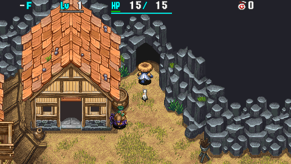
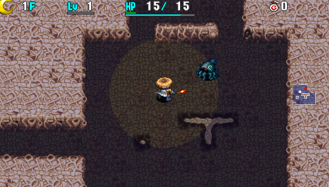

  

Dungeon where it's always night - daytime never arrives as a result of turns elapsing. The first clear is 29F and includes a boss fight, after which the full 99F version is unlocked. Carry-in items are allowed, so it's easy if you bring items like Lamp Shield and Monster Detector.

Bulldog Bracelet can be found at the end only when it's not in your inventory, storehouse, or warehouse. If you lose it after the first clear, you'll need to reach 99F to obtain it again.

<ul class="quickLinksUL">
  <li><a href="#overview">Overview</a></li>
  <li><a href="#strategy">Strategy</a></li>
  <li><a href="#floor-guide">Floor Guide</a></li>
  <li><a href="#monsters">Monsters</a></li>
  <li><a href="#items">Items</a></li>
  <li><a href="#traps">Traps</a></li>
</ul>

# Overview

<table class="dungeonOverview">
  <tr>
    <th>Unlock</th>
    <td class="highlightYellow">Go to Gonchiki Village after clearing the main story.</td>
  </tr>
  <tr>
    <th>Entrance</th>
    <td class="highlightYellow">Gonchiki Village (Cave near exit)</td>
  </tr>
</table>

<table class="dungeonTable">
  <tr>
    <th>Floors</th>
    <td>29F (first) / 99F</td>
    <th>Day / Night</th>
    <td>Night</td>
  </tr>
  <tr>
    <th>Bring Items</th>
    <td>Yes</td>
    <th>Allies</th>
    <td>No</td>
  </tr>
  <tr>
    <th>Unidentified</th>
    <td colspan="3">Weapons, shields, bracelets, pots</td>
  </tr>
  <tr>
    <th>Shops</th>
    <td>Regular, Elite, Pick-A-Choice</td>
    <th>Monster Houses</th>
    <td>Regular, Special</td>
  </tr>
  <tr>
    <th>Initial Enemies</th>
    <td>8~10</td>
    <th>Spawn Rate</th>
    <td>20</td>
  </tr>
  <tr>
    <th>Ominous aura</th>
    <td>No</td>
    <th>Winds of Kron</th>
    <td>1st: 1700 / 4th: 2000</td>
  </tr>
  <tr>
    <th>Clear Icon</th>
    <td class="clearIcon"></td>
    <th>Clear Bonus</th>
    <td>50,000,000</td>
  </tr>
  <tr>
    <th>Reward</th>
    <td colspan="3">Bulldog Bracelet --- If it's not in inventory, storehouse, or warehouse.</td>
  </tr>
</table>

※ Daytime lasts 15 turns if Night-Day Scroll is read.

# Strategy

<ul class="quickLinksUL">
  <li><a href="#general">General</a></li>
  <li><a href="#abilities">Abilities</a></li>
  <li><a href="#night-monster-ai">Night Monster AI</a></li>
</ul>

### General

Ability uses are limited, so there isn't much reason to linger on any given floor. Search for stairs using the torch + Lamp Shield resonance effect, which lights up the entire room. If you didn't bring a Lamp Shield, use zigzag movement to search for stairs a bit more efficiently.

Torches, Lamp Shield, and Monster Detector are top priority, and all of them can be found on the ground. Carry 3\~4 torches, Replenish Scrolls, healing items, and some items for escaping bad situations.

### Abilities

The standard is to include 2\~3 room type abilities, then fill remaining slots with attack abilities. See [Abilities](/system/necklace-abilities) for details.

- Room Cyclone
    - Great ability that wipes out all monsters in a room.
    - However, you generally need to use it 2 times in a row to defeat monsters.
- Darkroom
    - Weak, but inflicting Blind status on all monsters in the room is handy.
    - Can be used with Room Cyclone to finish off weak monsters, but beware of Absorbiphant types.
- Kaboom Bullet
    - One-shots most enemies, excluding certain end game or blue aura monsters.
- Sticky Shot or Bi-Direction Warp
    - Decent power and effective against enemies that can't be defeated using Kaboom Bullet.
- 8-Way Boom Bullet or 8-Way Slumber Shot
    - Particularly nice if you step on a Summon Trap.
    - Beware of Absorbiphant types if you use 8-Way Slumber Shot.
- Three Screams
    - One-shots enemies in 3 forward directions, but you don't gain exp or items.
    - It also works on Shopkeepers.
- Cluster Confusion
    - Counters higher level Fearabbits, but otherwise isn't essential.
    - Don't use it on floors where Absorbiphant and Explochin types appear.
- Last Stand
    - Roughly 80% chance to wipe out all monsters on a floor, but you collapse if it fails.
    - Might be nice for higher level Fearabbit and Dragon floors if you bring lots of Revival Grass.
- (Other abilities)
    - Piercing Arrow and Cross Boom Bullet are usable.
    - All other abilities are generally lacking in some way, so they're not worth including.

### Night Monster AI

There are 2 types of AI for night monsters in this game.

<ol>
  <li>Moves randomly similar to a Pumphantasm, and attacks any adjacent creature.</li>
  <li>Moves normally, and only attacks the player.</li>
</ol>

These 2 types are assigned by monster family:

<table id="monsterList" class="monsterPageTable">
  <tr>
    <th colspan="7">Monster (Family)</th>
  </tr>
  <tr>
    <th class="highlightGray">1</th>
    <th class="highlightGray">2</th>
    <th class="highlightGray">3</th>
    <th class="highlightGray">4</th>
    <th class="highlightGray">5</th>
    <th class="highlightGray">6</th>
    <th class="highlightGray">7</th>
  </tr>
  <tr>
    <td>Mamel</td>
    <td>Blade Bee</td>
    <td>Scorpion</td>
    <td>Field Knave</td>
    <td>Gyadon</td>
    <td>Dragon</td>
    <td>Foly</td>
  </tr>
  <tr>
    <td>Chintala</td>
    <td>Firepuff</td>
    <td>Absorbiphant</td>
    <td>Spin Polygon</td>
    <td>Flash Bird</td>
    <td>Mixer</td>
    <td>Floaty</td>
  </tr>
  <tr>
    <td>Seedie</td>
    <td>Kumonigiri</td>
    <td>Tiger Tosser</td>
    <td>Porky</td>
    <td>Yanpii</td>
    <td>Eligan</td>
    <td>Zapdon</td>
  </tr>
  <tr>
    <td>Froggo</td>
    <td>DJ Mage</td>
    <td>Boy Cart</td>
    <td>Pumphantasm</td>
    <td>Banana Novice</td>
    <td>Ironhead</td>
    <td>Maneater</td>
  </tr>
  <tr>
    <td>Bored Kappa</td>
    <td>Zalokleft</td>
    <td>Pop Tank</td>
    <td>Fearabbit</td>
    <td>Explochin</td>
    <td>Snacky</td>
    <td>Boss Type</td>
  </tr>
  <tr>
    <td>Hopodile</td>
    <td>Slime</td>
    <td>Gazer</td>
    <td>Traproid</td>
    <td>Gyaza</td>
    <td>Crow Tengu</td>
    <td>Shopkeeper</td>
  </tr>
  <tr>
    <td>Squid King</td>
    <td>Curse Girl</td>
    <td>N'dubba</td>
    <td>Kengo</td>
    <td>Cheer Ham</td>
    <td>Mutaikon</td>
    <td class="highlightGray"></td>
  </tr>
</table>

# Floor Guide

### 1-2F

Dark Kumonigiri (1-3F), Dark Squid King (1-2F), Evil Firepuff (1-3F), etc.

Leveled up night monsters are the leading cause of collapses at night, so watch the message window. Level up until you have at least 31 max HP before descending the stairs on 2F.

### 3-7F

Dark Pop Tank (3-7F), Dark Absorbiphant (4-6F), Dark Eligan (5-9F), Vile Slime (6-8F), etc.

Dark Pop Tank's cannonball blasts deal 30 damage, so maintain at least 31 HP at all times. Dark Absorbiphant appears, so don't use Cluster Confusion if your shield is weak. Dark Eligan can be defeated in 1 hit using Room Cyclone once you've leveled up a bit. Vile Slime can extinguish equipped torches, so don't let it act when adjacent.

### 8-13F

Dark Traproid (9-13F), Evil Explochin (10-12F), Evil Hipadile (10-14F), Dark Strong Cart (11-13F), etc.

Lots of monsters that have regular movement and track Shiren, so you'll burn through ability uses quickly. Monsters with auras start to become more common from around this point as well. Don't use Cluster Confusion on Evil Explochin floors.

Players who don't bring items usually start to struggle now without a Lamp Shield or Monster Detector.

### 14-19F

Evil Dragon (14-19F), Dark Dazikon (17-19F), Dark Digestiphant (18-20F), Bad Sr. Yanpii (15-18F), etc.

Evil Dragon's fire deals 40 damage, so try to maintain at least 41 HP at all times (21 HP with 1/2 Fire rune). Bad Sr. Yanpii's headbutt deals 25 damage which isn't too bad, but it can catch you off guard at times. Don't use Cluster Confusion on Dark Digestiphant floors.

### 20-29F

Dark Fearabbit (20-22F), Dark Vexing Kappa (22-24F), Dark Grampa Tank (24-29F), Dark MC Mage (28-30F), Dark Scarabbit (28-30F), etc.

There's potential to be one-shot by a leveled up monster after being attracted by a Dark Fearabbit, as well as accidents caused by Dark Vexing Kappa or Dark MC Mage, so rush stairs unless you're low on items. Dark Grampa Tank's cannonballs deal 40 damage, so maintain at least 41 HP at all times.

Organize your items before descending the stairs on 29F so that you have access to Replenish Scroll, Swift Grass, Seal Staff, and other useful items for the boss fight.

### Boss

Fight with Mr. Bulldog.

|Name|HP|Atk|Def|Exp|Skill|Drop|Notes|
|-|-|-|-|-|-|-|-|
|Mr. Bulldog|600|70|0|0|0|0%|Moves: ・Double Lariat - Deals damage (1 tile radius). ・Boulder Throw - Deals 50 or so damage (Ranged, 1 tile radius). ・Sumo Slap - Deals 20 or so damage + 10 tiles knockback. ・Call Monsters - Summons 2~3 monsters. ・Instant Recovery - Cures all status conditions.|

Mr. Bulldog's monster call summons Dark Eligagon, Bad Lime Zalokleft, or Dark Glare Bird. Status conditions are effective, but they're cured right away unless you use Swift Grass or Slow Staff. He has 600 HP, so depending on your ability set, you might not be able to defeat him with 8 uses. Replenish Scroll or Revival Grass (Undo Grass) can be used to refresh abilities, but if you don't have those, you'll have to hope for Replenish Scroll from a Bad Lime Zalokleft drop, or have Dark Eligagon defeat the boss.

### 30-35F

Dark Scarabbit (28-30F), Dark MC Mage (28-30F), Evil Sky Dragon (31-35F), Dark Squid Emperor (31-33F), Evil Oingodile (32-36F), etc.

Evil Sky Dragon's flame deals 50 damage from anywhere in the room. Dragon Grass and Lizard Shield can't be found, so you can't reduce fire damage if you didn't bring items. If you feel like Evil Archdragon and Evil Abyss Dragon are a bigger threat than higher level Fearabbits, go ahead and throw an Extinction Scroll at Evil Dragon (14-19F) or Evil Sky Dragon in this floor range.

### 36-42F

Evil Concusschin (36-39F), Dark Spongiderm (37-39F), Dark Item Knave (39-41F), Bad Iron Zalokleft (40-42F), Evil Hyper Gazer (40-42F), Dark Pierce Cart (42-44F), etc.

Don't use Cluster Confusion on Evil Concusschin or Dark Spongiderm floors. It may be tempting to hunt Bad Iron Zaloklefts for items, but it's probably not worth the trouble.

### 43-52F

Dark Pierce Cart (42-44F), Dark Steamroid (43-47F), Dark Gigahead (43-47F), Vile Pumpanshee (48-50F), Plump Mealy (50-52F), Bad Lt. Yanpii (51-53F), Vile Ooze (51-55F), etc.

Lots of monsters that have random movement and attack any adjacent creature. There's nothing too threatening on these floors, so Plump Mealy can be hunted for items if desired.

### 53-61F

Dark Ornery Tank (53-58F), Dark Twinkle Bird (53-55F), Dark Kappa Troll (54-56F), Dark Dozikon (56-58F), Evil Shihan (57-61F), Dark MC Wizard (58-60F), Dark Horrabbit (59-61F), etc.

Floor range with extremely dangerous monster combinations - rush stairs. In particular, Dark MC Wizard, Shihan, and Horrabbit overlap so there's a chance you'll lose your equipment. 1 Room Cyclone usually isn't enough to defeat monsters, so disable them first if you get surrounded.

Steady Shield is elite shop exclusive, so you likely won't have one on hand unless you brought one. If you don't have the Unmoving rune or a Steady Shield, use Cluster Confusion at the start of the floor.

### 62-63F

Dark Electroid (59-63F), Evil Fulminachin (62-64F), Wild Gyandora (62-64F), etc.

Nothing too threatening besides Evil Fulminachin, so consider this floor range a rest area.

### 64-69F

Evil Fulminachin (62-64F), Evil Archdragon (64-69F), Dark Knave King (64-66F), Dark Osmammoth (65-67F), etc.

Evil Archdragon's flame deals 60 damage from anywhere on the floor - Use healing items and rush stairs. Cluster Confusion is effective against it, but Evil Fulminachin and Dark Osmammoth make it hard to use.

### 70-73F

Dark Elizgagon (70-74F), Vile Blight Scorp (71-73F), Dark Shine Bird (71-73F), etc.

Dark Shine Birds combined with tanky enemies like Dark Elizgagon and Vile Blight Scorp. Be careful not to run out of ability uses before reaching the stairs.

### 74-83F

Dark MC Sorcerer (74-76F), Evil Porgon (75-80F), Dark Squid Kaiser (78-80F), Dark Mesmerikon (80-83F), Dark Gitan Mamel (80-85F), Vile Pumptergeist (81-83F), etc.

Dark MC Sorcerer and Dark Mesmerikon have special attacks that can easily make you collapse. Use Cluster Confusion and rush stairs if you don't have Lamp Shield or Monster Detector. Darkroom is effective at disabling monsters inside rooms.

### 84-87F

Dark Gitan Mamel (80-85F), Snide Kleptoad (84-89F), Dark Mixerdon (85-87F), Evil Detonachin (86-89F), etc.

Snide Kleptoad can one-shot you with blessed Gitan dropped by other Snide Kleptoads or Dark Gitan Mamels. Dark Mixerdon appears, providing the first and only chance to synthesize items in this dungeon. However, it's a bit late for synthesis at this point, so it's fine to ignore it and continue ahead.

### 88-93F

Evil Detonachin (86-89F), Dark Cranky Tank (88-93F), Dark Terrabbit (90-92F), Evil Boingodile (90-92F), etc.

Dark Cranky Tank fires 2 cannonballs that deal 60 damage each per turn. To make things worse, Dark Terrabbit's special attack can cause you to get surrounded by Dark Cranky Tanks. So to avoid that, use Cluster Confusion at the start of the floor on Terrabbit floors.

### 94-99F

Evil Abyss Dragon (94-99F), Evil Doom Gyaza (95-99F), Dark Crashdon (93-99F), Dark Cyberoid (93-99F)

The final rush where you have to overcome Evil Abyss Dragon's 70 damage flame breath. Other enemies are tanky enough to survive Kaboom Bullet at times, so it's easy to run out of ability uses. Remember to use Replenish Scrolls before your situation deteriorates if you have them on hand.

# Monsters

See [Monsters](/system/monsters) for individual monster details.

- S = Shop is possible
- P = Pick-A-Choice Shop is possible
- E = Elite Shop is possible
- H = Monster House is possible

Enemy Colors: Farming Useful Caution Dangerous Very Dangerous

<table class="monsterTable">
  <thead>
    <tr>
      <th>F</th>
      <th>S</th>
      <th>P</th>
      <th>E</th>
      <th>H</th>
      <th colspan="5">Monsters</th>
    </tr>
  </thead>
  <tbody>
    <tr>
      <th>1</th>
      <td class="highlightGray"></td>
      <td class="highlightGray"></td>
      <td class="highlightGray"></td>
      <td class="highlightGray"></td>
      <td class="">Dark Kumonigiri</td>
      <td class="">Dark Squid King</td>
      <td class="">Evil Firepuff</td>
      <td class="highlightGray"></td>
      <td class="highlightGray"></td>
    </tr>
    <tr>
      <th>2</th>
      <td class="highlightGray"></td>
      <td class="highlightGray"></td>
      <td class="highlightGray"></td>
      <td class="highlightMH"></td>
      <td class="">Dark Kumonigiri</td>
      <td class="">Dark Squid King</td>
      <td class="">Evil Firepuff</td>
      <td class="">Dark Bored Kappa</td>
      <td class="highlightGray"></td>
    </tr>
    <tr>
      <th>3</th>
      <td class="highlightGray"></td>
      <td class="highlightGray"></td>
      <td class="highlightGray"></td>
      <td class="highlightMH"></td>
      <td class="">Dark Kumonigiri</td>
      <td class="highlightDanger">Dark Pop Tank</td>
      <td class="">Evil Firepuff</td>
      <td class="">Dark Bored Kappa</td>
      <td class="highlightGray"></td>
    </tr>
    <tr>
      <th>4</th>
      <td class="highlightGray"></td>
      <td class="highlightGray"></td>
      <td class="highlightElite"></td>
      <td class="highlightMH"></td>
      <td class="">Dark Pit Mamel</td>
      <td class="highlightDanger">Dark Pop Tank</td>
      <td class="highlightDanger">Dark Absorbiphant</td>
      <td class="">Dark Bored Kappa</td>
      <td class="highlightGray"></td>
    </tr>
    <tr>
      <th>5</th>
      <td class="highlightGray"></td>
      <td class="highlightGray"></td>
      <td class="highlightElite"></td>
      <td class="highlightMH"></td>
      <td class="">Dark Pit Mamel</td>
      <td class="highlightDanger">Dark Pop Tank</td>
      <td class="highlightDanger">Dark Absorbiphant</td>
      <td class="">Dark Eligan</td>
      <td class="highlightGray"></td>
    </tr>
    <tr>
      <th>6</th>
      <td class="highlightGray"></td>
      <td class="highlightGray"></td>
      <td class="highlightElite"></td>
      <td class="highlightMH"></td>
      <td class="">Dark Pit Mamel</td>
      <td class="highlightDanger">Dark Pop Tank</td>
      <td class="highlightDanger">Dark Absorbiphant</td>
      <td class="">Dark Eligan</td>
      <td class="">Vile Slime</td>
    </tr>
    <tr>
      <th>7</th>
      <td class="highlightGray"></td>
      <td class="highlightGray"></td>
      <td class="highlightElite"></td>
      <td class="highlightMH"></td>
      <td class="">Dark Pit Mamel</td>
      <td class="highlightDanger">Dark Pop Tank</td>
      <td class="">Mean Cheer Ham</td>
      <td class="">Dark Eligan</td>
      <td class="">Vile Slime</td>
    </tr>
    <tr>
      <th>8</th>
      <td class="highlightGray"></td>
      <td class="highlightChoice"></td>
      <td class="highlightGray"></td>
      <td class="highlightMH"></td>
      <td class="">Dark Pit Mamel</td>
      <td class="">Evil Kengo</td>
      <td class="">Mean Cheer Ham</td>
      <td class="">Dark Eligan</td>
      <td class="">Vile Slime</td>
    </tr>
    <tr>
      <th>9</th>
      <td class="highlightGray"></td>
      <td class="highlightChoice"></td>
      <td class="highlightGray"></td>
      <td class="highlightMH"></td>
      <td class="">Dark Traproid</td>
      <td class="">Evil Kengo</td>
      <td class="">Mean Cheer Ham</td>
      <td class="">Dark Eligan</td>
      <td class="highlightUseful">Evil Floaty</td>
    </tr>
    <tr>
      <th>10</th>
      <td class="highlightGray"></td>
      <td class="highlightChoice"></td>
      <td class="highlightGray"></td>
      <td class="highlightMH"></td>
      <td class="">Dark Traproid</td>
      <td class="">Evil Kengo</td>
      <td class="">Evil Hipadile</td>
      <td class="highlightOffense">Evil Explochin</td>
      <td class="highlightUseful">Evil Floaty</td>
    </tr>
    <tr>
      <th>11</th>
      <td class="highlightGray"></td>
      <td class="highlightChoice"></td>
      <td class="highlightGray"></td>
      <td class="highlightMH"></td>
      <td class="">Dark Traproid</td>
      <td class="">Dark Strong Cart</td>
      <td class="">Evil Hipadile</td>
      <td class="highlightOffense">Evil Explochin</td>
      <td class="highlightUseful">Evil Floaty</td>
    </tr>
    <tr>
      <th>12</th>
      <td class="highlightShop"></td>
      <td class="highlightGray"></td>
      <td class="highlightGray"></td>
      <td class="highlightMH"></td>
      <td class="">Dark Traproid</td>
      <td class="">Dark Strong Cart</td>
      <td class="">Evil Hipadile</td>
      <td class="highlightOffense">Evil Explochin</td>
      <td class="">Evil Spin Polygon</td>
    </tr>
    <tr>
      <th>13</th>
      <td class="highlightShop"></td>
      <td class="highlightGray"></td>
      <td class="highlightGray"></td>
      <td class="highlightMH"></td>
      <td class="">Dark Traproid</td>
      <td class="">Dark Strong Cart</td>
      <td class="">Evil Hipadile</td>
      <td class="">Foul Curse Sister</td>
      <td class="">Evil Spin Polygon</td>
    </tr>
    <tr>
      <th>14</th>
      <td class="highlightShop"></td>
      <td class="highlightGray"></td>
      <td class="highlightGray"></td>
      <td class="highlightMH"></td>
      <td class="highlightOffense">Evil Dragon</td>
      <td class="">Dark DJ Mage</td>
      <td class="">Evil Hipadile</td>
      <td class="">Foul Curse Sister</td>
      <td class="">Evil Spin Polygon</td>
    </tr>
    <tr>
      <th>15</th>
      <td class="highlightShop"></td>
      <td class="highlightGray"></td>
      <td class="highlightGray"></td>
      <td class="highlightMH"></td>
      <td class="highlightOffense">Evil Dragon</td>
      <td class="">Dark DJ Mage</td>
      <td class="">Dark Hurler</td>
      <td class="">Foul Curse Sister</td>
      <td class="">Bad Sr. Yanpii</td>
    </tr>
    <tr>
      <th>16</th>
      <td class="highlightGray"></td>
      <td class="highlightGray"></td>
      <td class="highlightGray"></td>
      <td class="highlightMH"></td>
      <td class="highlightOffense">Evil Dragon</td>
      <td class="">Dark DJ Mage</td>
      <td class="">Dark Hurler</td>
      <td class="">Dark Eligagan</td>
      <td class="">Bad Sr. Yanpii</td>
    </tr>
    <tr>
      <th>17</th>
      <td class="highlightGray"></td>
      <td class="highlightGray"></td>
      <td class="highlightGray"></td>
      <td class="highlightMH"></td>
      <td class="highlightOffense">Evil Dragon</td>
      <td class="highlightOffense">Dark Dazikon</td>
      <td class="">Dark Hurler</td>
      <td class="">Dark Eligagan</td>
      <td class="">Bad Sr. Yanpii</td>
    </tr>
    <tr>
      <th>18</th>
      <td class="highlightGray"></td>
      <td class="highlightGray"></td>
      <td class="highlightGray"></td>
      <td class="highlightMH"></td>
      <td class="highlightOffense">Evil Dragon</td>
      <td class="highlightOffense">Dark Dazikon</td>
      <td class="highlightDanger">Dark Digestiphant</td>
      <td class="">Dark Eligagan</td>
      <td class="">Bad Sr. Yanpii</td>
    </tr>
    <tr>
      <th>19</th>
      <td class="highlightGray"></td>
      <td class="highlightGray"></td>
      <td class="highlightGray"></td>
      <td class="highlightMH"></td>
      <td class="highlightOffense">Evil Dragon</td>
      <td class="highlightOffense">Dark Dazikon</td>
      <td class="highlightDanger">Dark Digestiphant</td>
      <td class="">Dark Eligagan</td>
      <td class="">Vile Grime</td>
    </tr>
    <tr>
      <th>20</th>
      <td class="highlightGray"></td>
      <td class="highlightChoice"></td>
      <td class="highlightGray"></td>
      <td class="highlightMH"></td>
      <td class="highlightOffense">Dark Fearabbit</td>
      <td class="">Dark Chainhead</td>
      <td class="highlightDanger">Dark Digestiphant</td>
      <td class="">Dark Eligagan</td>
      <td class="">Vile Grime</td>
    </tr>
    <tr>
      <th>21</th>
      <td class="highlightGray"></td>
      <td class="highlightChoice"></td>
      <td class="highlightGray"></td>
      <td class="highlightMH"></td>
      <td class="highlightOffense">Dark Fearabbit</td>
      <td class="">Dark Chainhead</td>
      <td class="">Bad Falcon Tengu</td>
      <td class="">Dark Eligagan</td>
      <td class="">Vile Grime</td>
    </tr>
    <tr>
      <th>22</th>
      <td class="highlightGray"></td>
      <td class="highlightChoice"></td>
      <td class="highlightGray"></td>
      <td class="highlightMH"></td>
      <td class="highlightOffense">Dark Fearabbit</td>
      <td class="">Dark Chainhead</td>
      <td class="">Bad Falcon Tengu</td>
      <td class="">Vile Demon Scorp</td>
      <td class="highlightOffense">Dark Vexing Kappa</td>
    </tr>
    <tr>
      <th>23</th>
      <td class="highlightGray"></td>
      <td class="highlightChoice"></td>
      <td class="highlightGray"></td>
      <td class="highlightMH"></td>
      <td class="">Dark Pot Knave</td>
      <td class="">Dark Chainhead</td>
      <td class="">Bad Falcon Tengu</td>
      <td class="">Vile Demon Scorp</td>
      <td class="highlightOffense">Dark Vexing Kappa</td>
    </tr>
    <tr>
      <th>24</th>
      <td class="highlightGray"></td>
      <td class="highlightGray"></td>
      <td class="highlightElite"></td>
      <td class="highlightMH"></td>
      <td class="">Dark Pot Knave</td>
      <td class="">Dark Chainhead</td>
      <td class="highlightDanger">Dark Grampa Tank</td>
      <td class="">Vile Demon Scorp</td>
      <td class="highlightOffense">Dark Vexing Kappa</td>
    </tr>
    <tr>
      <th>25</th>
      <td class="highlightGray"></td>
      <td class="highlightGray"></td>
      <td class="highlightElite"></td>
      <td class="highlightMH"></td>
      <td class="">Dark Pot Knave</td>
      <td class="">Evil Porko</td>
      <td class="highlightDanger">Dark Grampa Tank</td>
      <td class="">Dark Eligagon</td>
      <td class="">Evil Flamepuff</td>
    </tr>
    <tr>
      <th>26</th>
      <td class="highlightGray"></td>
      <td class="highlightGray"></td>
      <td class="highlightElite"></td>
      <td class="highlightMH"></td>
      <td class="">Dark Glare Bird</td>
      <td class="">Evil Porko</td>
      <td class="highlightDanger">Dark Grampa Tank</td>
      <td class="">Dark Eligagon</td>
      <td class="">Evil Flamepuff</td>
    </tr>
    <tr>
      <th>27</th>
      <td class="highlightGray"></td>
      <td class="highlightGray"></td>
      <td class="highlightElite"></td>
      <td class="highlightMH"></td>
      <td class="">Dark Glare Bird</td>
      <td class="">Evil Porko</td>
      <td class="highlightDanger">Dark Grampa Tank</td>
      <td class="">Dark Eligagon</td>
      <td class="">Evil Flamepuff</td>
    </tr>
    <tr>
      <th>28</th>
      <td class="highlightGray"></td>
      <td class="highlightGray"></td>
      <td class="highlightGray"></td>
      <td class="highlightMH"></td>
      <td class="">Dark Glare Bird</td>
      <td class="highlightOffense">Dark MC Mage</td>
      <td class="highlightDanger">Dark Grampa Tank</td>
      <td class="">Dark Eligagon</td>
      <td class="highlightOffense">Dark Scarabbit</td>
    </tr>
    <tr>
      <th>29</th>
      <td class="highlightGray"></td>
      <td class="highlightGray"></td>
      <td class="highlightGray"></td>
      <td class="highlightMH"></td>
      <td class="">Foul Boss</td>
      <td class="highlightOffense">Dark MC Mage</td>
      <td class="highlightDanger">Dark Grampa Tank</td>
      <td class="">Dark Eligagon</td>
      <td class="highlightOffense">Dark Scarabbit</td>
    </tr>
    <tr>
      <th>30</th>
      <td class="highlightGray"></td>
      <td class="highlightGray"></td>
      <td class="highlightGray"></td>
      <td class="highlightMH"></td>
      <td class="">Foul Boss</td>
      <td class="highlightOffense">Dark MC Mage</td>
      <td class="">Dark Voltdon</td>
      <td class="">Dark Eligagon</td>
      <td class="highlightOffense">Dark Scarabbit</td>
    </tr>
    <tr>
      <th>31</th>
      <td class="highlightGray"></td>
      <td class="highlightGray"></td>
      <td class="highlightGray"></td>
      <td class="highlightMH"></td>
      <td class="">Foul Boss</td>
      <td class="highlightDanger">Evil Sky Dragon</td>
      <td class="">Dark Voltdon</td>
      <td class="highlightOffense">Dark Squid Emperor</td>
      <td class="">Evil Iai</td>
    </tr>
    <tr>
      <th>32</th>
      <td class="highlightGray"></td>
      <td class="highlightGray"></td>
      <td class="highlightGray"></td>
      <td class="highlightMH"></td>
      <td class="">Evil Oingodile</td>
      <td class="highlightDanger">Evil Sky Dragon</td>
      <td class="">Dark Voltdon</td>
      <td class="highlightOffense">Dark Squid Emperor</td>
      <td class="">Evil Iai</td>
    </tr>
    <tr>
      <th>33</th>
      <td class="highlightGray"></td>
      <td class="highlightGray"></td>
      <td class="highlightGray"></td>
      <td class="highlightMH"></td>
      <td class="">Evil Oingodile</td>
      <td class="highlightDanger">Evil Sky Dragon</td>
      <td class="">Dark Voltdon</td>
      <td class="highlightOffense">Dark Squid Emperor</td>
      <td class="">Evil Iai</td>
    </tr>
    <tr>
      <th>34</th>
      <td class="highlightGray"></td>
      <td class="highlightGray"></td>
      <td class="highlightGray"></td>
      <td class="highlightMH"></td>
      <td class="">Evil Oingodile</td>
      <td class="highlightDanger">Evil Sky Dragon</td>
      <td class="">Dark Voltdon</td>
      <td class="">Wild Gyairas</td>
      <td class="">Vile Pumphantom</td>
    </tr>
    <tr>
      <th>35</th>
      <td class="highlightGray"></td>
      <td class="highlightGray"></td>
      <td class="highlightGray"></td>
      <td class="highlightMH"></td>
      <td class="">Evil Oingodile</td>
      <td class="highlightDanger">Evil Sky Dragon</td>
      <td class="">Dark Voltdon</td>
      <td class="">Wild Gyairas</td>
      <td class="">Vile Pumphantom</td>
    </tr>
    <tr>
      <th>36</th>
      <td class="highlightShop"></td>
      <td class="highlightGray"></td>
      <td class="highlightGray"></td>
      <td class="highlightMH"></td>
      <td class="">Evil Oingodile</td>
      <td class="">Evil Blazepuff</td>
      <td class="highlightOffense">Evil Concusschin</td>
      <td class="">Wild Gyairas</td>
      <td class="">Vile Pumphantom</td>
    </tr>
    <tr>
      <th>37</th>
      <td class="highlightShop"></td>
      <td class="highlightGray"></td>
      <td class="highlightGray"></td>
      <td class="highlightMH"></td>
      <td class="highlightDanger">Dark Spongiderm</td>
      <td class="">Evil Blazepuff</td>
      <td class="highlightOffense">Evil Concusschin</td>
      <td class="">Evil Killer Gyaza</td>
      <td class="">Mean Go Ham</td>
    </tr>
    <tr>
      <th>38</th>
      <td class="highlightShop"></td>
      <td class="highlightGray"></td>
      <td class="highlightGray"></td>
      <td class="highlightMH"></td>
      <td class="highlightDanger">Dark Spongiderm</td>
      <td class="">Evil Blazepuff</td>
      <td class="highlightOffense">Evil Concusschin</td>
      <td class="">Evil Killer Gyaza</td>
      <td class="">Mean Go Ham</td>
    </tr>
    <tr>
      <th>39</th>
      <td class="highlightShop"></td>
      <td class="highlightGray"></td>
      <td class="highlightGray"></td>
      <td class="highlightMH"></td>
      <td class="highlightDanger">Dark Spongiderm</td>
      <td class="">Evil Sing Polygon</td>
      <td class="highlightDanger">Dark Item Knave</td>
      <td class="">Evil Killer Gyaza</td>
      <td class="">Mean Go Ham</td>
    </tr>
    <tr>
      <th>40</th>
      <td class="highlightGray"></td>
      <td class="highlightGray"></td>
      <td class="highlightElite"></td>
      <td class="highlightMH"></td>
      <td class="highlightFarming">Bad Iron Zalokleft</td>
      <td class="">Evil Sing Polygon</td>
      <td class="highlightDanger">Dark Item Knave</td>
      <td class="">Evil Killer Gyaza</td>
      <td class="">Evil Hyper Gazer</td>
    </tr>
    <tr>
      <th>41</th>
      <td class="highlightGray"></td>
      <td class="highlightGray"></td>
      <td class="highlightElite"></td>
      <td class="highlightMH"></td>
      <td class="highlightFarming">Bad Iron Zalokleft</td>
      <td class="">Evil Sing Polygon</td>
      <td class="highlightDanger">Dark Item Knave</td>
      <td class="">Evil Killer Gyaza</td>
      <td class="">Evil Hyper Gazer</td>
    </tr>
    <tr>
      <th>42</th>
      <td class="highlightGray"></td>
      <td class="highlightGray"></td>
      <td class="highlightElite"></td>
      <td class="highlightMH"></td>
      <td class="highlightFarming">Bad Iron Zalokleft</td>
      <td class="">Dark Katana Bee</td>
      <td class="">Dark Pierce Cart</td>
      <td class="">Evil Killer Gyaza</td>
      <td class="">Evil Hyper Gazer</td>
    </tr>
    <tr>
      <th>43</th>
      <td class="highlightGray"></td>
      <td class="highlightGray"></td>
      <td class="highlightElite"></td>
      <td class="highlightMH"></td>
      <td class="">Dark Cave Mamel</td>
      <td class="">Dark Katana Bee</td>
      <td class="">Dark Pierce Cart</td>
      <td class="">Dark Gigahead</td>
      <td class="">Dark Steamroid</td>
    </tr>
    <tr>
      <th>44</th>
      <td class="highlightGray"></td>
      <td class="highlightChoice"></td>
      <td class="highlightGray"></td>
      <td class="highlightMH"></td>
      <td class="">Dark Cave Mamel</td>
      <td class="">Dark Katana Bee</td>
      <td class="">Dark Pierce Cart</td>
      <td class="">Dark Gigahead</td>
      <td class="">Dark Steamroid</td>
    </tr>
    <tr>
      <th>45</th>
      <td class="highlightGray"></td>
      <td class="highlightChoice"></td>
      <td class="highlightGray"></td>
      <td class="highlightMH"></td>
      <td class="">Dark Cave Mamel</td>
      <td class="">Dark Katana Bee</td>
      <td class="">Foul Curse Mom</td>
      <td class="">Dark Gigahead</td>
      <td class="">Dark Steamroid</td>
    </tr>
    <tr>
      <th>46</th>
      <td class="highlightGray"></td>
      <td class="highlightChoice"></td>
      <td class="highlightGray"></td>
      <td class="highlightMH"></td>
      <td class="">Dark Cave Mamel</td>
      <td class="">Dark Katana Bee</td>
      <td class="">Foul Curse Mom</td>
      <td class="">Dark Gigahead</td>
      <td class="">Dark Steamroid</td>
    </tr>
    <tr>
      <th>47</th>
      <td class="highlightGray"></td>
      <td class="highlightChoice"></td>
      <td class="highlightGray"></td>
      <td class="highlightMH"></td>
      <td class="">Dark Cave Mamel</td>
      <td class="">Vile Stun Scorp</td>
      <td class="">Foul Curse Mom</td>
      <td class="">Dark Gigahead</td>
      <td class="">Dark Steamroid</td>
    </tr>
    <tr>
      <th>48</th>
      <td class="highlightGray"></td>
      <td class="highlightGray"></td>
      <td class="highlightGray"></td>
      <td class="highlightMH"></td>
      <td class="">Evil Huge Chintala</td>
      <td class="">Vile Stun Scorp</td>
      <td class="">Dark Nuttie</td>
      <td class="">Vile Pumpanshee</td>
      <td class="highlightUseful">Evil Jouncy</td>
    </tr>
    <tr>
      <th>49</th>
      <td class="highlightGray"></td>
      <td class="highlightGray"></td>
      <td class="highlightGray"></td>
      <td class="highlightMH"></td>
      <td class="">Evil Huge Chintala</td>
      <td class="">Vile Stun Scorp</td>
      <td class="">Dark Nuttie</td>
      <td class="">Vile Pumpanshee</td>
      <td class="highlightUseful">Evil Jouncy</td>
    </tr>
    <tr>
      <th>50</th>
      <td class="highlightGray"></td>
      <td class="highlightGray"></td>
      <td class="highlightGray"></td>
      <td class="highlightMH"></td>
      <td class="">Evil Huge Chintala</td>
      <td class="highlightFarming">Plump Mealy</td>
      <td class="">Dark Nuttie</td>
      <td class="">Vile Pumpanshee</td>
      <td class="highlightUseful">Evil Jouncy</td>
    </tr>
    <tr>
      <th>51</th>
      <td class="highlightGray"></td>
      <td class="highlightGray"></td>
      <td class="highlightGray"></td>
      <td class="highlightMH"></td>
      <td class="">Evil Huge Chintala</td>
      <td class="highlightFarming">Plump Mealy</td>
      <td class="">Dark Nuttie</td>
      <td class="">Bad Lt. Yanpii</td>
      <td class="">Vile Ooze</td>
    </tr>
    <tr>
      <th>52</th>
      <td class="highlightGray"></td>
      <td class="highlightChoice"></td>
      <td class="highlightGray"></td>
      <td class="highlightMH"></td>
      <td class="">Evil Huge Chintala</td>
      <td class="highlightFarming">Plump Mealy</td>
      <td class="">Dark Nuttie</td>
      <td class="">Bad Lt. Yanpii</td>
      <td class="">Vile Ooze</td>
    </tr>
    <tr>
      <th>53</th>
      <td class="highlightGray"></td>
      <td class="highlightChoice"></td>
      <td class="highlightGray"></td>
      <td class="highlightMH"></td>
      <td class="highlightDanger">Dark Ornery Tank</td>
      <td class="">Dark Onigirizzly</td>
      <td class="">Dark Twinkle Bird</td>
      <td class="">Bad Lt. Yanpii</td>
      <td class="">Vile Ooze</td>
    </tr>
    <tr>
      <th>54</th>
      <td class="highlightGray"></td>
      <td class="highlightChoice"></td>
      <td class="highlightGray"></td>
      <td class="highlightMH"></td>
      <td class="highlightDanger">Dark Ornery Tank</td>
      <td class="">Dark Onigirizzly</td>
      <td class="">Dark Twinkle Bird</td>
      <td class="highlightOffense">Dark Kappa Troll</td>
      <td class="">Vile Ooze</td>
    </tr>
    <tr>
      <th>55</th>
      <td class="highlightGray"></td>
      <td class="highlightChoice"></td>
      <td class="highlightGray"></td>
      <td class="highlightMH"></td>
      <td class="highlightDanger">Dark Ornery Tank</td>
      <td class="">Dark Onigirizzly</td>
      <td class="">Dark Twinkle Bird</td>
      <td class="highlightOffense">Dark Kappa Troll</td>
      <td class="">Vile Ooze</td>
    </tr>
    <tr>
      <th>56</th>
      <td class="highlightShop"></td>
      <td class="highlightGray"></td>
      <td class="highlightGray"></td>
      <td class="highlightMH"></td>
      <td class="highlightDanger">Dark Ornery Tank</td>
      <td class="">Dark Onigirizzly</td>
      <td class="">Dark Ace</td>
      <td class="highlightOffense">Dark Kappa Troll</td>
      <td class="highlightExtreme">Dark Dozikon</td>
    </tr>
    <tr>
      <th>57</th>
      <td class="highlightShop"></td>
      <td class="highlightGray"></td>
      <td class="highlightGray"></td>
      <td class="highlightMH"></td>
      <td class="highlightDanger">Dark Ornery Tank</td>
      <td class="">Dark Onigirizzly</td>
      <td class="">Dark Ace</td>
      <td class="">Evil Shihan</td>
      <td class="highlightExtreme">Dark Dozikon</td>
    </tr>
    <tr>
      <th>58</th>
      <td class="highlightShop"></td>
      <td class="highlightGray"></td>
      <td class="highlightGray"></td>
      <td class="highlightMH"></td>
      <td class="highlightDanger">Dark Ornery Tank</td>
      <td class="highlightExtreme">Dark MC Wizard</td>
      <td class="">Dark Ace</td>
      <td class="">Evil Shihan</td>
      <td class="highlightExtreme">Dark Dozikon</td>
    </tr>
    <tr>
      <th>59</th>
      <td class="highlightShop"></td>
      <td class="highlightGray"></td>
      <td class="highlightGray"></td>
      <td class="highlightMH"></td>
      <td class="">Dark Electroid</td>
      <td class="highlightExtreme">Dark MC Wizard</td>
      <td class="">Dark Ace</td>
      <td class="">Evil Shihan</td>
      <td class="highlightExtreme">Dark Horrabbit</td>
    </tr>
    <tr>
      <th>60</th>
      <td class="highlightGray"></td>
      <td class="highlightGray"></td>
      <td class="highlightElite"></td>
      <td class="highlightMH"></td>
      <td class="">Dark Electroid</td>
      <td class="highlightExtreme">Dark MC Wizard</td>
      <td class="">Dark Ace</td>
      <td class="">Evil Shihan</td>
      <td class="highlightExtreme">Dark Horrabbit</td>
    </tr>
    <tr>
      <th>61</th>
      <td class="highlightGray"></td>
      <td class="highlightGray"></td>
      <td class="highlightElite"></td>
      <td class="highlightMH"></td>
      <td class="">Dark Electroid</td>
      <td class="">Bad Eagle Tengu</td>
      <td class="">Evil Pyrepuff</td>
      <td class="">Evil Shihan</td>
      <td class="highlightExtreme">Dark Horrabbit</td>
    </tr>
    <tr>
      <th>62</th>
      <td class="highlightGray"></td>
      <td class="highlightGray"></td>
      <td class="highlightElite"></td>
      <td class="highlightMH"></td>
      <td class="">Dark Electroid</td>
      <td class="">Bad Eagle Tengu</td>
      <td class="">Evil Pyrepuff</td>
      <td class="highlightOffense">Evil Fulminachin</td>
      <td class="">Wild Gyandora</td>
    </tr>
    <tr>
      <th>63</th>
      <td class="highlightGray"></td>
      <td class="highlightGray"></td>
      <td class="highlightElite"></td>
      <td class="highlightMH"></td>
      <td class="">Dark Electroid</td>
      <td class="">Bad Eagle Tengu</td>
      <td class="">Evil Pyrepuff</td>
      <td class="highlightOffense">Evil Fulminachin</td>
      <td class="">Wild Gyandora</td>
    </tr>
    <tr>
      <th>64</th>
      <td class="highlightGray"></td>
      <td class="highlightGray"></td>
      <td class="highlightGray"></td>
      <td class="highlightMH"></td>
      <td class="highlightExtreme">Evil Archdragon</td>
      <td class="highlightDanger">Dark Knave King</td>
      <td class="">Mean Rally Ham</td>
      <td class="highlightOffense">Evil Fulminachin</td>
      <td class="">Wild Gyandora</td>
    </tr>
    <tr>
      <th>65</th>
      <td class="highlightGray"></td>
      <td class="highlightGray"></td>
      <td class="highlightGray"></td>
      <td class="highlightMH"></td>
      <td class="highlightExtreme">Evil Archdragon</td>
      <td class="highlightDanger">Dark Knave King</td>
      <td class="">Mean Rally Ham</td>
      <td class="">Dark Zanbeeto</td>
      <td class="highlightDanger">Dark Osmammoth</td>
    </tr>
    <tr>
      <th>66</th>
      <td class="highlightGray"></td>
      <td class="highlightGray"></td>
      <td class="highlightGray"></td>
      <td class="highlightMH"></td>
      <td class="highlightExtreme">Evil Archdragon</td>
      <td class="highlightDanger">Dark Knave King</td>
      <td class="">Mean Rally Ham</td>
      <td class="">Dark Zanbeeto</td>
      <td class="highlightDanger">Dark Osmammoth</td>
    </tr>
    <tr>
      <th>67</th>
      <td class="highlightGray"></td>
      <td class="highlightGray"></td>
      <td class="highlightGray"></td>
      <td class="highlightMH"></td>
      <td class="highlightExtreme">Evil Archdragon</td>
      <td class="">Evil Mosh Polygon</td>
      <td class="">Mean Rally Ham</td>
      <td class="">Dark Zanbeeto</td>
      <td class="highlightDanger">Dark Osmammoth</td>
    </tr>
    <tr>
      <th>68</th>
      <td class="highlightGray"></td>
      <td class="highlightGray"></td>
      <td class="highlightElite"></td>
      <td class="highlightMH"></td>
      <td class="highlightExtreme">Evil Archdragon</td>
      <td class="">Evil Mosh Polygon</td>
      <td class="">Mean Rally Ham</td>
      <td class="">Dark Zanbeeto</td>
      <td class="highlightFarming">Bad Fade Zalokleft</td>
    </tr>
    <tr>
      <th>69</th>
      <td class="highlightGray"></td>
      <td class="highlightGray"></td>
      <td class="highlightElite"></td>
      <td class="highlightMH"></td>
      <td class="highlightExtreme">Evil Archdragon</td>
      <td class="">Evil Mosh Polygon</td>
      <td class="">Mean Rally Ham</td>
      <td class="">Dark Zanbeeto</td>
      <td class="highlightFarming">Bad Fade Zalokleft</td>
    </tr>
    <tr>
      <th>70</th>
      <td class="highlightGray"></td>
      <td class="highlightGray"></td>
      <td class="highlightElite"></td>
      <td class="highlightMH"></td>
      <td class="">Dark Elizgagon</td>
      <td class="">Foul Curse Gramma</td>
      <td class="">Foul Master</td>
      <td class="">Dark Zanbeeto</td>
      <td class="highlightFarming">Bad Fade Zalokleft</td>
    </tr>
    <tr>
      <th>71</th>
      <td class="highlightGray"></td>
      <td class="highlightGray"></td>
      <td class="highlightElite"></td>
      <td class="highlightMH"></td>
      <td class="">Dark Elizgagon</td>
      <td class="">Foul Curse Gramma</td>
      <td class="">Foul Master</td>
      <td class="">Vile Blight Scorp</td>
      <td class="highlightOffense">Dark Shine Bird</td>
    </tr>
    <tr>
      <th>72</th>
      <td class="highlightShop"></td>
      <td class="highlightGray"></td>
      <td class="highlightGray"></td>
      <td class="highlightMH"></td>
      <td class="">Dark Elizgagon</td>
      <td class="">Foul Curse Gramma</td>
      <td class="">Foul Master</td>
      <td class="">Vile Blight Scorp</td>
      <td class="highlightOffense">Dark Shine Bird</td>
    </tr>
    <tr>
      <th>73</th>
      <td class="highlightShop"></td>
      <td class="highlightGray"></td>
      <td class="highlightGray"></td>
      <td class="highlightMH"></td>
      <td class="">Dark Elizgagon</td>
      <td class="highlightFarming">Snide Froggon</td>
      <td class="">Evil Boingodile</td>
      <td class="">Vile Blight Scorp</td>
      <td class="highlightOffense">Dark Shine Bird</td>
    </tr>
    <tr>
      <th>74</th>
      <td class="highlightShop"></td>
      <td class="highlightGray"></td>
      <td class="highlightGray"></td>
      <td class="highlightMH"></td>
      <td class="">Dark Elizgagon</td>
      <td class="highlightFarming">Snide Froggon</td>
      <td class="">Evil Boingodile</td>
      <td class="">Vile Sludge</td>
      <td class="highlightExtreme">Dark MC Sorcerer</td>
    </tr>
    <tr>
      <th>75</th>
      <td class="highlightShop"></td>
      <td class="highlightGray"></td>
      <td class="highlightGray"></td>
      <td class="highlightMH"></td>
      <td class="highlightDanger">Evil Porgon</td>
      <td class="highlightFarming">Snide Froggon</td>
      <td class="">Evil Boingodile</td>
      <td class="">Vile Sludge</td>
      <td class="highlightExtreme">Dark MC Sorcerer</td>
    </tr>
    <tr>
      <th>76</th>
      <td class="highlightGray"></td>
      <td class="highlightChoice"></td>
      <td class="highlightGray"></td>
      <td class="highlightMH"></td>
      <td class="highlightDanger">Evil Porgon</td>
      <td class="highlightFarming">Snide Froggon</td>
      <td class="">Evil Boingodile</td>
      <td class="">Vile Sludge</td>
      <td class="highlightExtreme">Dark MC Sorcerer</td>
    </tr>
    <tr>
      <th>77</th>
      <td class="highlightGray"></td>
      <td class="highlightChoice"></td>
      <td class="highlightGray"></td>
      <td class="highlightMH"></td>
      <td class="highlightDanger">Evil Porgon</td>
      <td class="highlightFarming">Snide Froggon</td>
      <td class="">Evil Boingodile</td>
      <td class="">Bad Boss Yanpii</td>
      <td class="">Evil Tatsujin</td>
    </tr>
    <tr>
      <th>78</th>
      <td class="highlightGray"></td>
      <td class="highlightChoice"></td>
      <td class="highlightGray"></td>
      <td class="highlightMH"></td>
      <td class="highlightDanger">Evil Porgon</td>
      <td class="highlightOffense">Dark Squid Kaiser</td>
      <td class="">Evil Boingodile</td>
      <td class="">Bad Boss Yanpii</td>
      <td class="">Evil Tatsujin</td>
    </tr>
    <tr>
      <th>79</th>
      <td class="highlightGray"></td>
      <td class="highlightChoice"></td>
      <td class="highlightGray"></td>
      <td class="highlightMH"></td>
      <td class="highlightDanger">Evil Porgon</td>
      <td class="highlightOffense">Dark Squid Kaiser</td>
      <td class="">Dark Doomhead</td>
      <td class="">Bad Boss Yanpii</td>
      <td class="">Evil Tatsujin</td>
    </tr>
    <tr>
      <th>80</th>
      <td class="highlightGray"></td>
      <td class="highlightGray"></td>
      <td class="highlightGray"></td>
      <td class="highlightMH"></td>
      <td class="highlightDanger">Evil Porgon</td>
      <td class="highlightOffense">Dark Squid Kaiser</td>
      <td class="">Dark Doomhead</td>
      <td class="">Dark Gitan Mamel</td>
      <td class="highlightExtreme">Dark Mesmerikon</td>
    </tr>
    <tr>
      <th>81</th>
      <td class="highlightGray"></td>
      <td class="highlightGray"></td>
      <td class="highlightGray"></td>
      <td class="highlightMH"></td>
      <td class="">Vile Pumptergeist</td>
      <td class="">Bad Phoenix Tengu</td>
      <td class="">Dark Doomhead</td>
      <td class="">Dark Gitan Mamel</td>
      <td class="highlightExtreme">Dark Mesmerikon</td>
    </tr>
    <tr>
      <th>82</th>
      <td class="highlightGray"></td>
      <td class="highlightGray"></td>
      <td class="highlightGray"></td>
      <td class="highlightMH"></td>
      <td class="">Vile Pumptergeist</td>
      <td class="">Bad Phoenix Tengu</td>
      <td class="">Dark Doomhead</td>
      <td class="">Dark Gitan Mamel</td>
      <td class="highlightExtreme">Dark Mesmerikon</td>
    </tr>
    <tr>
      <th>83</th>
      <td class="highlightGray"></td>
      <td class="highlightGray"></td>
      <td class="highlightGray"></td>
      <td class="highlightMH"></td>
      <td class="">Vile Pumptergeist</td>
      <td class="">Bad Phoenix Tengu</td>
      <td class="">Dark Doomhead</td>
      <td class="">Dark Gitan Mamel</td>
      <td class="highlightGray"></td>
    </tr>
    <tr>
      <th>84</th>
      <td class="highlightShop"></td>
      <td class="highlightGray"></td>
      <td class="highlightGray"></td>
      <td class="highlightMH"></td>
      <td class="">Wild Gyandoron</td>
      <td class="highlightExtreme">Snide Kleptoad</td>
      <td class="">Dark Doomhead</td>
      <td class="">Dark Gitan Mamel</td>
      <td class="highlightGray"></td>
    </tr>
    <tr>
      <th>85</th>
      <td class="highlightShop"></td>
      <td class="highlightGray"></td>
      <td class="highlightGray"></td>
      <td class="highlightMH"></td>
      <td class="">Wild Gyandoron</td>
      <td class="highlightExtreme">Snide Kleptoad</td>
      <td class="highlightUseful">Dark Mixerdon</td>
      <td class="">Dark Gitan Mamel</td>
      <td class="highlightGray"></td>
    </tr>
    <tr>
      <th>86</th>
      <td class="highlightShop"></td>
      <td class="highlightGray"></td>
      <td class="highlightGray"></td>
      <td class="highlightMH"></td>
      <td class="">Wild Gyandoron</td>
      <td class="highlightExtreme">Snide Kleptoad</td>
      <td class="highlightUseful">Dark Mixerdon</td>
      <td class="highlightOffense">Evil Detonachin</td>
      <td class="highlightGray"></td>
    </tr>
    <tr>
      <th>87</th>
      <td class="highlightShop"></td>
      <td class="highlightGray"></td>
      <td class="highlightGray"></td>
      <td class="highlightMH"></td>
      <td class="">Mean Spirit Ham</td>
      <td class="highlightExtreme">Snide Kleptoad</td>
      <td class="highlightUseful">Dark Mixerdon</td>
      <td class="highlightOffense">Evil Detonachin</td>
      <td class="highlightGray"></td>
    </tr>
    <tr>
      <th>88</th>
      <td class="highlightGray"></td>
      <td class="highlightGray"></td>
      <td class="highlightElite"></td>
      <td class="highlightMH"></td>
      <td class="">Mean Spirit Ham</td>
      <td class="highlightExtreme">Snide Kleptoad</td>
      <td class="highlightExtreme">Dark Cranky Tank</td>
      <td class="highlightOffense">Evil Detonachin</td>
      <td class="highlightGray"></td>
    </tr>
    <tr>
      <th>89</th>
      <td class="highlightGray"></td>
      <td class="highlightGray"></td>
      <td class="highlightElite"></td>
      <td class="highlightMH"></td>
      <td class="">Mean Spirit Ham</td>
      <td class="highlightExtreme">Snide Kleptoad</td>
      <td class="highlightExtreme">Dark Cranky Tank</td>
      <td class="highlightOffense">Evil Detonachin</td>
      <td class="highlightGray"></td>
    </tr>
    <tr>
      <th>90</th>
      <td class="highlightGray"></td>
      <td class="highlightGray"></td>
      <td class="highlightElite"></td>
      <td class="highlightMH"></td>
      <td class="">Dark Grainie</td>
      <td class="">Evil Boingodile</td>
      <td class="highlightExtreme">Dark Cranky Tank</td>
      <td class="highlightExtreme">Dark Terrabbit</td>
      <td class="highlightGray"></td>
    </tr>
    <tr>
      <th>91</th>
      <td class="highlightGray"></td>
      <td class="highlightGray"></td>
      <td class="highlightElite"></td>
      <td class="highlightMH"></td>
      <td class="">Dark Grainie</td>
      <td class="">Evil Boingodile</td>
      <td class="highlightExtreme">Dark Cranky Tank</td>
      <td class="highlightExtreme">Dark Terrabbit</td>
      <td class="highlightGray"></td>
    </tr>
    <tr>
      <th>92</th>
      <td class="highlightGray"></td>
      <td class="highlightChoice"></td>
      <td class="highlightGray"></td>
      <td class="highlightMH"></td>
      <td class="">Dark Grainie</td>
      <td class="">Evil Boingodile</td>
      <td class="highlightExtreme">Dark Cranky Tank</td>
      <td class="highlightExtreme">Dark Terrabbit</td>
      <td class="highlightGray"></td>
    </tr>
    <tr>
      <th>93</th>
      <td class="highlightGray"></td>
      <td class="highlightChoice"></td>
      <td class="highlightGray"></td>
      <td class="highlightMH"></td>
      <td class="">Dark Grainie</td>
      <td class="">Dark Crashdon</td>
      <td class="highlightExtreme">Dark Cranky Tank</td>
      <td class="">Dark Cyberoid</td>
      <td class="highlightGray"></td>
    </tr>
    <tr>
      <th>94</th>
      <td class="highlightGray"></td>
      <td class="highlightChoice"></td>
      <td class="highlightGray"></td>
      <td class="highlightMH"></td>
      <td class="">Dark Grainie</td>
      <td class="">Dark Crashdon</td>
      <td class="highlightExtreme">Evil Abyss Dragon</td>
      <td class="">Dark Cyberoid</td>
      <td class="highlightGray"></td>
    </tr>
    <tr>
      <th>95</th>
      <td class="highlightGray"></td>
      <td class="highlightChoice"></td>
      <td class="highlightGray"></td>
      <td class="highlightMH"></td>
      <td class="">Evil Doom Gyaza</td>
      <td class="">Dark Crashdon</td>
      <td class="highlightExtreme">Evil Abyss Dragon</td>
      <td class="">Dark Cyberoid</td>
      <td class="highlightGray"></td>
    </tr>
    <tr>
      <th>96</th>
      <td class="highlightGray"></td>
      <td class="highlightGray"></td>
      <td class="highlightGray"></td>
      <td class="highlightMH"></td>
      <td class="">Evil Doom Gyaza</td>
      <td class="">Dark Crashdon</td>
      <td class="highlightExtreme">Evil Abyss Dragon</td>
      <td class="">Dark Cyberoid</td>
      <td class="highlightGray"></td>
    </tr>
    <tr>
      <th>97</th>
      <td class="highlightGray"></td>
      <td class="highlightGray"></td>
      <td class="highlightGray"></td>
      <td class="highlightMH"></td>
      <td class="">Evil Doom Gyaza</td>
      <td class="">Dark Crashdon</td>
      <td class="highlightExtreme">Evil Abyss Dragon</td>
      <td class="">Dark Cyberoid</td>
      <td class="highlightGray"></td>
    </tr>
    <tr>
      <th>98</th>
      <td class="highlightGray"></td>
      <td class="highlightGray"></td>
      <td class="highlightGray"></td>
      <td class="highlightMH"></td>
      <td class="">Evil Doom Gyaza</td>
      <td class="">Dark Crashdon</td>
      <td class="highlightExtreme">Evil Abyss Dragon</td>
      <td class="">Dark Cyberoid</td>
      <td class="highlightGray"></td>
    </tr>
    <tr>
      <th>99</th>
      <td class="highlightGray"></td>
      <td class="highlightGray"></td>
      <td class="highlightGray"></td>
      <td class="highlightMH"></td>
      <td class="">Evil Doom Gyaza</td>
      <td class="">Dark Crashdon</td>
      <td class="highlightExtreme">Evil Abyss Dragon</td>
      <td class="">Dark Cyberoid</td>
      <td class="highlightGray"></td>
    </tr>
  </tbody>
</table>

# Items

- F = Floor
- S = Shop, Monster (night), Shiny Object (yellow)
- P = Presto Pot
- Z = Zalokleft
- E = Elite Shop, Pick-A-Choice, Shiny Object (blue)

 

<table class="dungeonItemTable">
  <tr>
    <th colspan="6" class="highlightGreen">Weapon</th>
    <th rowspan="82"></th>
    <th colspan="6" class="highlightGreen">Bracelet</th>
    <th rowspan="82"></th>
    <th colspan="6" class="highlightGreen">Scroll</th>
  </tr>
  <tr>
    <th>Name</th>
    <th>F</th>
    <th>S</th>
    <th>P</th>
    <th>Z</th>
    <th>E</th>
    <th>Name</th>
    <th>F</th>
    <th>S</th>
    <th>P</th>
    <th>Z</th>
    <th>E</th>
    <th>Name</th>
    <th>F</th>
    <th>S</th>
    <th>P</th>
    <th>Z</th>
    <th>E</th>
  </tr>
  <tr>
    <td class="leftText">Palm Stick</td>
    <td>X</td>
    <td></td>
    <td>X</td>
    <td>X</td>
    <td></td>
    <td class="leftText">Pierce Bracelet</td>
    <td>X</td>
    <td>X</td>
    <td>X</td>
    <td>X</td>
    <td></td>
    <td class="leftText">Navigation Scroll</td>
    <td>X</td>
    <td>X</td>
    <td>X</td>
    <td>X</td>
    <td></td>
  </tr>
  <tr>
    <td class="leftText">Copper Edge</td>
    <td>X</td>
    <td></td>
    <td>X</td>
    <td>X</td>
    <td></td>
    <td class="leftText">Heal Bracelet</td>
    <td>X</td>
    <td>X</td>
    <td>X</td>
    <td>X</td>
    <td>X</td>
    <td class="leftText">Purify Scroll</td>
    <td>X</td>
    <td>X</td>
    <td>X</td>
    <td>X</td>
    <td></td>
  </tr>
  <tr>
    <td class="leftText">Katana</td>
    <td>X</td>
    <td></td>
    <td>X</td>
    <td>X</td>
    <td></td>
    <td class="leftText">Calm Bracelet</td>
    <td>X</td>
    <td>X</td>
    <td>X</td>
    <td>X</td>
    <td></td>
    <td class="leftText">Identify Scroll</td>
    <td>X</td>
    <td>X</td>
    <td>X</td>
    <td>X</td>
    <td></td>
  </tr>
  <tr>
    <td class="leftText">Beast Fang</td>
    <td>X</td>
    <td></td>
    <td>X</td>
    <td>X</td>
    <td></td>
    <td class="leftText">Holy Bracelet</td>
    <td>X</td>
    <td>X</td>
    <td>X</td>
    <td>X</td>
    <td>X</td>
    <td class="leftText">Heaven Scroll</td>
    <td>X</td>
    <td>X</td>
    <td>X</td>
    <td>X</td>
    <td></td>
  </tr>
  <tr>
    <td class="leftText">Dotanuki</td>
    <td>X</td>
    <td></td>
    <td>X</td>
    <td>X</td>
    <td></td>
    <td class="leftText">Alert Bracelet</td>
    <td>X</td>
    <td>X</td>
    <td>X</td>
    <td>X</td>
    <td></td>
    <td class="leftText">Earth Scroll</td>
    <td>X</td>
    <td>X</td>
    <td>X</td>
    <td>X</td>
    <td></td>
  </tr>
  <tr>
    <td class="leftText">Meteor Edge</td>
    <td>X</td>
    <td></td>
    <td>X</td>
    <td>X</td>
    <td>X</td>
    <td class="leftText">Cleansing Bracelet</td>
    <td>X</td>
    <td>X</td>
    <td>X</td>
    <td>X</td>
    <td></td>
    <td class="leftText">Plating Scroll</td>
    <td>X</td>
    <td>X</td>
    <td>X</td>
    <td>X</td>
    <td></td>
  </tr>
  <tr>
    <td class="leftText">Red Blade</td>
    <td></td>
    <td></td>
    <td></td>
    <td></td>
    <td>X</td>
    <td class="leftText">Staunch Bracelet</td>
    <td>X</td>
    <td>X</td>
    <td>X</td>
    <td>X</td>
    <td></td>
    <td class="leftText">Confusion Scroll</td>
    <td>X</td>
    <td>X</td>
    <td>X</td>
    <td>X</td>
    <td></td>
  </tr>
  <tr>
    <td class="leftText">Kabura's Blade</td>
    <td></td>
    <td></td>
    <td></td>
    <td></td>
    <td>X</td>
    <td class="leftText">Strength Bracelet</td>
    <td>X</td>
    <td>X</td>
    <td>X</td>
    <td>X</td>
    <td></td>
    <td class="leftText">Slumber Scroll</td>
    <td>X</td>
    <td>X</td>
    <td>X</td>
    <td>X</td>
    <td></td>
  </tr>
  <tr>
    <td class="leftText">Rusty Pickaxe</td>
    <td>X</td>
    <td></td>
    <td>X</td>
    <td>X</td>
    <td></td>
    <td class="leftText">Bad Aim Bracelet</td>
    <td>X</td>
    <td></td>
    <td>X</td>
    <td>X</td>
    <td></td>
    <td class="leftText">Air Slash Scroll</td>
    <td></td>
    <td></td>
    <td></td>
    <td></td>
    <td></td>
  </tr>
  <tr>
    <td class="leftText">Rusty Pick</td>
    <td>X</td>
    <td></td>
    <td>X</td>
    <td>X</td>
    <td></td>
    <td class="leftText">Strider Bracelet</td>
    <td>X</td>
    <td>X</td>
    <td>X</td>
    <td>X</td>
    <td>X</td>
    <td class="leftText">Eradicate Scroll</td>
    <td></td>
    <td></td>
    <td></td>
    <td></td>
    <td>X</td>
  </tr>
  <tr>
    <td class="leftText">Breeze Blade</td>
    <td></td>
    <td></td>
    <td></td>
    <td></td>
    <td>X</td>
    <td class="leftText">Wall Clip Bracelet</td>
    <td>X</td>
    <td>X</td>
    <td>X</td>
    <td>X</td>
    <td>X</td>
    <td class="leftText">Fear Scroll</td>
    <td>X</td>
    <td>X</td>
    <td>X</td>
    <td>X</td>
    <td></td>
  </tr>
  <tr>
    <td class="leftText">Hatchet</td>
    <td></td>
    <td></td>
    <td></td>
    <td></td>
    <td>X</td>
    <td class="leftText">Alleyway Bracelet</td>
    <td></td>
    <td></td>
    <td></td>
    <td></td>
    <td></td>
    <td class="leftText">Trap Erase Scroll</td>
    <td>X</td>
    <td>X</td>
    <td>X</td>
    <td>X</td>
    <td></td>
  </tr>
  <tr>
    <td class="leftText">Shoddy Dirk</td>
    <td></td>
    <td></td>
    <td></td>
    <td></td>
    <td></td>
    <td class="leftText">Identify Bracelet</td>
    <td></td>
    <td></td>
    <td></td>
    <td></td>
    <td>X</td>
    <td class="leftText">Fixer Scroll</td>
    <td>X</td>
    <td>X</td>
    <td>X</td>
    <td>X</td>
    <td>X</td>
  </tr>
  <tr>
    <td class="leftText">Bright Blade</td>
    <td></td>
    <td></td>
    <td></td>
    <td></td>
    <td></td>
    <td class="leftText">Bind Bracelet</td>
    <td></td>
    <td></td>
    <td></td>
    <td></td>
    <td>X</td>
    <td class="leftText">Pot God Scroll</td>
    <td>X</td>
    <td>X</td>
    <td>X</td>
    <td>X</td>
    <td>X</td>
  </tr>
  <tr>
    <td class="leftText">Old Mallet</td>
    <td>X</td>
    <td></td>
    <td>X</td>
    <td>X</td>
    <td></td>
    <td class="leftText">Scout Bracelet</td>
    <td></td>
    <td></td>
    <td></td>
    <td></td>
    <td>X</td>
    <td class="leftText">Medicine Scroll</td>
    <td>X</td>
    <td>X</td>
    <td>X</td>
    <td>X</td>
    <td></td>
  </tr>
  <tr>
    <td class="leftText">Sturdy Hammer</td>
    <td></td>
    <td></td>
    <td></td>
    <td></td>
    <td></td>
    <td class="leftText">Happy Bracelet</td>
    <td>X</td>
    <td>X</td>
    <td>X</td>
    <td>X</td>
    <td></td>
    <td class="leftText">Sanctuary Scroll</td>
    <td>X</td>
    <td>X</td>
    <td>X</td>
    <td>X</td>
    <td>X</td>
  </tr>
  <tr>
    <td class="leftText">Dull Gold Edge</td>
    <td></td>
    <td></td>
    <td></td>
    <td></td>
    <td></td>
    <td class="leftText">Trapper Bracelet</td>
    <td></td>
    <td></td>
    <td></td>
    <td></td>
    <td></td>
    <td class="leftText">Escape Scroll</td>
    <td>X</td>
    <td>X</td>
    <td></td>
    <td></td>
    <td></td>
  </tr>
  <tr>
    <td class="leftText">Burning Blade</td>
    <td></td>
    <td></td>
    <td></td>
    <td></td>
    <td>X</td>
    <td class="leftText">Trap Bracelet</td>
    <td>X</td>
    <td></td>
    <td>X</td>
    <td>X</td>
    <td></td>
    <td class="leftText">Blank Scroll</td>
    <td>X</td>
    <td>X</td>
    <td></td>
    <td></td>
    <td>X</td>
  </tr>
  <tr>
    <td class="leftText">Baffle Axe</td>
    <td></td>
    <td></td>
    <td></td>
    <td></td>
    <td>X</td>
    <td class="leftText">Warp Bracelet</td>
    <td>X</td>
    <td></td>
    <td>X</td>
    <td>X</td>
    <td></td>
    <td class="leftText">Banana Scroll</td>
    <td>X</td>
    <td>X</td>
    <td>X</td>
    <td>X</td>
    <td></td>
  </tr>
  <tr>
    <td class="leftText">Shockuto</td>
    <td></td>
    <td></td>
    <td></td>
    <td></td>
    <td>X</td>
    <td class="leftText">Explosion Bracelet</td>
    <td>X</td>
    <td></td>
    <td>X</td>
    <td>X</td>
    <td></td>
    <td class="leftText">Muzzled Scroll</td>
    <td></td>
    <td></td>
    <td></td>
    <td></td>
    <td></td>
  </tr>
  <tr>
    <td class="leftText">Sealing Keisaku</td>
    <td></td>
    <td></td>
    <td></td>
    <td></td>
    <td>X</td>
    <td class="leftText">Regret Bracelet</td>
    <td>X</td>
    <td></td>
    <td>X</td>
    <td>X</td>
    <td></td>
    <td class="leftText">Grounded Scroll</td>
    <td></td>
    <td></td>
    <td></td>
    <td></td>
    <td></td>
  </tr>
  <tr>
    <td class="leftText">Nap Rattle</td>
    <td></td>
    <td></td>
    <td></td>
    <td></td>
    <td>X</td>
    <td class="leftText">Monster Summoner</td>
    <td>X</td>
    <td></td>
    <td>X</td>
    <td>X</td>
    <td></td>
    <td class="leftText">Swift Foe Scroll</td>
    <td></td>
    <td></td>
    <td></td>
    <td></td>
    <td></td>
  </tr>
  <tr>
    <td class="leftText">Blurry Stick</td>
    <td></td>
    <td></td>
    <td></td>
    <td></td>
    <td>X</td>
    <td class="leftText">Monster Detector</td>
    <td>X</td>
    <td>X</td>
    <td></td>
    <td></td>
    <td></td>
    <td class="leftText">Mon House Scroll</td>
    <td></td>
    <td></td>
    <td></td>
    <td></td>
    <td></td>
  </tr>
  <tr>
    <td class="leftText">Crescent Katana</td>
    <td></td>
    <td></td>
    <td></td>
    <td></td>
    <td></td>
    <td class="leftText">Item Detector</td>
    <td>X</td>
    <td>X</td>
    <td></td>
    <td></td>
    <td></td>
    <td class="leftText">Trap Scroll</td>
    <td></td>
    <td></td>
    <td></td>
    <td></td>
    <td></td>
  </tr>
  <tr>
    <td class="leftText">Water Cutter</td>
    <td></td>
    <td></td>
    <td></td>
    <td></td>
    <td></td>
    <th colspan="6" class="highlightGreen">Grass</th>
    <td class="leftText">Lost Scroll</td>
    <td></td>
    <td></td>
    <td></td>
    <td></td>
    <td></td>
  </tr>
  <tr>
    <td class="leftText">Sky Splitter</td>
    <td></td>
    <td></td>
    <td></td>
    <td></td>
    <td></td>
    <th>Name</th>
    <th>F</th>
    <th>S</th>
    <th>P</th>
    <th>Z</th>
    <th>E</th>
    <td class="leftText">Desert Scroll</td>
    <td>X</td>
    <td>X</td>
    <td>X</td>
    <td>X</td>
    <td></td>
  </tr>
  <tr>
    <td class="leftText">Myopic Masher</td>
    <td></td>
    <td></td>
    <td></td>
    <td></td>
    <td></td>
    <td class="leftText">Weeds</td>
    <td></td>
    <td></td>
    <td>X</td>
    <td>X</td>
    <td></td>
    <td class="leftText">Extinction Scroll</td>
    <td></td>
    <td></td>
    <td></td>
    <td></td>
    <td>X</td>
  </tr>
  <tr>
    <td class="leftText">Drain Slicer</td>
    <td></td>
    <td></td>
    <td></td>
    <td></td>
    <td></td>
    <td class="leftText">Herb</td>
    <td>X</td>
    <td>X</td>
    <td>X</td>
    <td>X</td>
    <td></td>
    <td class="leftText">Attraction Scroll</td>
    <td>X</td>
    <td>X</td>
    <td>X</td>
    <td>X</td>
    <td>X</td>
  </tr>
  <tr>
    <td class="leftText">Lizard Lasher</td>
    <td></td>
    <td></td>
    <td></td>
    <td></td>
    <td></td>
    <td class="leftText">Otogiriso</td>
    <td>X</td>
    <td>X</td>
    <td>X</td>
    <td>X</td>
    <td></td>
    <td class="leftText">Suction Scroll</td>
    <td>X</td>
    <td>X</td>
    <td>X</td>
    <td>X</td>
    <td>X</td>
  </tr>
  <tr>
    <th colspan="6" class="highlightGreen">Shield</th>
    <td class="leftText">Heal Grass</td>
    <td>X</td>
    <td>X</td>
    <td>X</td>
    <td>X</td>
    <td></td>
    <td class="leftText">Dispel Aura Scroll</td>
    <td>X</td>
    <td>X</td>
    <td>X</td>
    <td>X</td>
    <td></td>
  </tr>
  <tr>
    <th>Name</th>
    <th>F</th>
    <th>S</th>
    <th>P</th>
    <th>Z</th>
    <th>E</th>
    <td class="leftText">Life Grass</td>
    <td>X</td>
    <td>X</td>
    <td>X</td>
    <td>X</td>
    <td></td>
    <td class="leftText">Night-Day Scroll</td>
    <td></td>
    <td></td>
    <td></td>
    <td></td>
    <td></td>
  </tr>
  <tr>
    <td class="leftText">Palm Shield</td>
    <td>X</td>
    <td></td>
    <td>X</td>
    <td>X</td>
    <td></td>
    <td class="leftText">Expand Seed</td>
    <td>X</td>
    <td>X</td>
    <td>X</td>
    <td>X</td>
    <td></td>
    <td class="leftText">Tag Scroll</td>
    <td></td>
    <td></td>
    <td></td>
    <td></td>
    <td></td>
  </tr>
  <tr>
    <td class="leftText">Copper Guard</td>
    <td>X</td>
    <td></td>
    <td>X</td>
    <td>X</td>
    <td></td>
    <td class="leftText">Shrink Seed</td>
    <td></td>
    <td></td>
    <td></td>
    <td></td>
    <td></td>
    <td class="leftText">Invitation</td>
    <td></td>
    <td>X</td>
    <td></td>
    <td></td>
    <td></td>
  </tr>
  <tr>
    <td class="leftText">Iron Targe</td>
    <td>X</td>
    <td></td>
    <td>X</td>
    <td>X</td>
    <td></td>
    <td class="leftText">Happy Grass</td>
    <td>X</td>
    <td>X</td>
    <td></td>
    <td></td>
    <td>X</td>
    <td class="leftText">Replenish Scroll</td>
    <td>X</td>
    <td></td>
    <td>X</td>
    <td>X</td>
    <td></td>
  </tr>
  <tr>
    <td class="leftText">Clan Shield</td>
    <td>X</td>
    <td></td>
    <td>X</td>
    <td>X</td>
    <td></td>
    <td class="leftText">Angel Seed</td>
    <td></td>
    <td></td>
    <td></td>
    <td></td>
    <td>X</td>
    <th colspan="6" class="highlightGreen">Pot</th>
  </tr>
  <tr>
    <td class="leftText">Beast Shield</td>
    <td>X</td>
    <td></td>
    <td>X</td>
    <td>X</td>
    <td></td>
    <td class="leftText">Unlucky Seed</td>
    <td></td>
    <td></td>
    <td></td>
    <td></td>
    <td></td>
    <th>Name</th>
    <th>F</th>
    <th>S</th>
    <th>P</th>
    <th>Z</th>
    <th>E</th>
  </tr>
  <tr>
    <td class="leftText">Meteor Guard</td>
    <td>X</td>
    <td></td>
    <td>X</td>
    <td>X</td>
    <td>X</td>
    <td class="leftText">Disaster Seed</td>
    <td></td>
    <td></td>
    <td></td>
    <td></td>
    <td></td>
    <td class="leftText">Storage Pot</td>
    <td>X</td>
    <td>X</td>
    <td></td>
    <td>X</td>
    <td></td>
  </tr>
  <tr>
    <td class="leftText">Red Shield</td>
    <td></td>
    <td></td>
    <td></td>
    <td></td>
    <td>X</td>
    <td class="leftText">Antidote Grass</td>
    <td>X</td>
    <td>X</td>
    <td>X</td>
    <td>X</td>
    <td></td>
    <td class="leftText">Synthesis Pot</td>
    <td>X</td>
    <td>X</td>
    <td></td>
    <td>X</td>
    <td>X</td>
  </tr>
  <tr>
    <td class="leftText">Fuuma Shield</td>
    <td></td>
    <td></td>
    <td></td>
    <td></td>
    <td>X</td>
    <td class="leftText">Strength Grass</td>
    <td></td>
    <td></td>
    <td></td>
    <td></td>
    <td></td>
    <td class="leftText">Identify Pot</td>
    <td>X</td>
    <td>X</td>
    <td></td>
    <td>X</td>
    <td></td>
  </tr>
  <tr>
    <td class="leftText">Diet Shield</td>
    <td></td>
    <td></td>
    <td></td>
    <td></td>
    <td></td>
    <td class="leftText">Poison Grass</td>
    <td>X</td>
    <td>X</td>
    <td>X</td>
    <td>X</td>
    <td></td>
    <td class="leftText">Upgrade Pot</td>
    <td></td>
    <td></td>
    <td></td>
    <td></td>
    <td>X</td>
  </tr>
  <tr>
    <td class="leftText">Heavy Shield</td>
    <td></td>
    <td></td>
    <td></td>
    <td></td>
    <td></td>
    <td class="leftText">Swift Grass</td>
    <td>X</td>
    <td>X</td>
    <td>X</td>
    <td>X</td>
    <td></td>
    <td class="leftText">Degrade Pot</td>
    <td></td>
    <td></td>
    <td></td>
    <td></td>
    <td>X</td>
  </tr>
  <tr>
    <td class="leftText">Lizard Shield</td>
    <td></td>
    <td></td>
    <td></td>
    <td></td>
    <td></td>
    <td class="leftText">Dizzy Grass</td>
    <td>X</td>
    <td>X</td>
    <td>X</td>
    <td>X</td>
    <td></td>
    <td class="leftText">Purify Pot</td>
    <td>X</td>
    <td>X</td>
    <td></td>
    <td>X</td>
    <td></td>
  </tr>
  <tr>
    <td class="leftText">Counter Shield</td>
    <td></td>
    <td></td>
    <td></td>
    <td></td>
    <td></td>
    <td class="leftText">Sleep Grass</td>
    <td>X</td>
    <td>X</td>
    <td>X</td>
    <td>X</td>
    <td></td>
    <td class="leftText">Curse Pot</td>
    <td>X</td>
    <td>X</td>
    <td></td>
    <td>X</td>
    <td>X</td>
  </tr>
  <tr>
    <td class="leftText">Spry Shield</td>
    <td></td>
    <td></td>
    <td></td>
    <td></td>
    <td></td>
    <td class="leftText">Rage Grass</td>
    <td>X</td>
    <td>X</td>
    <td>X</td>
    <td>X</td>
    <td></td>
    <td class="leftText">Blessing Pot</td>
    <td></td>
    <td></td>
    <td></td>
    <td></td>
    <td>X</td>
  </tr>
  <tr>
    <td class="leftText">Shoddy Plank</td>
    <td></td>
    <td></td>
    <td></td>
    <td></td>
    <td></td>
    <td class="leftText">Amnesia Grass</td>
    <td></td>
    <td></td>
    <td></td>
    <td></td>
    <td></td>
    <td class="leftText">Mailing Pot</td>
    <td></td>
    <td></td>
    <td></td>
    <td></td>
    <td>X</td>
  </tr>
  <tr>
    <td class="leftText">Blast Shield</td>
    <td></td>
    <td></td>
    <td></td>
    <td></td>
    <td></td>
    <td class="leftText">Warp Grass</td>
    <td>X</td>
    <td>X</td>
    <td>X</td>
    <td>X</td>
    <td></td>
    <td class="leftText">Black Hole Pot</td>
    <td>X</td>
    <td></td>
    <td></td>
    <td>X</td>
    <td></td>
  </tr>
  <tr>
    <td class="leftText">Dull Gold Shield</td>
    <td></td>
    <td></td>
    <td></td>
    <td></td>
    <td></td>
    <td class="leftText">Sight Grass</td>
    <td>X</td>
    <td>X</td>
    <td>X</td>
    <td>X</td>
    <td></td>
    <td class="leftText">Sale Pot</td>
    <td>X</td>
    <td></td>
    <td></td>
    <td>X</td>
    <td></td>
  </tr>
  <tr>
    <td class="leftText">Steady Shield</td>
    <td></td>
    <td></td>
    <td></td>
    <td></td>
    <td>X</td>
    <td class="leftText">Dragon Grass</td>
    <td></td>
    <td></td>
    <td></td>
    <td></td>
    <td></td>
    <td class="leftText">Presto Pot</td>
    <td>X</td>
    <td>X</td>
    <td></td>
    <td>X</td>
    <td></td>
  </tr>
  <tr>
    <td class="leftText">Gazer Guard</td>
    <td></td>
    <td></td>
    <td></td>
    <td></td>
    <td>X</td>
    <td class="leftText">Power Up Grass</td>
    <td></td>
    <td></td>
    <td></td>
    <td></td>
    <td></td>
    <td class="leftText">Hide Pot</td>
    <td>X</td>
    <td>X</td>
    <td></td>
    <td>X</td>
    <td></td>
  </tr>
  <tr>
    <td class="leftText">Swap Shield</td>
    <td></td>
    <td></td>
    <td></td>
    <td></td>
    <td>X</td>
    <td class="leftText">Invincible Grass</td>
    <td></td>
    <td>X</td>
    <td></td>
    <td></td>
    <td>X</td>
    <td class="leftText">Sticky Pot</td>
    <td>X</td>
    <td>X</td>
    <td></td>
    <td>X</td>
    <td></td>
  </tr>
  <tr>
    <td class="leftText">Happy Shield</td>
    <td></td>
    <td></td>
    <td></td>
    <td></td>
    <td>X</td>
    <td class="leftText">Revival Grass</td>
    <td>X</td>
    <td>X</td>
    <td>X</td>
    <td>X</td>
    <td>X</td>
    <td class="leftText">4-2-8 Pot</td>
    <td>X</td>
    <td>X</td>
    <td></td>
    <td>X</td>
    <td></td>
  </tr>
  <tr>
    <td class="leftText">Bowl Shield</td>
    <td></td>
    <td></td>
    <td></td>
    <td></td>
    <td>X</td>
    <td class="leftText">Imabikiso</td>
    <td></td>
    <td></td>
    <td></td>
    <td></td>
    <td></td>
    <td class="leftText">Sturdy Pot</td>
    <td>X</td>
    <td>X</td>
    <td></td>
    <td>X</td>
    <td></td>
  </tr>
  <tr>
    <td class="leftText">Lock Shield</td>
    <td></td>
    <td></td>
    <td></td>
    <td></td>
    <td></td>
    <td class="leftText">Growth Seed</td>
    <td></td>
    <td></td>
    <td></td>
    <td></td>
    <td></td>
    <td class="leftText">Ordinary Pot</td>
    <td>X</td>
    <td>X</td>
    <td></td>
    <td>X</td>
    <td></td>
  </tr>
  <tr>
    <td class="leftText">Safe Shield</td>
    <td></td>
    <td></td>
    <td></td>
    <td></td>
    <td></td>
    <td class="leftText">Blind Grass</td>
    <td>X</td>
    <td>X</td>
    <td>X</td>
    <td>X</td>
    <td></td>
    <td class="leftText">Heal Pot</td>
    <td>X</td>
    <td>X</td>
    <td></td>
    <td></td>
    <td>X</td>
  </tr>
  <tr>
    <td class="leftText">Gyadon Blocker</td>
    <td></td>
    <td></td>
    <td></td>
    <td></td>
    <td></td>
    <td class="leftText">Undo Grass</td>
    <td></td>
    <td></td>
    <td></td>
    <td></td>
    <td>X</td>
    <td class="leftText">Zalokleft Pot</td>
    <td>X</td>
    <td></td>
    <td></td>
    <td>X</td>
    <td></td>
  </tr>
  <tr>
    <td class="leftText">Lamp Shield</td>
    <td>X</td>
    <td>X</td>
    <td></td>
    <td></td>
    <td>X</td>
    <th colspan="6" class="highlightGreen">Staff</th>
    <td class="leftText">Monster Pot</td>
    <td>X</td>
    <td>X</td>
    <td></td>
    <td>X</td>
    <td></td>
  </tr>
  <tr>
    <th colspan="6" class="highlightGreen">Projectile</th>
    <th>Name</th>
    <th>F</th>
    <th>S</th>
    <th>P</th>
    <th>Z</th>
    <th>E</th>
    <td class="leftText">Water Pot</td>
    <td></td>
    <td>X</td>
    <td></td>
    <td></td>
    <td></td>
  </tr>
  <tr>
    <th>Name</th>
    <th>F</th>
    <th>S</th>
    <th>P</th>
    <th>Z</th>
    <th>E</th>
    <td class="leftText">Empathy Staff</td>
    <td>X</td>
    <td>X</td>
    <td>X</td>
    <td>X</td>
    <td></td>
    <td class="leftText">Oil Pot</td>
    <td></td>
    <td>X</td>
    <td></td>
    <td></td>
    <td></td>
  </tr>
  <tr>
    <td class="leftText">Wood Arrow</td>
    <td></td>
    <td></td>
    <td></td>
    <td>X</td>
    <td></td>
    <td class="leftText">Transient Staff</td>
    <td>X</td>
    <td>X</td>
    <td>X</td>
    <td>X</td>
    <td></td>
    <td class="leftText">Chocolate Pot</td>
    <td>X</td>
    <td>X</td>
    <td></td>
    <td>X</td>
    <td></td>
  </tr>
  <tr>
    <td class="leftText">Iron Arrow</td>
    <td></td>
    <td></td>
    <td></td>
    <td>X</td>
    <td></td>
    <td class="leftText">Paralysis Staff</td>
    <td>X</td>
    <td>X</td>
    <td>X</td>
    <td>X</td>
    <td>X</td>
    <td class="leftText">Calling Pot</td>
    <td></td>
    <td></td>
    <td></td>
    <td></td>
    <td></td>
  </tr>
  <tr>
    <td class="leftText">Silver Arrow</td>
    <td></td>
    <td></td>
    <td></td>
    <td>X</td>
    <td></td>
    <td class="leftText">Swap Staff</td>
    <td>X</td>
    <td>X</td>
    <td>X</td>
    <td>X</td>
    <td></td>
    <th colspan="6" class="highlightGreen">Talisman</th>
  </tr>
  <tr>
    <td class="leftText">Critical Arrow</td>
    <td></td>
    <td></td>
    <td></td>
    <td></td>
    <td></td>
    <td class="leftText">Knockback Staff</td>
    <td>X</td>
    <td>X</td>
    <td>X</td>
    <td>X</td>
    <td></td>
    <th>Name</th>
    <th>F</th>
    <th>S</th>
    <th>P</th>
    <th>Z</th>
    <th>E</th>
  </tr>
  <tr>
    <td class="leftText">Poison Arrow</td>
    <td></td>
    <td></td>
    <td></td>
    <td></td>
    <td></td>
    <td class="leftText">Seal Staff</td>
    <td>X</td>
    <td>X</td>
    <td>X</td>
    <td>X</td>
    <td></td>
    <td class="leftText">Sleep Talisman</td>
    <td>X</td>
    <td>X</td>
    <td>X</td>
    <td>X</td>
    <td>X</td>
  </tr>
  <tr>
    <td class="leftText">Force Arrow</td>
    <td></td>
    <td></td>
    <td></td>
    <td>X</td>
    <td></td>
    <td class="leftText">Decoy Staff</td>
    <td>X</td>
    <td>X</td>
    <td>X</td>
    <td>X</td>
    <td>X</td>
    <td class="leftText">Seal Talisman</td>
    <td>X</td>
    <td>X</td>
    <td>X</td>
    <td>X</td>
    <td>X</td>
  </tr>
  <tr>
    <td class="leftText">True Arrow</td>
    <td></td>
    <td></td>
    <td></td>
    <td></td>
    <td></td>
    <td class="leftText">Balance Staff</td>
    <td>X</td>
    <td>X</td>
    <td>X</td>
    <td>X</td>
    <td>X</td>
    <td class="leftText">Dizzy Talisman</td>
    <td>X</td>
    <td>X</td>
    <td>X</td>
    <td>X</td>
    <td></td>
  </tr>
  <tr>
    <td class="leftText">Killer Arrow</td>
    <td></td>
    <td></td>
    <td></td>
    <td></td>
    <td></td>
    <td class="leftText">Tunnel Staff</td>
    <td>X</td>
    <td></td>
    <td>X</td>
    <td>X</td>
    <td></td>
    <td class="leftText">Miss Talisman</td>
    <td>X</td>
    <td>X</td>
    <td>X</td>
    <td>X</td>
    <td>X</td>
  </tr>
  <tr>
    <td class="leftText">Drain Arrow</td>
    <td></td>
    <td></td>
    <td></td>
    <td></td>
    <td></td>
    <td class="leftText">Pinning Staff</td>
    <td>X</td>
    <td></td>
    <td>X</td>
    <td>X</td>
    <td></td>
    <td class="leftText">Fear Talisman</td>
    <td>X</td>
    <td>X</td>
    <td>X</td>
    <td>X</td>
    <td>X</td>
  </tr>
  <tr>
    <td class="leftText">Rock</td>
    <td></td>
    <td></td>
    <td></td>
    <td></td>
    <td></td>
    <td class="leftText">Swift Staff</td>
    <td></td>
    <td></td>
    <td></td>
    <td></td>
    <td></td>
    <td class="leftText">Bind Talisman</td>
    <td>X</td>
    <td>X</td>
    <td>X</td>
    <td>X</td>
    <td></td>
  </tr>
  <tr>
    <td class="leftText">Porky Rock</td>
    <td></td>
    <td></td>
    <td></td>
    <td>X</td>
    <td></td>
    <td class="leftText">Slow Staff</td>
    <td>X</td>
    <td>X</td>
    <td>X</td>
    <td>X</td>
    <td>X</td>
    <td class="leftText">Swift Talisman</td>
    <td></td>
    <td></td>
    <td></td>
    <td></td>
    <td></td>
  </tr>
  <tr>
    <td class="leftText">Bomb Rock</td>
    <td></td>
    <td></td>
    <td></td>
    <td></td>
    <td></td>
    <td class="leftText">Happy Staff</td>
    <td></td>
    <td></td>
    <td></td>
    <td></td>
    <td></td>
    <td class="leftText">Slow Talisman</td>
    <td>X</td>
    <td>X</td>
    <td>X</td>
    <td>X</td>
    <td>X</td>
  </tr>
  <tr>
    <th colspan="6" class="highlightGreen">Other</th>
    <td class="leftText">Unlucky Staff</td>
    <td>X</td>
    <td>X</td>
    <td>X</td>
    <td>X</td>
    <td>X</td>
    <td class="leftText">Berserk Talisman</td>
    <td>X</td>
    <td>X</td>
    <td>X</td>
    <td>X</td>
    <td></td>
  </tr>
  <tr>
    <th>Name</th>
    <th>F</th>
    <th>S</th>
    <th>P</th>
    <th>Z</th>
    <th>E</th>
    <td class="leftText">Trap Erase Staff</td>
    <td>X</td>
    <td>X</td>
    <td>X</td>
    <td>X</td>
    <td></td>
    <td class="leftText">Rage Talisman</td>
    <td></td>
    <td></td>
    <td></td>
    <td></td>
    <td></td>
  </tr>
  <tr>
    <td class="leftText">Torch</td>
    <td>X</td>
    <td></td>
    <td>X</td>
    <td>X</td>
    <td></td>
    <td class="leftText">Mage Staff</td>
    <td>X</td>
    <td>X</td>
    <td>X</td>
    <td>X</td>
    <td></td>
    <td class="leftText">Fury Talisman</td>
    <td></td>
    <td></td>
    <td></td>
    <td></td>
    <td></td>
  </tr>
  <tr>
    <td class="leftText">Fine Torch</td>
    <td>X</td>
    <td>X</td>
    <td>X</td>
    <td>X</td>
    <td>X</td>
    <td class="leftText">Ordinary Staff</td>
    <td></td>
    <td></td>
    <td></td>
    <td></td>
    <td></td>
    <th colspan="6" class="highlightGreen">Food</th>
  </tr>
  <tr>
    <td class="leftText">Super Torch</td>
    <td>X</td>
    <td>X</td>
    <td>X</td>
    <td>X</td>
    <td></td>
    <td class="leftText">Lightning Staff</td>
    <td></td>
    <td></td>
    <td></td>
    <td></td>
    <td></td>
    <th>Name</th>
    <th>F</th>
    <th>S</th>
    <th>P</th>
    <th>Z</th>
    <th>E</th>
  </tr>
  <tr>
    <td class="leftText">Gitan</td>
    <td>X</td>
    <td></td>
    <td></td>
    <td></td>
    <td></td>
    <td class="leftText">Fortress Staff</td>
    <td></td>
    <td></td>
    <td></td>
    <td></td>
    <td>X</td>
    <td class="leftText">Green Banana</td>
    <td>X</td>
    <td></td>
    <td>X</td>
    <td></td>
    <td></td>
  </tr>
  <tr>
    <td rowspan="4" colspan="6" class="highlightGray"></td>
    <td rowspan="4" colspan="6" class="highlightGray"></td>
    <td class="leftText">Yellow Banana</td>
    <td>X</td>
    <td>X</td>
    <td>X</td>
    <td></td>
    <td></td>
  </tr>
  <tr>
    <td class="leftText">Ripe Banana</td>
    <td>X</td>
    <td>X</td>
    <td></td>
    <td></td>
    <td></td>
  </tr>
  <tr>
    <td class="leftText">Grilled Banana</td>
    <td></td>
    <td>X</td>
    <td></td>
    <td></td>
    <td>X</td>
  </tr>
  <tr>
    <td class="leftText">Chocolate Banana</td>
    <td></td>
    <td></td>
    <td></td>
    <td></td>
    <td>X</td>
  </tr>
</table>

※ Source: Shiren 4 Official Complete Guide.

# Traps

<table class="dungeonTable">
  <thead>
    <tr>
      <th>Trap</th>
      <th>Floors</th>
      <th>Trap</th>
      <th>Floors</th>
      <th>Trap</th>
      <th>Floors</th>
    </tr>
  </thead>
  <tbody>
    <tr>
      <td>Pit</td>
      <td>1-99</td>
      <td>Poison Arrow</td>
      <td>1-99</td>
      <td>Rockfall</td>
      <td>11-20</td>
    </tr>
    <tr>
      <td>Bind</td>
      <td>1-99</td>
      <td>Slow</td>
      <td>1-99</td>
      <td>Big Landmine</td>
      <td>21-99</td>
    </tr>
    <tr>
      <td>Hunger</td>
      <td>1-99</td>
      <td>Spring</td>
      <td>1-99</td>
      <td>Metal</td>
      <td>21-99</td>
    </tr>
    <tr>
      <td>Trip</td>
      <td>1-99</td>
      <td>Log</td>
      <td>1-99</td>
      <td>Spin</td>
      <td>51-99</td>
    </tr>
    <tr>
      <td>Curse</td>
      <td>1-99</td>
      <td>Iron Arrow</td>
      <td>5-10</td>
      <td>Sleep</td>
      <td>51-99</td>
    </tr>
    <tr>
      <td>Spoil</td>
      <td>1-99</td>
      <td>Landmine</td>
      <td>5-99</td>
      <td>Blind</td>
      <td>51-99</td>
    </tr>
  </tbody>
</table>
