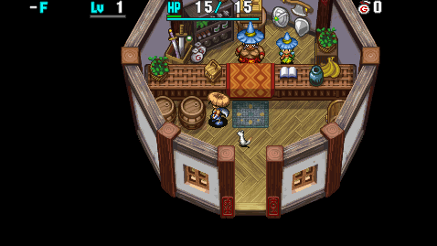
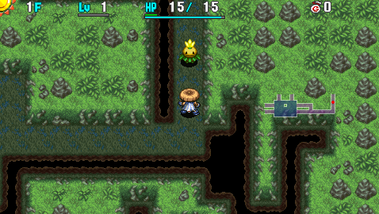

  

Dungeon with a special rule where items placed on the ground outside of shops vanish.

Most items dropped by defeated monsters are lost, and item collection techniques can't be performed. Mixer synthesis, hunting Froggo and Snacky monsters for drops, throwing a pot to retrieve contents, collecting arrows using arrow traps or Cross Carts, etc. can't be done outside of shops. ※ Items eaten by Mixers or stolen by Zaloklefts won't vanish if they drop as a result of day and night switching.

Hallways are visible on all floors during the day, but the monster table is quite frankly brutal, so it's considered to be among the harder dungeons in the game despite that advantage.

<ul class="quickLinksUL">
  <li><a href="#overview">Overview</a></li>
  <li><a href="#strategy">Strategy</a></li>
  <li><a href="#floor-guide">Floor Guide</a></li>
  <li><a href="#monsters">Monsters</a></li>
  <li><a href="#items">Items</a></li>
  <li><a href="#traps">Traps</a></li>
</ul>

# Overview

<table class="dungeonOverview">
  <tr>
    <th>Unlock</th>
    <td class="highlightYellow">Become a regular at the Rakutata Village shop after clearing the main story.</td>
  </tr>
  <tr>
    <th>Entrance</th>
    <td class="highlightYellow">Rakutata Village (Check barrel inside Item Shop)</td>
  </tr>
</table>

<table class="dungeonTable">
  <tr>
    <th>Floors</th>
    <td>99F</td>
    <th>Day / Night</th>
    <td>Both</td>
  </tr>
  <tr>
    <th>Bring Items</th>
    <td>No</td>
    <th>Allies</th>
    <td>No</td>
  </tr>
  <tr>
    <th>Unidentified</th>
    <td colspan="3">All categories</td>
  </tr>
  <tr>
    <th>Shops</th>
    <td>Regular, Elite</td>
    <th>Monster Houses</th>
    <td>Regular, Special, Sudden</td>
  </tr>
  <tr>
    <th>Initial Enemies</th>
    <td>7~10</td>
    <th>Spawn Rate</th>
    <td>30 day / 20 night</td>
  </tr>
  <tr>
    <th>Day Turns</th>
    <td>610 (537)</td>
    <th>Night Turns</th>
    <td>368 (324)</td>
  </tr>
  <tr>
    <th>Ominous aura</th>
    <td>Yes (1500 turns)</td>
    <th>Winds of Kron</th>
    <td>1st: 1700 / 4th: 2000</td>
  </tr>
  <tr>
    <th>Clear Icon</th>
    <td>None</td>
    <th>Clear Bonus</th>
    <td>50,000,000</td>
  </tr>
  <tr>
    <th>Reward</th>
    <td colspan="3">Worthy Shield</td>
  </tr>
</table>

※ Numbers in () for day and night turns is when the warning is displayed.

# Strategy

<ul class="quickLinksUL">
  <li><a href="#before-entering">Before Entering</a></li>
  <li><a href="#general">General</a></li>
  <li><a href="#time-cycling">Time Cycling</a></li>
  <li><a href="#abilities">Abilities</a></li>
  <li><a href="#equipment">Equipment</a></li>
  <li><a href="#other-items">Other Items</a></li>
</ul>

### Before Entering

It's strongly recommended to register Extinction to the Blank Scroll list.

### General

Similar to [Bayside Monster Cave](/dungeons/bayside-monster-cave), most items are found unidentified. Shops are a bit more common, but Pick-A-Choice Shops are never generated. ※ When a shop is generated, it's often in the upper left side of the map.

Hallways are visible on all floor during the day, but it's difficult to collect arrows. Synthesis is also hard, since Mixers only spawn at night and you have to rely on time of day changing. N'dubba types appear on many floors, so items you find can't always be trusted, and so on.

Hidden hallways can be generated, and Stairs? Traps can be found starting on 91F. While Balance Staff is in the item table, Trip Stones are never generated in this dungeon.

#### Presto Pot

The item table for Presto Pots is very limited, and there's a high chance you'll obtain torches.

- Scrolls - Navigation, Night-Day, Replenish, Confusion, Slumber, Fear, Air Slash.
- Other - Super Torch, Fine Torch, Torch, Green Banana, Yellow Banana, Ripe Banana, Weeds.

So basically, Presto Pots provide lots of key items used to progress at night. It's best to reuse the pot by reading a Suction Scroll on it instead of breaking it.

#### Vanishing Items

There are many downsides to consider regarding the inability to place items on the ground.

A Rank

- Hard to utilize pots other than Storage Pot.
    - You have to wait until you find a shop to retrieve the pot's contents.
- Hard to synthesize using Mixers.
    - Mixers only appear at night, and you often have to rely on time of day changing.
- Accidentally placing an important item like Storage Pot or Blank Scroll on the ground.
- Monsters like Bored Kappa, Kengo, Gazer, Gyadon, Item Knave are a greater threat.

B Rank

- Items dropped by monsters are lost.
    - It's pointless to hunt Plump Snacky, Bad Zalokleft, etc. outside of shops.
- Hard to utilize Gitan as a projectile without a Storage Pot.
    - If you swap Gitan with an inventory item, the inventory item is lost.
- Can't collect arrows or Spoiled Bananas using traps.
- Can't insert single arrows, rocks, or talismans into Presto Pots outside of shops.

C Rank

- If your inventory is full, you can't place an item down to reorganize Storage Pots.
- Banana Peels are useless outside of shops.
- If you break a Black Hole Pot outside of a shop, Pit Traps won't appear.
- Hard to make use of Identifier status gained from eating a Chocolate Banana.

#### General Outline

Monster Detector, Wall Clip Bracelet, and Heal Bracelet are extremely good. Dotanuki, Beast, Meteor, and Red sets are all solid 2 bracelet resonance choices. Runes are more important than stats late game, so it's fine to go with whichever set you find first.

Do your best to synthesize at least 1 time on floors where Dark Mixer types appear. Synthesis Pots are somewhat common, but you have to wait until a shop to utilize them.

Think carefully about which runes you want to synthesize first. Tri-direction is top priority if you haven't found Wall Clip Bracelet. 1/2 Hunger makes it easier to cycle time of day and utilize Heal Bracelet. Otherwise, it's best to check the monster table and consider the items you have on hand.

Try to avoid using unidentified items on N'mach (30-45F) and N'dup (61-80F) floors. It might be worth keeping notes about which dangerous items haven't been identified yet, including Rage Grass, Pinning Staff, Attraction Scroll, Muzzled Scroll, and Grounded Scroll.

- Early Game
    - Keep an eye out for Monster Detector, Wall Clip Bracelet, 2 bracelet resonance equipment.
    - Some players retry the dungeon if they don't find a shop, but good items can be found on the ground.
    - Synthesis Pot isn't super rare, and 5000 Gitan bracelets are often sold in shops.
- Mid Game
    - N'dubba types are a big nuisance - If you found a Blank Scroll, throw an Extinction Scroll at one. This has the side effect of turning all disguised N'dubba types into real items.
    - Dangerous traps like Banana Trap can be generated starting around Sky Dragon floors, so it's recommended to check for traps at least during the night.
- Late Game
    - Keep rocks on hand for Gitan Mamel (84-89F) floors.
    - Dangerous floors mostly alternate between day and night, so choose the safer time of day. This applies to Horrabbit, Dozikon, Archdragon, Porgon, Mesmerikon, etc.
    - Rush stairs at night from 91-99F, using Night-Day Scrolls in hallways when it changes to daytime.

### Time Cycling

#### Cycling to Daytime

Walking around at night without a Monster Detector or Lamp Shield + Torch resonance can be risky, so sometimes it can be better to secure a safer spot before sunset and wait out the night.

<pre class="diagram">
S = Shiren, M = Monster 
 
■ ■ ■ ■ ■ ■  Stepping in place next to a hallway corner lets you see incoming enemies. 
■ □ S □ □ ■  Paralyze the monster on floors where enemies who can attack through corners 
■ M ■ ■ ■ ■  or enemies with swift action speed appear for added safety. 
■ □ ■ ■ ■ ■ 
 
■ ■ ■ □ ■ 
■ □ S □ ■  Natural hallways that look like this can also be used. 
■ □ ■ ■ ■ 
 
■ ■ ■  
■ S ■  Use a Wall Clip Bracelet + Rusty Pickaxe or Tunnel Staff to dig out a safe tile. 
■ ■ ■
</pre>

#### Cycling to Night

If you don't want to fight daytime enemies, find a spot in a hallway where enemies are unlikely to approach. Enemies almost always walk straight when a hallway branches unless they bump into another enemy.

<pre class="diagram">
S = Shiren, M = Monster, P = Paralyzed Monster 
 
■ ■ ■ P ■ ■ 
■ ■ S □ ■ ■  Enemies are unlikely to enter from below, so it's safe to step in place. 
■ ■ □ ■ ■ ■  Paralyze an enemy on the P tile for added safety. 
□ □ □ ← M □ 
■ ■ ■ ■ ■ ■
</pre>

### Abilities

See [Abilities](/system/necklace-abilities) for details. 
※ Unlike Shiren 5, Three Screams can one-shot Shopkeepers.

#### Balanced

- Kaboom Bullet x 2
- Sticky Shot
- Bi-Direction Warp
- Three Screams
- Room Cyclone x 2
- Darkroom

#### More Offense

- Kaboom Bullet x 3
- Three Screams x 2
- Room Cyclone x 2
- Darkroom

### Equipment

Finding a weapon and shield set that grants 2 bracelet resonance is top priority. That said, Katana, Copper, and Palm sets lack base stats, so only use them if you're desperate.

#### Weapon

<ul>
  <li>Red Blade
    <ul>
      <li>Few starting rune slots and slow growth rate, but high base attack.</li>
      <li>Gains Flame Shot at Lv8, which slows down the pace of gameplay and can be annoying.</li>
    </ul>
  </li>
  <li>Meteor Edge
    <ul>
      <li>Great balance of attack power, rune slots, and growth rate.</li>
      <li>Gains Rustproof at Lv8.</li>
    </ul>
  </li>
  <li>Dotanuki
    <ul>
      <li>Good starting rune slots, attack power, and growth rate.</li>
      <li>Gains Atk+3 at Lv8.</li>
    </ul>
  </li>
  <li>Beast Fang
    <ul>
      <li>Lower attack power and starting rune slots, but fast growth rate.</li>
      <li>Gains Rustproof at Lv5.</li>
    </ul>
  </li>
</ul>

#### Shield

<ul>
  <li>Red Shield
    <ul>
      <li>Great defense, good rune slot count, but slow growth rate.</li>
      <li>Gains 1/2 Fire and Anti-Peck at Lv8, which are both fantastic.</li>
    </ul>
  </li>
  <li>Meteor Guard
    <ul>
      <li>Great balance of defense, rune slots, and growth rate.</li>
      <li>Gains Rustproof at Lv5 and Anti-Theft at Lv8.</li>
    </ul>
  </li>
  <li>Clan Shield
    <ul>
      <li>Lower defense, but good rune slot count and fast growth rate.</li>
      <li>Gains Rustproof at Lv5.</li>
    </ul>
  </li>
  <li>Beast Shield
    <ul>
      <li>Good defense, rune slot count, and growth rate.</li>
      <li>Gains Def+3 at Lv8.</li>
    </ul>
  </li>
  <li>Lamp Shield
    <ul>
      <li>Use its resonance effect with a torch at night to have an easier time locating stairs.</li>
      <li>You can't use the Scout command at night even with its resonance effect.</li>
    </ul>
  </li>
</ul>

#### Bracelets

<ul>
  <li>Monster Detector
    <ul>
      <li>Makes night safer, locate shops, find stairs using Transient Staff, etc.</li>
    </ul>
  </li>
  <li>Wall Clip Bracelet
    <ul>
      <li>Have a one-sided fight vs. a monster by moving and attacking through corners.</li>
      <li>Enter a wall and dig out a safe spot to cycle time of day if you have a Rusty Pickaxe.</li>
      <li>Hallways are visible during the day on all floors, so this bracelet is even more potent.</li>
    </ul>
  </li>
  <li>Heal Bracelet
    <ul>
      <li>Quickly recover HP after fighting a powerful monster or stepping on a landmine.</li>
    </ul>
  </li>
  <li>Item Detector
    <ul>
      <li>Locate shops at a glance, check rooms for items more efficiently.</li>
    </ul>
  </li>
</ul>

### Other Items

#### Miscellaneous

- Navigation Scroll, Night-Day Scroll, Super Torch
    - Save these for late game floors where you need to rush stairs at night.
- Fine Torch
    - Use these early and mid game to conserve Super Torches for later.
- Blank Scroll
    - If you're lucky enough to obtain one, throw Extinction Scroll at a N'dubba type monster.
    - Be careful not to accidentally select Place instead of Write.
- Purify Scroll
    - Save it for Storage Pots, since you can't break sealed pots to retrieve items outside of shops.
- Presto Pot
    - Insert items in hopes of obtaining Navigation Scrolls, Night-Day Scrolls, and Super Torches.
    - Reuse it by reading a Suction Scroll in a shop if possible.
- Synthesis Pot
    - Mixer synthesis is tricky, so think carefully about which runes you want to synthesize.
    - Don't use it to simply add upgrade value together instead of adding runes.
- Heal Pot
    - Significant help on late game floors, but it's fine to use it earlier if the situation calls for it.
- Chocolate Banana
    - Chocolate Pot is somewhat common, so you can try aiming for Identifier status.
    - However, Identify Pot is also on the common side, so another option is to use it as storage.

# Floor Guide

※ This section only lists notable monsters - Check the monster table for a full list.

### 1F

Check rooms for items, then hurry to the next floor.

### 2-5F

Day: Bored Kappa (2-4F) Night: Plump Snacky (1-3F), Bad Zalokleft (3-5F)

Items thrown by Bored Kappa vanish, so use a staff or wait for night if you want to claim items. If you find a shop, consider trying to hunt Plump Snacky and Bad Zaloklefts for items.

If a Bad Zalokleft steals an item, you can reclaim it by making it retreat to a corner in a room and then stepping in place until it changes to daytime.

<pre class="diagram">
S = Shiren, Z = Zalokleft 
 
■ □ □ □ □ □ 
■ □ □ S □ □ 
■ □ □ □ □ □ 
■ Z □ □ □ □ 
■ ■ ■ ■ ■ ■
</pre>

### 6-11F

Day: Curse Girl (6-8F), Scorpion (8-12F), Slime (10-12F), Fearabbit (10-12F), Tiger Tosser (11-15F) Night: Evil Gazer (7-9F), Dark Field Knave (8-10F), Dark Pop Tank (8-12F), Dark Absorbiphant (11-13F)

Lots of monsters with troublesome special attacks. It's recommended to go through 8-10F during the day to avoid Dark Field Knave turning items into Weeds. Dark Pop Tank's cannonballs deal 30 damage, so be very careful in rooms at night.

### 12-16F

Day: Tiger Tosser (11-15F), Strong Cart (12-14F), Pumphantasm (13-17F), Porky (15-17F), Pot Knave (17-18F) Night: Dark Pop Tank (8-12F), Dark Absorbiphant (11-13F), Dark Mixer (12-16F), Dark Ironhead (14-18F)

Don't equip Wall Clip Bracelet on Strong Cart floors, or you risk getting buried in a wall.

Dark Mixer provides a chance to synthesize items, but doing so requires a special strategy. Eaten items vanish in this dungeon when a Dark Mixer is defeated by you or another monster, but the item is safe if the Dark Mixer disappears as a result of time of day changing to daytime instead of being defeated.

Dark Mixers have regular AI at night, so they'll approach and follow you like their daytime counterparts. Lure it into a hallway corner and paralyze it to keep it safe from other monsters while waiting for daytime.

Other options include:

- Throw items right before it changes to daytime.
    - It changes to daytime 45 turns after the warning.
- Read a Night-Day Scroll.
    - These scrolls are extremely valuable late game, so it's not recommended.
- Defeat the Dark Mixer while inside a shop.
    - It's best to use a Navigation Scroll or Monster Detector.
- Dig out a safe tile using Wall Clip Bracelet + Rusty Pickaxe, then swing a Swap Staff at Dark Mixer.

### 17-21F

Day: monster_name Night: monster_name

### 22-26F

Day: monster_name Night: monster_name

### 27-29F

Day: monster_name Night: monster_name

### 30-45F

Day: monster_name Night: monster_name

### 46-60F

Day: monster_name Night: monster_name

### 61-80F

Day: monster_name Night: monster_name

### 81-87F

Day: monster_name Night: monster_name

### 88-99F

Day: monster_name Night: monster_name

# Monsters

See [Monsters](/system/monsters) for individual monster details.

- N = N'dubba Lv1 Lv2 Lv3 Lv4
- M = Maneater Lv1 Lv2 Lv3 Lv4

Enemy Colors: Day Night

<table class="monsterTable">
  <thead>
    <tr>
      <th>F</th>
      <th colspan="6">Monsters</th>
      <th>N</th>
      <th>M</th>
    </tr>
  </thead>
  <tbody>
    <tr>
      <th rowspan="2">1</th>
      <td class="monsterDay">Mamel</td>
      <td class="monsterDay">Seedie</td>
      <td class="highlightGray"></td>
      <td class="highlightGray"></td>
      <td class="highlightGray"></td>
      <td class="highlightGray"></td>
      <td rowspan="2" class="highlightGray"></td>
      <td rowspan="40" class="monsterTableManeater">1</td>
    </tr>
    <tr>
      <td class="monsterNight">Plump Snacky</td>
      <td class="monsterNight">Dark Seedie</td>
      <td class="highlightGray"></td>
      <td class="highlightGray"></td>
      <td class="highlightGray"></td>
      <td class="highlightGray"></td>
    </tr>
    <tr>
      <th rowspan="2">2</th>
      <td class="monsterDay">Pit Mamel</td>
      <td class="monsterDay">Seedie</td>
      <td class="monsterDay">Chintala</td>
      <td class="monsterDay">Bored Kappa</td>
      <td class="highlightGray"></td>
      <td class="highlightGray"></td>
      <td rowspan="2" class="highlightGray"></td>
    </tr>
    <tr>
      <td class="monsterNight">Plump Snacky</td>
      <td class="monsterNight">Dark Seedie</td>
      <td class="monsterNight">Foul Novice</td>
      <td class="highlightGray"></td>
      <td class="highlightGray"></td>
      <td class="highlightGray"></td>
    </tr>
    <tr>
      <th rowspan="2">3</th>
      <td class="monsterDay">Pit Mamel</td>
      <td class="monsterDay">Banana Novice</td>
      <td class="monsterDay">Chintala</td>
      <td class="monsterDay">Bored Kappa</td>
      <td class="monsterDay">Squid King</td>
      <td class="highlightGray"></td>
      <td rowspan="2" class="highlightGray"></td>
    </tr>
    <tr>
      <td class="monsterNight">Plump Snacky</td>
      <td class="monsterNight">Dark Seedie</td>
      <td class="monsterNight">Foul Novice</td>
      <td class="monsterNight">Bad Zalokleft</td>
      <td class="highlightGray"></td>
      <td class="highlightGray"></td>
    </tr>
    <tr>
      <th rowspan="2">4</th>
      <td class="monsterDay">Firepuff</td>
      <td class="monsterDay">Banana Novice</td>
      <td class="monsterDay">Blade Bee</td>
      <td class="monsterDay">Bored Kappa</td>
      <td class="monsterDay">Squid King</td>
      <td class="highlightGray"></td>
      <td rowspan="2" class="highlightGray"></td>
    </tr>
    <tr>
      <td class="monsterNight">Dark Mutaikon</td>
      <td class="monsterNight">Dark Blade Bee</td>
      <td class="monsterNight">Foul Novice</td>
      <td class="monsterNight">Bad Zalokleft</td>
      <td class="highlightGray"></td>
      <td class="highlightGray"></td>
    </tr>
    <tr>
      <th rowspan="2">5</th>
      <td class="monsterDay">Firepuff</td>
      <td class="monsterDay">Banana Novice</td>
      <td class="monsterDay">Blade Bee</td>
      <td class="monsterDay">Kumonigiri</td>
      <td class="monsterDay">Squid King</td>
      <td class="highlightGray"></td>
      <td rowspan="2" class="highlightGray"></td>
    </tr>
    <tr>
      <td class="monsterNight">Dark Mutaikon</td>
      <td class="monsterNight">Dark Blade Bee</td>
      <td class="monsterNight">Evil Firepuff</td>
      <td class="monsterNight">Bad Zalokleft</td>
      <td class="highlightGray"></td>
      <td class="highlightGray"></td>
    </tr>
    <tr>
      <th rowspan="2">6</th>
      <td class="monsterDay">Firepuff</td>
      <td class="monsterDay">Curse Girl</td>
      <td class="monsterDay">Blade Bee</td>
      <td class="monsterDay">Kumonigiri</td>
      <td class="monsterDay">Ironhead</td>
      <td class="highlightGray"></td>
      <td rowspan="2" class="highlightGray"></td>
    </tr>
    <tr>
      <td class="monsterNight">Dark Mutaikon</td>
      <td class="monsterNight">Dark Blade Bee</td>
      <td class="monsterNight">Evil Firepuff</td>
      <td class="monsterNight">Dark Boy Cart</td>
      <td class="highlightGray"></td>
      <td class="highlightGray"></td>
    </tr>
    <tr>
      <th rowspan="2">7</th>
      <td class="monsterDay">DJ Mage</td>
      <td class="monsterDay">Curse Girl</td>
      <td class="monsterDay">Blade Bee</td>
      <td class="monsterDay">Kumonigiri</td>
      <td class="monsterDay">Ironhead</td>
      <td class="highlightGray"></td>
      <td rowspan="2" class="highlightGray"></td>
    </tr>
    <tr>
      <td class="monsterNight">Evil Gazer</td>
      <td class="monsterNight">Dark Blade Bee</td>
      <td class="monsterNight">Evil Firepuff</td>
      <td class="monsterNight">Dark Boy Cart</td>
      <td class="highlightGray"></td>
      <td class="highlightGray"></td>
    </tr>
    <tr>
      <th rowspan="2">8</th>
      <td class="monsterDay">DJ Mage</td>
      <td class="monsterDay">Curse Girl</td>
      <td class="monsterDay">Scorpion</td>
      <td class="monsterDay">Kumonigiri</td>
      <td class="monsterDay">Ironhead</td>
      <td class="highlightGray"></td>
      <td rowspan="2" class="highlightGray"></td>
    </tr>
    <tr>
      <td class="monsterNight">Evil Gazer</td>
      <td class="monsterNight">Dark Field Knave</td>
      <td class="monsterNight">Dark Pop Tank</td>
      <td class="monsterNight">Dark Boy Cart</td>
      <td class="highlightGray"></td>
      <td class="highlightGray"></td>
    </tr>
    <tr>
      <th rowspan="2">9</th>
      <td class="monsterDay">DJ Mage</td>
      <td class="monsterDay">Cross Cart</td>
      <td class="monsterDay">Scorpion</td>
      <td class="monsterDay">Kumonigiri</td>
      <td class="monsterDay">Ironhead</td>
      <td class="highlightGray"></td>
      <td rowspan="2" class="highlightGray"></td>
    </tr>
    <tr>
      <td class="monsterNight">Evil Gazer</td>
      <td class="monsterNight">Dark Field Knave</td>
      <td class="monsterNight">Dark Pop Tank</td>
      <td class="monsterNight">Foul Morph</td>
      <td class="highlightGray"></td>
      <td class="highlightGray"></td>
    </tr>
    <tr>
      <th rowspan="2">10</th>
      <td class="monsterDay">Slime</td>
      <td class="monsterDay">Cross Cart</td>
      <td class="monsterDay">Scorpion</td>
      <td class="monsterDay">Fearabbit</td>
      <td class="monsterDay">Ironhead</td>
      <td class="highlightGray"></td>
      <td rowspan="2" class="highlightGray"></td>
    </tr>
    <tr>
      <td class="monsterNight">Evil Spin Polygon</td>
      <td class="monsterNight">Dark Field Knave</td>
      <td class="monsterNight">Dark Pop Tank</td>
      <td class="monsterNight">Foul Morph</td>
      <td class="monsterNight">Dark Pit Mamel</td>
      <td class="highlightGray"></td>
    </tr>
    <tr>
      <th rowspan="2">11</th>
      <td class="monsterDay">Slime</td>
      <td class="monsterDay">Cross Cart</td>
      <td class="monsterDay">Scorpion</td>
      <td class="monsterDay">Fearabbit</td>
      <td class="monsterDay">Tiger Tosser</td>
      <td class="highlightGray"></td>
      <td rowspan="2" class="highlightGray"></td>
    </tr>
    <tr>
      <td class="monsterNight">Evil Spin Polygon</td>
      <td class="monsterNight">Dark Absorbiphant</td>
      <td class="monsterNight">Dark Pop Tank</td>
      <td class="monsterNight">Foul Morph</td>
      <td class="monsterNight">Dark Pit Mamel</td>
      <td class="highlightGray"></td>
    </tr>
    <tr>
      <th rowspan="2">12</th>
      <td class="monsterDay">Slime</td>
      <td class="monsterDay">Strong Cart</td>
      <td class="monsterDay">Scorpion</td>
      <td class="monsterDay">Fearabbit</td>
      <td class="monsterDay">Tiger Tosser</td>
      <td class="highlightGray"></td>
      <td rowspan="2" class="highlightGray"></td>
    </tr>
    <tr>
      <td class="monsterNight">Evil Spin Polygon</td>
      <td class="monsterNight">Dark Absorbiphant</td>
      <td class="monsterNight">Dark Pop Tank</td>
      <td class="monsterNight">Foul Morph</td>
      <td class="monsterNight">Dark Pit Mamel</td>
      <td class="monsterNight">Dark Mixer</td>
    </tr>
    <tr>
      <th rowspan="2">13</th>
      <td class="monsterDay">Flash Bird</td>
      <td class="monsterDay">Strong Cart</td>
      <td class="monsterDay">Traproid</td>
      <td class="monsterDay">Pumphantasm</td>
      <td class="monsterDay">Tiger Tosser</td>
      <td class="highlightGray"></td>
      <td rowspan="2" class="highlightGray"></td>
    </tr>
    <tr>
      <td class="monsterNight">Evil Explochin</td>
      <td class="monsterNight">Dark Absorbiphant</td>
      <td class="monsterNight">Dark Zapdon</td>
      <td class="monsterNight">Foul Morph</td>
      <td class="monsterNight">Dark Pit Mamel</td>
      <td class="monsterNight">Dark Mixer</td>
    </tr>
    <tr>
      <th rowspan="2">14</th>
      <td class="monsterDay">Flash Bird</td>
      <td class="monsterDay">Strong Cart</td>
      <td class="monsterDay">Traproid</td>
      <td class="monsterDay">Pumphantasm</td>
      <td class="monsterDay">Tiger Tosser</td>
      <td class="highlightGray"></td>
      <td rowspan="2" class="highlightGray"></td>
    </tr>
    <tr>
      <td class="monsterNight">Evil Explochin</td>
      <td class="monsterNight">Mean Cheer Ham</td>
      <td class="monsterNight">Dark Zapdon</td>
      <td class="monsterNight">Dark Ironhead</td>
      <td class="highlightGray"></td>
      <td class="monsterNight">Dark Mixer</td>
    </tr>
    <tr>
      <th rowspan="2">15</th>
      <td class="monsterDay">Flash Bird</td>
      <td class="monsterDay">Porky</td>
      <td class="monsterDay">Traproid</td>
      <td class="monsterDay">Pumphantasm</td>
      <td class="monsterDay">Tiger Tosser</td>
      <td class="highlightGray"></td>
      <td rowspan="2" class="highlightGray"></td>
    </tr>
    <tr>
      <td class="monsterNight">Evil Explochin</td>
      <td class="monsterNight">Mean Cheer Ham</td>
      <td class="monsterNight">Dark Zapdon</td>
      <td class="monsterNight">Dark Ironhead</td>
      <td class="highlightGray"></td>
      <td class="monsterNight">Dark Mixer</td>
    </tr>
    <tr>
      <th rowspan="2">16</th>
      <td class="monsterDay">Pot Knave</td>
      <td class="monsterDay">Porky</td>
      <td class="monsterDay">Traproid</td>
      <td class="monsterDay">Pumphantasm</td>
      <td class="monsterDay">Zapdon</td>
      <td class="highlightGray"></td>
      <td rowspan="2" class="highlightGray"></td>
    </tr>
    <tr>
      <td class="monsterNight">Foul Curse Girl</td>
      <td class="monsterNight">Mean Cheer Ham</td>
      <td class="monsterNight">Dark Zapdon</td>
      <td class="monsterNight">Dark Ironhead</td>
      <td class="highlightGray"></td>
      <td class="monsterNight">Dark Mixer</td>
    </tr>
    <tr>
      <th rowspan="2">17</th>
      <td class="monsterDay">Pot Knave</td>
      <td class="monsterDay">Porky</td>
      <td class="monsterDay">Dagger Bee</td>
      <td class="monsterDay">Pumphantasm</td>
      <td class="monsterDay">Zapdon</td>
      <td class="highlightGray"></td>
      <td rowspan="2" class="highlightGray"></td>
    </tr>
    <tr>
      <td class="monsterNight">Foul Curse Girl</td>
      <td class="monsterNight">Dark Tosser</td>
      <td class="monsterNight">Dark Zapdon</td>
      <td class="monsterNight">Dark Ironhead</td>
      <td class="highlightGray"></td>
      <td class="highlightGray"></td>
    </tr>
    <tr>
      <th rowspan="2">18</th>
      <td class="monsterDay">Pot Knave</td>
      <td class="monsterDay">Flamepuff</td>
      <td class="monsterDay">Dagger Bee</td>
      <td class="monsterDay">Beanie</td>
      <td class="monsterDay">Zapdon</td>
      <td class="highlightGray"></td>
      <td rowspan="10" class="monsterTableNtwyn">2</td>
    </tr>
    <tr>
      <td class="monsterNight">Foul Curse Girl</td>
      <td class="monsterNight">Dark Tosser</td>
      <td class="monsterNight">Evil Mid Chintala</td>
      <td class="monsterNight">Dark Ironhead</td>
      <td class="highlightGray"></td>
      <td class="highlightGray"></td>
    </tr>
    <tr>
      <th rowspan="2">19</th>
      <td class="monsterDay">Gyadon</td>
      <td class="monsterDay">Flamepuff</td>
      <td class="monsterDay">Dagger Bee</td>
      <td class="monsterDay">Beanie</td>
      <td class="monsterDay">Zapdon</td>
      <td class="highlightGray"></td>
    </tr>
    <tr>
      <td class="monsterNight">Evil Dragon</td>
      <td class="monsterNight">Dark Tosser</td>
      <td class="monsterNight">Evil Mid Chintala</td>
      <td class="monsterNight">Bad Lime Zalokleft</td>
      <td class="highlightGray"></td>
      <td class="highlightGray"></td>
    </tr>
    <tr>
      <th rowspan="2">20</th>
      <td class="monsterDay">Gyadon</td>
      <td class="monsterDay">Flamepuff</td>
      <td class="monsterDay">Dagger Bee</td>
      <td class="monsterDay">Beanie</td>
      <td class="monsterDay">Squid Lord</td>
      <td class="highlightGray"></td>
    </tr>
    <tr>
      <td class="monsterNight">Evil Dragon</td>
      <td class="monsterNight">Snide Froggucci</td>
      <td class="monsterNight">Evil Mid Chintala</td>
      <td class="monsterNight">Bad Lime Zalokleft</td>
      <td class="highlightGray"></td>
      <td class="highlightGray"></td>
    </tr>
    <tr>
      <th rowspan="2">21</th>
      <td class="monsterDay">Gyadon</td>
      <td class="monsterDay">Sr. Yanpii</td>
      <td class="monsterDay">Dagger Bee</td>
      <td class="monsterDay">Pierce Cart</td>
      <td class="monsterDay">Squid Lord</td>
      <td class="highlightGray"></td>
      <td rowspan="50" class="monsterTableVilleater">2</td>
    </tr>
    <tr>
      <td class="monsterNight">Evil Dragon</td>
      <td class="monsterNight">Snide Froggucci</td>
      <td class="monsterNight">Evil Mid Chintala</td>
      <td class="monsterNight">Bad Lime Zalokleft</td>
      <td class="highlightGray"></td>
      <td class="highlightGray"></td>
    </tr>
    <tr>
      <th rowspan="2">22</th>
      <td class="monsterDay">Dragon</td>
      <td class="monsterDay">Sr. Yanpii</td>
      <td class="monsterDay">Hipadile</td>
      <td class="monsterDay">Pierce Cart</td>
      <td class="monsterDay">Squid Lord</td>
      <td class="highlightGray"></td>
    </tr>
    <tr>
      <td class="monsterNight">Evil Dragon</td>
      <td class="monsterNight">Snide Froggucci</td>
      <td class="monsterNight">Evil Mid Chintala</td>
      <td class="monsterNight">Dark Pandanigiri</td>
      <td class="highlightGray"></td>
      <td class="highlightGray"></td>
    </tr>
    <tr>
      <th rowspan="2">23</th>
      <td class="monsterDay">Dragon</td>
      <td class="monsterDay">Sr. Yanpii</td>
      <td class="monsterDay">Hipadile</td>
      <td class="monsterDay">Pierce Cart</td>
      <td class="monsterDay">Go Ham</td>
      <td class="highlightGray"></td>
      <td rowspan="2" class="highlightGray"></td>
    </tr>
    <tr>
      <td class="monsterNight">Evil Dragon</td>
      <td class="monsterNight">Vile Grime</td>
      <td class="monsterNight">Evil Mid Chintala</td>
      <td class="monsterNight">Dark Pandanigiri</td>
      <td class="highlightGray"></td>
      <td class="highlightGray"></td>
    </tr>
    <tr>
      <th rowspan="2">24</th>
      <td class="monsterDay">Dragon</td>
      <td class="monsterDay">Eligan</td>
      <td class="monsterDay">Hipadile</td>
      <td class="monsterDay">Grime</td>
      <td class="monsterDay">Go Ham</td>
      <td class="highlightGray"></td>
      <td rowspan="2" class="highlightGray"></td>
    </tr>
    <tr>
      <td class="monsterNight">Evil Dragon</td>
      <td class="monsterNight">Vile Grime</td>
      <td class="monsterNight">Dark Hurler</td>
      <td class="monsterNight">Dark Pandanigiri</td>
      <td class="highlightGray"></td>
      <td class="highlightGray"></td>
    </tr>
    <tr>
      <th rowspan="2">25</th>
      <td class="monsterDay">Dragon</td>
      <td class="monsterDay">Eligan</td>
      <td class="monsterDay">Hipadile</td>
      <td class="monsterDay">Grime</td>
      <td class="monsterDay">Go Ham</td>
      <td class="highlightGray"></td>
      <td rowspan="2" class="highlightGray"></td>
    </tr>
    <tr>
      <td class="monsterNight">Evil Poofy</td>
      <td class="monsterNight">Vile Grime</td>
      <td class="monsterNight">Dark Hurler</td>
      <td class="monsterNight">Dark Pandanigiri</td>
      <td class="highlightGray"></td>
      <td class="highlightGray"></td>
    </tr>
    <tr>
      <th rowspan="2">26</th>
      <td class="monsterDay">Curse Sister</td>
      <td class="monsterDay">Eligan</td>
      <td class="monsterDay">Hipadile</td>
      <td class="monsterDay">Grime</td>
      <td class="monsterDay">Pumphantom</td>
      <td class="highlightGray"></td>
      <td rowspan="2" class="highlightGray"></td>
    </tr>
    <tr>
      <td class="monsterNight">Evil Poofy</td>
      <td class="monsterNight">Foul Curse Sister</td>
      <td class="monsterNight">Dark Hurler</td>
      <td class="monsterNight">Dark Pandanigiri</td>
      <td class="highlightGray"></td>
      <td class="highlightGray"></td>
    </tr>
    <tr>
      <th rowspan="2">27</th>
      <td class="monsterDay">Curse Sister</td>
      <td class="monsterDay">Eligan</td>
      <td class="monsterDay">Dazikon</td>
      <td class="monsterDay">Demon Scorp</td>
      <td class="monsterDay">Pumphantom</td>
      <td class="highlightGray"></td>
      <td rowspan="2" class="highlightGray"></td>
    </tr>
    <tr>
      <td class="monsterNight">Evil Poofy</td>
      <td class="monsterNight">Foul Curse Sister</td>
      <td class="monsterNight">Dark Hurler</td>
      <td class="monsterNight">Dark Pandanigiri</td>
      <td class="highlightGray"></td>
      <td class="highlightGray"></td>
    </tr>
    <tr>
      <th rowspan="2">28</th>
      <td class="monsterDay">Curse Sister</td>
      <td class="monsterDay">Eligan</td>
      <td class="monsterDay">Dazikon</td>
      <td class="monsterDay">Demon Scorp</td>
      <td class="monsterDay">Pumphantom</td>
      <td class="highlightGray"></td>
      <td rowspan="2" class="highlightGray"></td>
    </tr>
    <tr>
      <td class="monsterNight">Dark Eligan</td>
      <td class="monsterNight">Foul Curse Sister</td>
      <td class="monsterNight">Dark Hurler</td>
      <td class="monsterNight">Plump Crunchy</td>
      <td class="highlightGray"></td>
      <td class="highlightGray"></td>
    </tr>
    <tr>
      <th rowspan="2">29</th>
      <td class="monsterDay">MC Mage</td>
      <td class="monsterDay">Grampa Tank</td>
      <td class="monsterDay">Dazikon</td>
      <td class="monsterDay">Demon Scorp</td>
      <td class="monsterDay">Pumphantom</td>
      <td class="highlightGray"></td>
      <td rowspan="2" class="highlightGray"></td>
    </tr>
    <tr>
      <td class="monsterNight">Dark Eligan</td>
      <td class="monsterNight">Dark Pot Knave</td>
      <td class="monsterNight">Dark Hurler</td>
      <td class="monsterNight">Plump Crunchy</td>
      <td class="highlightGray"></td>
      <td class="highlightGray"></td>
    </tr>
    <tr>
      <th rowspan="2">30</th>
      <td class="monsterDay">MC Mage</td>
      <td class="monsterDay">Grampa Tank</td>
      <td class="monsterDay">Super Gazer</td>
      <td class="monsterDay">Demon Scorp</td>
      <td class="monsterDay">Pumphantom</td>
      <td class="highlightGray"></td>
      <td rowspan="32" class="monsterTableNmach">3</td>
    </tr>
    <tr>
      <td class="monsterNight">Dark Eligan</td>
      <td class="monsterNight">Dark Pot Knave</td>
      <td class="monsterNight">Dark Dagger Bee</td>
      <td class="monsterNight">Plump Crunchy</td>
      <td class="highlightGray"></td>
      <td class="highlightGray"></td>
    </tr>
    <tr>
      <th rowspan="2">31</th>
      <td class="monsterDay">MC Mage</td>
      <td class="monsterDay">Grampa Tank</td>
      <td class="monsterDay">Super Gazer</td>
      <td class="monsterDay">Demon Scorp</td>
      <td class="monsterDay">Voltdon</td>
      <td class="highlightGray"></td>
    </tr>
    <tr>
      <td class="monsterNight">Dark Eligan</td>
      <td class="monsterNight">Dark Pot Knave</td>
      <td class="monsterNight">Dark Dagger Bee</td>
      <td class="monsterNight">Evil Flamepuff</td>
      <td class="highlightGray"></td>
      <td class="highlightGray"></td>
    </tr>
    <tr>
      <th rowspan="2">32</th>
      <td class="monsterDay">Digestiphant</td>
      <td class="monsterDay">Grampa Tank</td>
      <td class="monsterDay">Super Gazer</td>
      <td class="monsterDay">Cave Mamel</td>
      <td class="monsterDay">Voltdon</td>
      <td class="highlightGray"></td>
    </tr>
    <tr>
      <td class="monsterNight">Dark Eligan</td>
      <td class="monsterNight">Dark Digestiphant</td>
      <td class="monsterNight">Dark Dagger Bee</td>
      <td class="monsterNight">Evil Flamepuff</td>
      <td class="highlightGray"></td>
      <td class="highlightGray"></td>
    </tr>
    <tr>
      <th rowspan="2">33</th>
      <td class="monsterDay">Digestiphant</td>
      <td class="monsterDay">Grampa Tank</td>
      <td class="monsterDay">Chainhead</td>
      <td class="monsterDay">Cave Mamel</td>
      <td class="monsterDay">Voltdon</td>
      <td class="highlightGray"></td>
    </tr>
    <tr>
      <td class="monsterNight">Dark Chainhead</td>
      <td class="monsterNight">Dark Digestiphant</td>
      <td class="monsterNight">Dark Dagger Bee</td>
      <td class="monsterNight">Evil Flamepuff</td>
      <td class="highlightGray"></td>
      <td class="highlightGray"></td>
    </tr>
    <tr>
      <th rowspan="2">34</th>
      <td class="monsterDay">Digestiphant</td>
      <td class="monsterDay">Scarabbit</td>
      <td class="monsterDay">Chainhead</td>
      <td class="monsterDay">Cave Mamel</td>
      <td class="monsterDay">Voltdon</td>
      <td class="highlightGray"></td>
    </tr>
    <tr>
      <td class="monsterNight">Dark Chainhead</td>
      <td class="monsterNight">Dark Digestiphant</td>
      <td class="monsterNight">Dark Dagger Bee</td>
      <td class="monsterNight">Foul Boss</td>
      <td class="highlightGray"></td>
      <td class="highlightGray"></td>
    </tr>
    <tr>
      <th rowspan="2">35</th>
      <td class="monsterDay">Dance Polygon</td>
      <td class="monsterDay">Scarabbit</td>
      <td class="monsterDay">Chainhead</td>
      <td class="monsterDay">Cave Mamel</td>
      <td class="monsterDay">Voltdon</td>
      <td class="highlightGray"></td>
    </tr>
    <tr>
      <td class="monsterNight">Dark Chainhead</td>
      <td class="monsterNight">Dark Glare Bird</td>
      <td class="monsterNight">Dark Dagger Bee</td>
      <td class="monsterNight">Foul Boss</td>
      <td class="highlightGray"></td>
      <td class="highlightGray"></td>
    </tr>
    <tr>
      <th rowspan="2">36</th>
      <td class="monsterDay">Dance Polygon</td>
      <td class="monsterDay">Scarabbit</td>
      <td class="monsterDay">Chainhead</td>
      <td class="monsterDay">Cave Mamel</td>
      <td class="monsterDay">Voltdon</td>
      <td class="highlightGray"></td>
    </tr>
    <tr>
      <td class="monsterNight">Dark Chainhead</td>
      <td class="monsterNight">Dark Glare Bird</td>
      <td class="monsterNight">Dark Dagger Bee</td>
      <td class="monsterNight">Foul Boss</td>
      <td class="highlightGray"></td>
      <td class="highlightGray"></td>
    </tr>
    <tr>
      <th rowspan="2">37</th>
      <td class="monsterDay">Dance Polygon</td>
      <td class="monsterDay">Blazepuff</td>
      <td class="monsterDay">Chainhead</td>
      <td class="monsterDay">Cave Mamel</td>
      <td class="monsterDay">Crunchy</td>
      <td class="highlightGray"></td>
    </tr>
    <tr>
      <td class="monsterNight">Dark Chainhead</td>
      <td class="monsterNight">Dark Glare Bird</td>
      <td class="monsterNight">Dark MC Mage</td>
      <td class="monsterNight">Vile Demon Scorp</td>
      <td class="highlightGray"></td>
      <td class="highlightGray"></td>
    </tr>
    <tr>
      <th rowspan="2">38</th>
      <td class="monsterDay">Porko</td>
      <td class="monsterDay">Blazepuff</td>
      <td class="monsterDay">Chainhead</td>
      <td class="monsterDay">Gyairas</td>
      <td class="monsterDay">Crunchy</td>
      <td class="highlightGray"></td>
    </tr>
    <tr>
      <td class="monsterNight">Dark Chainhead</td>
      <td class="monsterNight">Mean Go Ham</td>
      <td class="monsterNight">Dark MC Mage</td>
      <td class="monsterNight">Vile Demon Scorp</td>
      <td class="highlightGray"></td>
      <td class="highlightGray"></td>
    </tr>
    <tr>
      <th rowspan="2">39</th>
      <td class="monsterDay">Porko</td>
      <td class="monsterDay">Blazepuff</td>
      <td class="monsterDay">Steamroid</td>
      <td class="monsterDay">Gyairas</td>
      <td class="monsterDay">Crunchy</td>
      <td class="highlightGray"></td>
    </tr>
    <tr>
      <td class="monsterNight">Dark Eligagon</td>
      <td class="monsterNight">Mean Go Ham</td>
      <td class="monsterNight">Dark MC Mage</td>
      <td class="monsterNight">Vile Demon Scorp</td>
      <td class="highlightGray"></td>
      <td class="highlightGray"></td>
    </tr>
    <tr>
      <th rowspan="2">40</th>
      <td class="monsterDay">Porko</td>
      <td class="monsterDay">Froggon</td>
      <td class="monsterDay">Steamroid</td>
      <td class="monsterDay">Gyairas</td>
      <td class="monsterDay">Rally Ham</td>
      <td class="highlightGray"></td>
    </tr>
    <tr>
      <td class="monsterNight">Dark Eligagon</td>
      <td class="monsterNight">Mean Go Ham</td>
      <td class="monsterNight">Dark Item Knave</td>
      <td class="monsterNight">Vile Demon Scorp</td>
      <td class="monsterNight">Dark Mixermon</td>
      <td class="highlightGray"></td>
    </tr>
    <tr>
      <th rowspan="2">41</th>
      <td class="monsterDay">Poofy</td>
      <td class="monsterDay">Froggon</td>
      <td class="monsterDay">Steamroid</td>
      <td class="monsterDay">Nuttie</td>
      <td class="monsterDay">Rally Ham</td>
      <td class="highlightGray"></td>
    </tr>
    <tr>
      <td class="monsterNight">Dark Eligagon</td>
      <td class="monsterNight">Evil Oingodile</td>
      <td class="monsterNight">Dark Item Knave</td>
      <td class="monsterNight">Vile Demon Scorp</td>
      <td class="monsterNight">Dark Mixermon</td>
      <td class="highlightGray"></td>
    </tr>
    <tr>
      <th rowspan="2">42</th>
      <td class="monsterDay">Poofy</td>
      <td class="monsterDay">Froggon</td>
      <td class="monsterDay">Steamroid</td>
      <td class="monsterDay">Nuttie</td>
      <td class="monsterDay">Rally Ham</td>
      <td class="highlightGray"></td>
    </tr>
    <tr>
      <td class="monsterNight">Dark Eligagon</td>
      <td class="monsterNight">Evil Oingodile</td>
      <td class="monsterNight">Dark Item Knave</td>
      <td class="monsterNight">Vile Demon Scorp</td>
      <td class="monsterNight">Dark Mixermon</td>
      <td class="highlightGray"></td>
    </tr>
    <tr>
      <th rowspan="2">43</th>
      <td class="monsterDay">Poofy</td>
      <td class="monsterDay">Katana Bee</td>
      <td class="monsterDay">Steamroid</td>
      <td class="monsterDay">Nuttie</td>
      <td class="monsterDay">Killer Gyaza</td>
      <td class="highlightGray"></td>
    </tr>
    <tr>
      <td class="monsterNight">Dark Eligagon</td>
      <td class="monsterNight">Evil Oingodile</td>
      <td class="monsterNight">Evil Sing Polygon</td>
      <td class="monsterNight">Dark Voltdon</td>
      <td class="monsterNight">Dark Mixermon</td>
      <td class="highlightGray"></td>
    </tr>
    <tr>
      <th rowspan="2">44</th>
      <td class="monsterDay">Spongiderm</td>
      <td class="monsterDay">Katana Bee</td>
      <td class="monsterDay">Steamroid</td>
      <td class="monsterDay">Lt. Yanpii</td>
      <td class="monsterDay">Killer Gyaza</td>
      <td class="highlightGray"></td>
    </tr>
    <tr>
      <td class="monsterNight">Dark Eligagon</td>
      <td class="monsterNight">Evil Concusschin</td>
      <td class="monsterNight">Evil Sing Polygon</td>
      <td class="monsterNight">Dark Voltdon</td>
      <td class="monsterNight">Dark Mixermon</td>
      <td class="highlightGray"></td>
    </tr>
    <tr>
      <th rowspan="2">45</th>
      <td class="monsterDay">Spongiderm</td>
      <td class="monsterDay">Katana Bee</td>
      <td class="monsterDay">Squid Emperor</td>
      <td class="monsterDay">Lt. Yanpii</td>
      <td class="monsterDay">Killer Gyaza</td>
      <td class="highlightGray"></td>
    </tr>
    <tr>
      <td class="monsterNight">Evil Porkon</td>
      <td class="monsterNight">Evil Concusschin</td>
      <td class="monsterNight">Evil Sing Polygon</td>
      <td class="monsterNight">Dark Voltdon</td>
      <td class="highlightGray"></td>
      <td class="highlightGray"></td>
    </tr>
    <tr>
      <th rowspan="2">46</th>
      <td class="monsterDay">Spongiderm</td>
      <td class="monsterDay">Katana Bee</td>
      <td class="monsterDay">Squid Emperor</td>
      <td class="monsterDay">Lt. Yanpii</td>
      <td class="monsterDay">Killer Gyaza</td>
      <td class="highlightGray"></td>
      <td rowspan="2" class="highlightGray"></td>
      <td rowspan="60" class="monsterTableMounteater">3</td>
    </tr>
    <tr>
      <td class="monsterNight">Evil Porkon</td>
      <td class="monsterNight">Evil Concusschin</td>
      <td class="monsterNight">Evil Jouncy</td>
      <td class="monsterNight">Dark Voltdon</td>
      <td class="highlightGray"></td>
      <td class="highlightGray"></td>
    </tr>
    <tr>
      <th rowspan="2">47</th>
      <td class="monsterDay">Banana Boss</td>
      <td class="monsterDay">Katana Bee</td>
      <td class="monsterDay">Squid Emperor</td>
      <td class="highlightGray"></td>
      <td class="monsterDay">Killer Gyaza</td>
      <td class="highlightGray"></td>
      <td rowspan="2" class="highlightGray"></td>
    </tr>
    <tr>
      <td class="monsterNight">Evil Porkon</td>
      <td class="monsterNight">Dark Steamroid</td>
      <td class="monsterNight">Evil Jouncy</td>
      <td class="monsterNight">Dark Voltdon</td>
      <td class="highlightGray"></td>
      <td class="highlightGray"></td>
    </tr>
    <tr>
      <th rowspan="2">48</th>
      <td class="monsterDay">Banana Boss</td>
      <td class="monsterDay">Curse Mom</td>
      <td class="monsterDay">Pandanigiri</td>
      <td class="highlightGray"></td>
      <td class="monsterDay">Killer Gyaza</td>
      <td class="highlightGray"></td>
      <td rowspan="2" class="highlightGray"></td>
    </tr>
    <tr>
      <td class="monsterNight">Evil Porkon</td>
      <td class="monsterNight">Dark Steamroid</td>
      <td class="monsterNight">Evil Jouncy</td>
      <td class="monsterNight">Dark Voltdon</td>
      <td class="highlightGray"></td>
      <td class="highlightGray"></td>
    </tr>
    <tr>
      <th rowspan="2">49</th>
      <td class="monsterDay">Banana Boss</td>
      <td class="monsterDay">Curse Mom</td>
      <td class="monsterDay">Pandanigiri</td>
      <td class="highlightGray"></td>
      <td class="monsterDay">Sky Dragon</td>
      <td class="highlightGray"></td>
      <td rowspan="2" class="highlightGray"></td>
    </tr>
    <tr>
      <td class="monsterNight">Evil Porkon</td>
      <td class="monsterNight">Dark Steamroid</td>
      <td class="monsterNight">Plump Munchy</td>
      <td class="monsterNight">Vile Pumphantom</td>
      <td class="highlightGray"></td>
      <td class="highlightGray"></td>
    </tr>
    <tr>
      <th rowspan="2">50</th>
      <td class="monsterDay">Ooze</td>
      <td class="monsterDay">Curse Mom</td>
      <td class="monsterDay">Pandanigiri</td>
      <td class="monsterDay">Eligagan</td>
      <td class="monsterDay">Sky Dragon</td>
      <td class="highlightGray"></td>
      <td rowspan="2" class="highlightGray"></td>
    </tr>
    <tr>
      <td class="monsterNight">Evil Porkon</td>
      <td class="monsterNight">Evil Hyper Gazer</td>
      <td class="monsterNight">Plump Munchy</td>
      <td class="monsterNight">Vile Pumphantom</td>
      <td class="highlightGray"></td>
      <td class="highlightGray"></td>
    </tr>
    <tr>
      <th rowspan="2">51</th>
      <td class="monsterDay">Ooze</td>
      <td class="monsterDay">Sing Polygon</td>
      <td class="monsterDay">Pandanigiri</td>
      <td class="monsterDay">Eligagan</td>
      <td class="monsterDay">Sky Dragon</td>
      <td class="highlightGray"></td>
      <td rowspan="2" class="highlightGray"></td>
    </tr>
    <tr>
      <td class="monsterNight">Dark Chucker</td>
      <td class="monsterNight">Evil Hyper Gazer</td>
      <td class="monsterNight">Plump Munchy</td>
      <td class="monsterNight">Vile Pumphantom</td>
      <td class="highlightGray"></td>
      <td class="highlightGray"></td>
    </tr>
    <tr>
      <th rowspan="2">52</th>
      <td class="monsterDay">Ooze</td>
      <td class="monsterDay">Sing Polygon</td>
      <td class="monsterDay">Pandanigiri</td>
      <td class="monsterDay">Eligagan</td>
      <td class="monsterDay">Sky Dragon</td>
      <td class="highlightGray"></td>
      <td rowspan="2" class="highlightGray"></td>
    </tr>
    <tr>
      <td class="monsterNight">Dark Chucker</td>
      <td class="monsterNight">Evil Hyper Gazer</td>
      <td class="monsterNight">Plump Munchy</td>
      <td class="monsterNight">Evil Blazepuff</td>
      <td class="highlightGray"></td>
      <td class="highlightGray"></td>
    </tr>
    <tr>
      <th rowspan="2">53</th>
      <td class="monsterDay">Item Knave</td>
      <td class="monsterDay">Sing Polygon</td>
      <td class="monsterDay">Fulminachin</td>
      <td class="monsterDay">Eligagan</td>
      <td class="monsterDay">Sky Dragon</td>
      <td class="highlightGray"></td>
      <td rowspan="2" class="highlightGray"></td>
    </tr>
    <tr>
      <td class="monsterNight">Dark Chucker</td>
      <td class="monsterNight">Foul Curse Mom</td>
      <td class="monsterNight">Plump Munchy</td>
      <td class="monsterNight">Evil Blazepuff</td>
      <td class="highlightGray"></td>
      <td class="highlightGray"></td>
    </tr>
    <tr>
      <th rowspan="2">54</th>
      <td class="monsterDay">Item Knave</td>
      <td class="monsterDay">Tiger Chucker</td>
      <td class="monsterDay">Fulminachin</td>
      <td class="monsterDay">Eligagan</td>
      <td class="monsterDay">Sky Dragon</td>
      <td class="highlightGray"></td>
      <td rowspan="2" class="highlightGray"></td>
    </tr>
    <tr>
      <td class="monsterNight">Dark Chucker</td>
      <td class="monsterNight">Foul Curse Mom</td>
      <td class="monsterNight">Dark Spongiderm</td>
      <td class="monsterNight">Evil Blazepuff</td>
      <td class="highlightGray"></td>
      <td class="highlightGray"></td>
    </tr>
    <tr>
      <th rowspan="2">55</th>
      <td class="monsterDay">Item Knave</td>
      <td class="monsterDay">Tiger Chucker</td>
      <td class="monsterDay">Fulminachin</td>
      <td class="monsterDay">Eligagan</td>
      <td class="monsterDay">Oingodile</td>
      <td class="highlightGray"></td>
      <td rowspan="2" class="highlightGray"></td>
    </tr>
    <tr>
      <td class="monsterNight">Dark Chucker</td>
      <td class="monsterNight">Foul Curse Mom</td>
      <td class="monsterNight">Dark Spongiderm</td>
      <td class="monsterNight">Evil Killer Gyaza</td>
      <td class="highlightGray"></td>
      <td class="highlightGray"></td>
    </tr>
    <tr>
      <th rowspan="2">56</th>
      <td class="monsterDay">Iron Zalokleft</td>
      <td class="monsterDay">Tiger Chucker</td>
      <td class="monsterDay">Gigahead</td>
      <td class="monsterDay">Munchy</td>
      <td class="monsterDay">Oingodile</td>
      <td class="highlightGray"></td>
      <td rowspan="2" class="highlightGray"></td>
    </tr>
    <tr>
      <td class="monsterNight">Dark Chucker</td>
      <td class="monsterNight">Dark MC Wizard</td>
      <td class="monsterNight">Dark Spongiderm</td>
      <td class="monsterNight">Evil Killer Gyaza</td>
      <td class="highlightGray"></td>
      <td class="highlightGray"></td>
    </tr>
    <tr>
      <th rowspan="2">57</th>
      <td class="monsterDay">Iron Zalokleft</td>
      <td class="monsterDay">Tiger Chucker</td>
      <td class="monsterDay">Gigahead</td>
      <td class="monsterDay">Munchy</td>
      <td class="monsterDay">Oingodile</td>
      <td class="highlightGray"></td>
      <td rowspan="2" class="highlightGray"></td>
    </tr>
    <tr>
      <td class="monsterNight">Dark Chucker</td>
      <td class="monsterNight">Dark MC Wizard</td>
      <td class="monsterNight">Dark Nuttie</td>
      <td class="monsterNight">Evil Killer Gyaza</td>
      <td class="highlightGray"></td>
      <td class="highlightGray"></td>
    </tr>
    <tr>
      <th rowspan="2">58</th>
      <td class="monsterDay">Iron Zalokleft</td>
      <td class="monsterDay">Tiger Chucker</td>
      <td class="monsterDay">Gigahead</td>
      <td class="monsterDay">Stun Scorp</td>
      <td class="monsterDay">Oingodile</td>
      <td class="highlightGray"></td>
      <td rowspan="2" class="highlightGray"></td>
    </tr>
    <tr>
      <td class="monsterNight">Dark Ornery Tank</td>
      <td class="monsterNight">Dark MC Wizard</td>
      <td class="monsterNight">Dark Nuttie</td>
      <td class="monsterNight">Evil Killer Gyaza</td>
      <td class="highlightGray"></td>
      <td class="highlightGray"></td>
    </tr>
    <tr>
      <th rowspan="2">59</th>
      <td class="monsterDay">Electroid</td>
      <td class="monsterDay">Tiger Chucker</td>
      <td class="monsterDay">Gigahead</td>
      <td class="monsterDay">Stun Scorp</td>
      <td class="monsterDay">Oingodile</td>
      <td class="highlightGray"></td>
      <td rowspan="2" class="highlightGray"></td>
    </tr>
    <tr>
      <td class="monsterNight">Dark Ornery Tank</td>
      <td class="monsterNight">Dark Twinkle Bird</td>
      <td class="monsterNight">Dark Nuttie</td>
      <td class="monsterNight">Evil Killer Gyaza</td>
      <td class="highlightGray"></td>
      <td class="highlightGray"></td>
    </tr>
    <tr>
      <th rowspan="2">60</th>
      <td class="monsterDay">Electroid</td>
      <td class="monsterDay">Ornery Tank</td>
      <td class="monsterDay">Gigahead</td>
      <td class="monsterDay">Stun Scorp</td>
      <td class="monsterDay">Oingodile</td>
      <td class="highlightGray"></td>
      <td rowspan="2" class="highlightGray"></td>
    </tr>
    <tr>
      <td class="monsterNight">Dark Ornery Tank</td>
      <td class="monsterNight">Dark Twinkle Bird</td>
      <td class="monsterNight">Dark Nuttie</td>
      <td class="monsterNight">Evil Killer Gyaza</td>
      <td class="highlightGray"></td>
      <td class="highlightGray"></td>
    </tr>
    <tr>
      <th rowspan="2">61</th>
      <td class="monsterDay">Electroid</td>
      <td class="monsterDay">Ornery Tank</td>
      <td class="monsterDay">Gigahead</td>
      <td class="monsterDay">Horrabbit</td>
      <td class="monsterDay">Zanbeeto</td>
      <td class="highlightGray"></td>
      <td rowspan="40" class="monsterTableNdup">4</td>
    </tr>
    <tr>
      <td class="monsterNight">Vile Stun Scorp</td>
      <td class="monsterNight">Dark Twinkle Bird</td>
      <td class="monsterNight">Dark Nuttie</td>
      <td class="monsterNight">Vile Ooze</td>
      <td class="highlightGray"></td>
      <td class="highlightGray"></td>
    </tr>
    <tr>
      <th rowspan="2">62</th>
      <td class="monsterDay">Dozikon</td>
      <td class="monsterDay">Ornery Tank</td>
      <td class="monsterDay">Boss Yanpii</td>
      <td class="monsterDay">Horrabbit</td>
      <td class="monsterDay">Zanbeeto</td>
      <td class="highlightGray"></td>
    </tr>
    <tr>
      <td class="monsterNight">Vile Stun Scorp</td>
      <td class="monsterNight">Bad Lt. Yanpii</td>
      <td class="monsterNight">Dark Nuttie</td>
      <td class="monsterNight">Vile Ooze</td>
      <td class="highlightGray"></td>
      <td class="highlightGray"></td>
    </tr>
    <tr>
      <th rowspan="2">63</th>
      <td class="monsterDay">Dozikon</td>
      <td class="monsterDay">Ornery Tank</td>
      <td class="monsterDay">Boss Yanpii</td>
      <td class="monsterDay">Horrabbit</td>
      <td class="monsterDay">Zanbeeto</td>
      <td class="highlightGray"></td>
    </tr>
    <tr>
      <td class="monsterNight">Vile Stun Scorp</td>
      <td class="monsterNight">Bad Lt. Yanpii</td>
      <td class="highlightGray"></td>
      <td class="monsterNight">Vile Ooze</td>
      <td class="monsterNight">Dark Mixergon</td>
      <td class="highlightGray"></td>
    </tr>
    <tr>
      <th rowspan="2">64</th>
      <td class="monsterDay">Dozikon</td>
      <td class="monsterDay">Ornery Tank</td>
      <td class="monsterDay">Boss Yanpii</td>
      <td class="highlightGray"></td>
      <td class="monsterDay">Zanbeeto</td>
      <td class="monsterDay">Jouncy</td>
    </tr>
    <tr>
      <td class="monsterNight">Dark Kodionigiri</td>
      <td class="monsterNight">Bad Lt. Yanpii</td>
      <td class="monsterNight">Dark Dozikon</td>
      <td class="highlightGray"></td>
      <td class="monsterNight">Dark Mixergon</td>
      <td class="highlightGray"></td>
    </tr>
    <tr>
      <th rowspan="2">65</th>
      <td class="highlightGray"></td>
      <td class="monsterDay">Ornery Tank</td>
      <td class="monsterDay">Boss Yanpii</td>
      <td class="monsterDay">Twinkle Bird</td>
      <td class="monsterDay">Zanbeeto</td>
      <td class="monsterDay">Jouncy</td>
    </tr>
    <tr>
      <td class="monsterNight">Dark Kodionigiri</td>
      <td class="monsterNight">Bad Lt. Yanpii</td>
      <td class="monsterNight">Dark Dozikon</td>
      <td class="highlightGray"></td>
      <td class="monsterNight">Dark Mixergon</td>
      <td class="highlightGray"></td>
    </tr>
    <tr>
      <th rowspan="2">66</th>
      <td class="monsterDay">Hyper Gazer</td>
      <td class="highlightGray"></td>
      <td class="monsterDay">Boss Yanpii</td>
      <td class="monsterDay">Twinkle Bird</td>
      <td class="monsterDay">Zanbeeto</td>
      <td class="monsterDay">Jouncy</td>
    </tr>
    <tr>
      <td class="monsterNight">Dark Kodionigiri</td>
      <td class="monsterNight">Bad Lt. Yanpii</td>
      <td class="monsterNight">Dark Dozikon</td>
      <td class="monsterNight">Evil Bouncy</td>
      <td class="monsterNight">Dark Mixergon</td>
      <td class="highlightGray"></td>
    </tr>
    <tr>
      <th rowspan="2">67</th>
      <td class="monsterDay">Hyper Gazer</td>
      <td class="monsterDay">Pumpanshee</td>
      <td class="monsterDay">Boss Yanpii</td>
      <td class="monsterDay">Twinkle Bird</td>
      <td class="monsterDay">Onigirizzly</td>
      <td class="highlightGray"></td>
    </tr>
    <tr>
      <td class="monsterNight">Dark Kodionigiri</td>
      <td class="monsterNight">Bad Lt. Yanpii</td>
      <td class="monsterNight">Evil Fulminachin</td>
      <td class="monsterNight">Evil Bouncy</td>
      <td class="monsterNight">Dark Mixergon</td>
      <td class="highlightGray"></td>
    </tr>
    <tr>
      <th rowspan="2">68</th>
      <td class="monsterDay">Hyper Gazer</td>
      <td class="monsterDay">Pumpanshee</td>
      <td class="monsterDay">Gyandora</td>
      <td class="monsterDay">Hell Gyaza</td>
      <td class="monsterDay">Onigirizzly</td>
      <td class="highlightGray"></td>
    </tr>
    <tr>
      <td class="monsterNight">Dark Kodionigiri</td>
      <td class="monsterNight">Bad Lt. Yanpii</td>
      <td class="monsterNight">Evil Fulminachin</td>
      <td class="monsterNight">Evil Bouncy</td>
      <td class="highlightGray"></td>
      <td class="highlightGray"></td>
    </tr>
    <tr>
      <th rowspan="2">69</th>
      <td class="monsterDay">Kleptoad</td>
      <td class="monsterDay">Pumpanshee</td>
      <td class="monsterDay">Gyandora</td>
      <td class="monsterDay">Hell Gyaza</td>
      <td class="monsterDay">Onigirizzly</td>
      <td class="highlightGray"></td>
    </tr>
    <tr>
      <td class="monsterNight">Dark Kodionigiri</td>
      <td class="monsterNight">Evil Archdragon</td>
      <td class="monsterNight">Evil Fulminachin</td>
      <td class="monsterNight">Mean Rally Ham</td>
      <td class="highlightGray"></td>
      <td class="highlightGray"></td>
    </tr>
    <tr>
      <th rowspan="2">70</th>
      <td class="monsterDay">Kleptoad</td>
      <td class="monsterDay">Grainie</td>
      <td class="monsterDay">Gyandora</td>
      <td class="monsterDay">Hell Gyaza</td>
      <td class="monsterDay">Onigirizzly</td>
      <td class="highlightGray"></td>
    </tr>
    <tr>
      <td class="monsterNight">Evil Huge Chintala</td>
      <td class="monsterNight">Evil Archdragon</td>
      <td class="monsterNight">Dark Dozikon</td>
      <td class="monsterNight">Mean Rally Ham</td>
      <td class="highlightGray"></td>
      <td class="highlightGray"></td>
    </tr>
    <tr>
      <th rowspan="2">71</th>
      <td class="monsterDay">Kleptoad</td>
      <td class="monsterDay">Grainie</td>
      <td class="monsterDay">Spirit Ham</td>
      <td class="monsterDay">Hell Gyaza</td>
      <td class="monsterDay">Onigirizzly</td>
      <td class="highlightGray"></td>
    </tr>
    <tr>
      <td class="monsterNight">Evil Huge Chintala</td>
      <td class="monsterNight">Evil Archdragon</td>
      <td class="monsterNight">Dark Dozikon</td>
      <td class="monsterNight">Mean Rally Ham</td>
      <td class="highlightGray"></td>
      <td class="highlightGray"></td>
    </tr>
    <tr>
      <th rowspan="2">72</th>
      <td class="monsterDay">Kleptoad</td>
      <td class="monsterDay">Grainie</td>
      <td class="monsterDay">Spirit Ham</td>
      <td class="monsterDay">Hell Gyaza</td>
      <td class="monsterDay">Onigirizzly</td>
      <td class="highlightGray"></td>
    </tr>
    <tr>
      <td class="monsterNight">Evil Huge Chintala</td>
      <td class="monsterNight">Evil Archdragon</td>
      <td class="monsterNight">Dark Dozikon</td>
      <td class="monsterNight">Dark Gitan Mamel</td>
      <td class="highlightGray"></td>
      <td class="highlightGray"></td>
    </tr>
    <tr>
      <th rowspan="2">73</th>
      <td class="monsterDay">Kleptoad</td>
      <td class="monsterDay">Grainie</td>
      <td class="monsterDay">Spirit Ham</td>
      <td class="monsterDay">MC Sorcerer</td>
      <td class="monsterDay">Eligagon</td>
      <td class="highlightGray"></td>
    </tr>
    <tr>
      <td class="monsterNight">Evil Huge Chintala</td>
      <td class="monsterNight">Evil Archdragon</td>
      <td class="monsterNight">Foul Curse Gramma</td>
      <td class="monsterNight">Dark Gitan Mamel</td>
      <td class="highlightGray"></td>
      <td class="highlightGray"></td>
    </tr>
    <tr>
      <th rowspan="2">74</th>
      <td class="monsterDay">Detonachin</td>
      <td class="monsterDay">Grainie</td>
      <td class="monsterDay">Tiger Ace</td>
      <td class="monsterDay">MC Sorcerer</td>
      <td class="monsterDay">Eligagon</td>
      <td class="highlightGray"></td>
    </tr>
    <tr>
      <td class="monsterNight">Evil Mosh Polygon</td>
      <td class="monsterNight">Evil Archdragon</td>
      <td class="monsterNight">Foul Curse Gramma</td>
      <td class="monsterNight">Dark Gitan Mamel</td>
      <td class="highlightGray"></td>
      <td class="highlightGray"></td>
    </tr>
    <tr>
      <th rowspan="2">75</th>
      <td class="monsterDay">Detonachin</td>
      <td class="monsterDay">Shihan</td>
      <td class="monsterDay">Tiger Ace</td>
      <td class="monsterDay">MC Sorcerer</td>
      <td class="monsterDay">Eligagon</td>
      <td class="highlightGray"></td>
    </tr>
    <tr>
      <td class="monsterNight">Evil Mosh Polygon</td>
      <td class="monsterNight">Evil Archdragon</td>
      <td class="monsterNight">Foul Curse Gramma</td>
      <td class="monsterNight">Evil Hell Gyaza</td>
      <td class="highlightGray"></td>
      <td class="highlightGray"></td>
    </tr>
    <tr>
      <th rowspan="2">76</th>
      <td class="monsterDay">Detonachin</td>
      <td class="monsterDay">Shihan</td>
      <td class="monsterDay">Tiger Ace</td>
      <td class="monsterDay">MC Sorcerer</td>
      <td class="monsterDay">Eligagon</td>
      <td class="highlightGray"></td>
      <td rowspan="48" class="monsterTableIsleater">4</td>
    </tr>
    <tr>
      <td class="monsterNight">Evil Mosh Polygon</td>
      <td class="monsterNight">Evil Pyrepuff</td>
      <td class="monsterNight">Dark Electroid</td>
      <td class="monsterNight">Evil Hell Gyaza</td>
      <td class="highlightGray"></td>
      <td class="highlightGray"></td>
    </tr>
    <tr>
      <th rowspan="2">77</th>
      <td class="monsterDay">Osmammoth</td>
      <td class="monsterDay">Shihan</td>
      <td class="monsterDay">Tiger Ace</td>
      <td class="monsterDay">MC Sorcerer</td>
      <td class="monsterDay">Eligagon</td>
      <td class="highlightGray"></td>
    </tr>
    <tr>
      <td class="monsterNight">Dark MC Sorcerer</td>
      <td class="monsterNight">Evil Pyrepuff</td>
      <td class="monsterNight">Dark Electroid</td>
      <td class="monsterNight">Evil Hell Gyaza</td>
      <td class="highlightGray"></td>
      <td class="highlightGray"></td>
    </tr>
    <tr>
      <th rowspan="2">78</th>
      <td class="monsterDay">Osmammoth</td>
      <td class="monsterDay">Big Chintala</td>
      <td class="monsterDay">Tiger Ace</td>
      <td class="monsterDay">Archdragon</td>
      <td class="monsterDay">Eligagon</td>
      <td class="highlightGray"></td>
    </tr>
    <tr>
      <td class="monsterNight">Dark MC Sorcerer</td>
      <td class="monsterNight">Evil Pyrepuff</td>
      <td class="monsterNight">Dark Electroid</td>
      <td class="monsterNight">Evil Hell Gyaza</td>
      <td class="highlightGray"></td>
      <td class="highlightGray"></td>
    </tr>
    <tr>
      <th rowspan="2">79</th>
      <td class="monsterDay">Osmammoth</td>
      <td class="monsterDay">Big Chintala</td>
      <td class="highlightGray"></td>
      <td class="monsterDay">Archdragon</td>
      <td class="monsterDay">Eligagon</td>
      <td class="monsterDay">Sludge</td>
    </tr>
    <tr>
      <td class="monsterNight">Dark MC Sorcerer</td>
      <td class="monsterNight">Dark Zanbeeto</td>
      <td class="monsterNight">Dark Electroid</td>
      <td class="monsterNight">Evil Hell Gyaza</td>
      <td class="highlightGray"></td>
      <td class="highlightGray"></td>
    </tr>
    <tr>
      <th rowspan="2">80</th>
      <td class="monsterDay">Pumptergeist</td>
      <td class="monsterDay">Big Chintala</td>
      <td class="monsterDay">Flashdon</td>
      <td class="monsterDay">Archdragon</td>
      <td class="highlightGray"></td>
      <td class="monsterDay">Sludge</td>
    </tr>
    <tr>
      <td class="monsterNight">Dark Knave King</td>
      <td class="monsterNight">Dark Zanbeeto</td>
      <td class="monsterNight">Dark Electroid</td>
      <td class="monsterNight">Evil Hell Gyaza</td>
      <td class="highlightGray"></td>
      <td class="highlightGray"></td>
    </tr>
    <tr>
      <th rowspan="2">81</th>
      <td class="monsterDay">Pumptergeist</td>
      <td class="monsterDay">Banana Master</td>
      <td class="monsterDay">Flashdon</td>
      <td class="monsterDay">Archdragon</td>
      <td class="highlightGray"></td>
      <td class="monsterDay">Sludge</td>
      <td rowspan="2" class="highlightGray"></td>
    </tr>
    <tr>
      <td class="monsterNight">Dark Knave King</td>
      <td class="monsterNight">Dark Zanbeeto</td>
      <td class="monsterNight">Dark Electroid</td>
      <td class="monsterNight">Evil Tatsujin</td>
      <td class="highlightGray"></td>
      <td class="highlightGray"></td>
    </tr>
    <tr>
      <th rowspan="2">82</th>
      <td class="monsterDay">Pumptergeist</td>
      <td class="monsterDay">Banana Master</td>
      <td class="monsterDay">Flashdon</td>
      <td class="monsterDay">Archdragon</td>
      <td class="monsterDay">Curse Gramma</td>
      <td class="highlightGray"></td>
      <td rowspan="2" class="highlightGray"></td>
    </tr>
    <tr>
      <td class="monsterNight">Dark Knave King</td>
      <td class="monsterNight">Dark Zanbeeto</td>
      <td class="monsterNight">Dark Electroid</td>
      <td class="monsterNight">Evil Tatsujin</td>
      <td class="highlightGray"></td>
      <td class="highlightGray"></td>
    </tr>
    <tr>
      <th rowspan="2">83</th>
      <td class="monsterDay">Shine Bird</td>
      <td class="monsterDay">Banana Master</td>
      <td class="monsterDay">Flashdon</td>
      <td class="monsterDay">Archdragon</td>
      <td class="monsterDay">Curse Gramma</td>
      <td class="highlightGray"></td>
      <td rowspan="2" class="highlightGray"></td>
    </tr>
    <tr>
      <td class="monsterNight">Vile Sludge</td>
      <td class="monsterNight">Dark Zanbeeto</td>
      <td class="monsterNight">Dark Elizgagon</td>
      <td class="monsterNight">Evil Tatsujin</td>
      <td class="highlightGray"></td>
      <td class="highlightGray"></td>
    </tr>
    <tr>
      <th rowspan="2">84</th>
      <td class="monsterDay">Shine Bird</td>
      <td class="monsterDay">Porgon</td>
      <td class="monsterDay">Flashdon</td>
      <td class="monsterDay">Gitan Mamel</td>
      <td class="monsterDay">Curse Gramma</td>
      <td class="highlightGray"></td>
      <td rowspan="2" class="highlightGray"></td>
    </tr>
    <tr>
      <td class="monsterNight">Vile Sludge</td>
      <td class="monsterNight">Dark Zanbeeto</td>
      <td class="monsterNight">Dark Elizgagon</td>
      <td class="monsterNight">Dark Squid Kaiser</td>
      <td class="highlightGray"></td>
      <td class="highlightGray"></td>
    </tr>
    <tr>
      <th rowspan="2">85</th>
      <td class="monsterDay">Shine Bird</td>
      <td class="monsterDay">Porgon</td>
      <td class="monsterDay">Flashdon</td>
      <td class="monsterDay">Gitan Mamel</td>
      <td class="monsterDay">Bouncy</td>
      <td class="highlightGray"></td>
      <td rowspan="2" class="highlightGray"></td>
    </tr>
    <tr>
      <td class="monsterNight">Vile Sludge</td>
      <td class="monsterNight">Evil Detonachin</td>
      <td class="monsterNight">Dark Elizgagon</td>
      <td class="monsterNight">Dark Squid Kaiser</td>
      <td class="highlightGray"></td>
      <td class="highlightGray"></td>
    </tr>
    <tr>
      <th rowspan="2">86</th>
      <td class="monsterDay">Fade Zalokleft</td>
      <td class="monsterDay">Porgon</td>
      <td class="monsterDay">Flashdon</td>
      <td class="monsterDay">Gitan Mamel</td>
      <td class="monsterDay">Bouncy</td>
      <td class="highlightGray"></td>
      <td rowspan="2" class="highlightGray"></td>
    </tr>
    <tr>
      <td class="highlightGray"></td>
      <td class="monsterNight">Evil Detonachin</td>
      <td class="monsterNight">Dark Elizgagon</td>
      <td class="monsterNight">Dark Squid Kaiser</td>
      <td class="monsterNight">Dark Osmammoth</td>
      <td class="highlightGray"></td>
    </tr>
    <tr>
      <th rowspan="2">87</th>
      <td class="monsterDay">Fade Zalokleft</td>
      <td class="monsterDay">Porgon</td>
      <td class="monsterDay">Cranky Tank</td>
      <td class="monsterDay">Gitan Mamel</td>
      <td class="monsterDay">Bouncy</td>
      <td class="highlightGray"></td>
      <td rowspan="2" class="highlightGray"></td>
    </tr>
    <tr>
      <td class="monsterNight">Foul Master</td>
      <td class="monsterNight">Evil Detonachin</td>
      <td class="monsterNight">Dark Elizgagon</td>
      <td class="highlightGray"></td>
      <td class="monsterNight">Dark Osmammoth</td>
      <td class="highlightGray"></td>
    </tr>
    <tr>
      <th rowspan="2">88</th>
      <td class="monsterDay">Fade Zalokleft</td>
      <td class="monsterDay">Porgon</td>
      <td class="monsterDay">Cranky Tank</td>
      <td class="monsterDay">Gitan Mamel</td>
      <td class="monsterDay">Mosh Polygon</td>
      <td class="highlightGray"></td>
      <td rowspan="2" class="highlightGray"></td>
    </tr>
    <tr>
      <td class="monsterNight">Foul Master</td>
      <td class="monsterNight">Dark Mesmerikon</td>
      <td class="monsterNight">Dark Elizgagon</td>
      <td class="highlightGray"></td>
      <td class="monsterNight">Dark Osmammoth</td>
      <td class="highlightGray"></td>
    </tr>
    <tr>
      <th rowspan="2">89</th>
      <td class="monsterDay">Doomhead</td>
      <td class="monsterDay">Porgon</td>
      <td class="monsterDay">Cranky Tank</td>
      <td class="monsterDay">Gitan Mamel</td>
      <td class="monsterDay">Mosh Polygon</td>
      <td class="highlightGray"></td>
      <td rowspan="2" class="highlightGray"></td>
    </tr>
    <tr>
      <td class="monsterNight">Foul Master</td>
      <td class="monsterNight">Dark Mesmerikon</td>
      <td class="monsterNight">Dark Elizgagon</td>
      <td class="monsterNight">Dark Grainie</td>
      <td class="highlightGray"></td>
      <td class="highlightGray"></td>
    </tr>
    <tr>
      <th rowspan="2">90</th>
      <td class="monsterDay">Doomhead</td>
      <td class="monsterDay">Gyandoron</td>
      <td class="monsterDay">Cranky Tank</td>
      <td class="monsterDay">Kodionigiri</td>
      <td class="monsterDay">Mosh Polygon</td>
      <td class="highlightGray"></td>
      <td rowspan="2" class="highlightGray"></td>
    </tr>
    <tr>
      <td class="monsterNight">Snide Kleptoad</td>
      <td class="monsterNight">Dark Mesmerikon</td>
      <td class="monsterNight">Mean Spirit Ham</td>
      <td class="monsterNight">Dark Grainie</td>
      <td class="highlightGray"></td>
      <td class="highlightGray"></td>
    </tr>
    <tr>
      <th rowspan="2">91</th>
      <td class="monsterDay">Doomhead</td>
      <td class="monsterDay">Gyandoron</td>
      <td class="monsterDay">Cranky Tank</td>
      <td class="monsterDay">Kodionigiri</td>
      <td class="monsterDay">Terrabbit</td>
      <td class="highlightGray"></td>
      <td rowspan="2" class="highlightGray"></td>
    </tr>
    <tr>
      <td class="monsterNight">Snide Kleptoad</td>
      <td class="monsterNight">Dark Doomhead</td>
      <td class="monsterNight">Mean Spirit Ham</td>
      <td class="monsterNight">Dark Grainie</td>
      <td class="highlightGray"></td>
      <td class="highlightGray"></td>
    </tr>
    <tr>
      <th rowspan="2">92</th>
      <td class="monsterDay">Doomhead</td>
      <td class="monsterDay">Gyandoron</td>
      <td class="monsterDay">Cranky Tank</td>
      <td class="monsterDay">Kodionigiri</td>
      <td class="monsterDay">Terrabbit</td>
      <td class="highlightGray"></td>
      <td rowspan="2" class="highlightGray"></td>
    </tr>
    <tr>
      <td class="monsterNight">Snide Kleptoad</td>
      <td class="monsterNight">Dark Doomhead</td>
      <td class="monsterNight">Mean Spirit Ham</td>
      <td class="monsterNight">Dark Grainie</td>
      <td class="highlightGray"></td>
      <td class="highlightGray"></td>
    </tr>
    <tr>
      <th rowspan="2">93</th>
      <td class="monsterDay">Doomhead</td>
      <td class="monsterDay">Gyandoron</td>
      <td class="monsterDay">Abyss Dragon</td>
      <td class="monsterDay">Kodionigiri</td>
      <td class="monsterDay">Terrabbit</td>
      <td class="highlightGray"></td>
      <td rowspan="2" class="highlightGray"></td>
    </tr>
    <tr>
      <td class="monsterNight">Dark Cranky Tank</td>
      <td class="monsterNight">Dark Doomhead</td>
      <td class="monsterNight">Vile Pumptergeist</td>
      <td class="monsterNight">Dark Grainie</td>
      <td class="highlightGray"></td>
      <td class="highlightGray"></td>
    </tr>
    <tr>
      <th rowspan="2">94</th>
      <td class="monsterDay">Doomhead</td>
      <td class="monsterDay">Mesmerikon</td>
      <td class="monsterDay">Abyss Dragon</td>
      <td class="monsterDay">Kodionigiri</td>
      <td class="monsterDay">Cyberoid</td>
      <td class="highlightGray"></td>
      <td rowspan="2" class="highlightGray"></td>
    </tr>
    <tr>
      <td class="monsterNight">Dark Cranky Tank</td>
      <td class="monsterNight">Dark Doomhead</td>
      <td class="monsterNight">Vile Pumptergeist</td>
      <td class="monsterNight">Dark Grainie</td>
      <td class="highlightGray"></td>
      <td class="highlightGray"></td>
    </tr>
    <tr>
      <th rowspan="2">95</th>
      <td class="monsterDay">Squid Kaiser</td>
      <td class="monsterDay">Mesmerikon</td>
      <td class="monsterDay">Abyss Dragon</td>
      <td class="monsterDay">Kodionigiri</td>
      <td class="monsterDay">Cyberoid</td>
      <td class="highlightGray"></td>
      <td rowspan="2" class="highlightGray"></td>
    </tr>
    <tr>
      <td class="monsterNight">Dark Cranky Tank</td>
      <td class="monsterNight">Dark Doomhead</td>
      <td class="monsterNight">Vile Pumptergeist</td>
      <td class="monsterNight">Evil Boingodile</td>
      <td class="highlightGray"></td>
      <td class="highlightGray"></td>
    </tr>
    <tr>
      <th rowspan="2">96</th>
      <td class="monsterDay">Squid Kaiser</td>
      <td class="monsterDay">Mesmerikon</td>
      <td class="monsterDay">Abyss Dragon</td>
      <td class="monsterDay">Doom Gyaza</td>
      <td class="monsterDay">Cyberoid</td>
      <td class="highlightGray"></td>
      <td rowspan="2" class="highlightGray"></td>
    </tr>
    <tr>
      <td class="monsterNight">Dark Cranky Tank</td>
      <td class="monsterNight">Dark Doomhead</td>
      <td class="monsterNight">Vile Pumptergeist</td>
      <td class="monsterNight">Evil Boingodile</td>
      <td class="highlightGray"></td>
      <td class="highlightGray"></td>
    </tr>
    <tr>
      <th rowspan="2">97</th>
      <td class="monsterDay">Squid Kaiser</td>
      <td class="monsterDay">Mesmerikon</td>
      <td class="monsterDay">Abyss Dragon</td>
      <td class="monsterDay">Doom Gyaza</td>
      <td class="monsterDay">Cyberoid</td>
      <td class="highlightGray"></td>
      <td rowspan="2" class="highlightGray"></td>
    </tr>
    <tr>
      <td class="monsterNight">Dark Cranky Tank</td>
      <td class="monsterNight">Dark Doomhead</td>
      <td class="monsterNight">Vile Pumptergeist</td>
      <td class="monsterNight">Evil Boingodile</td>
      <td class="highlightGray"></td>
      <td class="highlightGray"></td>
    </tr>
    <tr>
      <th rowspan="2">98</th>
      <td class="monsterDay">Squid Kaiser</td>
      <td class="monsterDay">Mesmerikon</td>
      <td class="monsterDay">Abyss Dragon</td>
      <td class="monsterDay">Doom Gyaza</td>
      <td class="monsterDay">Cyberoid</td>
      <td class="highlightGray"></td>
      <td rowspan="2" class="highlightGray"></td>
    </tr>
    <tr>
      <td class="monsterNight">Dark Cranky Tank</td>
      <td class="monsterNight">Dark Doomhead</td>
      <td class="monsterNight">Vile Pumptergeist</td>
      <td class="monsterNight">Evil Boingodile</td>
      <td class="highlightGray"></td>
      <td class="highlightGray"></td>
    </tr>
    <tr>
      <th rowspan="2">99</th>
      <td class="monsterDay">Squid Kaiser</td>
      <td class="monsterDay">Mesmerikon</td>
      <td class="monsterDay">Abyss Dragon</td>
      <td class="monsterDay">Doom Gyaza</td>
      <td class="monsterDay">Cyberoid</td>
      <td class="highlightGray"></td>
      <td rowspan="2" class="highlightGray"></td>
    </tr>
    <tr>
      <td class="monsterNight">Dark Cranky Tank</td>
      <td class="monsterNight">Dark Doomhead</td>
      <td class="monsterNight">Vile Pumptergeist</td>
      <td class="monsterNight">Evil Boingodile</td>
      <td class="highlightGray"></td>
      <td class="highlightGray"></td>
    </tr>
  </tbody>
</table>

# Items

- F = Floor, Monster (day)
- S = Shop, Monster (night), Maneater, Shiny Object (yellow), Peddler
- P = Presto Pot
- Z = Zalokleft
- E = Elite Shop, Shiny Object (blue)

 

<table class="dungeonItemTable">
  <tr>
    <th colspan="6" class="highlightGreen">Weapon</th>
    <th rowspan="82"></th>
    <th colspan="6" class="highlightGreen">Bracelet</th>
    <th rowspan="82"></th>
    <th colspan="6" class="highlightGreen">Scroll</th>
  </tr>
  <tr>
    <th>Name</th>
    <th>F</th>
    <th>S</th>
    <th>P</th>
    <th>Z</th>
    <th>E</th>
    <th>Name</th>
    <th>F</th>
    <th>S</th>
    <th>P</th>
    <th>Z</th>
    <th>E</th>
    <th>Name</th>
    <th>F</th>
    <th>S</th>
    <th>P</th>
    <th>Z</th>
    <th>E</th>
  </tr>
  <tr>
    <td class="leftText">Palm Stick</td>
    <td></td>
    <td></td>
    <td></td>
    <td></td>
    <td></td>
    <td class="leftText">Pierce Bracelet</td>
    <td></td>
    <td></td>
    <td></td>
    <td></td>
    <td></td>
    <td class="leftText">Navigation Scroll</td>
    <td></td>
    <td></td>
    <td></td>
    <td></td>
    <td></td>
  </tr>
  <tr>
    <td class="leftText">Copper Edge</td>
    <td></td>
    <td></td>
    <td></td>
    <td></td>
    <td></td>
    <td class="leftText">Heal Bracelet</td>
    <td></td>
    <td></td>
    <td></td>
    <td></td>
    <td></td>
    <td class="leftText">Purify Scroll</td>
    <td></td>
    <td></td>
    <td></td>
    <td></td>
    <td></td>
  </tr>
  <tr>
    <td class="leftText">Katana</td>
    <td></td>
    <td></td>
    <td></td>
    <td></td>
    <td></td>
    <td class="leftText">Calm Bracelet</td>
    <td></td>
    <td></td>
    <td></td>
    <td></td>
    <td></td>
    <td class="leftText">Identify Scroll</td>
    <td></td>
    <td></td>
    <td></td>
    <td></td>
    <td></td>
  </tr>
  <tr>
    <td class="leftText">Beast Fang</td>
    <td></td>
    <td></td>
    <td></td>
    <td></td>
    <td></td>
    <td class="leftText">Holy Bracelet</td>
    <td></td>
    <td></td>
    <td></td>
    <td></td>
    <td></td>
    <td class="leftText">Heaven Scroll</td>
    <td></td>
    <td></td>
    <td></td>
    <td></td>
    <td></td>
  </tr>
  <tr>
    <td class="leftText">Dotanuki</td>
    <td></td>
    <td></td>
    <td></td>
    <td></td>
    <td></td>
    <td class="leftText">Alert Bracelet</td>
    <td></td>
    <td></td>
    <td></td>
    <td></td>
    <td></td>
    <td class="leftText">Earth Scroll</td>
    <td></td>
    <td></td>
    <td></td>
    <td></td>
    <td></td>
  </tr>
  <tr>
    <td class="leftText">Meteor Edge</td>
    <td></td>
    <td></td>
    <td></td>
    <td></td>
    <td></td>
    <td class="leftText">Cleansing Bracelet</td>
    <td></td>
    <td></td>
    <td></td>
    <td></td>
    <td></td>
    <td class="leftText">Plating Scroll</td>
    <td></td>
    <td></td>
    <td></td>
    <td></td>
    <td></td>
  </tr>
  <tr>
    <td class="leftText">Red Blade</td>
    <td></td>
    <td></td>
    <td></td>
    <td></td>
    <td></td>
    <td class="leftText">Staunch Bracelet</td>
    <td></td>
    <td></td>
    <td></td>
    <td></td>
    <td></td>
    <td class="leftText">Confusion Scroll</td>
    <td></td>
    <td></td>
    <td></td>
    <td></td>
    <td></td>
  </tr>
  <tr>
    <td class="leftText">Kabura's Blade</td>
    <td></td>
    <td></td>
    <td></td>
    <td></td>
    <td></td>
    <td class="leftText">Strength Bracelet</td>
    <td></td>
    <td></td>
    <td></td>
    <td></td>
    <td></td>
    <td class="leftText">Slumber Scroll</td>
    <td></td>
    <td></td>
    <td></td>
    <td></td>
    <td></td>
  </tr>
  <tr>
    <td class="leftText">Rusty Pickaxe</td>
    <td></td>
    <td></td>
    <td></td>
    <td></td>
    <td></td>
    <td class="leftText">Bad Aim Bracelet</td>
    <td></td>
    <td></td>
    <td></td>
    <td></td>
    <td></td>
    <td class="leftText">Air Slash Scroll</td>
    <td></td>
    <td></td>
    <td></td>
    <td></td>
    <td></td>
  </tr>
  <tr>
    <td class="leftText">Rusty Pick</td>
    <td></td>
    <td></td>
    <td></td>
    <td></td>
    <td></td>
    <td class="leftText">Strider Bracelet</td>
    <td></td>
    <td></td>
    <td></td>
    <td></td>
    <td></td>
    <td class="leftText">Eradicate Scroll</td>
    <td></td>
    <td></td>
    <td></td>
    <td></td>
    <td></td>
  </tr>
  <tr>
    <td class="leftText">Breeze Blade</td>
    <td></td>
    <td></td>
    <td></td>
    <td></td>
    <td></td>
    <td class="leftText">Wall Clip Bracelet</td>
    <td></td>
    <td></td>
    <td></td>
    <td></td>
    <td></td>
    <td class="leftText">Fear Scroll</td>
    <td></td>
    <td></td>
    <td></td>
    <td></td>
    <td></td>
  </tr>
  <tr>
    <td class="leftText">Hatchet</td>
    <td></td>
    <td></td>
    <td></td>
    <td></td>
    <td></td>
    <td class="leftText">Alleyway Bracelet</td>
    <td></td>
    <td></td>
    <td></td>
    <td></td>
    <td></td>
    <td class="leftText">Trap Erase Scroll</td>
    <td></td>
    <td></td>
    <td></td>
    <td></td>
    <td></td>
  </tr>
  <tr>
    <td class="leftText">Shoddy Dirk</td>
    <td></td>
    <td></td>
    <td></td>
    <td></td>
    <td></td>
    <td class="leftText">Identify Bracelet</td>
    <td></td>
    <td></td>
    <td></td>
    <td></td>
    <td></td>
    <td class="leftText">Fixer Scroll</td>
    <td></td>
    <td></td>
    <td></td>
    <td></td>
    <td></td>
  </tr>
  <tr>
    <td class="leftText">Bright Blade</td>
    <td></td>
    <td></td>
    <td></td>
    <td></td>
    <td></td>
    <td class="leftText">Bind Bracelet</td>
    <td></td>
    <td></td>
    <td></td>
    <td></td>
    <td></td>
    <td class="leftText">Pot God Scroll</td>
    <td></td>
    <td></td>
    <td></td>
    <td></td>
    <td></td>
  </tr>
  <tr>
    <td class="leftText">Old Mallet</td>
    <td></td>
    <td></td>
    <td></td>
    <td></td>
    <td></td>
    <td class="leftText">Scout Bracelet</td>
    <td></td>
    <td></td>
    <td></td>
    <td></td>
    <td></td>
    <td class="leftText">Medicine Scroll</td>
    <td></td>
    <td></td>
    <td></td>
    <td></td>
    <td></td>
  </tr>
  <tr>
    <td class="leftText">Sturdy Hammer</td>
    <td></td>
    <td></td>
    <td></td>
    <td></td>
    <td></td>
    <td class="leftText">Happy Bracelet</td>
    <td></td>
    <td></td>
    <td></td>
    <td></td>
    <td></td>
    <td class="leftText">Sanctuary Scroll</td>
    <td></td>
    <td></td>
    <td></td>
    <td></td>
    <td></td>
  </tr>
  <tr>
    <td class="leftText">Dull Gold Edge</td>
    <td></td>
    <td></td>
    <td></td>
    <td></td>
    <td></td>
    <td class="leftText">Trapper Bracelet</td>
    <td></td>
    <td></td>
    <td></td>
    <td></td>
    <td></td>
    <td class="leftText">Escape Scroll</td>
    <td></td>
    <td></td>
    <td></td>
    <td></td>
    <td></td>
  </tr>
  <tr>
    <td class="leftText">Burning Blade</td>
    <td></td>
    <td></td>
    <td></td>
    <td></td>
    <td></td>
    <td class="leftText">Trap Bracelet</td>
    <td></td>
    <td></td>
    <td></td>
    <td></td>
    <td></td>
    <td class="leftText">Blank Scroll</td>
    <td></td>
    <td></td>
    <td></td>
    <td></td>
    <td></td>
  </tr>
  <tr>
    <td class="leftText">Baffle Axe</td>
    <td></td>
    <td></td>
    <td></td>
    <td></td>
    <td></td>
    <td class="leftText">Warp Bracelet</td>
    <td></td>
    <td></td>
    <td></td>
    <td></td>
    <td></td>
    <td class="leftText">Banana Scroll</td>
    <td></td>
    <td></td>
    <td></td>
    <td></td>
    <td></td>
  </tr>
  <tr>
    <td class="leftText">Shockuto</td>
    <td></td>
    <td></td>
    <td></td>
    <td></td>
    <td></td>
    <td class="leftText">Explosion Bracelet</td>
    <td></td>
    <td></td>
    <td></td>
    <td></td>
    <td></td>
    <td class="leftText">Muzzled Scroll</td>
    <td></td>
    <td></td>
    <td></td>
    <td></td>
    <td></td>
  </tr>
  <tr>
    <td class="leftText">Sealing Keisaku</td>
    <td></td>
    <td></td>
    <td></td>
    <td></td>
    <td></td>
    <td class="leftText">Regret Bracelet</td>
    <td></td>
    <td></td>
    <td></td>
    <td></td>
    <td></td>
    <td class="leftText">Grounded Scroll</td>
    <td></td>
    <td></td>
    <td></td>
    <td></td>
    <td></td>
  </tr>
  <tr>
    <td class="leftText">Nap Rattle</td>
    <td></td>
    <td></td>
    <td></td>
    <td></td>
    <td></td>
    <td class="leftText">Monster Summoner</td>
    <td></td>
    <td></td>
    <td></td>
    <td></td>
    <td></td>
    <td class="leftText">Swift Foe Scroll</td>
    <td></td>
    <td></td>
    <td></td>
    <td></td>
    <td></td>
  </tr>
  <tr>
    <td class="leftText">Blurry Stick</td>
    <td></td>
    <td></td>
    <td></td>
    <td></td>
    <td></td>
    <td class="leftText">Monster Detector</td>
    <td></td>
    <td></td>
    <td></td>
    <td></td>
    <td></td>
    <td class="leftText">Mon House Scroll</td>
    <td></td>
    <td></td>
    <td></td>
    <td></td>
    <td></td>
  </tr>
  <tr>
    <td class="leftText">Crescent Katana</td>
    <td></td>
    <td></td>
    <td></td>
    <td></td>
    <td></td>
    <td class="leftText">Item Detector</td>
    <td></td>
    <td></td>
    <td></td>
    <td></td>
    <td></td>
    <td class="leftText">Trap Scroll</td>
    <td></td>
    <td></td>
    <td></td>
    <td></td>
    <td></td>
  </tr>
  <tr>
    <td class="leftText">Water Cutter</td>
    <td></td>
    <td></td>
    <td></td>
    <td></td>
    <td></td>
    <th colspan="6" class="highlightGreen">Grass</th>
    <td class="leftText">Lost Scroll</td>
    <td></td>
    <td></td>
    <td></td>
    <td></td>
    <td></td>
  </tr>
  <tr>
    <td class="leftText">Sky Splitter</td>
    <td></td>
    <td></td>
    <td></td>
    <td></td>
    <td></td>
    <th>Name</th>
    <th>F</th>
    <th>S</th>
    <th>P</th>
    <th>Z</th>
    <th>E</th>
    <td class="leftText">Desert Scroll</td>
    <td></td>
    <td></td>
    <td></td>
    <td></td>
    <td></td>
  </tr>
  <tr>
    <td class="leftText">Myopic Masher</td>
    <td></td>
    <td></td>
    <td></td>
    <td></td>
    <td></td>
    <td class="leftText">Weeds</td>
    <td></td>
    <td></td>
    <td></td>
    <td></td>
    <td></td>
    <td class="leftText">Extinction Scroll</td>
    <td></td>
    <td></td>
    <td></td>
    <td></td>
    <td></td>
  </tr>
  <tr>
    <td class="leftText">Drain Slicer</td>
    <td></td>
    <td></td>
    <td></td>
    <td></td>
    <td></td>
    <td class="leftText">Herb</td>
    <td></td>
    <td></td>
    <td></td>
    <td></td>
    <td></td>
    <td class="leftText">Attraction Scroll</td>
    <td></td>
    <td></td>
    <td></td>
    <td></td>
    <td></td>
  </tr>
  <tr>
    <td class="leftText">Lizard Lasher</td>
    <td></td>
    <td></td>
    <td></td>
    <td></td>
    <td></td>
    <td class="leftText">Otogiriso</td>
    <td></td>
    <td></td>
    <td></td>
    <td></td>
    <td></td>
    <td class="leftText">Suction Scroll</td>
    <td></td>
    <td></td>
    <td></td>
    <td></td>
    <td></td>
  </tr>
  <tr>
    <th colspan="6" class="highlightGreen">Shield</th>
    <td class="leftText">Heal Grass</td>
    <td></td>
    <td></td>
    <td></td>
    <td></td>
    <td></td>
    <td class="leftText">Dispel Aura Scroll</td>
    <td></td>
    <td></td>
    <td></td>
    <td></td>
    <td></td>
  </tr>
  <tr>
    <th>Name</th>
    <th>F</th>
    <th>S</th>
    <th>P</th>
    <th>Z</th>
    <th>E</th>
    <td class="leftText">Life Grass</td>
    <td></td>
    <td></td>
    <td></td>
    <td></td>
    <td></td>
    <td class="leftText">Night-Day Scroll</td>
    <td></td>
    <td></td>
    <td></td>
    <td></td>
    <td></td>
  </tr>
  <tr>
    <td class="leftText">Palm Shield</td>
    <td></td>
    <td></td>
    <td></td>
    <td></td>
    <td></td>
    <td class="leftText">Expand Seed</td>
    <td></td>
    <td></td>
    <td></td>
    <td></td>
    <td></td>
    <td class="leftText">Tag Scroll</td>
    <td></td>
    <td></td>
    <td></td>
    <td></td>
    <td></td>
  </tr>
  <tr>
    <td class="leftText">Copper Guard</td>
    <td></td>
    <td></td>
    <td></td>
    <td></td>
    <td></td>
    <td class="leftText">Shrink Seed</td>
    <td></td>
    <td></td>
    <td></td>
    <td></td>
    <td></td>
    <td class="leftText">Invitation</td>
    <td></td>
    <td></td>
    <td></td>
    <td></td>
    <td></td>
  </tr>
  <tr>
    <td class="leftText">Iron Targe</td>
    <td></td>
    <td></td>
    <td></td>
    <td></td>
    <td></td>
    <td class="leftText">Happy Grass</td>
    <td></td>
    <td></td>
    <td></td>
    <td></td>
    <td></td>
    <td class="leftText">Replenish Scroll</td>
    <td></td>
    <td></td>
    <td></td>
    <td></td>
    <td></td>
  </tr>
  <tr>
    <td class="leftText">Clan Shield</td>
    <td></td>
    <td></td>
    <td></td>
    <td></td>
    <td></td>
    <td class="leftText">Angel Seed</td>
    <td></td>
    <td></td>
    <td></td>
    <td></td>
    <td></td>
    <th colspan="6" class="highlightGreen">Pot</th>
  </tr>
  <tr>
    <td class="leftText">Beast Shield</td>
    <td></td>
    <td></td>
    <td></td>
    <td></td>
    <td></td>
    <td class="leftText">Unlucky Seed</td>
    <td></td>
    <td></td>
    <td></td>
    <td></td>
    <td></td>
    <th>Name</th>
    <th>F</th>
    <th>S</th>
    <th>P</th>
    <th>Z</th>
    <th>E</th>
  </tr>
  <tr>
    <td class="leftText">Meteor Guard</td>
    <td></td>
    <td></td>
    <td></td>
    <td></td>
    <td></td>
    <td class="leftText">Disaster Seed</td>
    <td></td>
    <td></td>
    <td></td>
    <td></td>
    <td></td>
    <td class="leftText">Storage Pot</td>
    <td></td>
    <td></td>
    <td></td>
    <td></td>
    <td></td>
  </tr>
  <tr>
    <td class="leftText">Red Shield</td>
    <td></td>
    <td></td>
    <td></td>
    <td></td>
    <td></td>
    <td class="leftText">Antidote Grass</td>
    <td></td>
    <td></td>
    <td></td>
    <td></td>
    <td></td>
    <td class="leftText">Synthesis Pot</td>
    <td></td>
    <td></td>
    <td></td>
    <td></td>
    <td></td>
  </tr>
  <tr>
    <td class="leftText">Fuuma Shield</td>
    <td></td>
    <td></td>
    <td></td>
    <td></td>
    <td></td>
    <td class="leftText">Strength Grass</td>
    <td></td>
    <td></td>
    <td></td>
    <td></td>
    <td></td>
    <td class="leftText">Identify Pot</td>
    <td></td>
    <td></td>
    <td></td>
    <td></td>
    <td></td>
  </tr>
  <tr>
    <td class="leftText">Diet Shield</td>
    <td></td>
    <td></td>
    <td></td>
    <td></td>
    <td></td>
    <td class="leftText">Poison Grass</td>
    <td></td>
    <td></td>
    <td></td>
    <td></td>
    <td></td>
    <td class="leftText">Upgrade Pot</td>
    <td></td>
    <td></td>
    <td></td>
    <td></td>
    <td></td>
  </tr>
  <tr>
    <td class="leftText">Heavy Shield</td>
    <td></td>
    <td></td>
    <td></td>
    <td></td>
    <td></td>
    <td class="leftText">Swift Grass</td>
    <td></td>
    <td></td>
    <td></td>
    <td></td>
    <td></td>
    <td class="leftText">Degrade Pot</td>
    <td></td>
    <td></td>
    <td></td>
    <td></td>
    <td></td>
  </tr>
  <tr>
    <td class="leftText">Lizard Shield</td>
    <td></td>
    <td></td>
    <td></td>
    <td></td>
    <td></td>
    <td class="leftText">Dizzy Grass</td>
    <td></td>
    <td></td>
    <td></td>
    <td></td>
    <td></td>
    <td class="leftText">Purify Pot</td>
    <td></td>
    <td></td>
    <td></td>
    <td></td>
    <td></td>
  </tr>
  <tr>
    <td class="leftText">Counter Shield</td>
    <td></td>
    <td></td>
    <td></td>
    <td></td>
    <td></td>
    <td class="leftText">Sleep Grass</td>
    <td></td>
    <td></td>
    <td></td>
    <td></td>
    <td></td>
    <td class="leftText">Curse Pot</td>
    <td></td>
    <td></td>
    <td></td>
    <td></td>
    <td></td>
  </tr>
  <tr>
    <td class="leftText">Spry Shield</td>
    <td></td>
    <td></td>
    <td></td>
    <td></td>
    <td></td>
    <td class="leftText">Rage Grass</td>
    <td></td>
    <td></td>
    <td></td>
    <td></td>
    <td></td>
    <td class="leftText">Blessing Pot</td>
    <td></td>
    <td></td>
    <td></td>
    <td></td>
    <td></td>
  </tr>
  <tr>
    <td class="leftText">Shoddy Plank</td>
    <td></td>
    <td></td>
    <td></td>
    <td></td>
    <td></td>
    <td class="leftText">Amnesia Grass</td>
    <td></td>
    <td></td>
    <td></td>
    <td></td>
    <td></td>
    <td class="leftText">Mailing Pot</td>
    <td></td>
    <td></td>
    <td></td>
    <td></td>
    <td></td>
  </tr>
  <tr>
    <td class="leftText">Blast Shield</td>
    <td></td>
    <td></td>
    <td></td>
    <td></td>
    <td></td>
    <td class="leftText">Warp Grass</td>
    <td></td>
    <td></td>
    <td></td>
    <td></td>
    <td></td>
    <td class="leftText">Black Hole Pot</td>
    <td></td>
    <td></td>
    <td></td>
    <td></td>
    <td></td>
  </tr>
  <tr>
    <td class="leftText">Dull Gold Shield</td>
    <td></td>
    <td></td>
    <td></td>
    <td></td>
    <td></td>
    <td class="leftText">Sight Grass</td>
    <td></td>
    <td></td>
    <td></td>
    <td></td>
    <td></td>
    <td class="leftText">Sale Pot</td>
    <td></td>
    <td></td>
    <td></td>
    <td></td>
    <td></td>
  </tr>
  <tr>
    <td class="leftText">Steady Shield</td>
    <td></td>
    <td></td>
    <td></td>
    <td></td>
    <td></td>
    <td class="leftText">Dragon Grass</td>
    <td></td>
    <td></td>
    <td></td>
    <td></td>
    <td></td>
    <td class="leftText">Presto Pot</td>
    <td></td>
    <td></td>
    <td></td>
    <td></td>
    <td></td>
  </tr>
  <tr>
    <td class="leftText">Gazer Guard</td>
    <td></td>
    <td></td>
    <td></td>
    <td></td>
    <td></td>
    <td class="leftText">Power Up Grass</td>
    <td></td>
    <td></td>
    <td></td>
    <td></td>
    <td></td>
    <td class="leftText">Hide Pot</td>
    <td></td>
    <td></td>
    <td></td>
    <td></td>
    <td></td>
  </tr>
  <tr>
    <td class="leftText">Swap Shield</td>
    <td></td>
    <td></td>
    <td></td>
    <td></td>
    <td></td>
    <td class="leftText">Invincible Grass</td>
    <td></td>
    <td></td>
    <td></td>
    <td></td>
    <td></td>
    <td class="leftText">Sticky Pot</td>
    <td></td>
    <td></td>
    <td></td>
    <td></td>
    <td></td>
  </tr>
  <tr>
    <td class="leftText">Happy Shield</td>
    <td></td>
    <td></td>
    <td></td>
    <td></td>
    <td></td>
    <td class="leftText">Revival Grass</td>
    <td></td>
    <td></td>
    <td></td>
    <td></td>
    <td></td>
    <td class="leftText">4-2-8 Pot</td>
    <td></td>
    <td></td>
    <td></td>
    <td></td>
    <td></td>
  </tr>
  <tr>
    <td class="leftText">Bowl Shield</td>
    <td></td>
    <td></td>
    <td></td>
    <td></td>
    <td></td>
    <td class="leftText">Imabikiso</td>
    <td></td>
    <td></td>
    <td></td>
    <td></td>
    <td></td>
    <td class="leftText">Sturdy Pot</td>
    <td></td>
    <td></td>
    <td></td>
    <td></td>
    <td></td>
  </tr>
  <tr>
    <td class="leftText">Lock Shield</td>
    <td></td>
    <td></td>
    <td></td>
    <td></td>
    <td></td>
    <td class="leftText">Growth Seed</td>
    <td></td>
    <td></td>
    <td></td>
    <td></td>
    <td></td>
    <td class="leftText">Ordinary Pot</td>
    <td></td>
    <td></td>
    <td></td>
    <td></td>
    <td></td>
  </tr>
  <tr>
    <td class="leftText">Safe Shield</td>
    <td></td>
    <td></td>
    <td></td>
    <td></td>
    <td></td>
    <td class="leftText">Blind Grass</td>
    <td></td>
    <td></td>
    <td></td>
    <td></td>
    <td></td>
    <td class="leftText">Heal Pot</td>
    <td></td>
    <td></td>
    <td></td>
    <td></td>
    <td></td>
  </tr>
  <tr>
    <td class="leftText">Gyadon Blocker</td>
    <td></td>
    <td></td>
    <td></td>
    <td></td>
    <td></td>
    <td class="leftText">Undo Grass</td>
    <td></td>
    <td></td>
    <td></td>
    <td></td>
    <td></td>
    <td class="leftText">Zalokleft Pot</td>
    <td></td>
    <td></td>
    <td></td>
    <td></td>
    <td></td>
  </tr>
  <tr>
    <td class="leftText">Lamp Shield</td>
    <td></td>
    <td></td>
    <td></td>
    <td></td>
    <td></td>
    <th colspan="6" class="highlightGreen">Staff</th>
    <td class="leftText">Monster Pot</td>
    <td></td>
    <td></td>
    <td></td>
    <td></td>
    <td></td>
  </tr>
  <tr>
    <th colspan="6" class="highlightGreen">Projectile</th>
    <th>Name</th>
    <th>F</th>
    <th>S</th>
    <th>P</th>
    <th>Z</th>
    <th>E</th>
    <td class="leftText">Water Pot</td>
    <td></td>
    <td></td>
    <td></td>
    <td></td>
    <td></td>
  </tr>
  <tr>
    <th>Name</th>
    <th>F</th>
    <th>S</th>
    <th>P</th>
    <th>Z</th>
    <th>E</th>
    <td class="leftText">Empathy Staff</td>
    <td></td>
    <td></td>
    <td></td>
    <td></td>
    <td></td>
    <td class="leftText">Oil Pot</td>
    <td></td>
    <td></td>
    <td></td>
    <td></td>
    <td></td>
  </tr>
  <tr>
    <td class="leftText">Wood Arrow</td>
    <td></td>
    <td></td>
    <td></td>
    <td></td>
    <td></td>
    <td class="leftText">Transient Staff</td>
    <td></td>
    <td></td>
    <td></td>
    <td></td>
    <td></td>
    <td class="leftText">Chocolate Pot</td>
    <td></td>
    <td></td>
    <td></td>
    <td></td>
    <td></td>
  </tr>
  <tr>
    <td class="leftText">Iron Arrow</td>
    <td></td>
    <td></td>
    <td></td>
    <td></td>
    <td></td>
    <td class="leftText">Paralysis Staff</td>
    <td></td>
    <td></td>
    <td></td>
    <td></td>
    <td></td>
    <td class="leftText">Calling Pot</td>
    <td></td>
    <td></td>
    <td></td>
    <td></td>
    <td></td>
  </tr>
  <tr>
    <td class="leftText">Silver Arrow</td>
    <td></td>
    <td></td>
    <td></td>
    <td></td>
    <td></td>
    <td class="leftText">Swap Staff</td>
    <td></td>
    <td></td>
    <td></td>
    <td></td>
    <td></td>
    <th colspan="6" class="highlightGreen">Talisman</th>
  </tr>
  <tr>
    <td class="leftText">Critical Arrow</td>
    <td></td>
    <td></td>
    <td></td>
    <td></td>
    <td></td>
    <td class="leftText">Knockback Staff</td>
    <td></td>
    <td></td>
    <td></td>
    <td></td>
    <td></td>
    <th>Name</th>
    <th>F</th>
    <th>S</th>
    <th>P</th>
    <th>Z</th>
    <th>E</th>
  </tr>
  <tr>
    <td class="leftText">Poison Arrow</td>
    <td></td>
    <td></td>
    <td></td>
    <td></td>
    <td></td>
    <td class="leftText">Seal Staff</td>
    <td></td>
    <td></td>
    <td></td>
    <td></td>
    <td></td>
    <td class="leftText">Sleep Talisman</td>
    <td></td>
    <td></td>
    <td></td>
    <td></td>
    <td></td>
  </tr>
  <tr>
    <td class="leftText">Force Arrow</td>
    <td></td>
    <td></td>
    <td></td>
    <td></td>
    <td></td>
    <td class="leftText">Decoy Staff</td>
    <td></td>
    <td></td>
    <td></td>
    <td></td>
    <td></td>
    <td class="leftText">Seal Talisman</td>
    <td></td>
    <td></td>
    <td></td>
    <td></td>
    <td></td>
  </tr>
  <tr>
    <td class="leftText">True Arrow</td>
    <td></td>
    <td></td>
    <td></td>
    <td></td>
    <td></td>
    <td class="leftText">Balance Staff</td>
    <td></td>
    <td></td>
    <td></td>
    <td></td>
    <td></td>
    <td class="leftText">Dizzy Talisman</td>
    <td></td>
    <td></td>
    <td></td>
    <td></td>
    <td></td>
  </tr>
  <tr>
    <td class="leftText">Killer Arrow</td>
    <td></td>
    <td></td>
    <td></td>
    <td></td>
    <td></td>
    <td class="leftText">Tunnel Staff</td>
    <td></td>
    <td></td>
    <td></td>
    <td></td>
    <td></td>
    <td class="leftText">Miss Talisman</td>
    <td></td>
    <td></td>
    <td></td>
    <td></td>
    <td></td>
  </tr>
  <tr>
    <td class="leftText">Drain Arrow</td>
    <td></td>
    <td></td>
    <td></td>
    <td></td>
    <td></td>
    <td class="leftText">Pinning Staff</td>
    <td></td>
    <td></td>
    <td></td>
    <td></td>
    <td></td>
    <td class="leftText">Fear Talisman</td>
    <td></td>
    <td></td>
    <td></td>
    <td></td>
    <td></td>
  </tr>
  <tr>
    <td class="leftText">Rock</td>
    <td></td>
    <td></td>
    <td></td>
    <td></td>
    <td></td>
    <td class="leftText">Swift Staff</td>
    <td></td>
    <td></td>
    <td></td>
    <td></td>
    <td></td>
    <td class="leftText">Bind Talisman</td>
    <td></td>
    <td></td>
    <td></td>
    <td></td>
    <td></td>
  </tr>
  <tr>
    <td class="leftText">Porky Rock</td>
    <td></td>
    <td></td>
    <td></td>
    <td></td>
    <td></td>
    <td class="leftText">Slow Staff</td>
    <td></td>
    <td></td>
    <td></td>
    <td></td>
    <td></td>
    <td class="leftText">Swift Talisman</td>
    <td></td>
    <td></td>
    <td></td>
    <td></td>
    <td></td>
  </tr>
  <tr>
    <td class="leftText">Bomb Rock</td>
    <td></td>
    <td></td>
    <td></td>
    <td></td>
    <td></td>
    <td class="leftText">Happy Staff</td>
    <td></td>
    <td></td>
    <td></td>
    <td></td>
    <td></td>
    <td class="leftText">Slow Talisman</td>
    <td></td>
    <td></td>
    <td></td>
    <td></td>
    <td></td>
  </tr>
  <tr>
    <th colspan="6" class="highlightGreen">Other</th>
    <td class="leftText">Unlucky Staff</td>
    <td></td>
    <td></td>
    <td></td>
    <td></td>
    <td></td>
    <td class="leftText">Berserk Talisman</td>
    <td></td>
    <td></td>
    <td></td>
    <td></td>
    <td></td>
  </tr>
  <tr>
    <th>Name</th>
    <th>F</th>
    <th>S</th>
    <th>P</th>
    <th>Z</th>
    <th>E</th>
    <td class="leftText">Trap Erase Staff</td>
    <td></td>
    <td></td>
    <td></td>
    <td></td>
    <td></td>
    <td class="leftText">Rage Talisman</td>
    <td></td>
    <td></td>
    <td></td>
    <td></td>
    <td></td>
  </tr>
  <tr>
    <td class="leftText">Torch</td>
    <td></td>
    <td></td>
    <td></td>
    <td></td>
    <td></td>
    <td class="leftText">Mage Staff</td>
    <td></td>
    <td></td>
    <td></td>
    <td></td>
    <td></td>
    <td class="leftText">Fury Talisman</td>
    <td></td>
    <td></td>
    <td></td>
    <td></td>
    <td></td>
  </tr>
  <tr>
    <td class="leftText">Fine Torch</td>
    <td></td>
    <td></td>
    <td></td>
    <td></td>
    <td></td>
    <td class="leftText">Ordinary Staff</td>
    <td></td>
    <td></td>
    <td></td>
    <td></td>
    <td></td>
    <th colspan="6" class="highlightGreen">Food</th>
  </tr>
  <tr>
    <td class="leftText">Super Torch</td>
    <td></td>
    <td></td>
    <td></td>
    <td></td>
    <td></td>
    <td class="leftText">Lightning Staff</td>
    <td></td>
    <td></td>
    <td></td>
    <td></td>
    <td></td>
    <th>Name</th>
    <th>F</th>
    <th>S</th>
    <th>P</th>
    <th>Z</th>
    <th>E</th>
  </tr>
  <tr>
    <td class="leftText">Gitan</td>
    <td></td>
    <td></td>
    <td></td>
    <td></td>
    <td></td>
    <td class="leftText">Fortress Staff</td>
    <td></td>
    <td></td>
    <td></td>
    <td></td>
    <td></td>
    <td class="leftText">Green Banana</td>
    <td></td>
    <td></td>
    <td></td>
    <td></td>
    <td></td>
  </tr>
  <tr>
    <td rowspan="4" colspan="6" class="highlightGray"></td>
    <td rowspan="4" colspan="6" class="highlightGray"></td>
    <td class="leftText">Yellow Banana</td>
    <td></td>
    <td></td>
    <td></td>
    <td></td>
    <td></td>
  </tr>
  <tr>
    <td class="leftText">Ripe Banana</td>
    <td></td>
    <td></td>
    <td></td>
    <td></td>
    <td></td>
  </tr>
  <tr>
    <td class="leftText">Grilled Banana</td>
    <td></td>
    <td></td>
    <td></td>
    <td></td>
    <td></td>
  </tr>
  <tr>
    <td class="leftText">Chocolate Banana</td>
    <td></td>
    <td></td>
    <td></td>
    <td></td>
    <td></td>
  </tr>
</table>

※ Item Table is incomplete. If you find a drop that isn't listed, please add it to the table.

# Traps

[Trap Table]
