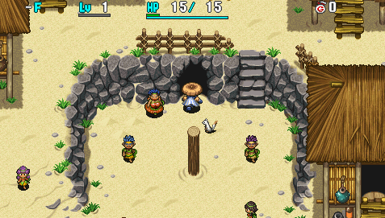
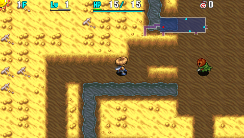

  

Dungeon where all attacks reduce HP to 1, and if a character gets hit with 1 HP remaining, they collapse. This rule also applies to fixed damage attacks like rocks, and no one is exempt, including Shopkeepers. It's similar to Double Strike Trail in Shiren 5, but it's balanced better and luck isn't as big of a factor.

<ul class="quickLinksUL">
  <li><a href="#overview">Overview</a></li>
  <li><a href="#strategy">Strategy</a></li>
  <li><a href="#floor-guide">Floor Guide</a></li>
  <li><a href="#monsters">Monsters</a></li>
  <li><a href="#items">Items</a></li>
  <li><a href="#traps">Traps</a></li>
</ul>

# Overview

<table class="dungeonOverview">
  <tr>
    <th>Unlock</th>
    <td class="highlightYellow">Go to Kamina's cell in Boronga Village after clearing the main story.</td>
  </tr>
  <tr>
    <th>Entrance</th>
    <td class="highlightYellow">Boronga Village (Kamina's Cell)</td>
  </tr>
</table>

<table class="dungeonTable">
  <tr>
    <th>Floors</th>
    <td>99F</td>
    <th>Day / Night</th>
    <td>Day</td>
  </tr>
  <tr>
    <th>Bring Items</th>
    <td>No</td>
    <th>Allies</th>
    <td>No</td>
  </tr>
  <tr>
    <th>Unidentified</th>
    <td colspan="3">None</td>
  </tr>
  <tr>
    <th>Shops</th>
    <td>Regular, Pick-A-Choice</td>
    <th>Monster Houses</th>
    <td>Regular, Sudden</td>
  </tr>
  <tr>
    <th>Initial Enemies</th>
    <td>5~9</td>
    <th>Spawn Rate</th>
    <td>30</td>
  </tr>
  <tr>
    <th>Ominous aura</th>
    <td>No</td>
    <th>Winds of Kron</th>
    <td>1st: 1700 / 4th: 2000</td>
  </tr>
  <tr>
    <th>Clear Icon</th>
    <td>None</td>
    <th>Clear Bonus</th>
    <td>30,000,000</td>
  </tr>
  <tr>
    <th>Reward</th>
    <td colspan="3">Helix Shield</td>
  </tr>
</table>

# Strategy

<ul class="quickLinksUL">
  <li><a href="#general">General</a></li>
  <li><a href="#equipment">Equipment</a></li>
  <li><a href="#other-items">Other Items</a></li>
</ul>

### General

#### Basics

The main gimmick is that all creatures collapse after 2 hits.

- 1 HP - Character collapses when hit.
- 2+ HP - Character's HP drops to 1 when hit.

So in this dungeon, 2 HP and 500 HP for remaining HP are the same thing.

Shiren can still regenerate HP by moving or stepping in place, so you can win most 1 vs 1 encounters by looping attack → step away → attack.

However, this strategy doesn't work against Pumphantasms in walls, enemies with ranged attacks, swift monsters, and groups of enemies in general - Consider enemy abilities and positions before acting.

The key is to get the first hit in, so projectiles are incredibly important. Unneeded scrolls or such can be thrown to deal damage if you don't have arrows or rocks.

The dungeon allows for trading hits with most monsters, but dropping Shiren's HP to 1 every fight introduces unnecessary risk, and there's no reason to be stingy with items, so aim to maintain 2+ HP using arrows, rocks, staves, talismans, etc. instead of dropping to 1 HP.

#### Hallways

It's a daytime-only dungeon, but floor ranges alternate between visible and dark hallways. Floors with dark hallways are far more dangerous, and require carefully chosen actions.

The general outline for the 2 types of floors:

- Visible hallways - Check rooms for items to some degree before advancing to the next floor.
- Dark hallways - Advance to the next floor when you find the stairs.

Of course, you'll also need to take into account the monster table for any given floor.

#### Starvation

If you get hit while fullness is at 0, you'll instantly collapse due to the 1 HP per turn starvation damage. So it's best to replenish fullness before it gets close to 0 for safety - Thankfully, bananas aren't rare.

#### HP Regen

HP regeneration slows down as max HP increases:

- 15\~70 HP - Heal at least 1.0 HP per turn.
- 135+ HP - Heal 1.0 HP every 2 turns.

It's advantageous to keep max HP low in this dungeon, but it's hard to avoid leveling up, and relying on higher level Spin Polygon or DJ Mage types to reduce stats is too risky to bother with. Eating a Disaster Seed is an option, but you'll just level up right away afterward, so it's not worthwhile.

#### Traps

Traps are generally more dangerous than in other dungeons. For example, a damage dealing trap can finish you off when you step back while fighting a monster. It's best to check for traps near enemies, and to utilize tiles you've already walked on instead of new tiles.

Sight Grass is usually pretty common, so make use of it to locate traps and collect arrows.

#### Shops / Stealing

Some powerful equipment can only be found in shops. Palm Stick, Breeze Blade, Spry Shield, Synthesis Pots, and projectiles are all top priority.

Pick-A-Choice shops aren't too different from regular shops in terms of merchandise. If your HP regen rate is 1 HP every 2 turns, step on the arrow after the turn your HP didn't regenerate. This makes it so you start with 2 HP on the next floor even if you fall in a Pit Trap.

Shopkeepers can also be defeated in 2 hits, so it's usually pretty easy to steal from shops. Kleptoad appears from 17F, though, so you won't have to steal much from then on.

#### Tips

1. Check for traps when an enemy is near you in a room.
2. Check for traps on floors where swift monsters appear.
    - Summon Trap can instantly end your run.
3. Check for nearby enemies in hallways by seeing how long it takes to change directions after attacking.
    - After shooting an arrow also works.
4. Take good care of Suction Scrolls and Presto Pots.
5. Use Transient Staff to locate the stairs on dangerous floors if you have a Monster Detector.
6. Rocks can hit enemies inside walls, and can be used to collect arrows from traps.
7. If you have swift speed and warp, you won't be attacked on the turn you land.
    - Swift speed monsters can still attack on the same turn.
8. Pinning Staff can be used to warp if you land on a water or air tile.
9. Be mindful of the 1 HP every 2 turns regen speed once you reach 135+ HP.
    - You can use direct attacks to adjust the timing for HP regen.
10. Turn order is: Shiren → Trap → HP regen → Enemies.
11. If you have 70 or less max HP, you can step in place and wait for the enemy to miss.
12. If you're tired and are losing focus, use the Suspend command and take a break.

### Equipment

Attack power and defense are meaningless. All that matters is innate ability, runes gained by leveling up, and 2 bracelet resonance. Direct attack accuracy increases as your weapon levels up, so any weapon is better than no weapon.

#### Weapon

<ul>
  <li>Breeze Blade
    <ul>
      <li>Shop or Mealy exclusive - Lets you attack through hallway corners without using projectiles.
        <ul>
          <li>Wall Clip Bracelet isn't in the item table.</li>
        </ul>
      </li>
      <li>Use it as a main weapon if you don't want to risk Ooze erasing the Tri-direction rune.</li>
    </ul>
  </li>
  <li>Palm Stick
    <ul>
      <li>Shop exclusive - Gains Charge at Lv8, which grants 100% accuracy after 2 missed attacks.</li>
      <li>Pairs nicely with Palm Shield for 1/2 Hunger and 2 bracelet resonance.</li>
    </ul>
  </li>
  <li>Dull Gold Edge
    <ul>
      <li>Gains Paralyzing at Lv8, and has a fast growth rate.</li>
    </ul>
  </li>
  <li>Rusty Pickaxe
    <ul>
      <li>Gains Blinding at Lv5, but only recommended if you're confident you won't hit a wall on accident.</li>
      <li>Another option is to use it as a secondary weapon to create shortcuts or an escape route.</li>
    </ul>
  </li>
  <li>Old Mallet
    <ul>
      <li>Gains Confusing at Lv5, but not recommended since it can break when you check for traps.</li>
    </ul>
  </li>
</ul>

#### Runes

See [Runes](/system/synthesis-runes) for details.

<table>
  <thead>
    <tr>
      <th>Priority</th>
      <th>Runes</th>
    </tr>
  </thead>
  <tbody>
    <tr>
      <td class="highlightRed">Top</td>
      <td>Tri-direction, Charge, Sedating, Paralyzing</td>
    </tr>
    <tr>
      <td class="highlightPink">High</td>
      <td>Confusing, Blinding</td>
    </tr>
    <tr>
      <td class="highlightYellow">Mid</td>
      <td>Rustproof</td>
    </tr>
  </tbody>
</table>

#### Shield

<ul>
  <li>Diet Shield
    <ul>
      <li>There are multiple Banana Morph floor ranges and bananas aren't very rare, but it's still nice to have this to free up inventory space that would've been used on food.</li>
    </ul>
  </li>
  <li>Palm Shield
    <ul>
      <li>Gains 1/2 Hunger at Lv8, which halves your hunger rate.</li>
      <li>Pairs nicely with Palm Stick for Charge and 2 bracelet resonance.</li>
    </ul>
  </li>
  <li>Spry Shield
    <ul>
      <li>Shop or Mealy exclusive - Increases your chance to dodge enemy direct attacks.</li>
      <li>The chance increases as the shield levels up, so it's not a bad main shield option.
        <ul>
          <li>DS version has a bug where the chance doesn't increase.</li>
        </ul>
      </li>
    </ul>
  </li>
</ul>

#### Runes

See [Runes](/system/synthesis-runes) for details.

<table>
  <thead>
    <tr>
      <th>Priority</th>
      <th>Runes</th>
    </tr>
  </thead>
  <tbody>
    <tr>
      <td class="highlightRed">Top</td>
      <td>1/2 Hunger, Agile</td>
    </tr>
    <tr>
      <td class="highlightPink">High</td>
      <td>1 HP</td>
    </tr>
    <tr>
      <td class="highlightYellow">Mid</td>
      <td>Rustproof, Anti-Burgle</td>
    </tr>
  </tbody>
</table>

#### Bracelets

<ul>
  <li>Monster Detector
    <ul>
      <li>Shop or Pick-A-Choice exclusive - Great for floor ranges that have dark hallways.</li>
      <li>It seems it only has a chance to appear starting on 40F.</li>
    </ul>
  </li>
  <li>Item Detector
    <ul>
      <li>Informs you of a shop at a glance, check rooms for items more efficiently.</li>
    </ul>
  </li>
  <li>Alert Bracelet
    <ul>
      <li>Protects against Sleep Trap and Dozikon (36-39F).</li>
      <li>Probably the best bracelet to keep equipped if you don't have a Monster Detector.</li>
    </ul>
  </li>
  <li>Calm Bracelet
    <ul>
      <li>Protects against Blade Bee types, MC Mage (36-40F), and Dazikon (47-49F).</li>
    </ul>
  </li>
  <li>Cleansing Bracelet
    <ul>
      <li>Protects against Mutaikon types from slowing your action speed.</li>
    </ul>
  </li>
  <li>Pierce Bracelet
    <ul>
      <li>Shoot arrows to clear a line of enemies, throw a Swap Staff to escape, etc.</li>
      <li>Nice to have for Flash Bird and Bored Kappa types.</li>
    </ul>
  </li>
  <li>Strider Bracelet
    <ul>
      <li>Escape from a bad situation, or unequip over water to warp.</li>
      <li>Keep scrolls in pots to prevent them from getting wet.</li>
    </ul>
  </li>
  <li>Warp Bracelet
    <ul>
      <li>Warp to different rooms without having to walk through dark hallways.</li>
      <li>Enemies act after you land, so it's a bit risky.</li>
    </ul>
  </li>
</ul>

### Other Items

#### Pots

<ul>
  <li>Presto Pot
    <ul>
      <li>Obtain Navigation Scrolls, Revival Grass, and useful staves.</li>
      <li>Use Suction Scrolls on this pot if it has a capacity of 5 instead of breaking it.</li>
    </ul>
  </li>
  <li>Purify Pot
    <ul>
      <li>Storage Pots are rare, so use this pot to store items.</li>
    </ul>
  </li>
  <li>Zalokleft Pot
    <ul>
      <li>Break it to obtain items from Zaloklefts, or use it to store items.</li>
    </ul>
  </li>
  <li>Synthesis Pot
    <ul>
      <li>Shop or Mealy exclusive - Synthesize runes, or combine staves to free up inventory space.</li>
    </ul>
  </li>
  <li>Black Hole Pot
    <ul>
      <li>Save these for dangerous end game floors as much as possible.</li>
      <li>If your HP regen rate is 1 HP every 2 turns, step on the Pit Trap after the turn your HP didn't regenerate. This makes it so you start with 2 HP on the next floor.</li>
    </ul>
  </li>
  <li>Heal Pot
    <ul>
      <li>Get back to 2 HP without having to move on floors with dark hallways.</li>
      <li>Also used to cure Blind status.</li>
    </ul>
  </li>
</ul>

#### Scrolls

<ul>
  <li>Navigation Scroll
    <ul>
      <li>Save these for floors with dark hallways or dangerous enemies like Yanpii.</li>
    </ul>
  </li>
  <li>Confusion Scroll
    <ul>
      <li>Nice for sudden style Monster Houses, or floors with Boy Cart, Tiger Tosser, Fearabbit.</li>
      <li>It's best to use a different item if 2 or more enemies are adjacent to you.</li>
    </ul>
  </li>
  <li>Slumber Scroll
    <ul>
      <li>Only use it if you can defeat all enemies or reach the stairs within 12 turns.</li>
    </ul>
  </li>
  <li>Fear Scroll
    <ul>
      <li>Nice when you're surrounded after stepping on a Summon Trap or such.</li>
    </ul>
  </li>
  <li>Fixer Scroll
    <ul>
      <li>Paralyze enemies after stepping on a Summon Trap, purify equipment, etc.</li>
    </ul>
  </li>
  <li>Air Slash Scroll
    <ul>
      <li>Use 2 in a row to wipe out all enemies in the room.</li>
    </ul>
  </li>
  <li>Purify Scroll
    <ul>
      <li>Keep it safe by inserting it into a pot.</li>
    </ul>
  </li>
  <li>Suction Scroll
    <ul>
      <li>If it's blessed, use it to bless Revival Grass, Navigation Scroll, or another Suction Scroll.</li>
      <li>Otherwise, use it on Presto Pots.</li>
    </ul>
  </li>
</ul>

#### Staves

<ul>
  <li>Knockback Staff
    <ul>
      <li>Use it as a 100% accuracy projectile, or to create distance.</li>
    </ul>
  </li>
  <li>Swap Staff
    <ul>
      <li>Escape from a bad situation, or quickly reach the stairs.</li>
    </ul>
  </li>
  <li>Pinning Staff
    <ul>
      <li>Escape from a bad situation, or warp to a different room.</li>
    </ul>
  </li>
  <li>Paralysis Staff
    <ul>
      <li>Use it to block off a hallway, or as a synthesis ingredient.</li>
      <li>Beware of Tiger Tosser and Absorbiphant types.</li>
    </ul>
  </li>
  <li>Transient Staff
    <ul>
      <li>Locate the stairs if you have a Navigation Scroll or Monster Detector.</li>
    </ul>
  </li>
  <li>Decoy Staff
    <ul>
      <li>Nice against Flash Bird types, Squid Emperor, Squid Kaiser, etc.</li>
    </ul>
  </li>
  <li>Mage Staff
    <ul>
      <li>Potentially disable a single monster.</li>
      <li>Use a different item if you're adjacent to an enemy and only have 1 HP remaining.</li>
    </ul>
  </li>
  <li>Slow Staff
    <ul>
      <li>Effective against most enemies except for Absorbiphant types.</li>
      <li>It takes 2 uses to reduce Swift 2 and yellow aura monsters to regular speed.</li>
    </ul>
  </li>
  <li>Trap Erase Staff
    <ul>
      <li>Use it as a 100% accuracy projectile, or to ensure a safe path to the stairs.</li>
    </ul>
  </li>
  <li>Tunnel Staff
    <ul>
      <li>Use it as a 100% accuracy projectile, or to create shortcuts.</li>
    </ul>
  </li>
  <li>Balance Staff
    <ul>
      <li>Prevents receiving damage from stepping on a Trip Stone.</li>
    </ul>
  </li>
</ul>

#### Talismans

<ul>
  <li>Fear Talisman
    <ul>
      <li>Disables both direct attacks and special attacks.</li>
    </ul>
  </li>
  <li>Miss Talisman
    <ul>
      <li>Disables direct attacks.</li>
    </ul>
  </li>
  <li>Slow Talisman
    <ul>
      <li>Loop attack → step away to safely defeat most enemies.</li>
      <li>It takes 2 talismans to reduce Swift 2 and yellow aura monsters to regular speed.</li>
    </ul>
  </li>
  <li>Sleep Talisman
    <ul>
      <li>Disables all actions, but short duration.</li>
    </ul>
  </li>
</ul>

#### Grass

<ul>
  <li>Revival Grass
    <ul>
      <li>Obtained from a regular shop, Pick-A-Choice shop, or Presto Pot.</li>
      <li>Play carefully even if you're lucky enough to obtain one.</li>
    </ul>
  </li>
  <li>Swift Grass
    <ul>
      <li>Eat it and act 1 time without being attacked, unless the monster is also Swift.</li>
      <li>Escape from a bad situation, quickly defeat enemies, ensure safety when warping, etc.</li>
    </ul>
  </li>
  <li>Warp Grass
    <ul>
      <li>Use it after Swift Grass to safely warp to a different room.</li>
      <li>If you use it on its own, you risk an instant game over if you land next to 2 enemies.</li>
    </ul>
  </li>
  <li>Sight Grass
    <ul>
      <li>Eliminates the need to check for traps - Best used at the start of a floor.</li>
      <li>Collect arrows from Wood Arrow Traps, make it safer to utilize Banana Morph and hunt Mealy.</li>
      <li>Throw 2 at Mixergon (53-55F) to add the Agile rune to your shield.</li>
    </ul>
  </li>
  <li>Heal Grass
    <ul>
      <li>Use it to cure Confused, Slow, Blind, or Afraid status.</li>
    </ul>
  </li>
  <li>Sleep Grass, Blind Grass, Dizzy Grass
    <ul>
      <li>Throw at a Mixergon (53-55F) to add status inflicting runes to your weapon.</li>
    </ul>
  </li>
  <li>Disaster Seed
    <ul>
      <li>Eat it to reduce your max HP to the point where you regenerate 1 HP every turn.</li>
      <li>However, fullness drops to 10 and you'll level up soon after, so it's often not worth eating.</li>
      <li>Throw at a Mixergon (53-55F) to add the 1 HP rune to your shield only.</li>
    </ul>
  </li>
</ul>

#### Projectiles

<ul>
  <li>Wood Arrow
    <ul>
      <li>Defeat enemies from a distance, check for monsters in hallways.</li>
      <li>Collect arrows from Wood Arrow Traps using Sight Grass or Traproids (50-58F).</li>
      <li>A Boy Cart (20-24F) slowed by 2 stages can also be used if you block off a room.</li>
    </ul>
  </li>
  <li>Rock
    <ul>
      <li>Throw at Wood Arrow Traps to collect arrows, defeat Pumphantasm types in walls.</li>
    </ul>
  </li>
  <li>Porky Rock
    <ul>
      <li>Similar usage to Rock, but can also be used to check for monsters near hallway corners.</li>
    </ul>
  </li>
</ul>

#### Other

<ul>
  <li>Bananas
    <ul>
      <li>Can be thrown at a Banana Novice type to instantly defeat them.</li>
    </ul>
  </li>
  <li>Banana Peel
    <ul>
      <li>Throw to either reduce the target's HP to 1, or inflict Slip status if it misses.</li>
      <li>Beware of floating types (Crow Tengu in particular) and Absorbiphant types.</li>
    </ul>
  </li>
  <li>Sealed Items
    <ul>
      <li>Any sealed item can be thrown to deal damage.</li>
    </ul>
  </li>
</ul>

# Floor Guide

### 1-3F

Blade Bee (1-2F), Pumphantasm (1-3F), etc.

Pumphantasm attacking from inside a wall can be a problem. If your max HP is &le; 70, you won't collapse as long as you move or step in place. However, that doesn't apply if you get surrounded, so it's best to defeat them in a room beforehand. Rocks can be thrown to defeat Pumphantasms in walls, but remember that the throw can miss.

If you found rocks and Sight Grass, go ahead and eat the Sight Grass to look for Wood Arrow Traps, then throw rocks onto the traps to collect arrows.

### 4-11F

Pumptergeist (4-16F), Sing Polygon (4-8F), Squid King (5-7F), Curse Girl (7-8F), Chainhead (7-11F), Rally Ham (7-11F), Osmammoth (9-11F), Banana Morph (10-11F), etc.

High experience point monsters appear, so you'll likely exceed 70 max HP pretty quickly. Once you're above 70, try to reach 135+ max HP as soon as possible to make HP regen predictable.

Pumptergeist provides 170 skill points, so it'd be good to level a weapon to Lv4 to raise accuracy.

Sing Polygon warps in front of you in rooms, and can be very dangerous if there are multiple of them. Their special attack can lower max fullness by 7, which can be a pain if it happens multiple times. Use scrolls or staves, and use the Scout command if you see a red dot enter the room.

Squid King can be dangerous if it blinds you while other enemies are nearby, so lure it into a hallway. Chainhead can attack through corners, so don't retreat if you're on a corner tile and have 1 HP. Osmammoth isn't very threatening here, but it can be healed if your weapon has a status rune. Rally Ham can be annoying if it gets behind an enemy in a hallway, so defeat it if you have the chance.

Curse Girl and others with dangerous adjacent special attacks should be dealt with from a distance. Either deal damage 1 time and finish with a direct attack, or outright defeat it using projectiles. ※ If you have a Black Hole Pot, it's not a bad idea to have a Curse Girl seal it.

#### 10-11F

Banana Morph can be used to perform [Banana Morph Factory](/guides/tips-and-tricks#banana-morph-factory). It's not required, but if you raise max fullness to 120, you can get full use out of Ripe Bananas. Check for traps and inflict Slow status on the Banana Morph if possible to ensure safety.

### 12-14F

Pumptergeist (4-16F), Gazer (12-14F), Kappa Pest (12-14F), Blade Bee (14-16F), etc.

Kappa Pest makes it hard to pick up items, and Gazer can cause item loss, so consider rushing stairs. In particular, Kappa Pest can potentially cause a game over if it throws a dangerous staff or talisman.

### 15-19F

Pumptergeist (4-16F), Blade Bee (14-16F), Banana Master (15-17F), Pop Tank (17-19F), DJ Mage (17-20F), Eligagon (15-19F), Kleptoad (17-22F), Munchy (18-19F), etc.

Hallways are dark between 15-19F.

The combination of dark hallways and Pumptergeist is quite dangerous between 15-16F. Step in place at the start of a floor to lure Pumptergeists and defeat them before entering a hallway.

Banana Master is also dangerous, so use direct attacks or arrows to check for incoming enemies in hallways. Note that Banana Master and Pop Tank overlap on 17F - If you're turned into a Grilled Banana, it's game over. Pop Tank or DJ Mage leveling up can cause problems in general, so don't neglect to Scout in rooms.

#### 18-19F

Kleptoad and Munchy can be hunted for Gitan and shop table items - Use a Navigation Scroll if you have one. Notable items include Breeze Blade, Diet Shield, Spry Shield, Synthesis Pot, Revival Grass, etc.

Eligagon also provides 300 skill points, making this a nice spot to level equipment. Dull Gold Edge, Rusty Pickaxe, Palm Stick, and Palm Shield have fast enough growth rate to reach Lv8 here.

### 20-26F

Boy Cart (20-24F), Banana Morph (20-21F), Glare Bird (21-23F), Blazepuff (22-26F), Curse Girl (23-25F), etc.

Boy Cart has Swift 1 action speed and is a major threat in rooms - Use the Scout command. Lure it into a hallway and unequip your weapon if it has the Confusing or Blinding rune. If you're caught in the middle of a room, swing a staff to disable the Boy Cart. 

Banana Morph makes another appearance, providing a chance to restock bananas. Glare Bird heals adjacent monsters and is immune to projectiles unless you have a Pierce Bracelet equipped. Blazepuff can blow fire through corners, so don't retreat if you're on a corner tile and have 1 HP.

### 27F

Zapdon (23-27F), Cave Mamel (26-30F), Elizgagon (27-29F), Katana Bee (27-31F)

Safe floor range to hunt monsters and finish leveling equipment. Elizgagon in particular provides a massive 700 skill points, so aim to reach Lv8 for your weapon here.

### 28-32F

Katana Bee (27-31F), Porky (28-32F), Dragon (30-35F), Absorbiphant (32-34F), Ooze (32-37F), etc.

Hallways are dark between 30-39F.

Porky can throw Porky Rocks within a 2 tile radius - Don't step away if it's adjacent and you're at 1 HP. Either defeat it from a safe distance, or damage it 1 time and wait for it to step toward you to finish it off. If it throws a rock instead of stepping toward you, step away to recover HP and try again.

Dragons can breathe fire in a straight line (infinite range), which also goes through hallway corners. Don't retreat if you're on a corner tile and have 1 HP.

### 33-35F

Dragon (30-35F), Absorbiphant (32-34F), Ooze (32-37F), Vexing Kappa (33-35F), Spirit Ham (33-35F), etc.

Hallways are dark between 30-39F.

Porky no longer appears, but Dragons continue to be a threat.

Vexing Kappa can potentially cause a game over if it throws a Sleep Talisman or Slow Talisman. If you have an Item Detector, avoid going near items that are outside of your view.

Some players drag an Ooze behind them to block off other monsters if they don't have runes, but it's not recommended since it makes you unable to retreat to recover HP in hallways.

### 36-41F

Dozikon (36-39F), Tiger Tosser (36-41F), MC Mage (36-40F), Banana Master (37-39F), Gyandora (40-44F), etc.

Hallways are dark between 30-39F.

Dozikons are extremely dangerous, so keep an Alert Bracelet equipped if you have one. Otherwise, use Navigation Scrolls or Black Hole Pots to hurry to the next floor as fast as possible. MC Mage's Transient effect might be tempting, but it's generally not worth the risk.

Tiger Tosser can one-shot you in 1 turn by throwing a monster that attacks you after colliding with you. Use items like Confusion Scroll or staves if Tiger Tosser is adjacent to another monster, unless you're outside of Tiger Tosser's throwing range of 5 tiles.

### 42-49F

Gyandora (40-44F), Twinkle Bird (42-44F), Crow Tengu (45-49F), Dazikon (47-49F), Curse Girl (45-55F), etc.

Twinkle Birds warp from anywhere on the floor to heal hurt monsters standing within 3 tiles of Shiren, and are immune to projectiles unless you have a Pierce Bracelet equipped - It's best to rush stairs. Effective items include Pierce Bracelet, Decoy Staff, Swift Grass, Slumber Scroll, etc.

Thrown Banana Peels won't inflict Slip status if they miss against floating types like Crow Tengu, and keep in mind that a Kleptoad (40-54F) could actually be a disguised Crow Tengu.

Keep a Calm Bracelet equipped on Dazikon floors if you have one. Otherwise, use a scroll or staff to deal with the Dazikon if you get confused.

### 50-54F

Curse Girl (45-55F), Traproid (50-58F), Zalokleft (50-59F), N'twyn (50-69F), Mixergon (53-55F), etc.

Yellow aura monsters can spawn starting on 51F or so.

Traproids appearing from a Summon Trap can instantly end a run, so it's best to check for traps. Wait until the next floor to use items found on the current floor to avoid surprise attacks by N'twyn. Hunt Zaloklefts for items if you want.

Mixergon (53-55F) appears, providing your first and last chance to synthesize without Synthesis Pots. Aim to synthesize Paralyzing, Sedating, Confusing, and Blinding weapon runes if possible. Don't forget to combine staves to free up inventory space as well.

### 55-59F

Traproid (50-58F), Zalokleft (50-59F), N'twyn (50-69F), Gyairas (55-57F), Hopodile (54-59F), etc.

Hallways are dark between 55-59F.

Generally on the easy side, but watch out for Hopodile's chess knight movement in rooms. Keep talismans and scrolls inside pots to protect them from Gyairas's special attack.

### 60-64F

N'twyn (50-69F), Boy Cart (60-62F), Spongiderm (62-64F), Pumptergeist (63-65F), Doom Gyaza (63-67F), etc.

Boy Cart and Pumptergeist return, but hallways are visible so it shouldn't be too bad. Doom Gyaza's ability to nullify status conditions can be a problem if it has a yellow aura.

### 65-69F

N'twyn (50-69F), Pumptergeist (63-65F), Squid Emperor (65-67F), Chainhead (65-69F), Dagger Bee (66-68F), Digestiphant (68-70F), Tiger Chucker (69-74F), etc.

Hallways are dark between 65-69F.

Chainhead can attack through corners, so don't retreat if you're on a corner tile and have 1 HP. Squid Emperor can blind you from anywhere in the room and is quite dangerous without a Monster Detector.

Tiger Chucker (69-74F) can one-shot you in 1 turn, similar to Tiger Tosser. It has a throwing range of 15 tiles - It's probably best to use a Navigation Scroll or Black Hole Pot.

### 70-75F

Tiger Chucker (69-74F), Foly (70-71F), Cheer Ham (70-72F), Super Gazer (73-75F), MC Sorcerer (73-75F), etc.

Tiger Chucker continues to be a major threat, but hallways are visible so it's slightly easier.

Foly can one-shot you in 1 turn if you encounter a blue one in a hallway (direct attack → lightning). Use a scroll if you're caught in the middle of a room with Foly, especially if it's blue.

MC Sorcerer can inflict Banana or Slow status - Use a staff if you're lined up with it to avoid its special.

### 76-79F

Falcon Tengu (76-79F), Boss Yanpii (76-78F), Boingodile (76-80F), Spirit Ham (77-82F), etc.

Boss Yanpii can one-shot you in 1 turn with its headbutt even if you have 2+ HP, so don't line up with it. If it's adjacent to you, its headbutt will only deal 2 tiles of knockback.

79F is the last floor with visible hallways where you can relax before the final rush.

### 80-84F

Spirit Ham (77-82F), Foly (80-81F), Squid Kaiser (80-85F), Ooze (80-89F), Spin Polygon (83-85F), etc.

Hallways are dark between 80-99F.

The combination of Foly, Squid Kaiser, and Spin Polygon can be quite deadly.

### 85-99F

Gitan Mamel (85-99F), Pop Tank (86-88F), Fearabbit (89-91, 97-99F), MC Sorcerer (89-91F), Foly (90-91, 98-99F), Shine Bird (92-95F), Steamroid (91-95F), Cyberoid (96-99F), Dragon (96-99F), Mutaikon (96-99F), etc.

Hallways are dark between 80-99F.

Onslaught of monsters with ranged attacks, swift action speed, special movement, etc. Rush stairs, using Navigation Scrolls and Black Hole Pots as needed.

Gitan Mamel (85-99F) has Swift 2 action speed, meaning it can move/attack 2 times per turn. Use direct attacks or arrows in hallways to check for incoming monsters if you don't have a Monster Detector.

Fearabbit (89-91, 97-99F) can end your run in 1 turn if it attracts you and other monsters. Try to save Navigation Scrolls and Black Hole Pots for these floors if possible.

Shine Bird (92-95F) makes it hard to defeat enemies, so use Pinning Staff and Swap Staff to run away. If you have no choice but to fight, use items like scrolls, talismans, or Swift Grass.

Traproid types (91-99F) can rush at you when you step into a room, but should be easier than Gitan Mamels.

Other ranged attackers include MC Sorcerer, Field Knave, Dragon, Mutaikon and such. You can distract Field Knave by shooting an arrow or throwing a rock away from where you're standing. Mutaikon can inflict Slow status, so use an item if you're within its 2 tile throwing range.

# Monsters

See [Monsters](/system/monsters) for individual monster details.

- F = Dark Hallways
- S = Shop is possible
- P = Pick-A-Choice Shop is possible
- H = Monster House is possible
- N = N'dubba Lv1 Lv2 Lv3 Lv4

Enemy Colors: Farming Useful Destroys Items Caution Dangerous Very Dangerous

<table class="monsterTable">
  <thead>
    <tr>
      <th>F</th>
      <th>S</th>
      <th>P</th>
      <th>H</th>
      <th colspan="8">Monsters</th>
      <th>N</th>
    </tr>
  </thead>
  <tbody>
    <tr>
      <th>1</th>
      <td class="highlightGray"></td>
      <td class="highlightGray"></td>
      <td class="highlightGray"></td>
      <td class="">Chintala</td>
      <td class="highlightDanger">Pumphantasm</td>
      <td class="">Scorpion</td>
      <td class="highlightOffense">Blade Bee</td>
      <td class="highlightGray"></td>
      <td class="highlightGray"></td>
      <td class="highlightGray"></td>
      <td class="highlightGray"></td>
      <td class="highlightGray"></td>
    </tr>
    <tr>
      <th>2</th>
      <td class="highlightShop"></td>
      <td class="highlightChoice"></td>
      <td class="highlightMH"></td>
      <td class="">Chintala</td>
      <td class="highlightDanger">Pumphantasm</td>
      <td class="">Scorpion</td>
      <td class="highlightOffense">Blade Bee</td>
      <td class="highlightGray"></td>
      <td class="highlightGray"></td>
      <td class="highlightGray"></td>
      <td class="highlightGray"></td>
      <td class="highlightGray"></td>
    </tr>
    <tr>
      <th>3</th>
      <td class="highlightShop"></td>
      <td class="highlightChoice"></td>
      <td class="highlightMH"></td>
      <td class="">Chintala</td>
      <td class="highlightDanger">Pumphantasm</td>
      <td class="">Scorpion</td>
      <td class="highlightGray"></td>
      <td class="highlightGray"></td>
      <td class="highlightGray"></td>
      <td class="highlightGray"></td>
      <td class="highlightGray"></td>
      <td class="highlightGray"></td>
    </tr>
    <tr>
      <th>4</th>
      <td class="highlightShop"></td>
      <td class="highlightChoice"></td>
      <td class="highlightMH"></td>
      <td class="">Chintala</td>
      <td class="highlightDanger">Pumptergeist</td>
      <td class="highlightDanger">Sing Polygon</td>
      <td class="highlightItem">Iai</td>
      <td class="highlightGray"></td>
      <td class="highlightGray"></td>
      <td class="highlightGray"></td>
      <td class="highlightGray"></td>
      <td class="highlightGray"></td>
    </tr>
    <tr>
      <th>5</th>
      <td class="highlightShop"></td>
      <td class="highlightChoice"></td>
      <td class="highlightMH"></td>
      <td class="">Chintala</td>
      <td class="highlightDanger">Pumptergeist</td>
      <td class="highlightDanger">Sing Polygon</td>
      <td class="highlightItem">Iai</td>
      <td class="highlightOffense">Squid King</td>
      <td class="highlightGray"></td>
      <td class="highlightGray"></td>
      <td class="highlightGray"></td>
      <td class="highlightGray"></td>
    </tr>
    <tr>
      <th>6</th>
      <td class="highlightShop"></td>
      <td class="highlightChoice"></td>
      <td class="highlightMH"></td>
      <td class="">Chintala</td>
      <td class="highlightDanger">Pumptergeist</td>
      <td class="highlightDanger">Sing Polygon</td>
      <td class="highlightItem">Iai</td>
      <td class="highlightOffense">Squid King</td>
      <td class="highlightGray"></td>
      <td class="highlightGray"></td>
      <td class="highlightGray"></td>
      <td class="highlightGray"></td>
    </tr>
    <tr>
      <th>7</th>
      <td class="highlightShop"></td>
      <td class="highlightChoice"></td>
      <td class="highlightMH"></td>
      <td class="highlightOffense">Chainhead</td>
      <td class="highlightDanger">Pumptergeist</td>
      <td class="highlightDanger">Sing Polygon</td>
      <td class="highlightItem">Iai</td>
      <td class="highlightOffense">Squid King</td>
      <td class="">Rally Ham</td>
      <td class="highlightItem">Curse Girl</td>
      <td class="highlightGray"></td>
      <td class="highlightGray"></td>
    </tr>
    <tr>
      <th>8</th>
      <td class="highlightShop"></td>
      <td class="highlightChoice"></td>
      <td class="highlightMH"></td>
      <td class="highlightOffense">Chainhead</td>
      <td class="highlightDanger">Pumptergeist</td>
      <td class="highlightDanger">Sing Polygon</td>
      <td class="highlightItem">Iai</td>
      <td class="highlightGray"></td>
      <td class="">Rally Ham</td>
      <td class="highlightItem">Curse Girl</td>
      <td class="highlightGray"></td>
      <td class="highlightGray"></td>
    </tr>
    <tr>
      <th>9</th>
      <td class="highlightShop"></td>
      <td class="highlightChoice"></td>
      <td class="highlightMH"></td>
      <td class="highlightOffense">Chainhead</td>
      <td class="highlightDanger">Pumptergeist</td>
      <td class="highlightOffense">Osmammoth</td>
      <td class="highlightGray"></td>
      <td class="highlightGray"></td>
      <td class="">Rally Ham</td>
      <td class="highlightGray"></td>
      <td class="highlightGray"></td>
      <td class="highlightGray"></td>
    </tr>
    <tr>
      <th>10</th>
      <td class="highlightShop"></td>
      <td class="highlightChoice"></td>
      <td class="highlightMH"></td>
      <td class="highlightOffense">Chainhead</td>
      <td class="highlightDanger">Pumptergeist</td>
      <td class="highlightOffense">Osmammoth</td>
      <td class="highlightUseful">Banana Morph</td>
      <td class="highlightGray"></td>
      <td class="">Rally Ham</td>
      <td class="highlightGray"></td>
      <td class="highlightGray"></td>
      <td class="highlightGray"></td>
    </tr>
    <tr>
      <th>11</th>
      <td class="highlightShop"></td>
      <td class="highlightChoice"></td>
      <td class="highlightMH"></td>
      <td class="highlightOffense">Chainhead</td>
      <td class="highlightDanger">Pumptergeist</td>
      <td class="highlightOffense">Osmammoth</td>
      <td class="highlightUseful">Banana Morph</td>
      <td class="highlightGray"></td>
      <td class="">Rally Ham</td>
      <td class="highlightGray"></td>
      <td class="highlightGray"></td>
      <td class="highlightGray"></td>
    </tr>
    <tr>
      <th>12</th>
      <td class="highlightShop"></td>
      <td class="highlightChoice"></td>
      <td class="highlightMH"></td>
      <td class="">Nuttie</td>
      <td class="highlightDanger">Pumptergeist</td>
      <td class="highlightItem">Gazer</td>
      <td class="highlightGray"></td>
      <td class="highlightDanger">Kappa Pest</td>
      <td class="highlightGray"></td>
      <td class="highlightGray"></td>
      <td class="highlightGray"></td>
      <td class="highlightGray"></td>
    </tr>
    <tr>
      <th>13</th>
      <td class="highlightShop"></td>
      <td class="highlightChoice"></td>
      <td class="highlightMH"></td>
      <td class="">Nuttie</td>
      <td class="highlightDanger">Pumptergeist</td>
      <td class="highlightItem">Gazer</td>
      <td class="highlightGray"></td>
      <td class="highlightDanger">Kappa Pest</td>
      <td class="highlightGray"></td>
      <td class="highlightGray"></td>
      <td class="highlightGray"></td>
      <td class="highlightGray"></td>
    </tr>
    <tr>
      <th>14</th>
      <td class="highlightShop"></td>
      <td class="highlightChoice"></td>
      <td class="highlightMH"></td>
      <td class="">Nuttie</td>
      <td class="highlightDanger">Pumptergeist</td>
      <td class="highlightItem">Gazer</td>
      <td class="highlightOffense">Blade Bee</td>
      <td class="highlightDanger">Kappa Pest</td>
      <td class="highlightGray"></td>
      <td class="highlightGray"></td>
      <td class="highlightGray"></td>
      <td class="highlightGray"></td>
    </tr>
    <tr>
      <th class="highlightFog">15</th>
      <td class="highlightShop"></td>
      <td class="highlightChoice"></td>
      <td class="highlightMH"></td>
      <td class="highlightFarming">Eligagon</td>
      <td class="highlightDanger">Pumptergeist</td>
      <td class="highlightOffense">Banana Master</td>
      <td class="highlightOffense">Blade Bee</td>
      <td class="highlightGray"></td>
      <td class="highlightGray"></td>
      <td class="highlightGray"></td>
      <td class="highlightGray"></td>
      <td class="highlightGray"></td>
    </tr>
    <tr>
      <th class="highlightFog">16</th>
      <td class="highlightShop"></td>
      <td class="highlightChoice"></td>
      <td class="highlightMH"></td>
      <td class="highlightFarming">Eligagon</td>
      <td class="highlightDanger">Pumptergeist</td>
      <td class="highlightOffense">Banana Master</td>
      <td class="highlightOffense">Blade Bee</td>
      <td class="highlightGray"></td>
      <td class="highlightGray"></td>
      <td class="highlightGray"></td>
      <td class="highlightGray"></td>
      <td class="highlightGray"></td>
    </tr>
    <tr>
      <th class="highlightFog">17</th>
      <td class="highlightShop"></td>
      <td class="highlightChoice"></td>
      <td class="highlightMH"></td>
      <td class="highlightFarming">Eligagon</td>
      <td class="highlightFarming">Kleptoad</td>
      <td class="highlightOffense">Banana Master</td>
      <td class="highlightDanger">Pop Tank</td>
      <td class="highlightOffense">DJ Mage</td>
      <td class="highlightGray"></td>
      <td class="highlightGray"></td>
      <td class="highlightGray"></td>
      <td class="highlightGray"></td>
    </tr>
    <tr>
      <th class="highlightFog">18</th>
      <td class="highlightShop"></td>
      <td class="highlightChoice"></td>
      <td class="highlightMH"></td>
      <td class="highlightFarming">Eligagon</td>
      <td class="highlightFarming">Kleptoad</td>
      <td class="highlightFarming">Munchy</td>
      <td class="highlightDanger">Pop Tank</td>
      <td class="highlightOffense">DJ Mage</td>
      <td class="highlightGray"></td>
      <td class="highlightGray"></td>
      <td class="highlightGray"></td>
      <td class="highlightGray"></td>
    </tr>
    <tr>
      <th class="highlightFog">19</th>
      <td class="highlightShop"></td>
      <td class="highlightChoice"></td>
      <td class="highlightMH"></td>
      <td class="highlightFarming">Eligagon</td>
      <td class="highlightFarming">Kleptoad</td>
      <td class="highlightFarming">Munchy</td>
      <td class="highlightDanger">Pop Tank</td>
      <td class="highlightOffense">DJ Mage</td>
      <td class="highlightGray"></td>
      <td class="highlightGray"></td>
      <td class="highlightGray"></td>
      <td class="highlightGray"></td>
    </tr>
    <tr>
      <th>20</th>
      <td class="highlightShop"></td>
      <td class="highlightChoice"></td>
      <td class="highlightMH"></td>
      <td class="highlightFarming">Eligagon</td>
      <td class="highlightFarming">Kleptoad</td>
      <td class="highlightExtreme">Boy Cart</td>
      <td class="highlightUseful">Banana Morph</td>
      <td class="highlightOffense">DJ Mage</td>
      <td class="highlightGray"></td>
      <td class="highlightGray"></td>
      <td class="highlightGray"></td>
      <td class="highlightGray"></td>
    </tr>
    <tr>
      <th>21</th>
      <td class="highlightShop"></td>
      <td class="highlightChoice"></td>
      <td class="highlightMH"></td>
      <td class="">Glare Bird</td>
      <td class="highlightFarming">Kleptoad</td>
      <td class="highlightExtreme">Boy Cart</td>
      <td class="highlightUseful">Banana Morph</td>
      <td class="highlightGray"></td>
      <td class="highlightGray"></td>
      <td class="highlightGray"></td>
      <td class="highlightGray"></td>
      <td class="highlightGray"></td>
    </tr>
    <tr>
      <th>22</th>
      <td class="highlightShop"></td>
      <td class="highlightChoice"></td>
      <td class="highlightMH"></td>
      <td class="">Glare Bird</td>
      <td class="highlightFarming">Kleptoad</td>
      <td class="highlightExtreme">Boy Cart</td>
      <td class="">Big Chintala</td>
      <td class="">Blazepuff</td>
      <td class="highlightGray"></td>
      <td class="highlightGray"></td>
      <td class="highlightGray"></td>
      <td class="highlightGray"></td>
    </tr>
    <tr>
      <th>23</th>
      <td class="highlightShop"></td>
      <td class="highlightChoice"></td>
      <td class="highlightMH"></td>
      <td class="">Glare Bird</td>
      <td class="">Zapdon</td>
      <td class="highlightExtreme">Boy Cart</td>
      <td class="">Big Chintala</td>
      <td class="">Blazepuff</td>
      <td class="highlightItem">Curse Girl</td>
      <td class="highlightGray"></td>
      <td class="highlightGray"></td>
      <td class="highlightGray"></td>
    </tr>
    <tr>
      <th>24</th>
      <td class="highlightShop"></td>
      <td class="highlightChoice"></td>
      <td class="highlightMH"></td>
      <td class="highlightGray"></td>
      <td class="">Zapdon</td>
      <td class="highlightExtreme">Boy Cart</td>
      <td class="">Big Chintala</td>
      <td class="">Blazepuff</td>
      <td class="highlightItem">Curse Girl</td>
      <td class="highlightGray"></td>
      <td class="highlightGray"></td>
      <td class="highlightGray"></td>
    </tr>
    <tr>
      <th>25</th>
      <td class="highlightShop"></td>
      <td class="highlightChoice"></td>
      <td class="highlightMH"></td>
      <td class="highlightGray"></td>
      <td class="">Zapdon</td>
      <td class="highlightGray"></td>
      <td class="">Big Chintala</td>
      <td class="">Blazepuff</td>
      <td class="highlightItem">Curse Girl</td>
      <td class="highlightGray"></td>
      <td class="highlightGray"></td>
      <td class="highlightGray"></td>
    </tr>
    <tr>
      <th>26</th>
      <td class="highlightShop"></td>
      <td class="highlightChoice"></td>
      <td class="highlightMH"></td>
      <td class="">Cave Mamel</td>
      <td class="">Zapdon</td>
      <td class="highlightGray"></td>
      <td class="">Big Chintala</td>
      <td class="">Blazepuff</td>
      <td class="highlightGray"></td>
      <td class="highlightGray"></td>
      <td class="highlightGray"></td>
      <td class="highlightGray"></td>
    </tr>
    <tr>
      <th>27</th>
      <td class="highlightShop"></td>
      <td class="highlightChoice"></td>
      <td class="highlightMH"></td>
      <td class="">Cave Mamel</td>
      <td class="">Zapdon</td>
      <td class="highlightOffense">Katana Bee</td>
      <td class="highlightFarming">Elizgagon</td>
      <td class="highlightGray"></td>
      <td class="highlightGray"></td>
      <td class="highlightGray"></td>
      <td class="highlightGray"></td>
      <td class="highlightGray"></td>
    </tr>
    <tr>
      <th>28</th>
      <td class="highlightShop"></td>
      <td class="highlightChoice"></td>
      <td class="highlightMH"></td>
      <td class="">Cave Mamel</td>
      <td class="highlightDanger">Porky</td>
      <td class="highlightOffense">Katana Bee</td>
      <td class="highlightFarming">Elizgagon</td>
      <td class="highlightGray"></td>
      <td class="highlightGray"></td>
      <td class="highlightGray"></td>
      <td class="highlightGray"></td>
      <td class="highlightGray"></td>
    </tr>
    <tr>
      <th>29</th>
      <td class="highlightShop"></td>
      <td class="highlightChoice"></td>
      <td class="highlightMH"></td>
      <td class="">Cave Mamel</td>
      <td class="highlightDanger">Porky</td>
      <td class="highlightOffense">Katana Bee</td>
      <td class="highlightFarming">Elizgagon</td>
      <td class="highlightGray"></td>
      <td class="highlightGray"></td>
      <td class="highlightGray"></td>
      <td class="highlightGray"></td>
      <td class="highlightGray"></td>
    </tr>
    <tr>
      <th class="highlightFog">30</th>
      <td class="highlightShop"></td>
      <td class="highlightChoice"></td>
      <td class="highlightMH"></td>
      <td class="">Cave Mamel</td>
      <td class="highlightDanger">Porky</td>
      <td class="highlightOffense">Katana Bee</td>
      <td class="highlightOffense">Dragon</td>
      <td class="highlightGray"></td>
      <td class="highlightGray"></td>
      <td class="highlightGray"></td>
      <td class="highlightGray"></td>
      <td class="highlightGray"></td>
    </tr>
    <tr>
      <th class="highlightFog">31</th>
      <td class="highlightShop"></td>
      <td class="highlightChoice"></td>
      <td class="highlightMH"></td>
      <td class="highlightGray"></td>
      <td class="highlightDanger">Porky</td>
      <td class="highlightOffense">Katana Bee</td>
      <td class="highlightOffense">Dragon</td>
      <td class="highlightGray"></td>
      <td class="highlightGray"></td>
      <td class="highlightGray"></td>
      <td class="highlightGray"></td>
      <td class="highlightGray"></td>
    </tr>
    <tr>
      <th class="highlightFog">32</th>
      <td class="highlightShop"></td>
      <td class="highlightChoice"></td>
      <td class="highlightMH"></td>
      <td class="highlightItem">Ooze</td>
      <td class="highlightDanger">Porky</td>
      <td class="highlightOffense">Absorbiphant</td>
      <td class="highlightOffense">Dragon</td>
      <td class="highlightGray"></td>
      <td class="highlightGray"></td>
      <td class="highlightGray"></td>
      <td class="highlightGray"></td>
      <td class="highlightGray"></td>
    </tr>
    <tr>
      <th class="highlightFog">33</th>
      <td class="highlightShop"></td>
      <td class="highlightChoice"></td>
      <td class="highlightMH"></td>
      <td class="highlightItem">Ooze</td>
      <td class="highlightDanger">Vexing Kappa</td>
      <td class="highlightOffense">Absorbiphant</td>
      <td class="highlightOffense">Dragon</td>
      <td class="">Spirit Ham</td>
      <td class="highlightGray"></td>
      <td class="highlightGray"></td>
      <td class="highlightGray"></td>
      <td class="highlightGray"></td>
    </tr>
    <tr>
      <th class="highlightFog">34</th>
      <td class="highlightShop"></td>
      <td class="highlightChoice"></td>
      <td class="highlightMH"></td>
      <td class="highlightItem">Ooze</td>
      <td class="highlightDanger">Vexing Kappa</td>
      <td class="highlightOffense">Absorbiphant</td>
      <td class="highlightOffense">Dragon</td>
      <td class="">Spirit Ham</td>
      <td class="highlightGray"></td>
      <td class="highlightGray"></td>
      <td class="highlightGray"></td>
      <td class="highlightGray"></td>
    </tr>
    <tr>
      <th class="highlightFog">35</th>
      <td class="highlightShop"></td>
      <td class="highlightChoice"></td>
      <td class="highlightMH"></td>
      <td class="highlightItem">Ooze</td>
      <td class="highlightDanger">Vexing Kappa</td>
      <td class="highlightGray"></td>
      <td class="highlightOffense">Dragon</td>
      <td class="">Spirit Ham</td>
      <td class="highlightGray"></td>
      <td class="highlightGray"></td>
      <td class="highlightGray"></td>
      <td class="highlightGray"></td>
    </tr>
    <tr>
      <th class="highlightFog">36</th>
      <td class="highlightShop"></td>
      <td class="highlightChoice"></td>
      <td class="highlightMH"></td>
      <td class="highlightItem">Ooze</td>
      <td class="highlightExtreme">Dozikon</td>
      <td class="highlightExtreme">Tiger Tosser</td>
      <td class="highlightGray"></td>
      <td class="highlightDanger">MC Mage</td>
      <td class="highlightGray"></td>
      <td class="highlightGray"></td>
      <td class="highlightGray"></td>
      <td class="highlightGray"></td>
    </tr>
    <tr>
      <th class="highlightFog">37</th>
      <td class="highlightShop"></td>
      <td class="highlightChoice"></td>
      <td class="highlightMH"></td>
      <td class="highlightItem">Ooze</td>
      <td class="highlightExtreme">Dozikon</td>
      <td class="highlightExtreme">Tiger Tosser</td>
      <td class="highlightOffense">Banana Master</td>
      <td class="highlightDanger">MC Mage</td>
      <td class="highlightGray"></td>
      <td class="highlightGray"></td>
      <td class="highlightGray"></td>
      <td class="highlightGray"></td>
    </tr>
    <tr>
      <th class="highlightFog">38</th>
      <td class="highlightShop"></td>
      <td class="highlightChoice"></td>
      <td class="highlightMH"></td>
      <td class="highlightGray"></td>
      <td class="highlightExtreme">Dozikon</td>
      <td class="highlightExtreme">Tiger Tosser</td>
      <td class="highlightOffense">Banana Master</td>
      <td class="highlightDanger">MC Mage</td>
      <td class="highlightGray"></td>
      <td class="highlightGray"></td>
      <td class="highlightGray"></td>
      <td class="highlightGray"></td>
    </tr>
    <tr>
      <th class="highlightFog">39</th>
      <td class="highlightShop"></td>
      <td class="highlightChoice"></td>
      <td class="highlightMH"></td>
      <td class="highlightGray"></td>
      <td class="highlightExtreme">Dozikon</td>
      <td class="highlightExtreme">Tiger Tosser</td>
      <td class="highlightOffense">Banana Master</td>
      <td class="highlightDanger">MC Mage</td>
      <td class="highlightGray"></td>
      <td class="highlightGray"></td>
      <td class="highlightGray"></td>
      <td class="highlightGray"></td>
    </tr>
    <tr>
      <th>40</th>
      <td class="highlightShop"></td>
      <td class="highlightChoice"></td>
      <td class="highlightMH"></td>
      <td class="highlightItem">Gyandora</td>
      <td class="highlightFarming">Kleptoad</td>
      <td class="highlightExtreme">Tiger Tosser</td>
      <td class="highlightUseful">Banana Morph</td>
      <td class="highlightDanger">MC Mage</td>
      <td class="highlightGray"></td>
      <td class="highlightGray"></td>
      <td class="highlightGray"></td>
      <td class="highlightGray"></td>
    </tr>
    <tr>
      <th>41</th>
      <td class="highlightShop"></td>
      <td class="highlightChoice"></td>
      <td class="highlightMH"></td>
      <td class="highlightItem">Gyandora</td>
      <td class="highlightFarming">Kleptoad</td>
      <td class="highlightExtreme">Tiger Tosser</td>
      <td class="highlightUseful">Banana Morph</td>
      <td class="">Blazepuff</td>
      <td class="highlightGray"></td>
      <td class="highlightGray"></td>
      <td class="highlightGray"></td>
      <td class="highlightGray"></td>
    </tr>
    <tr>
      <th>42</th>
      <td class="highlightShop"></td>
      <td class="highlightChoice"></td>
      <td class="highlightMH"></td>
      <td class="highlightItem">Gyandora</td>
      <td class="highlightFarming">Kleptoad</td>
      <td class="highlightDanger">Twinkle Bird</td>
      <td class="highlightGray"></td>
      <td class="">Blazepuff</td>
      <td class="highlightGray"></td>
      <td class="highlightGray"></td>
      <td class="highlightGray"></td>
      <td class="highlightGray"></td>
    </tr>
    <tr>
      <th>43</th>
      <td class="highlightShop"></td>
      <td class="highlightChoice"></td>
      <td class="highlightMH"></td>
      <td class="highlightItem">Gyandora</td>
      <td class="highlightFarming">Kleptoad</td>
      <td class="highlightDanger">Twinkle Bird</td>
      <td class="highlightGray"></td>
      <td class="">Blazepuff</td>
      <td class="highlightGray"></td>
      <td class="highlightGray"></td>
      <td class="highlightGray"></td>
      <td class="highlightGray"></td>
    </tr>
    <tr>
      <th>44</th>
      <td class="highlightShop"></td>
      <td class="highlightChoice"></td>
      <td class="highlightMH"></td>
      <td class="highlightItem">Gyandora</td>
      <td class="highlightFarming">Kleptoad</td>
      <td class="highlightDanger">Twinkle Bird</td>
      <td class="highlightOffense">Banana Boss</td>
      <td class="">Blazepuff</td>
      <td class="highlightGray"></td>
      <td class="highlightGray"></td>
      <td class="highlightGray"></td>
      <td class="highlightGray"></td>
    </tr>
    <tr>
      <th>45</th>
      <td class="highlightShop"></td>
      <td class="highlightChoice"></td>
      <td class="highlightMH"></td>
      <td class="highlightOffense">Doomhead</td>
      <td class="highlightFarming">Kleptoad</td>
      <td class="">Crow Tengu</td>
      <td class="highlightOffense">Banana Boss</td>
      <td class="">Blazepuff</td>
      <td class="">Onigirizzly</td>
      <td class="highlightItem">Curse Girl</td>
      <td class="highlightGray"></td>
      <td class="highlightGray"></td>
    </tr>
    <tr>
      <th>46</th>
      <td class="highlightShop"></td>
      <td class="highlightChoice"></td>
      <td class="highlightMH"></td>
      <td class="highlightOffense">Doomhead</td>
      <td class="highlightFarming">Kleptoad</td>
      <td class="">Crow Tengu</td>
      <td class="highlightOffense">Banana Boss</td>
      <td class="highlightGray"></td>
      <td class="">Onigirizzly</td>
      <td class="highlightItem">Curse Girl</td>
      <td class="highlightGray"></td>
      <td class="highlightGray"></td>
    </tr>
    <tr>
      <th>47</th>
      <td class="highlightShop"></td>
      <td class="highlightChoice"></td>
      <td class="highlightMH"></td>
      <td class="highlightOffense">Doomhead</td>
      <td class="highlightFarming">Kleptoad</td>
      <td class="">Crow Tengu</td>
      <td class="highlightDanger">Dazikon</td>
      <td class="highlightGray"></td>
      <td class="">Onigirizzly</td>
      <td class="highlightItem">Curse Girl</td>
      <td class="highlightGray"></td>
      <td class="highlightGray"></td>
    </tr>
    <tr>
      <th>48</th>
      <td class="highlightShop"></td>
      <td class="highlightChoice"></td>
      <td class="highlightMH"></td>
      <td class="highlightOffense">Doomhead</td>
      <td class="highlightFarming">Kleptoad</td>
      <td class="">Crow Tengu</td>
      <td class="highlightDanger">Dazikon</td>
      <td class="highlightItem">Shihan</td>
      <td class="">Onigirizzly</td>
      <td class="highlightItem">Curse Girl</td>
      <td class="highlightGray"></td>
      <td class="highlightGray"></td>
    </tr>
    <tr>
      <th>49</th>
      <td class="highlightShop"></td>
      <td class="highlightChoice"></td>
      <td class="highlightMH"></td>
      <td class="highlightOffense">Doomhead</td>
      <td class="highlightFarming">Kleptoad</td>
      <td class="">Crow Tengu</td>
      <td class="highlightDanger">Dazikon</td>
      <td class="highlightItem">Shihan</td>
      <td class="">Onigirizzly</td>
      <td class="highlightItem">Curse Girl</td>
      <td class="highlightGray"></td>
      <td class="highlightGray"></td>
    </tr>
    <tr>
      <th>50</th>
      <td class="highlightShop"></td>
      <td class="highlightChoice"></td>
      <td class="highlightMH"></td>
      <td class="highlightFarming">Zalokleft</td>
      <td class="highlightFarming">Kleptoad</td>
      <td class="highlightDanger">Traproid</td>
      <td class="highlightOffense">Squid Lord</td>
      <td class="highlightItem">Shihan</td>
      <td class="">Onigirizzly</td>
      <td class="highlightItem">Curse Girl</td>
      <td class="">Pit Mamel</td>
      <td rowspan="20" class="monsterTableNtwyn">2</td>
    </tr>
    <tr>
      <th>51</th>
      <td class="highlightShop"></td>
      <td class="highlightChoice"></td>
      <td class="highlightMH"></td>
      <td class="highlightFarming">Zalokleft</td>
      <td class="highlightFarming">Kleptoad</td>
      <td class="highlightDanger">Traproid</td>
      <td class="highlightOffense">Squid Lord</td>
      <td class="">Spirit Ham</td>
      <td class="">Cheer Ham</td>
      <td class="highlightItem">Curse Girl</td>
      <td class="">Pit Mamel</td>
    </tr>
    <tr>
      <th>52</th>
      <td class="highlightShop"></td>
      <td class="highlightChoice"></td>
      <td class="highlightMH"></td>
      <td class="highlightFarming">Zalokleft</td>
      <td class="highlightFarming">Kleptoad</td>
      <td class="highlightDanger">Traproid</td>
      <td class="highlightOffense">Squid Lord</td>
      <td class="">Spirit Ham</td>
      <td class="">Cheer Ham</td>
      <td class="highlightItem">Curse Girl</td>
      <td class="">Pit Mamel</td>
    </tr>
    <tr>
      <th>53</th>
      <td class="highlightShop"></td>
      <td class="highlightChoice"></td>
      <td class="highlightMH"></td>
      <td class="highlightFarming">Zalokleft</td>
      <td class="highlightFarming">Kleptoad</td>
      <td class="highlightDanger">Traproid</td>
      <td class="highlightUseful">Mixergon</td>
      <td class="">Spirit Ham</td>
      <td class="">Cheer Ham</td>
      <td class="highlightItem">Curse Girl</td>
      <td class="">Pit Mamel</td>
    </tr>
    <tr>
      <th>54</th>
      <td class="highlightShop"></td>
      <td class="highlightChoice"></td>
      <td class="highlightMH"></td>
      <td class="highlightFarming">Zalokleft</td>
      <td class="highlightFarming">Kleptoad</td>
      <td class="highlightDanger">Traproid</td>
      <td class="highlightUseful">Mixergon</td>
      <td class="highlightOffense">Hopodile</td>
      <td class="highlightGray"></td>
      <td class="highlightItem">Curse Girl</td>
      <td class="">Pit Mamel</td>
    </tr>
    <tr>
      <th class="highlightFog">55</th>
      <td class="highlightShop"></td>
      <td class="highlightChoice"></td>
      <td class="highlightMH"></td>
      <td class="highlightFarming">Zalokleft</td>
      <td class="highlightItem">Gyairas</td>
      <td class="highlightDanger">Traproid</td>
      <td class="highlightUseful">Mixergon</td>
      <td class="highlightOffense">Hopodile</td>
      <td class="highlightGray"></td>
      <td class="highlightItem">Curse Girl</td>
      <td class="highlightGray"></td>
    </tr>
    <tr>
      <th class="highlightFog">56</th>
      <td class="highlightShop"></td>
      <td class="highlightChoice"></td>
      <td class="highlightMH"></td>
      <td class="highlightFarming">Zalokleft</td>
      <td class="highlightItem">Gyairas</td>
      <td class="highlightDanger">Traproid</td>
      <td class="highlightGray"></td>
      <td class="highlightOffense">Hopodile</td>
      <td class="highlightGray"></td>
      <td class="highlightGray"></td>
      <td class="highlightGray"></td>
    </tr>
    <tr>
      <th class="highlightFog">57</th>
      <td class="highlightShop"></td>
      <td class="highlightChoice"></td>
      <td class="highlightMH"></td>
      <td class="highlightFarming">Zalokleft</td>
      <td class="highlightItem">Gyairas</td>
      <td class="highlightDanger">Traproid</td>
      <td class="highlightGray"></td>
      <td class="highlightOffense">Hopodile</td>
      <td class="highlightGray"></td>
      <td class="highlightGray"></td>
      <td class="highlightGray"></td>
    </tr>
    <tr>
      <th class="highlightFog">58</th>
      <td class="highlightShop"></td>
      <td class="highlightChoice"></td>
      <td class="highlightMH"></td>
      <td class="highlightFarming">Zalokleft</td>
      <td class="highlightGray"></td>
      <td class="highlightDanger">Traproid</td>
      <td class="highlightGray"></td>
      <td class="highlightOffense">Hopodile</td>
      <td class="highlightGray"></td>
      <td class="highlightGray"></td>
      <td class="highlightGray"></td>
    </tr>
    <tr>
      <th class="highlightFog">59</th>
      <td class="highlightShop"></td>
      <td class="highlightChoice"></td>
      <td class="highlightMH"></td>
      <td class="highlightFarming">Zalokleft</td>
      <td class="">Scorpion</td>
      <td class="highlightGray"></td>
      <td class="">Chintala</td>
      <td class="highlightOffense">Hopodile</td>
      <td class="highlightGray"></td>
      <td class="highlightGray"></td>
      <td class="highlightGray"></td>
    </tr>
    <tr>
      <th>60</th>
      <td class="highlightShop"></td>
      <td class="highlightChoice"></td>
      <td class="highlightMH"></td>
      <td class="highlightGray"></td>
      <td class="">Scorpion</td>
      <td class="highlightExtreme">Boy Cart</td>
      <td class="">Chintala</td>
      <td class="highlightGray"></td>
      <td class="highlightGray"></td>
      <td class="highlightGray"></td>
      <td class="highlightGray"></td>
    </tr>
    <tr>
      <th>61</th>
      <td class="highlightShop"></td>
      <td class="highlightChoice"></td>
      <td class="highlightMH"></td>
      <td class="highlightGray"></td>
      <td class="">Scorpion</td>
      <td class="highlightExtreme">Boy Cart</td>
      <td class="">Chintala</td>
      <td class="highlightGray"></td>
      <td class="highlightGray"></td>
      <td class="highlightGray"></td>
      <td class="highlightGray"></td>
    </tr>
    <tr>
      <th>62</th>
      <td class="highlightShop"></td>
      <td class="highlightChoice"></td>
      <td class="highlightMH"></td>
      <td class="highlightOffense">Spongiderm</td>
      <td class="highlightGray"></td>
      <td class="highlightExtreme">Boy Cart</td>
      <td class="">Chintala</td>
      <td class="highlightGray"></td>
      <td class="highlightGray"></td>
      <td class="highlightGray"></td>
      <td class="highlightGray"></td>
    </tr>
    <tr>
      <th>63</th>
      <td class="highlightShop"></td>
      <td class="highlightChoice"></td>
      <td class="highlightMH"></td>
      <td class="highlightOffense">Spongiderm</td>
      <td class="highlightDanger">Pumptergeist</td>
      <td class="">Doom Gyaza</td>
      <td class="">Chintala</td>
      <td class="highlightGray"></td>
      <td class="highlightGray"></td>
      <td class="highlightGray"></td>
      <td class="highlightGray"></td>
    </tr>
    <tr>
      <th>64</th>
      <td class="highlightShop"></td>
      <td class="highlightChoice"></td>
      <td class="highlightMH"></td>
      <td class="highlightOffense">Spongiderm</td>
      <td class="highlightDanger">Pumptergeist</td>
      <td class="">Doom Gyaza</td>
      <td class="">Chintala</td>
      <td class="highlightGray"></td>
      <td class="highlightGray"></td>
      <td class="highlightGray"></td>
      <td class="highlightGray"></td>
    </tr>
    <tr>
      <th class="highlightFog">65</th>
      <td class="highlightShop"></td>
      <td class="highlightChoice"></td>
      <td class="highlightMH"></td>
      <td class="highlightOffense">Chainhead</td>
      <td class="highlightDanger">Pumptergeist</td>
      <td class="">Doom Gyaza</td>
      <td class="">Eligan</td>
      <td class="highlightExtreme">Squid Emperor</td>
      <td class="highlightGray"></td>
      <td class="highlightGray"></td>
      <td class="highlightGray"></td>
    </tr>
    <tr>
      <th class="highlightFog">66</th>
      <td class="highlightShop"></td>
      <td class="highlightChoice"></td>
      <td class="highlightMH"></td>
      <td class="highlightOffense">Chainhead</td>
      <td class="highlightOffense">Dagger Bee</td>
      <td class="">Doom Gyaza</td>
      <td class="">Eligan</td>
      <td class="highlightExtreme">Squid Emperor</td>
      <td class="highlightGray"></td>
      <td class="highlightGray"></td>
      <td class="highlightGray"></td>
    </tr>
    <tr>
      <th class="highlightFog">67</th>
      <td class="highlightShop"></td>
      <td class="highlightChoice"></td>
      <td class="highlightMH"></td>
      <td class="highlightOffense">Chainhead</td>
      <td class="highlightOffense">Dagger Bee</td>
      <td class="">Doom Gyaza</td>
      <td class="">Eligan</td>
      <td class="highlightExtreme">Squid Emperor</td>
      <td class="highlightGray"></td>
      <td class="highlightGray"></td>
      <td class="highlightGray"></td>
    </tr>
    <tr>
      <th class="highlightFog">68</th>
      <td class="highlightShop"></td>
      <td class="highlightChoice"></td>
      <td class="highlightMH"></td>
      <td class="highlightOffense">Chainhead</td>
      <td class="highlightOffense">Dagger Bee</td>
      <td class="highlightOffense">Digestiphant</td>
      <td class="">Eligan</td>
      <td class="highlightGray"></td>
      <td class="highlightGray"></td>
      <td class="highlightGray"></td>
      <td class="highlightGray"></td>
    </tr>
    <tr>
      <th class="highlightFog">69</th>
      <td class="highlightShop"></td>
      <td class="highlightChoice"></td>
      <td class="highlightMH"></td>
      <td class="highlightOffense">Chainhead</td>
      <td class="highlightExtreme">Tiger Chucker</td>
      <td class="highlightOffense">Digestiphant</td>
      <td class="">Eligan</td>
      <td class="highlightGray"></td>
      <td class="highlightGray"></td>
      <td class="highlightGray"></td>
      <td class="highlightGray"></td>
    </tr>
    <tr>
      <th>70</th>
      <td class="highlightShop"></td>
      <td class="highlightChoice"></td>
      <td class="highlightMH"></td>
      <td class="">Cheer Ham</td>
      <td class="highlightExtreme">Tiger Chucker</td>
      <td class="highlightOffense">Digestiphant</td>
      <td class="highlightExtreme">Foly</td>
      <td class="highlightGray"></td>
      <td class="highlightGray"></td>
      <td class="highlightGray"></td>
      <td class="highlightGray"></td>
      <td class="highlightGray"></td>
    </tr>
    <tr>
      <th>71</th>
      <td class="highlightShop"></td>
      <td class="highlightChoice"></td>
      <td class="highlightMH"></td>
      <td class="">Cheer Ham</td>
      <td class="highlightExtreme">Tiger Chucker</td>
      <td class="">Nuttie</td>
      <td class="highlightExtreme">Foly</td>
      <td class="highlightGray"></td>
      <td class="highlightGray"></td>
      <td class="highlightGray"></td>
      <td class="highlightGray"></td>
      <td class="highlightGray"></td>
    </tr>
    <tr>
      <th>72</th>
      <td class="highlightShop"></td>
      <td class="highlightChoice"></td>
      <td class="highlightMH"></td>
      <td class="">Cheer Ham</td>
      <td class="highlightExtreme">Tiger Chucker</td>
      <td class="">Nuttie</td>
      <td class="highlightGray"></td>
      <td class="highlightGray"></td>
      <td class="highlightGray"></td>
      <td class="highlightGray"></td>
      <td class="highlightGray"></td>
      <td class="highlightGray"></td>
    </tr>
    <tr>
      <th>73</th>
      <td class="highlightShop"></td>
      <td class="highlightChoice"></td>
      <td class="highlightMH"></td>
      <td class="highlightItem">Super Gazer</td>
      <td class="highlightExtreme">Tiger Chucker</td>
      <td class="">Nuttie</td>
      <td class="highlightDanger">MC Sorcerer</td>
      <td class="highlightGray"></td>
      <td class="highlightGray"></td>
      <td class="highlightGray"></td>
      <td class="highlightGray"></td>
      <td class="highlightGray"></td>
    </tr>
    <tr>
      <th>74</th>
      <td class="highlightShop"></td>
      <td class="highlightChoice"></td>
      <td class="highlightMH"></td>
      <td class="highlightItem">Super Gazer</td>
      <td class="highlightExtreme">Tiger Chucker</td>
      <td class="">Nuttie</td>
      <td class="highlightDanger">MC Sorcerer</td>
      <td class="highlightGray"></td>
      <td class="highlightGray"></td>
      <td class="highlightGray"></td>
      <td class="highlightGray"></td>
      <td class="highlightGray"></td>
    </tr>
    <tr>
      <th>75</th>
      <td class="highlightShop"></td>
      <td class="highlightChoice"></td>
      <td class="highlightMH"></td>
      <td class="highlightItem">Super Gazer</td>
      <td class="">Killer Gyaza</td>
      <td class="">Nuttie</td>
      <td class="highlightDanger">MC Sorcerer</td>
      <td class="highlightGray"></td>
      <td class="highlightGray"></td>
      <td class="highlightGray"></td>
      <td class="highlightGray"></td>
      <td class="highlightGray"></td>
    </tr>
    <tr>
      <th>76</th>
      <td class="highlightShop"></td>
      <td class="highlightChoice"></td>
      <td class="highlightMH"></td>
      <td class="">Falcon Tengu</td>
      <td class="">Killer Gyaza</td>
      <td class="highlightExtreme">Boss Yanpii</td>
      <td class="highlightOffense">Boingodile</td>
      <td class="highlightGray"></td>
      <td class="highlightGray"></td>
      <td class="highlightGray"></td>
      <td class="highlightGray"></td>
      <td class="highlightGray"></td>
    </tr>
    <tr>
      <th>77</th>
      <td class="highlightShop"></td>
      <td class="highlightChoice"></td>
      <td class="highlightMH"></td>
      <td class="">Falcon Tengu</td>
      <td class="">Killer Gyaza</td>
      <td class="highlightExtreme">Boss Yanpii</td>
      <td class="highlightOffense">Boingodile</td>
      <td class="">Spirit Ham</td>
      <td class="highlightGray"></td>
      <td class="highlightGray"></td>
      <td class="highlightGray"></td>
      <td class="highlightGray"></td>
    </tr>
    <tr>
      <th>78</th>
      <td class="highlightShop"></td>
      <td class="highlightChoice"></td>
      <td class="highlightMH"></td>
      <td class="">Falcon Tengu</td>
      <td class="">Killer Gyaza</td>
      <td class="highlightExtreme">Boss Yanpii</td>
      <td class="highlightOffense">Boingodile</td>
      <td class="">Spirit Ham</td>
      <td class="highlightGray"></td>
      <td class="highlightGray"></td>
      <td class="highlightGray"></td>
      <td class="highlightGray"></td>
    </tr>
    <tr>
      <th>79</th>
      <td class="highlightShop"></td>
      <td class="highlightChoice"></td>
      <td class="highlightMH"></td>
      <td class="">Falcon Tengu</td>
      <td class="">Killer Gyaza</td>
      <td class="">Banana Novice</td>
      <td class="highlightOffense">Boingodile</td>
      <td class="">Spirit Ham</td>
      <td class="highlightGray"></td>
      <td class="highlightGray"></td>
      <td class="highlightGray"></td>
      <td class="highlightGray"></td>
    </tr>
    <tr>
      <th class="highlightFog">80</th>
      <td class="highlightShop"></td>
      <td class="highlightChoice"></td>
      <td class="highlightMH"></td>
      <td class="highlightExtreme">Foly</td>
      <td class="">Killer Gyaza</td>
      <td class="">Banana Novice</td>
      <td class="highlightOffense">Boingodile</td>
      <td class="">Spirit Ham</td>
      <td class="highlightExtreme">Squid Kaiser</td>
      <td class="highlightItem">Ooze</td>
      <td class="highlightGray"></td>
      <td class="highlightGray"></td>
    </tr>
    <tr>
      <th class="highlightFog">81</th>
      <td class="highlightShop"></td>
      <td class="highlightChoice"></td>
      <td class="highlightMH"></td>
      <td class="highlightExtreme">Foly</td>
      <td class="">Mid Chintala</td>
      <td class="">Banana Novice</td>
      <td class="">Bored Kappa</td>
      <td class="">Spirit Ham</td>
      <td class="highlightExtreme">Squid Kaiser</td>
      <td class="highlightItem">Ooze</td>
      <td class="highlightGray"></td>
      <td class="highlightGray"></td>
    </tr>
    <tr>
      <th class="highlightFog">82</th>
      <td class="highlightShop"></td>
      <td class="highlightChoice"></td>
      <td class="highlightMH"></td>
      <td class="highlightGray"></td>
      <td class="">Mid Chintala</td>
      <td class="">Voltdon</td>
      <td class="">Bored Kappa</td>
      <td class="">Spirit Ham</td>
      <td class="highlightExtreme">Squid Kaiser</td>
      <td class="highlightItem">Ooze</td>
      <td class="highlightGray"></td>
      <td class="highlightGray"></td>
    </tr>
    <tr>
      <th class="highlightFog">83</th>
      <td class="highlightShop"></td>
      <td class="highlightChoice"></td>
      <td class="highlightMH"></td>
      <td class="highlightGray"></td>
      <td class="">Mid Chintala</td>
      <td class="">Voltdon</td>
      <td class="">Bored Kappa</td>
      <td class="highlightDanger">Spin Polygon</td>
      <td class="highlightExtreme">Squid Kaiser</td>
      <td class="highlightItem">Ooze</td>
      <td class="highlightGray"></td>
      <td class="highlightGray"></td>
    </tr>
    <tr>
      <th class="highlightFog">84</th>
      <td class="highlightShop"></td>
      <td class="highlightChoice"></td>
      <td class="highlightMH"></td>
      <td class="highlightGray"></td>
      <td class="">Mid Chintala</td>
      <td class="">Voltdon</td>
      <td class="">Bored Kappa</td>
      <td class="highlightDanger">Spin Polygon</td>
      <td class="highlightExtreme">Squid Kaiser</td>
      <td class="highlightItem">Ooze</td>
      <td class="highlightGray"></td>
      <td class="highlightGray"></td>
    </tr>
    <tr>
      <th class="highlightFog">85</th>
      <td class="highlightShop"></td>
      <td class="highlightChoice"></td>
      <td class="highlightMH"></td>
      <td class="highlightExtreme">Gitan Mamel</td>
      <td class="">Mid Chintala</td>
      <td class="">Voltdon</td>
      <td class="">Bored Kappa</td>
      <td class="highlightDanger">Spin Polygon</td>
      <td class="highlightExtreme">Squid Kaiser</td>
      <td class="highlightItem">Ooze</td>
      <td class="highlightItem">Curse Mom</td>
      <td class="highlightGray"></td>
    </tr>
    <tr>
      <th class="highlightFog">86</th>
      <td class="highlightShop"></td>
      <td class="highlightChoice"></td>
      <td class="highlightMH"></td>
      <td class="highlightExtreme">Gitan Mamel</td>
      <td class="">Kumonigiri</td>
      <td class="">Voltdon</td>
      <td class="highlightDanger">Pop Tank</td>
      <td class="highlightOffense">Gigahead</td>
      <td class="highlightGray"></td>
      <td class="highlightItem">Ooze</td>
      <td class="highlightItem">Curse Mom</td>
      <td class="highlightGray"></td>
    </tr>
    <tr>
      <th class="highlightFog">87</th>
      <td class="highlightShop"></td>
      <td class="highlightChoice"></td>
      <td class="highlightMH"></td>
      <td class="highlightExtreme">Gitan Mamel</td>
      <td class="">Kumonigiri</td>
      <td class="highlightGray"></td>
      <td class="highlightDanger">Pop Tank</td>
      <td class="highlightOffense">Gigahead</td>
      <td class="highlightGray"></td>
      <td class="highlightItem">Ooze</td>
      <td class="highlightItem">Curse Mom</td>
      <td class="highlightGray"></td>
    </tr>
    <tr>
      <th class="highlightFog">88</th>
      <td class="highlightShop"></td>
      <td class="highlightChoice"></td>
      <td class="highlightMH"></td>
      <td class="highlightExtreme">Gitan Mamel</td>
      <td class="">Kumonigiri</td>
      <td class="highlightGray"></td>
      <td class="highlightDanger">Pop Tank</td>
      <td class="highlightOffense">Gigahead</td>
      <td class="highlightGray"></td>
      <td class="highlightItem">Ooze</td>
      <td class="highlightItem">Curse Mom</td>
      <td class="highlightGray"></td>
    </tr>
    <tr>
      <th class="highlightFog">89</th>
      <td class="highlightShop"></td>
      <td class="highlightChoice"></td>
      <td class="highlightMH"></td>
      <td class="highlightExtreme">Gitan Mamel</td>
      <td class="">Kumonigiri</td>
      <td class="highlightExtreme">Fearabbit</td>
      <td class="highlightDanger">MC Sorcerer</td>
      <td class="highlightOffense">Gigahead</td>
      <td class="highlightGray"></td>
      <td class="highlightItem">Ooze</td>
      <td class="highlightItem">Curse Mom</td>
      <td class="highlightGray"></td>
    </tr>
    <tr>
      <th class="highlightFog">90</th>
      <td class="highlightShop"></td>
      <td class="highlightChoice"></td>
      <td class="highlightMH"></td>
      <td class="highlightExtreme">Gitan Mamel</td>
      <td class="highlightGray"></td>
      <td class="highlightExtreme">Fearabbit</td>
      <td class="highlightDanger">MC Sorcerer</td>
      <td class="highlightOffense">Gigahead</td>
      <td class="highlightExtreme">Foly</td>
      <td class="highlightGray"></td>
      <td class="highlightItem">Curse Mom</td>
      <td class="highlightGray"></td>
    </tr>
    <tr>
      <th class="highlightFog">91</th>
      <td class="highlightShop"></td>
      <td class="highlightChoice"></td>
      <td class="highlightMH"></td>
      <td class="highlightExtreme">Gitan Mamel</td>
      <td class="highlightDanger">Steamroid</td>
      <td class="highlightExtreme">Fearabbit</td>
      <td class="highlightDanger">MC Sorcerer</td>
      <td class="highlightGray"></td>
      <td class="highlightExtreme">Foly</td>
      <td class="highlightGray"></td>
      <td class="highlightItem">Curse Mom</td>
      <td class="highlightGray"></td>
    </tr>
    <tr>
      <th class="highlightFog">92</th>
      <td class="highlightShop"></td>
      <td class="highlightChoice"></td>
      <td class="highlightMH"></td>
      <td class="highlightExtreme">Gitan Mamel</td>
      <td class="highlightDanger">Steamroid</td>
      <td class="highlightDanger">Shine Bird</td>
      <td class="">Pyrepuff</td>
      <td class="highlightOffense">Field Knave</td>
      <td class="highlightGray"></td>
      <td class="highlightGray"></td>
      <td class="highlightGray"></td>
      <td class="highlightGray"></td>
    </tr>
    <tr>
      <th class="highlightFog">93</th>
      <td class="highlightShop"></td>
      <td class="highlightChoice"></td>
      <td class="highlightMH"></td>
      <td class="highlightExtreme">Gitan Mamel</td>
      <td class="highlightDanger">Steamroid</td>
      <td class="highlightDanger">Shine Bird</td>
      <td class="">Pyrepuff</td>
      <td class="highlightOffense">Field Knave</td>
      <td class="highlightGray"></td>
      <td class="highlightGray"></td>
      <td class="highlightGray"></td>
      <td class="highlightGray"></td>
    </tr>
    <tr>
      <th class="highlightFog">94</th>
      <td class="highlightShop"></td>
      <td class="highlightChoice"></td>
      <td class="highlightMH"></td>
      <td class="highlightExtreme">Gitan Mamel</td>
      <td class="highlightDanger">Steamroid</td>
      <td class="highlightDanger">Shine Bird</td>
      <td class="">Pyrepuff</td>
      <td class="highlightOffense">Field Knave</td>
      <td class="highlightGray"></td>
      <td class="highlightGray"></td>
      <td class="highlightGray"></td>
      <td class="highlightGray"></td>
    </tr>
    <tr>
      <th class="highlightFog">95</th>
      <td class="highlightShop"></td>
      <td class="highlightChoice"></td>
      <td class="highlightMH"></td>
      <td class="highlightExtreme">Gitan Mamel</td>
      <td class="highlightDanger">Steamroid</td>
      <td class="highlightDanger">Shine Bird</td>
      <td class="">Pyrepuff</td>
      <td class="highlightOffense">Field Knave</td>
      <td class="">Mamel</td>
      <td class="highlightGray"></td>
      <td class="highlightGray"></td>
      <td class="highlightGray"></td>
    </tr>
    <tr>
      <th class="highlightFog">96</th>
      <td class="highlightShop"></td>
      <td class="highlightChoice"></td>
      <td class="highlightMH"></td>
      <td class="highlightExtreme">Gitan Mamel</td>
      <td class="highlightDanger">Cyberoid</td>
      <td class="highlightGray"></td>
      <td class="highlightOffense">Dragon</td>
      <td class="highlightDanger">Mutaikon</td>
      <td class="">Mamel</td>
      <td class="highlightGray"></td>
      <td class="highlightGray"></td>
      <td class="highlightGray"></td>
    </tr>
    <tr>
      <th class="highlightFog">97</th>
      <td class="highlightShop"></td>
      <td class="highlightChoice"></td>
      <td class="highlightMH"></td>
      <td class="highlightExtreme">Gitan Mamel</td>
      <td class="highlightDanger">Cyberoid</td>
      <td class="highlightExtreme">Fearabbit</td>
      <td class="highlightOffense">Dragon</td>
      <td class="highlightDanger">Mutaikon</td>
      <td class="">Mamel</td>
      <td class="highlightGray"></td>
      <td class="highlightGray"></td>
      <td class="highlightGray"></td>
    </tr>
    <tr>
      <th class="highlightFog">98</th>
      <td class="highlightShop"></td>
      <td class="highlightChoice"></td>
      <td class="highlightMH"></td>
      <td class="highlightExtreme">Gitan Mamel</td>
      <td class="highlightDanger">Cyberoid</td>
      <td class="highlightExtreme">Fearabbit</td>
      <td class="highlightOffense">Dragon</td>
      <td class="highlightDanger">Mutaikon</td>
      <td class="">Mamel</td>
      <td class="highlightExtreme">Foly</td>
      <td class="highlightGray"></td>
      <td class="highlightGray"></td>
    </tr>
    <tr>
      <th class="highlightFog">99</th>
      <td class="highlightShop"></td>
      <td class="highlightChoice"></td>
      <td class="highlightMH"></td>
      <td class="highlightExtreme">Gitan Mamel</td>
      <td class="highlightDanger">Cyberoid</td>
      <td class="highlightExtreme">Fearabbit</td>
      <td class="highlightOffense">Dragon</td>
      <td class="highlightDanger">Mutaikon</td>
      <td class="">Mamel</td>
      <td class="highlightExtreme">Foly</td>
      <td class="highlightGray"></td>
      <td class="highlightGray"></td>
    </tr>
  </tbody>
</table>

# Items

- F = Floor, Monster (day)
- S = Shop, Shiny Object (yellow)
- P = Presto Pot
- Z = Zalokleft
- E = Pick-A-Choice, Shiny Object (blue)

 

<table class="dungeonItemTable">
  <tr>
    <th colspan="6" class="highlightGreen">Weapon</th>
    <th rowspan="82"></th>
    <th colspan="6" class="highlightGreen">Bracelet</th>
    <th rowspan="82"></th>
    <th colspan="6" class="highlightGreen">Scroll</th>
  </tr>
  <tr>
    <th>Name</th>
    <th>F</th>
    <th>S</th>
    <th>P</th>
    <th>Z</th>
    <th>E</th>
    <th>Name</th>
    <th>F</th>
    <th>S</th>
    <th>P</th>
    <th>Z</th>
    <th>E</th>
    <th>Name</th>
    <th>F</th>
    <th>S</th>
    <th>P</th>
    <th>Z</th>
    <th>E</th>
  </tr>
  <tr>
    <td class="leftText">Palm Stick</td>
    <td>X</td>
    <td>X</td>
    <td></td>
    <td></td>
    <td></td>
    <td class="leftText">Pierce Bracelet</td>
    <td></td>
    <td>X</td>
    <td>X</td>
    <td>X</td>
    <td>X</td>
    <td class="leftText">Navigation Scroll</td>
    <td>X</td>
    <td>X</td>
    <td>X</td>
    <td>X</td>
    <td></td>
  </tr>
  <tr>
    <td class="leftText">Copper Edge</td>
    <td></td>
    <td></td>
    <td></td>
    <td></td>
    <td></td>
    <td class="leftText">Heal Bracelet</td>
    <td></td>
    <td></td>
    <td></td>
    <td></td>
    <td></td>
    <td class="leftText">Purify Scroll</td>
    <td>X</td>
    <td></td>
    <td>X</td>
    <td>X</td>
    <td></td>
  </tr>
  <tr>
    <td class="leftText">Katana</td>
    <td>X</td>
    <td>X</td>
    <td></td>
    <td></td>
    <td></td>
    <td class="leftText">Calm Bracelet</td>
    <td>X</td>
    <td>X</td>
    <td>X</td>
    <td>X</td>
    <td>X</td>
    <td class="leftText">Identify Scroll</td>
    <td></td>
    <td></td>
    <td></td>
    <td></td>
    <td></td>
  </tr>
  <tr>
    <td class="leftText">Beast Fang</td>
    <td></td>
    <td></td>
    <td></td>
    <td></td>
    <td></td>
    <td class="leftText">Holy Bracelet</td>
    <td></td>
    <td></td>
    <td></td>
    <td></td>
    <td></td>
    <td class="leftText">Heaven Scroll</td>
    <td></td>
    <td></td>
    <td></td>
    <td></td>
    <td></td>
  </tr>
  <tr>
    <td class="leftText">Dotanuki</td>
    <td></td>
    <td></td>
    <td></td>
    <td></td>
    <td></td>
    <td class="leftText">Alert Bracelet</td>
    <td>X</td>
    <td>X</td>
    <td>X</td>
    <td>X</td>
    <td>X</td>
    <td class="leftText">Earth Scroll</td>
    <td></td>
    <td></td>
    <td></td>
    <td></td>
    <td></td>
  </tr>
  <tr>
    <td class="leftText">Meteor Edge</td>
    <td></td>
    <td></td>
    <td></td>
    <td></td>
    <td></td>
    <td class="leftText">Cleansing Bracelet</td>
    <td>X</td>
    <td>X</td>
    <td>X</td>
    <td>X</td>
    <td>X</td>
    <td class="leftText">Plating Scroll</td>
    <td></td>
    <td></td>
    <td></td>
    <td></td>
    <td></td>
  </tr>
  <tr>
    <td class="leftText">Red Blade</td>
    <td></td>
    <td></td>
    <td></td>
    <td></td>
    <td></td>
    <td class="leftText">Staunch Bracelet</td>
    <td></td>
    <td></td>
    <td></td>
    <td></td>
    <td></td>
    <td class="leftText">Confusion Scroll</td>
    <td>X</td>
    <td>X</td>
    <td>X</td>
    <td>X</td>
    <td>X</td>
  </tr>
  <tr>
    <td class="leftText">Kabura's Blade</td>
    <td></td>
    <td></td>
    <td></td>
    <td></td>
    <td></td>
    <td class="leftText">Strength Bracelet</td>
    <td></td>
    <td></td>
    <td></td>
    <td></td>
    <td></td>
    <td class="leftText">Slumber Scroll</td>
    <td>X</td>
    <td>X</td>
    <td>X</td>
    <td>X</td>
    <td>X</td>
  </tr>
  <tr>
    <td class="leftText">Rusty Pickaxe</td>
    <td>X</td>
    <td></td>
    <td></td>
    <td></td>
    <td></td>
    <td class="leftText">Bad Aim Bracelet</td>
    <td></td>
    <td></td>
    <td></td>
    <td></td>
    <td></td>
    <td class="leftText">Air Slash Scroll</td>
    <td>X</td>
    <td>X</td>
    <td>X</td>
    <td>X</td>
    <td>X</td>
  </tr>
  <tr>
    <td class="leftText">Rusty Pick</td>
    <td></td>
    <td></td>
    <td></td>
    <td></td>
    <td></td>
    <td class="leftText">Strider Bracelet</td>
    <td>X</td>
    <td></td>
    <td></td>
    <td></td>
    <td></td>
    <td class="leftText">Eradicate Scroll</td>
    <td></td>
    <td></td>
    <td></td>
    <td></td>
    <td></td>
  </tr>
  <tr>
    <td class="leftText">Breeze Blade</td>
    <td></td>
    <td>X</td>
    <td></td>
    <td></td>
    <td></td>
    <td class="leftText">Wall Clip Bracelet</td>
    <td></td>
    <td></td>
    <td></td>
    <td></td>
    <td></td>
    <td class="leftText">Fear Scroll</td>
    <td>X</td>
    <td>X</td>
    <td>X</td>
    <td>X</td>
    <td>X</td>
  </tr>
  <tr>
    <td class="leftText">Hatchet</td>
    <td></td>
    <td></td>
    <td></td>
    <td></td>
    <td></td>
    <td class="leftText">Alleyway Bracelet</td>
    <td></td>
    <td></td>
    <td></td>
    <td></td>
    <td></td>
    <td class="leftText">Trap Erase Scroll</td>
    <td></td>
    <td></td>
    <td></td>
    <td></td>
    <td></td>
  </tr>
  <tr>
    <td class="leftText">Shoddy Dirk</td>
    <td></td>
    <td></td>
    <td></td>
    <td></td>
    <td></td>
    <td class="leftText">Identify Bracelet</td>
    <td></td>
    <td></td>
    <td></td>
    <td></td>
    <td></td>
    <td class="leftText">Fixer Scroll</td>
    <td>X</td>
    <td>X</td>
    <td>X</td>
    <td>X</td>
    <td>X</td>
  </tr>
  <tr>
    <td class="leftText">Bright Blade</td>
    <td></td>
    <td></td>
    <td></td>
    <td></td>
    <td></td>
    <td class="leftText">Bind Bracelet</td>
    <td></td>
    <td></td>
    <td></td>
    <td></td>
    <td></td>
    <td class="leftText">Pot God Scroll</td>
    <td></td>
    <td></td>
    <td></td>
    <td></td>
    <td></td>
  </tr>
  <tr>
    <td class="leftText">Old Mallet</td>
    <td>X</td>
    <td>X</td>
    <td></td>
    <td></td>
    <td></td>
    <td class="leftText">Scout Bracelet</td>
    <td></td>
    <td></td>
    <td></td>
    <td></td>
    <td></td>
    <td class="leftText">Medicine Scroll</td>
    <td></td>
    <td></td>
    <td></td>
    <td></td>
    <td></td>
  </tr>
  <tr>
    <td class="leftText">Sturdy Hammer</td>
    <td></td>
    <td></td>
    <td></td>
    <td></td>
    <td></td>
    <td class="leftText">Happy Bracelet</td>
    <td></td>
    <td></td>
    <td></td>
    <td></td>
    <td></td>
    <td class="leftText">Sanctuary Scroll</td>
    <td></td>
    <td></td>
    <td></td>
    <td></td>
    <td></td>
  </tr>
  <tr>
    <td class="leftText">Dull Gold Edge</td>
    <td>X</td>
    <td>X</td>
    <td></td>
    <td></td>
    <td></td>
    <td class="leftText">Trapper Bracelet</td>
    <td></td>
    <td></td>
    <td></td>
    <td></td>
    <td></td>
    <td class="leftText">Escape Scroll</td>
    <td></td>
    <td></td>
    <td></td>
    <td></td>
    <td></td>
  </tr>
  <tr>
    <td class="leftText">Burning Blade</td>
    <td></td>
    <td></td>
    <td></td>
    <td></td>
    <td></td>
    <td class="leftText">Trap Bracelet</td>
    <td></td>
    <td></td>
    <td></td>
    <td></td>
    <td></td>
    <td class="leftText">Blank Scroll</td>
    <td></td>
    <td></td>
    <td></td>
    <td></td>
    <td></td>
  </tr>
  <tr>
    <td class="leftText">Baffle Axe</td>
    <td></td>
    <td></td>
    <td></td>
    <td></td>
    <td></td>
    <td class="leftText">Warp Bracelet</td>
    <td></td>
    <td>X</td>
    <td>X</td>
    <td>X</td>
    <td>X</td>
    <td class="leftText">Banana Scroll</td>
    <td>X</td>
    <td>X</td>
    <td>X</td>
    <td>X</td>
    <td></td>
  </tr>
  <tr>
    <td class="leftText">Shockuto</td>
    <td></td>
    <td></td>
    <td></td>
    <td></td>
    <td></td>
    <td class="leftText">Explosion Bracelet</td>
    <td></td>
    <td></td>
    <td></td>
    <td></td>
    <td></td>
    <td class="leftText">Muzzled Scroll</td>
    <td></td>
    <td></td>
    <td></td>
    <td></td>
    <td></td>
  </tr>
  <tr>
    <td class="leftText">Sealing Keisaku</td>
    <td></td>
    <td></td>
    <td></td>
    <td></td>
    <td></td>
    <td class="leftText">Regret Bracelet</td>
    <td></td>
    <td></td>
    <td></td>
    <td></td>
    <td></td>
    <td class="leftText">Grounded Scroll</td>
    <td></td>
    <td></td>
    <td></td>
    <td></td>
    <td></td>
  </tr>
  <tr>
    <td class="leftText">Nap Rattle</td>
    <td></td>
    <td></td>
    <td></td>
    <td></td>
    <td></td>
    <td class="leftText">Monster Summoner</td>
    <td></td>
    <td></td>
    <td></td>
    <td></td>
    <td></td>
    <td class="leftText">Swift Foe Scroll</td>
    <td></td>
    <td></td>
    <td></td>
    <td></td>
    <td></td>
  </tr>
  <tr>
    <td class="leftText">Blurry Stick</td>
    <td></td>
    <td></td>
    <td></td>
    <td></td>
    <td></td>
    <td class="leftText">Monster Detector</td>
    <td></td>
    <td>X</td>
    <td></td>
    <td></td>
    <td>X</td>
    <td class="leftText">Mon House Scroll</td>
    <td></td>
    <td></td>
    <td></td>
    <td></td>
    <td></td>
  </tr>
  <tr>
    <td class="leftText">Crescent Katana</td>
    <td></td>
    <td></td>
    <td></td>
    <td></td>
    <td></td>
    <td class="leftText">Item Detector</td>
    <td>X</td>
    <td>X</td>
    <td>X</td>
    <td>X</td>
    <td>X</td>
    <td class="leftText">Trap Scroll</td>
    <td></td>
    <td></td>
    <td></td>
    <td></td>
    <td></td>
  </tr>
  <tr>
    <td class="leftText">Water Cutter</td>
    <td></td>
    <td></td>
    <td></td>
    <td></td>
    <td></td>
    <th colspan="6" class="highlightGreen">Grass</th>
    <td class="leftText">Lost Scroll</td>
    <td></td>
    <td></td>
    <td></td>
    <td></td>
    <td></td>
  </tr>
  <tr>
    <td class="leftText">Sky Splitter</td>
    <td></td>
    <td></td>
    <td></td>
    <td></td>
    <td></td>
    <th>Name</th>
    <th>F</th>
    <th>S</th>
    <th>P</th>
    <th>Z</th>
    <th>E</th>
    <td class="leftText">Desert Scroll</td>
    <td>X</td>
    <td>X</td>
    <td>X</td>
    <td>X</td>
    <td>X</td>
  </tr>
  <tr>
    <td class="leftText">Myopic Masher</td>
    <td></td>
    <td></td>
    <td></td>
    <td></td>
    <td></td>
    <td class="leftText">Weeds</td>
    <td></td>
    <td></td>
    <td>X</td>
    <td>X</td>
    <td></td>
    <td class="leftText">Extinction Scroll</td>
    <td></td>
    <td></td>
    <td></td>
    <td></td>
    <td></td>
  </tr>
  <tr>
    <td class="leftText">Drain Slicer</td>
    <td></td>
    <td></td>
    <td></td>
    <td></td>
    <td></td>
    <td class="leftText">Herb</td>
    <td>X</td>
    <td></td>
    <td></td>
    <td></td>
    <td></td>
    <td class="leftText">Attraction Scroll</td>
    <td>X</td>
    <td>X</td>
    <td>X</td>
    <td>X</td>
    <td>X</td>
  </tr>
  <tr>
    <td class="leftText">Lizard Lasher</td>
    <td></td>
    <td></td>
    <td></td>
    <td></td>
    <td></td>
    <td class="leftText">Otogiriso</td>
    <td></td>
    <td>X</td>
    <td>X</td>
    <td>X</td>
    <td></td>
    <td class="leftText">Suction Scroll</td>
    <td>X</td>
    <td>X</td>
    <td>X</td>
    <td>X</td>
    <td></td>
  </tr>
  <tr>
    <th colspan="6" class="highlightGreen">Shield</th>
    <td class="leftText">Heal Grass</td>
    <td>X</td>
    <td></td>
    <td></td>
    <td></td>
    <td>X</td>
    <td class="leftText">Dispel Aura Scroll</td>
    <td>X</td>
    <td>X</td>
    <td>X</td>
    <td>X</td>
    <td></td>
  </tr>
  <tr>
    <th>Name</th>
    <th>F</th>
    <th>S</th>
    <th>P</th>
    <th>Z</th>
    <th>E</th>
    <td class="leftText">Life Grass</td>
    <td></td>
    <td></td>
    <td></td>
    <td></td>
    <td></td>
    <td class="leftText">Night-Day Scroll</td>
    <td></td>
    <td></td>
    <td></td>
    <td></td>
    <td></td>
  </tr>
  <tr>
    <td class="leftText">Palm Shield</td>
    <td>X</td>
    <td>X</td>
    <td></td>
    <td></td>
    <td></td>
    <td class="leftText">Expand Seed</td>
    <td>X</td>
    <td>X</td>
    <td>X</td>
    <td>X</td>
    <td>X</td>
    <td class="leftText">Tag Scroll</td>
    <td></td>
    <td></td>
    <td></td>
    <td></td>
    <td></td>
  </tr>
  <tr>
    <td class="leftText">Copper Guard</td>
    <td>X</td>
    <td></td>
    <td></td>
    <td></td>
    <td></td>
    <td class="leftText">Shrink Seed</td>
    <td></td>
    <td></td>
    <td></td>
    <td></td>
    <td></td>
    <td class="leftText">Invitation</td>
    <td></td>
    <td></td>
    <td></td>
    <td></td>
    <td></td>
  </tr>
  <tr>
    <td class="leftText">Iron Targe</td>
    <td></td>
    <td></td>
    <td></td>
    <td></td>
    <td></td>
    <td class="leftText">Happy Grass</td>
    <td></td>
    <td></td>
    <td></td>
    <td></td>
    <td></td>
    <td class="leftText">Replenish Scroll</td>
    <td></td>
    <td></td>
    <td></td>
    <td></td>
    <td></td>
  </tr>
  <tr>
    <td class="leftText">Clan Shield</td>
    <td></td>
    <td></td>
    <td></td>
    <td></td>
    <td></td>
    <td class="leftText">Angel Seed</td>
    <td></td>
    <td></td>
    <td></td>
    <td></td>
    <td></td>
    <th colspan="6" class="highlightGreen">Pot</th>
  </tr>
  <tr>
    <td class="leftText">Beast Shield</td>
    <td></td>
    <td></td>
    <td></td>
    <td></td>
    <td></td>
    <td class="leftText">Unlucky Seed</td>
    <td></td>
    <td></td>
    <td></td>
    <td></td>
    <td></td>
    <th>Name</th>
    <th>F</th>
    <th>S</th>
    <th>P</th>
    <th>Z</th>
    <th>E</th>
  </tr>
  <tr>
    <td class="leftText">Meteor Guard</td>
    <td></td>
    <td></td>
    <td></td>
    <td></td>
    <td></td>
    <td class="leftText">Disaster Seed</td>
    <td></td>
    <td>X</td>
    <td></td>
    <td></td>
    <td></td>
    <td class="leftText">Storage Pot</td>
    <td>X</td>
    <td>X</td>
    <td></td>
    <td>X</td>
    <td>X</td>
  </tr>
  <tr>
    <td class="leftText">Red Shield</td>
    <td></td>
    <td></td>
    <td></td>
    <td></td>
    <td></td>
    <td class="leftText">Antidote Grass</td>
    <td>X</td>
    <td>X</td>
    <td>X</td>
    <td>X</td>
    <td></td>
    <td class="leftText">Synthesis Pot</td>
    <td></td>
    <td>X</td>
    <td></td>
    <td></td>
    <td></td>
  </tr>
  <tr>
    <td class="leftText">Fuuma Shield</td>
    <td></td>
    <td></td>
    <td></td>
    <td></td>
    <td></td>
    <td class="leftText">Strength Grass</td>
    <td></td>
    <td></td>
    <td></td>
    <td></td>
    <td></td>
    <td class="leftText">Identify Pot</td>
    <td></td>
    <td></td>
    <td></td>
    <td></td>
    <td></td>
  </tr>
  <tr>
    <td class="leftText">Diet Shield</td>
    <td>X</td>
    <td>X</td>
    <td></td>
    <td></td>
    <td></td>
    <td class="leftText">Poison Grass</td>
    <td>X</td>
    <td>X</td>
    <td>X</td>
    <td>X</td>
    <td></td>
    <td class="leftText">Upgrade Pot</td>
    <td></td>
    <td></td>
    <td></td>
    <td></td>
    <td></td>
  </tr>
  <tr>
    <td class="leftText">Heavy Shield</td>
    <td></td>
    <td></td>
    <td></td>
    <td></td>
    <td></td>
    <td class="leftText">Swift Grass</td>
    <td>X</td>
    <td>X</td>
    <td>X</td>
    <td>X</td>
    <td></td>
    <td class="leftText">Degrade Pot</td>
    <td></td>
    <td></td>
    <td></td>
    <td></td>
    <td></td>
  </tr>
  <tr>
    <td class="leftText">Lizard Shield</td>
    <td></td>
    <td></td>
    <td></td>
    <td></td>
    <td></td>
    <td class="leftText">Dizzy Grass</td>
    <td>X</td>
    <td>X</td>
    <td>X</td>
    <td>X</td>
    <td></td>
    <td class="leftText">Purify Pot</td>
    <td>X</td>
    <td>X</td>
    <td></td>
    <td>X</td>
    <td>X</td>
  </tr>
  <tr>
    <td class="leftText">Counter Shield</td>
    <td></td>
    <td></td>
    <td></td>
    <td></td>
    <td></td>
    <td class="leftText">Sleep Grass</td>
    <td>X</td>
    <td>X</td>
    <td>X</td>
    <td>X</td>
    <td></td>
    <td class="leftText">Curse Pot</td>
    <td></td>
    <td></td>
    <td></td>
    <td></td>
    <td></td>
  </tr>
  <tr>
    <td class="leftText">Spry Shield</td>
    <td></td>
    <td>X</td>
    <td></td>
    <td></td>
    <td></td>
    <td class="leftText">Rage Grass</td>
    <td></td>
    <td></td>
    <td></td>
    <td></td>
    <td></td>
    <td class="leftText">Blessing Pot</td>
    <td></td>
    <td></td>
    <td></td>
    <td></td>
    <td></td>
  </tr>
  <tr>
    <td class="leftText">Shoddy Plank</td>
    <td></td>
    <td></td>
    <td></td>
    <td></td>
    <td></td>
    <td class="leftText">Amnesia Grass</td>
    <td></td>
    <td></td>
    <td></td>
    <td></td>
    <td></td>
    <td class="leftText">Mailing Pot</td>
    <td></td>
    <td></td>
    <td></td>
    <td></td>
    <td></td>
  </tr>
  <tr>
    <td class="leftText">Blast Shield</td>
    <td></td>
    <td></td>
    <td></td>
    <td></td>
    <td></td>
    <td class="leftText">Warp Grass</td>
    <td>X</td>
    <td>X</td>
    <td>X</td>
    <td>X</td>
    <td></td>
    <td class="leftText">Black Hole Pot</td>
    <td>X</td>
    <td></td>
    <td></td>
    <td>X</td>
    <td></td>
  </tr>
  <tr>
    <td class="leftText">Dull Gold Shield</td>
    <td>X</td>
    <td>X</td>
    <td></td>
    <td></td>
    <td></td>
    <td class="leftText">Sight Grass</td>
    <td>X</td>
    <td>X</td>
    <td>X</td>
    <td>X</td>
    <td></td>
    <td class="leftText">Sale Pot</td>
    <td></td>
    <td></td>
    <td></td>
    <td></td>
    <td></td>
  </tr>
  <tr>
    <td class="leftText">Steady Shield</td>
    <td></td>
    <td></td>
    <td></td>
    <td></td>
    <td></td>
    <td class="leftText">Dragon Grass</td>
    <td></td>
    <td></td>
    <td></td>
    <td></td>
    <td></td>
    <td class="leftText">Presto Pot</td>
    <td>X</td>
    <td>X</td>
    <td></td>
    <td>X</td>
    <td>X</td>
  </tr>
  <tr>
    <td class="leftText">Gazer Guard</td>
    <td></td>
    <td></td>
    <td></td>
    <td></td>
    <td></td>
    <td class="leftText">Power Up Grass</td>
    <td></td>
    <td></td>
    <td></td>
    <td></td>
    <td></td>
    <td class="leftText">Hide Pot</td>
    <td></td>
    <td></td>
    <td></td>
    <td></td>
    <td></td>
  </tr>
  <tr>
    <td class="leftText">Swap Shield</td>
    <td></td>
    <td></td>
    <td></td>
    <td></td>
    <td></td>
    <td class="leftText">Invincible Grass</td>
    <td></td>
    <td>X</td>
    <td>X</td>
    <td>X</td>
    <td>X</td>
    <td class="leftText">Sticky Pot</td>
    <td></td>
    <td></td>
    <td></td>
    <td></td>
    <td></td>
  </tr>
  <tr>
    <td class="leftText">Happy Shield</td>
    <td></td>
    <td></td>
    <td></td>
    <td></td>
    <td></td>
    <td class="leftText">Revival Grass</td>
    <td></td>
    <td>X</td>
    <td>X</td>
    <td>X</td>
    <td>X</td>
    <td class="leftText">4-2-8 Pot</td>
    <td></td>
    <td></td>
    <td></td>
    <td></td>
    <td></td>
  </tr>
  <tr>
    <td class="leftText">Bowl Shield</td>
    <td></td>
    <td></td>
    <td></td>
    <td></td>
    <td></td>
    <td class="leftText">Imabikiso</td>
    <td></td>
    <td></td>
    <td></td>
    <td></td>
    <td></td>
    <td class="leftText">Sturdy Pot</td>
    <td></td>
    <td></td>
    <td></td>
    <td></td>
    <td></td>
  </tr>
  <tr>
    <td class="leftText">Lock Shield</td>
    <td></td>
    <td></td>
    <td></td>
    <td></td>
    <td></td>
    <td class="leftText">Growth Seed</td>
    <td></td>
    <td></td>
    <td></td>
    <td></td>
    <td></td>
    <td class="leftText">Ordinary Pot</td>
    <td></td>
    <td></td>
    <td></td>
    <td></td>
    <td></td>
  </tr>
  <tr>
    <td class="leftText">Safe Shield</td>
    <td>X</td>
    <td>X</td>
    <td></td>
    <td></td>
    <td></td>
    <td class="leftText">Blind Grass</td>
    <td>X</td>
    <td>X</td>
    <td>X</td>
    <td>X</td>
    <td></td>
    <td class="leftText">Heal Pot</td>
    <td>X</td>
    <td>X</td>
    <td></td>
    <td>X</td>
    <td>X</td>
  </tr>
  <tr>
    <td class="leftText">Gyadon Blocker</td>
    <td></td>
    <td></td>
    <td></td>
    <td></td>
    <td></td>
    <td class="leftText">Undo Grass</td>
    <td></td>
    <td></td>
    <td></td>
    <td></td>
    <td></td>
    <td class="leftText">Zalokleft Pot</td>
    <td>X</td>
    <td></td>
    <td></td>
    <td></td>
    <td></td>
  </tr>
  <tr>
    <td class="leftText">Lamp Shield</td>
    <td></td>
    <td></td>
    <td></td>
    <td></td>
    <td></td>
    <th colspan="6" class="highlightGreen">Staff</th>
    <td class="leftText">Monster Pot</td>
    <td></td>
    <td></td>
    <td></td>
    <td></td>
    <td></td>
  </tr>
  <tr>
    <th colspan="6" class="highlightGreen">Projectile</th>
    <th>Name</th>
    <th>F</th>
    <th>S</th>
    <th>P</th>
    <th>Z</th>
    <th>E</th>
    <td class="leftText">Water Pot</td>
    <td></td>
    <td></td>
    <td></td>
    <td></td>
    <td></td>
  </tr>
  <tr>
    <th>Name</th>
    <th>F</th>
    <th>S</th>
    <th>P</th>
    <th>Z</th>
    <th>E</th>
    <td class="leftText">Empathy Staff</td>
    <td></td>
    <td></td>
    <td></td>
    <td></td>
    <td></td>
    <td class="leftText">Oil Pot</td>
    <td></td>
    <td></td>
    <td></td>
    <td></td>
    <td></td>
  </tr>
  <tr>
    <td class="leftText">Wood Arrow</td>
    <td>X</td>
    <td>X</td>
    <td>X</td>
    <td>X</td>
    <td></td>
    <td class="leftText">Transient Staff</td>
    <td>X</td>
    <td>X</td>
    <td>X</td>
    <td>X</td>
    <td>X</td>
    <td class="leftText">Chocolate Pot</td>
    <td></td>
    <td></td>
    <td></td>
    <td></td>
    <td></td>
  </tr>
  <tr>
    <td class="leftText">Iron Arrow</td>
    <td></td>
    <td></td>
    <td></td>
    <td></td>
    <td></td>
    <td class="leftText">Paralysis Staff</td>
    <td>X</td>
    <td>X</td>
    <td>X</td>
    <td>X</td>
    <td>X</td>
    <td class="leftText">Calling Pot</td>
    <td></td>
    <td></td>
    <td></td>
    <td></td>
    <td></td>
  </tr>
  <tr>
    <td class="leftText">Silver Arrow</td>
    <td></td>
    <td></td>
    <td></td>
    <td></td>
    <td></td>
    <td class="leftText">Swap Staff</td>
    <td>X</td>
    <td>X</td>
    <td>X</td>
    <td>X</td>
    <td>X</td>
    <th colspan="6" class="highlightGreen">Talisman</th>
  </tr>
  <tr>
    <td class="leftText">Critical Arrow</td>
    <td></td>
    <td></td>
    <td></td>
    <td></td>
    <td></td>
    <td class="leftText">Knockback Staff</td>
    <td>X</td>
    <td>X</td>
    <td>X</td>
    <td>X</td>
    <td>X</td>
    <th>Name</th>
    <th>F</th>
    <th>S</th>
    <th>P</th>
    <th>Z</th>
    <th>E</th>
  </tr>
  <tr>
    <td class="leftText">Poison Arrow</td>
    <td></td>
    <td></td>
    <td></td>
    <td></td>
    <td></td>
    <td class="leftText">Seal Staff</td>
    <td></td>
    <td></td>
    <td></td>
    <td></td>
    <td></td>
    <td class="leftText">Sleep Talisman</td>
    <td>X</td>
    <td>X</td>
    <td>X</td>
    <td>X</td>
    <td>X</td>
  </tr>
  <tr>
    <td class="leftText">Force Arrow</td>
    <td></td>
    <td></td>
    <td></td>
    <td></td>
    <td></td>
    <td class="leftText">Decoy Staff</td>
    <td>X</td>
    <td>X</td>
    <td>X</td>
    <td>X</td>
    <td>X</td>
    <td class="leftText">Seal Talisman</td>
    <td>X</td>
    <td>X</td>
    <td>X</td>
    <td>X</td>
    <td>X</td>
  </tr>
  <tr>
    <td class="leftText">True Arrow</td>
    <td></td>
    <td></td>
    <td></td>
    <td></td>
    <td></td>
    <td class="leftText">Balance Staff</td>
    <td>X</td>
    <td>X</td>
    <td>X</td>
    <td>X</td>
    <td></td>
    <td class="leftText">Dizzy Talisman</td>
    <td>X</td>
    <td>X</td>
    <td>X</td>
    <td>X</td>
    <td></td>
  </tr>
  <tr>
    <td class="leftText">Killer Arrow</td>
    <td></td>
    <td></td>
    <td></td>
    <td></td>
    <td></td>
    <td class="leftText">Tunnel Staff</td>
    <td>X</td>
    <td></td>
    <td></td>
    <td></td>
    <td></td>
    <td class="leftText">Miss Talisman</td>
    <td>X</td>
    <td>X</td>
    <td>X</td>
    <td>X</td>
    <td>X</td>
  </tr>
  <tr>
    <td class="leftText">Drain Arrow</td>
    <td></td>
    <td></td>
    <td></td>
    <td></td>
    <td></td>
    <td class="leftText">Pinning Staff</td>
    <td>X</td>
    <td>X</td>
    <td>X</td>
    <td>X</td>
    <td>X</td>
    <td class="leftText">Fear Talisman</td>
    <td>X</td>
    <td>X</td>
    <td>X</td>
    <td>X</td>
    <td></td>
  </tr>
  <tr>
    <td class="leftText">Rock</td>
    <td>X</td>
    <td>X</td>
    <td>X</td>
    <td>X</td>
    <td></td>
    <td class="leftText">Swift Staff</td>
    <td></td>
    <td></td>
    <td></td>
    <td></td>
    <td></td>
    <td class="leftText">Bind Talisman</td>
    <td>X</td>
    <td>X</td>
    <td>X</td>
    <td>X</td>
    <td></td>
  </tr>
  <tr>
    <td class="leftText">Porky Rock</td>
    <td></td>
    <td>X</td>
    <td></td>
    <td>X</td>
    <td></td>
    <td class="leftText">Slow Staff</td>
    <td></td>
    <td>X</td>
    <td>X</td>
    <td>X</td>
    <td>X</td>
    <td class="leftText">Swift Talisman</td>
    <td></td>
    <td></td>
    <td></td>
    <td></td>
    <td></td>
  </tr>
  <tr>
    <td class="leftText">Bomb Rock</td>
    <td></td>
    <td></td>
    <td></td>
    <td></td>
    <td></td>
    <td class="leftText">Happy Staff</td>
    <td></td>
    <td></td>
    <td></td>
    <td></td>
    <td></td>
    <td class="leftText">Slow Talisman</td>
    <td>X</td>
    <td>X</td>
    <td>X</td>
    <td>X</td>
    <td>X</td>
  </tr>
  <tr>
    <th colspan="6" class="highlightGreen">Other</th>
    <td class="leftText">Unlucky Staff</td>
    <td></td>
    <td></td>
    <td></td>
    <td></td>
    <td></td>
    <td class="leftText">Berserk Talisman</td>
    <td></td>
    <td></td>
    <td></td>
    <td></td>
    <td></td>
  </tr>
  <tr>
    <th>Name</th>
    <th>F</th>
    <th>S</th>
    <th>P</th>
    <th>Z</th>
    <th>E</th>
    <td class="leftText">Trap Erase Staff</td>
    <td>X</td>
    <td></td>
    <td></td>
    <td></td>
    <td></td>
    <td class="leftText">Rage Talisman</td>
    <td></td>
    <td></td>
    <td></td>
    <td></td>
    <td></td>
  </tr>
  <tr>
    <td class="leftText">Torch</td>
    <td></td>
    <td></td>
    <td></td>
    <td></td>
    <td></td>
    <td class="leftText">Mage Staff</td>
    <td>X</td>
    <td></td>
    <td></td>
    <td></td>
    <td></td>
    <td class="leftText">Fury Talisman</td>
    <td></td>
    <td></td>
    <td></td>
    <td></td>
    <td></td>
  </tr>
  <tr>
    <td class="leftText">Fine Torch</td>
    <td></td>
    <td></td>
    <td></td>
    <td></td>
    <td></td>
    <td class="leftText">Ordinary Staff</td>
    <td></td>
    <td></td>
    <td></td>
    <td></td>
    <td></td>
    <th colspan="6" class="highlightGreen">Food</th>
  </tr>
  <tr>
    <td class="leftText">Super Torch</td>
    <td></td>
    <td></td>
    <td></td>
    <td></td>
    <td></td>
    <td class="leftText">Lightning Staff</td>
    <td></td>
    <td></td>
    <td></td>
    <td></td>
    <td></td>
    <th>Name</th>
    <th>F</th>
    <th>S</th>
    <th>P</th>
    <th>Z</th>
    <th>E</th>
  </tr>
  <tr>
    <td class="leftText">Gitan</td>
    <td>X</td>
    <td></td>
    <td></td>
    <td></td>
    <td></td>
    <td class="leftText">Fortress Staff</td>
    <td></td>
    <td></td>
    <td></td>
    <td></td>
    <td></td>
    <td class="leftText">Green Banana</td>
    <td>X</td>
    <td></td>
    <td>X</td>
    <td>X</td>
    <td></td>
  </tr>
  <tr>
    <td rowspan="4" colspan="6" class="highlightGray"></td>
    <td rowspan="4" colspan="6" class="highlightGray"></td>
    <td class="leftText">Yellow Banana</td>
    <td>X</td>
    <td>X</td>
    <td>X</td>
    <td>X</td>
    <td></td>
  </tr>
  <tr>
    <td class="leftText">Ripe Banana</td>
    <td></td>
    <td>X</td>
    <td></td>
    <td>X</td>
    <td></td>
  </tr>
  <tr>
    <td class="leftText">Grilled Banana</td>
    <td></td>
    <td></td>
    <td></td>
    <td></td>
    <td>X</td>
  </tr>
  <tr>
    <td class="leftText">Chocolate Banana</td>
    <td></td>
    <td></td>
    <td></td>
    <td></td>
    <td>X</td>
  </tr>
</table>

※ Source: Shiren 4 Official Complete Guide.

# Traps

<table class="dungeonTable">
  <thead>
    <tr>
      <th>Trap</th>
      <th>Floors</th>
      <th>Trap</th>
      <th>Floors</th>
      <th>Trap</th>
      <th>Floors</th>
    </tr>
  </thead>
  <tbody>
    <tr>
      <td>Blind</td>
      <td>1-50</td>
      <td>Spring</td>
      <td>1-69</td>
      <td>Slow</td>
      <td>1-99</td>
    </tr>
    <tr>
      <td>Spin</td>
      <td>1-69</td>
      <td>Bind</td>
      <td>1-99</td>
      <td>Banana</td>
      <td>1-99</td>
    </tr>
    <tr>
      <td>Trip</td>
      <td>1-69</td>
      <td>Wood Arrow</td>
      <td>1-99</td>
      <td>Revitalize</td>
      <td>1-99</td>
    </tr>
    <tr>
      <td>Sleep</td>
      <td>1-69</td>
      <td>Hunger</td>
      <td>1-99</td>
      <td>Monster</td>
      <td>5-69</td>
    </tr>
    <tr>
      <td>Spoil</td>
      <td>1-69</td>
      <td>Strip</td>
      <td>1-99</td>
      <td>Summon</td>
      <td>8-99</td>
    </tr>
  </tbody>
</table>
