

  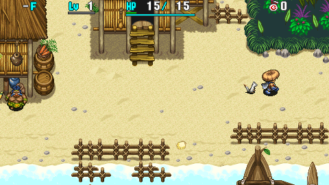

First real dungeon of the game. 
The dungeon is split into a number of areas, and there are a few overworld rest spots along the way. Some areas feature a day and night cycle, while others are daytime-only.

This page assumes you're attempting to clear the main story in 1 adventure from a fresh save file. 
The difficulty of Shiren 4 is high enough that reading this page isn't enough to ensure victory, and even roguelike veterans often have to retreat until they get a feel for the game's balance.

If you're new to Shiren, or aren't up for the challenge, it's best to stock up on Escape Scrolls and slowly upgrade equipment and obtain an assortment of powerful items instead. ※ Escape Scrolls can be found on the ground, or purchased from shops if they're in stock.

※ Spoiler Warning: This page includes spoilers for various locations in the game.

<ul class="quickLinksUL">
  <li><a href="#overview">Overview</a></li>
  <li><a href="#strategy">Strategy</a></li>
  <li><a href="#floor-guide">Floor Guide</a></li>
  <li><a href="#monsters">Monsters</a></li>
  <li><a href="#monster-table">Monster Table</a></li>
  <li><a href="#items">Items</a></li>
  <li><a href="#traps">Traps</a></li>
</ul>

# Overview

<table class="dungeonOverview">
  <tr>
    <th>Unlock</th>
    <td class="highlightYellow">Available as soon as you arrive in Boronga Village.</td>
  </tr>
  <tr>
    <th>Entrance</th>
    <td class="highlightYellow">Boronga Village (East exit)</td>
  </tr>
</table>

<table class="dungeonTable">
  <tr>
    <th>Floors</th>
    <td>36F</td>
    <th>Day / Night</th>
    <td>Day or Both</td>
  </tr>
  <tr>
    <th>Bring Items</th>
    <td>Yes</td>
    <th>Allies</th>
    <td>Yes</td>
  </tr>
  <tr>
    <th>Unidentified</th>
    <td colspan="3">Weapons, shields, bracelets</td>
  </tr>
  <tr>
    <th>Shops</th>
    <td>Regular, Elite</td>
    <th>Monster Houses</th>
    <td>Regular, Sudden</td>
  </tr>
  <tr>
    <th>Initial Enemies</th>
    <td>Varies</td>
    <th>Spawn Rate</th>
    <td>Varies</td>
  </tr>
  <tr>
    <th>Day Turns</th>
    <td>410 (361)</td>
    <th>Night Turns</th>
    <td>268 (236)</td>
  </tr>
  <tr>
    <th>Ominous aura</th>
    <td>Yes (500 turns) Certain floors only</td>
    <th>Winds of Kron</th>
    <td>1st: 1700 4th: 2000</td>
  </tr>
  <tr>
    <th>Clear Icon</th>
    <td class="clearIcon">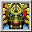</td>
    <th>Clear Bonus</th>
    <td>10,000,000</td>
  </tr>
  <tr>
    <th>Reward</th>
    <td colspan="3">None</td>
  </tr>
</table>

※ Numbers in () for day and night turns is when the warning is displayed.

#### Monster Spawn Rates

<table class="dungeonTable">
  <thead>
    <tr>
      <th>Area</th>
      <th>Initial</th>
      <th>Day (Turns)</th>
      <th>Night (Turns)</th>
    </tr>
  </thead>
  <tbody>
    <tr>
      <td class="highlightGray">Grasslands</td>
      <td>5</td>
      <td>30</td>
      <td>(20)</td>
    </tr>
    <tr>
      <td class="highlightGray">Crocodile Swamp</td>
      <td>6</td>
      <td>30</td>
      <td>(20)</td>
    </tr>
    <tr>
      <td class="highlightGray">Rocky Stretch</td>
      <td>5~8</td>
      <td>30</td>
      <td>20</td>
    </tr>
    <tr>
      <td class="highlightGray">Snake Hole</td>
      <td>6~8</td>
      <td>30</td>
      <td>20</td>
    </tr>
    <tr>
      <td class="highlightGray">Sea of Trees</td>
      <td>7</td>
      <td>30</td>
      <td>20</td>
    </tr>
    <tr>
      <td class="highlightGray">Ruins of Laferriere</td>
      <td>8~9</td>
      <td>25</td>
      <td>15</td>
    </tr>
    <tr>
      <td class="highlightGray">Eagle Valley</td>
      <td>6~8</td>
      <td>30</td>
      <td>(20)</td>
    </tr>
    <tr>
      <td class="highlightGray">Lava Field</td>
      <td>7~8</td>
      <td>30</td>
      <td>(20)</td>
    </tr>
    <tr>
      <td class="highlightGray">Devil's Navel</td>
      <td>6~10</td>
      <td>25</td>
      <td>20</td>
    </tr>
    <tr>
      <td class="highlightGray">Gold Palace</td>
      <td>8~11</td>
      <td>25</td>
      <td>15</td>
    </tr>
  </tbody>
</table>

※ Numbers in () for night is when a Night-Day Scroll is read.

# Strategy

<ul class="quickLinksUL">
  <li><a href="#equipment-/-items">Equipment / Items</a></li>
  <li><a href="#abilities">Abilities</a></li>
</ul>

### Equipment / Items

#### Weapon

##### Main weapon

Linger on floors and hunt monsters to level equipment early game. 

<table class="dungeonTable">
  <thead>
    <tr>
      <th>Name</th>
      <th>Atk</th>
      <th>Slot</th>
      <th>Notes</th>
    </tr>
  </thead>
  <tbody>
    <tr>
      <td class="highlightGray">Katana</td>
      <td class="centeredText">6</td>
      <td class="centeredText">4</td>
      <td>Slow growth and doesn't gain additional rune slots. Use it as an interim weapon until you find something better.</td>
    </tr>
    <tr>
      <td class="highlightGray">Beast Fang</td>
      <td class="centeredText">8</td>
      <td class="centeredText">3</td>
      <td>Rune slots increases to 5 at Lv2, but base attack is a bit low.</td>
    </tr>
    <tr>
      <td class="highlightGray">Dotanuki</td>
      <td class="centeredText">10</td>
      <td class="centeredText">5</td>
      <td>Fast growth and gains an additional rune slot at Lv2.</td>
    </tr>
    <tr>
      <td class="highlightGray">Meteor Edge</td>
      <td class="centeredText">12</td>
      <td class="centeredText">4</td>
      <td>Very solid 16 attack and 6 rune slots at Lv2. However, attack and rune slots won't increase again until Lv5.</td>
    </tr>
    <tr>
      <td class="highlightGray">Red Blade</td>
      <td class="centeredText">14</td>
      <td class="centeredText">3</td>
      <td>Slow growth and low starting rune count. However, it gains 1 slot per level, so it's a strong option.</td>
    </tr>
  </tbody>
</table>

##### Runes

Aim to synthesize any type-effective or status inflicting weapons you find.

<table class="dungeonTable">
  <thead>
    <tr>
      <th>Name</th>
      <th>Item</th>
      <th>Notes</th>
    </tr>
  </thead>
  <tbody>
    <tr>
      <td class="highlightGray">Anti-Aquatic</td>
      <td>Water Cutter Desert Scroll</td>
      <td>Effective against Gyaza, Hopodile, Zalokleft, Slime, Explochin, etc. Synthesize Water Cutter right away if you find a Synthesis Pot before 21F. Low priority after 23F, since the major aquatic threats are gone.</td>
    </tr>
    <tr>
      <td class="highlightGray">Anti-Drain</td>
      <td>Drain Slicer Antidote Grass</td>
      <td>Needed to quickly defeat troublesome Absorbiphant monsters, and also helps against Scorpion monsters.</td>
    </tr>
    <tr>
      <td class="highlightGray">Paralyzing</td>
      <td>Paralysis Staff</td>
      <td>Essentially one-shots a monster when it activates. Keep 1 Paralysis Staff on hand for synthesis, even if its use count is 0.</td>
    </tr>
    <tr>
      <td class="highlightGray">Anti-Dragon</td>
      <td>Lizard Lasher Dragon Grass</td>
      <td>Significant help against Hipadiles and Dragons in Devil's Navel. Lizard Lasher is strong enough to be used as a main weapon too.</td>
    </tr>
    <tr>
      <td class="highlightGray">Anti-Floating</td>
      <td>Sky Splitter Warp Grass</td>
      <td>Effective against Firepuff, Pumphantasm, Blade Bee, Gyadon, Flash Bird. Synthesize Sky Splitter if you find a Synthesis Pot before 19F. Low priority after 20F, since the only floating enemy left is Pumphantom.</td>
    </tr>
    <tr>
      <td class="highlightGray">Anti-Cyclops</td>
      <td>Myopic Masher Sight Grass</td>
      <td>Effective against Gazers and Ironheads. Low priority since it has a narrow range of effectiveness. Synthesize Agile on a shield instead if you have 2 Sight Grass.</td>
    </tr>
    <tr>
      <td class="highlightGray">Sealing</td>
      <td>Seal Staff</td>
      <td>Seal Staff should be saved for the final boss. However, if you ended up using up a Seal Staff, it's fine to synthesize it.</td>
    </tr>
  </tbody>
</table>

#### Shield

##### Main Shield

Linger on floors and hunt monsters to level equipment early game.

<table class="dungeonTable">
  <thead>
    <tr>
      <th>Name</th>
      <th>Def</th>
      <th>Slot</th>
      <th>Notes</th>
    </tr>
  </thead>
  <tbody>
    <tr>
      <td class="highlightGray">Iron Targe</td>
      <td class="centeredText">6</td>
      <td class="centeredText">3</td>
      <td>Rune slots increases to 5 at Lv2, but base defense is low.</td>
    </tr>
    <tr>
      <td class="highlightGray">Clan Shield</td>
      <td class="centeredText">8</td>
      <td class="centeredText">5</td>
      <td>Fast growth and gains an additional rune slot at Lv2.</td>
    </tr>
    <tr>
      <td class="highlightGray">Beast Shield</td>
      <td class="centeredText">10</td>
      <td class="centeredText">4</td>
      <td>Defense increases by 2 per level up, and rune slots increases to 6 at Lv2.</td>
    </tr>
    <tr>
      <td class="highlightGray">Meteor Guard</td>
      <td class="centeredText">12</td>
      <td class="centeredText">5</td>
      <td>Very solid 16 defense and 6 rune slots at Lv2.</td>
    </tr>
    <tr>
      <td class="highlightGray">Red Shield</td>
      <td class="centeredText">14</td>
      <td class="centeredText">4</td>
      <td>Slow growth and low starting rune count. However, it gains 1 rune slot per level until Lv3, so it's a strong option.</td>
    </tr>
    <tr>
      <td class="highlightGray">Spry Shield</td>
      <td class="centeredText">2</td>
      <td class="centeredText">2</td>
      <td>Low defense and rune slots, but lets you evade direct attacks more often. ※ DS version has a bug where evasion doesn't increase with level ups.</td>
    </tr>
    <tr>
      <td class="highlightGray">Lamp Shield</td>
      <td class="centeredText">4</td>
      <td class="centeredText">2</td>
      <td>Secondary shield for night. Its resonance effect with any torch greatly reduces accidents at night.</td>
    </tr>
  </tbody>
</table>

##### Runes

<table class="dungeonTable">
  <thead>
    <tr>
      <th>Name</th>
      <th>Item</th>
      <th>Notes</th>
    </tr>
  </thead>
  <tbody>
    <tr>
      <td class="highlightGray">1/2 Hunger</td>
      <td>Diet Shield</td>
      <td>Slows fullness depletion rate by 50%, and plays well with Heal Bracelet. Makes it easier to linger on floors to level equipment and obtain items.</td>
    </tr>
    <tr>
      <td class="highlightGray">1/2 Fire</td>
      <td>Lizard Shield Dragon Grass</td>
      <td>Reduces fire damage received by 50%. Fire damage sources include Dragons, Firepuffs, lava eruptions.</td>
    </tr>
    <tr>
      <td class="highlightGray">1/2 Blast</td>
      <td>Blast Shield Bomb Rock</td>
      <td>Reduces explosion damage received by 50%. Explosion damage sources include Pop Tank, Explochin, Landmine.</td>
    </tr>
    <tr>
      <td class="highlightGray">Rustproof</td>
      <td>Dull Gold Shield Plating Scroll</td>
      <td>Protects loss of upgrade value due to Slimes and Rust Traps.</td>
    </tr>
    <tr>
      <td class="highlightGray">Anti-Theft</td>
      <td>Lock Shield</td>
      <td>Lets you hunt Zaloklefts for item drops risk-free.</td>
    </tr>
    <tr>
      <td class="highlightGray">Agile</td>
      <td>Spry Shield Sight Grass x 2</td>
      <td>Increases your chance to evade enemy direct attacks. Level up a Mixer using items like Berserk Talisman, Fear Scroll.</td>
    </tr>
  </tbody>
</table>

#### Bracelets

<table class="dungeonTable">
  <thead>
    <tr>
      <th>Name</th>
      <th>Notes</th>
    </tr>
  </thead>
  <tbody>
    <tr>
      <td class="highlightGray">Heal Bracelet</td>
      <td>Restores 3 HP per turn, but hastens fullness depletion. HP regeneration is very slow in Shiren 4 as max HP increases, so this bracelet greatly reduces the difficulty from Ruins of Laferriere onward.</td>
    </tr>
    <tr>
      <td class="highlightGray">Monster Detector</td>
      <td>Reveals the location of enemies and NPCs. Shop exclusive. Significantly lowers the risk of accidents at night.</td>
    </tr>
    <tr>
      <td class="highlightGray">Calm Bracelet</td>
      <td>Prevents confusion from sources like Spin Trap, MC Mage, final boss.</td>
    </tr>
    <tr>
      <td class="highlightGray">Cleansing Bracelet</td>
      <td>Prevents strength loss from Scorpions between 10-12F.</td>
    </tr>
    <tr>
      <td class="highlightGray">Happy Bracelet</td>
      <td>Gain 1 experience point per turn. Particularly helpful early game.</td>
    </tr>
  </tbody>
</table>

#### Staves

<table class="dungeonTable">
  <thead>
    <tr>
      <th>Name</th>
      <th>Notes</th>
    </tr>
  </thead>
  <tbody>
    <tr>
      <td class="highlightGray">Pinning Staff</td>
      <td>Extremely valuable as an emergency escape option. Can be used like Warp Grass if you land on a water or air tile.</td>
    </tr>
    <tr>
      <td class="highlightGray">Paralysis Staff</td>
      <td>Paralyzed enemies can't act until they get hit by an attack or effect. Can be used to safely wait for night inside a special door room in Gold Palace. You'll want to synthesize one of these between 26-27F.</td>
    </tr>
    <tr>
      <td class="highlightGray">Seal Staff</td>
      <td>Essential to have an easy final boss fight.</td>
    </tr>
    <tr>
      <td class="highlightGray">Swap Staff</td>
      <td>Nice escape option, especially if you start a floor in a Monster House.</td>
    </tr>
    <tr>
      <td class="highlightGray">Lightning Staff</td>
      <td>Homing attack that deals 25 damage. It's nice for early game and defeating Cave Mamels, but it's fine to sell it.</td>
    </tr>
  </tbody>
</table>

#### Projectiles

<table class="dungeonTable">
  <thead>
    <tr>
      <th>Name</th>
      <th>Notes</th>
    </tr>
  </thead>
  <tbody>
    <tr>
      <td class="highlightGray">Wood Arrow</td>
      <td>Decent attack power, and easy to stock up on using traps. Useful against both regular monsters and bosses, despite its low accuracy. Don't hesitate to shoot arrows if doing so conserves better items.</td>
    </tr>
    <tr>
      <td class="highlightGray">Poison Arrow</td>
      <td>Essentially a stronger version of Wood Arrows. Switch to these toward the end if you managed to obtain lots of them.</td>
    </tr>
    <tr>
      <td class="highlightGray">Rock</td>
      <td>Used to collect arrows from Wood Arrow and Poison Arrow traps. It's fine to discard them around 13F, since Porky appears between 13-18F.</td>
    </tr>
    <tr>
      <td class="highlightGray">Porky Rock</td>
      <td>Short range, but can hit monsters around corners and inside walls. Don't worry about conserving them too much.</td>
    </tr>
  </tbody>
</table>

### Abilities

Night monsters can be one-shot by most abilities until Devil's Navel, but some like Dark Pandanigiri and Evil Sky Dragon require A rank or higher abilities.

Recommended Abilities:

<table class="dungeonTable">
  <thead>
    <tr>
      <th>Name</th>
      <th>Power</th>
      <th>Notes</th>
    </tr>
  </thead>
  <tbody>
    <tr>
      <td class="highlightGray">Kaboom Bullet</td>
      <td>S (90)</td>
      <td>Derived from Sticky Shot. One-shots most monsters.</td>
    </tr>
    <tr>
      <td class="highlightGray">Sticky Shot</td>
      <td>A (70)</td>
      <td>Default ability. Strong against blue aura monsters.</td>
    </tr>
    <tr>
      <td class="highlightGray">Room Cyclone</td>
      <td>B (40)</td>
      <td>1~2 uses clears out most monsters in a room.</td>
    </tr>
    <tr>
      <td class="highlightGray">Cluster Confusion</td>
      <td>-</td>
      <td>Used before Room Cyclone to wipe out all monsters, but there's risk of being hit by confused enemies, so consider the risk vs. return before using it.</td>
    </tr>
  </tbody>
</table>

# Floor Guide

### Introduction

Grilled Bananas restore 40 HP, so grill most bananas you obtain. 
Save Swift Grass, Otogiriso, arrows, and other useful grass and scroll items for the first boss. Save Seal Staff, Seal Talisman, Fear Scroll, Fear Talisman, and Banana Peels for the final boss. Purify Pots should be used as a container for Mixer synthesis ingredients. It's best to be Lv20 or so around Rakutata Village, and Lv30 or so around Eagle Valley\~Devil's Navel. Ideal equipment strength is around 20 for both weapon and shield.

Optional events in Boronga Village:

- Talk to the woman inside the Tavern to receive Undo Grass.
- Deposit Gitan from the tutorial dungeon into the Bank to receive Revival Grass.

### Grasslands - Crocodile Swamp (1-5F)

  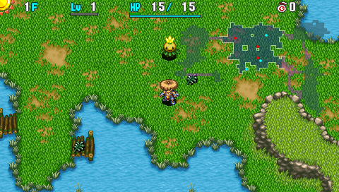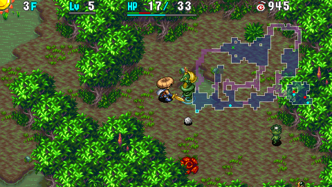

Daytime-only. 
Keep an eye out for main equipment, synthesis ingredients, and bracelets. 
If you're attempting a single adventure clear, you need to be skilled enough to manage without ideal items, so don't give up right away if you don't find powerful equipment - doing so just forms bad habits.

Walk along the edges of rooms between 3-5F in search of wood arrow and poison arrow traps, 
and collect arrows from them by throwing rocks or other items onto the trap. 
Hunt Froggos to gain enough money to purchase items, rest at the inn, and hone equipment in Gonchiki Village. 
The inn fully replenishes your HP, fullness, and strength for 500 Gitan, so don't worry about losing strength. Place pots near the exit so that they don't break from stepping on a Trip Stone. Pots don't break when they're thrown by Bored Kappa, so they're safe.

### Gonchiki Village

  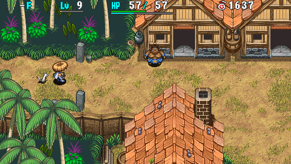

Buy all bananas, torches, and Storage Pots that are in stock. If a Lamp Shield is in stock for 1500G, do whatever it takes to buy it. Upgrade value +1 doesn't have a large impact in this game, and you won't be able to trade hits with monsters in the second half either way, so prioritize buying items and resting at the inn.

### Rocky Stretch - Snake Hole (6-10F)

  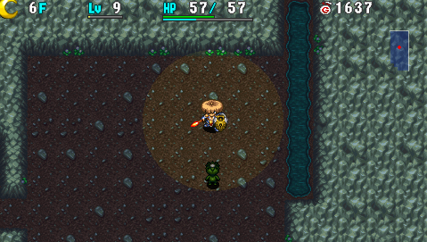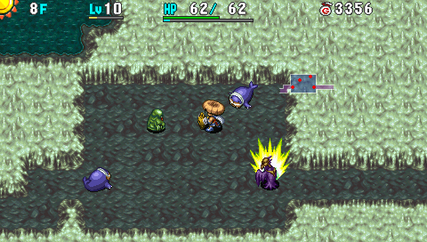

First area to feature a day and night cycle. 
Level up a Kumonigiri (6-8F) to Pandanigiri using items like Fear or Berserk talismans, and then defeat it using direct attacks after inflicting a status condition to level up equipment. Monsters with auras provide x2.0 experience points, and use a Growth Seed if you have one. ※ Unlike Shiren 5, talismans other than Seal Talisman don't remove auras in this game.

Hunt Zaloklefts (8-10F) for item drops. Intentionally get hit by Firepuff (6-8F)'s special attack to grill bananas. Step in place near the stairs at night after checking every room, and defeat night monsters for experience points and item drops until you've used up all abilities before advancing. Foul Morphs (8-10F) occasionally drop blessed Spoiled Bananas, which can be grilled.

It's ideal to reach Lv20 for Shiren and Lv3 for equipment before advancing to 11F. If you have Storage Pots, try to save the following to synthesize on 26-27F:

- Sight Grass x 3
- Paralysis Staff
- Antidote Grass
- Desert Scroll

Perform Banana Morph Factory using a Foul Morph if you have a torch and poison arrows. ※ You can grill the bananas between 13-18F by having a Traproid create a Landmine.

1. Place important items in a hallway near the stairs room before sunset.
2. Shoot arrows at a wall or throw rocks on the ground.
3. Hold X and move toward a single arrow or rock to step on top of it.
4. Swap the item with an inventory item to place the single arrow or rock in your inventory.
5. Repeat until you have lots of single arrows or rocks in your inventory.
6. Equip the poison arrows and torch at night, and keep an item like Otogiriso on hand for emergencies.
7. Shoot poison arrows at Foul Morph to lower its attack and lure it into a hallway.
8. Place the Otogiriso underfoot, and have it change the single arrows and rocks into Spoiled Bananas.

### Sea of Trees (11-12F)

  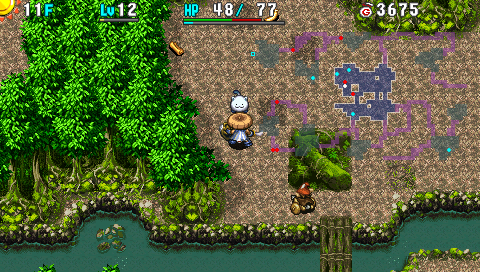

Recommended to hurry to the next floor after checking rooms for items. 
Strong Cart's arrows can deal knockback, so don't approach with direct attacks in rooms. 
Scorpions (10-12F) can lower your strength, so don't linger unless you have a Cleansing Bracelet. Dark Absorbiphants appear at night, so it's dangerous to use Cluster Confusion.

### Rakutata Village

  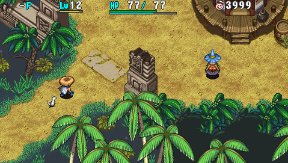

Buy all bananas, torches, and Storage Pots that are in stock. 
The Purifier can remove curses and seals from items for 1000G if needed.

Optional - Deposit Gitan into the Bank to receive items:

<table class="dungeonTable">
  <thead>
    <tr>
      <th>Item</th>
      <th>Gitan</th>
    </tr>
  </thead>
  <tbody>
    <tr>
      <td class="highlightGray">Revival Grass</td>
      <td>1</td>
    </tr>
    <tr>
      <td class="highlightGray">Undo Grass</td>
      <td>5,000</td>
    </tr>
    <tr>
      <td class="highlightGray">Blank Scroll</td>
      <td>10,000</td>
    </tr>
  </tbody>
</table>

### Ruins of Laferriere (13-18F)

  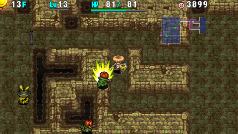

Things start to get a bit difficult from this area onward without a Heal Bracelet. However, you'll be underleveled and will likely run out of items if you rush stairs this early, so check rooms for items and utilize Porky Rocks dropped by Porky to conserve items. Cluster Confusion + Room Cyclone can wipe out enemies, but it's rather risky.

Fearabbits attract you and other monsters to itself, so you can end up surrounded right away. This area has large rooms, so they can be a big problem - use items like Fear Scroll if you get surrounded. Porky's special deals 20 damage, so use items instead of approaching with direct attacks to keep your HP up. N'twyn spawns both during the day and at night, so don't try to pick up items when your HP is low. Have a Traproid create a Landmine to grill bananas if desired.

Step in place near the stairs at night after checking every room, and defeat night monsters for experience points and item drops until you've used up all abilities before advancing. If you have a Replenish Scroll, linger until Dark Villeaters appear and hunt them for items. It's also possible to refresh abilities using Revival Grass or Undo Grass, but it's a gamble whether or not you'll obtain an item that's worth the trade. Don't fight Villeaters during the day.

⭐︎ For those that can't deal with night ⭐︎

Rush stairs between 13-18F, 21-25F, and 27-36F.

Dark Villeaters are extremely dangerous if you don't have a Super Torch or Monster Detector, since they approach at double speed if they're in the same room as Shiren. ※ Maneater monsters inflict Afraid status instead of Paralyzed in this game.

### Monkey Village

  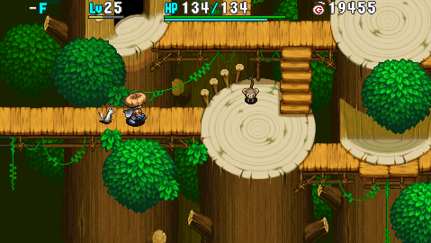

Have an optional conversation with the Monkey King. 
Upgrade your shield at the blacksmith, and buy items from the shop.

### Eagle Valley (19-20F)

  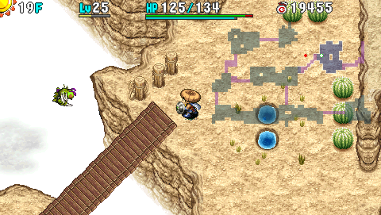

Daytime-only. 
Enemy attack power starts to get ridiculous from this point. 
Kengo has high attack and HP, and can knock your equipped shield away. 
Dagger Bee's special deals x2.0 damage and inflicts Confused status. 
Sr. Yanpii hits like a wrecking ball, and its tackle deals damage and knockback. 
Gyadon can peck a staff and reduce its remaining uses to 0.

Floating monsters rush toward you at the start, so it's easy to get surrounded. Fight Kengo with your back against a wall so that your shield doesn't fly off a cliff. Despite these dangers, be sure to check each room for items instead of rushing to the exit. If there's a Sr. Yanpii with an aura, level it up and defeat it to gain lots of experience points. Protect staves from Gyadon by inserting them into Storage Pots.

⭐︎ For those that can't deal with night ⭐︎

Linger on these floors and hunt monsters to level up. This is basically the last area where you can fight during daytime if you can't deal with night. Be careful of Kengo while checking rooms, and then step in place near the exit and hunt until the wind blows. Hide behind a wall or object while waiting so that you don't get tackled by Sr. Yanpii right away, and use arrows to soften it enough so that it can be defeated in one hit.

### Lave Field (21-23F)

  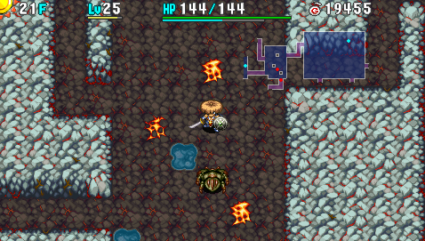

Daytime-only. 
Trauma inducing Gyazas appear alongside Go Hams and Banana Morphs. Gyazas convert most non-direct attacks and effects into 2 damage. Go Hams boost the attack power of adjacent creatures and let them survive a fatal hit with 1 HP. Banana Morphs transform an inventory item into a Yellow Banana, so don't let them act. Concusschins have 83 HP and explode if you deal a total of 67+ damage without defeating it, so use arrows, rocks, or unequip your weapon to ensure it doesn't explode.

It's somewhat safe to check rooms if your weapon has the Anti-Aquatic rune, 
but otherwise consider rushing stairs instead of lingering very long. Lava eruptions can be used to grill bananas.

### Inn of the Wind

  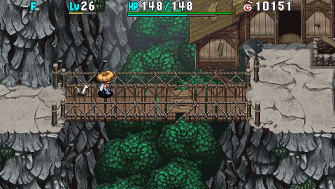

The Purifier can remove curses and seals from items for 1500G if needed. 
Lost [NPCs](/system/npcs) must be guided to this location to unlock the item shop, inn, and storehouse.

### Devil's Navel (24-26F)

  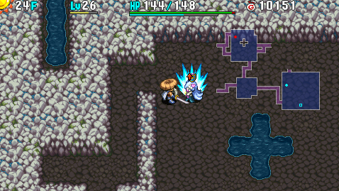

Daytime-only. 
Consider rushing stairs on 24-25F if you feel good about your current level and stock of items. Super Gazers and Curse Sisters can destroy items, so don't let them act if they're adjacent. Dragons and Hipadiles hit incredibly hard and have high HP, so use items to deal with them. N'mach (24-36F) disguises itself as an item and doesn't reveal itself until you try to use it, so don't trust scrolls and grass you pick up from 24F onward.

Mixers (26-27F) appear, so synthesize equipment and combine staves. Prioritize the Anti-Dragon and 1/2 Fire runes to make it a bit easier to linger. If you have extra slots, synthesize runes that increase max HP for upcoming boss fights, which include HP+20 (Life Grass), HP+15 (Heal Grass), HP+10 (Otogiriso), and HP+5 (Herb).

Weapon runes to aim for at this point:

<table class="dungeonTable">
  <thead>
    <tr>
      <th>Priority</th>
      <th>Name</th>
      <th>Item</th>
    </tr>
  </thead>
  <tbody>
    <tr>
      <td class="highlightOrange">High</td>
      <td>Paralyzing</td>
      <td>Paralysis Staff</td>
    </tr>
    <tr>
      <td class="highlightOrange">High</td>
      <td>Anti-Drain</td>
      <td>Drain Slicer Antidote Grass</td>
    </tr>
    <tr>
      <td class="highlightYellow">Mid</td>
      <td>Anti-Dragon</td>
      <td>Lizard Lasher Dragon Grass</td>
    </tr>
    <tr>
      <td class="highlightYellow">Mid</td>
      <td>Anti-Cyclops</td>
      <td>Myopic Masher Sight Grass</td>
    </tr>
    <tr>
      <td class="highlightYellow">Mid</td>
      <td>Anti-Aquatic</td>
      <td>Water Cutter Desert Scroll</td>
    </tr>
    <tr>
      <td class="highlightLightblue">Low</td>
      <td>Anti-Floating</td>
      <td>Sky Splitter Warp Grass</td>
    </tr>
    <tr>
      <td class="highlightLightblue">Low</td>
      <td>Sealing</td>
      <td>Seal Staff</td>
    </tr>
  </tbody>
</table>

Shield runes to aim for at this point:

<table class="dungeonTable">
  <thead>
    <tr>
      <th>Priority</th>
      <th>Name</th>
      <th>Item</th>
    </tr>
  </thead>
  <tbody>
    <tr>
      <td class="highlightOrange">High</td>
      <td>Agile</td>
      <td>Spry Shield Sight Grass x 2</td>
    </tr>
    <tr>
      <td class="highlightOrange">High</td>
      <td>1/2 Fire</td>
      <td>Lizard Shield Dragon Grass</td>
    </tr>
    <tr>
      <td class="highlightOrange">High</td>
      <td>1/2 Blast</td>
      <td>Blast Shield Bomb Rock</td>
    </tr>
    <tr>
      <td class="highlightOrange">High</td>
      <td>Rustproof</td>
      <td>Dull Gold Shield Plating Scroll</td>
    </tr>
    <tr>
      <td class="highlightYellow">Mid</td>
      <td>Anti-Theft</td>
      <td>Lock Shield</td>
    </tr>
  </tbody>
</table>

※ Synthesizing Agile with 2 Sight Grass requires leveling up a Mixer.

⭐︎ For those that can't deal with night ⭐︎

The day and night cycle returns starting on 27F, so finish synthesizing on 26F. Continue to hunt Lime Zaloklefts (24-30F) for item drops if possible.

### Devil's Navel (27-30F)

  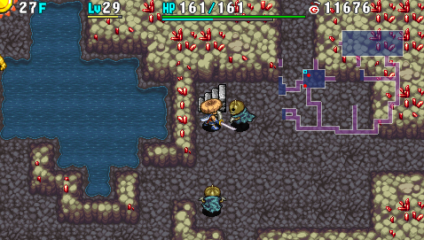

Mixers continue to appear on 27F, so finish synthesizing if you didn't do so on 26F. MC Mage's magic bullet effect is randomly selected from confusion, blind, transient, and 20 damage. If a Kappa Pest is standing on an item, swing a Transient Staff or wait until night to claim the item. Grimes lower weapon or shield upgrade value by 2 and can multiply, so unequip your equipment. Continue to hunt Lime Zaloklefts (24-30F) for item drops if possible. Remember, you want to save Seal Staff for the final boss.

Dark Pandanigiris and Evil Sky Dragons can't be one-shot with B rank abilities at night. Evil Sky Dragon's special attack deals 50 fire damage from anywhere in the room, so stay in hallways. That said, Evil Sky Dragons provide 1500 experience points, so try to defeat any that you see.

⭐︎ For those that can't deal with night ⭐︎

Rush stairs in hopes of reaching the boss before it turns to night. 
If you get the transient effect from a MC Mage's magic bullet, go ahead and advance to the next floor. To avoid wasting turns, don't approach Kappa Pest if it's standing on an item.

### Mid Boss

This is typically the most difficult point of the main story.

<table class="dungeonTable">
  <thead>
    <tr>
      <th>HP</th>
      <th>Atk</th>
      <th>Def</th>
      <th>Exp</th>
      <th>Notes</th>
    </tr>
  </thead>
  <tbody>
    <tr>
      <td class="centeredText">301</td>
      <td class="centeredText">70</td>
      <td class="centeredText">15</td>
      <td class="centeredText">0</td>
      <td>Swift (1 attack). Immune to Asleep, Decoy, Paralyzed. Ignores Sanctuary Scroll. Gitan deals 2 damage.</td>
    </tr>
  </tbody>
</table>

Boss Moves:

- Direct attack - High power.
- Tackle - Lunges forward to deal damage, and then retreats.
- Poison Claw - Deals damage and lowers strength by 1.
- Instant Recovery - Cures all status conditions.

The boss moves at double speed, cures status conditions in 1 turn, ignores Sanctuary Scroll, only takes 2 damage from thrown Gitan, and its tackle can close distances if you try to step away. It doesn't have high HP for a boss, but you won't defeat it by trading direct attacks unless your level, weapon, and shield are outstanding.

The boss fight occurs during daytime, so necklace abilities can't be used - you need to use items. Status conditions aren't very effective even if the boss isn't immune to it, since it'll be cured quickly. However, they become viable if you boost Shiren's action speed by eating Swift Grass.

Some strategies:

- Swift Grass + Knockback Staff + arrows
    - Create distance between you and the boss and shoot arrows.
- Swift Grass + Power Up Grass + healing items
    - Trade hits after boosting your speed and attack power. Requires lots of healing items.
- Empathy Staff + healing items
    - Deal damage using Empathetic status, healing as needed. The boss will cure Empathetic status, so prepare at least 5 uses worth to be safe.

### Gold Palace (31-36F)

  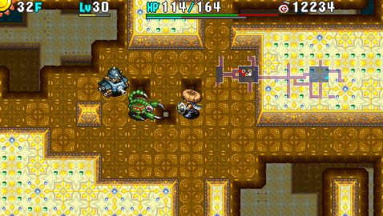

Rush stairs as fast as possible. It's fine to use up all items that aren't needed for the final boss. Night monsters are far easier in this area compared to daytime, so you could cycle time of day using a special door room and descend at night if you have a Super Torch.

Demon Scorp (31-33F) decreases strength by 2. 
Chainhead (31-33F), Eligan (31-36F), and Cave Mamel (34-36F) hit very hard. 
Grampa Tank (31-33F) fires 30 damage cannonballs and has incredibly smart AI. 
Digestiphant (31-36F) absorbs status conditions to boost attack power by 2 stages. 
Porko (34-36F) throws Porky Rocks that deal 20 damage within a range of 4 tiles.

### Final Boss

Shiren is granted Swift status for this fight, so you get 4 actions for every 1 boss action.

<table class="dungeonTable">
  <thead>
    <tr>
      <th>HP</th>
      <th>Atk</th>
      <th>Def</th>
      <th>Exp</th>
      <th>Notes</th>
    </tr>
  </thead>
  <tbody>
    <tr>
      <td class="centeredText">1800</td>
      <td class="centeredText">100</td>
      <td class="centeredText">20</td>
      <td class="centeredText">0</td>
      <td>Slow. Immune to Asleep, Decoy, Paralyzed. Ignores Sanctuary Scroll. Gitan deals 2 damage.</td>
    </tr>
  </tbody>
</table>

Boss Moves:

- Direct attack - High power.
- Lightning - Deals 30\~40 damage.
- Confusion - Inflicts Confused status.
- Knockback - Low power, deals kncoback.
- Call Monsters - Summons 4\~6 monsters.
    - Digestiphant, Tiger Hurler, Porko.
- Instant Recovery - Cures all status conditions.

Incredibly high HP, summons monsters, inflicts confusion, cures status conditions, ignores Sanctuary Scroll, only takes 2 damage from thrown Gitan, and due to story events, only performs 1 action every 4 turns. Status conditions are very effective due to the action speed difference, and the only dangerous specials are Call Monsters and Confusion.

Seal the boss immediately when the fight begins to avoid having to deal with summoned monsters, and then use items like Banana Peel, Fear Scroll, Fear Talisman, Seal Staff, etc. to keep the boss disabled. The boss is immune to Asleep, Decoy, and Paralyzed, so just keep that in mind and you should be fine. It's possible to clear this fight without taking damage if you keep track of the turn order.

# Monsters

#### List (Day)

<table class="dungeonMonsterList monsterListDay">
  <thead>
    <tr>
      <th>F</th>
      <th>Name</th>
      <th>HP</th>
      <th>Atk</th>
      <th>Def</th>
      <th>Exp</th>
      <th>Skill</th>
      <th>Type</th>
      <th>Notes</th>
    </tr>
  </thead>
  <tbody>
    <tr>
      <td>1-2</td>
      <td>Mamel</td>
      <td>5</td>
      <td>2</td>
      <td>1</td>
      <td>3</td>
      <td>1</td>
      <td>-</td>
      <td>-</td>
    </tr>
    <tr>
      <td>1-3</td>
      <td>Seedie</td>
      <td>6</td>
      <td>3</td>
      <td>4</td>
      <td>5</td>
      <td>1</td>
      <td>-</td>
      <td>-</td>
    </tr>
    <tr>
      <td>2-3</td>
      <td>Chintala</td>
      <td>7</td>
      <td>7</td>
      <td>1</td>
      <td>4</td>
      <td>1</td>
      <td>-</td>
      <td>-</td>
    </tr>
    <tr>
      <td>2-4</td>
      <td>Pit Mamel</td>
      <td>9</td>
      <td>6</td>
      <td>3</td>
      <td>6</td>
      <td>1</td>
      <td>-</td>
      <td>-</td>
    </tr>
    <tr>
      <td>3-7</td>
      <td>Froggo</td>
      <td>28</td>
      <td>10</td>
      <td>1</td>
      <td>5</td>
      <td>1</td>
      <td>-</td>
      <td>Steals Gitan, warps, and runs away at double speed.</td>
    </tr>
    <tr>
      <td>3-5</td>
      <td>Hopodile</td>
      <td>19</td>
      <td>9</td>
      <td>4</td>
      <td>12</td>
      <td>5</td>
      <td>Dragon Aquatic</td>
      <td>Chess knight movement, 10 damage body slam.</td>
    </tr>
    <tr>
      <td>3-5</td>
      <td>Bored Kappa</td>
      <td>14</td>
      <td>7</td>
      <td>3</td>
      <td>4</td>
      <td>2</td>
      <td>Aquatic</td>
      <td>Throws ground items in a 3 tile radius, always misses.</td>
    </tr>
    <tr>
      <td>4-6</td>
      <td>Squid King</td>
      <td>19</td>
      <td>8</td>
      <td>4</td>
      <td>8</td>
      <td>2</td>
      <td>Aquatic</td>
      <td>Inflicts Blind status 1 tile in front.</td>
    </tr>
    <tr>
      <td>6-7</td>
      <td>Blade Bee</td>
      <td>15</td>
      <td>13</td>
      <td>1</td>
      <td>13</td>
      <td>5</td>
      <td>Floating</td>
      <td>Stinger inflicts Confused status, and then it collapses.</td>
    </tr>
    <tr>
      <td>6-8</td>
      <td>Kumonigiri</td>
      <td>25</td>
      <td>15</td>
      <td>8</td>
      <td>35</td>
      <td>8</td>
      <td>-</td>
      <td>Item drop is always Onigiri.</td>
    </tr>
    <tr>
      <td>6-8</td>
      <td>Firepuff</td>
      <td>17</td>
      <td>7</td>
      <td>7</td>
      <td>10</td>
      <td>2</td>
      <td>Dragon Floating</td>
      <td>10 fire damage 1 tile in front, but attack can fail.</td>
    </tr>
    <tr>
      <td>7-9</td>
      <td>DJ Mage</td>
      <td>16</td>
      <td>8</td>
      <td>6</td>
      <td>14</td>
      <td>4</td>
      <td>-</td>
      <td>Warp, knockback, swap places, or swift by 1 stage.</td>
    </tr>
    <tr>
      <td>8-10</td>
      <td>Zalokleft</td>
      <td>30</td>
      <td>10</td>
      <td>6</td>
      <td>8</td>
      <td>3</td>
      <td>Aquatic</td>
      <td>Steals an item and warps. 100% item drop rate.</td>
    </tr>
    <tr>
      <td>8-10</td>
      <td>Slime</td>
      <td>21</td>
      <td>6</td>
      <td>3</td>
      <td>10</td>
      <td>4</td>
      <td>Aquatic</td>
      <td>Lowers weapon or shield upgrade value by 1.</td>
    </tr>
    <tr>
      <td>8-10</td>
      <td>Curse Girl</td>
      <td>21</td>
      <td>13</td>
      <td>7</td>
      <td>22</td>
      <td>5</td>
      <td>-</td>
      <td>Curses or seals 1 item.</td>
    </tr>
    <tr>
      <td>9-11</td>
      <td>Mid Chintala</td>
      <td>28</td>
      <td>18</td>
      <td>8</td>
      <td>40</td>
      <td>10</td>
      <td>-</td>
      <td>-</td>
    </tr>
    <tr>
      <td>10-12</td>
      <td>Scorpion</td>
      <td>35</td>
      <td>18</td>
      <td>12</td>
      <td>53</td>
      <td>12</td>
      <td>Drain</td>
      <td>Lowers strength by 1.</td>
    </tr>
    <tr>
      <td>10-12</td>
      <td>Absorbiphant</td>
      <td>27</td>
      <td>13</td>
      <td>10</td>
      <td>28</td>
      <td>6</td>
      <td>Drain</td>
      <td>Absorbs status. (Heal HP, boost attack by 1 stage)</td>
    </tr>
    <tr>
      <td>11-12</td>
      <td>Tiger Tosser</td>
      <td>42</td>
      <td>20</td>
      <td>12</td>
      <td>63</td>
      <td>16</td>
      <td>-</td>
      <td>Throws creatures up to 5 tiles away. (5 damage)</td>
    </tr>
    <tr>
      <td>11-12</td>
      <td>Strong Cart</td>
      <td>34</td>
      <td>16</td>
      <td>10</td>
      <td>50</td>
      <td>9</td>
      <td>-</td>
      <td>Swift 1, shoots Gust Arrows.</td>
    </tr>
    <tr>
      <td>13-18</td>
      <td>Fearabbit</td>
      <td>26</td>
      <td>9</td>
      <td>9</td>
      <td>67</td>
      <td>9</td>
      <td>-</td>
      <td>Attracts creatures in the room to itself.</td>
    </tr>
    <tr>
      <td>13-18</td>
      <td>Pumphantasm</td>
      <td>34</td>
      <td>24</td>
      <td>3</td>
      <td>83</td>
      <td>24</td>
      <td>Floating</td>
      <td>Moves through walls, unpredictable movement.</td>
    </tr>
    <tr>
      <td>13-18</td>
      <td>Porky</td>
      <td>47</td>
      <td>21</td>
      <td>8</td>
      <td>100</td>
      <td>20</td>
      <td>-</td>
      <td>Throws 20 damage Porky Rock, range of 2 tiles.</td>
    </tr>
    <tr>
      <td>13-18</td>
      <td>Traproid</td>
      <td>44</td>
      <td>18</td>
      <td>12</td>
      <td>72</td>
      <td>9</td>
      <td>-</td>
      <td>Swift 1, creates traps.</td>
    </tr>
    <tr>
      <td>13-18</td>
      <td>N'twyn</td>
      <td>36</td>
      <td>37</td>
      <td>8</td>
      <td>33</td>
      <td>9</td>
      <td>-</td>
      <td>Disguised as an item, attacks if you try to use it.</td>
    </tr>
    <tr>
      <td>13-18</td>
      <td>Villeater</td>
      <td>75</td>
      <td>60</td>
      <td>25</td>
      <td>1000</td>
      <td>100</td>
      <td>-</td>
      <td>Spawns after ominous area warning. Speed increases to swift 1 if Shiren is in view. Roar inflicts Fear. Stats increase based on depth.</td>
    </tr>
    <tr>
      <td>17-18</td>
      <td>Pot Knave</td>
      <td>43</td>
      <td>16</td>
      <td>11</td>
      <td>75</td>
      <td>8</td>
      <td>-</td>
      <td>Turns floor items into Weeds, throws Weeds into pots.</td>
    </tr>
    <tr>
      <td>19-20</td>
      <td>Kengo</td>
      <td>58</td>
      <td>32</td>
      <td>16</td>
      <td>180</td>
      <td>15</td>
      <td>-</td>
      <td>Knocks away your equipped shield.</td>
    </tr>
    <tr>
      <td>19-20</td>
      <td>Dagger Bee</td>
      <td>46</td>
      <td>27</td>
      <td>14</td>
      <td>200</td>
      <td>30</td>
      <td>Floating</td>
      <td>Stinger inflicts Confused status, and then it collapses.</td>
    </tr>
    <tr>
      <td>19-20</td>
      <td>Gyadon</td>
      <td>48</td>
      <td>22</td>
      <td>17</td>
      <td>90</td>
      <td>12</td>
      <td>Floating</td>
      <td>Lowers a staff's use count to 0.</td>
    </tr>
    <tr>
      <td>19-20</td>
      <td>Flamepuff</td>
      <td>48</td>
      <td>18</td>
      <td>18</td>
      <td>120</td>
      <td>15</td>
      <td>Dragon Floating</td>
      <td>20 fire damage 1 tile in front, but attack can fail.</td>
    </tr>
    <tr>
      <td>19-20</td>
      <td>Sr. Yanpii</td>
      <td>49</td>
      <td>44</td>
      <td>13</td>
      <td>310</td>
      <td>40</td>
      <td>-</td>
      <td>Headbutts, dealing 20 damage and knockback.</td>
    </tr>
    <tr>
      <td>19-23</td>
      <td>Froggucci</td>
      <td>51</td>
      <td>23</td>
      <td>7</td>
      <td>10</td>
      <td>7</td>
      <td>-</td>
      <td>Steals Gitan, warps, and runs away at double speed.</td>
    </tr>
    <tr>
      <td>21-23</td>
      <td>Go Ham</td>
      <td>34</td>
      <td>15</td>
      <td>10</td>
      <td>50</td>
      <td>20</td>
      <td>-</td>
      <td>Cheer raises attack by 2 stages, grants Enduring.</td>
    </tr>
    <tr>
      <td>21-23</td>
      <td>Concusschin</td>
      <td>83</td>
      <td>22</td>
      <td>10</td>
      <td>110</td>
      <td>20</td>
      <td>Bomb Aquatic Cyclops</td>
      <td>Stops moving after taking 46+ damage. Explodes after taking 67+ damage. Explosion leaves Shiren with 1 HP.</td>
    </tr>
    <tr>
      <td>21-23</td>
      <td>Flash Bird</td>
      <td>31</td>
      <td>11</td>
      <td>18</td>
      <td>57</td>
      <td>9</td>
      <td>Floating</td>
      <td>Heals nearby monster HP by 30, burns thrown items.</td>
    </tr>
    <tr>
      <td>21-23</td>
      <td>Banana Morph</td>
      <td>58</td>
      <td>32</td>
      <td>18</td>
      <td>330</td>
      <td>25</td>
      <td>-</td>
      <td>Turns an inventory item into a Yellow Banana. Instantly collapses if hit by a thrown banana.</td>
    </tr>
    <tr>
      <td>21-23</td>
      <td>Gyaza</td>
      <td>68</td>
      <td>36</td>
      <td>23</td>
      <td>400</td>
      <td>40</td>
      <td>Aquatic</td>
      <td>Converts non-direct attacks and effects to 2 damage.</td>
    </tr>
    <tr>
      <td>24-30</td>
      <td>Lime Zalokleft</td>
      <td>55</td>
      <td>17</td>
      <td>11</td>
      <td>24</td>
      <td>10</td>
      <td>Aquatic</td>
      <td>Steals an item and warps. 100% item drop rate.</td>
    </tr>
    <tr>
      <td>24-26</td>
      <td>Curse Sister</td>
      <td>52</td>
      <td>24</td>
      <td>15</td>
      <td>170</td>
      <td>20</td>
      <td>-</td>
      <td>Curses or seals 1 item.</td>
    </tr>
    <tr>
      <td>24-26</td>
      <td>Super Gazer</td>
      <td>49</td>
      <td>19</td>
      <td>17</td>
      <td>190</td>
      <td>20</td>
      <td>Cyclops</td>
      <td>Hypnotizes, making you perform an involuntary action.</td>
    </tr>
    <tr>
      <td>24-26</td>
      <td>Dragon</td>
      <td>80</td>
      <td>45</td>
      <td>23</td>
      <td>1000</td>
      <td>40</td>
      <td>Dragon</td>
      <td>30 damage fire in a straight line.</td>
    </tr>
    <tr>
      <td>24-26</td>
      <td>Hipadile</td>
      <td>70</td>
      <td>40</td>
      <td>21</td>
      <td>600</td>
      <td>40</td>
      <td>Dragon Aquatic</td>
      <td>Chess knight movement, 20 damage body slam.</td>
    </tr>
    <tr>
      <td>24-36</td>
      <td>N'mach</td>
      <td>47</td>
      <td>53</td>
      <td>11</td>
      <td>100</td>
      <td>20</td>
      <td>-</td>
      <td>Disguised as an item, attacks if you try to use it. Remains unidentified if you return to Boronga Village.</td>
    </tr>
    <tr>
      <td>26-27</td>
      <td>Mixer</td>
      <td>45</td>
      <td>15</td>
      <td>9</td>
      <td>33</td>
      <td>8</td>
      <td>-</td>
      <td>Eats up to 2 thrown items and synthesizes them.</td>
    </tr>
    <tr>
      <td>27-30</td>
      <td>MC Mage</td>
      <td>51</td>
      <td>21</td>
      <td>18</td>
      <td>170</td>
      <td>25</td>
      <td>-</td>
      <td>Confused, Blind, transient effect, or 20 damage.</td>
    </tr>
    <tr>
      <td>27-30</td>
      <td>Pumphantom</td>
      <td>66</td>
      <td>36</td>
      <td>15</td>
      <td>210</td>
      <td>25</td>
      <td>Floating</td>
      <td>Moves through walls, unpredictable movement.</td>
    </tr>
    <tr>
      <td>27-30</td>
      <td>Kappa Pest</td>
      <td>56</td>
      <td>28</td>
      <td>17</td>
      <td>180</td>
      <td>20</td>
      <td>Aquatic</td>
      <td>Throws ground items in a 5 tile radius.</td>
    </tr>
    <tr>
      <td>27-30</td>
      <td>Grime</td>
      <td>43</td>
      <td>12</td>
      <td>7</td>
      <td>80</td>
      <td>20</td>
      <td>Aquatic</td>
      <td>Lowers weapon or shield upgrade value by 2.</td>
    </tr>
    <tr>
      <td>-</td>
      <td>Mid Boss</td>
      <td>301</td>
      <td>70</td>
      <td>15</td>
      <td>0</td>
      <td>0</td>
      <td>-</td>
      <td>See <a href="#mid-boss">Mid Boss</a>.</td>
    </tr>
    <tr>
      <td>31-33</td>
      <td>Chainhead</td>
      <td>84</td>
      <td>60</td>
      <td>19</td>
      <td>900</td>
      <td>70</td>
      <td>Cyclops</td>
      <td>Hits targets 2 tiles away, charges strength.</td>
    </tr>
    <tr>
      <td>31-33</td>
      <td>Demon Scorp</td>
      <td>70</td>
      <td>34</td>
      <td>25</td>
      <td>360</td>
      <td>25</td>
      <td>Drain</td>
      <td>Lowers strength by 2.</td>
    </tr>
    <tr>
      <td>31-33</td>
      <td>Grampa Tank</td>
      <td>75</td>
      <td>37</td>
      <td>20</td>
      <td>400</td>
      <td>35</td>
      <td>Bomb</td>
      <td>Fires 30 damage cannonballs.</td>
    </tr>
    <tr>
      <td>31-36</td>
      <td>Digestiphant</td>
      <td>48</td>
      <td>30</td>
      <td>16</td>
      <td>270</td>
      <td>25</td>
      <td>Drain</td>
      <td>Absorbs status. (Heal HP, boost attack by 2 stages)</td>
    </tr>
    <tr>
      <td>31-36</td>
      <td>Eligan</td>
      <td>78</td>
      <td>60</td>
      <td>23</td>
      <td>1200</td>
      <td>50</td>
      <td>-</td>
      <td>No abilities, but high attack power.</td>
    </tr>
    <tr>
      <td>31-36</td>
      <td>Villeater</td>
      <td>75</td>
      <td>60</td>
      <td>25</td>
      <td>1000</td>
      <td>100</td>
      <td>-</td>
      <td>Spawns after ominous area warning. Speed increases to swift 1 if Shiren is in view. Roar inflicts Fear. Stats increase based on depth.</td>
    </tr>
    <tr>
      <td>34-36</td>
      <td>Porko</td>
      <td>72</td>
      <td>38</td>
      <td>22</td>
      <td>840</td>
      <td>70</td>
      <td>-</td>
      <td>Throws 20 damage Porky Rock, range of 4 tiles.</td>
    </tr>
    <tr>
      <td>34-36</td>
      <td>Tiger Hurler</td>
      <td>68</td>
      <td>39</td>
      <td>18</td>
      <td>350</td>
      <td>35</td>
      <td>-</td>
      <td>Throws creatures up to 10 tiles away. (10 damage)</td>
    </tr>
    <tr>
      <td>34-36</td>
      <td>Cave Mamel</td>
      <td>6</td>
      <td>54</td>
      <td>19</td>
      <td>1000</td>
      <td>70</td>
      <td>-</td>
      <td>Converts direct attack damage to 1.</td>
    </tr>
    <tr>
      <td>-</td>
      <td>Final Boss</td>
      <td>1800</td>
      <td>100</td>
      <td>20</td>
      <td>0</td>
      <td>0</td>
      <td>-</td>
      <td>See <a href="#final-boss">Final Boss</a>.</td>
    </tr>
  </tbody>
</table>

#### List (Night)

<table class="dungeonMonsterList monsterListNight">
  <thead>
    <tr>
      <th>F</th>
      <th>Name</th>
      <th>HP</th>
      <th>Atk</th>
      <th>Def</th>
      <th>Exp</th>
      <th>Skill</th>
      <th>Type</th>
      <th>Notes</th>
    </tr>
  </thead>
  <tbody>
    <tr>
      <td>6-7</td>
      <td>Dark Bored Kappa</td>
      <td>17</td>
      <td>11</td>
      <td>2</td>
      <td>12</td>
      <td>7</td>
      <td>Aquatic</td>
      <td>Throws ground items in a 3 tile radius, always misses.</td>
    </tr>
    <tr>
      <td>6-7</td>
      <td>Evil Chintala</td>
      <td>20</td>
      <td>18</td>
      <td>2</td>
      <td>24</td>
      <td>15</td>
      <td>-</td>
      <td>-</td>
    </tr>
    <tr>
      <td>6-7</td>
      <td>Snide Froggo</td>
      <td>26</td>
      <td>8</td>
      <td>0</td>
      <td>5</td>
      <td>5</td>
      <td>-</td>
      <td>Steals Gitan, and uses direct attacks.</td>
    </tr>
    <tr>
      <td>6-8</td>
      <td>Evil Firepuff</td>
      <td>18</td>
      <td>8</td>
      <td>3</td>
      <td>11</td>
      <td>7</td>
      <td>Dragon Floating</td>
      <td>20 fire damage 1 tile in front, but attack can fail.</td>
    </tr>
    <tr>
      <td>8-10</td>
      <td>Evil Hopodile</td>
      <td>28</td>
      <td>26</td>
      <td>3</td>
      <td>35</td>
      <td>20</td>
      <td>Dragon Aquatic</td>
      <td>Chess knight movement, 15 damage body slam.</td>
    </tr>
    <tr>
      <td>8-10</td>
      <td>Dark Boy Cart</td>
      <td>16</td>
      <td>11</td>
      <td>2</td>
      <td>14</td>
      <td>7</td>
      <td>-</td>
      <td>Swift 1, shoots Wood Arrows. Missed arrows vanish.</td>
    </tr>
    <tr>
      <td>8-10</td>
      <td>Foul Morph</td>
      <td>22</td>
      <td>16</td>
      <td>2</td>
      <td>22</td>
      <td>15</td>
      <td>-</td>
      <td>Turns an inventory item into a Spoiled Banana.</td>
    </tr>
    <tr>
      <td>11-12</td>
      <td>Evil Gazer</td>
      <td>15</td>
      <td>10</td>
      <td>1</td>
      <td>16</td>
      <td>10</td>
      <td>Cyclops</td>
      <td>Hypnotizes, making you perform an involuntary action.</td>
    </tr>
    <tr>
      <td>11-12</td>
      <td>Dark Pit Mamel</td>
      <td>35</td>
      <td>32</td>
      <td>4</td>
      <td>56</td>
      <td>30</td>
      <td>-</td>
      <td>No abilities, but high attack power.</td>
    </tr>
    <tr>
      <td>11-12</td>
      <td>Dark Absorbiphant</td>
      <td>33</td>
      <td>24</td>
      <td>4</td>
      <td>40</td>
      <td>20</td>
      <td>Drain</td>
      <td>Absorbs status. (Heal HP, boost attack by 1 stage)</td>
    </tr>
    <tr>
      <td>13-18</td>
      <td>Evil PolySpinna</td>
      <td>25</td>
      <td>18</td>
      <td>3</td>
      <td>26</td>
      <td>13</td>
      <td>Drain</td>
      <td>Lowers max HP by 2, or max fullness by 5.</td>
    </tr>
    <tr>
      <td>13-18</td>
      <td>Evil Porky</td>
      <td>39</td>
      <td>28</td>
      <td>3</td>
      <td>200</td>
      <td>30</td>
      <td>-</td>
      <td>Throws 20 damage Porky Rock, range of 2 tiles.</td>
    </tr>
    <tr>
      <td>13-18</td>
      <td>Vile Slime</td>
      <td>23</td>
      <td>14</td>
      <td>1</td>
      <td>18</td>
      <td>13</td>
      <td>Aquatic</td>
      <td>Lowers weapon or shield upgrade value by 2. Puts out equipped torch, and uses direct attacks.</td>
    </tr>
    <tr>
      <td>13-18</td>
      <td>Dark N'twyn</td>
      <td>35</td>
      <td>52</td>
      <td>1</td>
      <td>220</td>
      <td>50</td>
      <td>-</td>
      <td>Disguised as an item, attacks if you try to use it.</td>
    </tr>
    <tr>
      <td>13-18</td>
      <td>Dark Villeater</td>
      <td>85</td>
      <td>65</td>
      <td>9</td>
      <td>1500</td>
      <td>250</td>
      <td>-</td>
      <td>Spawns after ominous area warning. Speed increases to swift 1 if Shiren is in view. Roar inflicts Fear.</td>
    </tr>
    <tr>
      <td>27-30</td>
      <td>Dark Traproid</td>
      <td>43</td>
      <td>35</td>
      <td>5</td>
      <td>60</td>
      <td>25</td>
      <td>-</td>
      <td>Swift 1, creates traps.</td>
    </tr>
    <tr>
      <td>27-30</td>
      <td>Dark Pandanigiri</td>
      <td>52</td>
      <td>48</td>
      <td>7</td>
      <td>270</td>
      <td>75</td>
      <td>-</td>
      <td>Item drop is always Onigiri.</td>
    </tr>
    <tr>
      <td>27-30</td>
      <td>Evil Sky Dragon</td>
      <td>65</td>
      <td>59</td>
      <td>10</td>
      <td>1500</td>
      <td>220</td>
      <td>Dragon</td>
      <td>50 damage fire from anywhere in the room.</td>
    </tr>
    <tr>
      <td>27-30</td>
      <td>Vile Demon Scorp</td>
      <td>65</td>
      <td>62</td>
      <td>9</td>
      <td>720</td>
      <td>180</td>
      <td>Drain</td>
      <td>Lowers strength by 3.</td>
    </tr>
    <tr>
      <td>27-36</td>
      <td>Dark N'mach</td>
      <td>48</td>
      <td>75</td>
      <td>2</td>
      <td>850</td>
      <td>160</td>
      <td>-</td>
      <td>Disguised as an item, attacks if you try to use it. Remains unidentified if you return to Boronga Village.</td>
    </tr>
    <tr>
      <td>31-33</td>
      <td>Bad Lime Zalokleft</td>
      <td>45</td>
      <td>15</td>
      <td>1</td>
      <td>20</td>
      <td>20</td>
      <td>Aquatic</td>
      <td>Steals an item and warps. 100% item drop rate. Uses direct attacks.</td>
    </tr>
    <tr>
      <td>31-33</td>
      <td>Snide Froggucci</td>
      <td>36</td>
      <td>19</td>
      <td>1</td>
      <td>30</td>
      <td>20</td>
      <td>-</td>
      <td>Steals Gitan, and uses direct attacks.</td>
    </tr>
    <tr>
      <td>31-33</td>
      <td>Dark Curse Sister</td>
      <td>40</td>
      <td>35</td>
      <td>3</td>
      <td>110</td>
      <td>35</td>
      <td>-</td>
      <td>Curses or seals 1 item.</td>
    </tr>
    <tr>
      <td>31-36</td>
      <td>Dark Villeater</td>
      <td>85</td>
      <td>65</td>
      <td>9</td>
      <td>1500</td>
      <td>250</td>
      <td>-</td>
      <td>Spawns after ominous area warning. Speed increases to swift 1 if Shiren is in view. Roar inflicts Fear.</td>
    </tr>
    <tr>
      <td>34-36</td>
      <td>Vile Grime</td>
      <td>41</td>
      <td>22</td>
      <td>2</td>
      <td>50</td>
      <td>35</td>
      <td>Aquatic</td>
      <td>Lowers weapon or shield upgrade value by 3. Puts out equipped torch, and uses direct attacks.</td>
    </tr>
    <tr>
      <td>34-36</td>
      <td>Dark Beanie</td>
      <td>55</td>
      <td>46</td>
      <td>6</td>
      <td>350</td>
      <td>100</td>
      <td>-</td>
      <td>-</td>
    </tr>
    <tr>
      <td>34-36</td>
      <td>Foul Boss</td>
      <td>45</td>
      <td>38</td>
      <td>5</td>
      <td>150</td>
      <td>45</td>
      <td>-</td>
      <td>Turns Shiren into a banana. (Torch is unequipped)</td>
    </tr>
  </tbody>
</table>

# Monster Table

- N = N'dubba Lv1 Lv2 Lv3 Lv4
- M = Maneater Lv1 Lv2 Lv3 Lv4

Enemy Colors: Day Night

<table class="monsterTable">
  <thead>
    <tr>
      <th>F</th>
      <th colspan="6">Monsters</th>
      <th>N</th>
      <th>M</th>
    </tr>
  </thead>
  <tbody>
    <tr>
      <th>1</th>
      <td class="monsterDay">Mamel</td>
      <td class="highlightGray"></td>
      <td class="highlightGray"></td>
      <td class="highlightGray"></td>
      <td class="monsterDay">Seedie</td>
      <td class="highlightGray"></td>
      <td class="highlightGray"></td>
      <td class="highlightGray"></td>
    </tr>
    <tr>
      <th>2</th>
      <td class="monsterDay">Mamel</td>
      <td class="highlightGray"></td>
      <td class="monsterDay">Chintala</td>
      <td class="monsterDay">Pit Mamel</td>
      <td class="monsterDay">Seedie</td>
      <td class="highlightGray"></td>
      <td class="highlightGray"></td>
      <td class="highlightGray"></td>
    </tr>
    <tr>
      <th>3</th>
      <td class="monsterDay">Bored Kappa</td>
      <td class="monsterDay">Hopodile</td>
      <td class="monsterDay">Chintala</td>
      <td class="monsterDay">Pit Mamel</td>
      <td class="monsterDay">Seedie</td>
      <td class="monsterDay">Froggo</td>
      <td class="highlightGray"></td>
      <td class="highlightGray"></td>
    </tr>
    <tr>
      <th>4</th>
      <td class="monsterDay">Bored Kappa</td>
      <td class="monsterDay">Hopodile</td>
      <td class="highlightGray"></td>
      <td class="monsterDay">Pit Mamel</td>
      <td class="monsterDay">Squid King</td>
      <td class="monsterDay">Froggo</td>
      <td class="highlightGray"></td>
      <td class="highlightGray"></td>
    </tr>
    <tr>
      <th>5</th>
      <td class="monsterDay">Bored Kappa</td>
      <td class="monsterDay">Hopodile</td>
      <td class="highlightGray"></td>
      <td class="highlightGray"></td>
      <td class="monsterDay">Squid King</td>
      <td class="monsterDay">Froggo</td>
      <td class="highlightGray"></td>
      <td class="highlightGray"></td>
    </tr>
    <tr>
      <td colspan="9" class="monsterTableVillage">Gonchiki Village</td>
    </tr>
    <tr>
      <th rowspan="2">6</th>
      <td class="highlightGray"></td>
      <td class="monsterDay">Blade Bee</td>
      <td class="monsterDay">Firepuff</td>
      <td class="monsterDay">Kumonigiri</td>
      <td class="monsterDay">Squid King</td>
      <td class="monsterDay">Froggo</td>
      <td rowspan="2" class="highlightGray"></td>
      <td rowspan="2" class="highlightGray"></td>
    </tr>
    <tr>
      <td class="monsterNight">Dark Bored Kappa</td>
      <td class="monsterNight">Evil Chintala</td>
      <td class="monsterNight">Snide Froggo</td>
      <td class="monsterNight">Evil Firepuff</td>
      <td class="highlightGray"></td>
      <td class="highlightGray"></td>
    </tr>
    <tr>
      <th rowspan="2">7</th>
      <td class="highlightGray"></td>
      <td class="monsterDay">Blade Bee</td>
      <td class="monsterDay">Firepuff</td>
      <td class="monsterDay">Kumonigiri</td>
      <td class="monsterDay">DJ Mage</td>
      <td class="monsterDay">Froggo</td>
      <td rowspan="2" class="highlightGray"></td>
      <td rowspan="2" class="highlightGray"></td>
    </tr>
    <tr>
      <td class="monsterNight">Dark Bored Kappa</td>
      <td class="monsterNight">Evil Chintala</td>
      <td class="monsterNight">Snide Froggo</td>
      <td class="monsterNight">Evil Firepuff</td>
      <td class="highlightGray"></td>
      <td class="highlightGray"></td>
    </tr>
    <tr>
      <th rowspan="2">8</th>
      <td class="monsterDay">Curse Girl</td>
      <td class="monsterDay">Slime</td>
      <td class="monsterDay">Firepuff</td>
      <td class="monsterDay">Kumonigiri</td>
      <td class="monsterDay">DJ Mage</td>
      <td class="monsterDay">Zalokleft</td>
      <td rowspan="2" class="highlightGray"></td>
      <td rowspan="2" class="highlightGray"></td>
    </tr>
    <tr>
      <td class="monsterNight">Evil Hopodile</td>
      <td class="monsterNight">Dark Boy Cart</td>
      <td class="monsterNight">Foul Morph</td>
      <td class="monsterNight">Evil Firepuff</td>
      <td class="highlightGray"></td>
      <td class="highlightGray"></td>
    </tr>
    <tr>
      <th rowspan="2">9</th>
      <td class="monsterDay">Curse Girl</td>
      <td class="monsterDay">Slime</td>
      <td class="highlightGray"></td>
      <td class="monsterDay">Mid Chintala</td>
      <td class="monsterDay">DJ Mage</td>
      <td class="monsterDay">Zalokleft</td>
      <td rowspan="2" class="highlightGray"></td>
      <td rowspan="2" class="highlightGray"></td>
    </tr>
    <tr>
      <td class="monsterNight">Evil Hopodile</td>
      <td class="monsterNight">Dark Boy Cart</td>
      <td class="monsterNight">Foul Morph</td>
      <td class="highlightGray"></td>
      <td class="highlightGray"></td>
      <td class="highlightGray"></td>
    </tr>
    <tr>
      <th rowspan="2">10</th>
      <td class="monsterDay">Curse Girl</td>
      <td class="monsterDay">Slime</td>
      <td class="monsterDay">Absorbiphant</td>
      <td class="monsterDay">Mid Chintala</td>
      <td class="monsterDay">Scorpion</td>
      <td class="monsterDay">Zalokleft</td>
      <td rowspan="2" class="highlightGray"></td>
      <td rowspan="2" class="highlightGray"></td>
    </tr>
    <tr>
      <td class="monsterNight">Evil Hopodile</td>
      <td class="monsterNight">Dark Boy Cart</td>
      <td class="monsterNight">Foul Morph</td>
      <td class="highlightGray"></td>
      <td class="highlightGray"></td>
      <td class="highlightGray"></td>
    </tr>
    <tr>
      <th rowspan="2">11</th>
      <td class="highlightGray"></td>
      <td class="monsterDay">Strong Cart</td>
      <td class="monsterDay">Absorbiphant</td>
      <td class="monsterDay">Mid Chintala</td>
      <td class="monsterDay">Scorpion</td>
      <td class="monsterDay">Tiger Tosser</td>
      <td rowspan="2" class="highlightGray"></td>
      <td rowspan="2" class="highlightGray"></td>
    </tr>
    <tr>
      <td class="monsterNight">Evil Gazer</td>
      <td class="monsterNight">Dark Pit Mamel</td>
      <td class="monsterNight">Dark Absorbiphant</td>
      <td class="highlightGray"></td>
      <td class="highlightGray"></td>
      <td class="highlightGray"></td>
    </tr>
    <tr>
      <th rowspan="2">12</th>
      <td class="highlightGray"></td>
      <td class="monsterDay">Strong Cart</td>
      <td class="monsterDay">Absorbiphant</td>
      <td class="highlightGray"></td>
      <td class="monsterDay">Scorpion</td>
      <td class="monsterDay">Tiger Tosser</td>
      <td rowspan="2" class="highlightGray"></td>
      <td rowspan="2" class="highlightGray"></td>
    </tr>
    <tr>
      <td class="monsterNight">Evil Gazer</td>
      <td class="monsterNight">Dark Pit Mamel</td>
      <td class="monsterNight">Dark Absorbiphant</td>
      <td class="highlightGray"></td>
      <td class="highlightGray"></td>
      <td class="highlightGray"></td>
    </tr>
    <tr>
      <td colspan="9" class="monsterTableVillage">Rakutata Village</td>
    </tr>
    <tr>
      <th rowspan="2">13</th>
      <td class="monsterDay">Traproid</td>
      <td class="monsterDay">Porky</td>
      <td class="monsterDay">Pumphantasm</td>
      <td class="monsterDay">Fearabbit</td>
      <td class="highlightGray"></td>
      <td class="highlightGray"></td>
      <td rowspan="12" class="monsterTableNtwyn">2</td>
      <td rowspan="12" class="monsterTableVilleater">2</td>
    </tr>
    <tr>
      <td class="monsterNight">Evil Spin Polygon</td>
      <td class="monsterNight">Evil Porky</td>
      <td class="monsterNight">Vile Slime</td>
      <td class="highlightGray"></td>
      <td class="highlightGray"></td>
      <td class="highlightGray"></td>
    </tr>
    <tr>
      <th rowspan="2">14</th>
      <td class="monsterDay">Traproid</td>
      <td class="monsterDay">Porky</td>
      <td class="monsterDay">Pumphantasm</td>
      <td class="monsterDay">Fearabbit</td>
      <td class="highlightGray"></td>
      <td class="highlightGray"></td>
    </tr>
    <tr>
      <td class="monsterNight">Evil Spin Polygon</td>
      <td class="monsterNight">Evil Porky</td>
      <td class="monsterNight">Vile Slime</td>
      <td class="highlightGray"></td>
      <td class="highlightGray"></td>
      <td class="highlightGray"></td>
    </tr>
    <tr>
      <th rowspan="2">15</th>
      <td class="monsterDay">Traproid</td>
      <td class="monsterDay">Porky</td>
      <td class="monsterDay">Pumphantasm</td>
      <td class="monsterDay">Fearabbit</td>
      <td class="highlightGray"></td>
      <td class="highlightGray"></td>
    </tr>
    <tr>
      <td class="monsterNight">Evil Spin Polygon</td>
      <td class="monsterNight">Evil Porky</td>
      <td class="monsterNight">Vile Slime</td>
      <td class="highlightGray"></td>
      <td class="highlightGray"></td>
      <td class="highlightGray"></td>
    </tr>
    <tr>
      <th rowspan="2">16</th>
      <td class="monsterDay">Traproid</td>
      <td class="monsterDay">Porky</td>
      <td class="monsterDay">Pumphantasm</td>
      <td class="monsterDay">Fearabbit</td>
      <td class="highlightGray"></td>
      <td class="highlightGray"></td>
    </tr>
    <tr>
      <td class="monsterNight">Evil Spin Polygon</td>
      <td class="monsterNight">Evil Porky</td>
      <td class="monsterNight">Vile Slime</td>
      <td class="highlightGray"></td>
      <td class="highlightGray"></td>
      <td class="highlightGray"></td>
    </tr>
    <tr>
      <th rowspan="2">17</th>
      <td class="monsterDay">Traproid</td>
      <td class="monsterDay">Porky</td>
      <td class="monsterDay">Pumphantasm</td>
      <td class="monsterDay">Fearabbit</td>
      <td class="monsterDay">Pot Knave</td>
      <td class="highlightGray"></td>
    </tr>
    <tr>
      <td class="monsterNight">Evil Spin Polygon</td>
      <td class="monsterNight">Evil Porky</td>
      <td class="monsterNight">Vile Slime</td>
      <td class="highlightGray"></td>
      <td class="highlightGray"></td>
      <td class="highlightGray"></td>
    </tr>
    <tr>
      <th rowspan="2">18</th>
      <td class="monsterDay">Traproid</td>
      <td class="monsterDay">Porky</td>
      <td class="monsterDay">Pumphantasm</td>
      <td class="monsterDay">Fearabbit</td>
      <td class="monsterDay">Pot Knave</td>
      <td class="highlightGray"></td>
    </tr>
    <tr>
      <td class="monsterNight">Evil Spin Polygon</td>
      <td class="monsterNight">Evil Porky</td>
      <td class="monsterNight">Vile Slime</td>
      <td class="highlightGray"></td>
      <td class="highlightGray"></td>
      <td class="highlightGray"></td>
    </tr>
    <tr>
      <td colspan="9" class="monsterTableVillage">Monkey Village</td>
    </tr>
    <tr>
      <th>19</th>
      <td class="monsterDay">Froggucci</td>
      <td class="monsterDay">Sr. Yanpii</td>
      <td class="monsterDay">Flamepuff</td>
      <td class="monsterDay">Gyadon</td>
      <td class="monsterDay">Dagger Bee</td>
      <td class="monsterDay">Kengo</td>
      <td class="highlightGray"></td>
      <td class="highlightGray"></td>
    </tr>
    <tr>
      <th>20</th>
      <td class="monsterDay">Froggucci</td>
      <td class="monsterDay">Sr. Yanpii</td>
      <td class="monsterDay">Flamepuff</td>
      <td class="monsterDay">Gyadon</td>
      <td class="monsterDay">Dagger Bee</td>
      <td class="monsterDay">Kengo</td>
      <td class="highlightGray"></td>
      <td class="highlightGray"></td>
    </tr>
    <tr>
      <th>21</th>
      <td class="monsterDay">Froggucci</td>
      <td class="monsterDay">Gyaza</td>
      <td class="monsterDay">Banana Morph</td>
      <td class="monsterDay">Flash Bird</td>
      <td class="monsterDay">Concusschin</td>
      <td class="monsterDay">Go Ham</td>
      <td class="highlightGray"></td>
      <td class="highlightGray"></td>
    </tr>
    <tr>
      <th>22</th>
      <td class="monsterDay">Froggucci</td>
      <td class="monsterDay">Gyaza</td>
      <td class="monsterDay">Banana Morph</td>
      <td class="monsterDay">Flash Bird</td>
      <td class="monsterDay">Concusschin</td>
      <td class="monsterDay">Go Ham</td>
      <td class="highlightGray"></td>
      <td class="highlightGray"></td>
    </tr>
    <tr>
      <th>23</th>
      <td class="monsterDay">Froggucci</td>
      <td class="monsterDay">Gyaza</td>
      <td class="monsterDay">Banana Morph</td>
      <td class="monsterDay">Flash Bird</td>
      <td class="monsterDay">Concusschin</td>
      <td class="monsterDay">Go Ham</td>
      <td class="highlightGray"></td>
      <td class="highlightGray"></td>
    </tr>
    <tr>
      <td colspan="9" class="monsterTableVillage">Inn of the Wind</td>
    </tr>
    <tr>
      <th>24</th>
      <td class="highlightGray"></td>
      <td class="monsterDay">Hipadile</td>
      <td class="monsterDay">Dragon</td>
      <td class="monsterDay">Super Gazer</td>
      <td class="monsterDay">Curse Sister</td>
      <td class="monsterDay">Lime Zalokleft</td>
      <td rowspan="3" class="monsterTableNmach">3</td>
      <td class="highlightGray"></td>
    </tr>
    <tr>
      <th>25</th>
      <td class="highlightGray"></td>
      <td class="monsterDay">Hipadile</td>
      <td class="monsterDay">Dragon</td>
      <td class="monsterDay">Super Gazer</td>
      <td class="monsterDay">Curse Sister</td>
      <td class="monsterDay">Lime Zalokleft</td>
      <td class="highlightGray"></td>
    </tr>
    <tr>
      <th>26</th>
      <td class="monsterDay">Mixer</td>
      <td class="monsterDay">Hipadile</td>
      <td class="monsterDay">Dragon</td>
      <td class="monsterDay">Super Gazer</td>
      <td class="monsterDay">Curse Sister</td>
      <td class="monsterDay">Lime Zalokleft</td>
      <td class="highlightGray"></td>
    </tr>
    <tr>
      <td colspan="9" class="monsterTableVillage">Devil's Navel Halfway Point</td>
    </tr>
    <tr>
      <th rowspan="2">27</th>
      <td class="monsterDay">Mixer</td>
      <td class="monsterDay">Grime</td>
      <td class="monsterDay">Kappa Pest</td>
      <td class="monsterDay">Pumphantom</td>
      <td class="monsterDay">MC Mage</td>
      <td class="monsterDay">Lime Zalokleft</td>
      <td rowspan="8" class="monsterTableNmach">3</td>
      <td rowspan="2" class="highlightGray"></td>
    </tr>
    <tr>
      <td class="monsterNight">Dark Pandanigiri</td>
      <td class="monsterNight">Dark Traproid</td>
      <td class="monsterNight">Evil Sky Dragon</td>
      <td class="monsterNight">Vile Demon Scorp</td>
      <td class="highlightGray"></td>
      <td class="highlightGray"></td>
    </tr>
    <tr>
      <th rowspan="2">28</th>
      <td class="highlightGray"></td>
      <td class="monsterDay">Grime</td>
      <td class="monsterDay">Kappa Pest</td>
      <td class="monsterDay">Pumphantom</td>
      <td class="monsterDay">MC Mage</td>
      <td class="monsterDay">Lime Zalokleft</td>
      <td rowspan="2" class="highlightGray"></td>
    </tr>
    <tr>
      <td class="monsterNight">Dark Pandanigiri</td>
      <td class="monsterNight">Dark Traproid</td>
      <td class="monsterNight">Evil Sky Dragon</td>
      <td class="monsterNight">Vile Demon Scorp</td>
      <td class="highlightGray"></td>
      <td class="highlightGray"></td>
    </tr>
    <tr>
      <th rowspan="2">29</th>
      <td class="highlightGray"></td>
      <td class="monsterDay">Grime</td>
      <td class="monsterDay">Kappa Pest</td>
      <td class="monsterDay">Pumphantom</td>
      <td class="monsterDay">MC Mage</td>
      <td class="monsterDay">Lime Zalokleft</td>
      <td rowspan="2" class="highlightGray"></td>
    </tr>
    <tr>
      <td class="monsterNight">Dark Pandanigiri</td>
      <td class="monsterNight">Dark Traproid</td>
      <td class="monsterNight">Evil Sky Dragon</td>
      <td class="monsterNight">Vile Demon Scorp</td>
      <td class="highlightGray"></td>
      <td class="highlightGray"></td>
    </tr>
    <tr>
      <th rowspan="2">30</th>
      <td class="highlightGray"></td>
      <td class="monsterDay">Grime</td>
      <td class="monsterDay">Kappa Pest</td>
      <td class="monsterDay">Pumphantom</td>
      <td class="monsterDay">MC Mage</td>
      <td class="monsterDay">Lime Zalokleft</td>
      <td rowspan="2" class="highlightGray"></td>
    </tr>
    <tr>
      <td class="monsterNight">Dark Pandanigiri</td>
      <td class="monsterNight">Dark Traproid</td>
      <td class="monsterNight">Evil Sky Dragon</td>
      <td class="monsterNight">Vile Demon Scorp</td>
      <td class="highlightGray"></td>
      <td class="highlightGray"></td>
    </tr>
    <tr>
      <td colspan="9" class="highlightOrange">Mid Boss</td>
    </tr>
    <tr>
      <th rowspan="2">31</th>
      <td class="monsterDay">Eligan</td>
      <td class="monsterDay">Digestiphant</td>
      <td class="monsterDay">Demon Scorp</td>
      <td class="monsterDay">Chainhead</td>
      <td class="monsterDay">Grampa Tank</td>
      <td class="highlightGray"></td>
      <td rowspan="12" class="monsterTableNmach">3</td>
      <td rowspan="12" class="monsterTableVilleater">2</td>
    </tr>
    <tr>
      <td class="monsterNight">Snide Froggucci</td>
      <td class="monsterNight">Foul Curse Sister</td>
      <td class="monsterNight">Bad Lime Zalokleft</td>
      <td class="highlightGray"></td>
      <td class="highlightGray"></td>
      <td class="highlightGray"></td>
    </tr>
    <tr>
      <th rowspan="2">32</th>
      <td class="monsterDay">Eligan</td>
      <td class="monsterDay">Digestiphant</td>
      <td class="monsterDay">Demon Scorp</td>
      <td class="monsterDay">Chainhead</td>
      <td class="monsterDay">Grampa Tank</td>
      <td class="highlightGray"></td>
    </tr>
    <tr>
      <td class="monsterNight">Snide Froggucci</td>
      <td class="monsterNight">Foul Curse Sister</td>
      <td class="monsterNight">Bad Lime Zalokleft</td>
      <td class="highlightGray"></td>
      <td class="highlightGray"></td>
      <td class="highlightGray"></td>
    </tr>
    <tr>
      <th rowspan="2">33</th>
      <td class="monsterDay">Eligan</td>
      <td class="monsterDay">Digestiphant</td>
      <td class="monsterDay">Demon Scorp</td>
      <td class="monsterDay">Chainhead</td>
      <td class="monsterDay">Grampa Tank</td>
      <td class="highlightGray"></td>
    </tr>
    <tr>
      <td class="monsterNight">Snide Froggucci</td>
      <td class="monsterNight">Foul Curse Sister</td>
      <td class="monsterNight">Bad Lime Zalokleft</td>
      <td class="highlightGray"></td>
      <td class="highlightGray"></td>
      <td class="highlightGray"></td>
    </tr>
    <tr>
      <th rowspan="2">34</th>
      <td class="monsterDay">Eligan</td>
      <td class="monsterDay">Digestiphant</td>
      <td class="monsterDay">Cave Mamel</td>
      <td class="monsterDay">Tiger Hurler</td>
      <td class="monsterDay">Porko</td>
      <td class="highlightGray"></td>
    </tr>
    <tr>
      <td class="monsterNight">Vile Grime</td>
      <td class="monsterNight">Dark Beanie</td>
      <td class="monsterNight">Foul Boss</td>
      <td class="highlightGray"></td>
      <td class="highlightGray"></td>
      <td class="highlightGray"></td>
    </tr>
    <tr>
      <th rowspan="2">35</th>
      <td class="monsterDay">Eligan</td>
      <td class="monsterDay">Digestiphant</td>
      <td class="monsterDay">Cave Mamel</td>
      <td class="monsterDay">Tiger Hurler</td>
      <td class="monsterDay">Porko</td>
      <td class="highlightGray"></td>
    </tr>
    <tr>
      <td class="monsterNight">Vile Grime</td>
      <td class="monsterNight">Dark Beanie</td>
      <td class="monsterNight">Foul Boss</td>
      <td class="highlightGray"></td>
      <td class="highlightGray"></td>
      <td class="highlightGray"></td>
    </tr>
    <tr>
      <th rowspan="2">36</th>
      <td class="monsterDay">Eligan</td>
      <td class="monsterDay">Digestiphant</td>
      <td class="monsterDay">Cave Mamel</td>
      <td class="monsterDay">Tiger Hurler</td>
      <td class="monsterDay">Porko</td>
      <td class="highlightGray"></td>
    </tr>
    <tr>
      <td class="monsterNight">Vile Grime</td>
      <td class="monsterNight">Dark Beanie</td>
      <td class="monsterNight">Foul Boss</td>
      <td class="highlightGray"></td>
      <td class="highlightGray"></td>
      <td class="highlightGray"></td>
    </tr>
    <tr>
      <td colspan="9" class="highlightOrange">Final Boss</td>
    </tr>
  </tbody>
</table>

# Items

- F = Floor, Monster (day)
- S = Shop, Monster (night), Maneater, Shiny Object (yellow), Peddler
- P = Presto Pot
- Z = Zalokleft
- E = Elite Shop, Shiny Object (blue)

 

<table class="dungeonItemTable">
  <tr>
    <th colspan="6" class="highlightGreen">Weapon</th>
    <th rowspan="82"></th>
    <th colspan="6" class="highlightGreen">Bracelet</th>
    <th rowspan="82"></th>
    <th colspan="6" class="highlightGreen">Scroll</th>
  </tr>
  <tr>
    <th>Name</th>
    <th>F</th>
    <th>S</th>
    <th>P</th>
    <th>Z</th>
    <th>E</th>
    <th>Name</th>
    <th>F</th>
    <th>S</th>
    <th>P</th>
    <th>Z</th>
    <th>E</th>
    <th>Name</th>
    <th>F</th>
    <th>S</th>
    <th>P</th>
    <th>Z</th>
    <th>E</th>
  </tr>
  <tr>
    <td class="leftText">Palm Stick</td>
    <td>X</td>
    <td></td>
    <td>X</td>
    <td></td>
    <td></td>
    <td class="leftText">Pierce Bracelet</td>
    <td>X</td>
    <td>X</td>
    <td>X</td>
    <td></td>
    <td>X</td>
    <td class="leftText">Navigation Scroll</td>
    <td>X</td>
    <td></td>
    <td>X</td>
    <td>X</td>
    <td></td>
  </tr>
  <tr>
    <td class="leftText">Copper Edge</td>
    <td>X</td>
    <td></td>
    <td>X</td>
    <td>X</td>
    <td></td>
    <td class="leftText">Heal Bracelet</td>
    <td>X</td>
    <td>X</td>
    <td>X</td>
    <td></td>
    <td>X</td>
    <td class="leftText">Purify Scroll</td>
    <td>X</td>
    <td>X</td>
    <td>X</td>
    <td>X</td>
    <td></td>
  </tr>
  <tr>
    <td class="leftText">Katana</td>
    <td>X</td>
    <td>X</td>
    <td>X</td>
    <td>X</td>
    <td></td>
    <td class="leftText">Calm Bracelet</td>
    <td>X</td>
    <td>X</td>
    <td>X</td>
    <td></td>
    <td></td>
    <td class="leftText">Identify Scroll</td>
    <td></td>
    <td>X</td>
    <td>X</td>
    <td>X</td>
    <td></td>
  </tr>
  <tr>
    <td class="leftText">Beast Fang</td>
    <td></td>
    <td>X</td>
    <td>X</td>
    <td></td>
    <td></td>
    <td class="leftText">Holy Bracelet</td>
    <td></td>
    <td></td>
    <td></td>
    <td></td>
    <td></td>
    <td class="leftText">Heaven Scroll</td>
    <td>X</td>
    <td>X</td>
    <td>X</td>
    <td></td>
    <td>X</td>
  </tr>
  <tr>
    <td class="leftText">Dotanuki</td>
    <td>X</td>
    <td>X</td>
    <td>X</td>
    <td></td>
    <td></td>
    <td class="leftText">Alert Bracelet</td>
    <td>X</td>
    <td>X</td>
    <td>X</td>
    <td></td>
    <td></td>
    <td class="leftText">Earth Scroll</td>
    <td>X</td>
    <td>X</td>
    <td>X</td>
    <td></td>
    <td></td>
  </tr>
  <tr>
    <td class="leftText">Meteor Edge</td>
    <td>X</td>
    <td>X</td>
    <td>X</td>
    <td></td>
    <td>X</td>
    <td class="leftText">Cleansing Bracelet</td>
    <td></td>
    <td>X</td>
    <td>X</td>
    <td></td>
    <td></td>
    <td class="leftText">Plating Scroll</td>
    <td>X</td>
    <td>X</td>
    <td>X</td>
    <td>X</td>
    <td></td>
  </tr>
  <tr>
    <td class="leftText">Red Blade</td>
    <td></td>
    <td>X</td>
    <td>X</td>
    <td></td>
    <td>X</td>
    <td class="leftText">Staunch Bracelet</td>
    <td></td>
    <td>X</td>
    <td>X</td>
    <td>X</td>
    <td></td>
    <td class="leftText">Confusion Scroll</td>
    <td>X</td>
    <td></td>
    <td>X</td>
    <td>X</td>
    <td></td>
  </tr>
  <tr>
    <td class="leftText">Kabura's Blade</td>
    <td></td>
    <td></td>
    <td>X</td>
    <td></td>
    <td>X</td>
    <td class="leftText">Strength Bracelet</td>
    <td>X</td>
    <td>X</td>
    <td>X</td>
    <td>X</td>
    <td></td>
    <td class="leftText">Slumber Scroll</td>
    <td>X</td>
    <td></td>
    <td>X</td>
    <td>X</td>
    <td></td>
  </tr>
  <tr>
    <td class="leftText">Rusty Pickaxe</td>
    <td></td>
    <td></td>
    <td>X</td>
    <td>X</td>
    <td></td>
    <td class="leftText">Bad Aim Bracelet</td>
    <td></td>
    <td></td>
    <td></td>
    <td></td>
    <td></td>
    <td class="leftText">Air Slash Scroll</td>
    <td>X</td>
    <td>X</td>
    <td>X</td>
    <td>X</td>
    <td></td>
  </tr>
  <tr>
    <td class="leftText">Rusty Pick</td>
    <td>X</td>
    <td></td>
    <td></td>
    <td></td>
    <td></td>
    <td class="leftText">Strider Bracelet</td>
    <td>X</td>
    <td>X</td>
    <td></td>
    <td></td>
    <td></td>
    <td class="leftText">Eradicate Scroll</td>
    <td></td>
    <td></td>
    <td></td>
    <td></td>
    <td></td>
  </tr>
  <tr>
    <td class="leftText">Breeze Blade</td>
    <td></td>
    <td></td>
    <td></td>
    <td></td>
    <td>X</td>
    <td class="leftText">Wall Clip Bracelet</td>
    <td></td>
    <td></td>
    <td></td>
    <td></td>
    <td></td>
    <td class="leftText">Fear Scroll</td>
    <td>X</td>
    <td>X</td>
    <td>X</td>
    <td>X</td>
    <td></td>
  </tr>
  <tr>
    <td class="leftText">Hatchet</td>
    <td>X</td>
    <td></td>
    <td></td>
    <td></td>
    <td>X</td>
    <td class="leftText">Alleyway Bracelet</td>
    <td>X</td>
    <td></td>
    <td></td>
    <td></td>
    <td></td>
    <td class="leftText">Trap Erase Scroll</td>
    <td>X</td>
    <td></td>
    <td>X</td>
    <td></td>
    <td></td>
  </tr>
  <tr>
    <td class="leftText">Shoddy Dirk</td>
    <td></td>
    <td></td>
    <td></td>
    <td></td>
    <td></td>
    <td class="leftText">Identify Bracelet</td>
    <td></td>
    <td></td>
    <td></td>
    <td></td>
    <td></td>
    <td class="leftText">Fixer Scroll</td>
    <td></td>
    <td></td>
    <td>X</td>
    <td>X</td>
    <td>X</td>
  </tr>
  <tr>
    <td class="leftText">Bright Blade</td>
    <td></td>
    <td>X</td>
    <td></td>
    <td></td>
    <td></td>
    <td class="leftText">Bind Bracelet</td>
    <td></td>
    <td></td>
    <td></td>
    <td></td>
    <td></td>
    <td class="leftText">Pot God Scroll</td>
    <td></td>
    <td></td>
    <td></td>
    <td></td>
    <td>X</td>
  </tr>
  <tr>
    <td class="leftText">Old Mallet</td>
    <td></td>
    <td></td>
    <td>X</td>
    <td></td>
    <td></td>
    <td class="leftText">Scout Bracelet</td>
    <td></td>
    <td></td>
    <td></td>
    <td></td>
    <td></td>
    <td class="leftText">Medicine Scroll</td>
    <td>X</td>
    <td></td>
    <td>X</td>
    <td>X</td>
    <td></td>
  </tr>
  <tr>
    <td class="leftText">Sturdy Hammer</td>
    <td></td>
    <td></td>
    <td></td>
    <td></td>
    <td></td>
    <td class="leftText">Happy Bracelet</td>
    <td>X</td>
    <td>X</td>
    <td>X</td>
    <td></td>
    <td>X</td>
    <td class="leftText">Sanctuary Scroll</td>
    <td>X</td>
    <td></td>
    <td></td>
    <td></td>
    <td></td>
  </tr>
  <tr>
    <td class="leftText">Dull Gold Edge</td>
    <td>X</td>
    <td></td>
    <td>X</td>
    <td>X</td>
    <td></td>
    <td class="leftText">Trapper Bracelet</td>
    <td></td>
    <td></td>
    <td></td>
    <td></td>
    <td></td>
    <td class="leftText">Escape Scroll</td>
    <td></td>
    <td>X</td>
    <td>X</td>
    <td>X</td>
    <td></td>
  </tr>
  <tr>
    <td class="leftText">Burning Blade</td>
    <td></td>
    <td></td>
    <td></td>
    <td></td>
    <td>X</td>
    <td class="leftText">Trap Bracelet</td>
    <td></td>
    <td></td>
    <td></td>
    <td></td>
    <td></td>
    <td class="leftText">Blank Scroll</td>
    <td>X</td>
    <td>X</td>
    <td></td>
    <td></td>
    <td>X</td>
  </tr>
  <tr>
    <td class="leftText">Baffle Axe</td>
    <td></td>
    <td></td>
    <td>X</td>
    <td></td>
    <td></td>
    <td class="leftText">Warp Bracelet</td>
    <td></td>
    <td></td>
    <td></td>
    <td></td>
    <td></td>
    <td class="leftText">Banana Scroll</td>
    <td></td>
    <td></td>
    <td></td>
    <td></td>
    <td></td>
  </tr>
  <tr>
    <td class="leftText">Shockuto</td>
    <td></td>
    <td>X</td>
    <td>X</td>
    <td></td>
    <td></td>
    <td class="leftText">Explosion Bracelet</td>
    <td></td>
    <td></td>
    <td></td>
    <td></td>
    <td></td>
    <td class="leftText">Muzzled Scroll</td>
    <td></td>
    <td></td>
    <td></td>
    <td></td>
    <td></td>
  </tr>
  <tr>
    <td class="leftText">Sealing Keisaku</td>
    <td></td>
    <td>X</td>
    <td></td>
    <td></td>
    <td></td>
    <td class="leftText">Regret Bracelet</td>
    <td></td>
    <td></td>
    <td></td>
    <td></td>
    <td></td>
    <td class="leftText">Grounded Scroll</td>
    <td></td>
    <td></td>
    <td></td>
    <td></td>
    <td></td>
  </tr>
  <tr>
    <td class="leftText">Nap Rattle</td>
    <td></td>
    <td>X</td>
    <td>X</td>
    <td></td>
    <td></td>
    <td class="leftText">Monster Summoner</td>
    <td></td>
    <td></td>
    <td></td>
    <td></td>
    <td></td>
    <td class="leftText">Swift Foe Scroll</td>
    <td></td>
    <td></td>
    <td></td>
    <td></td>
    <td></td>
  </tr>
  <tr>
    <td class="leftText">Blurry Stick</td>
    <td></td>
    <td>X</td>
    <td>X</td>
    <td></td>
    <td></td>
    <td class="leftText">Monster Detector</td>
    <td></td>
    <td>X</td>
    <td></td>
    <td></td>
    <td></td>
    <td class="leftText">Mon House Scroll</td>
    <td></td>
    <td></td>
    <td></td>
    <td></td>
    <td></td>
  </tr>
  <tr>
    <td class="leftText">Crescent Katana</td>
    <td>X</td>
    <td></td>
    <td></td>
    <td>X</td>
    <td></td>
    <td class="leftText">Item Detector</td>
    <td></td>
    <td>X</td>
    <td></td>
    <td></td>
    <td></td>
    <td class="leftText">Trap Scroll</td>
    <td></td>
    <td></td>
    <td></td>
    <td></td>
    <td></td>
  </tr>
  <tr>
    <td class="leftText">Water Cutter</td>
    <td>X</td>
    <td>X</td>
    <td>X</td>
    <td></td>
    <td></td>
    <th colspan="6" class="highlightGreen">Grass</th>
    <td class="leftText">Lost Scroll</td>
    <td></td>
    <td></td>
    <td></td>
    <td></td>
    <td></td>
  </tr>
  <tr>
    <td class="leftText">Sky Splitter</td>
    <td></td>
    <td>X</td>
    <td></td>
    <td></td>
    <td></td>
    <th>Name</th>
    <th>F</th>
    <th>S</th>
    <th>P</th>
    <th>Z</th>
    <th>E</th>
    <td class="leftText">Desert Scroll</td>
    <td>X</td>
    <td>X</td>
    <td>X</td>
    <td>X</td>
    <td></td>
  </tr>
  <tr>
    <td class="leftText">Myopic Masher</td>
    <td></td>
    <td></td>
    <td>X</td>
    <td></td>
    <td></td>
    <td class="leftText">Weeds</td>
    <td></td>
    <td></td>
    <td></td>
    <td></td>
    <td></td>
    <td class="leftText">Extinction Scroll</td>
    <td></td>
    <td></td>
    <td></td>
    <td></td>
    <td></td>
  </tr>
  <tr>
    <td class="leftText">Drain Slicer</td>
    <td>X</td>
    <td></td>
    <td>X</td>
    <td></td>
    <td></td>
    <td class="leftText">Herb</td>
    <td>X</td>
    <td></td>
    <td>X</td>
    <td></td>
    <td></td>
    <td class="leftText">Attraction Scroll</td>
    <td></td>
    <td></td>
    <td></td>
    <td></td>
    <td></td>
  </tr>
  <tr>
    <td class="leftText">Lizard Lasher</td>
    <td>X</td>
    <td>X</td>
    <td></td>
    <td></td>
    <td></td>
    <td class="leftText">Otogiriso</td>
    <td>X</td>
    <td>X</td>
    <td>X</td>
    <td></td>
    <td></td>
    <td class="leftText">Suction Scroll</td>
    <td></td>
    <td></td>
    <td></td>
    <td></td>
    <td></td>
  </tr>
  <tr>
    <th colspan="6" class="highlightGreen">Shield</th>
    <td class="leftText">Heal Grass</td>
    <td>X</td>
    <td>X</td>
    <td>X</td>
    <td></td>
    <td>X</td>
    <td class="leftText">Dispel Aura Scroll</td>
    <td></td>
    <td>X</td>
    <td>X</td>
    <td>X</td>
    <td></td>
  </tr>
  <tr>
    <th>Name</th>
    <th>F</th>
    <th>S</th>
    <th>P</th>
    <th>Z</th>
    <th>E</th>
    <td class="leftText">Life Grass</td>
    <td>X</td>
    <td></td>
    <td></td>
    <td></td>
    <td>X</td>
    <td class="leftText">Night-Day Scroll</td>
    <td></td>
    <td></td>
    <td></td>
    <td></td>
    <td></td>
  </tr>
  <tr>
    <td class="leftText">Palm Shield</td>
    <td>X</td>
    <td></td>
    <td>X</td>
    <td>X</td>
    <td></td>
    <td class="leftText">Expand Seed</td>
    <td>X</td>
    <td>X</td>
    <td>X</td>
    <td></td>
    <td></td>
    <td class="leftText">Tag Scroll</td>
    <td></td>
    <td></td>
    <td></td>
    <td></td>
    <td></td>
  </tr>
  <tr>
    <td class="leftText">Copper Guard</td>
    <td>X</td>
    <td></td>
    <td>X</td>
    <td></td>
    <td></td>
    <td class="leftText">Shrink Seed</td>
    <td></td>
    <td></td>
    <td></td>
    <td></td>
    <td></td>
    <td class="leftText">Invitation</td>
    <td></td>
    <td>X</td>
    <td></td>
    <td></td>
    <td></td>
  </tr>
  <tr>
    <td class="leftText">Iron Targe</td>
    <td>X</td>
    <td>X</td>
    <td>X</td>
    <td>X</td>
    <td></td>
    <td class="leftText">Happy Grass</td>
    <td></td>
    <td></td>
    <td></td>
    <td></td>
    <td>X</td>
    <td class="leftText">Replenish Scroll</td>
    <td>X</td>
    <td></td>
    <td>X</td>
    <td></td>
    <td></td>
  </tr>
  <tr>
    <td class="leftText">Clan Shield</td>
    <td>X</td>
    <td>X</td>
    <td>X</td>
    <td></td>
    <td></td>
    <td class="leftText">Angel Seed</td>
    <td></td>
    <td></td>
    <td></td>
    <td></td>
    <td></td>
    <th colspan="6" class="highlightGreen">Pot</th>
  </tr>
  <tr>
    <td class="leftText">Beast Shield</td>
    <td></td>
    <td>X</td>
    <td>X</td>
    <td></td>
    <td></td>
    <td class="leftText">Unlucky Seed</td>
    <td></td>
    <td></td>
    <td></td>
    <td></td>
    <td></td>
    <th>Name</th>
    <th>F</th>
    <th>S</th>
    <th>P</th>
    <th>Z</th>
    <th>E</th>
  </tr>
  <tr>
    <td class="leftText">Meteor Guard</td>
    <td>X</td>
    <td>X</td>
    <td>X</td>
    <td></td>
    <td>X</td>
    <td class="leftText">Disaster Seed</td>
    <td></td>
    <td></td>
    <td></td>
    <td></td>
    <td></td>
    <td class="leftText">Storage Pot</td>
    <td>X</td>
    <td>X</td>
    <td></td>
    <td>X</td>
    <td></td>
  </tr>
  <tr>
    <td class="leftText">Red Shield</td>
    <td></td>
    <td>X</td>
    <td>X</td>
    <td></td>
    <td>X</td>
    <td class="leftText">Antidote Grass</td>
    <td>X</td>
    <td>X</td>
    <td>X</td>
    <td>X</td>
    <td></td>
    <td class="leftText">Synthesis Pot</td>
    <td>X</td>
    <td>X</td>
    <td></td>
    <td>X</td>
    <td>X</td>
  </tr>
  <tr>
    <td class="leftText">Fuuma Shield</td>
    <td></td>
    <td></td>
    <td></td>
    <td></td>
    <td>X</td>
    <td class="leftText">Strength Grass</td>
    <td></td>
    <td>X</td>
    <td>X</td>
    <td>X</td>
    <td></td>
    <td class="leftText">Identify Pot</td>
    <td></td>
    <td>X</td>
    <td></td>
    <td></td>
    <td></td>
  </tr>
  <tr>
    <td class="leftText">Diet Shield</td>
    <td>X</td>
    <td>X</td>
    <td>X</td>
    <td></td>
    <td></td>
    <td class="leftText">Poison Grass</td>
    <td></td>
    <td></td>
    <td></td>
    <td></td>
    <td></td>
    <td class="leftText">Upgrade Pot</td>
    <td></td>
    <td></td>
    <td></td>
    <td></td>
    <td></td>
  </tr>
  <tr>
    <td class="leftText">Heavy Shield</td>
    <td>X</td>
    <td>X</td>
    <td>X</td>
    <td>X</td>
    <td></td>
    <td class="leftText">Swift Grass</td>
    <td>X</td>
    <td>X</td>
    <td>X</td>
    <td>X</td>
    <td></td>
    <td class="leftText">Degrade Pot</td>
    <td></td>
    <td></td>
    <td></td>
    <td></td>
    <td></td>
  </tr>
  <tr>
    <td class="leftText">Lizard Shield</td>
    <td></td>
    <td></td>
    <td></td>
    <td></td>
    <td>X</td>
    <td class="leftText">Dizzy Grass</td>
    <td></td>
    <td></td>
    <td></td>
    <td></td>
    <td></td>
    <td class="leftText">Purify Pot</td>
    <td>X</td>
    <td>X</td>
    <td></td>
    <td>X</td>
    <td></td>
  </tr>
  <tr>
    <td class="leftText">Counter Shield</td>
    <td>X</td>
    <td>X</td>
    <td>X</td>
    <td></td>
    <td></td>
    <td class="leftText">Sleep Grass</td>
    <td></td>
    <td></td>
    <td></td>
    <td></td>
    <td></td>
    <td class="leftText">Curse Pot</td>
    <td></td>
    <td></td>
    <td></td>
    <td></td>
    <td></td>
  </tr>
  <tr>
    <td class="leftText">Spry Shield</td>
    <td></td>
    <td></td>
    <td>X</td>
    <td></td>
    <td>X</td>
    <td class="leftText">Rage Grass</td>
    <td></td>
    <td></td>
    <td></td>
    <td></td>
    <td></td>
    <td class="leftText">Blessing Pot</td>
    <td></td>
    <td>X</td>
    <td></td>
    <td></td>
    <td>X</td>
  </tr>
  <tr>
    <td class="leftText">Shoddy Plank</td>
    <td></td>
    <td></td>
    <td></td>
    <td></td>
    <td></td>
    <td class="leftText">Amnesia Grass</td>
    <td></td>
    <td></td>
    <td></td>
    <td></td>
    <td></td>
    <td class="leftText">Mailing Pot</td>
    <td>X</td>
    <td>X</td>
    <td></td>
    <td>X</td>
    <td></td>
  </tr>
  <tr>
    <td class="leftText">Blast Shield</td>
    <td></td>
    <td>X</td>
    <td>X</td>
    <td></td>
    <td>X</td>
    <td class="leftText">Warp Grass</td>
    <td>X</td>
    <td></td>
    <td>X</td>
    <td>X</td>
    <td></td>
    <td class="leftText">Black Hole Pot</td>
    <td></td>
    <td></td>
    <td></td>
    <td></td>
    <td></td>
  </tr>
  <tr>
    <td class="leftText">Dull Gold Shield</td>
    <td>X</td>
    <td>X</td>
    <td>X</td>
    <td>X</td>
    <td></td>
    <td class="leftText">Sight Grass</td>
    <td>X</td>
    <td>X</td>
    <td>X</td>
    <td>X</td>
    <td></td>
    <td class="leftText">Sale Pot</td>
    <td>X</td>
    <td></td>
    <td></td>
    <td></td>
    <td></td>
  </tr>
  <tr>
    <td class="leftText">Steady Shield</td>
    <td></td>
    <td></td>
    <td></td>
    <td></td>
    <td>X</td>
    <td class="leftText">Dragon Grass</td>
    <td>X</td>
    <td>X</td>
    <td>X</td>
    <td>X</td>
    <td></td>
    <td class="leftText">Presto Pot</td>
    <td>X</td>
    <td>X</td>
    <td></td>
    <td></td>
    <td></td>
  </tr>
  <tr>
    <td class="leftText">Gazer Guard</td>
    <td></td>
    <td></td>
    <td></td>
    <td></td>
    <td>X</td>
    <td class="leftText">Power Up Grass</td>
    <td>X</td>
    <td>X</td>
    <td>X</td>
    <td>X</td>
    <td></td>
    <td class="leftText">Hide Pot</td>
    <td>X</td>
    <td>X</td>
    <td></td>
    <td>X</td>
    <td></td>
  </tr>
  <tr>
    <td class="leftText">Swap Shield</td>
    <td></td>
    <td></td>
    <td></td>
    <td></td>
    <td>X</td>
    <td class="leftText">Invincible Grass</td>
    <td></td>
    <td></td>
    <td></td>
    <td></td>
    <td>X</td>
    <td class="leftText">Sticky Pot</td>
    <td></td>
    <td></td>
    <td></td>
    <td></td>
    <td></td>
  </tr>
  <tr>
    <td class="leftText">Happy Shield</td>
    <td></td>
    <td></td>
    <td></td>
    <td></td>
    <td>X</td>
    <td class="leftText">Revival Grass</td>
    <td>X</td>
    <td>X</td>
    <td>X</td>
    <td></td>
    <td>X</td>
    <td class="leftText">4-2-8 Pot</td>
    <td></td>
    <td></td>
    <td></td>
    <td></td>
    <td></td>
  </tr>
  <tr>
    <td class="leftText">Bowl Shield</td>
    <td></td>
    <td></td>
    <td></td>
    <td></td>
    <td>X</td>
    <td class="leftText">Imabikiso</td>
    <td></td>
    <td></td>
    <td></td>
    <td></td>
    <td></td>
    <td class="leftText">Sturdy Pot</td>
    <td></td>
    <td></td>
    <td></td>
    <td></td>
    <td></td>
  </tr>
  <tr>
    <td class="leftText">Lock Shield</td>
    <td>X</td>
    <td>X</td>
    <td>X</td>
    <td></td>
    <td></td>
    <td class="leftText">Growth Seed</td>
    <td>X</td>
    <td></td>
    <td>X</td>
    <td>X</td>
    <td></td>
    <td class="leftText">Ordinary Pot</td>
    <td></td>
    <td></td>
    <td></td>
    <td></td>
    <td></td>
  </tr>
  <tr>
    <td class="leftText">Safe Shield</td>
    <td></td>
    <td>X</td>
    <td>X</td>
    <td>X</td>
    <td></td>
    <td class="leftText">Blind Grass</td>
    <td></td>
    <td></td>
    <td></td>
    <td></td>
    <td></td>
    <td class="leftText">Heal Pot</td>
    <td></td>
    <td></td>
    <td></td>
    <td></td>
    <td>X</td>
  </tr>
  <tr>
    <td class="leftText">Gyadon Blocker</td>
    <td>X</td>
    <td>X</td>
    <td>X</td>
    <td></td>
    <td></td>
    <td class="leftText">Undo Grass</td>
    <td></td>
    <td>X</td>
    <td></td>
    <td></td>
    <td>X</td>
    <td class="leftText">Zalokleft Pot</td>
    <td>X</td>
    <td></td>
    <td></td>
    <td></td>
    <td></td>
  </tr>
  <tr>
    <td class="leftText">Lamp Shield</td>
    <td>X</td>
    <td>X</td>
    <td></td>
    <td></td>
    <td>X</td>
    <th colspan="6" class="highlightGreen">Staff</th>
    <td class="leftText">Monster Pot</td>
    <td></td>
    <td></td>
    <td></td>
    <td></td>
    <td></td>
  </tr>
  <tr>
    <th colspan="6" class="highlightGreen">Projectile</th>
    <th>Name</th>
    <th>F</th>
    <th>S</th>
    <th>P</th>
    <th>Z</th>
    <th>E</th>
    <td class="leftText">Water Pot</td>
    <td></td>
    <td></td>
    <td></td>
    <td>X</td>
    <td></td>
  </tr>
  <tr>
    <th>Name</th>
    <th>F</th>
    <th>S</th>
    <th>P</th>
    <th>Z</th>
    <th>E</th>
    <td class="leftText">Empathy Staff</td>
    <td>X</td>
    <td>X</td>
    <td>X</td>
    <td>X</td>
    <td></td>
    <td class="leftText">Oil Pot</td>
    <td></td>
    <td></td>
    <td></td>
    <td></td>
    <td></td>
  </tr>
  <tr>
    <td class="leftText">Wood Arrow</td>
    <td>X</td>
    <td>X</td>
    <td>X</td>
    <td>X</td>
    <td></td>
    <td class="leftText">Transient Staff</td>
    <td>X</td>
    <td>X</td>
    <td>X</td>
    <td>X</td>
    <td></td>
    <td class="leftText">Chocolate Pot</td>
    <td></td>
    <td></td>
    <td></td>
    <td></td>
    <td></td>
  </tr>
  <tr>
    <td class="leftText">Iron Arrow</td>
    <td></td>
    <td>X</td>
    <td></td>
    <td>X</td>
    <td></td>
    <td class="leftText">Paralysis Staff</td>
    <td>X</td>
    <td>X</td>
    <td>X</td>
    <td>X</td>
    <td></td>
    <td class="leftText">Calling Pot</td>
    <td></td>
    <td></td>
    <td></td>
    <td></td>
    <td>X</td>
  </tr>
  <tr>
    <td class="leftText">Silver Arrow</td>
    <td></td>
    <td>X</td>
    <td></td>
    <td></td>
    <td></td>
    <td class="leftText">Swap Staff</td>
    <td>X</td>
    <td>X</td>
    <td>X</td>
    <td>X</td>
    <td></td>
    <th colspan="6" class="highlightGreen">Talisman</th>
  </tr>
  <tr>
    <td class="leftText">Critical Arrow</td>
    <td></td>
    <td></td>
    <td></td>
    <td></td>
    <td></td>
    <td class="leftText">Knockback Staff</td>
    <td>X</td>
    <td>X</td>
    <td>X</td>
    <td>X</td>
    <td></td>
    <th>Name</th>
    <th>F</th>
    <th>S</th>
    <th>P</th>
    <th>Z</th>
    <th>E</th>
  </tr>
  <tr>
    <td class="leftText">Poison Arrow</td>
    <td></td>
    <td></td>
    <td></td>
    <td></td>
    <td></td>
    <td class="leftText">Seal Staff</td>
    <td>X</td>
    <td>X</td>
    <td>X</td>
    <td>X</td>
    <td></td>
    <td class="leftText">Sleep Talisman</td>
    <td>X</td>
    <td>X</td>
    <td>X</td>
    <td></td>
    <td></td>
  </tr>
  <tr>
    <td class="leftText">Force Arrow</td>
    <td></td>
    <td></td>
    <td></td>
    <td></td>
    <td></td>
    <td class="leftText">Decoy Staff</td>
    <td>X</td>
    <td></td>
    <td>X</td>
    <td></td>
    <td></td>
    <td class="leftText">Seal Talisman</td>
    <td></td>
    <td>X</td>
    <td>X</td>
    <td>X</td>
    <td></td>
  </tr>
  <tr>
    <td class="leftText">True Arrow</td>
    <td></td>
    <td></td>
    <td></td>
    <td></td>
    <td></td>
    <td class="leftText">Balance Staff</td>
    <td></td>
    <td>X</td>
    <td></td>
    <td></td>
    <td></td>
    <td class="leftText">Dizzy Talisman</td>
    <td>X</td>
    <td>X</td>
    <td>X</td>
    <td>X</td>
    <td></td>
  </tr>
  <tr>
    <td class="leftText">Killer Arrow</td>
    <td></td>
    <td></td>
    <td></td>
    <td></td>
    <td></td>
    <td class="leftText">Tunnel Staff</td>
    <td>X</td>
    <td></td>
    <td></td>
    <td></td>
    <td></td>
    <td class="leftText">Miss Talisman</td>
    <td></td>
    <td>X</td>
    <td>X</td>
    <td>X</td>
    <td></td>
  </tr>
  <tr>
    <td class="leftText">Drain Arrow</td>
    <td></td>
    <td></td>
    <td></td>
    <td></td>
    <td></td>
    <td class="leftText">Pinning Staff</td>
    <td>X</td>
    <td></td>
    <td>X</td>
    <td>X</td>
    <td></td>
    <td class="leftText">Fear Talisman</td>
    <td>X</td>
    <td>X</td>
    <td>X</td>
    <td>X</td>
    <td></td>
  </tr>
  <tr>
    <td class="leftText">Rock</td>
    <td>X</td>
    <td>X</td>
    <td>X</td>
    <td>X</td>
    <td></td>
    <td class="leftText">Swift Staff</td>
    <td></td>
    <td></td>
    <td></td>
    <td></td>
    <td></td>
    <td class="leftText">Bind Talisman</td>
    <td>X</td>
    <td>X</td>
    <td>X</td>
    <td>X</td>
    <td></td>
  </tr>
  <tr>
    <td class="leftText">Porky Rock</td>
    <td></td>
    <td>X</td>
    <td>X</td>
    <td>X</td>
    <td></td>
    <td class="leftText">Slow Staff</td>
    <td>X</td>
    <td>X</td>
    <td>X</td>
    <td>X</td>
    <td></td>
    <td class="leftText">Swift Talisman</td>
    <td></td>
    <td></td>
    <td></td>
    <td></td>
    <td></td>
  </tr>
  <tr>
    <td class="leftText">Bomb Rock</td>
    <td></td>
    <td>X</td>
    <td></td>
    <td></td>
    <td></td>
    <td class="leftText">Happy Staff</td>
    <td></td>
    <td></td>
    <td></td>
    <td></td>
    <td></td>
    <td class="leftText">Slow Talisman</td>
    <td></td>
    <td>X</td>
    <td>X</td>
    <td></td>
    <td></td>
  </tr>
  <tr>
    <th colspan="6" class="highlightGreen">Other</th>
    <td class="leftText">Unlucky Staff</td>
    <td></td>
    <td></td>
    <td></td>
    <td></td>
    <td></td>
    <td class="leftText">Berserk Talisman</td>
    <td>X</td>
    <td>X</td>
    <td>X</td>
    <td>X</td>
    <td></td>
  </tr>
  <tr>
    <th>Name</th>
    <th>F</th>
    <th>S</th>
    <th>P</th>
    <th>Z</th>
    <th>E</th>
    <td class="leftText">Trap Erase Staff</td>
    <td>X</td>
    <td></td>
    <td>X</td>
    <td></td>
    <td></td>
    <td class="leftText">Rage Talisman</td>
    <td></td>
    <td></td>
    <td></td>
    <td></td>
    <td></td>
  </tr>
  <tr>
    <td class="leftText">Torch</td>
    <td>X</td>
    <td></td>
    <td>X</td>
    <td></td>
    <td></td>
    <td class="leftText">Mage Staff</td>
    <td>X</td>
    <td></td>
    <td>X</td>
    <td></td>
    <td></td>
    <td class="leftText">Fury Talisman</td>
    <td></td>
    <td></td>
    <td></td>
    <td></td>
    <td></td>
  </tr>
  <tr>
    <td class="leftText">Fine Torch</td>
    <td>X</td>
    <td>X</td>
    <td>X</td>
    <td>X</td>
    <td></td>
    <td class="leftText">Ordinary Staff</td>
    <td></td>
    <td></td>
    <td></td>
    <td></td>
    <td></td>
    <th colspan="6" class="highlightGreen">Food</th>
  </tr>
  <tr>
    <td class="leftText">Super Torch</td>
    <td>X</td>
    <td>X</td>
    <td>X</td>
    <td></td>
    <td></td>
    <td class="leftText">Lightning Staff</td>
    <td>X</td>
    <td>X</td>
    <td>X</td>
    <td>X</td>
    <td></td>
    <th>Name</th>
    <th>F</th>
    <th>S</th>
    <th>P</th>
    <th>Z</th>
    <th>E</th>
  </tr>
  <tr>
    <td class="leftText">Gitan</td>
    <td>X</td>
    <td></td>
    <td></td>
    <td></td>
    <td></td>
    <td class="leftText">Fortress Staff</td>
    <td></td>
    <td></td>
    <td></td>
    <td></td>
    <td>X</td>
    <td class="leftText">Green Banana</td>
    <td>X</td>
    <td>X</td>
    <td>X</td>
    <td></td>
    <td></td>
  </tr>
  <tr>
    <td rowspan="4" colspan="6" class="highlightGray"></td>
    <td rowspan="4" colspan="6" class="highlightGray"></td>
    <td class="leftText">Yellow Banana</td>
    <td>X</td>
    <td>X</td>
    <td>X</td>
    <td></td>
    <td></td>
  </tr>
  <tr>
    <td class="leftText">Ripe Banana</td>
    <td></td>
    <td></td>
    <td></td>
    <td></td>
    <td></td>
  </tr>
  <tr>
    <td class="leftText">Grilled Banana</td>
    <td></td>
    <td>X</td>
    <td>X</td>
    <td></td>
    <td>X</td>
  </tr>
  <tr>
    <td class="leftText">Chocolate Banana</td>
    <td></td>
    <td></td>
    <td></td>
    <td></td>
    <td>X</td>
  </tr>
</table>

※ Item Table is incomplete. If you find a drop that isn't listed, please add it to the table.

# Traps

<table>
  <thead>
    <tr>
      <th>F</th>
      <th>Traps</th>
    </tr>
  </thead>
  <tbody>
    <tr>
      <td>1 - 2</td>
      <td>None (Trip if Trap Scroll is read)</td>
    </tr>
    <tr>
      <td>3 - 5</td>
      <td>Bind | Trip | Wood Arrow | Poison Arrow</td>
    </tr>
    <tr>
      <td>6 - 7</td>
      <td>Trip | Rockfall | Spin | Spring</td>
    </tr>
    <tr>
      <td>8 - 10</td>
      <td>Hunger | Poison Arrow | Spoil | Rust | Strip</td>
    </tr>
    <tr>
      <td>11 - 12</td>
      <td>Trip | Hide Gauge | Blind | Spin | Slow</td>
    </tr>
    <tr>
      <td>13 - 18</td>
      <td>Banana | Curse | Summon | Landmine | Sleep</td>
    </tr>
    <tr>
      <td>19 - 20</td>
      <td>Poison Arrow | Hunger | Spin | Strip | Bind</td>
    </tr>
    <tr>
      <td>21 - 23</td>
      <td>Trip | Rockfall | Revitalize | Slow | Spoil</td>
    </tr>
    <tr>
      <td>24 - 30</td>
      <td>Landmine | Spring | Blind | Summon | Hide Gauge | Rust | Banana</td>
    </tr>
    <tr>
      <td>31 - 36</td>
      <td>Metal | Strip | Monster | Curse | Rage | Summon | Landmine | Sleep</td>
    </tr>
  </tbody>
</table>
