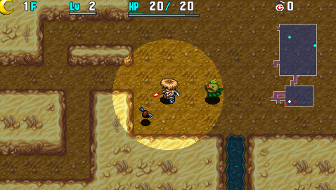

  

Dungeon where day and night cycles extremely fast - 60 turns for day, and 68 turns for night. Blank Scroll is the only scroll that can be found, except for Monster Houses which have Navigation Scrolls. Running away until time of day changes is an effective strategy to conserve items.

Despite being a 99F dungeon, it's among the easiest non-carry in dungeons in the game. This is mostly thanks to Plump Snacky on 1F, which can be hunted for lots of blessed Blank Scrolls.

<ul class="quickLinksUL">
  <li><a href="#overview">Overview</a></li>
  <li><a href="#strategy">Strategy</a></li>
  <li><a href="#floor-guide">Floor Guide</a></li>
  <li><a href="#monsters">Monsters</a></li>
  <li><a href="#items">Items</a></li>
  <li><a href="#traps">Traps</a></li>
</ul>

# Overview

<table class="dungeonOverview">
  <tr>
    <th>Unlock</th>
    <td class="highlightYellow">Go to Gonchiki Village after clearing the main story.</td>
  </tr>
  <tr>
    <th>Entrance</th>
    <td class="highlightYellow">Gonchiki Village (Check oven inside the house next to the Inn)</td>
  </tr>
</table>

<table class="dungeonTable">
  <tr>
    <th>Floors</th>
    <td>99F</td>
    <th>Day / Night</th>
    <td>Both</td>
  </tr>
  <tr>
    <th>Bring Items</th>
    <td>No</td>
    <th>Allies</th>
    <td>No</td>
  </tr>
  <tr>
    <th>Unidentified</th>
    <td colspan="3">Weapons, shields, bracelets, pots, staves</td>
  </tr>
  <tr>
    <th>Shops</th>
    <td>Regular, Elite, Pick-A-Choice</td>
    <th>Monster Houses</th>
    <td>Regular</td>
  </tr>
  <tr>
    <th>Initial Enemies</th>
    <td>8~9</td>
    <th>Spawn Rate</th>
    <td>30</td>
  </tr>
  <tr>
    <th>Day Turns</th>
    <td>60 (53)</td>
    <th>Night Turns</th>
    <td>68 (60)</td>
  </tr>
  <tr>
    <th>Ominous aura</th>
    <td>Yes (400 turns)</td>
    <th>Winds of Kron</th>
    <td>1st: 1700 / 4th: 2000</td>
  </tr>
  <tr>
    <th>Clear Icon</th>
    <td class="clearIcon"></td>
    <th>Clear Bonus</th>
    <td>30,000,000</td>
  </tr>
  <tr>
    <th>Reward</th>
    <td colspan="3">Borg Mamel (Ally NPC)</td>
  </tr>
</table>

※ Numbers in () for day and night turns is when the warning is displayed.

# Strategy

<ul class="quickLinksUL">
  <li><a href="#before-entering">Before Entering</a></li>
  <li><a href="#general">General</a></li>
  <li><a href="#equipment">Equipment</a></li>
  <li><a href="#other-items">Other Items</a></li>
</ul>

### Before Entering

It's strongly recommended to register the following to the Blank Scroll list: 
Extinction, Eradicate, Suction, Heaven, Earth, Fixer, Mon House, Replenish, Desert, and Lost.

Likewise, the Cluster Confusion ability is nearly mandatory to have an easy time in this dungeon. It can be learned from the Apprentice NPC ([Emerald Terrace](/dungeons/emerald-terrace) 1-7F).

### General

The easiest route is to linger and hunt Plump Snacky on 1F to stock up on Blank Scrolls and Storage Pots. Throw an Extinction Scroll at Dark Seedie to ensure only Plump Snacky spawns, then use Cluster Confusion + Room Cyclone while aiming for the Cross ability [formation](/system/necklace-abilities#formations).

The chance to activate the formation is higher if you utilize room corners.

<pre class="diagram">
S = Shiren 
 
□ □ □ □ ■ 
□ □ □ □ ■ 
□ □ S □ ■ 
□ □ □ □ ■ 
■ ■ ■ ■ ■
</pre>

If you obtain a Rusty Pickaxe, you can dig out a pattern to increase the chance further. Digging the optional tiles increases the number of enemies, but lowers the chance to activate the formation.

<pre class="diagram">
S = Shiren, O = Optional 
 
□ □ ■ ■ ■ ■ 
□ □ □ □ O ■ 
■ ■ □ S □ ■ 
■ ■ O □ ■ ■ 
■ ■ ■ ■ ■ ■
</pre>

Write Replenish on a Blank Scroll if you run out of ability uses. If you haven't read Replenish Scroll and didn't obtain Blank Scrolls, select Give Up and retry the dungeon.

What you do with the Blank Scrolls depends on your tolerance for monotonous gameplay.

- Use Navigation Scrolls on most floors.
- Upgrade equipment using Heaven and Earth scrolls.
- Use Suction Scrolls on a 5 capacity Presto Pot to obtain more Blank Scrolls and items.
- Use a Mon House Scroll 1 turn before time of day changes to obtain Navigation Scrolls and items.
- Throw Extinction Scrolls at annoying monsters as you encounter them.

### Abilities

See [Abilities](/system/necklace-abilities) for details.

Cluster Confusion and Room Cyclone are mandatory if you use the Blank Scroll strategy. That said, it can be nice to mix in some other abilities like Sticky Shot for late game floors.

#### Balanced

- Cluster Confusion x 3
- Room Cyclone x 3
- (Kaboom Bullet or Bi-Direction Warp or Sticky Shot) x 2

#### Farming

- Cluster Confusion x 4
- Room Cyclone x 4

### Equipment

Monster Detector, Wall Clip Bracelet, and Heal Bracelet can all be found on the ground, so aim for a weapon and shield set that grants 2 bracelet resonance.

#### Weapon

<ul>
  <li>Dotanuki, Beast Fang
    <ul>
      <li>Can be found on the ground - Decent attack power, rune slots, and growth rate.</li>
      <li>Stronger weapons are mostly from Elite Shops, so these are the most practical sets to aim for.</li>
    </ul>
  </li>
  <li>Palm Stick
    <ul>
      <li>Very fast growth rate, so it's easy to rapidly boost its attack using Heaven Scrolls.</li>
      <li>Unlike Shiren 5, it doesn't start with a very high upgrade limit.</li>
    </ul>
  </li>
</ul>

#### Shield

<ul>
  <li>Clan Shield, Beast Shield
    <ul>
      <li>Can be found on the ground - Decent defense, rune slots, and growth rate.</li>
      <li>Stronger shields are mostly from Elite Shops, so these are the most practical sets to aim for.</li>
    </ul>
  </li>
  <li>Palm Shield
    <ul>
      <li>Very fast growth rate, so it's easy to rapidly boost its defense using Earth Scrolls.</li>
      <li>Unlike Shiren 5, it doesn't start with a very high upgrade limit.</li>
    </ul>
  </li>
</ul>

#### Bracelets

<ul>
  <li>Monster Detector
    <ul>
      <li>Makes night safer, locate shops, find stairs using Transient Staff, etc.</li>
    </ul>
  </li>
  <li>Wall Clip Bracelet
    <ul>
      <li>Have a one-sided fight vs. a monster by moving and attacking through corners.</li>
      <li>Enter a wall and dig out a safe spot to cycle time of day if you have a Rusty Pickaxe.</li>
    </ul>
  </li>
  <li>Heal Bracelet
    <ul>
      <li>Quickly recover HP after fighting a powerful monster or stepping on a landmine.</li>
    </ul>
  </li>
  <li>Item Detector
    <ul>
      <li>Check rooms for items more efficiently, which usually leads to fewer accidents.</li>
    </ul>
  </li>
  <li>Identify Bracelet
    <ul>
      <li>Obtained from Elite or Pick-A-Choice shops.</li>
      <li>Helps with early game identification, and checking use counts and item seals late game.</li>
      <li>Cannot be used to identify N'mach or N'dups that have N'mach's ability.</li>
    </ul>
  </li>
  <li>Pierce Bracelet
    <ul>
      <li>Plays well with Monster Detector, and lets you use projectiles against Flash Birds.</li>
      <li>Keep it unequipped on Mixer floors to avoid accidents.</li>
    </ul>
  </li>
  <li>Alert Bracelet
    <ul>
      <li>Basically just for Sleep Traps, since you can throw an Extinction Scroll at Dozikon.</li>
    </ul>
  </li>
  <li>Cleansing Bracelet
    <ul>
      <li>Basically just for Scorpions, since you can throw an Extinction Scroll at Mesmerikon.</li>
    </ul>
  </li>
  <li>Strider Bracelet
    <ul>
      <li>Unequip over water to warp, or step in place over water to safely recover HP.</li>
      <li>Scrolls outside of pots will get wet.</li>
    </ul>
  </li>
</ul>

### Other Items

<ul>
  <li>Blank Scroll
    <ul>
      <li>Use a blessed Suction Scroll to bless 5 items at once.</li>
      <li>Read a Mon House Scroll to stock up on Navigation Scrolls and other items.</li>
      <li>Upgrade inventory items using Heaven, Earth, and Pot God scrolls.</li>
      <li>Throw Extinction Scroll at a troublesome monster, etc.</li>
    </ul>
  </li>
  <li>Presto Pot
    <ul>
      <li>Inserted items have a pretty high chance of turning into Blank Scrolls.</li>
      <li>Increase capacity to 5 with Pot God Scrolls, then use Suction Scrolls to reuse it.</li>
    </ul>
  </li>
</ul>

# Floor Guide

※ This section assumes the Blank Scroll strategy is being used.

### 1-10F

#### 1F

Floor that determines how the rest of the run will go based on Blank Scroll and Storage Pot drops. Once it becomes night, use Cluster Confusion → Room Cyclone to hunt Plump Snacky for a Blank Scroll. If a Blank Scroll didn't drop, and you didn't find one on the ground, select Give Up and retry the dungeon. Once you obtain a Blank Scroll, throw an Extinction Scroll at Seedie to ensure only Plump Snacky spawns. Read a Replenish Scroll if you run out of ability uses, and linger until the 3rd wind blows.

Increase capacity of Storage Pots using Pot God Scroll, and use blessed Suction Scrolls to reuse scrolls. Maneaters usually appear after 400 turns, which can be hunted to level up a weapon and shield. Gitan Mamel is also a nice target if you obtain a blessed Happy Staff, Berserk Talismans, etc. Once you have a good number of Blank Scrolls, feel free to upgrade your weapon and shield.

Keep an eye out for Lamp Shield, as it lets you read scrolls at night without a torch equipped. Identify as many items as you can - Use a Chocolate Pot to gain Identifier status if possible.

#### 2-5F

Continue collecting items. Insert items into Presto Pots in hopes of obtaining bracelets and Revival Grass during the day, and use Cluster Confusion → Room Cyclone to hunt Plump Snacky (1-3F) and Bad Zalokleft (3-5F) at night. If you find a Chocolate Pot, use it on Foul Novice (2-4F) floors since they drop Spoiled Bananas.

#### 6-10F

Use Mon House Scrolls to obtain Navigation Scrolls and other items. Choose a large room to reduce the risk of collapsing from Dark Pop Tank (8-12F) at night. Field Knave (6-7F) during the day and Dark Field Knave (8-10F) at night makes it hard to collect all items. Swift Grass can be used before reading the Mon House Scroll to ensure safety.

There's no need to carry torches or food until 10F - Use Navigation Scrolls and eat bananas off the floor.

### 11-19F

Mixer (12-14F) appears, so synthesize equipment and staves. Afterward, keep an eye out for Blank Scrolls while progressing using Navigation Scrolls. Remember to reuse scrolls using blessed Suction Scrolls instead of outright consuming them. It's best to have a Lamp Shield or Torch on hand in case you step on a Pit Trap at night.

### 20-29F

Bad Lime Zalokleft (20-22F) and Dark Pandanigiri (22-27F) can be hunted to restock items. Dragon (21-24F) also has a high item drop rate, and Lime Zalokleft (22-24F) always drops an item. It'd be good to level up your weapon and shield to increase rune slots before Mixermon (25-27F) floors.

### 30-39F

N'mach (31-45F) appears - Select Write to check if a Blank Scroll is real or not. Dark Pot Knave (30-31F), Super Gazer (31-32F), and Grampa Tank (31-35F) can be troublesome. Munchy (37-39F) and Scarabbit (36-38F) overlap, so there's risk of a Horrabbit being generated. All said, it's probably best to rush stairs in this floor range since there's little reason to linger.

### 40-49F

N'mach (31-45F) is still around until 45F, so keep that in mind for items you find on the ground. It's recommended to rush stairs on Dark Item Knave (40-42F) floors to avoid item loss. Pandanigiri (46-50F) can drop Onigiri, but beware of Ooze (42-49F)'s rune-erasing special attack. Maneater types rank up to Mounteaters starting on 46F, which can't be one-shot using Kaboom Bullet. Mixergon (47-49F) provides another chance to synthesize items.

Evil Oingodile (41-43F) and Evil Sing Polygon (43-45F) have regular AI at night, so it's best to stick to hallways or shops if you need to cycle to daytime.

### 50-59F

Tiger Chucker (50-53F) and Curse Mom (51-53F) overlap, so there's a higher risk of getting items cursed. Plump Munchy (49-53F) appears, but Vile Pumphantom (49-51F) and Evil Hyper Gazer (50-52F) are also around, so it's probably best to advance to the next floor if you get low on ability uses.

Rush stairs on MC Wizard (54-57F), Item Knave (56-58F), and Vexing Kappa (57-59F) floors. However, if you have a Swap Shield (Magic Damage), feel free to linger on 55F to hunt Munchy (55-57F).

### 60-69F

N'dup (61-80F) can be generated with N'mach's ability, so beware of items you find on the ground. Similar to N'mach floors, always select Write to check if a Blank Scroll is real or not. Consider throwing an Extinction Scroll at Horrabbit (60-62F) if you don't have a Steady Shield, and then Dozikon to banish both Dozikon (63-65F) and Dark Dozikon (64-66F) if you lack an Alert Bracelet.

Iron Zalokleft (65-67F) can be hunted for items, but watch out for Ornery Tank (65-67F). Dark Mixergon (63-65F) and Mixerdon (68-70F) are your last chances to synthesize without a Synthesis Pot.

Evil Archdragon (69-75F) can breathe fire that deals 60 damage from anywhere on the floor. It doesn't use its special attack often, but it's still highly recommended to throw an Extinction Scroll at it.

### 70-79F

N'dup (61-80F) is still around until 80F, so keep that in mind for items you find on the ground. Evil Archdragon (69-75F) continues to be a major threat if you didn't throw an Extinction Scroll at it. Dark Kappa Troll (72-75F) can cause accidents with its ability to throw items from anywhere on the floor. Rush stairs on MC Sorcerer (75-77F) and Dark MC Sorcerer (77-79F) floors if you lack a Swap Shield. Sludge (71-80F) can erase runes, and Evil Mosh Polygon (74-76F) has regular AI at night. Maneater types rank up to Isleaters starting on 76F, which have ridiculous attack power.

Despite the above dangers, Bad Fade Zalokleft (70-72F) and Mealy (76-78F) can be hunted for items.

### 80-89F

N'dup (61-80F) is still around on 80F, so keep that in mind for items you find on the ground. Kappa Troll (82-84F) throws items and Archdragon (82-87F) breathes fire from anywhere on the floor. Porgon (86-89F) also chips away at your HP with its Porky Rock throwing range of 10 tiles.

Throw an Extinction Scroll at Dark Mesmerikon (88-90F) to help ensure safety on upcoming floors.

### 90-99F

Stairs? Trap can be generated, so use [this technique](/guides/tips-and-tricks#check-for-stairs?-trap) to check for real stairs. Mesmerikon (90-95F) is a major threat if you didn't throw an Extinction Scroll at Dark Mesmerikon earlier. Other dangers include Cranky Tank (95-99F) and Dark Cranky Tank (93-99F), Ultra Gazer (96-99F), Knave King (93-99F), and Shine Bird (91-99F) who makes it hard to defeat all of the mentioned enemies.

Once you reach 96F, throw an Extinction Scroll at either Cranky Tank or Ultra Gazer. Players usually choose Ultra Gazer if they don't have a Gazer Guard (Anti-Hypno). Dark Cranky Tank is easier to deal with if you have Kaboom Bullet.

# Monsters

See [Monsters](/system/monsters) for individual monster details.

- S = Shop is possible
- P = Pick-A-Choice Shop is possible
- E = Elite Shop is possible
- H = Monster House is possible
- N = N'dubba Lv1 Lv2 Lv3 Lv4
- M = Maneater Lv1 Lv2 Lv3 Lv4

Enemy Colors: Day Night Farming Useful Destroys Items Strong Dangerous Very Dangerous

<table class="monsterTable">
  <thead>
    <tr>
      <th>F</th>
      <th>S</th>
      <th>P</th>
      <th>E</th>
      <th>H</th>
      <th colspan="7">Monsters</th>
      <th>N</th>
      <th>M</th>
    </tr>
  </thead>
  <tbody>
    <tr>
      <th rowspan="2">1</th>
      <td rowspan="2" class="highlightGray"></td>
      <td rowspan="2" class="highlightGray"></td>
      <td rowspan="2" class="highlightGray"></td>
      <td rowspan="2" class="highlightGray"></td>
      <td class="monsterDay">Mamel</td>
      <td class="monsterDay">Seedie</td>
      <td class="highlightGray"></td>
      <td class="highlightGray"></td>
      <td class="highlightGray"></td>
      <td class="highlightGray"></td>
      <td class="highlightGray"></td>
      <td rowspan="2" class="highlightGray"></td>
      <td rowspan="40" class="monsterTableManeater">1</td>
    </tr>
    <tr>
      <td class="farmingNight monsterNight">Plump Snacky</td>
      <td class="monsterNight">Dark Seedie</td>
      <td class="highlightGray"></td>
      <td class="highlightGray"></td>
      <td class="highlightGray"></td>
      <td class="highlightGray"></td>
      <td class="highlightGray"></td>
    </tr>
    <tr>
      <th rowspan="2">2</th>
      <td rowspan="2" class="highlightGray"></td>
      <td rowspan="2" class="highlightGray"></td>
      <td rowspan="2" class="highlightGray"></td>
      <td rowspan="2" class="highlightMH"></td>
      <td class="monsterDay">Mamel</td>
      <td class="monsterDay">Seedie</td>
      <td class="monsterDay">Pit Mamel</td>
      <td class="monsterDay">Chintala</td>
      <td class="highlightGray"></td>
      <td class="highlightGray"></td>
      <td class="highlightGray"></td>
      <td rowspan="2" class="highlightGray"></td>
    </tr>
    <tr>
      <td class="farmingNight monsterNight">Plump Snacky</td>
      <td class="monsterNight">Dark Seedie</td>
      <td class="monsterNight">Foul Novice</td>
      <td class="highlightGray"></td>
      <td class="highlightGray"></td>
      <td class="highlightGray"></td>
      <td class="highlightGray"></td>
    </tr>
    <tr>
      <th rowspan="2">3</th>
      <td rowspan="2" class="highlightGray"></td>
      <td rowspan="2" class="highlightGray"></td>
      <td rowspan="2" class="highlightGray"></td>
      <td rowspan="2" class="highlightMH"></td>
      <td class="monsterDay">Hopodile</td>
      <td class="monsterDay">Seedie</td>
      <td class="monsterDay">Pit Mamel</td>
      <td class="monsterDay">Chintala</td>
      <td class="highlightGray"></td>
      <td class="highlightGray"></td>
      <td class="highlightGray"></td>
      <td rowspan="2" class="highlightGray"></td>
    </tr>
    <tr>
      <td class="farmingNight monsterNight">Plump Snacky</td>
      <td class="monsterNight">Dark Seedie</td>
      <td class="monsterNight">Foul Novice</td>
      <td class="farmingNight monsterNight">Bad Zalokleft</td>
      <td class="highlightGray"></td>
      <td class="highlightGray"></td>
      <td class="highlightGray"></td>
    </tr>
    <tr>
      <th rowspan="2">4</th>
      <td rowspan="2" class="highlightGray"></td>
      <td rowspan="2" class="highlightGray"></td>
      <td rowspan="2" class="highlightGray"></td>
      <td rowspan="2" class="highlightMH"></td>
      <td class="monsterDay">Hopodile</td>
      <td class="monsterDay">Banana Novice</td>
      <td class="monsterDay">Pit Mamel</td>
      <td class="monsterDay">Chintala</td>
      <td class="monsterDay">Squid King</td>
      <td class="highlightGray"></td>
      <td class="highlightGray"></td>
      <td rowspan="2" class="highlightGray"></td>
    </tr>
    <tr>
      <td class="monsterNight">Dark Blade Bee</td>
      <td class="monsterNight">Dark Mutaikon</td>
      <td class="monsterNight">Foul Novice</td>
      <td class="farmingNight monsterNight">Bad Zalokleft</td>
      <td class="highlightGray"></td>
      <td class="highlightGray"></td>
      <td class="highlightGray"></td>
    </tr>
    <tr>
      <th rowspan="2">5</th>
      <td rowspan="2" class="highlightGray"></td>
      <td rowspan="2" class="highlightGray"></td>
      <td rowspan="2" class="highlightGray"></td>
      <td rowspan="2" class="highlightMH"></td>
      <td class="monsterDay">Hopodile</td>
      <td class="monsterDay">Banana Novice</td>
      <td class="monsterDay">Blade Bee</td>
      <td class="highlightGray"></td>
      <td class="monsterDay">Squid King</td>
      <td class="highlightGray"></td>
      <td class="highlightGray"></td>
      <td rowspan="2" class="highlightGray"></td>
    </tr>
    <tr>
      <td class="monsterNight">Dark Blade Bee</td>
      <td class="monsterNight">Dark Mutaikon</td>
      <td class="monsterNight">Evil Firepuff</td>
      <td class="farmingNight monsterNight">Bad Zalokleft</td>
      <td class="highlightGray"></td>
      <td class="highlightGray"></td>
      <td class="highlightGray"></td>
    </tr>
    <tr>
      <th rowspan="2">6</th>
      <td rowspan="2" class="highlightGray"></td>
      <td rowspan="2" class="highlightGray"></td>
      <td rowspan="2" class="highlightGray"></td>
      <td rowspan="2" class="highlightMH"></td>
      <td class="monsterDay">Field Knave</td>
      <td class="monsterDay">Banana Novice</td>
      <td class="monsterDay">Blade Bee</td>
      <td class="monsterDay">Boy Cart</td>
      <td class="highlightGray"></td>
      <td class="highlightGray"></td>
      <td class="highlightGray"></td>
      <td rowspan="2" class="highlightGray"></td>
    </tr>
    <tr>
      <td class="monsterNight">Dark Blade Bee</td>
      <td class="monsterNight">Dark Mutaikon</td>
      <td class="monsterNight">Evil Firepuff</td>
      <td class="monsterNight">Dark Boy Cart</td>
      <td class="highlightGray"></td>
      <td class="highlightGray"></td>
      <td class="highlightGray"></td>
    </tr>
    <tr>
      <th rowspan="2">7</th>
      <td rowspan="2" class="highlightGray"></td>
      <td rowspan="2" class="highlightGray"></td>
      <td rowspan="2" class="highlightGray"></td>
      <td rowspan="2" class="highlightMH"></td>
      <td class="monsterDay">Field Knave</td>
      <td class="monsterDay">Banana Novice</td>
      <td class="monsterDay">Blade Bee</td>
      <td class="monsterDay">Boy Cart</td>
      <td class="monsterDay">Ironhead</td>
      <td class="highlightGray"></td>
      <td class="highlightGray"></td>
      <td rowspan="2" class="highlightGray"></td>
    </tr>
    <tr>
      <td class="monsterNight">Dark Blade Bee</td>
      <td class="monsterNight">Evil Gazer</td>
      <td class="monsterNight">Evil Firepuff</td>
      <td class="monsterNight">Dark Boy Cart</td>
      <td class="highlightGray"></td>
      <td class="highlightGray"></td>
      <td class="highlightGray"></td>
    </tr>
    <tr>
      <th rowspan="2">8</th>
      <td rowspan="2" class="highlightShop"></td>
      <td rowspan="2" class="highlightChoice"></td>
      <td rowspan="2" class="highlightElite"></td>
      <td rowspan="2" class="highlightMH"></td>
      <td class="dangerDay monsterDay">Foly</td>
      <td class="monsterDay">Cheer Ham</td>
      <td class="monsterDay">Blade Bee</td>
      <td class="monsterDay">Boy Cart</td>
      <td class="monsterDay">Ironhead</td>
      <td class="farmingDay monsterDay">Snacky</td>
      <td class="highlightGray"></td>
      <td rowspan="10" class="monsterTableNdubba">1</td>
    </tr>
    <tr>
      <td class="monsterNight">Dark Pop Tank</td>
      <td class="monsterNight">Evil Gazer</td>
      <td class="monsterNight">Dark Field Knave</td>
      <td class="monsterNight">Dark Boy Cart</td>
      <td class="highlightGray"></td>
      <td class="highlightGray"></td>
      <td class="highlightGray"></td>
    </tr>
    <tr>
      <th rowspan="2">9</th>
      <td rowspan="2" class="highlightShop"></td>
      <td rowspan="2" class="highlightChoice"></td>
      <td rowspan="2" class="highlightElite"></td>
      <td rowspan="2" class="highlightMH"></td>
      <td class="dangerDay monsterDay">Foly</td>
      <td class="monsterDay">Cheer Ham</td>
      <td class="monsterDay">Blade Bee</td>
      <td class="monsterDay">Boy Cart</td>
      <td class="monsterDay">Ironhead</td>
      <td class="farmingDay monsterDay">Snacky</td>
      <td class="highlightGray"></td>
    </tr>
    <tr>
      <td class="monsterNight">Dark Pop Tank</td>
      <td class="monsterNight">Evil Gazer</td>
      <td class="monsterNight">Dark Field Knave</td>
      <td class="monsterNight">Foul Morph</td>
      <td class="highlightGray"></td>
      <td class="highlightGray"></td>
      <td class="highlightGray"></td>
    </tr>
    <tr>
      <th rowspan="2">10</th>
      <td rowspan="2" class="highlightShop"></td>
      <td rowspan="2" class="highlightChoice"></td>
      <td rowspan="2" class="highlightElite"></td>
      <td rowspan="2" class="highlightMH"></td>
      <td class="dangerDay monsterDay">Foly</td>
      <td class="monsterDay">Cheer Ham</td>
      <td class="monsterDay">Scorpion</td>
      <td class="monsterDay">Boy Cart</td>
      <td class="monsterDay">Ironhead</td>
      <td class="monsterDay">Crow Tengu</td>
      <td class="highlightGray"></td>
    </tr>
    <tr>
      <td class="monsterNight">Dark Pop Tank</td>
      <td class="monsterNight">Evil Spin Polygon</td>
      <td class="monsterNight">Dark Field Knave</td>
      <td class="monsterNight">Foul Morph</td>
      <td class="highlightGray"></td>
      <td class="highlightGray"></td>
      <td class="highlightGray"></td>
    </tr>
    <tr>
      <th rowspan="2">11</th>
      <td rowspan="2" class="highlightShop"></td>
      <td rowspan="2" class="highlightChoice"></td>
      <td rowspan="2" class="highlightElite"></td>
      <td rowspan="2" class="highlightMH"></td>
      <td class="monsterDay">Yanpii</td>
      <td class="dangerDay monsterDay">Explochin</td>
      <td class="monsterDay">Scorpion</td>
      <td class="monsterDay">Boy Cart</td>
      <td class="monsterDay">Ironhead</td>
      <td class="monsterDay">Crow Tengu</td>
      <td class="highlightGray"></td>
    </tr>
    <tr>
      <td class="monsterNight">Dark Pop Tank</td>
      <td class="monsterNight">Evil Spin Polygon</td>
      <td class="dangerNight monsterNight">Dark Absorbiphant</td>
      <td class="monsterNight">Foul Morph</td>
      <td class="highlightGray"></td>
      <td class="highlightGray"></td>
      <td class="highlightGray"></td>
    </tr>
    <tr>
      <th rowspan="2">12</th>
      <td rowspan="2" class="highlightGray"></td>
      <td rowspan="2" class="highlightGray"></td>
      <td rowspan="2" class="highlightGray"></td>
      <td rowspan="2" class="highlightMH"></td>
      <td class="monsterDay">Yanpii</td>
      <td class="dangerDay monsterDay">Explochin</td>
      <td class="monsterDay">Scorpion</td>
      <td class="usefulDay monsterDay">Mixer</td>
      <td class="dangerDay monsterDay">Porky</td>
      <td class="highlightGray"></td>
      <td class="highlightGray"></td>
    </tr>
    <tr>
      <td class="monsterNight">Dark Pop Tank</td>
      <td class="monsterNight">Evil Spin Polygon</td>
      <td class="dangerNight monsterNight">Dark Absorbiphant</td>
      <td class="monsterNight">Foul Morph</td>
      <td class="highlightGray"></td>
      <td class="highlightGray"></td>
      <td class="highlightGray"></td>
    </tr>
    <tr>
      <th rowspan="2">13</th>
      <td rowspan="2" class="highlightGray"></td>
      <td rowspan="2" class="highlightGray"></td>
      <td rowspan="2" class="highlightGray"></td>
      <td rowspan="2" class="highlightMH"></td>
      <td class="monsterDay">Yanpii</td>
      <td class="dangerDay monsterDay">Explochin</td>
      <td class="monsterDay">Scorpion</td>
      <td class="usefulDay monsterDay">Mixer</td>
      <td class="dangerDay monsterDay">Porky</td>
      <td class="usefulDay monsterDay">Floaty</td>
      <td class="highlightGray"></td>
      <td rowspan="2" class="highlightGray"></td>
    </tr>
    <tr>
      <td class="monsterNight">Evil Explochin</td>
      <td class="monsterNight">Dark Zapdon</td>
      <td class="dangerNight monsterNight">Dark Absorbiphant</td>
      <td class="monsterNight">Foul Morph</td>
      <td class="highlightGray"></td>
      <td class="highlightGray"></td>
      <td class="highlightGray"></td>
    </tr>
    <tr>
      <th rowspan="2">14</th>
      <td rowspan="2" class="highlightGray"></td>
      <td rowspan="2" class="highlightGray"></td>
      <td rowspan="2" class="highlightGray"></td>
      <td rowspan="2" class="highlightMH"></td>
      <td class="monsterDay">Yanpii</td>
      <td class="itemDay monsterDay">Gyadon</td>
      <td class="monsterDay">Scorpion</td>
      <td class="usefulDay monsterDay">Mixer</td>
      <td class="dangerDay monsterDay">Porky</td>
      <td class="usefulDay monsterDay">Floaty</td>
      <td class="highlightGray"></td>
      <td rowspan="2" class="highlightGray"></td>
    </tr>
    <tr>
      <td class="monsterNight">Evil Explochin</td>
      <td class="monsterNight">Dark Zapdon</td>
      <td class="monsterNight">Dark Ironhead</td>
      <td class="monsterNight">Mean Cheer Ham</td>
      <td class="highlightGray"></td>
      <td class="highlightGray"></td>
      <td class="highlightGray"></td>
    </tr>
    <tr>
      <th rowspan="2">15</th>
      <td rowspan="2" class="highlightGray"></td>
      <td rowspan="2" class="highlightGray"></td>
      <td rowspan="2" class="highlightGray"></td>
      <td rowspan="2" class="highlightMH"></td>
      <td class="monsterDay">Yanpii</td>
      <td class="itemDay monsterDay">Gyadon</td>
      <td class="monsterDay">Zapdon</td>
      <td class="monsterDay">Spin Polygon</td>
      <td class="dangerDay monsterDay">Porky</td>
      <td class="usefulDay monsterDay">Floaty</td>
      <td class="highlightGray"></td>
      <td rowspan="2" class="highlightGray"></td>
    </tr>
    <tr>
      <td class="monsterNight">Evil Explochin</td>
      <td class="monsterNight">Dark Zapdon</td>
      <td class="monsterNight">Dark Ironhead</td>
      <td class="monsterNight">Mean Cheer Ham</td>
      <td class="highlightGray"></td>
      <td class="highlightGray"></td>
      <td class="highlightGray"></td>
    </tr>
    <tr>
      <th rowspan="2">16</th>
      <td rowspan="2" class="highlightGray"></td>
      <td rowspan="2" class="highlightGray"></td>
      <td rowspan="2" class="highlightGray"></td>
      <td rowspan="2" class="highlightMH"></td>
      <td class="monsterDay">Flash Bird</td>
      <td class="itemDay monsterDay">Gyadon</td>
      <td class="monsterDay">Zapdon</td>
      <td class="monsterDay">Spin Polygon</td>
      <td class="dangerDay monsterDay">Porky</td>
      <td class="monsterDay">Dagger Bee</td>
      <td class="highlightGray"></td>
      <td rowspan="2" class="highlightGray"></td>
    </tr>
    <tr>
      <td class="monsterNight">Foul Curse Girl</td>
      <td class="monsterNight">Dark Zapdon</td>
      <td class="monsterNight">Dark Ironhead</td>
      <td class="monsterNight">Mean Cheer Ham</td>
      <td class="highlightGray"></td>
      <td class="highlightGray"></td>
      <td class="highlightGray"></td>
    </tr>
    <tr>
      <th rowspan="2">17</th>
      <td rowspan="2" class="highlightGray"></td>
      <td rowspan="2" class="highlightGray"></td>
      <td rowspan="2" class="highlightGray"></td>
      <td rowspan="2" class="highlightMH"></td>
      <td class="monsterDay">Flash Bird</td>
      <td class="farmingDay monsterDay">Froggucci</td>
      <td class="monsterDay">Zapdon</td>
      <td class="monsterDay">Spin Polygon</td>
      <td class="monsterDay">Flamepuff</td>
      <td class="monsterDay">Dagger Bee</td>
      <td class="highlightGray"></td>
      <td rowspan="2" class="highlightGray"></td>
    </tr>
    <tr>
      <td class="monsterNight">Foul Curse Girl</td>
      <td class="monsterNight">Dark Zapdon</td>
      <td class="monsterNight">Dark Ironhead</td>
      <td class="monsterNight">Dark Kappa Pest</td>
      <td class="highlightGray"></td>
      <td class="highlightGray"></td>
      <td class="highlightGray"></td>
    </tr>
    <tr>
      <th rowspan="2">18</th>
      <td rowspan="2" class="highlightGray"></td>
      <td rowspan="2" class="highlightGray"></td>
      <td rowspan="2" class="highlightGray"></td>
      <td rowspan="2" class="highlightMH"></td>
      <td class="monsterDay">Flash Bird</td>
      <td class="farmingDay monsterDay">Froggucci</td>
      <td class="monsterDay">Zapdon</td>
      <td class="monsterDay">Squid Lord</td>
      <td class="monsterDay">Flamepuff</td>
      <td class="monsterDay">Dagger Bee</td>
      <td class="highlightGray"></td>
      <td rowspan="2" class="highlightGray"></td>
    </tr>
    <tr>
      <td class="monsterNight">Foul Curse Girl</td>
      <td class="monsterNight">Evil Mid Chintala</td>
      <td class="monsterNight">Dark Ironhead</td>
      <td class="monsterNight">Dark Kappa Pest</td>
      <td class="highlightGray"></td>
      <td class="highlightGray"></td>
      <td class="highlightGray"></td>
    </tr>
    <tr>
      <th rowspan="2">19</th>
      <td rowspan="2" class="highlightGray"></td>
      <td rowspan="2" class="highlightGray"></td>
      <td rowspan="2" class="highlightGray"></td>
      <td rowspan="2" class="highlightMH"></td>
      <td class="monsterDay">Beanie</td>
      <td class="farmingDay monsterDay">Froggucci</td>
      <td class="monsterDay">Zapdon</td>
      <td class="monsterDay">Squid Lord</td>
      <td class="monsterDay">Flamepuff</td>
      <td class="monsterDay">Dagger Bee</td>
      <td class="highlightGray"></td>
      <td rowspan="2" class="highlightGray"></td>
    </tr>
    <tr>
      <td class="monsterNight">Evil Kengo</td>
      <td class="monsterNight">Evil Mid Chintala</td>
      <td class="farmingNight monsterNight">Bad Lime Zalokleft</td>
      <td class="monsterNight">Dark Kappa Pest</td>
      <td class="highlightGray"></td>
      <td class="highlightGray"></td>
      <td class="highlightGray"></td>
    </tr>
    <tr>
      <th rowspan="2">20</th>
      <td rowspan="2" class="highlightShop"></td>
      <td rowspan="2" class="highlightChoice"></td>
      <td rowspan="2" class="highlightElite"></td>
      <td rowspan="2" class="highlightMH"></td>
      <td class="monsterDay">Beanie</td>
      <td class="monsterDay">Pop Tank</td>
      <td class="strongDay monsterDay">Gyaza</td>
      <td class="monsterDay">Squid Lord</td>
      <td class="dangerDay monsterDay">Go Ham</td>
      <td class="monsterDay">Dagger Bee</td>
      <td class="highlightGray"></td>
      <td rowspan="2" class="highlightGray"></td>
    </tr>
    <tr>
      <td class="monsterNight">Evil Kengo</td>
      <td class="monsterNight">Evil Mid Chintala</td>
      <td class="farmingNight monsterNight">Bad Lime Zalokleft</td>
      <td class="monsterNight">Snide Froggucci</td>
      <td class="highlightGray"></td>
      <td class="highlightGray"></td>
      <td class="highlightGray"></td>
    </tr>
    <tr>
      <th rowspan="2">21</th>
      <td rowspan="2" class="highlightShop"></td>
      <td rowspan="2" class="highlightChoice"></td>
      <td rowspan="2" class="highlightElite"></td>
      <td rowspan="2" class="highlightMH"></td>
      <td class="monsterDay">Beanie</td>
      <td class="monsterDay">Pop Tank</td>
      <td class="strongDay monsterDay">Gyaza</td>
      <td class="strongDay monsterDay">Dragon</td>
      <td class="dangerDay monsterDay">Go Ham</td>
      <td class="strongDay monsterDay">Sr. Yanpii</td>
      <td class="highlightGray"></td>
      <td rowspan="2" class="highlightGray"></td>
      <td rowspan="50" class="monsterTableVilleater">2</td>
    </tr>
    <tr>
      <td class="monsterNight">Evil Kengo</td>
      <td class="monsterNight">Evil Mid Chintala</td>
      <td class="farmingNight monsterNight">Bad Lime Zalokleft</td>
      <td class="monsterNight">Snide Froggucci</td>
      <td class="highlightGray"></td>
      <td class="highlightGray"></td>
      <td class="highlightGray"></td>
    </tr>
    <tr>
      <th rowspan="2">22</th>
      <td rowspan="2" class="highlightShop"></td>
      <td rowspan="2" class="highlightChoice"></td>
      <td rowspan="2" class="highlightElite"></td>
      <td rowspan="2" class="highlightMH"></td>
      <td class="monsterDay">Beanie</td>
      <td class="monsterDay">Pop Tank</td>
      <td class="strongDay monsterDay">Gyaza</td>
      <td class="strongDay monsterDay">Dragon</td>
      <td class="farmingDay monsterDay">Lime Zalokleft</td>
      <td class="strongDay monsterDay">Sr. Yanpii</td>
      <td class="highlightGray"></td>
      <td rowspan="2" class="highlightGray"></td>
    </tr>
    <tr>
      <td class="monsterNight">Evil Kengo</td>
      <td class="monsterNight">Evil Mid Chintala</td>
      <td class="monsterNight">Dark Pandanigiri</td>
      <td class="monsterNight">Snide Froggucci</td>
      <td class="highlightGray"></td>
      <td class="highlightGray"></td>
      <td class="highlightGray"></td>
    </tr>
    <tr>
      <th rowspan="2">23</th>
      <td rowspan="2" class="highlightShop"></td>
      <td rowspan="2" class="highlightChoice"></td>
      <td rowspan="2" class="highlightElite"></td>
      <td rowspan="2" class="highlightMH"></td>
      <td class="itemDay monsterDay">Curse Sister</td>
      <td class="strongDay monsterDay">Big Chintala</td>
      <td class="strongDay monsterDay">Gyaza</td>
      <td class="strongDay monsterDay">Dragon</td>
      <td class="farmingDay monsterDay">Lime Zalokleft</td>
      <td class="strongDay monsterDay">Sr. Yanpii</td>
      <td class="highlightGray"></td>
      <td rowspan="2" class="highlightGray"></td>
    </tr>
    <tr>
      <td class="monsterNight">Evil Kengo</td>
      <td class="monsterNight">Evil Mid Chintala</td>
      <td class="monsterNight">Dark Pandanigiri</td>
      <td class="monsterNight">Vile Grime</td>
      <td class="highlightGray"></td>
      <td class="highlightGray"></td>
      <td class="highlightGray"></td>
    </tr>
    <tr>
      <th rowspan="2">24</th>
      <td rowspan="2" class="highlightShop"></td>
      <td rowspan="2" class="highlightChoice"></td>
      <td rowspan="2" class="highlightElite"></td>
      <td rowspan="2" class="highlightMH"></td>
      <td class="itemDay monsterDay">Curse Sister</td>
      <td class="strongDay monsterDay">Big Chintala</td>
      <td class="strongDay monsterDay">Gyaza</td>
      <td class="strongDay monsterDay">Dragon</td>
      <td class="farmingDay monsterDay">Lime Zalokleft</td>
      <td class="strongDay monsterDay">Sr. Yanpii</td>
      <td class="highlightGray"></td>
      <td rowspan="2" class="highlightGray"></td>
    </tr>
    <tr>
      <td class="monsterNight">Evil Kengo</td>
      <td class="monsterNight">Dark Hurler</td>
      <td class="monsterNight">Dark Pandanigiri</td>
      <td class="monsterNight">Vile Grime</td>
      <td class="highlightGray"></td>
      <td class="highlightGray"></td>
      <td class="highlightGray"></td>
    </tr>
    <tr>
      <th rowspan="2">25</th>
      <td rowspan="2" class="highlightShop"></td>
      <td rowspan="2" class="highlightChoice"></td>
      <td rowspan="2" class="highlightElite"></td>
      <td rowspan="2" class="highlightMH"></td>
      <td class="itemDay monsterDay">Curse Sister</td>
      <td class="strongDay monsterDay">Big Chintala</td>
      <td class="strongDay monsterDay">Gyaza</td>
      <td class="strongDay monsterDay">Dragon</td>
      <td class="itemDay monsterDay">Grime</td>
      <td class="usefulDay monsterDay">Mixermon</td>
      <td class="highlightGray"></td>
      <td rowspan="2" class="highlightGray"></td>
    </tr>
    <tr>
      <td class="usefulNight monsterNight">Evil Poofy</td>
      <td class="monsterNight">Dark Hurler</td>
      <td class="monsterNight">Dark Pandanigiri</td>
      <td class="monsterNight">Vile Grime</td>
      <td class="highlightGray"></td>
      <td class="highlightGray"></td>
      <td class="highlightGray"></td>
    </tr>
    <tr>
      <th rowspan="2">26</th>
      <td rowspan="2" class="highlightShop"></td>
      <td rowspan="2" class="highlightChoice"></td>
      <td rowspan="2" class="highlightElite"></td>
      <td rowspan="2" class="highlightMH"></td>
      <td class="dangerDay monsterDay">Concusschin</td>
      <td class="strongDay monsterDay">Big Chintala</td>
      <td class="strongDay monsterDay">Gyaza</td>
      <td class="strongDay monsterDay">Eligan</td>
      <td class="itemDay monsterDay">Grime</td>
      <td class="usefulDay monsterDay">Mixermon</td>
      <td class="highlightGray"></td>
      <td rowspan="2" class="highlightGray"></td>
    </tr>
    <tr>
      <td class="usefulNight monsterNight">Evil Poofy</td>
      <td class="monsterNight">Dark Hurler</td>
      <td class="monsterNight">Dark Pandanigiri</td>
      <td class="monsterNight">Foul Curse Sister</td>
      <td class="highlightGray"></td>
      <td class="highlightGray"></td>
      <td class="highlightGray"></td>
    </tr>
    <tr>
      <th rowspan="2">27</th>
      <td rowspan="2" class="highlightShop"></td>
      <td rowspan="2" class="highlightChoice"></td>
      <td rowspan="2" class="highlightElite"></td>
      <td rowspan="2" class="highlightMH"></td>
      <td class="dangerDay monsterDay">Concusschin</td>
      <td class="dangerDay monsterDay">MC Mage</td>
      <td class="monsterDay">Glare Bird</td>
      <td class="strongDay monsterDay">Eligan</td>
      <td class="itemDay monsterDay">Grime</td>
      <td class="usefulDay monsterDay">Mixermon</td>
      <td class="highlightGray"></td>
      <td rowspan="2" class="highlightGray"></td>
    </tr>
    <tr>
      <td class="usefulNight monsterNight">Evil Poofy</td>
      <td class="monsterNight">Dark Hurler</td>
      <td class="monsterNight">Dark Pandanigiri</td>
      <td class="monsterNight">Foul Curse Sister</td>
      <td class="highlightGray"></td>
      <td class="highlightGray"></td>
      <td class="highlightGray"></td>
    </tr>
    <tr>
      <th rowspan="2">28</th>
      <td rowspan="2" class="highlightGray"></td>
      <td rowspan="2" class="highlightGray"></td>
      <td rowspan="2" class="highlightGray"></td>
      <td rowspan="2" class="highlightMH"></td>
      <td class="dangerDay monsterDay">Concusschin</td>
      <td class="dangerDay monsterDay">MC Mage</td>
      <td class="monsterDay">Glare Bird</td>
      <td class="strongDay monsterDay">Eligan</td>
      <td class="monsterDay">Pumphantom</td>
      <td class="itemDay monsterDay">Banana Morph</td>
      <td class="highlightGray"></td>
      <td rowspan="2" class="highlightGray"></td>
    </tr>
    <tr>
      <td class="farmingNight monsterNight">Plump Crunchy</td>
      <td class="monsterNight">Dark Hurler</td>
      <td class="monsterNight">Dark Eligagan</td>
      <td class="monsterNight">Foul Curse Sister</td>
      <td class="highlightGray"></td>
      <td class="highlightGray"></td>
      <td class="highlightGray"></td>
    </tr>
    <tr>
      <th rowspan="2">29</th>
      <td rowspan="2" class="highlightGray"></td>
      <td rowspan="2" class="highlightGray"></td>
      <td rowspan="2" class="highlightGray"></td>
      <td rowspan="2" class="highlightMH"></td>
      <td class="strongDay monsterDay">Chainhead</td>
      <td class="dangerDay monsterDay">MC Mage</td>
      <td class="monsterDay">Glare Bird</td>
      <td class="strongDay monsterDay">Eligan</td>
      <td class="monsterDay">Pumphantom</td>
      <td class="itemDay monsterDay">Banana Morph</td>
      <td class="highlightGray"></td>
      <td rowspan="2" class="highlightGray"></td>
    </tr>
    <tr>
      <td class="farmingNight monsterNight">Plump Crunchy</td>
      <td class="monsterNight">Dark Hurler</td>
      <td class="monsterNight">Dark Eligagan</td>
      <td class="monsterNight">Dark Pot Knave</td>
      <td class="highlightGray"></td>
      <td class="highlightGray"></td>
      <td class="highlightGray"></td>
    </tr>
    <tr>
      <th rowspan="2">30</th>
      <td rowspan="2" class="highlightGray"></td>
      <td rowspan="2" class="highlightGray"></td>
      <td rowspan="2" class="highlightGray"></td>
      <td rowspan="2" class="highlightMH"></td>
      <td class="strongDay monsterDay">Chainhead</td>
      <td class="monsterDay">Demon Scorp</td>
      <td class="monsterDay">Glare Bird</td>
      <td class="strongDay monsterDay">Eligan</td>
      <td class="monsterDay">Pumphantom</td>
      <td class="itemDay monsterDay">Banana Morph</td>
      <td class="highlightGray"></td>
      <td rowspan="2" class="highlightGray"></td>
    </tr>
    <tr>
      <td class="farmingNight monsterNight">Plump Crunchy</td>
      <td class="monsterNight">Dark Dagger Bee</td>
      <td class="monsterNight">Dark Eligagan</td>
      <td class="monsterNight">Dark Pot Knave</td>
      <td class="highlightGray"></td>
      <td class="highlightGray"></td>
      <td class="highlightGray"></td>
    </tr>
    <tr>
      <th rowspan="2">31</th>
      <td rowspan="2" class="highlightGray"></td>
      <td rowspan="2" class="highlightGray"></td>
      <td rowspan="2" class="highlightGray"></td>
      <td rowspan="2" class="highlightMH"></td>
      <td class="strongDay monsterDay">Chainhead</td>
      <td class="monsterDay">Demon Scorp</td>
      <td class="dangerDay monsterDay">Super Gazer</td>
      <td class="dangerDay monsterDay">Digestiphant</td>
      <td class="monsterDay">Pumphantom</td>
      <td class="dangerDay monsterDay">Grampa Tank</td>
      <td class="highlightGray"></td>
      <td rowspan="30" class="monsterTableNmach">3</td>
    </tr>
    <tr>
      <td class="monsterNight">Evil Flamepuff</td>
      <td class="monsterNight">Dark Dagger Bee</td>
      <td class="monsterNight">Dark Eligagan</td>
      <td class="monsterNight">Dark Pot Knave</td>
      <td class="highlightGray"></td>
      <td class="highlightGray"></td>
      <td class="highlightGray"></td>
    </tr>
    <tr>
      <th rowspan="2">32</th>
      <td rowspan="2" class="highlightGray"></td>
      <td rowspan="2" class="highlightGray"></td>
      <td rowspan="2" class="highlightGray"></td>
      <td rowspan="2" class="highlightMH"></td>
      <td class="strongDay monsterDay">Chainhead</td>
      <td class="monsterDay">Demon Scorp</td>
      <td class="dangerDay monsterDay">Super Gazer</td>
      <td class="dangerDay monsterDay">Digestiphant</td>
      <td class="monsterDay">Pumphantom</td>
      <td class="dangerDay monsterDay">Grampa Tank</td>
      <td class="highlightGray"></td>
    </tr>
    <tr>
      <td class="monsterNight">Evil Flamepuff</td>
      <td class="monsterNight">Dark Dagger Bee</td>
      <td class="monsterNight">Dark Eligagan</td>
      <td class="dangerNight monsterNight">Dark Digestiphant</td>
      <td class="highlightGray"></td>
      <td class="highlightGray"></td>
      <td class="highlightGray"></td>
    </tr>
    <tr>
      <th rowspan="2">33</th>
      <td rowspan="2" class="highlightGray"></td>
      <td rowspan="2" class="highlightGray"></td>
      <td rowspan="2" class="highlightGray"></td>
      <td rowspan="2" class="highlightMH"></td>
      <td class="strongDay monsterDay">Chainhead</td>
      <td class="monsterDay">Voltdon</td>
      <td class="monsterDay">Tiger Hurler</td>
      <td class="dangerDay monsterDay">Digestiphant</td>
      <td class="monsterDay">Dance Polygon</td>
      <td class="dangerDay monsterDay">Grampa Tank</td>
      <td class="highlightGray"></td>
    </tr>
    <tr>
      <td class="monsterNight">Evil Flamepuff</td>
      <td class="monsterNight">Dark Dagger Bee</td>
      <td class="monsterNight">Dark Chainhead</td>
      <td class="dangerNight monsterNight">Dark Digestiphant</td>
      <td class="highlightGray"></td>
      <td class="highlightGray"></td>
      <td class="highlightGray"></td>
    </tr>
    <tr>
      <th rowspan="2">34</th>
      <td rowspan="2" class="highlightGray"></td>
      <td rowspan="2" class="highlightGray"></td>
      <td rowspan="2" class="highlightGray"></td>
      <td rowspan="2" class="highlightMH"></td>
      <td class="dangerDay monsterDay">Porko</td>
      <td class="monsterDay">Voltdon</td>
      <td class="monsterDay">Tiger Hurler</td>
      <td class="dangerDay monsterDay">Digestiphant</td>
      <td class="monsterDay">Dance Polygon</td>
      <td class="dangerDay monsterDay">Grampa Tank</td>
      <td class="highlightGray"></td>
    </tr>
    <tr>
      <td class="monsterNight">Foul Boss</td>
      <td class="monsterNight">Dark Dagger Bee</td>
      <td class="monsterNight">Dark Chainhead</td>
      <td class="dangerNight monsterNight">Dark Digestiphant</td>
      <td class="highlightGray"></td>
      <td class="highlightGray"></td>
      <td class="highlightGray"></td>
    </tr>
    <tr>
      <th rowspan="2">35</th>
      <td rowspan="2" class="highlightGray"></td>
      <td rowspan="2" class="highlightGray"></td>
      <td rowspan="2" class="highlightGray"></td>
      <td rowspan="2" class="highlightMH"></td>
      <td class="dangerDay monsterDay">Porko</td>
      <td class="monsterDay">Voltdon</td>
      <td class="monsterDay">Tiger Hurler</td>
      <td class="dangerDay monsterDay">Digestiphant</td>
      <td class="monsterDay">Dance Polygon</td>
      <td class="dangerDay monsterDay">Grampa Tank</td>
      <td class="highlightGray"></td>
    </tr>
    <tr>
      <td class="monsterNight">Foul Boss</td>
      <td class="monsterNight">Dark Dagger Bee</td>
      <td class="monsterNight">Dark Chainhead</td>
      <td class="monsterNight">Dark Glare Bird</td>
      <td class="highlightGray"></td>
      <td class="highlightGray"></td>
      <td class="highlightGray"></td>
    </tr>
    <tr>
      <th rowspan="2">36</th>
      <td rowspan="2" class="highlightGray"></td>
      <td rowspan="2" class="highlightGray"></td>
      <td rowspan="2" class="highlightGray"></td>
      <td rowspan="2" class="highlightMH"></td>
      <td class="dangerDay monsterDay">Porko</td>
      <td class="monsterDay">Voltdon</td>
      <td class="itemDay monsterDay">Gyairas</td>
      <td class="dangerDay monsterDay">Scarabbit</td>
      <td class="monsterDay">Steamroid</td>
      <td class="monsterDay">Falcon Tengu</td>
      <td class="highlightGray"></td>
    </tr>
    <tr>
      <td class="monsterNight">Foul Boss</td>
      <td class="monsterNight">Dark Dagger Bee</td>
      <td class="monsterNight">Dark Chainhead</td>
      <td class="monsterNight">Dark Glare Bird</td>
      <td class="highlightGray"></td>
      <td class="highlightGray"></td>
      <td class="highlightGray"></td>
    </tr>
    <tr>
      <th rowspan="2">37</th>
      <td rowspan="2" class="highlightGray"></td>
      <td rowspan="2" class="highlightGray"></td>
      <td rowspan="2" class="highlightGray"></td>
      <td rowspan="2" class="highlightMH"></td>
      <td class="farmingDay monsterDay">Munchy</td>
      <td class="monsterDay">Voltdon</td>
      <td class="itemDay monsterDay">Gyairas</td>
      <td class="dangerDay monsterDay">Scarabbit</td>
      <td class="monsterDay">Steamroid</td>
      <td class="monsterDay">Falcon Tengu</td>
      <td class="highlightGray"></td>
    </tr>
    <tr>
      <td class="monsterNight">Dark MC Mage</td>
      <td class="monsterNight">Vile Demon Scorp</td>
      <td class="monsterNight">Dark Chainhead</td>
      <td class="monsterNight">Dark Glare Bird</td>
      <td class="highlightGray"></td>
      <td class="highlightGray"></td>
      <td class="highlightGray"></td>
    </tr>
    <tr>
      <th rowspan="2">38</th>
      <td rowspan="2" class="highlightGray"></td>
      <td rowspan="2" class="highlightGray"></td>
      <td rowspan="2" class="highlightGray"></td>
      <td rowspan="2" class="highlightMH"></td>
      <td class="farmingDay monsterDay">Munchy</td>
      <td class="strongDay monsterDay">Nuttie</td>
      <td class="itemDay monsterDay">Gyairas</td>
      <td class="dangerDay monsterDay">Scarabbit</td>
      <td class="monsterDay">Steamroid</td>
      <td class="monsterDay">Falcon Tengu</td>
      <td class="highlightGray"></td>
    </tr>
    <tr>
      <td class="monsterNight">Dark MC Mage</td>
      <td class="monsterNight">Vile Demon Scorp</td>
      <td class="monsterNight">Dark Chainhead</td>
      <td class="monsterNight">Mean Go Ham</td>
      <td class="highlightGray"></td>
      <td class="highlightGray"></td>
      <td class="highlightGray"></td>
    </tr>
    <tr>
      <th rowspan="2">39</th>
      <td rowspan="2" class="highlightGray"></td>
      <td rowspan="2" class="highlightGray"></td>
      <td rowspan="2" class="highlightGray"></td>
      <td rowspan="2" class="highlightMH"></td>
      <td class="farmingDay monsterDay">Munchy</td>
      <td class="strongDay monsterDay">Nuttie</td>
      <td class="itemDay monsterDay">Gyairas</td>
      <td class="monsterDay">Blazepuff</td>
      <td class="monsterDay">Steamroid</td>
      <td class="monsterDay">Falcon Tengu</td>
      <td class="highlightGray"></td>
    </tr>
    <tr>
      <td class="monsterNight">Dark MC Mage</td>
      <td class="monsterNight">Vile Demon Scorp</td>
      <td class="monsterNight">Dark Eligagon</td>
      <td class="monsterNight">Mean Go Ham</td>
      <td class="highlightGray"></td>
      <td class="highlightGray"></td>
      <td class="highlightGray"></td>
    </tr>
    <tr>
      <th rowspan="2">40</th>
      <td rowspan="2" class="highlightShop"></td>
      <td rowspan="2" class="highlightChoice"></td>
      <td rowspan="2" class="highlightElite"></td>
      <td rowspan="2" class="highlightMH"></td>
      <td class="strongDay monsterDay">Lt. Yanpii</td>
      <td class="strongDay monsterDay">Nuttie</td>
      <td class="itemDay monsterDay">Gyairas</td>
      <td class="monsterDay">Blazepuff</td>
      <td class="monsterDay">Steamroid</td>
      <td class="monsterDay">Falcon Tengu</td>
      <td class="highlightGray"></td>
    </tr>
    <tr>
      <td class="itemNight monsterNight">Dark Item Knave</td>
      <td class="monsterNight">Vile Demon Scorp</td>
      <td class="monsterNight">Dark Eligagon</td>
      <td class="monsterNight">Mean Go Ham</td>
      <td class="highlightGray"></td>
      <td class="highlightGray"></td>
      <td class="highlightGray"></td>
    </tr>
    <tr>
      <th rowspan="2">41</th>
      <td rowspan="2" class="highlightShop"></td>
      <td rowspan="2" class="highlightChoice"></td>
      <td rowspan="2" class="highlightElite"></td>
      <td rowspan="2" class="highlightMH"></td>
      <td class="strongDay monsterDay">Lt. Yanpii</td>
      <td class="strongDay monsterDay">Nuttie</td>
      <td class="itemDay monsterDay">Gyairas</td>
      <td class="monsterDay">Blazepuff</td>
      <td class="strongDay monsterDay">Killer Gyaza</td>
      <td class="monsterDay">Falcon Tengu</td>
      <td class="highlightGray"></td>
    </tr>
    <tr>
      <td class="itemNight monsterNight">Dark Item Knave</td>
      <td class="monsterNight">Vile Demon Scorp</td>
      <td class="monsterNight">Dark Eligagon</td>
      <td class="monsterNight">Evil Oingodile</td>
      <td class="highlightGray"></td>
      <td class="highlightGray"></td>
      <td class="highlightGray"></td>
    </tr>
    <tr>
      <th rowspan="2">42</th>
      <td rowspan="2" class="highlightShop"></td>
      <td rowspan="2" class="highlightChoice"></td>
      <td rowspan="2" class="highlightElite"></td>
      <td rowspan="2" class="highlightMH"></td>
      <td class="strongDay monsterDay">Lt. Yanpii</td>
      <td class="strongDay monsterDay">Nuttie</td>
      <td class="itemDay monsterDay">Gyairas</td>
      <td class="itemDay monsterDay">Ooze</td>
      <td class="strongDay monsterDay">Killer Gyaza</td>
      <td class="monsterDay">Falcon Tengu</td>
      <td class="highlightGray"></td>
    </tr>
    <tr>
      <td class="itemNight monsterNight">Dark Item Knave</td>
      <td class="monsterNight">Vile Demon Scorp</td>
      <td class="monsterNight">Dark Eligagon</td>
      <td class="monsterNight">Evil Oingodile</td>
      <td class="highlightGray"></td>
      <td class="highlightGray"></td>
      <td class="highlightGray"></td>
    </tr>
    <tr>
      <th rowspan="2">43</th>
      <td rowspan="2" class="highlightShop"></td>
      <td rowspan="2" class="highlightChoice"></td>
      <td rowspan="2" class="highlightElite"></td>
      <td rowspan="2" class="highlightMH"></td>
      <td class="dangerDay monsterDay">Spongiderm</td>
      <td class="strongDay monsterDay">Nuttie</td>
      <td class="dangerDay monsterDay">Rally Ham</td>
      <td class="itemDay monsterDay">Ooze</td>
      <td class="strongDay monsterDay">Killer Gyaza</td>
      <td class="monsterDay">Falcon Tengu</td>
      <td class="highlightGray"></td>
    </tr>
    <tr>
      <td class="monsterNight">Dark Voltdon</td>
      <td class="monsterNight">Evil Sing Polygon</td>
      <td class="monsterNight">Dark Eligagon</td>
      <td class="monsterNight">Evil Oingodile</td>
      <td class="highlightGray"></td>
      <td class="highlightGray"></td>
      <td class="highlightGray"></td>
    </tr>
    <tr>
      <th rowspan="2">44</th>
      <td rowspan="2" class="highlightGray"></td>
      <td rowspan="2" class="highlightGray"></td>
      <td rowspan="2" class="highlightGray"></td>
      <td rowspan="2" class="highlightMH"></td>
      <td class="dangerDay monsterDay">Spongiderm</td>
      <td class="strongDay monsterDay">Katana Bee</td>
      <td class="dangerDay monsterDay">Rally Ham</td>
      <td class="itemDay monsterDay">Ooze</td>
      <td class="strongDay monsterDay">Killer Gyaza</td>
      <td class="highlightGray"></td>
      <td class="highlightGray"></td>
    </tr>
    <tr>
      <td class="monsterNight">Dark Voltdon</td>
      <td class="monsterNight">Evil Sing Polygon</td>
      <td class="monsterNight">Dark Eligagon</td>
      <td class="monsterNight">Evil Concusschin</td>
      <td class="highlightGray"></td>
      <td class="highlightGray"></td>
      <td class="highlightGray"></td>
    </tr>
    <tr>
      <th rowspan="2">45</th>
      <td rowspan="2" class="highlightGray"></td>
      <td rowspan="2" class="highlightGray"></td>
      <td rowspan="2" class="highlightGray"></td>
      <td rowspan="2" class="highlightMH"></td>
      <td class="dangerDay monsterDay">Spongiderm</td>
      <td class="strongDay monsterDay">Katana Bee</td>
      <td class="dangerDay monsterDay">Rally Ham</td>
      <td class="itemDay monsterDay">Ooze</td>
      <td class="strongDay monsterDay">Killer Gyaza</td>
      <td class="highlightGray"></td>
      <td class="highlightGray"></td>
    </tr>
    <tr>
      <td class="monsterNight">Dark Voltdon</td>
      <td class="monsterNight">Evil Sing Polygon</td>
      <td class="dangerNight monsterNight">Evil Porkon</td>
      <td class="monsterNight">Evil Concusschin</td>
      <td class="highlightGray"></td>
      <td class="highlightGray"></td>
      <td class="highlightGray"></td>
    </tr>
    <tr>
      <th rowspan="2">46</th>
      <td rowspan="2" class="highlightGray"></td>
      <td rowspan="2" class="highlightGray"></td>
      <td rowspan="2" class="highlightGray"></td>
      <td rowspan="2" class="highlightMH"></td>
      <td class="strongDay monsterDay">Pandanigiri</td>
      <td class="strongDay monsterDay">Katana Bee</td>
      <td class="farmingDay monsterDay">Froggon</td>
      <td class="itemDay monsterDay">Ooze</td>
      <td class="strongDay monsterDay">Killer Gyaza</td>
      <td class="highlightGray"></td>
      <td class="highlightGray"></td>
      <td rowspan="2" class="highlightGray"></td>
      <td rowspan="60" class="monsterTableMounteater">3</td>
    </tr>
    <tr>
      <td class="monsterNight">Dark Voltdon</td>
      <td class="usefulNight monsterNight">Evil Jouncy</td>
      <td class="dangerNight monsterNight">Evil Porkon</td>
      <td class="monsterNight">Evil Concusschin</td>
      <td class="highlightGray"></td>
      <td class="highlightGray"></td>
      <td class="highlightGray"></td>
    </tr>
    <tr>
      <th rowspan="2">47</th>
      <td rowspan="2" class="highlightGray"></td>
      <td rowspan="2" class="highlightGray"></td>
      <td rowspan="2" class="highlightGray"></td>
      <td rowspan="2" class="highlightMH"></td>
      <td class="strongDay monsterDay">Pandanigiri</td>
      <td class="strongDay monsterDay">Katana Bee</td>
      <td class="farmingDay monsterDay">Froggon</td>
      <td class="itemDay monsterDay">Ooze</td>
      <td class="usefulDay monsterDay">Mixergon</td>
      <td class="highlightGray"></td>
      <td class="highlightGray"></td>
      <td rowspan="2" class="highlightGray"></td>
    </tr>
    <tr>
      <td class="monsterNight">Dark Voltdon</td>
      <td class="usefulNight monsterNight">Evil Jouncy</td>
      <td class="dangerNight monsterNight">Evil Porkon</td>
      <td class="monsterNight">Dark Steamroid</td>
      <td class="highlightGray"></td>
      <td class="highlightGray"></td>
      <td class="highlightGray"></td>
    </tr>
    <tr>
      <th rowspan="2">48</th>
      <td rowspan="2" class="highlightGray"></td>
      <td rowspan="2" class="highlightGray"></td>
      <td rowspan="2" class="highlightGray"></td>
      <td rowspan="2" class="highlightMH"></td>
      <td class="strongDay monsterDay">Pandanigiri</td>
      <td class="strongDay monsterDay">Katana Bee</td>
      <td class="farmingDay monsterDay">Froggon</td>
      <td class="itemDay monsterDay">Ooze</td>
      <td class="usefulDay monsterDay">Mixergon</td>
      <td class="highlightGray"></td>
      <td class="highlightGray"></td>
      <td rowspan="2" class="highlightGray"></td>
    </tr>
    <tr>
      <td class="monsterNight">Dark Voltdon</td>
      <td class="usefulNight monsterNight">Evil Jouncy</td>
      <td class="dangerNight monsterNight">Evil Porkon</td>
      <td class="monsterNight">Dark Steamroid</td>
      <td class="highlightGray"></td>
      <td class="highlightGray"></td>
      <td class="highlightGray"></td>
    </tr>
    <tr>
      <th rowspan="2">49</th>
      <td rowspan="2" class="highlightGray"></td>
      <td rowspan="2" class="highlightGray"></td>
      <td rowspan="2" class="highlightGray"></td>
      <td rowspan="2" class="highlightMH"></td>
      <td class="strongDay monsterDay">Pandanigiri</td>
      <td class="strongDay monsterDay">Katana Bee</td>
      <td class="dangerDay monsterDay">Squid Emperor</td>
      <td class="itemDay monsterDay">Ooze</td>
      <td class="usefulDay monsterDay">Mixergon</td>
      <td class="highlightGray"></td>
      <td class="highlightGray"></td>
      <td rowspan="2" class="highlightGray"></td>
    </tr>
    <tr>
      <td class="farmingNight monsterNight">Plump Munchy</td>
      <td class="monsterNight">Vile Pumphantom</td>
      <td class="dangerNight monsterNight">Evil Porkon</td>
      <td class="monsterNight">Dark Steamroid</td>
      <td class="highlightGray"></td>
      <td class="highlightGray"></td>
      <td class="highlightGray"></td>
    </tr>
    <tr>
      <th rowspan="2">50</th>
      <td rowspan="2" class="highlightGray"></td>
      <td rowspan="2" class="highlightGray"></td>
      <td rowspan="2" class="highlightGray"></td>
      <td rowspan="2" class="highlightMH"></td>
      <td class="strongDay monsterDay">Pandanigiri</td>
      <td class="strongDay monsterDay">Sky Dragon</td>
      <td class="dangerDay monsterDay">Squid Emperor</td>
      <td class="monsterDay">Tiger Chucker</td>
      <td class="highlightGray"></td>
      <td class="highlightGray"></td>
      <td class="highlightGray"></td>
      <td rowspan="2" class="highlightGray"></td>
    </tr>
    <tr>
      <td class="farmingNight monsterNight">Plump Munchy</td>
      <td class="monsterNight">Vile Pumphantom</td>
      <td class="dangerNight monsterNight">Evil Porkon</td>
      <td class="monsterNight">Evil Hyper Gazer</td>
      <td class="highlightGray"></td>
      <td class="highlightGray"></td>
      <td class="highlightGray"></td>
    </tr>
    <tr>
      <th rowspan="2">51</th>
      <td rowspan="2" class="highlightGray"></td>
      <td rowspan="2" class="highlightGray"></td>
      <td rowspan="2" class="highlightGray"></td>
      <td rowspan="2" class="highlightMH"></td>
      <td class="itemDay monsterDay">Curse Mom</td>
      <td class="strongDay monsterDay">Sky Dragon</td>
      <td class="dangerDay monsterDay">Squid Emperor</td>
      <td class="monsterDay">Tiger Chucker</td>
      <td class="monsterDay">Sing Polygon</td>
      <td class="highlightGray"></td>
      <td class="highlightGray"></td>
      <td rowspan="2" class="highlightGray"></td>
    </tr>
    <tr>
      <td class="farmingNight monsterNight">Plump Munchy</td>
      <td class="monsterNight">Vile Pumphantom</td>
      <td class="monsterNight">Dark Chucker</td>
      <td class="monsterNight">Evil Hyper Gazer</td>
      <td class="highlightGray"></td>
      <td class="highlightGray"></td>
      <td class="highlightGray"></td>
    </tr>
    <tr>
      <th rowspan="2">52</th>
      <td rowspan="2" class="highlightGray"></td>
      <td rowspan="2" class="highlightGray"></td>
      <td rowspan="2" class="highlightGray"></td>
      <td rowspan="2" class="highlightMH"></td>
      <td class="itemDay monsterDay">Curse Mom</td>
      <td class="strongDay monsterDay">Sky Dragon</td>
      <td class="strongDay monsterDay">Eligagan</td>
      <td class="monsterDay">Tiger Chucker</td>
      <td class="monsterDay">Sing Polygon</td>
      <td class="highlightGray"></td>
      <td class="highlightGray"></td>
      <td rowspan="2" class="highlightGray"></td>
    </tr>
    <tr>
      <td class="farmingNight monsterNight">Plump Munchy</td>
      <td class="monsterNight">Evil Blazepuff</td>
      <td class="monsterNight">Dark Chucker</td>
      <td class="monsterNight">Evil Hyper Gazer</td>
      <td class="highlightGray"></td>
      <td class="highlightGray"></td>
      <td class="highlightGray"></td>
    </tr>
    <tr>
      <th rowspan="2">53</th>
      <td rowspan="2" class="highlightGray"></td>
      <td rowspan="2" class="highlightGray"></td>
      <td rowspan="2" class="highlightGray"></td>
      <td rowspan="2" class="highlightMH"></td>
      <td class="itemDay monsterDay">Curse Mom</td>
      <td class="dangerDay monsterDay">Fulminachin</td>
      <td class="strongDay monsterDay">Eligagan</td>
      <td class="monsterDay">Tiger Chucker</td>
      <td class="monsterDay">Sing Polygon</td>
      <td class="highlightGray"></td>
      <td class="highlightGray"></td>
      <td rowspan="2" class="highlightGray"></td>
    </tr>
    <tr>
      <td class="farmingNight monsterNight">Plump Munchy</td>
      <td class="monsterNight">Evil Blazepuff</td>
      <td class="monsterNight">Dark Chucker</td>
      <td class="monsterNight">Foul Curse Sister</td>
      <td class="highlightGray"></td>
      <td class="highlightGray"></td>
      <td class="highlightGray"></td>
    </tr>
    <tr>
      <th rowspan="2">54</th>
      <td rowspan="2" class="highlightGray"></td>
      <td rowspan="2" class="highlightGray"></td>
      <td rowspan="2" class="highlightGray"></td>
      <td rowspan="2" class="highlightMH"></td>
      <td class="dangerDay monsterDay">Banana Boss</td>
      <td class="dangerDay monsterDay">Fulminachin</td>
      <td class="strongDay monsterDay">Eligagan</td>
      <td class="extremeDay monsterDay">MC Wizard</td>
      <td class="strongDay monsterDay">Oingodile</td>
      <td class="highlightGray"></td>
      <td class="highlightGray"></td>
      <td rowspan="2" class="highlightGray"></td>
    </tr>
    <tr>
      <td class="dangerNight monsterNight">Dark Spongiderm</td>
      <td class="monsterNight">Evil Blazepuff</td>
      <td class="monsterNight">Dark Chucker</td>
      <td class="monsterNight">Foul Curse Sister</td>
      <td class="highlightGray"></td>
      <td class="highlightGray"></td>
      <td class="highlightGray"></td>
    </tr>
    <tr>
      <th rowspan="2">55</th>
      <td rowspan="2" class="highlightGray"></td>
      <td rowspan="2" class="highlightGray"></td>
      <td rowspan="2" class="highlightGray"></td>
      <td rowspan="2" class="highlightMH"></td>
      <td class="dangerDay monsterDay">Banana Boss</td>
      <td class="dangerDay monsterDay">Fulminachin</td>
      <td class="strongDay monsterDay">Eligagan</td>
      <td class="extremeDay monsterDay">MC Wizard</td>
      <td class="strongDay monsterDay">Oingodile</td>
      <td class="farmingDay monsterDay">Munchy</td>
      <td class="highlightGray"></td>
      <td rowspan="2" class="highlightGray"></td>
    </tr>
    <tr>
      <td class="dangerNight monsterNight">Dark Spongiderm</td>
      <td class="monsterNight">Evil Killer Gyaza</td>
      <td class="monsterNight">Dark Chucker</td>
      <td class="monsterNight">Foul Curse Sister</td>
      <td class="highlightGray"></td>
      <td class="highlightGray"></td>
      <td class="highlightGray"></td>
    </tr>
    <tr>
      <th rowspan="2">56</th>
      <td rowspan="2" class="highlightShop"></td>
      <td rowspan="2" class="highlightChoice"></td>
      <td rowspan="2" class="highlightElite"></td>
      <td rowspan="2" class="highlightMH"></td>
      <td class="dangerDay monsterDay">Banana Boss</td>
      <td class="itemDay monsterDay">Item Knave</td>
      <td class="strongDay monsterDay">Eligagan</td>
      <td class="extremeDay monsterDay">MC Wizard</td>
      <td class="strongDay monsterDay">Oingodile</td>
      <td class="farmingDay monsterDay">Munchy</td>
      <td class="highlightGray"></td>
      <td rowspan="2" class="highlightGray"></td>
    </tr>
    <tr>
      <td class="dangerNight monsterNight">Dark Spongiderm</td>
      <td class="monsterNight">Evil Killer Gyaza</td>
      <td class="monsterNight">Dark Chucker</td>
      <td class="extremeNight monsterNight">Dark MC Wizard</td>
      <td class="highlightGray"></td>
      <td class="highlightGray"></td>
      <td class="highlightGray"></td>
    </tr>
    <tr>
      <th rowspan="2">57</th>
      <td rowspan="2" class="highlightShop"></td>
      <td rowspan="2" class="highlightChoice"></td>
      <td rowspan="2" class="highlightElite"></td>
      <td rowspan="2" class="highlightMH"></td>
      <td class="itemDay monsterDay">Vexing Kappa</td>
      <td class="itemDay monsterDay">Item Knave</td>
      <td class="strongDay monsterDay">Eligagan</td>
      <td class="extremeDay monsterDay">MC Wizard</td>
      <td class="strongDay monsterDay">Oingodile</td>
      <td class="farmingDay monsterDay">Munchy</td>
      <td class="highlightGray"></td>
      <td rowspan="2" class="highlightGray"></td>
    </tr>
    <tr>
      <td class="monsterNight">Evil Shihan</td>
      <td class="monsterNight">Evil Killer Gyaza</td>
      <td class="monsterNight">Dark Chucker</td>
      <td class="extremeNight monsterNight">Dark MC Wizard</td>
      <td class="highlightGray"></td>
      <td class="highlightGray"></td>
      <td class="highlightGray"></td>
    </tr>
    <tr>
      <th rowspan="2">58</th>
      <td rowspan="2" class="highlightShop"></td>
      <td rowspan="2" class="highlightChoice"></td>
      <td rowspan="2" class="highlightElite"></td>
      <td rowspan="2" class="highlightMH"></td>
      <td class="itemDay monsterDay">Vexing Kappa</td>
      <td class="itemDay monsterDay">Item Knave</td>
      <td class="strongDay monsterDay">Gigahead</td>
      <td class="dangerDay monsterDay">Porkon</td>
      <td class="strongDay monsterDay">Oingodile</td>
      <td class="highlightGray"></td>
      <td class="highlightGray"></td>
      <td rowspan="2" class="highlightGray"></td>
    </tr>
    <tr>
      <td class="monsterNight">Evil Shihan</td>
      <td class="monsterNight">Evil Killer Gyaza</td>
      <td class="dangerNight monsterNight">Dark Ornery Tank</td>
      <td class="extremeNight monsterNight">Dark MC Wizard</td>
      <td class="highlightGray"></td>
      <td class="highlightGray"></td>
      <td class="highlightGray"></td>
    </tr>
    <tr>
      <th rowspan="2">59</th>
      <td rowspan="2" class="highlightShop"></td>
      <td rowspan="2" class="highlightChoice"></td>
      <td rowspan="2" class="highlightElite"></td>
      <td rowspan="2" class="highlightMH"></td>
      <td class="itemDay monsterDay">Vexing Kappa</td>
      <td class="dangerDay monsterDay">Hyper Gazer</td>
      <td class="strongDay monsterDay">Gigahead</td>
      <td class="dangerDay monsterDay">Porkon</td>
      <td class="strongDay monsterDay">Oingodile</td>
      <td class="highlightGray"></td>
      <td class="highlightGray"></td>
      <td rowspan="2" class="highlightGray"></td>
    </tr>
    <tr>
      <td class="monsterNight">Evil Shihan</td>
      <td class="monsterNight">Evil Killer Gyaza</td>
      <td class="dangerNight monsterNight">Dark Ornery Tank</td>
      <td class="monsterNight">Dark Twinkle Bird</td>
      <td class="highlightGray"></td>
      <td class="highlightGray"></td>
      <td class="highlightGray"></td>
    </tr>
    <tr>
      <th rowspan="2">60</th>
      <td rowspan="2" class="highlightShop"></td>
      <td rowspan="2" class="highlightChoice"></td>
      <td rowspan="2" class="highlightElite"></td>
      <td rowspan="2" class="highlightMH"></td>
      <td class="extremeDay monsterDay">Horrabbit</td>
      <td class="dangerDay monsterDay">Hyper Gazer</td>
      <td class="strongDay monsterDay">Gigahead</td>
      <td class="dangerDay monsterDay">Porkon</td>
      <td class="monsterDay">Pyrepuff</td>
      <td class="highlightGray"></td>
      <td class="highlightGray"></td>
      <td rowspan="2" class="highlightGray"></td>
    </tr>
    <tr>
      <td class="monsterNight">Evil Shihan</td>
      <td class="monsterNight">Evil Killer Gyaza</td>
      <td class="dangerNight monsterNight">Dark Ornery Tank</td>
      <td class="monsterNight">Dark Twinkle Bird</td>
      <td class="highlightGray"></td>
      <td class="highlightGray"></td>
      <td class="highlightGray"></td>
    </tr>
    <tr>
      <th rowspan="2">61</th>
      <td rowspan="2" class="highlightShop"></td>
      <td rowspan="2" class="highlightChoice"></td>
      <td rowspan="2" class="highlightElite"></td>
      <td rowspan="2" class="highlightMH"></td>
      <td class="extremeDay monsterDay">Horrabbit</td>
      <td class="dangerDay monsterDay">Hyper Gazer</td>
      <td class="strongDay monsterDay">Gigahead</td>
      <td class="monsterDay">Stun Scorp</td>
      <td class="monsterDay">Pyrepuff</td>
      <td class="highlightGray"></td>
      <td class="highlightGray"></td>
      <td rowspan="40" class="monsterTableNdup">4</td>
    </tr>
    <tr>
      <td class="monsterNight">Evil Shihan</td>
      <td class="monsterNight">Vile Stun Scorp</td>
      <td class="monsterNight">Vile Ooze</td>
      <td class="monsterNight">Dark Twinkle Bird</td>
      <td class="highlightGray"></td>
      <td class="highlightGray"></td>
      <td class="highlightGray"></td>
    </tr>
    <tr>
      <th rowspan="2">62</th>
      <td rowspan="2" class="highlightShop"></td>
      <td rowspan="2" class="highlightChoice"></td>
      <td rowspan="2" class="highlightElite"></td>
      <td rowspan="2" class="highlightMH"></td>
      <td class="extremeDay monsterDay">Horrabbit</td>
      <td class="dangerDay monsterDay">Twinkle Bird</td>
      <td class="strongDay monsterDay">Gigahead</td>
      <td class="monsterDay">Stun Scorp</td>
      <td class="monsterDay">Pyrepuff</td>
      <td class="highlightGray"></td>
      <td class="highlightGray"></td>
    </tr>
    <tr>
      <td class="monsterNight">Evil Shihan</td>
      <td class="monsterNight">Vile Stun Scorp</td>
      <td class="monsterNight">Vile Ooze</td>
      <td class="monsterNight">Bad Lt. Yanpii</td>
      <td class="highlightGray"></td>
      <td class="highlightGray"></td>
      <td class="highlightGray"></td>
    </tr>
    <tr>
      <th rowspan="2">63</th>
      <td rowspan="2" class="highlightShop"></td>
      <td rowspan="2" class="highlightChoice"></td>
      <td rowspan="2" class="highlightElite"></td>
      <td rowspan="2" class="highlightMH"></td>
      <td class="extremeDay monsterDay">Dozikon</td>
      <td class="dangerDay monsterDay">Twinkle Bird</td>
      <td class="strongDay monsterDay">Gigahead</td>
      <td class="monsterDay">Stun Scorp</td>
      <td class="highlightGray"></td>
      <td class="highlightGray"></td>
      <td class="highlightGray"></td>
    </tr>
    <tr>
      <td class="usefulNight monsterNight">Dark Mixergon</td>
      <td class="monsterNight">Vile Stun Scorp</td>
      <td class="monsterNight">Vile Ooze</td>
      <td class="monsterNight">Bad Lt. Yanpii</td>
      <td class="highlightGray"></td>
      <td class="highlightGray"></td>
      <td class="highlightGray"></td>
    </tr>
    <tr>
      <th rowspan="2">64</th>
      <td rowspan="2" class="highlightGray"></td>
      <td rowspan="2" class="highlightGray"></td>
      <td rowspan="2" class="highlightGray"></td>
      <td rowspan="2" class="highlightMH"></td>
      <td class="extremeDay monsterDay">Dozikon</td>
      <td class="dangerDay monsterDay">Twinkle Bird</td>
      <td class="strongDay monsterDay">Gigahead</td>
      <td class="monsterDay">Stun Scorp</td>
      <td class="usefulDay monsterDay">Jouncy</td>
      <td class="highlightGray"></td>
      <td class="highlightGray"></td>
    </tr>
    <tr>
      <td class="usefulNight monsterNight">Dark Mixergon</td>
      <td class="monsterNight">Dark Kodionigiri</td>
      <td class="extremeNight monsterNight">Dark Dozikon</td>
      <td class="monsterNight">Bad Lt. Yanpii</td>
      <td class="highlightGray"></td>
      <td class="highlightGray"></td>
      <td class="highlightGray"></td>
    </tr>
    <tr>
      <th rowspan="2">65</th>
      <td rowspan="2" class="highlightGray"></td>
      <td rowspan="2" class="highlightGray"></td>
      <td rowspan="2" class="highlightGray"></td>
      <td rowspan="2" class="highlightMH"></td>
      <td class="extremeDay monsterDay">Dozikon</td>
      <td class="farmingDay monsterDay">Iron Zalokleft</td>
      <td class="dangerDay monsterDay">Ornery Tank</td>
      <td class="monsterDay">Stun Scorp</td>
      <td class="usefulDay monsterDay">Jouncy</td>
      <td class="highlightGray"></td>
      <td class="highlightGray"></td>
    </tr>
    <tr>
      <td class="usefulNight monsterNight">Dark Mixergon</td>
      <td class="monsterNight">Dark Kodionigiri</td>
      <td class="extremeNight monsterNight">Dark Dozikon</td>
      <td class="monsterNight">Bad Lt. Yanpii</td>
      <td class="highlightGray"></td>
      <td class="highlightGray"></td>
      <td class="highlightGray"></td>
    </tr>
    <tr>
      <th rowspan="2">66</th>
      <td rowspan="2" class="highlightGray"></td>
      <td rowspan="2" class="highlightGray"></td>
      <td rowspan="2" class="highlightGray"></td>
      <td rowspan="2" class="highlightMH"></td>
      <td class="itemDay monsterDay">Gyandora</td>
      <td class="farmingDay monsterDay">Iron Zalokleft</td>
      <td class="dangerDay monsterDay">Ornery Tank</td>
      <td class="highlightGray"></td>
      <td class="usefulDay monsterDay">Jouncy</td>
      <td class="highlightGray"></td>
      <td class="highlightGray"></td>
    </tr>
    <tr>
      <td class="usefulNight monsterNight">Evil Bouncy</td>
      <td class="monsterNight">Dark Kodionigiri</td>
      <td class="extremeNight monsterNight">Dark Dozikon</td>
      <td class="monsterNight">Bad Lt. Yanpii</td>
      <td class="highlightGray"></td>
      <td class="highlightGray"></td>
      <td class="highlightGray"></td>
    </tr>
    <tr>
      <th rowspan="2">67</th>
      <td rowspan="2" class="highlightGray"></td>
      <td rowspan="2" class="highlightGray"></td>
      <td rowspan="2" class="highlightGray"></td>
      <td rowspan="2" class="highlightMH"></td>
      <td class="itemDay monsterDay">Gyandora</td>
      <td class="farmingDay monsterDay">Iron Zalokleft</td>
      <td class="dangerDay monsterDay">Ornery Tank</td>
      <td class="highlightGray"></td>
      <td class="highlightGray"></td>
      <td class="highlightGray"></td>
      <td class="highlightGray"></td>
    </tr>
    <tr>
      <td class="usefulNight monsterNight">Evil Bouncy</td>
      <td class="monsterNight">Dark Kodionigiri</td>
      <td class="monsterNight">Evil Fulminachin</td>
      <td class="monsterNight">Bad Lt. Yanpii</td>
      <td class="highlightGray"></td>
      <td class="highlightGray"></td>
      <td class="highlightGray"></td>
    </tr>
    <tr>
      <th rowspan="2">68</th>
      <td rowspan="2" class="highlightGray"></td>
      <td rowspan="2" class="highlightGray"></td>
      <td rowspan="2" class="highlightGray"></td>
      <td rowspan="2" class="highlightMH"></td>
      <td class="itemDay monsterDay">Gyandora</td>
      <td class="strongDay monsterDay">Grainie</td>
      <td class="usefulDay monsterDay">Mixerdon</td>
      <td class="monsterDay">Pumpanshee</td>
      <td class="highlightGray"></td>
      <td class="highlightGray"></td>
      <td class="highlightGray"></td>
    </tr>
    <tr>
      <td class="usefulNight monsterNight">Evil Bouncy</td>
      <td class="monsterNight">Dark Kodionigiri</td>
      <td class="monsterNight">Evil Fulminachin</td>
      <td class="monsterNight">Bad Lt. Yanpii</td>
      <td class="highlightGray"></td>
      <td class="highlightGray"></td>
      <td class="highlightGray"></td>
    </tr>
    <tr>
      <th rowspan="2">69</th>
      <td rowspan="2" class="highlightGray"></td>
      <td rowspan="2" class="highlightGray"></td>
      <td rowspan="2" class="highlightGray"></td>
      <td rowspan="2" class="highlightMH"></td>
      <td class="itemDay monsterDay">Gyandora</td>
      <td class="strongDay monsterDay">Grainie</td>
      <td class="usefulDay monsterDay">Mixerdon</td>
      <td class="monsterDay">Pumpanshee</td>
      <td class="strongDay monsterDay">Zanbeeto</td>
      <td class="highlightGray"></td>
      <td class="highlightGray"></td>
    </tr>
    <tr>
      <td class="extremeNight monsterNight">Evil Archdragon</td>
      <td class="monsterNight">Dark Kodionigiri</td>
      <td class="monsterNight">Evil Fulminachin</td>
      <td class="monsterNight">Mean Rally Ham</td>
      <td class="highlightGray"></td>
      <td class="highlightGray"></td>
      <td class="highlightGray"></td>
    </tr>
    <tr>
      <th rowspan="2">70</th>
      <td rowspan="2" class="highlightGray"></td>
      <td rowspan="2" class="highlightGray"></td>
      <td rowspan="2" class="highlightGray"></td>
      <td rowspan="2" class="highlightMH"></td>
      <td class="itemDay monsterDay">Gyandora</td>
      <td class="strongDay monsterDay">Grainie</td>
      <td class="usefulDay monsterDay">Mixerdon</td>
      <td class="strongDay monsterDay">Boss Yanpii</td>
      <td class="strongDay monsterDay">Zanbeeto</td>
      <td class="highlightGray"></td>
      <td class="highlightGray"></td>
    </tr>
    <tr>
      <td class="extremeNight monsterNight">Evil Archdragon</td>
      <td class="monsterNight">Evil Huge Chintala</td>
      <td class="monsterNight">Bad Fade Zalokleft</td>
      <td class="monsterNight">Mean Rally Ham</td>
      <td class="highlightGray"></td>
      <td class="highlightGray"></td>
      <td class="highlightGray"></td>
    </tr>
    <tr>
      <th rowspan="2">71</th>
      <td rowspan="2" class="highlightGray"></td>
      <td rowspan="2" class="highlightGray"></td>
      <td rowspan="2" class="highlightGray"></td>
      <td rowspan="2" class="highlightMH"></td>
      <td class="itemDay monsterDay">Gyandora</td>
      <td class="strongDay monsterDay">Grainie</td>
      <td class="itemDay monsterDay">Sludge</td>
      <td class="strongDay monsterDay">Boss Yanpii</td>
      <td class="strongDay monsterDay">Zanbeeto</td>
      <td class="monsterDay">Eagle Tengu</td>
      <td class="highlightGray"></td>
    </tr>
    <tr>
      <td class="extremeNight monsterNight">Evil Archdragon</td>
      <td class="monsterNight">Evil Huge Chintala</td>
      <td class="monsterNight">Bad Fade Zalokleft</td>
      <td class="monsterNight">Mean Rally Ham</td>
      <td class="highlightGray"></td>
      <td class="highlightGray"></td>
      <td class="highlightGray"></td>
    </tr>
    <tr>
      <th rowspan="2">72</th>
      <td rowspan="2" class="highlightShop"></td>
      <td rowspan="2" class="highlightChoice"></td>
      <td rowspan="2" class="highlightElite"></td>
      <td rowspan="2" class="highlightMH"></td>
      <td class="extremeDay monsterDay">Hell Gyaza</td>
      <td class="strongDay monsterDay">Grainie</td>
      <td class="itemDay monsterDay">Sludge</td>
      <td class="strongDay monsterDay">Boss Yanpii</td>
      <td class="strongDay monsterDay">Zanbeeto</td>
      <td class="monsterDay">Eagle Tengu</td>
      <td class="highlightGray"></td>
    </tr>
    <tr>
      <td class="extremeNight monsterNight">Evil Archdragon</td>
      <td class="monsterNight">Evil Huge Chintala</td>
      <td class="monsterNight">Bad Fade Zalokleft</td>
      <td class="dangerNight">Dark Kappa Troll</td>
      <td class="highlightGray"></td>
      <td class="highlightGray"></td>
      <td class="highlightGray"></td>
    </tr>
    <tr>
      <th rowspan="2">73</th>
      <td rowspan="2" class="highlightShop"></td>
      <td rowspan="2" class="highlightChoice"></td>
      <td rowspan="2" class="highlightElite"></td>
      <td rowspan="2" class="highlightMH"></td>
      <td class="extremeDay monsterDay">Hell Gyaza</td>
      <td class="dangerDay monsterDay">Spirit Ham</td>
      <td class="itemDay monsterDay">Sludge</td>
      <td class="highlightGray"></td>
      <td class="strongDay monsterDay">Zanbeeto</td>
      <td class="monsterDay">Eagle Tengu</td>
      <td class="highlightGray"></td>
    </tr>
    <tr>
      <td class="extremeNight monsterNight">Evil Archdragon</td>
      <td class="monsterNight">Evil Huge Chintala</td>
      <td class="monsterNight">Foul Curse Gramma</td>
      <td class="dangerNight">Dark Kappa Troll</td>
      <td class="highlightGray"></td>
      <td class="highlightGray"></td>
      <td class="highlightGray"></td>
    </tr>
    <tr>
      <th rowspan="2">74</th>
      <td rowspan="2" class="highlightShop"></td>
      <td rowspan="2" class="highlightChoice"></td>
      <td rowspan="2" class="highlightElite"></td>
      <td rowspan="2" class="highlightMH"></td>
      <td class="extremeDay monsterDay">Hell Gyaza</td>
      <td class="dangerDay monsterDay">Spirit Ham</td>
      <td class="itemDay monsterDay">Sludge</td>
      <td class="strongDay monsterDay">Onigirizzly</td>
      <td class="highlightGray"></td>
      <td class="monsterDay">Eagle Tengu</td>
      <td class="highlightGray"></td>
    </tr>
    <tr>
      <td class="extremeNight monsterNight">Evil Archdragon</td>
      <td class="monsterNight">Evil Mosh Polygon</td>
      <td class="monsterNight">Foul Curse Gramma</td>
      <td class="dangerNight">Dark Kappa Troll</td>
      <td class="highlightGray"></td>
      <td class="highlightGray"></td>
      <td class="highlightGray"></td>
    </tr>
    <tr>
      <th rowspan="2">75</th>
      <td rowspan="2" class="highlightShop"></td>
      <td rowspan="2" class="highlightChoice"></td>
      <td rowspan="2" class="highlightElite"></td>
      <td rowspan="2" class="highlightMH"></td>
      <td class="extremeDay monsterDay">Hell Gyaza</td>
      <td class="dangerDay monsterDay">Spirit Ham</td>
      <td class="itemDay monsterDay">Sludge</td>
      <td class="strongDay monsterDay">Onigirizzly</td>
      <td class="extremeDay monsterDay">MC Sorcerer</td>
      <td class="monsterDay">Eagle Tengu</td>
      <td class="highlightGray"></td>
    </tr>
    <tr>
      <td class="extremeNight monsterNight">Evil Archdragon</td>
      <td class="monsterNight">Evil Mosh Polygon</td>
      <td class="monsterNight">Foul Curse Gramma</td>
      <td class="monsterNight">Evil Hell Gyaza</td>
      <td class="highlightGray"></td>
      <td class="highlightGray"></td>
      <td class="highlightGray"></td>
    </tr>
    <tr>
      <th rowspan="2">76</th>
      <td rowspan="2" class="highlightGray"></td>
      <td rowspan="2" class="highlightGray"></td>
      <td rowspan="2" class="highlightGray"></td>
      <td rowspan="2" class="highlightMH"></td>
      <td class="extremeDay monsterDay">Hell Gyaza</td>
      <td class="farmingDay monsterDay">Mealy</td>
      <td class="itemDay monsterDay">Sludge</td>
      <td class="strongDay monsterDay">Onigirizzly</td>
      <td class="extremeDay monsterDay">MC Sorcerer</td>
      <td class="monsterDay">Eagle Tengu</td>
      <td class="highlightGray"></td>
      <td rowspan="48" class="monsterTableIsleater">4</td>
    </tr>
    <tr>
      <td class="monsterNight">Evil Pyrepuff</td>
      <td class="monsterNight">Evil Mosh Polygon</td>
      <td class="monsterNight">Dark Electroid</td>
      <td class="monsterNight">Evil Hell Gyaza</td>
      <td class="highlightGray"></td>
      <td class="highlightGray"></td>
      <td class="highlightGray"></td>
    </tr>
    <tr>
      <th rowspan="2">77</th>
      <td rowspan="2" class="highlightGray"></td>
      <td rowspan="2" class="highlightGray"></td>
      <td rowspan="2" class="highlightGray"></td>
      <td rowspan="2" class="highlightMH"></td>
      <td class="extremeDay monsterDay">Hell Gyaza</td>
      <td class="farmingDay monsterDay">Mealy</td>
      <td class="itemDay monsterDay">Sludge</td>
      <td class="strongDay monsterDay">Onigirizzly</td>
      <td class="extremeDay monsterDay">MC Sorcerer</td>
      <td class="highlightGray"></td>
      <td class="highlightGray"></td>
    </tr>
    <tr>
      <td class="monsterNight">Evil Pyrepuff</td>
      <td class="extremeNight monsterNight">Dark MC Sorcerer</td>
      <td class="monsterNight">Dark Electroid</td>
      <td class="monsterNight">Evil Hell Gyaza</td>
      <td class="highlightGray"></td>
      <td class="highlightGray"></td>
      <td class="highlightGray"></td>
    </tr>
    <tr>
      <th rowspan="2">78</th>
      <td rowspan="2" class="highlightGray"></td>
      <td rowspan="2" class="highlightGray"></td>
      <td rowspan="2" class="highlightGray"></td>
      <td rowspan="2" class="highlightMH"></td>
      <td class="extremeDay monsterDay">Hell Gyaza</td>
      <td class="farmingDay monsterDay">Mealy</td>
      <td class="itemDay monsterDay">Sludge</td>
      <td class="strongDay monsterDay">Onigirizzly</td>
      <td class="dangerDay monsterDay">Detonachin</td>
      <td class="highlightGray"></td>
      <td class="highlightGray"></td>
    </tr>
    <tr>
      <td class="monsterNight">Evil Pyrepuff</td>
      <td class="extremeNight monsterNight">Dark MC Sorcerer</td>
      <td class="monsterNight">Dark Electroid</td>
      <td class="monsterNight">Evil Hell Gyaza</td>
      <td class="highlightGray"></td>
      <td class="highlightGray"></td>
      <td class="highlightGray"></td>
    </tr>
    <tr>
      <th rowspan="2">79</th>
      <td rowspan="2" class="highlightGray"></td>
      <td rowspan="2" class="highlightGray"></td>
      <td rowspan="2" class="highlightGray"></td>
      <td rowspan="2" class="highlightMH"></td>
      <td class="extremeDay monsterDay">Hell Gyaza</td>
      <td class="itemDay monsterDay">Curse Gramma</td>
      <td class="itemDay monsterDay">Sludge</td>
      <td class="strongDay monsterDay">Eligagon</td>
      <td class="dangerDay monsterDay">Detonachin</td>
      <td class="highlightGray"></td>
      <td class="highlightGray"></td>
    </tr>
    <tr>
      <td class="monsterNight">Dark Zanbeeto</td>
      <td class="extremeNight monsterNight">Dark MC Sorcerer</td>
      <td class="monsterNight">Dark Electroid</td>
      <td class="monsterNight">Evil Hell Gyaza</td>
      <td class="highlightGray"></td>
      <td class="highlightGray"></td>
      <td class="highlightGray"></td>
    </tr>
    <tr>
      <th rowspan="2">80</th>
      <td rowspan="2" class="highlightShop"></td>
      <td rowspan="2" class="highlightChoice"></td>
      <td rowspan="2" class="highlightElite"></td>
      <td rowspan="2" class="highlightMH"></td>
      <td class="extremeDay monsterDay">Hell Gyaza</td>
      <td class="itemDay monsterDay">Curse Gramma</td>
      <td class="itemDay monsterDay">Sludge</td>
      <td class="strongDay monsterDay">Eligagon</td>
      <td class="dangerDay monsterDay">Detonachin</td>
      <td class="highlightGray"></td>
      <td class="highlightGray"></td>
    </tr>
    <tr>
      <td class="monsterNight">Dark Zanbeeto</td>
      <td class="itemNight monsterNight">Dark Knave King</td>
      <td class="monsterNight">Dark Electroid</td>
      <td class="monsterNight">Evil Hell Gyaza</td>
      <td class="highlightGray"></td>
      <td class="highlightGray"></td>
      <td class="highlightGray"></td>
    </tr>
    <tr>
      <th rowspan="2">81</th>
      <td rowspan="2" class="highlightShop"></td>
      <td rowspan="2" class="highlightChoice"></td>
      <td rowspan="2" class="highlightElite"></td>
      <td rowspan="2" class="highlightMH"></td>
      <td class="strongDay monsterDay">Huge Chintala</td>
      <td class="itemDay monsterDay">Curse Gramma</td>
      <td class="itemDay monsterDay">Shihan</td>
      <td class="strongDay monsterDay">Eligagon</td>
      <td class="dangerDay monsterDay">Detonachin</td>
      <td class="highlightGray"></td>
      <td class="highlightGray"></td>
      <td rowspan="2" class="highlightGray"></td>
    </tr>
    <tr>
      <td class="monsterNight">Dark Zanbeeto</td>
      <td class="itemNight monsterNight">Dark Knave King</td>
      <td class="monsterNight">Dark Electroid</td>
      <td class="monsterNight">Evil Tatsujin</td>
      <td class="highlightGray"></td>
      <td class="highlightGray"></td>
      <td class="highlightGray"></td>
    </tr>
    <tr>
      <th rowspan="2">82</th>
      <td rowspan="2" class="highlightShop"></td>
      <td rowspan="2" class="highlightChoice"></td>
      <td rowspan="2" class="highlightElite"></td>
      <td rowspan="2" class="highlightMH"></td>
      <td class="strongDay monsterDay">Huge Chintala</td>
      <td class="extremeDay monsterDay">Archdragon</td>
      <td class="itemDay monsterDay">Shihan</td>
      <td class="strongDay monsterDay">Eligagon</td>
      <td class="itemDay monsterDay">Kappa Troll</td>
      <td class="highlightGray"></td>
      <td class="highlightGray"></td>
      <td rowspan="2" class="highlightGray"></td>
    </tr>
    <tr>
      <td class="monsterNight">Dark Zanbeeto</td>
      <td class="itemNight monsterNight">Dark Knave King</td>
      <td class="monsterNight">Dark Electroid</td>
      <td class="monsterNight">Evil Tatsujin</td>
      <td class="highlightGray"></td>
      <td class="highlightGray"></td>
      <td class="highlightGray"></td>
    </tr>
    <tr>
      <th rowspan="2">83</th>
      <td rowspan="2" class="highlightShop"></td>
      <td rowspan="2" class="highlightChoice"></td>
      <td rowspan="2" class="highlightElite"></td>
      <td rowspan="2" class="highlightMH"></td>
      <td class="strongDay monsterDay">Huge Chintala</td>
      <td class="extremeDay monsterDay">Archdragon</td>
      <td class="itemDay monsterDay">Shihan</td>
      <td class="strongDay monsterDay">Eligagon</td>
      <td class="itemDay monsterDay">Kappa Troll</td>
      <td class="highlightGray"></td>
      <td class="highlightGray"></td>
      <td rowspan="2" class="highlightGray"></td>
    </tr>
    <tr>
      <td class="monsterNight">Dark Zanbeeto</td>
      <td class="monsterNight">Vile Sludge</td>
      <td class="monsterNight">Dark Elizgagon</td>
      <td class="monsterNight">Evil Tatsujin</td>
      <td class="highlightGray"></td>
      <td class="highlightGray"></td>
      <td class="highlightGray"></td>
    </tr>
    <tr>
      <th rowspan="2">84</th>
      <td rowspan="2" class="highlightGray"></td>
      <td rowspan="2" class="highlightGray"></td>
      <td rowspan="2" class="highlightGray"></td>
      <td rowspan="2" class="highlightMH"></td>
      <td class="strongDay monsterDay">Huge Chintala</td>
      <td class="extremeDay monsterDay">Archdragon</td>
      <td class="monsterDay">Flashdon</td>
      <td class="strongDay monsterDay">Eligagon</td>
      <td class="itemDay monsterDay">Kappa Troll</td>
      <td class="dangerDay monsterDay">Osmammoth</td>
      <td class="highlightGray"></td>
      <td rowspan="2" class="highlightGray"></td>
    </tr>
    <tr>
      <td class="monsterNight">Dark Zanbeeto</td>
      <td class="monsterNight">Vile Sludge</td>
      <td class="monsterNight">Dark Elizgagon</td>
      <td class="dangerNight monsterNight">Dark Squid Kaiser</td>
      <td class="highlightGray"></td>
      <td class="highlightGray"></td>
      <td class="highlightGray"></td>
    </tr>
    <tr>
      <th rowspan="2">85</th>
      <td rowspan="2" class="highlightGray"></td>
      <td rowspan="2" class="highlightGray"></td>
      <td rowspan="2" class="highlightGray"></td>
      <td rowspan="2" class="highlightMH"></td>
      <td class="strongDay monsterDay">Huge Chintala</td>
      <td class="extremeDay monsterDay">Archdragon</td>
      <td class="monsterDay">Flashdon</td>
      <td class="strongDay monsterDay">Eligagon</td>
      <td class="highlightGray"></td>
      <td class="dangerDay monsterDay">Osmammoth</td>
      <td class="highlightGray"></td>
      <td rowspan="2" class="highlightGray"></td>
    </tr>
    <tr>
      <td class="monsterNight">Evil Detonachin</td>
      <td class="monsterNight">Vile Sludge</td>
      <td class="monsterNight">Dark Elizgagon</td>
      <td class="dangerNight monsterNight">Dark Squid Kaiser</td>
      <td class="monsterNight">Dark Ace</td>
      <td class="highlightGray"></td>
      <td class="highlightGray"></td>
    </tr>
    <tr>
      <th rowspan="2">86</th>
      <td rowspan="2" class="highlightGray"></td>
      <td rowspan="2" class="highlightGray"></td>
      <td rowspan="2" class="highlightGray"></td>
      <td rowspan="2" class="highlightMH"></td>
      <td class="extremeDay monsterDay">Porgon</td>
      <td class="extremeDay monsterDay">Archdragon</td>
      <td class="monsterDay">Flashdon</td>
      <td class="highlightGray"></td>
      <td class="highlightGray"></td>
      <td class="dangerDay monsterDay">Osmammoth</td>
      <td class="highlightGray"></td>
      <td rowspan="2" class="highlightGray"></td>
    </tr>
    <tr>
      <td class="monsterNight">Evil Detonachin</td>
      <td class="dangerNight monsterNight">Dark Osmammoth</td>
      <td class="monsterNight">Dark Elizgagon</td>
      <td class="dangerNight monsterNight">Dark Squid Kaiser</td>
      <td class="monsterNight">Dark Ace</td>
      <td class="highlightGray"></td>
      <td class="highlightGray"></td>
    </tr>
    <tr>
      <th rowspan="2">87</th>
      <td rowspan="2" class="highlightGray"></td>
      <td rowspan="2" class="highlightGray"></td>
      <td rowspan="2" class="highlightGray"></td>
      <td rowspan="2" class="highlightMH"></td>
      <td class="extremeDay monsterDay">Porgon</td>
      <td class="extremeDay monsterDay">Archdragon</td>
      <td class="monsterDay">Flashdon</td>
      <td class="itemDay monsterDay">Banana Master</td>
      <td class="highlightGray"></td>
      <td class="highlightGray"></td>
      <td class="highlightGray"></td>
      <td rowspan="2" class="highlightGray"></td>
    </tr>
    <tr>
      <td class="monsterNight">Evil Detonachin</td>
      <td class="dangerNight monsterNight">Dark Osmammoth</td>
      <td class="monsterNight">Dark Elizgagon</td>
      <td class="monsterNight">Foul Master</td>
      <td class="monsterNight">Dark Ace</td>
      <td class="highlightGray"></td>
      <td class="highlightGray"></td>
    </tr>
    <tr>
      <th rowspan="2">88</th>
      <td rowspan="2" class="highlightGray"></td>
      <td rowspan="2" class="highlightGray"></td>
      <td rowspan="2" class="highlightGray"></td>
      <td rowspan="2" class="highlightMH"></td>
      <td class="extremeDay monsterDay">Porgon</td>
      <td class="strongDay monsterDay">Gitan Mamel</td>
      <td class="monsterDay">Flashdon</td>
      <td class="itemDay monsterDay">Banana Master</td>
      <td class="highlightGray"></td>
      <td class="highlightGray"></td>
      <td class="highlightGray"></td>
      <td rowspan="2" class="highlightGray"></td>
    </tr>
    <tr>
      <td class="extremeNight monsterNight">Dark Mesmerikon</td>
      <td class="dangerNight monsterNight">Dark Osmammoth</td>
      <td class="monsterNight">Dark Elizgagon</td>
      <td class="monsterNight">Foul Master</td>
      <td class="monsterNight">Dark Ace</td>
      <td class="highlightGray"></td>
      <td class="highlightGray"></td>
    </tr>
    <tr>
      <th rowspan="2">89</th>
      <td rowspan="2" class="highlightGray"></td>
      <td rowspan="2" class="highlightGray"></td>
      <td rowspan="2" class="highlightGray"></td>
      <td rowspan="2" class="highlightMH"></td>
      <td class="extremeDay monsterDay">Porgon</td>
      <td class="strongDay monsterDay">Gitan Mamel</td>
      <td class="monsterDay">Flashdon</td>
      <td class="itemDay monsterDay">Banana Master</td>
      <td class="strongDay monsterDay">Pumptergeist</td>
      <td class="monsterDay">Blight Scorp</td>
      <td class="highlightGray"></td>
      <td rowspan="2" class="highlightGray"></td>
    </tr>
    <tr>
      <td class="extremeNight monsterNight">Dark Mesmerikon</td>
      <td class="monsterNight">Dark Grainie</td>
      <td class="monsterNight">Dark Elizgagon</td>
      <td class="monsterNight">Foul Master</td>
      <td class="highlightGray"></td>
      <td class="highlightGray"></td>
      <td class="highlightGray"></td>
    </tr>
    <tr>
      <th rowspan="2">90</th>
      <td rowspan="2" class="highlightGray"></td>
      <td rowspan="2" class="highlightGray"></td>
      <td rowspan="2" class="highlightGray"></td>
      <td rowspan="2" class="highlightMH"></td>
      <td class="extremeDay monsterDay">Mesmerikon</td>
      <td class="strongDay monsterDay">Gitan Mamel</td>
      <td class="monsterDay">Flashdon</td>
      <td class="strongDay monsterDay">Boingodile</td>
      <td class="strongDay monsterDay">Pumptergeist</td>
      <td class="monsterDay">Blight Scorp</td>
      <td class="highlightGray"></td>
      <td rowspan="2" class="highlightGray"></td>
    </tr>
    <tr>
      <td class="extremeNight monsterNight">Dark Mesmerikon</td>
      <td class="monsterNight">Dark Grainie</td>
      <td class="monsterNight">Snide Kleptoad</td>
      <td class="monsterNight">Mean Spirit Ham</td>
      <td class="highlightGray"></td>
      <td class="highlightGray"></td>
      <td class="highlightGray"></td>
    </tr>
    <tr>
      <th rowspan="2">91</th>
      <td rowspan="2" class="highlightGray"></td>
      <td rowspan="2" class="highlightGray"></td>
      <td rowspan="2" class="highlightGray"></td>
      <td rowspan="2" class="highlightMH"></td>
      <td class="extremeDay monsterDay">Mesmerikon</td>
      <td class="strongDay monsterDay">Gitan Mamel</td>
      <td class="highlightGray"></td>
      <td class="strongDay monsterDay">Boingodile</td>
      <td class="strongDay monsterDay">Pumptergeist</td>
      <td class="monsterDay">Blight Scorp</td>
      <td class="dangerDay monsterDay">Shine Bird</td>
      <td rowspan="2" class="highlightGray"></td>
    </tr>
    <tr>
      <td class="monsterNight">Dark Doomhead</td>
      <td class="monsterNight">Dark Grainie</td>
      <td class="monsterNight">Snide Kleptoad</td>
      <td class="monsterNight">Mean Spirit Ham</td>
      <td class="highlightGray"></td>
      <td class="highlightGray"></td>
      <td class="highlightGray"></td>
    </tr>
    <tr>
      <th rowspan="2">92</th>
      <td rowspan="2" class="highlightGray"></td>
      <td rowspan="2" class="highlightGray"></td>
      <td rowspan="2" class="highlightGray"></td>
      <td rowspan="2" class="highlightMH"></td>
      <td class="extremeDay monsterDay">Mesmerikon</td>
      <td class="strongDay monsterDay">Gitan Mamel</td>
      <td class="highlightGray"></td>
      <td class="strongDay monsterDay">Boingodile</td>
      <td class="strongDay monsterDay">Pumptergeist</td>
      <td class="monsterDay">Blight Scorp</td>
      <td class="dangerDay monsterDay">Shine Bird</td>
      <td rowspan="2" class="highlightGray"></td>
    </tr>
    <tr>
      <td class="monsterNight">Dark Doomhead</td>
      <td class="monsterNight">Dark Grainie</td>
      <td class="monsterNight">Snide Kleptoad</td>
      <td class="monsterNight">Mean Spirit Ham</td>
      <td class="highlightGray"></td>
      <td class="highlightGray"></td>
      <td class="highlightGray"></td>
    </tr>
    <tr>
      <th rowspan="2">93</th>
      <td rowspan="2" class="highlightGray"></td>
      <td rowspan="2" class="highlightGray"></td>
      <td rowspan="2" class="highlightGray"></td>
      <td rowspan="2" class="highlightMH"></td>
      <td class="extremeDay monsterDay">Mesmerikon</td>
      <td class="strongDay monsterDay">Gitan Mamel</td>
      <td class="highlightGray"></td>
      <td class="strongDay monsterDay">Boingodile</td>
      <td class="strongDay monsterDay">Pumptergeist</td>
      <td class="itemDay monsterDay">Knave King</td>
      <td class="dangerDay monsterDay">Shine Bird</td>
      <td rowspan="2" class="highlightGray"></td>
    </tr>
    <tr>
      <td class="monsterNight">Dark Doomhead</td>
      <td class="monsterNight">Dark Grainie</td>
      <td class="extremeNight monsterNight">Dark Cranky Tank</td>
      <td class="monsterNight">Vile Pumptergeist</td>
      <td class="highlightGray"></td>
      <td class="highlightGray"></td>
      <td class="highlightGray"></td>
    </tr>
    <tr>
      <th rowspan="2">94</th>
      <td rowspan="2" class="highlightGray"></td>
      <td rowspan="2" class="highlightGray"></td>
      <td rowspan="2" class="highlightGray"></td>
      <td rowspan="2" class="highlightMH"></td>
      <td class="extremeDay monsterDay">Mesmerikon</td>
      <td class="extremeDay monsterDay">Cranky Tank</td>
      <td class="highlightGray"></td>
      <td class="strongDay monsterDay">Boingodile</td>
      <td class="strongDay monsterDay">Doomhead</td>
      <td class="itemDay monsterDay">Knave King</td>
      <td class="dangerDay monsterDay">Shine Bird</td>
      <td rowspan="2" class="highlightGray"></td>
    </tr>
    <tr>
      <td class="monsterNight">Dark Doomhead</td>
      <td class="monsterNight">Dark Grainie</td>
      <td class="extremeNight monsterNight">Dark Cranky Tank</td>
      <td class="monsterNight">Vile Pumptergeist</td>
      <td class="highlightGray"></td>
      <td class="highlightGray"></td>
      <td class="highlightGray"></td>
    </tr>
    <tr>
      <th rowspan="2">95</th>
      <td rowspan="2" class="highlightGray"></td>
      <td rowspan="2" class="highlightGray"></td>
      <td rowspan="2" class="highlightGray"></td>
      <td rowspan="2" class="highlightMH"></td>
      <td class="extremeDay monsterDay">Mesmerikon</td>
      <td class="extremeDay monsterDay">Cranky Tank</td>
      <td class="monsterDay">Mosh Polygon</td>
      <td class="strongDay monsterDay">Boingodile</td>
      <td class="strongDay monsterDay">Doomhead</td>
      <td class="itemDay monsterDay">Knave King</td>
      <td class="dangerDay monsterDay">Shine Bird</td>
      <td rowspan="2" class="highlightGray"></td>
    </tr>
    <tr>
      <td class="monsterNight">Dark Doomhead</td>
      <td class="monsterNight">Evil Boingodile</td>
      <td class="extremeNight monsterNight">Dark Cranky Tank</td>
      <td class="monsterNight">Vile Pumptergeist</td>
      <td class="highlightGray"></td>
      <td class="highlightGray"></td>
      <td class="highlightGray"></td>
    </tr>
    <tr>
      <th rowspan="2">96</th>
      <td rowspan="2" class="highlightShop"></td>
      <td rowspan="2" class="highlightChoice"></td>
      <td rowspan="2" class="highlightElite"></td>
      <td rowspan="2" class="highlightMH"></td>
      <td class="extremeDay monsterDay">Ultra Gazer</td>
      <td class="extremeDay monsterDay">Cranky Tank</td>
      <td class="monsterDay">Mosh Polygon</td>
      <td class="monsterDay">Foly5</td>
      <td class="strongDay monsterDay">Doomhead</td>
      <td class="itemDay monsterDay">Knave King</td>
      <td class="dangerDay monsterDay">Shine Bird</td>
      <td rowspan="2" class="highlightGray"></td>
    </tr>
    <tr>
      <td class="monsterNight">Dark Doomhead</td>
      <td class="monsterNight">Evil Boingodile</td>
      <td class="extremeNight monsterNight">Dark Cranky Tank</td>
      <td class="monsterNight">Vile Pumptergeist</td>
      <td class="highlightGray"></td>
      <td class="highlightGray"></td>
      <td class="highlightGray"></td>
    </tr>
    <tr>
      <th rowspan="2">97</th>
      <td rowspan="2" class="highlightShop"></td>
      <td rowspan="2" class="highlightChoice"></td>
      <td rowspan="2" class="highlightElite"></td>
      <td rowspan="2" class="highlightMH"></td>
      <td class="extremeDay monsterDay">Ultra Gazer</td>
      <td class="extremeDay monsterDay">Cranky Tank</td>
      <td class="monsterDay">Mosh Polygon</td>
      <td class="monsterDay">Foly5</td>
      <td class="strongDay monsterDay">Doomhead</td>
      <td class="itemDay monsterDay">Knave King</td>
      <td class="dangerDay monsterDay">Shine Bird</td>
      <td rowspan="2" class="highlightGray"></td>
    </tr>
    <tr>
      <td class="monsterNight">Dark Doomhead</td>
      <td class="monsterNight">Evil Boingodile</td>
      <td class="extremeNight monsterNight">Dark Cranky Tank</td>
      <td class="monsterNight">Vile Pumptergeist</td>
      <td class="highlightGray"></td>
      <td class="highlightGray"></td>
      <td class="highlightGray"></td>
    </tr>
    <tr>
      <th rowspan="2">98</th>
      <td rowspan="2" class="highlightShop"></td>
      <td rowspan="2" class="highlightChoice"></td>
      <td rowspan="2" class="highlightElite"></td>
      <td rowspan="2" class="highlightMH"></td>
      <td class="extremeDay monsterDay">Ultra Gazer</td>
      <td class="extremeDay monsterDay">Cranky Tank</td>
      <td class="monsterDay">Mosh Polygon</td>
      <td class="monsterDay">Foly5</td>
      <td class="strongDay monsterDay">Doomhead</td>
      <td class="itemDay monsterDay">Knave King</td>
      <td class="dangerDay monsterDay">Shine Bird</td>
      <td rowspan="2" class="highlightGray"></td>
    </tr>
    <tr>
      <td class="monsterNight">Dark Doomhead</td>
      <td class="monsterNight">Evil Boingodile</td>
      <td class="extremeNight monsterNight">Dark Cranky Tank</td>
      <td class="monsterNight">Vile Pumptergeist</td>
      <td class="highlightGray"></td>
      <td class="highlightGray"></td>
      <td class="highlightGray"></td>
    </tr>
    <tr>
      <th rowspan="2">99</th>
      <td rowspan="2" class="highlightShop"></td>
      <td rowspan="2" class="highlightChoice"></td>
      <td rowspan="2" class="highlightElite"></td>
      <td rowspan="2" class="highlightMH"></td>
      <td class="extremeDay monsterDay">Ultra Gazer</td>
      <td class="extremeDay monsterDay">Cranky Tank</td>
      <td class="monsterDay">Mosh Polygon</td>
      <td class="monsterDay">Foly5</td>
      <td class="strongDay monsterDay">Doomhead</td>
      <td class="itemDay monsterDay">Knave King</td>
      <td class="dangerDay monsterDay">Shine Bird</td>
      <td rowspan="2" class="highlightGray"></td>
    </tr>
    <tr>
      <td class="monsterNight">Dark Doomhead</td>
      <td class="monsterNight">Evil Boingodile</td>
      <td class="extremeNight monsterNight">Dark Cranky Tank</td>
      <td class="monsterNight">Vile Pumptergeist</td>
      <td class="highlightGray"></td>
      <td class="highlightGray"></td>
      <td class="highlightGray"></td>
    </tr>
  </tbody>
</table>

# Items

- F = Floor, Monster (day)
- S = Shop, Monster (night), Maneater, Shiny Object (yellow), Peddler
- P = Presto Pot
- Z = Zalokleft
- E = Elite Shop, Shiny Object (blue)

 

<table class="dungeonItemTable">
  <tr>
    <th colspan="6" class="highlightGreen">Weapon</th>
    <th rowspan="82"></th>
    <th colspan="6" class="highlightGreen">Bracelet</th>
    <th rowspan="82"></th>
    <th colspan="6" class="highlightGreen">Scroll</th>
  </tr>
  <tr>
    <th>Name</th>
    <th>F</th>
    <th>S</th>
    <th>P</th>
    <th>Z</th>
    <th>E</th>
    <th>Name</th>
    <th>F</th>
    <th>S</th>
    <th>P</th>
    <th>Z</th>
    <th>E</th>
    <th>Name</th>
    <th>F</th>
    <th>S</th>
    <th>P</th>
    <th>Z</th>
    <th>E</th>
  </tr>
  <tr>
    <td class="leftText">Palm Stick</td>
    <td>X</td>
    <td></td>
    <td>X</td>
    <td>X</td>
    <td></td>
    <td class="leftText">Pierce Bracelet</td>
    <td>X</td>
    <td>X</td>
    <td>X</td>
    <td>X</td>
    <td></td>
    <td class="leftText">Navigation Scroll</td>
    <td>X</td>
    <td></td>
    <td></td>
    <td></td>
    <td></td>
  </tr>
  <tr>
    <td class="leftText">Copper Edge</td>
    <td>X</td>
    <td></td>
    <td>X</td>
    <td>X</td>
    <td></td>
    <td class="leftText">Heal Bracelet</td>
    <td>X</td>
    <td>X</td>
    <td>X</td>
    <td>X</td>
    <td>X</td>
    <td class="leftText">Purify Scroll</td>
    <td></td>
    <td></td>
    <td></td>
    <td></td>
    <td></td>
  </tr>
  <tr>
    <td class="leftText">Katana</td>
    <td>X</td>
    <td></td>
    <td>X</td>
    <td>X</td>
    <td></td>
    <td class="leftText">Calm Bracelet</td>
    <td>X</td>
    <td>X</td>
    <td>X</td>
    <td>X</td>
    <td></td>
    <td class="leftText">Identify Scroll</td>
    <td></td>
    <td></td>
    <td></td>
    <td></td>
    <td></td>
  </tr>
  <tr>
    <td class="leftText">Beast Fang</td>
    <td>X</td>
    <td></td>
    <td>X</td>
    <td>X</td>
    <td></td>
    <td class="leftText">Holy Bracelet</td>
    <td>X</td>
    <td>X</td>
    <td>X</td>
    <td>X</td>
    <td>X</td>
    <td class="leftText">Heaven Scroll</td>
    <td></td>
    <td></td>
    <td></td>
    <td></td>
    <td></td>
  </tr>
  <tr>
    <td class="leftText">Dotanuki</td>
    <td>X</td>
    <td>X</td>
    <td>X</td>
    <td>X</td>
    <td></td>
    <td class="leftText">Alert Bracelet</td>
    <td>X</td>
    <td>X</td>
    <td>X</td>
    <td>X</td>
    <td></td>
    <td class="leftText">Earth Scroll</td>
    <td></td>
    <td></td>
    <td></td>
    <td></td>
    <td></td>
  </tr>
  <tr>
    <td class="leftText">Meteor Edge</td>
    <td></td>
    <td>X</td>
    <td></td>
    <td></td>
    <td>X</td>
    <td class="leftText">Cleansing Bracelet</td>
    <td>X</td>
    <td>X</td>
    <td>X</td>
    <td>X</td>
    <td></td>
    <td class="leftText">Plating Scroll</td>
    <td></td>
    <td></td>
    <td></td>
    <td></td>
    <td></td>
  </tr>
  <tr>
    <td class="leftText">Red Blade</td>
    <td></td>
    <td></td>
    <td></td>
    <td></td>
    <td>X</td>
    <td class="leftText">Staunch Bracelet</td>
    <td>X</td>
    <td>X</td>
    <td>X</td>
    <td>X</td>
    <td></td>
    <td class="leftText">Confusion Scroll</td>
    <td></td>
    <td></td>
    <td></td>
    <td></td>
    <td></td>
  </tr>
  <tr>
    <td class="leftText">Kabura's Blade</td>
    <td></td>
    <td></td>
    <td></td>
    <td></td>
    <td></td>
    <td class="leftText">Strength Bracelet</td>
    <td>X</td>
    <td>X</td>
    <td>X</td>
    <td>X</td>
    <td></td>
    <td class="leftText">Slumber Scroll</td>
    <td></td>
    <td></td>
    <td></td>
    <td></td>
    <td></td>
  </tr>
  <tr>
    <td class="leftText">Rusty Pickaxe</td>
    <td>X</td>
    <td></td>
    <td>X</td>
    <td>X</td>
    <td></td>
    <td class="leftText">Bad Aim Bracelet</td>
    <td>X</td>
    <td></td>
    <td>X</td>
    <td>X</td>
    <td></td>
    <td class="leftText">Air Slash Scroll</td>
    <td></td>
    <td></td>
    <td></td>
    <td></td>
    <td></td>
  </tr>
  <tr>
    <td class="leftText">Rusty Pick</td>
    <td></td>
    <td></td>
    <td></td>
    <td></td>
    <td></td>
    <td class="leftText">Strider Bracelet</td>
    <td>X</td>
    <td>X</td>
    <td>X</td>
    <td>X</td>
    <td>X</td>
    <td class="leftText">Eradicate Scroll</td>
    <td></td>
    <td></td>
    <td></td>
    <td></td>
    <td></td>
  </tr>
  <tr>
    <td class="leftText">Breeze Blade</td>
    <td></td>
    <td></td>
    <td></td>
    <td></td>
    <td>X</td>
    <td class="leftText">Wall Clip Bracelet</td>
    <td>X</td>
    <td>X</td>
    <td>X</td>
    <td>X</td>
    <td>X</td>
    <td class="leftText">Fear Scroll</td>
    <td></td>
    <td></td>
    <td></td>
    <td></td>
    <td></td>
  </tr>
  <tr>
    <td class="leftText">Hatchet</td>
    <td></td>
    <td></td>
    <td></td>
    <td></td>
    <td>X</td>
    <td class="leftText">Alleyway Bracelet</td>
    <td></td>
    <td></td>
    <td></td>
    <td></td>
    <td></td>
    <td class="leftText">Trap Erase Scroll</td>
    <td></td>
    <td></td>
    <td></td>
    <td></td>
    <td></td>
  </tr>
  <tr>
    <td class="leftText">Shoddy Dirk</td>
    <td>X</td>
    <td></td>
    <td>X</td>
    <td>X</td>
    <td></td>
    <td class="leftText">Identify Bracelet</td>
    <td></td>
    <td></td>
    <td></td>
    <td></td>
    <td>X</td>
    <td class="leftText">Fixer Scroll</td>
    <td></td>
    <td></td>
    <td></td>
    <td></td>
    <td></td>
  </tr>
  <tr>
    <td class="leftText">Bright Blade</td>
    <td>X</td>
    <td></td>
    <td>X</td>
    <td>X</td>
    <td></td>
    <td class="leftText">Bind Bracelet</td>
    <td></td>
    <td></td>
    <td></td>
    <td></td>
    <td>X</td>
    <td class="leftText">Pot God Scroll</td>
    <td></td>
    <td></td>
    <td></td>
    <td></td>
    <td></td>
  </tr>
  <tr>
    <td class="leftText">Old Mallet</td>
    <td>X</td>
    <td>X</td>
    <td>X</td>
    <td>X</td>
    <td></td>
    <td class="leftText">Scout Bracelet</td>
    <td></td>
    <td></td>
    <td></td>
    <td></td>
    <td>X</td>
    <td class="leftText">Medicine Scroll</td>
    <td></td>
    <td></td>
    <td></td>
    <td></td>
    <td></td>
  </tr>
  <tr>
    <td class="leftText">Sturdy Hammer</td>
    <td></td>
    <td></td>
    <td></td>
    <td></td>
    <td></td>
    <td class="leftText">Happy Bracelet</td>
    <td>X</td>
    <td>X</td>
    <td>X</td>
    <td>X</td>
    <td></td>
    <td class="leftText">Sanctuary Scroll</td>
    <td></td>
    <td></td>
    <td></td>
    <td></td>
    <td></td>
  </tr>
  <tr>
    <td class="leftText">Dull Gold Edge</td>
    <td>X</td>
    <td>X</td>
    <td>X</td>
    <td>X</td>
    <td></td>
    <td class="leftText">Trapper Bracelet</td>
    <td></td>
    <td></td>
    <td></td>
    <td></td>
    <td></td>
    <td class="leftText">Escape Scroll</td>
    <td></td>
    <td></td>
    <td></td>
    <td></td>
    <td></td>
  </tr>
  <tr>
    <td class="leftText">Burning Blade</td>
    <td>X</td>
    <td>X</td>
    <td></td>
    <td></td>
    <td>X</td>
    <td class="leftText">Trap Bracelet</td>
    <td>X</td>
    <td></td>
    <td>X</td>
    <td>X</td>
    <td></td>
    <td class="leftText">Blank Scroll</td>
    <td>X</td>
    <td>X</td>
    <td>X</td>
    <td>X</td>
    <td>X</td>
  </tr>
  <tr>
    <td class="leftText">Baffle Axe</td>
    <td></td>
    <td>X</td>
    <td></td>
    <td></td>
    <td>X</td>
    <td class="leftText">Warp Bracelet</td>
    <td>X</td>
    <td></td>
    <td>X</td>
    <td>X</td>
    <td></td>
    <td class="leftText">Banana Scroll</td>
    <td></td>
    <td></td>
    <td></td>
    <td></td>
    <td></td>
  </tr>
  <tr>
    <td class="leftText">Shockuto</td>
    <td></td>
    <td>X</td>
    <td></td>
    <td></td>
    <td>X</td>
    <td class="leftText">Explosion Bracelet</td>
    <td>X</td>
    <td></td>
    <td>X</td>
    <td>X</td>
    <td></td>
    <td class="leftText">Muzzled Scroll</td>
    <td></td>
    <td></td>
    <td></td>
    <td></td>
    <td></td>
  </tr>
  <tr>
    <td class="leftText">Sealing Keisaku</td>
    <td></td>
    <td>X</td>
    <td></td>
    <td></td>
    <td>X</td>
    <td class="leftText">Regret Bracelet</td>
    <td>X</td>
    <td></td>
    <td>X</td>
    <td>X</td>
    <td></td>
    <td class="leftText">Grounded Scroll</td>
    <td></td>
    <td></td>
    <td></td>
    <td></td>
    <td></td>
  </tr>
  <tr>
    <td class="leftText">Nap Rattle</td>
    <td></td>
    <td>X</td>
    <td></td>
    <td></td>
    <td>X</td>
    <td class="leftText">Monster Summoner</td>
    <td>X</td>
    <td></td>
    <td>X</td>
    <td>X</td>
    <td></td>
    <td class="leftText">Swift Foe Scroll</td>
    <td></td>
    <td></td>
    <td></td>
    <td></td>
    <td></td>
  </tr>
  <tr>
    <td class="leftText">Blurry Stick</td>
    <td></td>
    <td>X</td>
    <td></td>
    <td></td>
    <td>X</td>
    <td class="leftText">Monster Detector</td>
    <td>X</td>
    <td>X</td>
    <td></td>
    <td></td>
    <td></td>
    <td class="leftText">Mon House Scroll</td>
    <td></td>
    <td></td>
    <td></td>
    <td></td>
    <td></td>
  </tr>
  <tr>
    <td class="leftText">Crescent Katana</td>
    <td>X</td>
    <td></td>
    <td>X</td>
    <td>X</td>
    <td></td>
    <td class="leftText">Item Detector</td>
    <td>X</td>
    <td>X</td>
    <td></td>
    <td></td>
    <td></td>
    <td class="leftText">Trap Scroll</td>
    <td></td>
    <td></td>
    <td></td>
    <td></td>
    <td></td>
  </tr>
  <tr>
    <td class="leftText">Water Cutter</td>
    <td>X</td>
    <td></td>
    <td>X</td>
    <td>X</td>
    <td></td>
    <th colspan="6" class="highlightGreen">Grass</th>
    <td class="leftText">Lost Scroll</td>
    <td></td>
    <td></td>
    <td></td>
    <td></td>
    <td></td>
  </tr>
  <tr>
    <td class="leftText">Sky Splitter</td>
    <td>X</td>
    <td></td>
    <td>X</td>
    <td>X</td>
    <td></td>
    <th>Name</th>
    <th>F</th>
    <th>S</th>
    <th>P</th>
    <th>Z</th>
    <th>E</th>
    <td class="leftText">Desert Scroll</td>
    <td></td>
    <td></td>
    <td></td>
    <td></td>
    <td></td>
  </tr>
  <tr>
    <td class="leftText">Myopic Masher</td>
    <td>X</td>
    <td></td>
    <td>X</td>
    <td>X</td>
    <td></td>
    <td class="leftText">Weeds</td>
    <td></td>
    <td></td>
    <td></td>
    <td>X</td>
    <td></td>
    <td class="leftText">Extinction Scroll</td>
    <td></td>
    <td></td>
    <td></td>
    <td></td>
    <td></td>
  </tr>
  <tr>
    <td class="leftText">Drain Slicer</td>
    <td>X</td>
    <td></td>
    <td>X</td>
    <td>X</td>
    <td></td>
    <td class="leftText">Herb</td>
    <td>X</td>
    <td>X</td>
    <td>X</td>
    <td>X</td>
    <td></td>
    <td class="leftText">Attraction Scroll</td>
    <td></td>
    <td></td>
    <td></td>
    <td></td>
    <td></td>
  </tr>
  <tr>
    <td class="leftText">Lizard Lasher</td>
    <td>X</td>
    <td></td>
    <td>X</td>
    <td>X</td>
    <td></td>
    <td class="leftText">Otogiriso</td>
    <td>X</td>
    <td>X</td>
    <td>X</td>
    <td>X</td>
    <td></td>
    <td class="leftText">Suction Scroll</td>
    <td></td>
    <td></td>
    <td></td>
    <td></td>
    <td></td>
  </tr>
  <tr>
    <th colspan="6" class="highlightGreen">Shield</th>
    <td class="leftText">Heal Grass</td>
    <td>X</td>
    <td>X</td>
    <td>X</td>
    <td>X</td>
    <td>X</td>
    <td class="leftText">Dispel Aura Scroll</td>
    <td></td>
    <td></td>
    <td></td>
    <td></td>
    <td></td>
  </tr>
  <tr>
    <th>Name</th>
    <th>F</th>
    <th>S</th>
    <th>P</th>
    <th>Z</th>
    <th>E</th>
    <td class="leftText">Life Grass</td>
    <td>X</td>
    <td>X</td>
    <td>X</td>
    <td>X</td>
    <td>X</td>
    <td class="leftText">Night-Day Scroll</td>
    <td></td>
    <td></td>
    <td></td>
    <td></td>
    <td></td>
  </tr>
  <tr>
    <td class="leftText">Palm Shield</td>
    <td>X</td>
    <td></td>
    <td>X</td>
    <td>X</td>
    <td></td>
    <td class="leftText">Expand Seed</td>
    <td>X</td>
    <td>X</td>
    <td>X</td>
    <td>X</td>
    <td></td>
    <td class="leftText">Tag Scroll</td>
    <td></td>
    <td></td>
    <td></td>
    <td></td>
    <td></td>
  </tr>
  <tr>
    <td class="leftText">Copper Guard</td>
    <td>X</td>
    <td></td>
    <td>X</td>
    <td>X</td>
    <td></td>
    <td class="leftText">Shrink Seed</td>
    <td></td>
    <td></td>
    <td></td>
    <td></td>
    <td></td>
    <td class="leftText">Invitation</td>
    <td></td>
    <td></td>
    <td></td>
    <td></td>
    <td></td>
  </tr>
  <tr>
    <td class="leftText">Iron Targe</td>
    <td>X</td>
    <td></td>
    <td>X</td>
    <td>X</td>
    <td></td>
    <td class="leftText">Happy Grass</td>
    <td>X</td>
    <td>X</td>
    <td></td>
    <td></td>
    <td>X</td>
    <td class="leftText">Replenish Scroll</td>
    <td></td>
    <td></td>
    <td></td>
    <td></td>
    <td></td>
  </tr>
  <tr>
    <td class="leftText">Clan Shield</td>
    <td>X</td>
    <td></td>
    <td>X</td>
    <td>X</td>
    <td></td>
    <td class="leftText">Angel Seed</td>
    <td></td>
    <td></td>
    <td></td>
    <td></td>
    <td>X</td>
    <th colspan="6" class="highlightGreen">Pot</th>
  </tr>
  <tr>
    <td class="leftText">Beast Shield</td>
    <td>X</td>
    <td>X</td>
    <td>X</td>
    <td>X</td>
    <td></td>
    <td class="leftText">Unlucky Seed</td>
    <td></td>
    <td></td>
    <td></td>
    <td></td>
    <td></td>
    <th>Name</th>
    <th>F</th>
    <th>S</th>
    <th>P</th>
    <th>Z</th>
    <th>E</th>
  </tr>
  <tr>
    <td class="leftText">Meteor Guard</td>
    <td></td>
    <td>X</td>
    <td></td>
    <td></td>
    <td>X</td>
    <td class="leftText">Disaster Seed</td>
    <td></td>
    <td></td>
    <td></td>
    <td></td>
    <td></td>
    <td class="leftText">Storage Pot</td>
    <td>X</td>
    <td>X</td>
    <td></td>
    <td>X</td>
    <td></td>
  </tr>
  <tr>
    <td class="leftText">Red Shield</td>
    <td></td>
    <td></td>
    <td></td>
    <td></td>
    <td>X</td>
    <td class="leftText">Antidote Grass</td>
    <td>X</td>
    <td>X</td>
    <td>X</td>
    <td>X</td>
    <td></td>
    <td class="leftText">Synthesis Pot</td>
    <td>X</td>
    <td>X</td>
    <td></td>
    <td>X</td>
    <td>X</td>
  </tr>
  <tr>
    <td class="leftText">Fuuma Shield</td>
    <td></td>
    <td></td>
    <td></td>
    <td></td>
    <td></td>
    <td class="leftText">Strength Grass</td>
    <td>X</td>
    <td>X</td>
    <td>X</td>
    <td>X</td>
    <td>X</td>
    <td class="leftText">Identify Pot</td>
    <td>X</td>
    <td>X</td>
    <td></td>
    <td>X</td>
    <td></td>
  </tr>
  <tr>
    <td class="leftText">Diet Shield</td>
    <td>X</td>
    <td>X</td>
    <td>X</td>
    <td>X</td>
    <td></td>
    <td class="leftText">Poison Grass</td>
    <td>X</td>
    <td>X</td>
    <td>X</td>
    <td>X</td>
    <td></td>
    <td class="leftText">Upgrade Pot</td>
    <td></td>
    <td></td>
    <td></td>
    <td></td>
    <td>X</td>
  </tr>
  <tr>
    <td class="leftText">Heavy Shield</td>
    <td>X</td>
    <td></td>
    <td>X</td>
    <td>X</td>
    <td></td>
    <td class="leftText">Swift Grass</td>
    <td>X</td>
    <td>X</td>
    <td>X</td>
    <td>X</td>
    <td></td>
    <td class="leftText">Degrade Pot</td>
    <td></td>
    <td></td>
    <td></td>
    <td></td>
    <td>X</td>
  </tr>
  <tr>
    <td class="leftText">Lizard Shield</td>
    <td></td>
    <td>X</td>
    <td></td>
    <td></td>
    <td>X</td>
    <td class="leftText">Dizzy Grass</td>
    <td>X</td>
    <td>X</td>
    <td>X</td>
    <td>X</td>
    <td></td>
    <td class="leftText">Purify Pot</td>
    <td>X</td>
    <td>X</td>
    <td></td>
    <td>X</td>
    <td></td>
  </tr>
  <tr>
    <td class="leftText">Counter Shield</td>
    <td>X</td>
    <td></td>
    <td>X</td>
    <td>X</td>
    <td></td>
    <td class="leftText">Sleep Grass</td>
    <td>X</td>
    <td>X</td>
    <td>X</td>
    <td>X</td>
    <td></td>
    <td class="leftText">Curse Pot</td>
    <td>X</td>
    <td>X</td>
    <td></td>
    <td>X</td>
    <td></td>
  </tr>
  <tr>
    <td class="leftText">Spry Shield</td>
    <td></td>
    <td>X</td>
    <td></td>
    <td></td>
    <td>X</td>
    <td class="leftText">Rage Grass</td>
    <td>X</td>
    <td>X</td>
    <td>X</td>
    <td>X</td>
    <td></td>
    <td class="leftText">Blessing Pot</td>
    <td></td>
    <td></td>
    <td></td>
    <td></td>
    <td>X</td>
  </tr>
  <tr>
    <td class="leftText">Shoddy Plank</td>
    <td>X</td>
    <td></td>
    <td>X</td>
    <td>X</td>
    <td></td>
    <td class="leftText">Amnesia Grass</td>
    <td></td>
    <td></td>
    <td></td>
    <td></td>
    <td></td>
    <td class="leftText">Mailing Pot</td>
    <td></td>
    <td></td>
    <td></td>
    <td></td>
    <td>X</td>
  </tr>
  <tr>
    <td class="leftText">Blast Shield</td>
    <td></td>
    <td>X</td>
    <td></td>
    <td></td>
    <td>X</td>
    <td class="leftText">Warp Grass</td>
    <td>X</td>
    <td>X</td>
    <td>X</td>
    <td>X</td>
    <td></td>
    <td class="leftText">Black Hole Pot</td>
    <td>X</td>
    <td></td>
    <td></td>
    <td>X</td>
    <td></td>
  </tr>
  <tr>
    <td class="leftText">Dull Gold Shield</td>
    <td>X</td>
    <td>X</td>
    <td>X</td>
    <td>X</td>
    <td></td>
    <td class="leftText">Sight Grass</td>
    <td>X</td>
    <td>X</td>
    <td>X</td>
    <td>X</td>
    <td></td>
    <td class="leftText">Sale Pot</td>
    <td>X</td>
    <td></td>
    <td></td>
    <td>X</td>
    <td></td>
  </tr>
  <tr>
    <td class="leftText">Steady Shield</td>
    <td>X</td>
    <td>X</td>
    <td>X</td>
    <td>X</td>
    <td></td>
    <td class="leftText">Dragon Grass</td>
    <td>X</td>
    <td>X</td>
    <td>X</td>
    <td>X</td>
    <td></td>
    <td class="leftText">Presto Pot</td>
    <td>X</td>
    <td>X</td>
    <td></td>
    <td>X</td>
    <td></td>
  </tr>
  <tr>
    <td class="leftText">Gazer Guard</td>
    <td></td>
    <td>X</td>
    <td></td>
    <td></td>
    <td>X</td>
    <td class="leftText">Power Up Grass</td>
    <td>X</td>
    <td>X</td>
    <td>X</td>
    <td>X</td>
    <td></td>
    <td class="leftText">Hide Pot</td>
    <td>X</td>
    <td>X</td>
    <td></td>
    <td>X</td>
    <td></td>
  </tr>
  <tr>
    <td class="leftText">Swap Shield</td>
    <td></td>
    <td>X</td>
    <td></td>
    <td></td>
    <td>X</td>
    <td class="leftText">Invincible Grass</td>
    <td></td>
    <td>X</td>
    <td></td>
    <td></td>
    <td>X</td>
    <td class="leftText">Sticky Pot</td>
    <td>X</td>
    <td>X</td>
    <td></td>
    <td>X</td>
    <td></td>
  </tr>
  <tr>
    <td class="leftText">Happy Shield</td>
    <td></td>
    <td>X</td>
    <td></td>
    <td></td>
    <td>X</td>
    <td class="leftText">Revival Grass</td>
    <td>X</td>
    <td>X</td>
    <td>X</td>
    <td>X</td>
    <td>X</td>
    <td class="leftText">4-2-8 Pot</td>
    <td>X</td>
    <td>X</td>
    <td></td>
    <td>X</td>
    <td></td>
  </tr>
  <tr>
    <td class="leftText">Bowl Shield</td>
    <td></td>
    <td>X</td>
    <td></td>
    <td></td>
    <td>X</td>
    <td class="leftText">Imabikiso</td>
    <td></td>
    <td></td>
    <td></td>
    <td></td>
    <td></td>
    <td class="leftText">Sturdy Pot</td>
    <td>X</td>
    <td>X</td>
    <td></td>
    <td>X</td>
    <td></td>
  </tr>
  <tr>
    <td class="leftText">Lock Shield</td>
    <td>X</td>
    <td></td>
    <td>X</td>
    <td>X</td>
    <td></td>
    <td class="leftText">Growth Seed</td>
    <td></td>
    <td></td>
    <td></td>
    <td></td>
    <td></td>
    <td class="leftText">Ordinary Pot</td>
    <td>X</td>
    <td>X</td>
    <td></td>
    <td>X</td>
    <td></td>
  </tr>
  <tr>
    <td class="leftText">Safe Shield</td>
    <td>X</td>
    <td></td>
    <td>X</td>
    <td>X</td>
    <td></td>
    <td class="leftText">Blind Grass</td>
    <td>X</td>
    <td>X</td>
    <td>X</td>
    <td>X</td>
    <td></td>
    <td class="leftText">Heal Pot</td>
    <td>X</td>
    <td>X</td>
    <td></td>
    <td>X</td>
    <td>X</td>
  </tr>
  <tr>
    <td class="leftText">Gyadon Blocker</td>
    <td>X</td>
    <td></td>
    <td>X</td>
    <td>X</td>
    <td></td>
    <td class="leftText">Undo Grass</td>
    <td></td>
    <td></td>
    <td></td>
    <td></td>
    <td>X</td>
    <td class="leftText">Zalokleft Pot</td>
    <td>X</td>
    <td></td>
    <td></td>
    <td>X</td>
    <td></td>
  </tr>
  <tr>
    <td class="leftText">Lamp Shield</td>
    <td>X</td>
    <td>X</td>
    <td>X</td>
    <td>X</td>
    <td>X</td>
    <th colspan="6" class="highlightGreen">Staff</th>
    <td class="leftText">Monster Pot</td>
    <td>X</td>
    <td>X</td>
    <td></td>
    <td>X</td>
    <td></td>
  </tr>
  <tr>
    <th colspan="6" class="highlightGreen">Projectile</th>
    <th>Name</th>
    <th>F</th>
    <th>S</th>
    <th>P</th>
    <th>Z</th>
    <th>E</th>
    <td class="leftText">Water Pot</td>
    <td></td>
    <td>X</td>
    <td></td>
    <td></td>
    <td></td>
  </tr>
  <tr>
    <th>Name</th>
    <th>F</th>
    <th>S</th>
    <th>P</th>
    <th>Z</th>
    <th>E</th>
    <td class="leftText">Empathy Staff</td>
    <td>X</td>
    <td>X</td>
    <td>X</td>
    <td>X</td>
    <td></td>
    <td class="leftText">Oil Pot</td>
    <td></td>
    <td>X</td>
    <td></td>
    <td></td>
    <td></td>
  </tr>
  <tr>
    <td class="leftText">Wood Arrow</td>
    <td>X</td>
    <td></td>
    <td>X</td>
    <td>X</td>
    <td></td>
    <td class="leftText">Transient Staff</td>
    <td>X</td>
    <td>X</td>
    <td>X</td>
    <td>X</td>
    <td></td>
    <td class="leftText">Chocolate Pot</td>
    <td>X</td>
    <td>X</td>
    <td></td>
    <td>X</td>
    <td></td>
  </tr>
  <tr>
    <td class="leftText">Iron Arrow</td>
    <td>X</td>
    <td></td>
    <td>X</td>
    <td>X</td>
    <td></td>
    <td class="leftText">Paralysis Staff</td>
    <td>X</td>
    <td>X</td>
    <td>X</td>
    <td>X</td>
    <td>X</td>
    <td class="leftText">Calling Pot</td>
    <td></td>
    <td></td>
    <td></td>
    <td></td>
    <td></td>
  </tr>
  <tr>
    <td class="leftText">Silver Arrow</td>
    <td></td>
    <td>X</td>
    <td></td>
    <td></td>
    <td></td>
    <td class="leftText">Swap Staff</td>
    <td>X</td>
    <td>X</td>
    <td>X</td>
    <td>X</td>
    <td></td>
    <th colspan="6" class="highlightGreen">Talisman</th>
  </tr>
  <tr>
    <td class="leftText">Critical Arrow</td>
    <td></td>
    <td>X</td>
    <td></td>
    <td></td>
    <td></td>
    <td class="leftText">Knockback Staff</td>
    <td>X</td>
    <td>X</td>
    <td>X</td>
    <td>X</td>
    <td></td>
    <th>Name</th>
    <th>F</th>
    <th>S</th>
    <th>P</th>
    <th>Z</th>
    <th>E</th>
  </tr>
  <tr>
    <td class="leftText">Poison Arrow</td>
    <td></td>
    <td>X</td>
    <td></td>
    <td></td>
    <td></td>
    <td class="leftText">Seal Staff</td>
    <td>X</td>
    <td>X</td>
    <td>X</td>
    <td>X</td>
    <td></td>
    <td class="leftText">Sleep Talisman</td>
    <td>X</td>
    <td>X</td>
    <td>X</td>
    <td>X</td>
    <td>X</td>
  </tr>
  <tr>
    <td class="leftText">Force Arrow</td>
    <td></td>
    <td>X</td>
    <td></td>
    <td></td>
    <td></td>
    <td class="leftText">Decoy Staff</td>
    <td>X</td>
    <td>X</td>
    <td>X</td>
    <td>X</td>
    <td>X</td>
    <td class="leftText">Seal Talisman</td>
    <td>X</td>
    <td>X</td>
    <td>X</td>
    <td>X</td>
    <td>X</td>
  </tr>
  <tr>
    <td class="leftText">True Arrow</td>
    <td></td>
    <td>X</td>
    <td></td>
    <td></td>
    <td></td>
    <td class="leftText">Balance Staff</td>
    <td>X</td>
    <td>X</td>
    <td>X</td>
    <td>X</td>
    <td>X</td>
    <td class="leftText">Dizzy Talisman</td>
    <td>X</td>
    <td>X</td>
    <td>X</td>
    <td>X</td>
    <td></td>
  </tr>
  <tr>
    <td class="leftText">Killer Arrow</td>
    <td></td>
    <td>X</td>
    <td></td>
    <td></td>
    <td></td>
    <td class="leftText">Tunnel Staff</td>
    <td>X</td>
    <td></td>
    <td>X</td>
    <td>X</td>
    <td></td>
    <td class="leftText">Miss Talisman</td>
    <td>X</td>
    <td>X</td>
    <td>X</td>
    <td>X</td>
    <td>X</td>
  </tr>
  <tr>
    <td class="leftText">Drain Arrow</td>
    <td></td>
    <td>X</td>
    <td></td>
    <td></td>
    <td></td>
    <td class="leftText">Pinning Staff</td>
    <td>X</td>
    <td></td>
    <td>X</td>
    <td>X</td>
    <td></td>
    <td class="leftText">Fear Talisman</td>
    <td>X</td>
    <td>X</td>
    <td>X</td>
    <td>X</td>
    <td>X</td>
  </tr>
  <tr>
    <td class="leftText">Rock</td>
    <td>X</td>
    <td>X</td>
    <td>X</td>
    <td>X</td>
    <td></td>
    <td class="leftText">Swift Staff</td>
    <td>X</td>
    <td>X</td>
    <td>X</td>
    <td>X</td>
    <td></td>
    <td class="leftText">Bind Talisman</td>
    <td>X</td>
    <td>X</td>
    <td>X</td>
    <td>X</td>
    <td></td>
  </tr>
  <tr>
    <td class="leftText">Porky Rock</td>
    <td>X</td>
    <td>X</td>
    <td>X</td>
    <td>X</td>
    <td></td>
    <td class="leftText">Slow Staff</td>
    <td>X</td>
    <td>X</td>
    <td>X</td>
    <td>X</td>
    <td>X</td>
    <td class="leftText">Swift Talisman</td>
    <td></td>
    <td></td>
    <td></td>
    <td></td>
    <td></td>
  </tr>
  <tr>
    <td class="leftText">Bomb Rock</td>
    <td></td>
    <td>X</td>
    <td></td>
    <td></td>
    <td></td>
    <td class="leftText">Happy Staff</td>
    <td>X</td>
    <td>X</td>
    <td>X</td>
    <td>X</td>
    <td></td>
    <td class="leftText">Slow Talisman</td>
    <td>X</td>
    <td>X</td>
    <td>X</td>
    <td>X</td>
    <td>X</td>
  </tr>
  <tr>
    <th colspan="6" class="highlightGreen">Other</th>
    <td class="leftText">Unlucky Staff</td>
    <td>X</td>
    <td>X</td>
    <td>X</td>
    <td>X</td>
    <td>X</td>
    <td class="leftText">Berserk Talisman</td>
    <td>X</td>
    <td>X</td>
    <td>X</td>
    <td>X</td>
    <td></td>
  </tr>
  <tr>
    <th>Name</th>
    <th>F</th>
    <th>S</th>
    <th>P</th>
    <th>Z</th>
    <th>E</th>
    <td class="leftText">Trap Erase Staff</td>
    <td>X</td>
    <td>X</td>
    <td>X</td>
    <td>X</td>
    <td></td>
    <td class="leftText">Rage Talisman</td>
    <td></td>
    <td></td>
    <td></td>
    <td></td>
    <td></td>
  </tr>
  <tr>
    <td class="leftText">Torch</td>
    <td>X</td>
    <td></td>
    <td>X</td>
    <td>X</td>
    <td></td>
    <td class="leftText">Mage Staff</td>
    <td>X</td>
    <td>X</td>
    <td>X</td>
    <td>X</td>
    <td></td>
    <td class="leftText">Fury Talisman</td>
    <td></td>
    <td></td>
    <td></td>
    <td></td>
    <td></td>
  </tr>
  <tr>
    <td class="leftText">Fine Torch</td>
    <td>X</td>
    <td>X</td>
    <td>X</td>
    <td>X</td>
    <td></td>
    <td class="leftText">Ordinary Staff</td>
    <td>X</td>
    <td></td>
    <td>X</td>
    <td>X</td>
    <td></td>
    <th colspan="6" class="highlightGreen">Food</th>
  </tr>
  <tr>
    <td class="leftText">Super Torch</td>
    <td>X</td>
    <td>X</td>
    <td></td>
    <td></td>
    <td></td>
    <td class="leftText">Lightning Staff</td>
    <td>X</td>
    <td>X</td>
    <td>X</td>
    <td>X</td>
    <td>X</td>
    <th>Name</th>
    <th>F</th>
    <th>S</th>
    <th>P</th>
    <th>Z</th>
    <th>E</th>
  </tr>
  <tr>
    <td class="leftText">Gitan</td>
    <td>X</td>
    <td></td>
    <td></td>
    <td></td>
    <td></td>
    <td class="leftText">Fortress Staff</td>
    <td></td>
    <td></td>
    <td></td>
    <td></td>
    <td>X</td>
    <td class="leftText">Green Banana</td>
    <td>X</td>
    <td></td>
    <td>X</td>
    <td>X</td>
    <td></td>
  </tr>
  <tr>
    <td rowspan="4" colspan="6" class="highlightGray"></td>
    <td rowspan="4" colspan="6" class="highlightGray"></td>
    <td class="leftText">Yellow Banana</td>
    <td>X</td>
    <td>X</td>
    <td>X</td>
    <td>X</td>
    <td></td>
  </tr>
  <tr>
    <td class="leftText">Ripe Banana</td>
    <td>X</td>
    <td>X</td>
    <td></td>
    <td>X</td>
    <td></td>
  </tr>
  <tr>
    <td class="leftText">Grilled Banana</td>
    <td></td>
    <td>X</td>
    <td></td>
    <td></td>
    <td>X</td>
  </tr>
  <tr>
    <td class="leftText">Chocolate Banana</td>
    <td></td>
    <td></td>
    <td></td>
    <td></td>
    <td>X</td>
  </tr>
</table>

※ Source: Shiren 4 Official Complete Guide.

# Traps

<table class="dungeonTable">
  <thead>
    <tr>
      <th>Trap</th>
      <th>Floors</th>
      <th>Trap</th>
      <th>Floors</th>
      <th>Trap</th>
      <th>Floors</th>
    </tr>
  </thead>
  <tbody>
    <tr>
      <td>Wood Arrow</td>
      <td>1-4</td>
      <td>Slow</td>
      <td>5-99</td>
      <td>Sleep</td>
      <td>21-99</td>
    </tr>
    <tr>
      <td>Bind</td>
      <td>1-4, 11-99</td>
      <td>Landmine</td>
      <td>5-99</td>
      <td>Metal</td>
      <td>21-99</td>
    </tr>
    <tr>
      <td>Strip</td>
      <td>1-4, 11-99</td>
      <td>Rockfall</td>
      <td>11-20</td>
      <td>Rage</td>
      <td>31-99</td>
    </tr>
    <tr>
      <td>Poison Arrow</td>
      <td>1-10</td>
      <td>Pit</td>
      <td>11-90</td>
      <td>Blind</td>
      <td>31-99</td>
    </tr>
    <tr>
      <td>Hunger</td>
      <td>2-4, 11-99</td>
      <td>Spin</td>
      <td>11-99</td>
      <td>Time Switch</td>
      <td>41-64</td>
    </tr>
    <tr>
      <td>Iron Arrow</td>
      <td>5-10</td>
      <td>Summon</td>
      <td>11-99</td>
      <td>Banana</td>
      <td>41-99</td>
    </tr>
    <tr>
      <td>Trip</td>
      <td>5-99</td>
      <td>Curse</td>
      <td>11-99</td>
      <td>Hide Gauge</td>
      <td>51-99</td>
    </tr>
    <tr>
      <td>Rust</td>
      <td>5-99</td>
      <td>Spring</td>
      <td>11-99</td>
      <td>Monster</td>
      <td>51-99</td>
    </tr>
    <tr>
      <td>Big Landmine</td>
      <td>5-99</td>
      <td>Revitalize</td>
      <td>11-99</td>
      <td>Stairs?</td>
      <td>91-99</td>
    </tr>
    <tr>
      <td>Spoil</td>
      <td>5-99</td>
      <td>Multiply</td>
      <td>11-99</td>
      <td colspan="2" class="highlightGray"></td>
    </tr>
  </tbody>
</table>
