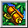

  

A PSP version exclusive dungeon where only grass, scrolls, and torches can be found on the ground. Food, arrows, and rocks can only be obtained from monster drops, and equipment doesn't appear. Revival Grass is rare, so you could say it's a thrilling dungeon where game overs can occur at any moment. Overall, the idea is to safely cycle time of day during the day, and rush stairs at night.

<ul class="quickLinksUL">
  <li><a href="#overview">Overview</a></li>
  <li><a href="#strategy">Strategy</a></li>
  <li><a href="#floor-guide">Floor Guide</a></li>
  <li><a href="#monsters">Monsters</a></li>
  <li><a href="#items">Items</a></li>
  <li><a href="#traps">Traps</a></li>
</ul>

# Overview

<table class="dungeonOverview">
  <tr>
    <th>Unlock</th>
    <td class="highlightYellow">Go to Novice House after clearing the main story.</td>
  </tr>
  <tr>
    <th>Entrance</th>
    <td class="highlightYellow">Boronga Village (Old Man in Novice House)</td>
  </tr>
</table>

<table class="dungeonTable">
  <tr>
    <th>Floors</th>
    <td>99F</td>
    <th>Day / Night</th>
    <td>Both</td>
  </tr>
  <tr>
    <th>Bring Items</th>
    <td>No</td>
    <th>Allies</th>
    <td>No</td>
  </tr>
  <tr>
    <th>Unidentified</th>
    <td colspan="3">None</td>
  </tr>
  <tr>
    <th>Shops</th>
    <td>Regular</td>
    <th>Monster Houses</th>
    <td>Regular, Special, Sudden</td>
  </tr>
  <tr>
    <th>Initial Enemies</th>
    <td>7~10</td>
    <th>Spawn Rate</th>
    <td>30 day / 20 night</td>
  </tr>
  <tr>
    <th>Day Turns</th>
    <td>968 (852)</td>
    <th>Night Turns</th>
    <td>587 (517)</td>
  </tr>
  <tr>
    <th>Ominous aura</th>
    <td>No</td>
    <th>Winds of Kron</th>
    <td>1st: 1200 / 4th: 1500</td>
  </tr>
  <tr>
    <th>Clear Icon</th>
    <td class="clearIcon"></td>
    <th>Clear Bonus</th>
    <td>50,000,000</td>
  </tr>
  <tr>
    <th>Reward</th>
    <td colspan="3">Bind Bracelet</td>
  </tr>
</table>

※ Numbers in () for day and night turns is when the warning is displayed.

# Strategy

<ul class="quickLinksUL">
  <li><a href="#general">General</a></li>
  <li><a href="#cycling-to-night">Cycling to Night</a></li>
  <li><a href="#abilities">Abilities</a></li>
  <li><a href="#useful-items">Useful Items</a></li>
  <li><a href="#ideal-inventory-(50f)">Ideal Inventory (50F)</a></li>
</ul>

### General

Equipment can't be found, so you'll quickly reach a point where you can't keep up with daytime monsters. This means you need to figure out a safe way to cycle time of day and progress through the dungeon at night. The only item categories you can find on the ground or in shops are torches, grass, and scrolls. Torches are always either Fine Torch or Super Torch, and monsters with auras don't appear. Like other dungeons, stairs are never located in rooms that have doors.

Day / night lasts 968 / 587 turns, and it switches 116 / 70 turns after the warning is displayed. 

Fixer Scroll, Night-Day Scroll, and Navigation Scroll are the 3 key scrolls in this dungeon. Fixer and Night-Day scrolls are uncommon on the ground, so you'll likely need to buy them from shops. Since Gitan can't be found on the ground, you'll need to keep some higher value items on hand to sell, such as Imabikiso, Amnesia Grass, and Disaster Seed. (Fixer and Night-Day scrolls cost 1000G each). Fixer Scroll can be read when you're at 0 Gitan to obtain about 4000 Gitan.

#### Exploring at Night

Basic guidelines:

- Descend stairs unless there's a shop.
    - There's no reason to linger unless you happen to see a shop after reading a Navigation Scroll.
- Keep a torch equipped at night.
    - Equip a fresh torch or read a Navigation Scroll if your torch dims to a 1 tile radius.
    - If you're out of torches and Navigation Scrolls, carefully step in place in a hallway until daytime.
- Equipped torches hint at how long night lasts.
    - Fine Torch dims → Equip new Fine Torch → Fine Torch dims → It'll be daytime in a bit.
    - Super Torch dims twice → It'll be daytime in a bit.
- Throw an equipped torch at a Mixer type monster to refresh the torch.
    - The torch the Mixer type drops will have the same radius and duration as a brand new torch.
    - Floors: Dark Mixer - 21\~25F, Dark Mixergon - 67\~71F, Dark Mixerdon - 93\~97F

### Cycling to Night

The safest and easiest method to change time of day to night is to read a Night-Day Scroll. However, you'll want to save these for floors where monsters that inhibit time cycling appear during daytime. You'll also need 4\~6 of these scrolls along with Super Torches to rush stairs between 50\~99F.

The next best method is to use a Fixer Scroll to paralyze enemies to create a safe area. The paralysis effect occurs when 2 or more monsters are adjacent to you, which can be accomplished by walking in hallways until you get sandwiched by 2 monsters - Navigation Scroll makes this easier. ※ This method can't be used on floors where Pumphantasm types appear.

Other options include Sanctuary Scroll, using frozen Explochin type monsters to block off a hallway, or Desert Scroll + Navigation Scroll to locate areas where monsters are unlikely to enter. Defeat single enemies as needed using Fear Scroll or Slumber Scroll if using the last method.

#### Pumphantasm Floors

These are the floors where you can't safely cycle to night without a Night-Day Scroll. ※ Absorbiphant types don't appear during the day.

- Pumphantasm - 15\~18F
- Pumphantom - 30\~34F
- Pumpanshee - 71\~75F
- Pumptergeist - 90\~94F

### Abilities

See [Abilities](/system/necklace-abilities) for details. ※ Never include Cluster Confusion in this dungeon.

#### Basic

- Room Cyclone x 2
- Kaboom Bullet x 6

#### More Utility

- Room Cyclone x 2
- Kaboom Bullet x 4\~5
- (Three Screams x 1\~2 or Bi-Direction Warp x 1\~2 or Darkroom x 1)

### Useful Items

Storage Pots can't be found, so you only have 24 inventory slots.

#### Torch

- Super Torch
    - Carry up to 8 of these at any given time.
    - Can be used to light up hallways during the day if needed.
- Fine Torch
    - Keep these on hand if you're down to 3 torches in your inventory.

#### Grass

- Otogiriso, Heal
    - Helps you recover HP if you happen to survive a night monster's direct attack.
    - Keep 2 Heal Grass on hand at all times.
- Swift, Warp
    - Both of these help you escape from bad situations.
    - Keep 1 of each on hand at all times.
- Sight
    - Nice for Stairs? Traps that appear starting on 91F.
    - It's also fine to eat these as you find them on the ground, though.
- Poison
    - Throw it at a monster in a special door room to safely cycle to night.
- Rage
    - Throw it at a Pit Mamel (2-4F), then hunt the Cave Mamel to level up a bit early on.
- Imabikiso, Amnesia, Disaster
    - Sell these to be able to afford 1000G scrolls.
    - Imabikiso can also be thrown to seal a monster.
- Sleep, Dizzy, Blind
    - Not really worth carrying, since thrown items have low accuracy.

#### Scroll

- Night-Day
    - Do your best to save these until 50F instead of using them early on.
    - Unless you're very lucky, 5 of these is usually enough to keep it nighttime between 50\~99F.
- Fixer
    - Restores HP, replenishes fullness, counters Summon Trap, can be used to cycle to night, etc.
- Navigation
    - Great for DJ Mage and Tiger Tosser type floors, large Monster Houses, cycling to night, etc.
- Replenish
    - Sometimes needed if you take a long time to locate the stairs on a floor.
- Banana
    - Read it on an unneeded item and eat the banana on the spot instead of carrying these scrolls.
- Trap Erase
    - Nice for Stairs? Traps that appear starting on 91F.
    - It's also fine to read these as you find them on the ground, though.
- Confusion
    - Nice option to escape if you run out of ability uses at night.
- Slumber
    - Nice option to dash to the stairs if you run out of ability uses at night.
    - Can be used to counter Summon Trap if you have 2 uses of Room Cyclone left.
- Fear
    - Counters Summon Trap.
- Air Slash
    - Usable early game, but otherwise it's only useful to check if monsters are in a room at night.
- Desert
    - Not useful at night, but might let you safely cycle to night depending on the map.

### Ideal Inventory (50F)

Aim to get as close to this set of items by 50F as possible.

- Super Torch x 6 (Including equipped)
- Heal Grass x 2
- Swift Grass
- Warp Grass
- Night-Day Scroll x 5
- Navigation Scroll x 2
- Replenish Scroll x 2
- Slumber Scroll
- Fixer Scroll
- Banana Scroll
- Confusion Scroll
- Fear Scroll

# Floor Guide

The main idea is to progress through the dungeon at night, so there isn't a whole lot to say about each floor. The most important thing is to understand the basics of night gameplay, which was covered earlier.

### 1-4F

#### 1F

Check rooms for items, then hurry to the stairs.

#### 2-4F

Continue to check rooms for items, then hurry to the stairs. If you find Rage Grass or Fear Scroll, create a Cave Mamel and hunt it using Dragon Grass or Air Slash Scroll.

### 5-14F

If you didn't hunt a Cave Mamel, you'll struggle during the day from around Kumonigiri (8-11F) floors. Do your best not to get items cursed by Curse Girl (8-11F).

### 15-18F

Pumphantasm (15-18F) appears during the day, so it's not safe to cycle to night.

### 19-29F

Throw an equipped torch at a Dark Mixer (21-25F) to reset the torch to a brand new state. Consider hunting Bad Lime Zalokleft (22-26F) in hopes of obtaining blessed scrolls.

### 30-34F

Pumphantom (30-34F) appears during the day, so it's not safe to cycle to night.

### 35-50F

Dark MC Mage (39-43F) can be a threat at night. Scarabbit (42-46F) and Dark Scarabbit (46-50F) can cause accidents if they attract you.

### 51-70F

Switch to progressing at night from this point until you clear the dungeon.

Squid Emperor (51-55F) can blind you from anywhere in the room. Dark MC Wizard (61-65F) is a major threat at night, but it's usually still better than daytime.

Throw an equipped torch at a Dark Mixergon (67-71F) to reset the torch to a brand new state.

### 71-75F

Pumpanshee (71-75F) appears during the day, so it's not safe to cycle to night.

### 76-89F

Dark Ace (77-81F) can cause accidents at night by throwing other monsters at you. Dark MC Sorcerer (83-87F) is a pretty big threat, but should be easier than Dark MC Wizard earlier.

### 90-94F

Pumptergeist (90-94F) appears during the day, so it's not safe to cycle to night.

Stairs? Trap can be generated starting on 91F.

### 95-99F

Squid Kaiser (97-99F) and Dark Squid Kaiser (97-99F) can blind you from anywhere in the room.

Throw an equipped torch at a Dark Mixerdon (93-97F) to reset the torch to a brand new state.

# Monsters

See [Monsters](/system/monsters) for individual monster details.

Enemy Colors: Day Night Farming Useful Destroys Items Dangerous Very Dangerous

<table class="monsterTable">
  <thead>
    <tr>
      <th>F</th>
      <th colspan="5">Monsters</th>
    </tr>
  </thead>
  <tbody>
    <tr>
      <th rowspan="2">1</th>
      <td class="monsterDay">Mamel</td>
      <td class="highlightGray"></td>
      <td class="monsterDay">Seedie</td>
      <td class="highlightGray"></td>
      <td class="highlightGray"></td>
    </tr>
    <tr>
      <td class="monsterNight">Foul Novice</td>
      <td class="monsterNight">Dark Seedie</td>
      <td class="highlightGray"></td>
      <td class="highlightGray"></td>
      <td class="highlightGray"></td>
    </tr>
    <tr>
      <th rowspan="2">2</th>
      <td class="monsterDay">Mamel</td>
      <td class="monsterDay">Chintala</td>
      <td class="monsterDay">Seedie</td>
      <td class="highlightGray"></td>
      <td class="monsterDay">Pit Mamel</td>
    </tr>
    <tr>
      <td class="monsterNight">Foul Novice</td>
      <td class="monsterNight">Dark Seedie</td>
      <td class="monsterNight">Dark Blade Bee</td>
      <td class="highlightGray"></td>
      <td class="highlightGray"></td>
    </tr>
    <tr>
      <th rowspan="2">3</th>
      <td class="monsterDay">Hopodile</td>
      <td class="monsterDay">Chintala</td>
      <td class="monsterDay">Seedie</td>
      <td class="highlightGray"></td>
      <td class="monsterDay">Pit Mamel</td>
    </tr>
    <tr>
      <td class="monsterNight">Foul Novice</td>
      <td class="monsterNight">Dark Seedie</td>
      <td class="monsterNight">Dark Blade Bee</td>
      <td class="monsterNight">Dark Mamel</td>
      <td class="highlightGray"></td>
    </tr>
    <tr>
      <th rowspan="2">4</th>
      <td class="monsterDay">Hopodile</td>
      <td class="monsterDay">Chintala</td>
      <td class="monsterDay">Squid King</td>
      <td class="monsterDay">Banana Novice</td>
      <td class="monsterDay">Pit Mamel</td>
    </tr>
    <tr>
      <td class="monsterNight">Dark Mutaikon</td>
      <td class="monsterNight">Dark Seedie</td>
      <td class="monsterNight">Dark Blade Bee</td>
      <td class="monsterNight">Dark Mamel</td>
      <td class="highlightGray"></td>
    </tr>
    <tr>
      <th rowspan="2">5</th>
      <td class="monsterDay">Hopodile</td>
      <td class="monsterDay">Chintala</td>
      <td class="monsterDay">Squid King</td>
      <td class="monsterDay">Banana Novice</td>
      <td class="highlightGray"></td>
    </tr>
    <tr>
      <td class="monsterNight">Dark Mutaikon</td>
      <td class="monsterNight">Evil Chintala</td>
      <td class="monsterNight">Dark Blade Bee</td>
      <td class="monsterNight">Dark Mamel</td>
      <td class="highlightGray"></td>
    </tr>
    <tr>
      <th rowspan="2">6</th>
      <td class="monsterDay">Hopodile</td>
      <td class="monsterDay">Firepuff</td>
      <td class="monsterDay">Squid King</td>
      <td class="monsterDay">Banana Novice</td>
      <td class="highlightGray"></td>
    </tr>
    <tr>
      <td class="monsterNight">Dark Mutaikon</td>
      <td class="monsterNight">Evil Chintala</td>
      <td class="monsterNight">Dark Squid King</td>
      <td class="monsterNight">Dark Mamel</td>
      <td class="highlightGray"></td>
    </tr>
    <tr>
      <th rowspan="2">7</th>
      <td class="monsterDay">Blade Bee</td>
      <td class="monsterDay">Firepuff</td>
      <td class="monsterDay">Squid King</td>
      <td class="monsterDay">Banana Novice</td>
      <td class="highlightGray"></td>
    </tr>
    <tr>
      <td class="monsterNight">Dark Mutaikon</td>
      <td class="monsterNight">Evil Chintala</td>
      <td class="monsterNight">Dark Squid King</td>
      <td class="monsterNight">Evil Hopodile</td>
      <td class="highlightGray"></td>
    </tr>
    <tr>
      <th rowspan="2">8</th>
      <td class="monsterDay">Blade Bee</td>
      <td class="monsterDay">Firepuff</td>
      <td class="itemDay monsterDay">Curse Girl</td>
      <td class="monsterDay">Kumonigiri</td>
      <td class="highlightGray"></td>
    </tr>
    <tr>
      <td class="monsterNight">Evil Gazer</td>
      <td class="monsterNight">Evil Chintala</td>
      <td class="monsterNight">Dark Squid King</td>
      <td class="monsterNight">Evil Hopodile</td>
      <td class="highlightGray"></td>
    </tr>
    <tr>
      <th rowspan="2">9</th>
      <td class="monsterDay">Blade Bee</td>
      <td class="monsterDay">Firepuff</td>
      <td class="itemDay monsterDay">Curse Girl</td>
      <td class="monsterDay">Kumonigiri</td>
      <td class="highlightGray"></td>
    </tr>
    <tr>
      <td class="monsterNight">Evil Gazer</td>
      <td class="monsterNight">Dark Boy Cart</td>
      <td class="monsterNight">Dark Squid King</td>
      <td class="monsterNight">Evil Hopodile</td>
      <td class="highlightGray"></td>
    </tr>
    <tr>
      <th rowspan="2">10</th>
      <td class="monsterDay">Blade Bee</td>
      <td class="monsterDay">Cheer Ham</td>
      <td class="itemDay monsterDay">Curse Girl</td>
      <td class="monsterDay">Kumonigiri</td>
      <td class="highlightGray"></td>
    </tr>
    <tr>
      <td class="monsterNight">Evil Gazer</td>
      <td class="monsterNight">Dark Boy Cart</td>
      <td class="dangerNight monsterNight">Dark Absorbiphant</td>
      <td class="monsterNight">Evil Hopodile</td>
      <td class="highlightGray"></td>
    </tr>
    <tr>
      <th rowspan="2">11</th>
      <td class="monsterDay">Scorpion</td>
      <td class="monsterDay">Cheer Ham</td>
      <td class="itemDay monsterDay">Curse Girl</td>
      <td class="monsterDay">Kumonigiri</td>
      <td class="highlightGray"></td>
    </tr>
    <tr>
      <td class="monsterNight">Evil Gazer</td>
      <td class="monsterNight">Dark Boy Cart</td>
      <td class="dangerNight monsterNight">Dark Absorbiphant</td>
      <td class="monsterNight">Dark Eligan</td>
      <td class="highlightGray"></td>
    </tr>
    <tr>
      <th rowspan="2">12</th>
      <td class="monsterDay">Scorpion</td>
      <td class="monsterDay">Cheer Ham</td>
      <td class="monsterDay">Tiger Tosser</td>
      <td class="monsterDay">Yanpii</td>
      <td class="highlightGray"></td>
    </tr>
    <tr>
      <td class="monsterNight">Dark Pit Mamel</td>
      <td class="monsterNight">Dark Boy Cart</td>
      <td class="dangerNight monsterNight">Dark Absorbiphant</td>
      <td class="monsterNight">Dark Eligan</td>
      <td class="highlightGray"></td>
    </tr>
    <tr>
      <th rowspan="2">13</th>
      <td class="monsterDay">Scorpion</td>
      <td class="monsterDay">Cheer Ham</td>
      <td class="monsterDay">Tiger Tosser</td>
      <td class="monsterDay">Yanpii</td>
      <td class="highlightGray"></td>
    </tr>
    <tr>
      <td class="monsterNight">Dark Pit Mamel</td>
      <td class="monsterNight">Dark Zapdon</td>
      <td class="dangerNight monsterNight">Dark Absorbiphant</td>
      <td class="monsterNight">Dark Eligan</td>
      <td class="highlightGray"></td>
    </tr>
    <tr>
      <th rowspan="2">14</th>
      <td class="monsterDay">Scorpion</td>
      <td class="monsterDay">Mutaikon</td>
      <td class="monsterDay">Tiger Tosser</td>
      <td class="monsterDay">Yanpii</td>
      <td class="highlightGray"></td>
    </tr>
    <tr>
      <td class="monsterNight">Dark Pit Mamel</td>
      <td class="monsterNight">Dark Zapdon</td>
      <td class="monsterNight">Bad Sr. Yanpii</td>
      <td class="monsterNight">Dark Eligan</td>
      <td class="highlightGray"></td>
    </tr>
    <tr>
      <th rowspan="2">15</th>
      <td class="extremeDay monsterDay">Pumphantasm</td>
      <td class="monsterDay">Mutaikon</td>
      <td class="monsterDay">Tiger Tosser</td>
      <td class="monsterDay">Yanpii</td>
      <td class="highlightGray"></td>
    </tr>
    <tr>
      <td class="monsterNight">Dark Pit Mamel</td>
      <td class="monsterNight">Dark Zapdon</td>
      <td class="monsterNight">Bad Sr. Yanpii</td>
      <td class="monsterNight">Dark DJ Mage</td>
      <td class="highlightGray"></td>
    </tr>
    <tr>
      <th rowspan="2">16</th>
      <td class="extremeDay monsterDay">Pumphantasm</td>
      <td class="monsterDay">Mutaikon</td>
      <td class="monsterDay">Gyadon</td>
      <td class="dangerDay monsterDay">Spin Polygon</td>
      <td class="highlightGray"></td>
    </tr>
    <tr>
      <td class="monsterNight">Evil Gyaza</td>
      <td class="monsterNight">Dark Zapdon</td>
      <td class="monsterNight">Bad Sr. Yanpii</td>
      <td class="monsterNight">Dark DJ Mage</td>
      <td class="highlightGray"></td>
    </tr>
    <tr>
      <th rowspan="2">17</th>
      <td class="extremeDay monsterDay">Pumphantasm</td>
      <td class="monsterDay">Mutaikon</td>
      <td class="monsterDay">Gyadon</td>
      <td class="dangerDay monsterDay">Spin Polygon</td>
      <td class="highlightGray"></td>
    </tr>
    <tr>
      <td class="monsterNight">Evil Gyaza</td>
      <td class="monsterNight">Foul Curse Girl</td>
      <td class="monsterNight">Bad Sr. Yanpii</td>
      <td class="monsterNight">Dark DJ Mage</td>
      <td class="highlightGray"></td>
    </tr>
    <tr>
      <th rowspan="2">18</th>
      <td class="extremeDay monsterDay">Pumphantasm</td>
      <td class="monsterDay">Dagger Bee</td>
      <td class="monsterDay">Gyadon</td>
      <td class="dangerDay monsterDay">Spin Polygon</td>
      <td class="highlightGray"></td>
    </tr>
    <tr>
      <td class="monsterNight">Evil Gyaza</td>
      <td class="monsterNight">Foul Curse Girl</td>
      <td class="monsterNight">Dark Pop Tank</td>
      <td class="monsterNight">Dark DJ Mage</td>
      <td class="highlightGray"></td>
    </tr>
    <tr>
      <th rowspan="2">19</th>
      <td class="monsterDay">Kengo</td>
      <td class="monsterDay">Dagger Bee</td>
      <td class="monsterDay">Gyadon</td>
      <td class="dangerDay monsterDay">Spin Polygon</td>
      <td class="highlightGray"></td>
    </tr>
    <tr>
      <td class="monsterNight">Evil Gyaza</td>
      <td class="monsterNight">Foul Curse Girl</td>
      <td class="monsterNight">Dark Pop Tank</td>
      <td class="monsterNight">Vile Pumphantasm</td>
      <td class="highlightGray"></td>
    </tr>
    <tr>
      <th rowspan="2">20</th>
      <td class="monsterDay">Kengo</td>
      <td class="monsterDay">Dagger Bee</td>
      <td class="monsterDay">Flamepuff</td>
      <td class="monsterDay">Squid Lord</td>
      <td class="highlightGray"></td>
    </tr>
    <tr>
      <td class="monsterNight">Dark Traproid</td>
      <td class="monsterNight">Foul Curse Girl</td>
      <td class="monsterNight">Dark Pop Tank</td>
      <td class="monsterNight">Vile Pumphantasm</td>
      <td class="highlightGray"></td>
    </tr>
    <tr>
      <th rowspan="2">21</th>
      <td class="monsterDay">Kengo</td>
      <td class="monsterDay">Dagger Bee</td>
      <td class="monsterDay">Flamepuff</td>
      <td class="monsterDay">Squid Lord</td>
      <td class="highlightGray"></td>
    </tr>
    <tr>
      <td class="monsterNight">Dark Traproid</td>
      <td class="usefulNight monsterNight">Dark Mixer</td>
      <td class="monsterNight">Dark Pop Tank</td>
      <td class="monsterNight">Vile Pumphantasm</td>
      <td class="highlightGray"></td>
    </tr>
    <tr>
      <th rowspan="2">22</th>
      <td class="monsterDay">Kengo</td>
      <td class="monsterDay">Go Ham</td>
      <td class="monsterDay">Flamepuff</td>
      <td class="monsterDay">Squid Lord</td>
      <td class="highlightGray"></td>
    </tr>
    <tr>
      <td class="monsterNight">Dark Traproid</td>
      <td class="usefulNight monsterNight">Dark Mixer</td>
      <td class="farmingNight monsterNight">Bad Lime Zalokleft</td>
      <td class="monsterNight">Vile Pumphantasm</td>
      <td class="highlightGray"></td>
    </tr>
    <tr>
      <th rowspan="2">23</th>
      <td class="monsterDay">Mid Chintala</td>
      <td class="monsterDay">Go Ham</td>
      <td class="monsterDay">Flamepuff</td>
      <td class="monsterDay">Squid Lord</td>
      <td class="highlightGray"></td>
    </tr>
    <tr>
      <td class="monsterNight">Dark Traproid</td>
      <td class="usefulNight monsterNight">Dark Mixer</td>
      <td class="farmingNight monsterNight">Bad Lime Zalokleft</td>
      <td class="monsterNight">Evil Dance Polygon</td>
      <td class="highlightGray"></td>
    </tr>
    <tr>
      <th rowspan="2">24</th>
      <td class="monsterDay">Mid Chintala</td>
      <td class="monsterDay">Go Ham</td>
      <td class="monsterDay">Hipadile</td>
      <td class="monsterDay">Zalokleft</td>
      <td class="highlightGray"></td>
    </tr>
    <tr>
      <td class="monsterNight">Evil Super Gazer</td>
      <td class="usefulNight monsterNight">Dark Mixer</td>
      <td class="farmingNight monsterNight">Bad Lime Zalokleft</td>
      <td class="monsterNight">Evil Dance Polygon</td>
      <td class="highlightGray"></td>
    </tr>
    <tr>
      <th rowspan="2">25</th>
      <td class="monsterDay">Mid Chintala</td>
      <td class="monsterDay">Go Ham</td>
      <td class="monsterDay">Hipadile</td>
      <td class="monsterDay">Zalokleft</td>
      <td class="highlightGray"></td>
    </tr>
    <tr>
      <td class="monsterNight">Evil Super Gazer</td>
      <td class="usefulNight monsterNight">Dark Mixer</td>
      <td class="farmingNight monsterNight">Bad Lime Zalokleft</td>
      <td class="monsterNight">Evil Dance Polygon</td>
      <td class="highlightGray"></td>
    </tr>
    <tr>
      <th rowspan="2">26</th>
      <td class="monsterDay">Mid Chintala</td>
      <td class="itemDay monsterDay">Curse Sister</td>
      <td class="monsterDay">Hipadile</td>
      <td class="monsterDay">Zalokleft</td>
      <td class="highlightGray"></td>
    </tr>
    <tr>
      <td class="monsterNight">Evil Super Gazer</td>
      <td class="monsterNight">Evil Hipadile</td>
      <td class="farmingNight monsterNight">Bad Lime Zalokleft</td>
      <td class="monsterNight">Evil Dance Polygon</td>
      <td class="highlightGray"></td>
    </tr>
    <tr>
      <th rowspan="2">27</th>
      <td class="usefulDay monsterDay">Concusschin</td>
      <td class="itemDay monsterDay">Curse Sister</td>
      <td class="monsterDay">Hipadile</td>
      <td class="monsterDay">Zalokleft</td>
      <td class="highlightGray"></td>
    </tr>
    <tr>
      <td class="monsterNight">Evil Super Gazer</td>
      <td class="monsterNight">Evil Hipadile</td>
      <td class="monsterNight">Dark Squid Lord</td>
      <td class="monsterNight">Evil Dance Polygon</td>
      <td class="highlightGray"></td>
    </tr>
    <tr>
      <th rowspan="2">28</th>
      <td class="usefulDay monsterDay">Concusschin</td>
      <td class="itemDay monsterDay">Curse Sister</td>
      <td class="dangerDay monsterDay">Super Gazer</td>
      <td class="monsterDay">Eligan</td>
      <td class="highlightGray"></td>
    </tr>
    <tr>
      <td class="monsterNight">Evil Super Gazer</td>
      <td class="monsterNight">Evil Hipadile</td>
      <td class="monsterNight">Dark Squid Lord</td>
      <td class="monsterNight">Dark Hurler</td>
      <td class="highlightGray"></td>
    </tr>
    <tr>
      <th rowspan="2">29</th>
      <td class="usefulDay monsterDay">Concusschin</td>
      <td class="itemDay monsterDay">Curse Sister</td>
      <td class="dangerDay monsterDay">Super Gazer</td>
      <td class="monsterDay">Eligan</td>
      <td class="highlightGray"></td>
    </tr>
    <tr>
      <td class="monsterNight">Dark Pandanigiri</td>
      <td class="monsterNight">Evil Hipadile</td>
      <td class="monsterNight">Dark Squid Lord</td>
      <td class="monsterNight">Dark Hurler</td>
      <td class="highlightGray"></td>
    </tr>
    <tr>
      <th rowspan="2">30</th>
      <td class="usefulDay monsterDay">Concusschin</td>
      <td class="extremeDay monsterDay">Pumphantom</td>
      <td class="dangerDay monsterDay">Super Gazer</td>
      <td class="monsterDay">Eligan</td>
      <td class="highlightGray"></td>
    </tr>
    <tr>
      <td class="monsterNight">Dark Pandanigiri</td>
      <td class="monsterNight">Evil Hipadile</td>
      <td class="monsterNight">Dark Squid Lord</td>
      <td class="monsterNight">Dark Hurler</td>
      <td class="highlightGray"></td>
    </tr>
    <tr>
      <th rowspan="2">31</th>
      <td class="monsterDay">Banana Morph</td>
      <td class="extremeDay monsterDay">Pumphantom</td>
      <td class="dangerDay monsterDay">Super Gazer</td>
      <td class="monsterDay">Eligan</td>
      <td class="highlightGray"></td>
    </tr>
    <tr>
      <td class="monsterNight">Dark Pandanigiri</td>
      <td class="monsterNight">Dark Beanie</td>
      <td class="monsterNight">Dark Squid Lord</td>
      <td class="monsterNight">Dark Hurler</td>
      <td class="highlightGray"></td>
    </tr>
    <tr>
      <th rowspan="2">32</th>
      <td class="monsterDay">Banana Morph</td>
      <td class="extremeDay monsterDay">Pumphantom</td>
      <td class="monsterDay">Chainhead</td>
      <td class="monsterDay">Glare Bird</td>
      <td class="highlightGray"></td>
    </tr>
    <tr>
      <td class="monsterNight">Dark Pandanigiri</td>
      <td class="monsterNight">Dark Beanie</td>
      <td class="monsterNight">Dark Eligagan</td>
      <td class="monsterNight">Dark Hurler</td>
      <td class="highlightGray"></td>
    </tr>
    <tr>
      <th rowspan="2">33</th>
      <td class="monsterDay">Banana Morph</td>
      <td class="extremeDay monsterDay">Pumphantom</td>
      <td class="monsterDay">Chainhead</td>
      <td class="monsterDay">Glare Bird</td>
      <td class="highlightGray"></td>
    </tr>
    <tr>
      <td class="monsterNight">Dark Pandanigiri</td>
      <td class="monsterNight">Dark Beanie</td>
      <td class="monsterNight">Dark Eligagan</td>
      <td class="dangerNight monsterNight">Dark Grampa Tank</td>
      <td class="highlightGray"></td>
    </tr>
    <tr>
      <th rowspan="2">34</th>
      <td class="monsterDay">Banana Morph</td>
      <td class="extremeDay monsterDay">Pumphantom</td>
      <td class="monsterDay">Chainhead</td>
      <td class="monsterDay">Glare Bird</td>
      <td class="highlightGray"></td>
    </tr>
    <tr>
      <td class="monsterNight">Dark Dagger Bee</td>
      <td class="monsterNight">Dark Beanie</td>
      <td class="monsterNight">Dark Eligagan</td>
      <td class="dangerNight monsterNight">Dark Grampa Tank</td>
      <td class="highlightGray"></td>
    </tr>
    <tr>
      <th rowspan="2">35</th>
      <td class="monsterDay">Banana Morph</td>
      <td class="monsterDay">Voltdon</td>
      <td class="monsterDay">Chainhead</td>
      <td class="monsterDay">Glare Bird</td>
      <td class="highlightGray"></td>
    </tr>
    <tr>
      <td class="monsterNight">Dark Dagger Bee</td>
      <td class="monsterNight">Dark Beanie</td>
      <td class="monsterNight">Dark Eligagan</td>
      <td class="dangerNight monsterNight">Dark Grampa Tank</td>
      <td class="highlightGray"></td>
    </tr>
    <tr>
      <th rowspan="2">36</th>
      <td class="monsterDay">Dance Polygon</td>
      <td class="monsterDay">Voltdon</td>
      <td class="monsterDay">Chainhead</td>
      <td class="monsterDay">Glare Bird</td>
      <td class="highlightGray"></td>
    </tr>
    <tr>
      <td class="monsterNight">Dark Dagger Bee</td>
      <td class="monsterNight">Evil Flamepuff</td>
      <td class="monsterNight">Dark Eligagan</td>
      <td class="dangerNight monsterNight">Dark Grampa Tank</td>
      <td class="highlightGray"></td>
    </tr>
    <tr>
      <th rowspan="2">37</th>
      <td class="monsterDay">Dance Polygon</td>
      <td class="monsterDay">Voltdon</td>
      <td class="monsterDay">Cave Mamel</td>
      <td class="monsterDay">Tiger Hurler</td>
      <td class="highlightGray"></td>
    </tr>
    <tr>
      <td class="monsterNight">Dark Dagger Bee</td>
      <td class="monsterNight">Evil Flamepuff</td>
      <td class="dangerNight monsterNight">Dark Digestiphant</td>
      <td class="dangerNight monsterNight">Dark Grampa Tank</td>
      <td class="highlightGray"></td>
    </tr>
    <tr>
      <th rowspan="2">38</th>
      <td class="monsterDay">Dance Polygon</td>
      <td class="monsterDay">Voltdon</td>
      <td class="monsterDay">Cave Mamel</td>
      <td class="monsterDay">Tiger Hurler</td>
      <td class="highlightGray"></td>
    </tr>
    <tr>
      <td class="monsterNight">Dark Dagger Bee</td>
      <td class="monsterNight">Evil Flamepuff</td>
      <td class="dangerNight monsterNight">Dark Digestiphant</td>
      <td class="monsterNight">Bad Sr. Yanpii</td>
      <td class="highlightGray"></td>
    </tr>
    <tr>
      <th rowspan="2">39</th>
      <td class="monsterDay">Dance Polygon</td>
      <td class="monsterDay">Voltdon</td>
      <td class="monsterDay">Cave Mamel</td>
      <td class="monsterDay">Tiger Hurler</td>
      <td class="highlightGray"></td>
    </tr>
    <tr>
      <td class="dangerNight monsterNight">Dark MC Mage</td>
      <td class="monsterNight">Evil Flamepuff</td>
      <td class="dangerNight monsterNight">Dark Digestiphant</td>
      <td class="monsterNight">Bad Sr. Yanpii</td>
      <td class="highlightGray"></td>
    </tr>
    <tr>
      <th rowspan="2">40</th>
      <td class="monsterDay">Dance Polygon</td>
      <td class="monsterDay">Blazepuff</td>
      <td class="monsterDay">Cave Mamel</td>
      <td class="monsterDay">Tiger Hurler</td>
      <td class="highlightGray"></td>
    </tr>
    <tr>
      <td class="dangerNight monsterNight">Dark MC Mage</td>
      <td class="monsterNight">Evil Flamepuff</td>
      <td class="dangerNight monsterNight">Dark Digestiphant</td>
      <td class="monsterNight">Bad Sr. Yanpii</td>
      <td class="highlightGray"></td>
    </tr>
    <tr>
      <th rowspan="2">41</th>
      <td class="itemDay monsterDay">Gyairas</td>
      <td class="monsterDay">Blazepuff</td>
      <td class="monsterDay">Cave Mamel</td>
      <td class="monsterDay">Tiger Hurler</td>
      <td class="highlightGray"></td>
    </tr>
    <tr>
      <td class="dangerNight monsterNight">Dark MC Mage</td>
      <td class="monsterNight">Foul Boss</td>
      <td class="dangerNight monsterNight">Dark Digestiphant</td>
      <td class="monsterNight">Bad Sr. Yanpii</td>
      <td class="highlightGray"></td>
    </tr>
    <tr>
      <th rowspan="2">42</th>
      <td class="itemDay monsterDay">Gyairas</td>
      <td class="monsterDay">Blazepuff</td>
      <td class="extremeDay monsterDay">Scarabbit</td>
      <td class="monsterDay">Nuttie</td>
      <td class="highlightGray"></td>
    </tr>
    <tr>
      <td class="dangerNight monsterNight">Dark MC Mage</td>
      <td class="monsterNight">Foul Boss</td>
      <td class="monsterNight">Mean Go Ham</td>
      <td class="monsterNight">Bad Sr. Yanpii</td>
      <td class="highlightGray"></td>
    </tr>
    <tr>
      <th rowspan="2">43</th>
      <td class="itemDay monsterDay">Gyairas</td>
      <td class="monsterDay">Blazepuff</td>
      <td class="extremeDay monsterDay">Scarabbit</td>
      <td class="monsterDay">Nuttie</td>
      <td class="highlightGray"></td>
    </tr>
    <tr>
      <td class="dangerNight monsterNight">Dark MC Mage</td>
      <td class="monsterNight">Foul Boss</td>
      <td class="monsterNight">Mean Go Ham</td>
      <td class="monsterNight">Vile Demon Scorp</td>
      <td class="highlightGray"></td>
    </tr>
    <tr>
      <th rowspan="2">44</th>
      <td class="itemDay monsterDay">Gyairas</td>
      <td class="monsterDay">Blazepuff</td>
      <td class="extremeDay monsterDay">Scarabbit</td>
      <td class="monsterDay">Nuttie</td>
      <td class="highlightGray"></td>
    </tr>
    <tr>
      <td class="monsterNight">Dark Glare Bird</td>
      <td class="monsterNight">Foul Boss</td>
      <td class="monsterNight">Mean Go Ham</td>
      <td class="monsterNight">Vile Demon Scorp</td>
      <td class="highlightGray"></td>
    </tr>
    <tr>
      <th rowspan="2">45</th>
      <td class="itemDay monsterDay">Gyairas</td>
      <td class="monsterDay">Falcon Tengu</td>
      <td class="extremeDay monsterDay">Scarabbit</td>
      <td class="monsterDay">Nuttie</td>
      <td class="highlightGray"></td>
    </tr>
    <tr>
      <td class="monsterNight">Dark Glare Bird</td>
      <td class="monsterNight">Foul Boss</td>
      <td class="monsterNight">Mean Go Ham</td>
      <td class="monsterNight">Vile Demon Scorp</td>
      <td class="highlightGray"></td>
    </tr>
    <tr>
      <th rowspan="2">46</th>
      <td class="monsterDay">Iai</td>
      <td class="monsterDay">Falcon Tengu</td>
      <td class="extremeDay monsterDay">Scarabbit</td>
      <td class="monsterDay">Nuttie</td>
      <td class="highlightGray"></td>
    </tr>
    <tr>
      <td class="monsterNight">Dark Glare Bird</td>
      <td class="dangerNight monsterNight">Dark Scarabbit</td>
      <td class="monsterNight">Mean Go Ham</td>
      <td class="monsterNight">Vile Demon Scorp</td>
      <td class="highlightGray"></td>
    </tr>
    <tr>
      <th rowspan="2">47</th>
      <td class="monsterDay">Iai</td>
      <td class="monsterDay">Falcon Tengu</td>
      <td class="monsterDay">Rally Ham</td>
      <td class="monsterDay">Lt. Yanpii</td>
      <td class="highlightGray"></td>
    </tr>
    <tr>
      <td class="monsterNight">Dark Glare Bird</td>
      <td class="dangerNight monsterNight">Dark Scarabbit</td>
      <td class="monsterNight">Evil Oingodile</td>
      <td class="monsterNight">Vile Demon Scorp</td>
      <td class="highlightGray"></td>
    </tr>
    <tr>
      <th rowspan="2">48</th>
      <td class="monsterDay">Iai</td>
      <td class="monsterDay">Falcon Tengu</td>
      <td class="monsterDay">Rally Ham</td>
      <td class="monsterDay">Lt. Yanpii</td>
      <td class="highlightGray"></td>
    </tr>
    <tr>
      <td class="monsterNight">Dark Glare Bird</td>
      <td class="dangerNight monsterNight">Dark Scarabbit</td>
      <td class="monsterNight">Evil Oingodile</td>
      <td class="monsterNight">Dark Onigirizzly</td>
      <td class="highlightGray"></td>
    </tr>
    <tr>
      <th rowspan="2">49</th>
      <td class="monsterDay">Iai</td>
      <td class="monsterDay">Falcon Tengu</td>
      <td class="monsterDay">Rally Ham</td>
      <td class="monsterDay">Lt. Yanpii</td>
      <td class="highlightGray"></td>
    </tr>
    <tr>
      <td class="monsterNight">Evil Sing Polygon</td>
      <td class="dangerNight monsterNight">Dark Scarabbit</td>
      <td class="monsterNight">Evil Oingodile</td>
      <td class="monsterNight">Dark Onigirizzly</td>
      <td class="highlightGray"></td>
    </tr>
    <tr>
      <th rowspan="2">50</th>
      <td class="monsterDay">Iai</td>
      <td class="monsterDay">Katana Bee</td>
      <td class="monsterDay">Rally Ham</td>
      <td class="monsterDay">Lt. Yanpii</td>
      <td class="highlightGray"></td>
    </tr>
    <tr>
      <td class="monsterNight">Evil Sing Polygon</td>
      <td class="dangerNight monsterNight">Dark Scarabbit</td>
      <td class="monsterNight">Evil Oingodile</td>
      <td class="monsterNight">Dark Onigirizzly</td>
      <td class="highlightGray"></td>
    </tr>
    <tr>
      <th rowspan="2">51</th>
      <td class="dangerDay monsterDay">Squid Emperor</td>
      <td class="monsterDay">Katana Bee</td>
      <td class="monsterDay">Rally Ham</td>
      <td class="monsterDay">Lt. Yanpii</td>
      <td class="highlightGray"></td>
    </tr>
    <tr>
      <td class="monsterNight">Evil Sing Polygon</td>
      <td class="monsterNight">Dark Steamroid</td>
      <td class="monsterNight">Evil Oingodile</td>
      <td class="monsterNight">Dark Onigirizzly</td>
      <td class="highlightGray"></td>
    </tr>
    <tr>
      <th rowspan="2">52</th>
      <td class="dangerDay monsterDay">Squid Emperor</td>
      <td class="monsterDay">Katana Bee</td>
      <td class="itemDay monsterDay">Curse Mom</td>
      <td class="monsterDay">Pandanigiri</td>
      <td class="highlightGray"></td>
    </tr>
    <tr>
      <td class="monsterNight">Evil Sing Polygon</td>
      <td class="monsterNight">Dark Steamroid</td>
      <td class="monsterNight">Vile Pumphantom</td>
      <td class="monsterNight">Dark Onigirizzly</td>
      <td class="highlightGray"></td>
    </tr>
    <tr>
      <th rowspan="2">53</th>
      <td class="dangerDay monsterDay">Squid Emperor</td>
      <td class="monsterDay">Katana Bee</td>
      <td class="itemDay monsterDay">Curse Mom</td>
      <td class="monsterDay">Pandanigiri</td>
      <td class="highlightGray"></td>
    </tr>
    <tr>
      <td class="monsterNight">Evil Sing Polygon</td>
      <td class="monsterNight">Dark Steamroid</td>
      <td class="monsterNight">Vile Pumphantom</td>
      <td class="monsterNight">Evil Big Chintala</td>
      <td class="highlightGray"></td>
    </tr>
    <tr>
      <th rowspan="2">54</th>
      <td class="dangerDay monsterDay">Squid Emperor</td>
      <td class="monsterDay">Katana Bee</td>
      <td class="itemDay monsterDay">Curse Mom</td>
      <td class="monsterDay">Pandanigiri</td>
      <td class="highlightGray"></td>
    </tr>
    <tr>
      <td class="monsterNight">Evil Hyper Gazer</td>
      <td class="monsterNight">Dark Steamroid</td>
      <td class="monsterNight">Vile Pumphantom</td>
      <td class="monsterNight">Evil Big Chintala</td>
      <td class="highlightGray"></td>
    </tr>
    <tr>
      <th rowspan="2">55</th>
      <td class="dangerDay monsterDay">Squid Emperor</td>
      <td class="monsterDay">Tiger Chucker</td>
      <td class="itemDay monsterDay">Curse Mom</td>
      <td class="monsterDay">Pandanigiri</td>
      <td class="highlightGray"></td>
    </tr>
    <tr>
      <td class="monsterNight">Evil Hyper Gazer</td>
      <td class="monsterNight">Dark Steamroid</td>
      <td class="monsterNight">Vile Pumphantom</td>
      <td class="monsterNight">Evil Big Chintala</td>
      <td class="highlightGray"></td>
    </tr>
    <tr>
      <th rowspan="2">56</th>
      <td class="monsterDay">Eligagan</td>
      <td class="monsterDay">Tiger Chucker</td>
      <td class="itemDay monsterDay">Curse Mom</td>
      <td class="monsterDay">Pandanigiri</td>
      <td class="highlightGray"></td>
    </tr>
    <tr>
      <td class="monsterNight">Evil Hyper Gazer</td>
      <td class="monsterNight">Foul Curse Mom</td>
      <td class="monsterNight">Vile Pumphantom</td>
      <td class="monsterNight">Evil Big Chintala</td>
      <td class="highlightGray"></td>
    </tr>
    <tr>
      <th rowspan="2">57</th>
      <td class="monsterDay">Eligagan</td>
      <td class="monsterDay">Tiger Chucker</td>
      <td class="dangerDay monsterDay">Banana Boss</td>
      <td class="dangerDay monsterDay">Sing Polygon</td>
      <td class="highlightGray"></td>
    </tr>
    <tr>
      <td class="monsterNight">Evil Hyper Gazer</td>
      <td class="monsterNight">Foul Curse Mom</td>
      <td class="monsterNight">Evil Blazepuff</td>
      <td class="monsterNight">Evil Big Chintala</td>
      <td class="highlightGray"></td>
    </tr>
    <tr>
      <th rowspan="2">58</th>
      <td class="monsterDay">Eligagan</td>
      <td class="monsterDay">Tiger Chucker</td>
      <td class="dangerDay monsterDay">Banana Boss</td>
      <td class="dangerDay monsterDay">Sing Polygon</td>
      <td class="highlightGray"></td>
    </tr>
    <tr>
      <td class="monsterNight">Evil Hyper Gazer</td>
      <td class="monsterNight">Foul Curse Mom</td>
      <td class="monsterNight">Evil Blazepuff</td>
      <td class="monsterNight">Evil Killer Gyaza</td>
      <td class="highlightGray"></td>
    </tr>
    <tr>
      <th rowspan="2">59</th>
      <td class="monsterDay">Eligagan</td>
      <td class="monsterDay">Tiger Chucker</td>
      <td class="dangerDay monsterDay">Banana Boss</td>
      <td class="dangerDay monsterDay">Sing Polygon</td>
      <td class="highlightGray"></td>
    </tr>
    <tr>
      <td class="dangerNight monsterNight">Dark Spongiderm</td>
      <td class="monsterNight">Foul Curse Mom</td>
      <td class="monsterNight">Evil Blazepuff</td>
      <td class="monsterNight">Evil Killer Gyaza</td>
      <td class="highlightGray"></td>
    </tr>
    <tr>
      <th rowspan="2">60</th>
      <td class="monsterDay">Eligagan</td>
      <td class="usefulDay monsterDay">Fulminachin</td>
      <td class="dangerDay monsterDay">Banana Boss</td>
      <td class="dangerDay monsterDay">Sing Polygon</td>
      <td class="highlightGray"></td>
    </tr>
    <tr>
      <td class="dangerNight monsterNight">Dark Spongiderm</td>
      <td class="monsterNight">Foul Curse Mom</td>
      <td class="monsterNight">Evil Blazepuff</td>
      <td class="monsterNight">Evil Killer Gyaza</td>
      <td class="highlightGray"></td>
    </tr>
    <tr>
      <th rowspan="2">61</th>
      <td class="monsterDay">Oingodile</td>
      <td class="usefulDay monsterDay">Fulminachin</td>
      <td class="dangerDay monsterDay">Banana Boss</td>
      <td class="dangerDay monsterDay">Sing Polygon</td>
      <td class="highlightGray"></td>
    </tr>
    <tr>
      <td class="dangerNight monsterNight">Dark Spongiderm</td>
      <td class="extremeNight monsterNight">Dark MC Wizard</td>
      <td class="monsterNight">Evil Blazepuff</td>
      <td class="monsterNight">Evil Killer Gyaza</td>
      <td class="highlightGray"></td>
    </tr>
    <tr>
      <th rowspan="2">62</th>
      <td class="monsterDay">Oingodile</td>
      <td class="usefulDay monsterDay">Fulminachin</td>
      <td class="monsterDay">Pyrepuff</td>
      <td class="dangerDay monsterDay">Hyper Gazer</td>
      <td class="highlightGray"></td>
    </tr>
    <tr>
      <td class="dangerNight monsterNight">Dark Spongiderm</td>
      <td class="extremeNight monsterNight">Dark MC Wizard</td>
      <td class="monsterNight">Dark Gigahead</td>
      <td class="monsterNight">Evil Killer Gyaza</td>
      <td class="highlightGray"></td>
    </tr>
    <tr>
      <th rowspan="2">63</th>
      <td class="monsterDay">Oingodile</td>
      <td class="usefulDay monsterDay">Fulminachin</td>
      <td class="monsterDay">Pyrepuff</td>
      <td class="dangerDay monsterDay">Hyper Gazer</td>
      <td class="highlightGray"></td>
    </tr>
    <tr>
      <td class="dangerNight monsterNight">Dark Spongiderm</td>
      <td class="extremeNight monsterNight">Dark MC Wizard</td>
      <td class="monsterNight">Dark Gigahead</td>
      <td class="monsterNight">Evil Shihan</td>
      <td class="highlightGray"></td>
    </tr>
    <tr>
      <th rowspan="2">64</th>
      <td class="monsterDay">Oingodile</td>
      <td class="usefulDay monsterDay">Fulminachin</td>
      <td class="monsterDay">Pyrepuff</td>
      <td class="dangerDay monsterDay">Hyper Gazer</td>
      <td class="highlightGray"></td>
    </tr>
    <tr>
      <td class="monsterNight">Dark Nuttie</td>
      <td class="extremeNight monsterNight">Dark MC Wizard</td>
      <td class="monsterNight">Dark Gigahead</td>
      <td class="monsterNight">Evil Shihan</td>
      <td class="highlightGray"></td>
    </tr>
    <tr>
      <th rowspan="2">65</th>
      <td class="monsterDay">Oingodile</td>
      <td class="monsterDay">Stun Scorp</td>
      <td class="monsterDay">Pyrepuff</td>
      <td class="dangerDay monsterDay">Hyper Gazer</td>
      <td class="highlightGray"></td>
    </tr>
    <tr>
      <td class="monsterNight">Dark Nuttie</td>
      <td class="extremeNight monsterNight">Dark MC Wizard</td>
      <td class="monsterNight">Dark Gigahead</td>
      <td class="monsterNight">Evil Shihan</td>
      <td class="highlightGray"></td>
    </tr>
    <tr>
      <th rowspan="2">66</th>
      <td class="monsterDay">Iron Zalokleft</td>
      <td class="monsterDay">Stun Scorp</td>
      <td class="monsterDay">Pyrepuff</td>
      <td class="dangerDay monsterDay">Hyper Gazer</td>
      <td class="highlightGray"></td>
    </tr>
    <tr>
      <td class="monsterNight">Dark Nuttie</td>
      <td class="monsterNight">Bad Lt. Yanpii</td>
      <td class="monsterNight">Dark Gigahead</td>
      <td class="monsterNight">Evil Shihan</td>
      <td class="highlightGray"></td>
    </tr>
    <tr>
      <th rowspan="2">67</th>
      <td class="monsterDay">Iron Zalokleft</td>
      <td class="monsterDay">Stun Scorp</td>
      <td class="monsterDay">Gigahead</td>
      <td class="usefulDay monsterDay">Jouncy</td>
      <td class="highlightGray"></td>
    </tr>
    <tr>
      <td class="monsterNight">Dark Nuttie</td>
      <td class="monsterNight">Bad Lt. Yanpii</td>
      <td class="usefulNight monsterNight">Dark Mixergon</td>
      <td class="monsterNight">Evil Shihan</td>
      <td class="highlightGray"></td>
    </tr>
    <tr>
      <th rowspan="2">68</th>
      <td class="monsterDay">Iron Zalokleft</td>
      <td class="monsterDay">Stun Scorp</td>
      <td class="monsterDay">Gigahead</td>
      <td class="usefulDay monsterDay">Jouncy</td>
      <td class="highlightGray"></td>
    </tr>
    <tr>
      <td class="monsterNight">Dark Nuttie</td>
      <td class="monsterNight">Bad Lt. Yanpii</td>
      <td class="usefulNight monsterNight">Dark Mixergon</td>
      <td class="monsterNight">Mean Rally Ham</td>
      <td class="highlightGray"></td>
    </tr>
    <tr>
      <th rowspan="2">69</th>
      <td class="monsterDay">Iron Zalokleft</td>
      <td class="monsterDay">Stun Scorp</td>
      <td class="monsterDay">Gigahead</td>
      <td class="usefulDay monsterDay">Jouncy</td>
      <td class="highlightGray"></td>
    </tr>
    <tr>
      <td class="monsterNight">Dark Kodionigiri</td>
      <td class="monsterNight">Bad Lt. Yanpii</td>
      <td class="usefulNight monsterNight">Dark Mixergon</td>
      <td class="monsterNight">Mean Rally Ham</td>
      <td class="highlightGray"></td>
    </tr>
    <tr>
      <th rowspan="2">70</th>
      <td class="monsterDay">Iron Zalokleft</td>
      <td class="monsterDay">Gyandora</td>
      <td class="monsterDay">Gigahead</td>
      <td class="usefulDay monsterDay">Jouncy</td>
      <td class="highlightGray"></td>
    </tr>
    <tr>
      <td class="monsterNight">Dark Kodionigiri</td>
      <td class="monsterNight">Bad Lt. Yanpii</td>
      <td class="usefulNight monsterNight">Dark Mixergon</td>
      <td class="monsterNight">Mean Rally Ham</td>
      <td class="highlightGray"></td>
    </tr>
    <tr>
      <th rowspan="2">71</th>
      <td class="extremeDay monsterDay">Pumpanshee</td>
      <td class="monsterDay">Gyandora</td>
      <td class="monsterDay">Gigahead</td>
      <td class="usefulDay monsterDay">Jouncy</td>
      <td class="highlightGray"></td>
    </tr>
    <tr>
      <td class="monsterNight">Dark Kodionigiri</td>
      <td class="dangerNight monsterNight">Evil Fulminachin</td>
      <td class="usefulNight monsterNight">Dark Mixergon</td>
      <td class="monsterNight">Mean Rally Ham</td>
      <td class="highlightGray"></td>
    </tr>
    <tr>
      <th rowspan="2">72</th>
      <td class="extremeDay monsterDay">Pumpanshee</td>
      <td class="monsterDay">Gyandora</td>
      <td class="monsterDay">Zanbeeto</td>
      <td class="monsterDay">Eagle Tengu</td>
      <td class="highlightGray"></td>
    </tr>
    <tr>
      <td class="monsterNight">Dark Kodionigiri</td>
      <td class="dangerNight monsterNight">Evil Fulminachin</td>
      <td class="monsterNight">Dark Flashdon</td>
      <td class="monsterNight">Mean Rally Ham</td>
      <td class="highlightGray"></td>
    </tr>
    <tr>
      <th rowspan="2">73</th>
      <td class="extremeDay monsterDay">Pumpanshee</td>
      <td class="monsterDay">Gyandora</td>
      <td class="monsterDay">Zanbeeto</td>
      <td class="monsterDay">Eagle Tengu</td>
      <td class="highlightGray"></td>
    </tr>
    <tr>
      <td class="monsterNight">Dark Kodionigiri</td>
      <td class="dangerNight monsterNight">Evil Fulminachin</td>
      <td class="monsterNight">Dark Flashdon</td>
      <td class="monsterNight">Vile Pumpanshee</td>
      <td class="highlightGray"></td>
    </tr>
    <tr>
      <th rowspan="2">74</th>
      <td class="extremeDay monsterDay">Pumpanshee</td>
      <td class="monsterDay">Gyandora</td>
      <td class="monsterDay">Zanbeeto</td>
      <td class="monsterDay">Eagle Tengu</td>
      <td class="highlightGray"></td>
    </tr>
    <tr>
      <td class="monsterNight">Evil Huge Chintala</td>
      <td class="dangerNight monsterNight">Evil Fulminachin</td>
      <td class="monsterNight">Dark Flashdon</td>
      <td class="monsterNight">Vile Pumpanshee</td>
      <td class="highlightGray"></td>
    </tr>
    <tr>
      <th rowspan="2">75</th>
      <td class="extremeDay monsterDay">Pumpanshee</td>
      <td class="monsterDay">Boss Yanpii</td>
      <td class="monsterDay">Zanbeeto</td>
      <td class="monsterDay">Eagle Tengu</td>
      <td class="highlightGray"></td>
    </tr>
    <tr>
      <td class="monsterNight">Evil Huge Chintala</td>
      <td class="dangerNight monsterNight">Evil Fulminachin</td>
      <td class="monsterNight">Dark Flashdon</td>
      <td class="monsterNight">Vile Pumpanshee</td>
      <td class="highlightGray"></td>
    </tr>
    <tr>
      <th rowspan="2">76</th>
      <td class="monsterDay">Grainie</td>
      <td class="monsterDay">Boss Yanpii</td>
      <td class="monsterDay">Zanbeeto</td>
      <td class="monsterDay">Eagle Tengu</td>
      <td class="highlightGray"></td>
    </tr>
    <tr>
      <td class="monsterNight">Evil Huge Chintala</td>
      <td class="monsterNight">Wild Gyandora</td>
      <td class="monsterNight">Dark Flashdon</td>
      <td class="monsterNight">Vile Pumpanshee</td>
      <td class="highlightGray"></td>
    </tr>
    <tr>
      <th rowspan="2">77</th>
      <td class="monsterDay">Grainie</td>
      <td class="monsterDay">Boss Yanpii</td>
      <td class="monsterDay">Onigirizzly</td>
      <td class="monsterDay">Spirit Ham</td>
      <td class="highlightGray"></td>
    </tr>
    <tr>
      <td class="monsterNight">Evil Huge Chintala</td>
      <td class="monsterNight">Wild Gyandora</td>
      <td class="monsterNight">Dark Ace</td>
      <td class="monsterNight">Vile Pumpanshee</td>
      <td class="highlightGray"></td>
    </tr>
    <tr>
      <th rowspan="2">78</th>
      <td class="monsterDay">Grainie</td>
      <td class="monsterDay">Boss Yanpii</td>
      <td class="monsterDay">Onigirizzly</td>
      <td class="monsterDay">Spirit Ham</td>
      <td class="highlightGray"></td>
    </tr>
    <tr>
      <td class="monsterNight">Evil Huge Chintala</td>
      <td class="monsterNight">Wild Gyandora</td>
      <td class="monsterNight">Dark Ace</td>
      <td class="monsterNight">Foul Curse Gramma</td>
      <td class="highlightGray"></td>
    </tr>
    <tr>
      <th rowspan="2">79</th>
      <td class="monsterDay">Grainie</td>
      <td class="monsterDay">Boss Yanpii</td>
      <td class="monsterDay">Onigirizzly</td>
      <td class="monsterDay">Spirit Ham</td>
      <td class="highlightGray"></td>
    </tr>
    <tr>
      <td class="monsterNight">Evil Hell Gyaza</td>
      <td class="monsterNight">Wild Gyandora</td>
      <td class="monsterNight">Dark Ace</td>
      <td class="monsterNight">Foul Curse Gramma</td>
      <td class="highlightGray"></td>
    </tr>
    <tr>
      <th rowspan="2">80</th>
      <td class="monsterDay">Grainie</td>
      <td class="usefulDay monsterDay">Detonachin</td>
      <td class="monsterDay">Onigirizzly</td>
      <td class="monsterDay">Spirit Ham</td>
      <td class="highlightGray"></td>
    </tr>
    <tr>
      <td class="monsterNight">Evil Hell Gyaza</td>
      <td class="monsterNight">Wild Gyandora</td>
      <td class="monsterNight">Dark Ace</td>
      <td class="monsterNight">Foul Curse Gramma</td>
      <td class="highlightGray"></td>
    </tr>
    <tr>
      <th rowspan="2">81</th>
      <td class="monsterDay">Eligagon</td>
      <td class="usefulDay monsterDay">Detonachin</td>
      <td class="monsterDay">Onigirizzly</td>
      <td class="monsterDay">Spirit Ham</td>
      <td class="highlightGray"></td>
    </tr>
    <tr>
      <td class="monsterNight">Evil Hell Gyaza</td>
      <td class="monsterNight">Dark Electroid</td>
      <td class="monsterNight">Dark Ace</td>
      <td class="monsterNight">Foul Curse Gramma</td>
      <td class="highlightGray"></td>
    </tr>
    <tr>
      <th rowspan="2">82</th>
      <td class="monsterDay">Eligagon</td>
      <td class="usefulDay monsterDay">Detonachin</td>
      <td class="monsterDay">Huge Chintala</td>
      <td class="itemDay monsterDay">Curse Gramma</td>
      <td class="highlightGray"></td>
    </tr>
    <tr>
      <td class="monsterNight">Evil Hell Gyaza</td>
      <td class="monsterNight">Dark Electroid</td>
      <td class="monsterNight">Evil Pyrepuff</td>
      <td class="monsterNight">Foul Curse Gramma</td>
      <td class="highlightGray"></td>
    </tr>
    <tr>
      <th rowspan="2">83</th>
      <td class="monsterDay">Eligagon</td>
      <td class="usefulDay monsterDay">Detonachin</td>
      <td class="monsterDay">Huge Chintala</td>
      <td class="itemDay monsterDay">Curse Gramma</td>
      <td class="highlightGray"></td>
    </tr>
    <tr>
      <td class="monsterNight">Evil Hell Gyaza</td>
      <td class="monsterNight">Dark Electroid</td>
      <td class="monsterNight">Evil Pyrepuff</td>
      <td class="extremeNight monsterNight">Dark MC Sorcerer</td>
      <td class="highlightGray"></td>
    </tr>
    <tr>
      <th rowspan="2">84</th>
      <td class="monsterDay">Eligagon</td>
      <td class="usefulDay monsterDay">Detonachin</td>
      <td class="monsterDay">Huge Chintala</td>
      <td class="itemDay monsterDay">Curse Gramma</td>
      <td class="highlightGray"></td>
    </tr>
    <tr>
      <td class="monsterNight">Dark Zanbeeto</td>
      <td class="monsterNight">Dark Electroid</td>
      <td class="monsterNight">Evil Pyrepuff</td>
      <td class="extremeNight monsterNight">Dark MC Sorcerer</td>
      <td class="highlightGray"></td>
    </tr>
    <tr>
      <th rowspan="2">85</th>
      <td class="monsterDay">Eligagon</td>
      <td class="monsterDay">Shihan</td>
      <td class="monsterDay">Huge Chintala</td>
      <td class="itemDay monsterDay">Curse Gramma</td>
      <td class="highlightGray"></td>
    </tr>
    <tr>
      <td class="monsterNight">Dark Zanbeeto</td>
      <td class="monsterNight">Dark Electroid</td>
      <td class="monsterNight">Evil Pyrepuff</td>
      <td class="extremeNight monsterNight">Dark MC Sorcerer</td>
      <td class="highlightGray"></td>
    </tr>
    <tr>
      <th rowspan="2">86</th>
      <td class="monsterDay">Tiger Ace</td>
      <td class="monsterDay">Shihan</td>
      <td class="monsterDay">Huge Chintala</td>
      <td class="itemDay monsterDay">Curse Gramma</td>
      <td class="highlightGray"></td>
    </tr>
    <tr>
      <td class="monsterNight">Dark Zanbeeto</td>
      <td class="dangerNight monsterNight">Dark Shine Bird</td>
      <td class="monsterNight">Evil Pyrepuff</td>
      <td class="extremeNight monsterNight">Dark MC Sorcerer</td>
      <td class="highlightGray"></td>
    </tr>
    <tr>
      <th rowspan="2">87</th>
      <td class="monsterDay">Tiger Ace</td>
      <td class="monsterDay">Shihan</td>
      <td class="monsterDay">Flashdon</td>
      <td class="dangerDay monsterDay">Banana Master</td>
      <td class="highlightGray"></td>
    </tr>
    <tr>
      <td class="monsterNight">Dark Zanbeeto</td>
      <td class="dangerNight monsterNight">Dark Shine Bird</td>
      <td class="monsterNight">Evil Mosh Polygon</td>
      <td class="extremeNight monsterNight">Dark MC Sorcerer</td>
      <td class="highlightGray"></td>
    </tr>
    <tr>
      <th rowspan="2">88</th>
      <td class="monsterDay">Tiger Ace</td>
      <td class="monsterDay">Shihan</td>
      <td class="monsterDay">Flashdon</td>
      <td class="dangerDay monsterDay">Banana Master</td>
      <td class="highlightGray"></td>
    </tr>
    <tr>
      <td class="monsterNight">Dark Zanbeeto</td>
      <td class="dangerNight monsterNight">Dark Shine Bird</td>
      <td class="monsterNight">Evil Mosh Polygon</td>
      <td class="monsterNight">Evil Tatsujin</td>
      <td class="highlightGray"></td>
    </tr>
    <tr>
      <th rowspan="2">89</th>
      <td class="monsterDay">Tiger Ace</td>
      <td class="monsterDay">Shihan</td>
      <td class="monsterDay">Flashdon</td>
      <td class="dangerDay monsterDay">Banana Master</td>
      <td class="highlightGray"></td>
    </tr>
    <tr>
      <td class="monsterNight">Dark Elizgagon</td>
      <td class="dangerNight monsterNight">Dark Shine Bird</td>
      <td class="monsterNight">Evil Mosh Polygon</td>
      <td class="monsterNight">Evil Tatsujin</td>
      <td class="highlightGray"></td>
    </tr>
    <tr>
      <th rowspan="2">90</th>
      <td class="monsterDay">Tiger Ace</td>
      <td class="extremeDay monsterDay">Pumptergeist</td>
      <td class="monsterDay">Flashdon</td>
      <td class="dangerDay monsterDay">Banana Master</td>
      <td class="highlightGray"></td>
    </tr>
    <tr>
      <td class="monsterNight">Dark Elizgagon</td>
      <td class="dangerNight monsterNight">Dark Shine Bird</td>
      <td class="monsterNight">Evil Mosh Polygon</td>
      <td class="monsterNight">Evil Tatsujin</td>
      <td class="highlightGray"></td>
    </tr>
    <tr>
      <th rowspan="2">91</th>
      <td class="usefulDay monsterDay">Bouncy</td>
      <td class="extremeDay monsterDay">Pumptergeist</td>
      <td class="monsterDay">Flashdon</td>
      <td class="dangerDay monsterDay">Banana Master</td>
      <td class="highlightGray"></td>
    </tr>
    <tr>
      <td class="monsterNight">Dark Elizgagon</td>
      <td class="monsterNight">Vile Blight Scorp</td>
      <td class="monsterNight">Evil Mosh Polygon</td>
      <td class="monsterNight">Evil Tatsujin</td>
      <td class="highlightGray"></td>
    </tr>
    <tr>
      <th rowspan="2">92</th>
      <td class="usefulDay monsterDay">Bouncy</td>
      <td class="extremeDay monsterDay">Pumptergeist</td>
      <td class="monsterDay">Blight Scorp</td>
      <td class="monsterDay">Boingodile</td>
      <td class="highlightGray"></td>
    </tr>
    <tr>
      <td class="monsterNight">Dark Elizgagon</td>
      <td class="monsterNight">Vile Blight Scorp</td>
      <td class="dangerNight monsterNight">Dark Osmammoth</td>
      <td class="monsterNight">Evil Tatsujin</td>
      <td class="highlightGray"></td>
    </tr>
    <tr>
      <th rowspan="2">93</th>
      <td class="usefulDay monsterDay">Bouncy</td>
      <td class="extremeDay monsterDay">Pumptergeist</td>
      <td class="monsterDay">Blight Scorp</td>
      <td class="monsterDay">Boingodile</td>
      <td class="highlightGray"></td>
    </tr>
    <tr>
      <td class="monsterNight">Dark Elizgagon</td>
      <td class="monsterNight">Vile Blight Scorp</td>
      <td class="dangerNight monsterNight">Dark Osmammoth</td>
      <td class="usefulNight monsterNight">Dark Mixerdon</td>
      <td class="highlightGray"></td>
    </tr>
    <tr>
      <th rowspan="2">94</th>
      <td class="usefulDay monsterDay">Bouncy</td>
      <td class="extremeDay monsterDay">Pumptergeist</td>
      <td class="monsterDay">Blight Scorp</td>
      <td class="monsterDay">Boingodile</td>
      <td class="highlightGray"></td>
    </tr>
    <tr>
      <td class="monsterNight">Foul Master</td>
      <td class="monsterNight">Vile Blight Scorp</td>
      <td class="dangerNight monsterNight">Dark Osmammoth</td>
      <td class="usefulNight monsterNight">Dark Mixerdon</td>
      <td class="highlightGray"></td>
    </tr>
    <tr>
      <th rowspan="2">95</th>
      <td class="usefulDay monsterDay">Bouncy</td>
      <td class="monsterDay">Shine Bird</td>
      <td class="monsterDay">Blight Scorp</td>
      <td class="monsterDay">Boingodile</td>
      <td class="highlightGray"></td>
    </tr>
    <tr>
      <td class="monsterNight">Foul Master</td>
      <td class="monsterNight">Vile Blight Scorp</td>
      <td class="dangerNight monsterNight">Dark Osmammoth</td>
      <td class="usefulNight monsterNight">Dark Mixerdon</td>
      <td class="highlightGray"></td>
    </tr>
    <tr>
      <th rowspan="2">96</th>
      <td class="monsterDay">Doomhead</td>
      <td class="monsterDay">Shine Bird</td>
      <td class="monsterDay">Blight Scorp</td>
      <td class="monsterDay">Boingodile</td>
      <td class="highlightGray"></td>
    </tr>
    <tr>
      <td class="monsterNight">Foul Master</td>
      <td class="monsterNight">Wild Gyandoron</td>
      <td class="dangerNight monsterNight">Dark Osmammoth</td>
      <td class="usefulNight monsterNight">Dark Mixerdon</td>
      <td class="highlightGray"></td>
    </tr>
    <tr>
      <th rowspan="2">97</th>
      <td class="monsterDay">Doomhead</td>
      <td class="monsterDay">Shine Bird</td>
      <td class="dangerDay monsterDay">Squid Kaiser</td>
      <td class="dangerDay monsterDay">Mosh Polygon</td>
      <td class="highlightGray"></td>
    </tr>
    <tr>
      <td class="monsterNight">Foul Master</td>
      <td class="monsterNight">Wild Gyandoron</td>
      <td class="dangerNight monsterNight">Dark Squid Kaiser</td>
      <td class="usefulNight monsterNight">Dark Mixerdon</td>
      <td class="highlightGray"></td>
    </tr>
    <tr>
      <th rowspan="2">98</th>
      <td class="monsterDay">Doomhead</td>
      <td class="monsterDay">Shine Bird</td>
      <td class="dangerDay monsterDay">Squid Kaiser</td>
      <td class="dangerDay monsterDay">Mosh Polygon</td>
      <td class="highlightGray"></td>
    </tr>
    <tr>
      <td class="monsterNight">Foul Master</td>
      <td class="monsterNight">Wild Gyandoron</td>
      <td class="dangerNight monsterNight">Dark Squid Kaiser</td>
      <td class="monsterNight">Mean Spirit Ham</td>
      <td class="highlightGray"></td>
    </tr>
    <tr>
      <th rowspan="2">99</th>
      <td class="monsterDay">Doomhead</td>
      <td class="monsterDay">Shine Bird</td>
      <td class="dangerDay monsterDay">Squid Kaiser</td>
      <td class="dangerDay monsterDay">Mosh Polygon</td>
      <td class="highlightGray"></td>
    </tr>
    <tr>
      <td class="monsterNight">Foul Master</td>
      <td class="monsterNight">Wild Gyandoron</td>
      <td class="dangerNight monsterNight">Dark Squid Kaiser</td>
      <td class="monsterNight">Mean Spirit Ham</td>
      <td class="highlightGray"></td>
    </tr>
  </tbody>
</table>

# Items

- F = Floor, Monster (day)
- S = Shop, Monster (night), Shiny Object (yellow)
- P = Presto Pot
- Z = Zalokleft
- E = Elite Shop, Shiny Object (blue)

 

<table class="dungeonItemTable">
  <tr>
    <th colspan="6" class="highlightGreen">Weapon</th>
    <th rowspan="82"></th>
    <th colspan="6" class="highlightGreen">Bracelet</th>
    <th rowspan="82"></th>
    <th colspan="6" class="highlightGreen">Scroll</th>
  </tr>
  <tr>
    <th>Name</th>
    <th>F</th>
    <th>S</th>
    <th>P</th>
    <th>Z</th>
    <th>E</th>
    <th>Name</th>
    <th>F</th>
    <th>S</th>
    <th>P</th>
    <th>Z</th>
    <th>E</th>
    <th>Name</th>
    <th>F</th>
    <th>S</th>
    <th>P</th>
    <th>Z</th>
    <th>E</th>
  </tr>
  <tr>
    <td class="leftText">Palm Stick</td>
    <td></td>
    <td></td>
    <td></td>
    <td></td>
    <td></td>
    <td class="leftText">Pierce Bracelet</td>
    <td></td>
    <td></td>
    <td></td>
    <td></td>
    <td></td>
    <td class="leftText">Navigation Scroll</td>
    <td></td>
    <td></td>
    <td></td>
    <td></td>
    <td></td>
  </tr>
  <tr>
    <td class="leftText">Copper Edge</td>
    <td></td>
    <td></td>
    <td></td>
    <td></td>
    <td></td>
    <td class="leftText">Heal Bracelet</td>
    <td></td>
    <td></td>
    <td></td>
    <td></td>
    <td></td>
    <td class="leftText">Purify Scroll</td>
    <td></td>
    <td></td>
    <td></td>
    <td></td>
    <td></td>
  </tr>
  <tr>
    <td class="leftText">Katana</td>
    <td></td>
    <td></td>
    <td></td>
    <td></td>
    <td></td>
    <td class="leftText">Calm Bracelet</td>
    <td></td>
    <td></td>
    <td></td>
    <td></td>
    <td></td>
    <td class="leftText">Identify Scroll</td>
    <td></td>
    <td></td>
    <td></td>
    <td></td>
    <td></td>
  </tr>
  <tr>
    <td class="leftText">Beast Fang</td>
    <td></td>
    <td></td>
    <td></td>
    <td></td>
    <td></td>
    <td class="leftText">Holy Bracelet</td>
    <td></td>
    <td></td>
    <td></td>
    <td></td>
    <td></td>
    <td class="leftText">Heaven Scroll</td>
    <td></td>
    <td></td>
    <td></td>
    <td></td>
    <td></td>
  </tr>
  <tr>
    <td class="leftText">Dotanuki</td>
    <td></td>
    <td></td>
    <td></td>
    <td></td>
    <td></td>
    <td class="leftText">Alert Bracelet</td>
    <td></td>
    <td></td>
    <td></td>
    <td></td>
    <td></td>
    <td class="leftText">Earth Scroll</td>
    <td></td>
    <td></td>
    <td></td>
    <td></td>
    <td></td>
  </tr>
  <tr>
    <td class="leftText">Meteor Edge</td>
    <td></td>
    <td></td>
    <td></td>
    <td></td>
    <td></td>
    <td class="leftText">Cleansing Bracelet</td>
    <td></td>
    <td></td>
    <td></td>
    <td></td>
    <td></td>
    <td class="leftText">Plating Scroll</td>
    <td></td>
    <td></td>
    <td></td>
    <td></td>
    <td></td>
  </tr>
  <tr>
    <td class="leftText">Red Blade</td>
    <td></td>
    <td></td>
    <td></td>
    <td></td>
    <td></td>
    <td class="leftText">Staunch Bracelet</td>
    <td></td>
    <td></td>
    <td></td>
    <td></td>
    <td></td>
    <td class="leftText">Confusion Scroll</td>
    <td></td>
    <td></td>
    <td></td>
    <td></td>
    <td></td>
  </tr>
  <tr>
    <td class="leftText">Kabura's Blade</td>
    <td></td>
    <td></td>
    <td></td>
    <td></td>
    <td></td>
    <td class="leftText">Strength Bracelet</td>
    <td></td>
    <td></td>
    <td></td>
    <td></td>
    <td></td>
    <td class="leftText">Slumber Scroll</td>
    <td></td>
    <td></td>
    <td></td>
    <td></td>
    <td></td>
  </tr>
  <tr>
    <td class="leftText">Rusty Pickaxe</td>
    <td></td>
    <td></td>
    <td></td>
    <td></td>
    <td></td>
    <td class="leftText">Bad Aim Bracelet</td>
    <td></td>
    <td></td>
    <td></td>
    <td></td>
    <td></td>
    <td class="leftText">Air Slash Scroll</td>
    <td></td>
    <td></td>
    <td></td>
    <td></td>
    <td></td>
  </tr>
  <tr>
    <td class="leftText">Rusty Pick</td>
    <td></td>
    <td></td>
    <td></td>
    <td></td>
    <td></td>
    <td class="leftText">Strider Bracelet</td>
    <td></td>
    <td></td>
    <td></td>
    <td></td>
    <td></td>
    <td class="leftText">Eradicate Scroll</td>
    <td></td>
    <td></td>
    <td></td>
    <td></td>
    <td></td>
  </tr>
  <tr>
    <td class="leftText">Breeze Blade</td>
    <td></td>
    <td></td>
    <td></td>
    <td></td>
    <td></td>
    <td class="leftText">Wall Clip Bracelet</td>
    <td></td>
    <td></td>
    <td></td>
    <td></td>
    <td></td>
    <td class="leftText">Fear Scroll</td>
    <td></td>
    <td></td>
    <td></td>
    <td></td>
    <td></td>
  </tr>
  <tr>
    <td class="leftText">Hatchet</td>
    <td></td>
    <td></td>
    <td></td>
    <td></td>
    <td></td>
    <td class="leftText">Alleyway Bracelet</td>
    <td></td>
    <td></td>
    <td></td>
    <td></td>
    <td></td>
    <td class="leftText">Trap Erase Scroll</td>
    <td></td>
    <td></td>
    <td></td>
    <td></td>
    <td></td>
  </tr>
  <tr>
    <td class="leftText">Shoddy Dirk</td>
    <td></td>
    <td></td>
    <td></td>
    <td></td>
    <td></td>
    <td class="leftText">Identify Bracelet</td>
    <td></td>
    <td></td>
    <td></td>
    <td></td>
    <td></td>
    <td class="leftText">Fixer Scroll</td>
    <td></td>
    <td></td>
    <td></td>
    <td></td>
    <td></td>
  </tr>
  <tr>
    <td class="leftText">Bright Blade</td>
    <td></td>
    <td></td>
    <td></td>
    <td></td>
    <td></td>
    <td class="leftText">Bind Bracelet</td>
    <td></td>
    <td></td>
    <td></td>
    <td></td>
    <td></td>
    <td class="leftText">Pot God Scroll</td>
    <td></td>
    <td></td>
    <td></td>
    <td></td>
    <td></td>
  </tr>
  <tr>
    <td class="leftText">Old Mallet</td>
    <td></td>
    <td></td>
    <td></td>
    <td></td>
    <td></td>
    <td class="leftText">Scout Bracelet</td>
    <td></td>
    <td></td>
    <td></td>
    <td></td>
    <td></td>
    <td class="leftText">Medicine Scroll</td>
    <td></td>
    <td></td>
    <td></td>
    <td></td>
    <td></td>
  </tr>
  <tr>
    <td class="leftText">Sturdy Hammer</td>
    <td></td>
    <td></td>
    <td></td>
    <td></td>
    <td></td>
    <td class="leftText">Happy Bracelet</td>
    <td></td>
    <td></td>
    <td></td>
    <td></td>
    <td></td>
    <td class="leftText">Sanctuary Scroll</td>
    <td></td>
    <td></td>
    <td></td>
    <td></td>
    <td></td>
  </tr>
  <tr>
    <td class="leftText">Dull Gold Edge</td>
    <td></td>
    <td></td>
    <td></td>
    <td></td>
    <td></td>
    <td class="leftText">Trapper Bracelet</td>
    <td></td>
    <td></td>
    <td></td>
    <td></td>
    <td></td>
    <td class="leftText">Escape Scroll</td>
    <td></td>
    <td></td>
    <td></td>
    <td></td>
    <td></td>
  </tr>
  <tr>
    <td class="leftText">Burning Blade</td>
    <td></td>
    <td></td>
    <td></td>
    <td></td>
    <td></td>
    <td class="leftText">Trap Bracelet</td>
    <td></td>
    <td></td>
    <td></td>
    <td></td>
    <td></td>
    <td class="leftText">Blank Scroll</td>
    <td></td>
    <td></td>
    <td></td>
    <td></td>
    <td></td>
  </tr>
  <tr>
    <td class="leftText">Baffle Axe</td>
    <td></td>
    <td></td>
    <td></td>
    <td></td>
    <td></td>
    <td class="leftText">Warp Bracelet</td>
    <td></td>
    <td></td>
    <td></td>
    <td></td>
    <td></td>
    <td class="leftText">Banana Scroll</td>
    <td></td>
    <td>X</td>
    <td></td>
    <td></td>
    <td></td>
  </tr>
  <tr>
    <td class="leftText">Shockuto</td>
    <td></td>
    <td></td>
    <td></td>
    <td></td>
    <td></td>
    <td class="leftText">Explosion Bracelet</td>
    <td></td>
    <td></td>
    <td></td>
    <td></td>
    <td></td>
    <td class="leftText">Muzzled Scroll</td>
    <td></td>
    <td></td>
    <td></td>
    <td></td>
    <td></td>
  </tr>
  <tr>
    <td class="leftText">Sealing Keisaku</td>
    <td></td>
    <td></td>
    <td></td>
    <td></td>
    <td></td>
    <td class="leftText">Regret Bracelet</td>
    <td></td>
    <td></td>
    <td></td>
    <td></td>
    <td></td>
    <td class="leftText">Grounded Scroll</td>
    <td></td>
    <td></td>
    <td></td>
    <td></td>
    <td></td>
  </tr>
  <tr>
    <td class="leftText">Nap Rattle</td>
    <td></td>
    <td></td>
    <td></td>
    <td></td>
    <td></td>
    <td class="leftText">Monster Summoner</td>
    <td></td>
    <td></td>
    <td></td>
    <td></td>
    <td></td>
    <td class="leftText">Swift Foe Scroll</td>
    <td></td>
    <td></td>
    <td></td>
    <td></td>
    <td></td>
  </tr>
  <tr>
    <td class="leftText">Blurry Stick</td>
    <td></td>
    <td></td>
    <td></td>
    <td></td>
    <td></td>
    <td class="leftText">Monster Detector</td>
    <td></td>
    <td></td>
    <td></td>
    <td></td>
    <td></td>
    <td class="leftText">Mon House Scroll</td>
    <td></td>
    <td></td>
    <td></td>
    <td></td>
    <td></td>
  </tr>
  <tr>
    <td class="leftText">Crescent Katana</td>
    <td></td>
    <td></td>
    <td></td>
    <td></td>
    <td></td>
    <td class="leftText">Item Detector</td>
    <td></td>
    <td></td>
    <td></td>
    <td></td>
    <td></td>
    <td class="leftText">Trap Scroll</td>
    <td></td>
    <td></td>
    <td></td>
    <td></td>
    <td></td>
  </tr>
  <tr>
    <td class="leftText">Water Cutter</td>
    <td></td>
    <td></td>
    <td></td>
    <td></td>
    <td></td>
    <th colspan="6" class="highlightGreen">Grass</th>
    <td class="leftText">Lost Scroll</td>
    <td></td>
    <td></td>
    <td></td>
    <td></td>
    <td></td>
  </tr>
  <tr>
    <td class="leftText">Sky Splitter</td>
    <td></td>
    <td></td>
    <td></td>
    <td></td>
    <td></td>
    <th>Name</th>
    <th>F</th>
    <th>S</th>
    <th>P</th>
    <th>Z</th>
    <th>E</th>
    <td class="leftText">Desert Scroll</td>
    <td></td>
    <td>X</td>
    <td></td>
    <td></td>
    <td></td>
  </tr>
  <tr>
    <td class="leftText">Myopic Masher</td>
    <td></td>
    <td></td>
    <td></td>
    <td></td>
    <td></td>
    <td class="leftText">Weeds</td>
    <td></td>
    <td></td>
    <td></td>
    <td></td>
    <td></td>
    <td class="leftText">Extinction Scroll</td>
    <td></td>
    <td></td>
    <td></td>
    <td></td>
    <td></td>
  </tr>
  <tr>
    <td class="leftText">Drain Slicer</td>
    <td></td>
    <td></td>
    <td></td>
    <td></td>
    <td></td>
    <td class="leftText">Herb</td>
    <td></td>
    <td></td>
    <td></td>
    <td></td>
    <td></td>
    <td class="leftText">Attraction Scroll</td>
    <td></td>
    <td></td>
    <td></td>
    <td></td>
    <td></td>
  </tr>
  <tr>
    <td class="leftText">Lizard Lasher</td>
    <td></td>
    <td></td>
    <td></td>
    <td></td>
    <td></td>
    <td class="leftText">Otogiriso</td>
    <td></td>
    <td>X</td>
    <td></td>
    <td></td>
    <td></td>
    <td class="leftText">Suction Scroll</td>
    <td></td>
    <td></td>
    <td></td>
    <td></td>
    <td></td>
  </tr>
  <tr>
    <th colspan="6" class="highlightGreen">Shield</th>
    <td class="leftText">Heal Grass</td>
    <td></td>
    <td></td>
    <td></td>
    <td></td>
    <td></td>
    <td class="leftText">Dispel Aura Scroll</td>
    <td></td>
    <td></td>
    <td></td>
    <td></td>
    <td></td>
  </tr>
  <tr>
    <th>Name</th>
    <th>F</th>
    <th>S</th>
    <th>P</th>
    <th>Z</th>
    <th>E</th>
    <td class="leftText">Life Grass</td>
    <td></td>
    <td></td>
    <td></td>
    <td></td>
    <td></td>
    <td class="leftText">Night-Day Scroll</td>
    <td></td>
    <td>X</td>
    <td></td>
    <td></td>
    <td></td>
  </tr>
  <tr>
    <td class="leftText">Palm Shield</td>
    <td></td>
    <td></td>
    <td></td>
    <td></td>
    <td></td>
    <td class="leftText">Expand Seed</td>
    <td></td>
    <td></td>
    <td></td>
    <td></td>
    <td></td>
    <td class="leftText">Tag Scroll</td>
    <td></td>
    <td></td>
    <td></td>
    <td></td>
    <td></td>
  </tr>
  <tr>
    <td class="leftText">Copper Guard</td>
    <td></td>
    <td></td>
    <td></td>
    <td></td>
    <td></td>
    <td class="leftText">Shrink Seed</td>
    <td></td>
    <td></td>
    <td></td>
    <td></td>
    <td></td>
    <td class="leftText">Invitation</td>
    <td></td>
    <td></td>
    <td></td>
    <td></td>
    <td></td>
  </tr>
  <tr>
    <td class="leftText">Iron Targe</td>
    <td></td>
    <td></td>
    <td></td>
    <td></td>
    <td></td>
    <td class="leftText">Happy Grass</td>
    <td></td>
    <td></td>
    <td></td>
    <td></td>
    <td></td>
    <td class="leftText">Replenish Scroll</td>
    <td></td>
    <td></td>
    <td></td>
    <td></td>
    <td></td>
  </tr>
  <tr>
    <td class="leftText">Clan Shield</td>
    <td></td>
    <td></td>
    <td></td>
    <td></td>
    <td></td>
    <td class="leftText">Angel Seed</td>
    <td></td>
    <td></td>
    <td></td>
    <td></td>
    <td></td>
    <th colspan="6" class="highlightGreen">Pot</th>
  </tr>
  <tr>
    <td class="leftText">Beast Shield</td>
    <td></td>
    <td></td>
    <td></td>
    <td></td>
    <td></td>
    <td class="leftText">Unlucky Seed</td>
    <td></td>
    <td></td>
    <td></td>
    <td></td>
    <td></td>
    <th>Name</th>
    <th>F</th>
    <th>S</th>
    <th>P</th>
    <th>Z</th>
    <th>E</th>
  </tr>
  <tr>
    <td class="leftText">Meteor Guard</td>
    <td></td>
    <td></td>
    <td></td>
    <td></td>
    <td></td>
    <td class="leftText">Disaster Seed</td>
    <td></td>
    <td></td>
    <td></td>
    <td></td>
    <td></td>
    <td class="leftText">Storage Pot</td>
    <td></td>
    <td></td>
    <td></td>
    <td></td>
    <td></td>
  </tr>
  <tr>
    <td class="leftText">Red Shield</td>
    <td></td>
    <td></td>
    <td></td>
    <td></td>
    <td></td>
    <td class="leftText">Antidote Grass</td>
    <td></td>
    <td></td>
    <td></td>
    <td></td>
    <td></td>
    <td class="leftText">Synthesis Pot</td>
    <td></td>
    <td></td>
    <td></td>
    <td></td>
    <td></td>
  </tr>
  <tr>
    <td class="leftText">Fuuma Shield</td>
    <td></td>
    <td></td>
    <td></td>
    <td></td>
    <td></td>
    <td class="leftText">Strength Grass</td>
    <td></td>
    <td></td>
    <td></td>
    <td></td>
    <td></td>
    <td class="leftText">Identify Pot</td>
    <td></td>
    <td></td>
    <td></td>
    <td></td>
    <td></td>
  </tr>
  <tr>
    <td class="leftText">Diet Shield</td>
    <td></td>
    <td></td>
    <td></td>
    <td></td>
    <td></td>
    <td class="leftText">Poison Grass</td>
    <td></td>
    <td></td>
    <td></td>
    <td></td>
    <td></td>
    <td class="leftText">Upgrade Pot</td>
    <td></td>
    <td></td>
    <td></td>
    <td></td>
    <td></td>
  </tr>
  <tr>
    <td class="leftText">Heavy Shield</td>
    <td></td>
    <td></td>
    <td></td>
    <td></td>
    <td></td>
    <td class="leftText">Swift Grass</td>
    <td></td>
    <td></td>
    <td></td>
    <td></td>
    <td></td>
    <td class="leftText">Degrade Pot</td>
    <td></td>
    <td></td>
    <td></td>
    <td></td>
    <td></td>
  </tr>
  <tr>
    <td class="leftText">Lizard Shield</td>
    <td></td>
    <td></td>
    <td></td>
    <td></td>
    <td></td>
    <td class="leftText">Dizzy Grass</td>
    <td></td>
    <td></td>
    <td></td>
    <td></td>
    <td></td>
    <td class="leftText">Purify Pot</td>
    <td></td>
    <td></td>
    <td></td>
    <td></td>
    <td></td>
  </tr>
  <tr>
    <td class="leftText">Counter Shield</td>
    <td></td>
    <td></td>
    <td></td>
    <td></td>
    <td></td>
    <td class="leftText">Sleep Grass</td>
    <td></td>
    <td>X</td>
    <td></td>
    <td></td>
    <td></td>
    <td class="leftText">Curse Pot</td>
    <td></td>
    <td></td>
    <td></td>
    <td></td>
    <td></td>
  </tr>
  <tr>
    <td class="leftText">Spry Shield</td>
    <td></td>
    <td></td>
    <td></td>
    <td></td>
    <td></td>
    <td class="leftText">Rage Grass</td>
    <td></td>
    <td></td>
    <td></td>
    <td></td>
    <td></td>
    <td class="leftText">Blessing Pot</td>
    <td></td>
    <td></td>
    <td></td>
    <td></td>
    <td></td>
  </tr>
  <tr>
    <td class="leftText">Shoddy Plank</td>
    <td></td>
    <td></td>
    <td></td>
    <td></td>
    <td></td>
    <td class="leftText">Amnesia Grass</td>
    <td></td>
    <td></td>
    <td></td>
    <td></td>
    <td></td>
    <td class="leftText">Mailing Pot</td>
    <td></td>
    <td></td>
    <td></td>
    <td></td>
    <td></td>
  </tr>
  <tr>
    <td class="leftText">Blast Shield</td>
    <td></td>
    <td></td>
    <td></td>
    <td></td>
    <td></td>
    <td class="leftText">Warp Grass</td>
    <td></td>
    <td></td>
    <td></td>
    <td></td>
    <td></td>
    <td class="leftText">Black Hole Pot</td>
    <td></td>
    <td></td>
    <td></td>
    <td></td>
    <td></td>
  </tr>
  <tr>
    <td class="leftText">Dull Gold Shield</td>
    <td></td>
    <td></td>
    <td></td>
    <td></td>
    <td></td>
    <td class="leftText">Sight Grass</td>
    <td></td>
    <td>X</td>
    <td></td>
    <td></td>
    <td></td>
    <td class="leftText">Sale Pot</td>
    <td></td>
    <td></td>
    <td></td>
    <td></td>
    <td></td>
  </tr>
  <tr>
    <td class="leftText">Steady Shield</td>
    <td></td>
    <td></td>
    <td></td>
    <td></td>
    <td></td>
    <td class="leftText">Dragon Grass</td>
    <td></td>
    <td></td>
    <td></td>
    <td></td>
    <td></td>
    <td class="leftText">Presto Pot</td>
    <td></td>
    <td></td>
    <td></td>
    <td></td>
    <td></td>
  </tr>
  <tr>
    <td class="leftText">Gazer Guard</td>
    <td></td>
    <td></td>
    <td></td>
    <td></td>
    <td></td>
    <td class="leftText">Power Up Grass</td>
    <td></td>
    <td></td>
    <td></td>
    <td></td>
    <td></td>
    <td class="leftText">Hide Pot</td>
    <td></td>
    <td></td>
    <td></td>
    <td></td>
    <td></td>
  </tr>
  <tr>
    <td class="leftText">Swap Shield</td>
    <td></td>
    <td></td>
    <td></td>
    <td></td>
    <td></td>
    <td class="leftText">Invincible Grass</td>
    <td></td>
    <td></td>
    <td></td>
    <td></td>
    <td></td>
    <td class="leftText">Sticky Pot</td>
    <td></td>
    <td></td>
    <td></td>
    <td></td>
    <td></td>
  </tr>
  <tr>
    <td class="leftText">Happy Shield</td>
    <td></td>
    <td></td>
    <td></td>
    <td></td>
    <td></td>
    <td class="leftText">Revival Grass</td>
    <td></td>
    <td></td>
    <td></td>
    <td></td>
    <td></td>
    <td class="leftText">4-2-8 Pot</td>
    <td></td>
    <td></td>
    <td></td>
    <td></td>
    <td></td>
  </tr>
  <tr>
    <td class="leftText">Bowl Shield</td>
    <td></td>
    <td></td>
    <td></td>
    <td></td>
    <td></td>
    <td class="leftText">Imabikiso</td>
    <td></td>
    <td></td>
    <td></td>
    <td></td>
    <td></td>
    <td class="leftText">Sturdy Pot</td>
    <td></td>
    <td></td>
    <td></td>
    <td></td>
    <td></td>
  </tr>
  <tr>
    <td class="leftText">Lock Shield</td>
    <td></td>
    <td></td>
    <td></td>
    <td></td>
    <td></td>
    <td class="leftText">Growth Seed</td>
    <td></td>
    <td></td>
    <td></td>
    <td></td>
    <td></td>
    <td class="leftText">Ordinary Pot</td>
    <td></td>
    <td></td>
    <td></td>
    <td></td>
    <td></td>
  </tr>
  <tr>
    <td class="leftText">Safe Shield</td>
    <td></td>
    <td></td>
    <td></td>
    <td></td>
    <td></td>
    <td class="leftText">Blind Grass</td>
    <td></td>
    <td></td>
    <td></td>
    <td></td>
    <td></td>
    <td class="leftText">Heal Pot</td>
    <td></td>
    <td></td>
    <td></td>
    <td></td>
    <td></td>
  </tr>
  <tr>
    <td class="leftText">Gyadon Blocker</td>
    <td></td>
    <td></td>
    <td></td>
    <td></td>
    <td></td>
    <td class="leftText">Undo Grass</td>
    <td></td>
    <td></td>
    <td></td>
    <td></td>
    <td></td>
    <td class="leftText">Zalokleft Pot</td>
    <td></td>
    <td></td>
    <td></td>
    <td></td>
    <td></td>
  </tr>
  <tr>
    <td class="leftText">Lamp Shield</td>
    <td></td>
    <td></td>
    <td></td>
    <td></td>
    <td></td>
    <th colspan="6" class="highlightGreen">Staff</th>
    <td class="leftText">Monster Pot</td>
    <td></td>
    <td></td>
    <td></td>
    <td></td>
    <td></td>
  </tr>
  <tr>
    <th colspan="6" class="highlightGreen">Projectile</th>
    <th>Name</th>
    <th>F</th>
    <th>S</th>
    <th>P</th>
    <th>Z</th>
    <th>E</th>
    <td class="leftText">Water Pot</td>
    <td></td>
    <td></td>
    <td></td>
    <td></td>
    <td></td>
  </tr>
  <tr>
    <th>Name</th>
    <th>F</th>
    <th>S</th>
    <th>P</th>
    <th>Z</th>
    <th>E</th>
    <td class="leftText">Empathy Staff</td>
    <td></td>
    <td></td>
    <td></td>
    <td></td>
    <td></td>
    <td class="leftText">Oil Pot</td>
    <td></td>
    <td></td>
    <td></td>
    <td></td>
    <td></td>
  </tr>
  <tr>
    <td class="leftText">Wood Arrow</td>
    <td></td>
    <td></td>
    <td></td>
    <td></td>
    <td></td>
    <td class="leftText">Transient Staff</td>
    <td></td>
    <td></td>
    <td></td>
    <td></td>
    <td></td>
    <td class="leftText">Chocolate Pot</td>
    <td></td>
    <td></td>
    <td></td>
    <td></td>
    <td></td>
  </tr>
  <tr>
    <td class="leftText">Iron Arrow</td>
    <td></td>
    <td></td>
    <td></td>
    <td></td>
    <td></td>
    <td class="leftText">Paralysis Staff</td>
    <td></td>
    <td></td>
    <td></td>
    <td></td>
    <td></td>
    <td class="leftText">Calling Pot</td>
    <td></td>
    <td></td>
    <td></td>
    <td></td>
    <td></td>
  </tr>
  <tr>
    <td class="leftText">Silver Arrow</td>
    <td></td>
    <td></td>
    <td></td>
    <td></td>
    <td></td>
    <td class="leftText">Swap Staff</td>
    <td></td>
    <td></td>
    <td></td>
    <td></td>
    <td></td>
    <th colspan="6" class="highlightGreen">Talisman</th>
  </tr>
  <tr>
    <td class="leftText">Critical Arrow</td>
    <td></td>
    <td></td>
    <td></td>
    <td></td>
    <td></td>
    <td class="leftText">Knockback Staff</td>
    <td></td>
    <td></td>
    <td></td>
    <td></td>
    <td></td>
    <th>Name</th>
    <th>F</th>
    <th>S</th>
    <th>P</th>
    <th>Z</th>
    <th>E</th>
  </tr>
  <tr>
    <td class="leftText">Poison Arrow</td>
    <td></td>
    <td></td>
    <td></td>
    <td></td>
    <td></td>
    <td class="leftText">Seal Staff</td>
    <td></td>
    <td></td>
    <td></td>
    <td></td>
    <td></td>
    <td class="leftText">Sleep Talisman</td>
    <td></td>
    <td></td>
    <td></td>
    <td></td>
    <td></td>
  </tr>
  <tr>
    <td class="leftText">Force Arrow</td>
    <td></td>
    <td></td>
    <td></td>
    <td></td>
    <td></td>
    <td class="leftText">Decoy Staff</td>
    <td></td>
    <td></td>
    <td></td>
    <td></td>
    <td></td>
    <td class="leftText">Seal Talisman</td>
    <td></td>
    <td></td>
    <td></td>
    <td></td>
    <td></td>
  </tr>
  <tr>
    <td class="leftText">True Arrow</td>
    <td></td>
    <td></td>
    <td></td>
    <td></td>
    <td></td>
    <td class="leftText">Balance Staff</td>
    <td></td>
    <td></td>
    <td></td>
    <td></td>
    <td></td>
    <td class="leftText">Dizzy Talisman</td>
    <td></td>
    <td></td>
    <td></td>
    <td></td>
    <td></td>
  </tr>
  <tr>
    <td class="leftText">Killer Arrow</td>
    <td></td>
    <td></td>
    <td></td>
    <td></td>
    <td></td>
    <td class="leftText">Tunnel Staff</td>
    <td></td>
    <td></td>
    <td></td>
    <td></td>
    <td></td>
    <td class="leftText">Miss Talisman</td>
    <td></td>
    <td></td>
    <td></td>
    <td></td>
    <td></td>
  </tr>
  <tr>
    <td class="leftText">Drain Arrow</td>
    <td></td>
    <td></td>
    <td></td>
    <td></td>
    <td></td>
    <td class="leftText">Pinning Staff</td>
    <td></td>
    <td></td>
    <td></td>
    <td></td>
    <td></td>
    <td class="leftText">Fear Talisman</td>
    <td></td>
    <td></td>
    <td></td>
    <td></td>
    <td></td>
  </tr>
  <tr>
    <td class="leftText">Rock</td>
    <td></td>
    <td></td>
    <td></td>
    <td></td>
    <td></td>
    <td class="leftText">Swift Staff</td>
    <td></td>
    <td></td>
    <td></td>
    <td></td>
    <td></td>
    <td class="leftText">Bind Talisman</td>
    <td></td>
    <td></td>
    <td></td>
    <td></td>
    <td></td>
  </tr>
  <tr>
    <td class="leftText">Porky Rock</td>
    <td></td>
    <td></td>
    <td></td>
    <td></td>
    <td></td>
    <td class="leftText">Slow Staff</td>
    <td></td>
    <td></td>
    <td></td>
    <td></td>
    <td></td>
    <td class="leftText">Swift Talisman</td>
    <td></td>
    <td></td>
    <td></td>
    <td></td>
    <td></td>
  </tr>
  <tr>
    <td class="leftText">Bomb Rock</td>
    <td></td>
    <td></td>
    <td></td>
    <td></td>
    <td></td>
    <td class="leftText">Happy Staff</td>
    <td></td>
    <td></td>
    <td></td>
    <td></td>
    <td></td>
    <td class="leftText">Slow Talisman</td>
    <td></td>
    <td></td>
    <td></td>
    <td></td>
    <td></td>
  </tr>
  <tr>
    <th colspan="6" class="highlightGreen">Other</th>
    <td class="leftText">Unlucky Staff</td>
    <td></td>
    <td></td>
    <td></td>
    <td></td>
    <td></td>
    <td class="leftText">Berserk Talisman</td>
    <td></td>
    <td></td>
    <td></td>
    <td></td>
    <td></td>
  </tr>
  <tr>
    <th>Name</th>
    <th>F</th>
    <th>S</th>
    <th>P</th>
    <th>Z</th>
    <th>E</th>
    <td class="leftText">Trap Erase Staff</td>
    <td></td>
    <td></td>
    <td></td>
    <td></td>
    <td></td>
    <td class="leftText">Rage Talisman</td>
    <td></td>
    <td></td>
    <td></td>
    <td></td>
    <td></td>
  </tr>
  <tr>
    <td class="leftText">Torch</td>
    <td></td>
    <td></td>
    <td></td>
    <td></td>
    <td></td>
    <td class="leftText">Mage Staff</td>
    <td></td>
    <td></td>
    <td></td>
    <td></td>
    <td></td>
    <td class="leftText">Fury Talisman</td>
    <td></td>
    <td></td>
    <td></td>
    <td></td>
    <td></td>
  </tr>
  <tr>
    <td class="leftText">Fine Torch</td>
    <td></td>
    <td></td>
    <td></td>
    <td></td>
    <td></td>
    <td class="leftText">Ordinary Staff</td>
    <td></td>
    <td></td>
    <td></td>
    <td></td>
    <td></td>
    <th colspan="6" class="highlightGreen">Food</th>
  </tr>
  <tr>
    <td class="leftText">Super Torch</td>
    <td></td>
    <td></td>
    <td></td>
    <td></td>
    <td></td>
    <td class="leftText">Lightning Staff</td>
    <td></td>
    <td></td>
    <td></td>
    <td></td>
    <td></td>
    <th>Name</th>
    <th>F</th>
    <th>S</th>
    <th>P</th>
    <th>Z</th>
    <th>E</th>
  </tr>
  <tr>
    <td class="leftText">Gitan</td>
    <td></td>
    <td></td>
    <td></td>
    <td></td>
    <td></td>
    <td class="leftText">Fortress Staff</td>
    <td></td>
    <td></td>
    <td></td>
    <td></td>
    <td></td>
    <td class="leftText">Green Banana</td>
    <td></td>
    <td></td>
    <td></td>
    <td></td>
    <td></td>
  </tr>
  <tr>
    <td rowspan="4" colspan="6" class="highlightGray"></td>
    <td rowspan="4" colspan="6" class="highlightGray"></td>
    <td class="leftText">Yellow Banana</td>
    <td></td>
    <td></td>
    <td></td>
    <td></td>
    <td></td>
  </tr>
  <tr>
    <td class="leftText">Ripe Banana</td>
    <td></td>
    <td></td>
    <td></td>
    <td></td>
    <td></td>
  </tr>
  <tr>
    <td class="leftText">Grilled Banana</td>
    <td></td>
    <td></td>
    <td></td>
    <td></td>
    <td></td>
  </tr>
  <tr>
    <td class="leftText">Chocolate Banana</td>
    <td></td>
    <td></td>
    <td></td>
    <td></td>
    <td></td>
  </tr>
</table>

※ Item Table is incomplete. If you find a drop that isn't listed, please add it to the table.

# Traps

[Trap Table]
