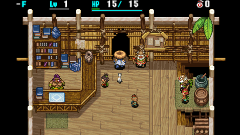
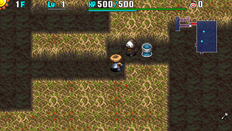

  

Dungeon where you start with 500 HP (+runes and resonance), but you can't heal HP once it's lost. HP doesn't regenerate, and HP restoring items have no effect, but Revival Grass remains effective. 1 Revival Grass can be found on floors that are a multiple of 10 (so 10F, 20F, 30F, 40F, 50F...), and only Revival Grass is generated in Monster Houses and on item islands on these floors.

The dungeon allows carry-in items and the monster table is a bit harsher than Platinum Paradise, but Dragon family monsters don't appear, so you won't need to worry about floor-wide flame attacks. So you mainly only need to worry about other fixed damage attackers like Yanpii and Explochin types. Lastly, equipment can't be found on the ground except for torches.

<ul class="quickLinksUL">
  <li><a href="#overview">Overview</a></li>
  <li><a href="#strategy">Strategy</a></li>
  <li><a href="#monsters">Monsters</a></li>
  <li><a href="#items">Items</a></li>
  <li><a href="#traps">Traps</a></li>
</ul>

# Overview

<table class="dungeonOverview">
  <tr>
    <th>Unlock</th>
    <td class="highlightYellow">Go to Novice House after clearing the main story.</td>
  </tr>
  <tr>
    <th>Entrance</th>
    <td class="highlightYellow">Boronga Village (Opened door in Novice House)</td>
  </tr>
</table>

<table class="dungeonTable">
  <tr>
    <th>Floors</th>
    <td>99F</td>
    <th>Day / Night</th>
    <td>Both</td>
  </tr>
  <tr>
    <th>Bring Items</th>
    <td>Yes</td>
    <th>Allies</th>
    <td>No</td>
  </tr>
  <tr>
    <th>Unidentified</th>
    <td colspan="3">Pots</td>
  </tr>
  <tr>
    <th>Shops</th>
    <td>Regular, Pick-A-Choice</td>
    <th>Monster Houses</th>
    <td>Regular</td>
  </tr>
  <tr>
    <th>Initial Enemies</th>
    <td>7~10</td>
    <th>Spawn Rate</th>
    <td>30 day / 20 night</td>
  </tr>
  <tr>
    <th>Day Turns</th>
    <td>410 (361)</td>
    <th>Night Turns</th>
    <td>318 (280)</td>
  </tr>
  <tr>
    <th>Ominous aura</th>
    <td>Yes (400 turns)</td>
    <th>Winds of Kron</th>
    <td>1st: 700 / 4th: 1000</td>
  </tr>
  <tr>
    <th>Clear Icon</th>
    <td>None</td>
    <th>Clear Bonus</th>
    <td>30,000,000</td>
  </tr>
  <tr>
    <th>Reward</th>
    <td colspan="3">Nirvana Board</td>
  </tr>
</table>

# Strategy

<ul class="quickLinksUL">
  <li><a href="#general">General</a></li>
</ul>

### General

#### Dungeon Mechanics

- Start with 500 max HP.
    - Runes and resonance can boost this to 630 HP.
- HP doesn't regenerate, no matter how many turns elapse.
- HP restoring effects of items are nullified.
    - Revival Grass and Undo Grass function like normal.
- Floors that are a multiple of 10 such as 10F only generate Revival Grass for floor table items.
    - 1 Revival Grass is always generated on the ground.
    - Monster Houses only contain Revival Grass.
        - This also applies to Monster Houses generated with Mon House Scroll.
    - Day monsters can only drop Revival Grass.
        - This rule doesn't apply to monsters with fixed item drops, Zaloklefts, and Presto Pots.

#### Carry-In Items

It's easy if you bring strong equipment, Scout Bracelet, Lamp Shield for night, and lots of Revival Grass. The only things you need to worry about are fixed damage attacks and monsters that destroy items.

#### No Bringing Items

Attempting this dungeon without bringing items is a completely different story. You'll most likely have to go without equipment, and will need to focus on run away play instead of fighting. Prioritize items like torches, Pinning Staff, Swap Staff, Swift Grass, Warp Grass, Night-Day Scroll, etc. If you find a Blank Scroll, turn it into a Mon House Scroll and use it on a floor that's a multiple of 10 to stock up on a bunch of Revival Grass.

Rushing stairs during the night is generally more consistent, but night only lasts 318 turns, so you need to be able to progress during the day as well to avoid running out of torches.

#### Abilities

- Room Cyclone x 2
- Cluster Confusion x 1
- Kaboom Bullet or Sticky Shot or Bi-Direction Warp x 5

# Monsters

See [Monsters](/system/monsters) for individual monster details.

- F = Lava
- S = Shop is possible
- P = Pick-A-Choice Shop is possible
- E = Elite Shop is possible
- H = Monster House is possible
- M = Maneater Lv1 Lv2 Lv3 Lv4

Enemy Colors: Day Night

<table class="monsterTable">
  <thead>
    <tr>
      <th>F</th>
      <th>S</th>
      <th>P</th>
      <th>E</th>
      <th>H</th>
      <th colspan="5">Monsters</th>
      <th>M</th>
    </tr>
  </thead>
  <tbody>
    <tr>
      <th rowspan="2">1</th>
      <td rowspan="2" class="highlightGray"></td>
      <td rowspan="2" class="highlightGray"></td>
      <td rowspan="2" class="highlightGray"></td>
      <td rowspan="2" class="highlightGray"></td>
      <td class="monsterDay">Kumonigiri</td>
      <td class="monsterDay">Cheer Ham</td>
      <td class="monsterDay">Gazer</td>
      <td class="monsterDay">Ironhead</td>
      <td class="highlightGray"></td>
      <td rowspan="40" class="monsterTableManeater">1</td>
    </tr>
    <tr>
      <td class="monsterNight">Dark Field Knave</td>
      <td class="monsterNight">Dark Kumonigiri</td>
      <td class="monsterNight">Evil Hopodile</td>
      <td class="highlightGray"></td>
      <td class="highlightGray"></td>
    </tr>
    <tr>
      <th rowspan="2">2</th>
      <td rowspan="2" class="highlightGray"></td>
      <td rowspan="2" class="highlightGray"></td>
      <td rowspan="2" class="highlightGray"></td>
      <td rowspan="2" class="highlightMH"></td>
      <td class="monsterDay">Kumonigiri</td>
      <td class="monsterDay">Cheer Ham</td>
      <td class="monsterDay">Gazer</td>
      <td class="monsterDay">Ironhead</td>
      <td class="highlightGray"></td>
    </tr>
    <tr>
      <td class="monsterNight">Dark Field Knave</td>
      <td class="monsterNight">Dark Kumonigiri</td>
      <td class="monsterNight">Evil Hopodile</td>
      <td class="highlightGray"></td>
      <td class="highlightGray"></td>
    </tr>
    <tr>
      <th rowspan="2">3</th>
      <td rowspan="2" class="highlightGray"></td>
      <td rowspan="2" class="highlightGray"></td>
      <td rowspan="2" class="highlightGray"></td>
      <td rowspan="2" class="highlightMH"></td>
      <td class="monsterDay">Kumonigiri</td>
      <td class="monsterDay">Cheer Ham</td>
      <td class="monsterDay">Gazer</td>
      <td class="monsterDay">Ironhead</td>
      <td class="highlightGray"></td>
    </tr>
    <tr>
      <td class="monsterNight">Plump Snacky</td>
      <td class="monsterNight">Dark Kumonigiri</td>
      <td class="monsterNight">Evil Hopodile</td>
      <td class="highlightGray"></td>
      <td class="highlightGray"></td>
    </tr>
    <tr>
      <th rowspan="2">4</th>
      <td rowspan="2" class="highlightShop"></td>
      <td rowspan="2" class="highlightChoice"></td>
      <td rowspan="2" class="highlightGray"></td>
      <td rowspan="2" class="highlightMH"></td>
      <td class="monsterDay">Crow Tengu</td>
      <td class="monsterDay">Slime</td>
      <td class="monsterDay">Gazer</td>
      <td class="monsterDay">Ironhead</td>
      <td class="highlightGray"></td>
    </tr>
    <tr>
      <td class="monsterNight">Plump Snacky</td>
      <td class="monsterNight">Evil Porky</td>
      <td class="monsterNight">Evil Hopodile</td>
      <td class="highlightGray"></td>
      <td class="highlightGray"></td>
    </tr>
    <tr>
      <th rowspan="2">5</th>
      <td rowspan="2" class="highlightShop"></td>
      <td rowspan="2" class="highlightChoice"></td>
      <td rowspan="2" class="highlightGray"></td>
      <td rowspan="2" class="highlightMH"></td>
      <td class="monsterDay">Crow Tengu</td>
      <td class="monsterDay">Slime</td>
      <td class="monsterDay">Floaty</td>
      <td class="monsterDay">Explochin</td>
      <td class="highlightGray"></td>
    </tr>
    <tr>
      <td class="monsterNight">Bad Yanpii</td>
      <td class="monsterNight">Evil Porky</td>
      <td class="monsterNight">Evil Hopodile</td>
      <td class="highlightGray"></td>
      <td class="highlightGray"></td>
    </tr>
    <tr>
      <th rowspan="2">6</th>
      <td rowspan="2" class="highlightShop"></td>
      <td rowspan="2" class="highlightChoice"></td>
      <td rowspan="2" class="highlightGray"></td>
      <td rowspan="2" class="highlightMH"></td>
      <td class="monsterDay">Crow Tengu</td>
      <td class="monsterDay">Slime</td>
      <td class="monsterDay">Floaty</td>
      <td class="monsterDay">Explochin</td>
      <td class="highlightGray"></td>
    </tr>
    <tr>
      <td class="monsterNight">Bad Yanpii</td>
      <td class="monsterNight">Evil Porky</td>
      <td class="monsterNight">Dark Ironhead</td>
      <td class="highlightGray"></td>
      <td class="highlightGray"></td>
    </tr>
    <tr>
      <th rowspan="2">7</th>
      <td rowspan="2" class="highlightShop"></td>
      <td rowspan="2" class="highlightChoice"></td>
      <td rowspan="2" class="highlightGray"></td>
      <td rowspan="2" class="highlightMH"></td>
      <td class="monsterDay">Strong Cart</td>
      <td class="monsterDay">Pumphantasm</td>
      <td class="monsterDay">Floaty</td>
      <td class="monsterDay">Explochin</td>
      <td class="highlightGray"></td>
    </tr>
    <tr>
      <td class="monsterNight">Bad Yanpii</td>
      <td class="monsterNight">Dark DJ Mage</td>
      <td class="monsterNight">Dark Ironhead</td>
      <td class="highlightGray"></td>
      <td class="highlightGray"></td>
    </tr>
    <tr>
      <th rowspan="2">8</th>
      <td rowspan="2" class="highlightShop"></td>
      <td rowspan="2" class="highlightChoice"></td>
      <td rowspan="2" class="highlightGray"></td>
      <td rowspan="2" class="highlightMH"></td>
      <td class="monsterDay">Strong Cart</td>
      <td class="monsterDay">Pumphantasm</td>
      <td class="monsterDay">Flash Bird</td>
      <td class="monsterDay">Explochin</td>
      <td class="highlightGray"></td>
    </tr>
    <tr>
      <td class="monsterNight">Bad Yanpii</td>
      <td class="monsterNight">Dark DJ Mage</td>
      <td class="monsterNight">Dark Ironhead</td>
      <td class="highlightGray"></td>
      <td class="highlightGray"></td>
    </tr>
    <tr>
      <th rowspan="2">9</th>
      <td rowspan="2" class="highlightShop"></td>
      <td rowspan="2" class="highlightChoice"></td>
      <td rowspan="2" class="highlightGray"></td>
      <td rowspan="2" class="highlightMH"></td>
      <td class="monsterDay">Strong Cart</td>
      <td class="monsterDay">Pumphantasm</td>
      <td class="monsterDay">Flash Bird</td>
      <td class="monsterDay">Explochin</td>
      <td class="highlightGray"></td>
    </tr>
    <tr>
      <td class="monsterNight">Bad Yanpii</td>
      <td class="monsterNight">Dark DJ Mage</td>
      <td class="monsterNight">Dark Ironhead</td>
      <td class="highlightGray"></td>
      <td class="highlightGray"></td>
    </tr>
    <tr>
      <th rowspan="2">10</th>
      <td rowspan="2" class="highlightShop"></td>
      <td rowspan="2" class="highlightChoice"></td>
      <td rowspan="2" class="highlightGray"></td>
      <td rowspan="2" class="highlightMH"></td>
      <td class="monsterDay">Dagger Bee</td>
      <td class="monsterDay">Pumphantasm</td>
      <td class="monsterDay">Flash Bird</td>
      <td class="monsterDay">Spin Polygon</td>
      <td class="highlightGray"></td>
    </tr>
    <tr>
      <td class="monsterNight">Vile Scorpion</td>
      <td class="monsterNight">Dark Mixer</td>
      <td class="monsterNight">Dark Ironhead</td>
      <td class="highlightGray"></td>
      <td class="highlightGray"></td>
    </tr>
    <tr>
      <th rowspan="2">11</th>
      <td rowspan="2" class="highlightShop"></td>
      <td rowspan="2" class="highlightChoice"></td>
      <td rowspan="2" class="highlightGray"></td>
      <td rowspan="2" class="highlightMH"></td>
      <td class="monsterDay">Dagger Bee</td>
      <td class="monsterDay">Pumphantasm</td>
      <td class="monsterDay">Pierce Cart</td>
      <td class="monsterDay">Spin Polygon</td>
      <td class="highlightGray"></td>
    </tr>
    <tr>
      <td class="monsterNight">Vile Scorpion</td>
      <td class="monsterNight">Dark Mixer</td>
      <td class="monsterNight">Dark Squid Lord</td>
      <td class="highlightGray"></td>
      <td class="highlightGray"></td>
    </tr>
    <tr>
      <th rowspan="2" class="redText">12</th>
      <td rowspan="2" class="highlightShop"></td>
      <td rowspan="2" class="highlightChoice"></td>
      <td rowspan="2" class="highlightGray"></td>
      <td rowspan="2" class="highlightMH"></td>
      <td class="monsterDay">Dagger Bee</td>
      <td class="monsterDay">Gyaza</td>
      <td class="monsterDay">Pierce Cart</td>
      <td class="monsterDay">Spin Polygon</td>
      <td class="highlightGray"></td>
    </tr>
    <tr>
      <td class="monsterNight">Vile Scorpion</td>
      <td class="monsterNight">Dark Mixer</td>
      <td class="monsterNight">Dark Squid Lord</td>
      <td class="highlightGray"></td>
      <td class="highlightGray"></td>
    </tr>
    <tr>
      <th rowspan="2" class="redText">13</th>
      <td rowspan="2" class="highlightShop"></td>
      <td rowspan="2" class="highlightChoice"></td>
      <td rowspan="2" class="highlightGray"></td>
      <td rowspan="2" class="highlightMH"></td>
      <td class="monsterDay">Dagger Bee</td>
      <td class="monsterDay">Gyaza</td>
      <td class="monsterDay">Pierce Cart</td>
      <td class="monsterDay">Kengo</td>
      <td class="highlightGray"></td>
    </tr>
    <tr>
      <td class="monsterNight">Vile Grime</td>
      <td class="monsterNight">Dark Pandanigiri</td>
      <td class="monsterNight">Dark Squid Lord</td>
      <td class="highlightGray"></td>
      <td class="highlightGray"></td>
    </tr>
    <tr>
      <th rowspan="2" class="redText">14</th>
      <td rowspan="2" class="highlightShop"></td>
      <td rowspan="2" class="highlightChoice"></td>
      <td rowspan="2" class="highlightGray"></td>
      <td rowspan="2" class="highlightMH"></td>
      <td class="monsterDay">Dagger Bee</td>
      <td class="monsterDay">Gyaza</td>
      <td class="monsterDay">Go Ham</td>
      <td class="monsterDay">Kengo</td>
      <td class="highlightGray"></td>
    </tr>
    <tr>
      <td class="monsterNight">Vile Grime</td>
      <td class="monsterNight">Dark Pandanigiri</td>
      <td class="monsterNight">Dark Dazikon</td>
      <td class="highlightGray"></td>
      <td class="highlightGray"></td>
    </tr>
    <tr>
      <th rowspan="2" class="redText">15</th>
      <td rowspan="2" class="highlightShop"></td>
      <td rowspan="2" class="highlightChoice"></td>
      <td rowspan="2" class="highlightGray"></td>
      <td rowspan="2" class="highlightMH"></td>
      <td class="monsterDay">Sr. Yanpii</td>
      <td class="monsterDay">Gyaza</td>
      <td class="monsterDay">Go Ham</td>
      <td class="monsterDay">Kengo</td>
      <td class="highlightGray"></td>
    </tr>
    <tr>
      <td class="monsterNight">Vile Grime</td>
      <td class="monsterNight">Dark Pandanigiri</td>
      <td class="monsterNight">Dark Dazikon</td>
      <td class="highlightGray"></td>
      <td class="highlightGray"></td>
    </tr>
    <tr>
      <th rowspan="2">16</th>
      <td rowspan="2" class="highlightShop"></td>
      <td rowspan="2" class="highlightGray"></td>
      <td rowspan="2" class="highlightElite"></td>
      <td rowspan="2" class="highlightMH"></td>
      <td class="monsterDay">Sr. Yanpii</td>
      <td class="monsterDay">Gyaza</td>
      <td class="monsterDay">Go Ham</td>
      <td class="monsterDay">Squid Lord</td>
      <td class="highlightGray"></td>
    </tr>
    <tr>
      <td class="monsterNight">Foul Curse Sister</td>
      <td class="monsterNight">Dark Pandanigiri</td>
      <td class="monsterNight">Dark Dazikon</td>
      <td class="highlightGray"></td>
      <td class="highlightGray"></td>
    </tr>
    <tr>
      <th rowspan="2">17</th>
      <td rowspan="2" class="highlightShop"></td>
      <td rowspan="2" class="highlightGray"></td>
      <td rowspan="2" class="highlightElite"></td>
      <td rowspan="2" class="highlightMH"></td>
      <td class="monsterDay">Sr. Yanpii</td>
      <td class="monsterDay">Gyaza</td>
      <td class="monsterDay">Kappa Pest</td>
      <td class="monsterDay">Squid Lord</td>
      <td class="highlightGray"></td>
    </tr>
    <tr>
      <td class="monsterNight">Foul Curse Sister</td>
      <td class="monsterNight">Dark Pandanigiri</td>
      <td class="monsterNight">Evil Super Gazer</td>
      <td class="highlightGray"></td>
      <td class="highlightGray"></td>
    </tr>
    <tr>
      <th rowspan="2">18</th>
      <td rowspan="2" class="highlightShop"></td>
      <td rowspan="2" class="highlightGray"></td>
      <td rowspan="2" class="highlightElite"></td>
      <td rowspan="2" class="highlightMH"></td>
      <td class="monsterDay">Sr. Yanpii</td>
      <td class="monsterDay">Eligan</td>
      <td class="monsterDay">Kappa Pest</td>
      <td class="monsterDay">Squid Lord</td>
      <td class="highlightGray"></td>
    </tr>
    <tr>
      <td class="monsterNight">Foul Curse Sister</td>
      <td class="monsterNight">Dark Eligagan</td>
      <td class="monsterNight">Evil Super Gazer</td>
      <td class="highlightGray"></td>
      <td class="highlightGray"></td>
    </tr>
    <tr>
      <th rowspan="2">19</th>
      <td rowspan="2" class="highlightShop"></td>
      <td rowspan="2" class="highlightGray"></td>
      <td rowspan="2" class="highlightElite"></td>
      <td rowspan="2" class="highlightMH"></td>
      <td class="monsterDay">Sr. Yanpii</td>
      <td class="monsterDay">Eligan</td>
      <td class="monsterDay">Kappa Pest</td>
      <td class="monsterDay">Digestiphant</td>
      <td class="highlightGray"></td>
    </tr>
    <tr>
      <td class="monsterNight">Bad Falcon Tengu</td>
      <td class="monsterNight">Dark Eligagan</td>
      <td class="monsterNight">Evil Super Gazer</td>
      <td class="highlightGray"></td>
      <td class="highlightGray"></td>
    </tr>
    <tr>
      <th rowspan="2">20</th>
      <td rowspan="2" class="highlightShop"></td>
      <td rowspan="2" class="highlightChoice"></td>
      <td rowspan="2" class="highlightGray"></td>
      <td rowspan="2" class="highlightMH"></td>
      <td class="monsterDay">Foly2</td>
      <td class="monsterDay">Eligan</td>
      <td class="monsterDay">Banana Morph</td>
      <td class="monsterDay">Digestiphant</td>
      <td class="highlightGray"></td>
    </tr>
    <tr>
      <td class="monsterNight">Bad Falcon Tengu</td>
      <td class="monsterNight">Dark Eligagan</td>
      <td class="monsterNight">Foul Boss</td>
      <td class="highlightGray"></td>
      <td class="highlightGray"></td>
    </tr>
    <tr>
      <th rowspan="2">21</th>
      <td rowspan="2" class="highlightShop"></td>
      <td rowspan="2" class="highlightChoice"></td>
      <td rowspan="2" class="highlightGray"></td>
      <td rowspan="2" class="highlightMH"></td>
      <td class="monsterDay">Foly2</td>
      <td class="monsterDay">Eligan</td>
      <td class="monsterDay">Banana Morph</td>
      <td class="monsterDay">Digestiphant</td>
      <td class="highlightGray"></td>
      <td rowspan="50" class="monsterTableVilleater">2</td>
    </tr>
    <tr>
      <td class="monsterNight">Bad Falcon Tengu</td>
      <td class="monsterNight">Dark Eligagan</td>
      <td class="monsterNight">Foul Boss</td>
      <td class="highlightGray"></td>
      <td class="highlightGray"></td>
    </tr>
    <tr>
      <th rowspan="2">22</th>
      <td rowspan="2" class="highlightShop"></td>
      <td rowspan="2" class="highlightChoice"></td>
      <td rowspan="2" class="highlightGray"></td>
      <td rowspan="2" class="highlightMH"></td>
      <td class="monsterDay">Foly2</td>
      <td class="monsterDay">Eligan</td>
      <td class="monsterDay">Banana Morph</td>
      <td class="monsterDay">Digestiphant</td>
      <td class="highlightGray"></td>
    </tr>
    <tr>
      <td class="monsterNight">Bad Falcon Tengu</td>
      <td class="monsterNight">Dark Eligagan</td>
      <td class="monsterNight">Foul Boss</td>
      <td class="highlightGray"></td>
      <td class="highlightGray"></td>
    </tr>
    <tr>
      <th rowspan="2">23</th>
      <td rowspan="2" class="highlightShop"></td>
      <td rowspan="2" class="highlightChoice"></td>
      <td rowspan="2" class="highlightGray"></td>
      <td rowspan="2" class="highlightMH"></td>
      <td class="monsterDay">Pumphantom</td>
      <td class="monsterDay">Demon Scorp</td>
      <td class="monsterDay">MC Mage</td>
      <td class="monsterDay">Digestiphant</td>
      <td class="highlightGray"></td>
    </tr>
    <tr>
      <td class="monsterNight">Bad Falcon Tengu</td>
      <td class="monsterNight">Dark Eligagan</td>
      <td class="monsterNight">Evil Porko</td>
      <td class="highlightGray"></td>
      <td class="highlightGray"></td>
    </tr>
    <tr>
      <th rowspan="2" class="redText">24</th>
      <td rowspan="2" class="highlightShop"></td>
      <td rowspan="2" class="highlightChoice"></td>
      <td rowspan="2" class="highlightGray"></td>
      <td rowspan="2" class="highlightMH"></td>
      <td class="monsterDay">Pumphantom</td>
      <td class="monsterDay">Demon Scorp</td>
      <td class="monsterDay">MC Mage</td>
      <td class="monsterDay">Tiger Hurler</td>
      <td class="highlightGray"></td>
    </tr>
    <tr>
      <td class="monsterNight">Bad Falcon Tengu</td>
      <td class="monsterNight">Dark Cave Mamel</td>
      <td class="monsterNight">Evil Porko</td>
      <td class="highlightGray"></td>
      <td class="highlightGray"></td>
    </tr>
    <tr>
      <th rowspan="2" class="redText">25</th>
      <td rowspan="2" class="highlightShop"></td>
      <td rowspan="2" class="highlightChoice"></td>
      <td rowspan="2" class="highlightGray"></td>
      <td rowspan="2" class="highlightMH"></td>
      <td class="monsterDay">Pumphantom</td>
      <td class="monsterDay">Demon Scorp</td>
      <td class="monsterDay">MC Mage</td>
      <td class="monsterDay">Tiger Hurler</td>
      <td class="highlightGray"></td>
    </tr>
    <tr>
      <td class="monsterNight">Dark MC Mage</td>
      <td class="monsterNight">Dark Cave Mamel</td>
      <td class="monsterNight">Evil Porko</td>
      <td class="highlightGray"></td>
      <td class="highlightGray"></td>
    </tr>
    <tr>
      <th rowspan="2" class="redText">26</th>
      <td rowspan="2" class="highlightShop"></td>
      <td rowspan="2" class="highlightChoice"></td>
      <td rowspan="2" class="highlightGray"></td>
      <td rowspan="2" class="highlightMH"></td>
      <td class="monsterDay">Pumphantom</td>
      <td class="monsterDay">Crunchy</td>
      <td class="monsterDay">Glare Bird</td>
      <td class="monsterDay">Tiger Hurler</td>
      <td class="highlightGray"></td>
    </tr>
    <tr>
      <td class="monsterNight">Dark MC Mage</td>
      <td class="monsterNight">Dark Cave Mamel</td>
      <td class="monsterNight">Evil Porko</td>
      <td class="highlightGray"></td>
      <td class="highlightGray"></td>
    </tr>
    <tr>
      <th rowspan="2" class="redText">27</th>
      <td rowspan="2" class="highlightShop"></td>
      <td rowspan="2" class="highlightChoice"></td>
      <td rowspan="2" class="highlightGray"></td>
      <td rowspan="2" class="highlightMH"></td>
      <td class="monsterDay">Pumphantom</td>
      <td class="monsterDay">Crunchy</td>
      <td class="monsterDay">Glare Bird</td>
      <td class="monsterDay">Tiger Hurler</td>
      <td class="highlightGray"></td>
    </tr>
    <tr>
      <td class="monsterNight">Dark MC Mage</td>
      <td class="monsterNight">Dark Cave Mamel</td>
      <td class="monsterNight">Evil Porko</td>
      <td class="highlightGray"></td>
      <td class="highlightGray"></td>
    </tr>
    <tr>
      <th rowspan="2">28</th>
      <td rowspan="2" class="highlightShop"></td>
      <td rowspan="2" class="highlightChoice"></td>
      <td rowspan="2" class="highlightGray"></td>
      <td rowspan="2" class="highlightMH"></td>
      <td class="monsterDay">Steamroid</td>
      <td class="monsterDay">Crunchy</td>
      <td class="monsterDay">Glare Bird</td>
      <td class="monsterDay">Tiger Hurler</td>
      <td class="highlightGray"></td>
    </tr>
    <tr>
      <td class="monsterNight">Dark Vexing Kappa</td>
      <td class="monsterNight">Dark Cave Mamel</td>
      <td class="monsterNight">Mean Go Ham</td>
      <td class="highlightGray"></td>
      <td class="highlightGray"></td>
    </tr>
    <tr>
      <th rowspan="2">29</th>
      <td rowspan="2" class="highlightShop"></td>
      <td rowspan="2" class="highlightChoice"></td>
      <td rowspan="2" class="highlightGray"></td>
      <td rowspan="2" class="highlightMH"></td>
      <td class="monsterDay">Steamroid</td>
      <td class="monsterDay">Chainhead</td>
      <td class="monsterDay">Glare Bird</td>
      <td class="monsterDay">Dance Polygon</td>
      <td class="highlightGray"></td>
    </tr>
    <tr>
      <td class="monsterNight">Dark Vexing Kappa</td>
      <td class="monsterNight">Dark Cave Mamel</td>
      <td class="monsterNight">Mean Go Ham</td>
      <td class="highlightGray"></td>
      <td class="highlightGray"></td>
    </tr>
    <tr>
      <th rowspan="2">30</th>
      <td rowspan="2" class="highlightShop"></td>
      <td rowspan="2" class="highlightChoice"></td>
      <td rowspan="2" class="highlightGray"></td>
      <td rowspan="2" class="highlightMH"></td>
      <td class="monsterDay">Steamroid</td>
      <td class="monsterDay">Chainhead</td>
      <td class="monsterDay">Glare Bird</td>
      <td class="monsterDay">Dance Polygon</td>
      <td class="highlightGray"></td>
    </tr>
    <tr>
      <td class="monsterNight">Dark Vexing Kappa</td>
      <td class="monsterNight">Dark Digestiphant</td>
      <td class="monsterNight">Mean Go Ham</td>
      <td class="highlightGray"></td>
      <td class="highlightGray"></td>
    </tr>
    <tr>
      <th rowspan="2">31</th>
      <td rowspan="2" class="highlightShop"></td>
      <td rowspan="2" class="highlightChoice"></td>
      <td rowspan="2" class="highlightGray"></td>
      <td rowspan="2" class="highlightMH"></td>
      <td class="monsterDay">Steamroid</td>
      <td class="monsterDay">Chainhead</td>
      <td class="monsterDay">Gyairas</td>
      <td class="monsterDay">Dance Polygon</td>
      <td class="highlightGray"></td>
    </tr>
    <tr>
      <td class="monsterNight">Dark Pot Knave</td>
      <td class="monsterNight">Dark Digestiphant</td>
      <td class="monsterNight">Wild Gyairas</td>
      <td class="highlightGray"></td>
      <td class="highlightGray"></td>
    </tr>
    <tr>
      <th rowspan="2">32</th>
      <td rowspan="2" class="highlightShop"></td>
      <td rowspan="2" class="highlightGray"></td>
      <td rowspan="2" class="highlightElite"></td>
      <td rowspan="2" class="highlightMH"></td>
      <td class="monsterDay">Steamroid</td>
      <td class="monsterDay">Chainhead</td>
      <td class="monsterDay">Gyairas</td>
      <td class="monsterDay">Lt. Yanpii</td>
      <td class="highlightGray"></td>
    </tr>
    <tr>
      <td class="monsterNight">Dark Pot Knave</td>
      <td class="monsterNight">Dark Digestiphant</td>
      <td class="monsterNight">Wild Gyairas</td>
      <td class="highlightGray"></td>
      <td class="highlightGray"></td>
    </tr>
    <tr>
      <th rowspan="2">33</th>
      <td rowspan="2" class="highlightShop"></td>
      <td rowspan="2" class="highlightGray"></td>
      <td rowspan="2" class="highlightElite"></td>
      <td rowspan="2" class="highlightMH"></td>
      <td class="monsterDay">Steamroid</td>
      <td class="monsterDay">Chainhead</td>
      <td class="monsterDay">Gyairas</td>
      <td class="monsterDay">Lt. Yanpii</td>
      <td class="highlightGray"></td>
    </tr>
    <tr>
      <td class="monsterNight">Dark Pot Knave</td>
      <td class="monsterNight">Dark Glare Bird</td>
      <td class="monsterNight">Wild Gyairas</td>
      <td class="highlightGray"></td>
      <td class="highlightGray"></td>
    </tr>
    <tr>
      <th rowspan="2">34</th>
      <td rowspan="2" class="highlightShop"></td>
      <td rowspan="2" class="highlightGray"></td>
      <td rowspan="2" class="highlightElite"></td>
      <td rowspan="2" class="highlightMH"></td>
      <td class="monsterDay">Nuttie</td>
      <td class="monsterDay">Chainhead</td>
      <td class="monsterDay">Falcon Tengu</td>
      <td class="monsterDay">Lt. Yanpii</td>
      <td class="highlightGray"></td>
    </tr>
    <tr>
      <td class="monsterNight">Dark Scarabbit</td>
      <td class="monsterNight">Dark Glare Bird</td>
      <td class="monsterNight">Vile Demon Scorp</td>
      <td class="highlightGray"></td>
      <td class="highlightGray"></td>
    </tr>
    <tr>
      <th rowspan="2">35</th>
      <td rowspan="2" class="highlightShop"></td>
      <td rowspan="2" class="highlightGray"></td>
      <td rowspan="2" class="highlightElite"></td>
      <td rowspan="2" class="highlightMH"></td>
      <td class="monsterDay">Nuttie</td>
      <td class="monsterDay">Poofy</td>
      <td class="monsterDay">Falcon Tengu</td>
      <td class="monsterDay">Katana Bee</td>
      <td class="highlightGray"></td>
    </tr>
    <tr>
      <td class="monsterNight">Dark Scarabbit</td>
      <td class="monsterNight">Dark Glare Bird</td>
      <td class="monsterNight">Vile Demon Scorp</td>
      <td class="highlightGray"></td>
      <td class="highlightGray"></td>
    </tr>
    <tr>
      <th rowspan="2" class="redText">36</th>
      <td rowspan="2" class="highlightShop"></td>
      <td rowspan="2" class="highlightChoice"></td>
      <td rowspan="2" class="highlightGray"></td>
      <td rowspan="2" class="highlightMH"></td>
      <td class="monsterDay">Nuttie</td>
      <td class="monsterDay">Poofy</td>
      <td class="monsterDay">Falcon Tengu</td>
      <td class="monsterDay">Katana Bee</td>
      <td class="highlightGray"></td>
    </tr>
    <tr>
      <td class="monsterNight">Dark Scarabbit</td>
      <td class="monsterNight">Dark Pierce Cart</td>
      <td class="monsterNight">Vile Demon Scorp</td>
      <td class="highlightGray"></td>
      <td class="highlightGray"></td>
    </tr>
    <tr>
      <th rowspan="2" class="redText">37</th>
      <td rowspan="2" class="highlightShop"></td>
      <td rowspan="2" class="highlightChoice"></td>
      <td rowspan="2" class="highlightGray"></td>
      <td rowspan="2" class="highlightMH"></td>
      <td class="monsterDay">Nuttie</td>
      <td class="monsterDay">Poofy</td>
      <td class="monsterDay">Rally Ham</td>
      <td class="monsterDay">Katana Bee</td>
      <td class="highlightGray"></td>
    </tr>
    <tr>
      <td class="monsterNight">Dark Item Knave</td>
      <td class="monsterNight">Dark Pierce Cart</td>
      <td class="monsterNight">Vile Demon Scorp</td>
      <td class="highlightGray"></td>
      <td class="highlightGray"></td>
    </tr>
    <tr>
      <th rowspan="2" class="redText">38</th>
      <td rowspan="2" class="highlightShop"></td>
      <td rowspan="2" class="highlightChoice"></td>
      <td rowspan="2" class="highlightGray"></td>
      <td rowspan="2" class="highlightMH"></td>
      <td class="monsterDay">Nuttie</td>
      <td class="monsterDay">Ooze</td>
      <td class="monsterDay">Rally Ham</td>
      <td class="monsterDay">Katana Bee</td>
      <td class="highlightGray"></td>
    </tr>
    <tr>
      <td class="monsterNight">Dark Item Knave</td>
      <td class="monsterNight">Dark Pierce Cart</td>
      <td class="monsterNight">Vile Demon Scorp</td>
      <td class="highlightGray"></td>
      <td class="highlightGray"></td>
    </tr>
    <tr>
      <th rowspan="2" class="redText">39</th>
      <td rowspan="2" class="highlightShop"></td>
      <td rowspan="2" class="highlightChoice"></td>
      <td rowspan="2" class="highlightGray"></td>
      <td rowspan="2" class="highlightMH"></td>
      <td class="monsterDay">Nuttie</td>
      <td class="monsterDay">Ooze</td>
      <td class="monsterDay">Rally Ham</td>
      <td class="monsterDay">Iai</td>
      <td class="highlightGray"></td>
    </tr>
    <tr>
      <td class="monsterNight">Dark Item Knave</td>
      <td class="monsterNight">Evil Oingodile</td>
      <td class="monsterNight">Vile Demon Scorp</td>
      <td class="highlightGray"></td>
      <td class="highlightGray"></td>
    </tr>
    <tr>
      <th rowspan="2">40</th>
      <td rowspan="2" class="highlightShop"></td>
      <td rowspan="2" class="highlightChoice"></td>
      <td rowspan="2" class="highlightGray"></td>
      <td rowspan="2" class="highlightMH"></td>
      <td class="monsterDay">Pandanigiri</td>
      <td class="monsterDay">Ooze</td>
      <td class="monsterDay">Squid Emperor</td>
      <td class="monsterDay">Iai</td>
      <td class="highlightGray"></td>
    </tr>
    <tr>
      <td class="monsterNight">Dark Voltdon</td>
      <td class="monsterNight">Evil Oingodile</td>
      <td class="monsterNight">Dark Squid Emperor</td>
      <td class="highlightGray"></td>
      <td class="highlightGray"></td>
    </tr>
    <tr>
      <th rowspan="2">41</th>
      <td rowspan="2" class="highlightShop"></td>
      <td rowspan="2" class="highlightChoice"></td>
      <td rowspan="2" class="highlightGray"></td>
      <td rowspan="2" class="highlightMH"></td>
      <td class="monsterDay">Pandanigiri</td>
      <td class="monsterDay">Vexing Kappa</td>
      <td class="monsterDay">Squid Emperor</td>
      <td class="monsterDay">Iai</td>
      <td class="highlightGray"></td>
    </tr>
    <tr>
      <td class="monsterNight">Dark Voltdon</td>
      <td class="monsterNight">Evil Oingodile</td>
      <td class="monsterNight">Dark Squid Emperor</td>
      <td class="highlightGray"></td>
      <td class="highlightGray"></td>
    </tr>
    <tr>
      <th rowspan="2">42</th>
      <td rowspan="2" class="highlightShop"></td>
      <td rowspan="2" class="highlightChoice"></td>
      <td rowspan="2" class="highlightGray"></td>
      <td rowspan="2" class="highlightMH"></td>
      <td class="monsterDay">Pandanigiri</td>
      <td class="monsterDay">Vexing Kappa</td>
      <td class="monsterDay">Squid Emperor</td>
      <td class="monsterDay">Eligagan</td>
      <td class="highlightGray"></td>
    </tr>
    <tr>
      <td class="monsterNight">Dark Voltdon</td>
      <td class="monsterNight">Bad Iron Zalokleft</td>
      <td class="monsterNight">Dark Squid Emperor</td>
      <td class="highlightGray"></td>
      <td class="highlightGray"></td>
    </tr>
    <tr>
      <th rowspan="2">43</th>
      <td rowspan="2" class="highlightShop"></td>
      <td rowspan="2" class="highlightChoice"></td>
      <td rowspan="2" class="highlightGray"></td>
      <td rowspan="2" class="highlightMH"></td>
      <td class="monsterDay">Pandanigiri</td>
      <td class="monsterDay">Vexing Kappa</td>
      <td class="monsterDay">Munchy</td>
      <td class="monsterDay">Eligagan</td>
      <td class="highlightGray"></td>
    </tr>
    <tr>
      <td class="monsterNight">Dark Voltdon</td>
      <td class="monsterNight">Bad Iron Zalokleft</td>
      <td class="monsterNight">Dark Steamroid</td>
      <td class="highlightGray"></td>
      <td class="highlightGray"></td>
    </tr>
    <tr>
      <th rowspan="2">44</th>
      <td rowspan="2" class="highlightShop"></td>
      <td rowspan="2" class="highlightChoice"></td>
      <td rowspan="2" class="highlightGray"></td>
      <td rowspan="2" class="highlightMH"></td>
      <td class="monsterDay">Pandanigiri</td>
      <td class="monsterDay">Item Knave</td>
      <td class="monsterDay">Munchy</td>
      <td class="monsterDay">Eligagan</td>
      <td class="highlightGray"></td>
    </tr>
    <tr>
      <td class="monsterNight">Dark Voltdon</td>
      <td class="monsterNight">Bad Iron Zalokleft</td>
      <td class="monsterNight">Dark Steamroid</td>
      <td class="highlightGray"></td>
      <td class="highlightGray"></td>
    </tr>
    <tr>
      <th rowspan="2">45</th>
      <td rowspan="2" class="highlightShop"></td>
      <td rowspan="2" class="highlightChoice"></td>
      <td rowspan="2" class="highlightGray"></td>
      <td rowspan="2" class="highlightMH"></td>
      <td class="monsterDay">Pandanigiri</td>
      <td class="monsterDay">Item Knave</td>
      <td class="monsterDay">Fulminachin</td>
      <td class="monsterDay">Eligagan</td>
      <td class="highlightGray"></td>
    </tr>
    <tr>
      <td class="monsterNight">Dark Voltdon</td>
      <td class="monsterNight">Evil Concusschin</td>
      <td class="monsterNight">Dark Steamroid</td>
      <td class="highlightGray"></td>
      <td class="highlightGray"></td>
    </tr>
    <tr>
      <th rowspan="2">46</th>
      <td rowspan="2" class="highlightShop"></td>
      <td rowspan="2" class="highlightChoice"></td>
      <td rowspan="2" class="highlightGray"></td>
      <td rowspan="2" class="highlightMH"></td>
      <td class="monsterDay">Oingodile</td>
      <td class="monsterDay">Item Knave</td>
      <td class="monsterDay">Fulminachin</td>
      <td class="monsterDay">Eligagan</td>
      <td class="highlightGray"></td>
      <td rowspan="60" class="monsterTableMounteater">3</td>
    </tr>
    <tr>
      <td class="monsterNight">Vile Pumphantom</td>
      <td class="monsterNight">Evil Concusschin</td>
      <td class="monsterNight">Dark Steamroid</td>
      <td class="highlightGray"></td>
      <td class="highlightGray"></td>
    </tr>
    <tr>
      <th rowspan="2">47</th>
      <td rowspan="2" class="highlightShop"></td>
      <td rowspan="2" class="highlightChoice"></td>
      <td rowspan="2" class="highlightGray"></td>
      <td rowspan="2" class="highlightMH"></td>
      <td class="monsterDay">Oingodile</td>
      <td class="monsterDay">Cave Mamel</td>
      <td class="monsterDay">Fulminachin</td>
      <td class="monsterDay">Eligagan</td>
      <td class="highlightGray"></td>
    </tr>
    <tr>
      <td class="monsterNight">Vile Pumphantom</td>
      <td class="monsterNight">Evil Concusschin</td>
      <td class="monsterNight">Dark Steamroid</td>
      <td class="highlightGray"></td>
      <td class="highlightGray"></td>
    </tr>
    <tr>
      <th rowspan="2">48</th>
      <td rowspan="2" class="highlightShop"></td>
      <td rowspan="2" class="highlightGray"></td>
      <td rowspan="2" class="highlightElite"></td>
      <td rowspan="2" class="highlightMH"></td>
      <td class="monsterDay">Oingodile</td>
      <td class="monsterDay">Cave Mamel</td>
      <td class="monsterDay">Gigahead</td>
      <td class="monsterDay">Hyper Gazer</td>
      <td class="highlightGray"></td>
    </tr>
    <tr>
      <td class="monsterNight">Vile Pumphantom</td>
      <td class="monsterNight">Evil Sing Polygon</td>
      <td class="monsterNight">Evil Blazepuff</td>
      <td class="highlightGray"></td>
      <td class="highlightGray"></td>
    </tr>
    <tr>
      <th rowspan="2">49</th>
      <td rowspan="2" class="highlightShop"></td>
      <td rowspan="2" class="highlightGray"></td>
      <td rowspan="2" class="highlightElite"></td>
      <td rowspan="2" class="highlightMH"></td>
      <td class="monsterDay">Oingodile</td>
      <td class="monsterDay">Cave Mamel</td>
      <td class="monsterDay">Gigahead</td>
      <td class="monsterDay">Hyper Gazer</td>
      <td class="highlightGray"></td>
    </tr>
    <tr>
      <td class="monsterNight">Vile Pumphantom</td>
      <td class="monsterNight">Evil Sing Polygon</td>
      <td class="monsterNight">Evil Blazepuff</td>
      <td class="highlightGray"></td>
      <td class="highlightGray"></td>
    </tr>
    <tr>
      <th rowspan="2">50</th>
      <td rowspan="2" class="highlightShop"></td>
      <td rowspan="2" class="highlightGray"></td>
      <td rowspan="2" class="highlightElite"></td>
      <td rowspan="2" class="highlightMH"></td>
      <td class="monsterDay">Oingodile</td>
      <td class="monsterDay">Cave Mamel</td>
      <td class="monsterDay">Gigahead</td>
      <td class="monsterDay">Hyper Gazer</td>
      <td class="highlightGray"></td>
    </tr>
    <tr>
      <td class="monsterNight">Vile Pumphantom</td>
      <td class="monsterNight">Evil Sing Polygon</td>
      <td class="monsterNight">Evil Blazepuff</td>
      <td class="highlightGray"></td>
      <td class="highlightGray"></td>
    </tr>
    <tr>
      <th rowspan="2">51</th>
      <td rowspan="2" class="highlightShop"></td>
      <td rowspan="2" class="highlightGray"></td>
      <td rowspan="2" class="highlightElite"></td>
      <td rowspan="2" class="highlightMH"></td>
      <td class="monsterDay">Oingodile</td>
      <td class="monsterDay">Cave Mamel</td>
      <td class="monsterDay">Gigahead</td>
      <td class="monsterDay">Pyrepuff</td>
      <td class="highlightGray"></td>
    </tr>
    <tr>
      <td class="monsterNight">Vile Pumphantom</td>
      <td class="monsterNight">Plump Munchy</td>
      <td class="monsterNight">Evil Jouncy</td>
      <td class="highlightGray"></td>
      <td class="highlightGray"></td>
    </tr>
    <tr>
      <th rowspan="2" class="redText">52</th>
      <td rowspan="2" class="highlightShop"></td>
      <td rowspan="2" class="highlightChoice"></td>
      <td rowspan="2" class="highlightGray"></td>
      <td rowspan="2" class="highlightMH"></td>
      <td class="monsterDay">Electroid</td>
      <td class="monsterDay">Cave Mamel</td>
      <td class="monsterDay">Gigahead</td>
      <td class="monsterDay">Pyrepuff</td>
      <td class="highlightGray"></td>
    </tr>
    <tr>
      <td class="monsterNight">Dark Spongiderm</td>
      <td class="monsterNight">Plump Munchy</td>
      <td class="monsterNight">Evil Jouncy</td>
      <td class="highlightGray"></td>
      <td class="highlightGray"></td>
    </tr>
    <tr>
      <th rowspan="2" class="redText">53</th>
      <td rowspan="2" class="highlightShop"></td>
      <td rowspan="2" class="highlightChoice"></td>
      <td rowspan="2" class="highlightGray"></td>
      <td rowspan="2" class="highlightMH"></td>
      <td class="monsterDay">Electroid</td>
      <td class="extremeDay monsterDay">Dozikon</td>
      <td class="monsterDay">Gigahead</td>
      <td class="monsterDay">Pyrepuff</td>
      <td class="highlightGray"></td>
    </tr>
    <tr>
      <td class="monsterNight">Dark Spongiderm</td>
      <td class="monsterNight">Bad Eagle Tengu</td>
      <td class="monsterNight">Evil Jouncy</td>
      <td class="highlightGray"></td>
      <td class="highlightGray"></td>
    </tr>
    <tr>
      <th rowspan="2" class="redText">54</th>
      <td rowspan="2" class="highlightShop"></td>
      <td rowspan="2" class="highlightChoice"></td>
      <td rowspan="2" class="highlightGray"></td>
      <td rowspan="2" class="highlightMH"></td>
      <td class="monsterDay">Electroid</td>
      <td class="extremeDay monsterDay">Dozikon</td>
      <td class="monsterDay">Gyandora</td>
      <td class="monsterDay">Banana Boss</td>
      <td class="highlightGray"></td>
    </tr>
    <tr>
      <td class="monsterNight">Dark Spongiderm</td>
      <td class="monsterNight">Bad Eagle Tengu</td>
      <td class="monsterNight">Dark Chucker</td>
      <td class="highlightGray"></td>
      <td class="highlightGray"></td>
    </tr>
    <tr>
      <th rowspan="2" class="redText">55</th>
      <td rowspan="2" class="highlightShop"></td>
      <td rowspan="2" class="highlightChoice"></td>
      <td rowspan="2" class="highlightGray"></td>
      <td rowspan="2" class="highlightMH"></td>
      <td class="monsterDay">Electroid</td>
      <td class="extremeDay monsterDay">Dozikon</td>
      <td class="monsterDay">Gyandora</td>
      <td class="monsterDay">Banana Boss</td>
      <td class="highlightGray"></td>
    </tr>
    <tr>
      <td class="monsterNight">Dark MC Wizard</td>
      <td class="monsterNight">Bad Eagle Tengu</td>
      <td class="monsterNight">Dark Chucker</td>
      <td class="highlightGray"></td>
      <td class="highlightGray"></td>
    </tr>
    <tr>
      <th rowspan="2">56</th>
      <td rowspan="2" class="highlightShop"></td>
      <td rowspan="2" class="highlightChoice"></td>
      <td rowspan="2" class="highlightGray"></td>
      <td rowspan="2" class="highlightMH"></td>
      <td class="monsterDay">Electroid</td>
      <td class="monsterDay">Boss Yanpii</td>
      <td class="monsterDay">Gyandora</td>
      <td class="monsterDay">Banana Boss</td>
      <td class="highlightGray"></td>
    </tr>
    <tr>
      <td class="monsterNight">Dark MC Wizard</td>
      <td class="monsterNight">Dark Twinkle Bird</td>
      <td class="monsterNight">Dark Chucker</td>
      <td class="highlightGray"></td>
      <td class="highlightGray"></td>
    </tr>
    <tr>
      <th rowspan="2">57</th>
      <td rowspan="2" class="highlightShop"></td>
      <td rowspan="2" class="highlightChoice"></td>
      <td rowspan="2" class="highlightGray"></td>
      <td rowspan="2" class="highlightMH"></td>
      <td class="monsterDay">Electroid</td>
      <td class="monsterDay">Boss Yanpii</td>
      <td class="monsterDay">Gyandora</td>
      <td class="extremeDay monsterDay">Horrabbit</td>
      <td class="highlightGray"></td>
    </tr>
    <tr>
      <td class="monsterNight">Dark MC Wizard</td>
      <td class="monsterNight">Dark Twinkle Bird</td>
      <td class="monsterNight">Dark Chucker</td>
      <td class="highlightGray"></td>
      <td class="highlightGray"></td>
    </tr>
    <tr>
      <th rowspan="2">58</th>
      <td rowspan="2" class="highlightShop"></td>
      <td rowspan="2" class="highlightChoice"></td>
      <td rowspan="2" class="highlightGray"></td>
      <td rowspan="2" class="highlightMH"></td>
      <td class="monsterDay">Pumpanshee</td>
      <td class="monsterDay">Boss Yanpii</td>
      <td class="monsterDay">Gyandora</td>
      <td class="extremeDay monsterDay">Horrabbit</td>
      <td class="highlightGray"></td>
    </tr>
    <tr>
      <td class="monsterNight">Dark Katana Bee</td>
      <td class="monsterNight">Dark Twinkle Bird</td>
      <td class="monsterNight">Dark Chucker</td>
      <td class="highlightGray"></td>
      <td class="highlightGray"></td>
    </tr>
    <tr>
      <th rowspan="2">59</th>
      <td rowspan="2" class="highlightShop"></td>
      <td rowspan="2" class="highlightChoice"></td>
      <td rowspan="2" class="highlightGray"></td>
      <td rowspan="2" class="highlightMH"></td>
      <td class="monsterDay">Pumpanshee</td>
      <td class="monsterDay">Zanbeeto</td>
      <td class="monsterDay">Gyandora</td>
      <td class="extremeDay monsterDay">Horrabbit</td>
      <td class="highlightGray"></td>
    </tr>
    <tr>
      <td class="monsterNight">Dark Katana Bee</td>
      <td class="monsterNight">Foul Curse Mom</td>
      <td class="monsterNight">Dark Chucker</td>
      <td class="highlightGray"></td>
      <td class="highlightGray"></td>
    </tr>
    <tr>
      <th rowspan="2">60</th>
      <td rowspan="2" class="highlightShop"></td>
      <td rowspan="2" class="highlightChoice"></td>
      <td rowspan="2" class="highlightGray"></td>
      <td rowspan="2" class="highlightMH"></td>
      <td class="monsterDay">Pumpanshee</td>
      <td class="monsterDay">Zanbeeto</td>
      <td class="monsterDay">Onigirizzly</td>
      <td class="monsterDay">Hell Gyaza</td>
      <td class="highlightGray"></td>
    </tr>
    <tr>
      <td class="monsterNight">Dark Katana Bee</td>
      <td class="monsterNight">Foul Curse Mom</td>
      <td class="monsterNight">Evil Shihan</td>
      <td class="highlightGray"></td>
      <td class="highlightGray"></td>
    </tr>
    <tr>
      <th rowspan="2">61</th>
      <td rowspan="2" class="highlightShop"></td>
      <td rowspan="2" class="highlightChoice"></td>
      <td rowspan="2" class="highlightGray"></td>
      <td rowspan="2" class="highlightMH"></td>
      <td class="monsterDay">Pumpanshee</td>
      <td class="monsterDay">Zanbeeto</td>
      <td class="monsterDay">Onigirizzly</td>
      <td class="monsterDay">Hell Gyaza</td>
      <td class="highlightGray"></td>
    </tr>
    <tr>
      <td class="monsterNight">Dark Katana Bee</td>
      <td class="monsterNight">Foul Curse Mom</td>
      <td class="monsterNight">Evil Shihan</td>
      <td class="highlightGray"></td>
      <td class="highlightGray"></td>
    </tr>
    <tr>
      <th rowspan="2">62</th>
      <td rowspan="2" class="highlightShop"></td>
      <td rowspan="2" class="highlightChoice"></td>
      <td rowspan="2" class="highlightGray"></td>
      <td rowspan="2" class="highlightMH"></td>
      <td class="monsterDay">Pumpanshee</td>
      <td class="monsterDay">Jouncy</td>
      <td class="monsterDay">Onigirizzly</td>
      <td class="monsterDay">Hell Gyaza</td>
      <td class="highlightGray"></td>
    </tr>
    <tr>
      <td class="monsterNight">Dark Katana Bee</td>
      <td class="monsterNight">Vile Ooze</td>
      <td class="monsterNight">Evil Shihan</td>
      <td class="highlightGray"></td>
      <td class="highlightGray"></td>
    </tr>
    <tr>
      <th rowspan="2">63</th>
      <td rowspan="2" class="highlightShop"></td>
      <td rowspan="2" class="highlightChoice"></td>
      <td rowspan="2" class="highlightGray"></td>
      <td rowspan="2" class="highlightMH"></td>
      <td class="monsterDay">Pumpanshee</td>
      <td class="monsterDay">Jouncy</td>
      <td class="monsterDay">Onigirizzly</td>
      <td class="monsterDay">Spirit Ham</td>
      <td class="highlightGray"></td>
    </tr>
    <tr>
      <td class="monsterNight">Dark Katana Bee</td>
      <td class="monsterNight">Vile Ooze</td>
      <td class="monsterNight">Evil Hyper Gazer</td>
      <td class="highlightGray"></td>
      <td class="highlightGray"></td>
    </tr>
    <tr>
      <th rowspan="2">64</th>
      <td rowspan="2" class="highlightShop"></td>
      <td rowspan="2" class="highlightGray"></td>
      <td rowspan="2" class="highlightElite"></td>
      <td rowspan="2" class="highlightMH"></td>
      <td class="monsterDay">Eligagon</td>
      <td class="monsterDay">Jouncy</td>
      <td class="monsterDay">Onigirizzly</td>
      <td class="monsterDay">Spirit Ham</td>
      <td class="highlightGray"></td>
    </tr>
    <tr>
      <td class="monsterNight">Bad Lt. Yanpii</td>
      <td class="monsterNight">Vile Ooze</td>
      <td class="monsterNight">Evil Hyper Gazer</td>
      <td class="highlightGray"></td>
      <td class="highlightGray"></td>
    </tr>
    <tr>
      <th rowspan="2">65</th>
      <td rowspan="2" class="highlightShop"></td>
      <td rowspan="2" class="highlightGray"></td>
      <td rowspan="2" class="highlightElite"></td>
      <td rowspan="2" class="highlightMH"></td>
      <td class="monsterDay">Eligagon</td>
      <td class="monsterDay">Detonachin</td>
      <td class="monsterDay">Huge Chintala</td>
      <td class="monsterDay">Spirit Ham</td>
      <td class="highlightGray"></td>
    </tr>
    <tr>
      <td class="monsterNight">Bad Lt. Yanpii</td>
      <td class="extremeNight monsterNight">Dark Dozikon</td>
      <td class="monsterNight">Evil Hyper Gazer</td>
      <td class="highlightGray"></td>
      <td class="highlightGray"></td>
    </tr>
    <tr>
      <th rowspan="2">66</th>
      <td rowspan="2" class="highlightShop"></td>
      <td rowspan="2" class="highlightGray"></td>
      <td rowspan="2" class="highlightElite"></td>
      <td rowspan="2" class="highlightMH"></td>
      <td class="monsterDay">Eligagon</td>
      <td class="monsterDay">Detonachin</td>
      <td class="monsterDay">Huge Chintala</td>
      <td class="monsterDay">Osmammoth</td>
      <td class="highlightGray"></td>
    </tr>
    <tr>
      <td class="monsterNight">Bad Lt. Yanpii</td>
      <td class="extremeNight monsterNight">Dark Dozikon</td>
      <td class="monsterNight">Vile Stun Scorp</td>
      <td class="highlightGray"></td>
      <td class="highlightGray"></td>
    </tr>
    <tr>
      <th rowspan="2">67</th>
      <td rowspan="2" class="highlightShop"></td>
      <td rowspan="2" class="highlightGray"></td>
      <td rowspan="2" class="highlightElite"></td>
      <td rowspan="2" class="highlightMH"></td>
      <td class="monsterDay">Eligagon</td>
      <td class="monsterDay">Detonachin</td>
      <td class="monsterDay">Huge Chintala</td>
      <td class="monsterDay">Osmammoth</td>
      <td class="highlightGray"></td>
    </tr>
    <tr>
      <td class="monsterNight">Bad Lt. Yanpii</td>
      <td class="extremeNight monsterNight">Dark Dozikon</td>
      <td class="monsterNight">Vile Stun Scorp</td>
      <td class="highlightGray"></td>
      <td class="highlightGray"></td>
    </tr>
    <tr>
      <th rowspan="2">68</th>
      <td rowspan="2" class="highlightShop"></td>
      <td rowspan="2" class="highlightChoice"></td>
      <td rowspan="2" class="highlightGray"></td>
      <td rowspan="2" class="highlightMH"></td>
      <td class="monsterDay">Eligagon</td>
      <td class="monsterDay">Curse Gramma</td>
      <td class="monsterDay">Huge Chintala</td>
      <td class="monsterDay">Osmammoth</td>
      <td class="highlightGray"></td>
    </tr>
    <tr>
      <td class="monsterNight">Bad Lt. Yanpii</td>
      <td class="extremeNight monsterNight">Dark Horrabbit</td>
      <td class="monsterNight">Vile Stun Scorp</td>
      <td class="highlightGray"></td>
      <td class="highlightGray"></td>
    </tr>
    <tr>
      <th rowspan="2">69</th>
      <td rowspan="2" class="highlightShop"></td>
      <td rowspan="2" class="highlightChoice"></td>
      <td rowspan="2" class="highlightGray"></td>
      <td rowspan="2" class="highlightMH"></td>
      <td class="monsterDay">Eligagon</td>
      <td class="monsterDay">Curse Gramma</td>
      <td class="monsterDay">Huge Chintala</td>
      <td class="monsterDay">Shihan</td>
      <td class="highlightGray"></td>
    </tr>
    <tr>
      <td class="monsterNight">Bad Lt. Yanpii</td>
      <td class="extremeNight monsterNight">Dark Horrabbit</td>
      <td class="monsterNight">Mean Rally Ham</td>
      <td class="highlightGray"></td>
      <td class="highlightGray"></td>
    </tr>
    <tr>
      <th rowspan="2">70</th>
      <td rowspan="2" class="highlightShop"></td>
      <td rowspan="2" class="highlightChoice"></td>
      <td rowspan="2" class="highlightGray"></td>
      <td rowspan="2" class="highlightMH"></td>
      <td class="monsterDay">Tiger Ace</td>
      <td class="monsterDay">Curse Gramma</td>
      <td class="monsterDay">Huge Chintala</td>
      <td class="monsterDay">Shihan</td>
      <td class="highlightGray"></td>
    </tr>
    <tr>
      <td class="monsterNight">Vile Pumpanshee</td>
      <td class="extremeNight monsterNight">Dark Horrabbit</td>
      <td class="monsterNight">Mean Rally Ham</td>
      <td class="highlightGray"></td>
      <td class="highlightGray"></td>
    </tr>
    <tr>
      <th rowspan="2">71</th>
      <td rowspan="2" class="highlightShop"></td>
      <td rowspan="2" class="highlightChoice"></td>
      <td rowspan="2" class="highlightGray"></td>
      <td rowspan="2" class="highlightMH"></td>
      <td class="monsterDay">Tiger Ace</td>
      <td class="monsterDay">Boingodile</td>
      <td class="monsterDay">Banana Master</td>
      <td class="monsterDay">Shihan</td>
      <td class="highlightGray"></td>
    </tr>
    <tr>
      <td class="monsterNight">Vile Pumpanshee</td>
      <td class="monsterNight">Wild Gyandora</td>
      <td class="monsterNight">Mean Rally Ham</td>
      <td class="highlightGray"></td>
      <td class="highlightGray"></td>
    </tr>
    <tr>
      <th rowspan="2" class="redText">72</th>
      <td rowspan="2" class="highlightShop"></td>
      <td rowspan="2" class="highlightChoice"></td>
      <td rowspan="2" class="highlightGray"></td>
      <td rowspan="2" class="highlightMH"></td>
      <td class="monsterDay">Tiger Ace</td>
      <td class="monsterDay">Boingodile</td>
      <td class="monsterDay">Banana Master</td>
      <td class="monsterDay">Bouncy</td>
      <td class="highlightGray"></td>
    </tr>
    <tr>
      <td class="monsterNight">Vile Pumpanshee</td>
      <td class="monsterNight">Wild Gyandora</td>
      <td class="monsterNight">Dark Kodionigiri</td>
      <td class="highlightGray"></td>
      <td class="highlightGray"></td>
    </tr>
    <tr>
      <th rowspan="2" class="redText">73</th>
      <td rowspan="2" class="highlightShop"></td>
      <td rowspan="2" class="highlightChoice"></td>
      <td rowspan="2" class="highlightGray"></td>
      <td rowspan="2" class="highlightMH"></td>
      <td class="extremeDay monsterDay">Mesmerikon</td>
      <td class="monsterDay">Boingodile</td>
      <td class="monsterDay">Banana Master</td>
      <td class="monsterDay">Bouncy</td>
      <td class="highlightGray"></td>
    </tr>
    <tr>
      <td class="monsterNight">Vile Pumpanshee</td>
      <td class="monsterNight">Wild Gyandora</td>
      <td class="monsterNight">Dark Kodionigiri</td>
      <td class="highlightGray"></td>
      <td class="highlightGray"></td>
    </tr>
    <tr>
      <th rowspan="2" class="redText">74</th>
      <td rowspan="2" class="highlightShop"></td>
      <td rowspan="2" class="highlightChoice"></td>
      <td rowspan="2" class="highlightGray"></td>
      <td rowspan="2" class="highlightMH"></td>
      <td class="extremeDay monsterDay">Mesmerikon</td>
      <td class="monsterDay">Boingodile</td>
      <td class="monsterDay">Banana Master</td>
      <td class="monsterDay">Bouncy</td>
      <td class="highlightGray"></td>
    </tr>
    <tr>
      <td class="monsterNight">Vile Pumpanshee</td>
      <td class="monsterNight">Plump Mealy</td>
      <td class="monsterNight">Dark Kodionigiri</td>
      <td class="highlightGray"></td>
      <td class="highlightGray"></td>
    </tr>
    <tr>
      <th rowspan="2" class="redText">75</th>
      <td rowspan="2" class="highlightShop"></td>
      <td rowspan="2" class="highlightChoice"></td>
      <td rowspan="2" class="highlightGray"></td>
      <td rowspan="2" class="highlightMH"></td>
      <td class="extremeDay monsterDay">Mesmerikon</td>
      <td class="monsterDay">Boingodile</td>
      <td class="monsterDay">Banana Master</td>
      <td class="monsterDay">Mosh Polygon</td>
      <td class="highlightGray"></td>
    </tr>
    <tr>
      <td class="monsterNight">Vile Pumpanshee</td>
      <td class="monsterNight">Plump Mealy</td>
      <td class="monsterNight">Dark Kodionigiri</td>
      <td class="highlightGray"></td>
      <td class="highlightGray"></td>
    </tr>
    <tr>
      <th rowspan="2">76</th>
      <td rowspan="2" class="highlightShop"></td>
      <td rowspan="2" class="highlightChoice"></td>
      <td rowspan="2" class="highlightGray"></td>
      <td rowspan="2" class="highlightMH"></td>
      <td class="monsterDay">Phoenix Tengu</td>
      <td class="extremeDay monsterDay">Terrabbit</td>
      <td class="monsterDay">Banana Master</td>
      <td class="monsterDay">Mosh Polygon</td>
      <td class="highlightGray"></td>
      <td rowspan="48" class="monsterTableIsleater">4</td>
    </tr>
    <tr>
      <td class="monsterNight">Evil Fulminachin</td>
      <td class="monsterNight">Plump Mealy</td>
      <td class="monsterNight">Dark Kodionigiri</td>
      <td class="highlightGray"></td>
      <td class="highlightGray"></td>
    </tr>
    <tr>
      <th rowspan="2">77</th>
      <td rowspan="2" class="highlightShop"></td>
      <td rowspan="2" class="highlightChoice"></td>
      <td rowspan="2" class="highlightGray"></td>
      <td rowspan="2" class="highlightMH"></td>
      <td class="monsterDay">Phoenix Tengu</td>
      <td class="extremeDay monsterDay">Terrabbit</td>
      <td class="monsterDay">Gitan Mamel</td>
      <td class="monsterDay">Mosh Polygon</td>
      <td class="highlightGray"></td>
    </tr>
    <tr>
      <td class="monsterNight">Evil Fulminachin</td>
      <td class="monsterNight">Dark Gitan Mamel</td>
      <td class="monsterNight">Bad Fade Zalokleft</td>
      <td class="highlightGray"></td>
      <td class="highlightGray"></td>
    </tr>
    <tr>
      <th rowspan="2">78</th>
      <td rowspan="2" class="highlightShop"></td>
      <td rowspan="2" class="highlightChoice"></td>
      <td rowspan="2" class="highlightGray"></td>
      <td rowspan="2" class="highlightMH"></td>
      <td class="monsterDay">Phoenix Tengu</td>
      <td class="extremeDay monsterDay">Terrabbit</td>
      <td class="monsterDay">Gitan Mamel</td>
      <td class="monsterDay">Blight Scorp</td>
      <td class="highlightGray"></td>
    </tr>
    <tr>
      <td class="monsterNight">Evil Fulminachin</td>
      <td class="monsterNight">Dark Gitan Mamel</td>
      <td class="monsterNight">Bad Fade Zalokleft</td>
      <td class="highlightGray"></td>
      <td class="highlightGray"></td>
    </tr>
    <tr>
      <th rowspan="2">79</th>
      <td rowspan="2" class="highlightShop"></td>
      <td rowspan="2" class="highlightChoice"></td>
      <td rowspan="2" class="highlightGray"></td>
      <td rowspan="2" class="highlightMH"></td>
      <td class="monsterDay">Phoenix Tengu</td>
      <td class="monsterDay">Kappa Troll</td>
      <td class="monsterDay">Gitan Mamel</td>
      <td class="monsterDay">Blight Scorp</td>
      <td class="highlightGray"></td>
    </tr>
    <tr>
      <td class="monsterNight">Evil Hell Gyaza</td>
      <td class="monsterNight">Dark Gitan Mamel</td>
      <td class="monsterNight">Bad Fade Zalokleft</td>
      <td class="highlightGray"></td>
      <td class="highlightGray"></td>
    </tr>
    <tr>
      <th rowspan="2">80</th>
      <td rowspan="2" class="highlightShop"></td>
      <td rowspan="2" class="highlightGray"></td>
      <td rowspan="2" class="highlightElite"></td>
      <td rowspan="2" class="highlightMH"></td>
      <td class="monsterDay">Phoenix Tengu</td>
      <td class="monsterDay">Kappa Troll</td>
      <td class="monsterDay">Gitan Mamel</td>
      <td class="monsterDay">Blight Scorp</td>
      <td class="highlightGray"></td>
    </tr>
    <tr>
      <td class="monsterNight">Evil Hell Gyaza</td>
      <td class="monsterNight">Dark Gitan Mamel</td>
      <td class="monsterNight">Dark Kappa Troll</td>
      <td class="highlightGray"></td>
      <td class="highlightGray"></td>
    </tr>
    <tr>
      <th rowspan="2">81</th>
      <td rowspan="2" class="highlightShop"></td>
      <td rowspan="2" class="highlightGray"></td>
      <td rowspan="2" class="highlightElite"></td>
      <td rowspan="2" class="highlightMH"></td>
      <td class="monsterDay">Phoenix Tengu</td>
      <td class="monsterDay">Kappa Troll</td>
      <td class="monsterDay">Gitan Mamel</td>
      <td class="monsterDay">Gyandoron</td>
      <td class="highlightGray"></td>
    </tr>
    <tr>
      <td class="monsterNight">Evil Hell Gyaza</td>
      <td class="monsterNight">Dark Gitan Mamel</td>
      <td class="monsterNight">Dark Kappa Troll</td>
      <td class="highlightGray"></td>
      <td class="highlightGray"></td>
    </tr>
    <tr>
      <th rowspan="2">82</th>
      <td rowspan="2" class="highlightShop"></td>
      <td rowspan="2" class="highlightGray"></td>
      <td rowspan="2" class="highlightElite"></td>
      <td rowspan="2" class="highlightMH"></td>
      <td class="monsterDay">Phoenix Tengu</td>
      <td class="monsterDay">Fade Zalokleft</td>
      <td class="monsterDay">Gitan Mamel</td>
      <td class="monsterDay">Gyandoron</td>
      <td class="highlightGray"></td>
    </tr>
    <tr>
      <td class="monsterNight">Evil Hell Gyaza</td>
      <td class="monsterNight">Dark Gitan Mamel</td>
      <td class="monsterNight">Dark Kappa Troll</td>
      <td class="highlightGray"></td>
      <td class="highlightGray"></td>
    </tr>
    <tr>
      <th rowspan="2">83</th>
      <td rowspan="2" class="highlightShop"></td>
      <td rowspan="2" class="highlightGray"></td>
      <td rowspan="2" class="highlightElite"></td>
      <td rowspan="2" class="highlightMH"></td>
      <td class="monsterDay">Shine Bird</td>
      <td class="monsterDay">Fade Zalokleft</td>
      <td class="monsterDay">Doomhead</td>
      <td class="monsterDay">Gyandoron</td>
      <td class="highlightGray"></td>
    </tr>
    <tr>
      <td class="monsterNight">Evil Hell Gyaza</td>
      <td class="monsterNight">Dark Electroid</td>
      <td class="monsterNight">Foul Curse Gramma</td>
      <td class="highlightGray"></td>
      <td class="highlightGray"></td>
    </tr>
    <tr>
      <th rowspan="2">84</th>
      <td rowspan="2" class="highlightShop"></td>
      <td rowspan="2" class="highlightChoice"></td>
      <td rowspan="2" class="highlightGray"></td>
      <td rowspan="2" class="highlightMH"></td>
      <td class="monsterDay">Shine Bird</td>
      <td class="monsterDay">Fade Zalokleft</td>
      <td class="monsterDay">Doomhead</td>
      <td class="monsterDay">Gyandoron</td>
      <td class="highlightGray"></td>
    </tr>
    <tr>
      <td class="monsterNight">Evil Hell Gyaza</td>
      <td class="monsterNight">Dark Electroid</td>
      <td class="monsterNight">Foul Curse Gramma</td>
      <td class="highlightGray"></td>
      <td class="highlightGray"></td>
    </tr>
    <tr>
      <th rowspan="2">85</th>
      <td rowspan="2" class="highlightShop"></td>
      <td rowspan="2" class="highlightChoice"></td>
      <td rowspan="2" class="highlightGray"></td>
      <td rowspan="2" class="highlightMH"></td>
      <td class="monsterDay">Shine Bird</td>
      <td class="monsterDay">Flashdon</td>
      <td class="monsterDay">Doomhead</td>
      <td class="monsterDay">Gyandoron</td>
      <td class="highlightGray"></td>
    </tr>
    <tr>
      <td class="monsterNight">Dark Zanbeeto</td>
      <td class="monsterNight">Dark Electroid</td>
      <td class="monsterNight">Foul Curse Gramma</td>
      <td class="highlightGray"></td>
      <td class="highlightGray"></td>
    </tr>
    <tr>
      <th rowspan="2">86</th>
      <td rowspan="2" class="highlightShop"></td>
      <td rowspan="2" class="highlightChoice"></td>
      <td rowspan="2" class="highlightGray"></td>
      <td rowspan="2" class="highlightMH"></td>
      <td class="monsterDay">Knave King</td>
      <td class="monsterDay">Flashdon</td>
      <td class="monsterDay">Doomhead</td>
      <td class="monsterDay">Gyandoron</td>
      <td class="highlightGray"></td>
    </tr>
    <tr>
      <td class="monsterNight">Dark Zanbeeto</td>
      <td class="monsterNight">Dark Electroid</td>
      <td class="monsterNight">Dark Osmammoth</td>
      <td class="highlightGray"></td>
      <td class="highlightGray"></td>
    </tr>
    <tr>
      <th rowspan="2">87</th>
      <td rowspan="2" class="highlightShop"></td>
      <td rowspan="2" class="highlightChoice"></td>
      <td rowspan="2" class="highlightGray"></td>
      <td rowspan="2" class="highlightMH"></td>
      <td class="monsterDay">Knave King</td>
      <td class="monsterDay">Flashdon</td>
      <td class="monsterDay">Doomhead</td>
      <td class="monsterDay">Gyandoron</td>
      <td class="highlightGray"></td>
    </tr>
    <tr>
      <td class="monsterNight">Dark Zanbeeto</td>
      <td class="monsterNight">Evil Porgon</td>
      <td class="monsterNight">Dark Osmammoth</td>
      <td class="highlightGray"></td>
      <td class="highlightGray"></td>
    </tr>
    <tr>
      <th rowspan="2">88</th>
      <td rowspan="2" class="highlightShop"></td>
      <td rowspan="2" class="highlightChoice"></td>
      <td rowspan="2" class="highlightGray"></td>
      <td rowspan="2" class="highlightMH"></td>
      <td class="monsterDay">Knave King</td>
      <td class="monsterDay">Flashdon</td>
      <td class="monsterDay">Doomhead</td>
      <td class="monsterDay">Kodionigiri</td>
      <td class="highlightGray"></td>
    </tr>
    <tr>
      <td class="monsterNight">Dark Zanbeeto</td>
      <td class="monsterNight">Evil Porgon</td>
      <td class="monsterNight">Dark Osmammoth</td>
      <td class="highlightGray"></td>
      <td class="highlightGray"></td>
    </tr>
    <tr>
      <th rowspan="2">89</th>
      <td rowspan="2" class="highlightShop"></td>
      <td rowspan="2" class="highlightChoice"></td>
      <td rowspan="2" class="highlightGray"></td>
      <td rowspan="2" class="highlightMH"></td>
      <td class="monsterDay">Doom Gyaza</td>
      <td class="monsterDay">Flashdon</td>
      <td class="extremeDay monsterDay">Ultra Gazer</td>
      <td class="monsterDay">Kodionigiri</td>
      <td class="highlightGray"></td>
    </tr>
    <tr>
      <td class="monsterNight">Dark Zanbeeto</td>
      <td class="monsterNight">Evil Porgon</td>
      <td class="monsterNight">Foul Master</td>
      <td class="highlightGray"></td>
      <td class="highlightGray"></td>
    </tr>
    <tr>
      <th rowspan="2">90</th>
      <td rowspan="2" class="highlightShop"></td>
      <td rowspan="2" class="highlightChoice"></td>
      <td rowspan="2" class="highlightGray"></td>
      <td rowspan="2" class="highlightMH"></td>
      <td class="monsterDay">Doom Gyaza</td>
      <td class="monsterDay">Flashdon</td>
      <td class="extremeDay monsterDay">Ultra Gazer</td>
      <td class="monsterDay">Kodionigiri</td>
      <td class="highlightGray"></td>
    </tr>
    <tr>
      <td class="monsterNight">Dark Zanbeeto</td>
      <td class="monsterNight">Evil Porgon</td>
      <td class="monsterNight">Foul Master</td>
      <td class="highlightGray"></td>
      <td class="highlightGray"></td>
    </tr>
    <tr>
      <th rowspan="2">91</th>
      <td rowspan="2" class="highlightShop"></td>
      <td rowspan="2" class="highlightChoice"></td>
      <td rowspan="2" class="highlightGray"></td>
      <td rowspan="2" class="highlightMH"></td>
      <td class="monsterDay">Doom Gyaza</td>
      <td class="monsterDay">Ornery Tank</td>
      <td class="extremeDay monsterDay">Ultra Gazer</td>
      <td class="monsterDay">Kodionigiri</td>
      <td class="highlightGray"></td>
    </tr>
    <tr>
      <td class="monsterNight">Dark Doomhead</td>
      <td class="monsterNight">Evil Porgon</td>
      <td class="monsterNight">Foul Master</td>
      <td class="highlightGray"></td>
      <td class="highlightGray"></td>
    </tr>
    <tr>
      <th rowspan="2" class="redText">92</th>
      <td rowspan="2" class="highlightShop"></td>
      <td rowspan="2" class="highlightChoice"></td>
      <td rowspan="2" class="highlightGray"></td>
      <td rowspan="2" class="highlightMH"></td>
      <td class="monsterDay">Doom Gyaza</td>
      <td class="monsterDay">Ornery Tank</td>
      <td class="monsterDay">Squid Kaiser</td>
      <td class="monsterDay">Kodionigiri</td>
      <td class="highlightGray"></td>
    </tr>
    <tr>
      <td class="monsterNight">Dark Doomhead</td>
      <td class="monsterNight">Evil Detonachin</td>
      <td class="monsterNight">Snide Kleptoad</td>
      <td class="highlightGray"></td>
      <td class="highlightGray"></td>
    </tr>
    <tr>
      <th rowspan="2" class="redText">93</th>
      <td rowspan="2" class="highlightShop"></td>
      <td rowspan="2" class="highlightChoice"></td>
      <td rowspan="2" class="highlightGray"></td>
      <td rowspan="2" class="highlightMH"></td>
      <td class="monsterDay">Doom Gyaza</td>
      <td class="monsterDay">Ornery Tank</td>
      <td class="monsterDay">Squid Kaiser</td>
      <td class="monsterDay">Kodionigiri</td>
      <td class="highlightGray"></td>
    </tr>
    <tr>
      <td class="monsterNight">Dark Doomhead</td>
      <td class="monsterNight">Evil Detonachin</td>
      <td class="monsterNight">Snide Kleptoad</td>
      <td class="highlightGray"></td>
      <td class="highlightGray"></td>
    </tr>
    <tr>
      <th rowspan="2" class="redText">94</th>
      <td rowspan="2" class="highlightShop"></td>
      <td rowspan="2" class="highlightChoice"></td>
      <td rowspan="2" class="highlightGray"></td>
      <td rowspan="2" class="highlightMH"></td>
      <td class="monsterDay">Doom Gyaza</td>
      <td class="monsterDay">Ornery Tank</td>
      <td class="monsterDay">Squid Kaiser</td>
      <td class="monsterDay">Kodionigiri</td>
      <td class="highlightGray"></td>
    </tr>
    <tr>
      <td class="monsterNight">Dark Doomhead</td>
      <td class="monsterNight">Evil Detonachin</td>
      <td class="monsterNight">Snide Kleptoad</td>
      <td class="highlightGray"></td>
      <td class="highlightGray"></td>
    </tr>
    <tr>
      <th rowspan="2" class="redText">95</th>
      <td rowspan="2" class="highlightShop"></td>
      <td rowspan="2" class="highlightChoice"></td>
      <td rowspan="2" class="highlightGray"></td>
      <td rowspan="2" class="highlightMH"></td>
      <td class="monsterDay">Doom Gyaza</td>
      <td class="monsterDay">Ornery Tank</td>
      <td class="monsterDay">Squid Kaiser</td>
      <td class="monsterDay">Kodionigiri</td>
      <td class="highlightGray"></td>
    </tr>
    <tr>
      <td class="monsterNight">Dark Doomhead</td>
      <td class="monsterNight">Evil Detonachin</td>
      <td class="monsterNight">Snide Kleptoad</td>
      <td class="highlightGray"></td>
      <td class="highlightGray"></td>
    </tr>
    <tr>
      <th rowspan="2">96</th>
      <td rowspan="2" class="highlightShop"></td>
      <td rowspan="2" class="highlightGray"></td>
      <td rowspan="2" class="highlightElite"></td>
      <td rowspan="2" class="highlightMH"></td>
      <td class="monsterDay">Mosh Polygon</td>
      <td class="monsterDay">Boingodile</td>
      <td class="monsterDay">Squid Kaiser</td>
      <td class="monsterDay">Pumptergeist</td>
      <td class="monsterDay">Crashdon</td>
    </tr>
    <tr>
      <td class="monsterNight">Wild Gyandoron</td>
      <td class="monsterNight">Evil Detonachin</td>
      <td class="monsterNight">Bad Boss Yanpii</td>
      <td class="highlightGray"></td>
      <td class="highlightGray"></td>
    </tr>
    <tr>
      <th rowspan="2">97</th>
      <td rowspan="2" class="highlightShop"></td>
      <td rowspan="2" class="highlightGray"></td>
      <td rowspan="2" class="highlightElite"></td>
      <td rowspan="2" class="highlightMH"></td>
      <td class="monsterDay">Mosh Polygon</td>
      <td class="monsterDay">Boingodile</td>
      <td class="monsterDay">Squid Kaiser</td>
      <td class="monsterDay">Pumptergeist</td>
      <td class="monsterDay">Crashdon</td>
    </tr>
    <tr>
      <td class="monsterNight">Wild Gyandoron</td>
      <td class="monsterNight">Evil Detonachin</td>
      <td class="monsterNight">Bad Boss Yanpii</td>
      <td class="highlightGray"></td>
      <td class="highlightGray"></td>
    </tr>
    <tr>
      <th rowspan="2">98</th>
      <td rowspan="2" class="highlightShop"></td>
      <td rowspan="2" class="highlightGray"></td>
      <td rowspan="2" class="highlightElite"></td>
      <td rowspan="2" class="highlightMH"></td>
      <td class="monsterDay">Mosh Polygon</td>
      <td class="monsterDay">Boingodile</td>
      <td class="highlightGray"></td>
      <td class="monsterDay">Pumptergeist</td>
      <td class="monsterDay">Crashdon</td>
    </tr>
    <tr>
      <td class="monsterNight">Wild Gyandoron</td>
      <td class="monsterNight">Evil Detonachin</td>
      <td class="monsterNight">Bad Boss Yanpii</td>
      <td class="highlightGray"></td>
      <td class="highlightGray"></td>
    </tr>
    <tr>
      <th rowspan="2">99</th>
      <td rowspan="2" class="highlightShop"></td>
      <td rowspan="2" class="highlightGray"></td>
      <td rowspan="2" class="highlightElite"></td>
      <td rowspan="2" class="highlightMH"></td>
      <td class="monsterDay">Mosh Polygon</td>
      <td class="monsterDay">Boingodile</td>
      <td class="highlightGray"></td>
      <td class="monsterDay">Pumptergeist</td>
      <td class="monsterDay">Crashdon</td>
    </tr>
    <tr>
      <td class="monsterNight">Wild Gyandoron</td>
      <td class="monsterNight">Evil Detonachin</td>
      <td class="monsterNight">Bad Boss Yanpii</td>
      <td class="highlightGray"></td>
      <td class="highlightGray"></td>
    </tr>
  </tbody>
</table>

# Items

- F = Floor, Monster (day)
- S = Shop, Monster (night), Maneater, Shiny Object (yellow), Peddler
- P = Presto Pot
- Z = Zalokleft
- E = Elite Shop, Shiny Object (blue)

 

<table class="dungeonItemTable">
  <tr>
    <th colspan="6" class="highlightGreen">Weapon</th>
    <th rowspan="82"></th>
    <th colspan="6" class="highlightGreen">Bracelet</th>
    <th rowspan="82"></th>
    <th colspan="6" class="highlightGreen">Scroll</th>
  </tr>
  <tr>
    <th>Name</th>
    <th>F</th>
    <th>S</th>
    <th>P</th>
    <th>Z</th>
    <th>E</th>
    <th>Name</th>
    <th>F</th>
    <th>S</th>
    <th>P</th>
    <th>Z</th>
    <th>E</th>
    <th>Name</th>
    <th>F</th>
    <th>S</th>
    <th>P</th>
    <th>Z</th>
    <th>E</th>
  </tr>
  <tr>
    <td class="leftText">Palm Stick</td>
    <td>X</td>
    <td></td>
    <td></td>
    <td></td>
    <td></td>
    <td class="leftText">Pierce Bracelet</td>
    <td></td>
    <td></td>
    <td></td>
    <td></td>
    <td></td>
    <td class="leftText">Navigation Scroll</td>
    <td>X</td>
    <td>X</td>
    <td>X</td>
    <td>X</td>
    <td></td>
  </tr>
  <tr>
    <td class="leftText">Copper Edge</td>
    <td></td>
    <td></td>
    <td></td>
    <td></td>
    <td></td>
    <td class="leftText">Heal Bracelet</td>
    <td></td>
    <td></td>
    <td></td>
    <td></td>
    <td></td>
    <td class="leftText">Purify Scroll</td>
    <td>X</td>
    <td>X</td>
    <td>X</td>
    <td>X</td>
    <td></td>
  </tr>
  <tr>
    <td class="leftText">Katana</td>
    <td></td>
    <td></td>
    <td></td>
    <td></td>
    <td></td>
    <td class="leftText">Calm Bracelet</td>
    <td></td>
    <td></td>
    <td></td>
    <td></td>
    <td></td>
    <td class="leftText">Identify Scroll</td>
    <td>X</td>
    <td>X</td>
    <td>X</td>
    <td>X</td>
    <td></td>
  </tr>
  <tr>
    <td class="leftText">Beast Fang</td>
    <td></td>
    <td></td>
    <td></td>
    <td></td>
    <td></td>
    <td class="leftText">Holy Bracelet</td>
    <td></td>
    <td></td>
    <td></td>
    <td></td>
    <td></td>
    <td class="leftText">Heaven Scroll</td>
    <td></td>
    <td></td>
    <td></td>
    <td></td>
    <td></td>
  </tr>
  <tr>
    <td class="leftText">Dotanuki</td>
    <td></td>
    <td></td>
    <td></td>
    <td></td>
    <td></td>
    <td class="leftText">Alert Bracelet</td>
    <td></td>
    <td></td>
    <td></td>
    <td></td>
    <td></td>
    <td class="leftText">Earth Scroll</td>
    <td></td>
    <td></td>
    <td></td>
    <td></td>
    <td></td>
  </tr>
  <tr>
    <td class="leftText">Meteor Edge</td>
    <td></td>
    <td></td>
    <td></td>
    <td></td>
    <td></td>
    <td class="leftText">Cleansing Bracelet</td>
    <td></td>
    <td></td>
    <td></td>
    <td></td>
    <td></td>
    <td class="leftText">Plating Scroll</td>
    <td>X</td>
    <td>X</td>
    <td>X</td>
    <td>X</td>
    <td></td>
  </tr>
  <tr>
    <td class="leftText">Red Blade</td>
    <td></td>
    <td></td>
    <td></td>
    <td></td>
    <td></td>
    <td class="leftText">Staunch Bracelet</td>
    <td></td>
    <td></td>
    <td></td>
    <td></td>
    <td></td>
    <td class="leftText">Confusion Scroll</td>
    <td>X</td>
    <td>X</td>
    <td>X</td>
    <td>X</td>
    <td></td>
  </tr>
  <tr>
    <td class="leftText">Kabura's Blade</td>
    <td></td>
    <td></td>
    <td></td>
    <td></td>
    <td></td>
    <td class="leftText">Strength Bracelet</td>
    <td>X</td>
    <td></td>
    <td></td>
    <td></td>
    <td></td>
    <td class="leftText">Slumber Scroll</td>
    <td>X</td>
    <td>X</td>
    <td>X</td>
    <td>X</td>
    <td></td>
  </tr>
  <tr>
    <td class="leftText">Rusty Pickaxe</td>
    <td></td>
    <td></td>
    <td></td>
    <td></td>
    <td></td>
    <td class="leftText">Bad Aim Bracelet</td>
    <td></td>
    <td></td>
    <td></td>
    <td></td>
    <td></td>
    <td class="leftText">Air Slash Scroll</td>
    <td>X</td>
    <td>X</td>
    <td>X</td>
    <td>X</td>
    <td></td>
  </tr>
  <tr>
    <td class="leftText">Rusty Pick</td>
    <td></td>
    <td></td>
    <td></td>
    <td></td>
    <td></td>
    <td class="leftText">Strider Bracelet</td>
    <td></td>
    <td></td>
    <td></td>
    <td></td>
    <td></td>
    <td class="leftText">Eradicate Scroll</td>
    <td></td>
    <td></td>
    <td></td>
    <td></td>
    <td>X</td>
  </tr>
  <tr>
    <td class="leftText">Breeze Blade</td>
    <td></td>
    <td></td>
    <td></td>
    <td></td>
    <td></td>
    <td class="leftText">Wall Clip Bracelet</td>
    <td></td>
    <td></td>
    <td></td>
    <td></td>
    <td></td>
    <td class="leftText">Fear Scroll</td>
    <td>X</td>
    <td>X</td>
    <td>X</td>
    <td>X</td>
    <td></td>
  </tr>
  <tr>
    <td class="leftText">Hatchet</td>
    <td></td>
    <td></td>
    <td></td>
    <td></td>
    <td></td>
    <td class="leftText">Alleyway Bracelet</td>
    <td></td>
    <td></td>
    <td></td>
    <td></td>
    <td></td>
    <td class="leftText">Trap Erase Scroll</td>
    <td>X</td>
    <td>X</td>
    <td>X</td>
    <td>X</td>
    <td></td>
  </tr>
  <tr>
    <td class="leftText">Shoddy Dirk</td>
    <td></td>
    <td></td>
    <td></td>
    <td></td>
    <td></td>
    <td class="leftText">Identify Bracelet</td>
    <td></td>
    <td></td>
    <td></td>
    <td></td>
    <td></td>
    <td class="leftText">Fixer Scroll</td>
    <td>X</td>
    <td>X</td>
    <td>X</td>
    <td>X</td>
    <td>X</td>
  </tr>
  <tr>
    <td class="leftText">Bright Blade</td>
    <td></td>
    <td></td>
    <td></td>
    <td></td>
    <td></td>
    <td class="leftText">Bind Bracelet</td>
    <td></td>
    <td></td>
    <td></td>
    <td></td>
    <td></td>
    <td class="leftText">Pot God Scroll</td>
    <td>X</td>
    <td>X</td>
    <td>X</td>
    <td>X</td>
    <td>X</td>
  </tr>
  <tr>
    <td class="leftText">Old Mallet</td>
    <td></td>
    <td></td>
    <td></td>
    <td></td>
    <td></td>
    <td class="leftText">Scout Bracelet</td>
    <td></td>
    <td></td>
    <td></td>
    <td></td>
    <td></td>
    <td class="leftText">Medicine Scroll</td>
    <td>X</td>
    <td>X</td>
    <td>X</td>
    <td>X</td>
    <td></td>
  </tr>
  <tr>
    <td class="leftText">Sturdy Hammer</td>
    <td></td>
    <td></td>
    <td></td>
    <td></td>
    <td></td>
    <td class="leftText">Happy Bracelet</td>
    <td></td>
    <td></td>
    <td></td>
    <td></td>
    <td></td>
    <td class="leftText">Sanctuary Scroll</td>
    <td>X</td>
    <td>X</td>
    <td></td>
    <td></td>
    <td>X</td>
  </tr>
  <tr>
    <td class="leftText">Dull Gold Edge</td>
    <td></td>
    <td></td>
    <td></td>
    <td></td>
    <td></td>
    <td class="leftText">Trapper Bracelet</td>
    <td></td>
    <td></td>
    <td></td>
    <td></td>
    <td></td>
    <td class="leftText">Escape Scroll</td>
    <td>X</td>
    <td>X</td>
    <td></td>
    <td></td>
    <td></td>
  </tr>
  <tr>
    <td class="leftText">Burning Blade</td>
    <td></td>
    <td></td>
    <td></td>
    <td></td>
    <td></td>
    <td class="leftText">Trap Bracelet</td>
    <td></td>
    <td></td>
    <td></td>
    <td></td>
    <td></td>
    <td class="leftText">Blank Scroll</td>
    <td>X</td>
    <td>X</td>
    <td></td>
    <td></td>
    <td>X</td>
  </tr>
  <tr>
    <td class="leftText">Baffle Axe</td>
    <td></td>
    <td></td>
    <td></td>
    <td></td>
    <td></td>
    <td class="leftText">Warp Bracelet</td>
    <td></td>
    <td></td>
    <td></td>
    <td></td>
    <td></td>
    <td class="leftText">Banana Scroll</td>
    <td>X</td>
    <td>X</td>
    <td>X</td>
    <td>X</td>
    <td></td>
  </tr>
  <tr>
    <td class="leftText">Shockuto</td>
    <td></td>
    <td></td>
    <td></td>
    <td></td>
    <td></td>
    <td class="leftText">Explosion Bracelet</td>
    <td></td>
    <td></td>
    <td></td>
    <td></td>
    <td></td>
    <td class="leftText">Muzzled Scroll</td>
    <td></td>
    <td></td>
    <td></td>
    <td></td>
    <td></td>
  </tr>
  <tr>
    <td class="leftText">Sealing Keisaku</td>
    <td></td>
    <td></td>
    <td></td>
    <td></td>
    <td></td>
    <td class="leftText">Regret Bracelet</td>
    <td></td>
    <td></td>
    <td></td>
    <td></td>
    <td></td>
    <td class="leftText">Grounded Scroll</td>
    <td></td>
    <td></td>
    <td></td>
    <td></td>
    <td></td>
  </tr>
  <tr>
    <td class="leftText">Nap Rattle</td>
    <td></td>
    <td></td>
    <td></td>
    <td></td>
    <td></td>
    <td class="leftText">Monster Summoner</td>
    <td></td>
    <td></td>
    <td></td>
    <td></td>
    <td></td>
    <td class="leftText">Swift Foe Scroll</td>
    <td></td>
    <td></td>
    <td></td>
    <td></td>
    <td></td>
  </tr>
  <tr>
    <td class="leftText">Blurry Stick</td>
    <td></td>
    <td></td>
    <td></td>
    <td></td>
    <td></td>
    <td class="leftText">Monster Detector</td>
    <td></td>
    <td></td>
    <td></td>
    <td></td>
    <td></td>
    <td class="leftText">Mon House Scroll</td>
    <td></td>
    <td></td>
    <td></td>
    <td></td>
    <td></td>
  </tr>
  <tr>
    <td class="leftText">Crescent Katana</td>
    <td></td>
    <td></td>
    <td></td>
    <td></td>
    <td></td>
    <td class="leftText">Item Detector</td>
    <td></td>
    <td></td>
    <td></td>
    <td></td>
    <td></td>
    <td class="leftText">Trap Scroll</td>
    <td></td>
    <td></td>
    <td></td>
    <td></td>
    <td></td>
  </tr>
  <tr>
    <td class="leftText">Water Cutter</td>
    <td></td>
    <td></td>
    <td></td>
    <td></td>
    <td></td>
    <th colspan="6" class="highlightGreen">Grass</th>
    <td class="leftText">Lost Scroll</td>
    <td></td>
    <td></td>
    <td></td>
    <td></td>
    <td></td>
  </tr>
  <tr>
    <td class="leftText">Sky Splitter</td>
    <td></td>
    <td></td>
    <td></td>
    <td></td>
    <td></td>
    <th>Name</th>
    <th>F</th>
    <th>S</th>
    <th>P</th>
    <th>Z</th>
    <th>E</th>
    <td class="leftText">Desert Scroll</td>
    <td>X</td>
    <td>X</td>
    <td>X</td>
    <td>X</td>
    <td></td>
  </tr>
  <tr>
    <td class="leftText">Myopic Masher</td>
    <td></td>
    <td></td>
    <td></td>
    <td></td>
    <td></td>
    <td class="leftText">Weeds</td>
    <td></td>
    <td></td>
    <td></td>
    <td>X</td>
    <td></td>
    <td class="leftText">Extinction Scroll</td>
    <td></td>
    <td></td>
    <td></td>
    <td></td>
    <td>X</td>
  </tr>
  <tr>
    <td class="leftText">Drain Slicer</td>
    <td></td>
    <td></td>
    <td></td>
    <td></td>
    <td></td>
    <td class="leftText">Herb</td>
    <td></td>
    <td></td>
    <td></td>
    <td></td>
    <td></td>
    <td class="leftText">Attraction Scroll</td>
    <td>X</td>
    <td>X</td>
    <td>X</td>
    <td>X</td>
    <td></td>
  </tr>
  <tr>
    <td class="leftText">Lizard Lasher</td>
    <td></td>
    <td></td>
    <td></td>
    <td></td>
    <td></td>
    <td class="leftText">Otogiriso</td>
    <td></td>
    <td></td>
    <td></td>
    <td></td>
    <td></td>
    <td class="leftText">Suction Scroll</td>
    <td>X</td>
    <td>X</td>
    <td>X</td>
    <td>X</td>
    <td></td>
  </tr>
  <tr>
    <th colspan="6" class="highlightGreen">Shield</th>
    <td class="leftText">Heal Grass</td>
    <td></td>
    <td></td>
    <td></td>
    <td></td>
    <td></td>
    <td class="leftText">Dispel Aura Scroll</td>
    <td>X</td>
    <td>X</td>
    <td>X</td>
    <td>X</td>
    <td></td>
  </tr>
  <tr>
    <th>Name</th>
    <th>F</th>
    <th>S</th>
    <th>P</th>
    <th>Z</th>
    <th>E</th>
    <td class="leftText">Life Grass</td>
    <td></td>
    <td></td>
    <td></td>
    <td></td>
    <td></td>
    <td class="leftText">Night-Day Scroll</td>
    <td>X</td>
    <td>X</td>
    <td></td>
    <td></td>
    <td>X</td>
  </tr>
  <tr>
    <td class="leftText">Palm Shield</td>
    <td>X</td>
    <td></td>
    <td></td>
    <td></td>
    <td></td>
    <td class="leftText">Expand Seed</td>
    <td>X</td>
    <td>X</td>
    <td>X</td>
    <td>X</td>
    <td></td>
    <td class="leftText">Tag Scroll</td>
    <td>X</td>
    <td></td>
    <td></td>
    <td></td>
    <td></td>
  </tr>
  <tr>
    <td class="leftText">Copper Guard</td>
    <td></td>
    <td></td>
    <td></td>
    <td></td>
    <td></td>
    <td class="leftText">Shrink Seed</td>
    <td></td>
    <td></td>
    <td></td>
    <td></td>
    <td></td>
    <td class="leftText">Invitation</td>
    <td></td>
    <td></td>
    <td></td>
    <td></td>
    <td></td>
  </tr>
  <tr>
    <td class="leftText">Iron Targe</td>
    <td></td>
    <td></td>
    <td></td>
    <td></td>
    <td></td>
    <td class="leftText">Happy Grass</td>
    <td></td>
    <td></td>
    <td></td>
    <td></td>
    <td></td>
    <td class="leftText">Replenish Scroll</td>
    <td>X</td>
    <td>X</td>
    <td>X</td>
    <td>X</td>
    <td></td>
  </tr>
  <tr>
    <td class="leftText">Clan Shield</td>
    <td></td>
    <td></td>
    <td></td>
    <td></td>
    <td></td>
    <td class="leftText">Angel Seed</td>
    <td></td>
    <td></td>
    <td></td>
    <td></td>
    <td></td>
    <th colspan="6" class="highlightGreen">Pot</th>
  </tr>
  <tr>
    <td class="leftText">Beast Shield</td>
    <td></td>
    <td></td>
    <td></td>
    <td></td>
    <td></td>
    <td class="leftText">Unlucky Seed</td>
    <td></td>
    <td></td>
    <td></td>
    <td></td>
    <td></td>
    <th>Name</th>
    <th>F</th>
    <th>S</th>
    <th>P</th>
    <th>Z</th>
    <th>E</th>
  </tr>
  <tr>
    <td class="leftText">Meteor Guard</td>
    <td></td>
    <td></td>
    <td></td>
    <td></td>
    <td></td>
    <td class="leftText">Disaster Seed</td>
    <td></td>
    <td></td>
    <td></td>
    <td></td>
    <td></td>
    <td class="leftText">Storage Pot</td>
    <td>X</td>
    <td>X</td>
    <td></td>
    <td>X</td>
    <td></td>
  </tr>
  <tr>
    <td class="leftText">Red Shield</td>
    <td></td>
    <td></td>
    <td></td>
    <td></td>
    <td></td>
    <td class="leftText">Antidote Grass</td>
    <td>X</td>
    <td>X</td>
    <td>X</td>
    <td>X</td>
    <td></td>
    <td class="leftText">Synthesis Pot</td>
    <td>X</td>
    <td>X</td>
    <td></td>
    <td>X</td>
    <td>X</td>
  </tr>
  <tr>
    <td class="leftText">Fuuma Shield</td>
    <td></td>
    <td></td>
    <td></td>
    <td></td>
    <td></td>
    <td class="leftText">Strength Grass</td>
    <td>X</td>
    <td>X</td>
    <td>X</td>
    <td>X</td>
    <td>X</td>
    <td class="leftText">Identify Pot</td>
    <td>X</td>
    <td>X</td>
    <td></td>
    <td>X</td>
    <td></td>
  </tr>
  <tr>
    <td class="leftText">Diet Shield</td>
    <td></td>
    <td></td>
    <td></td>
    <td></td>
    <td></td>
    <td class="leftText">Poison Grass</td>
    <td>X</td>
    <td>X</td>
    <td>X</td>
    <td>X</td>
    <td></td>
    <td class="leftText">Upgrade Pot</td>
    <td></td>
    <td></td>
    <td></td>
    <td></td>
    <td></td>
  </tr>
  <tr>
    <td class="leftText">Heavy Shield</td>
    <td></td>
    <td></td>
    <td></td>
    <td></td>
    <td></td>
    <td class="leftText">Swift Grass</td>
    <td>X</td>
    <td>X</td>
    <td>X</td>
    <td>X</td>
    <td></td>
    <td class="leftText">Degrade Pot</td>
    <td></td>
    <td></td>
    <td></td>
    <td></td>
    <td></td>
  </tr>
  <tr>
    <td class="leftText">Lizard Shield</td>
    <td></td>
    <td></td>
    <td></td>
    <td></td>
    <td></td>
    <td class="leftText">Dizzy Grass</td>
    <td>X</td>
    <td>X</td>
    <td>X</td>
    <td>X</td>
    <td></td>
    <td class="leftText">Purify Pot</td>
    <td>X</td>
    <td>X</td>
    <td></td>
    <td>X</td>
    <td></td>
  </tr>
  <tr>
    <td class="leftText">Counter Shield</td>
    <td></td>
    <td></td>
    <td></td>
    <td></td>
    <td></td>
    <td class="leftText">Sleep Grass</td>
    <td>X</td>
    <td>X</td>
    <td>X</td>
    <td>X</td>
    <td></td>
    <td class="leftText">Curse Pot</td>
    <td>X</td>
    <td>X</td>
    <td></td>
    <td>X</td>
    <td></td>
  </tr>
  <tr>
    <td class="leftText">Spry Shield</td>
    <td></td>
    <td></td>
    <td></td>
    <td></td>
    <td></td>
    <td class="leftText">Rage Grass</td>
    <td>X</td>
    <td>X</td>
    <td>X</td>
    <td>X</td>
    <td></td>
    <td class="leftText">Blessing Pot</td>
    <td></td>
    <td></td>
    <td></td>
    <td></td>
    <td>X</td>
  </tr>
  <tr>
    <td class="leftText">Shoddy Plank</td>
    <td></td>
    <td></td>
    <td></td>
    <td></td>
    <td></td>
    <td class="leftText">Amnesia Grass</td>
    <td></td>
    <td></td>
    <td></td>
    <td></td>
    <td></td>
    <td class="leftText">Mailing Pot</td>
    <td>X</td>
    <td>X</td>
    <td></td>
    <td>X</td>
    <td>X</td>
  </tr>
  <tr>
    <td class="leftText">Blast Shield</td>
    <td></td>
    <td></td>
    <td></td>
    <td></td>
    <td></td>
    <td class="leftText">Warp Grass</td>
    <td>X</td>
    <td>X</td>
    <td>X</td>
    <td>X</td>
    <td></td>
    <td class="leftText">Black Hole Pot</td>
    <td>X</td>
    <td></td>
    <td></td>
    <td>X</td>
    <td></td>
  </tr>
  <tr>
    <td class="leftText">Dull Gold Shield</td>
    <td></td>
    <td></td>
    <td></td>
    <td></td>
    <td></td>
    <td class="leftText">Sight Grass</td>
    <td>X</td>
    <td>X</td>
    <td>X</td>
    <td>X</td>
    <td></td>
    <td class="leftText">Sale Pot</td>
    <td>X</td>
    <td></td>
    <td></td>
    <td>X</td>
    <td></td>
  </tr>
  <tr>
    <td class="leftText">Steady Shield</td>
    <td></td>
    <td></td>
    <td></td>
    <td></td>
    <td></td>
    <td class="leftText">Dragon Grass</td>
    <td>X</td>
    <td>X</td>
    <td>X</td>
    <td>X</td>
    <td></td>
    <td class="leftText">Presto Pot</td>
    <td>X</td>
    <td>X</td>
    <td></td>
    <td>X</td>
    <td></td>
  </tr>
  <tr>
    <td class="leftText">Gazer Guard</td>
    <td></td>
    <td></td>
    <td></td>
    <td></td>
    <td></td>
    <td class="leftText">Power Up Grass</td>
    <td>X</td>
    <td>X</td>
    <td>X</td>
    <td>X</td>
    <td></td>
    <td class="leftText">Hide Pot</td>
    <td>X</td>
    <td>X</td>
    <td></td>
    <td>X</td>
    <td></td>
  </tr>
  <tr>
    <td class="leftText">Swap Shield</td>
    <td></td>
    <td></td>
    <td></td>
    <td></td>
    <td></td>
    <td class="leftText">Invincible Grass</td>
    <td></td>
    <td>X</td>
    <td></td>
    <td></td>
    <td>X</td>
    <td class="leftText">Sticky Pot</td>
    <td>X</td>
    <td>X</td>
    <td></td>
    <td>X</td>
    <td></td>
  </tr>
  <tr>
    <td class="leftText">Happy Shield</td>
    <td></td>
    <td></td>
    <td></td>
    <td></td>
    <td></td>
    <td class="leftText">Revival Grass</td>
    <td>X</td>
    <td>X</td>
    <td>X</td>
    <td>X</td>
    <td>X</td>
    <td class="leftText">4-2-8 Pot</td>
    <td></td>
    <td></td>
    <td></td>
    <td></td>
    <td></td>
  </tr>
  <tr>
    <td class="leftText">Bowl Shield</td>
    <td></td>
    <td></td>
    <td></td>
    <td></td>
    <td></td>
    <td class="leftText">Imabikiso</td>
    <td></td>
    <td></td>
    <td></td>
    <td></td>
    <td></td>
    <td class="leftText">Sturdy Pot</td>
    <td></td>
    <td></td>
    <td></td>
    <td></td>
    <td></td>
  </tr>
  <tr>
    <td class="leftText">Lock Shield</td>
    <td></td>
    <td></td>
    <td></td>
    <td></td>
    <td></td>
    <td class="leftText">Growth Seed</td>
    <td>X</td>
    <td>X</td>
    <td>X</td>
    <td>X</td>
    <td></td>
    <td class="leftText">Ordinary Pot</td>
    <td></td>
    <td></td>
    <td></td>
    <td></td>
    <td></td>
  </tr>
  <tr>
    <td class="leftText">Safe Shield</td>
    <td></td>
    <td></td>
    <td></td>
    <td></td>
    <td></td>
    <td class="leftText">Blind Grass</td>
    <td>X</td>
    <td>X</td>
    <td>X</td>
    <td>X</td>
    <td></td>
    <td class="leftText">Heal Pot</td>
    <td></td>
    <td></td>
    <td></td>
    <td></td>
    <td></td>
  </tr>
  <tr>
    <td class="leftText">Gyadon Blocker</td>
    <td></td>
    <td></td>
    <td></td>
    <td></td>
    <td></td>
    <td class="leftText">Undo Grass</td>
    <td></td>
    <td></td>
    <td></td>
    <td></td>
    <td>X</td>
    <td class="leftText">Zalokleft Pot</td>
    <td>X</td>
    <td></td>
    <td></td>
    <td>X</td>
    <td></td>
  </tr>
  <tr>
    <td class="leftText">Lamp Shield</td>
    <td></td>
    <td></td>
    <td></td>
    <td></td>
    <td></td>
    <th colspan="6" class="highlightGreen">Staff</th>
    <td class="leftText">Monster Pot</td>
    <td>X</td>
    <td>X</td>
    <td></td>
    <td>X</td>
    <td></td>
  </tr>
  <tr>
    <th colspan="6" class="highlightGreen">Projectile</th>
    <th>Name</th>
    <th>F</th>
    <th>S</th>
    <th>P</th>
    <th>Z</th>
    <th>E</th>
    <td class="leftText">Water Pot</td>
    <td>X</td>
    <td>X</td>
    <td></td>
    <td>X</td>
    <td></td>
  </tr>
  <tr>
    <th>Name</th>
    <th>F</th>
    <th>S</th>
    <th>P</th>
    <th>Z</th>
    <th>E</th>
    <td class="leftText">Empathy Staff</td>
    <td>X</td>
    <td>X</td>
    <td>X</td>
    <td>X</td>
    <td></td>
    <td class="leftText">Oil Pot</td>
    <td>X</td>
    <td>X</td>
    <td></td>
    <td>X</td>
    <td></td>
  </tr>
  <tr>
    <td class="leftText">Wood Arrow</td>
    <td>X</td>
    <td>X</td>
    <td>X</td>
    <td>X</td>
    <td></td>
    <td class="leftText">Transient Staff</td>
    <td>X</td>
    <td>X</td>
    <td>X</td>
    <td>X</td>
    <td></td>
    <td class="leftText">Chocolate Pot</td>
    <td>X</td>
    <td>X</td>
    <td></td>
    <td>X</td>
    <td>X</td>
  </tr>
  <tr>
    <td class="leftText">Iron Arrow</td>
    <td>X</td>
    <td>X</td>
    <td>X</td>
    <td>X</td>
    <td></td>
    <td class="leftText">Paralysis Staff</td>
    <td>X</td>
    <td>X</td>
    <td>X</td>
    <td>X</td>
    <td>X</td>
    <td class="leftText">Calling Pot</td>
    <td></td>
    <td></td>
    <td></td>
    <td></td>
    <td>X</td>
  </tr>
  <tr>
    <td class="leftText">Silver Arrow</td>
    <td></td>
    <td>X</td>
    <td></td>
    <td>X</td>
    <td></td>
    <td class="leftText">Swap Staff</td>
    <td>X</td>
    <td>X</td>
    <td>X</td>
    <td>X</td>
    <td></td>
    <th colspan="6" class="highlightGreen">Talisman</th>
  </tr>
  <tr>
    <td class="leftText">Critical Arrow</td>
    <td></td>
    <td>X</td>
    <td></td>
    <td></td>
    <td></td>
    <td class="leftText">Knockback Staff</td>
    <td>X</td>
    <td>X</td>
    <td>X</td>
    <td>X</td>
    <td></td>
    <th>Name</th>
    <th>F</th>
    <th>S</th>
    <th>P</th>
    <th>Z</th>
    <th>E</th>
  </tr>
  <tr>
    <td class="leftText">Poison Arrow</td>
    <td></td>
    <td>X</td>
    <td></td>
    <td></td>
    <td></td>
    <td class="leftText">Seal Staff</td>
    <td>X</td>
    <td>X</td>
    <td>X</td>
    <td>X</td>
    <td></td>
    <td class="leftText">Sleep Talisman</td>
    <td>X</td>
    <td>X</td>
    <td>X</td>
    <td>X</td>
    <td>X</td>
  </tr>
  <tr>
    <td class="leftText">Force Arrow</td>
    <td></td>
    <td>X</td>
    <td></td>
    <td>X</td>
    <td></td>
    <td class="leftText">Decoy Staff</td>
    <td>X</td>
    <td>X</td>
    <td>X</td>
    <td>X</td>
    <td>X</td>
    <td class="leftText">Seal Talisman</td>
    <td>X</td>
    <td>X</td>
    <td>X</td>
    <td>X</td>
    <td></td>
  </tr>
  <tr>
    <td class="leftText">True Arrow</td>
    <td></td>
    <td>X</td>
    <td></td>
    <td></td>
    <td></td>
    <td class="leftText">Balance Staff</td>
    <td>X</td>
    <td>X</td>
    <td>X</td>
    <td>X</td>
    <td>X</td>
    <td class="leftText">Dizzy Talisman</td>
    <td>X</td>
    <td>X</td>
    <td>X</td>
    <td>X</td>
    <td></td>
  </tr>
  <tr>
    <td class="leftText">Killer Arrow</td>
    <td></td>
    <td>X</td>
    <td></td>
    <td></td>
    <td></td>
    <td class="leftText">Tunnel Staff</td>
    <td>X</td>
    <td></td>
    <td>X</td>
    <td>X</td>
    <td></td>
    <td class="leftText">Miss Talisman</td>
    <td>X</td>
    <td>X</td>
    <td>X</td>
    <td>X</td>
    <td>X</td>
  </tr>
  <tr>
    <td class="leftText">Drain Arrow</td>
    <td></td>
    <td>X</td>
    <td></td>
    <td></td>
    <td></td>
    <td class="leftText">Pinning Staff</td>
    <td>X</td>
    <td></td>
    <td>X</td>
    <td>X</td>
    <td></td>
    <td class="leftText">Fear Talisman</td>
    <td>X</td>
    <td>X</td>
    <td>X</td>
    <td>X</td>
    <td>X</td>
  </tr>
  <tr>
    <td class="leftText">Rock</td>
    <td>X</td>
    <td>X</td>
    <td>X</td>
    <td>X</td>
    <td></td>
    <td class="leftText">Swift Staff</td>
    <td></td>
    <td></td>
    <td></td>
    <td></td>
    <td></td>
    <td class="leftText">Bind Talisman</td>
    <td>X</td>
    <td>X</td>
    <td>X</td>
    <td>X</td>
    <td></td>
  </tr>
  <tr>
    <td class="leftText">Porky Rock</td>
    <td>X</td>
    <td>X</td>
    <td>X</td>
    <td>X</td>
    <td></td>
    <td class="leftText">Slow Staff</td>
    <td>X</td>
    <td>X</td>
    <td>X</td>
    <td>X</td>
    <td>X</td>
    <td class="leftText">Swift Talisman</td>
    <td></td>
    <td></td>
    <td></td>
    <td></td>
    <td></td>
  </tr>
  <tr>
    <td class="leftText">Bomb Rock</td>
    <td></td>
    <td>X</td>
    <td></td>
    <td></td>
    <td></td>
    <td class="leftText">Happy Staff</td>
    <td></td>
    <td></td>
    <td></td>
    <td></td>
    <td></td>
    <td class="leftText">Slow Talisman</td>
    <td>X</td>
    <td>X</td>
    <td>X</td>
    <td>X</td>
    <td>X</td>
  </tr>
  <tr>
    <th colspan="6" class="highlightGreen">Other</th>
    <td class="leftText">Unlucky Staff</td>
    <td>X</td>
    <td>X</td>
    <td>X</td>
    <td>X</td>
    <td>X</td>
    <td class="leftText">Berserk Talisman</td>
    <td>X</td>
    <td>X</td>
    <td>X</td>
    <td>X</td>
    <td></td>
  </tr>
  <tr>
    <th>Name</th>
    <th>F</th>
    <th>S</th>
    <th>P</th>
    <th>Z</th>
    <th>E</th>
    <td class="leftText">Trap Erase Staff</td>
    <td>X</td>
    <td>X</td>
    <td>X</td>
    <td>X</td>
    <td></td>
    <td class="leftText">Rage Talisman</td>
    <td></td>
    <td></td>
    <td></td>
    <td></td>
    <td></td>
  </tr>
  <tr>
    <td class="leftText">Torch</td>
    <td>X</td>
    <td></td>
    <td>X</td>
    <td>X</td>
    <td></td>
    <td class="leftText">Mage Staff</td>
    <td>X</td>
    <td>X</td>
    <td>X</td>
    <td>X</td>
    <td></td>
    <td class="leftText">Fury Talisman</td>
    <td></td>
    <td></td>
    <td></td>
    <td></td>
    <td></td>
  </tr>
  <tr>
    <td class="leftText">Fine Torch</td>
    <td>X</td>
    <td></td>
    <td>X</td>
    <td>X</td>
    <td></td>
    <td class="leftText">Ordinary Staff</td>
    <td></td>
    <td></td>
    <td></td>
    <td></td>
    <td></td>
    <th colspan="6" class="highlightGreen">Food</th>
  </tr>
  <tr>
    <td class="leftText">Super Torch</td>
    <td>X</td>
    <td></td>
    <td>X</td>
    <td>X</td>
    <td></td>
    <td class="leftText">Lightning Staff</td>
    <td>X</td>
    <td>X</td>
    <td>X</td>
    <td>X</td>
    <td>X</td>
    <th>Name</th>
    <th>F</th>
    <th>S</th>
    <th>P</th>
    <th>Z</th>
    <th>E</th>
  </tr>
  <tr>
    <td class="leftText">Gitan</td>
    <td>X</td>
    <td></td>
    <td></td>
    <td></td>
    <td></td>
    <td class="leftText">Fortress Staff</td>
    <td></td>
    <td></td>
    <td></td>
    <td></td>
    <td>X</td>
    <td class="leftText">Green Banana</td>
    <td>X</td>
    <td></td>
    <td>X</td>
    <td>X</td>
    <td></td>
  </tr>
  <tr>
    <td rowspan="4" colspan="6" class="highlightGray"></td>
    <td rowspan="4" colspan="6" class="highlightGray"></td>
    <td class="leftText">Yellow Banana</td>
    <td>X</td>
    <td>X</td>
    <td>X</td>
    <td>X</td>
    <td></td>
  </tr>
  <tr>
    <td class="leftText">Ripe Banana</td>
    <td>X</td>
    <td>X</td>
    <td></td>
    <td>X</td>
    <td></td>
  </tr>
  <tr>
    <td class="leftText">Grilled Banana</td>
    <td></td>
    <td>X</td>
    <td></td>
    <td></td>
    <td>X</td>
  </tr>
  <tr>
    <td class="leftText">Chocolate Banana</td>
    <td></td>
    <td></td>
    <td></td>
    <td></td>
    <td>X</td>
  </tr>
</table>

※ Source: Shiren 4 Official Complete Guide.

# Traps

<table class="dungeonTable">
  <thead>
    <tr>
      <th>Trap</th>
      <th>Floors</th>
      <th>Trap</th>
      <th>Floors</th>
      <th>Trap</th>
      <th>Floors</th>
    </tr>
  </thead>
  <tbody>
    <tr>
      <td>Bind</td>
      <td>1-30</td>
      <td>Time Switch</td>
      <td>1-99</td>
      <td>Rage</td>
      <td>31-99</td>
    </tr>
    <tr>
      <td>Rust</td>
      <td>1-50</td>
      <td>Spoil</td>
      <td>1-99</td>
      <td>Slow</td>
      <td>31-99</td>
    </tr>
    <tr>
      <td>Spin</td>
      <td>1-90</td>
      <td>Revitalize</td>
      <td>1-99</td>
      <td>Multiply</td>
      <td>31-99</td>
    </tr>
    <tr>
      <td>Curse</td>
      <td>1-90</td>
      <td>Trip</td>
      <td>31-50</td>
      <td>Banana</td>
      <td>51-99</td>
    </tr>
    <tr>
      <td>Hunger</td>
      <td>1-99</td>
      <td>Monster</td>
      <td>31-50</td>
      <td>Blind</td>
      <td>51-99</td>
    </tr>
    <tr>
      <td>Hide Gauge</td>
      <td>1-99</td>
      <td>Sleep</td>
      <td>31-90</td>
      <td>Summon</td>
      <td>91-99</td>
    </tr>
    <tr>
      <td>Strip</td>
      <td>1-99</td>
      <td>Spring</td>
      <td>31-90</td>
      <td>Landmine</td>
      <td>91-99</td>
    </tr>
  </tbody>
</table>
