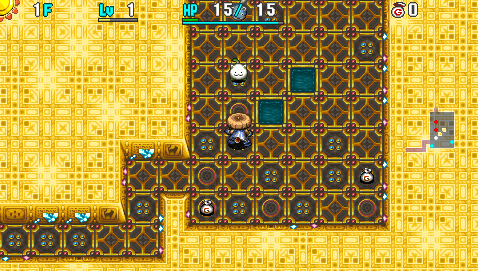

  

A PSP version exclusive dungeon where it's always daytime, and only Gitan can be found on the ground. There are guaranteed shops on 1-3F and on floors that are a multiple of 10 except for 50F. Both regular and elite shops are on the common side, but Pick-A-Choice shops don't appear.

Many key items to overcome the harsh monster table are Elite Shop exclusive, so luck is a bigger factor. You won't be able to purchase all items early on, so smart decision making is required when shopping. It tests techniques such as stealing and using Gitan as a projectile, along with the usual things.

<ul class="quickLinksUL">
  <li><a href="#overview">Overview</a></li>
  <li><a href="#strategy">Strategy</a></li>
  <li><a href="#floor-guide">Floor Guide</a></li>
  <li><a href="#monsters">Monsters</a></li>
  <li><a href="#items">Items</a></li>
  <li><a href="#traps">Traps</a></li>
</ul>

# Overview

<table class="dungeonOverview">
  <tr>
    <th>Unlock</th>
    <td class="highlightYellow">Go to Novice House after clearing the main story.</td>
  </tr>
  <tr>
    <th>Entrance</th>
    <td class="highlightYellow">Boronga Village (Shady Man in Novice House)</td>
  </tr>
</table>

<table class="dungeonTable">
  <tr>
    <th>Floors</th>
    <td>50F</td>
    <th>Day / Night</th>
    <td>Day</td>
  </tr>
  <tr>
    <th>Bring Items</th>
    <td>No</td>
    <th>Allies</th>
    <td>No</td>
  </tr>
  <tr>
    <th>Unidentified</th>
    <td colspan="3">All categories</td>
  </tr>
  <tr>
    <th>Shops</th>
    <td>Regular, Elite</td>
    <th>Monster Houses</th>
    <td>Regular, Sudden</td>
  </tr>
  <tr>
    <th>Initial Enemies</th>
    <td>6~12</td>
    <th>Spawn Rate</th>
    <td>30</td>
  </tr>
  <tr>
    <th>Ominous aura</th>
    <td>No</td>
    <th>Winds of Kron</th>
    <td>1st: 900 / 4th: 1200</td>
  </tr>
  <tr>
    <th>Clear Icon</th>
    <td class="clearIcon"></td>
    <th>Clear Bonus</th>
    <td>30,000,000</td>
  </tr>
  <tr>
    <th>Reward</th>
    <td colspan="3">Clearance Sword</td>
  </tr>
</table>

# Strategy

<ul class="quickLinksUL">
  <li><a href="#general">General</a></li>
  <li><a href="#shopping">Shopping</a></li>
  <li><a href="#equipment">Equipment</a></li>
</ul>

### General

Each floor has an average of 4000 Gitan or so on the ground, and a shop is always generated on 1-3F. The items you find in these 3 shops basically determines how early game plays out in this dungeon.

It's common to collapse on 4F due to a lack of a shield, or to starve around 7F due to a lack of bananas, so you need to prioritize buying certain item categories with the limited funds you have at the start. Merchandise is also unidentified, so price identification is important to make the most of your funds.

After the first 3 floors, shops are only guaranteed on 10F, 20F, 30F, and 40F. This means if you're unlucky, you'll have to get by with the few items you were able to buy until 10F, and generally the number of items you consume is greater than the number of items you obtain. ※ Regular shops are usually generated in the upper left side of the map in this game.

Never found in shops:

- Tunnel Staff
- Rusty Pickaxe
- Rusty Pick
- Rage Grass
- Grounded Scroll
- Muzzled Scroll
- Wall Clip Bracelet
- Fixer Scroll

Can be found in shops:

- Monster Pot
- Attraction Scroll
- Mon House Scroll
- Warp Bracelet
- Explosion Bracelet

#### Notes

- Open type pots are either Heal or Monster.
- Don't bother identifying 800G scrolls after you identify Fear.
- 1000G scrolls should be identified using Identify Pot or Identify Scroll.
    - Confusion and Slumber are valuable, but there's risk of it being Mon House.
- 5000G bracelets are either Warp, Heal, or Explosion.
    - Equipping the bracelet to check for Heal Bracelet is risky.
- 2000G bracelets are either Strength or Pierce.
- 1600\~2000G pots are either Blessing or Curse.
- 2000G grasses are always Invincible.
- Elite shops never have negative effect items.
    - Negative effect items include Monster Pot, Curse Pot, Lost Scroll, etc.
- Elite shop exclusive items include:
    - Revival Grass
    - Blank Scroll
    - Extinction Scroll
    - Monster Detector
    - Item Detector

### Shopping

This section focuses on early game shopping - See the next section for equipment.

#### Top Priority

- Storage Pot
    - Food is hard to obtain, so it's important to protect bananas from spoiling or being grilled.
    - Firepuff appears around the time the banana you start with turns into a Ripe Banana.
- Identify Pot
    - Identify merchandise to avoid wasting money on unneeded items.
    - Can also be used to store Ripe Bananas.
- Bananas
    - Buy every banana you come across.
- Invitation
    - Always found identified.
    - Many key items are only found in Elite Shops, so buy every Invitation you come across.
- Decoy Staff
    - Nice to have when you need to escape from a bad situation.
    - Can also be used to hunt Gitan Mamels on 2-3F.
- Pinning Staff
    - Escape from a bad situation, or steal from a shop.
- Herb (50G)
    - Insert into a pot to try and identify the pot - 690\~750 Gitan pots are best.
- Grass (100G)
    - Antidote Grass and Warp Grass are valuable synthesis ingredients.
    - Otogiriso is common, and Poison Grass is on the rare side.
- Heal Grass (200G)
    - Heal Pots are too expensive at first, so buy these as HP restoring items.
- Identify Scroll
    - Identify items like Heal Pot, Seal Staff, and Decoy Staff without consuming any uses.
    - There's a chance it'll identify all items not in pots when you read it.
- Rocks
    - If you find a Spoil Trap, lure monsters onto the trap and throw rocks to obtain Spoiled Bananas.
    - Insert into a pot to try and identify the pot - 1150\~1250 Gitan pots are best.

#### High Priority

- Cleansing Bracelet
    - Difficult to identify, but nice for Mutaikon (14, 16F) and Demon Scorp (19-21F) floors.
- Pierce Bracelet
    - Makes throwing Gitan as a projectile more effective.
    - Use it with 2 bracelet resonance equipment + Monster Detector for great results.
- Strength Bracelet
    - Increases damage output of direct attacks and arrows.
- Paralysis Staff
    - Disable monsters, steal from a shop, or use it as a synthesis ingredient.
- Swap Staff
    - Rush stairs, steal from a shop.
- Transient Staff
    - Quickly locate stairs if you have a Monster Detector, steal from a shop.
- Grass (300G)
    - Swift Grass is fantastic.
    - Sight Grass, Dizzy Grass, and Blind Grass are synthesis ingredients.
- Grass (500G)
    - Sleep Grass, Dragon Grass, and Life Grass are synthesis ingredients.
    - Rage Grass is never found in shops.
- Blessing Pot
    - Use it to bless Revival Grass, Invincible Grass, Suction Scroll, etc.

#### Other Notable

- 4-2-8 Pot
    - Throw it to one-shot a single target and all monsters around it.
- Talismans
    - Expensive, so it's not recommended to purchase these.
    - Miss Talisman can be thrown at a group of Jouncy on 44F to skip some Horrabbit floors.
- Bracelets (3000G)
    - Not recommended to purchase these, since there are so many possibilities in the price range.

### Equipment

Obtaining a main weapon and shield is top priority for early game. If you don't buy equipment between 1-3F, you likely won't make it to the next guaranteed shop on 10F. Weapons and shields considered main equipment candidates don't appear in Elite Shops. ※ The number in parenthesis next to the item name is the item's base price.

#### Weapon

<ul>
  <li>Red Blade (4200)
    <ul>
      <li>14 attack, 3 rune slots (gains 1 per level), very slow growth rate.</li>
      <li>This dungeon is only 50F, so you're unlikely to reach Lv8.</li>
    </ul>
  </li>
  <li>Meteor Edge (3000)
    <ul>
      <li>12 attack (16 at Lv2), 4 rune slots (6 at Lv2), average growth rate.</li>
      <li>The best option for this dungeon.</li>
    </ul>
  </li>
  <li>Dotanuki (2200)
    <ul>
      <li>10 attack, 5 rune slots (6 at Lv2), faster growth rate.</li>
      <li>The weapon of this set is strong, but Clan Shield lacks defense.</li>
    </ul>
  </li>
  <li>Beast Fang (1600)
    <ul>
      <li>8 attack, 3 rune slots (5 at Lv2), very fast growth rate.</li>
      <li>The weapon of this set is weak, but Beast Shield has good defense.</li>
    </ul>
  </li>
  <li>Katana, Copper Edge, Palm Stick
    <ul>
      <li>Better than nothing, but switch to a stronger weapon if possible.</li>
    </ul>
  </li>
</ul>

#### Runes

See [Runes](/system/synthesis-runes) for details.

##### Priority Chart

<table>
  <thead>
    <tr>
      <th>Priority</th>
      <th>Runes</th>
    </tr>
  </thead>
  <tbody>
    <tr>
      <td class="highlightRed">Top</td>
      <td>Tri-direction, Anti-Floating, Anti-Drain, Anti-Cyclops, Sedating, Paralyzing</td>
    </tr>
    <tr>
      <td class="highlightPink">High</td>
      <td>Anti-Aquatic, Anti-Dragon, Confusing, Blinding</td>
    </tr>
    <tr>
      <td class="highlightYellow">Mid</td>
      <td>Charge, Anti-Bomb, Quick Hitting, HP+15, HP+20</td>
    </tr>
    <tr>
      <td class="highlightLightblue">Low</td>
      <td>HP+5, HP+10</td>
    </tr>
  </tbody>
</table>

#### Shield

<ul>
  <li>Red Shield (4800)
    <ul>
      <li>14 defense, 4 rune slots (5 at Lv2), very slow growth rate.</li>
      <li>This dungeon is only 50F, so you're unlikely to reach Lv8.</li>
    </ul>
  </li>
  <li>Meteor Guard (3200)
    <ul>
      <li>12 defense (16 at Lv2), 5 rune slots (6 at Lv2), average growth rate.</li>
      <li>The best option for this dungeon.</li>
    </ul>
  </li>
  <li>Clan Shield (1800)
    <ul>
      <li>8 defense, 5 rune slots (6 at Lv2), very fast growth rate.</li>
      <li>The shield of this set is weak, but Dotanuki has good attack power.</li>
    </ul>
  </li>
  <li>Beast Shield (2400)
    <ul>
      <li>10 defense, 4 rune slots (6 at Lv2), faster growth rate.</li>
      <li>The shield of this set is strong, but Beast Fang lacks attack power.</li>
    </ul>
  </li>
  <li>Iron Targe, Copper Guard, Palm Shield
    <ul>
      <li>Better than nothing, but switch to a stronger shield if possible.</li>
    </ul>
  </li>
</ul>

#### Runes

See [Runes](/system/synthesis-runes) for details.

##### Priority Chart

<table>
  <thead>
    <tr>
      <th>Priority</th>
      <th>Runes</th>
    </tr>
  </thead>
  <tbody>
    <tr>
      <td class="highlightRed">Top</td>
      <td>1/2 Blast, Agile, Counter, HP+15, HP+20, Unmoving</td>
    </tr>
    <tr>
      <td class="highlightPink">High</td>
      <td>Rustproof, Anti-Peck</td>
    </tr>
    <tr>
      <td class="highlightYellow">Mid</td>
      <td>1/2 Fire, Anti-Theft, HP+10</td>
    </tr>
    <tr>
      <td class="highlightLightblue">Low</td>
      <td>Anti-Burgle, HP+5</td>
    </tr>
  </tbody>
</table>

※ Unmoving is top priority, but Steady Shield should be used as a secondary shield.

#### Bracelets

<ul>
  <li>Monster Detector
    <ul>
      <li>Elite Shop exclusive - Locate shops at a glance, and generally have a much easier time until 45F.</li>
    </ul>
  </li>
  <li>Pierce Bracelet
    <ul>
      <li>Arrows and thrown Gitan can damage a line of enemies.</li>
    </ul>
  </li>
  <li>Heal Bracelet
    <ul>
      <li>Quickly recover HP after fighting a powerful monster or stepping on a landmine.</li>
      <li>Powerful, but food is hard to obtain in this dungeon, so it can be risky to use it.</li>
    </ul>
  </li>
  <li>Strength Bracelet
    <ul>
      <li>Increases damage dealt by arrows and direct attacks.</li>
    </ul>
  </li>
  <li>Cleansing Bracelet
    <ul>
      <li>Nice for Mutaikon (14, 16F) and Demon Scorp (19-21F) floors.</li>
    </ul>
  </li>
  <li>Calm Bracelet
    <ul>
      <li>Nice for Blade Bee types, MC Mage (25, 27, 29F), and Dazikon (30-33F) floors.</li>
    </ul>
  </li>
  <li>Warp Bracelet
    <ul>
      <li>Skip having to walk through hallways, though warping can be risky.</li>
    </ul>
  </li>
</ul>

# Floor Guide

### 1-3F

Hallways are visible, and regular shops are guaranteed to be generated on all 3 floors. There's an average of 4000 Gitan on the ground per floor, so think carefully before buying items. Buy every banana and Invitation you find - Firepuff appears on 5F, so don't worry about bananas spoiling. Items like Blank Scroll and Monster Detector are Elite Shop exclusive, so Invitations are valuable.

Prioritize buying Storage Pot, Identify Pot, Decoy Staff, a shield with 12+ defense, and a weapon with 10+ attack.

If a pot costs 690\~750G, insert an Herb (50G), grass (300G), scroll (500G), grass (500G), or grass (100G) to try and identify the pot, with the listed options ordered from best to worst starting from the left. If you couldn't identify the pot after inserting 1 item, you only have to pay for the lost capacity, and if you were able to identify the pot, go ahead and buy the pot + the item you inserted.

Swing staves at monsters inside shops to identify them, though you'll have to pay for depleted uses. 1200\~1350G - It might be Knockback Staff, so be careful not to send a monster flying at the Shopkeeper. 2400\~2600G - Either Decoy Staff or Seal Staff - If it's Decoy, hunt a couple of Gitan Mamels on 2-3F. 

A shield with 12+ defense lets you safely collect arrows from Boy Cart (4, 6F). However, doing so can be a bit inefficient if you leveled up by hunting Gitan Mamels.

Herb (50G), grass (100G), Heal Grass (200G), Identify Scroll (300G), and rocks are all nice and cheap items. Pinning Staff (1200\~1350G) isn't cheap, but lets you potentially steal from shops, so it's worth buying.

DJ Mage (3, 5, 7F) can cause accidents while shopping with its warp or knockback magic bullet effects, but otherwise there aren't really any dangerous monsters on these floors.

All said, some players prefer to retry the dungeon if they didn't find decent equipment by the 3rd shop.

### 4-6F

Hallways are dark from here until the end, and specialty and elite shops can now be generated. Shops are generated randomly from 4F, but there are still guaranteed shops on 10F, 20F, 30F, and 40F. If you're unlucky, you won't encounter another shop until 10F, meaning you can't restock items.

Boy Cart (4, 6F) provides an extremely important chance to collect arrows. Ominous Aura doesn't occur, so linger until the 3rd gust of wind if you have the food to do so. If you're doing it on 4F, have Boy Cart shoot arrows at Bored Kappa (2-4F) for efficiency - 200 should be plenty. Kumonigiri (5-8F) has a 4% chance to drop Onigiri, so 6F is potentially easier to linger on.

If you don't have a Storage Pot, beware of Firepuff (5, 7F) turning bananas into Grilled Bananas. Taking extra actions depletes a bit of fullness, but you can place bananas on the ground to keep them safe.

Without equipment, it starts to get harsh around Ironhead (6-9F) and Tiger Tosser (7-10F) floors. Be especially careful around these monsters if they have auras.

Keep 6000 Gitan on hand at all times in case you find Monster Detector and Revival Grass in an Elite Shop. Otherwise, look for Transient, Paralysis, Swap staves, Blessing Pot, Pierce and Strength bracelets, etc. 1000G scrolls are also great buys if you haven't found Confusion or Slumber scrolls yet.

### 7-9F

Gazer (7-9F) can potentially force you to use valuable items with its hypnosis. Otherwise, there's nothing too dangerous if you have a decent weapon and shield.

### 10-12F

Mixer (10-12F) appears - The only other floor range with Mixer types is Mixermon on 20-22F. It's rare to have equipment as ingredients at this point, so you'll want to add runes by synthesizing grass. Prioritize upgrade value instead of runes for your shield, and don't linger to the point where you risk starvation.

Consider yourself doing well if you synthesize 3\~4 of these runes: Weapon - Anti-Floating, Anti-Drain, Anti-Cyclops, Confusing, Blinding, Sedating. Shield - 1/2 Blast, 1/2 Fire, HP+20, HP+15

Anti-Aquatic is also good, but 800G scrolls are expensive early on, so aim for it on Mixermon floors instead.

Use a mix of direct attacks and projectiles like rocks to safely deal with Explochin (9-11F). Explochin has 62 HP, stops moving after receiving 35 damage, and explodes after receiving 50 damage. If a direct attack with a weapon dealt 25\~28 damage, hitting it again will make it explode, so either unequip your weapon or throw a rock.

### 13-17F

Troublesome monsters like Spin Polygon (12-14F), Gyadon (13-15F), and Mutaikon (14, 16F) appear. Beanie (15-19F) has higher attack power and doesn't have a type-effective weakness.

Shiren's max HP usually reaches 100+ around this point, so natural HP regen can't keep up with damage. Use arrows or throw Gitan to soften soften enemies, then finish them with a direct attack.

If you found a Cleansing Bracelet, replenish fullness and stock up on Poison Grass using Mutaikon.

### 18-23F

Big Chintala (18-23F), Demon Scorp (19-21F), Super Gazer (21-23F), and Curse Sister (22-24F) appear.

From this point, you'll consume more items than you gain unless there's a shop on the floor. If you didn't collect arrows earlier, you probably won't be able to go around the floor to check for shops. ※ Regular shops are usually generated in the upper left side of the map in this game, so check there first.

Mixermon (20-22F) is your last chance to synthesize items without a Synthesis Pot. However, you're likely to burn through quite a few items if you linger too long, so don't push it. This would be a good time to try for Anti-Aquatic if you have any 800G scrolls.

### 24-29F

Eligan (24-29F) and Dragon (26-29F) have high HP so you'll burn through projectiles pretty quickly, and Hipadile (22-25F) is hard to hit with projectiles due to its chess knight movement in rooms. MC Mage (25, 27, 29F) has 51 HP, so you can one-shot it by throwing 510+ Gitan.

If you have a Blank Scroll, throw an Extinction Scroll at Scarabbit (27-29F) - Line 2 of them up before throwing it.

### 30-33F

Chainhead (29-34F), Grampa Tank (30-32F), Dazikon (30-33F), and Spongiderm (31-33F) are dangerous.

Grampa Tank's cannonballs deal 30 damage unless you were able to synthesize 1/2 Blast. Use projectiles to soften Spongiderm before using direct attacks if you have status inflicting runes. Dazikon has 46 HP, so you can one-shot it by throwing 460+ Gitan.

It's probably best to rush stairs even if you spot a shop on these floors, unless it's an Elite Shop.

### 34-39F

Voltdon (33-35F) can surprise you in hallways, and Banana Morph (34-36F) can turn items into bananas. Pandanigiri (36-40F) has high attack power, Squid Emperor (37-39F) blinds you from anywhere in the room, and Gyairas (36-41F) pecks scrolls and talismans.

There's nothing too dangerous if you use projectiles, so it should be easier than the previous floor range. Don't shoot arrows at Steamroid (35-40F) if it's standing on a Summon or Revitalize trap.

The final stretch is a nightmare zone, so try to check for shops to stock up on items.

### 40-44F

※ 40-43F have a high chance of being magma floors.

Nuttie (40-44F) has high attack power, and Iai (41-43F) and Ooze (41-43F) are a threat to your equipment. Eagle Tengu (40-44F) also appears, making you waste items thinking it was a more dangerous monster. Magma eruptions make it difficult to know the remaining HP of Fulminachins (42-44F) on the floor, and Ooze can multiply and Jouncy (40-44F) can wake up from magma damage.

It's best to rush stairs on these magma floors unless you're low on items and happen to see a shop. The next floor range is absolutely evil, so it's highly recommended to utilize Jouncy's floor warp on 44F. You can do so using items like Miss Talisman or Invincible Grass. ※ Afraid status will not work, since it disables the use of special attacks.

### 45-50F

Power types like Eligagon (47-50F) and Hell Gyaza (48-50F) appear. Ranged attackers include Sky Dragon (44-46F), Lt. Yanpii (45-47F), Ornery Tank (48-50F), and Tiger Ace (48-50F). Tricky types include Horrabbit (45-50F), Curse Mom (46-48F), and Hyper Gazer (48-50F).

Many of these monsters normally appear in the 60\~80F range in Bayside Monster Cave. It's a bit ridiculous that they show up this early into a dungeon, and can cause a game over at any moment, even if you have a Steady Shield to counter Horrabbit and an assortment of other powerful items.

If you have a Blank Scroll, throw an Extinction Scroll at Horrabbit even if you have a Steady Shield. Horrabbit's attraction cancels paralyzed status from Paralysis or Transient staves, and the inability to use Pinning or Swap staves while the shield is equipped can mean life or death.

Rooms with special doors can be generated on 48-50F, but avoid entering them at all costs. If you get stuck in a room with Hell Gyaza, you're likely to collapse unless you have Swift or Invincible grass. This remains true even if you managed to synthesize Anti-Aquatic, Critical, and status inflicting runes. ※ Stairs are never generated in rooms with doors.

If you get attracted by Horrabbit, there's a high chance for Ornery Tank to level up into Cranky Tank. There isn't much you can do if there are multiple Hell Gyazas, but items are effective against other monsters, so think carefully about the situation before acting if you find yourself in a predicament.

# Monsters

See [Monsters](/system/monsters) for individual monster details.

Floor Colors: Shop Enemy Colors: Farming Useful Destroys Items High Offense Dangerous Very Dangerous

<table class="monsterTable">
  <thead>
    <tr>
      <th>F</th>
      <th colspan="9">Monsters</th>
    </tr>
  </thead>
  <tbody>
    <tr>
      <th class="highlightShop">1</th>
      <td class="">Mamel</td>
      <td class="">Seedie</td>
      <td class="">Chintala</td>
      <td class="highlightGray"></td>
      <td class="highlightGray"></td>
      <td class="highlightGray"></td>
      <td class="highlightGray"></td>
      <td class="highlightGray"></td>
      <td class="highlightGray"></td>
    </tr>
    <tr>
      <th class="highlightShop">2</th>
      <td class="">Mamel</td>
      <td class="">Seedie</td>
      <td class="">Chintala</td>
      <td class="">Pit Mamel</td>
      <td class="">Bored Kappa</td>
      <td class="highlightGray"></td>
      <td class="highlightGray"></td>
      <td class="highlightGray"></td>
      <td class="highlightGray"></td>
    </tr>
    <tr>
      <th class="highlightShop">3</th>
      <td class="highlightFarming">Froggo</td>
      <td class="">Seedie</td>
      <td class="">Chintala</td>
      <td class="">Pit Mamel</td>
      <td class="">Bored Kappa</td>
      <td class="">Banana Novice</td>
      <td class="">Crow Tengu</td>
      <td class="">Cheer Ham</td>
      <td class="highlightDanger">DJ Mage</td>
    </tr>
    <tr>
      <th>4</th>
      <td class="highlightFarming">Froggo</td>
      <td class="">Blade Bee</td>
      <td class="highlightGray"></td>
      <td class="highlightGray"></td>
      <td class="">Bored Kappa</td>
      <td class="">Banana Novice</td>
      <td class="">Crow Tengu</td>
      <td class="">Cheer Ham</td>
      <td class="highlightUseful">Boy Cart</td>
    </tr>
    <tr>
      <th>5</th>
      <td class="highlightFarming">Froggo</td>
      <td class="">Blade Bee</td>
      <td class="">Kumonigiri</td>
      <td class="">Firepuff</td>
      <td class="highlightGray"></td>
      <td class="">Banana Novice</td>
      <td class="">Crow Tengu</td>
      <td class="">Cheer Ham</td>
      <td class="highlightDanger">DJ Mage</td>
    </tr>
    <tr>
      <th>6</th>
      <td class="highlightFarming">Froggo</td>
      <td class="">Blade Bee</td>
      <td class="">Kumonigiri</td>
      <td class="highlightGray"></td>
      <td class="">Ironhead</td>
      <td class="highlightGray"></td>
      <td class="highlightGray"></td>
      <td class="">Cheer Ham</td>
      <td class="highlightUseful">Boy Cart</td>
    </tr>
    <tr>
      <th>7</th>
      <td class="highlightFarming">Froggo</td>
      <td class="highlightItem">Gazer</td>
      <td class="">Kumonigiri</td>
      <td class="">Firepuff</td>
      <td class="">Ironhead</td>
      <td class="">Tiger Tosser</td>
      <td class="highlightGray"></td>
      <td class="highlightGray"></td>
      <td class="highlightDanger">DJ Mage</td>
    </tr>
    <tr>
      <th>8</th>
      <td class="">Absorbiphant</td>
      <td class="highlightItem">Gazer</td>
      <td class="">Kumonigiri</td>
      <td class="highlightGray"></td>
      <td class="">Ironhead</td>
      <td class="">Tiger Tosser</td>
      <td class="highlightGray"></td>
      <td class="highlightGray"></td>
      <td class="highlightGray"></td>
    </tr>
    <tr>
      <th>9</th>
      <td class="">Absorbiphant</td>
      <td class="highlightItem">Gazer</td>
      <td class="highlightDanger">Explochin</td>
      <td class="">Floaty</td>
      <td class="">Ironhead</td>
      <td class="">Tiger Tosser</td>
      <td class="highlightGray"></td>
      <td class="highlightGray"></td>
      <td class="highlightGray"></td>
    </tr>
    <tr>
      <th class="highlightShop">10</th>
      <td class="">Absorbiphant</td>
      <td class="highlightUseful">Mixer</td>
      <td class="highlightDanger">Explochin</td>
      <td class="">Floaty</td>
      <td class="highlightDanger">Porky</td>
      <td class="">Tiger Tosser</td>
      <td class="">Pumphantasm</td>
      <td class="highlightGray"></td>
      <td class="highlightGray"></td>
    </tr>
    <tr>
      <th>11</th>
      <td class="highlightOffense">Zapdon</td>
      <td class="highlightUseful">Mixer</td>
      <td class="highlightDanger">Explochin</td>
      <td class="">Floaty</td>
      <td class="highlightDanger">Porky</td>
      <td class="highlightGray"></td>
      <td class="">Pumphantasm</td>
      <td class="highlightGray"></td>
      <td class="highlightGray"></td>
    </tr>
    <tr>
      <th>12</th>
      <td class="highlightOffense">Zapdon</td>
      <td class="highlightUseful">Mixer</td>
      <td class="">Spin Polygon</td>
      <td class="">Floaty</td>
      <td class="highlightDanger">Porky</td>
      <td class="highlightGray"></td>
      <td class="">Pumphantasm</td>
      <td class="highlightGray"></td>
      <td class="highlightGray"></td>
    </tr>
    <tr>
      <th>13</th>
      <td class="highlightOffense">Zapdon</td>
      <td class="highlightItem">Gyadon</td>
      <td class="">Spin Polygon</td>
      <td class="">Strong Cart</td>
      <td class="highlightDanger">Porky</td>
      <td class="highlightGray"></td>
      <td class="">Pumphantasm</td>
      <td class="highlightGray"></td>
      <td class="highlightGray"></td>
    </tr>
    <tr>
      <th>14</th>
      <td class="">Squid Lord</td>
      <td class="highlightItem">Gyadon</td>
      <td class="">Spin Polygon</td>
      <td class="highlightDanger">Mutaikon</td>
      <td class="">Flamepuff</td>
      <td class="highlightGray"></td>
      <td class="">Pumphantasm</td>
      <td class="highlightGray"></td>
      <td class="highlightGray"></td>
    </tr>
    <tr>
      <th>15</th>
      <td class="">Squid Lord</td>
      <td class="highlightItem">Gyadon</td>
      <td class="">Dagger Bee</td>
      <td class="">Strong Cart</td>
      <td class="">Flamepuff</td>
      <td class="highlightGray"></td>
      <td class="highlightGray"></td>
      <td class="highlightGray"></td>
      <td class="highlightGray"></td>
    </tr>
    <tr>
      <th>16</th>
      <td class="">Squid Lord</td>
      <td class="highlightGray"></td>
      <td class="">Dagger Bee</td>
      <td class="highlightDanger">Mutaikon</td>
      <td class="">Flamepuff</td>
      <td class="highlightOffense">Beanie</td>
      <td class="">Digestiphant</td>
      <td class="highlightGray"></td>
      <td class="highlightGray"></td>
    </tr>
    <tr>
      <th>17</th>
      <td class="">Squid Lord</td>
      <td class="highlightFarming">Zalokleft</td>
      <td class="">Dagger Bee</td>
      <td class="">Glare Bird</td>
      <td class="highlightGray"></td>
      <td class="highlightOffense">Beanie</td>
      <td class="">Digestiphant</td>
      <td class="highlightGray"></td>
      <td class="highlightGray"></td>
    </tr>
    <tr>
      <th>18</th>
      <td class="highlightItem">Kengo</td>
      <td class="highlightFarming">Zalokleft</td>
      <td class="">Dagger Bee</td>
      <td class="">Glare Bird</td>
      <td class="highlightOffense">Big Chintala</td>
      <td class="highlightOffense">Beanie</td>
      <td class="">Digestiphant</td>
      <td class="">Go Ham</td>
      <td class="highlightGray"></td>
    </tr>
    <tr>
      <th>19</th>
      <td class="highlightItem">Kengo</td>
      <td class="highlightFarming">Zalokleft</td>
      <td class="">Demon Scorp</td>
      <td class="">Glare Bird</td>
      <td class="highlightOffense">Big Chintala</td>
      <td class="highlightOffense">Beanie</td>
      <td class="highlightGray"></td>
      <td class="highlightGray"></td>
      <td class="highlightGray"></td>
    </tr>
    <tr>
      <th class="highlightShop">20</th>
      <td class="highlightItem">Kengo</td>
      <td class="highlightUseful">Mixermon</td>
      <td class="">Demon Scorp</td>
      <td class="highlightGray"></td>
      <td class="highlightOffense">Big Chintala</td>
      <td class="highlightGray"></td>
      <td class="highlightGray"></td>
      <td class="">Go Ham</td>
      <td class="highlightGray"></td>
    </tr>
    <tr>
      <th>21</th>
      <td class="highlightItem">Kengo</td>
      <td class="highlightUseful">Mixermon</td>
      <td class="">Demon Scorp</td>
      <td class="highlightItem">Super Gazer</td>
      <td class="highlightOffense">Big Chintala</td>
      <td class="highlightGray"></td>
      <td class="highlightGray"></td>
      <td class="highlightGray"></td>
      <td class="highlightGray"></td>
    </tr>
    <tr>
      <th>22</th>
      <td class="highlightOffense">Hipadile</td>
      <td class="highlightUseful">Mixermon</td>
      <td class="highlightItem">Curse Sister</td>
      <td class="highlightItem">Super Gazer</td>
      <td class="highlightOffense">Big Chintala</td>
      <td class="highlightGray"></td>
      <td class="highlightGray"></td>
      <td class="">Go Ham</td>
      <td class="highlightGray"></td>
    </tr>
    <tr>
      <th>23</th>
      <td class="highlightOffense">Hipadile</td>
      <td class="">Kappa Pest</td>
      <td class="highlightItem">Curse Sister</td>
      <td class="highlightItem">Super Gazer</td>
      <td class="highlightOffense">Big Chintala</td>
      <td class="highlightGray"></td>
      <td class="highlightGray"></td>
      <td class="highlightGray"></td>
      <td class="highlightGray"></td>
    </tr>
    <tr>
      <th>24</th>
      <td class="highlightOffense">Hipadile</td>
      <td class="">Kappa Pest</td>
      <td class="highlightItem">Curse Sister</td>
      <td class="highlightDanger">Concusschin</td>
      <td class="highlightOffense">Eligan</td>
      <td class="highlightGray"></td>
      <td class="highlightGray"></td>
      <td class="highlightGray"></td>
      <td class="highlightGray"></td>
    </tr>
    <tr>
      <th>25</th>
      <td class="highlightOffense">Hipadile</td>
      <td class="">Kappa Pest</td>
      <td class="highlightDanger">MC Mage</td>
      <td class="highlightDanger">Concusschin</td>
      <td class="highlightOffense">Eligan</td>
      <td class="highlightGray"></td>
      <td class="highlightGray"></td>
      <td class="highlightGray"></td>
      <td class="highlightGray"></td>
    </tr>
    <tr>
      <th>26</th>
      <td class="highlightOffense">Dragon</td>
      <td class="">Kappa Pest</td>
      <td class="highlightItem">Grime</td>
      <td class="highlightDanger">Concusschin</td>
      <td class="highlightOffense">Eligan</td>
      <td class="highlightGray"></td>
      <td class="highlightGray"></td>
      <td class="highlightGray"></td>
      <td class="highlightGray"></td>
    </tr>
    <tr>
      <th>27</th>
      <td class="highlightOffense">Dragon</td>
      <td class="">Kappa Pest</td>
      <td class="highlightDanger">MC Mage</td>
      <td class="highlightDanger">Scarabbit</td>
      <td class="highlightOffense">Eligan</td>
      <td class="highlightGray"></td>
      <td class="highlightGray"></td>
      <td class="highlightGray"></td>
      <td class="highlightGray"></td>
    </tr>
    <tr>
      <th>28</th>
      <td class="highlightOffense">Dragon</td>
      <td class="">Kappa Pest</td>
      <td class="highlightItem">Grime</td>
      <td class="highlightDanger">Scarabbit</td>
      <td class="highlightOffense">Eligan</td>
      <td class="highlightGray"></td>
      <td class="highlightGray"></td>
      <td class="highlightGray"></td>
      <td class="highlightGray"></td>
    </tr>
    <tr>
      <th>29</th>
      <td class="highlightOffense">Dragon</td>
      <td class="highlightOffense">Chainhead</td>
      <td class="highlightDanger">MC Mage</td>
      <td class="highlightDanger">Scarabbit</td>
      <td class="highlightOffense">Eligan</td>
      <td class="highlightGray"></td>
      <td class="highlightGray"></td>
      <td class="highlightGray"></td>
      <td class="highlightGray"></td>
    </tr>
    <tr>
      <th class="highlightShop">30</th>
      <td class="highlightDanger">Grampa Tank</td>
      <td class="highlightOffense">Chainhead</td>
      <td class="highlightItem">Grime</td>
      <td class="highlightDanger">Dazikon</td>
      <td class="">Dance Polygon</td>
      <td class="highlightGray"></td>
      <td class="highlightGray"></td>
      <td class="highlightGray"></td>
      <td class="highlightGray"></td>
    </tr>
    <tr>
      <th>31</th>
      <td class="highlightDanger">Grampa Tank</td>
      <td class="highlightOffense">Chainhead</td>
      <td class="">Spongiderm</td>
      <td class="highlightDanger">Dazikon</td>
      <td class="">Dance Polygon</td>
      <td class="highlightGray"></td>
      <td class="highlightGray"></td>
      <td class="highlightGray"></td>
      <td class="highlightGray"></td>
    </tr>
    <tr>
      <th>32</th>
      <td class="highlightDanger">Grampa Tank</td>
      <td class="highlightOffense">Chainhead</td>
      <td class="">Spongiderm</td>
      <td class="highlightDanger">Dazikon</td>
      <td class="">Dance Polygon</td>
      <td class="highlightGray"></td>
      <td class="highlightGray"></td>
      <td class="highlightGray"></td>
      <td class="highlightGray"></td>
    </tr>
    <tr>
      <th>33</th>
      <td class="highlightOffense">Voltdon</td>
      <td class="highlightOffense">Chainhead</td>
      <td class="">Spongiderm</td>
      <td class="highlightDanger">Dazikon</td>
      <td class="">Tiger Hurler</td>
      <td class="highlightGray"></td>
      <td class="highlightGray"></td>
      <td class="highlightGray"></td>
      <td class="highlightGray"></td>
    </tr>
    <tr>
      <th>34</th>
      <td class="highlightOffense">Voltdon</td>
      <td class="highlightOffense">Chainhead</td>
      <td class="">Pumphantom</td>
      <td class="highlightItem">Banana Morph</td>
      <td class="">Tiger Hurler</td>
      <td class="highlightGray"></td>
      <td class="highlightGray"></td>
      <td class="highlightGray"></td>
      <td class="highlightGray"></td>
    </tr>
    <tr>
      <th>35</th>
      <td class="highlightOffense">Voltdon</td>
      <td class="">Steamroid</td>
      <td class="">Pumphantom</td>
      <td class="highlightItem">Banana Morph</td>
      <td class="">Tiger Hurler</td>
      <td class="highlightGray"></td>
      <td class="highlightGray"></td>
      <td class="highlightGray"></td>
      <td class="highlightGray"></td>
    </tr>
    <tr>
      <th>36</th>
      <td class="highlightOffense">Pandanigiri</td>
      <td class="">Steamroid</td>
      <td class="">Pumphantom</td>
      <td class="highlightItem">Banana Morph</td>
      <td class="highlightItem">Gyairas</td>
      <td class="highlightGray"></td>
      <td class="highlightGray"></td>
      <td class="highlightGray"></td>
      <td class="highlightGray"></td>
    </tr>
    <tr>
      <th>37</th>
      <td class="highlightOffense">Pandanigiri</td>
      <td class="">Steamroid</td>
      <td class="">Pumphantom</td>
      <td class="highlightDanger">Squid Emperor</td>
      <td class="highlightItem">Gyairas</td>
      <td class="highlightGray"></td>
      <td class="highlightGray"></td>
      <td class="highlightGray"></td>
      <td class="highlightGray"></td>
    </tr>
    <tr>
      <th>38</th>
      <td class="highlightOffense">Pandanigiri</td>
      <td class="">Steamroid</td>
      <td class="">Pumphantom</td>
      <td class="highlightDanger">Squid Emperor</td>
      <td class="highlightItem">Gyairas</td>
      <td class="">Rally Ham</td>
      <td class="highlightGray"></td>
      <td class="highlightGray"></td>
      <td class="highlightGray"></td>
    </tr>
    <tr>
      <th>39</th>
      <td class="highlightOffense">Pandanigiri</td>
      <td class="">Steamroid</td>
      <td class="">Pumphantom</td>
      <td class="highlightDanger">Squid Emperor</td>
      <td class="highlightItem">Gyairas</td>
      <td class="">Rally Ham</td>
      <td class="highlightGray"></td>
      <td class="highlightGray"></td>
      <td class="highlightGray"></td>
    </tr>
    <tr>
      <th class="highlightShop">40</th>
      <td class="highlightOffense">Pandanigiri</td>
      <td class="">Steamroid</td>
      <td class="highlightOffense">Nuttie</td>
      <td class="highlightUseful">Jouncy</td>
      <td class="highlightItem">Gyairas</td>
      <td class="">Rally Ham</td>
      <td class="">Eagle Tengu</td>
      <td class="highlightGray"></td>
      <td class="highlightGray"></td>
    </tr>
    <tr>
      <th>41</th>
      <td class="highlightItem">Iai</td>
      <td class="highlightItem">Ooze</td>
      <td class="highlightOffense">Nuttie</td>
      <td class="highlightUseful">Jouncy</td>
      <td class="highlightItem">Gyairas</td>
      <td class="highlightGray"></td>
      <td class="">Eagle Tengu</td>
      <td class="highlightGray"></td>
      <td class="highlightGray"></td>
    </tr>
    <tr>
      <th>42</th>
      <td class="highlightItem">Iai</td>
      <td class="highlightItem">Ooze</td>
      <td class="highlightOffense">Nuttie</td>
      <td class="highlightUseful">Jouncy</td>
      <td class="highlightDanger">Fulminachin</td>
      <td class="highlightGray"></td>
      <td class="">Eagle Tengu</td>
      <td class="highlightGray"></td>
      <td class="highlightGray"></td>
    </tr>
    <tr>
      <th>43</th>
      <td class="highlightItem">Iai</td>
      <td class="highlightItem">Ooze</td>
      <td class="highlightOffense">Nuttie</td>
      <td class="highlightUseful">Jouncy</td>
      <td class="highlightDanger">Fulminachin</td>
      <td class="highlightGray"></td>
      <td class="">Eagle Tengu</td>
      <td class="highlightGray"></td>
      <td class="highlightGray"></td>
    </tr>
    <tr>
      <th>44</th>
      <td class="highlightDanger">Sky Dragon</td>
      <td class="highlightGray"></td>
      <td class="highlightOffense">Nuttie</td>
      <td class="highlightUseful">Jouncy</td>
      <td class="highlightDanger">Fulminachin</td>
      <td class="highlightGray"></td>
      <td class="">Eagle Tengu</td>
      <td class="highlightGray"></td>
      <td class="highlightGray"></td>
    </tr>
    <tr>
      <th>45</th>
      <td class="highlightDanger">Sky Dragon</td>
      <td class="highlightExtreme">Horrabbit</td>
      <td class="highlightOffense">Hipadile</td>
      <td class="highlightOffense">Lt. Yanpii</td>
      <td class="highlightGray"></td>
      <td class="highlightGray"></td>
      <td class="highlightGray"></td>
      <td class="highlightGray"></td>
      <td class="highlightGray"></td>
    </tr>
    <tr>
      <th>46</th>
      <td class="highlightDanger">Sky Dragon</td>
      <td class="highlightExtreme">Horrabbit</td>
      <td class="highlightOffense">Hipadile</td>
      <td class="highlightOffense">Lt. Yanpii</td>
      <td class="highlightItem">Curse Mom</td>
      <td class="highlightGray"></td>
      <td class="highlightGray"></td>
      <td class="highlightGray"></td>
      <td class="highlightGray"></td>
    </tr>
    <tr>
      <th>47</th>
      <td class="highlightOffense">Eligagon</td>
      <td class="highlightExtreme">Horrabbit</td>
      <td class="highlightOffense">Hipadile</td>
      <td class="highlightOffense">Lt. Yanpii</td>
      <td class="highlightItem">Curse Mom</td>
      <td class="highlightGray"></td>
      <td class="highlightGray"></td>
      <td class="highlightGray"></td>
      <td class="highlightGray"></td>
    </tr>
    <tr>
      <th>48</th>
      <td class="highlightOffense">Eligagon</td>
      <td class="highlightExtreme">Horrabbit</td>
      <td class="highlightExtreme">Hell Gyaza</td>
      <td class="highlightExtreme">Ornery Tank</td>
      <td class="highlightItem">Curse Mom</td>
      <td class="highlightItem">Hyper Gazer</td>
      <td class="highlightDanger">Tiger Ace</td>
      <td class="highlightGray"></td>
      <td class="highlightGray"></td>
    </tr>
    <tr>
      <th>49</th>
      <td class="highlightOffense">Eligagon</td>
      <td class="highlightExtreme">Horrabbit</td>
      <td class="highlightExtreme">Hell Gyaza</td>
      <td class="highlightExtreme">Ornery Tank</td>
      <td class="highlightGray"></td>
      <td class="highlightItem">Hyper Gazer</td>
      <td class="highlightDanger">Tiger Ace</td>
      <td class="highlightGray"></td>
      <td class="highlightGray"></td>
    </tr>
    <tr>
      <th>50</th>
      <td class="highlightOffense">Eligagon</td>
      <td class="highlightExtreme">Horrabbit</td>
      <td class="highlightExtreme">Hell Gyaza</td>
      <td class="highlightExtreme">Ornery Tank</td>
      <td class="highlightGray"></td>
      <td class="highlightItem">Hyper Gazer</td>
      <td class="highlightDanger">Tiger Ace</td>
      <td class="highlightGray"></td>
      <td class="highlightGray"></td>
    </tr>
  </tbody>
</table>

# Items

- F = Floor, Monster (day)
- S = Shop, Shiny Object (yellow)
- P = Presto Pot
- Z = Zalokleft
- E = Elite Shop, Shiny Object (blue)

 

<table class="dungeonItemTable">
  <tr>
    <th colspan="6" class="highlightGreen">Weapon</th>
    <th rowspan="82"></th>
    <th colspan="6" class="highlightGreen">Bracelet</th>
    <th rowspan="82"></th>
    <th colspan="6" class="highlightGreen">Scroll</th>
  </tr>
  <tr>
    <th>Name</th>
    <th>F</th>
    <th>S</th>
    <th>P</th>
    <th>Z</th>
    <th>E</th>
    <th>Name</th>
    <th>F</th>
    <th>S</th>
    <th>P</th>
    <th>Z</th>
    <th>E</th>
    <th>Name</th>
    <th>F</th>
    <th>S</th>
    <th>P</th>
    <th>Z</th>
    <th>E</th>
  </tr>
  <tr>
    <td class="leftText">Palm Stick</td>
    <td></td>
    <td></td>
    <td>X</td>
    <td></td>
    <td></td>
    <td class="leftText">Pierce Bracelet</td>
    <td></td>
    <td></td>
    <td></td>
    <td></td>
    <td></td>
    <td class="leftText">Navigation Scroll</td>
    <td></td>
    <td></td>
    <td></td>
    <td></td>
    <td></td>
  </tr>
  <tr>
    <td class="leftText">Copper Edge</td>
    <td></td>
    <td>X</td>
    <td>X</td>
    <td></td>
    <td></td>
    <td class="leftText">Heal Bracelet</td>
    <td></td>
    <td></td>
    <td></td>
    <td></td>
    <td></td>
    <td class="leftText">Purify Scroll</td>
    <td></td>
    <td></td>
    <td></td>
    <td></td>
    <td></td>
  </tr>
  <tr>
    <td class="leftText">Katana</td>
    <td></td>
    <td>X</td>
    <td></td>
    <td></td>
    <td></td>
    <td class="leftText">Calm Bracelet</td>
    <td></td>
    <td>X</td>
    <td>X</td>
    <td></td>
    <td></td>
    <td class="leftText">Identify Scroll</td>
    <td></td>
    <td>X</td>
    <td></td>
    <td></td>
    <td></td>
  </tr>
  <tr>
    <td class="leftText">Beast Fang</td>
    <td></td>
    <td>X</td>
    <td>X</td>
    <td></td>
    <td></td>
    <td class="leftText">Holy Bracelet</td>
    <td></td>
    <td></td>
    <td></td>
    <td></td>
    <td></td>
    <td class="leftText">Heaven Scroll</td>
    <td></td>
    <td>X</td>
    <td>X</td>
    <td></td>
    <td></td>
  </tr>
  <tr>
    <td class="leftText">Dotanuki</td>
    <td></td>
    <td>X</td>
    <td></td>
    <td></td>
    <td></td>
    <td class="leftText">Alert Bracelet</td>
    <td></td>
    <td>X</td>
    <td>X</td>
    <td></td>
    <td></td>
    <td class="leftText">Earth Scroll</td>
    <td></td>
    <td>X</td>
    <td></td>
    <td></td>
    <td></td>
  </tr>
  <tr>
    <td class="leftText">Meteor Edge</td>
    <td></td>
    <td>X</td>
    <td></td>
    <td></td>
    <td></td>
    <td class="leftText">Cleansing Bracelet</td>
    <td></td>
    <td>X</td>
    <td>X</td>
    <td></td>
    <td></td>
    <td class="leftText">Plating Scroll</td>
    <td></td>
    <td></td>
    <td></td>
    <td></td>
    <td></td>
  </tr>
  <tr>
    <td class="leftText">Red Blade</td>
    <td></td>
    <td></td>
    <td></td>
    <td></td>
    <td></td>
    <td class="leftText">Staunch Bracelet</td>
    <td></td>
    <td>X</td>
    <td>X</td>
    <td></td>
    <td></td>
    <td class="leftText">Confusion Scroll</td>
    <td></td>
    <td>X</td>
    <td>X</td>
    <td></td>
    <td></td>
  </tr>
  <tr>
    <td class="leftText">Kabura's Blade</td>
    <td></td>
    <td></td>
    <td></td>
    <td></td>
    <td></td>
    <td class="leftText">Strength Bracelet</td>
    <td></td>
    <td>X</td>
    <td>X</td>
    <td></td>
    <td></td>
    <td class="leftText">Slumber Scroll</td>
    <td></td>
    <td>X</td>
    <td></td>
    <td></td>
    <td></td>
  </tr>
  <tr>
    <td class="leftText">Rusty Pickaxe</td>
    <td></td>
    <td></td>
    <td>X</td>
    <td></td>
    <td></td>
    <td class="leftText">Bad Aim Bracelet</td>
    <td></td>
    <td></td>
    <td></td>
    <td></td>
    <td></td>
    <td class="leftText">Air Slash Scroll</td>
    <td></td>
    <td>X</td>
    <td></td>
    <td></td>
    <td></td>
  </tr>
  <tr>
    <td class="leftText">Rusty Pick</td>
    <td></td>
    <td></td>
    <td></td>
    <td></td>
    <td></td>
    <td class="leftText">Strider Bracelet</td>
    <td></td>
    <td></td>
    <td></td>
    <td></td>
    <td></td>
    <td class="leftText">Eradicate Scroll</td>
    <td></td>
    <td></td>
    <td></td>
    <td></td>
    <td></td>
  </tr>
  <tr>
    <td class="leftText">Breeze Blade</td>
    <td></td>
    <td></td>
    <td></td>
    <td></td>
    <td>X</td>
    <td class="leftText">Wall Clip Bracelet</td>
    <td></td>
    <td></td>
    <td></td>
    <td></td>
    <td></td>
    <td class="leftText">Fear Scroll</td>
    <td></td>
    <td>X</td>
    <td></td>
    <td>X</td>
    <td></td>
  </tr>
  <tr>
    <td class="leftText">Hatchet</td>
    <td></td>
    <td></td>
    <td></td>
    <td></td>
    <td></td>
    <td class="leftText">Alleyway Bracelet</td>
    <td></td>
    <td></td>
    <td></td>
    <td></td>
    <td></td>
    <td class="leftText">Trap Erase Scroll</td>
    <td></td>
    <td>X</td>
    <td></td>
    <td></td>
    <td></td>
  </tr>
  <tr>
    <td class="leftText">Shoddy Dirk</td>
    <td></td>
    <td></td>
    <td></td>
    <td></td>
    <td></td>
    <td class="leftText">Identify Bracelet</td>
    <td></td>
    <td></td>
    <td></td>
    <td></td>
    <td></td>
    <td class="leftText">Fixer Scroll</td>
    <td></td>
    <td></td>
    <td></td>
    <td></td>
    <td></td>
  </tr>
  <tr>
    <td class="leftText">Bright Blade</td>
    <td></td>
    <td>X</td>
    <td></td>
    <td></td>
    <td></td>
    <td class="leftText">Bind Bracelet</td>
    <td></td>
    <td></td>
    <td></td>
    <td></td>
    <td></td>
    <td class="leftText">Pot God Scroll</td>
    <td></td>
    <td>X</td>
    <td></td>
    <td></td>
    <td></td>
  </tr>
  <tr>
    <td class="leftText">Old Mallet</td>
    <td></td>
    <td>X</td>
    <td></td>
    <td></td>
    <td></td>
    <td class="leftText">Scout Bracelet</td>
    <td></td>
    <td></td>
    <td></td>
    <td></td>
    <td></td>
    <td class="leftText">Medicine Scroll</td>
    <td></td>
    <td>X</td>
    <td>X</td>
    <td></td>
    <td></td>
  </tr>
  <tr>
    <td class="leftText">Sturdy Hammer</td>
    <td></td>
    <td></td>
    <td></td>
    <td></td>
    <td></td>
    <td class="leftText">Happy Bracelet</td>
    <td></td>
    <td></td>
    <td></td>
    <td></td>
    <td></td>
    <td class="leftText">Sanctuary Scroll</td>
    <td></td>
    <td></td>
    <td></td>
    <td></td>
    <td></td>
  </tr>
  <tr>
    <td class="leftText">Dull Gold Edge</td>
    <td></td>
    <td>X</td>
    <td></td>
    <td></td>
    <td></td>
    <td class="leftText">Trapper Bracelet</td>
    <td></td>
    <td></td>
    <td></td>
    <td></td>
    <td></td>
    <td class="leftText">Escape Scroll</td>
    <td></td>
    <td></td>
    <td></td>
    <td></td>
    <td></td>
  </tr>
  <tr>
    <td class="leftText">Burning Blade</td>
    <td></td>
    <td></td>
    <td></td>
    <td></td>
    <td>X</td>
    <td class="leftText">Trap Bracelet</td>
    <td></td>
    <td></td>
    <td>X</td>
    <td></td>
    <td></td>
    <td class="leftText">Blank Scroll</td>
    <td></td>
    <td></td>
    <td></td>
    <td></td>
    <td>X</td>
  </tr>
  <tr>
    <td class="leftText">Baffle Axe</td>
    <td></td>
    <td></td>
    <td></td>
    <td></td>
    <td></td>
    <td class="leftText">Warp Bracelet</td>
    <td></td>
    <td></td>
    <td></td>
    <td></td>
    <td></td>
    <td class="leftText">Banana Scroll</td>
    <td></td>
    <td>X</td>
    <td></td>
    <td></td>
    <td></td>
  </tr>
  <tr>
    <td class="leftText">Shockuto</td>
    <td></td>
    <td></td>
    <td></td>
    <td></td>
    <td></td>
    <td class="leftText">Explosion Bracelet</td>
    <td></td>
    <td></td>
    <td>X</td>
    <td></td>
    <td></td>
    <td class="leftText">Muzzled Scroll</td>
    <td></td>
    <td></td>
    <td></td>
    <td></td>
    <td></td>
  </tr>
  <tr>
    <td class="leftText">Sealing Keisaku</td>
    <td></td>
    <td></td>
    <td></td>
    <td></td>
    <td></td>
    <td class="leftText">Regret Bracelet</td>
    <td></td>
    <td></td>
    <td>X</td>
    <td></td>
    <td></td>
    <td class="leftText">Grounded Scroll</td>
    <td></td>
    <td></td>
    <td></td>
    <td></td>
    <td></td>
  </tr>
  <tr>
    <td class="leftText">Nap Rattle</td>
    <td></td>
    <td></td>
    <td></td>
    <td></td>
    <td></td>
    <td class="leftText">Monster Summoner</td>
    <td></td>
    <td></td>
    <td></td>
    <td></td>
    <td></td>
    <td class="leftText">Swift Foe Scroll</td>
    <td></td>
    <td></td>
    <td></td>
    <td></td>
    <td></td>
  </tr>
  <tr>
    <td class="leftText">Blurry Stick</td>
    <td></td>
    <td></td>
    <td></td>
    <td></td>
    <td></td>
    <td class="leftText">Monster Detector</td>
    <td></td>
    <td></td>
    <td></td>
    <td></td>
    <td>X</td>
    <td class="leftText">Mon House Scroll</td>
    <td></td>
    <td></td>
    <td></td>
    <td></td>
    <td></td>
  </tr>
  <tr>
    <td class="leftText">Crescent Katana</td>
    <td></td>
    <td></td>
    <td></td>
    <td></td>
    <td></td>
    <td class="leftText">Item Detector</td>
    <td></td>
    <td></td>
    <td></td>
    <td></td>
    <td>X</td>
    <td class="leftText">Trap Scroll</td>
    <td></td>
    <td></td>
    <td></td>
    <td></td>
    <td></td>
  </tr>
  <tr>
    <td class="leftText">Water Cutter</td>
    <td></td>
    <td></td>
    <td></td>
    <td></td>
    <td></td>
    <th colspan="6" class="highlightGreen">Grass</th>
    <td class="leftText">Lost Scroll</td>
    <td></td>
    <td></td>
    <td></td>
    <td></td>
    <td></td>
  </tr>
  <tr>
    <td class="leftText">Sky Splitter</td>
    <td></td>
    <td>X</td>
    <td></td>
    <td></td>
    <td></td>
    <th>Name</th>
    <th>F</th>
    <th>S</th>
    <th>P</th>
    <th>Z</th>
    <th>E</th>
    <td class="leftText">Desert Scroll</td>
    <td></td>
    <td>X</td>
    <td></td>
    <td></td>
    <td></td>
  </tr>
  <tr>
    <td class="leftText">Myopic Masher</td>
    <td></td>
    <td>X</td>
    <td></td>
    <td></td>
    <td></td>
    <td class="leftText">Weeds</td>
    <td></td>
    <td></td>
    <td></td>
    <td></td>
    <td></td>
    <td class="leftText">Extinction Scroll</td>
    <td></td>
    <td></td>
    <td></td>
    <td></td>
    <td>X</td>
  </tr>
  <tr>
    <td class="leftText">Drain Slicer</td>
    <td></td>
    <td>X</td>
    <td></td>
    <td></td>
    <td></td>
    <td class="leftText">Herb</td>
    <td></td>
    <td>X</td>
    <td></td>
    <td></td>
    <td></td>
    <td class="leftText">Attraction Scroll</td>
    <td></td>
    <td></td>
    <td>X</td>
    <td></td>
    <td></td>
  </tr>
  <tr>
    <td class="leftText">Lizard Lasher</td>
    <td></td>
    <td></td>
    <td></td>
    <td></td>
    <td></td>
    <td class="leftText">Otogiriso</td>
    <td></td>
    <td>X</td>
    <td></td>
    <td></td>
    <td></td>
    <td class="leftText">Suction Scroll</td>
    <td></td>
    <td>X</td>
    <td></td>
    <td></td>
    <td></td>
  </tr>
  <tr>
    <th colspan="6" class="highlightGreen">Shield</th>
    <td class="leftText">Heal Grass</td>
    <td></td>
    <td>X</td>
    <td></td>
    <td></td>
    <td></td>
    <td class="leftText">Dispel Aura Scroll</td>
    <td></td>
    <td>X</td>
    <td></td>
    <td></td>
    <td></td>
  </tr>
  <tr>
    <th>Name</th>
    <th>F</th>
    <th>S</th>
    <th>P</th>
    <th>Z</th>
    <th>E</th>
    <td class="leftText">Life Grass</td>
    <td></td>
    <td>X</td>
    <td></td>
    <td></td>
    <td></td>
    <td class="leftText">Night-Day Scroll</td>
    <td></td>
    <td></td>
    <td></td>
    <td></td>
    <td></td>
  </tr>
  <tr>
    <td class="leftText">Palm Shield</td>
    <td></td>
    <td>X</td>
    <td></td>
    <td></td>
    <td></td>
    <td class="leftText">Expand Seed</td>
    <td></td>
    <td></td>
    <td></td>
    <td></td>
    <td></td>
    <td class="leftText">Tag Scroll</td>
    <td></td>
    <td></td>
    <td></td>
    <td></td>
    <td></td>
  </tr>
  <tr>
    <td class="leftText">Copper Guard</td>
    <td></td>
    <td>X</td>
    <td>X</td>
    <td></td>
    <td></td>
    <td class="leftText">Shrink Seed</td>
    <td></td>
    <td></td>
    <td></td>
    <td></td>
    <td></td>
    <td class="leftText">Invitation</td>
    <td></td>
    <td>X</td>
    <td></td>
    <td></td>
    <td></td>
  </tr>
  <tr>
    <td class="leftText">Iron Targe</td>
    <td></td>
    <td>X</td>
    <td>X</td>
    <td></td>
    <td></td>
    <td class="leftText">Happy Grass</td>
    <td></td>
    <td></td>
    <td></td>
    <td></td>
    <td></td>
    <td class="leftText">Replenish Scroll</td>
    <td></td>
    <td></td>
    <td></td>
    <td></td>
    <td></td>
  </tr>
  <tr>
    <td class="leftText">Clan Shield</td>
    <td></td>
    <td>X</td>
    <td>X</td>
    <td></td>
    <td></td>
    <td class="leftText">Angel Seed</td>
    <td></td>
    <td></td>
    <td></td>
    <td></td>
    <td></td>
    <th colspan="6" class="highlightGreen">Pot</th>
  </tr>
  <tr>
    <td class="leftText">Beast Shield</td>
    <td></td>
    <td>X</td>
    <td></td>
    <td></td>
    <td></td>
    <td class="leftText">Unlucky Seed</td>
    <td></td>
    <td></td>
    <td></td>
    <td></td>
    <td></td>
    <th>Name</th>
    <th>F</th>
    <th>S</th>
    <th>P</th>
    <th>Z</th>
    <th>E</th>
  </tr>
  <tr>
    <td class="leftText">Meteor Guard</td>
    <td></td>
    <td>X</td>
    <td></td>
    <td></td>
    <td></td>
    <td class="leftText">Disaster Seed</td>
    <td></td>
    <td></td>
    <td></td>
    <td></td>
    <td></td>
    <td class="leftText">Storage Pot</td>
    <td></td>
    <td>X</td>
    <td></td>
    <td></td>
    <td></td>
  </tr>
  <tr>
    <td class="leftText">Red Shield</td>
    <td></td>
    <td>X</td>
    <td></td>
    <td></td>
    <td></td>
    <td class="leftText">Antidote Grass</td>
    <td></td>
    <td>X</td>
    <td></td>
    <td></td>
    <td></td>
    <td class="leftText">Synthesis Pot</td>
    <td></td>
    <td>X</td>
    <td></td>
    <td></td>
    <td></td>
  </tr>
  <tr>
    <td class="leftText">Fuuma Shield</td>
    <td></td>
    <td></td>
    <td></td>
    <td></td>
    <td></td>
    <td class="leftText">Strength Grass</td>
    <td></td>
    <td>X</td>
    <td></td>
    <td></td>
    <td></td>
    <td class="leftText">Identify Pot</td>
    <td></td>
    <td>X</td>
    <td></td>
    <td></td>
    <td></td>
  </tr>
  <tr>
    <td class="leftText">Diet Shield</td>
    <td></td>
    <td></td>
    <td></td>
    <td></td>
    <td></td>
    <td class="leftText">Poison Grass</td>
    <td></td>
    <td></td>
    <td></td>
    <td></td>
    <td></td>
    <td class="leftText">Upgrade Pot</td>
    <td></td>
    <td></td>
    <td></td>
    <td></td>
    <td></td>
  </tr>
  <tr>
    <td class="leftText">Heavy Shield</td>
    <td></td>
    <td>X</td>
    <td></td>
    <td></td>
    <td></td>
    <td class="leftText">Swift Grass</td>
    <td></td>
    <td>X</td>
    <td></td>
    <td></td>
    <td></td>
    <td class="leftText">Degrade Pot</td>
    <td></td>
    <td></td>
    <td></td>
    <td></td>
    <td></td>
  </tr>
  <tr>
    <td class="leftText">Lizard Shield</td>
    <td></td>
    <td>X</td>
    <td></td>
    <td></td>
    <td></td>
    <td class="leftText">Dizzy Grass</td>
    <td></td>
    <td></td>
    <td></td>
    <td></td>
    <td></td>
    <td class="leftText">Purify Pot</td>
    <td></td>
    <td></td>
    <td></td>
    <td></td>
    <td></td>
  </tr>
  <tr>
    <td class="leftText">Counter Shield</td>
    <td></td>
    <td>X</td>
    <td></td>
    <td></td>
    <td></td>
    <td class="leftText">Sleep Grass</td>
    <td></td>
    <td>X</td>
    <td></td>
    <td></td>
    <td></td>
    <td class="leftText">Curse Pot</td>
    <td></td>
    <td></td>
    <td></td>
    <td></td>
    <td></td>
  </tr>
  <tr>
    <td class="leftText">Spry Shield</td>
    <td></td>
    <td>X</td>
    <td></td>
    <td></td>
    <td></td>
    <td class="leftText">Rage Grass</td>
    <td></td>
    <td></td>
    <td></td>
    <td></td>
    <td></td>
    <td class="leftText">Blessing Pot</td>
    <td></td>
    <td>X</td>
    <td></td>
    <td></td>
    <td></td>
  </tr>
  <tr>
    <td class="leftText">Shoddy Plank</td>
    <td></td>
    <td></td>
    <td></td>
    <td></td>
    <td></td>
    <td class="leftText">Amnesia Grass</td>
    <td></td>
    <td></td>
    <td></td>
    <td></td>
    <td></td>
    <td class="leftText">Mailing Pot</td>
    <td></td>
    <td></td>
    <td></td>
    <td></td>
    <td></td>
  </tr>
  <tr>
    <td class="leftText">Blast Shield</td>
    <td></td>
    <td>X</td>
    <td></td>
    <td></td>
    <td></td>
    <td class="leftText">Warp Grass</td>
    <td></td>
    <td>X</td>
    <td></td>
    <td></td>
    <td></td>
    <td class="leftText">Black Hole Pot</td>
    <td></td>
    <td></td>
    <td></td>
    <td></td>
    <td></td>
  </tr>
  <tr>
    <td class="leftText">Dull Gold Shield</td>
    <td></td>
    <td>X</td>
    <td></td>
    <td></td>
    <td></td>
    <td class="leftText">Sight Grass</td>
    <td></td>
    <td>X</td>
    <td></td>
    <td>X</td>
    <td></td>
    <td class="leftText">Sale Pot</td>
    <td></td>
    <td></td>
    <td></td>
    <td></td>
    <td></td>
  </tr>
  <tr>
    <td class="leftText">Steady Shield</td>
    <td></td>
    <td>X</td>
    <td></td>
    <td></td>
    <td></td>
    <td class="leftText">Dragon Grass</td>
    <td></td>
    <td>X</td>
    <td></td>
    <td></td>
    <td></td>
    <td class="leftText">Presto Pot</td>
    <td></td>
    <td>X</td>
    <td></td>
    <td></td>
    <td></td>
  </tr>
  <tr>
    <td class="leftText">Gazer Guard</td>
    <td></td>
    <td></td>
    <td></td>
    <td></td>
    <td></td>
    <td class="leftText">Power Up Grass</td>
    <td></td>
    <td>X</td>
    <td></td>
    <td></td>
    <td></td>
    <td class="leftText">Hide Pot</td>
    <td></td>
    <td>X</td>
    <td></td>
    <td></td>
    <td></td>
  </tr>
  <tr>
    <td class="leftText">Swap Shield</td>
    <td></td>
    <td></td>
    <td></td>
    <td></td>
    <td></td>
    <td class="leftText">Invincible Grass</td>
    <td></td>
    <td>X</td>
    <td></td>
    <td></td>
    <td></td>
    <td class="leftText">Sticky Pot</td>
    <td></td>
    <td>X</td>
    <td></td>
    <td></td>
    <td></td>
  </tr>
  <tr>
    <td class="leftText">Happy Shield</td>
    <td></td>
    <td></td>
    <td></td>
    <td></td>
    <td></td>
    <td class="leftText">Revival Grass</td>
    <td></td>
    <td></td>
    <td></td>
    <td></td>
    <td>X</td>
    <td class="leftText">4-2-8 Pot</td>
    <td></td>
    <td>X</td>
    <td></td>
    <td></td>
    <td></td>
  </tr>
  <tr>
    <td class="leftText">Bowl Shield</td>
    <td></td>
    <td></td>
    <td></td>
    <td></td>
    <td></td>
    <td class="leftText">Imabikiso</td>
    <td></td>
    <td></td>
    <td></td>
    <td></td>
    <td></td>
    <td class="leftText">Sturdy Pot</td>
    <td></td>
    <td>X</td>
    <td></td>
    <td></td>
    <td></td>
  </tr>
  <tr>
    <td class="leftText">Lock Shield</td>
    <td></td>
    <td></td>
    <td></td>
    <td></td>
    <td></td>
    <td class="leftText">Growth Seed</td>
    <td></td>
    <td>X</td>
    <td></td>
    <td></td>
    <td></td>
    <td class="leftText">Ordinary Pot</td>
    <td></td>
    <td>X</td>
    <td></td>
    <td></td>
    <td></td>
  </tr>
  <tr>
    <td class="leftText">Safe Shield</td>
    <td></td>
    <td></td>
    <td></td>
    <td></td>
    <td></td>
    <td class="leftText">Blind Grass</td>
    <td></td>
    <td>X</td>
    <td></td>
    <td></td>
    <td></td>
    <td class="leftText">Heal Pot</td>
    <td></td>
    <td>X</td>
    <td></td>
    <td></td>
    <td></td>
  </tr>
  <tr>
    <td class="leftText">Gyadon Blocker</td>
    <td></td>
    <td></td>
    <td></td>
    <td></td>
    <td></td>
    <td class="leftText">Undo Grass</td>
    <td></td>
    <td></td>
    <td></td>
    <td></td>
    <td></td>
    <td class="leftText">Zalokleft Pot</td>
    <td></td>
    <td></td>
    <td></td>
    <td></td>
    <td></td>
  </tr>
  <tr>
    <td class="leftText">Lamp Shield</td>
    <td></td>
    <td></td>
    <td></td>
    <td></td>
    <td></td>
    <th colspan="6" class="highlightGreen">Staff</th>
    <td class="leftText">Monster Pot</td>
    <td></td>
    <td>X</td>
    <td></td>
    <td></td>
    <td></td>
  </tr>
  <tr>
    <th colspan="6" class="highlightGreen">Projectile</th>
    <th>Name</th>
    <th>F</th>
    <th>S</th>
    <th>P</th>
    <th>Z</th>
    <th>E</th>
    <td class="leftText">Water Pot</td>
    <td></td>
    <td></td>
    <td></td>
    <td></td>
    <td></td>
  </tr>
  <tr>
    <th>Name</th>
    <th>F</th>
    <th>S</th>
    <th>P</th>
    <th>Z</th>
    <th>E</th>
    <td class="leftText">Empathy Staff</td>
    <td></td>
    <td>X</td>
    <td>X</td>
    <td></td>
    <td></td>
    <td class="leftText">Oil Pot</td>
    <td></td>
    <td></td>
    <td></td>
    <td></td>
    <td></td>
  </tr>
  <tr>
    <td class="leftText">Wood Arrow</td>
    <td></td>
    <td></td>
    <td></td>
    <td></td>
    <td></td>
    <td class="leftText">Transient Staff</td>
    <td></td>
    <td>X</td>
    <td></td>
    <td></td>
    <td></td>
    <td class="leftText">Chocolate Pot</td>
    <td></td>
    <td>X</td>
    <td></td>
    <td></td>
    <td></td>
  </tr>
  <tr>
    <td class="leftText">Iron Arrow</td>
    <td></td>
    <td></td>
    <td></td>
    <td></td>
    <td></td>
    <td class="leftText">Paralysis Staff</td>
    <td></td>
    <td>X</td>
    <td></td>
    <td></td>
    <td></td>
    <td class="leftText">Calling Pot</td>
    <td></td>
    <td></td>
    <td></td>
    <td></td>
    <td></td>
  </tr>
  <tr>
    <td class="leftText">Silver Arrow</td>
    <td></td>
    <td></td>
    <td></td>
    <td></td>
    <td></td>
    <td class="leftText">Swap Staff</td>
    <td></td>
    <td>X</td>
    <td></td>
    <td></td>
    <td></td>
    <th colspan="6" class="highlightGreen">Talisman</th>
  </tr>
  <tr>
    <td class="leftText">Critical Arrow</td>
    <td></td>
    <td></td>
    <td></td>
    <td></td>
    <td></td>
    <td class="leftText">Knockback Staff</td>
    <td></td>
    <td>X</td>
    <td>X</td>
    <td></td>
    <td></td>
    <th>Name</th>
    <th>F</th>
    <th>S</th>
    <th>P</th>
    <th>Z</th>
    <th>E</th>
  </tr>
  <tr>
    <td class="leftText">Poison Arrow</td>
    <td></td>
    <td></td>
    <td></td>
    <td></td>
    <td></td>
    <td class="leftText">Seal Staff</td>
    <td></td>
    <td>X</td>
    <td></td>
    <td></td>
    <td></td>
    <td class="leftText">Sleep Talisman</td>
    <td></td>
    <td>X</td>
    <td>X</td>
    <td></td>
    <td></td>
  </tr>
  <tr>
    <td class="leftText">Force Arrow</td>
    <td></td>
    <td></td>
    <td></td>
    <td></td>
    <td></td>
    <td class="leftText">Decoy Staff</td>
    <td></td>
    <td></td>
    <td>X</td>
    <td></td>
    <td></td>
    <td class="leftText">Seal Talisman</td>
    <td></td>
    <td></td>
    <td>X</td>
    <td></td>
    <td></td>
  </tr>
  <tr>
    <td class="leftText">True Arrow</td>
    <td></td>
    <td></td>
    <td></td>
    <td></td>
    <td></td>
    <td class="leftText">Balance Staff</td>
    <td></td>
    <td>X</td>
    <td>X</td>
    <td></td>
    <td></td>
    <td class="leftText">Dizzy Talisman</td>
    <td></td>
    <td>X</td>
    <td></td>
    <td></td>
    <td></td>
  </tr>
  <tr>
    <td class="leftText">Killer Arrow</td>
    <td></td>
    <td></td>
    <td></td>
    <td></td>
    <td></td>
    <td class="leftText">Tunnel Staff</td>
    <td></td>
    <td></td>
    <td>X</td>
    <td></td>
    <td></td>
    <td class="leftText">Miss Talisman</td>
    <td></td>
    <td>X</td>
    <td>X</td>
    <td></td>
    <td></td>
  </tr>
  <tr>
    <td class="leftText">Drain Arrow</td>
    <td></td>
    <td></td>
    <td></td>
    <td></td>
    <td></td>
    <td class="leftText">Pinning Staff</td>
    <td></td>
    <td>X</td>
    <td></td>
    <td>X</td>
    <td></td>
    <td class="leftText">Fear Talisman</td>
    <td></td>
    <td>X</td>
    <td>X</td>
    <td></td>
    <td></td>
  </tr>
  <tr>
    <td class="leftText">Rock</td>
    <td></td>
    <td>X</td>
    <td>X</td>
    <td></td>
    <td></td>
    <td class="leftText">Swift Staff</td>
    <td></td>
    <td>X</td>
    <td>X</td>
    <td></td>
    <td></td>
    <td class="leftText">Bind Talisman</td>
    <td></td>
    <td>X</td>
    <td>X</td>
    <td></td>
    <td></td>
  </tr>
  <tr>
    <td class="leftText">Porky Rock</td>
    <td></td>
    <td>X</td>
    <td></td>
    <td></td>
    <td></td>
    <td class="leftText">Slow Staff</td>
    <td></td>
    <td>X</td>
    <td></td>
    <td></td>
    <td></td>
    <td class="leftText">Swift Talisman</td>
    <td></td>
    <td>X</td>
    <td></td>
    <td></td>
    <td></td>
  </tr>
  <tr>
    <td class="leftText">Bomb Rock</td>
    <td></td>
    <td></td>
    <td></td>
    <td></td>
    <td></td>
    <td class="leftText">Happy Staff</td>
    <td></td>
    <td></td>
    <td></td>
    <td></td>
    <td></td>
    <td class="leftText">Slow Talisman</td>
    <td></td>
    <td>X</td>
    <td>X</td>
    <td></td>
    <td></td>
  </tr>
  <tr>
    <th colspan="6" class="highlightGreen">Other</th>
    <td class="leftText">Unlucky Staff</td>
    <td></td>
    <td></td>
    <td></td>
    <td></td>
    <td></td>
    <td class="leftText">Berserk Talisman</td>
    <td></td>
    <td>X</td>
    <td>X</td>
    <td></td>
    <td></td>
  </tr>
  <tr>
    <th>Name</th>
    <th>F</th>
    <th>S</th>
    <th>P</th>
    <th>Z</th>
    <th>E</th>
    <td class="leftText">Trap Erase Staff</td>
    <td></td>
    <td>X</td>
    <td></td>
    <td></td>
    <td></td>
    <td class="leftText">Rage Talisman</td>
    <td></td>
    <td>X</td>
    <td>X</td>
    <td></td>
    <td></td>
  </tr>
  <tr>
    <td class="leftText">Torch</td>
    <td></td>
    <td></td>
    <td></td>
    <td></td>
    <td></td>
    <td class="leftText">Mage Staff</td>
    <td></td>
    <td></td>
    <td></td>
    <td></td>
    <td></td>
    <td class="leftText">Fury Talisman</td>
    <td></td>
    <td>X</td>
    <td></td>
    <td></td>
    <td></td>
  </tr>
  <tr>
    <td class="leftText">Fine Torch</td>
    <td></td>
    <td></td>
    <td></td>
    <td></td>
    <td></td>
    <td class="leftText">Ordinary Staff</td>
    <td></td>
    <td>X</td>
    <td>X</td>
    <td></td>
    <td></td>
    <th colspan="6" class="highlightGreen">Food</th>
  </tr>
  <tr>
    <td class="leftText">Super Torch</td>
    <td></td>
    <td></td>
    <td></td>
    <td></td>
    <td></td>
    <td class="leftText">Lightning Staff</td>
    <td></td>
    <td>X</td>
    <td></td>
    <td></td>
    <td></td>
    <th>Name</th>
    <th>F</th>
    <th>S</th>
    <th>P</th>
    <th>Z</th>
    <th>E</th>
  </tr>
  <tr>
    <td class="leftText">Gitan</td>
    <td>X</td>
    <td></td>
    <td></td>
    <td></td>
    <td></td>
    <td class="leftText">Fortress Staff</td>
    <td></td>
    <td></td>
    <td></td>
    <td></td>
    <td></td>
    <td class="leftText">Green Banana</td>
    <td></td>
    <td>X</td>
    <td>X</td>
    <td></td>
    <td></td>
  </tr>
  <tr>
    <td rowspan="4" colspan="6" class="highlightGray"></td>
    <td rowspan="4" colspan="6" class="highlightGray"></td>
    <td class="leftText">Yellow Banana</td>
    <td></td>
    <td>X</td>
    <td>X</td>
    <td></td>
    <td></td>
  </tr>
  <tr>
    <td class="leftText">Ripe Banana</td>
    <td></td>
    <td>X</td>
    <td></td>
    <td></td>
    <td></td>
  </tr>
  <tr>
    <td class="leftText">Grilled Banana</td>
    <td></td>
    <td></td>
    <td></td>
    <td></td>
    <td></td>
  </tr>
  <tr>
    <td class="leftText">Chocolate Banana</td>
    <td></td>
    <td></td>
    <td></td>
    <td></td>
    <td></td>
  </tr>
</table>

※ Item Table is incomplete. If you find a drop that isn't listed, please add it to the table.

# Traps

[Trap Table]
