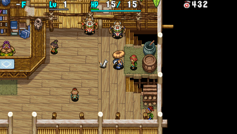

  

Optional tutorials on how to play the game.

Completion rewards:

- Receive a random item each time you clear a topic for the first time.
- An [Adventure Footprints](/system/adventure-footprints) entry will update as you clear topics.

# Overview

<table class="dungeonOverview">
  <tr>
    <th>Unlock</th>
    <td class="highlightYellow">Reach Boronga Village.</td>
  </tr>
  <tr>
    <th>Entrance</th>
    <td class="highlightYellow">Boronga Village (Girl in Novice House)</td>
  </tr>
</table>

<table class="dungeonTable">
  <tr>
    <th>Topics</th>
    <td>36</td>
    <th>Day / Night</th>
    <td>Varies</td>
  </tr>
  <tr>
    <th>Bring Items</th>
    <td>No</td>
    <th>Allies</th>
    <td>No</td>
  </tr>
  <tr>
    <th>Clear Icon</th>
    <td>None</td>
    <th>Reward</th>
    <td>1 random item (1st clear)</td>
  </tr>
</table>

# Topics

There are a total of 36 topics.

<table class="dungeonTable">
  <tr>
    <th>Page 1</th>
    <th>Page 2</th>
    <th>Page 3</th>
  </tr>
  <tr>
    <td>You move, monsters move</td>
    <td>Walking restores HP</td>
    <td>Adepts use staves</td>
  </tr>
  <tr>
    <td>Moving diagonally</td>
    <td>There's a trap underfoot!</td>
    <td>Talismans for groups</td>
  </tr>
  <tr>
    <td>Dashing to save time</td>
    <td>Don't forget to equip</td>
    <td>Open or insert into pots</td>
  </tr>
  <tr>
    <td>Turning in place</td>
    <td>Winds of Kron</td>
    <td>Corners to conquer foes</td>
  </tr>
  <tr>
    <td>Actions make you hungry</td>
    <td>Eat or throw grass</td>
    <td>Scout distant enemies</td>
  </tr>
  <tr>
    <td>Look at the map</td>
    <td>Solve things with scrolls</td>
    <td>Fight 1 at a time</td>
  </tr>
  <tr>
    <th>Page 4</th>
    <th>Page 5</th>
    <th>Page 6</th>
  </tr>
  <tr>
    <td>Upgrade equipment</td>
    <td>Sanctuary just for you</td>
    <td>Grill spoiled bananas</td>
  </tr>
  <tr>
    <td>Let's try synthesizing</td>
    <td>Traps can be useful</td>
    <td>Treasure islands</td>
  </tr>
  <tr>
    <td>Unidentified items</td>
    <td>Cursed equipment dilemma</td>
    <td>Hidden hallways</td>
  </tr>
  <tr>
    <td>The power of money</td>
    <td>Zalokleft, I choose you!</td>
    <td>Another light source※</td>
  </tr>
  <tr>
    <td>Tips for fleeing</td>
    <td>1 stone, how many birds?</td>
    <td>Can't read in the dark※</td>
  </tr>
  <tr>
    <td>Don't stand in front of it</td>
    <td>If it fills your stomach...</td>
    <td>When night turns to day※</td>
  </tr>
</table>

※ Available after clearing Shrine of Night Adventures.

# Possible Rewards

<table class="dungeonTable">
  <thead>
    <tr>
      <th colspan="4">Possible Reward Items</th>
    </tr>
  </thead>
  <tbody>
    <tr>
      <td>Palm Stick</td>
      <td>Gyadon Blocker</td>
      <td>Warp Grass</td>
      <td>Medicine Scroll</td>
    </tr>
    <tr>
      <td>Dull Gold Edge</td>
      <td>Clan Shield</td>
      <td>Sight Grass</td>
      <td>Escape Scroll</td>
    </tr>
    <tr>
      <td>Copper Edge</td>
      <td>Beast Shield</td>
      <td>Dragon Grass</td>
      <td>Storage Pot</td>
    </tr>
    <tr>
      <td>Hatchet</td>
      <td>Heavy Shield</td>
      <td>Power Up Grass</td>
      <td>Empathy Staff</td>
    </tr>
    <tr>
      <td>Myopic Masher</td>
      <td>Pierce Bracelet</td>
      <td>Revival Grass</td>
      <td>Transient Staff</td>
    </tr>
    <tr>
      <td>Katana</td>
      <td>Heal Bracelet</td>
      <td>Growth Seed</td>
      <td>Paralysis Staff</td>
    </tr>
    <tr>
      <td>Drain Slicer</td>
      <td>Calm Bracelet</td>
      <td>Undo Grass</td>
      <td>Swap Staff</td>
    </tr>
    <tr>
      <td>Beast Fang</td>
      <td>Alert Bracelet</td>
      <td>Navigation Scroll</td>
      <td>Knockback Staff</td>
    </tr>
    <tr>
      <td>Dotanuki</td>
      <td>Cleansing Bracelet</td>
      <td>Purify Scroll</td>
      <td>Seal Staff</td>
    </tr>
    <tr>
      <td>Lizard Lasher</td>
      <td>Staunch Bracelet</td>
      <td>Identify Scroll</td>
      <td>Pinning Staff</td>
    </tr>
    <tr>
      <td>Palm Shield</td>
      <td>Strength Bracelet</td>
      <td>Heaven Scroll</td>
      <td>Slow Staff</td>
    </tr>
    <tr>
      <td>Diet Shield</td>
      <td>Happy Bracelet</td>
      <td>Earth Scroll</td>
      <td>Mage Staff</td>
    </tr>
    <tr>
      <td>Dull Gold Shield</td>
      <td>Herb</td>
      <td>Plating Scroll</td>
      <td>Lightning Staff</td>
    </tr>
    <tr>
      <td>Counter Shield</td>
      <td>Otogiriso</td>
      <td>Confusion Scroll</td>
      <td>Green Banana</td>
    </tr>
    <tr>
      <td>Copper Guard</td>
      <td>Expand Seed</td>
      <td>Slumber Scroll</td>
      <td>Yellow Banana</td>
    </tr>
    <tr>
      <td>Iron Targe</td>
      <td>Antidote Grass</td>
      <td>Air Slash Scroll</td>
      <td rowspan="3" class="highlightGray"></td>
    </tr>
    <tr>
      <td>Safe Shield</td>
      <td>Strength Grass</td>
      <td>Fear Scroll</td>
    </tr>
    <tr>
      <td>Lock Shield</td>
      <td>Swift Grass</td>
      <td>Fixer Scroll</td>
    </tr>
  </tbody>
</table>

※ Source: Shiren 4 Official Complete Guide.
