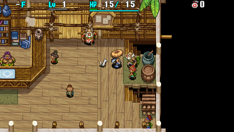

  

Optional tutorial for night gameplay.

Completion rewards:

- Receive a [necklace ability](/system/necklace-abilities) called Last Stand.
- 3 new topics added to [Shrine of Challenges](/dungeons/shrine-of-challenges).
- [Adventure Footprints](/system/adventure-footprints) entry unlocked. 

# Overview

<table class="dungeonOverview">
  <tr>
    <th>Unlock</th>
    <td class="highlightYellow">Reach Gonchiki Village.</td>
  </tr>
  <tr>
    <th>Entrance</th>
    <td class="highlightYellow">Boronga Village (Old Man in Novice House)</td>
  </tr>
</table>

<table class="dungeonTable">
  <tr>
    <th>Floors</th>
    <td>5F</td>
    <th>Day / Night</th>
    <td>Both</td>
  </tr>
  <tr>
    <th>Bring Items</th>
    <td>No</td>
    <th>Allies</th>
    <td>No</td>
  </tr>
  <tr>
    <th>Clear Icon</th>
    <td>None</td>
    <th>Reward</th>
    <td>Last Stand (ability)</td>
  </tr>
</table>

# Monsters

<table class="dungeonMonsterList monsterListNight">
  <thead>
    <tr>
      <th>F</th>
      <th>Name</th>
      <th>HP</th>
      <th>Atk</th>
      <th>Def</th>
      <th>Exp</th>
      <th>Skill</th>
      <th>Type</th>
      <th>Notes</th>
    </tr>
  </thead>
  <tbody>
    <tr>
      <td>3-5</td>
      <td>Dark Mamel</td>
      <td>24</td>
      <td>14</td>
      <td>3</td>
      <td>22</td>
      <td>15</td>
      <td>-</td>
      <td>Night version of the mascot monster.</td>
    </tr>
  </tbody>
</table>

# Items

- F = Floor

 

<table class="dungeonTable">
  <tr>
    <th class="highlightGreen">Item</th>
    <th class="highlightGreen">F</th>
  </tr>
  <tr>
    <td class="leftText">Torch</td>
    <td>X</td>
  </tr>
  <tr>
    <td class="leftText">Fine Torch</td>
    <td>X</td>
  </tr>
  <tr>
    <td class="leftText">Paralysis Staff</td>
    <td>X</td>
  </tr>
  <tr>
    <td class="leftText">Swift Grass</td>
    <td>X</td>
  </tr>
  <tr>
    <td class="leftText">Yellow Banana</td>
    <td>X</td>
  </tr>
</table>
