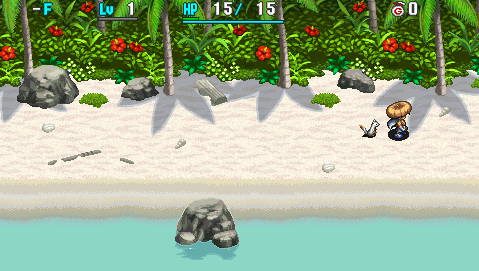
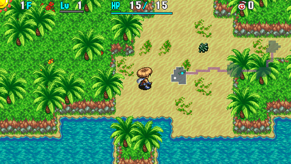

   

Tutorial dungeon where Koppa gives you advice about the basics of dungeon gameplay. Basically the only way to fail it is if you intentionally collapse.

Once cleared, you can only return to this dungeon by going on an [Interim Adventure](/system/wanderer-rescue#interim-adventure).

# Overview

<table class="dungeonOverview">
  <tr>
    <th>Unlock</th>
    <td class="highlightYellow">Automatically proceed during the opening.</td>
  </tr>
  <tr>
    <th>Entrance</th>
    <td class="highlightYellow">Beach (East)</td>
  </tr>
</table>

<table class="dungeonTable">
  <tr>
    <th>Floors</th>
    <td>3F</td>
    <th>Day / Night</th>
    <td>Day</td>
  </tr>
  <tr>
    <th>Bring Items</th>
    <td>No</td>
    <th>Allies</th>
    <td>No</td>
  </tr>
  <tr>
    <th>Rescues</th>
    <td>0</td>
    <th>Unidentified</th>
    <td colspan="3">None</td>
  </tr>
</table>

# Monsters

<table class="dungeonMonsterList monsterListDay">
  <thead>
    <tr>
      <th>F</th>
      <th>Name</th>
      <th>HP</th>
      <th>Atk</th>
      <th>Def</th>
      <th>Exp</th>
      <th>Skill</th>
      <th>Type</th>
      <th>Notes</th>
    </tr>
  </thead>
  <tbody>
    <tr>
      <td>1, 3</td>
      <td>Mamel</td>
      <td>5</td>
      <td>2</td>
      <td>1</td>
      <td>3</td>
      <td>1</td>
      <td>-</td>
      <td>Mascot monster of the Shiren series.</td>
    </tr>
    <tr>
      <td>2, 3</td>
      <td>Seedie</td>
      <td>6</td>
      <td>3</td>
      <td>4</td>
      <td>5</td>
      <td>1</td>
      <td>-</td>
      <td>Seedies are weaker than in Shiren 5.</td>
    </tr>
  </tbody>
</table>

# Items

- F = Floor, Daytime monster drop

 

<table class="dungeonTable">
  <tr>
    <th class="highlightGreen">Item</th>
    <th class="highlightGreen">F</th>
  </tr>
  <tr>
    <td class="leftText">Copper Edge</td>
    <td>X</td>
  </tr>
  <tr>
    <td class="leftText">Palm Shield</td>
    <td>X</td>
  </tr>
  <tr>
    <td class="leftText">Herb</td>
    <td>X</td>
  </tr>
  <tr>
    <td class="leftText">Green Banana</td>
    <td>X</td>
  </tr>
  <tr>
    <td class="leftText">Gitan</td>
    <td>X</td>
  </tr>
</table>
