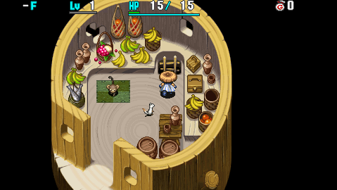
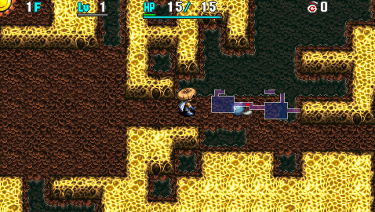

  

Dungeon where your level is static at Lv1, and you cannot level up under any circumstances. Weapons, shields, Heaven and Earth scrolls, Strength Grass, Synthesis Pot, and Blessing Pot are common, so the idea is to rapidly upgrade strength and equipment to keep up with monsters.

It's a day-only dungeon, and field of view alternates between visible and dark hallways every so often. All item categories except for weapons and shields are found identified.

<ul class="quickLinksUL">
  <li><a href="#overview">Overview</a></li>
  <li><a href="#strategy">Strategy</a></li>
  <li><a href="#floor-guide">Floor Guide</a></li>
  <li><a href="#monsters">Monsters</a></li>
  <li><a href="#items">Items</a></li>
  <li><a href="#traps">Traps</a></li>
</ul>

# Overview

<table class="dungeonOverview">
  <tr>
    <th>Unlock</th>
    <td class="highlightYellow">Go to Monkey Village after clearing the main story.</td>
  </tr>
  <tr>
    <th>Entrance</th>
    <td class="highlightYellow">Monkey Village (Ladder inside the item shop)</td>
  </tr>
</table>

<table class="dungeonTable">
  <tr>
    <th>Floors</th>
    <td>50F</td>
    <th>Day / Night</th>
    <td>Day</td>
  </tr>
  <tr>
    <th>Bring Items</th>
    <td>No</td>
    <th>Allies</th>
    <td>No</td>
  </tr>
  <tr>
    <th>Unidentified</th>
    <td colspan="3">Weapons, Shields</td>
  </tr>
  <tr>
    <th>Shops</th>
    <td>Regular, Elite,</td>
    <th>Monster Houses</th>
    <td>Regular, Sudden</td>
  </tr>
  <tr>
    <th>Initial Enemies</th>
    <td>7~9</td>
    <th>Spawn Rate</th>
    <td>30</td>
  </tr>
  <tr>
    <th>Ominous aura</th>
    <td>No</td>
    <th>Winds of Kron</th>
    <td>1st: 1700 4th: 2000</td>
  </tr>
  <tr>
    <th>Clear Icon</th>
    <td>None</td>
    <th>Clear Bonus</th>
    <td>30,000,000</td>
  </tr>
  <tr>
    <th>Reward</th>
    <td colspan="3">Parry Shield</td>
  </tr>
</table>

# Strategy

<ul class="quickLinksUL">
  <li><a href="#general">General</a></li>
  <li><a href="#equipment">Equipment</a></li>
  <li><a href="#other-items">Other Items</a></li>
</ul>

### General

You can't gain levels, so you need to find and upgrade equipment to get a run going. At least 1 weapon and shield is guaranteed to appear on 1F, but the quality of the item is random. If you're unlucky, you could start with an item with low base stats like Dull Gold Edge or such.

Shiren can't gain experience points, but equipment still gains skill points when you defeat monsters. It's important to level up your weapon and shield to raise their upgrade limits when possible.

Enemies with strong special attacks or high attack power can one-shot you if you have low max HP. Keep your HP full, and it might take a number of attempts to get a feel for defense vs. damage reduction.

Runes that increase max HP should be prioritized for the first Mixer zone. Without adequate max HP, you're very likely to collapse from a single power type monster's attack.

Don't worry about cursed equipment early game - Check for upgrade value in preparation for Mixer floors. Avoid equipping unidentified items from mid game without Heaven, Earth, Purify, Plating, or Fixer scrolls. Strip Trap provides a chance to check upgrade value and item status.

Don't trade hits with power types - Use Flame Shot, Tri-direction, status runes, staves or talismans, etc.

You'll generally want to check rooms for items on floors without dark hallways, and then prioritize stairs on floors where visibility is limited.

### Equipment

#### Weapon

Type effective weapons are shop-exclusive. 2 bracelet resonance is not important, so choose a weapon with high attack power.

<ul>
  <li>Burning Blade
    <ul>
      <li>Flame Shot grows stronger if you use it as a main weapon.</li>
      <li>You don't gain skill points when you defeat a monster using Flame Shot, so it can be hard to level up.</li>
    </ul>
  </li>
  <li>Red Blade
    <ul>
      <li>High base attack, and gains HP+10 at Lv3.</li>
      <li>Low initial slot count and slow growth rate, so choose runes carefully.</li>
    </ul>
  </li>
  <li>Meteor Edge
    <ul>
      <li>High base attack, and gains HP+10 at Lv4.</li>
      <li>Rune slots increases to 6 at Lv2, making early game synthesis easier than Red Blade.</li>
    </ul>
  </li>
  <li>Dotanuki
    <ul>
      <li>Pretty common, and decent rune slot count.</li>
      <li>Clan Shield is too weak, so don't aim for 2 bracelet resonance.</li>
    </ul>
  </li>
  <li>Breeze Blade
    <ul>
      <li>Too weak to use as a main weapon, but Tri-direction is excellent as a rune.</li>
    </ul>
  </li>
  <li>Nap Rattle, Shockuto
    <ul>
      <li>Too weak to use as a main weapon, but Sedating and Paralyzing are excellent as runes.</li>
    </ul>
  </li>
  <li>Baffle Axe, Blurry Stick
    <ul>
      <li>Baffle Axe has low attack, but has lots of slots and a very fast growth rate.</li>
      <li>Blurry Stick is basically a worse Baffle Axe.</li>
    </ul>
  </li>
  <li>Hatchet
    <ul>
      <li>Shop exclusive. Too weak to use as a main weapon, but Critical is excellent as a rune.</li>
    </ul>
  </li>
</ul>

#### Runes

See [Runes](/system/synthesis-runes) for details.

<table>
  <thead>
    <tr>
      <th>Priority</th>
      <th>Runes</th>
    </tr>
  </thead>
  <tbody>
    <tr>
      <td class="highlightRed">Top</td>
      <td>HP+5, HP+10, HP+15, HP+20, Tri-direction, Sedating, Paralyzing</td>
    </tr>
    <tr>
      <td class="highlightPink">High</td>
      <td>Critical, Anti-Floating, Anti-Cyclops, Anti-Aquatic</td>
    </tr>
    <tr>
      <td class="highlightYellow">Mid</td>
      <td>Confusing, Blinding</td>
    </tr>
  </tbody>
</table>

#### Shield

<ul>
  <li>Red Shield
    <ul>
      <li>High base defense, and gains HP+10 at Lv3.</li>
    </ul>
  </li>
  <li>Meteor Guard
    <ul>
      <li>High base defense, and gains HP+10 at Lv4.</li>
    </ul>
  </li>
  <li>Beast Shield
    <ul>
      <li>Decent base defense, and gains HP+10 at Lv4.</li>
      <li>Beast Fang is too weak, so don't aim for 2 bracelet resonance.</li>
    </ul>
  </li>
  <li>Diet Shield
    <ul>
      <li>Too weak to use as a main shield, but 1/2 Hunger is excellent as a rune.</li>
    </ul>
  </li>
  <li>Spry Shield
    <ul>
      <li>Too weak to use as a main shield, but Agile is excellent as a rune.</li>
    </ul>
  </li>
  <li>Gyadon Blocker, Lizard Shield
    <ul>
      <li>Decent base defense for early game, but switch to a better shield.</li>
      <li>1/2 Fire is only useful against Flamepuff (46-50F), so it's not a high priority rune.</li>
    </ul>
  </li>
  <li>Dull Gold Shield
    <ul>
      <li>Too weak to use as a main shield, but Rustproof is excellent as a rune.</li>
      <li>It's risky to unequip your shield on Grime and Ooze floors, so this rune is a high priority.</li>
    </ul>
  </li>
  <li>Heavy Shield
    <ul>
      <li>Decent base defense, but the innate Hungry rune is extremely bad.</li>
      <li>Usable early game until you find a better shield, but unequip it when you're not fighting.</li>
    </ul>
  </li>
  <li>Swap Shield
    <ul>
      <li>Shop exclusive. Don't equip it on DJ Mage floors.</li>
      <li>Its resonance effect with Burning Blade boosts Flame Shot damage.</li>
    </ul>
  </li>
</ul>

#### Runes

See [Runes](/system/synthesis-runes) for details.

<table>
  <thead>
    <tr>
      <th>Priority</th>
      <th>Runes</th>
    </tr>
  </thead>
  <tbody>
    <tr>
      <td class="highlightRed">Top</td>
      <td>HP+5, HP+10, HP+15, HP+20, 1/2 Hunger, Rustproof</td>
    </tr>
    <tr>
      <td class="highlightPink">High</td>
      <td>Agile</td>
    </tr>
    <tr>
      <td class="highlightYellow">Mid</td>
      <td>1/2 Fire, Anti-Peck, 1/2 Blast</td>
    </tr>
  </tbody>
</table>

#### Bracelets

<ul>
  <li>Monster Detector
    <ul>
      <li>Effective on floor ranges with dark hallways (8-15F, 24-31F, and 40-44F).</li>
    </ul>
  </li>
  <li>Strength Bracelet
    <ul>
      <li>Increases your damage output, which is particularly nice early game.</li>
      <li>It's fine to discard it around mid game if you need inventory space.</li>
    </ul>
  </li>
  <li>Calm Bracelet
    <ul>
      <li>Protects against Dazikon (31-33F) and Blade Bee special attacks, and Spin Trap.</li>
      <li>Its resonance effect with Baffle Axe boosts the chance to inflict Confused status.</li>
    </ul>
  </li>
  <li>Staunch Bracelet, Cleansing Bracelet
    <ul>
      <li>Staunch Bracelet protects against max HP loss due to Spin Polygon types.</li>
      <li>Cleansing Bracelet is nice to have for Mutaikon and Scorpion floors.</li>
    </ul>
  </li>
  <li>Item Detector
    <ul>
      <li>Locate shops at a glance, and get an idea of the floor layout by looking at item locations.</li>
    </ul>
  </li>
  <li>Heal Bracelet
    <ul>
      <li>Shop exclusive. Natural HP regen is faster than other dungeons due to lower max HP, but this bracelet is still nice once you've synthesized runes that raise max HP.</li>
    </ul>
  </li>
  <li>Strider Bracelet
    <ul>
      <li>Water tiles are common on some floor ranges, so it might come in handy.</li>
      <li>Keep in mind that scrolls outside of pots get wet, and unequip it over water to warp.</li>
    </ul>
  </li>
</ul>

### Other Items

#### Grass, Scrolls, Pots, Misc.

<ul>
  <li>Heal Grass, Life Grass
    <ul>
      <li>Life Grass is shop exclusive. Save these for synthesis instead of eating them.</li>
    </ul>
  </li>
  <li>Herb, Otogiriso
    <ul>
      <li>Herb - Some prefer to eat it for +1 max HP instead of +5 and use slots for other runes.</li>
      <li>Otogiriso - Worth synthesizing if you're using equipment that doesn't gain HP+10 by leveling up.</li>
    </ul>
  </li>
  <li>Strength Grass
    <ul>
      <li>Increasing strength raises damage output only on even numbers such as 10, 12, 14, etc., so try to save Strength Grass until you find a Blessing Pot instead of eating them right away.</li>
      <li>Whether or not arrows are useful depends on how much you increase your strength.</li>
    </ul>
  </li>
  <li>Growth Seed
    <ul>
      <li>Multiplies skill points earned from defeating monsters by 4.</li>
      <li>Normally lasts 100 turns, but lasts for the duration of the current floor when blessed.</li>
      <li>That said, Revival Grass and Strength Grass are a higher priority for inserting into Blessing Pots.</li>
    </ul>
  </li>
  <li>Sight Grass
    <ul>
      <li>Synthesize it into your weapon to add the Anti-Cyclops rune.</li>
      <li>After that, it's nice to keep 1 on hand in case you step on a Blind Trap.</li>
    </ul>
  </li>
  <li>Revival Grass
    <ul>
      <li>Obtained from regular or elite shops.</li>
      <li>Use a Blessing Pot or blessed Suction Scroll to bless the Revival Grass.</li>
    </ul>
  </li>
  <li>Sanctuary Scroll
    <ul>
      <li>Shop exclusive. It's still useful for Monster Houses despite being heavily nerfed in this game.</li>
    </ul>
  </li>
  <li>Suction Scroll
    <ul>
      <li>Normally just extracts the contents of a pot onto the ground, but if the Suction Scroll is blessed, the contents of the pot will become blessed when extracted. (Suction Scroll vanishes after 1 use)</li>
    </ul>
  </li>
  <li>Blessing Pot
    <ul>
      <li>Priority: Suction Scroll &gt; Revival Grass &gt; Strength Grass &gt; Earth Scroll &ge; Heaven Scroll &ge; Life Grass</li>
      <li>Consider blessing useful scrolls like Fixer Scroll as well.</li>
    </ul>
  </li>
  <li>Upgrade Pot
    <ul>
      <li>Can be found in regular shops, but it's very expensive.</li>
      <li>Increases upgrade value of inserted equipment by 1 every time you advance floors.</li>
      <li>Unlike Shiren 5, it won't shatter until an inserted item reaches its upgrade limit.</li>
    </ul>
  </li>
  <li>Poison Arrow, Grilled Banana, Gitan
    <ul>
      <li>Poison Arrow - Obtained from traps. Great on floors where power type monsters appear.</li>
      <li>Grilled Banana - Obtained using Explochin blasts. Valuable HP restoring item.</li>
      <li>Gitan - Nice projectile until you increase strength and arrows become usable.</li>
    </ul>
  </li>
</ul>

#### Notes

Staves: 
Lightning Staff deals 25 damage and can be used in place of arrows. Save Paralysis, Transient, Pinning, and Slow staves for 24-34F as much as possible.

Talismans: Handy, but never forget that they can miss - Throw them from at least 1 tile away if possible.

- Fear - Top priority. Afraid status disables both direct attacks and special attacks.
- Slow - Slow status lasts for the duration of the current floor for enemies.
- Miss - Use these against power types like Eligan and Chainhead.
- Sleep - Mostly used for 1 vs 1 situations due to the shorter duration.
- Dizzy - Great when you need to run away, since Confused status lasts a long time.
- Bind - Can be used when you need to run away, but low priority due to the short duration.
- Seal - Doesn't help against power type monsters, so low priority.

Scrolls: Purify Scroll is somewhat rare, so use other scrolls to purify equipment.

- Purify - Save these in case you step on a Curse Trap or get hit by a Curse Girl's special attack.
- Plating - Save it if you don't have another way to purify items, but use it before Grime appears (26F).
- Fixer - Can be used to restore strength instead of Antidote Grass, so try to use other scrolls to purify.
- Heaven, Earth - Keep 1 of each on hand in case your weapon or shield gets cursed.

# Floor Guide

### 1-2F

Mamel (1-2F), Seedie (1-3F), Chintala (1-3F), Bored Kappa (2-4F), Cheer Ham (2-6F)

Check every room for items - 1F always generates at least one weapon and shield on the ground. Chintala (7 HP, 7 atk) deals 7\~8 damage without a shield, so step away to regenerate HP while fighting it.

### 3-4F

Chintala (1-3F), Cheer Ham (2-6F), Banana Novice (3-5F), Blade Bee (4-6F), Boy Cart (4F, 6F), etc.

Banana Novice (16 HP, 11 atk) is tough if you don't have a shield with 10+ defense. Similar to Chintala, step away to regenerate HP while fighting it.

Blade Bee (15 HP, 13 atk)'s special attack can deal \~20 damage if your shield is weak. Throw rocks, Gitan, or unneeded equipment to soften it before using a direct attack.

Boy Cart (16 HP, 9 atk) appears, but arrows you shoot only deal 1 damage without increased strength, so it's not recommended to collect wood arrows at this point.

### 5-9F

Kumonigiri (5-8F), Ironhead (6-9F), Gazer (7-9F), Tiger Tosser (7-10F), Explochin (9-11F), Floaty (9-12F), etc.

Kumonigiri (25 HP, 15 atk) and Ironhead (32 HP, 16 atk) are tough on 5-6F. Lightning Staff can be used to one-shot Kumonigiri if needed, since it has exactly 25 HP.

Tiger Tosser (42 HP, 20 atk) is strong enough to where stepping away to regenerate HP is ineffective. Throw Gitan, place a Banana Peel, or throw a talisman if there's distance between the two of you. If it's adjacent, use a staff or scroll - Seriously, don't be stingy with items against Tiger Tossers.

Gazer (26 HP, 11 atk) can wreck your plans by making you use synthesis ingredients. Keep key items like Heal Grass, Life Grass, and Revival Grass inside pots.

If Tiger Tossers and Gazers are posing to be too much for you, rush stairs until 10F. If you make it to 10F, you can synthesize using Mixers to catch your footing. ※ Hallways are dark between 8-15F.

### 10-12F

Explochin (9-11F), Mixer (10-12F), Pumphantasm (10-14F), Floaty (9-12F), Zapdon (11-13F), etc.

Mixer (45 HP, 15 atk) provides a chance to synthesize items - It's ideal to increase max HP to 50+ on 10F. Weapon: Max HP runes &gt; Tri-direction &gt; Anti-Floating / Anti-Aquatic / Anti-Cyclops &ge; Status runes &gt; Rustproof Shield: Max HP runes &gt; Rustproof &gt; Agile &gt; 1/2 Hunger, etc.

Hunt Floaty (33 HP, 14 atk) to level equipment - Defeating the same monster in a row grants bonus skill points. Don't forget to eat a Growth Seed beforehand if you happen to have one on hand.

It's a bit risky, but Explochin (62 HP, 14 atk) can be used to grill bananas. Pumphantasm (34 HP, 24 atk) hits harder than Tiger Tosser, but has lower HP and defense.

Zapdon (63 HP, 50 atk) will one-shot you with low max HP, so synthesize on 10F before descending to 11F. If you don't have a Monster Detector, it's best to rush stairs starting on 11F until you reach 14F. ※ Hallways are dark between 8-15F.

### 13-16F

Zapdon (11-13F), Spin Polygon (12-14F), Gyadon (13-15F), Dagger Bee (15-18F), Mutaikon (14, 16F), etc.

Zapdon continues to be a big threat on 13F. Equip Staunch Bracelet if you have it to protect against Spin Polygon (37 HP, 16 atk). Keep staves in pots to protect them from being pecked by Gyadon (48 HP, 22 atk).

Antidote Grass is uncommon, so beware of Mutaikon (30 HP, 13 atk)'s special attack. If your strength was lowered by poison grass, wait until 17F to restore it.

Dagger Bee (46 HP, 27 atk) can hit pretty hard with its special attack. ※ Hallways are dark between 8-15F.

### 17F

Zalokleft (17, 19, 21F), Squid Lord (14-17F), Dagger Bee (15-18F), Beanie (16-19F)

Beanie (53 HP, 33 atk) hits hard, but otherwise this is a safe floor to hunt Zaloklefts (30 HP, 10 atk). Projectiles can miss, so it's best to use staves on Zaloklefts to ensure you get a new item. The goal here is to obtain synthesis ingredients to prepare for Mixermons on 20-22F, along with stocking up on useful items for the upcoming power type monster floors.

Squid Lord (55 HP, 23 atk) can blind you if you're adjacent, but it shouldn't be a big problem.

### 18-19F

Zalokleft (17, 19, 21F), Beanie (16-19F), Big Chintala (18-23F), Go Ham (18, 20, 22F), Kengo (19-21F), etc.

Big Chintala (57 HP, 47 atk) has much higher attack power than previous monsters at this point, and has the potential to be further boosted by Go Ham (34 HP, 15 atk)'s cheering. That said, Big Chintala provides 40 skill points, so consider hunting some to level equipment.

Kengo (58 HP, 32 atk) can knock away your shield, which can cause a game over if it vanishes. It has high HP and defense, so use Gitan or a Banana Peel, staff with 0 uses, or talisman instead of rocks. Use a staff if it's adjacent, and don't gamble on a direct attack if your shield is disarmed.

Some players read a Desert Scroll on 19F to reduce the risk of shield loss, and then hunt Zaloklefts. However, it's questionable if it's worth the risk with Kengo around.

### 20-22F

Go Ham (18, 20, 22F), Big Chintala (18-23F), Mixermon (20-22F), Kengo (19-21F), Curse Sister (22-24F), etc.

Mixermon (55 HP, 26 atk) provides the last chance to synthesize items without Synthesis Pots. If you plan on lingering to synthesize, it's best to do so on 21F to avoid Go Hams / hunt Zaloklefts. Combine staves to free up inventory space, and finalize your equipment before advancing.

Curse Sister (52 HP, 24 atk) appears alongside Go Ham on 22F, so it's usually best to synthesize before then. However, Kengo isn't around on 22F, so some players prefer the risk of cursed items vs. shield loss.

The value of carrying equipment with positive upgrade value as synthesis ingredients lowers after 22F, since you aren't guaranteed to find any Synthesis Pots for the remainder of the dungeon. So if you're out of inventory space, it's fine to discard synthesis ingredients after 22F.

### 23-28F

Kappa Pest (23-28F), Eligan (24-29F), Grime (26, 28, 30F), Super Gazer (25, 27, 29F), Demon Scorp (26-30F), etc.

Hallways are dark between 24-31F and power types appear until 34F, so switch to rushing stairs.

If you have a Monster Detector, avoid encountering Eligan (78 HP, 60 atk) as much as possible. Never trade hits with it, as it deals significant damage even if your shield is strong. Use Banana Peels, Gitan, staves, talismans, or other items to avoid damage.

Kappa Pest (56 HP, 28 atk) and Glare Bird (43 HP, 20 atk) can be defeated using direct attacks. If a Kappa Pest is standing on an item, use a staff or throw a talisman at a monster so the effect hits it. This goes without saying, but don't forget to use the Scout command in rooms.

Demon Scorp (70 HP, 34 atk) has high HP and defense, so it can be a problem without a Cleansing Bracelet. Don't let it act when it's adjacent to you if you don't have a way to restore lost strength.

Super Gazer (49 HP, 19 atk) and Grime (43 HP, 12 atk) have troublesome special attacks. Use rocks to soften Super Gazer from a distance, then finish it with a direct attack. Same thing for Grime if your equipment lacks the Rustproof rune.

### 29F

Eligan (24-29F), Super Gazer (29F), Demon Scorp (26-30F), Chainhead (29-34F)

Extremely dangerous floor where both Eligan and Chainhead (84 HP, 60 atk) appear at the same time. If you have a Monster Detector, use a Transient Staff to quickly locate the stairs. ※ Hallways are dark between 24-31F.

### 30-34F

Chainhead (29-34F), Dance Polygon (30-32F), Dazikon (31-33F), Voltdon (33-35F), Concusschin (33-37F), etc.

Continue rushing stairs until you reach 35F.

Chainhead continues to be a major threat, especially between 30-31F where hallways are still dark. Dance Polygon (61 HP, 32 atk) can lower your max HP by 2, so equip a Staunch Bracelet if you have one. Dazikon (46 HP, 23 atk) can be annoying if you don't have a Calm Bracelet - its throw radius is 2 tiles.

Pumphantom (34-39F, 66 HP, 36 atk) can be irritating in hallways, but hits weaker than power types. Voltdon (88 HP, 80 atk) is strong, but it's easy to avoid it since hallways are visible when it appears.

### 35-39F

Concusschin (33-37F), Pumphantom (34-39F), Steamroid (35-40F), Gyairas (36-41F), Tiger Hurler (38-40F), etc.

These floors are generally easier than the previous floor ranges, so it's a chance to restock items. The use for Cleansing, Calm, and Staunch bracelets are over, so go ahead and discard them.

Steamroid (64 HP, 41 atk) has swift 1 action speed, so it can be a bit tricky to deal with. Tiger Hurler (68 HP, 39 atk) can potentially throw you onto traps created by Steamroid. Pumphantom (66 HP, 36 atk) is also still around to bother you in hallways.

Keep scrolls and talismans inside pots to protect them from Gyairas (57 HP, 34 atk).

### 40-44F

Nuttie (40-44F), Poofy (40-44F), Falcon Tengu (40-44F), Banana Morph (42-44F), Ooze (41-44F), etc.

Nuttie (62 HP, 62 atk) has higher attack power than Eligan and Chainhead, so don't underestimate it. Poofy (54 HP, 33 atk) can be hunted to level equipment if desired, but it's not necessary at this point. Banana Morph (58 HP, 32 atk) can cause item loss, so it's best to not let it act. Ooze (53 HP, 18 atk) can erase runes even if you have Rustproof.

If you see a Poofy walking around alone, it's a Falcon Tengu (53 HP, 17 atk). ※ Hallways are dark between 40-44F, so consider having a group of Poofy launch you to skip floors.

### 45-50F

Flamepuff (45-50F), Sr. Yanpii (45-50F), Hipadile (45-50F), Scarabbit (45-50F)

Monsters have special attacks that deal fixed damage, so don't let your guard down even with a strong shield. Flamepuff (43 HP, 18 atk) and Hipadile (70 HP, 40 atk) deal 20 damage with their special, and Sr. Yanpii (49 HP, 44 atk) deals 20 + 20 = 40 damage with its special if you fly into a wall.

Scarabbit (50 HP, 29 atk) is weak on its own, but its special can cause you to get surrounded in a room. Use items like Fear Scroll, Fixer Scroll, Warp Grass, or Confusion Scroll if that happens.

Monster Detector + Transient Staff can be used to quickly locate the stairs.

# Monsters

See [Monsters](/system/monsters) for individual monster details.

Floor Colors: Dark Hallways Enemy Colors: Farming Useful Destroys Items High Offense Dangerous Very Dangerous

<table class="monsterTable">
  <thead>
    <tr>
      <th>F</th>
      <th colspan="6">Day</th>
    </tr>
  </thead>
  <tbody>
    <tr>
      <th>1</th>
      <td>Mamel</td>
      <td>Seedie</td>
      <td>Chintala</td>
      <td class="highlightGray"></td>
      <td class="highlightGray"></td>
      <td class="highlightGray"></td>
    </tr>
    <tr>
      <th>2</th>
      <td>Mamel</td>
      <td>Seedie</td>
      <td>Chintala</td>
      <td>Bored Kappa</td>
      <td>Cheer Ham</td>
      <td class="highlightGray"></td>
    </tr>
    <tr>
      <th>3</th>
      <td>Banana Novice</td>
      <td>Seedie</td>
      <td>Chintala</td>
      <td>Bored Kappa</td>
      <td>Cheer Ham</td>
      <td class="highlightGray"></td>
    </tr>
    <tr>
      <th>4</th>
      <td>Banana Novice</td>
      <td class="highlightOffense">Blade Bee</td>
      <td class="highlightGray"></td>
      <td>Bored Kappa</td>
      <td>Cheer Ham</td>
      <td>Boy Cart</td>
    </tr>
    <tr>
      <th>5</th>
      <td>Banana Novice</td>
      <td class="highlightOffense">Blade Bee</td>
      <td class="highlightOffense">Kumonigiri</td>
      <td class="highlightGray"></td>
      <td>Cheer Ham</td>
      <td>DJ Mage</td>
    </tr>
    <tr>
      <th>6</th>
      <td class="highlightOffense">Ironhead</td>
      <td class="highlightOffense">Blade Bee</td>
      <td class="highlightOffense">Kumonigiri</td>
      <td class="highlightGray"></td>
      <td>Cheer Ham</td>
      <td>Boy Cart</td>
    </tr>
    <tr>
      <th>7</th>
      <td class="highlightOffense">Ironhead</td>
      <td class="highlightItem">Gazer</td>
      <td class="highlightOffense">Kumonigiri</td>
      <td class="highlightDanger">Tiger Tosser</td>
      <td class="highlightGray"></td>
      <td>DJ Mage</td>
    </tr>
    <tr>
      <th class="highlightFog">8</th>
      <td class="highlightOffense">Ironhead</td>
      <td class="highlightItem">Gazer</td>
      <td class="highlightOffense">Kumonigiri</td>
      <td class="highlightDanger">Tiger Tosser</td>
      <td class="highlightGray"></td>
      <td class="highlightGray"></td>
    </tr>
    <tr>
      <th class="highlightFog">9</th>
      <td class="highlightOffense">Ironhead</td>
      <td class="highlightItem">Gazer</td>
      <td>Explochin</td>
      <td class="highlightDanger">Tiger Tosser</td>
      <td class="highlightUseful">Floaty</td>
      <td class="highlightGray"></td>
    </tr>
    <tr>
      <th class="highlightFog">10</th>
      <td class="highlightUseful">Mixer</td>
      <td class="highlightDanger">Pumphantasm</td>
      <td>Explochin</td>
      <td class="highlightDanger">Tiger Tosser</td>
      <td class="highlightUseful">Floaty</td>
      <td class="highlightGray"></td>
    </tr>
    <tr>
      <th class="highlightFog">11</th>
      <td class="highlightUseful">Mixer</td>
      <td class="highlightDanger">Pumphantasm</td>
      <td>Explochin</td>
      <td class="highlightExtreme">Zapdon</td>
      <td class="highlightUseful">Floaty</td>
      <td class="highlightGray"></td>
    </tr>
    <tr>
      <th class="highlightFog">12</th>
      <td class="highlightUseful">Mixer</td>
      <td class="highlightDanger">Pumphantasm</td>
      <td>Spin Polygon</td>
      <td class="highlightExtreme">Zapdon</td>
      <td class="highlightUseful">Floaty</td>
      <td class="highlightGray"></td>
    </tr>
    <tr>
      <th class="highlightFog">13</th>
      <td class="highlightItem">Gyadon</td>
      <td class="highlightDanger">Pumphantasm</td>
      <td>Spin Polygon</td>
      <td class="highlightExtreme">Zapdon</td>
      <td class="highlightGray"></td>
      <td>Cross Cart</td>
    </tr>
    <tr>
      <th class="highlightFog">14</th>
      <td class="highlightItem">Gyadon</td>
      <td class="highlightDanger">Pumphantasm</td>
      <td>Spin Polygon</td>
      <td>Squid Lord</td>
      <td class="highlightGray"></td>
      <td class="highlightDanger">Mutaikon</td>
    </tr>
    <tr>
      <th class="highlightFog">15</th>
      <td class="highlightItem">Gyadon</td>
      <td>Dagger Bee</td>
      <td class="highlightGray"></td>
      <td>Squid Lord</td>
      <td class="highlightGray"></td>
      <td>Cross Cart</td>
    </tr>
    <tr>
      <th>16</th>
      <td>Beanie</td>
      <td>Dagger Bee</td>
      <td class="highlightGray"></td>
      <td>Squid Lord</td>
      <td class="highlightGray"></td>
      <td class="highlightDanger">Mutaikon</td>
    </tr>
    <tr>
      <th>17</th>
      <td>Beanie</td>
      <td>Dagger Bee</td>
      <td class="highlightGray"></td>
      <td>Squid Lord</td>
      <td class="highlightGray"></td>
      <td class="highlightFarming">Zalokleft</td>
    </tr>
    <tr>
      <th>18</th>
      <td>Beanie</td>
      <td>Dagger Bee</td>
      <td class="highlightDanger">Big Chintala</td>
      <td class="highlightGray"></td>
      <td class="highlightGray"></td>
      <td>Go Ham</td>
    </tr>
    <tr>
      <th>19</th>
      <td>Beanie</td>
      <td class="highlightGray"></td>
      <td class="highlightDanger">Big Chintala</td>
      <td class="highlightDanger">Kengo</td>
      <td class="highlightGray"></td>
      <td class="highlightFarming">Zalokleft</td>
    </tr>
    <tr>
      <th>20</th>
      <td class="highlightUseful">Mixermon</td>
      <td class="highlightGray"></td>
      <td class="highlightDanger">Big Chintala</td>
      <td class="highlightDanger">Kengo</td>
      <td class="highlightGray"></td>
      <td>Go Ham</td>
    </tr>
    <tr>
      <th>21</th>
      <td class="highlightUseful">Mixermon</td>
      <td class="highlightGray"></td>
      <td class="highlightDanger">Big Chintala</td>
      <td class="highlightDanger">Kengo</td>
      <td class="highlightGray"></td>
      <td class="highlightFarming">Zalokleft</td>
    </tr>
    <tr>
      <th>22</th>
      <td class="highlightUseful">Mixermon</td>
      <td class="highlightItem">Curse Sister</td>
      <td class="highlightDanger">Big Chintala</td>
      <td class="highlightGray"></td>
      <td class="highlightGray"></td>
      <td>Go Ham</td>
    </tr>
    <tr>
      <th>23</th>
      <td>Glare Bird</td>
      <td class="highlightItem">Curse Sister</td>
      <td class="highlightDanger">Big Chintala</td>
      <td>Kappa Pest</td>
      <td class="highlightGray"></td>
      <td class="highlightGray"></td>
    </tr>
    <tr>
      <th class="highlightFog">24</th>
      <td>Glare Bird</td>
      <td class="highlightItem">Curse Sister</td>
      <td class="highlightExtreme">Eligan</td>
      <td>Kappa Pest</td>
      <td class="highlightGray"></td>
      <td class="highlightGray"></td>
    </tr>
    <tr>
      <th class="highlightFog">25</th>
      <td>Glare Bird</td>
      <td class="highlightGray"></td>
      <td class="highlightExtreme">Eligan</td>
      <td>Kappa Pest</td>
      <td class="highlightGray"></td>
      <td class="highlightItem">Super Gazer</td>
    </tr>
    <tr>
      <th class="highlightFog">26</th>
      <td class="highlightDanger">Demon Scorp</td>
      <td class="highlightGray"></td>
      <td class="highlightExtreme">Eligan</td>
      <td>Kappa Pest</td>
      <td class="highlightGray"></td>
      <td class="highlightItem">Grime</td>
    </tr>
    <tr>
      <th class="highlightFog">27</th>
      <td class="highlightDanger">Demon Scorp</td>
      <td class="highlightGray"></td>
      <td class="highlightExtreme">Eligan</td>
      <td>Kappa Pest</td>
      <td class="highlightGray"></td>
      <td class="highlightItem">Super Gazer</td>
    </tr>
    <tr>
      <th class="highlightFog">28</th>
      <td class="highlightDanger">Demon Scorp</td>
      <td class="highlightGray"></td>
      <td class="highlightExtreme">Eligan</td>
      <td>Kappa Pest</td>
      <td class="highlightGray"></td>
      <td class="highlightItem">Grime</td>
    </tr>
    <tr>
      <th class="highlightFog">29</th>
      <td class="highlightDanger">Demon Scorp</td>
      <td class="highlightGray"></td>
      <td class="highlightExtreme">Eligan</td>
      <td class="highlightExtreme">Chainhead</td>
      <td class="highlightGray"></td>
      <td class="highlightItem">Super Gazer</td>
    </tr>
    <tr>
      <th class="highlightFog">30</th>
      <td class="highlightDanger">Demon Scorp</td>
      <td class="highlightGray"></td>
      <td>Dance Polygon</td>
      <td class="highlightExtreme">Chainhead</td>
      <td class="highlightGray"></td>
      <td class="highlightItem">Grime</td>
    </tr>
    <tr>
      <th class="highlightFog">31</th>
      <td class="highlightDanger">Dazikon</td>
      <td class="highlightGray"></td>
      <td>Dance Polygon</td>
      <td class="highlightExtreme">Chainhead</td>
      <td class="highlightGray"></td>
      <td class="highlightGray"></td>
    </tr>
    <tr>
      <th>32</th>
      <td class="highlightDanger">Dazikon</td>
      <td class="highlightGray"></td>
      <td>Dance Polygon</td>
      <td class="highlightExtreme">Chainhead</td>
      <td class="highlightGray"></td>
      <td class="highlightGray"></td>
    </tr>
    <tr>
      <th>33</th>
      <td class="highlightDanger">Dazikon</td>
      <td class="highlightOffense">Voltdon</td>
      <td>Concusschin</td>
      <td class="highlightExtreme">Chainhead</td>
      <td class="highlightGray"></td>
      <td class="highlightGray"></td>
    </tr>
    <tr>
      <th>34</th>
      <td class="highlightDanger">Pumphantom</td>
      <td class="highlightOffense">Voltdon</td>
      <td>Concusschin</td>
      <td class="highlightExtreme">Chainhead</td>
      <td class="highlightGray"></td>
      <td class="highlightGray"></td>
    </tr>
    <tr>
      <th>35</th>
      <td class="highlightDanger">Pumphantom</td>
      <td class="highlightOffense">Voltdon</td>
      <td>Concusschin</td>
      <td class="highlightGray"></td>
      <td class="highlightDanger">Steamroid</td>
      <td class="highlightGray"></td>
    </tr>
    <tr>
      <th>36</th>
      <td class="highlightDanger">Pumphantom</td>
      <td class="highlightGray"></td>
      <td>Concusschin</td>
      <td class="highlightItem">Gyairas</td>
      <td class="highlightDanger">Steamroid</td>
      <td class="highlightGray"></td>
    </tr>
    <tr>
      <th>37</th>
      <td class="highlightDanger">Pumphantom</td>
      <td class="highlightGray"></td>
      <td>Concusschin</td>
      <td class="highlightItem">Gyairas</td>
      <td class="highlightDanger">Steamroid</td>
      <td class="highlightGray"></td>
    </tr>
    <tr>
      <th>38</th>
      <td class="highlightDanger">Pumphantom</td>
      <td>Tiger Hurler</td>
      <td class="highlightGray"></td>
      <td class="highlightItem">Gyairas</td>
      <td class="highlightDanger">Steamroid</td>
      <td class="highlightGray"></td>
    </tr>
    <tr>
      <th>39</th>
      <td class="highlightDanger">Pumphantom</td>
      <td>Tiger Hurler</td>
      <td class="highlightGray"></td>
      <td class="highlightItem">Gyairas</td>
      <td class="highlightDanger">Steamroid</td>
      <td class="highlightGray"></td>
    </tr>
    <tr>
      <th class="highlightFog">40</th>
      <td class="highlightUseful">Poofy</td>
      <td>Tiger Hurler</td>
      <td class="highlightExtreme">Nuttie</td>
      <td class="highlightItem">Gyairas</td>
      <td class="highlightDanger">Steamroid</td>
      <td>Falcon Tengu</td>
    </tr>
    <tr>
      <th class="highlightFog">41</th>
      <td class="highlightUseful">Poofy</td>
      <td class="highlightItem">Ooze</td>
      <td class="highlightExtreme">Nuttie</td>
      <td class="highlightItem">Gyairas</td>
      <td class="highlightGray"></td>
      <td>Falcon Tengu</td>
    </tr>
    <tr>
      <th class="highlightFog">42</th>
      <td class="highlightUseful">Poofy</td>
      <td class="highlightItem">Ooze</td>
      <td class="highlightExtreme">Nuttie</td>
      <td class="highlightItem">Banana Morph</td>
      <td class="highlightGray"></td>
      <td>Falcon Tengu</td>
    </tr>
    <tr>
      <th class="highlightFog">43</th>
      <td class="highlightUseful">Poofy</td>
      <td class="highlightItem">Ooze</td>
      <td class="highlightExtreme">Nuttie</td>
      <td class="highlightItem">Banana Morph</td>
      <td class="highlightGray"></td>
      <td>Falcon Tengu</td>
    </tr>
    <tr>
      <th class="highlightFog">44</th>
      <td class="highlightUseful">Poofy</td>
      <td class="highlightItem">Ooze</td>
      <td class="highlightExtreme">Nuttie</td>
      <td class="highlightItem">Banana Morph</td>
      <td class="highlightGray"></td>
      <td>Falcon Tengu</td>
    </tr>
    <tr>
      <th>45</th>
      <td>Flamepuff</td>
      <td class="highlightDanger">Sr. Yanpii</td>
      <td>Hipadile</td>
      <td class="highlightDanger">Scarabbit</td>
      <td class="highlightGray"></td>
      <td class="highlightGray"></td>
    </tr>
    <tr>
      <th>46</th>
      <td>Flamepuff</td>
      <td class="highlightDanger">Sr. Yanpii</td>
      <td>Hipadile</td>
      <td class="highlightDanger">Scarabbit</td>
      <td class="highlightGray"></td>
      <td class="highlightGray"></td>
    </tr>
    <tr>
      <th>47</th>
      <td>Flamepuff</td>
      <td class="highlightDanger">Sr. Yanpii</td>
      <td>Hipadile</td>
      <td class="highlightDanger">Scarabbit</td>
      <td class="highlightGray"></td>
      <td class="highlightGray"></td>
    </tr>
    <tr>
      <th>48</th>
      <td>Flamepuff</td>
      <td class="highlightDanger">Sr. Yanpii</td>
      <td>Hipadile</td>
      <td class="highlightDanger">Scarabbit</td>
      <td class="highlightGray"></td>
      <td class="highlightGray"></td>
    </tr>
    <tr>
      <th>49</th>
      <td>Flamepuff</td>
      <td class="highlightDanger">Sr. Yanpii</td>
      <td>Hipadile</td>
      <td class="highlightDanger">Scarabbit</td>
      <td class="highlightGray"></td>
      <td class="highlightGray"></td>
    </tr>
    <tr>
      <th>50</th>
      <td>Flamepuff</td>
      <td class="highlightDanger">Sr. Yanpii</td>
      <td>Hipadile</td>
      <td class="highlightDanger">Scarabbit</td>
      <td class="highlightGray"></td>
      <td class="highlightGray"></td>
    </tr>
  </tbody>
</table>

# Items

- F = Floor, Monster (day)
- S = Shop, Monster (night), Maneater, Shiny Object (yellow), Peddler
- P = Presto Pot
- Z = Zalokleft
- E = Elite Shop, Shiny Object (blue)

 

<table class="dungeonItemTable">
  <tr>
    <th colspan="6" class="highlightGreen">Weapon</th>
    <th rowspan="82"></th>
    <th colspan="6" class="highlightGreen">Bracelet</th>
    <th rowspan="82"></th>
    <th colspan="6" class="highlightGreen">Scroll</th>
  </tr>
  <tr>
    <th>Name</th>
    <th>F</th>
    <th>S</th>
    <th>P</th>
    <th>Z</th>
    <th>E</th>
    <th>Name</th>
    <th>F</th>
    <th>S</th>
    <th>P</th>
    <th>Z</th>
    <th>E</th>
    <th>Name</th>
    <th>F</th>
    <th>S</th>
    <th>P</th>
    <th>Z</th>
    <th>E</th>
  </tr>
  <tr>
    <td class="leftText">Palm Stick</td>
    <td></td>
    <td></td>
    <td></td>
    <td></td>
    <td></td>
    <td class="leftText">Pierce Bracelet</td>
    <td></td>
    <td></td>
    <td></td>
    <td></td>
    <td></td>
    <td class="leftText">Navigation Scroll</td>
    <td></td>
    <td></td>
    <td></td>
    <td></td>
    <td></td>
  </tr>
  <tr>
    <td class="leftText">Copper Edge</td>
    <td></td>
    <td></td>
    <td></td>
    <td></td>
    <td></td>
    <td class="leftText">Heal Bracelet</td>
    <td></td>
    <td></td>
    <td></td>
    <td></td>
    <td></td>
    <td class="leftText">Purify Scroll</td>
    <td></td>
    <td></td>
    <td></td>
    <td></td>
    <td></td>
  </tr>
  <tr>
    <td class="leftText">Katana</td>
    <td></td>
    <td></td>
    <td></td>
    <td></td>
    <td></td>
    <td class="leftText">Calm Bracelet</td>
    <td></td>
    <td></td>
    <td></td>
    <td></td>
    <td></td>
    <td class="leftText">Identify Scroll</td>
    <td></td>
    <td></td>
    <td></td>
    <td></td>
    <td></td>
  </tr>
  <tr>
    <td class="leftText">Beast Fang</td>
    <td></td>
    <td></td>
    <td></td>
    <td></td>
    <td></td>
    <td class="leftText">Holy Bracelet</td>
    <td></td>
    <td></td>
    <td></td>
    <td></td>
    <td></td>
    <td class="leftText">Heaven Scroll</td>
    <td></td>
    <td></td>
    <td></td>
    <td></td>
    <td></td>
  </tr>
  <tr>
    <td class="leftText">Dotanuki</td>
    <td></td>
    <td></td>
    <td></td>
    <td></td>
    <td></td>
    <td class="leftText">Alert Bracelet</td>
    <td></td>
    <td></td>
    <td></td>
    <td></td>
    <td></td>
    <td class="leftText">Earth Scroll</td>
    <td></td>
    <td></td>
    <td></td>
    <td></td>
    <td></td>
  </tr>
  <tr>
    <td class="leftText">Meteor Edge</td>
    <td></td>
    <td></td>
    <td></td>
    <td></td>
    <td></td>
    <td class="leftText">Cleansing Bracelet</td>
    <td></td>
    <td></td>
    <td></td>
    <td></td>
    <td></td>
    <td class="leftText">Plating Scroll</td>
    <td></td>
    <td></td>
    <td></td>
    <td></td>
    <td></td>
  </tr>
  <tr>
    <td class="leftText">Red Blade</td>
    <td></td>
    <td></td>
    <td></td>
    <td></td>
    <td></td>
    <td class="leftText">Staunch Bracelet</td>
    <td></td>
    <td></td>
    <td></td>
    <td></td>
    <td></td>
    <td class="leftText">Confusion Scroll</td>
    <td></td>
    <td></td>
    <td></td>
    <td></td>
    <td></td>
  </tr>
  <tr>
    <td class="leftText">Kabura's Blade</td>
    <td></td>
    <td></td>
    <td></td>
    <td></td>
    <td></td>
    <td class="leftText">Strength Bracelet</td>
    <td></td>
    <td></td>
    <td></td>
    <td></td>
    <td></td>
    <td class="leftText">Slumber Scroll</td>
    <td></td>
    <td></td>
    <td></td>
    <td></td>
    <td></td>
  </tr>
  <tr>
    <td class="leftText">Rusty Pickaxe</td>
    <td></td>
    <td></td>
    <td></td>
    <td></td>
    <td></td>
    <td class="leftText">Bad Aim Bracelet</td>
    <td></td>
    <td></td>
    <td></td>
    <td></td>
    <td></td>
    <td class="leftText">Air Slash Scroll</td>
    <td></td>
    <td></td>
    <td></td>
    <td></td>
    <td></td>
  </tr>
  <tr>
    <td class="leftText">Rusty Pick</td>
    <td></td>
    <td></td>
    <td></td>
    <td></td>
    <td></td>
    <td class="leftText">Strider Bracelet</td>
    <td></td>
    <td></td>
    <td></td>
    <td></td>
    <td></td>
    <td class="leftText">Eradicate Scroll</td>
    <td></td>
    <td></td>
    <td></td>
    <td></td>
    <td></td>
  </tr>
  <tr>
    <td class="leftText">Breeze Blade</td>
    <td></td>
    <td></td>
    <td></td>
    <td></td>
    <td></td>
    <td class="leftText">Wall Clip Bracelet</td>
    <td></td>
    <td></td>
    <td></td>
    <td></td>
    <td></td>
    <td class="leftText">Fear Scroll</td>
    <td></td>
    <td></td>
    <td></td>
    <td></td>
    <td></td>
  </tr>
  <tr>
    <td class="leftText">Hatchet</td>
    <td></td>
    <td></td>
    <td></td>
    <td></td>
    <td></td>
    <td class="leftText">Alleyway Bracelet</td>
    <td></td>
    <td></td>
    <td></td>
    <td></td>
    <td></td>
    <td class="leftText">Trap Erase Scroll</td>
    <td></td>
    <td></td>
    <td></td>
    <td></td>
    <td></td>
  </tr>
  <tr>
    <td class="leftText">Shoddy Dirk</td>
    <td></td>
    <td></td>
    <td></td>
    <td></td>
    <td></td>
    <td class="leftText">Identify Bracelet</td>
    <td></td>
    <td></td>
    <td></td>
    <td></td>
    <td></td>
    <td class="leftText">Fixer Scroll</td>
    <td></td>
    <td></td>
    <td></td>
    <td></td>
    <td></td>
  </tr>
  <tr>
    <td class="leftText">Bright Blade</td>
    <td></td>
    <td></td>
    <td></td>
    <td></td>
    <td></td>
    <td class="leftText">Bind Bracelet</td>
    <td></td>
    <td></td>
    <td></td>
    <td></td>
    <td></td>
    <td class="leftText">Pot God Scroll</td>
    <td></td>
    <td></td>
    <td></td>
    <td></td>
    <td></td>
  </tr>
  <tr>
    <td class="leftText">Old Mallet</td>
    <td></td>
    <td></td>
    <td></td>
    <td></td>
    <td></td>
    <td class="leftText">Scout Bracelet</td>
    <td></td>
    <td></td>
    <td></td>
    <td></td>
    <td></td>
    <td class="leftText">Medicine Scroll</td>
    <td></td>
    <td></td>
    <td></td>
    <td></td>
    <td></td>
  </tr>
  <tr>
    <td class="leftText">Sturdy Hammer</td>
    <td></td>
    <td></td>
    <td></td>
    <td></td>
    <td></td>
    <td class="leftText">Happy Bracelet</td>
    <td></td>
    <td></td>
    <td></td>
    <td></td>
    <td></td>
    <td class="leftText">Sanctuary Scroll</td>
    <td></td>
    <td></td>
    <td></td>
    <td></td>
    <td></td>
  </tr>
  <tr>
    <td class="leftText">Dull Gold Edge</td>
    <td></td>
    <td></td>
    <td></td>
    <td></td>
    <td></td>
    <td class="leftText">Trapper Bracelet</td>
    <td></td>
    <td></td>
    <td></td>
    <td></td>
    <td></td>
    <td class="leftText">Escape Scroll</td>
    <td></td>
    <td></td>
    <td></td>
    <td></td>
    <td></td>
  </tr>
  <tr>
    <td class="leftText">Burning Blade</td>
    <td></td>
    <td></td>
    <td></td>
    <td></td>
    <td></td>
    <td class="leftText">Trap Bracelet</td>
    <td></td>
    <td></td>
    <td></td>
    <td></td>
    <td></td>
    <td class="leftText">Blank Scroll</td>
    <td></td>
    <td></td>
    <td></td>
    <td></td>
    <td></td>
  </tr>
  <tr>
    <td class="leftText">Baffle Axe</td>
    <td></td>
    <td></td>
    <td></td>
    <td></td>
    <td></td>
    <td class="leftText">Warp Bracelet</td>
    <td></td>
    <td></td>
    <td></td>
    <td></td>
    <td></td>
    <td class="leftText">Banana Scroll</td>
    <td></td>
    <td></td>
    <td></td>
    <td></td>
    <td></td>
  </tr>
  <tr>
    <td class="leftText">Shockuto</td>
    <td></td>
    <td></td>
    <td></td>
    <td></td>
    <td></td>
    <td class="leftText">Explosion Bracelet</td>
    <td></td>
    <td></td>
    <td></td>
    <td></td>
    <td></td>
    <td class="leftText">Muzzled Scroll</td>
    <td></td>
    <td></td>
    <td></td>
    <td></td>
    <td></td>
  </tr>
  <tr>
    <td class="leftText">Sealing Keisaku</td>
    <td></td>
    <td></td>
    <td></td>
    <td></td>
    <td></td>
    <td class="leftText">Regret Bracelet</td>
    <td></td>
    <td></td>
    <td></td>
    <td></td>
    <td></td>
    <td class="leftText">Grounded Scroll</td>
    <td></td>
    <td></td>
    <td></td>
    <td></td>
    <td></td>
  </tr>
  <tr>
    <td class="leftText">Nap Rattle</td>
    <td></td>
    <td></td>
    <td></td>
    <td></td>
    <td></td>
    <td class="leftText">Monster Summoner</td>
    <td></td>
    <td></td>
    <td></td>
    <td></td>
    <td></td>
    <td class="leftText">Swift Foe Scroll</td>
    <td></td>
    <td></td>
    <td></td>
    <td></td>
    <td></td>
  </tr>
  <tr>
    <td class="leftText">Blurry Stick</td>
    <td></td>
    <td></td>
    <td></td>
    <td></td>
    <td></td>
    <td class="leftText">Monster Detector</td>
    <td></td>
    <td></td>
    <td></td>
    <td></td>
    <td></td>
    <td class="leftText">Mon House Scroll</td>
    <td></td>
    <td></td>
    <td></td>
    <td></td>
    <td></td>
  </tr>
  <tr>
    <td class="leftText">Crescent Katana</td>
    <td></td>
    <td></td>
    <td></td>
    <td></td>
    <td></td>
    <td class="leftText">Item Detector</td>
    <td></td>
    <td></td>
    <td></td>
    <td></td>
    <td></td>
    <td class="leftText">Trap Scroll</td>
    <td></td>
    <td></td>
    <td></td>
    <td></td>
    <td></td>
  </tr>
  <tr>
    <td class="leftText">Water Cutter</td>
    <td></td>
    <td></td>
    <td></td>
    <td></td>
    <td></td>
    <th colspan="6" class="highlightGreen">Grass</th>
    <td class="leftText">Lost Scroll</td>
    <td></td>
    <td></td>
    <td></td>
    <td></td>
    <td></td>
  </tr>
  <tr>
    <td class="leftText">Sky Splitter</td>
    <td></td>
    <td></td>
    <td></td>
    <td></td>
    <td></td>
    <th>Name</th>
    <th>F</th>
    <th>S</th>
    <th>P</th>
    <th>Z</th>
    <th>E</th>
    <td class="leftText">Desert Scroll</td>
    <td></td>
    <td></td>
    <td></td>
    <td></td>
    <td></td>
  </tr>
  <tr>
    <td class="leftText">Myopic Masher</td>
    <td></td>
    <td></td>
    <td></td>
    <td></td>
    <td></td>
    <td class="leftText">Weeds</td>
    <td></td>
    <td></td>
    <td></td>
    <td></td>
    <td></td>
    <td class="leftText">Extinction Scroll</td>
    <td></td>
    <td></td>
    <td></td>
    <td></td>
    <td></td>
  </tr>
  <tr>
    <td class="leftText">Drain Slicer</td>
    <td></td>
    <td></td>
    <td></td>
    <td></td>
    <td></td>
    <td class="leftText">Herb</td>
    <td></td>
    <td></td>
    <td></td>
    <td></td>
    <td></td>
    <td class="leftText">Attraction Scroll</td>
    <td></td>
    <td></td>
    <td></td>
    <td></td>
    <td></td>
  </tr>
  <tr>
    <td class="leftText">Lizard Lasher</td>
    <td></td>
    <td></td>
    <td></td>
    <td></td>
    <td></td>
    <td class="leftText">Otogiriso</td>
    <td></td>
    <td></td>
    <td></td>
    <td></td>
    <td></td>
    <td class="leftText">Suction Scroll</td>
    <td></td>
    <td></td>
    <td></td>
    <td></td>
    <td></td>
  </tr>
  <tr>
    <th colspan="6" class="highlightGreen">Shield</th>
    <td class="leftText">Heal Grass</td>
    <td></td>
    <td></td>
    <td></td>
    <td></td>
    <td></td>
    <td class="leftText">Dispel Aura Scroll</td>
    <td></td>
    <td></td>
    <td></td>
    <td></td>
    <td></td>
  </tr>
  <tr>
    <th>Name</th>
    <th>F</th>
    <th>S</th>
    <th>P</th>
    <th>Z</th>
    <th>E</th>
    <td class="leftText">Life Grass</td>
    <td></td>
    <td></td>
    <td></td>
    <td></td>
    <td></td>
    <td class="leftText">Night-Day Scroll</td>
    <td></td>
    <td></td>
    <td></td>
    <td></td>
    <td></td>
  </tr>
  <tr>
    <td class="leftText">Palm Shield</td>
    <td></td>
    <td></td>
    <td></td>
    <td></td>
    <td></td>
    <td class="leftText">Expand Seed</td>
    <td></td>
    <td></td>
    <td></td>
    <td></td>
    <td></td>
    <td class="leftText">Tag Scroll</td>
    <td></td>
    <td></td>
    <td></td>
    <td></td>
    <td></td>
  </tr>
  <tr>
    <td class="leftText">Copper Guard</td>
    <td></td>
    <td></td>
    <td></td>
    <td></td>
    <td></td>
    <td class="leftText">Shrink Seed</td>
    <td></td>
    <td></td>
    <td></td>
    <td></td>
    <td></td>
    <td class="leftText">Invitation</td>
    <td></td>
    <td></td>
    <td></td>
    <td></td>
    <td></td>
  </tr>
  <tr>
    <td class="leftText">Iron Targe</td>
    <td></td>
    <td></td>
    <td></td>
    <td></td>
    <td></td>
    <td class="leftText">Happy Grass</td>
    <td></td>
    <td></td>
    <td></td>
    <td></td>
    <td></td>
    <td class="leftText">Replenish Scroll</td>
    <td></td>
    <td></td>
    <td></td>
    <td></td>
    <td></td>
  </tr>
  <tr>
    <td class="leftText">Clan Shield</td>
    <td></td>
    <td></td>
    <td></td>
    <td></td>
    <td></td>
    <td class="leftText">Angel Seed</td>
    <td></td>
    <td></td>
    <td></td>
    <td></td>
    <td></td>
    <th colspan="6" class="highlightGreen">Pot</th>
  </tr>
  <tr>
    <td class="leftText">Beast Shield</td>
    <td></td>
    <td></td>
    <td></td>
    <td></td>
    <td></td>
    <td class="leftText">Unlucky Seed</td>
    <td></td>
    <td></td>
    <td></td>
    <td></td>
    <td></td>
    <th>Name</th>
    <th>F</th>
    <th>S</th>
    <th>P</th>
    <th>Z</th>
    <th>E</th>
  </tr>
  <tr>
    <td class="leftText">Meteor Guard</td>
    <td></td>
    <td></td>
    <td></td>
    <td></td>
    <td></td>
    <td class="leftText">Disaster Seed</td>
    <td></td>
    <td></td>
    <td></td>
    <td></td>
    <td></td>
    <td class="leftText">Storage Pot</td>
    <td></td>
    <td></td>
    <td></td>
    <td></td>
    <td></td>
  </tr>
  <tr>
    <td class="leftText">Red Shield</td>
    <td></td>
    <td></td>
    <td></td>
    <td></td>
    <td></td>
    <td class="leftText">Antidote Grass</td>
    <td></td>
    <td></td>
    <td></td>
    <td></td>
    <td></td>
    <td class="leftText">Synthesis Pot</td>
    <td></td>
    <td></td>
    <td></td>
    <td></td>
    <td></td>
  </tr>
  <tr>
    <td class="leftText">Fuuma Shield</td>
    <td></td>
    <td></td>
    <td></td>
    <td></td>
    <td></td>
    <td class="leftText">Strength Grass</td>
    <td></td>
    <td></td>
    <td></td>
    <td></td>
    <td></td>
    <td class="leftText">Identify Pot</td>
    <td></td>
    <td></td>
    <td></td>
    <td></td>
    <td></td>
  </tr>
  <tr>
    <td class="leftText">Diet Shield</td>
    <td></td>
    <td></td>
    <td></td>
    <td></td>
    <td></td>
    <td class="leftText">Poison Grass</td>
    <td></td>
    <td></td>
    <td></td>
    <td></td>
    <td></td>
    <td class="leftText">Upgrade Pot</td>
    <td></td>
    <td></td>
    <td></td>
    <td></td>
    <td></td>
  </tr>
  <tr>
    <td class="leftText">Heavy Shield</td>
    <td></td>
    <td></td>
    <td></td>
    <td></td>
    <td></td>
    <td class="leftText">Swift Grass</td>
    <td></td>
    <td></td>
    <td></td>
    <td></td>
    <td></td>
    <td class="leftText">Degrade Pot</td>
    <td></td>
    <td></td>
    <td></td>
    <td></td>
    <td></td>
  </tr>
  <tr>
    <td class="leftText">Lizard Shield</td>
    <td></td>
    <td></td>
    <td></td>
    <td></td>
    <td></td>
    <td class="leftText">Dizzy Grass</td>
    <td></td>
    <td></td>
    <td></td>
    <td></td>
    <td></td>
    <td class="leftText">Purify Pot</td>
    <td></td>
    <td></td>
    <td></td>
    <td></td>
    <td></td>
  </tr>
  <tr>
    <td class="leftText">Counter Shield</td>
    <td></td>
    <td></td>
    <td></td>
    <td></td>
    <td></td>
    <td class="leftText">Sleep Grass</td>
    <td></td>
    <td></td>
    <td></td>
    <td></td>
    <td></td>
    <td class="leftText">Curse Pot</td>
    <td></td>
    <td></td>
    <td></td>
    <td></td>
    <td></td>
  </tr>
  <tr>
    <td class="leftText">Spry Shield</td>
    <td></td>
    <td></td>
    <td></td>
    <td></td>
    <td></td>
    <td class="leftText">Rage Grass</td>
    <td></td>
    <td></td>
    <td></td>
    <td></td>
    <td></td>
    <td class="leftText">Blessing Pot</td>
    <td></td>
    <td></td>
    <td></td>
    <td></td>
    <td></td>
  </tr>
  <tr>
    <td class="leftText">Shoddy Plank</td>
    <td></td>
    <td></td>
    <td></td>
    <td></td>
    <td></td>
    <td class="leftText">Amnesia Grass</td>
    <td></td>
    <td></td>
    <td></td>
    <td></td>
    <td></td>
    <td class="leftText">Mailing Pot</td>
    <td></td>
    <td></td>
    <td></td>
    <td></td>
    <td></td>
  </tr>
  <tr>
    <td class="leftText">Blast Shield</td>
    <td></td>
    <td></td>
    <td></td>
    <td></td>
    <td></td>
    <td class="leftText">Warp Grass</td>
    <td></td>
    <td></td>
    <td></td>
    <td></td>
    <td></td>
    <td class="leftText">Black Hole Pot</td>
    <td></td>
    <td></td>
    <td></td>
    <td></td>
    <td></td>
  </tr>
  <tr>
    <td class="leftText">Dull Gold Shield</td>
    <td></td>
    <td></td>
    <td></td>
    <td></td>
    <td></td>
    <td class="leftText">Sight Grass</td>
    <td></td>
    <td></td>
    <td></td>
    <td></td>
    <td></td>
    <td class="leftText">Sale Pot</td>
    <td></td>
    <td></td>
    <td></td>
    <td></td>
    <td></td>
  </tr>
  <tr>
    <td class="leftText">Steady Shield</td>
    <td></td>
    <td></td>
    <td></td>
    <td></td>
    <td></td>
    <td class="leftText">Dragon Grass</td>
    <td></td>
    <td></td>
    <td></td>
    <td></td>
    <td></td>
    <td class="leftText">Presto Pot</td>
    <td></td>
    <td></td>
    <td></td>
    <td></td>
    <td></td>
  </tr>
  <tr>
    <td class="leftText">Gazer Guard</td>
    <td></td>
    <td></td>
    <td></td>
    <td></td>
    <td></td>
    <td class="leftText">Power Up Grass</td>
    <td></td>
    <td></td>
    <td></td>
    <td></td>
    <td></td>
    <td class="leftText">Hide Pot</td>
    <td></td>
    <td></td>
    <td></td>
    <td></td>
    <td></td>
  </tr>
  <tr>
    <td class="leftText">Swap Shield</td>
    <td></td>
    <td></td>
    <td></td>
    <td></td>
    <td></td>
    <td class="leftText">Invincible Grass</td>
    <td></td>
    <td></td>
    <td></td>
    <td></td>
    <td></td>
    <td class="leftText">Sticky Pot</td>
    <td></td>
    <td></td>
    <td></td>
    <td></td>
    <td></td>
  </tr>
  <tr>
    <td class="leftText">Happy Shield</td>
    <td></td>
    <td></td>
    <td></td>
    <td></td>
    <td></td>
    <td class="leftText">Revival Grass</td>
    <td></td>
    <td></td>
    <td></td>
    <td></td>
    <td></td>
    <td class="leftText">4-2-8 Pot</td>
    <td></td>
    <td></td>
    <td></td>
    <td></td>
    <td></td>
  </tr>
  <tr>
    <td class="leftText">Bowl Shield</td>
    <td></td>
    <td></td>
    <td></td>
    <td></td>
    <td></td>
    <td class="leftText">Imabikiso</td>
    <td></td>
    <td></td>
    <td></td>
    <td></td>
    <td></td>
    <td class="leftText">Sturdy Pot</td>
    <td></td>
    <td></td>
    <td></td>
    <td></td>
    <td></td>
  </tr>
  <tr>
    <td class="leftText">Lock Shield</td>
    <td></td>
    <td></td>
    <td></td>
    <td></td>
    <td></td>
    <td class="leftText">Growth Seed</td>
    <td></td>
    <td></td>
    <td></td>
    <td></td>
    <td></td>
    <td class="leftText">Ordinary Pot</td>
    <td></td>
    <td></td>
    <td></td>
    <td></td>
    <td></td>
  </tr>
  <tr>
    <td class="leftText">Safe Shield</td>
    <td></td>
    <td></td>
    <td></td>
    <td></td>
    <td></td>
    <td class="leftText">Blind Grass</td>
    <td></td>
    <td></td>
    <td></td>
    <td></td>
    <td></td>
    <td class="leftText">Heal Pot</td>
    <td></td>
    <td></td>
    <td></td>
    <td></td>
    <td></td>
  </tr>
  <tr>
    <td class="leftText">Gyadon Blocker</td>
    <td></td>
    <td></td>
    <td></td>
    <td></td>
    <td></td>
    <td class="leftText">Undo Grass</td>
    <td></td>
    <td></td>
    <td></td>
    <td></td>
    <td></td>
    <td class="leftText">Zalokleft Pot</td>
    <td></td>
    <td></td>
    <td></td>
    <td></td>
    <td></td>
  </tr>
  <tr>
    <td class="leftText">Lamp Shield</td>
    <td></td>
    <td></td>
    <td></td>
    <td></td>
    <td></td>
    <th colspan="6" class="highlightGreen">Staff</th>
    <td class="leftText">Monster Pot</td>
    <td></td>
    <td></td>
    <td></td>
    <td></td>
    <td></td>
  </tr>
  <tr>
    <th colspan="6" class="highlightGreen">Projectile</th>
    <th>Name</th>
    <th>F</th>
    <th>S</th>
    <th>P</th>
    <th>Z</th>
    <th>E</th>
    <td class="leftText">Water Pot</td>
    <td></td>
    <td></td>
    <td></td>
    <td></td>
    <td></td>
  </tr>
  <tr>
    <th>Name</th>
    <th>F</th>
    <th>S</th>
    <th>P</th>
    <th>Z</th>
    <th>E</th>
    <td class="leftText">Empathy Staff</td>
    <td></td>
    <td></td>
    <td></td>
    <td></td>
    <td></td>
    <td class="leftText">Oil Pot</td>
    <td></td>
    <td></td>
    <td></td>
    <td></td>
    <td></td>
  </tr>
  <tr>
    <td class="leftText">Wood Arrow</td>
    <td></td>
    <td></td>
    <td></td>
    <td></td>
    <td></td>
    <td class="leftText">Transient Staff</td>
    <td></td>
    <td></td>
    <td></td>
    <td></td>
    <td></td>
    <td class="leftText">Chocolate Pot</td>
    <td></td>
    <td></td>
    <td></td>
    <td></td>
    <td></td>
  </tr>
  <tr>
    <td class="leftText">Iron Arrow</td>
    <td></td>
    <td></td>
    <td></td>
    <td></td>
    <td></td>
    <td class="leftText">Paralysis Staff</td>
    <td></td>
    <td></td>
    <td></td>
    <td></td>
    <td></td>
    <td class="leftText">Calling Pot</td>
    <td></td>
    <td></td>
    <td></td>
    <td></td>
    <td></td>
  </tr>
  <tr>
    <td class="leftText">Silver Arrow</td>
    <td></td>
    <td></td>
    <td></td>
    <td></td>
    <td></td>
    <td class="leftText">Swap Staff</td>
    <td></td>
    <td></td>
    <td></td>
    <td></td>
    <td></td>
    <th colspan="6" class="highlightGreen">Talisman</th>
  </tr>
  <tr>
    <td class="leftText">Critical Arrow</td>
    <td></td>
    <td></td>
    <td></td>
    <td></td>
    <td></td>
    <td class="leftText">Knockback Staff</td>
    <td></td>
    <td></td>
    <td></td>
    <td></td>
    <td></td>
    <th>Name</th>
    <th>F</th>
    <th>S</th>
    <th>P</th>
    <th>Z</th>
    <th>E</th>
  </tr>
  <tr>
    <td class="leftText">Poison Arrow</td>
    <td></td>
    <td></td>
    <td></td>
    <td></td>
    <td></td>
    <td class="leftText">Seal Staff</td>
    <td></td>
    <td></td>
    <td></td>
    <td></td>
    <td></td>
    <td class="leftText">Sleep Talisman</td>
    <td></td>
    <td></td>
    <td></td>
    <td></td>
    <td></td>
  </tr>
  <tr>
    <td class="leftText">Force Arrow</td>
    <td></td>
    <td></td>
    <td></td>
    <td></td>
    <td></td>
    <td class="leftText">Decoy Staff</td>
    <td></td>
    <td></td>
    <td></td>
    <td></td>
    <td></td>
    <td class="leftText">Seal Talisman</td>
    <td></td>
    <td></td>
    <td></td>
    <td></td>
    <td></td>
  </tr>
  <tr>
    <td class="leftText">True Arrow</td>
    <td></td>
    <td></td>
    <td></td>
    <td></td>
    <td></td>
    <td class="leftText">Balance Staff</td>
    <td></td>
    <td></td>
    <td></td>
    <td></td>
    <td></td>
    <td class="leftText">Dizzy Talisman</td>
    <td></td>
    <td></td>
    <td></td>
    <td></td>
    <td></td>
  </tr>
  <tr>
    <td class="leftText">Killer Arrow</td>
    <td></td>
    <td></td>
    <td></td>
    <td></td>
    <td></td>
    <td class="leftText">Tunnel Staff</td>
    <td></td>
    <td></td>
    <td></td>
    <td></td>
    <td></td>
    <td class="leftText">Miss Talisman</td>
    <td></td>
    <td></td>
    <td></td>
    <td></td>
    <td></td>
  </tr>
  <tr>
    <td class="leftText">Drain Arrow</td>
    <td></td>
    <td></td>
    <td></td>
    <td></td>
    <td></td>
    <td class="leftText">Pinning Staff</td>
    <td></td>
    <td></td>
    <td></td>
    <td></td>
    <td></td>
    <td class="leftText">Fear Talisman</td>
    <td></td>
    <td></td>
    <td></td>
    <td></td>
    <td></td>
  </tr>
  <tr>
    <td class="leftText">Rock</td>
    <td></td>
    <td></td>
    <td></td>
    <td></td>
    <td></td>
    <td class="leftText">Swift Staff</td>
    <td></td>
    <td></td>
    <td></td>
    <td></td>
    <td></td>
    <td class="leftText">Bind Talisman</td>
    <td></td>
    <td></td>
    <td></td>
    <td></td>
    <td></td>
  </tr>
  <tr>
    <td class="leftText">Porky Rock</td>
    <td></td>
    <td></td>
    <td></td>
    <td></td>
    <td></td>
    <td class="leftText">Slow Staff</td>
    <td></td>
    <td></td>
    <td></td>
    <td></td>
    <td></td>
    <td class="leftText">Swift Talisman</td>
    <td></td>
    <td></td>
    <td></td>
    <td></td>
    <td></td>
  </tr>
  <tr>
    <td class="leftText">Bomb Rock</td>
    <td></td>
    <td></td>
    <td></td>
    <td></td>
    <td></td>
    <td class="leftText">Happy Staff</td>
    <td></td>
    <td></td>
    <td></td>
    <td></td>
    <td></td>
    <td class="leftText">Slow Talisman</td>
    <td></td>
    <td></td>
    <td></td>
    <td></td>
    <td></td>
  </tr>
  <tr>
    <th colspan="6" class="highlightGreen">Other</th>
    <td class="leftText">Unlucky Staff</td>
    <td></td>
    <td></td>
    <td></td>
    <td></td>
    <td></td>
    <td class="leftText">Berserk Talisman</td>
    <td></td>
    <td></td>
    <td></td>
    <td></td>
    <td></td>
  </tr>
  <tr>
    <th>Name</th>
    <th>F</th>
    <th>S</th>
    <th>P</th>
    <th>Z</th>
    <th>E</th>
    <td class="leftText">Trap Erase Staff</td>
    <td></td>
    <td></td>
    <td></td>
    <td></td>
    <td></td>
    <td class="leftText">Rage Talisman</td>
    <td></td>
    <td></td>
    <td></td>
    <td></td>
    <td></td>
  </tr>
  <tr>
    <td class="leftText">Torch</td>
    <td></td>
    <td></td>
    <td></td>
    <td></td>
    <td></td>
    <td class="leftText">Mage Staff</td>
    <td></td>
    <td></td>
    <td></td>
    <td></td>
    <td></td>
    <td class="leftText">Fury Talisman</td>
    <td></td>
    <td></td>
    <td></td>
    <td></td>
    <td></td>
  </tr>
  <tr>
    <td class="leftText">Fine Torch</td>
    <td></td>
    <td></td>
    <td></td>
    <td></td>
    <td></td>
    <td class="leftText">Ordinary Staff</td>
    <td></td>
    <td></td>
    <td></td>
    <td></td>
    <td></td>
    <th colspan="6" class="highlightGreen">Food</th>
  </tr>
  <tr>
    <td class="leftText">Super Torch</td>
    <td></td>
    <td></td>
    <td></td>
    <td></td>
    <td></td>
    <td class="leftText">Lightning Staff</td>
    <td></td>
    <td></td>
    <td></td>
    <td></td>
    <td></td>
    <th>Name</th>
    <th>F</th>
    <th>S</th>
    <th>P</th>
    <th>Z</th>
    <th>E</th>
  </tr>
  <tr>
    <td class="leftText">Gitan</td>
    <td></td>
    <td></td>
    <td></td>
    <td></td>
    <td></td>
    <td class="leftText">Fortress Staff</td>
    <td></td>
    <td></td>
    <td></td>
    <td></td>
    <td></td>
    <td class="leftText">Green Banana</td>
    <td></td>
    <td></td>
    <td></td>
    <td></td>
    <td></td>
  </tr>
  <tr>
    <td rowspan="4" colspan="6" class="highlightGray"></td>
    <td rowspan="4" colspan="6" class="highlightGray"></td>
    <td class="leftText">Yellow Banana</td>
    <td></td>
    <td></td>
    <td></td>
    <td></td>
    <td></td>
  </tr>
  <tr>
    <td class="leftText">Ripe Banana</td>
    <td></td>
    <td></td>
    <td></td>
    <td></td>
    <td></td>
  </tr>
  <tr>
    <td class="leftText">Grilled Banana</td>
    <td></td>
    <td></td>
    <td></td>
    <td></td>
    <td></td>
  </tr>
  <tr>
    <td class="leftText">Chocolate Banana</td>
    <td></td>
    <td></td>
    <td></td>
    <td></td>
    <td></td>
  </tr>
</table>

※ Item Table is incomplete. If you find a drop that isn't listed, please add it to the table.

# Traps

[Trap Table]
