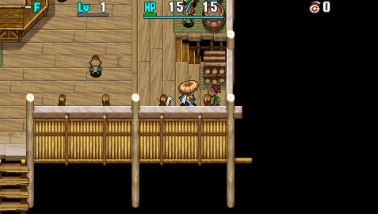
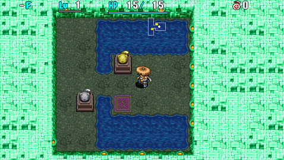

  

Mini-game dungeon where you punch Mamel statues to move them onto goal tiles. 
Puzzles often require utilizing items, monsters, and traps, so it can be played to gain knowledge.

Items cannot be taken outside the dungeon, but they do get recorded in the Item Book. 
Unlike Shiren 5, scrolls you read will be registered to the Blank Scroll list.

You'll receive 1 random item upon clearing a puzzle, and harder puzzles often give higher quality items. If you clear all 42 puzzles, you'll be rewarded with a Scout Bracelet.

# Overview

<table class="dungeonOverview">
  <tr>
    <th>Unlock</th>
    <td class="highlightYellow">Reach Boronga Village.</td>
  </tr>
  <tr>
    <th>Entrance</th>
    <td class="highlightYellow">Boronga Village (Shady Man in Novice House)</td>
  </tr>
</table>

<table class="dungeonTable">
  <tr>
    <th>Puzzles</th>
    <td>42</td>
    <th>Day / Night</th>
    <td>Day</td>
  </tr>
  <tr>
    <th>Bring Items</th>
    <td>No</td>
    <th>Allies</th>
    <td>No</td>
  </tr>
  <tr>
    <th>Clear Icon</th>
    <td>None</td>
    <th>Reward</th>
    <td>1 random item (1st clear) Scout Bracelet (clear all)</td>
  </tr>
</table>

#### Mamel Statues

- Punch the statue to make it move 1 tile in the direction of the punch.
    - The statue also moves if it's hit by a monster or log.
- The statue cannot be pushed in diagonal directions by punches.
    - Staves and logs can be used to push them diagonally.
- The statue will erase any item or trap that is present on a destination tile when pushed.
- The statue cannot be pushed onto a water or air tile - it'll warp instead.
- You cannot move diagonally through statue corners, even with a Wall Clip Bracelet.
- Magic bullets from staves work as expected, but thrown staves must have piercing properties.
    - Simply throwing a staff at the statue will do nothing, and the staff falls to the ground.

#### Map Characteristics

- The puzzle is treated as 1 room, and monsters detect Shiren from anywhere on the map.
- Some maps have walls that can be destroyed by direct attacks.
- Shiren will always warp to a specific location if he warps.

# Puzzle Solutions

[Link to Statue Cave solutions video]

# Possible Rewards

<table class="dungeonTable">
  <thead>
    <tr>
      <th colspan="5">Possible Reward Items</th>
    </tr>
  </thead>
  <tbody>
    <tr>
      <td>Palm Stick</td>
      <td>Blast Shield</td>
      <td>Otogiriso</td>
      <td>Slumber Scroll</td>
      <td>Transient Staff</td>
    </tr>
    <tr>
      <td>Dull Gold Edge</td>
      <td>Iron Targe</td>
      <td>Heal Grass</td>
      <td>Air Slash Scroll</td>
      <td>Paralysis Staff</td>
    </tr>
    <tr>
      <td>Breeze Blade</td>
      <td>Safe Shield</td>
      <td>Life Grass</td>
      <td>Fear Scroll</td>
      <td>Swap Staff</td>
    </tr>
    <tr>
      <td>Sky Splitter</td>
      <td>Lock Shield</td>
      <td>Expand Seed</td>
      <td>Trap Erase Scroll</td>
      <td>Knockback Staff</td>
    </tr>
    <tr>
      <td>Bright Blade</td>
      <td>Gyadon Blocker</td>
      <td>Antidote Grass</td>
      <td>Fixer Scroll</td>
      <td>Seal Staff</td>
    </tr>
    <tr>
      <td>Copper Edge</td>
      <td>Clan Shield</td>
      <td>Strength Grass</td>
      <td>Medicine Scroll</td>
      <td>Pinning Staff</td>
    </tr>
    <tr>
      <td>Water Cutter</td>
      <td>Beast Shield</td>
      <td>Swift Grass</td>
      <td>Sanctuary Scroll</td>
      <td>Slow Staff</td>
    </tr>
    <tr>
      <td>Myopic Masher</td>
      <td>Lizard Shield</td>
      <td>Warp Grass</td>
      <td>Escape Scroll</td>
      <td>Mage Staff</td>
    </tr>
    <tr>
      <td>Katana</td>
      <td>Meteor Guard</td>
      <td>Sight Grass</td>
      <td>Blank Scroll</td>
      <td>Lightning Staff</td>
    </tr>
    <tr>
      <td>Drain Slicer</td>
      <td>Heavy Shield</td>
      <td>Dragon Grass</td>
      <td>Desert Scroll</td>
      <td>Sleep Talisman</td>
    </tr>
    <tr>
      <td>Crescent Katana</td>
      <td>Pierce Bracelet</td>
      <td>Power Up Grass</td>
      <td>Attraction Scroll</td>
      <td>Seal Talisman</td>
    </tr>
    <tr>
      <td>Beast Fang</td>
      <td>Heal Bracelet</td>
      <td>Revival Grass</td>
      <td>Dispel Aura Scroll</td>
      <td>Dizzy Talisman</td>
    </tr>
    <tr>
      <td>Burning Blade</td>
      <td>Calm Bracelet</td>
      <td>Growth Seed</td>
      <td>Invitation</td>
      <td>Miss Talisman</td>
    </tr>
    <tr>
      <td>Lizard Lasher</td>
      <td>Alert Bracelet</td>
      <td>Undo Grass</td>
      <td>Storage Pot</td>
      <td>Fear Talisman</td>
    </tr>
    <tr>
      <td>Meteor Edge</td>
      <td>Cleansing Bracelet</td>
      <td>Navigation Scroll</td>
      <td>Synthesis Pot</td>
      <td>Bind Talisman</td>
    </tr>
    <tr>
      <td>Palm Shield</td>
      <td>Staunch Bracelet</td>
      <td>Purify Scroll</td>
      <td>Identify Pot</td>
      <td>Slow Talisman</td>
    </tr>
    <tr>
      <td>Diet Shield</td>
      <td>Strength Bracelet</td>
      <td>Identify Scroll</td>
      <td>Purify Pot</td>
      <td>Berserk Talisman</td>
    </tr>
    <tr>
      <td>Spry Shield</td>
      <td>Happy Bracelet</td>
      <td>Heaven Scroll</td>
      <td>Mailing Pot</td>
      <td rowspan="4" class="highlightGray"></td>
    </tr>
    <tr>
      <td>Dull Gold Shield</td>
      <td>Monster Detector</td>
      <td>Earth Scroll</td>
      <td>Presto Pot</td>
    </tr>
    <tr>
      <td>Counter Shield</td>
      <td>Item Detector</td>
      <td>Plating Scroll</td>
      <td>Heal Pot</td>
    </tr>
    <tr>
      <td>Copper Guard</td>
      <td>Herb</td>
      <td>Confusion Scroll</td>
      <td>Empathy Staff</td>
    </tr>
  </tbody>
</table>

※ Source: Shiren 4 Official Complete Guide.
