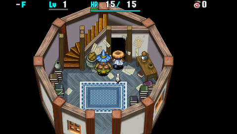
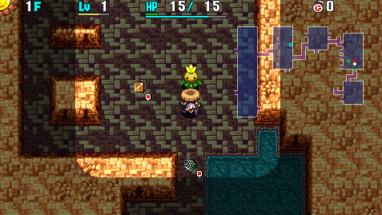

  

Dungeon where you make use of traps to progress. Shiren has Trapper status in this dungeon, meaning traps are visible and monsters can be trapped. Traps can be picked up and set by the player, and thrown traps activate underfoot if they hit the target. The player only gains 1 experience point if an enemy is defeated without using traps. Some traps like Landmine function differently under Trapper status → [Traps](/system/traps)

The first clear is relatively easy if you understand the experience points multiplier system, but the 99F full version is considered one of the hardest dungeons in the entire series.

The Trapper Bracelet you receive when you clear the dungeon is a 1 time reward. If you ever lose it, you'll have to randomly find one in this dungeon to obtain another one.

<ul class="quickLinksUL">
  <li><a href="#overview">Overview</a></li>
  <li><a href="#strategy">Strategy</a></li>
  <li><a href="#monsters">Monsters</a></li>
  <li><a href="#items">Items</a></li>
  <li><a href="#traps">Traps</a></li>
</ul>

# Overview

<table class="dungeonOverview">
  <tr>
    <th>Unlock</th>
    <td class="highlightYellow">Go to Rakutata Village after clearing the main story.</td>
  </tr>
  <tr>
    <th>Entrance</th>
    <td class="highlightYellow">Rakutata Village (Chief's House)</td>
  </tr>
</table>

<table class="dungeonTable">
  <tr>
    <th>Floors</th>
    <td>25F (first) / 99F</td>
    <th>Day / Night</th>
    <td>Day</td>
  </tr>
  <tr>
    <th>Bring Items</th>
    <td>No</td>
    <th>Allies</th>
    <td>No</td>
  </tr>
  <tr>
    <th>Unidentified</th>
    <td colspan="3">Weapons, Shields</td>
  </tr>
  <tr>
    <th>Shops</th>
    <td>Regular, Elite</td>
    <th>Monster Houses</th>
    <td>Regular, Special, Sudden</td>
  </tr>
  <tr>
    <th>Initial Enemies</th>
    <td>6~10</td>
    <th>Spawn Rate</th>
    <td>30</td>
  </tr>
  <tr>
    <th>Ominous aura</th>
    <td>No</td>
    <th>Winds of Kron</th>
    <td>1st: 400 / 4th: 700</td>
  </tr>
  <tr>
    <th>Clear Icon</th>
    <td class="clearIcon"></td>
    <th>Clear Bonus</th>
    <td>30,000,000</td>
  </tr>
  <tr>
    <th>Reward</th>
    <td colspan="3">Trapper Bracelet (1st clear)</td>
  </tr>
</table>

# Strategy

<ul class="quickLinksUL">
  <li><a href="#general">General</a></li>
  <li><a href="#experience-points">Experience Points</a></li>
  <li><a href="#traps">Traps</a></li>
  <li><a href="#chaining-traps">Chaining Traps</a></li>
  <li><a href="#equipment">Equipment</a></li>
  <li><a href="#item-organization">Item Organization</a></li>
</ul>

### General

Shiren won't activate traps when he steps on them in this dungeon, and he can pick them up and set them on the ground to trap monsters.

There are generally lots of traps available on each floor, so it's fine to use them aggressively, especially considering weapons and shields are usually on the weaker side in this dungeon. However, you'll want to save certain traps for specific situations instead of using them right away, and it's important to relocate traps that benefit monsters so that enemies don't step on them.

Traps can be placed without ending your turn, and they have a chance to break after activation. The chance to break seems to differ by trap, but details are unknown. (Arrow, Spoil, Banana break easily) Traps that haven't been picked up yet will never break, excluding arrow traps and Multiply Trap.

Monsters can be trapped by throwing traps at them, but the trap always breaks after activating underfoot. If the thrown trap misses, it will still land underfoot but won't activate.

As far as items, Storage Pots can't be found. It's hard to manage banana ripeness, and you need to think carefully when keeping or discarding items. Consider inventory management with less space to be one of the main themes of this dungeon.

Equipment is generally on the weaker side but type effective weapons can be found, and Heaven Scroll, Earth Scroll, and Synthesis Pot can also appear, so you can strengthen equipment to some degree. Mixer synthesis can only be done on Mixerdon (71-73F) floors, so Synthesis Pot is the only realistic method.

Wind blows quickly compared to other dungeons - 400 turns for the 1st gust, and 700 turns for the 4th gust. Sort your inventory before arriving on floors where you intend to perform farming techniques.

### Experience Points

You only gain 1 experience point if you defeat a monster without using traps. Each time you trap a monster, the experience points you gain is doubled, up to a max multiplier of x20. Per trap activation: x1 → x2 → x4 → x8 → x16 → x20

However, the multiplier decreases each time a monster moves across a tile without a trap. Once the multiplier reaches x20, the monster can no longer be trapped, but the multiplier will be retained as long as the monster stays on tiles with traps.

So, the key is to place traps in ways to raise the experience point multiplier to x20 before defeating monsters. Creating a high level monster early on and defeating it at x20 multiplier makes early game more consistent. ※ Defeating monsters using instant collapse type traps provides 0 experience points.

Special rooms with lots of One-Way Traps, also known as One-Way House, can be generated. The One-Way Traps in these rooms are treated as placed by Shiren so they can't be picked up, but they're often placed in a way to form a loop, so they offer a nice chance to level up.

### Traps

See [Traps](/system/traps) for additional information.

<ul>
  <li>Wood Arrow, Iron Arrow
    <ul>
      <li>Place it next to a wall and collect arrows to make early game more consistent.</li>
      <li>Can be chained with other traps to raise exp multiplier.</li>
    </ul>
  </li>
  <li>Poison Arrow
    <ul>
      <li>Place it next to a wall and collect arrows to use against stronger monsters.</li>
      <li>Can be used against Banana Morph (35-39F) to perform Banana Morph Factory.</li>
    </ul>
  </li>
  <li>Trip, Hunger, Rust, Strip, Curse
    <ul>
      <li>Mostly used in a chain to raise exp multiplier early game.</li>
      <li>Rust and Strip can be used to reduce a monster's defense.</li>
      <li>Curse inflicts Sealed status, so it's useful even late game.</li>
      <li>Unlike previous games, monsters don't drop items when they trip.</li>
    </ul>
  </li>
  <li>Multiply
    <ul>
      <li>Used to restock traps - breaks after 1 use.</li>
      <li>Throw it at a line of enemies with a Pierce Bracelet equipped to generate even more traps.</li>
    </ul>
  </li>
  <li>Summon
    <ul>
      <li>Use alongside Spin Trap or Berserk Talisman to create a high level monster - breaks after 1 use.</li>
      <li>If you don't need to use it, relocate it to a spot where monsters won't step on it.</li>
    </ul>
  </li>
  <li>Monster
    <ul>
      <li>Use alongside Spin Trap or Berserk Talisman to create a high level monster - breaks after 1 use.</li>
      <li>If you don't need to use it, relocate it to a spot where monsters won't step on it.</li>
    </ul>
  </li>
  <li>One-Way
    <ul>
      <li>Makes a monster move in the arrow's direction for 3 turns.</li>
      <li>If a creature is blocking the monster's path, the monster will attack the creature.</li>
      <li>Use alongside Bind or Slow traps to create a high level monster, or use it to run away.</li>
    </ul>
  </li>
  <li>Log
    <ul>
      <li>Log flies from the direction Shiren is facing, dealing 5 damage and 10 tiles of knockback.</li>
      <li>The trap will trigger up to 4 times in the same turn if a creature keeps landing on it.</li>
      <li>Can be used like a Pinning Staff to escape from a bad situation.</li>
    </ul>
  </li>
  <li>Sleep, Banana
    <ul>
      <li>Used as the final trap in a chain to safely defeat a x20 exp multiplier monster.</li>
      <li>Sleep prevents actions for 6 turns, and Banana turns them into a banana for 10 turns.</li>
      <li>Banana status disables special attacks, abilities, and lowers attack and defense to 0.</li>
      <li>Banana Trap can also be used alongside a Landmine to create Grilled Bananas.</li>
    </ul>
  </li>
  <li>Spring
    <ul>
      <li>Used like Warp Grass to escape from a bad situation.</li>
    </ul>
  </li>
  <li>Spoil
    <ul>
      <li>One-shots monsters who step on it, but defeated monsters don't provide experience points.</li>
      <li>Can be used alongside a Landmine to create Grilled Bananas.</li>
    </ul>
  </li>
  <li>Pit
    <ul>
      <li>Used to steal, skip dangerous floors (ex: Horrabbit), or escape from a dire situation.</li>
      <li>Can also be used to one-shot a monster, but it's extremely wasteful to use it for that purpose.</li>
    </ul>
  </li>
  <li>Spin, Blind
    <ul>
      <li>Place it in a hallway while running from a monster to throw off their pursuit.</li>
      <li>Can also be used to prevent a monster from using its special attack.</li>
    </ul>
  </li>
  <li>Landmine, Big Landmine
    <ul>
      <li>Used alongside Spoil or Banana traps to create Grilled Bananas.</li>
      <li>Landmine deals damage equal to 50% of current HP, and Big Landmine reduces HP to 1.</li>
      <li>Can be placed in a hallway bend to throw off monster pursuites</li>
    </ul>
  </li>
</ul>

### Chaining Traps

Creating trap chains and defeating x20 exp multiplier monsters is the key to success. Since wind blows early, you'll want to plan in advance which floors to chain vs. gather traps. Place traps that don't impact movement such as Wood Arrow Trap, Trip Stone, etc. in a row, then finish the chain with a Sleep Trap or Banana Trap so you can safely defeat the monster. ※ Remember that monsters who are at x20 exp multiplier can't be trapped.

Log Trap can activate up to 4 times in 1 turn when placed in a hallway, but you'll need to be careful which direction Shiren is facing to ensure the log doesn't cause accidents.

The following placement + moving up and down can be used to efficiently raise exp multiplier:

<pre class="diagram">
T = Trap 
 
□ □ □ □ 
□ □ T □ 
□ T □ □ 
□ □ □ □
</pre>

Use items or traps that inflict Berserk, Afraid, Confused, Blind, or One-Way status to level up a monster. Kumonigiri (6-10F) is the ideal target since it lacks a special attack and higher levels offer lots of exp. Banana Trap is better than Sleep as the final trap, since it lasts longer and reduces defense to 0.

|Lv|Name|Exp|Exp (x20)|
|-|-|-|-|
|2|Pandanigiri|2400|48000|
|3|Onigirizzly|4500|90000|
|4|Kodionigiri|7000|140000|

### Equipment

Equipment selection mostly only matters for the 2nd clear.

#### Weapon

<ul>
  <li>Shoddy Dirk
    <ul>
      <li>Step on a Curse Trap to seal it, which prevents it from degrading from usage.</li>
      <li>Struggles to keep up against late game monsters, but makes early game more consistent.</li>
    </ul>
  </li>
  <li>Dotanuki, Beast Fang
    <ul>
      <li>Decent if you manage to synthesize runes using Synthesis Pots.</li>
    </ul>
  </li>
  <li>Water Cutter
    <ul>
      <li>Use it as a main weapon to fight Gyaza and Hopodile types instead of synthesizing it.</li>
    </ul>
  </li>
  <li>Lizard Lasher
    <ul>
      <li>Dragon and Hopodile are the only Dragon types in this dungeon, but they're both problematic enough to warrant using this as a main weapon.</li>
    </ul>
  </li>
  <li>Drain Slicer
    <ul>
      <li>Effective against tricky Spin Polygon and Absorbiphant types.</li>
      <li>Absorbiphant types in particular are immune to most traps, so this helps a lot.</li>
    </ul>
  </li>
  <li>Myopic Masher
    <ul>
      <li>Nice against tough Ironhead types and tricky Gazer types.</li>
    </ul>
  </li>
  <li>Kabura's Blade
    <ul>
      <li>Prioritizing attack power over 2 bracelet resonance is viable due to the rarity of key bracelets.</li>
    </ul>
  </li>
  <li>Breeze Blade
    <ul>
      <li>Ideally used as a rune, and plays well with Monster Detector.</li>
    </ul>
  </li>
</ul>

#### Shield

<ul>
  <li>Shoddy Plank
    <ul>
      <li>Step on a Curse Trap to seal it, which prevents it from degrading from usage.</li>
      <li>Unlike its weapon counterpart, it's fine to keep using it even late game.</li>
    </ul>
  </li>
  <li>Clan Shield, Beast Shield
    <ul>
      <li>Decent if you manage to synthesize runes using Synthesis Pots.</li>
    </ul>
  </li>
  <li>Diet Shield
    <ul>
      <li>Reduces the risk of starvation, and frees up inventory space since you can carry less food.</li>
      <li>Consider leveling it as a secondary shield if you found a Heal Bracelet.</li>
    </ul>
  </li>
  <li>Blast Shield
    <ul>
      <li>Reduces damage received when grilling bananas using Landmines.</li>
      <li>Nice for Ornery Tank (70-75F) floors in particular.</li>
    </ul>
  </li>
  <li>Steady Shield
    <ul>
      <li>Essential for Horrabbit (67-71F) floors.</li>
      <li>Nullifies movement effects such as Log Trap, Spring, etc., so don't use it as a main shield.</li>
      <li>If you have a spare Shoddy Plank, go ahead and synthesize this into the Shoddy Plank.</li>
    </ul>
  </li>
  <li>Counter Shield
    <ul>
      <li>Counter damage is similar to Empathetic status at Lv8 + Strength Bracelet resonance, so it's a viable counter to Gyaza types, especially if you have a Heal Bracelet.</li>
    </ul>
  </li>
  <li>Fuuma Shield
    <ul>
      <li>Prioritizing defense over 2 bracelet resonance is viable due to the rarity of key bracelets.</li>
    </ul>
  </li>
  <li>Palm Shield
    <ul>
      <li>Obtains 1/2 Hunger at Lv8 and has a fast growth rate.</li>
      <li>You typically can't synthesize much, so it's a nice backup option for if you find a Heal Bracelet.</li>
    </ul>
  </li>
</ul>

#### Bracelet

<ul>
  <li>Heal Bracelet
    <ul>
      <li>Heal Pot is uncommon, so this bracelet significantly helps with HP recovery.</li>
      <li>That said, you need to stock up on food or obtain the 1/2 Hunger rune to utilize it well.</li>
    </ul>
  </li>
  <li>Pierce Bracelet
    <ul>
      <li>Throw a trap with this equipped to trap a line of monsters on the same turn.</li>
      <li>Good throwing options include Banana Trap → Landmine, Spoil Trap, Curse Trap, etc.</li>
      <li>Combine with Monster Detector or Navigation Scroll to snipe dangerous monsters like Mesmerikon.</li>
    </ul>
  </li>
  <li>Cleansing Bracelet, Calm Bracelet, Alert Bracelet
    <ul>
      <li>Mostly used to guard against Mutaikon, Dazikon, and Dozikon special attacks.</li>
    </ul>
  </li>
  <li>Strength Bracelet
    <ul>
      <li>Increases damage of arrows, but it's fine to discard it late game.</li>
      <li>Essential if you're using a Counter Shield as a main shield.</li>
    </ul>
  </li>
  <li>Bad Aim Bracelet
    <ul>
      <li>Lets you trap a monster multiple times using the same trap.</li>
      <li>Initially generated traps don't break from usage, so you can reach x20 exp multiplier with 1 trap.</li>
    </ul>
  </li>
  <li>Monster Detector, Scout Bracelet
    <ul>
      <li>Found in Elite Shops.</li>
      <li>Avoid surprise attacks in hallways, and plays well with Breeze Blade.</li>
    </ul>
  </li>
</ul>

### Item Organization

This section assumes the player is attempting the 2nd clear.

Storage Pots can't be found, so smart selections on what to keep vs. what to discard is important. Ordinary Pot, Purify Pot, and Chocolate Pot should be used as storage, and don't break them until late game. Insert items you won't use right away such as duplicate staves, Steady Shield, bracelets, and scrolls.

Poison arrows are extremely important from mid game onward, so stock up on them early. However, be warned that poison arrows are ineffective against Absorbiphant, Scorpion, and Mutaikon types. Some players gather iron arrows to counter these monsters, but doing so takes up valuable inventory space.

Mixerdon (71-73F) is the only chance to synthesize different category items in this dungeon. Despite how late it appears, it can be worth storing rune ingredients in a pot for the final stretch. Desert Scroll (Anti-Aquatic) for Hell Gyaza and Boingodile, Dragon Grass (Anti-Dragon) for Boingodile, Heal Grass (HP+15) and Life Grass (HP+20) to increase the potency of Heal Pot for Porgon floors. Obtain Dizzy Grass (Confusing) / Sleep Grass (Sedating) from Mutaikon types if you have Calm / Alert bracelet.

Keep staves such as Pinning Staff, Swap Staff, and Paralysis Staff on hand at all times. Transient and Paralysis Staff can one-shot any monster. (But Revitalize Trap / Horrabbit can cure the paralysis) Knockback, Mage, Slow, Unlucky, and Seal staves are nice, but can't always overcome a situation on their own. Unlucky Staff counters Lv2+ Absorbiphant types that powered up, Seal Staff counters Porgon and Mesmerikon. Decoy Staff is shop-exclusive, and Tunnel Staff can be handy when stealing or creating shortcuts. Lightning Staff can damage enemies immune to traps (Absorbiphant) or projectiles (Bored Kappa, Mixerdon), but it's probably not worth taking up an inventory slot.

Keep 1\~2 Confusion or Slumber scrolls on hand at all times in case you have a bad start on a new floor. Navigation Scrolls should be stored in pots and saved for late game floors as much as possible. Dispel Aura Scroll is nice for Gyaza floors in particular, but it's probably not worth taking up an inventory slot. Store Trap Scroll in a pot with items that you want to retrieve when you're running low on traps and other items. Use Suction Scroll to reuse pots like Chocolate Pot to stock up on food, or Presto Pot to obtain more items. If you find a blessed Suction Scroll, blessing Revival Grass and Fixer Scroll are a high priority.

Pick up every Pit Trap you find, even if you have to discard other good items to carry them. Keep 2\~3 offensive traps such as Banana Trap, Spoil Trap, Sleep Trap, or Blind Trap on hand at all times. Placing a trap doesn't end your turn, so these can be used to counter a dangerous monster even when adjacent. That said, don't forget to Scout in rooms, and utilize initially generated traps since they don't break. Carry 1 Spring or Log Trap if you don't have Warp Grass or Pinning Staff so you can escape a tricky situation. Pit Traps should be saved for start-of-floor Monster Houses or dire situations as much as possible, but it's fine to use them to skip past dangerous floors to reduce risk as well.

Particularly dangerous floors:

|Floors|Monster|
|-|-|
|59-61|MC Wizard|
|65-67|Dozikon|
|67-71|Horrabbit|
|70-75|Ornery Tank|
|76-81|Hell Gyaza|
|80-82|MC Sorcerer|
|86-88|Mesmerikon|
|89-94|Porgon|

Pick up every Heal Pot you find, even if you have to discard other good items. Heal Pot uses are essential to surviving Hell Gyaza and Porgon floors.

For food, it's best to carry a Landmine + Banana Trap or Spoil Trap instead of carrying bananas. If you raise max fullness using Grilled Bananas early game, you can get by with bananas found on the ground, especially if you additionally find a Diet Shield or otherwise obtain the 1/2 Hunger shield rune. However, if you find a Heal Bracelet, it can be worth keeping 1\~2 bananas on hand.

Don't insert traps into pots, with the exception of Multiply Trap, and possibly Pit Trap if you have lots of them. Having to break the pot to access a Pit Trap adds 1 turn before you're able to escape, which might be the difference between being able to continue the run vs. getting a game over in a dire situation.

Item usage usually increases from around Sky Dragon (53F+) floors, and extremely dangerous monsters like Dozikon and Horrabbit start to appear from 65F onward, so think carefully about the balance of items you have on hand and break pots to retrieve certain types of items to cover specific situations as needed. Late game is a constant resource drain, so don't neglect to use traps to conserve other items. If nothing else, do your best to not run out of HP restoring items and arrows to check for safety in hallways.

# Floor Guide

#### First Clear

### 1-5F

Mamel (1-2F), Seedie (1-3F), Chintala (2-4F), Hopodile (3-6F), Squid King (4-6F), Cheer Ham (5-7F)

It's possible to attain a x20 exp multiplier using 2 traps by placing them next to each other diagonally and moving Shiren diagonally so that the monster alternates stepping on each trap. You'll receive attacks while doing this unless you inflict Slow status, but HP regen is fast so it's a non-issue. It's best to use an initially generated trap for 1 of them, since initially generated traps don't break.

Save useful traps for 6F instead of using them here so that you can hunt a high level Kumonigiri. Keep an eye out for traps and talismans that can be used to level up a Kumonigiri. Berserk Talisman, Fear Talisman, and One-Way Trap are easiest, but Spin Trap and Blind Trap can also be used. You'll also need some traps to defeat the high level Kumonigiri, so look for Slow Trap, Sleep Trap, Bind Trap, Banana Trap, Landmine, and Big Landmine.

Collect arrows if you find Wood Arrow Trap and Poison Arrow Trap. It's fine to replace Wood Arrows with Iron Arrows once you progress a bit - carrying 3 types is overkill.

### 6-10F

Cheer Ham (5-7F), Kumonigiri (6-10F), Absorbiphant (7-9F), Ironhead (7-11F), Scorpion (8-10F), etc.

The goal here is to create a Kodionigiri (Lv4 Kumonigiri), then defeat it with a x20 exp multiplier. It's best to do it on 6F, since Absorbiphant is immune to status traps and appears from 7F.

Read a Navigation Scroll if you found one to make things safer.

- Berserk Talisman - Throw talismans at Kumonigiri from a distance.
- Fear Talisman - If the fodder monster moves first, stop its movement using Sleep, Slow, or Bind traps.
- One-Way Trap - Avoid using Cheer Ham as a fodder monster.
- Spin Trap - Use Cheer Ham as a fodder monster.
- Blind Trap - Difficult to get a fodder monster in the path of the Kumonigiri.

Keep Warp Grass or Spring on hand in case you get sandwiched in a hallway while looking for fodder monsters. Sleep or Bind traps can be used to create distance between you and Kumonigiri, but it's not recommended to use Slow Trap until the Kumonigiri levels up into a Kodionigiri.

The ideal method to defeat the Kodionigiri is to inflict Slow status, followed by Banana status. Have it step on traps until it reaches x16 exp multiplier, then lure it onto a Banana Trap and defeat it at x20. If Banana status wears off, have it take a step so it falls to x19, then lure it back onto a Banana Trap. If you don't have a Banana Trap, use Sleep Trap + Landmine to reduce HP, Strip or Rust Trap to reduce defense, and Banana Peel to inflict Slip status and defeat it at x19 exp multiplier.

1 Kodionigiri will level you up to \~Lv35, and 2 Kodionigiri will level you up to \~Lv39. 1 Onigirizzly is still decent, as it'll level you up to \~Lv30 which is plenty for the 1st clear. Don't forget to equip a weapon and shield, since these monsters also provide lots of skill points. If you find the items for it, try to hunt a second Kodionigiri before descending past 10F.

Once you've leveled up, switch to prioritizing traps used to evade enemies.

### 11-14F

Fearabbit (11-13F), Yanpii (11-15F), Porky (12-15F), Tiger Tosser (13-15F), Spin Polygon (14-16F), etc.

Enemies with higher attack like Yanpii and Tiger Tosser appear, but you can one-shot them if you leveled up. Check every room for items and traps, and insert staves, scrolls, and Multiply Traps into pots for later floors. Transient and Paralysis staves should be saved for later - use Slow, Mage, Lightning staves early on.

### 15-18F

Strong Cart (15-18F), Kengo (16-18F), Beanie (16-20F), Squid Lord (17-19F), Pot Knave (18-20F), etc.

Trickier enemies like Strong Cart and Kengo appear. HP regen usually can't keep up with HP loss from around this point if you trade hits, so use arrows. Continue searching for traps, but if you're losing a lot of HP, consider descending early.

### 19-25F

Pot Knave (18-20F), Pop Tank (19-24F), Zalokleft (20-22F), Sr. Yanpii (21-23F), Big Chintala (21-25F), Hipadile (24-28F), Concusschin (23-25F), etc.

Pop Tank can be used to grill bananas, though its fixed damage can be painful. Sr. Yanpii can deal 40 fixed damage in 1 turn by headbutting you into a wall, so always Scout in rooms. Use items and traps to rush stairs - enemies are strong, so there's little reason to linger on these floors.

#### Second Clear

### 26-33F

Hipadile (24-28F), Kappa Pest (25-27F), Curse Sister (26-28F), Eligan (28-33F), Super Gazer (29-31F), MC Mage (29-31F), Digestiphant (31-35F), Dazikon (32-34F), etc.

Enemies are generally easier to defeat than the previous floor range, but be wary of MC Mage and Dazikon. Always use poison arrows or traps to weaken Eligan before fighting it.

Digestiphant is immune to poison arrows, so use iron arrows or a damage dealing trap instead. If you have a Blank Scroll, consider throwing an Extinction Scroll at Dazikon to remove the threat of Dozikon and Mesmerikon later in the dungeon.

### 34-38F

Digestiphant (31-35F), Gyaza (34-38F), Demon Scorp (35-37F), Banana Morph (35-39F), Chainhead (36-40F), etc.

Gyaza is basically immune to traps and arrows, so it's recommended to rush stairs. If you encounter a yellow aura Gyaza, go ahead and use a Pit Trap if you have one on hand. It's a bit risky here, but Banana Morph can be used to perform [Banana Morph Factory](/guides/tips-and-tricks#banana-morph-factory) if desired.

### 39-41F

Voltdon (38-42F), Steamroid (39-41F), Tiger Hurler (40-44F), Poofy (41-43F), etc.

Floor range where you can catch your breath. Hunt Voltdons for experience points and skill points, and stock up on traps using Steamroids. Scarabbit appears from 42F, so organize your items so that you have some area of effect items on hand.

### 42-44F

Voltdon (38-42F), Tiger Hurler (40-44F), Poofy (41-43F), Scarabbit (42-44F), Iai (43-47F), etc.

If you get surrounded by monsters due to a Scarabbit, use a scroll, talisman, or Spring. Iai overlaps with Scarabbit between 43-44F, so there's risk of losing equipment - hurry to the stairs.

It's recommended to have a group of Poofy use their special attack on 42F to skip floors. If you're lucky, you can warp past all of the floors where Scarabbit and Iai overlap.

### 45-52F

Porko (45-49F), Lt. Yanpii (48-50F), Pandanigiri (48-52F), Ooze (50-52F), Fulminachin (51-55F), etc.

Pandanigiri and Lt. Yanpii offer lots of experience points, so use traps to level up if needed. HP regen can't keep up if you trade hits, so always use poison arrows or traps to weaken enemies first.

If you found a Blank Scroll and also have Alert Bracelet, 3 Pit Traps (for Mesmerikon floors), and Steady Shield, go ahead and throw an Extinction Scroll at Porko to remove the threat of Porkon and Porgon later on.

### 53-57F

Fulminachin (51-55F), Curse Mom (53-55F), Sky Dragon (53-57F), Eligagan (55-59F), Oingodile (56-60F), Squid Emperor (56-58F), etc.

Sky Dragon is a big threat - If you're not near a hallway, move so you're lined up and use a talisman or staff. It breathes fire quite often, so consider using a Pit Trap if you're stuck in the middle of a very large room.

Oingodile is hard to trap due to its movement, and Squid Emperor can blind you from anywhere in the room. It's mostly an onslaught of dangerous floor ranges from this point, so it's best to rush stairs.

### 58-64F

Eligagan (55-59F), Oingodile (56-60F), Banana Boss (58-60F), MC Wizard (59-61F), Gigahead (60-64F), Vexing Kappa (61-63F), Porkon (61-65F), etc.

Beware of MC Wizard - There's a very high chance you'll collapse if its magic inflicts berserk status. Banana Boss can turn you into a banana, which can easily end your run if you get sandwiched in a hallway. Porkon denies you a chance to recover HP by stepping in place, and Vexing Kappa throws various items. Surviving past this point often comes down to arrows and other items you managed to accumulate.

### 65-70F

Hyper Gazer (64-66F), Dozikon (65-67F), Jouncy (66-68F), Horrabbit (67-71F), Boss Yanpii (69-71F), etc.

Dozikon and Horrabbit appear - Use Navigation Scrolls or Pit Traps if you don't have items that counter them. Horrabbit in particular appears for 5 floors, so if you have a Blank Scroll and don't have a Steady Shield, throw an Extinction Scroll at it.

If you don't have any items that counter Horrabbit, try to maintain at least 200 HP at all times in case you get attracted and attacked by Boss Yanpii or red aura monsters on the same turn.

It's recommended to have a group of Jouncy use their special attack on 66F to skip floors. Use poison arrows, Miss Talisman, or Strip Trap to weaken them to help ensure safety.

### 71-75F

Ornery Tank (70-75F), Mixerdon (71-73F), Kleptoad (72-74F), Grainie (72-76F), Spirit Ham (74-76F), etc.

Ornery Tank appears for 6 floors and deals 40 damage per turn without the 1/2 Blast shield rune. Kleptoad has the possibility of one-shotting you if it picks up blessed or high value Gitan.

Despite these dangers, Mixerdon appears and provides a valuable chance to synthesize items. Desert Scroll (Anti-Aquatic) is top priority for upcoming Hell Gyaza floors.

### 76-82F

Osmammoth (75-77F), Hell Gyaza (76-81F), Curse Gramma (77-79F), Bouncy (78-80F), MC Sorcerer (80-82F), etc.

Hell Gyaza is immune to most traps, so use a Pinning Staff or Spring to run away. Fighting it without Heal Bracelet, Water Cutter, or Counter Shield usually burns through 1\~2 Heal Pot uses, so do everything you can to avoid having to trade hits with it.

Osmammoths can power up on their own by stepping on traps while wandering around the floor. Consider keeping damage dealing traps like Landmine or Metal Trap on hand for them.

The combination of MC Sorcerer and Tiger Ace (77-82F) can easily cause accidents. It's recommended to have a group of Bouncy use their special attack on 80F to skip floors, but doing so likely requires a Miss Talisman.

### 83-84F

Flashdon (81-86F), Shihan (82-84F), Sludge (83-85F), Eligagon (83-88F)

Monsters don't have ranged attacks on these floors, so it's safer to check rooms for items and traps.

### 85-88F

Flashdon (81-86F), Eligagon (83-88F), Kappa Troll (85-87F), Mesmerikon (86-88F), Banana Master (87-89F), etc.

If you didn't throw an Extinction Scroll at a Mutaikon type earlier, use 3 Pit Traps to skip from 86F to 89F. Without Pit Traps, you'll have to rely on a setup like Navigation Scroll + Pierce Bracelet + arrows. Don't forget to equip a Cleansing Bracelet if you have one on hand.

### 89-94F

Boingodile (88-92F), Porgon (89-94F), Knave King (89-91F), Squid Kaiser (92-94F), etc.

The final hurdle of this dungeon - If you have a Blank Scroll, throw an Extinction Scroll at Porgon. Use Pit Traps, Navigation Scrolls, HP restoring items, and any other items to get through these floors. Seal, Paralysis, and Decoy staves are also effective.

Boingodile is hard to trap with its movement, and Squid Kaiser's special attack is quite troublesome. However, you generally don't have time to shoot arrows in hallways to check for enemies.

### 95-99F

Blight Scorp (93-99F), Mosh Polygon (93-99F), Doomhead (95-99F), Kodionigiri (95-99F)

Mosh Polygon is tricky to trap, and beware of Doomhead and Kodionigiri's high attack power. Porgon is no longer around, so take your time and shoot arrows in hallways to check for enemies. Doomhead is the only monster with a ranged attack from 95F until the end.

# Monsters

See [Monsters](/system/monsters) for individual monster details.

Enemy Colors: Farming Useful Destroys Items High Offense Dangerous Very Dangerous

<table class="monsterTable">
  <thead>
    <tr>
      <th>F</th>
      <th colspan="4">Monsters</th>
    </tr>
  </thead>
  <tbody>
    <tr>
      <th>1</th>
      <td class="">Mamel</td>
      <td class="">Seedie</td>
      <td class="highlightGray"></td>
      <td class="highlightGray"></td>
    </tr>
    <tr>
      <th>2</th>
      <td class="">Mamel</td>
      <td class="">Seedie</td>
      <td class="">Chintala</td>
      <td class="highlightGray"></td>
    </tr>
    <tr>
      <th>3</th>
      <td class="">Hopodile</td>
      <td class="">Seedie</td>
      <td class="">Chintala</td>
      <td class="highlightGray"></td>
    </tr>
    <tr>
      <th>4</th>
      <td class="">Hopodile</td>
      <td class="">Squid King</td>
      <td class="">Chintala</td>
      <td class="highlightGray"></td>
    </tr>
    <tr>
      <th>5</th>
      <td class="">Hopodile</td>
      <td class="">Squid King</td>
      <td class="">Cheer Ham</td>
      <td class="highlightGray"></td>
    </tr>
    <tr>
      <th>6</th>
      <td class="">Hopodile</td>
      <td class="">Squid King</td>
      <td class="">Cheer Ham</td>
      <td class="highlightFarming">Kumonigiri</td>
    </tr>
    <tr>
      <th>7</th>
      <td class="">Ironhead</td>
      <td class="highlightDanger">Absorbiphant</td>
      <td class="">Cheer Ham</td>
      <td class="highlightFarming">Kumonigiri</td>
    </tr>
    <tr>
      <th>8</th>
      <td class="">Ironhead</td>
      <td class="highlightDanger">Absorbiphant</td>
      <td class="">Scorpion</td>
      <td class="highlightFarming">Kumonigiri</td>
    </tr>
    <tr>
      <th>9</th>
      <td class="">Ironhead</td>
      <td class="highlightDanger">Absorbiphant</td>
      <td class="">Scorpion</td>
      <td class="highlightFarming">Kumonigiri</td>
    </tr>
    <tr>
      <th>10</th>
      <td class="">Ironhead</td>
      <td class="">DJ Mage</td>
      <td class="">Scorpion</td>
      <td class="highlightFarming">Kumonigiri</td>
    </tr>
    <tr>
      <th>11</th>
      <td class="">Ironhead</td>
      <td class="">DJ Mage</td>
      <td class="">Yanpii</td>
      <td class="highlightDanger">Fearabbit</td>
    </tr>
    <tr>
      <th>12</th>
      <td class="highlightDanger">Porky</td>
      <td class="">DJ Mage</td>
      <td class="">Yanpii</td>
      <td class="highlightDanger">Fearabbit</td>
    </tr>
    <tr>
      <th>13</th>
      <td class="highlightDanger">Porky</td>
      <td class="">Tiger Tosser</td>
      <td class="">Yanpii</td>
      <td class="highlightDanger">Fearabbit</td>
    </tr>
    <tr>
      <th>14</th>
      <td class="highlightDanger">Porky</td>
      <td class="">Tiger Tosser</td>
      <td class="">Yanpii</td>
      <td class="">Spin Polygon</td>
    </tr>
    <tr>
      <th>15</th>
      <td class="highlightDanger">Strong Cart</td>
      <td class="">Tiger Tosser</td>
      <td class="">Yanpii</td>
      <td class="">Spin Polygon</td>
    </tr>
    <tr>
      <th>16</th>
      <td class="highlightDanger">Strong Cart</td>
      <td class="highlightItem">Kengo</td>
      <td class="highlightOffense">Beanie</td>
      <td class="">Spin Polygon</td>
    </tr>
    <tr>
      <th>17</th>
      <td class="highlightDanger">Strong Cart</td>
      <td class="highlightItem">Kengo</td>
      <td class="highlightOffense">Beanie</td>
      <td class="">Squid Lord</td>
    </tr>
    <tr>
      <th>18</th>
      <td class="highlightItem">Pot Knave</td>
      <td class="highlightItem">Kengo</td>
      <td class="highlightOffense">Beanie</td>
      <td class="">Squid Lord</td>
    </tr>
    <tr>
      <th>19</th>
      <td class="highlightItem">Pot Knave</td>
      <td class="">Pop Tank</td>
      <td class="highlightOffense">Beanie</td>
      <td class="">Squid Lord</td>
    </tr>
    <tr>
      <th>20</th>
      <td class="highlightItem">Pot Knave</td>
      <td class="">Pop Tank</td>
      <td class="highlightOffense">Beanie</td>
      <td class="highlightFarming">Zalokleft</td>
    </tr>
    <tr>
      <th>21</th>
      <td class="highlightOffense">Big Chintala</td>
      <td class="">Pop Tank</td>
      <td class="highlightOffense">Sr. Yanpii</td>
      <td class="highlightFarming">Zalokleft</td>
    </tr>
    <tr>
      <th>22</th>
      <td class="highlightOffense">Big Chintala</td>
      <td class="">Pop Tank</td>
      <td class="highlightOffense">Sr. Yanpii</td>
      <td class="highlightFarming">Zalokleft</td>
    </tr>
    <tr>
      <th>23</th>
      <td class="highlightOffense">Big Chintala</td>
      <td class="">Pop Tank</td>
      <td class="highlightOffense">Sr. Yanpii</td>
      <td class="highlightDanger">Concusschin</td>
    </tr>
    <tr>
      <th>24</th>
      <td class="highlightOffense">Big Chintala</td>
      <td class="">Pop Tank</td>
      <td class="highlightOffense">Hipadile</td>
      <td class="highlightDanger">Concusschin</td>
    </tr>
    <tr>
      <th>25</th>
      <td class="highlightOffense">Big Chintala</td>
      <td class="highlightItem">Kappa Pest</td>
      <td class="highlightOffense">Hipadile</td>
      <td class="highlightDanger">Concusschin</td>
    </tr>
    <tr>
      <th>26</th>
      <td class="highlightItem">Grime</td>
      <td class="highlightItem">Kappa Pest</td>
      <td class="highlightOffense">Hipadile</td>
      <td class="highlightItem">Curse Sister</td>
    </tr>
    <tr>
      <th>27</th>
      <td class="highlightItem">Grime</td>
      <td class="highlightItem">Kappa Pest</td>
      <td class="highlightOffense">Hipadile</td>
      <td class="highlightItem">Curse Sister</td>
    </tr>
    <tr>
      <th>28</th>
      <td class="highlightItem">Grime</td>
      <td class="highlightOffense">Eligan</td>
      <td class="highlightOffense">Hipadile</td>
      <td class="highlightItem">Curse Sister</td>
    </tr>
    <tr>
      <th>29</th>
      <td class="highlightItem">Grime</td>
      <td class="highlightOffense">Eligan</td>
      <td class="highlightDanger">Super Gazer</td>
      <td class="highlightDanger">MC Mage</td>
    </tr>
    <tr>
      <th>30</th>
      <td class="highlightItem">Grime</td>
      <td class="highlightOffense">Eligan</td>
      <td class="highlightDanger">Super Gazer</td>
      <td class="highlightDanger">MC Mage</td>
    </tr>
    <tr>
      <th>31</th>
      <td class="highlightDanger">Digestiphant</td>
      <td class="highlightOffense">Eligan</td>
      <td class="highlightDanger">Super Gazer</td>
      <td class="highlightDanger">MC Mage</td>
    </tr>
    <tr>
      <th>32</th>
      <td class="highlightDanger">Digestiphant</td>
      <td class="highlightOffense">Eligan</td>
      <td class="highlightDanger">Dazikon</td>
      <td class="highlightDanger">Go Ham</td>
    </tr>
    <tr>
      <th>33</th>
      <td class="highlightDanger">Digestiphant</td>
      <td class="highlightOffense">Eligan</td>
      <td class="highlightDanger">Dazikon</td>
      <td class="highlightDanger">Go Ham</td>
    </tr>
    <tr>
      <th>34</th>
      <td class="highlightDanger">Digestiphant</td>
      <td class="highlightExtreme">Gyaza</td>
      <td class="highlightDanger">Dazikon</td>
      <td class="highlightDanger">Go Ham</td>
    </tr>
    <tr>
      <th>35</th>
      <td class="highlightDanger">Digestiphant</td>
      <td class="highlightExtreme">Gyaza</td>
      <td class="">Demon Scorp</td>
      <td class="highlightItem">Banana Morph</td>
    </tr>
    <tr>
      <th>36</th>
      <td class="highlightOffense">Chainhead</td>
      <td class="highlightExtreme">Gyaza</td>
      <td class="">Demon Scorp</td>
      <td class="highlightItem">Banana Morph</td>
    </tr>
    <tr>
      <th>37</th>
      <td class="highlightOffense">Chainhead</td>
      <td class="highlightExtreme">Gyaza</td>
      <td class="">Demon Scorp</td>
      <td class="highlightItem">Banana Morph</td>
    </tr>
    <tr>
      <th>38</th>
      <td class="highlightOffense">Chainhead</td>
      <td class="highlightExtreme">Gyaza</td>
      <td class="highlightFarming">Voltdon</td>
      <td class="highlightItem">Banana Morph</td>
    </tr>
    <tr>
      <th>39</th>
      <td class="highlightOffense">Chainhead</td>
      <td class="highlightUseful">Steamroid</td>
      <td class="highlightFarming">Voltdon</td>
      <td class="highlightItem">Banana Morph</td>
    </tr>
    <tr>
      <th>40</th>
      <td class="highlightOffense">Chainhead</td>
      <td class="highlightUseful">Steamroid</td>
      <td class="highlightFarming">Voltdon</td>
      <td class="">Tiger Hurler</td>
    </tr>
    <tr>
      <th>41</th>
      <td class="highlightUseful">Poofy</td>
      <td class="highlightUseful">Steamroid</td>
      <td class="highlightFarming">Voltdon</td>
      <td class="">Tiger Hurler</td>
    </tr>
    <tr>
      <th>42</th>
      <td class="highlightUseful">Poofy</td>
      <td class="highlightDanger">Scarabbit</td>
      <td class="highlightFarming">Voltdon</td>
      <td class="">Tiger Hurler</td>
    </tr>
    <tr>
      <th>43</th>
      <td class="highlightUseful">Poofy</td>
      <td class="highlightDanger">Scarabbit</td>
      <td class="highlightItem">Iai</td>
      <td class="">Tiger Hurler</td>
    </tr>
    <tr>
      <th>44</th>
      <td class="">Dance Polygon</td>
      <td class="highlightDanger">Scarabbit</td>
      <td class="highlightItem">Iai</td>
      <td class="">Tiger Hurler</td>
    </tr>
    <tr>
      <th>45</th>
      <td class="">Dance Polygon</td>
      <td class="highlightFarming">Lime Zalokleft</td>
      <td class="highlightItem">Iai</td>
      <td class="highlightDanger">Porko</td>
    </tr>
    <tr>
      <th>46</th>
      <td class="">Dance Polygon</td>
      <td class="highlightFarming">Lime Zalokleft</td>
      <td class="highlightItem">Iai</td>
      <td class="highlightDanger">Porko</td>
    </tr>
    <tr>
      <th>47</th>
      <td class="highlightFarming">Froggon</td>
      <td class="highlightFarming">Lime Zalokleft</td>
      <td class="highlightItem">Iai</td>
      <td class="highlightDanger">Porko</td>
    </tr>
    <tr>
      <th>48</th>
      <td class="highlightFarming">Froggon</td>
      <td class="highlightFarming">Pandanigiri</td>
      <td class="highlightOffense">Lt. Yanpii</td>
      <td class="highlightDanger">Porko</td>
    </tr>
    <tr>
      <th>49</th>
      <td class="highlightFarming">Froggon</td>
      <td class="highlightFarming">Pandanigiri</td>
      <td class="highlightOffense">Lt. Yanpii</td>
      <td class="highlightDanger">Porko</td>
    </tr>
    <tr>
      <th>50</th>
      <td class="">Tiger Chucker</td>
      <td class="highlightFarming">Pandanigiri</td>
      <td class="highlightOffense">Lt. Yanpii</td>
      <td class="highlightItem">Ooze</td>
    </tr>
    <tr>
      <th>51</th>
      <td class="">Tiger Chucker</td>
      <td class="highlightFarming">Pandanigiri</td>
      <td class="highlightDanger">Fulminachin</td>
      <td class="highlightItem">Ooze</td>
    </tr>
    <tr>
      <th>52</th>
      <td class="">Tiger Chucker</td>
      <td class="highlightFarming">Pandanigiri</td>
      <td class="highlightDanger">Fulminachin</td>
      <td class="highlightItem">Ooze</td>
    </tr>
    <tr>
      <th>53</th>
      <td class="">Tiger Chucker</td>
      <td class="highlightOffense">Sky Dragon</td>
      <td class="highlightDanger">Fulminachin</td>
      <td class="highlightItem">Curse Mom</td>
    </tr>
    <tr>
      <th>54</th>
      <td class="">Tiger Chucker</td>
      <td class="highlightOffense">Sky Dragon</td>
      <td class="highlightDanger">Fulminachin</td>
      <td class="highlightItem">Curse Mom</td>
    </tr>
    <tr>
      <th>55</th>
      <td class="highlightOffense">Eligagan</td>
      <td class="highlightOffense">Sky Dragon</td>
      <td class="highlightDanger">Fulminachin</td>
      <td class="highlightItem">Curse Mom</td>
    </tr>
    <tr>
      <th>56</th>
      <td class="highlightOffense">Eligagan</td>
      <td class="highlightOffense">Sky Dragon</td>
      <td class="highlightOffense">Oingodile</td>
      <td class="highlightDanger">Squid Emperor</td>
    </tr>
    <tr>
      <th>57</th>
      <td class="highlightOffense">Eligagan</td>
      <td class="highlightOffense">Sky Dragon</td>
      <td class="highlightOffense">Oingodile</td>
      <td class="highlightDanger">Squid Emperor</td>
    </tr>
    <tr>
      <th>58</th>
      <td class="highlightOffense">Eligagan</td>
      <td class="highlightDanger">Banana Boss</td>
      <td class="highlightOffense">Oingodile</td>
      <td class="highlightDanger">Squid Emperor</td>
    </tr>
    <tr>
      <th>59</th>
      <td class="highlightOffense">Eligagan</td>
      <td class="highlightDanger">Banana Boss</td>
      <td class="highlightOffense">Oingodile</td>
      <td class="highlightExtreme">MC Wizard</td>
    </tr>
    <tr>
      <th>60</th>
      <td class="highlightOffense">Gigahead</td>
      <td class="highlightDanger">Banana Boss</td>
      <td class="highlightOffense">Oingodile</td>
      <td class="highlightExtreme">MC Wizard</td>
    </tr>
    <tr>
      <th>61</th>
      <td class="highlightOffense">Gigahead</td>
      <td class="highlightItem">Vexing Kappa</td>
      <td class="highlightDanger">Porkon</td>
      <td class="highlightExtreme">MC Wizard</td>
    </tr>
    <tr>
      <th>62</th>
      <td class="highlightOffense">Gigahead</td>
      <td class="highlightItem">Vexing Kappa</td>
      <td class="highlightDanger">Porkon</td>
      <td class="highlightGray"></td>
    </tr>
    <tr>
      <th>63</th>
      <td class="highlightOffense">Gigahead</td>
      <td class="highlightItem">Vexing Kappa</td>
      <td class="highlightDanger">Porkon</td>
      <td class="highlightGray"></td>
    </tr>
    <tr>
      <th>64</th>
      <td class="highlightOffense">Gigahead</td>
      <td class="highlightDanger">Hyper Gazer</td>
      <td class="highlightDanger">Porkon</td>
      <td class="highlightGray"></td>
    </tr>
    <tr>
      <th>65</th>
      <td class="">Stun Scorp</td>
      <td class="highlightDanger">Hyper Gazer</td>
      <td class="highlightDanger">Porkon</td>
      <td class="highlightExtreme">Dozikon</td>
    </tr>
    <tr>
      <th>66</th>
      <td class="">Stun Scorp</td>
      <td class="highlightDanger">Hyper Gazer</td>
      <td class="highlightUseful">Jouncy</td>
      <td class="highlightExtreme">Dozikon</td>
    </tr>
    <tr>
      <th>67</th>
      <td class="">Stun Scorp</td>
      <td class="highlightExtreme">Horrabbit</td>
      <td class="highlightUseful">Jouncy</td>
      <td class="highlightExtreme">Dozikon</td>
    </tr>
    <tr>
      <th>68</th>
      <td class="">Stun Scorp</td>
      <td class="highlightExtreme">Horrabbit</td>
      <td class="highlightUseful">Jouncy</td>
      <td class="">Iron Zalokleft</td>
    </tr>
    <tr>
      <th>69</th>
      <td class="">Stun Scorp</td>
      <td class="highlightExtreme">Horrabbit</td>
      <td class="highlightOffense">Boss Yanpii</td>
      <td class="">Iron Zalokleft</td>
    </tr>
    <tr>
      <th>70</th>
      <td class="highlightExtreme">Ornery Tank</td>
      <td class="highlightExtreme">Horrabbit</td>
      <td class="highlightOffense">Boss Yanpii</td>
      <td class="">Iron Zalokleft</td>
    </tr>
    <tr>
      <th>71</th>
      <td class="highlightExtreme">Ornery Tank</td>
      <td class="highlightExtreme">Horrabbit</td>
      <td class="highlightOffense">Boss Yanpii</td>
      <td class="highlightUseful">Mixerdon</td>
    </tr>
    <tr>
      <th>72</th>
      <td class="highlightExtreme">Ornery Tank</td>
      <td class="highlightOffense">Grainie</td>
      <td class="highlightFarming">Kleptoad</td>
      <td class="highlightUseful">Mixerdon</td>
    </tr>
    <tr>
      <th>73</th>
      <td class="highlightExtreme">Ornery Tank</td>
      <td class="highlightOffense">Grainie</td>
      <td class="highlightFarming">Kleptoad</td>
      <td class="highlightUseful">Mixerdon</td>
    </tr>
    <tr>
      <th>74</th>
      <td class="highlightExtreme">Ornery Tank</td>
      <td class="highlightOffense">Grainie</td>
      <td class="highlightFarming">Kleptoad</td>
      <td class="highlightDanger">Spirit Ham</td>
    </tr>
    <tr>
      <th>75</th>
      <td class="highlightExtreme">Ornery Tank</td>
      <td class="highlightOffense">Grainie</td>
      <td class="highlightDanger">Osmammoth</td>
      <td class="highlightDanger">Spirit Ham</td>
    </tr>
    <tr>
      <th>76</th>
      <td class="highlightExtreme">Hell Gyaza</td>
      <td class="highlightOffense">Grainie</td>
      <td class="highlightDanger">Osmammoth</td>
      <td class="highlightDanger">Spirit Ham</td>
    </tr>
    <tr>
      <th>77</th>
      <td class="highlightExtreme">Hell Gyaza</td>
      <td class="">Tiger Ace</td>
      <td class="highlightDanger">Osmammoth</td>
      <td class="highlightItem">Curse Gramma</td>
    </tr>
    <tr>
      <th>78</th>
      <td class="highlightExtreme">Hell Gyaza</td>
      <td class="">Tiger Ace</td>
      <td class="highlightUseful">Bouncy</td>
      <td class="highlightItem">Curse Gramma</td>
    </tr>
    <tr>
      <th>79</th>
      <td class="highlightExtreme">Hell Gyaza</td>
      <td class="">Tiger Ace</td>
      <td class="highlightUseful">Bouncy</td>
      <td class="highlightItem">Curse Gramma</td>
    </tr>
    <tr>
      <th>80</th>
      <td class="highlightExtreme">Hell Gyaza</td>
      <td class="">Tiger Ace</td>
      <td class="highlightUseful">Bouncy</td>
      <td class="highlightExtreme">MC Sorcerer</td>
    </tr>
    <tr>
      <th>81</th>
      <td class="highlightExtreme">Hell Gyaza</td>
      <td class="">Tiger Ace</td>
      <td class="">Flashdon</td>
      <td class="highlightExtreme">MC Sorcerer</td>
    </tr>
    <tr>
      <th>82</th>
      <td class="highlightItem">Shihan</td>
      <td class="">Tiger Ace</td>
      <td class="">Flashdon</td>
      <td class="highlightExtreme">MC Sorcerer</td>
    </tr>
    <tr>
      <th>83</th>
      <td class="highlightItem">Shihan</td>
      <td class="highlightOffense">Eligagon</td>
      <td class="">Flashdon</td>
      <td class="highlightItem">Sludge</td>
    </tr>
    <tr>
      <th>84</th>
      <td class="highlightItem">Shihan</td>
      <td class="highlightOffense">Eligagon</td>
      <td class="">Flashdon</td>
      <td class="highlightItem">Sludge</td>
    </tr>
    <tr>
      <th>85</th>
      <td class="highlightItem">Kappa Troll</td>
      <td class="highlightOffense">Eligagon</td>
      <td class="">Flashdon</td>
      <td class="highlightItem">Sludge</td>
    </tr>
    <tr>
      <th>86</th>
      <td class="highlightItem">Kappa Troll</td>
      <td class="highlightOffense">Eligagon</td>
      <td class="">Flashdon</td>
      <td class="highlightExtreme">Mesmerikon</td>
    </tr>
    <tr>
      <th>87</th>
      <td class="highlightItem">Kappa Troll</td>
      <td class="highlightOffense">Eligagon</td>
      <td class="highlightItem">Banana Master</td>
      <td class="highlightExtreme">Mesmerikon</td>
    </tr>
    <tr>
      <th>88</th>
      <td class="highlightOffense">Boingodile</td>
      <td class="highlightOffense">Eligagon</td>
      <td class="highlightItem">Banana Master</td>
      <td class="highlightExtreme">Mesmerikon</td>
    </tr>
    <tr>
      <th>89</th>
      <td class="highlightOffense">Boingodile</td>
      <td class="highlightExtreme">Porgon</td>
      <td class="highlightItem">Banana Master</td>
      <td class="highlightItem">Knave King</td>
    </tr>
    <tr>
      <th>90</th>
      <td class="highlightOffense">Boingodile</td>
      <td class="highlightExtreme">Porgon</td>
      <td class="">Fade Zalokleft</td>
      <td class="highlightItem">Knave King</td>
    </tr>
    <tr>
      <th>91</th>
      <td class="highlightOffense">Boingodile</td>
      <td class="highlightExtreme">Porgon</td>
      <td class="">Fade Zalokleft</td>
      <td class="highlightItem">Knave King</td>
    </tr>
    <tr>
      <th>92</th>
      <td class="highlightOffense">Boingodile</td>
      <td class="highlightExtreme">Porgon</td>
      <td class="">Fade Zalokleft</td>
      <td class="highlightDanger">Squid Kaiser</td>
    </tr>
    <tr>
      <th>93</th>
      <td class="">Blight Scorp</td>
      <td class="highlightExtreme">Porgon</td>
      <td class="">Mosh Polygon</td>
      <td class="highlightDanger">Squid Kaiser</td>
    </tr>
    <tr>
      <th>94</th>
      <td class="">Blight Scorp</td>
      <td class="highlightExtreme">Porgon</td>
      <td class="">Mosh Polygon</td>
      <td class="highlightDanger">Squid Kaiser</td>
    </tr>
    <tr>
      <th>95</th>
      <td class="">Blight Scorp</td>
      <td class="highlightOffense">Doomhead</td>
      <td class="">Mosh Polygon</td>
      <td class="highlightOffense">Kodionigiri</td>
    </tr>
    <tr>
      <th>96</th>
      <td class="">Blight Scorp</td>
      <td class="highlightOffense">Doomhead</td>
      <td class="">Mosh Polygon</td>
      <td class="highlightOffense">Kodionigiri</td>
    </tr>
    <tr>
      <th>97</th>
      <td class="">Blight Scorp</td>
      <td class="highlightOffense">Doomhead</td>
      <td class="">Mosh Polygon</td>
      <td class="highlightOffense">Kodionigiri</td>
    </tr>
    <tr>
      <th>98</th>
      <td class="">Blight Scorp</td>
      <td class="highlightOffense">Doomhead</td>
      <td class="">Mosh Polygon</td>
      <td class="highlightOffense">Kodionigiri</td>
    </tr>
    <tr>
      <th>99</th>
      <td class="">Blight Scorp</td>
      <td class="highlightOffense">Doomhead</td>
      <td class="">Mosh Polygon</td>
      <td class="highlightOffense">Kodionigiri</td>
    </tr>
  </tbody>
</table>

※ Floating types that are immune to traps don't appear.

# Items

- F = Floor, Monster (day)
- S = Shop, Shiny Object (yellow)
- P = Presto Pot
- Z = Zalokleft
- E = Elite Shop, Shiny Object (blue)

 

<table class="dungeonItemTable">
  <tr>
    <th colspan="6" class="highlightGreen">Weapon</th>
    <th rowspan="82"></th>
    <th colspan="6" class="highlightGreen">Bracelet</th>
    <th rowspan="82"></th>
    <th colspan="6" class="highlightGreen">Scroll</th>
  </tr>
  <tr>
    <th>Name</th>
    <th>F</th>
    <th>S</th>
    <th>P</th>
    <th>Z</th>
    <th>E</th>
    <th>Name</th>
    <th>F</th>
    <th>S</th>
    <th>P</th>
    <th>Z</th>
    <th>E</th>
    <th>Name</th>
    <th>F</th>
    <th>S</th>
    <th>P</th>
    <th>Z</th>
    <th>E</th>
  </tr>
  <tr>
    <td class="leftText">Palm Stick</td>
    <td></td>
    <td></td>
    <td>X</td>
    <td></td>
    <td></td>
    <td class="leftText">Pierce Bracelet</td>
    <td></td>
    <td></td>
    <td>X</td>
    <td></td>
    <td></td>
    <td class="leftText">Navigation Scroll</td>
    <td></td>
    <td></td>
    <td>X</td>
    <td></td>
    <td></td>
  </tr>
  <tr>
    <td class="leftText">Copper Edge</td>
    <td></td>
    <td></td>
    <td></td>
    <td></td>
    <td></td>
    <td class="leftText">Heal Bracelet</td>
    <td></td>
    <td></td>
    <td></td>
    <td></td>
    <td></td>
    <td class="leftText">Purify Scroll</td>
    <td></td>
    <td></td>
    <td>X</td>
    <td></td>
    <td></td>
  </tr>
  <tr>
    <td class="leftText">Katana</td>
    <td></td>
    <td></td>
    <td>X</td>
    <td></td>
    <td></td>
    <td class="leftText">Calm Bracelet</td>
    <td></td>
    <td></td>
    <td>X</td>
    <td></td>
    <td></td>
    <td class="leftText">Identify Scroll</td>
    <td></td>
    <td></td>
    <td></td>
    <td></td>
    <td></td>
  </tr>
  <tr>
    <td class="leftText">Beast Fang</td>
    <td></td>
    <td></td>
    <td>X</td>
    <td></td>
    <td></td>
    <td class="leftText">Holy Bracelet</td>
    <td></td>
    <td></td>
    <td></td>
    <td></td>
    <td></td>
    <td class="leftText">Heaven Scroll</td>
    <td></td>
    <td></td>
    <td>X</td>
    <td></td>
    <td></td>
  </tr>
  <tr>
    <td class="leftText">Dotanuki</td>
    <td></td>
    <td></td>
    <td>X</td>
    <td></td>
    <td></td>
    <td class="leftText">Alert Bracelet</td>
    <td></td>
    <td></td>
    <td>X</td>
    <td></td>
    <td></td>
    <td class="leftText">Earth Scroll</td>
    <td></td>
    <td></td>
    <td>X</td>
    <td></td>
    <td></td>
  </tr>
  <tr>
    <td class="leftText">Meteor Edge</td>
    <td></td>
    <td></td>
    <td></td>
    <td></td>
    <td></td>
    <td class="leftText">Cleansing Bracelet</td>
    <td></td>
    <td></td>
    <td>X</td>
    <td></td>
    <td></td>
    <td class="leftText">Plating Scroll</td>
    <td></td>
    <td></td>
    <td>X</td>
    <td></td>
    <td></td>
  </tr>
  <tr>
    <td class="leftText">Red Blade</td>
    <td></td>
    <td></td>
    <td></td>
    <td></td>
    <td></td>
    <td class="leftText">Staunch Bracelet</td>
    <td></td>
    <td></td>
    <td>X</td>
    <td></td>
    <td></td>
    <td class="leftText">Confusion Scroll</td>
    <td></td>
    <td></td>
    <td>X</td>
    <td></td>
    <td></td>
  </tr>
  <tr>
    <td class="leftText">Kabura's Blade</td>
    <td></td>
    <td></td>
    <td></td>
    <td></td>
    <td></td>
    <td class="leftText">Strength Bracelet</td>
    <td></td>
    <td></td>
    <td>X</td>
    <td></td>
    <td></td>
    <td class="leftText">Slumber Scroll</td>
    <td></td>
    <td></td>
    <td>X</td>
    <td></td>
    <td></td>
  </tr>
  <tr>
    <td class="leftText">Rusty Pickaxe</td>
    <td></td>
    <td></td>
    <td>X</td>
    <td></td>
    <td></td>
    <td class="leftText">Bad Aim Bracelet</td>
    <td></td>
    <td></td>
    <td>X</td>
    <td></td>
    <td></td>
    <td class="leftText">Air Slash Scroll</td>
    <td></td>
    <td></td>
    <td>X</td>
    <td></td>
    <td></td>
  </tr>
  <tr>
    <td class="leftText">Rusty Pick</td>
    <td></td>
    <td></td>
    <td></td>
    <td></td>
    <td></td>
    <td class="leftText">Strider Bracelet</td>
    <td></td>
    <td></td>
    <td></td>
    <td></td>
    <td></td>
    <td class="leftText">Eradicate Scroll</td>
    <td></td>
    <td></td>
    <td></td>
    <td></td>
    <td></td>
  </tr>
  <tr>
    <td class="leftText">Breeze Blade</td>
    <td></td>
    <td></td>
    <td></td>
    <td></td>
    <td></td>
    <td class="leftText">Wall Clip Bracelet</td>
    <td></td>
    <td></td>
    <td></td>
    <td></td>
    <td></td>
    <td class="leftText">Fear Scroll</td>
    <td></td>
    <td></td>
    <td>X</td>
    <td></td>
    <td></td>
  </tr>
  <tr>
    <td class="leftText">Hatchet</td>
    <td></td>
    <td></td>
    <td></td>
    <td></td>
    <td></td>
    <td class="leftText">Alleyway Bracelet</td>
    <td></td>
    <td></td>
    <td></td>
    <td></td>
    <td></td>
    <td class="leftText">Trap Erase Scroll</td>
    <td></td>
    <td></td>
    <td>X</td>
    <td></td>
    <td></td>
  </tr>
  <tr>
    <td class="leftText">Shoddy Dirk</td>
    <td></td>
    <td></td>
    <td></td>
    <td></td>
    <td></td>
    <td class="leftText">Identify Bracelet</td>
    <td></td>
    <td></td>
    <td></td>
    <td></td>
    <td></td>
    <td class="leftText">Fixer Scroll</td>
    <td></td>
    <td></td>
    <td>X</td>
    <td></td>
    <td></td>
  </tr>
  <tr>
    <td class="leftText">Bright Blade</td>
    <td></td>
    <td></td>
    <td></td>
    <td></td>
    <td></td>
    <td class="leftText">Bind Bracelet</td>
    <td></td>
    <td></td>
    <td></td>
    <td></td>
    <td></td>
    <td class="leftText">Pot God Scroll</td>
    <td></td>
    <td></td>
    <td>X</td>
    <td></td>
    <td></td>
  </tr>
  <tr>
    <td class="leftText">Old Mallet</td>
    <td></td>
    <td></td>
    <td>X</td>
    <td></td>
    <td></td>
    <td class="leftText">Scout Bracelet</td>
    <td></td>
    <td></td>
    <td></td>
    <td></td>
    <td></td>
    <td class="leftText">Medicine Scroll</td>
    <td></td>
    <td></td>
    <td>X</td>
    <td></td>
    <td></td>
  </tr>
  <tr>
    <td class="leftText">Sturdy Hammer</td>
    <td></td>
    <td></td>
    <td></td>
    <td></td>
    <td></td>
    <td class="leftText">Happy Bracelet</td>
    <td></td>
    <td></td>
    <td></td>
    <td></td>
    <td></td>
    <td class="leftText">Sanctuary Scroll</td>
    <td></td>
    <td></td>
    <td>X</td>
    <td></td>
    <td></td>
  </tr>
  <tr>
    <td class="leftText">Dull Gold Edge</td>
    <td></td>
    <td></td>
    <td>X</td>
    <td></td>
    <td></td>
    <td class="leftText">Trapper Bracelet</td>
    <td></td>
    <td></td>
    <td></td>
    <td></td>
    <td></td>
    <td class="leftText">Escape Scroll</td>
    <td></td>
    <td></td>
    <td></td>
    <td></td>
    <td></td>
  </tr>
  <tr>
    <td class="leftText">Burning Blade</td>
    <td></td>
    <td></td>
    <td></td>
    <td></td>
    <td></td>
    <td class="leftText">Trap Bracelet</td>
    <td></td>
    <td></td>
    <td></td>
    <td></td>
    <td></td>
    <td class="leftText">Blank Scroll</td>
    <td></td>
    <td></td>
    <td></td>
    <td></td>
    <td></td>
  </tr>
  <tr>
    <td class="leftText">Baffle Axe</td>
    <td></td>
    <td></td>
    <td></td>
    <td></td>
    <td></td>
    <td class="leftText">Warp Bracelet</td>
    <td></td>
    <td></td>
    <td></td>
    <td></td>
    <td></td>
    <td class="leftText">Banana Scroll</td>
    <td></td>
    <td></td>
    <td>X</td>
    <td></td>
    <td></td>
  </tr>
  <tr>
    <td class="leftText">Shockuto</td>
    <td></td>
    <td></td>
    <td></td>
    <td></td>
    <td></td>
    <td class="leftText">Explosion Bracelet</td>
    <td></td>
    <td></td>
    <td></td>
    <td></td>
    <td></td>
    <td class="leftText">Muzzled Scroll</td>
    <td></td>
    <td></td>
    <td></td>
    <td></td>
    <td></td>
  </tr>
  <tr>
    <td class="leftText">Sealing Keisaku</td>
    <td></td>
    <td></td>
    <td></td>
    <td></td>
    <td></td>
    <td class="leftText">Regret Bracelet</td>
    <td></td>
    <td></td>
    <td></td>
    <td></td>
    <td></td>
    <td class="leftText">Grounded Scroll</td>
    <td></td>
    <td></td>
    <td></td>
    <td></td>
    <td></td>
  </tr>
  <tr>
    <td class="leftText">Nap Rattle</td>
    <td></td>
    <td></td>
    <td></td>
    <td></td>
    <td></td>
    <td class="leftText">Monster Summoner</td>
    <td></td>
    <td></td>
    <td></td>
    <td></td>
    <td></td>
    <td class="leftText">Swift Foe Scroll</td>
    <td></td>
    <td></td>
    <td></td>
    <td></td>
    <td></td>
  </tr>
  <tr>
    <td class="leftText">Blurry Stick</td>
    <td></td>
    <td></td>
    <td></td>
    <td></td>
    <td></td>
    <td class="leftText">Monster Detector</td>
    <td></td>
    <td></td>
    <td></td>
    <td></td>
    <td></td>
    <td class="leftText">Mon House Scroll</td>
    <td></td>
    <td></td>
    <td></td>
    <td></td>
    <td></td>
  </tr>
  <tr>
    <td class="leftText">Crescent Katana</td>
    <td></td>
    <td></td>
    <td>X</td>
    <td></td>
    <td></td>
    <td class="leftText">Item Detector</td>
    <td></td>
    <td></td>
    <td></td>
    <td></td>
    <td></td>
    <td class="leftText">Trap Scroll</td>
    <td></td>
    <td></td>
    <td>X</td>
    <td></td>
    <td></td>
  </tr>
  <tr>
    <td class="leftText">Water Cutter</td>
    <td></td>
    <td></td>
    <td></td>
    <td></td>
    <td></td>
    <th colspan="6" class="highlightGreen">Grass</th>
    <td class="leftText">Lost Scroll</td>
    <td></td>
    <td></td>
    <td></td>
    <td></td>
    <td></td>
  </tr>
  <tr>
    <td class="leftText">Sky Splitter</td>
    <td></td>
    <td></td>
    <td>X</td>
    <td></td>
    <td></td>
    <th>Name</th>
    <th>F</th>
    <th>S</th>
    <th>P</th>
    <th>Z</th>
    <th>E</th>
    <td class="leftText">Desert Scroll</td>
    <td></td>
    <td></td>
    <td>X</td>
    <td></td>
    <td></td>
  </tr>
  <tr>
    <td class="leftText">Myopic Masher</td>
    <td></td>
    <td></td>
    <td></td>
    <td></td>
    <td></td>
    <td class="leftText">Weeds</td>
    <td></td>
    <td></td>
    <td></td>
    <td></td>
    <td></td>
    <td class="leftText">Extinction Scroll</td>
    <td></td>
    <td></td>
    <td></td>
    <td></td>
    <td></td>
  </tr>
  <tr>
    <td class="leftText">Drain Slicer</td>
    <td></td>
    <td></td>
    <td></td>
    <td></td>
    <td></td>
    <td class="leftText">Herb</td>
    <td></td>
    <td></td>
    <td>X</td>
    <td></td>
    <td></td>
    <td class="leftText">Attraction Scroll</td>
    <td></td>
    <td></td>
    <td>X</td>
    <td></td>
    <td></td>
  </tr>
  <tr>
    <td class="leftText">Lizard Lasher</td>
    <td></td>
    <td></td>
    <td>X</td>
    <td></td>
    <td></td>
    <td class="leftText">Otogiriso</td>
    <td></td>
    <td></td>
    <td>X</td>
    <td></td>
    <td></td>
    <td class="leftText">Suction Scroll</td>
    <td></td>
    <td></td>
    <td>X</td>
    <td></td>
    <td></td>
  </tr>
  <tr>
    <th colspan="6" class="highlightGreen">Shield</th>
    <td class="leftText">Heal Grass</td>
    <td></td>
    <td></td>
    <td>X</td>
    <td></td>
    <td></td>
    <td class="leftText">Dispel Aura Scroll</td>
    <td></td>
    <td></td>
    <td>X</td>
    <td></td>
    <td></td>
  </tr>
  <tr>
    <th>Name</th>
    <th>F</th>
    <th>S</th>
    <th>P</th>
    <th>Z</th>
    <th>E</th>
    <td class="leftText">Life Grass</td>
    <td></td>
    <td></td>
    <td>X</td>
    <td></td>
    <td></td>
    <td class="leftText">Night-Day Scroll</td>
    <td></td>
    <td></td>
    <td></td>
    <td></td>
    <td></td>
  </tr>
  <tr>
    <td class="leftText">Palm Shield</td>
    <td></td>
    <td></td>
    <td>X</td>
    <td></td>
    <td></td>
    <td class="leftText">Expand Seed</td>
    <td></td>
    <td></td>
    <td>X</td>
    <td></td>
    <td></td>
    <td class="leftText">Tag Scroll</td>
    <td></td>
    <td></td>
    <td></td>
    <td></td>
    <td></td>
  </tr>
  <tr>
    <td class="leftText">Copper Guard</td>
    <td></td>
    <td></td>
    <td>X</td>
    <td></td>
    <td></td>
    <td class="leftText">Shrink Seed</td>
    <td></td>
    <td></td>
    <td></td>
    <td></td>
    <td></td>
    <td class="leftText">Invitation</td>
    <td></td>
    <td></td>
    <td></td>
    <td></td>
    <td></td>
  </tr>
  <tr>
    <td class="leftText">Iron Targe</td>
    <td></td>
    <td></td>
    <td>X</td>
    <td></td>
    <td></td>
    <td class="leftText">Happy Grass</td>
    <td></td>
    <td></td>
    <td></td>
    <td></td>
    <td></td>
    <td class="leftText">Replenish Scroll</td>
    <td></td>
    <td></td>
    <td></td>
    <td></td>
    <td></td>
  </tr>
  <tr>
    <td class="leftText">Clan Shield</td>
    <td></td>
    <td></td>
    <td>X</td>
    <td></td>
    <td></td>
    <td class="leftText">Angel Seed</td>
    <td></td>
    <td></td>
    <td></td>
    <td></td>
    <td></td>
    <th colspan="6" class="highlightGreen">Pot</th>
  </tr>
  <tr>
    <td class="leftText">Beast Shield</td>
    <td></td>
    <td></td>
    <td>X</td>
    <td></td>
    <td></td>
    <td class="leftText">Unlucky Seed</td>
    <td></td>
    <td></td>
    <td></td>
    <td></td>
    <td></td>
    <th>Name</th>
    <th>F</th>
    <th>S</th>
    <th>P</th>
    <th>Z</th>
    <th>E</th>
  </tr>
  <tr>
    <td class="leftText">Meteor Guard</td>
    <td></td>
    <td></td>
    <td></td>
    <td></td>
    <td></td>
    <td class="leftText">Disaster Seed</td>
    <td></td>
    <td></td>
    <td></td>
    <td></td>
    <td></td>
    <td class="leftText">Storage Pot</td>
    <td></td>
    <td></td>
    <td></td>
    <td></td>
    <td></td>
  </tr>
  <tr>
    <td class="leftText">Red Shield</td>
    <td></td>
    <td></td>
    <td></td>
    <td></td>
    <td></td>
    <td class="leftText">Antidote Grass</td>
    <td></td>
    <td></td>
    <td>X</td>
    <td></td>
    <td></td>
    <td class="leftText">Synthesis Pot</td>
    <td></td>
    <td></td>
    <td></td>
    <td></td>
    <td></td>
  </tr>
  <tr>
    <td class="leftText">Fuuma Shield</td>
    <td></td>
    <td></td>
    <td></td>
    <td></td>
    <td></td>
    <td class="leftText">Strength Grass</td>
    <td></td>
    <td></td>
    <td>X</td>
    <td></td>
    <td></td>
    <td class="leftText">Identify Pot</td>
    <td></td>
    <td></td>
    <td></td>
    <td></td>
    <td></td>
  </tr>
  <tr>
    <td class="leftText">Diet Shield</td>
    <td></td>
    <td></td>
    <td>X</td>
    <td></td>
    <td></td>
    <td class="leftText">Poison Grass</td>
    <td></td>
    <td></td>
    <td></td>
    <td></td>
    <td></td>
    <td class="leftText">Upgrade Pot</td>
    <td></td>
    <td></td>
    <td></td>
    <td></td>
    <td></td>
  </tr>
  <tr>
    <td class="leftText">Heavy Shield</td>
    <td></td>
    <td></td>
    <td>X</td>
    <td></td>
    <td></td>
    <td class="leftText">Swift Grass</td>
    <td></td>
    <td></td>
    <td>X</td>
    <td></td>
    <td></td>
    <td class="leftText">Degrade Pot</td>
    <td></td>
    <td></td>
    <td></td>
    <td></td>
    <td></td>
  </tr>
  <tr>
    <td class="leftText">Lizard Shield</td>
    <td></td>
    <td></td>
    <td></td>
    <td></td>
    <td></td>
    <td class="leftText">Dizzy Grass</td>
    <td></td>
    <td></td>
    <td></td>
    <td></td>
    <td></td>
    <td class="leftText">Purify Pot</td>
    <td></td>
    <td></td>
    <td></td>
    <td></td>
    <td></td>
  </tr>
  <tr>
    <td class="leftText">Counter Shield</td>
    <td></td>
    <td></td>
    <td>X</td>
    <td></td>
    <td></td>
    <td class="leftText">Sleep Grass</td>
    <td></td>
    <td></td>
    <td></td>
    <td></td>
    <td></td>
    <td class="leftText">Curse Pot</td>
    <td></td>
    <td></td>
    <td></td>
    <td></td>
    <td></td>
  </tr>
  <tr>
    <td class="leftText">Spry Shield</td>
    <td></td>
    <td></td>
    <td></td>
    <td></td>
    <td></td>
    <td class="leftText">Rage Grass</td>
    <td></td>
    <td></td>
    <td></td>
    <td></td>
    <td></td>
    <td class="leftText">Blessing Pot</td>
    <td></td>
    <td></td>
    <td></td>
    <td></td>
    <td></td>
  </tr>
  <tr>
    <td class="leftText">Shoddy Plank</td>
    <td></td>
    <td></td>
    <td></td>
    <td></td>
    <td></td>
    <td class="leftText">Amnesia Grass</td>
    <td></td>
    <td></td>
    <td></td>
    <td></td>
    <td></td>
    <td class="leftText">Mailing Pot</td>
    <td></td>
    <td></td>
    <td></td>
    <td></td>
    <td></td>
  </tr>
  <tr>
    <td class="leftText">Blast Shield</td>
    <td></td>
    <td></td>
    <td></td>
    <td></td>
    <td></td>
    <td class="leftText">Warp Grass</td>
    <td></td>
    <td></td>
    <td>X</td>
    <td></td>
    <td></td>
    <td class="leftText">Black Hole Pot</td>
    <td></td>
    <td></td>
    <td></td>
    <td></td>
    <td></td>
  </tr>
  <tr>
    <td class="leftText">Dull Gold Shield</td>
    <td></td>
    <td></td>
    <td>X</td>
    <td></td>
    <td></td>
    <td class="leftText">Sight Grass</td>
    <td></td>
    <td></td>
    <td></td>
    <td></td>
    <td></td>
    <td class="leftText">Sale Pot</td>
    <td></td>
    <td></td>
    <td></td>
    <td></td>
    <td></td>
  </tr>
  <tr>
    <td class="leftText">Steady Shield</td>
    <td></td>
    <td></td>
    <td>X</td>
    <td></td>
    <td></td>
    <td class="leftText">Dragon Grass</td>
    <td></td>
    <td></td>
    <td>X</td>
    <td></td>
    <td></td>
    <td class="leftText">Presto Pot</td>
    <td>X</td>
    <td></td>
    <td></td>
    <td></td>
    <td></td>
  </tr>
  <tr>
    <td class="leftText">Gazer Guard</td>
    <td></td>
    <td></td>
    <td></td>
    <td></td>
    <td></td>
    <td class="leftText">Power Up Grass</td>
    <td></td>
    <td></td>
    <td>X</td>
    <td></td>
    <td></td>
    <td class="leftText">Hide Pot</td>
    <td></td>
    <td></td>
    <td></td>
    <td></td>
    <td></td>
  </tr>
  <tr>
    <td class="leftText">Swap Shield</td>
    <td></td>
    <td></td>
    <td></td>
    <td></td>
    <td></td>
    <td class="leftText">Invincible Grass</td>
    <td></td>
    <td></td>
    <td></td>
    <td></td>
    <td></td>
    <td class="leftText">Sticky Pot</td>
    <td></td>
    <td></td>
    <td></td>
    <td></td>
    <td></td>
  </tr>
  <tr>
    <td class="leftText">Happy Shield</td>
    <td></td>
    <td></td>
    <td></td>
    <td></td>
    <td></td>
    <td class="leftText">Revival Grass</td>
    <td></td>
    <td></td>
    <td>X</td>
    <td></td>
    <td></td>
    <td class="leftText">4-2-8 Pot</td>
    <td></td>
    <td></td>
    <td></td>
    <td></td>
    <td></td>
  </tr>
  <tr>
    <td class="leftText">Bowl Shield</td>
    <td></td>
    <td></td>
    <td></td>
    <td></td>
    <td></td>
    <td class="leftText">Imabikiso</td>
    <td></td>
    <td></td>
    <td></td>
    <td></td>
    <td></td>
    <td class="leftText">Sturdy Pot</td>
    <td></td>
    <td></td>
    <td></td>
    <td></td>
    <td></td>
  </tr>
  <tr>
    <td class="leftText">Lock Shield</td>
    <td></td>
    <td></td>
    <td>X</td>
    <td></td>
    <td></td>
    <td class="leftText">Growth Seed</td>
    <td></td>
    <td></td>
    <td>X</td>
    <td></td>
    <td></td>
    <td class="leftText">Ordinary Pot</td>
    <td></td>
    <td></td>
    <td></td>
    <td></td>
    <td></td>
  </tr>
  <tr>
    <td class="leftText">Safe Shield</td>
    <td></td>
    <td></td>
    <td>X</td>
    <td></td>
    <td></td>
    <td class="leftText">Blind Grass</td>
    <td></td>
    <td></td>
    <td></td>
    <td></td>
    <td></td>
    <td class="leftText">Heal Pot</td>
    <td></td>
    <td></td>
    <td></td>
    <td></td>
    <td></td>
  </tr>
  <tr>
    <td class="leftText">Gyadon Blocker</td>
    <td></td>
    <td></td>
    <td></td>
    <td></td>
    <td></td>
    <td class="leftText">Undo Grass</td>
    <td></td>
    <td></td>
    <td></td>
    <td></td>
    <td></td>
    <td class="leftText">Zalokleft Pot</td>
    <td></td>
    <td></td>
    <td></td>
    <td></td>
    <td></td>
  </tr>
  <tr>
    <td class="leftText">Lamp Shield</td>
    <td></td>
    <td></td>
    <td></td>
    <td></td>
    <td></td>
    <th colspan="6" class="highlightGreen">Staff</th>
    <td class="leftText">Monster Pot</td>
    <td></td>
    <td></td>
    <td></td>
    <td></td>
    <td></td>
  </tr>
  <tr>
    <th colspan="6" class="highlightGreen">Projectile</th>
    <th>Name</th>
    <th>F</th>
    <th>S</th>
    <th>P</th>
    <th>Z</th>
    <th>E</th>
    <td class="leftText">Water Pot</td>
    <td></td>
    <td></td>
    <td></td>
    <td></td>
    <td></td>
  </tr>
  <tr>
    <th>Name</th>
    <th>F</th>
    <th>S</th>
    <th>P</th>
    <th>Z</th>
    <th>E</th>
    <td class="leftText">Empathy Staff</td>
    <td></td>
    <td></td>
    <td>X</td>
    <td></td>
    <td></td>
    <td class="leftText">Oil Pot</td>
    <td></td>
    <td></td>
    <td></td>
    <td></td>
    <td></td>
  </tr>
  <tr>
    <td class="leftText">Wood Arrow</td>
    <td></td>
    <td></td>
    <td>X</td>
    <td></td>
    <td></td>
    <td class="leftText">Transient Staff</td>
    <td></td>
    <td></td>
    <td>X</td>
    <td></td>
    <td></td>
    <td class="leftText">Chocolate Pot</td>
    <td></td>
    <td></td>
    <td></td>
    <td></td>
    <td></td>
  </tr>
  <tr>
    <td class="leftText">Iron Arrow</td>
    <td></td>
    <td></td>
    <td>X</td>
    <td></td>
    <td></td>
    <td class="leftText">Paralysis Staff</td>
    <td></td>
    <td></td>
    <td>X</td>
    <td></td>
    <td></td>
    <td class="leftText">Calling Pot</td>
    <td></td>
    <td></td>
    <td></td>
    <td></td>
    <td></td>
  </tr>
  <tr>
    <td class="leftText">Silver Arrow</td>
    <td></td>
    <td></td>
    <td></td>
    <td></td>
    <td></td>
    <td class="leftText">Swap Staff</td>
    <td></td>
    <td></td>
    <td>X</td>
    <td></td>
    <td></td>
    <th colspan="6" class="highlightGreen">Talisman</th>
  </tr>
  <tr>
    <td class="leftText">Critical Arrow</td>
    <td></td>
    <td></td>
    <td></td>
    <td></td>
    <td></td>
    <td class="leftText">Knockback Staff</td>
    <td></td>
    <td></td>
    <td>X</td>
    <td></td>
    <td></td>
    <th>Name</th>
    <th>F</th>
    <th>S</th>
    <th>P</th>
    <th>Z</th>
    <th>E</th>
  </tr>
  <tr>
    <td class="leftText">Poison Arrow</td>
    <td></td>
    <td></td>
    <td></td>
    <td></td>
    <td></td>
    <td class="leftText">Seal Staff</td>
    <td></td>
    <td></td>
    <td>X</td>
    <td></td>
    <td></td>
    <td class="leftText">Sleep Talisman</td>
    <td></td>
    <td></td>
    <td>X</td>
    <td></td>
    <td></td>
  </tr>
  <tr>
    <td class="leftText">Force Arrow</td>
    <td></td>
    <td></td>
    <td></td>
    <td></td>
    <td></td>
    <td class="leftText">Decoy Staff</td>
    <td></td>
    <td></td>
    <td></td>
    <td></td>
    <td></td>
    <td class="leftText">Seal Talisman</td>
    <td></td>
    <td></td>
    <td>X</td>
    <td></td>
    <td></td>
  </tr>
  <tr>
    <td class="leftText">True Arrow</td>
    <td></td>
    <td></td>
    <td></td>
    <td></td>
    <td></td>
    <td class="leftText">Balance Staff</td>
    <td></td>
    <td></td>
    <td>X</td>
    <td></td>
    <td></td>
    <td class="leftText">Dizzy Talisman</td>
    <td></td>
    <td></td>
    <td>X</td>
    <td></td>
    <td></td>
  </tr>
  <tr>
    <td class="leftText">Killer Arrow</td>
    <td></td>
    <td></td>
    <td></td>
    <td></td>
    <td></td>
    <td class="leftText">Tunnel Staff</td>
    <td></td>
    <td></td>
    <td>X</td>
    <td></td>
    <td></td>
    <td class="leftText">Miss Talisman</td>
    <td></td>
    <td></td>
    <td>X</td>
    <td></td>
    <td></td>
  </tr>
  <tr>
    <td class="leftText">Drain Arrow</td>
    <td></td>
    <td></td>
    <td></td>
    <td></td>
    <td></td>
    <td class="leftText">Pinning Staff</td>
    <td></td>
    <td></td>
    <td>X</td>
    <td></td>
    <td></td>
    <td class="leftText">Fear Talisman</td>
    <td></td>
    <td></td>
    <td>X</td>
    <td></td>
    <td></td>
  </tr>
  <tr>
    <td class="leftText">Rock</td>
    <td></td>
    <td></td>
    <td>X</td>
    <td></td>
    <td></td>
    <td class="leftText">Swift Staff</td>
    <td></td>
    <td></td>
    <td></td>
    <td></td>
    <td></td>
    <td class="leftText">Bind Talisman</td>
    <td></td>
    <td></td>
    <td>X</td>
    <td></td>
    <td></td>
  </tr>
  <tr>
    <td class="leftText">Porky Rock</td>
    <td></td>
    <td></td>
    <td>X</td>
    <td></td>
    <td></td>
    <td class="leftText">Slow Staff</td>
    <td></td>
    <td></td>
    <td>X</td>
    <td></td>
    <td></td>
    <td class="leftText">Swift Talisman</td>
    <td></td>
    <td></td>
    <td>X</td>
    <td></td>
    <td></td>
  </tr>
  <tr>
    <td class="leftText">Bomb Rock</td>
    <td></td>
    <td></td>
    <td></td>
    <td></td>
    <td></td>
    <td class="leftText">Happy Staff</td>
    <td></td>
    <td></td>
    <td></td>
    <td></td>
    <td></td>
    <td class="leftText">Slow Talisman</td>
    <td></td>
    <td></td>
    <td>X</td>
    <td></td>
    <td></td>
  </tr>
  <tr>
    <th colspan="6" class="highlightGreen">Other</th>
    <td class="leftText">Unlucky Staff</td>
    <td></td>
    <td></td>
    <td>X</td>
    <td></td>
    <td></td>
    <td class="leftText">Berserk Talisman</td>
    <td></td>
    <td></td>
    <td>X</td>
    <td></td>
    <td></td>
  </tr>
  <tr>
    <th>Name</th>
    <th>F</th>
    <th>S</th>
    <th>P</th>
    <th>Z</th>
    <th>E</th>
    <td class="leftText">Trap Erase Staff</td>
    <td></td>
    <td></td>
    <td>X</td>
    <td></td>
    <td></td>
    <td class="leftText">Rage Talisman</td>
    <td></td>
    <td></td>
    <td></td>
    <td></td>
    <td></td>
  </tr>
  <tr>
    <td class="leftText">Torch</td>
    <td></td>
    <td></td>
    <td></td>
    <td></td>
    <td></td>
    <td class="leftText">Mage Staff</td>
    <td></td>
    <td></td>
    <td>X</td>
    <td></td>
    <td></td>
    <td class="leftText">Fury Talisman</td>
    <td></td>
    <td></td>
    <td></td>
    <td></td>
    <td></td>
  </tr>
  <tr>
    <td class="leftText">Fine Torch</td>
    <td></td>
    <td></td>
    <td></td>
    <td></td>
    <td></td>
    <td class="leftText">Ordinary Staff</td>
    <td></td>
    <td></td>
    <td></td>
    <td></td>
    <td></td>
    <th colspan="6" class="highlightGreen">Food</th>
  </tr>
  <tr>
    <td class="leftText">Super Torch</td>
    <td></td>
    <td></td>
    <td></td>
    <td></td>
    <td></td>
    <td class="leftText">Lightning Staff</td>
    <td></td>
    <td></td>
    <td>X</td>
    <td></td>
    <td></td>
    <th>Name</th>
    <th>F</th>
    <th>S</th>
    <th>P</th>
    <th>Z</th>
    <th>E</th>
  </tr>
  <tr>
    <td class="leftText">Gitan</td>
    <td></td>
    <td></td>
    <td></td>
    <td></td>
    <td></td>
    <td class="leftText">Fortress Staff</td>
    <td></td>
    <td></td>
    <td></td>
    <td></td>
    <td></td>
    <td class="leftText">Green Banana</td>
    <td></td>
    <td></td>
    <td>X</td>
    <td></td>
    <td></td>
  </tr>
  <tr>
    <td rowspan="4" colspan="6" class="highlightGray"></td>
    <td rowspan="4" colspan="6" class="highlightGray"></td>
    <td class="leftText">Yellow Banana</td>
    <td></td>
    <td></td>
    <td>X</td>
    <td></td>
    <td></td>
  </tr>
  <tr>
    <td class="leftText">Ripe Banana</td>
    <td></td>
    <td></td>
    <td></td>
    <td></td>
    <td></td>
  </tr>
  <tr>
    <td class="leftText">Grilled Banana</td>
    <td></td>
    <td></td>
    <td></td>
    <td></td>
    <td></td>
  </tr>
  <tr>
    <td class="leftText">Chocolate Banana</td>
    <td></td>
    <td></td>
    <td></td>
    <td></td>
    <td></td>
  </tr>
</table>

※ Item Table is incomplete. If you find a drop that isn't listed, please add it to the table.

# Traps

[Trap Table]
