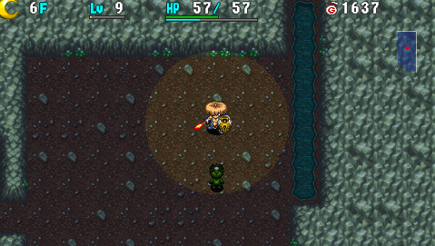
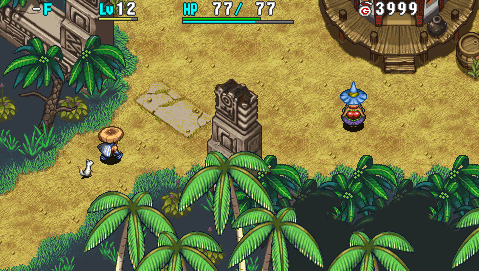

  

# Overview

First off, Shiren 4 Plus is a traditional roguelike game.

- Tile-based movement and turn-based combat.
- Player level and stats reset between each adventure.
- You'll lose all items and money if you collapse.

That sounds a bit intimidating, but the game also features support systems.

- Allies who keep their level ups between each adventure.
- Equipment tags so that you can reclaim lost weapons or shields.
- Storehouse and bank to keep important items and money safe.
- Side content to play as practice if the main story is too hard at first.

It can feel luck-based and unfair at first, but that's because you lack knowledge and experience. The game pushes you in the direction of growing as a player, rather than grinding until you win like a JRPG. If you stick with it, you'll find that it's a very rewarding gameplay experience.

<ul class="quickLinksUL">
  <li><a href="#controls">Controls</a></li>
  <li><a href="#first-steps">First Steps</a>
    <ul>
      <li><a href="#opening-~-boronga-village">Opening ~ Boronga Village</a></li>
      <li><a href="#grasslands-~-gonchiki-village">Grasslands ~ Gonchiki Village</a></li>
      <li><a href="#rocky-stretch-~-rakutata-village">Rocky Stretch ~ Rakutata Village</a></li>
      <li><a href="#ruins-of-laferriere-and-beyond">Ruins of Laferriere and Beyond</a></li>
    </ul>
  </li>
  <li><a href="#explanations">Explanations</a>
    <ul>
      <li><a href="#basics">Basics</a></li>
      <li><a href="#item-related">Item Related</a></li>
      <li><a href="#dungeon-related">Dungeon Related</a></li>
    </ul>
  </li>
</ul>

# Controls

# First Steps

### Opening ~ Boronga Village

   

#### Beach

- If you lose a weapon or shield, you might be able to reclaim it by visiting this beach.

#### Southern Isle Beach

- Read what Koppa has to say as you progress through the dungeon.

#### Boronga Village

- Optional: Talk to the woman behind the counter inside the Tavern to receive Undo Grass.
    - This item lets you either revive or escape with all items if you collapse.
- Optional: Play through [Shrine of Challenges](/dungeons/shrine-of-challenges) inside the Novice House to gain knowledge and items.
- Optional: Play through [Statue Cave](/dungeons/statue-cave) to gain knowledge and items.
- Optional: Check out the building near the East exit.
    - The Storehouse lets you deposit up to 80 items.
        - Use Storage Pots to increase the number of items you can store.
    - The Bank lets you save money, and offers rewards based on your balance.
        - Deposit the Gitan you found in Southern Isle Beach to receive Revival Grass.
    - The Shop sells a variety of items, and the selection changes per adventure.
        - Escape Scrolls can be purchased here - if they're not in stock, go collapse to cycle the list.
- Optional: Check out the Warehouse.
    - It's located between the Shrine and Pot Breaker building.
- Enter [Emerald Terrace](/dungeons/emerald-terrace) via the East exit of Boronga Village.

### Grasslands ~ Gonchiki Village

   

Details about [Emerald Terrace](/dungeons/emerald-terrace) can be found on its dungeon page. For now, the focus will be getting used to how the game plays.

#### Basics

- The player and monsters take turns. Turn ending actions include:
    - Attacking
    - Moving
    - Using an item
    - Talking to a NPC
    - Stepping in place
- HP regenrates only when you move or step in place.
    - Step in place: Press X + O at the same time.
- The player gets hungry as he performs actions, depleting fullness.
    - Fullness decreases by 1 every 10 turns.
    - Once fullness reaches 0, you'll take 1 damage per turn.
    - Fullness can be replenished by eating banana, onigiri, or grass items.
    - Bananas ripen as you advance floors, and ripe bananas replenish more fullness.
- 1 Diagonal movement is equal to 2 orthogonal movements.
    - Hold R to guarantee diagonal movement.
    - Diagonal movement is key to conserving fullness and fleeing from enemies.
- Hold X and move to perform a fast dash.
    - Turns pass like normal while dashing, so it can be risky if there are strong enemies around.
    - You can also hold X and move toward an item to step on it without picking it up.
- Sort items in your inventory by pressing the Square button.
    - Gitan (money) and projectiles will become stacked if applicable.
- Rocks and arrows can be equipped from the item menu.
    - This lets you use the item by pressing L instead of having to open the menu.
- Insert bananas into Storage Pots to keep them safe from spoiling.
    - Bananas ripen as you advance floors. (Green Banana → Yellow Banana → Ripe Banana → Spoiled Banana)
- Equip weapons to raise attack power, and shields to raise defense.
    - Shiren's defense doesn't increase from leveling up.
- Weapons and shields gain skill points when you defeat monsters using direct attacks.
    - Once the bar is full, the piece of equipment will level up and become stronger.
        - Attack or defense might increases.
        - Upgrade limit increases.
        - Rune slots might increase.

#### Combat

- Lure enemies toward you by performing a direct attack instead of stepping toward them.
    - This avoids letting enemies get the first hit.
    - Some enemies have long-ranged attacks, so you'll want to zigzag against those.
- If there are multiple enemies in the room, retreat into a hallway and fight them 1 vs 1.
- If your HP is getting low, go ahead and retreat for a bit before continuing the fight.
    - If you're sandwiched by 2 enemies, consider using an item.
- Don't hesitate to use items. You'll lose all items if you collapse, so don't be stingy.
    - Herb, Otogiriso, and Heal Grass can be used when your HP is full to increase max HP.
    - Weapons and shields you don't need can be thrown to deal damage from a distance.
    - Gitan bags can be thrown to deal (Gitan value / 10) points of damage.
    - Staves can be thrown to get one last use out of them even when remaining uses is 0.
- If you're one hit away from collapsing, you need to use an item.
    - Gambling on a direct attack or projectile is a sure way to end up collapsed.
        - The player's direct attacks have 92\~95% accuracy, based on weapon level.
        - Projectiles have 84% accuracy.
- If there's a tough enemy coming your way, soften it with projectiles.
    - Deal enough damage so that one direct attack finishes it off.
    - However, if your HP is full, consider fighting it normally to conserve items.

#### Other

- If you linger on a floor for a very long time, Winds of Kron will begin to blow.
    - If you get blown away by the wind, you'll lose all items and money, as if you collapsed.
    - The wind gusts 3 times as warnings before finally blowing the player away.
- Traps can be hidden in the ground, and trigger when you step onto the tile.
    - Trip Stones can cause pots to break, so it's good to carry a Balance Staff if you find one.
- Wandering NPCs can be found at times, and offer items or services to help you out.
    - See [NPCs](/system/npcs) for details.
- Items can be blessed, cursed, or sealed.
    - Blessed items have stronger effects.
    - Cursed equipment can't be unequipped.
    - Sealed items can't be used.
    - Curses and seals can be removed using items like Purify Scroll, Purify Pot, etc.
    - Curses and seals can also be removed by Purifier NPCs in villages or dungeons.

#### Gonchiki Village

See [Villages](/system/villages) for details about available facilities.

- [Equipment tags](/system/gameplay-basics#equipment-tags) can now be placed on weapons or shields at shops for 3,000 Gitan each.
    - If you lose a tagged item, it'll be delivered to the Watchman's Lodge in Gonchiki Village.
        - Basically a way to ensure you don't permanently lose your main weapon or shield.
        - You'll occasionally need to pay some Gitan to pick the item up.
    - However, there are some cases where a tagged item won't be delivered.
        - Item was turned into a banana or Weeds due to a monster's special attack.
        - Item was inserted into a Presto or Sale pot.
        - Quit the game without suspending properly / game froze.
- Equipment can be [upgraded](/system/gameplay-basics#equipment-upgrade-value) at the Blacksmith.
    - The blacksmith can also erase unwanted runes.

### Rocky Stretch ~ Rakutata Village

   

#### Basics

- Monsters can now spawn with auras which boost stats.
    - Monsters with auras grant x2.0 experience points and x1.25 skill points.
    - Auras can be removed using Dispel Aura Scroll, Seal Talisman, or Seal Staff.
    - The boost varies depending on aura color:
        - Red: Increased attack power.
        - Blue: Increased defense.
        - Yellow: Increased action speed. (2 stages)
- Monsters begin to have trickier abilities and special attacks.
    - Blade Bee can inflict Confused status, making movement or attacks go in a random direction.
        - Staves and projectiles can still be used normally while confused.
    - Firepuff breathes fire, which deals a fixed amount of damage and grills bananas.
        - Grilled Bananas restore 40 HP, so it's a nice way to obtain healing items.
    - Slime lowers equipped weapon or shield upgrade value by 1, so unequip items beforehand.
    - Zalokleft steals an item, warps, and runs away from you.
        - They always drop an item when defeated.
    - Curse Girl curses or seals an item.
        - Cursed equipment can't be unequipped.
        - Sealed weapons or shields can't gain skill points and their upgrade value and runes are nullified.
        - Non-equipment category items generally become unusable when sealed.
    - Absorbiphant absorbs status conditions to power up.
    - Scorpion lowers strength by 1 point, reducing the amount of damage you deal.

#### Night

From this point onward, time of day will begin to cycle on some floor ranges.

- Current monsters vanish, and new monsters spawn when time of day changes.
    - Day to night: Day monsters vanish, and night monsters are generated.
    - Night to day: Night monsters vanish, and day monsters are generated.
- Night characteristics
    - Night monster AI differs between monster families.
        - 1st type: Monsters move normally and only aim for Shiren like day monsters.
        - 2nd type: Monsters move randomly and will attack any adjacent creature.
    - Night monsters only take 1 damage from attacks other than abilities.
        - Up to 8 abilities can be assigned, and each ability can only be used 1 time per floor.
        - You can refresh abilities by reading a Replenish Scroll.
    - Field of view is reduced to a 1 tile radius, but can be expanded by equipping a torch.
        - Night monsters deal more damage to you if you don't have a torch equipped.
- Day characteristics
    - Everything functions the same as you experienced up to this point.
        - Abilities cannot be used during the day.
- Tip: If you don't have a torch, enter a hallway and step in place until it becomes daytime.
    - Wandering around without a light source is a sure way to collapse.

#### Rakutata Village

See [Villages](/system/villages) for details about available facilities.

- Deposit Gitan into your bank account to receive items based on your balance.
    - The amount to aim for at this point is 5000 Gitan for an Undo Grass.
- Visit the Purifier to remove curses and seals from all items not in pots for 1000 Gitan.
- Talk to Rakutata Village's Chief to gain access to the exit.

### Ruins of Laferriere and Beyond

  

#### Basics

- Ominous Auras can occur inside the ruins if you linger a long time on a floor.
    - Once the Ominous Aura occurs, an extremely strong monster called Villeater can begin to spawn.
    - Trying to fight Villeaters will likely end your run, so don't spend too much time on each floor.
- Monsters have even trickier abilities and special attacks.
    - Traproid has swift movement (1 attack) and creates traps on the ground.
        - Have it create a Landmine if you want to grill bananas.
    - Fearabbit warps the player and other monsters to itself inside rooms.
    - Pumphantasm moves and attacks through walls.
    - Gyadon pecks a staff in your inventory, reducing its remaining use count to 0.
        - Put staves in Storage Pots to keep them safe.
    - Kengo can knock your equipped shield away, potentially causing item loss.
        - If the shield is tagged, it will get delivered to Gonchiki Village even if it's lost.
    - Gyaza converts most non-direct attack damage and effects into 2 damage.
    - Banana Morph transforms an inventory item into a Yellow Banana.
    - Concusschin explodes and reduces your HP to 1 when its HP gets low.
    - Go Ham boosts attack power and grants Enduring status to adjacent creatures.
        - Enduring status lets the creature survive a fatal hit with 1 HP remaining.
    - Super Gazer hypnotizes you, forcing you to randomly use an item or perform an action.
    - Kappa Pest throws items on the ground at you. ...And so on.
- Power type monsters appear.
    - Think of these as "unwinnable" matchups if you trade hits normally - use items to avoid damage.
    - Monsters include ones like Sr. Yanpii, Dragon, Hipadile, Eligan, Chainhead, etc.

#### Synthesis

  

- A monster called [Mixer](/system/monsters#mixer) appears, and can be used to synthesize items.
    - This is an extremely important mechanic to understand and utilize.
    - Basically, throw 2 items at it to combine items, and then defeat it to collect the result.
        - See [Synthesis](/system/gameplay-basics#synthesis) for details, and [Runes](/system/synthesis-runes) for a list of equipment abilities and recipes.
    - Mixer spawns between 26\~27F in Emerald Terrace.

#### Progressing

At this point, you should have a decent grasp of gameplay mechanics. 
Continue onward at your own pace, and don't forget that you can buy Escape Scrolls in village shops. If you get stuck, it's recommended to check out the [Emerald Terrace](/dungeons/emerald-terrace) dungeon page.

# Explanations

This section offers either text or links to other pages that explain gameplay mechanics.

### Basics

#### Suspending (Saving)

When you want to quit the game, select the Suspend command from the menu, 
then return to the top menu before closing the game.

If you close the game without suspending, you'll lose all items and money as if you collapsed, 
and will resume the game from Boronga Village.

#### Turns

If you move, attack, use an item, talk to a NPC, or step in place, monsters will then take a step or attack. As long as you don't act, nothing else will, so stay calm and think things through.

#### Map

Rooms and hallways you've traversed on the current floor will be recorded on the map.

|Dot|Info|
|-|-|
|White|The player|
|Red|Monsters|
|Blue|Items on the ground|
|Yellow|Allies, NPCs|

#### Terrain

Normally, water, air, and wall tiles are not traversable. 
However, some monsters can walk on water, float in midair, or move inside walls.

#### Fullness

As turns pass, your fullness will deplete at the rate of 1 per 10 turns. 
When your fullness reaches 0, your HP will start to decrease by 1 each turn. 
Eat banana, onigiri, or grass items to replenish fullness.

#### Collapsing

If your HP goes to 0, you'll collapse. 
If you collapse, you'll lose all items and money, and will return to Boronga Village. 
So if you're in a tough spot, don't be stingy - use your items!

#### Winds of Kron

If you spend too many turns on the same floor, Winds of Kron will blow. 
When the 4th gust blows, you'll be blown out of the dungeon as if you had collapsed. 
Revival Grass and Undo Grass can't save you from the gust, so hurry to the next floor.

#### Abilities

As you continue your adventures, you'll reach a point where you can learn abilities. 
Abilities are effective for dealing damage to night monsters, but they can't be used during the day.

See [Abilities](/system/necklace-abilities) for details.

#### Night

Some dungeons or floor ranges have a day and night cycle, which alternates based on elapsed turns.

- Field of view is reduced to a 1 tile radius, but can be expanded by equipping a torch.
    - Night monsters deal more damage to you if you don't have a torch equipped.
- Daytime monsters are replaced by night monsters.
    - Night monsters only take 1 damage from attacks other than abilities.
        - Up to 8 abilities can be assigned, and each ability can only be used 1 time per floor.
        - You can refresh abilities by reading a Replenish Scroll.

See [Day / Night](/system/gameplay-basics#day-/-night) for details.

#### Speed and Status

Normally, it takes 1 turn to perform 1 action, but traps and items can change that formula.

- Slow: Act once every 2 turns.
- Swift: Act 2 times per turn.

Monsters can also have varying action speed.

- Slow: Act once every 2 turns.
- Swift 1: Act 2 times per turn, but attacking once ends its turn.
- Swift 2: Act 2 times per turn, and can attack twice.

Traps and items can give you or monsters a variety of status conditions. 
For example, if you throw Sleep Grass at a monster, it will be afflicted with Asleep status.

See [Status Conditions](/system/status-conditions) for details.

### Item Related

#### Sorting

The player can hold up to 24 items, which can be sorted by pressing Square in the inventory menu. Keep your inventory organized so you can readily assess the strategic options you have available.

#### Pot and Staff Numbers

Staves and pots have a number showing how many uses they have left.

The number on staves represent how many more times they can be swung. 
A staff can be thrown to get one last use out of it once its remaining uses reaches 0.

The number on a pot represents how many more items you can insert into it. 
Some pots are opened instead, and the number represents how many more times it can be opened.

#### Bananas and Storage Pots

Bananas are important items that replenish your fullness. 
That said, if you step on a Spoil Trap, all bananas in your inventory will become spoiled. 
If you have a Storage Pot, insert bananas into it to protect them from that trap.

#### Storehouse & Warehouse

Some villages have storage that can house your items. 
Items kept inside a storehouse or warehouse won't be lost if you collapse in a dungeon.

#### Equipment

Weapons increase the damage you deal to monsters, and shields reduce damage inflicted by monsters. Both have to be equipped using the Equip command to receive their effects.

#### Upgrading Equipment

Weapons and shields can be upgraded by certain scrolls or by blacksmiths. 
A number representing upgrade value such as "+1" is displayed if an item has been upgraded.

#### Leveling Up Equipment

Weapons and shields that are equipped gain skill points as you defeat monsters with direct attacks. Once the bar is full, the piece of equipment will level up and become stronger. Attack or defense might increase, upgrade limit increases, and rune slots might increase.

See [Equipment Growth](/system/gameplay-basics#equipment-growth) for details.

#### Synthesizing Equipment

You can synthesize weapons with weapons or shields with shields using a Synthesis Pot. 
Once synthesized, the base item will have the items' abilities, and their upgrade value will be combined.

There's also a monster called Mixer which can synthesize items you throw at it. 
This monster lets you synthesize different category items together, such as a weapon and grass item.

See [Synthesis](/system/gameplay-basics#synthesis) for details.

#### Equipment Tags

You can add tags to your weapons or shields at a shop, or by reading a Tag Scroll. 
If you lose a tagged item, it'll be delivered to the Watchman's Lodge in Gonchiki Village.

However, there are some cases where a tagged item won't be delivered.

- Item was turned into a banana or Weeds due to a monster's special attack.
- Item was inserted into a Presto or Sale pot.
- Quit the game without suspending properly / game froze.

See [Equipment Tags](/system/gameplay-basics#equipment-tags) for details.

#### Blessed, Cursed, Sealed

Items can be blessed, cursed, or sealed.

- Blessed items have stronger effects.
- Cursed equipment can't be unequipped.
- Sealed equipment can't gain skill points, upgrade value and runes are nullified.
- Sealed items (non-equipment) can't be used or have no effect.
- Curses and seals can be removed using items like Purify Scroll, Purify Pot, etc.
- Curses and seals can also be removed by Purifier NPCs in dungeons or villages.

See [Blessing / Curse / Seal](/system/gameplay-basics#blessing-/-curse-/-seal) for details.

#### Unidentified Items

Items with yellow names are unidentified items. 
Use items such as Identify Scroll or Identify Pot to learn their true names and abilities.

### Dungeon Related

#### Dungeon Shops

Shops can appear in dungeons at times.

- If you want to buy something, pick it up and talk to the Shopkeeper to pay for it.
- If you want to sell something, place the item on the ground and talk to the Shopkeeper.

See [Shop](/system/dungeon-features#shop) for details.

#### Gimmicks

As you progress through dungeons, you'll encounter contraptions like doors, moving floors, and more. Some doors can be opened and closed using the O button, while others open when monsters aren't nearby.

See [Dungeon Features](/system/dungeon-features) for details.
