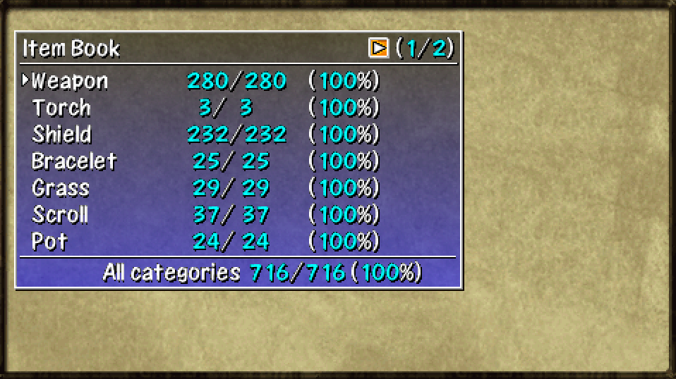

  

## Overview

The library keeps a record of items you've obtained and monsters you've defeated. 
Each entry has its own visual preview and description, some of which can be pretty humorous.

There are a total of 716 items and 366 monsters. 
As you can imagine, this is going to take serious effort to reach 100% completion. 

<ul class="quickLinksUL">
  <li><a href="#item-book">Item Book</a></li>
  <li><a href="#monster-book">Monster Book</a></li>
</ul>

## Item Book

  

#### General

The shortest path is to use [Interim Adventures](/guides/tips-and-tricks#interim-adventure-for-items) and [Rescue Passwords](/guides/rescue-passwords) for rare items.

#### Clear Reward or Side Quest

##### Weapon

- Bargain Blade - Bargain Hunter [NPC](/system/npcs)
- Sturdy Hammer - [Banana Kingdom](/dungeons/banana-kingdom) (1st clear, Elite Shop)
- Wonder Pick - [Platinum Paradise](/dungeons/platinum-paradise) (Treasure Shrine)
- True Knife - Level [Borg Mamel](/system/allies#borg-mamel-items) to Lv99.
- Fuuma Sword - Upgrade a Storied Katana+99 at the Monkey Village blacksmith.
- Kaburagi - There are 2 ways to obtain it.
    - Upgrade a S-Class Kabura+99 using the Smith 2 [NPC](/system/npcs).
    - Deposit 99,999,999 Gitan into your bank account.
- Kamina's Sword - [Trial Road](/dungeons/trial-road) (Treasure Shrine)

##### Shield

- Parry Shield - [Static Forest](/dungeons/static-forest) (Clear)
- Nirvana Board - [Jaguar's Hunting Forest](/dungeons/jaguars-hunting-forest) (Clear)
- Helix Shield - There are 2 ways to obtain it.
    - Upgrade a Legendary Fuuma+99 using the Smith 1 [NPC](/system/npcs).
    - [Double Strike Cave](/dungeons/double-strike-cave) (Clear)
- Jaguar's Shield - [Bayside Monster Cave](/dungeons/bayside-monster-cave) (Clear)

##### Other

- Bulldog Bracelet - [Cave of Endless Night](/dungeons/cave-of-endless-night) (Clear)
- Hemoji Arrow - [Platinum Paradise](/dungeons/platinum-paradise) (Boss Fight)
- Piece of Paper - Let a [Gyairas](/system/monsters#gyadon) peck a scroll or talisman.
- Wet Scroll - Use a Water Pot on a scroll.
- Time Switch Trap - [Jaguar's Hunting Forest](/dungeons/jaguars-hunting-forest)

#### Pick-A-Choice

Some dungeons that allow carry-in items can generate Pick-A-Choice shops with rare prizes. See [Always Win Pick-A-Choice](/guides/tips-and-tricks#always-win-pick-a-choice) to learn how to cheat at Pick-A-Choice.

- Cave of Endless Night - Upgrade Pot, Degrade Pot, Angel Seed, Scout Bracelet, Fortress Staff
- Jaguar's Hunting Forest - Calling Pot, Fortress Staff, Eradicate Scroll, Extinction Scroll, Night-Day Scroll

#### Item Book List

##### Weapon

|1|2|3|4|5|
|-|-|-|-|-|
|Palm Stick|Shockuto|Sealing Keisaku|Burning Blade|Bargain Blade|
|Dull Gold Edge|Copper Edge|Myopic Masher|Dotanuki|Sturdy Hammer|
|Breeze Blade|Blurry Stick|Katana|Lizard Lasher|Wonder Pick|
|Nap Rattle|Water Cutter|Baffle Axe|Meteor Edge|True Knife|
|Sky Splitter|Rusty Pick|Drain Slicer|Red Blade|Fuuma Sword|
|Rusty Pickaxe|Hatchet|Crescent Katana|Kabura's Blade|Kaburagi|
|Bright Blade|Old Mallet|Beast Fang|Shoddy Dirk|Kamina's Sword|

##### Torch

|1|
|-|
|Torch|
|Fine Torch|
|Super Torch|

##### Shield

|1|2|3|4|5|
|-|-|-|-|-|
|Palm Shield|Steady Shield|Safe Shield|Meteor Guard|Jaguar's Shield|
|Diet Shield|Bowl Shield|Swap Shield|Heavy Shield|-|
|Spry Shield|Lamp Shield|Lock Shield|Red Shield|-|
|Dull Gold Shield|Blast Shield|Gyadon Blocker|Fuuma Shield|-|
|Counter Shield|Iron Targe|Clan Shield|Shoddy Plank|-|
|Happy Shield|Gazer Guard|Beast Shield|Nirvana Board|-|
|Copper Guard|Parry Shield|Lizard Shield|Helix Shield|-|

##### Bracelet

|1|2|3|4|
|-|-|-|-|
|Pierce Bracelet|Strength Bracelet|Scout Bracelet|Monster Summoner|
|Heal Bracelet|Bad Aim Bracelet|Happy Bracelet|Monster Detector|
|Calm Bracelet|Strider Bracelet|Trapper Bracelet|Item Detector|
|Holy Bracelet|Wall Clip Bracelet|Trap Bracelet|Bulldog Bracelet|
|Alert Bracelet|Alleyway Bracelet|Warp Bracelet|-|
|Cleansing Bracelet|Identify Bracelet|Explosion Bracelet|-|
|Staunch Bracelet|Bind Bracelet|Regret Bracelet|-|

##### Grass

|1|2|3|4|5|
|-|-|-|-|-|
|Weeds|Happy Grass|Swift Grass|Dragon Grass|Undo Grass|
|Herb|Angel Seed|Dizzy Grass|Power Up Grass|-|
|Otogiriso|Unlucky Seed|Sleep Grass|Invincible Grass|-|
|Heal Grass|Disaster Seed|Rage Grass|Revival Grass|-|
|Life Grass|Antidote Grass|Amnesia Grass|Imabikiso|-|
|Expand Seed|Strength Grass|Warp Grass|Growth Seed|-|
|Shrink Seed|Poison Grass|Sight Grass|Blind Grass|-|

##### Scroll

|1|2|3|4|5|6|
|-|-|-|-|-|-|
|Navigation Scroll|Slumber Scroll|Medicine Scroll|Grounded Scroll|Extinction Scroll|Invitation|
|Purify Scroll|Air Slash Scroll|Sanctuary Scroll|Swift Foe Scroll|Attraction Scroll|Replenish Scroll|
|Identify Scroll|Eradicate Scroll|Escape Scroll|Mon House Scroll|Suction Scroll|-|
|Heaven Scroll|Fear Scroll|Blank Scroll|Trap Scroll|Dispel Aura Scroll|-|
|Earth Scroll|Trap Erase Scroll|Wet Scroll|Lost Scroll|Night-Day Scroll|-|
|Plating Scroll|Fixer Scroll|Banana Scroll|Desert Scroll|Tag Scroll|-|
|Confusion Scroll|Pot God Scroll|Muzzled Scroll|Squid Sushi Scroll|Piece of Paper|-|

##### Pot

|1|2|3|4|
|-|-|-|-|
|Storage Pot|Blessing Pot|4-2-8 Pot|Oil Pot|
|Synthesis Pot|Mailing Pot|Sturdy Pot|Chocolate Pot|
|Identify Pot|Black Hole Pot|Ordinary Pot|Calling Pot|
|Upgrade Pot|Sale Pot|Heal Pot|-|
|Degrade Pot|Presto Pot|Zalokleft Pot|-|
|Purify Pot|Hide Pot|Monster Pot|-|
|Curse Pot|Sticky Pot|Water Pot|-|

##### Staff

|1|2|3|
|-|-|-|
|Empathy Staff|Balance Staff|Trap Erase Staff|
|Transient Staff|Tunnel Staff|Mage Staff|
|Paralysis Staff|Pinning Staff|Ordinary Staff|
|Swap Staff|Swift Staff|Lightning Staff|
|Knockback Staff|Slow Staff|Fortress Staff|
|Seal Staff|Happy Staff|-|
|Decoy Staff|Unlucky Staff|-|

##### Talisman

|1|2|
|-|-|
|Sleep Talisman|Slow Talisman|
|Seal Talisman|Berserk Talisman|
|Dizzy Talisman|Rage Talisman|
|Miss Talisman|Fury Talisman|
|Fear Talisman|-|
|Bind Talisman|-|
|Swift Talisman|-|

##### Food

|1|2|
|-|-|
|Green Banana|Diet Banana|
|Yellow Banana|Ice Banana|
|Ripe Banana|Onigiri|
|Spoiled Banana|-|
|Grilled Banana|-|
|Chocolate Banana|-|
|Banana Peel|-|

##### Arrow

|1|2|
|-|-|
|Wood Arrow|Killer Arrow|
|Iron Arrow|Drain Arrow|
|Silver Arrow|Hemoji Arrow|
|Critical Arrow|-|
|Poison Arrow|-|
|Force Arrow|-|
|True Arrow|-|

##### Rock

|1|
|-|
|Rock|
|Porky Rock|
|Bomb Rock|

##### Trap

|1|2|3|4|5|
|-|-|-|-|-|
|Trip Stone|Multiply Trap|Sleep Trap|Iron Arrow Trap|Hide Gauge Trap|
|Rust Trap|Pit Trap|Slow Trap|Poison Arrow Trap|Stairs? Trap|
|Strip Trap|Spring|Bind Trap|Rockfall Trap|Time Switch Trap|
|Curse Trap|Log Trap|Banana Trap|Metal Trap|Floor Warp Trap|
|Spoil Trap|One-way Trap|Rage Trap|Landmine|-|
|Monster Trap|Revitalize Trap|Blind Trap|Big Landmine|-|
|Summon Trap|Spin Trap|Wood Arrow Trap|Hunger Trap|-|

##### Other

|1|
|-|
|Gitan|

## Monster Book

  

#### General

- Happy Staff and Unlucky Staff can be used to quickly fill out daytime monster entries.
- Night monsters limit break when they level up, so these staves cannot be used.

#### Rare Monsters

- Night-Day Scroll
    - Vile Pumphantasm - [Emerald Terrace](/dungeons/emerald-terrace) - 19\~20F
    - Wild Gyadon - [Emerald Terrace](/dungeons/emerald-terrace) - 19\~20F
    - Evil Gyaza - [Emerald Terrace](/dungeons/emerald-terrace) - 21\~23F
    - Dark Cross Cart - [Bayside Monster Cave](/dungeons/bayside-monster-cave) - 15\~20F - Requires Blank Scroll
- Maneater
    - Maneater / Dark Maneater - [Jaguar's Hunting Forest](/dungeons/jaguars-hunting-forest) - 4\~20F
    - Villeater / Dark Villeater - [Jaguar's Hunting Forest](/dungeons/jaguars-hunting-forest) - 21\~45F
    - Mounteater / Dark Mounteater - [Jaguar's Hunting Forest](/dungeons/jaguars-hunting-forest) - 46\~75F
    - Isleater / Dark Isleater - [Jaguar's Hunting Forest](/dungeons/jaguars-hunting-forest) - 76\~99F

#### Monster Book List

##### Families

|1|2|3|4|5|6|7|
|-|-|-|-|-|-|-|
|Mamel|Blade Bee|Scorpion|Field Knave|Gyadon|Dragon|Foly|
|Chintala|Firepuff|Absorbiphant|Spin Polygon|Flash Bird|Mixer|Floaty|
|Seedie|Kumonigiri|Tiger Tosser|Porky|Yanpii|Eligan|Zapdon|
|Froggo|DJ Mage|Boy Cart|Pumphantasm|Banana Novice|Ironhead|Maneater|
|Bored Kappa|Zalokleft|Pop Tank|Fearabbit|Explochin|Snacky|Boss Type|
|Hopodile|Slime|Gazer|Traproid|Gyaza|Crow Tengu|-|
|Squid King|Curse Girl|N'dubba|Kengo|Cheer Ham|Mutaikon|-|

##### Boss Type

|1|
|-|
|Divine Beast Kamina|
|Divine Beast Jaguar|
|Hemoji|
|Mr.Bulldog|
