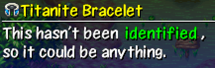

  

## Overview

This guide explains best practices for identifying items in dungeons that don't allow carry-in items. Generally, checking selling price in a shop gives you lots of information to work with. See [Price Chart](/items/price-chart) for item prices.

<ul class="quickLinksUL">
  <li><a href="#general">General</a></li>
  <li><a href="#synthesis">Synthesis</a></li>
  <li><a href="#bracelets">Bracelets</a></li>
  <li><a href="#grass">Grass</a></li>
  <li><a href="#scrolls">Scrolls</a></li>
  <li><a href="#pots">Pots</a></li>
  <li><a href="#staves">Staves</a></li>
  <li><a href="#talismans">Talismans</a></li>
</ul>

## General

#### Never Unidentified

- Water Pot, Oil Pot, Blank Scroll, Escape Scroll, bananas, arrows, rocks

#### Cursed equipment

It's fine to ignore the risk of equipping cursed equipment near the start of the run. Keep items that have high upgrade value for synthesis, provided they don't have an unwanted rune. Don't equip unidentified items from mid game onward unless you have a way to unequip cursed items. ※ Unlike Shiren 5, there are no bracelets that are guaranteed to be cursed in this game.

If you equip a cursed item, use Strip Trap or selection-based scrolls.

- Heaven, Earth, Fixer, Plating, and Banana scrolls can be used to unequip a cursed item.
- Save Purify Scroll in case a pot gets sealed by a Curse Girl or Curse Trap.

#### Naming Unidentified Items

  

It's faster to name known unidentified items by selecting the name from the item book. (Book command) If you find a shop, the standard approach is to name unknown unidentified items based on their price. For this example, say you have 3 scrolls worth 800 Gitan:

- First scroll → 8A
- Second scroll → 8B or 88
- Third scroll → 8C or 888

#### Identify Scroll / Identify Pot Priority

Priority varies depending on the dungeon and play style, but in general:

- Identify Scroll: Pots > Bracelets > Scrolls ≥ Grass
- Identify Pot: Bracelets > Scrolls ≥ Grass

Only use the above priority as a guideline, not as a hard rule. Consider the runes you've synthesized, difficulty of identification, and the item's potential value.

- If you haven't identified Dragon Grass, Warp Grass, etc. and are near Mixers, consider prioritizing grass.
- If you've identified key items, prioritize staves / check for seals on Revival Grass or Heal Pot.

#### N'mach and N'dup

Disguised N'mach and N'dup can't be revealed using an Identify Scroll or Identify Pot. 
Only use items you can trust 100% in situations where you can't afford to make a mistake.

## Synthesis

#### Weapon, Shield, Staff

The result is identified if one of the items used in synthesis is identified - Order doesn't matter. Example: Beast Fang+2 and Katana+? (+1) = Beast Fang+3 

The result is also identified if the 2 items result in a rune being synthesized, even if they were unidentified. Example: Beast Fang+? (+1) and Dull Gold Edge+? (+2) = Beast Fang+3 (Rustproof)

#### Mixer Identification

  

Eaten items will be identified if synthesis succeeds. ※ Unlike Shiren 5, the unidentified items must be thrown before equipment.

For this example, Green Grass is Herb:

- Green Grass → Dotanuki = Dotanuki (HP+5), Herb is identified.
- Dotanuki → Green Grass = Dotanuki (HP+5), Herb is not identified.

## Bracelets

#### Price

|Buy|Sell|Bracelets|Notes|
|-|-|-|-|
|2000|700|Strength, Pierce, Bad Aim|Equip and check strength → shoot an arrow to identify.|
|3000|1050|Holy, Alert, Calm, Cleansing, Regret, Trap Staunch, Monster Summoner|Curse, Sleep, Spin, or Poison Arrow traps can be used to test, but it's best to use an Identify Scroll or Identify Pot.|
|5000|1750|Monster Detector, Item Detector, Wall Clip, Heal, Strider, Warp, Alleyway, Explosion|Equip to check for Monster Detector and Item Detector, then step in place to check for Heal, Explosion, and Warp. Try attacking through a corner to check for Wall Clip. Build a wall using Fortress Staff to check for Alleyway. ※ It's dangerous to check for Explosion and Warp in shops.|
|10000|3500|Happy, Bind|Equip and check experience points to identify.|
|30000|10500|Scout, Identify, Trapper, Bulldog|Equip to check for Scout → pick up an unidentified item. Trapper and Bulldog are obtained in specific dungeons, so you don't need to consider them as possibilities.|

#### Testing for Effects

- Instantly determined after equipping:
    - Strength increased by 3 → Strength
    - Experience points increased by 1 → Happy
    - Enemy positions revealed → Monster Detector
    - Item positions revealed → Item Detector
    - Enemy and item positions revealed → Scout (Elite or Pick-A-Choice)
    - Traps revealed → Trapper Bracelet (Trap Zone)
- Determined by walking:
    - Heal 3 HP per turn or fullness depletes faster → Heal
    - Can pass through walls or attack through corners → Wall Clip
    - Can walk on water → Strider
    - Warped to a different location → Warp
    - Suddenly exploded → Explosion
    - Hidden hallway or room was revealed → Alleyway
- Throw or pick up an item:
    - Thrown item misses repeatedly → Bad Aim (Test multiple times)
    - Thrown item pierces through walls → Pierce
    - The item you picked up became identified → Identify (Elite or Pick-A-Choice)
- Resonated with a weapon:
    - Baffle Axe → Calm
    - Nap Rattle → Alert
- Situational:
    - Monsters spawn faster (requires Navigation Scroll) → Monster Summoner
    - New trap was generated (requires Sharp Eyes status) → Trap
    - Received a brutal hit from an enemy attack → Regret
- Other:
    - The 4 remaining possibilities are Cleansing, Staunch, Holy, and Bind.

## Grass

It's best to identify grasses using a combination of checking prices and Mixer synthesis instead of using them, since many grasses offer powerful runes like Anti-Fire, Anti-Floating, Sedating, etc. when synthesized.

General guidelines:

- Make sure enemies and shopkeepers are not nearby in case it inflicts a status like Berserk.
- Don't have a Wall Clip Bracelet equipped, or else you might suffocate in a wall from Berserk status.
- Don't have shop merchandise in your inventory, especially if it's a 100G grass. (Possibly Warp Grass)
- Don't eat if obtained from Elite or Pick-A-Choice shops. (Possibly Imabikiso, Amnesia, Disaster Seed)

#### Price

|Buy|Sell|Grasses|Notes|
|-|-|-|-|
|50|17|Herb|Only 1 item in this price range.|
|100|35|Otogiriso, Antidote, Warp, Poison|Warp and Antidote provide key runes, so don't eat.|
|200|70|Heal Grass|Only 1 item in this price range.|
|300|105|Dizzy, Blind, Swift, Growth, Sight, Power Up, Expand, Shrink|Nothing too special, so it's fine to eat.|
|500|175|Dragon, Life, Sleep, Strength, Rage|Dragon, Sleep, and Life provide key runes, and Rage is extremely dangerous, so don't eat.|
|1000|350|Revival Grass|Only 1 item in this price range.|
|1500|525|Undo Grass|Only 1 item in this price range.|
|2000|700|Happy, Unlucky, Imabikiso, Amnesia, Invincible|Extremely dangerous, so don't eat.|
|5000|1750|Angel, Disaster|Disaster can end your run, so don't eat.|

#### Monster Drop

Mutaikon monsters drop specific grass:

- Mutaikon → Poison Grass
- Dazikon → Dizzy Grass
- Dozikon → Sleep Grass
- Mesmerikon → Rage Grass

## Scrolls

It's safest to read scrolls while standing on the stairs right before advancing to the next floor in case it turns out to be a dangerous scroll like Muzzled, Grounded, Attraction, Mon House, etc., but you could also read it while standing on an entrance tile of a room if you're hoping for a Mon House Scroll.

Scrolls that have you select an item should be used on a secondary weapon or shield that you don't mind losing. You can synthesize the item if it's Plating, Heaven, or Earth, but can't reclaim your main equipment if it's Banana. Escape, Blank, and Invitation are always found identified. 300G scrolls are always Identify Scroll. ※ Unlike Shiren 5, Identify Scroll cannot be given to a Shopkeeper to identify merchandise.

#### Blind Reading

It's possible to check if a scroll is a selection-based scroll without consuming the item by attempting to read it at night without a light source, or while Shiren is afflicted with Blind status. (Blind Trap, Squid King, etc.)

#### Price

|Buy|Sell|Scrolls|Notes|
|-|-|-|-|
|100|35|Navigation|Only 1 item in this price range.|
|300|105|Identify|Only 1 item in this price range, selection-based.|
|500|175|Purify, Heaven, Earth, Plating, Tag, Suction, Pot God, Banana|Selection-based. Read it on an unneeded item in case it's Banana.|
|800|280|Medicine, Fear, Desert, Trap Erase, Trap, Attraction, Muzzled, Grounded|Many dangerous effects, so read while on stairs. It's worth throwing at Mixer in case it's Desert.|
|1000|350|Confusion, Slumber, Fixer, Air Slash, Replenish, Dispel Aura, Mon House, Swift Foe, Night-Day|Many useful effects against groups of enemies. However, it's best to read while on stairs in case it's Mon House or Swift Foe.|
|3000|1050|Sanctuary, Lost, Eradicate|Place on ground to identify Sanctuary.|
|10000|3500|Extinction|Only 1 item in this price range. (Elite, Pick-A-Choice)|

#### Write on Blank Scroll

If you write on a Blank Scroll, all instances of the scroll you wrote becomes identified on the spot. This technique ensures that the first usage of a valuable scroll doesn't go to waste.

- Example 1:
    1. Found a Blank Scroll on 1F, and wrote "Fixer Scroll" on it.
    2. Advanced to 3F, and found an already identified Fixer Scroll on the ground.
- Example 2:
    1. Found a Blank Scroll on 1F.
    2. Advanced to 3F, and found an unidentified scroll called "Crow Scroll". (Actually a Fixer Scroll)
    3. Wrote "Fixer Scroll" on the Blank Scroll, and "Crow Scroll" turned into "Fixer Scroll".

## Pots

"Open" type pots can be identified by using them, and "Insert" type pots can often be identified by price. It's hard to deduce what the pot is by inserting an item if you don't know the price, but capacity serves as a hint. ※ Unlike Shiren 5, Synthesis Pot can be found in capacities other than 5.

#### Capacity (Insert Type)

|C|Pots|
|-|-|
|2|Purify, Curse, Blessing, Mailing, Black Hole, Upgrade, Degrade|
|3|(All pots)|
|4|Storage, Identify, 4-2-8, Ordinary, Hide, Sale, Presto, Sticky, Sturdy, Chocolate, Synthesis, Mailing, Black Hole|
|5|Storage, Identify, 4-2-8, Ordinary, Hide, Sale, Presto, Sticky, Sturdy, Chocolate, Synthesis|

#### Price

Price shifts based on capacity - listed values are for 3 capacity.

|Buy|Sell|Pots|Notes|
|-|-|-|-|
|690|241|Storage, Identify, Ordinary, 4-2-8, Hide|Insert an unidentified item to check for Storage, Identify, Hide.|
|1150|402|Sale, Presto, Sticky, Sturdy, Chocolate|Insert a rock or arrow to check for Sale, Presto, Sticky. If none of the above, insert a banana OR name it Chocolate and throw at a wall - If it didn't shatter, change its name to Sturdy.|
|1840|544|Purify, Curse, Blessing|Blessing can't be found on the ground. Insert an unneeded item. (Not an arrow, rock, or talisman)|
|2875|1006|Mailing, Black Hole|Black Hole can't be found in shops. The item inserted into Mailing Pot falls to the ground if the Boronga Village storehouse is full.|
|4370|1529|Heal, Zalokleft, Monster|Open the pot in a hallway or while on stairs in case it's Monster.|
|6900|2415|Synthesis|Only 1 item in this price range.|
|11500|4025|Upgrade, Degrade|Insert an identified weapon, shield or staff.|

#### Insert Type

1. Verify where you obtained the pot:
    - Each dungeon has its own Elite/Pick-A-Choice exclusive, shop-exclusive, floor-exclusive items.
        - Blessing, Upgrade, Degrade - Often Elite or Pick-A-Choice.
        - Mailing - Often Shop, Elite, or Pick-A-Choice.
        - Sale, Black Hole - Often not found in shops.
2. Pot has a capacity of 2:
    - Found on the ground → Purify, Curse, or Black Hole
    - Insert an unneeded item (Not an arrow, rock, or talisman)
        - Item vanished → Black Hole
        - Item became cursed or sealed → Curse
        - Nothing happened, or item was purified → Purify
3. Pot has a capacity of 5:
    - Not Purify, Curse, or Black Hole.
    - Might be Sticky, so check while on stairs before advancing to the next floor.
    - Select Insert to check for Hide.
    - Next, insert an unneeded unidentified item.
        - Hand got stuck → Sticky
        - Item turned into Gitan → Sale
        - Item turned into a different item → Presto
        - Item became identified → Identify
        - Can remove the item → Storage
        - Nothing happened → Continue to step 4.
4. Hard to identify pots:
    - Remaining possibilities are Ordinary, 4-2-8, Sturdy, Chocolate, and Synthesis.
    - If you have plenty of food, insert a banana to check for Chocolate.
    - If you have extra weapons, shields, or staves, insert 2 of the same type to check for Synthesis.
    - If none of the above, continue to step 5.
5. Throw the pot at a wall:
    - Name the pot something like "Ord428" to cover both possibilities, then throw the pot.
        - Pot didn't shatter → Sturdy
        - Pot exploded → 4-2-8
        - Pot shattered → Ordinary

#### Open Type

- Open the pot:
    - Do so in a hallway or while standing on stairs in case it's a Monster Pot.
        - Placing Banana Peels around you ensures safety.
    - Place an item you'd like to store in front of you in case it's a Zalokleft Pot.
- Throw the pot at a wall:
    - Only do this after Heal Pot has been identified.
    - Monsters appeared → Monster
    - Zaloklefts appeared → Zalokleft
    - Nothing happened → Heal

## Staves

Most staves can be identified by swinging them at a monster. 
Price can still be checked to narrow down possibilities, but it's mostly used to check remaining uses.

General guidelines:

- Swing from at least 2 tiles away for safety.
- Don't swing at Gyaza or Absorbiphant monsters.
- Choose a weak monster in case it's Swift, Pinning, or Happy.
- If it inflicts Slow status, assume it's Mage until you're certain it's Slow.

#### Price

Price shifts based on remaining uses - listed values are for 5 uses.

|Buy|Sell|Staves|Notes|
|-|-|-|-|
|1250|437|Knockback, Swap, Pinning, Mage, Swift, Slow, Lightning|Mage and Slow effects can overlap.|
|1875|656|Empathy, Balance, Trap Erase, Ordinary, Transient, Paralysis|No effect → Balance or Ordinary.|
|2500|875|Seal, Decoy|Easily determined by swinging.|
|3750|1312|Tunnel, Fortress|Swing at a wall from at least 2 tiles away.|
|5000|1750|Happy, Unlucky|Swing at a weak Lv2\~3 monster.|

#### Use Count

A staff's initial use count can be used alongside its price to narrow down possibilities.

|Use|Staves|
|-|-|
|4|Swift, Slow, Lightning, Transient, Paralysis, Seal, Decoy, Tunnel, Fortress, Happy, Unlucky|
|7|Swap, Knockback, Pinning, Mage, Empathy, Trap Erase, Balance, Ordinary|
|5~6|(Could be either group)|

## Talismans

Talismans can't be identified by price because they all cost 500G, so throw them at monsters instead. ※ Unlike Shiren 5, there isn't a talisman that levels up a target in this game.

General guidelines:

- Beware of Swift, Rage, Fury.
    - Throw at a single weak monster from at least 2 tiles away.
- Beware of Berserk.
    - Throw when there are no other monsters in the room.

#### Price

|Buy|Sell|Talismans|Notes|
|-|-|-|-|
|500|175|Sleep, Seal, Dizzy, Miss, Fear, Bind, Swift, Slow, Berserk, Rage, Fury|All talismans cost 500 G.|
