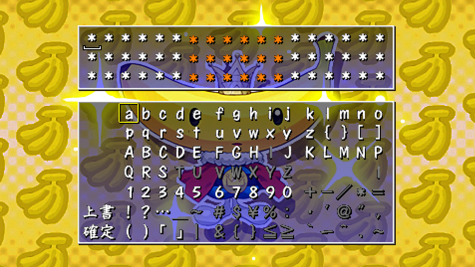
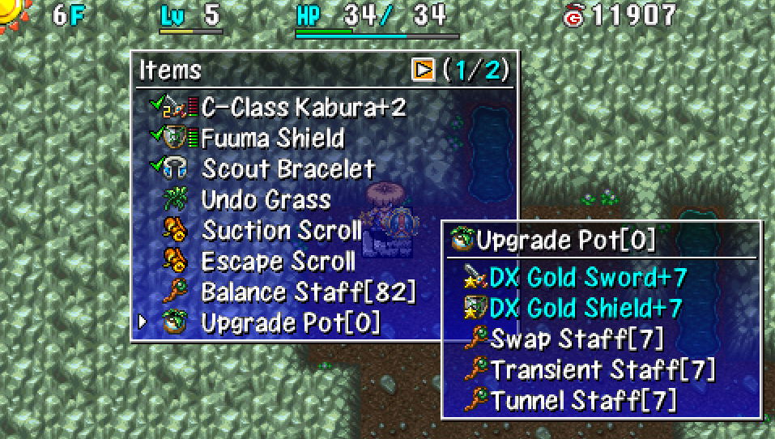
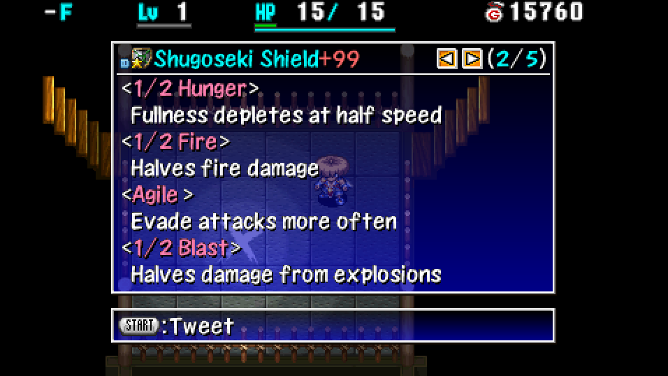
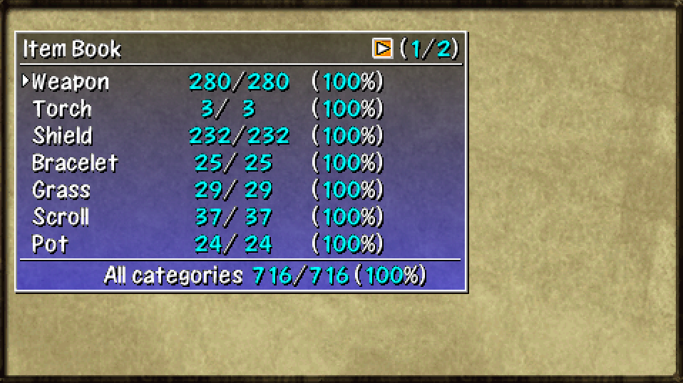

  

## Overview

Congratulations on clearing the main story! You're now finished with the tutorial. 
That's right - the main story was just the tip of the iceberg that is Shiren 4 Plus.

There are 14 other dungeons besides Emerald Terrace with a wide variety of rules. 
Not only that, there are mini-games and sidequests to tackle, and a library to complete.

This page provides a list of objectives to work toward, along with recommendations on where to start. Most importantly, what you do next depends on what sounds fun based on your playstyle.

## Objectives

Keep in mind that most objectives can be done in any order, and at your own pace. 
It's important to have fun with what you're doing, instead of treating it as a chore.

<ul class="quickLinksUL">
  <li><a href="#unlock-dungeons">Unlock Dungeons</a></li>
  <li><a href="#play-dungeons">Play Dungeons</a></li>
  <li><a href="#become-powerful">Become Powerful</a>
    <ul>
      <li><a href="#obtain-key-items">Obtain Key Items</a></li>
      <li><a href="#blank-scrolls">Blank Scrolls</a></li>
      <li><a href="#level-up-equipment">Level Up Equipment</a></li>
      <li><a href="#upgrade-equipment">Upgrade Equipment</a></li>
      <li><a href="#synthesize-runes">Synthesize Runes</a></li>
    </ul>
  </li>
  <li><a href="#learn-abilities">Learn Abilities</a></li>
  <li><a href="#read-rare-scrolls">Read Rare Scrolls</a></li>
  <li><a href="#level-up-allies">Level Up Allies</a></li>
  <li><a href="#clear-icons">Clear Icons</a></li>
  <li><a href="#book-completion">Book Completion</a></li>
  <li><a href="#expert-badges">Expert Badges</a></li>
  <li><a href="#speedrunning">Speedrunning</a></li>
</ul>

## Unlock Dungeons

Some postgame dungeons must be unlocked before you can challenge them. 
The easiest method to guide Inn of the Wind NPCs is to use Monkey Express until Monkey Village, then check for NPCs in Eagle Valley.

|Dungeon|Location|Unlock Condition|
|-|-|-|
|[Platinum Paradise](/dungeons/platinum-paradise)|Emerald Terrace|Revisit Throne Room (36F).|
|[Trial Road](/dungeons/trial-road)|Inn of the Wind (Well)|Guide all 4 lost NPCs to Inn of the Wind.|
|[Cave of Endless Night](/dungeons/cave-of-endless-night)|Gonchiki Village (Cave)|Revisit Gonchiki Village.|
|[Jaguar's Hunting Forest](/dungeons/jaguars-hunting-forest)|Novice House (Doorway)|Revisit Novice House.|
|[Trap Zone](/dungeons/trap-zone)|Rakutata Village (Chief's House)|Revisit Rakutata Village.|
|[Banana Kingdom](/dungeons/banana-kingdom)|Monkey Village (Banana peel)|1. Talk to Banana Prince in Boronga Village. 2. Check the banana peel in Monkey Village.|
|[Static Forest](/dungeons/static-forest)|Monkey Village (Shop)|Revisit Monkey Village.|
|[Double Strike Cave](/dungeons/double-strike-cave)|Boronga Village (Cave)|Revisit Boronga Village.|
|[Entrancing Lane](/dungeons/entrancing-lane)|Gonchiki Village (Oven in house)|Revisit Gonchiki Village.|
|[Bayside Monster Cave](/dungeons/bayside-monster-cave)|Beach (Hole)|Revisit Beach.|
|[Ceiling Cave](/dungeons/ceiling-cave)|Rakutata Village (Shop)|1. Buy items until you become a regular. 2. Check one of the barrels inside the shop.|
|[Asura Realm](/dungeons/asura-realm)|Novice House (Girl)|Revisit Novice House.|
|[Mystery Shopping Mall](/dungeons/mystery-shopping-mall)|Novice House (Shady Man)|Revisit Novice House.|
|[Grass and Scroll Cave](/dungeons/grass-and-scroll-cave)|Novice House (Old Man)|Revisit Novice House.|

## Play Dungeons

Go ahead and start playing dungeons that look fun if you want. 
However, some dungeons expect you to have powerful equipment, items, and abilities, 
so it's recommended to go through the "Become Powerful" objective first for those.

Below is a list of dungeons ordered by difficulty. 
Keep in mind that the difficulty ranking is an opinion piece, and isn't absolute.

#### No Carry-In Items

<table>
  <thead>
    <tr>
      <th>Difficulty</th>
      <th>Dungeon</th>
      <th>Notes</th>
    </tr>
  </thead>
  <tbody>
    <tr>
      <td rowspan="7" class="highlightGray centeredText">Hard</td>
      <td>Trial Road (Restricted)</td>
      <td>Only items found starting from Grasslands.</td>
    </tr>
    <tr>
      <td>Trap Zone (99F)</td>
      <td>Trap dungeon.</td>
    </tr>
    <tr>
      <td>Asura Realm</td>
      <td>Day-only, Mon House every 10 floors.</td>
    </tr>
    <tr>
      <td>Mystery Shopping Mall</td>
      <td>Shops are common, only Gitan on the ground.</td>
    </tr>
    <tr>
      <td>Jaguar's Hunting Forest (Restricted)</td>
      <td>Start with lots of HP, but can't heal.</td>
    </tr>
    <tr>
      <td>Ceiling Cave</td>
      <td>Items placed outside of shops vanish.</td>
    </tr>
    <tr>
      <td>Bayside Monster Cave</td>
      <td>Classic day-only dungeon.</td>
    </tr>
    <tr>
      <td rowspan="5" class="highlightGray centeredText">Medium</td>
      <td>Static Forest</td>
      <td>Day-only, Shiren can't level up.</td>
    </tr>
    <tr>
      <td>Platinum Paradise (Restricted)</td>
      <td>Only items found starting from Grasslands.</td>
    </tr>
    <tr>
      <td>Grass and Scroll Cave</td>
      <td>Only grass, scrolls, and torches on the ground.</td>
    </tr>
    <tr>
      <td>Double Strike Cave</td>
      <td>Day-only, Shiren can't level up.</td>
    </tr>
    <tr>
      <td>Banana Kingdom (99F)</td>
      <td>Utilize an ally that can learn monster attacks.</td>
    </tr>
    <tr>
      <td rowspan="4" class="highlightGray centeredText">Easy</td>
      <td>Entrancing Lane</td>
      <td>Day and night cycles incredibly quickly.</td>
    </tr>
    <tr>
      <td>Banana Kingdom (30F)</td>
      <td>Utilize an ally that can learn monster attacks.</td>
    </tr>
    <tr>
      <td>Trap Zone (25F)</td>
      <td>Trap dungeon.</td>
    </tr>
    <tr>
      <td>Emerald Terrace (Restricted)</td>
      <td>Only items found starting from Grasslands.</td>
    </tr>
  </tbody>
</table>

#### Carry-In Items

These dungeons don't have a difficulty assigned, since it depends on the items you bring with you.

<table>
  <thead>
    <tr>
      <th>Difficulty</th>
      <th>Dungeon</th>
      <th>Notes</th>
    </tr>
  </thead>
  <tbody>
    <tr>
      <td rowspan="4" class="highlightGray centeredText">N/A</td>
      <td>Trial Road</td>
      <td>Strong monsters appear from 1F.</td>
    </tr>
    <tr>
      <td>Platinum Paradise</td>
      <td>Extension of Emerald Terrace.</td>
    </tr>
    <tr>
      <td>Jaguar's Hunting Forest</td>
      <td>Start with lots of HP, but can't heal.</td>
    </tr>
    <tr>
      <td>Cave of Endless Night</td>
      <td>Night-only dungeon.</td>
    </tr>
  </tbody>
</table>

## Become Powerful

Some dungeons expect you to bring powerful equipment and items, so this section helps you get up to speed.

### Obtain Key Items

  

Input rescue passwords to quickly obtain some of these items. 
Bring an Escape Scroll so that you can reuse the passwords up to 3 times.

See [Rescue Passwords](/guides/rescue-passwords) for details.

General use:

- Red Blade & Red Shield --- 2nd strongest set that grants 2 bracelet resonance.
- Scout Bracelet or Monster Detector
- Holy Bracelet
- Blank Scroll
- Undo Grass

Leveling + upgrading equipment:

- Upgrade Pot --- It won't shatter unless an inserted item reaches its upgrade limit.
- Blessing Pot --- Used to bless Growth Seeds.
- Seal Staff --- Insert into Upgrade Pot.
- Happy Staff x 4  --- Insert into Upgrade Pot.
- Balance Staff --- Carry to avoid losing Upgrade Pots.
- Growth Seed (Blessed)
- Escape Scroll
- Suction Scroll --- Lets you reuse Upgrade Pot and Blessing Pot.
- Pot God Scroll --- Increase capacity of Upgrade Pot and Blessing Pot to 5.
- Extinction Scroll
- Sanctuary Scroll
- Monster Summoner --- Used to increase efficiency.

Upgrading equipment:

- Blessing Pot --- Used to bless Heaven and Earth scrolls.
- Suction Scroll --- Lets you reuse Blessing Pot.
- Pot God Scroll --- Increase capacity of Blessing Pot to 5.
- Heaven Scroll
- Earth Scroll

### Blank Scrolls

  

Plump Snacky drops blessed Blank Scrolls pretty often in Entrancing Lane.

#### Plump Snacky (Entrancing Lane)

Preparations:

- Necklace Abilities --- Cluster Confusion x 4, Room Cyclone x 4
- Be able to write Extinction and Replenish on Blank Scroll.

Steps:

1. Write Extinction on a Blank Scroll, then throw it at Seedie so only Plump Snacky spawns.
2. Move to the corner of a room (leave a 1 tile gap), and step in place until it becomes night.
3. Use Cluster Confusion → Room Cyclone to wipe out all Plump Snacky on the floor.
4. Step in place until it switches to day, and then back to night, then repeat step 3.
5. If you run out of ability uses, write Replenish on a Blank Scroll.
6. Optional: Some players like to read Night-Day Scroll to increase efficiency.

### Level Up Equipment

  

Gambler's Scroll doesn't exist in this game, so you have to hunt enemies to level equipment. Mamel and Seedie are the only monsters that appear on 1F of Emerald Terrace, so the idea is to create Gitan Mamels to rapidly level equipment.

#### Gitan Mamel (Grasslands)

※ Use an Upgrade Pot to prepare staves with lots of uses.

Needed Items:

- Equipment you wish to level up
- Seal Staff [99]
- Happy Staff [99] x 4
- Growth Seed (Blessed)
- Escape Scroll
- Extinction Scroll
- Sanctuary Scroll
- Monster Summoner

Steps:

1. Enter [Emerald Terrace](/dungeons/emerald-terrace) and move to a room with lots of traffic.
2. Throw Extinction Scroll at Seedie so that only Mamels spawn.
3. Place Sanctuary Scroll on the ground.
4. Eat the blessed Growth Seed.
5. Equip the Monster Summoner.
6. Use Happy Staff to create Gitan Mamels, then use Seal Staff → direct attack to one-shot them.
7. Read an Escape Scroll after all equipment reaches Lv8, or after the 3rd wind blows.

### Upgrade Equipment

Once your equipment is Lv8, it's time to increase its upgrade value to +99. 
Method 1 requires fewer items, but may be a bit slower than method 2. 
Method 2 can be done inside the Boronga Village warehouse.

#### Method 1 - Upgrade Pot

  

Needed Items:

- Upgrade Pot [5] --- Insert weapons and shields you wish to upgrade.
- Balance Staff --- Carry to avoid losing the Upgrade Pot.
- Suction Scroll --- Lets you reuse the Upgrade Pot.
- Escape Scroll --- Exit the dungeon 1 floor before the items reach their upgrade limit.

Steps:

1. Enter a dungeon that allows carry-in items, then simply advance floors to increase upgrade value.
2. Read an Escape Scroll before inserted items reach their upgrade limit to avoid losing the pot.
    - Example: Shugoseki Sword+98
3. Read a Suction Scroll to retrieve the items from the Upgrade Pot.

#### Method 2 - Heaven and Earth Scrolls

  

Needed Items:

- Blessing Pot [5]
- Heaven or Earth Scroll x 5
- Suction Scroll --- Bring lots of these.
- Weapons and shields --- Whichever ones you wish to upgrade.

Steps:

1. Go inside the Boronga Village warehouse, and ensure there's 5 tiles of space on the ground.
2. Read 5 Heaven or Earth scrolls (once per scroll).
3. Insert the Heaven or Earth scrolls into the Blessing Pot.
4. Read a Suction Scroll to retrieve the 5 Heaven or Earth scrolls.
5. Repeat until upgrade value reaches +99, or you run out of Suction Scrolls.

### Synthesize Runes

  

It's time to finalize your main weapon and shield by synthesizing the best runes. 
Some of the ingredients can be tricky to find on your own, so check [Rescue Passwords](/guides/rescue-passwords).

※ If you're using Shugoseki Sword as a main weapon, it's recommended to erase Flame Shot.

Mixers can be found between 26-27F of Emerald Terrace (use Monkey Express), and can eat up to 2 items. Synthesis Pots are common in Static Forest, so you could also intentionally collapse on 2F or so and use Interim Adventure from the Top Menu to obtain Synthesis Pots.

See [Runes](/system/synthesis-runes) for details.

#### Weapon

|Rune|Item|Effect|
|-|-|-|
|Tri-direction|Breeze Blade|Lets you attack in 3 forward directions.|
|Quick Hitting|Choose 2 from: Swift Grass Swift Talisman Swift Staff|Chance to attack 2 times.|
|Critical|Hatchet|Chance to land a critical hit.|
|Paralyzing|Shockuto or Paralysis Staff|12% chance to inflict Paralyzed status.|
|Sedating|Nap Rattle or Sleep Grass|12% chance to inflict Asleep status.|
|Bored|Lost Scroll|12% chance to inflict Apathetic status.|
|Anti-Bomb|Crescent Katana or Bomb Rock|Deal x1.5 damage to Bomb types.|
|Anti-Aquatic|Water Cutter or Desert Scroll|Deal x1.5 damage to Aquatic types.|
|Anti-Floating|Sky Splitter or Warp Grass|Deal x1.5 damage to Floating types.|
|Anti-Cyclops|Myopic Masher or Sight Grass|Deal x1.5 damage to Cyclops types.|
|Anti-Drain|Drain Slicer or Antidote Grass|Deal x1.5 damage to Drain types.|
|Anti-Dragon|Lizard Lasher or Dragon Grass|Deal x1.5 damage to Dragon types.|
|HP+5|Herb|Increase max HP by 5.|
|HP+10|Otogiriso|Increase max HP by 10.|
|HP+15|Heal Grass|Increase max HP by 15.|
|HP+20|Life Grass|Increase max HP by 20.|
|Atk+3|Happy Grass|Increase weapon strength by 3.|
|Atk+8|Angel Seed|Increase weapon strength by 8.|
|Charge|Bright Blade|After missing twice, deal a critical hit.|
|Rustproof|Dull Gold Edge or Plating Scroll|Upgrade value will never decrease.|

#### Shield

|Rune|Item|Effect|
|-|-|-|
|1/2 Hunger|Diet Shield|Fullness depletes at half speed.|
|1/2 Fire|Lizard Shield or Dragon Grass|Reduce fire damage by 50%.|
|1/2 Blast|Blast Shield or Bomb Rock|Reduce explosion damage by 50%.|
|Agile|Spry Shield or Sight Grass x 2|Evade direct attacks more often.|
|Anti-Hypno|Gazer Guard|Makes you immune to Gazer hypnosis.|
|Magic Damage|Swap Shield|Magic bullets converted to 10 damage.|
|Anti-Theft|Lock Shield|Your items will never be stolen.|
|Anti-Burgle|Safe Shield|Your Gitan will never be stolen.|
|Anti-Peck|Gyadon Blocker|Your items will never be pecked.|
|HP+5|Herb|Increase max HP by 5.|
|HP+10|Otogiriso|Increase max HP by 10.|
|HP+15|Heal Grass|Increase max HP by 15.|
|HP+20|Life Grass|Increase max HP by 20.|
|Def+3|Happy Grass|Increase shield strength by 3.|
|Def+8|Angel Seed|Increase shield strength by 8.|
|Rustproof|Dull Gold Shield or Plating Scroll|Upgrade value will never decrease.|

## Learn Abilities

There are a total of 29 abilities that Shiren can learn. 
Use a Calling Pot and lots of Pot God Scrolls to quickly learn abilities from NPCs.

See [Abilities](/system/necklace-abilities) for details.

The main ones to learn are:

- Kaboom Bullet --- Derived from Sticky Shot.
- Room Cyclone --- Reach Lv22 (You should've already learned it by now).
- Cluster Confusion --- Apprentice NPC.
- Darkroom --- Derived from Room Cyclone.
- Three Screams --- Reach Lv99.

## Read Rare Scrolls

Go on Interim Adventures in Bayside Monster Cave with the goal of reading scrolls. After you've filled out a lot of scrolls in your item book, switch to using the Scribe [NPC](/system/npcs).

## Level Up Allies

The max level for allies is Lv10 in this game, and ally level ups persist between adventures. Allies require more experience points than Shiren to level up, but items are effective.

Items thrown by any of the Saruma Brothers will always miss against allies, so their ability can't be used to level up allies without consuming items.

|Item|Info|
|-|-|
|Happy Staff|Grants 500 experience points.|
|Happy Grass|Increases level by 1.|
|Angel Seed|Increases level by 3.|

See [Allies](/system/allies#borg-mamel-items) for details about leveling up Borg Mamel.

## Clear Icons

            

Some dungeons grant a clear icon for your save file when you clear them. 
It might be fun to see if you can obtain them all.

- Emerald Terrace
- Platinum Paradise
- Trial Road
- Cave of Endless Night
- Trap Zone
- Banana Kingdom
- Entrancing Lane
- Bayside Monster Cave
- Grass and Scroll Cave
- Mystery Shopping Mall
- Asura Realm

## Book Completion

  

If you're up to the task of 100% completion, you'll need to fill out the item and monster books. 
See [Book Completion](/guides/book-completion) for details.

## Expert Badges

  

In-game achievements that are obtained by clearing dungeons with self-imposed restrictions. 
See [Expert Badges](/system/expert-badges) for details.

## Speedrunning

Interested in competing for world records? Check out the [Shiren 4 page](https://www.speedrun.com/shiren4) on speedrun.com. 
See [Speedrunning](/guides/speedrunning) for rules and routes.
