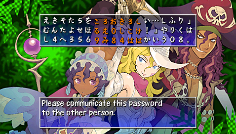

  

## Overview

When a player goes on a rescue, the dungeon seed is set to the same seed as the player who collapsed. This means dungeon layout and items will be the same, resulting in the ability to share seeds with rare items.

<ul class="quickLinksUL">
  <li><a href="#notes">Notes</a>
    <ul>
      <li><a href="#using-passwords">Using Passwords</a></li>
      <li><a href="#creating-passwords">Creating Passwords</a></li>
    </ul>
  </li>
  <li><a href="#passwords">Passwords</a>
  </li>
</ul>

## Notes

#### Using Passwords

- You can only go on a rescue if you've been to that dungeon and floor on your own before.
- Rescues that are successful, deleted, or result in failure 3 times are stored and can't be reused.
    - However, the history only stores 32 rescues, so you can reuse passwords after accepting 32 other rescues.
- Bring an Escape Scroll for rescues that allow carry-in items to obtain the listed items up to 3 times.

#### Creating Passwords

- You need to intentionally collapse on the next floor after finding target items, since the collapsed floor changes.
    - This is also the case for Pick-A-Choice shops.
- Shiny objects, enemy drops, correct Pick-A-Choice choices and prizes will be different.

## Passwords

### Rare Item

#### Emerald Terrace

<table class="monsterTable">
  <tr>
    <th>No.</th>
    <th>Floor</th>
    <th>Items</th>
    <th>Password</th>
    <th>Notes</th>
  </tr>
  <tr>
    <td class="highlightGray">01</td>
    <td>29F</td>
    <td class="leftText">Scout Bracelet</td>
    <td><pre>１ほたきにし　４かてにきか　４おらあのと ろえら（えく　ふすつ５にお　わ０ゆろなひ ？らる２そさ　のよおらのう　すたへ４」８</pre></td>
    <td class="leftText">28F: Scout Bracelet (Shop) Unverified</td>
  </tr>
  <tr>
    <td class="highlightGray">02</td>
    <td>27F</td>
    <td class="leftText">Fortress Staff</td>
    <td><pre>た５けおゆあ　てへを…りは　は）ほほかふ （。みと…て　るむふ９くめ　おゆゆくえの わにと「わる　めにはひこあ　う？５…の３</pre></td>
    <td class="leftText">26F: Fortress Staff (Elite Shop) Unverified</td>
  </tr>
  <tr>
    <td class="highlightGray">03</td>
    <td>31F</td>
    <td class="leftText">Calling Pot</td>
    <td><pre>ちせめ！や７　にけ）へ６お　２「６！ゆ６ せた！０！ら　ぬわ８ほにる　り６。こ２ま れ「９う２「　そてんひそい　う８せみ２」</pre></td>
    <td class="leftText">30F: Calling Pot (Elite Shop) Unverified</td>
  </tr>
  <tr>
    <td class="highlightGray">04</td>
    <td>28F</td>
    <td class="leftText">Scout Bracelet x 2</td>
    <td><pre>」４ゆわ…に　こき６し８り　をゆ？ねへる ふえ（ほわさ　。てさりせ（　　）…「かそひ さほておねむ　すなみんゆた　なぬせみみた</pre></td>
    <td class="leftText">26F: Scout Bracelet (Shop) 27F: Scout Bracelet (Shop) Unverified</td>
  </tr>
  <tr>
    <td class="highlightGray">05</td>
    <td>28F</td>
    <td class="leftText">Calling Pot Fortress Staff</td>
    <td><pre>をすのうへし　（。へぬく２　むめやつわく ０！なすすね　８よ０ほのけ　ゆ１ねをへゆ そ８んちえね　よは７か（５　ろ「４のふひ</pre></td>
    <td class="leftText">27F: Calling Pot (Elite Shop), Fortress Staff (Elite Shop) Unverified</td>
  </tr>
</table>

#### Bayside Monster Cave

<table class="monsterTable">
  <tr>
    <th>No.</th>
    <th>Floor</th>
    <th>Items</th>
    <th>Password</th>
    <th>Notes</th>
  </tr>
  <tr>
    <td class="highlightGray">01</td>
    <td>4F</td>
    <td class="leftText">Heal Bracelet Bad Aim Bracelet</td>
    <td><pre>？りてつにと　？２るき（！　えみうにつん ７あゆすもし　。としたてろ　あ」もめかま えさて！まに　１０２２へわ　７ちんう７な</pre></td>
    <td class="leftText">3F: Heal Bracelet 4F: Bad Aim Bracelet Unverified</td>
  </tr>
  <tr>
    <td class="highlightGray">02</td>
    <td>2F</td>
    <td class="leftText">Hatchet Diet Shield Shrink Seed</td>
    <td><pre>）たふみめ４　らひ１ん）ほ　８を！ゆらた 」９むつむゆ　ぬ？たなへ？　０てさたゆし ゆ４えしろの　は３まや１ら　たえつてろし</pre></td>
    <td class="leftText">1F: Hatchet, Diet Shield 2F: Shrink Seed Unverified</td>
  </tr>
  <tr>
    <td class="highlightGray">03</td>
    <td>3F</td>
    <td class="leftText">Warp Bracelet</td>
    <td><pre>ふ（ね？それ　きな？？！り　６みあは８わ てせまさ４９　）？６かはん　１な８かぬぬ よ４うはそを　（の８…たは　（りへう４せ</pre></td>
    <td class="leftText">2F: Warp Bracelet Unverified</td>
  </tr>
  <tr>
    <td class="highlightGray">04</td>
    <td>3F</td>
    <td class="leftText">Wall Clip Bracelet</td>
    <td><pre>にわ「きろそ　まも６さつち　らうしすなえ ら」おふつむ　れちはけも６　とにい「ろ８ そねよく」れ　ろいぬま（そ　０９さめれ０</pre></td>
    <td class="leftText">2F: Wall Clip Bracelet Unverified</td>
  </tr>
  <tr>
    <td class="highlightGray">05</td>
    <td>3F</td>
    <td class="leftText">Spry Shield Gazer Guard Monster Detector Strider Bracelet</td>
    <td><pre>か８ら「ねえ　４そ」まへん　け４ね０８ら こむなとひ２　９２（（は６　みわむ（６す ３んせ。ぬ４　へにけふ０そ　え」４ちえむ</pre></td>
    <td class="leftText">1F: Spry Shield 2F: Gazer Guard, Monster Detector, Strider Bracelet Unverified</td>
  </tr>
  <tr>
    <td class="highlightGray">06</td>
    <td>2F</td>
    <td class="leftText">Blank Scroll x 2 Swap Shield Steady Shield</td>
    <td><pre>５なゆいゆき　」んとり（そ　きよありくり ４もむ！きく　よなくわた「　めそ「りよあ ちしよいお９　６ん）１ん！　９ねさ３（く</pre></td>
    <td class="leftText">1F: Blank Scroll x 2 2F: Swap Shield, Steady Shield Unverified</td>
  </tr>
  <tr>
    <td class="highlightGray">07</td>
    <td>4F</td>
    <td class="leftText">Blank Scroll Monster Summoner</td>
    <td><pre>？こかをんか　なねまもよら　うまか７３た おほ６けちぬ　つむめ（」ゆ　？よ？てめさ ９ほうつわれ　さてなてみり　こけ「し０か</pre></td>
    <td class="leftText">1F: Blank Scroll 3F: Monster Summoner Unverified</td>
  </tr>
  <tr>
    <td class="highlightGray">08</td>
    <td>2F?</td>
    <td class="leftText">Happy Staff</td>
    <td><pre>ち１」ろん０　あなかへゆき　６けつそこな １あふい２か　ぬ」８た５ゆ　こ…りもを０ きふ４すい０　ねほおく５せ　りれ６た２と</pre></td>
    <td class="leftText">1F?: Happy Staff Unverified</td>
  </tr>
  <tr>
    <td class="highlightGray">09</td>
    <td>2F</td>
    <td class="leftText">Kabura's Blade</td>
    <td><pre>をちいしほ７　れ２はんもて　ゆや２こきわ めな９よぬる　１き！せ！に　たし７ねりや …すおら２ゆ　はあ４おて２　た）そ…すわ</pre></td>
    <td class="leftText">1F: Kabura's Blade Unverified</td>
  </tr>
  <tr>
    <td class="highlightGray">10</td>
    <td>4F</td>
    <td class="leftText">Kabura's Blade</td>
    <td><pre>５？８とにし　ぬしめめろ２　６きのりる（ へ！やほん？　７９す２ぬる　し！うりきも さ１せへてね　とせ」ゆ４？　つえ６ゆむ５</pre></td>
    <td class="leftText">3F: Kabura's Blade Unverified</td>
  </tr>
  <tr>
    <td class="highlightGray">11</td>
    <td>2F</td>
    <td class="leftText">Happy Staff Blast Shield</td>
    <td><pre>２もなへりさ　のさしおろと　あれけみ？は ねきせ」７お　８をよ。つ７　あ１７９ひ。 ち？め１へも　たりろ「る３　けのに４さえ</pre></td>
    <td class="leftText">1F: Happy Staff, Blast Shield Unverified</td>
  </tr>
  <tr>
    <td class="highlightGray">12</td>
    <td>8F</td>
    <td class="leftText">Gazer Guard Fuuma Shield</td>
    <td><pre>ゆけたりへむ　た（せるかあ　たらみ１かな くはりやわゆ　すへほれむは　をまへゆすり ０こ！１。は　もすなたうと　０へ０ち９せ</pre></td>
    <td class="leftText">3F: Gazer Guard 7F: Fuuma Shield Unverified</td>
  </tr>
  <tr>
    <td class="highlightGray">13</td>
    <td>2F</td>
    <td class="leftText">Swap Shield</td>
    <td><pre>まお」！まに　むやすて（し　えけにへ０よ ら０。わさ。　か３なぬ３け　６７えいくぬ １らゆちしち　ろちらふそみ　せ９そ…みに</pre></td>
    <td class="leftText">1F: Swap Shield Unverified</td>
  </tr>
  <tr>
    <td class="highlightGray">14</td>
    <td>4F</td>
    <td class="leftText">Breeze Blade Monster Detector Red Shield Burning Blade x 2</td>
    <td><pre>もろ！な1む　れ1ほ4ない　ちよそ70ぬ ふ」ひのはへ　れ5ふ。しわ まん7りや」 や。けんわ2　きち2。さ？　5の9すに5</pre></td>
    <td class="leftText">1F: Breeze Blade, Monster Detector, Red Shield 2F & 3F: Burning Blade Unverified</td>
  </tr>
</table>

#### Cave of Endless Night

<table class="monsterTable">
  <tr>
    <th>No.</th>
    <th>Floor</th>
    <th>Items</th>
    <th>Password</th>
    <th>Notes</th>
  </tr>
  <tr>
    <td class="highlightGray">01</td>
    <td>5F</td>
    <td class="leftText">Extinction Scroll Blank Scroll</td>
    <td><pre>てもよぬ（ぬ　８やふち）み　３をにすぬお いりお）（よ　５！きねこ（　。…１ら７る ね（なしま６　ほ！４へえわ　おにぬへ「の</pre></td>
    <td class="leftText">4F: Extinction Scroll (Elite Shop), Blank Scroll (Elite Shop) Unverified</td>
  </tr>
  <tr>
    <td class="highlightGray">02</td>
    <td>8F</td>
    <td class="leftText">Angel Seed</td>
    <td><pre>えりとわほや　わいむ」あ１　」６ゆうあひ るうくんなに　８いほいしか　る」ききほせ ろかよのいた　にへをみふし　（ておも）の</pre></td>
    <td class="leftText">7F: Angel Seed (Elite Shop) Unverified</td>
  </tr>
</table>

#### Static Forest

<table class="monsterTable">
  <tr>
    <th>No.</th>
    <th>Floor</th>
    <th>Items</th>
    <th>Password</th>
    <th>Notes</th>
  </tr>
  <tr>
    <td class="highlightGray">01</td>
    <td>6F</td>
    <td class="leftText">Upgrade Pot</td>
    <td><pre>なせ）そえま　。２かつあ８　たく）７…さ ８ふ５ま「（　ゆそとお２？　１ぬ１かあね １？４５７せ　つろ」らひと　（らら４まい</pre></td>
    <td class="leftText">5F: Upgrade Pot (Shop) Unverified</td>
  </tr>
  <tr>
    <td class="highlightGray">02</td>
    <td>3F</td>
    <td class="leftText">Upgrade Pot</td>
    <td><pre>（うとち１３　？むへ０２し　たんそゆち」 めあはわよゆ　「をて」）ら　えきあんふか よはも？れて　ほこゆ「ら…　ら」はてさ」</pre></td>
    <td class="leftText">2F: Upgrade Pot (Shop) Unverified</td>
  </tr>
  <tr>
    <td class="highlightGray">03</td>
    <td>2F</td>
    <td class="leftText">Blessing Pot</td>
    <td><pre>。「つなちぬ　きけけ…ん！　ふ４「め。」 ？…をかは。　ふ５み８れ９　！てめかめり まかよとう！　「むか）へて　やなひらり１</pre></td>
    <td class="leftText">1F: Blessing Pot (Blessed) Unverified</td>
  </tr>
  <tr>
    <td class="highlightGray">04</td>
    <td>5F?</td>
    <td class="leftText">Upgrade Pot</td>
    <td><pre>らはたやえや　れらきき。お　！ゆねまるを をあ０）に）　ほみ。ぬ６２　いにそ！らせ んむけ！ま９　に…るんひ９　けぬぬ２うわ</pre></td>
    <td class="leftText">4F?: Upgrade Pot (Shop) Unverified</td>
  </tr>
  <tr>
    <td class="highlightGray">05</td>
    <td>2F?</td>
    <td class="leftText">Suction Scroll</td>
    <td><pre>（え８へ８に　し１うお？０　ううや０６う まつあ「ぬ…　ふ２お）とさ　３「ま）ろ。 む（なよ！け　えほむ９すふ　きほむんまん</pre></td>
    <td class="leftText">1F?: Suction Scroll Unverified</td>
  </tr>
  <tr>
    <td class="highlightGray">06</td>
    <td>6F</td>
    <td class="leftText">Upgrade Pot</td>
    <td><pre>るすにきたま　つへぬらにん　まは。る２ひ えりよ（ふす　ら９も「７ね　わ）つらと！ ５２うえしれ　て７（４！ほ　むにのろへぬ</pre></td>
    <td class="leftText">5F: Upgrade Pot (Shop) Unverified</td>
  </tr>
  <tr>
    <td class="highlightGray">07</td>
    <td>3F</td>
    <td class="leftText">Breeze Blade Blessing Pot</td>
    <td><pre>めた２わて？　ち５ていか８　けふ１けぬわ ほけ６せかも　０もそんけて　かに９からい もかれ９ひ。　もはちもふつ　から）つめね</pre></td>
    <td class="leftText">2F: Breeze Blade, Blessing Pot Unverified</td>
  </tr>
</table>

#### Banana Kingdom

<table class="monsterTable">
  <tr>
    <th>No.</th>
    <th>Floor</th>
    <th>Items</th>
    <th>Password</th>
    <th>Notes</th>
  </tr>
  <tr>
    <td class="highlightGray">01</td>
    <td>79F</td>
    <td class="leftText">Sturdy Hammer</td>
    <td><pre>７りし）。つ　てやちおめと　よゆ０な」ぬ 「れ（かぬ０　ね）をにれ…　ん」ひのすね うを「「ん０　「えええらま　め。て２！」</pre></td>
    <td class="leftText">78F: Sturdy Hammer Unverified</td>
  </tr>
  <tr>
    <td class="highlightGray">02</td>
    <td>80F</td>
    <td class="leftText">Sturdy Hammer</td>
    <td><pre>こあしのけ。　ん？７（うら　ぬ１「こふふ あとねね７ん　４ちぬ「つら　６６すくろあ ８ゆりみ！ゆ　ゆれん０あ６　８みわめ９せ</pre></td>
    <td class="leftText">78F: Sturdy Hammer Unverified</td>
  </tr>
  <tr>
    <td class="highlightGray">03</td>
    <td>81F</td>
    <td class="leftText">Sturdy Hammer</td>
    <td><pre>にし１ゆふい　みおに７も３　ゆこよ（やに こぬてきえい　５０もはきよ　１え「」もお やくと（みう　「ちいふおき　あきえれれひ</pre></td>
    <td class="leftText">78F: Sturdy Hammer Unverified</td>
  </tr>
</table>

#### Mystery Shopping Mall

If you don't think you can steal, just read the rare scrolls to register them to the Blank Scroll list.

<table class="monsterTable">
  <tr>
    <th>No.</th>
    <th>Floor</th>
    <th>Items</th>
    <th>Password</th>
    <th>Notes</th>
  </tr>
  <tr>
    <td class="highlightGray">01</td>
    <td>6F?</td>
    <td class="leftText">Extinction Scroll Eradicate Scroll Sanctuary Scroll Monster Detector</td>
    <td><pre>る）１さ５み　も…（を６さ　しいちし０た く６４せつに　こ…」つれや　ちすてやすい みわち…むる　もこへにりか　を２ふをのい</pre></td>
    <td class="leftText">2F: Invitation (Shop) 5F: Extinction Scroll (Elite Shop), Eradicate Scroll (Elite Shop), Sanctuary Scroll (Elite Shop), Monster Detector (Elite Shop) Unverified</td>
  </tr>
</table>

#### Grass and Scroll Cave

<table class="monsterTable">
  <tr>
    <th>No.</th>
    <th>Floor</th>
    <th>Items</th>
    <th>Password</th>
    <th>Notes</th>
  </tr>
  <tr>
    <td class="highlightGray">01</td>
    <td>2F</td>
    <td class="leftText">Imabikiso Unlucky Seed</td>
    <td><pre>…７よねわみ　ゆこれのれお　６をうそそ「 ら０るゆり３　と４７わんゆ　。ほ！お（な みよ０「たへ　よ？な…む４　んや９をちて </pre></td>
    <td class="leftText">1F?: Imabikiso, Unlucky Seed Unverified</td>
  </tr>
</table>

#### Asura Realm

<table class="monsterTable">
  <tr>
    <th>No.</th>
    <th>Floor</th>
    <th>Items</th>
    <th>Password</th>
    <th>Notes</th>
  </tr>
  <tr>
    <td class="highlightGray">01</td>
    <td>4F</td>
    <td class="leftText">Critical Arrow</td>
    <td><pre>ま。？せぬえ　れ）かろにゆ　せは４つた１ かわん８あ７　れ「１う！「　くよ９へ）て わにねにわせ　！んり８）は　たほ３そひま</pre></td>
    <td class="leftText">3F: Critical Arrow (Shop) Unverified</td>
  </tr>
  <tr>
    <td class="highlightGray">02</td>
    <td>3F</td>
    <td class="leftText">Fuuma Shield</td>
    <td><pre>８ふ４けにほ　と「）！をり　ろ８ん」８あ のうりひねへ　と」りら！や　りむ４のえへ 」わす」まを　」７のねり０　５０ろ９こけ</pre></td>
    <td class="leftText">2F: Fuuma Shield Unverified</td>
  </tr>
</table>

### Pick-A-Choice Shop

