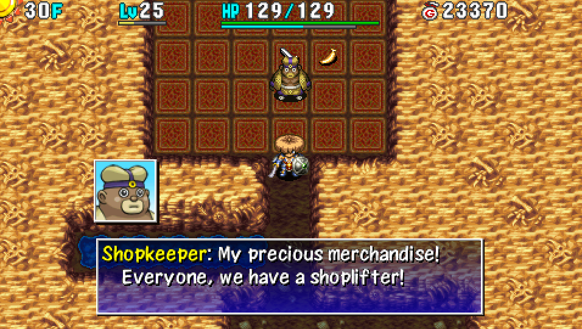

  

## Overview

Stealing is where you obtain items from a dungeon shop without having to pay for the items, 
or where you sell all of your items and steal them back to obtain lots of Gitan. ※ Tagged equipment lose their tags when sold.

#### Thief Mode

- Thief Mode is triggered if you exit the shop when payment is due.
    - Generally, when merchandise was picked up, used, or lost.
    - Payment is not required for items lost due to Explochin or Pop Tank blasts.
- Thief Mode is also triggered if you enter an Elite Shop without showing an Invitation.
- Cannot escape from the dungeon with merchandise in inventory, or while Thief Mode is active.
    - Escape Scroll, Undo Grass
- Cannot request a rescue if you fail.
- All enemies become Shopkeepers, and new Shopkeepers are generated up to the character limit.
- New Shopkeepers won't be generated in the same room as Shiren when Thief Mode is triggered.

#### Changes from Previous Games

- Only 1 Shopkeeper per shop.
- Traps are never naturally generated in shops.
- Waiting for wind is pointless.
    - Wind granted Navigation Scroll's effect in earlier games.
- The Shopkeeper warps to you if you move to an entrance tile with merchandise in hand.
- Shopkeepers anger more easily.
    - Non-damaging actions like Swap Staff now turns them hostile.
- Shopkeepers of different colors appear instead of Sheriffs and Guard Dogs when stealing.
    - Status conditions are effective. Gold Shopkeepers have swift action speed.
- Shopkeepers ignore Sanctuary Scroll.

## Risk-Free

#### Zalokleft Pot

Place the merchandise you want to steal so that it's lined up with the shop's entrance, step outside the shop, and open the Zalokleft Pot while facing the items. (Note that you can't steal pots) The game doesn't count this as stealing, so Shopkeepers won't become hostile.

#### Pit Trap

The classic method where you create a Pit Trap inside a shop and step on it after picking up merchandise. Simply throw a Black Hole Pot at a wall, or have a Traproid create a Pit Trap inside the shop. ※ This only works in dungeons with descending stairs.

#### Floaty Warp

Lure 3 Floaty monsters into a shop, and get launched to a different floor after picking up merchandise. This method cannot be used if your shield has the Unmoving rune. Miss Talisman can be used to avoid damage.

#### Monster Spawn Limit

There can be a maximum of 20 creatures on a floor, including Shiren and the Shopkeeper. 
If you trap 18 monsters in a room using a Fortress Staff, new Shopkeepers won't spawn even in Thief Mode. Paralysis Staff can be used instead of Fortress Staff, but enemies will flow out of the room.

You can generate monsters without waiting for natural spawns by using items like: 
Monster Pot, Zalokleft Pot, Monster Trap, Summon Trap.

## Some Risk

#### MC Mage

One of MC Mage's special attack effects includes the Transient effect (Warp to stairs → Paralyzed status). This method cannot be used if your shield has the Magic Damage rune. Some methods to counter Paralyzed status:

- Starving status
    - You take 1 damage per turn while starving, which cancels Paralyzed status.
- Invincible Grass
    - Use it before getting hit by MC Mage's special attack.
    - Might wear off before an enemy attacks you while paralyzed.
- Revival Grass or Undo Grass
    - Cancel Paralyzed status by collapsing and being revived.

#### Wall Clip Bracelet + α

Effective when the stairs is along the wall and close to the shop, but watch your HP (10 damage per turn). You might need to cover exiting the wall with a different item, such as a Swap Staff from inside the wall.

#### Tunnel Staff / Rusty Pickaxe + α

Create a straight path to the stairs if the shop is lined up with the stairs, 
then travel through the path using different items to take shortcuts if possible. 
It's a good idea to paralyze the pursuing Shopkeeper using a Paralysis Staff.

#### Pinning Staff

Simply leap to the stairs. You might need to use a Fortress Staff if the stairs isn't along the wall. Use a Monster Detector to make sure there are no enemies in the stairs room to avoid Shopkeepers. Equip a Pierce Bracelet and use arrows from inside the shop to clear out enemies if needed.

#### Swap Staff

Position an enemy on the stairs using a Paralysis or Transient staff, then switch places with them. If the stairs is lined up but a wall is in the way, equip a Pierce Bracelet and throw the Swap Staff instead. Monster Detector helps ensure you don't accidentally switch places with an unintended enemy.

## Dangerous

#### Warp Grass

If there aren't many rooms, or you don't have anything on hand to help create a path, you can attempt to warp to the stairs using Warp Grass or a Pinning Staff (land on a water or air tile). However, there's far too much luck involved with warping to be practical, so it's not recommended.

#### Decoy Staff + α

Use Decoy Staff on Shopkeepers you encounter in hopes of distracting them long enough to gain distance. Success rate is pretty low, since you often get sandwiched inside a hallway. It helps to use items like Paralysis Staff, Swap Staff, Slumber Scroll, etc.

#### Night Abilities

Shut down Shopkeepers using Sticky Shot, Darkroom, etc. (Harder than Shiren 5 due to the lack of Pot Party) Generally successful if you make it to the stairs room, but it's common to get sandwiched in hallways. ※ Unlike Shiren 5, Three Screams is effective against Shopkeepers.

If you get sandwiched in a hallway, use Bi-Direction Warp to send the Shopkeepers elsewhere. Otherwise, you'll need an item such as Warp Grass to escape the situation.
