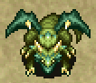

This page details useful techniques and general knowledge related to Shiren 4 Plus.

Related pages: 
[Gameplay Basics](/system/gameplay-basics) - overview of gameplay mechanics. 
[Dungeon Features](/system/dungeon-features) - details about dungeon shops, monster houses, doors, lava, etc.

<ul class="quickLinksUL">
  <li><a href="#basics">Basics</a>
    <ul>
      <li><a href="#expect-the-worst">Expect the Worst</a></li>
      <li><a href="#common-missed-inputs">Common Missed Inputs</a></li>
      <li><a href="#control-shortcuts">Control Shortcuts</a></li>
      <li><a href="#scout-in-rooms">Scout in Rooms</a></li>
      <li><a href="#fight-1-vs-1">Fight 1 vs 1</a></li>
      <li><a href="#step-in-place">Step in Place</a></li>
      <li><a href="#early-game-combat">Early Game Combat</a></li>
      <li><a href="#heal-before-advancing">Heal Before Advancing</a></li>
      <li><a href="#dashing-dangers">Dashing Dangers</a></li>
      <li><a href="#gang-up-on-monsters">Gang Up on Monsters</a></li>
    </ul>
  </li>
  <li><a href="#food">Food</a>
    <ul>
      <li><a href="#replenishing-fullness">Replenishing Fullness</a></li>
      <li><a href="#increase-max-fullness">Increase Max Fullness</a></li>
      <li><a href="#protect-food-from-spoil-traps">Protect Food from Spoil Traps</a></li>
      <li><a href="#eating-priority">Eating Priority</a></li>
      <li><a href="#ripen-bananas">Ripen Bananas</a></li>
      <li><a href="#grill-bananas">Grill Bananas</a></li>
      <li><a href="#chocolate-bananas">Chocolate Bananas</a></li>
      <li><a href="#weeds">Weeds</a></li>
    </ul>
  </li>
  <li><a href="#dungeon">Dungeon</a>
    <ul>
      <li><a href="#attack-through-or-over-walls">Attack Through or Over Walls</a></li>
      <li><a href="#digging-inside-walls">Digging inside Walls</a></li>
      <li><a href="#handling-confusion">Handling Confusion</a></li>
      <li><a href="#arrows-in-hallways">Arrows in Hallways</a></li>
      <li><a href="#warping-methods">Warping Methods</a></li>
      <li><a href="#utilize-traps">Utilize Traps</a></li>
      <li><a href="#check-for-stairs?-trap">Check for Stairs? Trap</a></li>
    </ul>
  </li>
  <li><a href="#monster">Monster</a>
    <ul>
      <li><a href="#mixer-identification">Mixer Identification</a></li>
      <li><a href="#enemies-immune-to-projectiles">Enemies Immune to Projectiles</a></li>
      <li><a href="#ranged-attackers---zigzag-movement">Ranged Attackers - Zigzag Movement</a></li>
      <li><a href="#slime---unequip-items">Slime - Unequip Items</a></li>
      <li><a href="#kengo---what's-behind-you?">Kengo - What's Behind You?</a></li>
      <li><a href="#gyadon---keep-items-in-pots">Gyadon - Keep Items in Pots</a></li>
      <li><a href="#floaty---warp-floors">Floaty - Skip Floors</a></li>
    </ul>
  </li>
  <li><a href="#item">Item</a>
    <ul>
      <li><a href="#naming-unidentified-items">Naming Unidentified Items</a></li>
      <li><a href="#storage-pot-organization">Storage Pot Organization</a></li>
      <li><a href="#gitan-as-a-projectile">Gitan as a Projectile</a></li>
      <li><a href="#increase-max-hp">Increase Max HP</a></li>
      <li><a href="#synthesize-staves">Synthesize Staves</a></li>
      <li><a href="#hit-and-run-tactics">Hit and Run Tactics</a></li>
      <li><a href="#room-entrance-paralysis">Room Entrance Paralysis</a></li>
      <li><a href="#throw-staves-with-0-uses">Throw Staves with 0 Uses</a></li>
      <li><a href="#transient-staff-to-find-stairs">Transient Staff to Find Stairs</a></li>
      <li><a href="#inserting-into-presto-pots">Inserting into Presto Pots</a></li>
      <li><a href="#throw-pots-to-trigger-traps">Throw Pots to Trigger Traps</a></li>
      <li><a href="#reusable-black-hole-pot">Reusable Black Hole Pot</a></li>
      <li><a href="#blessed-suction-scrolls">Blessed Suction Scrolls</a></li>
    </ul>
  </li>
  <li><a href="#equipment">Equipment</a>
    <ul>
      <li><a href="#secondary-equipment">Secondary Equipment</a></li>
      <li><a href="#transfer-upgrade-value">Transfer Upgrade Value</a></li>
      <li><a href="#synthesize-runes">Synthesize Runes</a></li>
    </ul>
  </li>
  <li><a href="#farming">Farming</a>
    <ul>
      <li><a href="#level-up-monsters">Level Up Monsters</a></li>
      <li><a href="#gitan">Gitan</a></li>
      <li><a href="#arrows">Arrows</a></li>
      <li><a href="#spoiled-bananas">Spoiled Bananas</a></li>
      <li><a href="#banana-morph-factory">Banana Morph Factory</a></li>
      <li><a href="#mutaikon's-grass">Mutaikon's Grass</a></li>
      <li><a href="#zalokleft-hunting">Zalokleft Hunting</a></li>
      <li><a href="#maneater-hunting">Maneater Hunting</a></li>
    </ul>
  </li>
  <li><a href="#earning">Earning</a>
    <ul>
      <li><a href="#ally-level-ups">Ally Level Ups</a></li>
      <li><a href="#interim-adventure-for-items">Interim Adventure for Items</a></li>
      <li><a href="#escape-scrolls">Escape Scrolls</a></li>
      <li><a href="#blank-scrolls">Blank Scrolls</a></li>
      <li><a href="#upgrade-value">Upgrade Value</a></li>
      <li><a href="#skill-points">Skill Points</a></li>
      <li><a href="#always-win-pick-a-choice">Always Win Pick-A-Choice</a></li>
      <li><a href="#experience-points">Experience Points</a></li>
    </ul>
  </li>
</ul>

# Basics

#### Expect the Worst

The mantra of a roguelike is "Hope for the best, expect the worst". 
Generally, the more you plan for bad situations, the further you'll be able to progress.

- Don't move without purpose near enemies
    - Draw enemies closer by stepping in place so that you get the first hit.
    - If there's a group of enemies, retreat into a hallway and fight 1-on-1.
    - Check the identity of distant enemies in the room using the Scout command.
    - Dashing is dangerous. Always walk when there are strong enemies around, or when it's night.
- Act before your situation gets bad
    - Have an idea how much damage each enemy deals.
    - It can sometimes be too late even if you use an item after your situation becomes dire.
        - Don't be stingy with items. Collapsing when you still had powerful items is the worst.
    - HP regeneration slows as max HP increases, making it harder to heal by moving around.
        - Use items to avoid receiving damage in the first place to conserve healing items.
- What if this direct attack misses?
    - Direct attack accuracy is 92%, so the chance to land 2 in a row is ~85%.
        - Direct attack accuracy increases up to 95% depending on weapon level.
    - If you and an enemy are both 1 hit away from collapsing, don't gamble on a direct attack.
    - Don't mash the attack button without checking how much damage you're taking.
- What if this projectile misses?
    - Projectile accuracy is 84%, so the chance to land 3 in a row is less than 60%.
    - Position a monster on top of a trap to cover for missed throws.
    - If a strong monster is adjacent, use a staff or scroll instead of a projectile.
- Run from an enemy, and then what?
    - What will you do if you become sandwiched by enemies in a hallway if you run?
    - The player entering or leaving a room can cause napping monsters to wake up.
- Even stronger enemies might appear
    - Have I leveled up enough?
    - Should I break a pot so that I have more usable items on hand?
    - Do I understand what each of the items in my inventory do?
    - Have I identified all staves and talismans before advancing?
- I might not find any more food
    - Is it really fine to discard Spoiled Bananas and grass? (Grass items replenish 5 fullness)
- There may be hidden traps nearby
    - Use direct attacks to check for Pit Trap, Landmine, etc. when moving toward items.
- Monster House Encounter
    - Use the Scout command before taking any actions and note escape routes.
    - Check your items to see if you have something that lets you overcome the situation.
    - There are lots of traps in a Monster House, so moving on ground tiles is dangerous.
- Categorize inventory items
    - If you're struggling to choose what to discard, think of items as categories.
    - "Food", "Restore HP", "For Monster House", "Emergency Escape", "1-vs-1", etc.
- Don't be in a rush
    - This isn't an action game, so there's no need for fast inputs.
        - You're likely to attack in the wrong direction or throw a Storage Pot if you hurry.
    - If you're feeling annoyed for being put into a seemingly unfair situation, set the controller down.
        - Your thinking performance drops when you're irritated, so take a moment to gather yourself.

There's really an endless list of thoughts or worries that can cross your mind, so it's similar to driving, 
where you prepare for and are ready to react to situations. (Example: a squirrel running across the road). 
It's important to be aware of what has the potential to occur at any given time, and act accordingly.

That said, you don't want to overdo the thinking to the point of getting stuck in decision paralysis. 
Overthinking can lead to mistakes as well, so don't stress or worry too much, and enjoy the gameplay.

The key to the main story is to recognize when you're reaching your limit, and escape as needed to regroup. 
No one will give you a hard time for escaping, even if it's on an early floor.

#### Common Missed Inputs

- Inserted main equipment into a Presto Pot
    - Often occurs when you're tired, or nervous on late game floors.
    - Remember that the cursor moves to the top when you press right while viewing the item you're standing on.
    - Perhaps it's best to make a habit of selecting the item with R before inserting.
- Stepped on a trap that you revealed using a direct attack.
    - Occurs when you get into the habit of "Direct attack → take a step".
    - Slow down your inputs, or make an effort to pause after using a direct attack.
    - Reframe checking for traps as "Take a step → direct attack".
- Threw an item at a Shopkeeper while identifying
    - Often occurs when you're naming items while checking a price chart, and usually results in a failed adventure.
    - Place items away from the Shopkeeper, or make a habit to face away before opening your inventory.
- (DS version) Pressed B + L to Scout, but shot an arrow instead
    - Make a habit to press B before L. (Pressing B alone doesn't end your turn)
    - However, that will make you dash instead of scout if you miss the L input.
    - Perhaps it's best to always select the Scout option from the menu, instead of using shortcuts.
    - ※ Use the analog pad to scout on PSP version.

#### Control Shortcuts

##### Dungeon / Village

- Message Log: X + Square
- Sort Items: Square
- Item Multi-Select: R
- View Item Details: Start (Inventory Menu)
- Ability Menu: Open menu and press Triangle
- View Map: Select
- Tweet: Start

##### Dungeon-Only

- Step in Place: X + Circle
- Diagonal Movement: Hold R
- Scout (1): Analog Pad (Must be set in Game Settings 2)
- Scout (2): X + L
- Scout (3): X + Triangle
- Inventory Menu: Tap X
- Shoot Projectile: L

#### Scout in Rooms

There are many monsters with ranged attacks in this game, so utilize the new Scout command. This command lets you look around the room without ending your turn, giving you lots of information to work with in deciding whether or not to spend turns going for items, fight or run from monsters, etc.

#### Fight 1 vs 1

If there are multiple enemies in the room, it's best to retreat into a hallway so that you receive fewer attacks. There's some risk of stepping on a trap on the way to the hallway if it's an untraveled path, but the advantage of fighting enemies 1 vs 1 usually outweighs that risk.

#### Step in Place

HP only regenerates when you either move or step in place - not when you attack. 
So hold X and tap Circle to pass 1 turn when waiting for a monster to approach, rather than attacking. However, if your HP is full, performing an attack is better since it checks the tile in front for a hidden trap. These are tiny optimizations, but can make a difference over the course of an adventure.

If you need to pass lots of turns and want to ensure safety, place a Banana Peel on the ground in front of you, or create a safe area using items like Paralysis Staff or Rusty Pickaxe. 
※ Monsters continue to spawn while stepping in place, so using an item to heal can be better at times.

#### Early Game Combat

In this game, HP regenerates faster when your max HP is low. Get in the habit of retreating a few steps to recover HP while fighting near the start of an adventure. 
※ Unlike Shiren 5, [Seedie](/system/monsters#seedie) is weak and doesn't require hit-and-away tactics.

#### Heal Before Advancing

Step in place (X + Circle) while standing on the stairs to recover HP before advancing to the next floor. You don't know what type of situation you'll start in, so healing when you can is important. If a monster enters the stairs room, go ahead and advance.

#### Dashing Dangers

Dashing speeds up the pace of the game, but greatly increases the risk of enemies getting the first hit, which can single-handedly end your run if it's a night monster or power type monster. Therefore, only dash on floors where you know which monsters appear and know that it's safe.

#### Gang Up on Monsters

If you have an ally, position yourself so that you and your ally can both hit the enemy. Note that you only gain skill points when your direct attack is the finishing blow.

Example: When lined up vertically, step to the lower right diagonally.

<pre class="diagram">
S = Shiren A = Ally M = Monster 
 
□ M □ □   □ □ □ □ 
□ S □ □ → □ M □ □ 
□ A □ □   □ A S □
</pre>

# Food

#### Replenishing Fullness

It might seem like eating food you find on the ground or buy from shops is the only way to replenish fullness, but there are actually a number of other ways to either replenish fullness or obtain edible items.

##### Food Items

|Item|Fullness|
|-|-|
|Green Banana|50|
|Yellow Banana|80|
|Ripe Banana|120|
|Spoiled Banana|30|
|Grilled Banana|60|
|Chocolate Banana|80|
|Diet Banana|Max|
|Ice Banana|30|
|Onigiri|50|
|Squid Sushi Scroll|40|
|Any grass item|5|

##### Other Sources

|Source|Fullness|
|-|-|
|Read Fixer Scroll while starving|Max|
|Revive via Revival or Undo grass, Wanderer Rescue|Max|
|Get hit by Mutaikon family special attacks|5|
|Get hit by a grass thrown by Bored Kappa|5|
|Bowl Shield (Pain Fullness) - small chance|1|
|Stay at an Inn (Gonchiki Village, Inn of the Wind)|Max|
|Peko (NPC)|Max|

##### Methods to Obtain Food

|Method|Item|
|-|-|
|Find food on the ground|Varies|
|Buy food from shops|Varies|
|Obtain food from Presto Pot|Varies|
|Read a Banana Scroll|Yellow Banana|
|Get hit by fire or explosion damage (Spoiled, Green bananas)|Grilled Banana|
|Insert bananas into Chocolate Pot (Spoiled, Green, Yellow bananas)|Chocolate Banana|
|Throw onigiri at Squid King monsters|Squid Sushi Scroll|
|Trigger Spoil Trap on a monster|Spoiled Banana|
|Advance floors to ripen bananas|Varies|
|Defeat Kumonigiri types|Onigiri|
|Defeat Banana Morph|Green Banana|
|Defeat Banana Boss|Yellow Banana|
|Defeat Banana Master|Ripe Banana|
|Defeat Foul Novice types|Spoiled Banana|
|Defeat Zalokleft types|Varies|
|Get hit by Banana Morph's special attack|Yellow Banana|
|Get hit by Foul Banana Morph's sp.attack|Spoiled Banana|
|Place items in a room with Field Knave|Weeds|
|Bad Morph (NPC)|Ice Banana|
|Business Monkey (NPC)|Diet Banana|

#### Increase Max Fullness

Increase max fullness by eating food when current fullness is equal to max fullness. It's best to increase max fullness to 120 if possible so that you get the most out of Ripe Bananas. Expand Seed can also be eaten to increase max fullness by 10.

#### Protect Food from Spoil Traps

Spoil Trap only affects bananas outside of pots, so insert bananas into pots to keep them safe.

#### Eating Priority

Eat food and grass items when the amount of fullness replenished won't go to waste. For example, if you eat a Ripe Banana (120 fullness) when you're at 20/100 fullness, 20 goes to waste. Likewise, if you eat any grass item (5 fullness) when you're at 100/100 fullness, 5 goes to waste.

If you don't have a pot to store food in, it's best to eat food that replenishes a lot of fullness first to minimize the loss if you happen to step on a Spoil Trap.

If you have a pot to store food in, or there's no risk of stepping on a Spoil Trap, it's best to eat food that replenishes the least amount of fullness first to free up inventory space.

#### Ripen Bananas

Bananas outside of pots ripen when you advance floors. (Green → Yellow → Ripe → Spoiled) 
It always takes 2 floors for a banana to ripen to the next stage.

#### Grill Bananas

   

Get hit by fire or explosion damage to turn all bananas outside of pots into Grilled Bananas. (60 fullness, 40 HP). Seals and blessings are removed when bananas are grilled, so it can be used to unseal banana items. Spoiled Banana (30 → 60) and Green Banana (50 → 60) are the two best types of bananas to grill.

#### Chocolate Bananas

Chocolate Bananas grant a random bonus when eaten, and most bonuses can only activate once per floor, so it's best to eat them all at once when your HP is full if you want to try for a specific beneficial effect. ※ Chocolate Banana status conditions last for the duration of the current floor.

|Bonus|Info|
|-|-|
|Restore HP|Occurs when HP is not full.|
|Strength +1|Increases strength by 1.|
|Unwavering|Strength will not decrease.|
|Satiated|Fullness no longer naturally depletes.|
|Ninja|Walk without waking up napping monsters.|
|Insomnia|The player won't fall asleep.|
|Identifier|Identify items by picking them up.|

#### Weeds

  

Field Knaves transform items on the ground into Weeds, which can be eaten to replenish 5 fullness. It's a bit tedious, but you can replenish a lot of fullness by spreading arrows and rocks around on floors where Field Knaves appear. (Example: Bayside Monster Cave 6F has both Field Knave and Boy Cart)

# Dungeon

#### Attack Through or Over Walls

Direct attacks can't hit enemies that are around corners like this unless you have the Tri-direction rune. However, projectiles like arrows and rocks, magic bullets from staves, and some abilities can hit them.

<pre class="diagram">
S = Shiren M = Monster 
 
□ □ □ M □ 
■ ■ S ■ ■ 
■ ■ □ ■ ■ 
■ ■ □ ■ ■
</pre>

Rocks can hit an enemy located on the other side of a wall:

<pre class="diagram">
S = Shiren M = Monster 
 
□ □ □ M □ □ □ 
■ □ ■ ■ ■ ■ ■ 
■ □ □ S □ □ ■ 
■ ■ ■ ■ ■ □ ■
</pre>

Rocks can even hit an enemy inside a wall, such as a Pumphantasm:

<pre class="diagram">
S = Shiren M = Monster 
 
□ □ □ S □ □ □ □ 
■ ■ ■ ■ ■ ■ ■ ■ 
■ ■ ■ ■ ■ M ■ ■ 
■ ■ ■ ■ ■ ■ ■ ■
</pre>

#### Digging inside Walls

It's possible to dig using a pickaxe while inside a wall with a Wall Clip Bracelet equipped. 
This lets you create a safe spot to regenerate HP, cycle time of day, hunt monsters, etc.

<pre class="diagram">
S = Shiren M = Monster 
 
■ ■ ■ ■ □ ■ ■ ■ 
■ ■ ■ ■ □ ■ ■ ■ 
■ ■ ■ ■ M □ □ □ 
■ ■ □ S ■ ■ ■ ■ 
■ ■ ■ ■ ■ ■ ■ ■
</pre>

#### Handling Confusion

Confused status only affects your direct attacks and movement, 
so arrows, rocks, thrown items, magic bullets from staves, and abilities remain accurate. 
If you're adjacent to an enemy and confused in a hallway, you can only move in one direction, 
meaning you can still run away or buy time until the confusion wears off.

#### Arrows in Hallways

Most of the time, field of view is normally limited to a 1 tile radius in hallways. 
This means you're likely to get hit by a surprise attack if you simply walk through hallways. 
To counter this, you can shoot arrows or throw unneeded items to check for incoming monsters.

If that sounds too tedious, at least do it when you transition from a room to a hallway. 
If a monster was present, step in place and wait for it to enter the room.

#### Warping Methods

It can be faster to warp out of a bad situation, or to a different room if the stairs is across the map.

|Method|Notes|
|-|-|
|Warp Grass|Use the item|
|Warp Bracelet|Random chance|
|Strider Bracelet|Unequip on a water tile|
|Pinning Staff|Land on a water or air tile|
|Swap Staff|Land on a water or air tile|
|Yanpii (Headbutt)|Land on a water or air tile|
|DJ Mage (Knockback)|Land on a water or air tile|
|MC Mage (Transient)|Warp to the stairs|
|"Surrounded" formation|See [Formations](/system/necklace-abilities#formations)|
|Black Hole Pot|Advance to the next floor|

#### Utilize Traps

   

Some traps can be utilized to give yourself an advantage, 
and visible traps can be created by dragging a Traproid along the wall in a room. 
※ You may need to inflict Slow status or lower its attack power, depending on your shield.

If a trap is visible, you can throw an item onto the trap to trigger it. 
Rocks can be thrown from 3 tiles away, and other items can be thrown from 10 tiles away. 
If the trap is against a wall, you can simply throw an item at the wall to trigger the trap.

It's also possible to trap monsters by luring them onto a trap and then missing with a projectile. Standard methods to trap monsters:

- Bad Aim Bracelet
    - Projectiles are guaranteed to miss their target, ensuring trap activation.
- Throw a pot containing at least 1 item
    - If the pot hits the target, it'll break and the item inside the pot will land on the trap.
- Use projectiles until one of them misses
    - Projectiles have 84% accuracy, so one of them will eventually miss.

Usage examples:

- Wood Arrow → collect arrows
- Spoil → obtain Spoiled Bananas
- Poison Arrow → weaken a Banana Morph for Banana Morph Factory
- Landmine → create Grilled Bananas
- Strip → unequip cursed items / identify equipment
- Iron Arrow → synthesize Anti-Metal
- Idenitfy 3000G bracelets
    - Poison Arrow → Cleansing Bracelet
    - Spin → Calm Bracelet
    - Sleep → Alert Bracelet
    - Curse → Holy Bracelet (place items down first)
- Trip → Balance Staff (place pots down first)

#### Check for Stairs? Trap

  

Fake stairs called Stairs? Trap can be generated near the end in some dungeons. 
It's actually a random trap, and using a direct attack or throwing an item onto it doesn't reveal its true form, but there are a few standard methods you can use to check for them.

1. Trap Erase Scroll or Trap Erase Staff or Water Pot
    - The above items destroy the fake stairs if it turned out to be a Stairs? Trap.
2. Transient Staff
    - The target always warps to the real stairs.
3. Dash next to the stairs
    - Position yourself so that you're off by 1 row or column, then dash in the direction of the stairs. If you stop on a tile that is diagonal from the stairs, it's real.

Stopping locations for method 3:

<pre class="diagram">
■ = Stairs　　S = Shiren 
Real:　　　　　　　　　Fake: 
□ □ S □ S □ □　　　　□ □ □ S □ □ □ 
□ □ □ ■ □ □ □　　　　□ □ S ■ S □ □ 
□ □ S □ S □ □　　　　□ □ □ S □ □ □
</pre>

Example for method 3:

<pre class="diagram">
■ = Stairs　　S = Shiren 
Start:　　　　　　　　Real:　　　　　　　　　Fake: 
□ □ □ □ □ S □　　　　□ □ □ □ S □ □　　　　□ □ □ S □ □ □ 
□ □ □ ■ □ □ □　　　　□ □ □ ■ □ □ □　　　　□ □ □ ■ □ □ □ 
□ □ □ □ □ □ □　　　　□ □ □ □ □ □ □　　　　□ □ □ □ □ □ □ 
※ Dash to the left from starting position.
</pre>

# Monster

#### Mixer Identification

The unidentified item must be thrown before the identified item for the end result to be identified. ※ Item order doesn't matter in Shiren 5, so it might take a bit to break old habits if you've played that game.

#### Enemies Immune to Projectiles

  

Pierce Bracelet can be equipped to ensure projectiles don't get eaten or thrown back at you.

- Mixer - Eats thrown items and synthesizes them. (Number of items depends on level)
- Bored Kappa - Catches projectiles and throws them back. (Categories depend on level)
- Flash Bird - The projectile burns up.
- Froggo - Thrown Gitan heals it instead of dealing damage.
- Gyaza - Converts projectile damage and effects into 2 damage.

※ Projectiles will hit sleeping Mixers.

#### Ranged Attackers - Zigzag Movement

  

Monsters like Dragon and DJ Mage have ranged attacks that travel in a straight line, so use diagonal movement as you approach them to ensure you don't get hit by their ranged attack. Boy Carts have swift movement, so you need to use an item or lure it into a hallway.

#### Slime - Unequip Items

  

Slimes lower upgrade value and erase runes, and can multiply when they receive damage. 
However, they're harmless if you don't have anything equipped, so just unequip your weapon and shield. 
Keep 2 slots open in a Storage Pot, and use multi-select to insert both your weapon and shield 
into to the Storage Pot on the same turn. (Use a Seal Staff if other enemies are nearby)

#### Kengo - What's Behind You?

  

Kengo monsters knock away your equipped items, sending them flying behind you. It's good to get into the habit of fighting Swordsman with your back facing a wall. ※ Unlike Shiren 5, allies and NPCs are not guaranteed to dodge flying equipment in this game.

It's best to leave 1 tile open between you and the wall so that you can pick the item up 
without taking damage, as opposed to using the Ground command and taking damage that turn. 
However, be aware that there may be a hidden trap in the tile between you and the item.

The disarmed equipment will fly forever if you have a Pierce Bracelet equipped, ensuring it's lost. Therefore, it's best to keep Pierce Bracelet unequipped on floors where Kengo monsters appear.

#### Gyadon - Keep Items in Pots

  

Keep items safe from Gyadon (staves) and Gyairas (scrolls, talismans) by inserting them into pots. Gyandora and Gyandoron can peck pots, so use arrows or staves before they're adjacent.

#### Floaty - Skip Floors

  

Floaty monsters have a special attack that makes you advance 1\~3 floors when 3 of them surround you. This can be used to steal from a shop or skip past dangerous floors if you have items like Miss Talisman. ※ Unlike Shiren 5, Floaty monsters are regular speed in this game.

# Item

#### Naming Unidentified Items

  

It's faster to name known unidentified items by selecting the name from the item book. 
If you find a shop, the standard approach is to name unknown unidentified items based on their price. 
For this example, say you have 3 scrolls worth 800 Gitan:

- First scroll → 8A
- Second scroll → 8B or 88
- Third scroll → 8C or 888

#### Storage Pot Organization

It's tempting to organize Storage Pots by item category and use the Name command inside dungeons, but it's generally better to split important items across multiple pots instead of grouping them in a single pot so that you don't lose all of them at once if a Banana Morph turns the pot into a banana, etc.

#### Gitan as a Projectile

Gitan deals fixed damage equal to its value divided by 10 when thrown. 
When the Gitan is blessed, it deals fixed damage equal to its value. 
1500G one-shots anything except monsters immune to projectiles, night monsters, and shopkeepers.

How to carry Gitan as an item:

- Hold X and move toward the Gitan to step on it, then insert it into a Storage Pot.
    - It's safe to sort items inside the pot, even if the pot contains Gitan.
- Hold X and move toward the Gitan to step on it, then swap it with an inventory item.
    - Don't sort your inventory afterward, since it'll get added to your wallet if you do so.

#### Increase Max HP

If you eat a HP restoring grass item when your HP is full, your max HP will increase instead. 
The Max HP gain will be doubled if the grass item is blessed.

- Herb (+1)
- Otogiriso (+2)
- Heal Grass (+3)

#### Synthesize Staves

Same name staves can be synthesized to combine remaining uses and free up inventory space. It's a bit wasteful to use a Synthesis Pot for this, so use Mixers unless you're desperate for inventory space.

#### Hit and Run Tactics

If an enemy doesn't have a ranged attack, you can defeat it without taking damage using Swift Grass or Slow Staff. Simply loop direct attack → step away from the enemy.

#### Room Entrance Paralysis

Swing a Paralysis Staff at an enemy standing on a room entrance tile to ensure other enemies can't chase you. Tri-direction rune, Wall Clip Bracelet, or arrows can be used to safely defeat the other enemies in the room, as long as they don't have a ranged attack that can go through corners.

<pre class="diagram">
S = Shiren M = Monster P = Paralyzed 
 
□ □ □ ■ ■ ■ 
□ M M ■ ■ ■ 
□ M P S □ □ 
□ M M ■ ■ ■ 
□ □ □ ■ ■ ■
</pre>

#### Throw Staves with 0 Uses

Staves with 0 remaining uses can be thrown to get one last use out of them. 
Thrown staves can miss, and Pinning Staff doesn't have an effect when thrown at a wall. 
Pierce Bracelet can be used to increase the effectiveness of thrown staves.

#### Transient Staff to Find Stairs

It's possible to quickly locate the stairs if you have a Monster Detector or Navigation Scroll and Transient Staff.

1. Equip a Monster Detector or read a Navigation Scroll while lined up with an enemy.
2. Press Select to view the map - note where the red dots are.
3. Swing a Transient Staff at the enemy.
4. Press Select to view the map - look for a red dot in a new location that doesn't move when turns elapse.

#### Inserting into Presto Pots

Presto Pots randomly transform inserted items into other items. 
It's most cost effective to insert single arrows, rocks, or talismans at a time:

1. Shoot an arrow or throw a rock in the direction of a wall.
2. Hold X and move toward the item to step on it.
3. Insert the item underfoot into the Presto Pot.

#### Throw Pots to Trigger Traps

If you have a pot containing at least 1 item, you can throw it at a monster standing on a trap 
to guarantee that the trap activates whether the pot hits or misses the target.

#### Reusable Black Hole Pot

Suction Scroll can be used to extract Pit Traps from a Black Hole Pot without breaking the pot, so simply read a Pot God Scroll after extracting the Pit Traps to reuse the pot.

#### Blessed Suction Scrolls

A blessed Suction Scroll blesses all items that are extracted from a pot, and the scroll is consumed, so as long as there's at least 1 Blank Scroll or Suction Scroll in the pot, you can continue to bless items.

There are many uses for this technique, like rapidly upgrading equipment (Fate Scroll, Earth Scroll, Growth Seed), blessing items like Pot God Scroll, Fixer Scroll, Eradicate Scroll, Angel Seed, Revival Grass, Undo Grass, etc.

Plump Snacky often drops blessed Blank Scrolls in Entrancing Lane, so this technique isn't necessarily limited to dungeons that allow carry-in items.

※ You can skip having to bless Suction Scrolls if you obtain a Blessing Pot.

# Equipment

#### Secondary Equipment

##### Type Effective Weapons

The damage multiplier on type effective weapons like Drain Slicer gets stronger as the weapon levels up, so if you want to one-shot applicable monsters, keep them as sub weapons instead of synthesizing them.

|L1|L2|L3|L4|L5|L6|L7|L8|
|-|-|-|-|-|-|-|-|
|x1.5|x1.75|x2.0|x2.25|x2.5|x2.75|x3.0|x3.25|

##### Lizard and Blast Shield

The damage reduction on Lizard Shield and Blast Shield gets stronger as the shield levels up, so some players like to level them as secondary shields to counter higher level Dragons and Pop Tanks.

|Item|L1|L2|L3|L4|L5|L6|L7|L8|
|-|-|-|-|-|-|-|-|-|
|Lizard Shield|50%|55%|60%|65%|70%|75%|80%|85%|
|Blast Shield|50%|56%|62%|68%|74%|80%|86%|92%|

##### Diet and Heavy Shield

If you're on a floor where field of view isn't limited or there are only weak enemies around, 
you can equip Diet Shield or Heavy Shield at specific times to conserve fullness:

- Diet Shield while exploring, switch to main shield when fighting.
- Other shield while exploring, switch to Heavy Shield when fighting.

#### Transfer Upgrade Value

If your main equipment doesn't have any unfilled rune slots left, it's safe to synthesize equipment with negative or risky runes in order to transfer upgrade value.

Example:

1. Add HP+15, Anti-Drain, and Paralyzing to a Beast Fang (3 slots).
2. Synthesize weapons with negative runes into the Beast Fang, such as Rusty Pickaxe+2.
    - Since the 3 slots are already filled, Wall Dig isn't added but it still gains the +2 upgrade value.

#### Synthesize Runes

This isn't exactly a tip, but just a reminder to take the time to understand the synthesis mechanic. 
See [Synthesis](/system/gameplay-basics#synthesis) for an overview, and [Runes](/system/runes) for recipes.

# Farming

#### Level Up Monsters

  

Level up a monster and defeat it to gain lots of experience points and/or skill points. 
If Shiren causes a swift monster to level up via an item, the leveled up monster can still act once, but if the monster levels up by defeating another monster, its turn will end.

Level up methods:

- Swing or throw a Happy Staff.
- Throw Happy Grass or Angel Seed.
- Swing a Decoy Staff and have another monster defeat the monster with Decoy status.
- Throw a Berserk Talisman or Rage Grass and have the Berserk status monster defeat another monster.
- Throw a Fear Talisman or read a Fear Scroll and have the Afraid status monster defeat another monster.
- Throw a Dizzy Talisman, read a Confusion Scroll, throw Dizzy Grass, or trigger a Spin Trap and have the Confused status monster defeat another monster.
- Throw Blind Grass or trigger a Blind trap and have the Blind status monster defeat another monster.
- Have a monster stand between you and the target monster so the target monster's attacks hit the monster.
    - Examples: Boy Cart's arrows, Yanpii's tackle, Dragon's fire breath.
- Wait for a monster to use their special attack so that another monster takes damage.
    - Examples: Tiger Tosser's throw, Foly's lightning.
- Have a monster defeat an ally character.
- Be revived by the Man's Friend [NPC](/system/npcs).

Notable monsters:

- Mamel family
    - Cave Mamel (6 HP, 1000 exp, 70 skill points), Gitan Mamel (12 HP, 5500 exp, 500 skill points)
    - Defeat it using fixed damage like Rock (12), Gitan (value/10), Tunnel Staff (10), Lightning Staff (25).
    - Seal its ability to convert damage to 1 point, then defeat it using a direct attack to gain skill points.
        - Use items like Fear Talisman, Miss Talisman, or Sanctuary Scroll for safety.
- Chintala family
    - Huge Chintala (73 HP, 3800 exp, 300 skill points) - Doesn't have a special attack or ability.
- Kumonigiri family
    - Pandanigiri (69 HP, 2400 exp, 120 skill points) - Lv2 version offers lots of experience points.
    - Onigirizzly (4500 exp, 250 skill points), Kodionigiri (7000 exp, 600 skill points) - harder to defeat.
- Ironhead family
    - Doomhead (120 HP, 6500 exp, 500 skill points) - Risky, but very rewarding.
- Banana Novice family
    - Banana Master (1900 exp) - Instantly defeat it by throwing any banana item or Banana Peel.
    - Banana Morph can be used to farm Yellow Bananas. (Banana Morph Factory)
- Froggo family
    - Froggon (100 exp, 20 skill points) - The amount of Gitan it drops increases when it levels up.
    - Low exp, but useful for collecting Gitan for shops, or storing a large sum of Gitan as a projectile.
- Squid King family
    - Squid Kaiser (1800 exp) - Instantly defeat it by throwing an Onigiri.
- Boy Cart family
    - Cross Cart - Collect Iron Arrows if you have a strong shield.
- Zapdon family
    - Flashdon (3000 exp, 400 skill points), Crashdon (6000 exp, 600 skill points)
    - Innate Slow status, but has high attack and a lightning counter attack.
    - High defense, so you might not be able to damage it at low levels or with a weak weapon.
- Slime family
    - Sludge (420 exp) - Completely harmless if you unequip your weapon and shield.
    - Hit it with weak attacks to have it multiply - best if it's standing on water so it heals HP each turn. Example: Equip a Bad Aim Bracelet and trigger weak fixed damage traps.

#### Gitan

##### Stealing

The fastest way to earn Gitan is to bring high value items into a dungeon that allows carry-in items, then sell the items to a shop → steal them back. (Note: Tags are removed when an item is sold) → [Stealing](/guides/stealing)

##### Bargain Blade

Bargain Blade is a weapon that makes defeated enemies drop Gitan more often. It's far slower than stealing from shops, but it's a safer method if you don't mind the grind.

#### Arrows

     

There are a few methods you can use to collect wood, iron, or poison arrows. 
※ Dodger Pot isn't in this game, so collecting arrows from a Strong Cart isn't practical.

##### Throw items onto arrow traps

- Wood, Iron, or Poison arrow traps
    - If the trap isn't against a wall, throw Rocks or Porky Rocks, or throw items from 10 tiles away.
    - Pickaxes can be used to create distance, and Fortress Staff can create a wall next to the trap.

##### Use Boy Carts

- Strong shield (Early Game)
    - HP regenerates quickly when max HP is low, so equip a shield with 10+ defense and step in place while Boy Cart or Cross Cart shoots arrows at you, then collect the arrows that miss (84% accuracy).
    - If your HP gets low, enter a hallway to regenerate HP.
    - Poison Arrow or Poison Grass can make up for lower defense.
    - Can obtain about 1 stack of arrows if done until the wind blows, but it depletes a lot of fullness.
    - Set Walk to Fast in Game Settings 2 to increase efficiency.
- Bored Kappa
    - Position the Bored Kappa so it's between Shiren and the Boy Cart monster, then collect the arrows the Bored Kappa catches and throws at Shiren.
- Iron Door
    - Some dungeons have floors where Boy Carts and iron doors overlap, so just repeatedly enter and exit the room through an iron door, and the Boy Cart will shoot an arrow at the door. ※ Boy Cart will use direct attacks against the door if you step in place behind the door.

##### Step on arrow traps

- Mixer
    - Step on the trap so that Mixer eats the arrows that fly at you, then defeat the Mixer.
    - Extremely inefficient, so consider it more of a bonus than a realistic method to collect arrows.
- Bored Kappa
    - Place an item 3 or more tiles away so that Bored Kappa stands on it without throwing it, then step on the trap so that Bored Kappa catches the arrow and throws it toward you. If you're too close, the arrow will land on the trap underfoot and cause you to get hit by an arrow.

#### Spoiled Bananas

Lure a monster onto a Spoil Trap, and then activate the trap to transform them into a Spoiled Banana. See [Utilize Traps](/guides/tips-and-tricks#utilize-traps) for techniques.

#### Banana Morph Factory

  

Use a Banana Morph (58 HP) to intentionally transform inventory items into Yellow Bananas. Its special attack use rate is \~20%, so items that inflict Slow, Inaccurate, or Weakened help. Requires disposable items, with the standard being single arrows or rocks.

Many players feel like it's a chore, but there's no denying how effective it is for alleviating hunger issues. 
If you don't mind the routine, it's good to go for it when you happen to have the required items on hand. Max fullness of 120+ lets you eat Ripe Banana without any fullness going to waste.

##### Items

Required:

- Items to be transformed into bananas
    - Single arrows or rocks, or other unneeded items.
- Level up item
    - If you're using a Banana Novice, you'll need an item to level it into a Banana Morph.
    - Easiest items are Happy Grass or Happy Staff.
    - Other items include Decoy Staff, Rage Grass, Fear Scroll, etc.

Nice to have:

- Poison Arrow, Poison Grass
    - You'll get hit a lot, so it's important to reduce the amount of damage you take.
    - Poison Grass is better since it deals less damage and inflicts Slow status.
- Strong shield
    - Required if you don't have items to lower Banana Morph's attack power.
    - Red Shield or Fuuma Shield are good options, or a sealed Shoddy Plank. ※ Don't use a shield that has the Counter rune.
- Slow Staff
    - Lowers efficiency, but can be used to help you safely regenerate HP between hits.
- HP recovery items (Herb, Otogiriso, etc.)
    - Banana Morphs might not survive 3 Poison Arrows, so throw a healing item to shoot more arrows.
- Bad Aim Bracelet + Perception Grass + Strip Trap
    - It's rare to have all of these items, but Strip Trap can be used to weaken Banana Morph.

##### Steps

1. Check the room for traps.

Any trap can cause problems, but you especially don't want to step on a Pit Trap or Monster Trap.

2. Prepare items on the ground.

After checking for traps, shoot arrows at a wall or throw rocks to separate them into single items. If increasing max fullness from 100 → 200, you'll need to eat 25 Yellow Bananas when you're full. It's best to stock up on some extra Yellow Bananas for the road too, so aim for 30 items or so. Of course, feel free to adjust the quantity based on other inventory items or play style.

3. Swap items to add them to inventory.

Hold X to step on an item without picking it up, then swap the item with an inventory item. This lets you pick up items like single arrows or rocks without them automatically stacking. ※ Don't sort your inventory after doing this, or else all single arrows and rocks will stack.

Inventory should be equipment, Poison Arrows or Poison Grass, and items to be turned into bananas. Equipped weapon, shield, and bracelets will never be transformed into a banana by a Banana Morph. ※ Remember where you place important items in case you need to use them in an emergency.

4. Have Banana Morph transform inventory items.

Once the above preparations are complete, it's time to transform items into Yellow Bananas. If you're receiving too much damage, don't hesitate to use Poison Arrows, Poison Grass, Slow Staff, etc. Poison in particular has a drastic effect, greatly lowering damage dealt. (Stacks up to 6 times) Step in place if you can tank the hits, or circle the room to heal HP as you get hit by its attacks. ※ Be careful not to pick up other items while circling the room.

Swap bananas with other single arrows or rocks, or place / throw bananas on the ground during the process. Once you've obtained the number of bananas you were aiming for, defeat the Banana Morph.

##### Tips / Cautions

- Leveling up a Banana Novice
    - Easy with items like Happy Grass, Happy Staff, Berserk Talisman, Rage Grass, or Decoy Staff.
    - Fear Scroll, Fear Talisman, Dizzy Grass, or Dizzy Talisman can also be used.
    - If using Confused status, it's best to only confuse 1 Banana Novice and move so that a different monster ends up adjacent to it, instead of confusing 2 and hoping they hit each other. It's also ideal to reduce the non-Banana Novice monster's HP beforehand so that the confused Banana Novice can defeat it in 1 hit. (Use Rocks, Counter Shield, etc.)
- Using a Poison Arrow Trap
    - Shooting Poison Arrows to lower Banana Morph's attack is great, but they deal too much damage if you've leveled up or have raised your max strength. So in that case, use arrows from a Poison Arrow Trap instead, which only deal \~5 damage.
    - ※ The trap might break after 1 use depending on your luck.
- Remember item locations
    - This was stated earlier, but it's worth repeating - remember where you placed your items.
    - All of this preparation means nothing if you collapse from not having a way to deal with a different monster that entered the room.
- Beware of Boy Cart
    - Boy Cart often appears alongside Banana Novice which is great since it lets you collect arrows to turn into Yellow Bananas, but it and can also accidentally defeat a weakened Banana Morph if the Banana Morph is between Shiren and the Boy Cart.
- Beware of Field Knave, Absorbiphant
    - Field Knave often appears alongside Banana Novice in some dungeons, and can ruin your plans by turning items you placed on the ground into Weeds. It's best to skip Banana Morph Factory on floors where Field Knave appears.
    - Absorbiphant can cure Banana Morph's Attack Down status if you used poison arrows, or cure paralysis if you blocked the room's entrance using a Paralysis Staff on a monster.
- Beware of Concusschin
    - Concusschin often appears with Banana Morph, and can be tricky to handle without other items.
    - If it explodes, you're left with 1 HP and items caught in the blast vanish - but if you unequip your weapon to ensure it doesn't explode, the Banana Morph may turn the weapon into a banana. Therefore, it's recommended to either block the room entrance to ensure safety, or skip ahead to a floor where Concusschin doesn't spawn before attempting Banana Morph Factory.

#### Mutaikon's Grass

  

Have Mutaikon monsters throw grass at you to replenish fullness and linger until the wind blows. You'll need Cleansing Bracelet for Mutaikon, Calm Bracelet for Dazikon, and Alert Bracelet for Dozikon. Circle rooms or hallways, and if your HP gets low, defeat it and wait for another one.

※ Dozikon floors often have dangerous monsters, so it's usually better to rush stairs instead of lingering.

#### Zalokleft Hunting

  

Defeat Zaloklefts (100% item drop rate) to obtain items. 
The Anti-Theft rune protects your items from being stolen.

Zalokleft drops have their own item table, and generally don't include anything too special. 
It also seems like Zaloklefts never drop food items.

#### Maneater Hunting

  

##### Generating Maneaters

An Ominous Aura can occur after a set number of turns on select floors of specific dungeons. 
Once the ominous aura warning occurs, Maneaters get added to the monster table of that floor. 
From that point, every time a new monster is generated, it rolls a check. If the check succeeds, Maneaters begin to spawn.

##### Benefits

Maneaters have a 31% item drop rate, and the item is selected from the dungeon's shop table. They provide lots of experience points and skill points compared to other early game monsters. 
Defeating the same monster in a row grants bonus skill points, so you can rapidly level up equipment, 
especially when combined with Growth status to gain x4.0 skill points per Maneater. 
※ Growth status from a blessed Upgrade Seed lasts for the duration of the floor.

##### Characteristics

Maneater = 50 HP, Villeater = 75 HP, Mounteater = 100 HP, Isleater = 150 HP. 
Normal speed while exploring, increases to Swift 1 when Shiren is in view. 
Chance to roar while inside rooms, which inflicts Afraid status on Shiren. (Not Paralyzed like Shiren 5) 
※ Unlike Shiren 5, Maneaters do not ignore Sanctuary Scroll.

##### Hunting Methods

Afraid status isn't a big deal, so the biggest danger is its Swift 1 speed combined with high attack power.

1. Rectangular Room + Banana Peel + Arrows
    - Maneaters don't have ranged attacks, so stand in the middle of a long, rectangular room and shoot arrows at incoming Maneaters after placing Banana Peels in front and behind you for safety.
    <pre class="diagram">
      S = Shiren　M = Maneater　B = Banana Peel 
      ■ ■ ■ ■ ■ ■ ■ ■ ■ ■ ■ ■ ■ ■ ■ ■ ■ ■ ■ 
      ■ □ □ □ □ □ □ □ □ □ □ □ □ □ □ □ □ □ ■ 
      ■ □ □ □ □ □ □ □ □ □ □ □ □ □ □ □ □ □ □ 
      ■ □ □ □ □ □ □ □ B S B □ □ □ □ □ M □ ■ 
      ■ □ ■ ■ ■ ■ ■ ■ ■ ■ ■ ■ ■ ■ ■ ■ ■ □ ■
    </pre>
2. Sanctuary Scroll
    - Maneaters do not ignore Sanctuary Scrolls in this game, so simply place one on the ground in the stairs room and hunt Maneaters until the wind blows.
    - The Sanctuary Scroll will vanish if you step off and then try to step back on it.
3. Create a safe space
    - Hallways are safe if you have a Navigation Scroll or Monster Detector.
    - You can wall yourself in and attack through a corner using Tri-direction, Flame Shot, or arrows.
    - If you don't have a Fortress Staff, dig the corner of a room from a hallway to lure Maneaters in the room. ※ Dig in a T shape instead of L shape so that you don't get attacked from behind.
    <pre class="diagram">
      S = Shiren　M = Maneater　X = Stairs 
      ■ ■ ■ ■ ■ ■ ■ ■ ■ ■ 
      ■ ■ ■ ■ □ □ □ □ □ ■ 
      ■ ■ □ □ □ □ □ X □ ■ 
      ■ ■ □ ■ □ □ □ □ □ ■ 
      □ □ □ ■ □ □ □ □ □ ■ 
      ■ □ ■ ■ □ □ □ □ □ ■ 
      ■ □ ■ ■ M □ □ □ □ ■ 
      ■ □ □ S ■ ■ ■ □ ■ ■ 
      ■ □ ■ ■ ■ ■ ■ □ ■ ■ 
      ■ ■ ■ ■ ■ ■ ■ □ ■ ■
    </pre>

# Earning

#### Ally Level Ups

There isn't a notable shortcut to leveling allies in this game, but they only go up to Lv10. Happy Grass or Angel Seed can be thrown to increase their level, and Happy Staff grants 500 exp per swing.

Items thrown by any of the Saruma Brothers will always miss against allies, 
so their ability can't be used to level up allies without consuming items.

#### Interim Adventure for Items

  

An excellent way to obtain rare items without having to make deep runs in postgame dungeons. 
Intentionally collapse in a dungeon, request a rescue, then go to Awaiting Rescue → Interim Adventure.

- You can only enter dungeons you've been to before, and only as deep as your personal best depth.
- If you enter the same dungeon you collapsed in, you can only go as deep as the floor you collapsed on.
- You can't request a rescue if you collapse.

##### Example

Swap Shield is shop-exclusive in most dungeons, but can be found on the ground in Bayside Monster Cave. Therefore, Interim Adventure can be used to loop through the first 3 floors of the dungeon until you find and take home a Swap Shield with minimal risk.

Steps:

1. Enter Bayside Monster Cave → Advance to 3F → Collapse and request a rescue.
2. From the Top Menu, go to Awaiting Rescue → Interim Adventure.
3. Talk to Rescuer and select Bayside Monster Cave. (Since you collapsed on 3F, it will have a depth of 3F)
4. Play through the dungeon like normal, checking every room for items, and clear the dungeon.
5. Deposit any items you want to keep, then either repeat from step 3, or return to the Top Menu.

#### Escape Scrolls

  

Escape Scrolls can be purchased from village shops, though they're not always in stock. 
Fast methods to stock up on Escape Scrolls:

##### Before unlocking Monkey Express

1. Boronga Village - Deposit all items and Gitan into the storehouse and bank.
2. Enter Emerald Terrace, then open the menu and select Other → Give Up.
3. You'll be sent back to Boronga Village, and the shop's merchandise will be refreshed.
4. Buy any Escape Scrolls you see, and repeat from step 1 until satisfied.

##### After unlocking Monkey Express

※ This method consumes 1 Escape Scroll per run, but you can also upgrade equipment at blacksmiths.

1. Boronga Village - Deposit all items and Gitan except for 1 Escape Scroll and around 1500 Gitan.
2. Monkey Express to the next village, then check the village shop for Escape Scrolls.
3. Repeat step 2 until you've checked the last village's shop, then continue to Eagle Valley.
5. Read an Escape Scroll to return to Boronga Village.

##### After unlocking Monkey Express + Inn of the Wind (Shop + Storehouse)

1. Boronga Village - Deposit all items and Gitan except for around 1500 Gitan.
2. Monkey Express to the next village, then check the village shop for Escape Scrolls.
3. Repeat step 2 until you've checked the Inn of the Wind shop for Escape Scrolls.
4. Deposit the Escape Scrolls into the storehouse, then continue to Devil's Navel.
5. Open the menu and select Other → Give Up to return to Boronga Village. (Gitan is lost)

#### Blank Scrolls

  

Plump Snacky drops blessed Blank Scrolls pretty often in Entrancing Lane. 
See [Postgame Guide](/guides/postgame-guide#blank-scrolls) for details.

#### Upgrade Value

  

There are 2 main methods to upgrading equipment - Heaven and Earth scrolls, or Upgrade Pot. 
See [Postgame Guide](/guides/postgame-guide#upgrade-equipment) for details.

#### Skill Points

  

Gambler's Scroll doesn't exist in this game, so you have to hunt enemies to level equipment. 
Mamel and Seedie are the only monsters that appear on 1F of Emerald Terrace, 
so the idea is to create Gitan Mamels to rapidly level equipment. 
See [Postgame Guide](/guides/postgame-guide#level-up-equipment) for details.

#### Always Win Pick-A-Choice

Also referred to as One-Choice-Shop. 
Technique utilizing the fact that Rocks or Porky Rocks can be thrown into walls.

To get started, dig the following path using a Rusty Pickaxe, Rusty Pick, or Tunnel Staff:

<pre class="diagram">
■ ■ ■ ■ ■ ■ ■ ■ 
■ ? x ? ■ ■ ■ ■ 
■ ? x ○ ■ ■ S ■ 
■ _ ■ _ ■ ■ □ ■  S = Shiren 
■ _ ■ _ ■ ■ □ ■  ○ = Throw Rock here 
■ _ ■ _ ■ ■ □ ■  K = Shopkeeper 
■ _ ■ _ ■ ■ □ ■  △ = Launch Pad 
■ △ K △ ■ ■ □ ■  ■ = Wall tile 
■ □ □ □ ■ ■ □ ■  □ = Hallway tile 
■ ■ ■ □ □ □ □ ■  _ = Air tile 
■ ■ ■ □ ■ ■ ■ ■  x = Spring 
■ ■ ■ □ ■ ■ ■ ■  ? = Item or Trap 
■ ■ ■ □ ■ ■ ■ ■
</pre>

 

1. Pay the Shopkeeper to generate a prize, then exit the shop and move to the "S" position.
2. Face toward the shop, and throw a Rock or Porky Rock. (Left in the diagram's case)
3. Check the message that gets displayed to determine if the prize is on that side.
    - "Rock x1 fell." - The prize is on the side where the Rock landed.
    - "Rock x1 became unusable." - The prize is on the other side.
4. Go claim the prize, then repeat from step 1.

※ You can throw rocks from other angles, as long as the rock lands on the ○ tile. 
※ It doesn't work if you shoot arrows, or throw rocks from within a wall using Wall Clip Bracelet.

#### Experience Points

Equip a Trapper Bracelet and trap monsters to earn up to x20 experience points per monster. 
See this [Video](https://www.nicovideo.jp/watch/sm10143003) for an example of reaching Lv99 from 1 monster.
