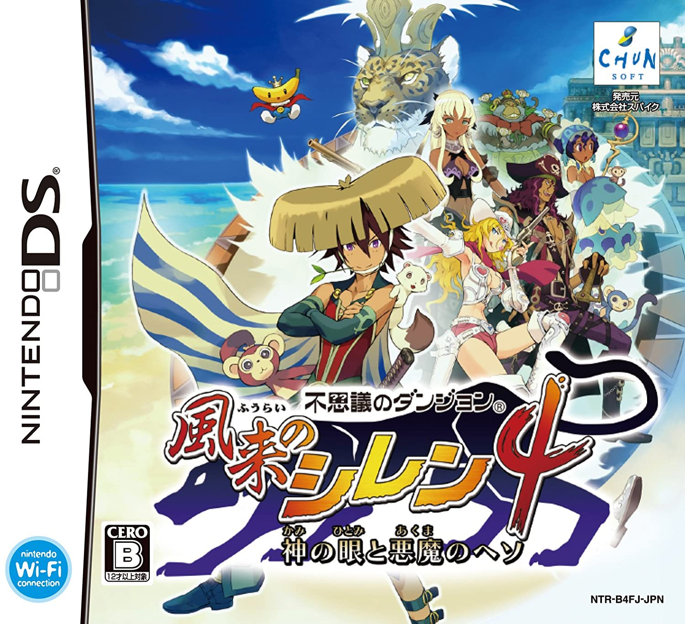
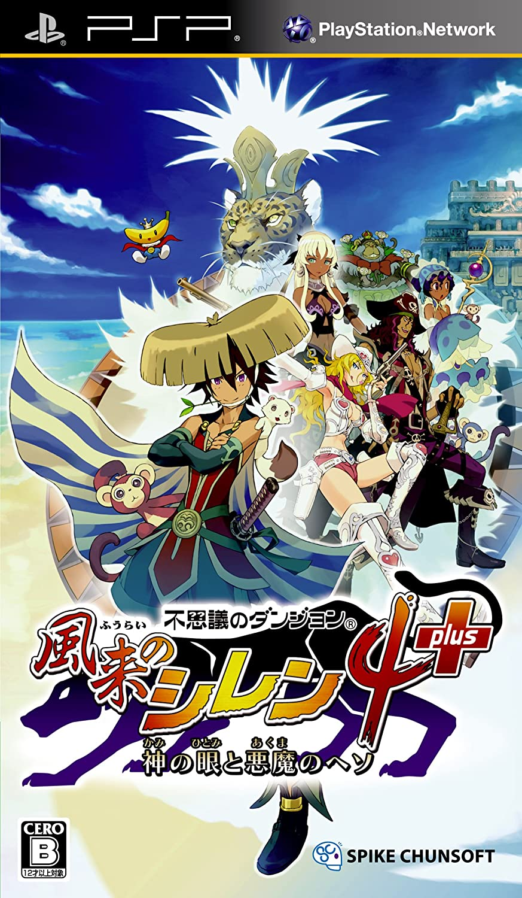

Welcome! This is a wiki for Shiren the Wanderer 4: The Eye of God and the Devil's Navel. It's a work-in-progress, so some pages don't have content yet, and others may change in time.

If you spot any errors or wish to contribute, please post on [/r/ShirenTheWanderer](https://reddit.com/r/ShirenTheWanderer) or join the community [Discord server](https://discord.gg/5y7UDFc) and ping shark.

Of course, you're welcome to join just to hang out with other players and ROM hackers too.

A significant portion of the information found on this site is hand-translated from the [Japanese wiki](https://seesaawiki.jp/shiren_4/).

<table>
  <tr>
    <th>Game Console</th>
    <td>Nintendo DS</td>
    <td>PlayStation Portable</td>
  </tr>
  <tr>
    <th>Release Date</th>
    <td>February 26th, 2010</td>
    <td>October 18th, 2012</td>
  </tr>
  <tr>
    <th>Price</th>
    <td>6,090 JPY</td>
    <td>4,400 JPY (Physical) 3,810 JPY (Digital)</td>
  </tr>
  <tr>
    <th>Players</th>
    <td>1</td>
    <td>1</td>
  </tr>
  <tr>
    <th>Official Site</th>
    <td>-</td>
    <td><a href="https://www.spike-chunsoft.co.jp/games/shiren4/psp/">PSP (Japanese)</a></td>
  </tr>
  <tr>
    <th>Developer</th>
    <td>Chunsoft</td>
    <td>Spike Chunsoft</td>
  </tr>
  <tr>
    <th>Box Art</th>
    <td class="boxArt"></td>
    <td class="boxArt"></td>
  </tr>
</table>
