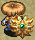

# Shield List

<table class="itemListCentered">
  <tr>
    <th colspan="5">Item Book Order</th>
  </tr>
  <tr>
    <th>1</th>
    <th>2</th>
    <th>3</th>
    <th>4</th>
    <th>5</th>
  </tr>
  <tr>
    <td class="highlightLightblue"><a href="#palm-shield">Palm Shield</a></td>
    <td class="highlightLightblue"><a href="#steady-shield">Steady Shield</a></td>
    <td class="highlightLightblue"><a href="#safe-shield">Safe Shield</a></td>
    <td class="highlightLightblue"><a href="#meteor-guard">Meteor Guard</a></td>
    <td class="highlightLightblue"><a href="#jaguar's-shield">Jaguar's Shield</a></td>
  </tr>
  <tr>
    <td class="highlightLightblue"><a href="#diet-shield">Diet Shield</a></td>
    <td class="highlightLightblue"><a href="#bowl-shield">Bowl Shield</a></td>
    <td class="highlightLightblue"><a href="#swap-shield">Swap Shield</a></td>
    <td class="highlightLightblue"><a href="#heavy-shield">Heavy Shield</a></td>
    <td></td>
  </tr>
  <tr>
    <td class="highlightLightblue"><a href="#spry-shield">Spry Shield</a></td>
    <td class="highlightLightblue"><a href="#lamp-shield">Lamp Shield</a></td>
    <td class="highlightLightblue"><a href="#lock-shield">Lock Shield</a></td>
    <td class="highlightLightblue"><a href="#red-shield">Red Shield</a></td>
    <td></td>
  </tr>
  <tr>
    <td class="highlightLightblue"><a href="#dull-gold-shield">Dull Gold Shield</a></td>
    <td class="highlightLightblue"><a href="#blast-shield">Blast Shield</a></td>
    <td class="highlightLightblue"><a href="#gyadon-blocker">Gyadon Blocker</a></td>
    <td class="highlightLightblue"><a href="#fuuma-shield">Fuuma Shield</a></td>
    <td></td>
  </tr>
  <tr>
    <td class="highlightLightblue"><a href="#counter-shield">Counter Shield</a></td>
    <td class="highlightLightblue"><a href="#iron-targe">Iron Targe</a></td>
    <td class="highlightLightblue"><a href="#clan-shield">Clan Shield</a></td>
    <td class="highlightLightblue"><a href="#shoddy-plank">Shoddy Plank</a></td>
    <td></td>
  </tr>
  <tr>
    <td class="highlightLightblue"><a href="#happy-shield">Happy Shield</a></td>
    <td class="highlightLightblue"><a href="#gazer-guard">Gazer Guard</a></td>
    <td class="highlightLightblue"><a href="#beast-shield">Beast Shield</a></td>
    <td class="highlightLightblue"><a href="#nirvana-board">Nirvana Board</a></td>
    <td></td>
  </tr>
  <tr>
    <td class="highlightLightblue"><a href="#copper-guard">Copper Guard</a></td>
    <td class="highlightLightblue"><a href="#parry-shield">Parry Shield</a></td>
    <td class="highlightLightblue"><a href="#lizard-shield">Lizard Shield</a></td>
    <td class="highlightLightblue"><a href="#helix-shield">Helix Shield</a></td>
    <td></td>
  </tr>
</table>

# Lv8 Summary

<table class="itemTable">
  <thead>
    <tr>
      <th>Lv1</th>
      <th>Lv8</th>
      <th>Def</th>
      <th>Max</th>
      <th>Ct</th>
      <th>Rune</th>
      <th>Added</th>
      <th>Exp</th>
      <th>Resonance</th>
    </tr>
  </thead>
  <tbody>
    <tr>
      <td class="highlightLightblue"><a href="#palm-shield">Palm Shield</a></td>
      <td class="highlightYellow">Demon's Guard</td>
      <td>15</td>
      <td>99</td>
      <td>∞</td>
      <td>-</td>
      <td>L4: HP+5 L8: 1/2 Hunger</td>
      <td>28,410</td>
      <td><a href="/shiren5/item/weapons#palm-stick">Palm Stick</a> (Equip 2 bracelets)</td>
    </tr>
    <tr>
      <td class="highlightLightblue"><a href="#copper-guard">Copper Guard</a></td>
      <td class="highlightYellow">Bronze Bulwark</td>
      <td>18</td>
      <td>99</td>
      <td>∞</td>
      <td>-</td>
      <td>L4: HP+5 L8: Rustproof</td>
      <td>34,725</td>
      <td><a href="/shiren5/item/weapons#copper-edge">Copper Edge</a> (Equip 2 bracelets)</td>
    </tr>
    <tr>
      <td class="highlightLightblue"><a href="#iron-targe">Iron Targe</a></td>
      <td class="highlightYellow">Heirloom Shield</td>
      <td>20</td>
      <td>99</td>
      <td>∞</td>
      <td>-</td>
      <td>L4: HP+10</td>
      <td>41,070</td>
      <td><a href="/shiren5/item/weapons#katana">Katana</a> (Equip 2 bracelets)</td>
    </tr>
    <tr>
      <td class="highlightLightblue"><a href="#clan-shield">Clan Shield</a></td>
      <td class="highlightYellow">Tribe King Shield</td>
      <td>22</td>
      <td>99</td>
      <td>∞</td>
      <td>-</td>
      <td>L4: HP+5 L5: Rustproof</td>
      <td>44,250</td>
      <td><a href="/shiren5/item/weapons#dotanuki">Dotanuki</a> (Equip 2 bracelets)</td>
    </tr>
    <tr>
      <td class="highlightLightblue"><a href="#beast-shield">Beast Shield</a></td>
      <td class="highlightYellow">Beastmaster</td>
      <td>23</td>
      <td>99</td>
      <td>∞</td>
      <td>-</td>
      <td>L4: HP+10 L8: Def+3</td>
      <td>50,600</td>
      <td><a href="/shiren5/item/weapons#beast-fang">Beast Fang</a> (Equip 2 bracelets)</td>
    </tr>
    <tr>
      <td class="highlightLightblue"><a href="#meteor-guard">Meteor Guard</a></td>
      <td class="highlightYellow">Galaxy Guard</td>
      <td>25</td>
      <td>99</td>
      <td>∞</td>
      <td>-</td>
      <td>L4: HP+10 L5: Rustproof L8: Anti-Theft</td>
      <td>57,000</td>
      <td><a href="/shiren5/item/weapons#meteor-edge">Meteor Edge</a> (Equip 2 bracelets)</td>
    </tr>
    <tr>
      <td class="highlightLightblue"><a href="#red-shield">Red Shield</a></td>
      <td class="highlightYellow">Shugoseki Shield</td>
      <td>27</td>
      <td>99</td>
      <td>∞</td>
      <td>-</td>
      <td>L3: HP+10 L8: 1/2 Fire L8: Anti-Peck</td>
      <td>63,350</td>
      <td><a href="/shiren5/item/weapons#red-blade">Red Blade</a> (Equip 2 bracelets)</td>
    </tr>
    <tr>
      <td class="highlightLightblue"><a href="#fuuma-shield">Fuuma Shield</a></td>
      <td class="highlightYellow">Legendary Fuuma</td>
      <td>30</td>
      <td>99</td>
      <td>∞</td>
      <td>-</td>
      <td>L8: Rustproof</td>
      <td>107,700</td>
      <td><a href="/shiren5/item/weapons#kabura's-blade">Kabura's Blade</a> (Attack damage +5)</td>
    </tr>
    <tr>
      <td class="highlightLightblue"><a href="#helix-shield">Helix Shield</a></td>
      <td class="highlightYellow">Infinautilus</td>
      <td>40</td>
      <td>99</td>
      <td>∞</td>
      <td>-</td>
      <td>-</td>
      <td>259,000</td>
      <td><a href="/shiren5/item/weapons#fuuma-sword">Fuuma Sword</a> (Attack damage +10) <a href="/shiren5/item/weapons#kaburagi">Kaburagi</a> (Attack damage +10)</td>
    </tr>
    <tr>
      <td class="highlightLightblue"><a href="#dull-gold-shield">Dull Gold Shield</a></td>
      <td class="highlightYellow">DX Gold Shield</td>
      <td>5</td>
      <td>99</td>
      <td>∞</td>
      <td>Rustproof</td>
      <td>L8: Pain Fullness</td>
      <td>32,100</td>
      <td><a href="/shiren5/item/weapons#dull-gold-edge">Dull Gold Edge</a> (Max strength +3)</td>
    </tr>
    <tr>
      <td class="highlightLightblue"><a href="#diet-shield">Diet Shield</a></td>
      <td class="highlightYellow">Surfeit Shield</td>
      <td>10</td>
      <td>99</td>
      <td>∞</td>
      <td>1/2 Hunger</td>
      <td>L8: HP+20</td>
      <td>63,000</td>
      <td>-</td>
    </tr>
    <tr>
      <td class="highlightLightblue"><a href="#heavy-shield">Heavy Shield</a></td>
      <td class="highlightYellow">Ultimate Aegis</td>
      <td>28</td>
      <td>99</td>
      <td>∞</td>
      <td>Hungry</td>
      <td>L8: Unmoving L8: Anti-Burgle</td>
      <td>54,500</td>
      <td>-</td>
    </tr>
    <tr>
      <td class="highlightLightblue"><a href="#counter-shield">Counter Shield</a></td>
      <td class="highlightYellow">Killer Counter</td>
      <td>12</td>
      <td>99</td>
      <td>∞</td>
      <td>Counter</td>
      <td>L8: Damage Exp</td>
      <td>50,800</td>
      <td><a href="/shiren5/item/bracelets#strength-bracelet">Strength Bracelet</a> (Double counter damage)</td>
    </tr>
    <tr>
      <td class="highlightLightblue"><a href="#happy-shield">Happy Shield</a></td>
      <td class="highlightYellow">Blissful Shield</td>
      <td>8</td>
      <td>99</td>
      <td>∞</td>
      <td>Damage Exp</td>
      <td>L5: HP+5 L8: Def+3</td>
      <td>63,000</td>
      <td><a href="/shiren5/item/weapons#happy-bracelet">Happy Bracelet</a> (Double bracelet exp gain)</td>
    </tr>
    <tr>
      <td class="highlightLightblue"><a href="#bowl-shield">Bowl Shield</a></td>
      <td class="highlightYellow">Second Serving</td>
      <td>10</td>
      <td>99</td>
      <td>∞</td>
      <td>Pain Fullness</td>
      <td>L6: Rustproof</td>
      <td>77,000</td>
      <td>-</td>
    </tr>
    <tr>
      <td class="highlightLightblue"><a href="#spry-shield">Spry Shield</a></td>
      <td class="highlightYellow">Hyper Dodger</td>
      <td>10</td>
      <td>99</td>
      <td>∞</td>
      <td>Agile</td>
      <td>L5: Rustproof</td>
      <td>93,400</td>
      <td><a href="/shiren5/item/weapons#myopic-masher">Myopic Masher</a> (Attack and defense +3)</td>
    </tr>
    <tr>
      <td class="highlightLightblue"><a href="#blast-shield">Blast Shield</a></td>
      <td class="highlightYellow">Bomb Shelter</td>
      <td>13</td>
      <td>99</td>
      <td>∞</td>
      <td>1/2 Blast</td>
      <td>L8: Rustproof L8: Anti-Burgle</td>
      <td>77,700</td>
      <td><a href="/shiren5/item/weapons#crescent-katana">Crescent Katana</a> (Attack and defense +3)</td>
    </tr>
    <tr>
      <td class="highlightLightblue"><a href="#lock-shield">Lock Shield</a></td>
      <td class="highlightYellow">Retina Scan</td>
      <td>12</td>
      <td>99</td>
      <td>∞</td>
      <td>Anti-Theft</td>
      <td>L8: 1/2 Blast</td>
      <td>44,500</td>
      <td>-</td>
    </tr>
    <tr>
      <td class="highlightLightblue"><a href="#safe-shield">Safe Shield</a></td>
      <td class="highlightYellow">Fort Knox</td>
      <td>13</td>
      <td>99</td>
      <td>∞</td>
      <td>Anti-Burgle</td>
      <td>L8: 1/2 Blast</td>
      <td>44,800</td>
      <td>-</td>
    </tr>
    <tr>
      <td class="highlightLightblue"><a href="#gyadon-blocker">Gyadon Blocker</a></td>
      <td class="highlightYellow">Gyagya Gyadon!</td>
      <td>14</td>
      <td>99</td>
      <td>∞</td>
      <td>Anti-Peck</td>
      <td>L8: Agile</td>
      <td>77,700</td>
      <td>-</td>
    </tr>
    <tr>
      <td class="highlightLightblue"><a href="#lizard-shield">Lizard Shield</a></td>
      <td class="highlightYellow">Dragonkeeper</td>
      <td>18</td>
      <td>99</td>
      <td>∞</td>
      <td>1/2 Fire</td>
      <td>L8: Counter</td>
      <td>84,000</td>
      <td><a href="/shiren5/item/weapons#lizard-lasher">Lizard Lasher</a> (Attack and defense +3)</td>
    </tr>
    <tr>
      <td class="highlightLightblue"><a href="#steady-shield">Steady Shield</a></td>
      <td class="highlightYellow">Stalwart Shield</td>
      <td>12</td>
      <td>99</td>
      <td>∞</td>
      <td>Unmoving</td>
      <td>L8: Counter</td>
      <td>44,500</td>
      <td>-</td>
    </tr>
    <tr>
      <td class="highlightLightblue"><a href="#gazer-guard">Gazer Guard</a></td>
      <td class="highlightYellow">Gazer Gazer!</td>
      <td>10</td>
      <td>99</td>
      <td>∞</td>
      <td>Anti-Hypno</td>
      <td>L8: Agile</td>
      <td>63,000</td>
      <td>-</td>
    </tr>
    <tr>
      <td class="highlightLightblue"><a href="#swap-shield">Swap Shield</a></td>
      <td class="highlightYellow">Mega Prismagic</td>
      <td>11</td>
      <td>99</td>
      <td>∞</td>
      <td>Magic Damage</td>
      <td>L8: HP+10 L8: Def+3</td>
      <td>74,000</td>
      <td><a href="/shiren5/item/weapons#burning-blade">Burning Blade</a> (Boost Flame Shot)</td>
    </tr>
    <tr>
      <td class="highlightLightblue"><a href="#shoddy-plank">Shoddy Plank</a></td>
      <td class="highlightYellow">Worthy Shield</td>
      <td>37</td>
      <td>99</td>
      <td>∞</td>
      <td>Degrade</td>
      <td>-</td>
      <td>112,000</td>
      <td><a href="/shiren5/item/weapons#shoddy-dirk">Shoddy Dirk</a> (Equipped items won't rust)</td>
    </tr>
    <tr>
      <td class="highlightLightblue"><a href="#lamp-shield">Lamp Shield</a></td>
      <td class="highlightYellow">Blaze Shield</td>
      <td>8</td>
      <td>99</td>
      <td>∞</td>
      <td>-</td>
      <td>-</td>
      <td>57,000</td>
      <td><a href="/shiren5/item/weapons#torch">Torch</a> (Light up entire room)</td>
    </tr>
    <tr>
      <td class="highlightLightblue"><a href="#parry-shield">Parry Shield</a></td>
      <td class="highlightYellow">Untouchable</td>
      <td>13</td>
      <td>99</td>
      <td>∞</td>
      <td>Parry</td>
      <td>L8: Counter L8: Unmoving</td>
      <td>127,000</td>
      <td>-</td>
    </tr>
    <tr>
      <td class="highlightLightblue"><a href="#nirvana-board">Nirvana Board</a></td>
      <td class="highlightYellow">Endless Nirvana</td>
      <td>14</td>
      <td>99</td>
      <td>∞</td>
      <td>Hungerless</td>
      <td>L8: Rustproof L8: Damage Exp</td>
      <td>127,000</td>
      <td><a href="/shiren5/item/weapons#wonder-pick">Wonder Pick</a> (Max HP +30)</td>
    </tr>
    <tr>
      <td class="highlightLightblue"><a href="#jaguar's-shield">Jaguar's Shield</a></td>
      <td class="highlightYellow">Divine Jaguar</td>
      <td>40</td>
      <td>99</td>
      <td>∞</td>
      <td>Status Counter</td>
      <td>L8: Anti-Hypno L8: Counter</td>
      <td>245,000</td>
      <td><a href="/shiren5/item/weapons#kamina's-sword">Kamina's Sword</a> (Equip 2 bracelets) <a href="/shiren5/item/weapons#kamina's-sword">Kamina's Sword</a>+ <a href="/shiren5/item/bracelets#bulldog-bracelet">Bulldog Bracelet</a> (Attack damage +20) <a href="/shiren5/item/weapons#kamina's-sword">Kamina's Sword</a>+ <a href="/shiren5/item/bracelets#bulldog-bracelet">Bulldog Bracelet</a>+ <a href="/shiren5/item/projectiles#hemoji-arrow">Hemoji Arrow</a> (No fullness depletion)</td>
    </tr>
  </tbody>
</table>

# Details

#### Growth Experience

The listed experience points per level is not an accumilated total. 
Extra exp from defeating a monster will not carry forward when a shield levels up. 
(Example: 100 exp until level up, defeat an Archdragon for 400 exp, 300 exp is lost)

### Palm Shield

<table class="itemDetailsTable">
  <tr>
    <th>Image</th>
    <th>Lv1 Description</th>
  </tr>
  <tr>
    <td></td>
    <td>item_book_description</td>
  </tr>
</table>

 

<table class="itemDetailsTable">
  <tbody>
    <tr>
      <th>Lv</th>
      <th>Name</th>
      <th>Def</th>
      <th>Max</th>
      <th>Ct</th>
      <th>Exp</th>
      <th>Buy</th>
      <th>Sell</th>
      <th>Rune</th>
      <th>Info</th>
    </tr>
    <tr>
      <td>1</td>
      <td>Palm Shield</td>
      <td>2</td>
      <td>10</td>
      <td>5</td>
      <td>-</td>
      <td>360</td>
      <td>126</td>
      <td rowspan="3">-</td>
      <td rowspan="8">Resonance: <a href="/shiren5/item/weapons#palm-stick">Palm Stick</a> (Equip 2 bracelets)</td>
    </tr>
    <tr>
      <td>2</td>
      <td>Good Palm Shield</td>
      <td>4</td>
      <td>20</td>
      <td>6</td>
      <td>60</td>
      <td>460</td>
      <td>161</td>
    </tr>
    <tr>
      <td>3</td>
      <td>Hard Palm Shield</td>
      <td>6</td>
      <td>30</td>
      <td>6</td>
      <td>450</td>
      <td>560</td>
      <td>196</td>
    </tr>
    <tr>
      <td>4</td>
      <td>Nice Palm Shield</td>
      <td>8</td>
      <td>40</td>
      <td>7</td>
      <td>900</td>
      <td>660</td>
      <td>231</td>
      <td rowspan="4">HP+5</td>
    </tr>
    <tr>
      <td>5</td>
      <td>Wood Shield</td>
      <td>10</td>
      <td>50</td>
      <td>7</td>
      <td>1800</td>
      <td>760</td>
      <td>266</td>
    </tr>
    <tr>
      <td>6</td>
      <td>Big Wood Shield</td>
      <td>11</td>
      <td>60</td>
      <td>8</td>
      <td>3600</td>
      <td>860</td>
      <td>301</td>
    </tr>
    <tr>
      <td>7</td>
      <td>Hard Wood Shield</td>
      <td>12</td>
      <td>70</td>
      <td>8</td>
      <td>7200</td>
      <td>960</td>
      <td>336</td>
    </tr>
    <tr>
      <td>8</td>
      <td>Demon's Guard</td>
      <td>15</td>
      <td>99</td>
      <td>∞</td>
      <td>14400</td>
      <td>1300</td>
      <td>455</td>
      <td>HP+5 1/2 Hunger</td>
    </tr>
  </tbody>
</table>

### Copper Guard

<table class="itemDetailsTable">
  <tr>
    <th>Image</th>
    <th>Lv1 Description</th>
  </tr>
  <tr>
    <td></td>
    <td>item_book_description</td>
  </tr>
</table>

 

<table class="itemDetailsTable">
  <tbody>
    <tr>
      <th>Lv</th>
      <th>Name</th>
      <th>Def</th>
      <th>Max</th>
      <th>Ct</th>
      <th>Exp</th>
      <th>Buy</th>
      <th>Sell</th>
      <th>Rune</th>
      <th>Info</th>
    </tr>
    <tr>
      <td>1</td>
      <td>Copper Guard</td>
      <td>4</td>
      <td>10</td>
      <td>4</td>
      <td>-</td>
      <td>740</td>
      <td>259</td>
      <td rowspan="3">-</td>
      <td rowspan="8">Resonance: <a href="/shiren5/item/weapons#copper-edge">Copper Edge</a> (Equip 2 bracelets)</td>
    </tr>
    <tr>
      <td>2</td>
      <td>Copper Buckler</td>
      <td>5</td>
      <td>20</td>
      <td>5</td>
      <td>75</td>
      <td>840</td>
      <td>294</td>
    </tr>
    <tr>
      <td>3</td>
      <td>Copper Targe</td>
      <td>7</td>
      <td>30</td>
      <td>5</td>
      <td>550</td>
      <td>940</td>
      <td>329</td>
    </tr>
    <tr>
      <td>4</td>
      <td>Copper Shield</td>
      <td>9</td>
      <td>40</td>
      <td>6</td>
      <td>1100</td>
      <td>1100</td>
      <td>385</td>
      <td rowspan="4">HP+5</td>
    </tr>
    <tr>
      <td>5</td>
      <td>Bronze Buckler</td>
      <td>11</td>
      <td>50</td>
      <td>6</td>
      <td>2200</td>
      <td>1200</td>
      <td>420</td>
    </tr>
    <tr>
      <td>6</td>
      <td>Bronze Targe</td>
      <td>13</td>
      <td>60</td>
      <td>7</td>
      <td>4400</td>
      <td>1300</td>
      <td>455</td>
    </tr>
    <tr>
      <td>7</td>
      <td>Bronze Shield</td>
      <td>15</td>
      <td>70</td>
      <td>7</td>
      <td>8800</td>
      <td>1400</td>
      <td>490</td>
    </tr>
    <tr>
      <td>8</td>
      <td>Bronze Bulwark</td>
      <td>18</td>
      <td>99</td>
      <td>∞</td>
      <td>17600</td>
      <td>1700</td>
      <td>595</td>
      <td>HP+5 Rustproof</td>
    </tr>
  </tbody>
</table>

### Iron Targe

<table class="itemDetailsTable">
  <tr>
    <th>Image</th>
    <th>Lv1 Description</th>
  </tr>
  <tr>
    <td></td>
    <td>item_book_description</td>
  </tr>
</table>

 

<table class="itemDetailsTable">
  <tbody>
    <tr>
      <th>Lv</th>
      <th>Name</th>
      <th>Def</th>
      <th>Max</th>
      <th>Ct</th>
      <th>Exp</th>
      <th>Buy</th>
      <th>Sell</th>
      <th>Rune</th>
      <th>Info</th>
    </tr>
    <tr>
      <td>1</td>
      <td>Iron Targe</td>
      <td>6</td>
      <td>10</td>
      <td>3</td>
      <td>-</td>
      <td>1300</td>
      <td>455</td>
      <td rowspan="3">-</td>
      <td rowspan="8">Resonance: <a href="/shiren5/item/weapons#katana">Katana</a> (Equip 2 bracelets)</td>
    </tr>
    <tr>
      <td>2</td>
      <td>Good Iron Targe</td>
      <td>8</td>
      <td>20</td>
      <td>5</td>
      <td>120</td>
      <td>1400</td>
      <td>490</td>
    </tr>
    <tr>
      <td>3</td>
      <td>Nice Iron Targe</td>
      <td>10</td>
      <td>30</td>
      <td>5</td>
      <td>650</td>
      <td>1500</td>
      <td>525</td>
    </tr>
    <tr>
      <td>4</td>
      <td>Iron Shield</td>
      <td>12</td>
      <td>40</td>
      <td>7</td>
      <td>1300</td>
      <td>1600</td>
      <td>560</td>
      <td rowspan="5">HP+10</td>
    </tr>
    <tr>
      <td>5</td>
      <td>Good Iron Shield</td>
      <td>14</td>
      <td>50</td>
      <td>7</td>
      <td>2600</td>
      <td>1700</td>
      <td>595</td>
    </tr>
    <tr>
      <td>6</td>
      <td>Rare Iron Shield</td>
      <td>16</td>
      <td>60</td>
      <td>8</td>
      <td>5200</td>
      <td>1800</td>
      <td>630</td>
    </tr>
    <tr>
      <td>7</td>
      <td>Steel Shield</td>
      <td>18</td>
      <td>70</td>
      <td>8</td>
      <td>10400</td>
      <td>1900</td>
      <td>665</td>
    </tr>
    <tr>
      <td>8</td>
      <td>Heirloom Shield</td>
      <td>20</td>
      <td>99</td>
      <td>∞</td>
      <td>20800</td>
      <td>2400</td>
      <td>840</td>
    </tr>
  </tbody>
</table>

### Clan Shield

<table class="itemDetailsTable">
  <tr>
    <th>Image</th>
    <th>Lv1 Description</th>
  </tr>
  <tr>
    <td></td>
    <td>item_book_description</td>
  </tr>
</table>

 

<table class="itemDetailsTable">
  <tbody>
    <tr>
      <th>Lv</th>
      <th>Name</th>
      <th>Def</th>
      <th>Max</th>
      <th>Ct</th>
      <th>Exp</th>
      <th>Buy</th>
      <th>Sell</th>
      <th>Rune</th>
      <th>Info</th>
    </tr>
    <tr>
      <td>1</td>
      <td>Clan Shield</td>
      <td>8</td>
      <td>10</td>
      <td>5</td>
      <td>-</td>
      <td>1800</td>
      <td>630</td>
      <td rowspan="3">-</td>
      <td rowspan="8">Resonance: <a href="/shiren5/item/weapons#dotanuki">Dotanuki</a> (Equip 2 bracelets)</td>
    </tr>
    <tr>
      <td>2</td>
      <td>Mid Clan Shield</td>
      <td>9</td>
      <td>20</td>
      <td>6</td>
      <td>150</td>
      <td>1900</td>
      <td>665</td>
    </tr>
    <tr>
      <td>3</td>
      <td>Big Clan Shield</td>
      <td>10</td>
      <td>30</td>
      <td>6</td>
      <td>700</td>
      <td>2000</td>
      <td>700</td>
    </tr>
    <tr>
      <td>4</td>
      <td>Tribal Shield</td>
      <td>14</td>
      <td>40</td>
      <td>7</td>
      <td>1400</td>
      <td>2100</td>
      <td>735</td>
      <td>HP+5</td>
    </tr>
    <tr>
      <td>5</td>
      <td>Chief's Shield</td>
      <td>15</td>
      <td>50</td>
      <td>7</td>
      <td>2800</td>
      <td>2200</td>
      <td>770</td>
      <td rowspan="4">HP+5 Rustproof</td>
    </tr>
    <tr>
      <td>6</td>
      <td>Warrior's Shield</td>
      <td>16</td>
      <td>60</td>
      <td>8</td>
      <td>5600</td>
      <td>2300</td>
      <td>805</td>
    </tr>
    <tr>
      <td>7</td>
      <td>Chieftain Shield</td>
      <td>18</td>
      <td>70</td>
      <td>8</td>
      <td>11200</td>
      <td>2400</td>
      <td>840</td>
    </tr>
    <tr>
      <td>8</td>
      <td>Tribe King Shield</td>
      <td>22</td>
      <td>99</td>
      <td>∞</td>
      <td>22400</td>
      <td>2900</td>
      <td>1015</td>
    </tr>
  </tbody>
</table>

### Beast Shield

<table class="itemDetailsTable">
  <tr>
    <th>Image</th>
    <th>Lv1 Description</th>
  </tr>
  <tr>
    <td></td>
    <td>item_book_description</td>
  </tr>
</table>

 

<table class="itemDetailsTable">
  <tbody>
    <tr>
      <th>Lv</th>
      <th>Name</th>
      <th>Def</th>
      <th>Max</th>
      <th>Ct</th>
      <th>Exp</th>
      <th>Buy</th>
      <th>Sell</th>
      <th>Rune</th>
      <th>Info</th>
    </tr>
    <tr>
      <td>1</td>
      <td>Beast Shield</td>
      <td>10</td>
      <td>10</td>
      <td>4</td>
      <td>-</td>
      <td>2400</td>
      <td>840</td>
      <td rowspan="3">-</td>
      <td rowspan="8">Resonance: <a href="/shiren5/item/weapons#beast-fang">Beast Fang</a> (Equip 2 bracelets)</td>
    </tr>
    <tr>
      <td>2</td>
      <td>Fine Beast Shield</td>
      <td>12</td>
      <td>20</td>
      <td>6</td>
      <td>200</td>
      <td>2500</td>
      <td>875</td>
    </tr>
    <tr>
      <td>3</td>
      <td>Wild Beast Shield</td>
      <td>14</td>
      <td>30</td>
      <td>6</td>
      <td>800</td>
      <td>2600</td>
      <td>910</td>
    </tr>
    <tr>
      <td>4</td>
      <td>Lion Shield</td>
      <td>16</td>
      <td>40</td>
      <td>8</td>
      <td>1600</td>
      <td>2700</td>
      <td>945</td>
      <td rowspan="4">HP+10</td>
    </tr>
    <tr>
      <td>5</td>
      <td>Good Lion Shield</td>
      <td>18</td>
      <td>50</td>
      <td>8</td>
      <td>3200</td>
      <td>2800</td>
      <td>980</td>
    </tr>
    <tr>
      <td>6</td>
      <td>Wild Lion Shield</td>
      <td>20</td>
      <td>60</td>
      <td>9</td>
      <td>6400</td>
      <td>2900</td>
      <td>1015</td>
    </tr>
    <tr>
      <td>7</td>
      <td>Feral Lion Shield</td>
      <td>21</td>
      <td>70</td>
      <td>9</td>
      <td>12800</td>
      <td>3000</td>
      <td>1050</td>
    </tr>
    <tr>
      <td>8</td>
      <td>Beastmaster</td>
      <td>23</td>
      <td>99</td>
      <td>∞</td>
      <td>25600</td>
      <td>3500</td>
      <td>1225</td>
      <td>HP+10 Def+3</td>
    </tr>
  </tbody>
</table>

### Meteor Guard

<table class="itemDetailsTable">
  <tr>
    <th>Image</th>
    <th>Lv1 Description</th>
  </tr>
  <tr>
    <td></td>
    <td>item_book_description</td>
  </tr>
</table>

 

<table class="itemDetailsTable">
  <tbody>
    <tr>
      <th>Lv</th>
      <th>Name</th>
      <th>Def</th>
      <th>Max</th>
      <th>Ct</th>
      <th>Exp</th>
      <th>Buy</th>
      <th>Sell</th>
      <th>Rune</th>
      <th>Info</th>
    </tr>
    <tr>
      <td>1</td>
      <td>Meteor Guard</td>
      <td>12</td>
      <td>10</td>
      <td>5</td>
      <td>-</td>
      <td>3200</td>
      <td>1120</td>
      <td rowspan="3">-</td>
      <td rowspan="8">Resonance: <a href="/shiren5/item/weapons#meteor-edge">Meteor Edge</a> (Equip 2 bracelets)</td>
    </tr>
    <tr>
      <td>2</td>
      <td>Meteor Targe</td>
      <td>16</td>
      <td>20</td>
      <td>6</td>
      <td>300</td>
      <td>3300</td>
      <td>1155</td>
    </tr>
    <tr>
      <td>3</td>
      <td>Meteor Shield</td>
      <td>16</td>
      <td>30</td>
      <td>7</td>
      <td>900</td>
      <td>3400</td>
      <td>1190</td>
    </tr>
    <tr>
      <td>4</td>
      <td>Asteroid Guard</td>
      <td>18</td>
      <td>40</td>
      <td>8</td>
      <td>1800</td>
      <td>3500</td>
      <td>1225</td>
      <td>HP+10</td>
    </tr>
    <tr>
      <td>5</td>
      <td>Asteroid Shield</td>
      <td>18</td>
      <td>50</td>
      <td>9</td>
      <td>3600</td>
      <td>3600</td>
      <td>1260</td>
      <td rowspan="3">HP+10 Rustproof</td>
    </tr>
    <tr>
      <td>6</td>
      <td>Comet Guard</td>
      <td>21</td>
      <td>60</td>
      <td>9</td>
      <td>7200</td>
      <td>3700</td>
      <td>1295</td>
    </tr>
    <tr>
      <td>7</td>
      <td>Comet Shield</td>
      <td>21</td>
      <td>70</td>
      <td>9</td>
      <td>14400</td>
      <td>3800</td>
      <td>1330</td>
    </tr>
    <tr>
      <td>8</td>
      <td>Galaxy Guard</td>
      <td>25</td>
      <td>99</td>
      <td>∞</td>
      <td>28800</td>
      <td>4500</td>
      <td>1575</td>
      <td>HP+10 Rustproof Anti-Theft</td>
    </tr>
  </tbody>
</table>

### Red Shield

<table class="itemDetailsTable">
  <tr>
    <th>Image</th>
    <th>Lv1 Description</th>
  </tr>
  <tr>
    <td></td>
    <td>item_book_description</td>
  </tr>
</table>

 

<table class="itemDetailsTable">
  <tbody>
    <tr>
      <th>Lv</th>
      <th>Name</th>
      <th>Def</th>
      <th>Max</th>
      <th>Ct</th>
      <th>Exp</th>
      <th>Buy</th>
      <th>Sell</th>
      <th>Rune</th>
      <th>Info</th>
    </tr>
    <tr>
      <td>1</td>
      <td>Red Shield</td>
      <td>14</td>
      <td>10</td>
      <td>4</td>
      <td>-</td>
      <td>4800</td>
      <td>1680</td>
      <td rowspan="2">-</td>
      <td rowspan="8">Resonance: <a href="/items/weapons#red-blade">Red Blade</a> (Equip 2 bracelets)</td>
    </tr>
    <tr>
      <td>2</td>
      <td>Good Red Shield</td>
      <td>16</td>
      <td>20</td>
      <td>5</td>
      <td>350</td>
      <td>4900</td>
      <td>1715</td>
    </tr>
    <tr>
      <td>3</td>
      <td>Fine Red Shield</td>
      <td>17</td>
      <td>30</td>
      <td>6</td>
      <td>1000</td>
      <td>5000</td>
      <td>1750</td>
      <td rowspan="5">HP+10</td>
    </tr>
    <tr>
      <td>4</td>
      <td>Hard Red Shield</td>
      <td>18</td>
      <td>40</td>
      <td>6</td>
      <td>2000</td>
      <td>5100</td>
      <td>1785</td>
    </tr>
    <tr>
      <td>5</td>
      <td>Rare Red Shield</td>
      <td>19</td>
      <td>50</td>
      <td>7</td>
      <td>4000</td>
      <td>5200</td>
      <td>1820</td>
    </tr>
    <tr>
      <td>6</td>
      <td>Crimson Shield</td>
      <td>21</td>
      <td>60</td>
      <td>7</td>
      <td>8000</td>
      <td>5300</td>
      <td>1855</td>
    </tr>
    <tr>
      <td>7</td>
      <td>Scarlet Shield</td>
      <td>23</td>
      <td>70</td>
      <td>8</td>
      <td>16000</td>
      <td>5400</td>
      <td>1890</td>
    </tr>
    <tr>
      <td>8</td>
      <td>Shugoseki Shield</td>
      <td>27</td>
      <td>99</td>
      <td>∞</td>
      <td>32000</td>
      <td>6400</td>
      <td>2240</td>
      <td>HP+10 1/2 Fire Anti-Peck</td>
    </tr>
  </tbody>
</table>

### Fuuma Shield

<table class="itemDetailsTable">
  <tr>
    <th>Image</th>
    <th>Lv1 Description</th>
  </tr>
  <tr>
    <td></td>
    <td>item_book_description</td>
  </tr>
</table>

 

<table class="itemDetailsTable">
  <tbody>
    <tr>
      <th>Lv</th>
      <th>Name</th>
      <th>Def</th>
      <th>Max</th>
      <th>Ct</th>
      <th>Exp</th>
      <th>Buy</th>
      <th>Sell</th>
      <th>Rune</th>
      <th>Info</th>
    </tr>
    <tr>
      <td>1</td>
      <td>Fuuma Shield</td>
      <td>16</td>
      <td>10</td>
      <td>3</td>
      <td>-</td>
      <td>8500</td>
      <td>2975</td>
      <td rowspan="7">-</td>
      <td rowspan="8">Resonance: <a href="/items/weapons#kabura's-blade">Kabura's Blade</a> (Attack damage +5)</td>
    </tr>
    <tr>
      <td>2</td>
      <td>Good Fuuma</td>
      <td>17</td>
      <td>20</td>
      <td>4</td>
      <td>600</td>
      <td>8600</td>
      <td>3010</td>
    </tr>
    <tr>
      <td>3</td>
      <td>Nice Fuuma</td>
      <td>18</td>
      <td>30</td>
      <td>5</td>
      <td>1700</td>
      <td>8700</td>
      <td>3045</td>
    </tr>
    <tr>
      <td>4</td>
      <td>Fine Fuuma</td>
      <td>19</td>
      <td>40</td>
      <td>6</td>
      <td>3400</td>
      <td>8800</td>
      <td>3080</td>
    </tr>
    <tr>
      <td>5</td>
      <td>Rare Fuuma</td>
      <td>20</td>
      <td>50</td>
      <td>7</td>
      <td>6800</td>
      <td>8900</td>
      <td>3115</td>
    </tr>
    <tr>
      <td>6</td>
      <td>Strong Fuuma</td>
      <td>23</td>
      <td>60</td>
      <td>9</td>
      <td>13600</td>
      <td>9000</td>
      <td>3150</td>
    </tr>
    <tr>
      <td>7</td>
      <td>Epic Fuuma</td>
      <td>26</td>
      <td>70</td>
      <td>11</td>
      <td>27200</td>
      <td>9100</td>
      <td>3185</td>
    </tr>
    <tr>
      <td>8</td>
      <td>Legendary Fuuma</td>
      <td>30</td>
      <td>99</td>
      <td>∞</td>
      <td>54400</td>
      <td>11000</td>
      <td>3850</td>
      <td>Rustproof</td>
    </tr>
  </tbody>
</table>

### Helix Shield

<table class="itemDetailsTable">
  <tr>
    <th>Image</th>
    <th>Lv1 Description</th>
  </tr>
  <tr>
    <td></td>
    <td>item_book_description</td>
  </tr>
</table>

 

<table class="itemDetailsTable">
  <tbody>
    <tr>
      <th>Lv</th>
      <th>Name</th>
      <th>Def</th>
      <th>Max</th>
      <th>Ct</th>
      <th>Exp</th>
      <th>Buy</th>
      <th>Sell</th>
      <th>Rune</th>
      <th>Info</th>
    </tr>
    <tr>
      <td>1</td>
      <td>Helix Shield</td>
      <td>25</td>
      <td>10</td>
      <td>∞</td>
      <td>-</td>
      <td>12000</td>
      <td>4200</td>
      <td rowspan="8">-</td>
      <td rowspan="8">Resonance: <a href="/items/weapons#fuuma-sword">Fuuma Sword</a> (Attack damage +10)  Resonance: <a href="/items/weapons#kaburagi">Kaburagi</a> (Attack damage +10)  Obtaining: Upgrade a Legendary Fuuma+99 using the Smith 1 <a href="/system/npcs">NPC</a>.</td>
    </tr>
    <tr>
      <td>2</td>
      <td>Nice Helix Shield</td>
      <td>26</td>
      <td>20</td>
      <td>∞</td>
      <td>22000</td>
      <td>13000</td>
      <td>4550</td>
    </tr>
    <tr>
      <td>3</td>
      <td>Fine Helix Shield</td>
      <td>27</td>
      <td>30</td>
      <td>∞</td>
      <td>27000</td>
      <td>14000</td>
      <td>4900</td>
    </tr>
    <tr>
      <td>4</td>
      <td>Rare Helix Shield</td>
      <td>28</td>
      <td>40</td>
      <td>∞</td>
      <td>32000</td>
      <td>15000</td>
      <td>5250</td>
    </tr>
    <tr>
      <td>5</td>
      <td>Epic Helix Shield</td>
      <td>29</td>
      <td>50</td>
      <td>∞</td>
      <td>37000</td>
      <td>16000</td>
      <td>5600</td>
    </tr>
    <tr>
      <td>6</td>
      <td>Double Helix</td>
      <td>30</td>
      <td>60</td>
      <td>∞</td>
      <td>42000</td>
      <td>17000</td>
      <td>5950</td>
    </tr>
    <tr>
      <td>7</td>
      <td>Super Helix</td>
      <td>31</td>
      <td>70</td>
      <td>∞</td>
      <td>47000</td>
      <td>18000</td>
      <td>6300</td>
    </tr>
    <tr>
      <td>8</td>
      <td>Infinautilus</td>
      <td>40</td>
      <td>99</td>
      <td>∞</td>
      <td>52000</td>
      <td>23000</td>
      <td>8050</td>
    </tr>
  </tbody>
</table>

### Dull Gold Shield

<table class="itemDetailsTable">
  <tr>
    <th>Image</th>
    <th>Lv1 Description</th>
  </tr>
  <tr>
    <td></td>
    <td>item_book_description</td>
  </tr>
</table>

 

<table class="itemDetailsTable">
  <tbody>
    <tr>
      <th>Lv</th>
      <th>Name</th>
      <th>Def</th>
      <th>Max</th>
      <th>Ct</th>
      <th>Exp</th>
      <th>Buy</th>
      <th>Sell</th>
      <th>Rune</th>
      <th>Info</th>
    </tr>
    <tr>
      <td>1</td>
      <td>Dull Gold Shield</td>
      <td>2</td>
      <td>15</td>
      <td>7</td>
      <td>-</td>
      <td>1500</td>
      <td>525</td>
      <td rowspan="7">(Rustproof)</td>
      <td rowspan="8">This shield won't rust.  Resonance: <a href="/items/weapons#dull-gold-edge">Dull Gold Edge</a> (Max strength +3)</td>
    </tr>
    <tr>
      <td>2</td>
      <td>Plain Gold Shield</td>
      <td>2</td>
      <td>25</td>
      <td>8</td>
      <td>100</td>
      <td>1800</td>
      <td>630</td>
    </tr>
    <tr>
      <td>3</td>
      <td>Shiny Gold Shield</td>
      <td>3</td>
      <td>35</td>
      <td>9</td>
      <td>500</td>
      <td>2100</td>
      <td>735</td>
    </tr>
    <tr>
      <td>4</td>
      <td>Fine Gold Shield</td>
      <td>3</td>
      <td>45</td>
      <td>10</td>
      <td>1000</td>
      <td>2400</td>
      <td>840</td>
    </tr>
    <tr>
      <td>5</td>
      <td>14K Gold Shield</td>
      <td>3</td>
      <td>55</td>
      <td>11</td>
      <td>2000</td>
      <td>2700</td>
      <td>945</td>
    </tr>
    <tr>
      <td>6</td>
      <td>18K Gold Shield</td>
      <td>4</td>
      <td>65</td>
      <td>12</td>
      <td>4000</td>
      <td>7000</td>
      <td>2450</td>
    </tr>
    <tr>
      <td>7</td>
      <td>24K Gold Shield</td>
      <td>4</td>
      <td>75</td>
      <td>13</td>
      <td>8000</td>
      <td>8000</td>
      <td>2800</td>
    </tr>
    <tr>
      <td>8</td>
      <td>DX Gold Shield</td>
      <td>5</td>
      <td>99</td>
      <td>∞</td>
      <td>16000</td>
      <td>9000</td>
      <td>3150</td>
      <td>(Rustproof) Pain Fullness</td>
    </tr>
  </tbody>
</table>

### Diet Shield

<table class="itemDetailsTable">
  <tr>
    <th>Image</th>
    <th>Lv1 Description</th>
  </tr>
  <tr>
    <td></td>
    <td>item_book_description</td>
  </tr>
</table>

 

<table class="itemDetailsTable">
  <tbody>
    <tr>
      <th>Lv</th>
      <th>Name</th>
      <th>Def</th>
      <th>Max</th>
      <th>Ct</th>
      <th>Exp</th>
      <th>Buy</th>
      <th>Sell</th>
      <th>Rune</th>
      <th>Info</th>
    </tr>
    <tr>
      <td>1</td>
      <td>Diet Shield</td>
      <td>2</td>
      <td>15</td>
      <td>3</td>
      <td>-</td>
      <td>5000</td>
      <td>1750</td>
      <td rowspan="7">(1/2 Hunger)</td>
      <td rowspan="8">Decrease hunger rate. (50, 45, 45, 40, 40, 35, 35, 30%)</td>
    </tr>
    <tr>
      <td>2</td>
      <td>Fasting Shield</td>
      <td>3</td>
      <td>25</td>
      <td>4</td>
      <td>1000</td>
      <td>5500</td>
      <td>1925</td>
    </tr>
    <tr>
      <td>3</td>
      <td>Content Shield</td>
      <td>4</td>
      <td>35</td>
      <td>5</td>
      <td>2000</td>
      <td>6000</td>
      <td>2100</td>
    </tr>
    <tr>
      <td>4</td>
      <td>Satisfied Shield</td>
      <td>5</td>
      <td>45</td>
      <td>6</td>
      <td>4000</td>
      <td>6500</td>
      <td>2275</td>
    </tr>
    <tr>
      <td>5</td>
      <td>Satiated Shield</td>
      <td>6</td>
      <td>55</td>
      <td>7</td>
      <td>7000</td>
      <td>7000</td>
      <td>2450</td>
    </tr>
    <tr>
      <td>6</td>
      <td>Stuffed Shield</td>
      <td>7</td>
      <td>65</td>
      <td>8</td>
      <td>11000</td>
      <td>7500</td>
      <td>2625</td>
    </tr>
    <tr>
      <td>7</td>
      <td>Gratified Shield</td>
      <td>8</td>
      <td>75</td>
      <td>9</td>
      <td>16000</td>
      <td>8000</td>
      <td>2800</td>
    </tr>
    <tr>
      <td>8</td>
      <td>Surfeit Shield</td>
      <td>10</td>
      <td>99</td>
      <td>∞</td>
      <td>22000</td>
      <td>10000</td>
      <td>3500</td>
      <td>(1/2 Hunger) HP+20</td>
    </tr>
  </tbody>
</table>

### Heavy Shield

<table class="itemDetailsTable">
  <tr>
    <th>Image</th>
    <th>Lv1 Description</th>
  </tr>
  <tr>
    <td></td>
    <td>item_book_description</td>
  </tr>
</table>

 

<table class="itemDetailsTable">
  <tbody>
    <tr>
      <th>Lv</th>
      <th>Name</th>
      <th>Def</th>
      <th>Max</th>
      <th>Ct</th>
      <th>Exp</th>
      <th>Buy</th>
      <th>Sell</th>
      <th>Rune</th>
      <th>Info</th>
    </tr>
    <tr>
      <td>1</td>
      <td>Heavy Shield</td>
      <td>12</td>
      <td>15</td>
      <td>7</td>
      <td>-</td>
      <td>6000</td>
      <td>2100</td>
      <td rowspan="7">(Hungry)</td>
      <td rowspan="8">Increase hunger rate. (200%, +20% per level | Lv8: 340%)</td>
    </tr>
    <tr>
      <td>2</td>
      <td>Heavy Aspis</td>
      <td>15</td>
      <td>25</td>
      <td>8</td>
      <td>500</td>
      <td>7000</td>
      <td>2450</td>
    </tr>
    <tr>
      <td>3</td>
      <td>Fine Heavy Aspis</td>
      <td>17</td>
      <td>35</td>
      <td>9</td>
      <td>1000</td>
      <td>8000</td>
      <td>2800</td>
    </tr>
    <tr>
      <td>4</td>
      <td>Kite Shield</td>
      <td>19</td>
      <td>45</td>
      <td>10</td>
      <td>3000</td>
      <td>9000</td>
      <td>3150</td>
    </tr>
    <tr>
      <td>5</td>
      <td>Good Kite Shield</td>
      <td>22</td>
      <td>55</td>
      <td>11</td>
      <td>6000</td>
      <td>10000</td>
      <td>3500</td>
    </tr>
    <tr>
      <td>6</td>
      <td>Heavy Pavise</td>
      <td>24</td>
      <td>65</td>
      <td>12</td>
      <td>10000</td>
      <td>11000</td>
      <td>3850</td>
    </tr>
    <tr>
      <td>7</td>
      <td>Tower Shield</td>
      <td>26</td>
      <td>75</td>
      <td>13</td>
      <td>14000</td>
      <td>12000</td>
      <td>4200</td>
    </tr>
    <tr>
      <td>8</td>
      <td>Ultimate Aegis</td>
      <td>28</td>
      <td>99</td>
      <td>∞</td>
      <td>20000</td>
      <td>13000</td>
      <td>4550</td>
      <td>(Hungry) Unmoving Anti-Burgle</td>
    </tr>
  </tbody>
</table>

### Counter Shield

<table class="itemDetailsTable">
  <tr>
    <th>Image</th>
    <th>Lv1 Description</th>
  </tr>
  <tr>
    <td></td>
    <td>item_book_description</td>
  </tr>
</table>

 

<table class="itemDetailsTable">
  <tbody>
    <tr>
      <th>Lv</th>
      <th>Name</th>
      <th>Def</th>
      <th>Max</th>
      <th>Ct</th>
      <th>Exp</th>
      <th>Buy</th>
      <th>Sell</th>
      <th>Rune</th>
      <th>Info</th>
    </tr>
    <tr>
      <td>1</td>
      <td>Counter Shield</td>
      <td>3</td>
      <td>15</td>
      <td>5</td>
      <td>-</td>
      <td>3000</td>
      <td>1050</td>
      <td rowspan="7">(Counter)</td>
      <td rowspan="8">Reflects a portion of damage received back at an enemy. (Untested)  Resonance: <a href="/items/bracelets">Strength Bracelet</a> (Double counter damage)</td>
    </tr>
    <tr>
      <td>2</td>
      <td>Solid Counter</td>
      <td>5</td>
      <td>25</td>
      <td>6</td>
      <td>400</td>
      <td>4000</td>
      <td>1400</td>
    </tr>
    <tr>
      <td>3</td>
      <td>Fine Counter</td>
      <td>7</td>
      <td>35</td>
      <td>6</td>
      <td>800</td>
      <td>5000</td>
      <td>1750</td>
    </tr>
    <tr>
      <td>4</td>
      <td>Timely Counter</td>
      <td>8</td>
      <td>45</td>
      <td>7</td>
      <td>1600</td>
      <td>6000</td>
      <td>2100</td>
    </tr>
    <tr>
      <td>5</td>
      <td>Great Counter</td>
      <td>9</td>
      <td>55</td>
      <td>7</td>
      <td>3200</td>
      <td>7000</td>
      <td>2450</td>
    </tr>
    <tr>
      <td>6</td>
      <td>Battle Counter</td>
      <td>10</td>
      <td>65</td>
      <td>8</td>
      <td>6400</td>
      <td>8000</td>
      <td>2800</td>
    </tr>
    <tr>
      <td>7</td>
      <td>Mega Counter</td>
      <td>11</td>
      <td>75</td>
      <td>8</td>
      <td>12800</td>
      <td>9000</td>
      <td>3150</td>
    </tr>
    <tr>
      <td>8</td>
      <td>Killer Counter</td>
      <td>12</td>
      <td>99</td>
      <td>∞</td>
      <td>25600</td>
      <td>11000</td>
      <td>3850</td>
      <td>(Counter) Damage Exp</td>
    </tr>
  </tbody>
</table>

### Happy Shield

<table class="itemDetailsTable">
  <tr>
    <th>Image</th>
    <th>Lv1 Description</th>
  </tr>
  <tr>
    <td></td>
    <td>item_book_description</td>
  </tr>
</table>

 

<table class="itemDetailsTable">
  <tbody>
    <tr>
      <th>Lv</th>
      <th>Name</th>
      <th>Def</th>
      <th>Max</th>
      <th>Ct</th>
      <th>Exp</th>
      <th>Buy</th>
      <th>Sell</th>
      <th>Rune</th>
      <th>Info</th>
    </tr>
    <tr>
      <td>1</td>
      <td>Happy Shield</td>
      <td>3</td>
      <td>15</td>
      <td>3</td>
      <td>-</td>
      <td>8000</td>
      <td>2800</td>
      <td rowspan="4">(Damage Exp)</td>
      <td rowspan="8">Gain experience points when you receive damage. (Untested)  Resonance: <a href="/items/bracelets">Happy Bracelet</a> (Double bracelet exp gain)</td>
    </tr>
    <tr>
      <td>2</td>
      <td>Jovial Shield</td>
      <td>4</td>
      <td>25</td>
      <td>3</td>
      <td>1000</td>
      <td>9000</td>
      <td>3150</td>
    </tr>
    <tr>
      <td>3</td>
      <td>Elated Shield</td>
      <td>4</td>
      <td>35</td>
      <td>4</td>
      <td>2000</td>
      <td>10000</td>
      <td>3500</td>
    </tr>
    <tr>
      <td>4</td>
      <td>Gleeful Shield</td>
      <td>5</td>
      <td>45</td>
      <td>4</td>
      <td>4000</td>
      <td>11000</td>
      <td>3850</td>
    </tr>
    <tr>
      <td>5</td>
      <td>Joyful Shield</td>
      <td>5</td>
      <td>55</td>
      <td>5</td>
      <td>7000</td>
      <td>12000</td>
      <td>4200</td>
      <td rowspan="3">(Damage Exp) HP+5</td>
    </tr>
    <tr>
      <td>6</td>
      <td>Jubilant Shield</td>
      <td>6</td>
      <td>65</td>
      <td>5</td>
      <td>11000</td>
      <td>13000</td>
      <td>4550</td>
    </tr>
    <tr>
      <td>7</td>
      <td>Ecstatic Shield</td>
      <td>6</td>
      <td>75</td>
      <td>6</td>
      <td>16000</td>
      <td>14000</td>
      <td>4900</td>
    </tr>
    <tr>
      <td>8</td>
      <td>Blissful Shield</td>
      <td>8</td>
      <td>99</td>
      <td>∞</td>
      <td>22000</td>
      <td>16000</td>
      <td>5600</td>
      <td>(Damage Exp) HP+5 Def+3</td>
    </tr>
  </tbody>
</table>

### Bowl Shield

<table class="itemDetailsTable">
  <tr>
    <th>Image</th>
    <th>Lv1 Description</th>
  </tr>
  <tr>
    <td></td>
    <td>item_book_description</td>
  </tr>
</table>

 

<table class="itemDetailsTable">
  <tbody>
    <tr>
      <th>Lv</th>
      <th>Name</th>
      <th>Def</th>
      <th>Max</th>
      <th>Ct</th>
      <th>Exp</th>
      <th>Buy</th>
      <th>Sell</th>
      <th>Rune</th>
      <th>Info</th>
    </tr>
    <tr>
      <td>1</td>
      <td>Bowl Shield</td>
      <td>4</td>
      <td>15</td>
      <td>5</td>
      <td>-</td>
      <td>10000</td>
      <td>3500</td>
      <td rowspan="5">(Pain Fullness)</td>
      <td rowspan="8">Chance to restore fullness by 1 when you receive damage. (Untested)</td>
    </tr>
    <tr>
      <td>2</td>
      <td>Mid Bowl Shield</td>
      <td>6</td>
      <td>25</td>
      <td>6</td>
      <td>1500</td>
      <td>11000</td>
      <td>3850</td>
    </tr>
    <tr>
      <td>3</td>
      <td>Big Bowl Shield</td>
      <td>6</td>
      <td>35</td>
      <td>6</td>
      <td>3000</td>
      <td>12000</td>
      <td>4200</td>
    </tr>
    <tr>
      <td>4</td>
      <td>Huge Bowl Shield</td>
      <td>7</td>
      <td>45</td>
      <td>7</td>
      <td>5500</td>
      <td>13000</td>
      <td>4550</td>
    </tr>
    <tr>
      <td>5</td>
      <td>Bowl Aspis</td>
      <td>7</td>
      <td>55</td>
      <td>7</td>
      <td>9000</td>
      <td>14000</td>
      <td>4900</td>
    </tr>
    <tr>
      <td>6</td>
      <td>Large Bowl Aspis</td>
      <td>9</td>
      <td>65</td>
      <td>8</td>
      <td>13500</td>
      <td>15000</td>
      <td>5250</td>
      <td rowspan="3">(Pain Fullness) Rustproof</td>
    </tr>
    <tr>
      <td>7</td>
      <td>Fancy Bowl Aspis</td>
      <td>9</td>
      <td>75</td>
      <td>8</td>
      <td>19000</td>
      <td>16000</td>
      <td>5600</td>
    </tr>
    <tr>
      <td>8</td>
      <td>Second Serving</td>
      <td>10</td>
      <td>99</td>
      <td>∞</td>
      <td>25500</td>
      <td>18000</td>
      <td>6300</td>
    </tr>
  </tbody>
</table>

### Spry Shield

<table class="itemDetailsTable">
  <tr>
    <th>Image</th>
    <th>Lv1 Description</th>
  </tr>
  <tr>
    <td></td>
    <td>item_book_description</td>
  </tr>
</table>

 

<table class="itemDetailsTable">
  <tbody>
    <tr>
      <th>Lv</th>
      <th>Name</th>
      <th>Def</th>
      <th>Max</th>
      <th>Ct</th>
      <th>Exp</th>
      <th>Buy</th>
      <th>Sell</th>
      <th>Rune</th>
      <th>Info</th>
    </tr>
    <tr>
      <td>1</td>
      <td>Spry Shield</td>
      <td>2</td>
      <td>15</td>
      <td>2</td>
      <td>-</td>
      <td>8000</td>
      <td>2800</td>
      <td rowspan="4">(Agile)</td>
      <td rowspan="8">Increases evasion against monster direct attacks. (Untested)  Resonance: <a href="/items/weapons#myopic-masher">Myopic Masher</a> (Attack and defense +3)</td>
    </tr>
    <tr>
      <td>2</td>
      <td>Fine Spry Shield</td>
      <td>4</td>
      <td>25</td>
      <td>3</td>
      <td>800</td>
      <td>9000</td>
      <td>3150</td>
    </tr>
    <tr>
      <td>3</td>
      <td>Rare Spry Shield</td>
      <td>5</td>
      <td>35</td>
      <td>4</td>
      <td>1600</td>
      <td>10000</td>
      <td>3500</td>
    </tr>
    <tr>
      <td>4</td>
      <td>Agile Shield</td>
      <td>6</td>
      <td>45</td>
      <td>4</td>
      <td>3200</td>
      <td>11000</td>
      <td>3850</td>
    </tr>
    <tr>
      <td>5</td>
      <td>Nice Agile Shield</td>
      <td>8</td>
      <td>55</td>
      <td>5</td>
      <td>11000</td>
      <td>12000</td>
      <td>4200</td>
      <td rowspan="4">(Agile) Rustproof</td>
    </tr>
    <tr>
      <td>6</td>
      <td>Nimble Shield</td>
      <td>8</td>
      <td>65</td>
      <td>5</td>
      <td>12800</td>
      <td>13000</td>
      <td>4550</td>
    </tr>
    <tr>
      <td>7</td>
      <td>Evasive Shield</td>
      <td>9</td>
      <td>75</td>
      <td>6</td>
      <td>25600</td>
      <td>14000</td>
      <td>4900</td>
    </tr>
    <tr>
      <td>8</td>
      <td>Hyper Dodger</td>
      <td>10</td>
      <td>99</td>
      <td>∞</td>
      <td>38400</td>
      <td>16000</td>
      <td>5600</td>
    </tr>
  </tbody>
</table>

  

    ※ DS version has a bug where evasion doesn't increase with level ups.
  

### Blast Shield

<table class="itemDetailsTable">
  <tr>
    <th>Image</th>
    <th>Lv1 Description</th>
  </tr>
  <tr>
    <td></td>
    <td>item_book_description</td>
  </tr>
</table>

 

<table class="itemDetailsTable">
  <tbody>
    <tr>
      <th>Lv</th>
      <th>Name</th>
      <th>Def</th>
      <th>Max</th>
      <th>Ct</th>
      <th>Exp</th>
      <th>Buy</th>
      <th>Sell</th>
      <th>Rune</th>
      <th>Info</th>
    </tr>
    <tr>
      <td>1</td>
      <td>Blast Shield</td>
      <td>5</td>
      <td>15</td>
      <td>4</td>
      <td>-</td>
      <td>6000</td>
      <td>2100</td>
      <td rowspan="7">(1/2 Blast)</td>
      <td rowspan="8">Reduces explosion damage. (50%, +6% per level up | Lv8: 92%)  Resonance: <a href="/items/weapons#crescent-katana">Crescent Katana</a> (Attack and defense +3)</td>
    </tr>
    <tr>
      <td>2</td>
      <td>Nice Blast Shield</td>
      <td>6</td>
      <td>25</td>
      <td>5</td>
      <td>700</td>
      <td>7000</td>
      <td>2450</td>
    </tr>
    <tr>
      <td>3</td>
      <td>Fine Blast Shield</td>
      <td>7</td>
      <td>35</td>
      <td>6</td>
      <td>1400</td>
      <td>8000</td>
      <td>2800</td>
    </tr>
    <tr>
      <td>4</td>
      <td>Blast Blocker</td>
      <td>8</td>
      <td>45</td>
      <td>7</td>
      <td>2800</td>
      <td>9000</td>
      <td>3150</td>
    </tr>
    <tr>
      <td>5</td>
      <td>Blast Barrier</td>
      <td>9</td>
      <td>55</td>
      <td>8</td>
      <td>5600</td>
      <td>10000</td>
      <td>3500</td>
    </tr>
    <tr>
      <td>6</td>
      <td>Blast Bulwark</td>
      <td>10</td>
      <td>65</td>
      <td>9</td>
      <td>11200</td>
      <td>11000</td>
      <td>3850</td>
    </tr>
    <tr>
      <td>7</td>
      <td>Blast Bunker</td>
      <td>11</td>
      <td>75</td>
      <td>10</td>
      <td>22400</td>
      <td>12000</td>
      <td>4200</td>
    </tr>
    <tr>
      <td>8</td>
      <td>Bomb Shelter</td>
      <td>13</td>
      <td>99</td>
      <td>∞</td>
      <td>33600</td>
      <td>14000</td>
      <td>4900</td>
      <td>(1/2 Blast) Rustproof Anti-Burgle</td>
    </tr>
  </tbody>
</table>

### Lock Shield

<table class="itemDetailsTable">
  <tr>
    <th>Image</th>
    <th>Lv1 Description</th>
  </tr>
  <tr>
    <td></td>
    <td>item_book_description</td>
  </tr>
</table>

 

<table class="itemDetailsTable">
  <tbody>
    <tr>
      <th>Lv</th>
      <th>Name</th>
      <th>Def</th>
      <th>Max</th>
      <th>Ct</th>
      <th>Exp</th>
      <th>Buy</th>
      <th>Sell</th>
      <th>Rune</th>
      <th>Info</th>
    </tr>
    <tr>
      <td>1</td>
      <td>Lock Shield</td>
      <td>5</td>
      <td>15</td>
      <td>4</td>
      <td>-</td>
      <td>2000</td>
      <td>700</td>
      <td rowspan="7">(Anti-Theft)</td>
      <td rowspan="8">Protects your items from being stolen by monsters.</td>
    </tr>
    <tr>
      <td>2</td>
      <td>Padlock Shield</td>
      <td>6</td>
      <td>25</td>
      <td>5</td>
      <td>500</td>
      <td>2400</td>
      <td>840</td>
    </tr>
    <tr>
      <td>3</td>
      <td>Cam Lock Shield</td>
      <td>7</td>
      <td>35</td>
      <td>6</td>
      <td>1500</td>
      <td>2800</td>
      <td>980</td>
    </tr>
    <tr>
      <td>4</td>
      <td>Rim Lock Shield</td>
      <td>8</td>
      <td>45</td>
      <td>7</td>
      <td>3000</td>
      <td>3200</td>
      <td>1120</td>
    </tr>
    <tr>
      <td>5</td>
      <td>Bolt Shield</td>
      <td>9</td>
      <td>55</td>
      <td>8</td>
      <td>5000</td>
      <td>3600</td>
      <td>1260</td>
    </tr>
    <tr>
      <td>6</td>
      <td>Deadbolt Shield</td>
      <td>10</td>
      <td>65</td>
      <td>9</td>
      <td>7500</td>
      <td>4000</td>
      <td>1400</td>
    </tr>
    <tr>
      <td>7</td>
      <td>Gate Shield</td>
      <td>11</td>
      <td>75</td>
      <td>10</td>
      <td>11000</td>
      <td>4400</td>
      <td>1540</td>
    </tr>
    <tr>
      <td>8</td>
      <td>Retina Scan</td>
      <td>12</td>
      <td>99</td>
      <td>∞</td>
      <td>16000</td>
      <td>5000</td>
      <td>1750</td>
      <td>(Anti-Theft) 1/2 Blast</td>
    </tr>
  </tbody>
</table>

### Safe Shield

<table class="itemDetailsTable">
  <tr>
    <th>Image</th>
    <th>Lv1 Description</th>
  </tr>
  <tr>
    <td></td>
    <td>item_book_description</td>
  </tr>
</table>

 

<table class="itemDetailsTable">
  <tbody>
    <tr>
      <th>Lv</th>
      <th>Name</th>
      <th>Def</th>
      <th>Max</th>
      <th>Ct</th>
      <th>Exp</th>
      <th>Buy</th>
      <th>Sell</th>
      <th>Rune</th>
      <th>Info</th>
    </tr>
    <tr>
      <td>1</td>
      <td>Safe Shield</td>
      <td>6</td>
      <td>15</td>
      <td>3</td>
      <td>-</td>
      <td>1800</td>
      <td>630</td>
      <td rowspan="7">(Anti-Burgle)</td>
      <td rowspan="8">Protects your Gitan from being stolen by monsters.</td>
    </tr>
    <tr>
      <td>2</td>
      <td>Coffer Shield</td>
      <td>7</td>
      <td>25</td>
      <td>4</td>
      <td>400</td>
      <td>2000</td>
      <td>700</td>
    </tr>
    <tr>
      <td>3</td>
      <td>Lockbox Shield</td>
      <td>8</td>
      <td>35</td>
      <td>5</td>
      <td>1200</td>
      <td>2200</td>
      <td>770</td>
    </tr>
    <tr>
      <td>4</td>
      <td>Coin Box Shield</td>
      <td>9</td>
      <td>45</td>
      <td>6</td>
      <td>2400</td>
      <td>2400</td>
      <td>840</td>
    </tr>
    <tr>
      <td>5</td>
      <td>Cashbox Shield</td>
      <td>10</td>
      <td>55</td>
      <td>7</td>
      <td>4800</td>
      <td>2600</td>
      <td>910</td>
    </tr>
    <tr>
      <td>6</td>
      <td>Bank Shield</td>
      <td>11</td>
      <td>65</td>
      <td>8</td>
      <td>7200</td>
      <td>2800</td>
      <td>980</td>
    </tr>
    <tr>
      <td>7</td>
      <td>Vault Shield</td>
      <td>12</td>
      <td>75</td>
      <td>9</td>
      <td>12000</td>
      <td>3000</td>
      <td>1050</td>
    </tr>
    <tr>
      <td>8</td>
      <td>Fort Knox</td>
      <td>13</td>
      <td>99</td>
      <td>∞</td>
      <td>16800</td>
      <td>4000</td>
      <td>1400</td>
      <td>(Anti-Burgle) 1/2 Blast</td>
    </tr>
  </tbody>
</table>

### Gyadon Blocker

<table class="itemDetailsTable">
  <tr>
    <th>Image</th>
    <th>Lv1 Description</th>
  </tr>
  <tr>
    <td></td>
    <td>item_book_description</td>
  </tr>
</table>

 

<table class="itemDetailsTable">
  <tbody>
    <tr>
      <th>Lv</th>
      <th>Name</th>
      <th>Def</th>
      <th>Max</th>
      <th>Ct</th>
      <th>Exp</th>
      <th>Buy</th>
      <th>Sell</th>
      <th>Rune</th>
      <th>Info</th>
    </tr>
    <tr>
      <td>1</td>
      <td>Gyadon Blocker</td>
      <td>7</td>
      <td>15</td>
      <td>3</td>
      <td>-</td>
      <td>4000</td>
      <td>1400</td>
      <td rowspan="7">(Anti-Peck)</td>
      <td rowspan="8">Protects your items from being pecked by <a href="/system/monsters#gyadon">Gyadons</a>.</td>
    </tr>
    <tr>
      <td>2</td>
      <td>Gyadon Shield</td>
      <td>8</td>
      <td>25</td>
      <td>4</td>
      <td>700</td>
      <td>4500</td>
      <td>1575</td>
    </tr>
    <tr>
      <td>3</td>
      <td>Gyadon Limiter</td>
      <td>9</td>
      <td>35</td>
      <td>5</td>
      <td>1400</td>
      <td>5000</td>
      <td>1750</td>
    </tr>
    <tr>
      <td>4</td>
      <td>Gyadon Resistor</td>
      <td>10</td>
      <td>45</td>
      <td>6</td>
      <td>2800</td>
      <td>5500</td>
      <td>1925</td>
    </tr>
    <tr>
      <td>5</td>
      <td>Gyadon Stopper</td>
      <td>11</td>
      <td>55</td>
      <td>7</td>
      <td>5600</td>
      <td>6000</td>
      <td>2100</td>
    </tr>
    <tr>
      <td>6</td>
      <td>Gyadon Foiler</td>
      <td>12</td>
      <td>65</td>
      <td>8</td>
      <td>11200</td>
      <td>6500</td>
      <td>2275</td>
    </tr>
    <tr>
      <td>7</td>
      <td>Gyadon Taunter</td>
      <td>13</td>
      <td>75</td>
      <td>9</td>
      <td>22400</td>
      <td>7000</td>
      <td>2450</td>
    </tr>
    <tr>
      <td>8</td>
      <td>Gyagya Gyadon!</td>
      <td>14</td>
      <td>99</td>
      <td>∞</td>
      <td>33600</td>
      <td>8000</td>
      <td>2800</td>
      <td>(Anti-Peck) Agile</td>
    </tr>
  </tbody>
</table>

### Lizard Shield

<table class="itemDetailsTable">
  <tr>
    <th>Image</th>
    <th>Lv1 Description</th>
  </tr>
  <tr>
    <td></td>
    <td>item_book_description</td>
  </tr>
</table>

 

<table class="itemDetailsTable">
  <tbody>
    <tr>
      <th>Lv</th>
      <th>Name</th>
      <th>Def</th>
      <th>Max</th>
      <th>Ct</th>
      <th>Exp</th>
      <th>Buy</th>
      <th>Sell</th>
      <th>Rune</th>
      <th>Info</th>
    </tr>
    <tr>
      <td>1</td>
      <td>Lizard Shield</td>
      <td>10</td>
      <td>15</td>
      <td>3</td>
      <td>-</td>
      <td>10000</td>
      <td>3500</td>
      <td rowspan="7">(1/2 Fire)</td>
      <td rowspan="8">Reduces fire damage. (50%, +5% per level up | Lv8: 85%)  Resonance: <a href="/items/weapons#lizard-lasher">Lizard Lasher</a> (Attack and defense +3)</td>
    </tr>
    <tr>
      <td>2</td>
      <td>Big Lizard Shield</td>
      <td>12</td>
      <td>25</td>
      <td>4</td>
      <td>800</td>
      <td>12000</td>
      <td>4200</td>
    </tr>
    <tr>
      <td>3</td>
      <td>Serpent Shield</td>
      <td>12</td>
      <td>35</td>
      <td>5</td>
      <td>1600</td>
      <td>13000</td>
      <td>4550</td>
    </tr>
    <tr>
      <td>4</td>
      <td>Wyrm Shield</td>
      <td>13</td>
      <td>45</td>
      <td>6</td>
      <td>3200</td>
      <td>15000</td>
      <td>5250</td>
    </tr>
    <tr>
      <td>5</td>
      <td>Drake Shield</td>
      <td>13</td>
      <td>55</td>
      <td>7</td>
      <td>6400</td>
      <td>16000</td>
      <td>5600</td>
    </tr>
    <tr>
      <td>6</td>
      <td>Wyvern Shield</td>
      <td>14</td>
      <td>65</td>
      <td>8</td>
      <td>12000</td>
      <td>17000</td>
      <td>5950</td>
    </tr>
    <tr>
      <td>7</td>
      <td>Dragon Shield</td>
      <td>14</td>
      <td>75</td>
      <td>9</td>
      <td>24000</td>
      <td>18000</td>
      <td>6300</td>
    </tr>
    <tr>
      <td>8</td>
      <td>Dragonkeeper</td>
      <td>18</td>
      <td>99</td>
      <td>∞</td>
      <td>36000</td>
      <td>20000</td>
      <td>7000</td>
      <td>(1/2 Fire) Counter</td>
    </tr>
  </tbody>
</table>

### Steady Shield

<table class="itemDetailsTable">
  <tr>
    <th>Image</th>
    <th>Lv1 Description</th>
  </tr>
  <tr>
    <td></td>
    <td>item_book_description</td>
  </tr>
</table>

 

<table class="itemDetailsTable">
  <tbody>
    <tr>
      <th>Lv</th>
      <th>Name</th>
      <th>Def</th>
      <th>Max</th>
      <th>Ct</th>
      <th>Exp</th>
      <th>Buy</th>
      <th>Sell</th>
      <th>Rune</th>
      <th>Info</th>
    </tr>
    <tr>
      <td>1</td>
      <td>Steady Shield</td>
      <td>4</td>
      <td>15</td>
      <td>4</td>
      <td>-</td>
      <td>3000</td>
      <td>1050</td>
      <td rowspan="7">(Unmoving)</td>
      <td rowspan="8">Nullifies all movement effects. (<a href="/system/monsters#fearabbit">Fearabbit</a> ability, etc.)</td>
    </tr>
    <tr>
      <td>2</td>
      <td>Bold Shield</td>
      <td>5</td>
      <td>25</td>
      <td>5</td>
      <td>500</td>
      <td>4000</td>
      <td>1400</td>
    </tr>
    <tr>
      <td>3</td>
      <td>Staunch Shield</td>
      <td>6</td>
      <td>35</td>
      <td>6</td>
      <td>1500</td>
      <td>5000</td>
      <td>1750</td>
    </tr>
    <tr>
      <td>4</td>
      <td>Dogged Shield</td>
      <td>8</td>
      <td>45</td>
      <td>7</td>
      <td>3000</td>
      <td>6000</td>
      <td>2100</td>
    </tr>
    <tr>
      <td>5</td>
      <td>Stout Shield</td>
      <td>9</td>
      <td>55</td>
      <td>8</td>
      <td>5000</td>
      <td>7000</td>
      <td>2450</td>
    </tr>
    <tr>
      <td>6</td>
      <td>Resolute Shield</td>
      <td>10</td>
      <td>65</td>
      <td>9</td>
      <td>7500</td>
      <td>8000</td>
      <td>2800</td>
    </tr>
    <tr>
      <td>7</td>
      <td>Valiant Shield</td>
      <td>11</td>
      <td>75</td>
      <td>10</td>
      <td>11000</td>
      <td>9000</td>
      <td>3150</td>
    </tr>
    <tr>
      <td>8</td>
      <td>Stalwart Shield</td>
      <td>12</td>
      <td>99</td>
      <td>∞</td>
      <td>16000</td>
      <td>11000</td>
      <td>3850</td>
      <td>(Unmoving) Counter</td>
    </tr>
  </tbody>
</table>

### Gazer Guard

<table class="itemDetailsTable">
  <tr>
    <th>Image</th>
    <th>Lv1 Description</th>
  </tr>
  <tr>
    <td></td>
    <td>item_book_description</td>
  </tr>
</table>

 

<table class="itemDetailsTable">
  <tbody>
    <tr>
      <th>Lv</th>
      <th>Name</th>
      <th>Def</th>
      <th>Max</th>
      <th>Ct</th>
      <th>Exp</th>
      <th>Buy</th>
      <th>Sell</th>
      <th>Rune</th>
      <th>Info</th>
    </tr>
    <tr>
      <td>1</td>
      <td>Gazer Guard</td>
      <td>6</td>
      <td>15</td>
      <td>4</td>
      <td>-</td>
      <td>10000</td>
      <td>3500</td>
      <td rowspan="7">(Anti-Hypno)</td>
      <td rowspan="8">Protects against hypnosis. (<a href="/system/monsters#gazer">Gazer</a> special attacks)</td>
    </tr>
    <tr>
      <td>2</td>
      <td>Gazer Buckler</td>
      <td>6</td>
      <td>25</td>
      <td>5</td>
      <td>1000</td>
      <td>11000</td>
      <td>3850</td>
    </tr>
    <tr>
      <td>3</td>
      <td>Gazer Shield</td>
      <td>7</td>
      <td>35</td>
      <td>5</td>
      <td>2000</td>
      <td>12000</td>
      <td>4200</td>
    </tr>
    <tr>
      <td>4</td>
      <td>Gazer Blocker</td>
      <td>7</td>
      <td>45</td>
      <td>6</td>
      <td>4000</td>
      <td>13000</td>
      <td>4550</td>
    </tr>
    <tr>
      <td>5</td>
      <td>Gazer Denier</td>
      <td>8</td>
      <td>55</td>
      <td>6</td>
      <td>7000</td>
      <td>14000</td>
      <td>4900</td>
    </tr>
    <tr>
      <td>6</td>
      <td>Gazer Stopper</td>
      <td>8</td>
      <td>65</td>
      <td>7</td>
      <td>11000</td>
      <td>15000</td>
      <td>5250</td>
    </tr>
    <tr>
      <td>7</td>
      <td>Gazer Taunter</td>
      <td>9</td>
      <td>75</td>
      <td>7</td>
      <td>16000</td>
      <td>16000</td>
      <td>5600</td>
    </tr>
    <tr>
      <td>8</td>
      <td>Gazer Gazer!</td>
      <td>10</td>
      <td>99</td>
      <td>∞</td>
      <td>22000</td>
      <td>18000</td>
      <td>6300</td>
      <td>(Anti-Hypno) Agile</td>
    </tr>
  </tbody>
</table>

### Swap Shield

<table class="itemDetailsTable">
  <tr>
    <th>Image</th>
    <th>Lv1 Description</th>
  </tr>
  <tr>
    <td></td>
    <td>item_book_description</td>
  </tr>
</table>

 

<table class="itemDetailsTable">
  <tbody>
    <tr>
      <th>Lv</th>
      <th>Name</th>
      <th>Def</th>
      <th>Max</th>
      <th>Ct</th>
      <th>Exp</th>
      <th>Buy</th>
      <th>Sell</th>
      <th>Rune</th>
      <th>Info</th>
    </tr>
    <tr>
      <td>1</td>
      <td>Swap Shield</td>
      <td>7</td>
      <td>15</td>
      <td>5</td>
      <td>-</td>
      <td>6000</td>
      <td>2100</td>
      <td rowspan="7">(Magic Damage)</td>
      <td rowspan="8">Receive fixed damage instead of the effect when hit by a magic bullet. (Untested)  Resonance: <a href="/items/weapons#burning-blade">Burning Blade</a> (Boost Flame Shot damage)</td>
    </tr>
    <tr>
      <td>2</td>
      <td>Nice Swap Shield</td>
      <td>8</td>
      <td>25</td>
      <td>6</td>
      <td>1500</td>
      <td>7000</td>
      <td>2450</td>
    </tr>
    <tr>
      <td>3</td>
      <td>Fine Swap Shield</td>
      <td>8</td>
      <td>35</td>
      <td>6</td>
      <td>3000</td>
      <td>8000</td>
      <td>2800</td>
    </tr>
    <tr>
      <td>4</td>
      <td>Rare Swap Shield</td>
      <td>9</td>
      <td>45</td>
      <td>7</td>
      <td>5500</td>
      <td>9000</td>
      <td>3150</td>
    </tr>
    <tr>
      <td>5</td>
      <td>Prism Shield</td>
      <td>9</td>
      <td>55</td>
      <td>7</td>
      <td>9000</td>
      <td>10000</td>
      <td>3500</td>
    </tr>
    <tr>
      <td>6</td>
      <td>Fine Prism Shield</td>
      <td>10</td>
      <td>65</td>
      <td>8</td>
      <td>13500</td>
      <td>11000</td>
      <td>3850</td>
    </tr>
    <tr>
      <td>7</td>
      <td>Prismagic Shield</td>
      <td>10</td>
      <td>75</td>
      <td>8</td>
      <td>19000</td>
      <td>12000</td>
      <td>4200</td>
    </tr>
    <tr>
      <td>8</td>
      <td>Mega Prismagic</td>
      <td>11</td>
      <td>99</td>
      <td>∞</td>
      <td>25500</td>
      <td>15000</td>
      <td>5250</td>
      <td>(Magic Damage) HP+10 Def+3</td>
    </tr>
  </tbody>
</table>

### Shoddy Plank

<table class="itemDetailsTable">
  <tr>
    <th>Image</th>
    <th>Lv1 Description</th>
  </tr>
  <tr>
    <td></td>
    <td>item_book_description</td>
  </tr>
</table>

 

<table class="itemDetailsTable">
  <tbody>
    <tr>
      <th>Lv</th>
      <th>Name</th>
      <th>Def</th>
      <th>Max</th>
      <th>Ct</th>
      <th>Exp</th>
      <th>Buy</th>
      <th>Sell</th>
      <th>Rune</th>
      <th>Info</th>
    </tr>
    <tr>
      <td>1</td>
      <td>Shoddy Plank</td>
      <td>30</td>
      <td>15</td>
      <td>12</td>
      <td>-</td>
      <td>4000</td>
      <td>1400</td>
      <td rowspan="8">(Degrade)</td>
      <td rowspan="8">Decrease shield upgrade value by 1 every time you get hit.  Resonance: <a href="/items/weapons#shoddy-dirk">Shoddy Dirk</a> (Equipped items won't rust)</td>
    </tr>
    <tr>
      <td>2</td>
      <td>Shoddy Guard</td>
      <td>31</td>
      <td>25</td>
      <td>12</td>
      <td>1500</td>
      <td>4500</td>
      <td>1575</td>
    </tr>
    <tr>
      <td>3</td>
      <td>Shoddy Targe</td>
      <td>32</td>
      <td>35</td>
      <td>12</td>
      <td>2500</td>
      <td>5000</td>
      <td>1750</td>
    </tr>
    <tr>
      <td>4</td>
      <td>Shoddy Shield</td>
      <td>33</td>
      <td>45</td>
      <td>12</td>
      <td>4500</td>
      <td>5500</td>
      <td>1925</td>
    </tr>
    <tr>
      <td>5</td>
      <td>Shoddy Aspis</td>
      <td>34</td>
      <td>55</td>
      <td>12</td>
      <td>8500</td>
      <td>6000</td>
      <td>2100</td>
    </tr>
    <tr>
      <td>6</td>
      <td>Disposable Targe</td>
      <td>35</td>
      <td>65</td>
      <td>12</td>
      <td>17000</td>
      <td>6500</td>
      <td>2275</td>
    </tr>
    <tr>
      <td>7</td>
      <td>Disposable Aspis</td>
      <td>36</td>
      <td>75</td>
      <td>12</td>
      <td>26000</td>
      <td>7000</td>
      <td>2450</td>
    </tr>
    <tr>
      <td>8</td>
      <td>Worthy Shield</td>
      <td>37</td>
      <td>99</td>
      <td>∞</td>
      <td>52000</td>
      <td>8000</td>
      <td>2800</td>
    </tr>
  </tbody>
</table>

### Lamp Shield

<table class="itemDetailsTable">
  <tr>
    <th>Image</th>
    <th>Lv1 Description</th>
  </tr>
  <tr>
    <td></td>
    <td>item_book_description</td>
  </tr>
</table>

 

<table class="itemDetailsTable">
  <tbody>
    <tr>
      <th>Lv</th>
      <th>Name</th>
      <th>Def</th>
      <th>Max</th>
      <th>Ct</th>
      <th>Exp</th>
      <th>Buy</th>
      <th>Sell</th>
      <th>Rune</th>
      <th>Info</th>
    </tr>
    <tr>
      <td>1</td>
      <td>Lamp Shield</td>
      <td>4</td>
      <td>15</td>
      <td>2</td>
      <td>-</td>
      <td>1500</td>
      <td>525</td>
      <td rowspan="8">-</td>
      <td rowspan="8">Burn items to create light in a 1 tile radius. Light from the shield lasts 200 turns. (This ability cannot be synthesized)  Resonance: <a href="/items/weapons#torch">Torch</a> (Light up entire room at night)</td>
    </tr>
    <tr>
      <td>2</td>
      <td>Light Shield</td>
      <td>4</td>
      <td>25</td>
      <td>2</td>
      <td>300</td>
      <td>1600</td>
      <td>560</td>
    </tr>
    <tr>
      <td>3</td>
      <td>Lantern Shield</td>
      <td>5</td>
      <td>35</td>
      <td>3</td>
      <td>900</td>
      <td>1700</td>
      <td>595</td>
    </tr>
    <tr>
      <td>4</td>
      <td>Sizzle Shield</td>
      <td>5</td>
      <td>45</td>
      <td>3</td>
      <td>1800</td>
      <td>1800</td>
      <td>630</td>
    </tr>
    <tr>
      <td>5</td>
      <td>Flare Shield</td>
      <td>6</td>
      <td>55</td>
      <td>4</td>
      <td>3600</td>
      <td>1900</td>
      <td>665</td>
    </tr>
    <tr>
      <td>6</td>
      <td>Scorch Shield</td>
      <td>6</td>
      <td>65</td>
      <td>4</td>
      <td>7200</td>
      <td>2000</td>
      <td>700</td>
    </tr>
    <tr>
      <td>7</td>
      <td>Flame Shield</td>
      <td>7</td>
      <td>75</td>
      <td>5</td>
      <td>14400</td>
      <td>2100</td>
      <td>735</td>
    </tr>
    <tr>
      <td>8</td>
      <td>Blaze Shield</td>
      <td>8</td>
      <td>99</td>
      <td>∞</td>
      <td>28800</td>
      <td>2500</td>
      <td>875</td>
    </tr>
  </tbody>
</table>

### Parry Shield

<table class="itemDetailsTable">
  <tr>
    <th>Image</th>
    <th>Lv1 Description</th>
  </tr>
  <tr>
    <td></td>
    <td>item_book_description</td>
  </tr>
</table>

 

<table class="itemDetailsTable">
  <tbody>
    <tr>
      <th>Lv</th>
      <th>Name</th>
      <th>Def</th>
      <th>Max</th>
      <th>Ct</th>
      <th>Exp</th>
      <th>Buy</th>
      <th>Sell</th>
      <th>Rune</th>
      <th>Info</th>
    </tr>
    <tr>
      <td>1</td>
      <td>Parry Shield</td>
      <td>6</td>
      <td>15</td>
      <td>4</td>
      <td>-</td>
      <td>9000</td>
      <td>3150</td>
      <td rowspan="7">(Redirect)</td>
      <td rowspan="8">Chance to redirect enemy direct attacks to adjacent creatures. (Untested)  Obtaining: Static Forest (Clear)</td>
    </tr>
    <tr>
      <td>2</td>
      <td>Fair Parry Shield</td>
      <td>7</td>
      <td>25</td>
      <td>5</td>
      <td>1000</td>
      <td>10000</td>
      <td>3500</td>
    </tr>
    <tr>
      <td>3</td>
      <td>Fine Parry Shield</td>
      <td>8</td>
      <td>35</td>
      <td>6</td>
      <td>2000</td>
      <td>11000</td>
      <td>3850</td>
    </tr>
    <tr>
      <td>4</td>
      <td>Epic Parry Shield</td>
      <td>9</td>
      <td>45</td>
      <td>7</td>
      <td>4000</td>
      <td>12000</td>
      <td>4200</td>
    </tr>
    <tr>
      <td>5</td>
      <td>Parry Ace</td>
      <td>10</td>
      <td>55</td>
      <td>8</td>
      <td>8000</td>
      <td>13000</td>
      <td>4550</td>
    </tr>
    <tr>
      <td>6</td>
      <td>Parry Adept</td>
      <td>11</td>
      <td>65</td>
      <td>9</td>
      <td>16000</td>
      <td>14000</td>
      <td>4900</td>
    </tr>
    <tr>
      <td>7</td>
      <td>Parry Master</td>
      <td>12</td>
      <td>75</td>
      <td>10</td>
      <td>32000</td>
      <td>15000</td>
      <td>5250</td>
    </tr>
    <tr>
      <td>8</td>
      <td>Untouchable</td>
      <td>13</td>
      <td>99</td>
      <td>∞</td>
      <td>64000</td>
      <td>17000</td>
      <td>5950</td>
      <td>(Redirect) Counter Unmoving</td>
    </tr>
  </tbody>
</table>

### Nirvana Board

<table class="itemDetailsTable">
  <tr>
    <th>Image</th>
    <th>Lv1 Description</th>
  </tr>
  <tr>
    <td></td>
    <td>item_book_description</td>
  </tr>
</table>

 

<table class="itemDetailsTable">
  <tbody>
    <tr>
      <th>Lv</th>
      <th>Name</th>
      <th>Def</th>
      <th>Max</th>
      <th>Ct</th>
      <th>Exp</th>
      <th>Buy</th>
      <th>Sell</th>
      <th>Rune</th>
      <th>Info</th>
    </tr>
    <tr>
      <td>1</td>
      <td>Nirvana Board</td>
      <td>7</td>
      <td>15</td>
      <td>4</td>
      <td>-</td>
      <td>14000</td>
      <td>4900</td>
      <td rowspan="7">(Hungerless)</td>
      <td rowspan="8">Sets max fullness to 1, fullness depletion stops.  Resonance: <a href="/items/weapons#wonder-pick">Wonder Pick</a> (Max HP +30)  Obtaining: Jaguar's Hunting Forest (Clear)</td>
    </tr>
    <tr>
      <td>2</td>
      <td>Nirvana Guard</td>
      <td>8</td>
      <td>25</td>
      <td>5</td>
      <td>1000</td>
      <td>16000</td>
      <td>5600</td>
    </tr>
    <tr>
      <td>3</td>
      <td>Nirvana Targe</td>
      <td>9</td>
      <td>35</td>
      <td>6</td>
      <td>2000</td>
      <td>18000</td>
      <td>6300</td>
    </tr>
    <tr>
      <td>4</td>
      <td>Nirvana Shield</td>
      <td>10</td>
      <td>45</td>
      <td>7</td>
      <td>4000</td>
      <td>20000</td>
      <td>7000</td>
    </tr>
    <tr>
      <td>5</td>
      <td>Nirvana Aspis</td>
      <td>11</td>
      <td>55</td>
      <td>8</td>
      <td>8000</td>
      <td>22000</td>
      <td>7700</td>
    </tr>
    <tr>
      <td>6</td>
      <td>Nirvana Aegis</td>
      <td>12</td>
      <td>65</td>
      <td>9</td>
      <td>16000</td>
      <td>24000</td>
      <td>8400</td>
    </tr>
    <tr>
      <td>7</td>
      <td>Super Nirvana</td>
      <td>13</td>
      <td>75</td>
      <td>10</td>
      <td>32000</td>
      <td>26000</td>
      <td>9100</td>
    </tr>
    <tr>
      <td>8</td>
      <td>Endless Nirvana</td>
      <td>14</td>
      <td>99</td>
      <td>∞</td>
      <td>64000</td>
      <td>30000</td>
      <td>10500</td>
      <td>(Hungerless) Rustproof Damage Exp</td>
    </tr>
  </tbody>
</table>

### Jaguar's Shield

<table class="itemDetailsTable">
  <tr>
    <th>Image</th>
    <th>Lv1 Description</th>
  </tr>
  <tr>
    <td></td>
    <td>item_book_description</td>
  </tr>
</table>

 

<table class="itemDetailsTable">
  <tbody>
    <tr>
      <th>Lv</th>
      <th>Name</th>
      <th>Def</th>
      <th>Max</th>
      <th>Ct</th>
      <th>Exp</th>
      <th>Buy</th>
      <th>Sell</th>
      <th>Rune</th>
      <th>Info</th>
    </tr>
    <tr>
      <td>1</td>
      <td>Jaguar's Shield</td>
      <td>30</td>
      <td>15</td>
      <td>11</td>
      <td>-</td>
      <td>25000</td>
      <td>8750</td>
      <td rowspan="7">(Status Counter)</td>
      <td rowspan="8">Chance to counter with knockback, confusion, or lightning damage. (Untested)  Resonance: <a href="/items/weapons#kamina's-sword">Kamina's Sword</a> (Equip 2 bracelets) + <a href="/items/bracelets">Bulldog Bracelet</a> (Attack damage +20) + <a href="/items/projectiles">Hemoji Arrow</a> (No fullness depletion)  Obtaining: Bayside Monster Cave (Clear)</td>
    </tr>
    <tr>
      <td>2</td>
      <td>Sturdy Jaguar</td>
      <td>31</td>
      <td>25</td>
      <td>12</td>
      <td>20000</td>
      <td>26000</td>
      <td>9100</td>
    </tr>
    <tr>
      <td>3</td>
      <td>Fine Jaguar</td>
      <td>32</td>
      <td>35</td>
      <td>13</td>
      <td>25000</td>
      <td>27000</td>
      <td>9450</td>
    </tr>
    <tr>
      <td>4</td>
      <td>Finest Jaguar</td>
      <td>33</td>
      <td>45</td>
      <td>14</td>
      <td>30000</td>
      <td>28000</td>
      <td>9800</td>
    </tr>
    <tr>
      <td>5</td>
      <td>Reborn Jaguar</td>
      <td>34</td>
      <td>55</td>
      <td>15</td>
      <td>35000</td>
      <td>29000</td>
      <td>10150</td>
    </tr>
    <tr>
      <td>6</td>
      <td>Fierce Jaguar</td>
      <td>35</td>
      <td>65</td>
      <td>16</td>
      <td>40000</td>
      <td>30000</td>
      <td>10500</td>
    </tr>
    <tr>
      <td>7</td>
      <td>Lunar Jaguar</td>
      <td>36</td>
      <td>75</td>
      <td>17</td>
      <td>45000</td>
      <td>31000</td>
      <td>10850</td>
    </tr>
    <tr>
      <td>8</td>
      <td>Divine Jaguar</td>
      <td>40</td>
      <td>99</td>
      <td>∞</td>
      <td>50000</td>
      <td>35000</td>
      <td>12250</td>
      <td>(Status Counter) Counter Anti-Hypno</td>
    </tr>
  </tbody>
</table>
