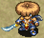
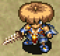
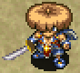
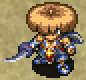
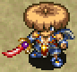
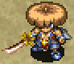
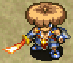
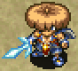
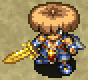
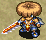

# Weapon List

<table class="itemListCentered">
  <tr>
    <th colspan="5">Item Book Order</th>
  </tr>
  <tr>
    <th>1</th>
    <th>2</th>
    <th>3</th>
    <th>4</th>
    <th>5</th>
  </tr>
  <tr>
    <td class="highlightLightblue"><a href="#palm-stick">Palm Stick</a></td>
    <td class="highlightLightblue"><a href="#shockuto">Shockuto</a></td>
    <td class="highlightLightblue"><a href="#sealing-keisaku">Sealing Keisaku</a></td>
    <td class="highlightLightblue"><a href="#burning-blade">Burning Blade</a></td>
    <td class="highlightLightblue"><a href="#bargain-blade">Bargain Blade</a></td>
  </tr>
  <tr>
    <td class="highlightLightblue"><a href="#dull-gold-edge">Dull Gold Edge</a></td>
    <td class="highlightLightblue"><a href="#copper-edge">Copper Edge</a></td>
    <td class="highlightLightblue"><a href="#myopic-masher">Myopic Masher</a></td>
    <td class="highlightLightblue"><a href="#dotanuki">Dotanuki</a></td>
    <td class="highlightLightblue"><a href="#sturdy-hammer">Sturdy Hammer</a></td>
  </tr>
  <tr>
    <td class="highlightLightblue"><a href="#breeze-blade">Breeze Blade</a></td>
    <td class="highlightLightblue"><a href="#blurry-stick">Blurry Stick</a></td>
    <td class="highlightLightblue"><a href="#katana">Katana</a></td>
    <td class="highlightLightblue"><a href="#lizard-lasher">Lizard Lasher</a></td>
    <td class="highlightLightblue"><a href="#wonder-pick">Wonder Pick</a></td>
  </tr>
  <tr>
    <td class="highlightLightblue"><a href="#nap-rattle">Nap Rattle</a></td>
    <td class="highlightLightblue"><a href="#water-cutter">Water Cutter</a></td>
    <td class="highlightLightblue"><a href="#baffle-axe">Baffle Axe</a></td>
    <td class="highlightLightblue"><a href="#meteor-edge">Meteor Edge</a></td>
    <td class="highlightLightblue"><a href="#true-knife">True Knife</a></td>
  </tr>
  <tr>
    <td class="highlightLightblue"><a href="#sky-splitter">Sky Splitter</a></td>
    <td class="highlightLightblue"><a href="#rusty-pick">Rusty Pick</a></td>
    <td class="highlightLightblue"><a href="#drain-slicer">Drain Slicer</a></td>
    <td class="highlightLightblue"><a href="#red-blade">Red Blade</a></td>
    <td class="highlightLightblue"><a href="#fuuma-sword">Fuuma Sword</a></td>
  </tr>
  <tr>
    <td class="highlightLightblue"><a href="#rusty-pickaxe">Rusty Pickaxe</a></td>
    <td class="highlightLightblue"><a href="#hatchet">Hatchet</a></td>
    <td class="highlightLightblue"><a href="#crescent-katana">Crescent Katana</a></td>
    <td class="highlightLightblue"><a href="#kabura's-blade">Kabura's Blade</a></td>
    <td class="highlightLightblue"><a href="#kaburagi">Kaburagi</a></td>
  </tr>
  <tr>
    <td class="highlightLightblue"><a href="#bright-blade">Bright Blade</a></td>
    <td class="highlightLightblue"><a href="#old-mallet">Old Mallet</a></td>
    <td class="highlightLightblue"><a href="#beast-fang">Beast Fang</a></td>
    <td class="highlightLightblue"><a href="#shoddy-dirk">Shoddy Dirk</a></td>
    <td class="highlightLightblue"><a href="#kamina's-sword">Kamina's Sword</a></td>
  </tr>
</table>

# Lv8 Summary

<table class="itemTable">
  <thead>
    <tr>
      <th>Lv1</th>
      <th>Lv8</th>
      <th>Atk</th>
      <th>Max</th>
      <th>Ct</th>
      <th>Rune</th>
      <th>Added</th>
      <th>Exp</th>
      <th>Resonance</th>
    </tr>
  </thead>
  <tbody>
    <tr>
      <td class="highlightLightblue"><a href="#palm-stick">Palm Stick</a></td>
      <td class="highlightYellow">Ogre's Club</td>
      <td>15</td>
      <td>99</td>
      <td>∞</td>
      <td>-</td>
      <td>L8: Charge</td>
      <td>25,250</td>
      <td><a href="/items/shields#palm-shield">Palm Shield</a> (Equip 2 bracelets)</td>
    </tr>
    <tr>
      <td class="highlightLightblue"><a href="#copper-edge">Copper Edge</a></td>
      <td class="highlightYellow">Bronze Dancer</td>
      <td>18</td>
      <td>99</td>
      <td>∞</td>
      <td>-</td>
      <td>L8: Rustproof</td>
      <td>31,570</td>
      <td><a href="/items/shields#copper-guard">Copper Guard</a> (Equip 2 bracelets)</td>
    </tr>
    <tr>
      <td class="highlightLightblue"><a href="#katana">Katana</a></td>
      <td class="highlightYellow">Storied Katana</td>
      <td>22</td>
      <td>99</td>
      <td>∞</td>
      <td>-</td>
      <td>L8: Rustproof</td>
      <td>49,300</td>
      <td><a href="/items/shields#iron-targe">Iron Targe</a> (Equip 2 bracelets)</td>
    </tr>
    <tr>
      <td class="highlightLightblue"><a href="#beast-fang">Beast Fang</a></td>
      <td class="highlightYellow">Lionheart</td>
      <td>20</td>
      <td>99</td>
      <td>∞</td>
      <td>-</td>
      <td>L5: Rustproof</td>
      <td>37,900</td>
      <td><a href="/items/shields#beast-shield">Beast Shield</a> (Equip 2 bracelets)</td>
    </tr>
    <tr>
      <td class="highlightLightblue"><a href="#dotanuki">Dotanuki</a></td>
      <td class="highlightYellow">Demon Dotanuki</td>
      <td>23</td>
      <td>99</td>
      <td>∞</td>
      <td>-</td>
      <td>L8: Atk+3</td>
      <td>44,250</td>
      <td><a href="/items/shields#clan-shield">Clan Shield</a> (Equip 2 bracelets)</td>
    </tr>
    <tr>
      <td class="highlightLightblue"><a href="#meteor-edge">Meteor Edge</a></td>
      <td class="highlightYellow">Starcutter</td>
      <td>25</td>
      <td>99</td>
      <td>∞</td>
      <td>-</td>
      <td>L4: HP+10 L8: Rustproof</td>
      <td>50,600</td>
      <td><a href="/items/shields#meteor-guard">Meteor Guard</a> (Equip 2 bracelets)</td>
    </tr>
    <tr>
      <td class="highlightLightblue"><a href="#red-blade">Red Blade</a></td>
      <td class="highlightYellow">Shugoseki Sword</td>
      <td>27</td>
      <td>99</td>
      <td>∞</td>
      <td>-</td>
      <td>L3: HP+10 L8: Flame Shot</td>
      <td>56,950</td>
      <td><a href="/items/shields#red-shield">Red Shield</a> (Equip 2 bracelets)</td>
    </tr>
    <tr>
      <td class="highlightLightblue"><a href="#kabura's-blade">Kabura's Blade</a></td>
      <td class="highlightYellow">S-Class Kabura</td>
      <td>30</td>
      <td>99</td>
      <td>∞</td>
      <td>-</td>
      <td>L8: Rustproof</td>
      <td>95,000</td>
      <td><a href="/items/shields#fuuma-shield">Fuuma Shield</a> (Attack damage +5)</td>
    </tr>
    <tr>
      <td class="highlightLightblue"><a href="#fuuma-sword">Fuuma Sword</a></td>
      <td class="highlightYellow">Hellfire Fuuma</td>
      <td>35</td>
      <td>99</td>
      <td>∞</td>
      <td>-</td>
      <td>-</td>
      <td>175,000</td>
      <td><a href="/items/shields#helix-shield">Helix Shield</a> (Attack damage +10)</td>
    </tr>
    <tr>
      <td class="highlightLightblue"><a href="#kaburagi">Kaburagi</a></td>
      <td class="highlightYellow">Kaburasutegi</td>
      <td>40</td>
      <td>99</td>
      <td>∞</td>
      <td>-</td>
      <td>-</td>
      <td>245,000</td>
      <td><a href="/items/shields#helix-shield">Helix Shield</a> (Attack damage +10)</td>
    </tr>
    <tr>
      <td class="highlightLightblue"><a href="#dull-gold-edge">Dull Gold Edge</a></td>
      <td class="highlightYellow">DX Gold Sword</td>
      <td>5</td>
      <td>99</td>
      <td>∞</td>
      <td>Rustproof</td>
      <td>L8: Paralyzing</td>
      <td>18,950</td>
      <td><a href="/items/shields#dull-gold-shield">Dull Gold Shield</a> (Max strength +3)</td>
    </tr>
    <tr>
      <td class="highlightLightblue"><a href="#bright-blade">Bright Blade</a></td>
      <td class="highlightYellow">Spark Sword</td>
      <td>9</td>
      <td>99</td>
      <td>∞</td>
      <td>Charge</td>
      <td>L5: HP+5 L8: Confusing</td>
      <td>25,300</td>
      <td>-</td>
    </tr>
    <tr>
      <td class="highlightLightblue"><a href="#rusty-pickaxe">Rusty Pickaxe</a></td>
      <td class="highlightYellow">Luxury Pickaxe</td>
      <td>10</td>
      <td>99</td>
      <td>∞</td>
      <td>Wall Dig</td>
      <td>L5: Blinding</td>
      <td>19,000</td>
      <td>-</td>
    </tr>
    <tr>
      <td class="highlightLightblue"><a href="#rusty-pick">Rusty Pick</a></td>
      <td class="highlightYellow">Luxury Pick</td>
      <td>12</td>
      <td>99</td>
      <td>∞</td>
      <td>2 Tile Dig</td>
      <td>L5: Blinding</td>
      <td>32,700</td>
      <td>-</td>
    </tr>
    <tr>
      <td class="highlightLightblue"><a href="#old-mallet">Old Mallet</a></td>
      <td class="highlightYellow">Master's Mallet</td>
      <td>12</td>
      <td>99</td>
      <td>∞</td>
      <td>Trap Breaker</td>
      <td>L5: Confusing</td>
      <td>31,700</td>
      <td>-</td>
    </tr>
    <tr>
      <td class="highlightLightblue"><a href="#sky-splitter">Sky Splitter</a></td>
      <td class="highlightYellow">Aerial Assault</td>
      <td>10</td>
      <td>99</td>
      <td>∞</td>
      <td>Anti-Floating</td>
      <td>L8: Rustproof</td>
      <td>63,500</td>
      <td>-</td>
    </tr>
    <tr>
      <td class="highlightLightblue"><a href="#water-cutter">Water Cutter</a></td>
      <td class="highlightYellow">Sea King Sword</td>
      <td>11</td>
      <td>99</td>
      <td>∞</td>
      <td>Anti-Aquatic</td>
      <td>L8: Rustproof</td>
      <td>38,100</td>
      <td>-</td>
    </tr>
    <tr>
      <td class="highlightLightblue"><a href="#myopic-masher">Myopic Masher</a></td>
      <td class="highlightYellow">Cyclopicide</td>
      <td>12</td>
      <td>99</td>
      <td>∞</td>
      <td>Anti-Cyclops</td>
      <td>L8: Rustproof</td>
      <td>31,750</td>
      <td><a href="/items/shields#spry-shield">Spry Shield</a> (Attack and defense +3)</td>
    </tr>
    <tr>
      <td class="highlightLightblue"><a href="#drain-slicer">Drain Slicer</a></td>
      <td class="highlightYellow">Drain Buster</td>
      <td>11</td>
      <td>99</td>
      <td>∞</td>
      <td>Anti-Drain</td>
      <td>L8: Rustproof</td>
      <td>38,100</td>
      <td>-</td>
    </tr>
    <tr>
      <td class="highlightLightblue"><a href="#item_name">Crescent Katana</a></td>
      <td class="highlightYellow">Lunar Sword</td>
      <td>13</td>
      <td>99</td>
      <td>∞</td>
      <td>Anti-Bomb</td>
      <td>L8: Rustproof</td>
      <td>50,800</td>
      <td><a href="/items/shields#blast-shield">Blast Shield</a> (Attack and defense +3)</td>
    </tr>
    <tr>
      <td class="highlightLightblue"><a href="#lizard-lasher">Lizard Lasher</a></td>
      <td class="highlightYellow">Dragon's Bane</td>
      <td>15</td>
      <td>99</td>
      <td>∞</td>
      <td>Anti-Dragon</td>
      <td>L8: Rustproof</td>
      <td>63,500</td>
      <td><a href="/items/shields#lizard-shield">Lizard Shield</a> (Attack and defense +3)</td>
    </tr>
    <tr>
      <td class="highlightLightblue"><a href="#nap-rattle">Nap Rattle</a></td>
      <td class="highlightYellow">Dream Rattle</td>
      <td>8</td>
      <td>99</td>
      <td>6</td>
      <td>Sedating</td>
      <td>L8: Rustproof</td>
      <td>50,700</td>
      <td><a href="/items/bracelets#alert-bracelet">Alert Bracelet</a> (Boost sleep chance)</td>
    </tr>
    <tr>
      <td class="highlightLightblue"><a href="#shockuto">Shockuto</a></td>
      <td class="highlightYellow">The Paralyzer</td>
      <td>9</td>
      <td>99</td>
      <td>6</td>
      <td>Paralyzing</td>
      <td>L8: Rustproof</td>
      <td>50,700</td>
      <td>-</td>
    </tr>
    <tr>
      <td class="highlightLightblue"><a href="#blurry-stick">Blurry Stick</a></td>
      <td class="highlightYellow">Blind Stick</td>
      <td>9</td>
      <td>99</td>
      <td>∞</td>
      <td>Blinding</td>
      <td>L8: Rustproof</td>
      <td>51,500</td>
      <td>-</td>
    </tr>
    <tr>
      <td class="highlightLightblue"><a href="#sealing-keisaku">Sealing Keisaku</a></td>
      <td class="highlightYellow">Divine Keisaku</td>
      <td>11</td>
      <td>99</td>
      <td>∞</td>
      <td>Sealing</td>
      <td>L8: Charge</td>
      <td>38,000</td>
      <td>-</td>
    </tr>
    <tr>
      <td class="highlightLightblue"><a href="#baffle-axe">Baffle Axe</a></td>
      <td class="highlightYellow">Chaos Axe</td>
      <td>12</td>
      <td>99</td>
      <td>∞</td>
      <td>Confusing</td>
      <td>L8: Rustproof</td>
      <td>38,000</td>
      <td><a href="/items/bracelets#calm-bracelet">Calm Bracelet</a> (Boost confusion chance)</td>
    </tr>
    <tr>
      <td class="highlightLightblue"><a href="#hatchet">Hatchet</a></td>
      <td class="highlightYellow">War God's Axe</td>
      <td>10</td>
      <td>99</td>
      <td>6</td>
      <td>Critical</td>
      <td>L5: HP+5 L8: Paralyzing</td>
      <td>38,000</td>
      <td>-</td>
    </tr>
    <tr>
      <td class="highlightLightblue"><a href="#shoddy-dirk">Shoddy Dirk</a></td>
      <td class="highlightYellow">Worthy Sword</td>
      <td>37</td>
      <td>99</td>
      <td>∞</td>
      <td>Degrade</td>
      <td>-</td>
      <td>103,000</td>
      <td><a href="/items/shields#shoddy-plank">Shoddy Plank</a> (Equipped items won't rust)</td>
    </tr>
    <tr>
      <td class="highlightLightblue"><a href="#breeze-blade">Breeze Blade</a></td>
      <td class="highlightYellow">Deathwind</td>
      <td>9</td>
      <td>99</td>
      <td>∞</td>
      <td>Tri-direction</td>
      <td>L8: HP+20</td>
      <td>50,800</td>
      <td>-</td>
    </tr>
    <tr>
      <td class="highlightLightblue"><a href="#burning-blade">Burning Blade</a></td>
      <td class="highlightYellow">Inferno Katana</td>
      <td>16</td>
      <td>99</td>
      <td>∞</td>
      <td>Flame Shot</td>
      <td>L5: HP+10 L8: Charge L8: Anti-Bomb</td>
      <td>63,000</td>
      <td><a href="/items/shields#swap-shield">Swap Shield</a> (Boost Flame Shot)</td>
    </tr>
    <tr>
      <td class="highlightLightblue"><a href="#wonder-pick">Wonder Pick</a></td>
      <td class="highlightYellow">Wonder Wrecker</td>
      <td>14</td>
      <td>99</td>
      <td>∞</td>
      <td>Infinite Dig</td>
      <td>L5: Blinding</td>
      <td>127,000</td>
      <td><a href="/items/shields#nirvana-board">Nirvana Board</a> (Max HP +30)</td>
    </tr>
    <tr>
      <td class="highlightLightblue"><a href="#sturdy-hammer">Sturdy Hammer</a></td>
      <td class="highlightYellow">Champion Hammer</td>
      <td>13</td>
      <td>99</td>
      <td>∞</td>
      <td>Trap Destroyer</td>
      <td>L5: Confusing</td>
      <td>127,000</td>
      <td>-</td>
    </tr>
    <tr>
      <td class="highlightLightblue"><a href="#true-knife">True Knife</a></td>
      <td class="highlightYellow">Homing Blade</td>
      <td>5</td>
      <td>99</td>
      <td>∞</td>
      <td>Accurate</td>
      <td>L8: Critical</td>
      <td>127,000</td>
      <td><a href="/items/bracelets#bind-bracelet">Bind Bracelet</a> (Thrown items always hit)</td>
    </tr>
    <tr>
      <td class="highlightLightblue"><a href="#bargain-blade">Bargain Blade</a></td>
      <td class="highlightYellow">Clearance Sword</td>
      <td>16</td>
      <td>99</td>
      <td>∞</td>
      <td>Enriching</td>
      <td>L3: HP+5 L6: HP+10 L8: HP+15</td>
      <td>127,000</td>
      <td><a href="/items/shields#item_name">item_name</a> (resonance_effect)</td>
    </tr>
    <tr>
      <td class="highlightLightblue"><a href="#kamina's-sword">Kamina's Sword</a></td>
      <td class="highlightYellow">Divine Kamina</td>
      <td>40</td>
      <td>99</td>
      <td>∞</td>
      <td>Attack Down</td>
      <td>L8: Rustproof</td>
      <td>245,000</td>
      <td><a href="/shiren5/item/shields#jaguar's-shield">Jaguar's Shield</a> (Equip 2 bracelets) <a href="/shiren5/item/shields#jaguar's-shield">Jaguar's Shield</a>+ <a href="/shiren5/item/bracelets#bulldog-bracelet">Bulldog Bracelet</a> (Attack damage +20) <a href="/shiren5/item/shields#jaguar's-shield">Jaguar's Shield</a>+ <a href="/shiren5/item/bracelets#bulldog-bracelet">Bulldog Bracelet</a>+ <a href="/shiren5/item/projectiles#hemoji-arrow">Hemoji Arrow</a> (No fullness depletion)</td>
    </tr>
  </tbody>
</table>

# Details

#### Growth Experience

The listed experience points per level is not an accumilated total. 
Extra exp from defeating a monster will not carry forward when a weapon levels up. 
(Example: 100 exp until level up, defeat an Archdragon for 400 exp, 300 exp is lost)

### Palm Stick

<table class="itemDetailsTable">
  <tr>
    <th>Image</th>
    <th>Lv1 Description</th>
  </tr>
  <tr>
    <td></td>
    <td>item_book_description</td>
  </tr>
</table>

 

<table class="itemDetailsTable">
  <tbody>
    <tr>
      <th>Lv</th>
      <th>Name</th>
      <th>Atk</th>
      <th>Max</th>
      <th>Ct</th>
      <th>Exp</th>
      <th>Buy</th>
      <th>Sell</th>
      <th>Rune</th>
      <th>Info</th>
    </tr>
    <tr>
      <td>1</td>
      <td>Palm Stick</td>
      <td>2</td>
      <td>10</td>
      <td>5</td>
      <td>-</td>
      <td>300</td>
      <td>105</td>
      <td rowspan="7">-</td>
      <td rowspan="8">Resonance: <a href="/items/shields#plain-targe">Palm Shield</a> (Equip 2 bracelets)</td>
    </tr>
    <tr>
      <td>2</td>
      <td>Good Palm Stick</td>
      <td>4</td>
      <td>20</td>
      <td>6</td>
      <td>50</td>
      <td>400</td>
      <td>140</td>
    </tr>
    <tr>
      <td>3</td>
      <td>Hard Palm Stick</td>
      <td>6</td>
      <td>30</td>
      <td>6</td>
      <td>400</td>
      <td>500</td>
      <td>175</td>
    </tr>
    <tr>
      <td>4</td>
      <td>Nice Palm Stick</td>
      <td>7</td>
      <td>40</td>
      <td>7</td>
      <td>800</td>
      <td>600</td>
      <td>210</td>
    </tr>
    <tr>
      <td>5</td>
      <td>Great Club</td>
      <td>9</td>
      <td>50</td>
      <td>7</td>
      <td>1600</td>
      <td>700</td>
      <td>245</td>
    </tr>
    <tr>
      <td>6</td>
      <td>Big Club</td>
      <td>10</td>
      <td>60</td>
      <td>8</td>
      <td>3200</td>
      <td>800</td>
      <td>280</td>
    </tr>
    <tr>
      <td>7</td>
      <td>Vicious Club</td>
      <td>11</td>
      <td>70</td>
      <td>8</td>
      <td>6400</td>
      <td>900</td>
      <td>315</td>
    </tr>
    <tr>
      <td>8</td>
      <td>Ogre's Club</td>
      <td>15</td>
      <td>99</td>
      <td>∞</td>
      <td>12800</td>
      <td>1200</td>
      <td>420</td>
      <td>Charge</td>
    </tr>
  </tbody>
</table>

### Copper Edge

<table class="itemDetailsTable">
  <tr>
    <th>Image</th>
    <th>Lv1 Description</th>
  </tr>
  <tr>
    <td></td>
    <td>item_book_description</td>
  </tr>
</table>

 

<table class="itemDetailsTable">
  <tbody>
    <tr>
      <th>Lv</th>
      <th>Name</th>
      <th>Atk</th>
      <th>Max</th>
      <th>Ct</th>
      <th>Exp</th>
      <th>Buy</th>
      <th>Sell</th>
      <th>Rune</th>
      <th>Info</th>
    </tr>
    <tr>
      <td>1</td>
      <td>Copper Edge</td>
      <td>4</td>
      <td>10</td>
      <td>4</td>
      <td>-</td>
      <td>700</td>
      <td>245</td>
      <td rowspan="7">-</td>
      <td rowspan="8">Resonance: <a href="/items/shields#copper-guard">Copper Guard</a> (Equip 2 bracelets)</td>
    </tr>
    <tr>
      <td>2</td>
      <td>Copper Blade</td>
      <td>6</td>
      <td>20</td>
      <td>5</td>
      <td>70</td>
      <td>800</td>
      <td>280</td>
    </tr>
    <tr>
      <td>3</td>
      <td>Copper Sword</td>
      <td>8</td>
      <td>30</td>
      <td>5</td>
      <td>500</td>
      <td>900</td>
      <td>315</td>
    </tr>
    <tr>
      <td>4</td>
      <td>Copper Cutlass</td>
      <td>10</td>
      <td>40</td>
      <td>6</td>
      <td>1000</td>
      <td>1000</td>
      <td>350</td>
    </tr>
    <tr>
      <td>5</td>
      <td>Bronze Blade</td>
      <td>12</td>
      <td>50</td>
      <td>6</td>
      <td>2000</td>
      <td>1100</td>
      <td>385</td>
    </tr>
    <tr>
      <td>6</td>
      <td>Bronze Sword</td>
      <td>14</td>
      <td>60</td>
      <td>7</td>
      <td>4000</td>
      <td>1200</td>
      <td>420</td>
    </tr>
    <tr>
      <td>7</td>
      <td>Bronze Gladius</td>
      <td>16</td>
      <td>70</td>
      <td>7</td>
      <td>8000</td>
      <td>1300</td>
      <td>455</td>
    </tr>
    <tr>
      <td>8</td>
      <td>Bronze Dancer</td>
      <td>18</td>
      <td>99</td>
      <td>∞</td>
      <td>16000</td>
      <td>1600</td>
      <td>560</td>
      <td>Rustproof</td>
    </tr>
  </tbody>
</table>

### Katana

<table class="itemDetailsTable">
  <tr>
    <th>Image</th>
    <th>Lv1 Description</th>
  </tr>
  <tr>
    <td></td>
    <td>item_book_description</td>
  </tr>
</table>

 

<table class="itemDetailsTable">
  <tbody>
    <tr>
      <th>Lv</th>
      <th>Name</th>
      <th>Atk</th>
      <th>Max</th>
      <th>Ct</th>
      <th>Exp</th>
      <th>Buy</th>
      <th>Sell</th>
      <th>Rune</th>
      <th>Info</th>
    </tr>
    <tr>
      <td>1</td>
      <td>Katana</td>
      <td>6</td>
      <td>10</td>
      <td>4</td>
      <td>-</td>
      <td>1100</td>
      <td>385</td>
      <td rowspan="7">-</td>
      <td rowspan="8">Resonance: <a href="/items/shields#iron-targe">Iron Targe</a> (Equip 2 bracelets)</td>
    </tr>
    <tr>
      <td>2</td>
      <td>Good Katana</td>
      <td>7</td>
      <td>15</td>
      <td>4</td>
      <td>300</td>
      <td>1200</td>
      <td>420</td>
    </tr>
    <tr>
      <td>3</td>
      <td>Fine Katana</td>
      <td>8</td>
      <td>20</td>
      <td>4</td>
      <td>1000</td>
      <td>1300</td>
      <td>455</td>
    </tr>
    <tr>
      <td>4</td>
      <td>Keen Katana</td>
      <td>9</td>
      <td>25</td>
      <td>4</td>
      <td>2000</td>
      <td>1400</td>
      <td>490</td>
    </tr>
    <tr>
      <td>5</td>
      <td>Sharp Katana</td>
      <td>10</td>
      <td>30</td>
      <td>4</td>
      <td>4000</td>
      <td>1500</td>
      <td>525</td>
    </tr>
    <tr>
      <td>6</td>
      <td>Majestic Katana</td>
      <td>11</td>
      <td>35</td>
      <td>4</td>
      <td>8000</td>
      <td>1600</td>
      <td>560</td>
    </tr>
    <tr>
      <td>7</td>
      <td>Famous Katana</td>
      <td>12</td>
      <td>40</td>
      <td>4</td>
      <td>14000</td>
      <td>1700</td>
      <td>595</td>
    </tr>
    <tr>
      <td>8</td>
      <td>Storied Katana</td>
      <td>22</td>
      <td>99</td>
      <td>∞</td>
      <td>20000</td>
      <td>2300</td>
      <td>805</td>
      <td>Rustproof</td>
    </tr>
  </tbody>
</table>

### Beast Fang

<table class="itemDetailsTable">
  <tr>
    <th>Image</th>
    <th>Lv1 Description</th>
  </tr>
  <tr>
    <td></td>
    <td>item_book_description</td>
  </tr>
</table>

 

<table class="itemDetailsTable">
  <tbody>
    <tr>
      <th>Lv</th>
      <th>Name</th>
      <th>Atk</th>
      <th>Max</th>
      <th>Ct</th>
      <th>Exp</th>
      <th>Buy</th>
      <th>Sell</th>
      <th>Rune</th>
      <th>Info</th>
    </tr>
    <tr>
      <td>1</td>
      <td>Beast Fang</td>
      <td>8</td>
      <td>10</td>
      <td>3</td>
      <td>-</td>
      <td>1600</td>
      <td>560</td>
      <td rowspan="4">-</td>
      <td rowspan="8">Resonance: <a href="/items/shields#beast-shield">Beast Shield</a> (Equip 2 bracelets)</td>
    </tr>
    <tr>
      <td>2</td>
      <td>Big Fang</td>
      <td>10</td>
      <td>20</td>
      <td>5</td>
      <td>100</td>
      <td>1700</td>
      <td>595</td>
    </tr>
    <tr>
      <td>3</td>
      <td>Sharp Fang</td>
      <td>11</td>
      <td>30</td>
      <td>5</td>
      <td>600</td>
      <td>1800</td>
      <td>630</td>
    </tr>
    <tr>
      <td>4</td>
      <td>Fang Blade</td>
      <td>12</td>
      <td>40</td>
      <td>5</td>
      <td>1200</td>
      <td>1900</td>
      <td>665</td>
    </tr>
    <tr>
      <td>5</td>
      <td>Fang Sword</td>
      <td>15</td>
      <td>50</td>
      <td>7</td>
      <td>2400</td>
      <td>2000</td>
      <td>700</td>
      <td rowspan="4">Rustproof</td>
    </tr>
    <tr>
      <td>6</td>
      <td>Lion Blade</td>
      <td>16</td>
      <td>60</td>
      <td>7</td>
      <td>4800</td>
      <td>2100</td>
      <td>735</td>
    </tr>
    <tr>
      <td>7</td>
      <td>Lion Sword</td>
      <td>17</td>
      <td>70</td>
      <td>7</td>
      <td>9600</td>
      <td>2200</td>
      <td>770</td>
    </tr>
    <tr>
      <td>8</td>
      <td>Lionheart</td>
      <td>20</td>
      <td>99</td>
      <td>∞</td>
      <td>19200</td>
      <td>2800</td>
      <td>980</td>
    </tr>
  </tbody>
</table>

### Dotanuki

<table class="itemDetailsTable">
  <tr>
    <th>Image</th>
    <th>Lv1 Description</th>
  </tr>
  <tr>
    <td></td>
    <td>item_book_description</td>
  </tr>
</table>

 

<table class="itemDetailsTable">
  <tbody>
    <tr>
      <th>Lv</th>
      <th>Name</th>
      <th>Atk</th>
      <th>Max</th>
      <th>Ct</th>
      <th>Exp</th>
      <th>Buy</th>
      <th>Sell</th>
      <th>Rune</th>
      <th>Info</th>
    </tr>
    <tr>
      <td>1</td>
      <td>Dotanuki</td>
      <td>10</td>
      <td>10</td>
      <td>5</td>
      <td>-</td>
      <td>2200</td>
      <td>770</td>
      <td rowspan="7">-</td>
      <td rowspan="8">Resonance: <a href="/items/shields#clan-shield">Clan Shield</a> (Equip 2 bracelets)</td>
    </tr>
    <tr>
      <td>2</td>
      <td>Plain Dotanuki</td>
      <td>12</td>
      <td>20</td>
      <td>6</td>
      <td>150</td>
      <td>2300</td>
      <td>805</td>
    </tr>
    <tr>
      <td>3</td>
      <td>Honed Dotanuki</td>
      <td>14</td>
      <td>30</td>
      <td>6</td>
      <td>700</td>
      <td>2400</td>
      <td>840</td>
    </tr>
    <tr>
      <td>4</td>
      <td>Ferrite Dotanuki</td>
      <td>16</td>
      <td>40</td>
      <td>7</td>
      <td>1400</td>
      <td>2500</td>
      <td>875</td>
    </tr>
    <tr>
      <td>5</td>
      <td>Rare Dotanuki</td>
      <td>17</td>
      <td>50</td>
      <td>7</td>
      <td>2800</td>
      <td>2600</td>
      <td>910</td>
    </tr>
    <tr>
      <td>6</td>
      <td>Great Dotanuki</td>
      <td>18</td>
      <td>60</td>
      <td>8</td>
      <td>5600</td>
      <td>2700</td>
      <td>945</td>
    </tr>
    <tr>
      <td>7</td>
      <td>Famous Dotanuki</td>
      <td>19</td>
      <td>70</td>
      <td>8</td>
      <td>11200</td>
      <td>2800</td>
      <td>980</td>
    </tr>
    <tr>
      <td>8</td>
      <td>Demon Dotanuki</td>
      <td>23</td>
      <td>99</td>
      <td>∞</td>
      <td>22400</td>
      <td>3300</td>
      <td>1155</td>
      <td>Atk+3</td>
    </tr>
  </tbody>
</table>

### Meteor Edge

<table class="itemDetailsTable">
  <tr>
    <th>Image</th>
    <th>Lv1 Description</th>
  </tr>
  <tr>
    <td></td>
    <td>item_book_description</td>
  </tr>
</table>

 

<table class="itemDetailsTable">
  <tbody>
    <tr>
      <th>Lv</th>
      <th>Name</th>
      <th>Atk</th>
      <th>Max</th>
      <th>Ct</th>
      <th>Exp</th>
      <th>Buy</th>
      <th>Sell</th>
      <th>Rune</th>
      <th>Info</th>
    </tr>
    <tr>
      <td>1</td>
      <td>Meteor Edge</td>
      <td>12</td>
      <td>10</td>
      <td>4</td>
      <td>-</td>
      <td>3000</td>
      <td>1050</td>
      <td rowspan="3">-</td>
      <td rowspan="8">Resonance: <a href="/items/shields#meteor-guard">Meteor Guard</a> (Equip 2 bracelets)</td>
    </tr>
    <tr>
      <td>2</td>
      <td>Meteor Blade</td>
      <td>16</td>
      <td>20</td>
      <td>6</td>
      <td>200</td>
      <td>3100</td>
      <td>1085</td>
    </tr>
    <tr>
      <td>3</td>
      <td>Meteor Sword</td>
      <td>16</td>
      <td>30</td>
      <td>6</td>
      <td>800</td>
      <td>3200</td>
      <td>1120</td>
    </tr>
    <tr>
      <td>4</td>
      <td>Asteroid Blade</td>
      <td>16</td>
      <td>40</td>
      <td>6</td>
      <td>1600</td>
      <td>3300</td>
      <td>1155</td>
      <td rowspan="4">HP+10</td>
    </tr>
    <tr>
      <td>5</td>
      <td>Asteroid Sword</td>
      <td>20</td>
      <td>50</td>
      <td>8</td>
      <td>3200</td>
      <td>3400</td>
      <td>1190</td>
    </tr>
    <tr>
      <td>6</td>
      <td>Comet Blade</td>
      <td>20</td>
      <td>60</td>
      <td>8</td>
      <td>6400</td>
      <td>3500</td>
      <td>1225</td>
    </tr>
    <tr>
      <td>7</td>
      <td>Comet Sword</td>
      <td>20</td>
      <td>70</td>
      <td>8</td>
      <td>12800</td>
      <td>3600</td>
      <td>1260</td>
    </tr>
    <tr>
      <td>8</td>
      <td>Starcutter</td>
      <td>25</td>
      <td>99</td>
      <td>∞</td>
      <td>25600</td>
      <td>4300</td>
      <td>1505</td>
      <td>HP+10 Rustproof</td>
    </tr>
  </tbody>
</table>

### Red Blade

<table class="itemDetailsTable">
  <tr>
    <th>Image</th>
    <th>Lv1 Description</th>
  </tr>
  <tr>
    <td></td>
    <td>item_book_description</td>
  </tr>
</table>

 

<table class="itemDetailsTable">
  <tbody>
    <tr>
      <th>Lv</th>
      <th>Name</th>
      <th>Atk</th>
      <th>Max</th>
      <th>Ct</th>
      <th>Exp</th>
      <th>Buy</th>
      <th>Sell</th>
      <th>Rune</th>
      <th>Info</th>
    </tr>
    <tr>
      <td>1</td>
      <td>Red Blade</td>
      <td>14</td>
      <td>10</td>
      <td>3</td>
      <td>-</td>
      <td>4200</td>
      <td>1470</td>
      <td rowspan="2">-</td>
      <td rowspan="8">Resonance: <a href="/items/shields#red-shield">Red Shield</a> (Equip 2 bracelets)</td>
    </tr>
    <tr>
      <td>2</td>
      <td>Fine Red Blade</td>
      <td>15</td>
      <td>20</td>
      <td>4</td>
      <td>250</td>
      <td>4300</td>
      <td>1505</td>
    </tr>
    <tr>
      <td>3</td>
      <td>Red Dagger</td>
      <td>16</td>
      <td>30</td>
      <td>5</td>
      <td>900</td>
      <td>4400</td>
      <td>1540</td>
      <td rowspan="5">HP+10</td>
    </tr>
    <tr>
      <td>4</td>
      <td>Red Katana</td>
      <td>20</td>
      <td>40</td>
      <td>6</td>
      <td>1800</td>
      <td>4500</td>
      <td>1575</td>
    </tr>
    <tr>
      <td>5</td>
      <td>Red Sword</td>
      <td>21</td>
      <td>50</td>
      <td>7</td>
      <td>3600</td>
      <td>4600</td>
      <td>1610</td>
    </tr>
    <tr>
      <td>6</td>
      <td>Crimson Sword</td>
      <td>22</td>
      <td>60</td>
      <td>8</td>
      <td>7200</td>
      <td>4700</td>
      <td>1645</td>
    </tr>
    <tr>
      <td>7</td>
      <td>Scarlet Sword</td>
      <td>23</td>
      <td>70</td>
      <td>9</td>
      <td>14400</td>
      <td>4800</td>
      <td>1680</td>
    </tr>
    <tr>
      <td>8</td>
      <td>Shugoseki Sword</td>
      <td>27</td>
      <td>99</td>
      <td>∞</td>
      <td>28800</td>
      <td>6000</td>
      <td>2100</td>
      <td>HP+10 Flame Shot</td>
    </tr>
  </tbody>
</table>

### Kabura's Blade

<table class="itemDetailsTable">
  <tr>
    <th>Image</th>
    <th>Lv1 Description</th>
  </tr>
  <tr>
    <td></td>
    <td>item_book_description</td>
  </tr>
</table>

 

<table class="itemDetailsTable">
  <tbody>
    <tr>
      <th>Lv</th>
      <th>Name</th>
      <th>Atk</th>
      <th>Max</th>
      <th>Ct</th>
      <th>Exp</th>
      <th>Buy</th>
      <th>Sell</th>
      <th>Rune</th>
      <th>Info</th>
    </tr>
    <tr>
      <td>1</td>
      <td>Kabura's Blade</td>
      <td>16</td>
      <td>10</td>
      <td>2</td>
      <td>-</td>
      <td>7400</td>
      <td>2590</td>
      <td rowspan="7">-</td>
      <td rowspan="8">Resonance: <a href="/items/shields#fuuma-shield">Fuuma Shield</a> (Attack damage +5)</td>
    </tr>
    <tr>
      <td>2</td>
      <td>C-Class Kabura</td>
      <td>18</td>
      <td>20</td>
      <td>3</td>
      <td>500</td>
      <td>7500</td>
      <td>2625</td>
    </tr>
    <tr>
      <td>3</td>
      <td>B-Class Kabura</td>
      <td>20</td>
      <td>30</td>
      <td>4</td>
      <td>1500</td>
      <td>7600</td>
      <td>2660</td>
    </tr>
    <tr>
      <td>4</td>
      <td>Fine Kabura</td>
      <td>22</td>
      <td>40</td>
      <td>5</td>
      <td>3000</td>
      <td>7700</td>
      <td>2695</td>
    </tr>
    <tr>
      <td>5</td>
      <td>A-Class Kabura</td>
      <td>24</td>
      <td>50</td>
      <td>6</td>
      <td>6000</td>
      <td>7800</td>
      <td>2730</td>
    </tr>
    <tr>
      <td>6</td>
      <td>Kabura's Choice</td>
      <td>26</td>
      <td>60</td>
      <td>8</td>
      <td>12000</td>
      <td>7900</td>
      <td>2765</td>
    </tr>
    <tr>
      <td>7</td>
      <td>Kabura's Finest</td>
      <td>28</td>
      <td>70</td>
      <td>10</td>
      <td>24000</td>
      <td>8000</td>
      <td>2800</td>
    </tr>
    <tr>
      <td>8</td>
      <td>S-Class Kabura</td>
      <td>30</td>
      <td>99</td>
      <td>∞</td>
      <td>48000</td>
      <td>10000</td>
      <td>3500</td>
      <td>Rustproof</td>
    </tr>
  </tbody>
</table>

### Fuuma Sword

<table class="itemDetailsTable">
  <tr>
    <th>Image</th>
    <th>Lv1 Description</th>
  </tr>
  <tr>
    <td></td>
    <td>item_book_description</td>
  </tr>
</table>

 

<table class="itemDetailsTable">
  <tbody>
    <tr>
      <th>Lv</th>
      <th>Name</th>
      <th>Atk</th>
      <th>Max</th>
      <th>Ct</th>
      <th>Exp</th>
      <th>Buy</th>
      <th>Sell</th>
      <th>Rune</th>
      <th>Info</th>
    </tr>
    <tr>
      <td>1</td>
      <td>Fuuma Sword</td>
      <td>20</td>
      <td>10</td>
      <td>∞</td>
      <td>-</td>
      <td>10000</td>
      <td>3500</td>
      <td rowspan="8">-</td>
      <td rowspan="8">Obtaining: Upgrade a Storied Katana+99 at the Monkey Village Blacksmith.  Resonance: <a href="/items/shields#helix-shield">Helix Shield</a> (Attack damage +10)</td>
    </tr>
    <tr>
      <td>2</td>
      <td>C-Class Fuuma</td>
      <td>21</td>
      <td>20</td>
      <td>∞</td>
      <td>10000</td>
      <td>11000</td>
      <td>3850</td>
    </tr>
    <tr>
      <td>3</td>
      <td>B-Class Fuuma</td>
      <td>22</td>
      <td>30</td>
      <td>∞</td>
      <td>15000</td>
      <td>12000</td>
      <td>4200</td>
    </tr>
    <tr>
      <td>4</td>
      <td>A-Class Fuuma</td>
      <td>23</td>
      <td>40</td>
      <td>∞</td>
      <td>20000</td>
      <td>13000</td>
      <td>4550</td>
    </tr>
    <tr>
      <td>5</td>
      <td>Fuuma Katana</td>
      <td>24</td>
      <td>50</td>
      <td>∞</td>
      <td>25000</td>
      <td>14000</td>
      <td>4900</td>
    </tr>
    <tr>
      <td>6</td>
      <td>Grand Fuuma</td>
      <td>25</td>
      <td>60</td>
      <td>∞</td>
      <td>30000</td>
      <td>15000</td>
      <td>5250</td>
    </tr>
    <tr>
      <td>7</td>
      <td>Fiery Fuuma</td>
      <td>26</td>
      <td>70</td>
      <td>∞</td>
      <td>35000</td>
      <td>16000</td>
      <td>5600</td>
    </tr>
    <tr>
      <td>8</td>
      <td>Hellfire Fuuma</td>
      <td>35</td>
      <td>99</td>
      <td>∞</td>
      <td>40000</td>
      <td>20000</td>
      <td>7000</td>
    </tr>
  </tbody>
</table>

### Kaburagi

<table class="itemDetailsTable">
  <tr>
    <th>Image</th>
    <th>Lv1 Description</th>
  </tr>
  <tr>
    <td></td>
    <td>item_book_description</td>
  </tr>
</table>

 

<table class="itemDetailsTable">
  <tbody>
    <tr>
      <th>Lv</th>
      <th>Name</th>
      <th>Atk</th>
      <th>Max</th>
      <th>Ct</th>
      <th>Exp</th>
      <th>Buy</th>
      <th>Sell</th>
      <th>Rune</th>
      <th>Info</th>
    </tr>
    <tr>
      <td>1</td>
      <td>Kaburagi</td>
      <td>25</td>
      <td>10</td>
      <td>∞</td>
      <td>-</td>
      <td>15000</td>
      <td>5250</td>
      <td rowspan="8">-</td>
      <td rowspan="8">Obtaining: Deposit a S-Class Kabura+99 to the Smith 2 <a href="/system/npcs">NPC</a> after having placed a number of orders in the past.  Resonance: <a href="/items/shields#helix-shield">Helix Shield</a> (Attack damage +10)</td>
    </tr>
    <tr>
      <td>2</td>
      <td>Good Kaburagi</td>
      <td>25</td>
      <td>20</td>
      <td>∞</td>
      <td>20000</td>
      <td>16000</td>
      <td>5600</td>
    </tr>
    <tr>
      <td>3</td>
      <td>Fine Kaburagi</td>
      <td>25</td>
      <td>30</td>
      <td>∞</td>
      <td>25000</td>
      <td>17000</td>
      <td>5950</td>
    </tr>
    <tr>
      <td>4</td>
      <td>Finest Kaburagi</td>
      <td>25</td>
      <td>40</td>
      <td>∞</td>
      <td>30000</td>
      <td>18000</td>
      <td>6300</td>
    </tr>
    <tr>
      <td>5</td>
      <td>Reborn Kaburagi</td>
      <td>25</td>
      <td>50</td>
      <td>∞</td>
      <td>35000</td>
      <td>19000</td>
      <td>6650</td>
    </tr>
    <tr>
      <td>6</td>
      <td>Rare Kaburagi</td>
      <td>25</td>
      <td>60</td>
      <td>∞</td>
      <td>40000</td>
      <td>20000</td>
      <td>7000</td>
    </tr>
    <tr>
      <td>7</td>
      <td>Magical Kaburagi</td>
      <td>25</td>
      <td>70</td>
      <td>∞</td>
      <td>45000</td>
      <td>21000</td>
      <td>7350</td>
    </tr>
    <tr>
      <td>8</td>
      <td>Kaburasutegi</td>
      <td>40</td>
      <td>99</td>
      <td>∞</td>
      <td>50000</td>
      <td>25000</td>
      <td>8750</td>
    </tr>
  </tbody>
</table>

### Dull Gold Edge

<table class="itemDetailsTable">
  <tr>
    <th>Image</th>
    <th>Lv1 Description</th>
  </tr>
  <tr>
    <td></td>
    <td>item_book_description</td>
  </tr>
</table>

 

<table class="itemDetailsTable">
  <tbody>
    <tr>
      <th>Lv</th>
      <th>Name</th>
      <th>Atk</th>
      <th>Max</th>
      <th>Ct</th>
      <th>Exp</th>
      <th>Buy</th>
      <th>Sell</th>
      <th>Rune</th>
      <th>Info</th>
    </tr>
    <tr>
      <td>1</td>
      <td>Dull Gold Edge</td>
      <td>2</td>
      <td>25</td>
      <td>6</td>
      <td>-</td>
      <td>1000</td>
      <td>350</td>
      <td rowspan="7">(Rustproof)</td>
      <td rowspan="8">This weapon won't rust.  Resonance: <a href="/items/shields#dull-gold-shield">Dull Gold Shield</a> (Max strength +3)</td>
    </tr>
    <tr>
      <td>2</td>
      <td>Plain Gold Edge</td>
      <td>2</td>
      <td>40</td>
      <td>7</td>
      <td>50</td>
      <td>1200</td>
      <td>420</td>
    </tr>
    <tr>
      <td>3</td>
      <td>Shiny Gold Edge</td>
      <td>2</td>
      <td>50</td>
      <td>8</td>
      <td>300</td>
      <td>1400</td>
      <td>490</td>
    </tr>
    <tr>
      <td>4</td>
      <td>Fine Gold Sword</td>
      <td>3</td>
      <td>60</td>
      <td>9</td>
      <td>600</td>
      <td>1600</td>
      <td>560</td>
    </tr>
    <tr>
      <td>5</td>
      <td>14K Gold Sword</td>
      <td>3</td>
      <td>70</td>
      <td>10</td>
      <td>1200</td>
      <td>1800</td>
      <td>630</td>
    </tr>
    <tr>
      <td>6</td>
      <td>18K Gold Sword</td>
      <td>4</td>
      <td>80</td>
      <td>11</td>
      <td>2400</td>
      <td>6000</td>
      <td>2100</td>
    </tr>
    <tr>
      <td>7</td>
      <td>24K Gold Sword</td>
      <td>4</td>
      <td>90</td>
      <td>12</td>
      <td>4800</td>
      <td>7000</td>
      <td>2450</td>
    </tr>
    <tr>
      <td>8</td>
      <td>DX Gold Sword</td>
      <td>5</td>
      <td>99</td>
      <td>∞</td>
      <td>9600</td>
      <td>8000</td>
      <td>2800</td>
      <td>(Rustproof) Paralyzing</td>
    </tr>
  </tbody>
</table>

### Bright Blade

<table class="itemDetailsTable">
  <tr>
    <th>Image</th>
    <th>Lv1 Description</th>
  </tr>
  <tr>
    <td></td>
    <td>item_book_description</td>
  </tr>
</table>

 

<table class="itemDetailsTable">
  <tbody>
    <tr>
      <th>Lv</th>
      <th>Name</th>
      <th>Atk</th>
      <th>Max</th>
      <th>Ct</th>
      <th>Exp</th>
      <th>Buy</th>
      <th>Sell</th>
      <th>Rune</th>
      <th>Info</th>
    </tr>
    <tr>
      <td>1</td>
      <td>Bright Blade</td>
      <td>3</td>
      <td>25</td>
      <td>5</td>
      <td>-</td>
      <td>3000</td>
      <td>1050</td>
      <td rowspan="4">(Charge)</td>
      <td rowspan="8">Deal a critical hit after 2 missed attacks.</td>
    </tr>
    <tr>
      <td>2</td>
      <td>Bright Spatha</td>
      <td>4</td>
      <td>40</td>
      <td>6</td>
      <td>100</td>
      <td>3100</td>
      <td>1085</td>
    </tr>
    <tr>
      <td>3</td>
      <td>Bright Sword</td>
      <td>5</td>
      <td>50</td>
      <td>7</td>
      <td>400</td>
      <td>3200</td>
      <td>1120</td>
    </tr>
    <tr>
      <td>4</td>
      <td>Flash Blade</td>
      <td>6</td>
      <td>60</td>
      <td>8</td>
      <td>800</td>
      <td>3300</td>
      <td>1155</td>
    </tr>
    <tr>
      <td>5</td>
      <td>Flash Sword</td>
      <td>7</td>
      <td>70</td>
      <td>9</td>
      <td>1600</td>
      <td>3400</td>
      <td>1190</td>
      <td rowspan="3">(Charge) HP+5</td>
    </tr>
    <tr>
      <td>6</td>
      <td>Spark Blade</td>
      <td>8</td>
      <td>80</td>
      <td>10</td>
      <td>3200</td>
      <td>3500</td>
      <td>1225</td>
    </tr>
    <tr>
      <td>7</td>
      <td>Spark Saber</td>
      <td>8</td>
      <td>90</td>
      <td>11</td>
      <td>6400</td>
      <td>3600</td>
      <td>1260</td>
    </tr>
    <tr>
      <td>8</td>
      <td>Spark Sword</td>
      <td>9</td>
      <td>99</td>
      <td>∞</td>
      <td>12800</td>
      <td>4000</td>
      <td>1575</td>
      <td>(Charge) HP+5 Confusing</td>
    </tr>
  </tbody>
</table>

### Rusty Pickaxe

<table class="itemDetailsTable">
  <tr>
    <th>Image</th>
    <th>Lv1 Description</th>
  </tr>
  <tr>
    <td></td>
    <td>item_book_description</td>
  </tr>
</table>

 

<table class="itemDetailsTable">
  <tbody>
    <tr>
      <th>Lv</th>
      <th>Name</th>
      <th>Atk</th>
      <th>Max</th>
      <th>Ct</th>
      <th>Exp</th>
      <th>Buy</th>
      <th>Sell</th>
      <th>Rune</th>
      <th>Info</th>
    </tr>
    <tr>
      <td>1</td>
      <td>Rusty Pickaxe</td>
      <td>3</td>
      <td>25</td>
      <td>8</td>
      <td>-</td>
      <td>1000</td>
      <td>350</td>
      <td rowspan="4">(Wall Dig)</td>
      <td rowspan="8">Can dig holes in walls, but the weapon might break while digging.</td>
    </tr>
    <tr>
      <td>2</td>
      <td>Plain Pickaxe</td>
      <td>4</td>
      <td>40</td>
      <td>9</td>
      <td>100</td>
      <td>1200</td>
      <td>420</td>
    </tr>
    <tr>
      <td>3</td>
      <td>Nice Pickaxe</td>
      <td>5</td>
      <td>50</td>
      <td>10</td>
      <td>300</td>
      <td>1400</td>
      <td>490</td>
    </tr>
    <tr>
      <td>4</td>
      <td>Good Pickaxe</td>
      <td>6</td>
      <td>60</td>
      <td>11</td>
      <td>600</td>
      <td>1600</td>
      <td>560</td>
    </tr>
    <tr>
      <td>5</td>
      <td>Sturdy Pickaxe</td>
      <td>7</td>
      <td>70</td>
      <td>12</td>
      <td>1200</td>
      <td>1800</td>
      <td>630</td>
      <td rowspan="4">(Wall Dig) Blinding</td>
    </tr>
    <tr>
      <td>6</td>
      <td>Quality Pickaxe</td>
      <td>8</td>
      <td>80</td>
      <td>13</td>
      <td>2400</td>
      <td>2000</td>
      <td>700</td>
    </tr>
    <tr>
      <td>7</td>
      <td>Pricy Pickaxe</td>
      <td>9</td>
      <td>90</td>
      <td>14</td>
      <td>4800</td>
      <td>2200</td>
      <td>770</td>
    </tr>
    <tr>
      <td>8</td>
      <td>Luxury Pickaxe</td>
      <td>10</td>
      <td>99</td>
      <td>∞</td>
      <td>9600</td>
      <td>2500</td>
      <td>875</td>
    </tr>
  </tbody>
</table>

### Rusty Pick

<table class="itemDetailsTable">
  <tr>
    <th>Image</th>
    <th>Lv1 Description</th>
  </tr>
  <tr>
    <td></td>
    <td>item_book_description</td>
  </tr>
</table>

 

<table class="itemDetailsTable">
  <tbody>
    <tr>
      <th>Lv</th>
      <th>Name</th>
      <th>Atk</th>
      <th>Max</th>
      <th>Ct</th>
      <th>Exp</th>
      <th>Buy</th>
      <th>Sell</th>
      <th>Rune</th>
      <th>Info</th>
    </tr>
    <tr>
      <td>1</td>
      <td>Rusty Pick</td>
      <td>5</td>
      <td>25</td>
      <td>8</td>
      <td>-</td>
      <td>2000</td>
      <td>700</td>
      <td rowspan="4">(2 Tile Dig)</td>
      <td rowspan="8">Can dig holes in walls 2 tiles at a time, but the weapon might break while digging.</td>
    </tr>
    <tr>
      <td>2</td>
      <td>Plain Pick</td>
      <td>6</td>
      <td>40</td>
      <td>9</td>
      <td>200</td>
      <td>2200</td>
      <td>770</td>
    </tr>
    <tr>
      <td>3</td>
      <td>Nice Pick</td>
      <td>7</td>
      <td>50</td>
      <td>10</td>
      <td>500</td>
      <td>2400</td>
      <td>840</td>
    </tr>
    <tr>
      <td>4</td>
      <td>Good Pick</td>
      <td>8</td>
      <td>60</td>
      <td>11</td>
      <td>1000</td>
      <td>2600</td>
      <td>910</td>
    </tr>
    <tr>
      <td>5</td>
      <td>Sturdy Pick</td>
      <td>9</td>
      <td>70</td>
      <td>12</td>
      <td>2000</td>
      <td>2800</td>
      <td>980</td>
      <td rowspan="4">(2 Tile Dig) Blinding</td>
    </tr>
    <tr>
      <td>6</td>
      <td>Quality Pick</td>
      <td>10</td>
      <td>80</td>
      <td>13</td>
      <td>4000</td>
      <td>3000</td>
      <td>1050</td>
    </tr>
    <tr>
      <td>7</td>
      <td>Pricy Pick</td>
      <td>11</td>
      <td>90</td>
      <td>14</td>
      <td>8000</td>
      <td>3200</td>
      <td>1120</td>
    </tr>
    <tr>
      <td>8</td>
      <td>Luxury Pick</td>
      <td>12</td>
      <td>99</td>
      <td>∞</td>
      <td>16000</td>
      <td>3500</td>
      <td>1225</td>
    </tr>
  </tbody>
</table>
