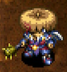

# Weapon List

<table class="itemListCentered">
  <tr>
    <th colspan="5">Item Book Order</th>
  </tr>
  <tr>
    <th>1</th>
    <th>2</th>
    <th>3</th>
    <th>4</th>
    <th>5</th>
  </tr>
  <tr>
    <td class="highlightLightblue"><a href="#ordinary-stick">Palm Stick</a></td>
    <td class="highlightLightblue"><a href="#kabura-katana">Shockuto</a></td>
    <td class="highlightOrange"><a href="#water-cutter">Seal Rod</a></td>
    <td class="highlightOrange"><a href="#lizard-lasher">Burning Blade</a></td>
    <td class="highlightOrange"><a href="#shoddy-dirk">Bargain Blade</a></td>
  </tr>
  <tr>
    <td class="highlightLightblue"><a href="#tin-blade">Dull Gold Sword</a></td>
    <td class="highlightLightblue"><a href="#fuuma-sword">Copper Blade</a></td>
    <td class="highlightOrange"><a href="#scythe">Myopic Cutter</a></td>
    <td class="highlightOrange"><a href="#nap-rattle">Dotanuki</a></td>
    <td class="highlightOrange"><a href="#glass-dirk">Sturdy Hammer</a></td>
  </tr>
  <tr>
    <td class="highlightLightblue"><a href="#katana">Breeze Blade</a></td>
    <td class="highlightOrange"><a href="#dull-gold-edge">Dim Rod</a></td>
    <td class="highlightOrange"><a href="#myopic-masher">Katana</a></td>
    <td class="highlightOrange"><a href="#shockuto">Lizard Lopper</a></td>
    <td class="highlightOrange"><a href="#dirk-of-debts">Wonder Pick</a></td>
  </tr>
  <tr>
    <td class="highlightLightblue"><a href="#beast-fang">Nap Rattle</a></td>
    <td class="highlightOrange"><a href="#bright-blade">Water Cutter</a></td>
    <td class="highlightOrange"><a href="#magic-masher">Dizzy Hatchet</a></td>
    <td class="highlightOrange"><a href="#blurry-stick">Meteor Edge</a></td>
    <td class="highlightOrange"><a href="#extreme-sword">True Knife</a></td>
  </tr>
  <tr>
    <td class="highlightLightblue"><a href="#dotanuki">Sky Blade</a></td>
    <td class="highlightOrange"><a href="#rusty-pickaxe">Rusty Pick</a></td>
    <td class="highlightOrange"><a href="#drain-dagger">Drain Cutter</a></td>
    <td class="highlightOrange"><a href="#sealing-keisaku">Red Blade</a></td>
    <td class="highlightOrange"><a href="#violent-blade">Fuuma Blade</a></td>
  </tr>
  <tr>
    <td class="highlightLightblue"><a href="#bladite">Rusty Pickaxe</a></td>
    <td class="highlightOrange"><a href="#old-mallet">Battle Axe</a></td>
    <td class="highlightOrange"><a href="#copper-cleaver">Crescent Arm</a></td>
    <td class="highlightOrange"><a href="#baffle-axe">Kabura's Blade</a></td>
    <td class="highlightOrange"><a href="#breeze-blade">Kaburagi</a></td>
  </tr>
  <tr>
    <td class="highlightLightblue"><a href="#red-blade">Light Blade</a></td>
    <td class="highlightOrange"><a href="#sky-splitter">Old Mallet</a></td>
    <td class="highlightOrange"><a href="#crescent-katana">Beast Fang</a></td>
    <td class="highlightOrange"><a href="#hatchet">Shoddy Dirk</a></td>
    <td class="highlightOrange"><a href="#burning-blade">Kamina's Sword</a></td>
  </tr>
</table>

# Lv8 Summary

<table class="itemTable">
  <thead>
    <tr>
      <th>Lv1</th>
      <th>Lv8</th>
      <th>Atk</th>
      <th>Max</th>
      <th>Ct</th>
      <th>Rune</th>
      <th>Added</th>
      <th>Exp</th>
      <th>Resonance</th>
    </tr>
  </thead>
  <tbody>
    <tr>
      <td class="highlightLightblue"><a href="#ordinary-stick">Ordinary Stick</a></td>
      <td class="highlightYellow">Ogre's Club</td>
      <td>15</td>
      <td>99</td>
      <td>∞</td>
      <td>-</td>
      <td>Redeeming (Lv8)</td>
      <td>25,250</td>
      <td><a href="/items/shields#plain-targe">Plain Targe</a> (Equip 2 bracelets)</td>
    </tr>
    <tr>
      <td class="highlightLightblue"><a href="#tin-blade">Tin Blade</a></td>
      <td class="highlightYellow">Bronze Dancer</td>
      <td>18</td>
      <td>99</td>
      <td>∞</td>
      <td>-</td>
      <td>Rustproof (Lv8)</td>
      <td>31,570</td>
      <td><a href="/items/shields#tin-shield">Tin Shield</a> (Equip 2 bracelets)</td>
    </tr>
    <tr>
      <td class="highlightLightblue"><a href="#katana">Katana</a></td>
      <td class="highlightYellow">Storied Katana</td>
      <td>22</td>
      <td>99</td>
      <td>∞</td>
      <td>-</td>
      <td>Rustproof (Lv8)</td>
      <td>49,300</td>
      <td><a href="/items/shields#iron-targe">Iron Targe</a> (Equip 2 bracelets)</td>
    </tr>
    <tr>
      <td class="highlightLightblue"><a href="#beast-fang">Beast Fang</a></td>
      <td class="highlightYellow">Beastmaster</td>
      <td>20</td>
      <td>99</td>
      <td>∞</td>
      <td>-</td>
      <td>Rustproof (Lv5)</td>
      <td>37,900</td>
      <td><a href="/items/shields#beast-shield">Beast Shield</a> (Equip 2 bracelets)</td>
    </tr>
    <tr>
      <td class="highlightLightblue"><a href="#dotanuki">Dotanuki</a></td>
      <td class="highlightYellow">Epic Dotanuki</td>
      <td>23</td>
      <td>99</td>
      <td>∞</td>
      <td>-</td>
      <td>Enhancing (Lv8)</td>
      <td>44,250</td>
      <td><a href="/items/shields#wolfshead">Wolfshead</a> (Equip 2 bracelets)</td>
    </tr>
    <tr>
      <td class="highlightLightblue"><a href="#bladite">Bladite</a></td>
      <td class="highlightYellow">Starcutter</td>
      <td>25</td>
      <td>99</td>
      <td>∞</td>
      <td>-</td>
      <td>Uplifting (Lv4) Rustproof (Lv8)</td>
      <td>50,600</td>
      <td><a href="/items/shields#targite">Targite</a> (Equip 2 bracelets)</td>
    </tr>
    <tr>
      <td class="highlightLightblue"><a href="#red-blade">Red Blade</a></td>
      <td class="highlightYellow">Shugoseki Swd</td>
      <td>27</td>
      <td>99</td>
      <td>∞</td>
      <td>-</td>
      <td>Uplifting (Lv3) Flame Shot (Lv8)</td>
      <td>56,950</td>
      <td><a href="/items/shields#red-shield">Red Shield</a> (Equip 2 bracelets)</td>
    </tr>
    <tr>
      <td class="highlightLightblue"><a href="#kabura-katana">Kabura Katana</a></td>
      <td class="highlightYellow">S-Class Kabura</td>
      <td>30</td>
      <td>99</td>
      <td>∞</td>
      <td>-</td>
      <td>Quick Hitting (Lv8)</td>
      <td>95,000</td>
      <td><a href="/items/shields#fuuma-shield">Fuuma Shield</a> (Attack damage +5)</td>
    </tr>
    <tr>
      <td class="highlightLightblue"><a href="#fuuma-sword">Fuuma Sword</a></td>
      <td class="highlightYellow">Hellfire Fuuma</td>
      <td>35</td>
      <td>99</td>
      <td>∞</td>
      <td>-</td>
      <td>Flame Shot (Lv7)</td>
      <td>175,000</td>
      <td><a href="/items/shields#fuuma-shield">Fuuma Shield</a> (Attack damage +5) <a href="/items/shields#helix-shield">Helix Shield</a> (Attack damage +10)</td>
    </tr>
    <tr>
      <td class="highlightOrange"><a href="#dull-gold-edge">Dull Gold Edge</a></td>
      <td class="highlightYellow">Pure Gold Blade</td>
      <td>14</td>
      <td>99</td>
      <td>∞</td>
      <td>Rustproof</td>
      <td>Paralyzing (Lv8)</td>
      <td>18,950</td>
      <td><a href="/items/shields#gold-shield">Gold Shield</a> (Max strength +3)</td>
    </tr>
    <tr>
      <td class="highlightOrange"><a href="#bright-blade">Bright Blade</a></td>
      <td class="highlightYellow">Flash Sword</td>
      <td>17</td>
      <td>99</td>
      <td>∞</td>
      <td>Redeeming</td>
      <td>Lively (Lv5) Confusing (Lv8)</td>
      <td>25,300</td>
      <td><a href="/items/shields#day-shield">Day Shield</a> (Read scrolls in the dark)</td>
    </tr>
    <tr>
      <td class="highlightOrange"><a href="#rusty-pickaxe">Rusty Pickaxe</a>※</td>
      <td class="highlightYellow">Luxury Pickaxe</td>
      <td>14</td>
      <td>99</td>
      <td>∞</td>
      <td>Wall Dig</td>
      <td>Blinding (Lv5)</td>
      <td>19,000</td>
      <td>-</td>
    </tr>
    <tr>
      <td class="highlightOrange"><a href="#old-mallet">Old Mallet</a>※</td>
      <td class="highlightYellow">Master's Mallet</td>
      <td>16</td>
      <td>99</td>
      <td>∞</td>
      <td>Trap Busting</td>
      <td>Confusing (Lv5)</td>
      <td>31,700</td>
      <td>-</td>
    </tr>
    <tr>
      <td class="highlightOrange"><a href="#sky-splitter">Sky Splitter</a></td>
      <td class="highlightYellow">Aerial Assault</td>
      <td>12</td>
      <td>99</td>
      <td>∞</td>
      <td>Anti-Floating</td>
      <td>Rustproof (Lv8)</td>
      <td>63,500</td>
      <td>-</td>
    </tr>
    <tr>
      <td class="highlightOrange"><a href="#water-cutter">Water Cutter</a></td>
      <td class="highlightYellow">Sea King Sword</td>
      <td>15</td>
      <td>99</td>
      <td>∞</td>
      <td>Anti-Aquatic</td>
      <td>Rustproof (Lv8)</td>
      <td>38,100</td>
      <td>-</td>
    </tr>
    <tr>
      <td class="highlightOrange"><a href="#scythe">Scythe</a></td>
      <td class="highlightYellow">Vegicide</td>
      <td>13</td>
      <td>99</td>
      <td>∞</td>
      <td>Anti-Plant</td>
      <td>Rustproof (Lv8)</td>
      <td>31,750</td>
      <td>-</td>
    </tr>
    <tr>
      <td class="highlightOrange"><a href="#myopic-masher">Myopic Masher</a></td>
      <td class="highlightYellow">Cyclopicide</td>
      <td>16</td>
      <td>99</td>
      <td>∞</td>
      <td>Anti-Cyclops</td>
      <td>Rustproof (Lv8)</td>
      <td>31,750</td>
      <td><a href="/items/shields#spry-shield">Spry Shield</a> (Attack and Defense +3)</td>
    </tr>
    <tr>
      <td class="highlightOrange"><a href="#magic-masher">Magic Masher</a></td>
      <td class="highlightYellow">Die Magic Die</td>
      <td>15</td>
      <td>99</td>
      <td>∞</td>
      <td>Anti-Magic</td>
      <td>Rustproof (Lv8)</td>
      <td>38,100</td>
      <td>-</td>
    </tr>
    <tr>
      <td class="highlightOrange"><a href="#drain-dagger">Drain Dagger</a></td>
      <td class="highlightYellow">Drain Master</td>
      <td>13</td>
      <td>99</td>
      <td>∞</td>
      <td>Anti-Drain</td>
      <td>Rustproof (Lv8)</td>
      <td>38,100</td>
      <td>-</td>
    </tr>
    <tr>
      <td class="highlightOrange"><a href="#copper-cleaver">Copper Cleaver</a></td>
      <td class="highlightYellow">Lightbringer</td>
      <td>15</td>
      <td>99</td>
      <td>∞</td>
      <td>Anti-Metal</td>
      <td>Rustproof (Lv8)</td>
      <td>63,500</td>
      <td>-</td>
    </tr>
    <tr>
      <td class="highlightOrange"><a href="#crescent-katana">Crescent Katana</a></td>
      <td class="highlightYellow">Lunar Sword</td>
      <td>14</td>
      <td>99</td>
      <td>∞</td>
      <td>Anti-Explode</td>
      <td>Rustproof (Lv8)</td>
      <td>50,800</td>
      <td><a href="/items/shields#blast-shield">Blast Shield</a> (Attack and Defense +3)</td>
    </tr>
    <tr>
      <td class="highlightOrange"><a href="#lizard-lasher">Lizard Lasher</a></td>
      <td class="highlightYellow">Dragons' Bane</td>
      <td>17</td>
      <td>99</td>
      <td>∞</td>
      <td>Anti-Dragon</td>
      <td>Rustproof (Lv8)</td>
      <td>63,500</td>
      <td><a href="/items/shields#snake-shield">Snake Shield</a> (Attack and Defense +3)</td>
    </tr>
    <tr>
      <td class="highlightOrange"><a href="#nap-rattle">Nap Rattle</a></td>
      <td class="highlightYellow">Ultimate Rattle</td>
      <td>16</td>
      <td>99</td>
      <td>11</td>
      <td>Sedating</td>
      <td>Rustproof (Lv8)</td>
      <td>50,700</td>
      <td><a href="/items/bracelets#alert-bracelet">Alert Bracelet</a> (Sleep chance +2%)</td>
    </tr>
    <tr>
      <td class="highlightOrange"><a href="#shockuto">Shockuto</a></td>
      <td class="highlightYellow">The Paralyzer</td>
      <td>15</td>
      <td>99</td>
      <td>12</td>
      <td>Paralyzing</td>
      <td>Rustproof (Lv8)</td>
      <td>50,700</td>
      <td>-</td>
    </tr>
    <tr>
      <td class="highlightOrange"><a href="#blurry-stick">Blurry Stick</a></td>
      <td class="highlightYellow">Blind Stick</td>
      <td>15</td>
      <td>99</td>
      <td>∞</td>
      <td>Blinding</td>
      <td>Rustproof (Lv8)</td>
      <td>59,900</td>
      <td>-</td>
    </tr>
    <tr>
      <td class="highlightOrange"><a href="#sealing-keisaku">Sealing Keisaku</a></td>
      <td class="highlightYellow">Divine Keisaku</td>
      <td>15</td>
      <td>99</td>
      <td>∞</td>
      <td>Sealing</td>
      <td>Rustproof (Lv8)</td>
      <td>38,000</td>
      <td>-</td>
    </tr>
    <tr>
      <td class="highlightOrange"><a href="#baffle-axe">Baffle Axe</a></td>
      <td class="highlightYellow">Epic Baffle Axe</td>
      <td>16</td>
      <td>99</td>
      <td>∞</td>
      <td>Confusing</td>
      <td>Rustproof (Lv8)</td>
      <td>38,000</td>
      <td><a href="/items/bracelets#anti-cnf-bracelet">Anti-Cnf. Bracelet</a> (Confusion chance +2%)</td>
    </tr>
    <tr>
      <td class="highlightOrange"><a href="#hatchet">Hatchet</a></td>
      <td class="highlightYellow">War God's Axe</td>
      <td>12</td>
      <td>99</td>
      <td>11</td>
      <td>Critical</td>
      <td>Lively (Lv5) Paralyzing (Lv8)</td>
      <td>38,000</td>
      <td>-</td>
    </tr>
    <tr>
      <td class="highlightOrange"><a href="#shoddy-dirk">Shoddy Dirk</a>※</td>
      <td class="highlightYellow">Worthy Sword</td>
      <td>37</td>
      <td>99</td>
      <td>∞</td>
      <td>Expendable</td>
      <td>Critical (Lv8) Quick Hitting (Lv8)</td>
      <td>103,000</td>
      <td><a href="/items/shields#shoddy-plank">Shoddy Plank</a> (Equipped items won't rust)</td>
    </tr>
    <tr>
      <td class="highlightOrange"><a href="#glass-dirk">Glass Dirk</a>※</td>
      <td class="highlightYellow">Frangible Edge</td>
      <td>42</td>
      <td>99</td>
      <td>11</td>
      <td>Unsound</td>
      <td>Stupefying (Lv8)</td>
      <td>103,000</td>
      <td><a href="/items/shields#glass-buckler">Glass Buckler</a> (Nullifies magic bullets)</td>
    </tr>
    <tr>
      <td class="highlightOrange"><a href="#dirk-of-debts">Dirk of Debts</a>※</td>
      <td class="highlightYellow">Gitan Gorger</td>
      <td>17</td>
      <td>99</td>
      <td>∞</td>
      <td>Costly</td>
      <td>-</td>
      <td>38,100</td>
      <td><a href="/items/shields#paupers-plank">Pauper's Plank</a> (Enemies drop Gitan often)</td>
    </tr>
    <tr>
      <td class="highlightOrange"><a href="#extreme-sword">Extreme Sword</a>※</td>
      <td class="highlightYellow">All-in Sword</td>
      <td>30</td>
      <td>99</td>
      <td>∞</td>
      <td>Focusing</td>
      <td>-</td>
      <td>63,000</td>
      <td><a href="/items/shields#rush-shield">Rush Shield</a> (Equip 2 bracelets)</td>
    </tr>
    <tr>
      <td class="highlightOrange"><a href="#violent-blade">Violent Blade</a>※</td>
      <td class="highlightYellow">Muramasa</td>
      <td>20</td>
      <td>99</td>
      <td>∞</td>
      <td>Obsessive</td>
      <td>Anti-Cyclops (Lv6) Blinding (Lv8)</td>
      <td>50,700</td>
      <td><a href="/items/bracelets#mojo-bracelet">Mojo Bracelet</a> (Chance to slow target)</td>
    </tr>
    <tr>
      <td class="highlightOrange"><a href="#breeze-blade">Breeze Blade</a></td>
      <td class="highlightYellow">Deathwind</td>
      <td>13</td>
      <td>99</td>
      <td>∞</td>
      <td>Tri-direction</td>
      <td>Energizing (Lv8)</td>
      <td>50,800</td>
      <td><a href="/items/shields#midnight-shield">Midnight Shield</a> (Equipped items won't rust)</td>
    </tr>
    <tr>
      <td class="highlightOrange"><a href="#burning-blade">Burning Blade</a></td>
      <td class="highlightYellow">Hellfire Katana</td>
      <td>16</td>
      <td>99</td>
      <td>∞</td>
      <td>Flame Shot</td>
      <td>Uplifting (Lv5) Anti-Explode (Lv8)</td>
      <td>63,000</td>
      <td><a href="/items/shields#swap-shield">Swap Shield</a> (Boost Flame Shot damage)</td>
    </tr>
    <tr>
      <td class="highlightOrange"><a href="#wonder-pick">Wonder Pick</a></td>
      <td class="highlightYellow">Wonder Wreckr</td>
      <td>18</td>
      <td>99</td>
      <td>∞</td>
      <td>Max Wall Dig</td>
      <td>Blinding (Lv5)</td>
      <td>127,000</td>
      <td><a href="/items/shields#nirvana-board">Nirvana Board</a> (Max HP +30)</td>
    </tr>
    <tr>
      <td class="highlightOrange"><a href="#sturdy-hammer">Sturdy Hammer</a></td>
      <td class="highlightYellow">Epic Hammer</td>
      <td>17</td>
      <td>99</td>
      <td>∞</td>
      <td>Trap Killing</td>
      <td>Confusing (Lv5)</td>
      <td>127,000</td>
      <td>-</td>
    </tr>
    <tr>
      <td class="highlightOrange"><a href="#true-knife">True Knife</a></td>
      <td class="highlightYellow">True Striker-X</td>
      <td>8</td>
      <td>99</td>
      <td>∞</td>
      <td>Accurate</td>
      <td>Critical (Lv8)</td>
      <td>127,000</td>
      <td><a href="/items/bracelets#anti-parry-brce">Anti-Parry Brce.</a> (Projectiles always hit)</td>
    </tr>
    <tr>
      <td class="highlightLightblue"><a href="#pathetic-blade">Pathetic Blade</a></td>
      <td class="highlightYellow">Rising Sun</td>
      <td>38</td>
      <td>99</td>
      <td>∞</td>
      <td>-</td>
      <td>-</td>
      <td>127,000</td>
      <td><a href="/items/shields#pathetic-shield">Pathetic Shield</a> (Lv1-7: Equip 2 bracelets) (Lv8: Foes may step back)</td>
    </tr>
    <tr>
      <td class="highlightLightblue"><a href="#fox-kodachi">Fox Kodachi</a></td>
      <td class="highlightYellow">Koharu Sword</td>
      <td>30</td>
      <td>99</td>
      <td>5</td>
      <td>-</td>
      <td>Energizing (Lv2) Clutch (Lv3) Enlightening (Lv5) Anointing (Lv7) Healing (Lv8) </td>
      <td>306,070</td>
      <td>-</td>
    </tr>
    <tr>
      <td class="highlightLightblue"><a href="#kaburagi">Kaburagi</a></td>
      <td class="highlightYellow">Kaburasutegi</td>
      <td>40</td>
      <td>99</td>
      <td>∞</td>
      <td>-</td>
      <td>Critical (Lv8) Quick Hitting (Lv8)</td>
      <td>305,535</td>
      <td><a href="/items/shields#helix-shield">Helix Shield</a> (Attack damage +10)</td>
    </tr>
  </tbody>
</table>

  
※ Weapon with a drawback.

# Details

#### Growth Experience

The listed experience points per level is not an accumilated total. 
Extra exp from defeating a monster will not carry forward when a weapon levels up. 
(Example: 100 exp until level up, defeat an Archdragon for 240 exp, 140 exp is lost)

#### Locations Key

|Letter|Meaning|
|-|-|
|F|Floor, Monster drop (day)|
|S|Store, Peddler, Shiny Object (yellow), Monster drop (night), Maneater drop|
|P|Presto Pot|
|Z|Zalokleft drop|
|M|Mealy drop|
|E|Elite store, Pick-A-Choice, Shiny Object (yellow, blue)|

### Ordinary Stick

<table class="itemDetailsTable">
  <tr>
    <th>Lv1-7</th>
    <th>Lv8</th>
    <th>Lv1 Description</th>
  </tr>
  <tr>
    <td></td>
    <td></td>
    <td>It's an ordinary stick. Totally ordinary. It's ubiquitous!</td>
  </tr>
</table>

It's weak, but levels up quickly. Has the highest starting upgrade limit among all weapons, so it shines in dungeons like Gen's Turf where you can obtain lots of Blank Scrolls. Good weapon to insert into Upgrade Pots.

<table class="itemDetailsTable">
  <tbody>
    <tr>
      <th>Lv</th>
      <th>Name</th>
      <th>Rune</th>
      <th>Atk</th>
      <th>Max</th>
      <th>Ct</th>
      <th>Exp</th>
      <th>Buy</th>
      <th>Sell</th>
      <th>Info</th>
    </tr>
    <tr>
      <td>1</td>
      <td>Palm Stick</td>
      <td rowspan="7">-</td>
      <td>2</td>
      <td>10</td>
      <td>5</td>
      <td>-</td>
      <td>300</td>
      <td>105</td>
      <td rowspan="8">Resonance: <a href="/items/shields#plain-targe">Palm Shield</a> (Equip 2 bracelets)</td>
    </tr>
    <tr>
      <td>2</td>
      <td>Good Palm Stick</td>
      <td>3</td>
      <td>55</td>
      <td>6</td>
      <td>50</td>
      <td>400</td>
      <td>140</td>
    </tr>
    <tr>
      <td>3</td>
      <td>Hard Palm Stick</td>
      <td>5</td>
      <td>60</td>
      <td>6</td>
      <td>400</td>
      <td>500</td>
      <td>175</td>
    </tr>
    <tr>
      <td>4</td>
      <td>Nice Palm Stick</td>
      <td>6</td>
      <td>65</td>
      <td>7</td>
      <td>800</td>
      <td>600</td>
      <td>210</td>
    </tr>
    <tr>
      <td>5</td>
      <td>Great Club</td>
      <td>8</td>
      <td>70</td>
      <td>7</td>
      <td>1600</td>
      <td>700</td>
      <td>245</td>
    </tr>
    <tr>
      <td>6</td>
      <td>Big Club</td>
      <td>9</td>
      <td>75</td>
      <td>8</td>
      <td>3200</td>
      <td>800</td>
      <td>280</td>
    </tr>
    <tr>
      <td>7</td>
      <td>Vicious Club</td>
      <td>11</td>
      <td>80</td>
      <td>8</td>
      <td>6400</td>
      <td>900</td>
      <td>315</td>
    </tr>
    <tr>
      <td>8</td>
      <td>Ogre's Club</td>
      <td>Charge</td>
      <td>15</td>
      <td>99</td>
      <td>∞</td>
      <td>12800</td>
      <td>1200</td>
      <td>420</td>
    </tr>
  </tbody>
</table>

Locations:

<table class="locationTable">
  <tr>
    <th>Trail</th>
    <th>Past</th>
    <th>Present</th>
    <th>Future</th>
    <th>Fortune</th>
    <th>Miracle</th>
    <th>Rocks</th>
    <th>Gen</th>
    <th>Pitfall</th>
    <th>Manor</th>
  </tr>
  <tr>
    <td>FP</td>
    <td>FP</td>
    <td>FP</td>
    <td>FPZ</td>
    <td>PZ</td>
    <td>P</td>
    <td>Novice</td>
    <td>FPZ</td>
    <td>PZ</td>
    <td>FPZ</td>
  </tr>
  <tr>
    <th>Bizarre</th>
    <th>Onigiri</th>
    <th>Chasm</th>
    <th>Well</th>
    <th>Lake</th>
    <th>Inori</th>
    <th>Old</th>
    <th>Descent</th>
    <th></th>
    <th></th>
  </tr>
  <tr>
    <td>FPZ</td>
    <td>PZ</td>
    <td>FPZ</td>
    <td>-</td>
    <td>FP</td>
    <td>FPZ</td>
    <td>PZ</td>
    <td>FPZ</td>
    <td></td>
    <td></td>
  </tr>
</table>
