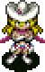

  
  
  
  
  

## Overview

Allies are NPC characters who fight monsters alongside Shiren. 
There are 8 ally characters - Millie, Edna, Galwin, Saruma Brothers, Banana Prince, and Borg Mamel. 
Each character comes with a unique ability, and can grow stronger through leveling up.

Those looking for a more classic roguelike experience can play without allies, but since most post-game dungeons don't allow allies, it might be fun to experience them while you can.

<ul class="quickLinksUL">
  <li><a href="#overview">Overview</a>
    <ul>
      <li><a href="#unlocking-allies">Unlocking Allies</a></li>
      <li><a href="#ally-behavior">Ally Behavior</a></li>
      <li><a href="#ally-stats">Ally Stats</a></li>
    </ul>
  </li>
  <li><a href="#characters">Characters</a>
    <ul>
      <li><a href="#millie">Millie</a></li>
      <li><a href="#edna">Edna</a></li>
      <li><a href="#galwin">Galwin</a></li>
      <li><a href="#saruma-brothers">Saruma Brothers</a></li>
      <li><a href="#banana-prince">Banana Prince</a></li>
      <li><a href="#borg-mamel">Borg Mamel</a></li>
    </ul>
  </li>
  <li><a href="#borg-mamel-items">Borg Mamel Items</a></li>
</ul>

### Unlocking Allies

Allies must be unlocked before they can join your adventures. 
Once unlocked, they can randomly appear in the Boronga Village Tavern, villages up to Monkey Village, and can show up between Grasslands ~ Sea of Trees (1\~12F) and Eagle Valley ~ Lava Field (19\~23F).

|Character|Condition|
|-|-|
|Millie|1. Progress the story until you've reached Rocky Stretch. 2. Visit Gonchiki Village again and head toward the exit. 3. Go to the Gonchiki Village Inn and talk to Millie.|
|Edna|1. Talk to the chief of Rakutata Village. 2. Talk to a woman in the Tavern in Boronga Village. 3. Go to the Beach. (West exit of Boronga Village)|
|Galwin|1. Fail or give up on an adventure about 5 times for an event. 2. Go to the Tavern and talk to Galwin.|
|Ichiro Jiro Saburo|1. Progress the story until you've reached Monkey Village. 2. Encounter Jiro in a dungeon, and agree to search for his brothers. 3. Encounter Ichiro in a dungeon, and give him an Herb. 4. Randomly encounter Saburo when advancing floors, and defeat all monsters.|
|Banana Prince|1. Clear the main story. 2. Go to Monkey Village and slip on a banana peel to unlock Banana Kingdom. 3. Clear Banana Kingdom.|
|Borg Mamel|1. Clear the main story. 2. Go to Gonchiki Village and unlock Entrancing Lane. 3. Clear Entrancing Lane.|

### Ally Behavior

Turn order: Shiren → Allies → Monsters. 
※ If there was a disguised N'mach: Shiren → N'mach → Allies → Monsters.

If a dungeon allows allies, you can bring up to 3 allies with you. 
If you recruit a 4th ally during an adventure, you can choose who to leave behind.

All allies except for Galwin and Borg Mamel prioritize following Shiren. 
They generally won't attack monsters who aren't an immediate threat. (Example: Napping or paralyzed monsters)

Allies follow you when you switch places with a wandering NPC. 
Doors wait to close until Shiren and all allies pass through the door. 
However, special doors still close immediately if a monster is present in the room you enter.

If an ally is defeated, the monster that defeated the ally levels up. 

Unlike Shiren 5, allies DO NOT dodge flying equipment, including equipment disarmed by a Kengo. 

### Ally Stats

Maximum level of 10, and level ups persist between adventures. 
Due to this, they typically require more experience points to level up. 
It's easiest to use items like Happy Grass to level them up once they reach high levels. 
※ Borg Mamel's maximum level is 99, and isn't based on experience points.

Experience points are distributed to all party members regardless of who defeated the monster. The amount of experience points doesn't change based on number of party members.

Except for Galwin, allies follow you to the next floor even if you were in different rooms. Levels can be gained or lost by level-changing items such as Happy Grass or Unlucky Staff, but allies who are in wandering NPC mode aren't affected. 

Unlike Shiren 5, this game doesn't have a way to display ally HP. 
You can talk to them to get a rough idea, but keep in mind that talking is a turn ending action. 

Herb, Otogiriso, and Heal Grass will restore HP when thrown at an ally. 
Max HP won't increase when they're at full HP.

## Characters

### Millie

  

#### Description

A blond girl who crash landed on Cahitan Isle while she was headed to Texas on a hang glider.

She's extremely powerful during the day, but requires care at night.

#### Unlock Condition

1. Progress the story until you've reached Rocky Stretch.
2. Visit Gonchiki Village again and head toward the exit.
3. Go to the Gonchiki Village Inn and talk to Millie.

#### Characteristics

- Max HP increases as she levels up.
    - Lv1: 30 HP
    - Lv10: 57 HP
- Shoots monsters multiple times in a single turn during daytime.
    - Damage, number of shots, and range increases as she levels up.
    - Lv1 = 10 damage x 2 shots for 20 damage, 3 tile radius.
    - Lv10 = 30 damage x 4 shot for 120 damage, 6 tile radius.
    - Bullets have 100% accuracy, and targets don't have to be lined up.
    - Gyazas convert bullets into 2 damage.
    - Bored Kappas can't catch bullets.
- Kicks monsters at night, dealing 1 damage.

### Edna

  

#### Description

An apprentice priestess with a mysterious image. She appears while riding a giant shell when you first meet her.

She's very reliable at night, but requires care during daytime.

#### Unlock Condition

1. Talk to the chief of Rakutata Village.
2. Talk to a woman in the Tavern in Boronga Village.
3. Go to the Beach. (West exit of Boronga Village)

#### Characteristics

- Max HP increases as she levels up.
    - Lv1: ??? HP
    - Lv10: 62 HP
- Casts support magic on Shiren when you talk to her during daytime.
    - Effect is randomly selected from attack up, defense up, or swift.
    - Attack up and defense up last for the duration of the floor.
    - Only casts support magic 1 time per floor.
- Uses an exclusive ability called Light Arrow at night.
    - Power: B (45) - Deals around 50 damage.
    - The ability has piercing properties, and has infinite range in a straight line.
    - She won't use the ability if an ally is in-between her and the target.
- Uses direct attacks during the day, but doesn't deal much damage.

#### Sidequest

There's a small event when you take her to Ruins of Laferriere 15F.

### Galwin

  

#### Description

A self-proclaimed legendary pirate with a terrible sense of direction.

His aggressive AI and tendency to disappear during an adventure makes him rather underwhelming compared to other allies, despite his high stats.

#### Unlock Condition

1. Fail or give up on an adventure about 5 times for an event.
2. Go to the Tavern and talk to Galwin.

#### Characteristics

- Max HP increases as he levels up.
    - Lv1: ??? HP
    - Lv10: ??? HP
- Throws Rum at monsters in a straight line.
    - Inflicts a random status condition. (Asleep, Afraid, Confused, or Enraged)
- Uses direct attacks during the day.
    - High attack power from the start.
- Has an offensive AI and chases enemies within his view.
    - He does this even if he can't hit the monster, such as Pumphantasms inside walls.
    - He won't approach monsters at night.
- He can randomly disappear when advancing to the next floor.
    - The message "Galwin isn't anywhere in sight. It seems you became separated." is displayed.

### Saruma Brothers

    

#### Description

A trio of monkeys with cheerful personalities. 
Their names are Ichiro (Red), Jiro (Blue), and Saburo (Yellow).

Their ability to copy Shiren's actions is quite powerful, since you can shoot arrows or throw items like grasses, staves, or talismans without consuming items. 
Only 1 monkey can join your adventure at a time.

#### Unlock Condition

1. Progress the story until you've reached Monkey Village.
2. Encounter Jiro in a dungeon, and agree to search for his brothers.
3. Encounter Ichiro in a dungeon, and give him an Herb.
4. Randomly encounter Saburo when advancing floors, and defeat all monsters.

#### Characteristics

- Level ups are not shared.
- Stats differ between monkeys.
    - Ichiro (Higher attack):
        - Lv1: ??? HP
        - Lv10: 85 HP
    - Jiro (Higher defense):
        - Lv1: ??? HP
        - Lv10: 85 HP
    - Saburo (Higher max HP):
        - Lv1: ??? HP
        - Lv10: 114 HP
- Copies Shiren's action in the opposite direction when adjacent to Shiren.
    - Direct attack. (Won't use direct attacks toward allies)
    - Throw an identical item. (Piercing properties)
        - Gitan deals 10 damage.
        - Can't be used to duplicate items or level up Borg Mamel.
        - Can hit Shiren, but always misses other ally characters.
    - Use a scroll or staff. (Excluding selection-based scrolls)
    - Use a necklace ability. (Always fails, so it's pointless)

### Banana Prince

  

#### Description

A peculiar prince who has the appearance of a banana. 
He can be seen outside the Tavern in Boronga Village from the start.

He's essentially a blue mage character that can learn monster special attacks, and has a unique HP system where he bruises instead of taking number damage.

#### Unlock Condition

1. Clear the main story.
2. Go to Monkey Village and slip on a banana peel to unlock Banana Kingdom.
3. Clear Banana Kingdom.

#### Characteristics

- Bruises instead of taking number damage when he gets hit.
    - 12~9 HP = Yellow.
    - 8~5 HP = Brown.
    - 4~1 HP = Black.
- HP doesn't regenerate over time.
    - HP is fully restored if he gets hit by a Banana Peel or any banana.
        - Excluding sealed ones or N'dubba monsters disguised as items.
    - HP is fully restored if he gets hit by a Banana Morph's special attack.
- Learns abilities called Bana Powers as he gets hit by special attacks or items.
    - Total of 8 Bana Powers can be assigned - 4 daytime powers, and 4 nighttime powers.
    - Performs all Bana Powers if applicable in a single turn, starting from the top.
    - See <a href="/system/bana-powers">Bana Powers</a> for details.
- Instantly collapses if he gets hit by fire or explosion damage.
    - The Icy Cold Bana Power (Ice Banana) protects against this weakness.
    - Firepuff or Dragon special attacks, magma eruptions, etc.
    - Landmine, Explochin, or Pop Tank blasts, etc.
- Instantly collapses if he gets splashed by water or oil.
    - Unlike fire or explosion damage, there's no way to protect against this weakness.

### Borg Mamel

  

#### Description

Cyborg Mamel who time traveled to the past in order to train and save the future. 
Its default name is "BMamel", but can be renamed when it first joins you.

It doesn't gain experience points, but instead levels up when specific items are thrown at it. Be sure to tag rare equipment like Sturdy Hammer and Jaguar's Shield before throwing them. ※ The item's name has to be an exact match, along with blessed/cursed/sealed status.

Once it reaches Lv100, it returns to the future and leaves behind a True Knife as thanks. It can then be found at the end of Entrancing Lane again, but its level resets to 1.

#### Unlock Condition

1. Clear the main story.
2. Go to Gonchiki Village and unlock Entrancing Lane.
3. Clear Entrancing Lane.

#### Characteristics

- Max HP increases as it levels up.
    - Lv1: ??? HP
    - Lv99: ??? HP
- Only uses direct attacks.
- Has an offensive AI and chases enemies within its view.
    - It does this even if it can't hit the monster, such as Pumphantasms inside walls.
    - It won't approach monsters at night.

 

## Borg Mamel Items

Leveling Borg Mamel to Lv100 is the only way to obtain <a href="/items/weapons#true-knife">True Knife</a> in Shiren 4.

The item's name has to be an exact match, along with blessed/cursed/sealed status. Tag rare equipment like Sturdy Hammer and Jaguar's Shield before throwing them.

- B = Blessed
- C = Cursed
- S = Sealed

 

<table>
  <thead>
    <tr>
      <th>Lv</th>
      <th>Item</th>
      <th>Lv</th>
      <th>Item</th>
      <th>Lv</th>
      <th>Item</th>
      <th>Lv</th>
      <th>Item</th>
    </tr>
  </thead>
  <tbody>
    <tr>
      <td class="highlightGray">1</td>
      <td>Palm Stick</td>
      <td class="highlightGray">26</td>
      <td>Poison Grass</td>
      <td class="highlightGray">51</td>
      <td>Red Blade</td>
      <td class="highlightGray">76</td>
      <td>Fury Talisman</td>
    </tr>
    <tr>
      <td class="highlightGray">2</td>
      <td>Yellow Banana</td>
      <td class="highlightGray">27</td>
      <td>Medicine Scroll</td>
      <td class="highlightGray">52</td>
      <td>Diet Shield</td>
      <td class="highlightGray">77</td>
      <td>Safe Shield (Anti-Theft)</td>
    </tr>
    <tr>
      <td class="highlightGray">3</td>
      <td>Herb</td>
      <td class="highlightGray">28</td>
      <td>Purify Scroll</td>
      <td class="highlightGray">53</td>
      <td>Swift Grass</td>
      <td class="highlightGray">78</td>
      <td>Super Torch (B)</td>
    </tr>
    <tr>
      <td class="highlightGray">4</td>
      <td>Storage Pot</td>
      <td class="highlightGray">29</td>
      <td>Banana Peel</td>
      <td class="highlightGray">54</td>
      <td>Water Pot</td>
      <td class="highlightGray">79</td>
      <td>Sky Splitter</td>
    </tr>
    <tr>
      <td class="highlightGray">5</td>
      <td>Copper Guard</td>
      <td class="highlightGray">30</td>
      <td>Rusty Pickaxe (C)</td>
      <td class="highlightGray">55</td>
      <td>Heal Bracelet (S)</td>
      <td class="highlightGray">80</td>
      <td>Hemoji Arrow</td>
    </tr>
    <tr>
      <td class="highlightGray">6</td>
      <td>Torch</td>
      <td class="highlightGray">31</td>
      <td>Old Mallet</td>
      <td class="highlightGray">56</td>
      <td>Squid Sushi Scroll</td>
      <td class="highlightGray">81</td>
      <td>Ice Banana (S)</td>
    </tr>
    <tr>
      <td class="highlightGray">7</td>
      <td>Navigation Scroll</td>
      <td class="highlightGray">32</td>
      <td>Sealing Keisaku</td>
      <td class="highlightGray">57</td>
      <td>Onigiri</td>
      <td class="highlightGray">82</td>
      <td>Black Hole Pot</td>
    </tr>
    <tr>
      <td class="highlightGray">8</td>
      <td>Knockback Staff</td>
      <td class="highlightGray">33</td>
      <td>Force Arrow</td>
      <td class="highlightGray">58</td>
      <td>Chocolate Pot</td>
      <td class="highlightGray">83</td>
      <td>Tag Scroll (B)</td>
    </tr>
    <tr>
      <td class="highlightGray">9</td>
      <td>Replenish Scroll</td>
      <td class="highlightGray">34</td>
      <td>Life Grass</td>
      <td class="highlightGray">59</td>
      <td>Bind Talisman</td>
      <td class="highlightGray">84</td>
      <td>Invitation</td>
    </tr>
    <tr>
      <td class="highlightGray">10</td>
      <td>Heaven Scroll</td>
      <td class="highlightGray">35</td>
      <td>Spoiled Banana</td>
      <td class="highlightGray">60</td>
      <td>Dull Gold Edge (S, Anti-Drain)</td>
      <td class="highlightGray">85</td>
      <td>Decoy Staff (B)</td>
    </tr>
    <tr>
      <td class="highlightGray">11</td>
      <td>Pierce Bracelet</td>
      <td class="highlightGray">36</td>
      <td>Empathy Staff</td>
      <td class="highlightGray">61</td>
      <td>Critical Arrow</td>
      <td class="highlightGray">86</td>
      <td>Heal Pot (S)</td>
    </tr>
    <tr>
      <td class="highlightGray">12</td>
      <td>Wood Arrow</td>
      <td class="highlightGray">37</td>
      <td>Transient Staff</td>
      <td class="highlightGray">62</td>
      <td>Fixer Scroll</td>
      <td class="highlightGray">87</td>
      <td>Hatchet (HP+20)</td>
    </tr>
    <tr>
      <td class="highlightGray">13</td>
      <td>Katana</td>
      <td class="highlightGray">38</td>
      <td>Mailing Pot</td>
      <td class="highlightGray">63</td>
      <td>Happy Grass</td>
      <td class="highlightGray">88</td>
      <td>Sturdy Hammer</td>
    </tr>
    <tr>
      <td class="highlightGray">14</td>
      <td>Iron Targe</td>
      <td class="highlightGray">39</td>
      <td>Heal Grass</td>
      <td class="highlightGray">64</td>
      <td>Ordinary Staff (B)</td>
      <td class="highlightGray">89</td>
      <td>Ogre's Club</td>
    </tr>
    <tr>
      <td class="highlightGray">15</td>
      <td>Dragon Grass</td>
      <td class="highlightGray">40</td>
      <td>Confusion Scroll (S)</td>
      <td class="highlightGray">65</td>
      <td>Sanctuary Scroll (B)</td>
      <td class="highlightGray">90</td>
      <td>Jaguar's Shield</td>
    </tr>
    <tr>
      <td class="highlightGray">16</td>
      <td>Weeds</td>
      <td class="highlightGray">41</td>
      <td>Miss Talisman</td>
      <td class="highlightGray">66</td>
      <td>Blurry Stick</td>
      <td class="highlightGray">91</td>
      <td>Lizard Shield (Anti-Peck)</td>
    </tr>
    <tr>
      <td class="highlightGray">17</td>
      <td>Air Slash Scroll</td>
      <td class="highlightGray">42</td>
      <td>Slumber Scroll</td>
      <td class="highlightGray">67</td>
      <td>Staunch Bracelet</td>
      <td class="highlightGray">92</td>
      <td>Scout Bracelet (B)</td>
    </tr>
    <tr>
      <td class="highlightGray">18</td>
      <td>Myopic Masher</td>
      <td class="highlightGray">43</td>
      <td>Cleansing Bracelet</td>
      <td class="highlightGray">68</td>
      <td>Ripe Banana</td>
      <td class="highlightGray">93</td>
      <td>Calling Pot</td>
    </tr>
    <tr>
      <td class="highlightGray">19</td>
      <td>Green Banana</td>
      <td class="highlightGray">44</td>
      <td>Calm Bracelet</td>
      <td class="highlightGray">69</td>
      <td>Shrink Seed (S)</td>
      <td class="highlightGray">94</td>
      <td>Degrade Pot</td>
    </tr>
    <tr>
      <td class="highlightGray">20</td>
      <td>Swap Staff</td>
      <td class="highlightGray">45</td>
      <td>Otogiriso (B)</td>
      <td class="highlightGray">70</td>
      <td>Revival Grass (S)</td>
      <td class="highlightGray">95</td>
      <td>Angel Seed</td>
    </tr>
    <tr>
      <td class="highlightGray">21</td>
      <td>Sleep Talisman</td>
      <td class="highlightGray">46</td>
      <td>Grilled Banana</td>
      <td class="highlightGray">71</td>
      <td>Earth Scroll (B)</td>
      <td class="highlightGray">96</td>
      <td>Upgrade Pot</td>
    </tr>
    <tr>
      <td class="highlightGray">22</td>
      <td>Hide Pot</td>
      <td class="highlightGray">47</td>
      <td>Strength Grass</td>
      <td class="highlightGray">72</td>
      <td>Blank Scroll</td>
      <td class="highlightGray">97</td>
      <td>Imabikiso</td>
    </tr>
    <tr>
      <td class="highlightGray">23</td>
      <td>Strength Bracelet</td>
      <td class="highlightGray">48</td>
      <td>Tunnel Staff</td>
      <td class="highlightGray">73</td>
      <td>Kabura's Blade</td>
      <td class="highlightGray">98</td>
      <td>Worthy Shield (Anti-Hypno)</td>
    </tr>
    <tr>
      <td class="highlightGray">24</td>
      <td>Lock Shield</td>
      <td class="highlightGray">49</td>
      <td>Presto Pot</td>
      <td class="highlightGray">74</td>
      <td>Steady Shield</td>
      <td class="highlightGray">99</td>
      <td>Extinction Scroll</td>
    </tr>
    <tr>
      <td class="highlightGray">25</td>
      <td>Poison Arrow</td>
      <td class="highlightGray">50</td>
      <td>Palm Shield (1/2 Blast)</td>
      <td class="highlightGray">75</td>
      <td>Blessing Pot (B)</td>
      <td colspan="2" class="highlightGray"></td>
    </tr>
  </tbody>
</table>
