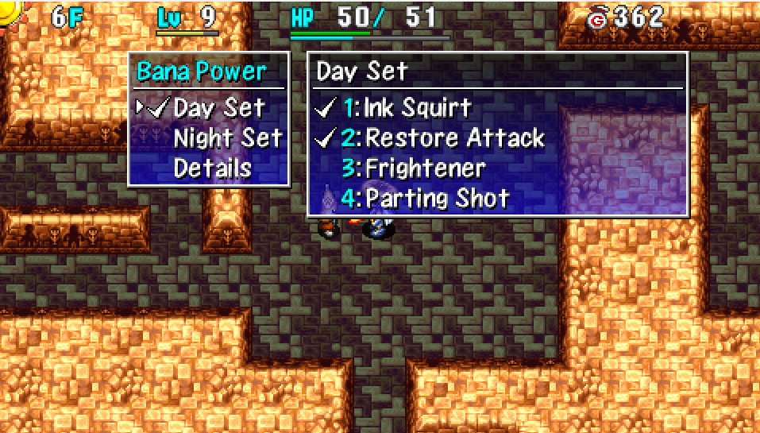
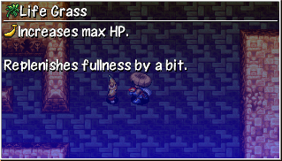

  

# Overview

Bana Powers are special attacks and abilities used by Banana Prince. 
They're learned by either getting hit by a thrown item, or getting hit by a monster's special attack.

Items that grant a Bana Power have a banana icon at the beginning of the item's description. ※ The banana icon is only displayed once you've entered Banana Kingdom at least one time.

  

Up to 8 Bana Powers can be learned at a time, with 4 being assigned to daytime, and 4 for nighttime. Banana Prince can use multiple Bana Powers in 1 turn if applicable, in order from top to bottom.

Bana Powers can be locked to avoid being overwritten when a new one is learned. 
Locked Bana Powers are represented by a checkmark next to the number.

<ul class="quickLinksUL">
  <li><a href="#bana-power-list">Bana Power List</a></li>
  <li><a href="#sets">Sets</a></li>
</ul>

# Bana Power List

<table class="moveTable">
  <tr>
    <th>Name</th>
    <th>Learning</th>
    <th>Description</th>
  </tr>
  <tr>
    <td>Banana Drop</td>
    <td>Banana Boss</td>
    <td>Monsters defeated by this attack occasionally drop a Yellow Banana.</td>
  </tr>
  <tr>
    <td>Banana Drop EX</td>
    <td>Banana Master</td>
    <td>Monsters defeated by this attack occasionally drop a Ripe Banana.</td>
  </tr>
  <tr>
    <td>Trap Toss</td>
    <td>Tiger Tosser</td>
    <td>Throw the target at a creature or onto a trap within 5 tiles. (5 damage) Won't throw at an enemy that is asleep, paralyzed, or has decoy status.</td>
  </tr>
  <tr>
    <td>Trap Hurl</td>
    <td>Tiger Hurler</td>
    <td>Throw the target at a creature or onto a trap within 10 tiles. (10 damage) Won't throw at an enemy that is asleep, paralyzed, or has decoy status.</td>
  </tr>
  <tr>
    <td>Trap Chuck</td>
    <td>Tiger Chucker</td>
    <td>Throw the target at a creature or onto a trap within 15 tiles. (15 damage) Won't throw at an enemy that is asleep, paralyzed, or has decoy status.</td>
  </tr>
  <tr>
    <td>Trap Throw</td>
    <td>Tiger Ace</td>
    <td>Throw the target at a creature or onto a trap within 20 tiles. (20 damage) Won't throw at an enemy that is asleep, paralyzed, or has decoy status.</td>
  </tr>
  <tr>
    <td>Parry Shield</td>
    <td>Swordsman</td>
    <td>Knocks a shield away from the target. (1 per monster)</td>
  </tr>
  <tr>
    <td>Parry Weapon</td>
    <td>Fencer</td>
    <td>Knocks a weapon away from the target. (1 per monster)</td>
  </tr>
  <tr>
    <td>Parry Bracelet</td>
    <td>Sensei</td>
    <td>Knocks a bracelet away from the target. (1 per monster)</td>
  </tr>
  <tr>
    <td>Parry Equipment</td>
    <td>Master</td>
    <td>Knocks a shield, weapon, or bracelet away from the target. (1 per monster)</td>
  </tr>
  <tr>
    <td>Weed Throw</td>
    <td>Field Knave type</td>
    <td>Throws Weeds at a target lined up within 10 tiles. (2 damage)</td>
  </tr>
  <tr>
    <td>Wood Arrow</td>
    <td>Boy Cart</td>
    <td>Shoot a Wood Arrow at a target lined up within 10 tiles.</td>
  </tr>
  <tr>
    <td>Iron Arrow</td>
    <td>Cross Cart</td>
    <td>Shoot an Iron Arrow at a target lined up within 10 tiles.</td>
  </tr>
  <tr>
    <td>Knockback Arrow</td>
    <td>Strong Cart</td>
    <td>Shoot a Knockback Arrow at a target lined up within 10 tiles.</td>
  </tr>
  <tr>
    <td>Silver Arrow</td>
    <td>Pierce Cart</td>
    <td>Shoot a Silver Arrow at a target lined up within 10 tiles.</td>
  </tr>
  <tr>
    <td>Ink Squirt</td>
    <td>Squid King</td>
    <td>Inflicts Blind status on a monster in front.</td>
  </tr>
  <tr>
    <td>Area Ink Squirt</td>
    <td>Squid Lord</td>
    <td>Inflicts Blind status on monsters in a 1 tile radius.</td>
  </tr>
  <tr>
    <td>Room Ink Squirt</td>
    <td>Squid Emperor, Squid Kaizer</td>
    <td>Inflicts Blind status on monsters in the room.</td>
  </tr>
  <tr>
    <td>Parting Shot</td>
    <td>Blade Bee, Dagger Bee</td>
    <td>Move 1 tile backward after performing an attack.</td>
  </tr>
  <tr>
    <td>Disengage</td>
    <td>Katana Bee, Zanbeeto</td>
    <td>Move to a tile within a 2 tile radius of the target after performing an attack.</td>
  </tr>
  <tr>
    <td>Hypnosis</td>
    <td>Gazer, Super Gazer, Hyper Gazer</td>
    <td>Inflicts Confused status on a monster in front.</td>
  </tr>
  <tr>
    <td>Room Hypnosis</td>
    <td>Ultra Gazer</td>
    <td>Inflicts Confused status on monsters in the room.</td>
  </tr>
  <tr>
    <td>Charge Strength</td>
    <td>Ironhead type</td>
    <td>Charge strength for 1 turn, then deal a critical hit.</td>
  </tr>
  <tr>
    <td>Sap</td>
    <td>Scorpion</td>
    <td>Lowers attack power of a monster in front by a small amount.</td>
  </tr>
  <tr>
    <td>Wilt</td>
    <td>Demon Scorp</td>
    <td>Lowers attack power of a monster in front by a medium amount.</td>
  </tr>
  <tr>
    <td>Enervate</td>
    <td>Stun Scorp</td>
    <td>Lowers attack power of a monster in front by a significant amount.</td>
  </tr>
  <tr>
    <td>Enfeeble</td>
    <td>Blight Scorp</td>
    <td>Lowers attack power of a monster in front by an incredible amount.</td>
  </tr>
  <tr>
    <td>2 Tile Rock</td>
    <td>Porky</td>
    <td>Throws a Porky Rock at a target within a 2 tile radius. (20 damage) Only throws rocks at targets within view.</td>
  </tr>
  <tr>
    <td>4 Tile Rock</td>
    <td>Porkchop</td>
    <td>Throws a Porky Rock at a target within a 4 tile radius. (20 damage) Only throws rocks at targets within view.</td>
  </tr>
  <tr>
    <td>6 Tile Rock</td>
    <td>Porkton</td>
    <td>Throws a Porky Rock at a target within a 6 tile radius. (20 damage) Only throws rocks at targets within view.</td>
  </tr>
  <tr>
    <td>10 Tile Rock</td>
    <td>Porkgon</td>
    <td>Throws a Porky Rock at a target within a 10 tile radius. (20 damage) Only throws rocks at targets within view.</td>
  </tr>
  <tr>
    <td>Poison Grass</td>
    <td>Mutaikon</td>
    <td>Throws Poison Grass at a target lined up within 10 tiles.</td>
  </tr>
  <tr>
    <td>Dizzy Grass</td>
    <td>Dazikon</td>
    <td>Throws Dizzy Grass at a target lined up within 10 tiles.</td>
  </tr>
  <tr>
    <td>Sleep Grass</td>
    <td>Dozikon</td>
    <td>Throws Sleepy Grass at a target lined up within 10 tiles.</td>
  </tr>
  <tr>
    <td>Rage Grass</td>
    <td>Mesmerikon</td>
    <td>Throws Rage Grass at a target lined up within 10 tiles.</td>
  </tr>
  <tr>
    <td>Rush</td>
    <td>Yanpii</td>
    <td>Charges at a monster, dealing a bit of damage and knockback.</td>
  </tr>
  <tr>
    <td>Sr. Rush</td>
    <td>Sr. Yanpii</td>
    <td>Charges at a monster, dealing some damage and knockback.</td>
  </tr>
  <tr>
    <td>Lt. Rush</td>
    <td>Lt. Yanpii</td>
    <td>Charges at a monster, dealing quite a bit of damage and knockback.</td>
  </tr>
  <tr>
    <td>Boss Rush</td>
    <td>Boss Yanpii</td>
    <td>Charges at a monster, dealing a lot of damage and knockback.</td>
  </tr>
  <tr>
    <td>Reflection</td>
    <td>Foly (Red)</td>
    <td>Reflects direct attacks instead of taking damage after activating. (1 turn) Effective against Absorbiphants and Gyazas.</td>
  </tr>
  <tr>
    <td>Heal Counter</td>
    <td>Foly (Green)</td>
    <td>Restores HP of the attacking monster after being hit by a direct attack.</td>
  </tr>
  <tr>
    <td>Lightning</td>
    <td>Foly (Blue)</td>
    <td>Deals 15 damage to monsters in the room.</td>
  </tr>
  <tr>
    <td>Status Counter</td>
    <td>Foly (Purple)</td>
    <td>Inflicts a status condition on the monster after being hit by a direct attack. (Bound, Inaccurate, Confused, or Berserk)</td>
  </tr>
  <tr>
    <td>Novice Magic</td>
    <td>DJ Mage</td>
    <td>Fires a magic bullet at a monster lined up in a straight line. (Knockback, Warp)</td>
  </tr>
  <tr>
    <td>Fair Magic</td>
    <td>MC Mage</td>
    <td>Fires a magic bullet at a monster lined up in a straight line. (Transient, Confused, Blind, 20 damage)</td>
  </tr>
  <tr>
    <td>Expert Magic</td>
    <td>MC Wizard</td>
    <td>Fires a magic bullet at a monster lined up in a straight line. (Paralyzed, Decoy, Sealed, Berserk, Level-1)</td>
  </tr>
  <tr>
    <td>Master Magic</td>
    <td>MC Sorceror</td>
    <td>Fires a magic bullet at a monster lined up in a straight line. (Banana, Empathy, Reduce HP to 1/4, Level-3)</td>
  </tr>
  <tr>
    <td>Absorb Status</td>
    <td>Absorbiphant type</td>
    <td>Absorbs status conditions from a target in front. (Can't absorb from self) Won't absorb Shiren's status conditions if he only has positive ones. Boosts attack power and heals bruising by 1 stage.</td>
  </tr>
  <tr>
    <td>Floor Magnet</td>
    <td>Fearabbit type</td>
    <td>Attracts Shiren and a number of other creatures on the floor to self. Performs a direct attack against 1 creature after attracting. Won't use unless separated from Shiren.</td>
  </tr>
  <tr>
    <td>Zap Counter</td>
    <td>Zapdon</td>
    <td>40 damage counter attack if hit by an attack after activating. (1 turn) Effective against Absorbiphants and Gyazas.</td>
  </tr>
  <tr>
    <td>Thunder Counter</td>
    <td>Thunderdon</td>
    <td>50 damage counter attack if hit by an attack after activating. (1 turn) Effective against Absorbiphants and Gyazas.</td>
  </tr>
  <tr>
    <td>Flash Counter</td>
    <td>Flashdon</td>
    <td>60 damage counter attack if hit by an attack after activating. (1 turn) Effective against Absorbiphants and Gyazas.</td>
  </tr>
  <tr>
    <td>Crash Counter</td>
    <td>Crashdon</td>
    <td>70 damage counter attack if hit by an attack after activating. (1 turn) Effective against Absorbiphants and Gyazas.</td>
  </tr>
  <tr>
    <td>Roar</td>
    <td>Maneater type</td>
    <td>Inflicts Afraid status to monsters in the room.</td>
  </tr>
  <tr>
    <td>Healing Light</td>
    <td>Herb, Otogiriso, Heal Grass, Life Grass</td>
    <td>Restores HP of allies in a 1 tile radius by 50 points.</td>
  </tr>
  <tr>
    <td>Restore Attack</td>
    <td>Strength Grass, Antidote Grass, Cleansing Bracelet</td>
    <td>Restores attack power of self and allies within a 1 tile radius. Shiren's strength will be restored.</td>
  </tr>
  <tr>
    <td>Clarity</td>
    <td>Clarity Bracelet</td>
    <td>Cures Confused status from self and allies within a 1 tile radius.</td>
  </tr>
  <tr>
    <td>Awaken</td>
    <td>Alert Bracelet</td>
    <td>Cures Asleep status from self and allies within a 1 tile radius.</td>
  </tr>
  <tr>
    <td>Remedy</td>
    <td>Medicine Scroll</td>
    <td>Cures all ailments from self and allies within a 1 tile radius.</td>
  </tr>
  <tr>
    <td>Icy Cold</td>
    <td>Ice Banana</td>
    <td>Makes Banana Prince immune to fire and explosion damage.</td>
  </tr>
  <tr>
    <td>Confuser</td>
    <td>Baffle Axe</td>
    <td>Direct attack that occasionally inflicts Confused status.</td>
  </tr>
  <tr>
    <td>Paralyzer</td>
    <td>Shockuto</td>
    <td>Direct attack that occasionally inflicts Paralyzed status.</td>
  </tr>
  <tr>
    <td>Sealer</td>
    <td>Seal Rod</td>
    <td>Direct attack that occasionally inflicts Sealed status.</td>
  </tr>
  <tr>
    <td>Sleeper</td>
    <td>Nap Rattle</td>
    <td>Direct attack that occasionally inflicts Asleep status.</td>
  </tr>
  <tr>
    <td>Blinder</td>
    <td>Dim Rod</td>
    <td>Direct attack that occasionally inflicts Blind status.</td>
  </tr>
  <tr>
    <td>Weakener</td>
    <td>Kamina's Sword</td>
    <td>Direct attack that occasionally lowers the target's attack power.</td>
  </tr>
  <tr>
    <td>Frightener</td>
    <td>Fear Scroll, Fear Talisman</td>
    <td>Direct attack that occasionally inflicts Afraid status.</td>
  </tr>
  <tr>
    <td>Repulsor</td>
    <td>Knockback Staff</td>
    <td>Direct attack that occasionally deals knockback.</td>
  </tr>
  <tr>
    <td>Dazer</td>
    <td>Miss Talisman</td>
    <td>Direct attack that occasionally inflicts Inaccurate status.</td>
  </tr>
  <tr>
    <td>Shadow Stitch</td>
    <td>Bind Talisman</td>
    <td>Direct attack that occasionally inflicts Bound status.</td>
  </tr>
</table>

#### Unused Bana Powers

<table class="moveTable">
  <tr>
    <th>Name</th>
    <th>Description</th>
  </tr>
  <tr>
    <td>Mega Absorption</td>
    <td>Absorb status conditions.</td>
  </tr>
  <tr>
    <td>Super Absorption</td>
    <td>Absorb status conditions.</td>
  </tr>
  <tr>
    <td>Ultra Absorption</td>
    <td>Absorb status conditions.</td>
  </tr>
  <tr>
    <td>Room Magnet</td>
    <td>Attract creatures in the room.</td>
  </tr>
  <tr>
    <td>Restore Sight</td>
    <td>Cure Blind status.</td>
  </tr>
  <tr>
    <td>Calm</td>
    <td>Cure Berserk status.</td>
  </tr>
  <tr>
    <td>Sharp Eyes</td>
    <td>Grant Sharp Eyes status.</td>
  </tr>
  <tr>
    <td>Trap Buster</td>
    <td>Destroy a trap.</td>
  </tr>
</table>

 

# Sets

This section provides recommendations for Bana Power sets. 

Banana Kingdom only has Explochins and Firepuffs for explosion / fire damage. 
Mutaikons and Scorpions gain attack power when hit by Poison Grass, and Bored Kappas throw it back. Banana Prince can cure slow, inaccurate, and attack down status from himself with Remedy.

#### 1. Shiren Support (Banana Kingdom)

##### Day

- Frightener, Sleeper, or Icy Cold
- Poison Grass
- Remedy
- Healing Light

##### Night

- Novice Magic
- Restore Attack
- Remedy or Absorb Status
- Room Ink Squirt or Room Hypnosis

#### 2. Prince Power Up (Banana Kingdom)

##### Day

- Absorb Status
- Poison Grass
- Room Ink Squirt or Room Hypnosis
- Frightener or Sleeper

##### Night

- Icy Cold
- Room Ink Squirt
- Absorb Status
- Novice Magic

#### 3. Three Allies Expert Badge (Platinum Paradise)

##### Day

- Icy Cold
- Absorb Status
- Roar, Room Ink Squirt, or Room Hypnosis
- Healing Light

##### Night

- Icy Cold
- Healing Light
- Room Ink Squirt
- Absorb Status
