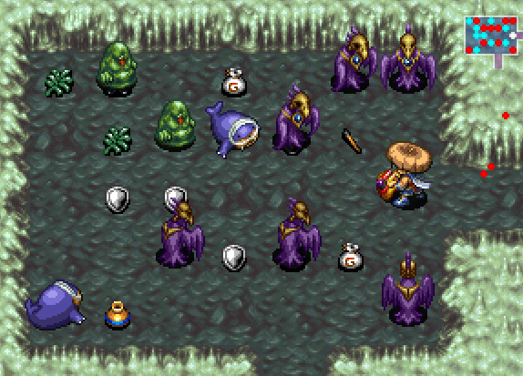
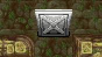
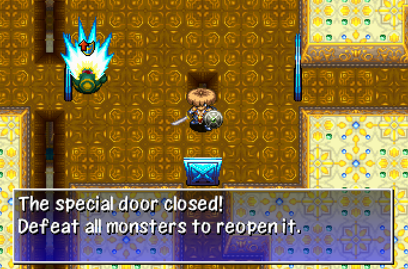
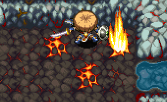

This page offers explanations for dungeon features and gimmicks.

<ul class="quickLinksUL">
  <li><a href="#shop">Shop</a></li>
  <li><a href="#monster-house">Monster House</a></li>
  <li><a href="#traps">Traps</a></li>
  <li><a href="#winds-of-kron">Winds of Kron</a></li>
  <li><a href="#hidden-room">Hidden Room</a></li>
  <li><a href="#hidden-hallway">Hidden Hallway</a></li>
  <li><a href="#shiny-object">Shiny Object</a></li>
  <li><a href="#item-island">Item Island</a></li>
  <li><a href="#gitan-room">Gitan Room</a></li>
  <li><a href="#buried-item">Buried Items</a></li>
  <li><a href="#maze-room">Maze Room</a></li>
  <li><a href="#spear-door">Spear Door</a></li>
  <li><a href="#iron-door">Iron Door</a></li>
  <li><a href="#special-door">Special Door</a></li>
  <li><a href="#lava">Lava</a></li>
  <li><a href="#vanishing-tiles">Vanishing Tiles</a></li>
  <li><a href="#moving-floor">Moving Floor</a></li>
  <li><a href="#moving-water">Moving Water</a></li>
  <li><a href="#moving-walls">Moving Walls</a></li>
  <li><a href="#tidal-wave">Tidal Wave</a></li>
</ul>

### Shop

#### Regular Shop

Shops are rooms containing a single shopkeeper and merchandise for sale. 
The ground is covered in carpet, and there are no traps inside the room. 
It's possible to create Pit Traps by breaking a Black Hole Pot. Zalokleft Pot is nullified while standing on a carpeted tile.

  

The shopkeeper can tag an item if you talk to him while not having picked up any merchandise. ※ Shopkeepers cannot identify merchandise using an Identify Scroll in this game.

- Place a Tag
    - Costs 2000 Gitan.
    - Nice way to take home rare items in dungeons that don't allow carry-in items.

Disguised N'dubba monsters can be sold to the shopkeeper. 
However, if you then reveal their disguise, the shopkeeper will ask for payment.

Shopkeepers won't attack monsters even if they get hit by them. 
Shopkeepers warp to you if you're about to leave the shop while carrying merchandise, but won't warp if you're standing diagonal to the entrance. He'll ask for payment every turn in this position.

#### Elite Shop

Shop hidden inside a wall and guarded by a shopkeeper at the end of a hallway. 
An Invitation is needed to be granted entry. 
There are fewer items for sale, which are usually much higher in quality. 
Like regular shops, the shopkeeper can tag equipment.

  

Invitation is a scroll, so it can be written on a Blank Scroll after you've read it once. The Invitation is consumed when it's shown to the shopkeeper, but it can be reused if it was blessed.

The shop can be revealed by punching the wall, and doing so won't trigger Thief Mode. However, if you step inside the shop without being granted entry, Thief Mode will be triggered. Unlike regular shops, an elite shop won't join together with other rooms if you expand it.

#### Pick-A-Choice Shop

Shop featuring a mini-game where you either obtain a rare item or fall into a Pit Trap.

- Costs 1000 Gitan per play.
- Wins and losses are recorded in [Adventure Footprints](/system/adventure-footprints).
- If you win, you can challenge it again on the same floor.
    - Rare item and Pit Trap placements can change sides from the previous play.
- It's possible to cheat by throwing a rock to check the winning side.
    - See [Tips and Tricks](/guides/tips-and-tricks) for details.

 

  [Image]

Other Pick-A-Choice Shop Notes:

- The walls of the shop can't be destroyed.
- It's possible to switch positions with the shopkeeper.
- The launch pads and Pit Traps inside the shop always activate.
    - Even if you have a Trapper Bracelet equipped.
- End points are hidden each time you play.

#### Merchandise

- Price tag is removed if a Mixer eats the item, or if the item is thrown outside the shop.
    - This means merchandise can be synthesized using Mixers.
    - The shopkeeper still requires payment for said items.
- Won't transform into a different item if inserted into a Presto Pot.
    - Sale Pot and Banana Scroll are effective.
- Won't be synthesized if inserted into a Synthesis Pot.
    - The item gets synthesized if you pay for the item and insert another item.
- Cannot write on Blank Scrolls that have a price tag.

#### Item Table

The item table for dungeons is split into the following categories:

- Floor items, day monster drops
- Regular shops, night monster drops, Maneater drops, shiny object (yellow)
- Elite shops, Pick-A-Choice shops, shiny object (blue)
- Presto Pot
- Zalokleft drops
- Mealy drops, rescue reward

#### Shopkeeper

Shopkeepers turn hostile if you deal damage, hit them with an item or magic bullet, etc. The dot representing the shopkeeper on the map changes from yellow to red. You cannot talk to a hostile shopkeeper, so you have to either fight or run.

Their anger subsides once they've defeated you, unless Thief Mode is active. (So if you revive using Revival Grass, you can talk to them again)

They have special dialogue if you talk while they're wandering around outside their shop.

#### Thief Mode

Occurs when you exit a shop without paying for merchandise, or if you enter an elite shop without showing an Invitation.

- All enemies on the current floor change into shopkeepers.
- New shopkeepers are immediately generated until the 20 character limit is reached.
- Enemy spawn cycle speeds up. (1 shopkeeper every 5 turns)
- Monsters that were on water, air, or wall tiles will warp to a room.
- Monster house turns into an enforcer house. (Special monster house)

Hostile Shopkeepers:

- Status conditions are effective, including necklace abilities like Darkroom.
    - Three Screams can be used to one-shot them in this game.
- Ignore Sanctuary Scrolls.
- Receive damage from thrown Gitan like normal. (Unlike Maneaters)
- Don't change color when they level up.

Changes to Actions:

- Cannot return to Boronga Village via Escape Scroll or Undo Grass.
- Cannot request a rescue if you collapse.
- Cannot talk to allies or wandering NPCs.
- Equipment tags remain functional.

### Monster House

Monster houses are rooms packed with monsters, items, and hidden traps.

  

#### Characteristics

There are 2 categories of monster houses:

- Regular: Contains monsters chosen from the current floor's monster table.
- Special: Contains specific families even if they're not in the current floor's monster table.

Encounter types:

- Initial: Monster house is present and visible from the start of the floor.
- Sudden: Monster house suddenly appears while walking inside a room.
- Re-entry: Monster house appears when you re-enter a room.

The music changes, and an announcement is displayed in the scrolling messages window. The music differs between regular and special monster houses.

Mon House Scroll can be read to generate a monster house, but enemies will get 1 action after being generated before you can act unless you ate Swift Grass beforehand. 
If the scroll is read in a hallway or shop, you'll warp to a random room first. 
If there's already a monster house, the next floor turns into a single room monster house.

#### Encounter Types

Initial: Monster house is present and visible from the start of the floor.

- Items like Monster Detector can be used to detect the monster house beforehand.
- Easy to tell if there are lots of monsters and items near a room's entrance.
- All enemies in the room have Napping status, and wake up when you enter the room.
    - Includes Absorbiphant monsters.
- Thin out monsters before entering using arrows, talismans, Pierce Bracelet, etc.

Sudden: Monster house suddenly appears while walking inside a room.

- Cannot be avoided by checking for traps or eating Sight Grass.
- The exact trigger condition is unknown.
    - Possibly completely random, or caused by stepping on a specific tile.
- The most dangerous type, since you can get caught in the middle of a room.
- Use items like Pinning Staff, Warp Grass, or Confusion Scroll to overcome it.

Re-entry: Monster house appears when you re-enter a room.

- Often catches players off guard since they've already been inside the room.
- Dangerous if you're running from an enemy in a hallway.
    - High level Gyazas in particular can end a run unless you have Warp Grass.
- If you're not in a rush, go ahead and re-enter rooms to check for these.

#### Special Monster House

Found in dungeons other than Emerald Terrace. 
Contains specific families even if they're not in the current floor's monster table. 
Unlike past games, early floor special monster houses only contain Lv1\~2 monsters.

<table class="firstYellowTable">
  <tr>
    <th>Name</th>
    <th>Monsters (Family)</th>
  </tr>
  <tr>
    <td>Greed</td>
    <td>Kengo, Zalokleft, Froggo, Gyadon, Mixer, Curse Girl</td>
  </tr>
  <tr>
    <td>Harassment</td>
    <td>Yanpii, Gazer, Spin Polygon, Curse Girl, Fearabbit, Gyaza, Absorbiphant, Explochin, DJ Mage, Scorpion, Cheer Ham</td>
  </tr>
  <tr>
    <td>Explosive</td>
    <td>Pop Tank, Dragon, Firepuff, Explochin, Flash Bird</td>
  </tr>
  <tr>
    <td>Aquatic</td>
    <td>Bored Kappa, Explochin, Slime, Gyaza, Squid King, Hopodile</td>
  </tr>
    <tr>
    <td>Projectile</td>
    <td>Bored Kappa, Porky, Mutaikon, Floaty, Field Knave</td>
  </tr>
  <tr>
    <td>Power</td>
    <td>Ironhead, Eligan, Gyadon, Tiger Tosser, Zapdon, Pop Tank, Absorbiphant, Dragon, Porky, Gyaza, Scorpion, Kengo</td>
  </tr>
  <tr>
    <td>Sky</td>
    <td>Firepuff, Gyadon, Blade Bee, Pumphantasm, Crow Tengu, Foly</td>
  </tr>
  <tr>
    <td>Enforcers</td>
    <td>Shopkeeper ※ Read a Mon House Scroll while in Thief Mode.</td>
  </tr>
</table>

### Traps

List of traps and their effects. 
→ [Traps](/system/traps)

    

### Winds of Kron

If you linger on a floor too long, wind will blow you away. 
The first 3 gusts are warnings, and the 4th forces you back to Boronga Village. 
Revival Grass and Undo Grass don't take effect, and you lose all items and Gitan.

  [Image]

Hurry to the exit when a warning is displayed, and use an Escape Scroll if you can't make it in time. ※ Eating Undo Grass doesn't prompt you to escape in this game.

Warning Messages:

1. It's getting windy.
2. The wind is picking up.
3. The wind is gusting strongly!

### Hidden Room

Room buried inside a wall, which can be revealed by attacking the room's edge. 
It can also be revealed by equipping an Alleyway Bracelet and approaching the entrance, or by equipping a Wall Clip Bracelet and stepping into the buried room.

  [Image]

The stairs can be generated inside hidden rooms. 
People online aren't joking when they say punch walls on floors where there's no path forward.

### Hidden Hallway

Hallway buried inside a wall, which can be revealed by attacking the entrance. 
It can also be revealed by equipping an Alleyway Bracelet and approaching the entrance, or by equipping a Wall Clip Bracelet and stepping into the buried hallway. 
Shiren will stop next to a hidden hallway's entrance if you dash along the wall.

### Shiny Object

Tile where either an item or monster is buried in the ground. 
Only 1 shiny object can be generated on a floor.

If it's an item, it's randomly selected from the shop / night monster drop table. 
They're not visible on the map, so use the Scout command to search for them.

  

There's also a rare variant that requires at least 9 strength to dig up. In this case, the item is randomly selected from the elite shop table.

  

### Item Island

Ground surrounded by a waterway with 3 items and a Spring Trap.

  [Image]

How to Obtain Items:

- Use a Zalokleft Pot.
- Read a Desert Scroll.
- Swing a Swap Staff or Pinning Staff at a Floating or Aquatic type monster.
- Equip a Strider Bracelet and walk across the water tiles.

### Gitan Room

Room surrounded by wall tiles, containing 15 bags of Gitan and 1 Spring. 
One Napping enemy is always generated inside the room at the start of the floor.

  

Can be detected using Monster Detector, Item Detector, Navigation Scroll, etc. 
Items like Rusty Pickaxe, Rusty Pick, Tunnel Staff, or Wall Clip Bracelet are needed to enter. 
Rarely connected to a waterway, letting you enter using a Strider Bracelet. 
Wandering NPCs can occasionally be generated inside the room.

### Buried Items

Items generated inside walls at the start of the floor.

Shiren will stop 1 tile before a buried item if you dash along the wall. 
If nothing happens when you punch the wall after Shiren stops, take 1 step forward and destroy the adjacent wall tile to locate a buried item. (Wall Clip Bracelet can be used to obtain the item without destroying the wall)

### Maze Room

Room shaped like a maze. 
It's treated as a room despite consisting of hallways, meaning items can be found. However, traps and stairs are never generated in mazes, unless the entire floor is a maze.

  [Image]

### Spear Door

Door that automatically closes when Shiren walks past. 
Monsters have to break it before they can move past it, and it breaks rather easily. 
Projectiles and magic bullets can fly through it and hit characters on the other side. The stairs are never located inside rooms with spear doors.

  

Face the door and press A to manually open the door. (Doesn't end your turn) Unfortunately, this means you can't attack an enemy standing in front of a door unless you have the Tri-direction rune and aim diagonally. 

### Iron Door

Door that automatically closes when Shiren walks past. 
Monsters have to break it before they can move past it, and it's sturdier than spear doors. Projectiles and magic bullets cannot fly through it. 
The stairs are never located inside rooms with iron doors.

  

Face the door and press A to manually open the door. (Doesn't end your turn) Like spear gates, you need the Tri-direction rune to hit an enemy standing in front of the door.

### Special Door

Door that automatically closes when Shiren enters the room and there's at least 1 monster. The doors only open after all monsters are defeated, or if you warp out of the room. Monsters won't try to break the doors, and will instead turn around. The stairs are never located inside rooms with special doors.

  

### Lava

Tile where lava flows out and deals 30 damage to characters in a 1 tile radius after a few turns. Items are also destroyed, and the tile becomes impassable before lava flows out. Lava won't flow out if there's an object on the glowing tile. The stairs are never located inside rooms with lava.

  

The 1/2 Fire rune reduces lava damage by 50%, and Flash Birds will be healed. Lava won't flow out inside a Monster House until all initially placed monsters are defeated, and if the entire floor was a monster house, lava won't flow out at all. 

### Vanishing Tiles

Ground tiles that change into air tiles after you step off of them.

  

### Moving Floor

Room where the ground tiles shift around every few turns. 
Only appears on floors that have air tiles.

  

### Moving Water

[Information]

  [Image]

### Moving Walls

[Information]

  [Image]

### Tidal Wave

Event exclusive to the DS version of the game.

The message "It's an earthquake! A tidal wave is impending." is displayed, 
and then a tidal wave that affects the entire floor occurs after a few turns. 
Unlike Flood Traps in Shiren 2, tidal waves don't deal any damage.

The terrain changes, items vanish, upgrade value of all equipment not in pots decreases by 1, scrolls get wet, and bananas turn into Spoiled Bananas.

There's a decent length of time before the tidal wave occurs, so you can usually make it to the stairs if you hurry unless you're very far away.

