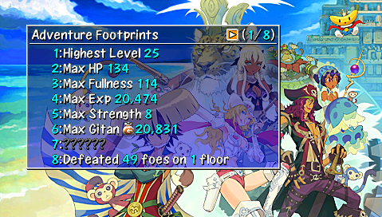

## Overview

This page provides information for Shiren 4's various gameplay systems and mechanics.

<ul class="quickLinksUL">
  <li><a href="#shiren">Shiren</a>
    <ul>
      <li><a href="#fullness">Fullness</a></li>
      <li><a href="#necklace-abilities">Necklace Abilities</a></li>
      <li><a href="#status-conditions">Status Conditions</a></li>
      <li><a href="#hp-regeneration">HP Regeneration</a></li>
      <li><a href="#damage-calculation">Damage Calculation</a></li>
      <li><a href="#accuracy">Accuracy</a></li>
    </ul>
  </li>
  <li><a href="#item">Item</a>
    <ul>
      <li><a href="#item-tables">Item Tables</a></li>
      <li><a href="#resonance">Resonance</a></li>
      <li><a href="#equipment-upgrade-value">Equipment Upgrade Value</a></li>
      <li><a href="#equipment-growth">Equipment Growth</a></li>
      <li><a href="#equipment-tags">Equipment Tags</a></li>
      <li><a href="#blessing-/-curse-/-seal">Blessing / Curse / Seal</a></li>
      <li><a href="#synthesis">Synthesis</a></li>
    </ul>
  </li>
  <li><a href="#dungeon">Dungeon</a>
    <ul>
      <li><a href="#allies">Allies</a></li>
      <li><a href="#npcs">NPCs</a></li>
      <li><a href="#dungeon-features">Dungeon Features</a></li>
      <li><a href="#map-patterns">Map Patterns</a></li>
      <li><a href="#monster-house">Monster House</a></li>
      <li><a href="#traps">Traps</a></li>
      <li><a href="#day-/-night">Day / Night</a></li>
      <li><a href="#monsters">Monsters</a></li>
      <li><a href="#monster-auras">Monster Auras</a></li>
      <li><a href="#monster-spawns">Monster Spawns</a></li>
    </ul>
  </li>
  <li><a href="#facilities">Facilities</a>
    <ul>
      <li><a href="#storehouse">Storehouse</a></li>
      <li><a href="#monkey-express">Monkey Express</a></li>
    </ul>
  </li>
  <li><a href="#other">Other</a>
    <ul>
      <li><a href="#adventure-footprints">Adventure Footprints</a></li>
      <li><a href="#expert-badges">Expert Badges</a></li>
    </ul>
  </li>
</ul>

## Shiren

### Fullness

Shiren has a fullness gauge, and takes 1 damage per turn once it reaches 0. 
Fullness decreases by 1 every 10 turns, so periodically eat food to replenish fullness.

Bananas ripen in the order of Green Banana → Yellow Banana → Ripe Banana → Spoiled Banana. If a banana spoils, you can make it safe to eat again by grilling it. (Get hit by fire or explosion damage)

  

### Necklace Abilities

Special attacks that can only be used at night. 
→ [Necklace Abilities](/system/necklace-abilities)

  

### Status Conditions

States that affect a character's behavior in various ways. 
→ [Status Conditions](/system/status-conditions)

  

### HP Regeneration

Shiren's HP regenerates as he walks or steps in place (A+B). (HP won't regenerate when any other action is performed)

  

HP regeneration speed is linked to max HP, and slows down as your max HP increases. ※ Shiren 4's HP regeneration speed is much slower than Shiren 5.

|Max HP | Per Turn|
|-|-|
|15~35|1.5|
|40|1.25|
|50|1.167|
|60|1.083|
|70|1.0|
|80|0.889|
|90|0.778|
|100|0.694|
|110|0.639|
|113|0.611|
|119|0.583|
|124|0.556|
|129|0.528|
|135+|0.5|

Source 1: [HP - 組長式(アーカイブ)](http://web.archive.org/web/20150308144948/http://kumicyou.sakura.ne.jp/siren4/sisu_hppp.html) Source 2: [シレン4、シレン5　自然回復量　【データ】 - 24番目の風来日記](http://shiren2424.blog.fc2.com/blog-entry-127.html)

### Damage Calculation

Source: [通常ダメージ - 組長式(アーカイブ)](http://web.archive.org/web/20150308144942/http://kumicyou.sakura.ne.jp/siren4/sisu_dame.html)

### Accuracy

#### Direct Attacks

92% without a weapon.

Accuracy increases while equipped with a leveled up weapon. The Charge rune raises accuracy to 100% for 1 hit after 2 misses.

|Weapon Level  |Lv1\~3   |Lv4\~5  | Lv6\~7  | Lv8|
|-|-|-|-|-|
|Accuracy | 92%  | 93% |  94%  | 95%|

#### Projectiles

84%

#### Monster Direct Attacks

88% under normal circumstances.

Accuracy decreases if a Spry Shield is equipped. (Shiren's evasion increases) 
The Agile rune is equivalent to Spry Shield Lv1.

※ Spry Shield's evasion increase hasn't been tested in Shiren 4.

Source: [攻撃の命中率 - 組長式(アーカイブ)](http://web.archive.org/web/20150308144957/http://kumicyou.sakura.ne.jp/siren4/sisu_meit.html)

## Item

### Item Tables

Source: [アイテムの入手 - 組長式(アーカイブ)](http://web.archive.org/web/20150511065752/http://kumicyou.sakura.ne.jp/siren4/sisu_drop.html)

### Resonance

Certain weapons, shields, and bracelets activate special effects when equipped at the same time. 
→ [Resonance](/system/resonance)

  

### Equipment Upgrade Value

Weapons and shields can be upgraded beyond their base strength, up to the "Limit" value. Upgrade limit can be increased by leveling up the item. (See next section)

  

How to upgrade:

- Pay a village blacksmith to upgrade 1 item. (Once per adventure)
- Pay a smith [NPC](/system/npcs) to upgrade 1 item while inside a dungeon.
- Read a Heaven Scroll (weapon) or Earth Scroll (shield).

Notes:

- The number following the item name indicates the current upgrade value.
- Upgrade value can decrease from things like Rust Trap and Slime special attacks.
    - It can't decrease any further once the item's strength reaches 0.

### Equipment Growth

Weapons and shields earn growth experience points when you defeat enemies using direct attacks. For the sake of keeping the term short, this site refers to it as skill points.

※ You don't earn skill points if you defeat enemies using projectiles, abilities, magic bullets, etc.

  

Notes:

- The item's name changes, and strength, upgrade limit, and rune slots often increase. (Example: Katana 6 atk / 10 limit → Good Katana 7 atk / 15 limit)
- Weapons or shields can gain runes through leveling up, and have a maximum level of 8. (Example: Beast Fang gains Rustproof at Lv5)
- Skill points can't be seen, and each monster grants a predetermined amount. (Example: Mamel = 1 point)
- Generally, stronger / higher level monsters offer more skill points. (Example: Cave Mamel = 70 points)
- Equipment levels up once the skill points total reaches the item's assigned threshold. (Example: Katana → Good Katana once skill point total reaches 300 points)

Check the [Monsters](/system/monsters) page for monster skill point values.

### Equipment Tags

Tags can be placed on weapons or shields, and ensures the item goes to Gonchiki Village if lost. Up to 8 tags can be placed on items, and the tag is erased when you pick the item up. The Watchman's Lodge is located to the right of the Blacksmith in Gonchiki Village.

  

Placing a tag:

- Purchase from Watchman's Lodge (Gonchiki Village) or village shops for 3000 Gitan.
- Purchase from [Tag Shop](/system/npcs) for 2000 Gitan.
- Read a [Tag Scroll](/items/scrolls) and select a weapon or shield.

Erasing a tag:

- Request to have the tag erased. (Watchman's Lodge or village shops)
- Tagged item was delivered to the Watchman's Lodge.
- Sold the item inside a dungeon shop.
- Small chance when hit by a Slime monster's special attack.
    - Safe if you keep your equipment plated.

Item is lost even with Tag:

- Item transformed into a banana or Weeds.
- Item inserted into a Presto or Sale pot.
- Quit the game without suspending properly / game froze.
    - If you were carrying the item when this occurred.

### Blessing / Curse / Seal

Items can be blessed, cursed, or sealed. (Excluding arrows, rocks, and talismans) 
They can occasionally be found on the ground with these statuses, and you won't 
be able to determine an unidentified item's status until you use it. 

Once an item is identified, its status will be represented by an icon, if applicable:

<table class="tableWithImages">
  <tr>
    <th>Icon</th>
    <th>Type</th>
    <th>Basic Effect</th>
  </tr>
  <tr>
    <td></td>
    <td>Blessed</td>
    <td>Boosted effect.</td>
  </tr>
  <tr>
    <td></td>
    <td>Cursed</td>
    <td>Can't unequip.</td>
  </tr>
  <tr>
    <td></td>
    <td>Sealed</td>
    <td>Unable to be used.</td>
  </tr>
</table>

The effects of these statuses differ based on item category. (See table below)

- Gaining a status
    - Blessing: Blessing Pot, Purifier NPC, night monster drop.
    - Curse: Curse Trap, Curse Girl special attack, Imabikiso, Curse Pot.
    - Seal: Curse Trap, item stolen by Bad Zalokleft (Lv1~3), Imabikiso, Curse Pot.
- Removing a status
    - Curse / Seal: Purify Scroll, Purify Pot, Heaven Scroll, Earth Scroll, Plating Scroll, bless the item, Purifier NPC.
    - Holy Bracelet protects your items from getting cursed or sealed.

Effect details by item category:

|Item | Blessed |  Cursed  |Sealed|
|-|-|-|-|
|Weapon | Increased attack (Chance to wear off) | Can't unequip |  Upgrade value and runes are nullified, doesn't gain skill points|
|Shield | Increased defense (Chance to wear off) | Can't unequip |  Upgrade value and runes are nullified, doesn't gain skill points|
|Bracelet | Can't be cursed or sealed (Chance to wear off) | Can't unequip |  Bracelet's effect is nullified|
|Arrow, Rock |  -  | - |  -|
|Staff |  Doubled effect (Chance to wear off) | - |  Unable to be used, no effect if thrown|
|Talisman | - |  - |  -|
|Scroll | Reusable (Some exceptions *1) |  - |  Unable to be used|
|Grass |  Doubled effect (Some exceptions *1) |  -  | Unable to be used, no effect if thrown|
|Pot |  Can't be cursed or sealed (Chance to wear off) | -   |Can't use [Insert] or [Open] commands|
|Food | Doubled effect | - |  Unable to be used|
|Torch  | Doubled duration | -   |Can't be equipped|
|Gitan | Deals damage equal to value when thrown|   -  | Doesn't get added to your wallet, deals 2 damage when thrown.|

*1 Exceptions:

- Scroll
    - Suction Scroll - Blesses all extracted items, but can't be reused.
- Grass
    - Growth Seed - Effect is active for the duration of the current floor. (Normally 100 turns)
    - Revival Grass, Undo Grass - Reusable.

### Synthesis

Synthesize weapons and shields to merge upgrade values and runes (special abilities). Combine same name staves to add their use counts together.

  

#### Synthesis Effects

Weapons, Shields:

- First item is the base. Runes and upgrade value of subsequent items are added to it. (Example: Katana first, Hatchet+1 second → Katana+1 with Critical rune)
- Each item has a "rune slots" value, and no more runes can be added once you reach the limit. (Example: Katana has 4 rune slots)
- Innate runes get stronger as the item levels up, but synthesized runes are always the Lv1 effect. (Example: Lv4 Water Cutter = 225%, Lv4 Katana with Anti-Aquatic rune = 150%) → [Rune Multipliers](/system/synthesis-runes#multipliers)

Staves:

- Adds use counts together. Can only combine same name staves. (Example: Knockback Staff [3] first, Knockback Staff [4] second → Knockback Staff [7])

#### Different Category Synthesis

Normally, you can only synthesize weapons with weapons, and shields with shields. However, specific different category items can be synthesized by Mixers to add runes. 
(Example: Dragon Grass + Weapon = Anti-Dragon rune) → Check [Rune List](/system/synthesis-runes#rune-list) for all possible combinations.

#### Synthesis Methods

Synthesis Pot:

  

 

- Insert same category items to synthesize them. (Weapons, Shields, or Staves)
- Insert an identified staff last to result in an identified staff.
- Items with price tags won't get synthesized if inserted.

Mixer:

  

 

- Throw items at a Mixer to synthesize them.
- Mixers won't eat items when they're afflicted with certain [status conditions](/system/status-conditions).
    - Will eat: Any status conditions besides the ones listed below.
    - Won't eat: Napping, Asleep, Slumber, Sealed, Paralyzed, S-Paralyzed, Banana, Slip.
- Mixers can only eat a set number of items, based on their level. 
(Mixer = 2, Mixermon = 3, Mixergon = 4, Mixerdon = 5)
- Mixers turn toward the direction the item came from when they eat an item.
- Mixers drop eaten items when they slip on a Banana Peel.
    - However, the number of times they can eat items doesn't get reset.
- Items with price tags will get synthesized.
    - You still have to pay for the items.
- An equipped torch can be thrown at a Mixer to refresh the torch.

#### Blessed, Cursed, Sealed, Identified

Synthesized items generally take on the status of the item that was inserted or thrown last. Example 1: Red Blade (blessed) + Water Cutter (cursed) → Red Blade (cursed) Example 2: Unlucky Staff (sealed) + Unlucky Staff (regular) → Unlucky Staff (regular)

※ Non-equipment items don't get identified if they're thrown after the weapon or shield, 　so always throw non-equipment items first. (Order doesn't matter in Shiren 5)

#### Common Mistakes

- Threw a Synthesis Pot while a Pierce Bracelet was equipped.
    - Check equipped bracelets beforehand.
- Main weapon vanished after being thrown at a Napping Mixer.
    - Mixers function differently in Shiren 4 and 5, so always wake them up first.
- Stepped on a Landmine / Pit Trap while walking over to the synthesized item.
    - Perform direct attacks over tiles to check for traps while approaching the item.
- A Pop Tank monster destroyed the item after synthesizing.
    - Use the Scout command to check for Pop Tank monsters on floors where they appear.
- The resulting staff became sealed after combining same name staves.
    - Swing the staff you to intend to synthesize last to check if it's sealed.

## Dungeon

### Allies

Allies are optional NPCs who fight alongside Shiren. → [Allies](/system/allies)

  

### NPCs

Characters who wander around inside dungeons and help Shiren out in various ways. 
→ [Wandering NPCs](/system/npcs)

  

### Dungeon Features

Details for things like shops, hidden hallways, shiny objects, item islands, lava, etc. 
→ [Dungeon Features](/system/dungeon-features)

  

### Map Patterns

List of map patterns used in the game. 
→ [Map Patterns](/system/map-patterns)

  [Image]

### Monster House

Information about Monster Houses. 
→ <a href="/system/dungeon-features#monster-house">Monster House</a>

  

### Traps

List of traps and their effects. 
→ <a href="/system/traps">Traps</a>

    

### Day / Night

Some dungeons have day and night cycles that change based on the number of elapsed turns. The Shrine of Night Adventures in Boronga Village offers a tutorial.

  

The monster table is different between day and night, and all monsters on the floor vanish and new ones are generated when time of day changes.

When it changes from:

- Day to Night → day monsters vanish, and night monsters are generated.
- Night to Day → night monsters vanish, and day monsters are generated. 

Night:

- Direct attacks only deal 1 damage to night monsters, so use [Necklace Abilities](/system/necklace-abilities) to defeat them.
    - Up to 8 abilities can be assigned. (Talk to the Librarian in Boronga Village to edit)
    - Once an ability is used, it can't be used again until you change floors.
    - Special effects from items like staves and scrolls are effective.
    - Fixed damage attacks like Dragon Grass also only deal 1 damage.
        - However, Empathetic status is effective.
- Field of view is reduced to a 1 tile radius.
    - Equip a torch to expand your field of view. (Higher grade torches provide a larger radius)
    - Night monsters deal far greater damage to you without a torch equipped.
    - Scrolls cannot be read at night without light.
- The Scout command cannot be used unless you've read a Navigation Scroll.
- Items dropped by night monsters are always blessed, and are chosen from the shop table.
    - In other words, generally higher quality than items you find on the ground.

Day:

- Direct attacks deal damage like normal to day monsters, and abilities cannot be used.

### Monsters

Details for enemies that appear inside dungeons. 
→ [Monsters](/system/monsters)

  

### Monster Auras

  

Status condition that monsters can have when they spawn naturally. 
Monsters made to appear (Summon Trap, Mon House Scroll, etc.) never have auras, 
and some dungeons and specific floors have monster auras disabled.

Monster auras can be removed by reading a Dispel Aura Scroll, swinging a Seal Staff, or hitting the target with a Seal Talisman. However, monsters with auras provide x2.0 exp and x1.25 skill points, so it's important to hunt them when possible.

Aura effects vary by color:

<table>
  <tr>
    <th>Color</th>
    <th>Effect</th>
  </tr>
  <tr>
    <td class="highlightRed">Red</td>
    <td>Increased attack power.</td>
  </tr>
  <tr>
    <td class="highlightBlue">Blue</td>
    <td>Increased defense.</td>
  </tr>
  <tr>
    <td class="highlightYellow">Yellow</td>
    <td>Increased action speed. (2 stages)</td>
  </tr>
</table>

### Monster Spawns

[Information]

## Facilities

See [Villages](/system/villages) for a complete list of available facilities.

### Storehouse

Store up to 80 items, or 5 x 80 = 400 items if you fill it with Preservation Pot [5]. Select multiple items using the R button.

  [Image]

### Monkey Express

Fast travel to places you've been to before. 
→ [Monkey Express](/system/villages#boronga-monkey-express)

  

## Other

### Adventure Footprints

Basically a form of in-game achievements. 
→ [Adventure Footprints](/system/adventure-footprints)

  

### Expert Badges

In-game achievements that challenge you to clear dungeons under special restrictions. 
→ [Expert Badges](/system/expert-badges)

  

