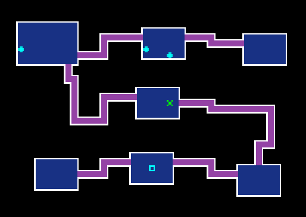

## Overview

There are 2 main types of maps in Shiren 4.

1. Random = Procedurally generated, occasionally using a template pattern.
    - Example: Bayside Monster Cave.
2. Shuffle = Randomly selected from a number of predetermined layouts.
    - Example: Crocodile Swamp in Emerald Terrace.

 

<ul class="quickLinksUL">
  <li><a href="#random-maps">Random Maps</a>
    <ul>
      <li><a href="#simple">Simple</a>
        <ul>
          <li><a href="#chunsoft">CHUNSOFT</a></li>
          <li><a href="#letter-i">Letter I</a></li>
          <li><a href="#horizontal-line">Horizontal Line</a></li>
          <li><a href="#3-room">3 Room</a></li>
          <li><a href="#3-room">3 Room Loop</a></li>
          <li><a href="#4-room">4 Room</a></li>
          <li><a href="#3-room">4 Room Circle</a></li>
          <li><a href="#8-room-octopus">8 Room Octopus</a></li>
          <li><a href="#12-room">12 Room</a></li>
          <li><a href="#12-room-octopus">12 Room Octopus</a></li>
        </ul>
      </li>
      <li><a href="#special">Special</a>
        <ul>
          <li><a href="#spring-rooms">Spring Rooms</a></li>
          <li><a href="#large-maze">Large Maze</a></li>
        </ul>
      </li>
      <li><a href="#monster-house">Monster House</a>
        <ul>
          <li><a href="#large-room">Large Room</a></li>
          <li><a href="#medium-room">Medium Room</a></li>
          <li><a href="#2-room">2 Rooms</a></li>
        </ul>
      </li>
    </ul>
  </li>
  <li><a href="#shuffle-maps">Shuffle Maps</a>
    <ul>
      <li><a href="#grasslands-(1-2f)">Grasslands (1-2F)</a></li>
      <li><a href="#crocodile-swamp-(3-5f)">Crocodile Swamp (3-5F)</a></li>
      <li><a href="#sea-of-trees-(11-12f)">Sea of Trees (11-12F)</a></li>
      <li><a href="#eagle-valley-(19-20f)">Eagle Valley (19-20F)</a></li>
    </ul>
  </li>
</ul>

## Random Maps

### Simple

#### CHUNSOFT

Patterns based on the characters in "CHUNSOFT". 
Features 5\~10 rooms connected by single hallways.

<table class="mapTable">
  <tr>
    <th>Char</th>
    <th>Sample</th>
    <th>Char</th>
    <th>Sample</th>
  </tr>
  <tr>
    <td>C</td>
    <td></td>
    <td>S</td>
    <td></td>
  </tr>
  <tr>
    <td>H</td>
    <td></td>
    <td>O</td>
    <td></td>
  </tr>
  <tr>
    <td>U</td>
    <td></td>
    <td>F</td>
    <td></td>
  </tr>
  <tr>
    <td>N</td>
    <td></td>
    <td>T</td>
    <td></td>
  </tr>
</table>

The "F" pattern can occasionally look like this:

<pre class="preDiagram">
  ┌─┬─      ┌──┐ 
  ├─┴─  OR  ├──┘ 
  │         │ 
</pre>

#### Letter I

  

#### Horizontal Line

  

#### 3 Room

  

#### 3 Room Loop

  

#### 4 Room

  

#### 4 Room Circle

  

#### 8 Room

  

#### 12 Room

  

#### 12 Room Octopus

  

### Special

#### Spring Rooms

  

#### Large Maze

  

### Monster House

#### Large Room

  

#### Medium Room

  

#### 2 Rooms

[Image]

## Shuffle Maps

### Southern Isle Beach

### Emerald Terrace

#### Grasslands (1-2F)

#### Crocodile Swamp (3-5F)

#### Sea of Trees (11-12F)

#### Eagle Valley (19-20F)

