## Monster List

Monster Book Order

<table id="monsterList" class="monsterPageTable">
  <tr>
    <th colspan="7">Monster (Family)</th>
  </tr>
  <tr>
    <th>1</th>
    <th>2</th>
    <th>3</th>
    <th>4</th>
    <th>5</th>
    <th>6</th>
    <th>7</th>
  </tr>
  <tr>
    <td class="highlightYellow"><a href="#mamel">Mamel</a></td>
    <td class="highlightGray"><a href="#blade-bee">Blade Bee</a></td>
    <td class="highlightYellow"><a href="#scorpion">Scorpion</a></td>
    <td class="highlightGray"><a href="#field-knave">Field Knave</a></td>
    <td class="highlightYellow"><a href="#gyadon">Gyadon</a></td>
    <td class="highlightGray"><a href="#dragon">Dragon</a></td>
    <td class="highlightYellow"><a href="#foly">Foly</a></td>
  </tr>
  <tr>
    <td class="highlightYellow"><a href="#chintala">Chintala</a></td>
    <td class="highlightGray"><a href="#firepuff">Firepuff</a></td>
    <td class="highlightYellow"><a href="#absorbiphant">Absorbiphant</a></td>
    <td class="highlightGray"><a href="#spin-polygon">Spin Polygon</a></td>
    <td class="highlightYellow"><a href="#flashbird">Flashbird</a></td>
    <td class="highlightGray"><a href="#mixer">Mixer</a></td>
    <td class="highlightYellow"><a href="#floaty">Floaty</a></td>
  </tr>
  <tr>
    <td class="highlightYellow"><a href="#seedie">Seedie</a></td>
    <td class="highlightGray"><a href="#ricebear">Ricebear</a></td>
    <td class="highlightYellow"><a href="#tiger-tosser">Tiger Tosser</a></td>
    <td class="highlightGray"><a href="#porky">Porky</a></td>
    <td class="highlightYellow"><a href="#yanpii">Yanpii</a></td>
    <td class="highlightGray"><a href="#eligan">Eligan</a></td>
    <td class="highlightYellow"><a href="#zapdon">Zapdon</a></td>
  </tr>
  <tr>
    <td class="highlightYellow"><a href="#froggo">Froggo</a></td>
    <td class="highlightGray"><a href="#dj-mage">DJ Mage</a></td>
    <td class="highlightYellow"><a href="#boy-cart">Boy Cart</a></td>
    <td class="highlightGray"><a href="#pumphantasm">Pumphantasm</a></td>
    <td class="highlightYellow"><a href="#banana-novice">Banana Novice</a></td>
    <td class="highlightGray"><a href="#ironhead">Ironhead</a></td>
    <td class="highlightYellow"><a href="#maneater">Maneater</a></td>
  </tr>
  <tr>
    <td class="highlightYellow"><a href="#bored-kappa">Bored Kappa</a></td>
    <td class="highlightGray"><a href="#zalokleft">Zalokleft</a></td>
    <td class="highlightYellow"><a href="#pop-tank">Pop Tank</a></td>
    <td class="highlightGray"><a href="#fearabbit">Fearabbit</a></td>
    <td class="highlightYellow"><a href="#explochin">Explochin</a></td>
    <td class="highlightGray"><a href="#snacky">Snacky</a></td>
    <td class="highlightYellow"><a href="#boss-type">Boss Type</a></td>
  </tr>
  <tr>
    <td class="highlightYellow"><a href="#hopodile">Hopodile</a></td>
    <td class="highlightGray"><a href="#slime">Slime</a></td>
    <td class="highlightYellow"><a href="#gazer">Gazer</a></td>
    <td class="highlightGray"><a href="#traproid">Traproid</a></td>
    <td class="highlightYellow"><a href="#gyaza">Gyaza</a></td>
    <td class="highlightGray"><a href="#crow-tengu">Crow Tengu</a></td>
    <td class="highlightYellow"><a href="#shopkeep">Shopkeep</a></td>
  </tr>
  <tr>
    <td class="highlightYellow"><a href="#squid-king">Squid King</a></td>
    <td class="highlightGray"><a href="#curse-girl">Curse Girl</a></td>
    <td class="highlightYellow"><a href="#n'dubba">N'dubba</a></td>
    <td class="highlightGray"><a href="#swordsman">Swordsman</a></td>
    <td class="highlightYellow"><a href="#cheer-ham">Cheer Ham</a></td>
    <td class="highlightGray"><a href="#mutaikon">Mutaikon</a></td>
    <td></td>
  </tr>
</table>

Element Order

<table class="firstYellowTable">
  <tr>
    <th>Element</th>
    <th>Monsters (Family or Individual)</th>
    <th>Info</th>
  </tr>
  <tr>
    <td class="highlightYellow">Swift 1</td>
    <td><a href="#pin-kid">Pin Kid</a> | <a href="#karakuroid">Karakuroid</a> | <a href="#floaty">Floaty</a> | <a href="#foly">Foly</a> | <a href="#boy-cart">Boy Cart</a> | <a href="#pop-tank">Ornery Tank</a> | <a href="#chow">Chow</a> | <a href="#shopkeeper">Shopkeeper</a></td>
    <td>Double speed, attacks once</td>
  </tr>
  <tr>
    <td class="highlightYellow">Swift 2</td>
    <td><a href="#mamel">Gitan Mamel</a> | <a href="#pop-tank">Cranky Tank</a> | <a href="#fo-ub">FO-Uβ</a></td>
    <td>Double speed, attacks twice</td>
  </tr>
  <tr>
    <td class="highlightYellow">Slow</td>
    <td><a href="#zapdon">Zapdon</a> | <a href="#pop-tank">Pop Tank</a></td>
    <td>One action every 2 turns</td>
  </tr>
  <tr>
    <td class="highlightYellow">Rust</td>
    <td><a href="#grass-boy">Grass Boy</a> | <a href="#pin-kid">Pin Kid</a> | <a href="#sweet-nut">Sweet Nut</a> | <a href="#karakuroid">Karakuroid</a> | <a href="#swordsman">Swordsman</a> | <a href="#flamebird">Flamebird</a> | <a href="#scoopie">Scoopie</a> <a href="#zapdon">Zapdon</a> | <a href="#boy-cart">Boy Cart</a> | <a href="#pop-tank">Pop Tank</a> | <a href="#absorbiphant">Absorbiphant</a> | <a href="#punisher">Punisher</a> | <a href="#fo-ub">FO-Uβ</a> | <a href="#shagga">Shagga</a></td>
    <td>Splash water from a <a href="#">Water Pot</a> to apply a negative effect.</td>
  </tr>
  <tr>
    <td class="highlightYellow">Normal</td>
    <td><a href="#mamel">Mamel</a> | <a href="#colum">Colum</a> | <a href="#chintala">Chintala</a> | <a href="#nigiri-baby">Nigiri Baby</a> | <a href="#froggo">Froggo</a> | <a href="#tiger-tosser">Tiger Tosser</a> | <a href="#curse-girl">Curse Girl</a> | <a href="#floaty">Floaty</a> <a href="#mixer">Mixer</a> | <a href="#naptapir">Naptapir</a> | <a href="#swordsman">Swordsman</a> | <a href="#cheer-ham">Cheer-Ham</a> | <a href="#yanpii">Yanpii</a> | <a href="#eligan">Eligan</a> | <a href="#zapdon">Zapdon</a> | <a href="#porky">Porky</a> <a href="#boy-cart">Boy Cart</a> | <a href="#punisher">Punisher</a> | <a href="#kumonigiri">Kumonigiri</a> | <a href="#field-knave">Field Knave</a> | <a href="#maneater">Maneater</a> | <a href="#shopkeeper">Shopkeeper</a></td>
    <td>No type-effective weakness</td>
  </tr>
  <tr>
    <td class="highlightYellow">Cyclops</td>
    <td><a href="#metalhead">Metalhead</a> | <a href="#foly">Foly</a> | <a href="#gazer">Gazer</a> | <a href="#explochin">Explochin</a></td>
    <td>Weak to Anti-Cyclops rune</td>
  </tr>
  <tr>
    <td class="highlightYellow">Drain</td>
    <td><a href="#scorpion">Scorpion</a> | <a href="#polygon-spinna">Polygon Spinna</a> | <a href="#absorbiphant">Absorbiphant</a> | <a href="#myriman">Myriman</a></td>
    <td>Weak to Anti-Drain rune</td>
  </tr>
  <tr>
    <td class="highlightYellow">Dragon</td>
    <td><a href="#hopodile">Hopodile</a> | <a href="#dragon">Dragon</a> | <a href="#firepuff">Firepuff</a> | <a href="#shagga">Shagga</a></td>
    <td>Weak to Anti-Dragon rune</td>
  </tr>
  <tr>
    <td class="highlightYellow">Explode</td>
    <td><a href="#sweet-nut">Sweet Nut</a> | <a href="#pop-tank">Pop Tank</a> | <a href="#explochin">Explochin</a></td>
    <td>Weak to Anti-Explode rune</td>
  </tr>
  <tr>
    <td class="highlightYellow">Metal</td>
    <td><a href="#karakuroid">Karakuroid</a> | <a href="#ndubba">N'dubba</a> | <a href="#scoopie">Scoopie</a> | <a href="#pop-tank">Pop Tank</a> | <a href="#fo-ub">FO-Uβ</a></td>
    <td>Weak to Anti-Metal rune</td>
  </tr>
  <tr>
    <td class="highlightYellow">Plant</td>
    <td><a href="#sproutant">Sproutant</a> | <a href="#seedie">Seedie</a> | <a href="#grass-boy">Grass Boy</a> | <a href="#pin-kid">Pin Kid</a> | <a href="#sweet-nut">Sweet Nut</a> | <a href="#pumphantasm">Pumphantasm</a> | <a href="#mutaikon">Mutaikon</a></td>
    <td>Weak to Anti-Plant rune</td>
  </tr>
  <tr>
    <td class="highlightYellow">Magic</td>
    <td><a href="#fearabbit">Fearabbit</a> | <a href="#polygon-spinna">Polygon Spinna</a> | <a href="#gazer">Gazer</a> | <a href="#dj-mage">DJ Mage</a></td>
    <td>Weak to Anti-Magic rune</td>
  </tr>
  <tr>
    <td class="highlightYellow">Floating</td>
    <td><a href="#blade-bee">Blade Bee</a> | <a href="#pumphantasm">Pumphantasm</a> | <a href="#foly">Foly</a> | <a href="#flamebird">Flamebird</a> | <a href="#gyadon">Gyadon</a> | <a href="#firepuff">Firepuff</a> | <a href="#crow-tengu">Crow Tengu</a> <a href="#fo-ub">FO-Uβ</a> | <a href="#chow">Chow</a></td>
    <td>Weak to Anti-Floating rune</td>
  </tr>
  <tr>
    <td class="highlightYellow">Aquatic</td>
    <td><a href="#gyaza">Gyaza</a> | <a href="#mudkin">Mudkin</a> | <a href="#kid-squid">Kid Squid</a> | <a href="#bored-kappa">Bored Kappa</a> | <a href="#hopodile">Hopodile</a> | <a href="#zalokleft">Zalokleft</a> | <a href="#moseal">Moseal</a> <a href="#explochin">Explochin</a></td>
    <td>Weak to Anti-Aquatic rune</td>
  </tr>
  <tr>
    <td class="highlightYellow">Power</td>
    <td><a href="#sproutant">Sproutant</a> | <a href="#scorpion">Scorpion</a> | <a href="#metalhead">Metalhead</a> | <a href="#eligan">Eligan</a> | <a href="#gyadon">Gyadon</a> | <a href="#zapdon">Zapdon</a> | <a href="#porky">Porky</a> | <a href="#pop-tank">Pop Tank</a> <a href="#absorbiphant">Absorbiphant</a></td>
    <td>Appears in power houses</td>
  </tr>
  <tr>
    <td class="highlightYellow">Greed</td>
    <td><a href="#sweet-nut">Sweet Nut</a> | <a href="#froggo">Froggo</a> | <a href="#curse-girl">Curse Girl</a> | <a href="#mixer">Mixer</a> | <a href="#swordsman">Swordsman</a> | <a href="#zalokleft">Zalokleft</a> | <a href="#gyadon">Gyadon</a></td>
    <td>Appears in greed houses</td>
  </tr>
  <tr>
    <td class="highlightYellow">Projectile</td>
    <td><a href="#grass-boy">Grass Boy</a> | <a href="#tiger-tosser">Tiger Tosser</a> | <a href="#floaty">Floaty</a> | <a href="#mutaikon">Mutaikon</a> | <a href="#bored-kappa">Bored Kappa</a> | <a href="#scoopie">Scoopie</a> | <a href="#porky">Porky</a> <a href="#boy-cart">Boy Cart</a> | <a href="#field-knave">Field Knave</a></td>
    <td>Appears in projectile houses</td>
  </tr>
  <tr>
    <td class="highlightYellow">Explosive</td>
    <td><a href="#sweet-nut">Sweet Nut</a> | <a href="#flamebird">Flamebird</a> | <a href="#dragon">Dragon</a> | <a href="#firepuff">Firepuff</a> | <a href="#pop-tank">Pop Tank</a> | <a href="#explochin">Explochin</a></td>
    <td>Appears in explosive houses</td>
  </tr>
  <tr>
    <td class="highlightYellow">Harass</td>
    <td><a href="#karakuroid">Karakuroid</a> | <a href="#fearabbit">Fearabbit</a> | <a href="#polygon-spinna">Polygon Spinna</a> | <a href="#cheer-ham">Cheer-Ham</a> | <a href="#yanpii">Yanpii</a> | <a href="#scoopie">Scoopie</a> | <a href="#gazer">Gazer</a> <a href="#dj-mage">DJ Mage</a> | <a href="#absorbiphant">Absorbiphant</a> | <a href="#myriman">Myriman</a> | <a href="#explochin">Explochin</a></td>
    <td>Appears in harassment houses</td>
  </tr>
</table>

## Details

### Table Explanation

- Lv = Monster level.
    - Yellow = Day monster.
    - Blue = Night monster.
- Skill = Equipment experience points.
    - These points are not visible in-game.
- Drop = Item drop rate.
    - Day monsters drop floor table items.
    - Night monsters drop shop table items.
    - Some monsters have fixed or unique drops instead.
- Elem. = Element or type.
    - Regular = Regular movement at night.
    - Random = Random movement at night.
    - Slow = 1 action every 2 turns.
    - Swift 1 = Double speed, 1 attack.
    - Swift 2 = Double speed, 2 attacks.
    - Drain = Weak to Anti-Drain rune.
    - Bomb = Weak to Anti-Bomb rune.
    - Floating = Weak to Anti-Float rune.
    - Dragon = Weak to Anti-Dragon rune.
    - Aquatic = Weak to Anti-Aquatic rune.
    - Cyclops = Weak to Anti-Cyclops rune.

### Mamel

  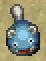

<table class="monsterPageTable">
  <tr>
    <th>Lv</th>
    <th>Name</th>
    <th>HP</th>
    <th>Atk</th>
    <th>Def</th>
    <th>Exp</th>
    <th>Skill</th>
    <th>Drop</th>
    <th>Elem.</th>
    <th>Notes</th>
  </tr>
  <tr>
    <td class="highlightYellow">1</td>
    <td>Mamel</td>
    <td>5</td>
    <td>2</td>
    <td>1</td>
    <td>3</td>
    <td>1</td>
    <td>4%</td>
    <td>-</td>
    <td rowspan="2">No abilities.</td>
  </tr>
  <tr>
    <td class="highlightYellow">2</td>
    <td>Pit Mamel</td>
    <td>9</td>
    <td>6</td>
    <td>3</td>
    <td>6</td>
    <td>1</td>
    <td>4%</td>
    <td>-</td>
  </tr>
  <tr>
    <td class="highlightYellow">3</td>
    <td>Cave Mamel</td>
    <td>6</td>
    <td>54</td>
    <td>19</td>
    <td>1000</td>
    <td>70</td>
    <td>4%</td>
    <td>-</td>
    <td>Direct attacks deal 1 damage to it. You can deal damage like normal if it's sealed.</td>
  </tr>
  <tr>
    <td class="highlightYellow">4</td>
    <td>Gitan Mamel</td>
    <td>12</td>
    <td>84</td>
    <td>38</td>
    <td>5500</td>
    <td>500</td>
    <td>100%</td>
    <td>Swift 2</td>
    <td>Same as Cave Mamel, but double speed (2 attacks). 100% chance to drop 2000 Gitan.</td>
  </tr>
  <tr>
    <th>Lv</th>
    <th>Name</th>
    <th>HP</th>
    <th>Atk</th>
    <th>Def</th>
    <th>Exp</th>
    <th>Skill</th>
    <th>Drop</th>
    <th>Elem.</th>
    <th>Notes</th>
  </tr>
  <tr>
    <td class="highlightNight">1</td>
    <td>Dark Mamel</td>
    <td>24</td>
    <td>14</td>
    <td>3</td>
    <td>22</td>
    <td>15</td>
    <td>4%</td>
    <td rowspan="3">Random</td>
    <td rowspan="2">No abilities.</td>
  </tr>
  <tr>
    <td class="highlightNight">2</td>
    <td>Dark Pit Mamel</td>
    <td>35</td>
    <td>32</td>
    <td>4</td>
    <td>56</td>
    <td>30</td>
    <td>4%</td>
  </tr>
  <tr>
    <td class="highlightNight">3</td>
    <td>Dark Cave Mamel</td>
    <td>55</td>
    <td>58</td>
    <td>5</td>
    <td>600</td>
    <td>140</td>
    <td>4%</td>
    <td>Necklace moves deal full damage like any other monster.</td>
  </tr>
  <tr>
    <td class="highlightNight">4</td>
    <td>Dark Gitan Mamel</td>
    <td>63</td>
    <td>67</td>
    <td>6</td>
    <td>4000</td>
    <td>300</td>
    <td>100%</td>
    <td>Swift 2 Random</td>
    <td>Same as Dark Cave Mamel, but double speed (2 attacks). 100% chance to drop 2000 Gitan.</td>
  </tr>
</table>

### Chintala

  

<table class="monsterPageTable">
  <tr>
    <th>Lv</th>
    <th>Name</th>
    <th>HP</th>
    <th>Atk</th>
    <th>Def</th>
    <th>Exp</th>
    <th>Skill</th>
    <th>Drop</th>
    <th>Elem.</th>
    <th>Notes</th>
  </tr>
  <tr>
    <td class="highlightYellow">1</td>
    <td>Chintala</td>
    <td>7</td>
    <td>7</td>
    <td>1</td>
    <td>4</td>
    <td>1</td>
    <td>4%</td>
    <td>-</td>
    <td rowspan="4">No abilities.</td>
  </tr>
  <tr>
    <td class="highlightYellow">2</td>
    <td>Mid Chintala</td>
    <td>28</td>
    <td>18</td>
    <td>8</td>
    <td>40</td>
    <td>10</td>
    <td>4%</td>
    <td>-</td>
  </tr>
  <tr>
    <td class="highlightYellow">3</td>
    <td>Big Chintala</td>
    <td>57</td>
    <td>47</td>
    <td>15</td>
    <td>480</td>
    <td>40</td>
    <td>4%</td>
    <td>-</td>
  </tr>
  <tr>
    <td class="highlightYellow">4</td>
    <td>Huge Chintala</td>
    <td>73</td>
    <td>90</td>
    <td>21</td>
    <td>3800</td>
    <td>300</td>
    <td>4%</td>
    <td>-</td>
  </tr>
  <tr>
    <th>Lv</th>
    <th>Name</th>
    <th>HP</th>
    <th>Atk</th>
    <th>Def</th>
    <th>Exp</th>
    <th>Skill</th>
    <th>Drop</th>
    <th>Elem.</th>
    <th>Notes</th>
  </tr>
  <tr>
    <td class="highlightNight">1</td>
    <td>Evil Chintala</td>
    <td>20</td>
    <td>18</td>
    <td>2</td>
    <td>24</td>
    <td>15</td>
    <td>4%</td>
    <td rowspan="4">Random</td>
    <td rowspan="4">No abilities.</td>
  </tr>
  <tr>
    <td class="highlightNight">2</td>
    <td>Evil Mid Chintala</td>
    <td>47</td>
    <td>43</td>
    <td>4</td>
    <td>120</td>
    <td>50</td>
    <td>4%</td>
  </tr>
  <tr>
    <td class="highlightNight">3</td>
    <td>Evil Big Chintala</td>
    <td>63</td>
    <td>70</td>
    <td>7</td>
    <td>1300</td>
    <td>220</td>
    <td>4%</td>
  </tr>
  <tr>
    <td class="highlightNight">4</td>
    <td>Evil Huge Chintala</td>
    <td>72</td>
    <td>83</td>
    <td>8</td>
    <td>4200</td>
    <td>300</td>
    <td>4%</td>
  </tr>
</table>

### Seedie

  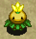

<table class="monsterPageTable">
  <tr>
    <th>Lv</th>
    <th>Name</th>
    <th>HP</th>
    <th>Atk</th>
    <th>Def</th>
    <th>Exp</th>
    <th>Skill</th>
    <th>Drop</th>
    <th>Elem.</th>
    <th>Notes</th>
  </tr>
  <tr>
    <td class="highlightYellow">1</td>
    <td>Seedie</td>
    <td>6</td>
    <td>3</td>
    <td>4</td>
    <td>5</td>
    <td>1</td>
    <td>4%</td>
    <td>-</td>
    <td rowspan="4">No abilities.</td>
  </tr>
  <tr>
    <td class="highlightYellow">2</td>
    <td>monster_name</td>
    <td>53</td>
    <td>33</td>
    <td>16</td>
    <td>230</td>
    <td>30</td>
    <td>4%</td>
    <td>-</td>
  </tr>
  <tr>
    <td class="highlightYellow">3</td>
    <td>monster_name</td>
    <td>62</td>
    <td>62</td>
    <td>22</td>
    <td>1280</td>
    <td>90</td>
    <td>4%</td>
    <td>-</td>
  </tr>
  <tr>
    <td class="highlightYellow">4</td>
    <td>monster_name</td>
    <td>85</td>
    <td>77</td>
    <td>32</td>
    <td>3500</td>
    <td>250</td>
    <td>4%</td>
    <td>-</td>
  </tr>
  <tr>
    <th>Lv</th>
    <th>Name</th>
    <th>HP</th>
    <th>Atk</th>
    <th>Def</th>
    <th>Exp</th>
    <th>Skill</th>
    <th>Drop</th>
    <th>Elem.</th>
    <th>Notes</th>
  </tr>
  <tr>
    <td class="highlightNight">1</td>
    <td>monster_name</td>
    <td>10</td>
    <td>7</td>
    <td>1</td>
    <td>4</td>
    <td>10</td>
    <td>4%</td>
    <td rowspan="4">Random</td>
    <td rowspan="4">No abilities.</td>
  </tr>
  <tr>
    <td class="highlightNight">2</td>
    <td>monster_name</td>
    <td>55</td>
    <td>46</td>
    <td>6</td>
    <td>350</td>
    <td>100</td>
    <td>4%</td>
  </tr>
  <tr>
    <td class="highlightNight">3</td>
    <td>monster_name</td>
    <td>64</td>
    <td>75</td>
    <td>7</td>
    <td>2600</td>
    <td>260</td>
    <td>4%</td>
  </tr>
  <tr>
    <td class="highlightNight">4</td>
    <td>monster_name</td>
    <td>75</td>
    <td>92</td>
    <td>8</td>
    <td>5800</td>
    <td>420</td>
    <td>4%</td>
  </tr>
</table>

### Froggo

  

<table class="monsterPageTable">
  <tr>
    <th>Lv</th>
    <th>Name</th>
    <th>HP</th>
    <th>Atk</th>
    <th>Def</th>
    <th>Exp</th>
    <th>Skill</th>
    <th>Drop</th>
    <th>Elem.</th>
    <th>Notes</th>
  </tr>
  <tr>
    <td class="highlightYellow">1</td>
    <td>Froggo</td>
    <td>28</td>
    <td>10</td>
    <td>1</td>
    <td>5</td>
    <td>1</td>
    <td>100%</td>
    <td>-</td>
    <td rowspan="3">Steals Gitan from Shiren and warps. Runs away at double speed after stealing. Doesn't use direct attacks. Stands on Gitan if it's on the ground. 100% chance to drop Gitan, higher amounts at higher levels.</td>
  </tr>
  <tr>
    <td class="highlightYellow">2</td>
    <td>monster_name</td>
    <td>51</td>
    <td>23</td>
    <td>7</td>
    <td>10</td>
    <td>7</td>
    <td>100%</td>
    <td>-</td>
  </tr>
  <tr>
    <td class="highlightYellow">3</td>
    <td>monster_name</td>
    <td>65</td>
    <td>30</td>
    <td>11</td>
    <td>100</td>
    <td>20</td>
    <td>100%</td>
    <td>-</td>
  </tr>
  <tr>
    <td class="highlightYellow">4</td>
    <td>monster_name</td>
    <td>77</td>
    <td>45</td>
    <td>17</td>
    <td>1000</td>
    <td>100</td>
    <td>100%</td>
    <td>-</td>
    <td>Same as Froggo. Picks up Gitan and throws it at Shiren.</td>
  </tr>
  <tr>
    <th>Lv</th>
    <th>Name</th>
    <th>HP</th>
    <th>Atk</th>
    <th>Def</th>
    <th>Exp</th>
    <th>Skill</th>
    <th>Drop</th>
    <th>Elem.</th>
    <th>Notes</th>
  </tr>
  <tr>
    <td class="highlightNight">1</td>
    <td>monster_name</td>
    <td>26</td>
    <td>8</td>
    <td>0</td>
    <td>5</td>
    <td>5</td>
    <td>100%</td>
    <td rowspan="4">Regular</td>
    <td rowspan="3">Same as Froggo.</td>
  </tr>
  <tr>
    <td class="highlightNight">2</td>
    <td>monster_name</td>
    <td>36</td>
    <td>19</td>
    <td>1</td>
    <td>30</td>
    <td>20</td>
    <td>100%</td>
  </tr>
  <tr>
    <td class="highlightNight">3</td>
    <td>monster_name</td>
    <td>48</td>
    <td>28</td>
    <td>2</td>
    <td>300</td>
    <td>90</td>
    <td>100%</td>
  </tr>
  <tr>
    <td class="highlightNight">4</td>
    <td>monster_name</td>
    <td>62</td>
    <td>40</td>
    <td>3</td>
    <td>1500</td>
    <td>260</td>
    <td>100%</td>
    <td>Same as monster_name.</td>
  </tr>
</table>

### Bored Kappa

  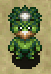

<table class="monsterPageTable">
  <tr>
    <th>Lv</th>
    <th>Name</th>
    <th>HP</th>
    <th>Atk</th>
    <th>Def</th>
    <th>Exp</th>
    <th>Skill</th>
    <th>Drop</th>
    <th>Elem.</th>
    <th>Notes</th>
  </tr>
  <tr>
    <td class="highlightYellow">1</td>
    <td>Bored Kappa</td>
    <td>14</td>
    <td>7</td>
    <td>3</td>
    <td>4</td>
    <td>2</td>
    <td>4%</td>
    <td rowspan="4">Aquatic</td>
    <td>Stands on item, throws it at Shiren if he's within 3 tiles. Catches and throws items back at you. Items it throws always miss. Can't throw Gitan, shields, or weapons. Moves toward items, but uses direct attacks if adjacent.</td>
  </tr>
  <tr>
    <td class="highlightYellow">2</td>
    <td>monster_name</td>
    <td>56</td>
    <td>28</td>
    <td>17</td>
    <td>180</td>
    <td>20</td>
    <td>4%</td>
    <td>Same as Bored Kappa, but thrown items can hit. Throwing range of 5 tiles. Can't throw Gitan or weapons.</td>
  </tr>
  <tr>
    <td class="highlightYellow">3</td>
    <td>monster_name</td>
    <td>71</td>
    <td>42</td>
    <td>20</td>
    <td>850</td>
    <td>60</td>
    <td>4%</td>
    <td>Same as Bored Kappa, but thrown items can hit. Throwing range of 10 tiles. Can't throw Gitan.</td>
  </tr>
  <tr>
    <td class="highlightYellow">4</td>
    <td>monster_name</td>
    <td>89</td>
    <td>63</td>
    <td>30</td>
    <td>1700</td>
    <td>170</td>
    <td>4%</td>
    <td>Same as Bored Kappa, but thrown items can hit. Throws any item from anywhere on the floor.</td>
  </tr>
  <tr>
    <th>Lv</th>
    <th>Name</th>
    <th>HP</th>
    <th>Atk</th>
    <th>Def</th>
    <th>Exp</th>
    <th>Skill</th>
    <th>Drop</th>
    <th>Elem.</th>
    <th>Notes</th>
  </tr>
  <tr>
    <td class="highlightNight">1</td>
    <td>monster_name</td>
    <td>17</td>
    <td>11</td>
    <td>2</td>
    <td>12</td>
    <td>7</td>
    <td>4%</td>
    <td rowspan="4">Aquatic Regular</td>
    <td rowspan="4">Same as daytime abilities.</td>
  </tr>
  <tr>
    <td class="highlightNight">2</td>
    <td>monster_name</td>
    <td>38</td>
    <td>30</td>
    <td>3</td>
    <td>50</td>
    <td>25</td>
    <td>4%</td>
  </tr>
  <tr>
    <td class="highlightNight">3</td>
    <td>monster_name</td>
    <td>47</td>
    <td>40</td>
    <td>4</td>
    <td>200</td>
    <td>60</td>
    <td>4%</td>
  </tr>
  <tr>
    <td class="highlightNight">4</td>
    <td>monster_name</td>
    <td>58</td>
    <td>55</td>
    <td>5</td>
    <td>1300</td>
    <td>160</td>
    <td>4%</td>
  </tr>
</table>

### Hopodile

  

<table class="monsterPageTable">
  <tr>
    <th>Lv</th>
    <th>Name</th>
    <th>HP</th>
    <th>Atk</th>
    <th>Def</th>
    <th>Exp</th>
    <th>Skill</th>
    <th>Drop</th>
    <th>Elem.</th>
    <th>Notes</th>
  </tr>
  <tr>
    <td class="highlightYellow">1</td>
    <td>Hopodile</td>
    <td>19</td>
    <td>9</td>
    <td>4</td>
    <td>12</td>
    <td>5</td>
    <td>4%</td>
    <td rowspan="4">Aquatic Dragon</td>
    <td>Moves like a chess knight when Shiren is in view. 10 damage jump attack if in range of a chess knight hop.</td>
  </tr>
  <tr>
    <td class="highlightYellow">2</td>
    <td>monster_name</td>
    <td>70</td>
    <td>40</td>
    <td>21</td>
    <td>600</td>
    <td>40</td>
    <td>4%</td>
    <td>Same as Hopodile, but jump attack deals 20 damage.</td>
  </tr>
  <tr>
    <td class="highlightYellow">3</td>
    <td>monster_name</td>
    <td>86</td>
    <td>76</td>
    <td>23</td>
    <td>2700</td>
    <td>150</td>
    <td>4%</td>
    <td>Same as Hopodile, but jump attack deals 30 damage.</td>
  </tr>
  <tr>
    <td class="highlightYellow">4</td>
    <td>monster_name</td>
    <td>95</td>
    <td>88</td>
    <td>29</td>
    <td>4300</td>
    <td>500</td>
    <td>4%</td>
    <td>Same as Hopodile, but jump attack deals 40 damage.</td>
  </tr>
  <tr>
    <th>Lv</th>
    <th>Name</th>
    <th>HP</th>
    <th>Atk</th>
    <th>Def</th>
    <th>Exp</th>
    <th>Skill</th>
    <th>Drop</th>
    <th>Elem.</th>
    <th>Notes</th>
  </tr>
  <tr>
    <td class="highlightNight">1</td>
    <td>monster_name</td>
    <td>28</td>
    <td>26</td>
    <td>3</td>
    <td>35</td>
    <td>20</td>
    <td>4%</td>
    <td rowspan="4">Aquatic Dragon Regular</td>
    <td>Same as Hopodile, but jump attack deals 15 damage.</td>
  </tr>
  <tr>
    <td class="highlightNight">2</td>
    <td>monster_name</td>
    <td>46</td>
    <td>53</td>
    <td>5</td>
    <td>300</td>
    <td>75</td>
    <td>4%</td>
    <td>Same as Hopodile, but jump attack deals 25 damage.</td>
  </tr>
  <tr>
    <td class="highlightNight">3</td>
    <td>monster_name</td>
    <td>57</td>
    <td>65</td>
    <td>7</td>
    <td>750</td>
    <td>180</td>
    <td>4%</td>
    <td>Same as Hopodile, but jump attack deals 35 damage.</td>
  </tr>
  <tr>
    <td class="highlightNight">4</td>
    <td>monster_name</td>
    <td>72</td>
    <td>88</td>
    <td>8</td>
    <td>5700</td>
    <td>500</td>
    <td>4%</td>
    <td>Same as Hopodile, but jump attack deals 45 damage.</td>
  </tr>
</table>

### Squid King

  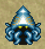

<table class="monsterPageTable">
  <tr>
    <th>Lv</th>
    <th>Name</th>
    <th>HP</th>
    <th>Atk</th>
    <th>Def</th>
    <th>Exp</th>
    <th>Skill</th>
    <th>Drop</th>
    <th>Elem.</th>
    <th>Notes</th>
  </tr>
  <tr>
    <td class="highlightYellow">1</td>
    <td>Squid King</td>
    <td>19</td>
    <td>8</td>
    <td>4</td>
    <td>8</td>
    <td>2</td>
    <td>4%</td>
    <td rowspan="4">Aquatic</td>
    <td>Blinds an adjacent target. Turns into Squid Sushi Scroll if hit by Onigiri.</td>
  </tr>
  <tr>
    <td class="highlightYellow">2</td>
    <td>monster_name</td>
    <td>55</td>
    <td>23</td>
    <td>15</td>
    <td>110</td>
    <td>15</td>
    <td>4%</td>
    <td>Same as Squid King. Ink blinds targets in a 1 tile radius.</td>
  </tr>
  <tr>
    <td class="highlightYellow">3</td>
    <td>monster_name</td>
    <td>65</td>
    <td>38</td>
    <td>20</td>
    <td>600</td>
    <td>50</td>
    <td>4%</td>
    <td rowspan="2">Same as Squid King. Ink blinds all targets in the room.</td>
  </tr>
  <tr>
    <td class="highlightYellow">4</td>
    <td>monster_name</td>
    <td>78</td>
    <td>57</td>
    <td>33</td>
    <td>1800</td>
    <td>200</td>
    <td>4%</td>
  </tr>
  <tr>
    <th>Lv</th>
    <th>Name</th>
    <th>HP</th>
    <th>Atk</th>
    <th>Def</th>
    <th>Exp</th>
    <th>Skill</th>
    <th>Drop</th>
    <th>Elem.</th>
    <th>Notes</th>
  </tr>
  <tr>
    <td class="highlightNight">1</td>
    <td>monster_name</td>
    <td>16</td>
    <td>9</td>
    <td>1</td>
    <td>10</td>
    <td>7</td>
    <td>4%</td>
    <td rowspan="4">Aquatic Random</td>
    <td rowspan="4">Same as daytime abilities.</td>
  </tr>
  <tr>
    <td class="highlightNight">2</td>
    <td>monster_name</td>
    <td>39</td>
    <td>30</td>
    <td>3</td>
    <td>65</td>
    <td>35</td>
    <td>4%</td>
  </tr>
  <tr>
    <td class="highlightNight">3</td>
    <td>monster_name</td>
    <td>56</td>
    <td>43</td>
    <td>5</td>
    <td>350</td>
    <td>100</td>
    <td>4%</td>
  </tr>
  <tr>
    <td class="highlightNight">4</td>
    <td>monster_name</td>
    <td>66</td>
    <td>60</td>
    <td>6</td>
    <td>2000</td>
    <td>190</td>
    <td>4%</td>
  </tr>
</table>

### Blade Bee

  

<table class="monsterPageTable">
  <tr>
    <th>Lv</th>
    <th>Name</th>
    <th>HP</th>
    <th>Atk</th>
    <th>Def</th>
    <th>Exp</th>
    <th>Skill</th>
    <th>Drop</th>
    <th>Elem.</th>
    <th>Notes</th>
  </tr>
  <tr>
    <td class="highlightYellow">1</td>
    <td>Blade Bee</td>
    <td>15</td>
    <td>13</td>
    <td>1</td>
    <td>13</td>
    <td>5</td>
    <td>0%</td>
    <td rowspan="4">Floating</td>
    <td rowspan="2">Occasionally backs away 1 tile after attacking. Stinger inflicts Confused and has double attack power, but also makes it collapse. (0 experience points)</td>
  </tr>
  <tr>
    <td class="highlightYellow">2</td>
    <td>monster_name</td>
    <td>46</td>
    <td>27</td>
    <td>14</td>
    <td>200</td>
    <td>30</td>
    <td>0%</td>
  </tr>
  <tr>
    <td class="highlightYellow">3</td>
    <td>monster_name</td>
    <td>57</td>
    <td>72</td>
    <td>16</td>
    <td>2200</td>
    <td>120</td>
    <td>0%</td>
    <td rowspan="2">Same as Blade Bee, but jumps to a tile within a 2 tile radius after attacking instead of backing away.</td>
  </tr>
  <tr>
    <td class="highlightYellow">4</td>
    <td>monster_name</td>
    <td>83</td>
    <td>87</td>
    <td>24</td>
    <td>3700</td>
    <td>250</td>
    <td>0%</td>
  </tr>
  <tr>
    <th>Lv</th>
    <th>Name</th>
    <th>HP</th>
    <th>Atk</th>
    <th>Def</th>
    <th>Exp</th>
    <th>Skill</th>
    <th>Drop</th>
    <th>Elem.</th>
    <th>Notes</th>
  </tr>
  <tr>
    <td class="highlightNight">1</td>
    <td>monster_name</td>
    <td>18</td>
    <td>16</td>
    <td>1</td>
    <td>20</td>
    <td>15</td>
    <td>0%</td>
    <td rowspan="4">Floating Random</td>
    <td rowspan="4">Same as daytime abilities.</td>
  </tr>
  <tr>
    <td class="highlightNight">2</td>
    <td>monster_name</td>
    <td>37</td>
    <td>55</td>
    <td>3</td>
    <td>420</td>
    <td>100</td>
    <td>0%</td>
  </tr>
  <tr>
    <td class="highlightNight">3</td>
    <td>monster_name</td>
    <td>48</td>
    <td>76</td>
    <td>4</td>
    <td>1600</td>
    <td>260</td>
    <td>0%</td>
  </tr>
  <tr>
    <td class="highlightNight">4</td>
    <td>monster_name</td>
    <td>57</td>
    <td>90</td>
    <td>5</td>
    <td>4700</td>
    <td>350</td>
    <td>0%</td>
  </tr>
</table>

### Firepuff

  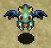

<table class="monsterPageTable">
  <tr>
    <th>Lv</th>
    <th>Name</th>
    <th>HP</th>
    <th>Atk</th>
    <th>Def</th>
    <th>Exp</th>
    <th>Skill</th>
    <th>Drop</th>
    <th>Elem.</th>
    <th>Notes</th>
  </tr>
  <tr>
    <td class="highlightYellow">1</td>
    <td>Firepuff</td>
    <td>17</td>
    <td>7</td>
    <td>7</td>
    <td>10</td>
    <td>2</td>
    <td>4%</td>
    <td rowspan="4">Dragon Floating</td>
    <td>Breathes 10 damage fire at an adjacent target. Chance to fail, and fire can go through corners.</td>
  </tr>
  <tr>
    <td class="highlightYellow">2</td>
    <td>monster_name</td>
    <td>43</td>
    <td>18</td>
    <td>18</td>
    <td>120</td>
    <td>15</td>
    <td>4%</td>
    <td>Same as Firepuff, but fire deals 20 damage.</td>
  </tr>
  <tr>
    <td class="highlightYellow">3</td>
    <td>monster_name</td>
    <td>57</td>
    <td>26</td>
    <td>22</td>
    <td>490</td>
    <td>35</td>
    <td>4%</td>
    <td>Same as Firepuff, but fire deals 30 damage.</td>
  </tr>
  <tr>
    <td class="highlightYellow">4</td>
    <td>monster_name</td>
    <td>68</td>
    <td>46</td>
    <td>26</td>
    <td>950</td>
    <td>80</td>
    <td>4%</td>
    <td>Same as Firepuff, but fire deals 40 damage.</td>
  </tr>
  <tr>
    <th>Lv</th>
    <th>Name</th>
    <th>HP</th>
    <th>Atk</th>
    <th>Def</th>
    <th>Exp</th>
    <th>Skill</th>
    <th>Drop</th>
    <th>Elem.</th>
    <th>Notes</th>
  </tr>
  <tr>
    <td class="highlightNight">1</td>
    <td>monster_name</td>
    <td>18</td>
    <td>8</td>
    <td>3</td>
    <td>11</td>
    <td>7</td>
    <td>4%</td>
    <td rowspan="4">Dragon Floating Random</td>
    <td>Same as Firepuff, but fire deals 20 damage.</td>
  </tr>
  <tr>
    <td class="highlightNight">2</td>
    <td>monster_name</td>
    <td>33</td>
    <td>28</td>
    <td>6</td>
    <td>110</td>
    <td>45</td>
    <td>4%</td>
    <td>Same as Firepuff, but fire deals 40 damage.</td>
  </tr>
  <tr>
    <td class="highlightNight">3</td>
    <td>monster_name</td>
    <td>50</td>
    <td>41</td>
    <td>8</td>
    <td>380</td>
    <td>100</td>
    <td>4%</td>
    <td>Same as Firepuff, but fire deals 60 damage.</td>
  </tr>
  <tr>
    <td class="highlightNight">4</td>
    <td>monster_name</td>
    <td>61</td>
    <td>53</td>
    <td>9</td>
    <td>1000</td>
    <td>190</td>
    <td>4%</td>
    <td>Same as Firepuff, but fire deals 80 damage.</td>
  </tr>
</table>

### Ricebear

  

<table class="monsterPageTable">
  <tr>
    <th>Lv</th>
    <th>Name</th>
    <th>HP</th>
    <th>Atk</th>
    <th>Def</th>
    <th>Exp</th>
    <th>Skill</th>
    <th>Drop</th>
    <th>Elem.</th>
    <th>Notes</th>
  </tr>
  <tr>
    <td class="highlightYellow">1</td>
    <td>Ricebear</td>
    <td>25</td>
    <td>15</td>
    <td>8</td>
    <td>35</td>
    <td>8</td>
    <td>4%</td>
    <td>-</td>
    <td rowspan="4">No abilities. Item drop is always Onigiri.</td>
  </tr>
  <tr>
    <td class="highlightYellow">2</td>
    <td>monster_name</td>
    <td>69</td>
    <td>65</td>
    <td>25</td>
    <td>2400</td>
    <td>120</td>
    <td>4%</td>
    <td>-</td>
  </tr>
  <tr>
    <td class="highlightYellow">3</td>
    <td>monster_name</td>
    <td>86</td>
    <td>85</td>
    <td>35</td>
    <td>4500</td>
    <td>250</td>
    <td>4%</td>
    <td>-</td>
  </tr>
  <tr>
    <td class="highlightYellow">4</td>
    <td>monster_name</td>
    <td>108</td>
    <td>110</td>
    <td>46</td>
    <td>7000</td>
    <td>600</td>
    <td>4%</td>
    <td>-</td>
  </tr>
  <tr>
    <th>Lv</th>
    <th>Name</th>
    <th>HP</th>
    <th>Atk</th>
    <th>Def</th>
    <th>Exp</th>
    <th>Skill</th>
    <th>Drop</th>
    <th>Elem.</th>
    <th>Notes</th>
  </tr>
  <tr>
    <td class="highlightNight">1</td>
    <td>monster_name</td>
    <td>30</td>
    <td>22</td>
    <td>5</td>
    <td>30</td>
    <td>20</td>
    <td>4%</td>
    <td rowspan="4">Random</td>
    <td rowspan="4">No abilities. Item drop is always Onigiri.</td>
  </tr>
  <tr>
    <td class="highlightNight">2</td>
    <td>monster_name</td>
    <td>52</td>
    <td>48</td>
    <td>7</td>
    <td>270</td>
    <td>75</td>
    <td>4%</td>
  </tr>
  <tr>
    <td class="highlightNight">3</td>
    <td>monster_name</td>
    <td>63</td>
    <td>60</td>
    <td>8</td>
    <td>770</td>
    <td>180</td>
    <td>4%</td>
  </tr>
  <tr>
    <td class="highlightNight">4</td>
    <td>monster_name</td>
    <td>72</td>
    <td>78</td>
    <td>9</td>
    <td>3200</td>
    <td>300</td>
    <td>4%</td>
  </tr>
</table>

### DJ Mage

  

<table class="monsterPageTable">
  <tr>
    <th>Lv</th>
    <th>Name</th>
    <th>HP</th>
    <th>Atk</th>
    <th>Def</th>
    <th>Exp</th>
    <th>Skill</th>
    <th>Drop</th>
    <th>Elem.</th>
    <th>Notes</th>
  </tr>
  <tr>
    <td class="highlightYellow">1</td>
    <td>DJ Mage</td>
    <td>18</td>
    <td>8</td>
    <td>6</td>
    <td>14</td>
    <td>4</td>
    <td>6%</td>
    <td>-</td>
    <td>Fires a magic bullet with a random effect in a line. (Warp, knockback, switch positions, Swift)</td>
  </tr>
  <tr>
    <td class="highlightYellow">2</td>
    <td>monster_name</td>
    <td>51</td>
    <td>21</td>
    <td>18</td>
    <td>170</td>
    <td>25</td>
    <td>6%</td>
    <td>-</td>
    <td>Fires a magic bullet with a random effect in a line. (Blind, Confused, transient, 20 damage)</td>
  </tr>
  <tr>
    <td class="highlightYellow">3</td>
    <td>monster_name</td>
    <td>62</td>
    <td>28</td>
    <td>20</td>
    <td>1000</td>
    <td>60</td>
    <td>6%</td>
    <td>-</td>
    <td>Fires a magic bullet with a random effect in a line. (Level -1, Sealed, Paralyzed, Decoy, Berserk)</td>
  </tr>
  <tr>
    <td class="highlightYellow">4</td>
    <td>monster_name</td>
    <td>78</td>
    <td>39</td>
    <td>24</td>
    <td>1800</td>
    <td>100</td>
    <td>6%</td>
    <td>-</td>
    <td>Fires a magic bullet with a random effect in a line. (Level -3, Empathy, Banana, Slow, reduce HP to 1/4)</td>
  </tr>
  <tr>
    <th>Lv</th>
    <th>Name</th>
    <th>HP</th>
    <th>Atk</th>
    <th>Def</th>
    <th>Exp</th>
    <th>Skill</th>
    <th>Drop</th>
    <th>Elem.</th>
    <th>Notes</th>
  </tr>
  <tr>
    <td class="highlightNight">1</td>
    <td>monster_name</td>
    <td>30</td>
    <td>26</td>
    <td>2</td>
    <td>36</td>
    <td>18</td>
    <td>6%</td>
    <td rowspan="4">Random</td>
    <td rowspan="4">Same as daytime abilities.</td>
  </tr>
  <tr>
    <td class="highlightNight">2</td>
    <td>monster_name</td>
    <td>42</td>
    <td>32</td>
    <td>3</td>
    <td>160</td>
    <td>60</td>
    <td>6%</td>
  </tr>
  <tr>
    <td class="highlightNight">3</td>
    <td>monster_name</td>
    <td>50</td>
    <td>40</td>
    <td>4</td>
    <td>330</td>
    <td>130</td>
    <td>6%</td>
  </tr>
  <tr>
    <td class="highlightNight">4</td>
    <td>monster_name</td>
    <td>59</td>
    <td>49</td>
    <td>5</td>
    <td>1200</td>
    <td>190</td>
    <td>6%</td>
  </tr>
</table>

### Zalokleft

  

<table class="monsterPageTable">
  <tr>
    <th>Lv</th>
    <th>Name</th>
    <th>HP</th>
    <th>Atk</th>
    <th>Def</th>
    <th>Exp</th>
    <th>Skill</th>
    <th>Drop</th>
    <th>Elem.</th>
    <th>Notes</th>
  </tr>
  <tr>
    <td class="highlightYellow">1</td>
    <td>Zalokleft</td>
    <td>30</td>
    <td>10</td>
    <td>6</td>
    <td>8</td>
    <td>3</td>
    <td>100%</td>
    <td rowspan="4">Aquatic</td>
    <td rowspan="3">Steals 1 item from Shiren or the ground, then warps. Runs from Shiren after warping. Always generated Napping, and doesn't use direct attacks. Drops an item from a unique table if slain before stealing, or the stolen item if slain after stealing.</td>
  </tr>
  <tr>
    <td class="highlightYellow">2</td>
    <td>monster_name</td>
    <td>55</td>
    <td>17</td>
    <td>11</td>
    <td>24</td>
    <td>10</td>
    <td>100%</td>
  </tr>
  <tr>
    <td class="highlightYellow">3</td>
    <td>monster_name</td>
    <td>81</td>
    <td>25</td>
    <td>16</td>
    <td>150</td>
    <td>40</td>
    <td>100%</td>
  </tr>
  <tr>
    <td class="highlightYellow">4</td>
    <td>monster_name</td>
    <td>103</td>
    <td>34</td>
    <td>22</td>
    <td>500</td>
    <td>80</td>
    <td>100%</td>
    <td>Same as Zalokleft, but vanishes after stealing. (Stolen item can't be recovered)</td>
  </tr>
  <tr>
    <th>Lv</th>
    <th>Name</th>
    <th>HP</th>
    <th>Atk</th>
    <th>Def</th>
    <th>Exp</th>
    <th>Skill</th>
    <th>Drop</th>
    <th>Elem.</th>
    <th>Notes</th>
  </tr>
  <tr>
    <td class="highlightNight">1</td>
    <td>monster_name</td>
    <td>18</td>
    <td>10</td>
    <td>0</td>
    <td>6</td>
    <td>5</td>
    <td>100%</td>
    <td rowspan="4">Aquatic Regular</td>
    <td rowspan="3">Same as Zalokleft, but stolen item becomes sealed.</td>
  </tr>
  <tr>
    <td class="highlightNight">2</td>
    <td>monster_name</td>
    <td>45</td>
    <td>15</td>
    <td>1</td>
    <td>20</td>
    <td>20</td>
    <td>100%</td>
  </tr>
  <tr>
    <td class="highlightNight">3</td>
    <td>monster_name</td>
    <td>58</td>
    <td>22</td>
    <td>2</td>
    <td>150</td>
    <td>40</td>
    <td>100%</td>
  </tr>
  <tr>
    <td class="highlightNight">4</td>
    <td>monster_name</td>
    <td>70</td>
    <td>31</td>
    <td>3</td>
    <td>400</td>
    <td>190</td>
    <td>100%</td>
    <td>Same as monster_name.</td>
  </tr>
</table>

### Slime

  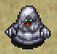

<table class="monsterPageTable">
  <tr>
    <th>Lv</th>
    <th>Name</th>
    <th>HP</th>
    <th>Atk</th>
    <th>Def</th>
    <th>Exp</th>
    <th>Skill</th>
    <th>Drop</th>
    <th>Elem.</th>
    <th>Notes</th>
  </tr>
  <tr>
    <td class="highlightYellow">1</td>
    <td>Slime</td>
    <td>21</td>
    <td>6</td>
    <td>3</td>
    <td>10</td>
    <td>4</td>
    <td>0%</td>
    <td rowspan="4">Aquatic</td>
    <td>Lowers equipped weapon or shield upgrade value by 1. Chance to duplicate when hit. Doesn't use direct attacks.</td>
  </tr>
  <tr>
    <td class="highlightYellow">2</td>
    <td>monster_name</td>
    <td>43</td>
    <td>12</td>
    <td>7</td>
    <td>80</td>
    <td>20</td>
    <td>0%</td>
    <td>Same as Slime, but lowers upgrade value by 2.</td>
  </tr>
  <tr>
    <td class="highlightYellow">3</td>
    <td>monster_name</td>
    <td>53</td>
    <td>18</td>
    <td>12</td>
    <td>200</td>
    <td>30</td>
    <td>0%</td>
    <td>Lowers equipped weapon and shield upgrade value by 1, erases 1 rune (including Rustproof), or removes a tag. Chance to duplicate when hit. Doesn't use direct attacks.</td>
  </tr>
  <tr>
    <td class="highlightYellow">4</td>
    <td>monster_name</td>
    <td>67</td>
    <td>25</td>
    <td>18</td>
    <td>420</td>
    <td>50</td>
    <td>0%</td>
    <td>Same as monster_name, but lowers upgrade value by 2. Turns invisible when it's on a water tile.</td>
  </tr>
  <tr>
    <th>Lv</th>
    <th>Name</th>
    <th>HP</th>
    <th>Atk</th>
    <th>Def</th>
    <th>Exp</th>
    <th>Skill</th>
    <th>Drop</th>
    <th>Elem.</th>
    <th>Notes</th>
  </tr>
  <tr>
    <td class="highlightNight">1</td>
    <td>monster_name</td>
    <td>23</td>
    <td>14</td>
    <td>1</td>
    <td>18</td>
    <td>13</td>
    <td>0%</td>
    <td rowspan="4">Aquatic Regular</td>
    <td>Same as Slime, but lowers upgrade value by 2. Its special attack also extinguishes equipped torches.</td>
  </tr>
  <tr>
    <td class="highlightNight">2</td>
    <td>monster_name</td>
    <td>41</td>
    <td>22</td>
    <td>2</td>
    <td>50</td>
    <td>35</td>
    <td>0%</td>
    <td>Same as Slime, but lowers upgrade value by 3. Its special attack also extinguishes equipped torches.</td>
  </tr>
  <tr>
    <td class="highlightNight">3</td>
    <td>monster_name</td>
    <td>52</td>
    <td>29</td>
    <td>3</td>
    <td>200</td>
    <td>130</td>
    <td>0%</td>
    <td>Same as monster_name, but lowers upgrade value by 2. Its special attack also extinguishes equipped torches.</td>
  </tr>
  <tr>
    <td class="highlightNight">4</td>
    <td>monster_name</td>
    <td>63</td>
    <td>40</td>
    <td>4</td>
    <td>800</td>
    <td>190</td>
    <td>0%</td>
    <td>Same as monster_name, but lowers upgrade value by 3. Its special attack also extinguishes equipped torches.</td>
  </tr>
</table>

### Curse Girl

  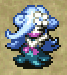

<table class="monsterPageTable">
  <tr>
    <th>Lv</th>
    <th>Name</th>
    <th>HP</th>
    <th>Atk</th>
    <th>Def</th>
    <th>Exp</th>
    <th>Skill</th>
    <th>Drop</th>
    <th>Elem.</th>
    <th>Notes</th>
  </tr>
  <tr>
    <td class="highlightYellow">1</td>
    <td>Curse Girl</td>
    <td>21</td>
    <td>13</td>
    <td>7</td>
    <td>22</td>
    <td>5</td>
    <td>0%</td>
    <td>-</td>
    <td rowspan="2">Curses or seals 1 item when adjacent.</td>
  </tr>
  <tr>
    <td class="highlightYellow">2</td>
    <td>monster_name</td>
    <td>52</td>
    <td>24</td>
    <td>15</td>
    <td>170</td>
    <td>20</td>
    <td>0%</td>
    <td>-</td>
  </tr>
  <tr>
    <td class="highlightYellow">3</td>
    <td>monster_name</td>
    <td>65</td>
    <td>36</td>
    <td>18</td>
    <td>480</td>
    <td>60</td>
    <td>0%</td>
    <td>-</td>
    <td rowspan="2">Curses or seals 2 items when adjacent.</td>
  </tr>
  <tr>
    <td class="highlightYellow">4</td>
    <td>monster_name</td>
    <td>78</td>
    <td>52</td>
    <td>29</td>
    <td>1200</td>
    <td>130</td>
    <td>0%</td>
    <td>-</td>
  </tr>
  <tr>
    <th>Lv</th>
    <th>Name</th>
    <th>HP</th>
    <th>Atk</th>
    <th>Def</th>
    <th>Exp</th>
    <th>Skill</th>
    <th>Drop</th>
    <th>Elem.</th>
    <th>Notes</th>
  </tr>
  <tr>
    <td class="highlightNight">1</td>
    <td>monster_name</td>
    <td>32</td>
    <td>24</td>
    <td>3</td>
    <td>34</td>
    <td>18</td>
    <td>0%</td>
    <td rowspan="4">Random</td>
    <td rowspan="4">Same as daytime abilities.</td>
  </tr>
  <tr>
    <td class="highlightNight">2</td>
    <td>monster_name</td>
    <td>40</td>
    <td>35</td>
    <td>3</td>
    <td>110</td>
    <td>35</td>
    <td>0%</td>
  </tr>
  <tr>
    <td class="highlightNight">3</td>
    <td>monster_name</td>
    <td>55</td>
    <td>46</td>
    <td>3</td>
    <td>450</td>
    <td>130</td>
    <td>0%</td>
  </tr>
  <tr>
    <td class="highlightNight">4</td>
    <td>monster_name</td>
    <td>62</td>
    <td>52</td>
    <td>4</td>
    <td>900</td>
    <td>160</td>
    <td>0%</td>
  </tr>
</table>

### Scorpion

  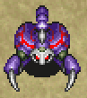

<table class="monsterPageTable">
  <tr>
    <th>Lv</th>
    <th>Name</th>
    <th>HP</th>
    <th>Atk</th>
    <th>Def</th>
    <th>Exp</th>
    <th>Skill</th>
    <th>Drop</th>
    <th>Elem.</th>
    <th>Notes</th>
  </tr>
  <tr>
    <td class="highlightYellow">1</td>
    <td>Scorpion</td>
    <td>35</td>
    <td>18</td>
    <td>12</td>
    <td>53</td>
    <td>12</td>
    <td>2%</td>
    <td rowspan="4">Drain</td>
    <td>Lowers strength by 1 when adjacent.</td>
  </tr>
  <tr>
    <td class="highlightYellow">2</td>
    <td>monster_name</td>
    <td>70</td>
    <td>34</td>
    <td>25</td>
    <td>360</td>
    <td>25</td>
    <td>2%</td>
    <td>Same as Scorpion, but lowers strength by 2.</td>
  </tr>
  <tr>
    <td class="highlightYellow">3</td>
    <td>monster_name</td>
    <td>83</td>
    <td>53</td>
    <td>27</td>
    <td>1200</td>
    <td>80</td>
    <td>2%</td>
    <td>Same as Scorpion, but lowers max strength by 1.</td>
  </tr>
  <tr>
    <td class="highlightYellow">4</td>
    <td>monster_name</td>
    <td>95</td>
    <td>75</td>
    <td>36</td>
    <td>2700</td>
    <td>170</td>
    <td>2%</td>
    <td>Same as Scorpion, but lowers max strength by 2.</td>
  </tr>
  <tr>
    <th>Lv</th>
    <th>Name</th>
    <th>HP</th>
    <th>Atk</th>
    <th>Def</th>
    <th>Exp</th>
    <th>Skill</th>
    <th>Drop</th>
    <th>Elem.</th>
    <th>Notes</th>
  </tr>
  <tr>
    <td class="highlightNight">1</td>
    <td>monster_name</td>
    <td>40</td>
    <td>33</td>
    <td>5</td>
    <td>53</td>
    <td>25</td>
    <td>2%</td>
    <td rowspan="4">Drain Random</td>
    <td>Lowers strength by 2 when adjacent.</td>
  </tr>
  <tr>
    <td class="highlightNight">2</td>
    <td>monster_name</td>
    <td>65</td>
    <td>62</td>
    <td>9</td>
    <td>720</td>
    <td>180</td>
    <td>2%</td>
    <td>Same as monster_name, but lowers strength by 3.</td>
  </tr>
  <tr>
    <td class="highlightNight">3</td>
    <td>monster_name</td>
    <td>73</td>
    <td>71</td>
    <td>11</td>
    <td>2800</td>
    <td>260</td>
    <td>2%</td>
    <td>Same as monster_name, but lowers max strength by 2.</td>
  </tr>
  <tr>
    <td class="highlightNight">4</td>
    <td>monster_name</td>
    <td>86</td>
    <td>85</td>
    <td>14</td>
    <td>5600</td>
    <td>420</td>
    <td>2%</td>
    <td>Same as monster_name, but lowers max strength by 3.</td>
  </tr>
</table>

### Absorbiphant

  

<table class="monsterPageTable">
  <tr>
    <th>Lv</th>
    <th>Name</th>
    <th>HP</th>
    <th>Atk</th>
    <th>Def</th>
    <th>Exp</th>
    <th>Skill</th>
    <th>Drop</th>
    <th>Elem.</th>
    <th>Notes</th>
  </tr>
  <tr>
    <td class="highlightYellow">1</td>
    <td>Absorbiphant</td>
    <td>27</td>
    <td>13</td>
    <td>10</td>
    <td>28</td>
    <td>6</td>
    <td>4%</td>
    <td rowspan="4">Drain</td>
    <td>Absorbs status conditions from itself or an adjacent creature, fully restoring its HP and raising its attack by 1 stage.</td>
  </tr>
  <tr>
    <td class="highlightYellow">2</td>
    <td>monster_name</td>
    <td>48</td>
    <td>30</td>
    <td>16</td>
    <td>270</td>
    <td>25</td>
    <td>4%</td>
    <td>Same as Absorbiphant, but raises attack by 2 stages.</td>
  </tr>
  <tr>
    <td class="highlightYellow">3</td>
    <td>monster_name</td>
    <td>59</td>
    <td>43</td>
    <td>18</td>
    <td>700</td>
    <td>50</td>
    <td>4%</td>
    <td>Same as Absorbiphant, but raises attack and defense by 1 stage.</td>
  </tr>
  <tr>
    <td class="highlightYellow">4</td>
    <td>monster_name</td>
    <td>76</td>
    <td>59</td>
    <td>28</td>
    <td>1400</td>
    <td>170</td>
    <td>4%</td>
    <td>Same as Absorbiphant, but raises attack and defense by 2 stages.</td>
  </tr>
  <tr>
    <th>Lv</th>
    <th>Name</th>
    <th>HP</th>
    <th>Atk</th>
    <th>Def</th>
    <th>Exp</th>
    <th>Skill</th>
    <th>Drop</th>
    <th>Elem.</th>
    <th>Notes</th>
  </tr>
  <tr>
    <td class="highlightNight">1</td>
    <td>monster_name</td>
    <td>33</td>
    <td>24</td>
    <td>4</td>
    <td>40</td>
    <td>20</td>
    <td>4%</td>
    <td rowspan="4">Drain Regular</td>
    <td rowspan="4">Same as daytime abilities.</td>
  </tr>
  <tr>
    <td class="highlightNight">2</td>
    <td>monster_name</td>
    <td>47</td>
    <td>36</td>
    <td>5</td>
    <td>180</td>
    <td>60</td>
    <td>4%</td>
  </tr>
  <tr>
    <td class="highlightNight">3</td>
    <td>monster_name</td>
    <td>56</td>
    <td>44</td>
    <td>6</td>
    <td>420</td>
    <td>130</td>
    <td>4%</td>
  </tr>
  <tr>
    <td class="highlightNight">4</td>
    <td>monster_name</td>
    <td>67</td>
    <td>58</td>
    <td>7</td>
    <td>1900</td>
    <td>220</td>
    <td>4%</td>
  </tr>
</table>

### Tiger Tosser

  

<table class="monsterPageTable">
  <tr>
    <th>Lv</th>
    <th>Name</th>
    <th>HP</th>
    <th>Atk</th>
    <th>Def</th>
    <th>Exp</th>
    <th>Skill</th>
    <th>Drop</th>
    <th>Elem.</th>
    <th>Notes</th>
  </tr>
  <tr>
    <td class="highlightYellow">1</td>
    <td>Tiger Tosser</td>
    <td>42</td>
    <td>20</td>
    <td>12</td>
    <td>63</td>
    <td>16</td>
    <td>4%</td>
    <td>-</td>
    <td>Throws an adjacent creature at Shiren, or throws Shiren at another creature, onto a trap, or into a Monster House. Throwing range of 5 tiles, deals 5 damage.</td>
  </tr>
  <tr>
    <td class="highlightYellow">2</td>
    <td>monster_name</td>
    <td>68</td>
    <td>39</td>
    <td>18</td>
    <td>350</td>
    <td>35</td>
    <td>4%</td>
    <td>-</td>
    <td>Same as Tiger Tosser, but range of 10 tiles, 10 damage.</td>
  </tr>
  <tr>
    <td class="highlightYellow">3</td>
    <td>monster_name</td>
    <td>77</td>
    <td>48</td>
    <td>20</td>
    <td>800</td>
    <td>60</td>
    <td>4%</td>
    <td>-</td>
    <td>Same as Tiger Tosser, but range of 15 tiles, 15 damage.</td>
  </tr>
  <tr>
    <td class="highlightYellow">4</td>
    <td>monster_name</td>
    <td>93</td>
    <td>69</td>
    <td>32</td>
    <td>2000</td>
    <td>170</td>
    <td>4%</td>
    <td>-</td>
    <td>Same as Tiger Tosser, but range of 20 tiles, 20 damage.</td>
  </tr>
  <tr>
    <th>Lv</th>
    <th>Name</th>
    <th>HP</th>
    <th>Atk</th>
    <th>Def</th>
    <th>Exp</th>
    <th>Skill</th>
    <th>Drop</th>
    <th>Elem.</th>
    <th>Notes</th>
  </tr>
  <tr>
    <td class="highlightNight">1</td>
    <td>monster_name</td>
    <td>35</td>
    <td>30</td>
    <td>4</td>
    <td>43</td>
    <td>18</td>
    <td>4%</td>
    <td rowspan="4">Random</td>
    <td>Same as Tiger Tosser, but range of 5 tiles, 10 damage.</td>
  </tr>
  <tr>
    <td class="highlightNight">2</td>
    <td>monster_name</td>
    <td>41</td>
    <td>38</td>
    <td>5</td>
    <td>120</td>
    <td>35</td>
    <td>4%</td>
    <td>Same as Tiger Tosser, but range of 10 tiles, 15 damage.</td>
  </tr>
  <tr>
    <td class="highlightNight">3</td>
    <td>monster_name</td>
    <td>60</td>
    <td>50</td>
    <td>7</td>
    <td>500</td>
    <td>220</td>
    <td>4%</td>
    <td>Same as Tiger Tosser, but range of 15 tiles, 20 damage.</td>
  </tr>
  <tr>
    <td class="highlightNight">4</td>
    <td>monster_name</td>
    <td>68</td>
    <td>72</td>
    <td>8</td>
    <td>3600</td>
    <td>300</td>
    <td>4%</td>
    <td>Same as Tiger Tosser, but range of 20 tiles, 25 damage.</td>
  </tr>
</table>

### Boy Cart

  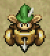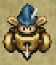

<table class="monsterPageTable">
  <tr>
    <th>Lv</th>
    <th>Name</th>
    <th>HP</th>
    <th>Atk</th>
    <th>Def</th>
    <th>Exp</th>
    <th>Skill</th>
    <th>Drop</th>
    <th>Elem.</th>
    <th>Notes</th>
  </tr>
  <tr>
    <td class="highlightYellow">1</td>
    <td>Boy Cart</td>
    <td>16</td>
    <td>9</td>
    <td>4</td>
    <td>18</td>
    <td>5</td>
    <td>6%</td>
    <td rowspan="4">Swift 1</td>
    <td>Double speed (1 attack). Shoots Wood Arrows. Moves away if you get close, doesn't use direct attacks. Doesn't attack in hallways. Only drops Wood Arrows.</td>
  </tr>
  <tr>
    <td class="highlightYellow">2</td>
    <td>monster_name</td>
    <td>24</td>
    <td>12</td>
    <td>6</td>
    <td>30</td>
    <td>7</td>
    <td>6%</td>
    <td>Same as Boy Cart, but shoots Iron Arrows. Only drops Iron Arrows.</td>
  </tr>
  <tr>
    <td class="highlightYellow">3</td>
    <td>monster_name</td>
    <td>34</td>
    <td>16</td>
    <td>10</td>
    <td>50</td>
    <td>9</td>
    <td>6%</td>
    <td>Same as Boy Cart, but shoots Knockback Arrows. Only drops Knockback Arrows.</td>
  </tr>
  <tr>
    <td class="highlightYellow">4</td>
    <td>monster_name</td>
    <td>45</td>
    <td>20</td>
    <td>13</td>
    <td>86</td>
    <td>15</td>
    <td>6%</td>
    <td>Same as Boy Cart, but shoots Silver Arrows. Only drops Silver Arrows.</td>
  </tr>
  <tr>
    <th>Lv</th>
    <th>Name</th>
    <th>HP</th>
    <th>Atk</th>
    <th>Def</th>
    <th>Exp</th>
    <th>Skill</th>
    <th>Drop</th>
    <th>Elem.</th>
    <th>Notes</th>
  </tr>
  <tr>
    <td class="highlightNight">1</td>
    <td>monster_name</td>
    <td>16</td>
    <td>11</td>
    <td>2</td>
    <td>14</td>
    <td>7</td>
    <td>6%</td>
    <td rowspan="4">Swift 1 Regular</td>
    <td rowspan="4">Same as daytime abilities. Arrows that miss vanish.</td>
  </tr>
  <tr>
    <td class="highlightNight">2</td>
    <td>monster_name</td>
    <td>27</td>
    <td>18</td>
    <td>2</td>
    <td>40</td>
    <td>18</td>
    <td>6%</td>
  </tr>
  <tr>
    <td class="highlightNight">3</td>
    <td>monster_name</td>
    <td>37</td>
    <td>24</td>
    <td>3</td>
    <td>100</td>
    <td>35</td>
    <td>6%</td>
  </tr>
  <tr>
    <td class="highlightNight">4</td>
    <td>monster_name</td>
    <td>46</td>
    <td>34</td>
    <td>4</td>
    <td>250</td>
    <td>80</td>
    <td>6%</td>
  </tr>
</table>

### Pop Tank

  

<table class="monsterPageTable">
  <tr>
    <th>Lv</th>
    <th>Name</th>
    <th>HP</th>
    <th>Atk</th>
    <th>Def</th>
    <th>Exp</th>
    <th>Skill</th>
    <th>Drop</th>
    <th>Elem.</th>
    <th>Notes</th>
  </tr>
  <tr>
    <td class="highlightYellow">1</td>
    <td>Pop Tank</td>
    <td>60</td>
    <td>25</td>
    <td>17</td>
    <td>160</td>
    <td>20</td>
    <td>2%</td>
    <td>Bomb Slow</td>
    <td>1 action every 2 turns. Fires 20 damage cannonballs. Uses other enemies and walls to hit you with the blast. Items caught in the blast vanish.</td>
  </tr>
  <tr>
    <td class="highlightYellow">2</td>
    <td>monster_name</td>
    <td>75</td>
    <td>37</td>
    <td>20</td>
    <td>400</td>
    <td>35</td>
    <td>2%</td>
    <td>Bomb</td>
    <td>Same as Pop Tank, but regular speed, 30 damage.</td>
  </tr>
  <tr>
    <td class="highlightYellow">3</td>
    <td>monster_name</td>
    <td>83</td>
    <td>48</td>
    <td>24</td>
    <td>1600</td>
    <td>80</td>
    <td>2%</td>
    <td>Bomb Swift 1</td>
    <td>Same as Pop Tank, but double speed (1 attack), 40 damage.</td>
  </tr>
  <tr>
    <td class="highlightYellow">4</td>
    <td>monster_name</td>
    <td>99</td>
    <td>57</td>
    <td>39</td>
    <td>3000</td>
    <td>200</td>
    <td>2%</td>
    <td>Bomb Swift 2</td>
    <td>Same as Pop Tank, but double speed (2 attacks), 50 damage.</td>
  </tr>
  <tr>
    <th>Lv</th>
    <th>Name</th>
    <th>HP</th>
    <th>Atk</th>
    <th>Def</th>
    <th>Exp</th>
    <th>Skill</th>
    <th>Drop</th>
    <th>Elem.</th>
    <th>Notes</th>
  </tr>
  <tr>
    <td class="highlightNight">1</td>
    <td>monster_name</td>
    <td>18</td>
    <td>16</td>
    <td>2</td>
    <td>18</td>
    <td>10</td>
    <td>2%</td>
    <td>Bomb Slow Regular</td>
    <td>Same as Pop Tank, but 30 damage.</td>
  </tr>
  <tr>
    <td class="highlightNight">2</td>
    <td>monster_name</td>
    <td>45</td>
    <td>32</td>
    <td>4</td>
    <td>130</td>
    <td>35</td>
    <td>2%</td>
    <td>Bomb Regular</td>
    <td>Same as Pop Tank, but regular speed, 40 damage.</td>
  </tr>
  <tr>
    <td class="highlightNight">3</td>
    <td>monster_name</td>
    <td>60</td>
    <td>47</td>
    <td>8</td>
    <td>600</td>
    <td>130</td>
    <td>2%</td>
    <td>Bomb Swift 1 Regular</td>
    <td>Same as Pop Tank, but double speed (1 attack), 50 damage.</td>
  </tr>
  <tr>
    <td class="highlightNight">4</td>
    <td>monster_name</td>
    <td>71</td>
    <td>60</td>
    <td>10</td>
    <td>3500</td>
    <td>260</td>
    <td>2%</td>
    <td>Bomb Swift 2 Regular</td>
    <td>Same as Pop Tank, but double speed (2 attacks), 60 damage.</td>
  </tr>
</table>

### Gazer

  

<table class="monsterPageTable">
  <tr>
    <th>Lv</th>
    <th>Name</th>
    <th>HP</th>
    <th>Atk</th>
    <th>Def</th>
    <th>Exp</th>
    <th>Skill</th>
    <th>Drop</th>
    <th>Elem.</th>
    <th>Notes</th>
  </tr>
  <tr>
    <td class="highlightYellow">1</td>
    <td>Gazer</td>
    <td>26</td>
    <td>11</td>
    <td>9</td>
    <td>19</td>
    <td>6</td>
    <td>2%</td>
    <td rowspan="4">Cyclops</td>
    <td rowspan="3">Hypnotizes Shiren for 1 turn when adjacent, making him face a random direction and attack or use / throw an item.</td>
  </tr>
  <tr>
    <td class="highlightYellow">2</td>
    <td>monster_name</td>
    <td>49</td>
    <td>19</td>
    <td>17</td>
    <td>190</td>
    <td>20</td>
    <td>2%</td>
  </tr>
  <tr>
    <td class="highlightYellow">3</td>
    <td>monster_name</td>
    <td>54</td>
    <td>34</td>
    <td>21</td>
    <td>820</td>
    <td>80</td>
    <td>2%</td>
  </tr>
  <tr>
    <td class="highlightYellow">4</td>
    <td>monster_name</td>
    <td>65</td>
    <td>43</td>
    <td>27</td>
    <td>1500</td>
    <td>130</td>
    <td>100%</td>
    <td>Same as Gazer, but hypnotizes from anywhere in the room. 100% chance to drop 5000 Gitan.</td>
  </tr>
  <tr>
    <th>Lv</th>
    <th>Name</th>
    <th>HP</th>
    <th>Atk</th>
    <th>Def</th>
    <th>Exp</th>
    <th>Skill</th>
    <th>Drop</th>
    <th>Elem.</th>
    <th>Notes</th>
  </tr>
  <tr>
    <td class="highlightNight">1</td>
    <td>monster_name</td>
    <td>15</td>
    <td>10</td>
    <td>1</td>
    <td>16</td>
    <td>10</td>
    <td>2%</td>
    <td rowspan="4">Cyclops Regular</td>
    <td rowspan="4">Same as daytime abilities.</td>
  </tr>
  <tr>
    <td class="highlightNight">2</td>
    <td>monster_name</td>
    <td>35</td>
    <td>28</td>
    <td>2</td>
    <td>80</td>
    <td>35</td>
    <td>2%</td>
  </tr>
  <tr>
    <td class="highlightNight">3</td>
    <td>monster_name</td>
    <td>47</td>
    <td>39</td>
    <td>3</td>
    <td>350</td>
    <td>100</td>
    <td>2%</td>
  </tr>
  <tr>
    <td class="highlightNight">4</td>
    <td>monster_name</td>
    <td>59</td>
    <td>50</td>
    <td>4</td>
    <td>2800</td>
    <td>260</td>
    <td>100%</td>
  </tr>
</table>

### N'dubba

  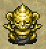

<table class="monsterPageTable">
  <tr>
    <th>Lv</th>
    <th>Name</th>
    <th>HP</th>
    <th>Atk</th>
    <th>Def</th>
    <th>Exp</th>
    <th>Skill</th>
    <th>Drop</th>
    <th>Elem.</th>
    <th>Notes</th>
  </tr>
  <tr>
    <td class="highlightYellow">1</td>
    <td>N'dubba</td>
    <td>20</td>
    <td>22</td>
    <td>4</td>
    <td>15</td>
    <td>4</td>
    <td>0%</td>
    <td>-</td>
    <td>Disguised as an item, attacks if you try to pick it up. Remains when it changes to night, but vanishes if revealed. N'dubbas turn into real items if Extinction Scroll is used.</td>
  </tr>
  <tr>
    <td class="highlightYellow">2</td>
    <td>monster_name</td>
    <td>36</td>
    <td>37</td>
    <td>8</td>
    <td>33</td>
    <td>9</td>
    <td>0%</td>
    <td>-</td>
    <td>Disguised as an item, remains disguised if you pick it up. Revealed when it's used, thrown and hits a creature, inserted into a pot, identified, or when you change floors.</td>
  </tr>
  <tr>
    <td class="highlightYellow">3</td>
    <td>monster_name</td>
    <td>47</td>
    <td>53</td>
    <td>11</td>
    <td>100</td>
    <td>20</td>
    <td>0%</td>
    <td>-</td>
    <td>Disguised as an item, remains disguised if you pick it up. Revealed when it's used or thrown and hits a creature. Remains disguised even if you change floors, identify it, return to Boronga Village, deposit it into the Storehouse, or change its blessed / sealed / cursed status.</td>
  </tr>
  <tr>
    <td class="highlightYellow">4</td>
    <td>monster_name</td>
    <td>49</td>
    <td>90</td>
    <td>11</td>
    <td>330</td>
    <td>80</td>
    <td>0%</td>
    <td>-</td>
    <td>Has one of the above abilities, selected randomly.</td>
  </tr>
  <tr>
    <th>Lv</th>
    <th>Name</th>
    <th>HP</th>
    <th>Atk</th>
    <th>Def</th>
    <th>Exp</th>
    <th>Skill</th>
    <th>Drop</th>
    <th>Elem.</th>
    <th>Notes</th>
  </tr>
  <tr>
    <td class="highlightNight">1</td>
    <td>monster_name</td>
    <td>21</td>
    <td>42</td>
    <td>0</td>
    <td>40</td>
    <td>20</td>
    <td>0%</td>
    <td rowspan="4">Regular</td>
    <td rowspan="4">Same as daytime abilities. Remains when it changes to day, but vanishes if revealed.</td>
  </tr>
  <tr>
    <td class="highlightNight">2</td>
    <td>monster_name</td>
    <td>35</td>
    <td>52</td>
    <td>1</td>
    <td>220</td>
    <td>50</td>
    <td>0%</td>
  </tr>
  <tr>
    <td class="highlightNight">3</td>
    <td>monster_name</td>
    <td>48</td>
    <td>75</td>
    <td>2</td>
    <td>850</td>
    <td>160</td>
    <td>0%</td>
  </tr>
  <tr>
    <td class="highlightNight">4</td>
    <td>monster_name</td>
    <td>55</td>
    <td>86</td>
    <td>3</td>
    <td>2700</td>
    <td>260</td>
    <td>0%</td>
  </tr>
</table>

### Field Knave

  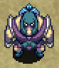

<table class="monsterPageTable">
  <tr>
    <th>Lv</th>
    <th>Name</th>
    <th>HP</th>
    <th>Atk</th>
    <th>Def</th>
    <th>Exp</th>
    <th>Skill</th>
    <th>Drop</th>
    <th>Elem.</th>
    <th>Notes</th>
  </tr>
  <tr>
    <td class="highlightYellow">1</td>
    <td>Field Knave</td>
    <td>23</td>
    <td>12</td>
    <td>7</td>
    <td>18</td>
    <td>4</td>
    <td>2%</td>
    <td>-</td>
    <td>Looks for items on the ground and turns them into Weeds. Throws Weeds when lined up, dealing 2 damage. Only drops Weeds.</td>
  </tr>
  <tr>
    <td class="highlightYellow">2</td>
    <td>monster_name</td>
    <td>43</td>
    <td>16</td>
    <td>11</td>
    <td>75</td>
    <td>8</td>
    <td>2%</td>
    <td>-</td>
    <td>Same as Field Knave, but thrown Weeds go inside pots.</td>
  </tr>
  <tr>
    <td class="highlightYellow">3</td>
    <td>monster_name</td>
    <td>62</td>
    <td>37</td>
    <td>15</td>
    <td>670</td>
    <td>40</td>
    <td>2%</td>
    <td>-</td>
    <td>Same as Field Knave, but thrown Weeds knocks an item away. (Bind Bracelet protects inventory items)</td>
  </tr>
  <tr>
    <td class="highlightYellow">4</td>
    <td>monster_name</td>
    <td>73</td>
    <td>46</td>
    <td>23</td>
    <td>950</td>
    <td>90</td>
    <td>2%</td>
    <td>-</td>
    <td>Same as monster_name, but can also turn 1 inventory item into Weeds when adjacent, including equipped items.</td>
  </tr>
  <tr>
    <th>Lv</th>
    <th>Name</th>
    <th>HP</th>
    <th>Atk</th>
    <th>Def</th>
    <th>Exp</th>
    <th>Skill</th>
    <th>Drop</th>
    <th>Elem.</th>
    <th>Notes</th>
  </tr>
  <tr>
    <td class="highlightNight">1</td>
    <td>monster_name</td>
    <td>20</td>
    <td>14</td>
    <td>2</td>
    <td>20</td>
    <td>10</td>
    <td>2%</td>
    <td rowspan="4">Regular</td>
    <td rowspan="4">Same as daytime abilities.</td>
  </tr>
  <tr>
    <td class="highlightNight">2</td>
    <td>monster_name</td>
    <td>39</td>
    <td>30</td>
    <td>3</td>
    <td>120</td>
    <td>45</td>
    <td>2%</td>
  </tr>
  <tr>
    <td class="highlightNight">3</td>
    <td>monster_name</td>
    <td>49</td>
    <td>41</td>
    <td>4</td>
    <td>210</td>
    <td>80</td>
    <td>2%</td>
  </tr>
  <tr>
    <td class="highlightNight">4</td>
    <td>monster_name</td>
    <td>60</td>
    <td>54</td>
    <td>5</td>
    <td>1100</td>
    <td>190</td>
    <td>2%</td>
  </tr>
</table>

### Spin Polygon

  

<table class="monsterPageTable">
  <tr>
    <th>Lv</th>
    <th>Name</th>
    <th>HP</th>
    <th>Atk</th>
    <th>Def</th>
    <th>Exp</th>
    <th>Skill</th>
    <th>Drop</th>
    <th>Elem.</th>
    <th>Notes</th>
  </tr>
  <tr>
    <td class="highlightYellow">1</td>
    <td>Spin Polygon</td>
    <td>37</td>
    <td>16</td>
    <td>11</td>
    <td>66</td>
    <td>12</td>
    <td>2%</td>
    <td rowspan="4">Drain</td>
    <td>Warps in front of you in rooms. Lowers max HP by 1 or max fullness by 3 when adjacent.</td>
  </tr>
  <tr>
    <td class="highlightYellow">2</td>
    <td>monster_name</td>
    <td>61</td>
    <td>32</td>
    <td>17</td>
    <td>320</td>
    <td>35</td>
    <td>2%</td>
    <td>Same as above, but lowers max HP by 2 or max fullness by 5.</td>
  </tr>
  <tr>
    <td class="highlightYellow">3</td>
    <td>monster_name</td>
    <td>73</td>
    <td>45</td>
    <td>21</td>
    <td>900</td>
    <td>60</td>
    <td>2%</td>
    <td>Same as above, but lowers max HP by 3 or max fullness by 7.</td>
  </tr>
  <tr>
    <td class="highlightYellow">4</td>
    <td>monster_name</td>
    <td>86</td>
    <td>62</td>
    <td>28</td>
    <td>1600</td>
    <td>200</td>
    <td>2%</td>
    <td>Same as above, but lowers max HP by 5 or max fullness by 10.</td>
  </tr>
  <tr>
    <th>Lv</th>
    <th>Name</th>
    <th>HP</th>
    <th>Atk</th>
    <th>Def</th>
    <th>Exp</th>
    <th>Skill</th>
    <th>Drop</th>
    <th>Elem.</th>
    <th>Notes</th>
  </tr>
  <tr>
    <td class="highlightNight">1</td>
    <td>monster_name</td>
    <td>25</td>
    <td>18</td>
    <td>3</td>
    <td>26</td>
    <td>13</td>
    <td>2%</td>
    <td rowspan="4">Drain Regular</td>
    <td>Same as above, but lowers max HP by 2 or max fullness by 5.</td>
  </tr>
  <tr>
    <td class="highlightNight">2</td>
    <td>monster_name</td>
    <td>45</td>
    <td>33</td>
    <td>4</td>
    <td>70</td>
    <td>25</td>
    <td>2%</td>
    <td>Same as above, but lowers max HP by 3 or max fullness by 7.</td>
  </tr>
  <tr>
    <td class="highlightNight">3</td>
    <td>monster_name</td>
    <td>52</td>
    <td>35</td>
    <td>6</td>
    <td>300</td>
    <td>80</td>
    <td>2%</td>
    <td>Same as above, but lowers max HP by 4 or max fullness by 10.</td>
  </tr>
  <tr>
    <td class="highlightNight">4</td>
    <td>monster_name</td>
    <td>67</td>
    <td>57</td>
    <td>7</td>
    <td>1500</td>
    <td>160</td>
    <td>2%</td>
    <td>Same as above, but lowers max HP by 6 or max fullness by 15.</td>
  </tr>
</table>

### Porky

  

<table class="monsterPageTable">
  <tr>
    <th>Lv</th>
    <th>Name</th>
    <th>HP</th>
    <th>Atk</th>
    <th>Def</th>
    <th>Exp</th>
    <th>Skill</th>
    <th>Drop</th>
    <th>Elem.</th>
    <th>Notes</th>
  </tr>
  <tr>
    <td class="highlightYellow">1</td>
    <td>Porky</td>
    <td>47</td>
    <td>21</td>
    <td>8</td>
    <td>100</td>
    <td>20</td>
    <td>6%</td>
    <td>-</td>
    <td>Throws a Porky Rock within a 2 tile radius. (20 damage) Only drops Porky Rocks.</td>
  </tr>
  <tr>
    <td class="highlightYellow">2</td>
    <td>monster_name</td>
    <td>72</td>
    <td>38</td>
    <td>22</td>
    <td>840</td>
    <td>70</td>
    <td>6%</td>
    <td>-</td>
    <td>Same as Porky, but throwing range of 4 tiles.</td>
  </tr>
  <tr>
    <td class="highlightYellow">3</td>
    <td>monster_name</td>
    <td>83</td>
    <td>50</td>
    <td>30</td>
    <td>2000</td>
    <td>200</td>
    <td>6%</td>
    <td>-</td>
    <td>Same as Porky, but throwing range of 6 tiles.</td>
  </tr>
  <tr>
    <td class="highlightYellow">4</td>
    <td>monster_name</td>
    <td>97</td>
    <td>71</td>
    <td>35</td>
    <td>4000</td>
    <td>400</td>
    <td>6%</td>
    <td>-</td>
    <td>Same as Porky, but throwing range of 10 tiles.</td>
  </tr>
  <tr>
    <th>Lv</th>
    <th>Name</th>
    <th>HP</th>
    <th>Atk</th>
    <th>Def</th>
    <th>Exp</th>
    <th>Skill</th>
    <th>Drop</th>
    <th>Elem.</th>
    <th>Notes</th>
  </tr>
  <tr>
    <td class="highlightNight">1</td>
    <td>monster_name</td>
    <td>39</td>
    <td>28</td>
    <td>3</td>
    <td>200</td>
    <td>30</td>
    <td>6%</td>
    <td rowspan="4">Random</td>
    <td rowspan="4">Same as daytime abilities.</td>
  </tr>
  <tr>
    <td class="highlightNight">2</td>
    <td>monster_name</td>
    <td>52</td>
    <td>42</td>
    <td>4</td>
    <td>550</td>
    <td>140</td>
    <td>6%</td>
  </tr>
  <tr>
    <td class="highlightNight">3</td>
    <td>monster_name</td>
    <td>61</td>
    <td>50</td>
    <td>5</td>
    <td>1000</td>
    <td>220</td>
    <td>6%</td>
  </tr>
  <tr>
    <td class="highlightNight">4</td>
    <td>monster_name</td>
    <td>74</td>
    <td>65</td>
    <td>6</td>
    <td>5000</td>
    <td>350</td>
    <td>6%</td>
  </tr>
</table>

### Pumphantasm

  

<table class="monsterPageTable">
  <tr>
    <th>Lv</th>
    <th>Name</th>
    <th>HP</th>
    <th>Atk</th>
    <th>Def</th>
    <th>Exp</th>
    <th>Skill</th>
    <th>Drop</th>
    <th>Elem.</th>
    <th>Notes</th>
  </tr>
  <tr>
    <td class="highlightYellow">1</td>
    <td>Pumphantasm</td>
    <td>34</td>
    <td>24</td>
    <td>3</td>
    <td>83</td>
    <td>24</td>
    <td>0%</td>
    <td rowspan="4">Floating</td>
    <td rowspan="4">Can pass through walls. Unpredictable movement, sometimes doesn't attack.</td>
  </tr>
  <tr>
    <td class="highlightYellow">2</td>
    <td>monster_name</td>
    <td>66</td>
    <td>36</td>
    <td>15</td>
    <td>210</td>
    <td>25</td>
    <td>0%</td>
  </tr>
  <tr>
    <td class="highlightYellow">3</td>
    <td>monster_name</td>
    <td>75</td>
    <td>65</td>
    <td>19</td>
    <td>1400</td>
    <td>80</td>
    <td>0%</td>
  </tr>
  <tr>
    <td class="highlightYellow">4</td>
    <td>monster_name</td>
    <td>84</td>
    <td>80</td>
    <td>24</td>
    <td>2500</td>
    <td>170</td>
    <td>0%</td>
  </tr>
  <tr>
    <th>Lv</th>
    <th>Name</th>
    <th>HP</th>
    <th>Atk</th>
    <th>Def</th>
    <th>Exp</th>
    <th>Skill</th>
    <th>Drop</th>
    <th>Elem.</th>
    <th>Notes</th>
  </tr>
  <tr>
    <td class="highlightNight">1</td>
    <td>monster_name</td>
    <td>35</td>
    <td>26</td>
    <td>1</td>
    <td>33</td>
    <td>25</td>
    <td>0%</td>
    <td rowspan="4">Random</td>
    <td rowspan="4">Same as daytime abilities.</td>
  </tr>
  <tr>
    <td class="highlightNight">2</td>
    <td>monster_name</td>
    <td>53</td>
    <td>45</td>
    <td>2</td>
    <td>400</td>
    <td>100</td>
    <td>0%</td>
  </tr>
  <tr>
    <td class="highlightNight">3</td>
    <td>monster_name</td>
    <td>66</td>
    <td>57</td>
    <td>3</td>
    <td>1200</td>
    <td>160</td>
    <td>0%</td>
  </tr>
  <tr>
    <td class="highlightNight">4</td>
    <td>monster_name</td>
    <td>77</td>
    <td>70</td>
    <td>4</td>
    <td>3000</td>
    <td>260</td>
    <td>0%</td>
  </tr>
</table>

### Fearabbit

  

<table class="monsterPageTable">
  <tr>
    <th>Lv</th>
    <th>Name</th>
    <th>HP</th>
    <th>Atk</th>
    <th>Def</th>
    <th>Exp</th>
    <th>Skill</th>
    <th>Drop</th>
    <th>Elem.</th>
    <th>Notes</th>
  </tr>
  <tr>
    <td class="highlightYellow">1</td>
    <td>Fearabbit</td>
    <td>26</td>
    <td>9</td>
    <td>9</td>
    <td>67</td>
    <td>9</td>
    <td>4%</td>
    <td>-</td>
    <td>Attracts up to 3 creatures in the same room, and then does a direct attack on the same turn. Doesn't use its special when adjacent.</td>
  </tr>
  <tr>
    <td class="highlightYellow">2</td>
    <td>monster_name</td>
    <td>50</td>
    <td>29</td>
    <td>16</td>
    <td>220</td>
    <td>35</td>
    <td>4%</td>
    <td>-</td>
    <td>Same as Fearabbit, but attracts up to 5 creatures.</td>
  </tr>
  <tr>
    <td class="highlightYellow">3</td>
    <td>monster_name</td>
    <td>74</td>
    <td>43</td>
    <td>20</td>
    <td>880</td>
    <td>80</td>
    <td>4%</td>
    <td>-</td>
    <td>Attracts up to 3 creatures from anywhere on the floor, and then does a direct attack on the same turn. Doesn't use its special when adjacent.</td>
  </tr>
  <tr>
    <td class="highlightYellow">4</td>
    <td>monster_name</td>
    <td>83</td>
    <td>53</td>
    <td>26</td>
    <td>1200</td>
    <td>200</td>
    <td>4%</td>
    <td>-</td>
    <td>Same as monster_name, but attracts up to 5 creatures.</td>
  </tr>
  <tr>
    <th>Lv</th>
    <th>Name</th>
    <th>HP</th>
    <th>Atk</th>
    <th>Def</th>
    <th>Exp</th>
    <th>Skill</th>
    <th>Drop</th>
    <th>Elem.</th>
    <th>Notes</th>
  </tr>
  <tr>
    <td class="highlightNight">1</td>
    <td>monster_name</td>
    <td>28</td>
    <td>20</td>
    <td>2</td>
    <td>32</td>
    <td>13</td>
    <td>4%</td>
    <td rowspan="4">Random</td>
    <td rowspan="4">Same as daytime abilities.</td>
  </tr>
  <tr>
    <td class="highlightNight">2</td>
    <td>monster_name</td>
    <td>40</td>
    <td>36</td>
    <td>4</td>
    <td>170</td>
    <td>80</td>
    <td>4%</td>
  </tr>
  <tr>
    <td class="highlightNight">3</td>
    <td>monster_name</td>
    <td>52</td>
    <td>46</td>
    <td>5</td>
    <td>650</td>
    <td>130</td>
    <td>4%</td>
  </tr>
  <tr>
    <td class="highlightNight">4</td>
    <td>monster_name</td>
    <td>61</td>
    <td>55</td>
    <td>6</td>
    <td>2000</td>
    <td>220</td>
    <td>4%</td>
  </tr>
</table>

### Traproid

  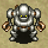

<table class="monsterPageTable">
  <tr>
    <th>Lv</th>
    <th>Name</th>
    <th>HP</th>
    <th>Atk</th>
    <th>Def</th>
    <th>Exp</th>
    <th>Skill</th>
    <th>Drop</th>
    <th>Elem.</th>
    <th>Notes</th>
  </tr>
  <tr>
    <td class="highlightYellow">1</td>
    <td>Traproid</td>
    <td>44</td>
    <td>18</td>
    <td>12</td>
    <td>72</td>
    <td>9</td>
    <td>4%</td>
    <td rowspan="4">Swift 1</td>
    <td rowspan="4">Double speed (1 attack). Initially Napping, and wakes up if you enter the room. Creates traps inside the room based on the floor's trap table. Stops acting for 2 turns after creating a trap. Chance to create a trap when defeated.</td>
  </tr>
  <tr>
    <td class="highlightYellow">2</td>
    <td>monster_name</td>
    <td>64</td>
    <td>41</td>
    <td>22</td>
    <td>440</td>
    <td>35</td>
    <td>4%</td>
  </tr>
  <tr>
    <td class="highlightYellow">3</td>
    <td>monster_name</td>
    <td>80</td>
    <td>60</td>
    <td>30</td>
    <td>1500</td>
    <td>80</td>
    <td>4%</td>
  </tr>
  <tr>
    <td class="highlightYellow">4</td>
    <td>monster_name</td>
    <td>94</td>
    <td>77</td>
    <td>39</td>
    <td>3500</td>
    <td>300</td>
    <td>4%</td>
  </tr>
  <tr>
    <th>Lv</th>
    <th>Name</th>
    <th>HP</th>
    <th>Atk</th>
    <th>Def</th>
    <th>Exp</th>
    <th>Skill</th>
    <th>Drop</th>
    <th>Elem.</th>
    <th>Notes</th>
  </tr>
  <tr>
    <td class="highlightNight">1</td>
    <td>monster_name</td>
    <td>43</td>
    <td>35</td>
    <td>5</td>
    <td>60</td>
    <td>25</td>
    <td>4%</td>
    <td rowspan="4">Swift 1 Regular</td>
    <td rowspan="4">Same as daytime abilities.</td>
  </tr>
  <tr>
    <td class="highlightNight">2</td>
    <td>monster_name</td>
    <td>56</td>
    <td>53</td>
    <td>6</td>
    <td>450</td>
    <td>100</td>
    <td>4%</td>
  </tr>
  <tr>
    <td class="highlightNight">3</td>
    <td>monster_name</td>
    <td>68</td>
    <td>63</td>
    <td>8</td>
    <td>1800</td>
    <td>190</td>
    <td>4%</td>
  </tr>
  <tr>
    <td class="highlightNight">4</td>
    <td>monster_name</td>
    <td>79</td>
    <td>74</td>
    <td>9</td>
    <td>3200</td>
    <td>260</td>
    <td>4%</td>
  </tr>
</table>

### Swordsman

  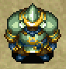

<table class="monsterPageTable">
  <tr>
    <th>Lv</th>
    <th>Name</th>
    <th>HP</th>
    <th>Atk</th>
    <th>Def</th>
    <th>Exp</th>
    <th>Skill</th>
    <th>Drop</th>
    <th>Elem.</th>
    <th>Notes</th>
  </tr>
  <tr>
    <td class="highlightYellow">1</td>
    <td>Swordsman</td>
    <td>58</td>
    <td>32</td>
    <td>16</td>
    <td>180</td>
    <td>15</td>
    <td>2%</td>
    <td>-</td>
    <td>Knocks away your shield if adjacent, sending it behind you.</td>
  </tr>
  <tr>
    <td class="highlightYellow">2</td>
    <td>monster_name</td>
    <td>67</td>
    <td>58</td>
    <td>24</td>
    <td>1500</td>
    <td>90</td>
    <td>2%</td>
    <td>-</td>
    <td>Same as Swordsman, but also weapons.</td>
  </tr>
  <tr>
    <td class="highlightYellow">3</td>
    <td>monster_name</td>
    <td>80</td>
    <td>75</td>
    <td>32</td>
    <td>3600</td>
    <td>300</td>
    <td>2%</td>
    <td>-</td>
    <td>Same as Swordsman, but also weapons and bracelets.</td>
  </tr>
  <tr>
    <td class="highlightYellow">4</td>
    <td>monster_name</td>
    <td>92</td>
    <td>89</td>
    <td>42</td>
    <td>5000</td>
    <td>400</td>
    <td>2%</td>
    <td>-</td>
    <td>Knocks away your shield, weapon, or bracelet if adjacent, sending it somewhere within 10 tiles.</td>
  </tr>
  <tr>
    <th>Lv</th>
    <th>Name</th>
    <th>HP</th>
    <th>Atk</th>
    <th>Def</th>
    <th>Exp</th>
    <th>Skill</th>
    <th>Drop</th>
    <th>Elem.</th>
    <th>Notes</th>
  </tr>
  <tr>
    <td class="highlightNight">1</td>
    <td>monster_name</td>
    <td>52</td>
    <td>45</td>
    <td>6</td>
    <td>130</td>
    <td>50</td>
    <td>2%</td>
    <td rowspan="4">Random</td>
    <td rowspan="4">Same as daytime abilities.</td>
  </tr>
  <tr>
    <td class="highlightNight">2</td>
    <td>monster_name</td>
    <td>62</td>
    <td>54</td>
    <td>8</td>
    <td>660</td>
    <td>140</td>
    <td>2%</td>
  </tr>
  <tr>
    <td class="highlightNight">3</td>
    <td>monster_name</td>
    <td>70</td>
    <td>66</td>
    <td>10</td>
    <td>2200</td>
    <td>260</td>
    <td>2%</td>
  </tr>
  <tr>
    <td class="highlightNight">4</td>
    <td>monster_name</td>
    <td>82</td>
    <td>77</td>
    <td>12</td>
    <td>5200</td>
    <td>350</td>
    <td>2%</td>
  </tr>
</table>

### Gyadon

  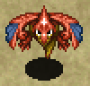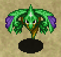

<table class="monsterPageTable">
  <tr>
    <th>Lv</th>
    <th>Name</th>
    <th>HP</th>
    <th>Atk</th>
    <th>Def</th>
    <th>Exp</th>
    <th>Skill</th>
    <th>Drop</th>
    <th>Elem.</th>
    <th>Notes</th>
  </tr>
  <tr>
    <td class="highlightYellow">1</td>
    <td>Gyadon</td>
    <td>48</td>
    <td>22</td>
    <td>17</td>
    <td>90</td>
    <td>12</td>
    <td>4%</td>
    <td rowspan="4">Floating</td>
    <td>Reduces a staff's remaining uses to 0.</td>
  </tr>
  <tr>
    <td class="highlightYellow">2</td>
    <td>monster_name</td>
    <td>57</td>
    <td>34</td>
    <td>20</td>
    <td>500</td>
    <td>35</td>
    <td>4%</td>
    <td>Turns a scroll or talisman into Piece of Paper.</td>
  </tr>
  <tr>
    <td class="highlightYellow">3</td>
    <td>monster_name</td>
    <td>69</td>
    <td>56</td>
    <td>26</td>
    <td>1300</td>
    <td>80</td>
    <td>4%</td>
    <td>Reduces a pot's capacity to 0. All items in the pot vanish.</td>
  </tr>
  <tr>
    <td class="highlightYellow">4</td>
    <td>monster_name</td>
    <td>85</td>
    <td>72</td>
    <td>36</td>
    <td>2800</td>
    <td>200</td>
    <td>4%</td>
    <td>Has all of the above abilities, and can also erase 1 rune from a weapon or shield.</td>
  </tr>
  <tr>
    <th>Lv</th>
    <th>Name</th>
    <th>HP</th>
    <th>Atk</th>
    <th>Def</th>
    <th>Exp</th>
    <th>Skill</th>
    <th>Drop</th>
    <th>Elem.</th>
    <th>Notes</th>
  </tr>
  <tr>
    <td class="highlightNight">1</td>
    <td>monster_name</td>
    <td>37</td>
    <td>28</td>
    <td>4</td>
    <td>48</td>
    <td>18</td>
    <td>4%</td>
    <td rowspan="4">Floating Random</td>
    <td rowspan="4">Same as daytime abilities.</td>
  </tr>
  <tr>
    <td class="highlightNight">2</td>
    <td>monster_name</td>
    <td>51</td>
    <td>42</td>
    <td>6</td>
    <td>230</td>
    <td>80</td>
    <td>4%</td>
  </tr>
  <tr>
    <td class="highlightNight">3</td>
    <td>monster_name</td>
    <td>64</td>
    <td>53</td>
    <td>8</td>
    <td>1000</td>
    <td>160</td>
    <td>4%</td>
  </tr>
  <tr>
    <td class="highlightNight">4</td>
    <td>monster_name</td>
    <td>75</td>
    <td>64</td>
    <td>9</td>
    <td>2400</td>
    <td>220</td>
    <td>4%</td>
  </tr>
</table>

### Flashbird

  

<table class="monsterPageTable">
  <tr>
    <th>Lv</th>
    <th>Name</th>
    <th>HP</th>
    <th>Atk</th>
    <th>Def</th>
    <th>Exp</th>
    <th>Skill</th>
    <th>Drop</th>
    <th>Elem.</th>
    <th>Notes</th>
  </tr>
  <tr>
    <td class="highlightYellow">1</td>
    <td>Flashbird</td>
    <td>31</td>
    <td>11</td>
    <td>18</td>
    <td>57</td>
    <td>9</td>
    <td>0%</td>
    <td rowspan="4">Floating</td>
    <td>Fire damage restores its HP. Nullifies thrown items, and duplicates from explosions. Heals an adjacent monster by 30 HP if they're hurt.</td>
  </tr>
  <tr>
    <td class="highlightYellow">2</td>
    <td>monster_name</td>
    <td>43</td>
    <td>20</td>
    <td>25</td>
    <td>200</td>
    <td>25</td>
    <td>0%</td>
    <td>Same as Flashbird, but heals 60 HP.</td>
  </tr>
  <tr>
    <td class="highlightYellow">3</td>
    <td>monster_name</td>
    <td>56</td>
    <td>29</td>
    <td>35</td>
    <td>730</td>
    <td>80</td>
    <td>0%</td>
    <td>Same as Flashbird, but warps to a hurt monster within Shiren's view from anywhere on the floor and heals all monsters in a 1 tile radius by 30 HP.</td>
  </tr>
  <tr>
    <td class="highlightYellow">4</td>
    <td>monster_name</td>
    <td>68</td>
    <td>36</td>
    <td>43</td>
    <td>1000</td>
    <td>170</td>
    <td>0%</td>
    <td>Same as monster_name, but heals 60 HP.</td>
  </tr>
  <tr>
    <th>Lv</th>
    <th>Name</th>
    <th>HP</th>
    <th>Atk</th>
    <th>Def</th>
    <th>Exp</th>
    <th>Skill</th>
    <th>Drop</th>
    <th>Elem.</th>
    <th>Notes</th>
  </tr>
  <tr>
    <td class="highlightNight">1</td>
    <td>monster_name</td>
    <td>27</td>
    <td>16</td>
    <td>3</td>
    <td>28</td>
    <td>13</td>
    <td>0%</td>
    <td rowspan="4">Floating Regular</td>
    <td rowspan="4">Same as daytime abilities.</td>
  </tr>
  <tr>
    <td class="highlightNight">2</td>
    <td>monster_name</td>
    <td>36</td>
    <td>28</td>
    <td>4</td>
    <td>100</td>
    <td>60</td>
    <td>0%</td>
  </tr>
  <tr>
    <td class="highlightNight">3</td>
    <td>monster_name</td>
    <td>45</td>
    <td>36</td>
    <td>5</td>
    <td>300</td>
    <td>130</td>
    <td>0%</td>
  </tr>
  <tr>
    <td class="highlightNight">4</td>
    <td>monster_name</td>
    <td>54</td>
    <td>49</td>
    <td>6</td>
    <td>950</td>
    <td>190</td>
    <td>0%</td>
  </tr>
</table>

### Yanpii

  

<table class="monsterPageTable">
  <tr>
    <th>Lv</th>
    <th>Name</th>
    <th>HP</th>
    <th>Atk</th>
    <th>Def</th>
    <th>Exp</th>
    <th>Skill</th>
    <th>Drop</th>
    <th>Elem.</th>
    <th>Notes</th>
  </tr>
  <tr>
    <td class="highlightYellow">1</td>
    <td>Yanpii</td>
    <td>38</td>
    <td>23</td>
    <td>7</td>
    <td>71</td>
    <td>16</td>
    <td>4%</td>
    <td>-</td>
    <td>Headbutts if lined up, dealing 10 damage and knockback. Knockback varies based on distance between Shiren and Yanpii. If you hit a wall, go into the wall 1 tile and take 10 more damage.</td>
  </tr>
  <tr>
    <td class="highlightYellow">2</td>
    <td>monster_name</td>
    <td>49</td>
    <td>44</td>
    <td>13</td>
    <td>310</td>
    <td>40</td>
    <td>4%</td>
    <td>-</td>
    <td>Same as Yanpii, but headbutt deals 20 damage. If you hit a wall, go into the wall 2 tiles and take 20 more damage.</td>
  </tr>
  <tr>
    <td class="highlightYellow">3</td>
    <td>monster_name</td>
    <td>60</td>
    <td>68</td>
    <td>20</td>
    <td>2000</td>
    <td>90</td>
    <td>4%</td>
    <td>-</td>
    <td>Same as Yanpii, but headbutt deals 30 damage. If you hit a wall, go into the wall 3 tiles and take 30 more damage.</td>
  </tr>
  <tr>
    <td class="highlightYellow">4</td>
    <td>monster_name</td>
    <td>92</td>
    <td>82</td>
    <td>28</td>
    <td>4200</td>
    <td>250</td>
    <td>4%</td>
    <td>-</td>
    <td>Same as Yanpii, but headbutt deals 40 damage. If you hit a wall, go into the wall 4 tiles and take 40 more damage.</td>
  </tr>
  <tr>
    <th>Lv</th>
    <th>Name</th>
    <th>HP</th>
    <th>Atk</th>
    <th>Def</th>
    <th>Exp</th>
    <th>Skill</th>
    <th>Drop</th>
    <th>Elem.</th>
    <th>Notes</th>
  </tr>
  <tr>
    <td class="highlightNight">1</td>
    <td>monster_name</td>
    <td>32</td>
    <td>45</td>
    <td>0</td>
    <td>71</td>
    <td>40</td>
    <td>4%</td>
    <td rowspan="4">Random</td>
    <td>Same as day counterpart, but headbutt deals 15 damage.</td>
  </tr>
  <tr>
    <td class="highlightNight">2</td>
    <td>monster_name</td>
    <td>45</td>
    <td>70</td>
    <td>1</td>
    <td>580</td>
    <td>140</td>
    <td>4%</td>
    <td>Same as day counterpart, but headbutt deals 25 damage.</td>
  </tr>
  <tr>
    <td class="highlightNight">3</td>
    <td>monster_name</td>
    <td>56</td>
    <td>80</td>
    <td>2</td>
    <td>3000</td>
    <td>300</td>
    <td>4%</td>
    <td>Same as day counterpart, but headbutt deals 35 damage.</td>
  </tr>
  <tr>
    <td class="highlightNight">4</td>
    <td>monster_name</td>
    <td>66</td>
    <td>95</td>
    <td>3</td>
    <td>6200</td>
    <td>260</td>
    <td>4%</td>
    <td>Same as day counterpart, but headbutt deals 45 damage.</td>
  </tr>
</table>

### Banana Novice

  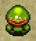

<table class="monsterPageTable">
  <tr>
    <th>Lv</th>
    <th>Name</th>
    <th>HP</th>
    <th>Atk</th>
    <th>Def</th>
    <th>Exp</th>
    <th>Skill</th>
    <th>Drop</th>
    <th>Elem.</th>
    <th>Notes</th>
  </tr>
  <tr>
    <td class="highlightYellow">1</td>
    <td>Banana Novice</td>
    <td>16</td>
    <td>11</td>
    <td>5</td>
    <td>15</td>
    <td>5</td>
    <td>4%</td>
    <td>-</td>
    <td>Instantly collapses if hit by a banana or Banana Peel. Nullifies Banana status, heals HP instead.</td>
  </tr>
  <tr>
    <td class="highlightYellow">2</td>
    <td>monster_name</td>
    <td>58</td>
    <td>32</td>
    <td>18</td>
    <td>330</td>
    <td>25</td>
    <td>4%</td>
    <td>-</td>
    <td>Same as Banana Novice, but also has the ability to turn 1 item into a Yellow Banana, excluding equipped items. Only drops Green Bananas.</td>
  </tr>
  <tr>
    <td class="highlightYellow">3</td>
    <td>monster_name</td>
    <td>66</td>
    <td>50</td>
    <td>22</td>
    <td>1100</td>
    <td>60</td>
    <td>4%</td>
    <td>-</td>
    <td>Same as Banana Novice, but also has the ability to inflict Shiren with Banana status. Only drops Yellow Bananas.</td>
  </tr>
  <tr>
    <td class="highlightYellow">4</td>
    <td>monster_name</td>
    <td>80</td>
    <td>61</td>
    <td>29</td>
    <td>1900</td>
    <td>170</td>
    <td>4%</td>
    <td>-</td>
    <td>Has all of the above abilities. Only drops Ripe Bananas.</td>
  </tr>
  <tr>
    <th>Lv</th>
    <th>Name</th>
    <th>HP</th>
    <th>Atk</th>
    <th>Def</th>
    <th>Exp</th>
    <th>Skill</th>
    <th>Drop</th>
    <th>Elem.</th>
    <th>Notes</th>
  </tr>
  <tr>
    <td class="highlightNight">1</td>
    <td>monster_name</td>
    <td>14</td>
    <td>5</td>
    <td>2</td>
    <td>3</td>
    <td>10</td>
    <td>4%</td>
    <td rowspan="4">Random</td>
    <td rowspan="4">Same as daytime abilities. Only drops Spoiled Bananas.</td>
  </tr>
  <tr>
    <td class="highlightNight">2</td>
    <td>monster_name</td>
    <td>22</td>
    <td>16</td>
    <td>2</td>
    <td>22</td>
    <td>15</td>
    <td>4%</td>
  </tr>
  <tr>
    <td class="highlightNight">3</td>
    <td>monster_name</td>
    <td>45</td>
    <td>38</td>
    <td>5</td>
    <td>150</td>
    <td>45</td>
    <td>4%</td>
  </tr>
  <tr>
    <td class="highlightNight">4</td>
    <td>monster_name</td>
    <td>70</td>
    <td>64</td>
    <td>6</td>
    <td>2200</td>
    <td>220</td>
    <td>4%</td>
  </tr>
</table>

### Explochin

  

<table class="monsterPageTable">
  <tr>
    <th>Lv</th>
    <th>Name</th>
    <th>HP</th>
    <th>Atk</th>
    <th>Def</th>
    <th>Exp</th>
    <th>Skill</th>
    <th>Drop</th>
    <th>Elem.</th>
    <th>Notes</th>
  </tr>
  <tr>
    <td class="highlightYellow">1</td>
    <td>Explochin</td>
    <td>62</td>
    <td>14</td>
    <td>7</td>
    <td>15</td>
    <td>7</td>
    <td>0%</td>
    <td rowspan="4">Bomb Aquatic Cyclops</td>
    <td rowspan="4">Turns red and stops moving after losing 55% HP. Explodes in a big explosion after losing 80% HP. Doesn't explode if damage dealt exceeds remaining HP.</td>
  </tr>
  <tr>
    <td class="highlightYellow">2</td>
    <td>monster_name</td>
    <td>83</td>
    <td>22</td>
    <td>10</td>
    <td>110</td>
    <td>20</td>
    <td>0%</td>
  </tr>
  <tr>
    <td class="highlightYellow">3</td>
    <td>monster_name</td>
    <td>102</td>
    <td>32</td>
    <td>13</td>
    <td>500</td>
    <td>60</td>
    <td>0%</td>
  </tr>
  <tr>
    <td class="highlightYellow">4</td>
    <td>monster_name</td>
    <td>130</td>
    <td>44</td>
    <td>19</td>
    <td>1300</td>
    <td>130</td>
    <td>0%</td>
  </tr>
  <tr>
    <th>Lv</th>
    <th>Name</th>
    <th>HP</th>
    <th>Atk</th>
    <th>Def</th>
    <th>Exp</th>
    <th>Skill</th>
    <th>Drop</th>
    <th>Elem.</th>
    <th>Notes</th>
  </tr>
  <tr>
    <td class="highlightNight">1</td>
    <td>monster_name</td>
    <td>40</td>
    <td>18</td>
    <td>0</td>
    <td>35</td>
    <td>18</td>
    <td>0%</td>
    <td rowspan="4">Bomb Aquatic Cyclops Random</td>
    <td rowspan="4">Same as daytime abilities.</td>
  </tr>
  <tr>
    <td class="highlightNight">2</td>
    <td>monster_name</td>
    <td>55</td>
    <td>29</td>
    <td>1</td>
    <td>130</td>
    <td>80</td>
    <td>0%</td>
  </tr>
  <tr>
    <td class="highlightNight">3</td>
    <td>monster_name</td>
    <td>63</td>
    <td>43</td>
    <td>2</td>
    <td>800</td>
    <td>160</td>
    <td>0%</td>
  </tr>
  <tr>
    <td class="highlightNight">4</td>
    <td>monster_name</td>
    <td>72</td>
    <td>51</td>
    <td>3</td>
    <td>1400</td>
    <td>220</td>
    <td>0%</td>
  </tr>
</table>

### Gyaza

  

<table class="monsterPageTable">
  <tr>
    <th>Lv</th>
    <th>Name</th>
    <th>HP</th>
    <th>Atk</th>
    <th>Def</th>
    <th>Exp</th>
    <th>Skill</th>
    <th>Drop</th>
    <th>Elem.</th>
    <th>Notes</th>
  </tr>
  <tr>
    <td class="highlightYellow">1</td>
    <td>Gyaza</td>
    <td>68</td>
    <td>36</td>
    <td>23</td>
    <td>400</td>
    <td>40</td>
    <td>4%</td>
    <td rowspan="4">Aquatic</td>
    <td rowspan="4">Converts effects other than direct attacks to 2 damage. Status runes, explosions, and Expulsion Scroll work.</td>
  </tr>
  <tr>
    <td class="highlightYellow">2</td>
    <td>monster_name</td>
    <td>75</td>
    <td>63</td>
    <td>27</td>
    <td>1800</td>
    <td>90</td>
    <td>4%</td>
  </tr>
  <tr>
    <td class="highlightYellow">3</td>
    <td>monster_name</td>
    <td>96</td>
    <td>80</td>
    <td>40</td>
    <td>5000</td>
    <td>300</td>
    <td>4%</td>
  </tr>
  <tr>
    <td class="highlightYellow">4</td>
    <td>monster_name</td>
    <td>115</td>
    <td>112</td>
    <td>50</td>
    <td>7500</td>
    <td>600</td>
    <td>4%</td>
  </tr>
  <tr>
    <th>Lv</th>
    <th>Name</th>
    <th>HP</th>
    <th>Atk</th>
    <th>Def</th>
    <th>Exp</th>
    <th>Skill</th>
    <th>Drop</th>
    <th>Elem.</th>
    <th>Notes</th>
  </tr>
  <tr>
    <td class="highlightNight">1</td>
    <td>monster_name</td>
    <td>50</td>
    <td>38</td>
    <td>7</td>
    <td>90</td>
    <td>40</td>
    <td>4%</td>
    <td rowspan="4">Aquatic Random</td>
    <td rowspan="4">Same as daytime abilities. Necklace moves are effective.</td>
  </tr>
  <tr>
    <td class="highlightNight">2</td>
    <td>monster_name</td>
    <td>67</td>
    <td>68</td>
    <td>9</td>
    <td>1800</td>
    <td>260</td>
    <td>4%</td>
  </tr>
  <tr>
    <td class="highlightNight">3</td>
    <td>monster_name</td>
    <td>79</td>
    <td>80</td>
    <td>11</td>
    <td>4500</td>
    <td>350</td>
    <td>4%</td>
  </tr>
  <tr>
    <td class="highlightNight">4</td>
    <td>monster_name</td>
    <td>92</td>
    <td>105</td>
    <td>13</td>
    <td>7500</td>
    <td>500</td>
    <td>4%</td>
  </tr>
</table>

### Cheer Ham

  

<table class="monsterPageTable">
  <tr>
    <th>Lv</th>
    <th>Name</th>
    <th>HP</th>
    <th>Atk</th>
    <th>Def</th>
    <th>Exp</th>
    <th>Skill</th>
    <th>Drop</th>
    <th>Elem.</th>
    <th>Notes</th>
  </tr>
  <tr>
    <td class="highlightYellow">1</td>
    <td>Cheer Ham</td>
    <td>13</td>
    <td>5</td>
    <td>3</td>
    <td>12</td>
    <td>5</td>
    <td>4%</td>
    <td>-</td>
    <td>Runs from Shiren, and moves toward monsters in its view. Cheers for creatures in a 1 tile radius, raising attack power by 1 stage and letting them survive a fatal hit. Its cheer also affects Shiren and his allies.</td>
  </tr>
  <tr>
    <td class="highlightYellow">2</td>
    <td>monster_name</td>
    <td>34</td>
    <td>15</td>
    <td>10</td>
    <td>50</td>
    <td>20</td>
    <td>4%</td>
    <td>-</td>
    <td>Same as Cheer Ham, but raises attack by 2 stages.</td>
  </tr>
  <tr>
    <td class="highlightYellow">3</td>
    <td>monster_name</td>
    <td>46</td>
    <td>22</td>
    <td>15</td>
    <td>130</td>
    <td>30</td>
    <td>4%</td>
    <td>-</td>
    <td>Same as Cheer Ham, but raises attack and defense by 1 stage.</td>
  </tr>
  <tr>
    <td class="highlightYellow">4</td>
    <td>monster_name</td>
    <td>60</td>
    <td>30</td>
    <td>20</td>
    <td>400</td>
    <td>50</td>
    <td>4%</td>
    <td>-</td>
    <td>Same as Cheer Ham, but raises attack and defense by 2 stages.</td>
  </tr>
  <tr>
    <th>Lv</th>
    <th>Name</th>
    <th>HP</th>
    <th>Atk</th>
    <th>Def</th>
    <th>Exp</th>
    <th>Skill</th>
    <th>Drop</th>
    <th>Elem.</th>
    <th>Notes</th>
  </tr>
  <tr>
    <td class="highlightNight">1</td>
    <td>monster_name</td>
    <td>25</td>
    <td>14</td>
    <td>1</td>
    <td>22</td>
    <td>18</td>
    <td>4%</td>
    <td rowspan="4">Regular</td>
    <td rowspan="4">Same as daytime abilities.</td>
  </tr>
  <tr>
    <td class="highlightNight">2</td>
    <td>monster_name</td>
    <td>37</td>
    <td>24</td>
    <td>2</td>
    <td>60</td>
    <td>60</td>
    <td>4%</td>
  </tr>
  <tr>
    <td class="highlightNight">3</td>
    <td>monster_name</td>
    <td>44</td>
    <td>32</td>
    <td>3</td>
    <td>240</td>
    <td>130</td>
    <td>4%</td>
  </tr>
  <tr>
    <td class="highlightNight">4</td>
    <td>monster_name</td>
    <td>56</td>
    <td>45</td>
    <td>4</td>
    <td>1000</td>
    <td>220</td>
    <td>4%</td>
  </tr>
</table>

### Dragon

  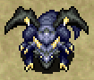

<table class="monsterPageTable">
  <tr>
    <th>Lv</th>
    <th>Name</th>
    <th>HP</th>
    <th>Atk</th>
    <th>Def</th>
    <th>Exp</th>
    <th>Skill</th>
    <th>Drop</th>
    <th>Elem.</th>
    <th>Notes</th>
  </tr>
  <tr>
    <td class="highlightYellow">1</td>
    <td>Dragon</td>
    <td>80</td>
    <td>45</td>
    <td>23</td>
    <td>1000</td>
    <td>40</td>
    <td>22%</td>
    <td rowspan="4">Dragon</td>
    <td>Breathes 30 damage fire in a straight line. Often generated Napping, high item drop rate.</td>
  </tr>
  <tr>
    <td class="highlightYellow">2</td>
    <td>Sky Dragon</td>
    <td>90</td>
    <td>80</td>
    <td>30</td>
    <td>3000</td>
    <td>150</td>
    <td>22%</td>
    <td>Breathes 40 damage fire from anywhere in the room.</td>
  </tr>
  <tr>
    <td class="highlightYellow">3</td>
    <td>Archdragon</td>
    <td>100</td>
    <td>97</td>
    <td>42</td>
    <td>6000</td>
    <td>400</td>
    <td>22%</td>
    <td>Breathes 50 damage fire from anywhere on the floor.</td>
  </tr>
  <tr>
    <td class="highlightYellow">4</td>
    <td>Abyss Dragon</td>
    <td>120</td>
    <td>106</td>
    <td>56</td>
    <td>8000</td>
    <td>600</td>
    <td>22%</td>
    <td>Same as Archdragon, but fire deals 60 damage.</td>
  </tr>
  <tr>
    <th>Lv</th>
    <th>Name</th>
    <th>HP</th>
    <th>Atk</th>
    <th>Def</th>
    <th>Exp</th>
    <th>Skill</th>
    <th>Drop</th>
    <th>Elem.</th>
    <th>Notes</th>
  </tr>
  <tr>
    <td class="highlightNight">1</td>
    <td>monster_name</td>
    <td>55</td>
    <td>40</td>
    <td>8</td>
    <td>150</td>
    <td>50</td>
    <td>22%</td>
    <td rowspan="4">Dragon Random</td>
    <td>Same as Dragon, but fire deals 40 damage.</td>
  </tr>
  <tr>
    <td class="highlightNight">2</td>
    <td>monster_name</td>
    <td>65</td>
    <td>59</td>
    <td>10</td>
    <td>1500</td>
    <td>220</td>
    <td>22%</td>
    <td>Same as Sky Dragon, but fire deals 50 damage.</td>
  </tr>
  <tr>
    <td class="highlightNight">3</td>
    <td>monster_name</td>
    <td>73</td>
    <td>70</td>
    <td>12</td>
    <td>3800</td>
    <td>300</td>
    <td>22%</td>
    <td>Same as Archdragon, but fire deals 60 damage.</td>
  </tr>
  <tr>
    <td class="highlightNight">4</td>
    <td>monster_name</td>
    <td>84</td>
    <td>81</td>
    <td>14</td>
    <td>7000</td>
    <td>500</td>
    <td>22%</td>
    <td>Same as Archdragon, but fire deals 70 damage.</td>
  </tr>
</table>

### Mixer

  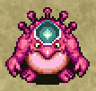

<table class="monsterPageTable">
  <tr>
    <th>Lv</th>
    <th>Name</th>
    <th>HP</th>
    <th>Atk</th>
    <th>Def</th>
    <th>Exp</th>
    <th>Skill</th>
    <th>Drop</th>
    <th>Elem.</th>
    <th>Notes</th>
  </tr>
  <tr>
    <td class="highlightYellow">1</td>
    <td>Mixer</td>
    <td>45</td>
    <td>15</td>
    <td>9</td>
    <td>33</td>
    <td>8</td>
    <td>0%</td>
    <td>-</td>
    <td>Eats up to 2 thrown items and synthesizes them. Attack power increases by 1 stage per item eaten. Drops eaten items if inflicted with Slip status. Won't eat if it's inflicted with: Napping, Asleep, Slumber, Sealed, Paralyzed, Banana, Slip.</td>
  </tr>
  <tr>
    <td class="highlightYellow">2</td>
    <td>Mixermon</td>
    <td>55</td>
    <td>26</td>
    <td>13</td>
    <td>130</td>
    <td>20</td>
    <td>0%</td>
    <td>-</td>
    <td>Same as Mixer, but eats up to 3 items.</td>
  </tr>
  <tr>
    <td class="highlightYellow">3</td>
    <td>Mixergon</td>
    <td>66</td>
    <td>40</td>
    <td>20</td>
    <td>550</td>
    <td>50</td>
    <td>0%</td>
    <td>-</td>
    <td>Same as Mixer, but eats up to 4 items.</td>
  </tr>
  <tr>
    <td class="highlightYellow">4</td>
    <td>Mixerdon</td>
    <td>83</td>
    <td>51</td>
    <td>27</td>
    <td>1150</td>
    <td>100</td>
    <td>0%</td>
    <td>-</td>
    <td>Same as Mixer, but eats up to 5 items.</td>
  </tr>
  <tr>
    <th>Lv</th>
    <th>Name</th>
    <th>HP</th>
    <th>Atk</th>
    <th>Def</th>
    <th>Exp</th>
    <th>Skill</th>
    <th>Drop</th>
    <th>Elem.</th>
    <th>Notes</th>
  </tr>
  <tr>
    <td class="highlightNight">1</td>
    <td>monster_name</td>
    <td>42</td>
    <td>32</td>
    <td>3</td>
    <td>55</td>
    <td>25</td>
    <td>0%</td>
    <td rowspan="4">Regular</td>
    <td rowspan="4">Same as daytime abilities.</td>
  </tr>
  <tr>
    <td class="highlightNight">2</td>
    <td>monster_name</td>
    <td>56</td>
    <td>46</td>
    <td>5</td>
    <td>280</td>
    <td>80</td>
    <td>0%</td>
  </tr>
  <tr>
    <td class="highlightNight">3</td>
    <td>monster_name</td>
    <td>64</td>
    <td>55</td>
    <td>7</td>
    <td>720</td>
    <td>130</td>
    <td>0%</td>
  </tr>
  <tr>
    <td class="highlightNight">4</td>
    <td>monster_name</td>
    <td>72</td>
    <td>68</td>
    <td>8</td>
    <td>2600</td>
    <td>220</td>
    <td>0%</td>
  </tr>
</table>

### Eligan

  

<table class="monsterPageTable">
  <tr>
    <th>Lv</th>
    <th>Name</th>
    <th>HP</th>
    <th>Atk</th>
    <th>Def</th>
    <th>Exp</th>
    <th>Skill</th>
    <th>Drop</th>
    <th>Elem.</th>
    <th>Notes</th>
  </tr>
  <tr>
    <td class="highlightYellow">1</td>
    <td>Eligan</td>
    <td>78</td>
    <td>60</td>
    <td>23</td>
    <td>1200</td>
    <td>50</td>
    <td>4%</td>
    <td>-</td>
    <td rowspan="4">No abilities.</td>
  </tr>
  <tr>
    <td class="highlightYellow">2</td>
    <td>monster_name</td>
    <td>85</td>
    <td>70</td>
    <td>26</td>
    <td>2700</td>
    <td>150</td>
    <td>4%</td>
    <td>-</td>
  </tr>
  <tr>
    <td class="highlightYellow">3</td>
    <td>monster_name</td>
    <td>108</td>
    <td>89</td>
    <td>37</td>
    <td>4800</td>
    <td>300</td>
    <td>4%</td>
    <td>-</td>
  </tr>
  <tr>
    <td class="highlightYellow">4</td>
    <td>monster_name</td>
    <td>125</td>
    <td>120</td>
    <td>52</td>
    <td>9000</td>
    <td>700</td>
    <td>4%</td>
    <td>-</td>
  </tr>
  <tr>
    <th>Lv</th>
    <th>Name</th>
    <th>HP</th>
    <th>Atk</th>
    <th>Def</th>
    <th>Exp</th>
    <th>Skill</th>
    <th>Drop</th>
    <th>Elem.</th>
    <th>Notes</th>
  </tr>
  <tr>
    <td class="highlightNight">1</td>
    <td>monster_name</td>
    <td>38</td>
    <td>38</td>
    <td>6</td>
    <td>62</td>
    <td>30</td>
    <td>4%</td>
    <td rowspan="4">Random</td>
    <td rowspan="4">No abilities.</td>
  </tr>
  <tr>
    <td class="highlightNight">2</td>
    <td>monster_name</td>
    <td>60</td>
    <td>60</td>
    <td>8</td>
    <td>500</td>
    <td>100</td>
    <td>4%</td>
  </tr>
  <tr>
    <td class="highlightNight">3</td>
    <td>monster_name</td>
    <td>70</td>
    <td>69</td>
    <td>10</td>
    <td>800</td>
    <td>180</td>
    <td>4%</td>
  </tr>
  <tr>
    <td class="highlightNight">4</td>
    <td>monster_name</td>
    <td>82</td>
    <td>96</td>
    <td>13</td>
    <td>6000</td>
    <td>420</td>
    <td>4%</td>
  </tr>
</table>

### Ironhead

  

<table class="monsterPageTable">
  <tr>
    <th>Lv</th>
    <th>Name</th>
    <th>HP</th>
    <th>Atk</th>
    <th>Def</th>
    <th>Exp</th>
    <th>Skill</th>
    <th>Drop</th>
    <th>Elem.</th>
    <th>Notes</th>
  </tr>
  <tr>
    <td class="highlightYellow">1</td>
    <td>Ironhead</td>
    <td>32</td>
    <td>16</td>
    <td>10</td>
    <td>45</td>
    <td>10</td>
    <td>4%</td>
    <td rowspan="4">Cyclops</td>
    <td rowspan="4">Attacks 2 tiles ahead and through corners. Charges strength to deal a critical hit on the next turn, dealing double damage. Moving cancels its charge.</td>
  </tr>
  <tr>
    <td class="highlightYellow">2</td>
    <td>monster_name</td>
    <td>84</td>
    <td>60</td>
    <td>19</td>
    <td>900</td>
    <td>70</td>
    <td>4%</td>
  </tr>
  <tr>
    <td class="highlightYellow">3</td>
    <td>monster_name</td>
    <td>106</td>
    <td>83</td>
    <td>22</td>
    <td>3400</td>
    <td>200</td>
    <td>4%</td>
  </tr>
  <tr>
    <td class="highlightYellow">4</td>
    <td>monster_name</td>
    <td>120</td>
    <td>103</td>
    <td>26</td>
    <td>6500</td>
    <td>500</td>
    <td>4%</td>
  </tr>
  <tr>
    <th>Lv</th>
    <th>Name</th>
    <th>HP</th>
    <th>Atk</th>
    <th>Def</th>
    <th>Exp</th>
    <th>Skill</th>
    <th>Drop</th>
    <th>Elem.</th>
    <th>Notes</th>
  </tr>
  <tr>
    <td class="highlightNight">1</td>
    <td>monster_name</td>
    <td>45</td>
    <td>40</td>
    <td>5</td>
    <td>80</td>
    <td>40</td>
    <td>4%</td>
    <td rowspan="4">Cyclops Random</td>
    <td rowspan="4">Same as daytime abilities.</td>
  </tr>
  <tr>
    <td class="highlightNight">2</td>
    <td>monster_name</td>
    <td>66</td>
    <td>62</td>
    <td>7</td>
    <td>630</td>
    <td>140</td>
    <td>4%</td>
  </tr>
  <tr>
    <td class="highlightNight">3</td>
    <td>monster_name</td>
    <td>74</td>
    <td>72</td>
    <td>9</td>
    <td>2000</td>
    <td>260</td>
    <td>4%</td>
  </tr>
  <tr>
    <td class="highlightNight">4</td>
    <td>monster_name</td>
    <td>88</td>
    <td>100</td>
    <td>10</td>
    <td>6500</td>
    <td>500</td>
    <td>4%</td>
  </tr>
</table>

### Snacky

  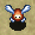

<table class="monsterPageTable">
  <tr>
    <th>Lv</th>
    <th>Name</th>
    <th>HP</th>
    <th>Atk</th>
    <th>Def</th>
    <th>Exp</th>
    <th>Skill</th>
    <th>Drop</th>
    <th>Elem.</th>
    <th>Notes</th>
  </tr>
  <tr>
    <td class="highlightYellow">1</td>
    <td>Snacky</td>
    <td>8</td>
    <td>4</td>
    <td>22</td>
    <td>8</td>
    <td>1</td>
    <td>100%</td>
    <td rowspan="4">Swift 1</td>
    <td>Double speed, 1 attack. Runs away from other creatures. Monsters attack Snacky instead of Shiren if one is visible. Always drops a floor table item.</td>
  </tr>
  <tr>
    <td class="highlightYellow">2</td>
    <td>Munchy</td>
    <td>20</td>
    <td>9</td>
    <td>32</td>
    <td>20</td>
    <td>15</td>
    <td>100%</td>
    <td rowspan="2">Same as Snacky, but drops a shop table item.</td>
  </tr>
  <tr>
    <td class="highlightYellow">3</td>
    <td>Mealy</td>
    <td>33</td>
    <td>15</td>
    <td>40</td>
    <td>73</td>
    <td>30</td>
    <td>100%</td>
  </tr>
  <tr>
    <td class="highlightYellow">4</td>
    <td>Candy</td>
    <td>48</td>
    <td>28</td>
    <td>55</td>
    <td>200</td>
    <td>65</td>
    <td>100%</td>
    <td>Same as Snacky, but drops a Candy table item.</td>
  </tr>
  <tr>
    <th>Lv</th>
    <th>Name</th>
    <th>HP</th>
    <th>Atk</th>
    <th>Def</th>
    <th>Exp</th>
    <th>Skill</th>
    <th>Drop</th>
    <th>Elem.</th>
    <th>Notes</th>
  </tr>
  <tr>
    <td class="highlightNight">1</td>
    <td>Rare Snacky</td>
    <td>10</td>
    <td>5</td>
    <td>1</td>
    <td>1</td>
    <td>5</td>
    <td>100%</td>
    <td rowspan="4">Swift 1 Regular</td>
    <td rowspan="4">Same as daytime abilities.</td>
  </tr>
  <tr>
    <td class="highlightNight">2</td>
    <td>Rare Munchy</td>
    <td>20</td>
    <td>11</td>
    <td>2</td>
    <td>10</td>
    <td>23</td>
    <td>100%</td>
  </tr>
  <tr>
    <td class="highlightNight">3</td>
    <td>Rare Mealy</td>
    <td>35</td>
    <td>18</td>
    <td>3</td>
    <td>50</td>
    <td>50</td>
    <td>100%</td>
  </tr>
  <tr>
    <td class="highlightNight">4</td>
    <td>Rare Candy</td>
    <td>49</td>
    <td>26</td>
    <td>4</td>
    <td>200</td>
    <td>80</td>
    <td>100%</td>
  </tr>
</table>

### Crow Tengu

  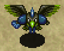

<table class="monsterPageTable">
  <tr>
    <th>Lv</th>
    <th>Name</th>
    <th>HP</th>
    <th>Atk</th>
    <th>Def</th>
    <th>Exp</th>
    <th>Skill</th>
    <th>Drop</th>
    <th>Elem.</th>
    <th>Notes</th>
  </tr>
  <tr>
    <td class="highlightYellow">1</td>
    <td>Crow Tengu</td>
    <td>32</td>
    <td>5</td>
    <td>11</td>
    <td>16</td>
    <td>4</td>
    <td>0%</td>
    <td rowspan="4">Floating</td>
    <td rowspan="4">Disguised as a monster from the floor's monster table. It can't use abilities of the monster it's disguised as. Reveals itself when Sealed or defeated.</td>
  </tr>
  <tr>
    <td class="highlightYellow">2</td>
    <td>monster_name</td>
    <td>53</td>
    <td>17</td>
    <td>23</td>
    <td>91</td>
    <td>20</td>
    <td>0%</td>
  </tr>
  <tr>
    <td class="highlightYellow">3</td>
    <td>monster_name</td>
    <td>71</td>
    <td>23</td>
    <td>32</td>
    <td>300</td>
    <td>60</td>
    <td>0%</td>
  </tr>
  <tr>
    <td class="highlightYellow">4</td>
    <td>monster_name</td>
    <td>79</td>
    <td>32</td>
    <td>38</td>
    <td>700</td>
    <td>100</td>
    <td>0%</td>
  </tr>
  <tr>
    <th>Lv</th>
    <th>Name</th>
    <th>HP</th>
    <th>Atk</th>
    <th>Def</th>
    <th>Exp</th>
    <th>Skill</th>
    <th>Drop</th>
    <th>Elem.</th>
    <th>Notes</th>
  </tr>
  <tr>
    <td class="highlightNight">1</td>
    <td>monster_name</td>
    <td>20</td>
    <td>7</td>
    <td>2</td>
    <td>8</td>
    <td>5</td>
    <td>0%</td>
    <td rowspan="4">Floating Regular</td>
    <td rowspan="4">Same as daytime abilities.</td>
  </tr>
  <tr>
    <td class="highlightNight">2</td>
    <td>monster_name</td>
    <td>34</td>
    <td>16</td>
    <td>4</td>
    <td>40</td>
    <td>23</td>
    <td>0%</td>
  </tr>
  <tr>
    <td class="highlightNight">3</td>
    <td>monster_name</td>
    <td>45</td>
    <td>27</td>
    <td>5</td>
    <td>100</td>
    <td>70</td>
    <td>0%</td>
  </tr>
  <tr>
    <td class="highlightNight">4</td>
    <td>monster_name</td>
    <td>52</td>
    <td>37</td>
    <td>6</td>
    <td>500</td>
    <td>190</td>
    <td>0%</td>
  </tr>
</table>

### Mutaikon

  

<table class="monsterPageTable">
  <tr>
    <th>Lv</th>
    <th>Name</th>
    <th>HP</th>
    <th>Atk</th>
    <th>Def</th>
    <th>Exp</th>
    <th>Skill</th>
    <th>Drop</th>
    <th>Elem.</th>
    <th>Notes</th>
  </tr>
  <tr>
    <td class="highlightYellow">1</td>
    <td>Mutaikon</td>
    <td>30</td>
    <td>13</td>
    <td>11</td>
    <td>35</td>
    <td>8</td>
    <td>6%</td>
    <td>-</td>
    <td>Throws Poison Grass 2 tiles ahead. Only drops Poison Grass.</td>
  </tr>
  <tr>
    <td class="highlightYellow">2</td>
    <td>monster_name</td>
    <td>46</td>
    <td>23</td>
    <td>16</td>
    <td>140</td>
    <td>20</td>
    <td>6%</td>
    <td>-</td>
    <td>Throws Dizzy Grass within a 2 tile radius, or Poison Grass if Shiren is already Confused. Only drops Dizzy Grass.</td>
  </tr>
  <tr>
    <td class="highlightYellow">3</td>
    <td>monster_name</td>
    <td>61</td>
    <td>39</td>
    <td>20</td>
    <td>790</td>
    <td>80</td>
    <td>6%</td>
    <td>-</td>
    <td>Throws Sleep Grass within a 3 tile radius, or Poison Grass if Shiren is already Asleep. Only drops Sleep Grass.</td>
  </tr>
  <tr>
    <td class="highlightYellow">4</td>
    <td>monster_name</td>
    <td>75</td>
    <td>50</td>
    <td>26</td>
    <td>1300</td>
    <td>170</td>
    <td>6%</td>
    <td>-</td>
    <td>Throws Rage Grass within a 5 tile radius, or Poison Grass if Shiren is already Berserk. Only drops Rage Grass.</td>
  </tr>
  <tr>
    <th>Lv</th>
    <th>Name</th>
    <th>HP</th>
    <th>Atk</th>
    <th>Def</th>
    <th>Exp</th>
    <th>Skill</th>
    <th>Drop</th>
    <th>Elem.</th>
    <th>Notes</th>
  </tr>
  <tr>
    <td class="highlightNight">1</td>
    <td>monster_name</td>
    <td>16</td>
    <td>6</td>
    <td>1</td>
    <td>6</td>
    <td>7</td>
    <td>6%</td>
    <td rowspan="4">Random</td>
    <td rowspan="4">Same as daytime abilities.</td>
  </tr>
  <tr>
    <td class="highlightNight">2</td>
    <td>monster_name</td>
    <td>38</td>
    <td>29</td>
    <td>2</td>
    <td>100</td>
    <td>45</td>
    <td>6%</td>
  </tr>
  <tr>
    <td class="highlightNight">3</td>
    <td>monster_name</td>
    <td>49</td>
    <td>39</td>
    <td>3</td>
    <td>680</td>
    <td>130</td>
    <td>6%</td>
  </tr>
  <tr>
    <td class="highlightNight">4</td>
    <td>monster_name</td>
    <td>58</td>
    <td>53</td>
    <td>4</td>
    <td>1600</td>
    <td>220</td>
    <td>6%</td>
  </tr>
</table>

### Foly

  

<table class="monsterPageTable">
  <tr>
    <th>Lv</th>
    <th>Name</th>
    <th>HP</th>
    <th>Atk</th>
    <th>Def</th>
    <th>Exp</th>
    <th>Skill</th>
    <th>Drop</th>
    <th>Elem.</th>
    <th>Notes</th>
  </tr>
  <tr>
    <td class="highlightYellow">1</td>
    <td>Foly</td>
    <td>30</td>
    <td>14</td>
    <td>10</td>
    <td>30</td>
    <td>6</td>
    <td>0%</td>
    <td>Cyclops Floating Swift 1</td>
    <td>Double speed (1 attack). Moves along the wall in rooms. Changes color and abilities every 8 turns. Red: Nullifies and reflects direct attacks. Blue: 15 damage lightning to all creatures in the room after it acts. Green: Heals your HP by 50 if you hit it with a direct attack. Purple: Counters with an ailment if you hit it with a direct attack: Bound, Confused, Berserk, Inaccurate, Grounded. Green and Purple effects won't occur if slain in one hit. Only 1 Foly can be present on a floor at a time.</td>
  </tr>
  <tr>
    <th>Lv</th>
    <th>Name</th>
    <th>HP</th>
    <th>Atk</th>
    <th>Def</th>
    <th>Exp</th>
    <th>Skill</th>
    <th>Drop</th>
    <th>Elem.</th>
    <th>Notes</th>
  </tr>
  <tr>
    <td class="highlightNight">1</td>
    <td>monster_name</td>
    <td>18</td>
    <td>10</td>
    <td>2</td>
    <td>8</td>
    <td>7</td>
    <td>0%</td>
    <td>Cyclops Floating Swift 1 Regular</td>
    <td>Same as daytime abilities.</td>
  </tr>
</table>

### Floaty

  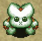

<table class="monsterPageTable">
  <tr>
    <th>Lv</th>
    <th>Name</th>
    <th>HP</th>
    <th>Atk</th>
    <th>Def</th>
    <th>Exp</th>
    <th>Skill</th>
    <th>Drop</th>
    <th>Elem.</th>
    <th>Notes</th>
  </tr>
  <tr>
    <td class="highlightYellow">1</td>
    <td>Floaty</td>
    <td>33</td>
    <td>14</td>
    <td>11</td>
    <td>38</td>
    <td>8</td>
    <td>4%</td>
    <td>-</td>
    <td rowspan="4">Initially Napping in a group of 3. Special warps you 1~3 floors when 3 of them surround you.</td>
  </tr>
  <tr>
    <td class="highlightYellow">2</td>
    <td>monster_name</td>
    <td>54</td>
    <td>33</td>
    <td>17</td>
    <td>370</td>
    <td>40</td>
    <td>4%</td>
    <td>-</td>
  </tr>
  <tr>
    <td class="highlightYellow">3</td>
    <td>monster_name</td>
    <td>65</td>
    <td>46</td>
    <td>22</td>
    <td>700</td>
    <td>80</td>
    <td>4%</td>
    <td>-</td>
  </tr>
  <tr>
    <td class="highlightYellow">4</td>
    <td>monster_name</td>
    <td>73</td>
    <td>60</td>
    <td>27</td>
    <td>1100</td>
    <td>170</td>
    <td>4%</td>
    <td>-</td>
  </tr>
  <tr>
    <th>Lv</th>
    <th>Name</th>
    <th>HP</th>
    <th>Atk</th>
    <th>Def</th>
    <th>Exp</th>
    <th>Skill</th>
    <th>Drop</th>
    <th>Elem.</th>
    <th>Notes</th>
  </tr>
  <tr>
    <td class="highlightNight">1</td>
    <td>monster_name</td>
    <td>20</td>
    <td>15</td>
    <td>1</td>
    <td>19</td>
    <td>10</td>
    <td>4%</td>
    <td rowspan="4">Regular</td>
    <td rowspan="4">Same as daytime abilities.</td>
  </tr>
  <tr>
    <td class="highlightNight">2</td>
    <td>monster_name</td>
    <td>43</td>
    <td>26</td>
    <td>2</td>
    <td>90</td>
    <td>40</td>
    <td>4%</td>
  </tr>
  <tr>
    <td class="highlightNight">3</td>
    <td>monster_name</td>
    <td>53</td>
    <td>40</td>
    <td>3</td>
    <td>330</td>
    <td>90</td>
    <td>4%</td>
  </tr>
  <tr>
    <td class="highlightNight">4</td>
    <td>monster_name</td>
    <td>60</td>
    <td>61</td>
    <td>4</td>
    <td>690</td>
    <td>150</td>
    <td>4%</td>
  </tr>
</table>

### Zapdon

  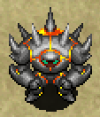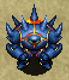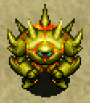

<table class="monsterPageTable">
  <tr>
    <th>Lv</th>
    <th>Name</th>
    <th>HP</th>
    <th>Atk</th>
    <th>Def</th>
    <th>Exp</th>
    <th>Skill</th>
    <th>Drop</th>
    <th>Elem.</th>
    <th>Notes</th>
  </tr>
  <tr>
    <td class="highlightYellow">1</td>
    <td>Zapdon</td>
    <td>63</td>
    <td>50</td>
    <td>25</td>
    <td>150</td>
    <td>30</td>
    <td>4%</td>
    <td rowspan="4">Slow</td>
    <td>1 action every 2 turns. 40 damage lightning in a 1 tile radius after being hit 3 times.</td>
  </tr>
  <tr>
    <td class="highlightYellow">2</td>
    <td>monster_name</td>
    <td>88</td>
    <td>80</td>
    <td>35</td>
    <td>1100</td>
    <td>70</td>
    <td>4%</td>
    <td>Same as Zapdon, but lightning deals 50 damage.</td>
  </tr>
  <tr>
    <td class="highlightYellow">3</td>
    <td>monster_name</td>
    <td>110</td>
    <td>110</td>
    <td>50</td>
    <td>3000</td>
    <td>400</td>
    <td>4%</td>
    <td>Same as Zapdon, but lightning deals 60 damage.</td>
  </tr>
  <tr>
    <td class="highlightYellow">4</td>
    <td>monster_name</td>
    <td>130</td>
    <td>140</td>
    <td>70</td>
    <td>6000</td>
    <td>600</td>
    <td>4%</td>
    <td>Same as Zapdon, but lightning deals 70 damage.</td>
  </tr>
  <tr>
    <th>Lv</th>
    <th>Name</th>
    <th>HP</th>
    <th>Atk</th>
    <th>Def</th>
    <th>Exp</th>
    <th>Skill</th>
    <th>Drop</th>
    <th>Elem.</th>
    <th>Notes</th>
  </tr>
  <tr>
    <td class="highlightNight">1</td>
    <td>monster_name</td>
    <td>46</td>
    <td>50</td>
    <td>7</td>
    <td>84</td>
    <td>40</td>
    <td>4%</td>
    <td rowspan="4">Slow Random</td>
    <td rowspan="4">Same as daytime abilities.</td>
  </tr>
  <tr>
    <td class="highlightNight">2</td>
    <td>monster_name</td>
    <td>78</td>
    <td>75</td>
    <td>12</td>
    <td>900</td>
    <td>220</td>
    <td>4%</td>
  </tr>
  <tr>
    <td class="highlightNight">3</td>
    <td>monster_name</td>
    <td>86</td>
    <td>88</td>
    <td>14</td>
    <td>3500</td>
    <td>300</td>
    <td>4%</td>
  </tr>
  <tr>
    <td class="highlightNight">4</td>
    <td>monster_name</td>
    <td>100</td>
    <td>120</td>
    <td>17</td>
    <td>6800</td>
    <td>500</td>
    <td>4%</td>
  </tr>
</table>

### Maneater

  

<table class="monsterPageTable">
  <tr>
    <th>Lv</th>
    <th>Name</th>
    <th>HP</th>
    <th>Atk</th>
    <th>Def</th>
    <th>Exp</th>
    <th>Skill</th>
    <th>Drop</th>
    <th>Elem.</th>
    <th>Notes</th>
  </tr>
  <tr>
    <td class="highlightYellow">1</td>
    <td>Maneater</td>
    <td>50</td>
    <td>23</td>
    <td>12</td>
    <td>100</td>
    <td>30</td>
    <td>31%</td>
    <td>-</td>
    <td rowspan="4">Begins to spawn after Ominous Aura warning. Becomes double speed (1 attack) when it sees Shiren. Roars if it's in the same room, inflicting Afraid status. Only drops shop table items.</td>
  </tr>
  <tr>
    <td class="highlightYellow">2</td>
    <td>monster_name</td>
    <td>75</td>
    <td>60</td>
    <td>25</td>
    <td>1000</td>
    <td>100</td>
    <td>31%</td>
    <td>-</td>
  </tr>
  <tr>
    <td class="highlightYellow">3</td>
    <td>monster_name</td>
    <td>100</td>
    <td>90</td>
    <td>40</td>
    <td>6000</td>
    <td>400</td>
    <td>31%</td>
    <td>-</td>
  </tr>
  <tr>
    <td class="highlightYellow">4</td>
    <td>monster_name</td>
    <td>150</td>
    <td>120</td>
    <td>60</td>
    <td>9000</td>
    <td>700</td>
    <td>31%</td>
    <td>-</td>
  </tr>
  <tr>
    <th>Lv</th>
    <th>Name</th>
    <th>HP</th>
    <th>Atk</th>
    <th>Def</th>
    <th>Exp</th>
    <th>Skill</th>
    <th>Drop</th>
    <th>Elem.</th>
    <th>Notes</th>
  </tr>
  <tr>
    <td class="highlightNight">1</td>
    <td>monster_name</td>
    <td>60</td>
    <td>30</td>
    <td>5</td>
    <td>150</td>
    <td>50</td>
    <td>31%</td>
    <td rowspan="4">Regular</td>
    <td rowspan="4">Same as daytime abilities.</td>
  </tr>
  <tr>
    <td class="highlightNight">2</td>
    <td>monster_name</td>
    <td>85</td>
    <td>65</td>
    <td>9</td>
    <td>1500</td>
    <td>250</td>
    <td>31%</td>
  </tr>
  <tr>
    <td class="highlightNight">3</td>
    <td>monster_name</td>
    <td>110</td>
    <td>90</td>
    <td>13</td>
    <td>4000</td>
    <td>400</td>
    <td>31%</td>
  </tr>
  <tr>
    <td class="highlightNight">4</td>
    <td>monster_name</td>
    <td>123</td>
    <td>110</td>
    <td>17</td>
    <td>8000</td>
    <td>700</td>
    <td>31%</td>
  </tr>
</table>

### Boss Type

### Divine Beast Kamina

  

<table class="monsterPageTable">
  <tr>
    <th>Name</th>
    <th>HP</th>
    <th>Atk</th>
    <th>Def</th>
    <th>Exp</th>
    <th>Skill</th>
    <th>Drop</th>
    <th>Elem.</th>
    <th>Notes</th>
  </tr>
  <tr>
    <td>Divine Beast Kamina</td>
    <td>301</td>
    <td>70</td>
    <td>15</td>
    <td>0</td>
    <td>0</td>
    <td>0%</td>
    <td>Swift 1</td>
    <td>Double speed (1 attack). Immune to Sleep, Decoy, Paralysis. Ignores Sanctuary Scroll. Gitan deals 2 damage. Moves: ・Direct attack - High power. ・Tackle - Lunges forward to deal damage, and then retreats. ・Poison Claw - Deals damage and lowers strength by 1. ・Instant Recovery - Cures all status conditions.</td>
  </tr>
</table>

### Divine Beast Jaguar

  

<table class="monsterPageTable">
  <tr>
    <th>Name</th>
    <th>HP</th>
    <th>Atk</th>
    <th>Def</th>
    <th>Exp</th>
    <th>Skill</th>
    <th>Drop</th>
    <th>Elem.</th>
    <th>Notes</th>
  </tr>
  <tr>
    <td>Divine Beast Jaguar</td>
    <td>1800</td>
    <td>100</td>
    <td>20</td>
    <td>0</td>
    <td>0</td>
    <td>0%</td>
    <td>Slow</td>
    <td>1 action every 4 turns. Immune to Sleep, Decoy, Paralysis. Ignores Sanctuary Scroll. Gitan deals 2 damage. Moves: ・Direct attack - High power. ・Lightning - Deals 30~40 damage. ・Confusion - Inflicts Confused status. ・Knockback - Low power, deals kncoback. ・Call Monsters - Summons 4~6 monsters. ・Instant Recovery - Cures all status conditions.</td>
  </tr>
</table>

### Hemoji

  

<table class="monsterPageTable">
  <tr>
    <th>Name</th>
    <th>HP</th>
    <th>Atk</th>
    <th>Def</th>
    <th>Exp</th>
    <th>Skill</th>
    <th>Drop</th>
    <th>Elem.</th>
    <th>Notes</th>
  </tr>
  <tr>
    <td>Hemoji</td>
    <td>400</td>
    <td>50</td>
    <td>20</td>
    <td>0</td>
    <td>0</td>
    <td>0%</td>
    <td>-</td>
    <td></td>
  </tr>
</table>

### Mr. Bulldog

  

<table class="monsterPageTable">
  <tr>
    <th>Name</th>
    <th>HP</th>
    <th>Atk</th>
    <th>Def</th>
    <th>Exp</th>
    <th>Skill</th>
    <th>Drop</th>
    <th>Elem.</th>
    <th>Notes</th>
  </tr>
  <tr>
    <td>Mr. Bulldog</td>
    <td>600</td>
    <td>70</td>
    <td>0</td>
    <td>0</td>
    <td>0</td>
    <td>0%</td>
    <td>-</td>
    <td></td>
  </tr>
</table>
