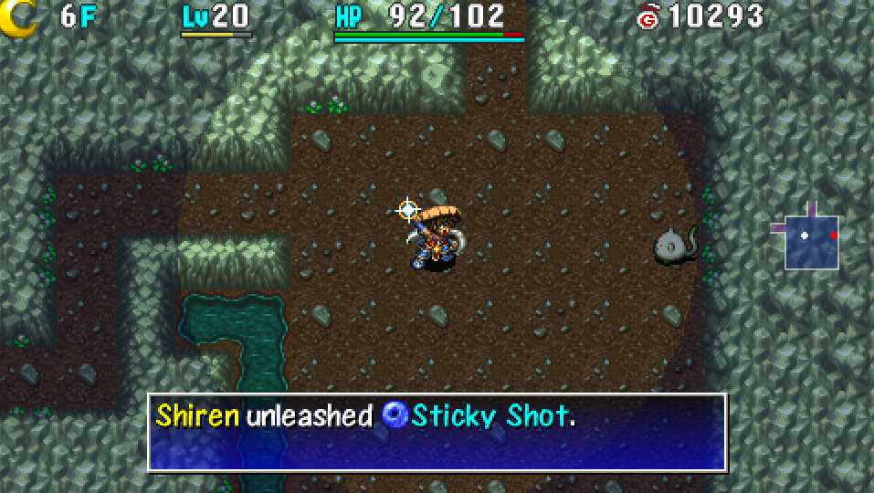

  

## Overview

Necklace abilities are attacks that can only be used at night. They are the primary means to deal damage to night monsters, and are first used in Emerald Terrace after Gonchiki Village during the main story.

Up to 8 abilities can be assigned to the necklace, including multiples of the same ability. Wandering NPCs can teach you new abilities, and you can swap abilities in Boronga Village. Some abilities can only be learned by repeatedly using specific abilities.

Abilities can only be used one time each floor. 
However, it's possible to refresh abilities by reading a Replenish Scroll, 
being revived by Revival Grass / Undo Grass, or the "Cross" formation taking effect.

Attack power of abilities increases as Shiren levels up. 
Most abilities deal 2 damage to shopkeepers, but status effects still work on them.

<ul class="quickLinksUL">
  <li><a href="#ability-list">Ability List</a></li>
  <li><a href="#how-to-learn">How to Learn</a></li>
  <li><a href="#formations">Formations</a></li>
  <li><a href="#sets">Sets</a></li>
</ul>

## Ability List

There are a total of 29 abilities that Shiren can learn. Use a Calling Pot and lots of Pot God Scrolls to quickly learn abilities from NPCs.

<table class="abilityTable">
  <tr>
    <th>Name</th>
    <th>Power</th>
    <th>Learning</th>
    <th>Description</th>
  </tr>
  <tr>
    <td>Kaboom Bullet</td>
    <td>S (90)</td>
    <td>Derived from Sticky Shot</td>
    <td>Shoot a damaging bullet in a straight line. Defeats most monsters in a single hit.</td>
  </tr>
  <tr>
    <td>Sticky Shot</td>
    <td>A (70)</td>
    <td>Default ability</td>
    <td>Shoot a damaging bullet in a straight line, then paralyzes. Weaker than Kaboom Bullet, but nice against blue aura monsters.</td>
  </tr>
  <tr>
    <td>Bi-Direction Warp</td>
    <td>A (60)</td>
    <td>Lv16</td>
    <td>Shoot damaging bullets ahead and behind you. If the target survives, it'll be warped elsewhere.</td>
  </tr>
  <tr>
    <td>Piercing Arrow</td>
    <td>A (60)</td>
    <td>Apprentice</td>
    <td>Shoot a piercing bullet in a straight line, but can't pierce walls.</td>
  </tr>
  <tr>
    <td>Cross Boom Bullet</td>
    <td>A (60)</td>
    <td>Derived from Cross Apathy Shot</td>
    <td>Shoot damaging bullets in front, behind, and to your sides. Power increases per additional target.</td>
  </tr>
  <tr>
    <td>Billiards Blast</td>
    <td>A (60)</td>
    <td>Tradesman</td>
    <td>Deal damage and knockback to a target in front. If the target collides with another enemy, it'll deal knockback.</td>
  </tr>
  <tr>
    <td>Electrocute</td>
    <td>B (50)</td>
    <td>Lv10</td>
    <td>Electric damage to a target in front and all adjacent targets. Unlike Shiren 5, power doesn't change based on number of targets. Basically only used until you learn Room Cyclone.</td>
  </tr>
  <tr>
    <td>Circle Wave</td>
    <td>B (50)</td>
    <td>Apprentice</td>
    <td>Damages targets in a 1 tile radius.</td>
  </tr>
  <tr>
    <td>8-Way Boom Bullet</td>
    <td>B (50)</td>
    <td>Tradesman</td>
    <td>Shoots damaging bullets in 8 directions. Power increases per additional target.</td>
  </tr>
  <tr>
    <td>Bi-Direction Blast</td>
    <td>B (50)</td>
    <td>Derived from Bi-Direction Bind</td>
    <td>Shoot piercing bullets ahead and behind you.</td>
  </tr>
  <tr>
    <td>Cross Apathy Shot</td>
    <td>B (40)</td>
    <td>Lv26</td>
    <td>Shoot damaging bullets in front, behind, and to your sides. Inflicts Apathy status, and power increases per additional target.</td>
  </tr>
  <tr>
    <td>Piercing Blast</td>
    <td>B (40)</td>
    <td>Tradesman</td>
    <td>Shoot a damaging + piercing 3 tile wide blast in a straight line.</td>
  </tr>
  <tr>
    <td>Sleepy Arrow</td>
    <td>B (40)</td>
    <td>Derived from Piercing Arrow</td>
    <td>Shoot a piercing bullet in a straight line, but can't pierce walls. Inflicts Sleep status.</td>
  </tr>
  <tr>
    <td>Room Cyclone</td>
    <td>B (40)</td>
    <td>Lv22</td>
    <td>Damages all targets in the room.</td>
  </tr>
  <tr>
    <td>Room Shockwave</td>
    <td>B (30)</td>
    <td>Master</td>
    <td>Damages all targets in the room, but weaker than Room Cyclone.</td>
  </tr>
  <tr>
    <td>Bi-Direction Bind</td>
    <td>B (30)</td>
    <td>Apprentice</td>
    <td>Shoot piercing bullets ahead and behind you. Inflicts Bind status.</td>
  </tr>
  <tr>
    <td>Piercing Cross Blast</td>
    <td>B (30)</td>
    <td>Master</td>
    <td>Shoot piercing bullets in front, behind, and to your sides. Power increases per additional target.</td>
  </tr>
  <tr>
    <td>Dazing Circle</td>
    <td>B (30)</td>
    <td>Master</td>
    <td>Damages targets in a 1 tile radius. Inflicts Inaccurate status.</td>
  </tr>
  <tr>
    <td>8-Way Slumber Shot</td>
    <td>B (30)</td>
    <td>Master</td>
    <td>Shoots damaging bullets that inflict Slumber status in 8 directions. Power increases per additional target.</td>
  </tr>
  <tr>
    <td>Darkroom</td>
    <td>C (25)</td>
    <td>Derived from Room Cyclone</td>
    <td>Damages all targets in the room, and then inflicts Blind status. Closest ability to Pot Party (Shiren 5).</td>
  </tr>
  <tr>
    <td>Slowing Blast</td>
    <td>C (20)</td>
    <td>Derived from Piercing Blast</td>
    <td>Shoot a damaging + piercing 3 tile wide blast in a straight line. Slows action speed of targets by 1 stage.</td>
  </tr>
  <tr>
    <td>Room Sealant</td>
    <td>C (20)</td>
    <td>Derived from Room Shockwave</td>
    <td>Damages all targets in the room. Inflicts Sealed status.</td>
  </tr>
  <tr>
    <td>Draining Circle</td>
    <td>C (20)</td>
    <td>Tradesman</td>
    <td>Damages targets in a 1 tile radius. Restore HP equal to 20% of damage dealt.</td>
  </tr>
  <tr>
    <td>8-Way Piercing Blast</td>
    <td>C (20)</td>
    <td>Master</td>
    <td>Shoots piercing bullets in 8 directions. Power increases per additional target.</td>
  </tr>
  <tr>
    <td>Piercing Cross Fear</td>
    <td>C (15)</td>
    <td>Derived from Piercing Cross Blast</td>
    <td>Shoot piercing bullets in front, behind, and to your sides. Inflicts Fear status.</td>
  </tr>
  <tr>
    <td>Last Stand</td>
    <td>-</td>
    <td>Clear Shrine of Night Adventures</td>
    <td>80% chance to one-shot all monsters, but you collapse if it fails.</td>
  </tr>
  <tr>
    <td>Three Screams</td>
    <td>-</td>
    <td>Lv99</td>
    <td>Instantly defeats targets in front of you in 3 forward directions, but you don't gain experience points.</td>
  </tr>
  <tr>
    <td>Cluster Confusion</td>
    <td>-</td>
    <td>Apprentice</td>
    <td>Warps monsters on the floor to you, and then inflicts Confusion. Monsters that didn't warp due to lack of space also get confused. Often used with Room Cyclone.</td>
  </tr>
  <tr>
    <td>Pyrrhic Circle</td>
    <td>-</td>
    <td>Derived from Circle Wave</td>
    <td>Reduces HP of targets in a 1 tile radius to 1 HP. Your HP is also reduced by 50%.</td>
  </tr>
  <tr>
    <td>Light Arrow</td>
    <td>B (45)</td>
    <td>Edna Only</td>
    <td>Shoot a piercing bullet in a straight line. Unlimited uses.</td>
  </tr>
</table>

## How to Learn

#### Default

- Sticky Shot → Kaboom Bullet

#### Shrine of Night Adventures

- Last Stand

#### Level Up

- Electrocute (Lv10)
- Bi-Direction Warp (Lv16)
- Room Cyclone (Lv22) → Darkroom
- Cross Apathy Shot (Lv26) → Cross Boom Bullet
- Three Screams (Lv99)

#### Apprentice

- Cluster Confusion
- Piercing Arrow → Sleepy Arrow
- Bi-Direction Bind → Bi-Direction Blast
- Circle Wave → Pyrrhic Circle

#### Tradesman

- 8-Way Boom Bullet
- Billiards Blast
- Draining Circle
- Piercing Blast → Slowing Blast

#### Master

- 8-Way Slumber Shot
- 8-Way Piercing Blast
- Dazing Circle
- Room Shockwave → Room Sealant
- Piercing Cross Blast → Piercing Cross Fear

## Formations

Formations are special effects that occur based on character positions when an ability is used. When multiple formation conditions are met, the higher priority formation is chosen.

<table class="">
  <tr>
    <th>Priority</th>
    <th>Condition</th>
    <th>Effect</th>
  </tr>
  <tr>
    <td class="centeredText">1</td>
    <td class="highlightYellow">4 Pillars</td>
    <td>Double power</td>
  </tr>
  <tr>
    <td class="centeredText">2</td>
    <td class="highlightYellow">Surrounded</td>
    <td>Warp</td>
  </tr>
  <tr>
    <td class="centeredText">3</td>
    <td class="highlightYellow">5 Line</td>
    <td>Restore 200 HP</td>
  </tr>
  <tr>
    <td class="centeredText">4</td>
    <td class="highlightYellow">4 Line</td>
    <td>Restore 100 HP</td>
  </tr>
  <tr>
    <td class="centeredText">5</td>
    <td class="highlightYellow">3 Line</td>
    <td>Restore 50 HP</td>
  </tr>
  <tr>
    <td class="centeredText">6</td>
    <td class="highlightYellow">2 Line</td>
    <td>Cure ailments</td>
  </tr>
  <tr>
    <td class="centeredText">7</td>
    <td class="highlightYellow">Cross</td>
    <td>Refresh 3 abilities</td>
  </tr>
  <tr>
    <td class="centeredText">8</td>
    <td class="highlightYellow">Sandwich</td>
    <td>Restore 20 HP</td>
  </tr>
  <tr>
    <td class="centeredText">9</td>
    <td class="highlightYellow">Cornered</td>
    <td>Boost power by 20%</td>
  </tr>
</table>

#### 4 Pillars

<table class="formationTable">
  <tr>
    <td>　</td>
    <td>　</td>
    <td>　</td>
    <td>　</td>
    <td>　</td>
    <td>　</td>
    <td>　</td>
  </tr>
  <tr>
    <td>　</td>
    <td class="highlightPink">M</td>
    <td>　</td>
    <td>　</td>
    <td>　</td>
    <td class="highlightPink">M</td>
    <td>　</td>
  </tr>
  <tr>
    <td>　</td>
    <td>　</td>
    <td>　</td>
    <td class="highlightBlue">S</td>
    <td>　</td>
    <td>　</td>
    <td>　</td>
  </tr>
  <tr>
    <td>　</td>
    <td class="highlightPink">M</td>
    <td>　</td>
    <td>　</td>
    <td>　</td>
    <td class="highlightPink">M</td>
    <td>　</td>
  </tr>
  <tr>
    <td>　</td>
    <td>　</td>
    <td>　</td>
    <td>　</td>
    <td>　</td>
    <td>　</td>
    <td>　</td>
  </tr>
</table>

 

- Doubles the ability's power.
- Highest priority, and activates no matter what direction you're facing.
- You really have to aim for it to ever see it activate.

#### Surrounded

<table class="formationTable">
  <tr>
    <td>　</td>
    <td>　</td>
    <td>　</td>
    <td>　</td>
    <td>　</td>
    <td>　</td>
    <td>　</td>
  </tr>
  <tr>
    <td>　</td>
    <td>　</td>
    <td class="highlightPink">M</td>
    <td class="highlightPink">M</td>
    <td class="highlightPink">M</td>
    <td>　</td>
    <td>　</td>
  </tr>
  <tr>
    <td>　</td>
    <td>　</td>
    <td class="highlightPink">M</td>
    <td class="highlightBlue">S</td>
    <td class="highlightPink">M</td>
    <td>　</td>
    <td>　</td>
  </tr>
  <tr>
    <td>　</td>
    <td>　</td>
    <td class="highlightPink">M</td>
    <td class="highlightPink">M</td>
    <td class="highlightPink">M</td>
    <td>　</td>
    <td>　</td>
  </tr>
  <tr>
    <td>　</td>
    <td>　</td>
    <td>　</td>
    <td>　</td>
    <td>　</td>
    <td>　</td>
    <td>　</td>
  </tr>
</table>

 

- Warps you to a different location on the current floor. (Nullified by Unmoving rune)
- Priority 2, and activates no matter what direction you're facing.

#### 5 Line

<table class="formationTable">
  <tr>
    <td>　</td>
    <td>　</td>
    <td>　</td>
    <td>　</td>
    <td>　</td>
    <td>　</td>
    <td>　</td>
  </tr>
  <tr>
    <td>　</td>
    <td>　</td>
    <td>　</td>
    <td>　</td>
    <td>　</td>
    <td>　</td>
    <td>　</td>
  </tr>
  <tr>
    <td>　</td>
    <td class="highlightBlue">→</td>
    <td class="highlightPink">M</td>
    <td class="highlightPink">M</td>
    <td class="highlightPink">M</td>
    <td class="highlightPink">M</td>
    <td class="highlightPink">M</td>
  </tr>
  <tr>
    <td>　</td>
    <td>　</td>
    <td>　</td>
    <td>　</td>
    <td>　</td>
    <td>　</td>
    <td>　</td>
  </tr>
  <tr>
    <td>　</td>
    <td>　</td>
    <td>　</td>
    <td>　</td>
    <td>　</td>
    <td>　</td>
    <td>　</td>
  </tr>
</table>

 

- Restores 200 HP.
- Priority 3, and Shiren must be facing the line of enemies.

#### 4 Line

<table class="formationTable">
  <tr>
    <td>　</td>
    <td>　</td>
    <td>　</td>
    <td>　</td>
    <td>　</td>
    <td>　</td>
    <td>　</td>
  </tr>
  <tr>
    <td>　</td>
    <td>　</td>
    <td>　</td>
    <td>　</td>
    <td>　</td>
    <td>　</td>
    <td>　</td>
  </tr>
  <tr>
    <td>　</td>
    <td class="highlightPink">M</td>
    <td class="highlightPink">M</td>
    <td class="highlightPink">M</td>
    <td class="highlightPink">M</td>
    <td class="highlightBlue">←</td>
    <td>　</td>
  </tr>
  <tr>
    <td>　</td>
    <td>　</td>
    <td>　</td>
    <td>　</td>
    <td>　</td>
    <td>　</td>
    <td>　</td>
  </tr>
  <tr>
    <td>　</td>
    <td>　</td>
    <td>　</td>
    <td>　</td>
    <td>　</td>
    <td>　</td>
    <td>　</td>
  </tr>
</table>

 

- Restores 100 HP.
- Priority 4, and Shiren must be facing the line of enemies.

#### 3 Line

<table class="formationTable">
  <tr>
    <td>　</td>
    <td>　</td>
    <td>　</td>
    <td>　</td>
    <td>　</td>
    <td>　</td>
    <td>　</td>
    <td rowspan="5" class="highlightGray"></td>
    <td>　</td>
    <td>　</td>
    <td>　</td>
    <td class="highlightPink">M</td>
    <td>　</td>
    <td>　</td>
    <td>　</td>
  </tr>
  <tr>
    <td>　</td>
    <td>　</td>
    <td>　</td>
    <td>　</td>
    <td>　</td>
    <td>　</td>
    <td>　</td>
    <td>　</td>
    <td>　</td>
    <td>　</td>
    <td class="highlightPink">M</td>
    <td>　</td>
    <td>　</td>
    <td>　</td>
  </tr>
  <tr>
    <td>　</td>
    <td class="highlightPink">M</td>
    <td class="highlightPink">M</td>
    <td class="highlightPink">M</td>
    <td class="highlightBlue">←</td>
    <td>　</td>
    <td>　</td>
    <td>　</td>
    <td>　</td>
    <td>　</td>
    <td class="highlightPink">M</td>
    <td>　</td>
    <td>　</td>
    <td>　</td>
  </tr>
  <tr>
    <td>　</td>
    <td>　</td>
    <td>　</td>
    <td>　</td>
    <td>　</td>
    <td>　</td>
    <td>　</td>
    <td>　</td>
    <td>　</td>
    <td>　</td>
    <td>　</td>
    <td>　</td>
    <td>　</td>
    <td>　</td>
  </tr>
  <tr>
    <td>　</td>
    <td>　</td>
    <td>　</td>
    <td>　</td>
    <td>　</td>
    <td>　</td>
    <td>　</td>
    <td>　</td>
    <td>　</td>
    <td>　</td>
    <td class="highlightBlue">↑</td>
    <td>　</td>
    <td>　</td>
    <td>　</td>
  </tr>
</table>

 

- Restores 50 HP.
- Priority 5, and Shiren must be facing the line of enemies.

#### 2 Line

<table class="formationTable">
  <tr>
    <td>　</td>
    <td>　</td>
    <td>　</td>
    <td>　</td>
    <td>　</td>
    <td>　</td>
    <td>　</td>
    <td rowspan="5" class="highlightGray"></td>
    <td>　</td>
    <td>　</td>
    <td>　</td>
    <td>　</td>
    <td>　</td>
    <td>　</td>
    <td>　</td>
  </tr>
  <tr>
    <td>　</td>
    <td>　</td>
    <td>　</td>
    <td>　</td>
    <td>　</td>
    <td>　</td>
    <td>　</td>
    <td>　</td>
    <td>　</td>
    <td>　</td>
    <td>　</td>
    <td>　</td>
    <td>　</td>
    <td class="highlightPink">M</td>
  </tr>
  <tr>
    <td>　</td>
    <td>　</td>
    <td>　</td>
    <td>　</td>
    <td class="highlightBlue">→</td>
    <td class="highlightPink">M</td>
    <td class="highlightPink">M</td>
    <td>　</td>
    <td>　</td>
    <td>　</td>
    <td>　</td>
    <td>　</td>
    <td class="highlightPink">M</td>
    <td>　</td>
  </tr>
  <tr>
    <td>　</td>
    <td>　</td>
    <td>　</td>
    <td>　</td>
    <td>　</td>
    <td>　</td>
    <td>　</td>
    <td>　</td>
    <td>　</td>
    <td>　</td>
    <td>　</td>
    <td>　</td>
    <td>　</td>
    <td>　</td>
  </tr>
  <tr>
    <td>　</td>
    <td>　</td>
    <td>　</td>
    <td>　</td>
    <td>　</td>
    <td>　</td>
    <td>　</td>
    <td>　</td>
    <td>　</td>
    <td>　</td>
    <td class="highlightBlue">↗︎</td>
    <td>　</td>
    <td>　</td>
    <td>　</td>
  </tr>
</table>

 

- Cures negative status conditions.
- Priority 6, and Shiren must be facing the line of enemies.
- Often accidentally triggered in place of Cross formation. (Ability Refresh)

#### Cross

<table class="formationTable">
  <tr>
    <td>　</td>
    <td>　</td>
    <td>　</td>
    <td>　</td>
    <td>　</td>
    <td>　</td>
    <td>　</td>
    <td rowspan="5" class="highlightGray"></td>
    <td>　</td>
    <td>　</td>
    <td>　</td>
    <td>　</td>
    <td>　</td>
    <td>　</td>
    <td>　</td>
  </tr>
  <tr>
    <td>　</td>
    <td>　</td>
    <td>　</td>
    <td>　</td>
    <td class="highlightPink">M</td>
    <td>　</td>
    <td>　</td>
    <td>　</td>
    <td>　</td>
    <td class="highlightPink">M</td>
    <td>　</td>
    <td class="highlightPink">M</td>
    <td>　</td>
    <td>　</td>
  </tr>
  <tr>
    <td>　</td>
    <td>　</td>
    <td>　</td>
    <td class="highlightPink">M</td>
    <td class="highlightBlue">↗︎</td>
    <td class="highlightPink">M</td>
    <td>　</td>
    <td>　</td>
    <td>　</td>
    <td>　</td>
    <td class="highlightBlue">→</td>
    <td>　</td>
    <td>　</td>
    <td>　</td>
  </tr>
  <tr>
    <td>　</td>
    <td>　</td>
    <td>　</td>
    <td>　</td>
    <td class="highlightPink">M</td>
    <td>　</td>
    <td>　</td>
    <td>　</td>
    <td>　</td>
    <td class="highlightPink">M</td>
    <td>　</td>
    <td class="highlightPink">M</td>
    <td>　</td>
    <td>　</td>
  </tr>
  <tr>
    <td>　</td>
    <td>　</td>
    <td>　</td>
    <td>　</td>
    <td>　</td>
    <td>　</td>
    <td>　</td>
    <td>　</td>
    <td>　</td>
    <td>　</td>
    <td>　</td>
    <td>　</td>
    <td>　</td>
    <td>　</td>
  </tr>
</table>

 

- Refreshes 3 abilities.
- Pretty much exclusive to Cluster Confusion, but has the highest return.
- Priority 7 - check the direction Shiren is facing to avoid triggering a higher priority formation.

#### Sandwich

<table class="formationTable">
  <tr>
    <td>　</td>
    <td>　</td>
    <td>　</td>
    <td>　</td>
    <td>　</td>
    <td>　</td>
    <td>　</td>
    <td rowspan="5" class="highlightGray"></td>
    <td>　</td>
    <td>　</td>
    <td>　</td>
    <td>　</td>
    <td>　</td>
    <td>　</td>
    <td>　</td>
    <td rowspan="5" class="highlightGray"></td>
    <td>　</td>
    <td>　</td>
    <td>　</td>
    <td>　</td>
    <td>　</td>
    <td>　</td>
    <td>　</td>
  </tr>
  <tr>
    <td>　</td>
    <td>　</td>
    <td>　</td>
    <td>　</td>
    <td class="highlightPink">M</td>
    <td>　</td>
    <td>　</td>
    <td>　</td>
    <td>　</td>
    <td class="highlightPink">M</td>
    <td>　</td>
    <td>　</td>
    <td>　</td>
    <td>　</td>
    <td>　</td>
    <td>　</td>
    <td>　</td>
    <td>　</td>
    <td>　</td>
    <td>　</td>
    <td>　</td>
  </tr>
  <tr>
    <td>　</td>
    <td>　</td>
    <td>　</td>
    <td>　</td>
    <td class="highlightBlue">↗︎</td>
    <td>　</td>
    <td>　</td>
    <td>　</td>
    <td>　</td>
    <td>　</td>
    <td class="highlightBlue">→</td>
    <td>　</td>
    <td>　</td>
    <td>　</td>
    <td class="highlightPink">M</td>
    <td>　</td>
    <td>　</td>
    <td class="highlightBlue">↑</td>
    <td>　</td>
    <td>　</td>
    <td class="highlightPink">M</td>
  </tr>
  <tr>
    <td>　</td>
    <td>　</td>
    <td>　</td>
    <td>　</td>
    <td class="highlightPink">M</td>
    <td>　</td>
    <td>　</td>
    <td>　</td>
    <td>　</td>
    <td>　</td>
    <td>　</td>
    <td class="highlightPink">M</td>
    <td>　</td>
    <td>　</td>
    <td>　</td>
    <td>　</td>
    <td>　</td>
    <td>　</td>
    <td>　</td>
    <td>　</td>
    <td>　</td>
  </tr>
  <tr>
    <td>　</td>
    <td>　</td>
    <td>　</td>
    <td>　</td>
    <td>　</td>
    <td>　</td>
    <td>　</td>
    <td>　</td>
    <td>　</td>
    <td>　</td>
    <td>　</td>
    <td>　</td>
    <td>　</td>
    <td>　</td>
    <td>　</td>
    <td>　</td>
    <td>　</td>
    <td>　</td>
    <td>　</td>
    <td>　</td>
    <td>　</td>
  </tr>
</table>

 

- Restores 20 HP.
- Priority 8 - check the direction Shiren is facing to avoid triggering a higher priority formation.

#### Cornered

<table class="formationTable">
  <tr>
    <td>　</td>
    <td>　</td>
    <td>　</td>
    <td>　</td>
    <td>　</td>
    <td>　</td>
    <td>　</td>
  </tr>
  <tr>
    <td>　</td>
    <td>　</td>
    <td>　</td>
    <td>　</td>
    <td>　</td>
    <td>　</td>
    <td>　</td>
  </tr>
  <tr>
    <td>　</td>
    <td>　</td>
    <td>　</td>
    <td class="highlightPink">M</td>
    <td>　</td>
    <td>　</td>
    <td>　</td>
  </tr>
  <tr>
    <td>　</td>
    <td>　</td>
    <td>　</td>
    <td class="highlightBlue">↑</td>
    <td>　</td>
    <td>　</td>
    <td>　</td>
  </tr>
  <tr>
    <td class="highlightBlack">　</td>
    <td class="highlightBlack">　</td>
    <td class="highlightBlack">　</td>
    <td class="highlightBlack">　</td>
    <td class="highlightBlack">　</td>
    <td class="highlightBlack">　</td>
    <td class="highlightBlack">　</td>
  </tr>
</table>

 

- Boosts power of ability by 20%.
- Priority 9, and there must be a water or air tile behind Shiren.

## Sets

This section provides recommendations for ability sets. Most abilities in Shiren 4 are too weak to make use of, so sets look similar.

The idea is to choose abilities based on the purposes you want to have on hand, 
and then fill the remaining slots with attack type abilities.

<table>
  <thead>
    <tr>
      <th>Purpose</th>
      <th>Ability</th>
      <th>Item Equivalent</th>
    </tr>
  </thead>
  <tbody>
    <tr>
      <td>Disable Room</td>
      <td class="highlightYellow">Darkroom Room Sealant</td>
      <td>Confusion Scroll</td>
    </tr>
    <tr>
      <td>When surrounded</td>
      <td class="highlightYellow">8-Way Boom Bullet 8-Way Slumber Shot</td>
      <td>Invincible Grass Fear Scroll Slumber Scroll</td>
    </tr>
    <tr>
      <td>Evade Strong Foe</td>
      <td class="highlightYellow">Sticky Shot Bi-Direction Warp</td>
      <td>Paralysis Staff Mage Staff</td>
    </tr>
    <tr>
      <td>Attacking (Floor)</td>
      <td class="highlightYellow">Cluster Confusion + Room Cyclone Cluster Confusion + "Disable Room" ability Last Stand (Requires Revival Grass)</td>
      <td>Night-Day Scroll</td>
    </tr>
    <tr>
      <td>Attacking (Room)</td>
      <td class="highlightYellow">Room Cyclone</td>
      <td>-</td>
    </tr>
    <tr>
      <td>Attacking (Ranged)</td>
      <td class="highlightYellow">Kaboom Bullet Sticky Shot Piercing Arrow Cross Boom Bullet</td>
      <td>-</td>
    </tr>
    <tr>
      <td>Attacking (One-shot)</td>
      <td class="highlightYellow">Three Screams Sticky Shot</td>
      <td>Paralysis Staff</td>
    </tr>
  </tbody>
</table>

#### Balanced 1

- Cluster Confusion
- Room Cyclone x 2
- Kaboom Bullet x 4
- Sticky Shot

#### Balanced 2

- Darkroom
- Room Cyclone x 2
- Kaboom Bullet x 3
- (Kaboom Bullet or Three Screams or Bi-Direction Warp or Sticky Shot) x 2

#### Entrancing Lane (Farming)

- Cluster Confusion x 4
- Room Cyclone x 4

#### Entrancing Lane (Balanced)

- Cluster Confusion x 2
- Room Cyclone x 2
- Kaboom Bullet x 2
- (Kaboom Bullet or Bi-Direction Warp or Sticky Shot) x 2

#### Ceiling Cave (Balanced)

- Darkroom
- Room Cyclone x 2
- Kaboom Bullet x 3
- (Bi-Direction Warp or Sticky Shot)
- (8-Way Slumber Shot or Cross Apathy Shot)

#### Ceiling Cave (Stealing)

- Darkroom
- Room Cyclone x 2
- Sticky Shot
- Bi-Direction Warp x 4

#### Still Learning

- Sticky Shot x 6
- Room Cyclone x 2
