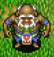
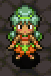

## Overview

Characters that can be found wandering around inside dungeons. 
They're represented as a yellow dot on the map, and only appear in <a href="/shiren-4/dungeons/emerald-terrace">Emerald Terrace</a>.

Characteristics:

- Slow movement.
- Can swap places with Shiren and ally characters.
- Day monsters won't attack them, but night monsters will.

Ally characters can also appear as wandering NPCs, and can be recruited by talking. NPCs never turn hostile, no matter what actions you take against them.

## NPC List

<table class="npcTable">
  <tr>
    <th>NPC</th>
    <th>Floors</th>
    <th>Notes</th>
  </tr>
  <tr>
    <td class="highlightYellow"> Runner</td>
    <td>3-4F 6-10F 19-22F</td>
    <td>Offers to retrieve an item from the Boronga Village storehouse for free. You don't get the item right away, but instead have to wait until you see him again.</td>
  </tr>
  <tr>
    <td class="highlightYellow"> Ace Runner</td>
    <td>3-10F 19-22F</td>
    <td>Offers to deliver an item to the Boronga Village storehouse for free. If he's defeated before he leaves, he'll drop the item you handed him on the ground.</td>
  </tr>
  <tr>
    <td class="highlightYellow"> Smith 1</td>
    <td>3-12F 19-23F</td>
    <td>Pay 1000G to increase a selected item's upgrade value by 1. If you're lucky, upgrade value will be increased by 3 instead. Select a Legendary Fuuma+99 to turn it into a Helix Shield.</td>
  </tr>
  <tr>
    <td class="highlightYellow"> Smith 2</td>
    <td>3-12F 19-23F</td>
    <td>Pay 1000G and deposit a weapon or shield to increase its upgrade value. He'll return the item to you the next time you meet him, and the upgrade value will have increased by +7~13. The smith's skill increases each time you place an order, and after 9 or more orders, he can turn a S-Class Kabura+99 into a Kaburagi.</td>
  </tr>
  <tr>
    <td class="highlightYellow"> Upgrader</td>
    <td>1-12F 19-23F</td>
    <td>Deposit a weapon or shield, and he'll return it to you the next time you meet him with the item having gained lots of skill points (Often enough to increase level by 1). The Item Book is updated right away if the deposited item levels up.</td>
  </tr>
  <tr>
    <td class="highlightYellow"> Peddler</td>
    <td>3-10F 21-26F</td>
    <td>Lets you purchase and sell items on the spot. Doesn't drop anything or trigger Thief Mode if defeated. Talks about opening his own store when you first talk to him, and after he does so, a blue shopkeeper replaces him as the Peddler NPC.</td>
  </tr>
  <tr>
    <td class="highlightYellow"> Torch Girl</td>
    <td>6-12F</td>
    <td>Sells Torches for 100G each, and occasionally charges 300G instead. If you buy torches each time, she can eventually be found sleeping on the ground, and offers to sell you a blessed Torch after waking her up.</td>
  </tr>
  <tr>
    <td class="highlightYellow"> Lost Youth</td>
    <td>6-10F</td>
    <td>Can only be found during the night. (He vanishes once it changes to daytime) Give him any torch and he'll give you a Navigation Scroll as thanks. </td>
  </tr>
  <tr>
    <td class="highlightYellow"> Mekky</td>
    <td>3-12F 19-26F</td>
    <td>Pay 2000G to add the Rustproof rune to a weapon or shield of your choice. Can also plate Shiren, turning him invulnerable until the plating wears off.</td>
  </tr>
  <tr>
    <td class="highlightYellow"> Tag Shop</td>
    <td>6-12F 19-26F</td>
    <td>Pay 2000G to tag a weapon or shield of your choice.</td>
  </tr>
  <tr>
    <td class="highlightYellow"> Purifier</td>
    <td>8-10F 24-26F</td>
    <td>Pay 500G to remove a curse or seal from 1 item. However, it occasionally fails, and you don't get your money back.</td>
  </tr>
  <tr>
    <td class="highlightYellow"> Healer</td>
    <td>8-12F 19-26F</td>
    <td>Pay 300G to restore Shiren's HP, strength, and status.</td>
  </tr>
  <tr>
    <td class="highlightYellow"> Hugger</td>
    <td>1-12F</td>
    <td>Old man who was blinded by a monster's attack. Talk to him after throwing Sight Grass or Heal Grass, and he'll raise max HP by 10. If you're lucky, he'll raise your max HP by 20 instead.</td>
  </tr>
  <tr>
    <td class="highlightYellow"> Bad Morph</td>
    <td>1-12F 19-26F</td>
    <td>Banana Morph who can't turn items into Yellow Bananas. He'll offer to change an item into a banana if you choose not to laugh at him. 1st: Spoiled Banana, 2nd: Green Banana, 3rd: Grilled Banana, 4th: Banana Peel, 5th: Shiren turns into a banana, 6th onward: Ice Banana.</td>
  </tr>
  <tr>
    <td class="highlightYellow"> Appraiser</td>
    <td>6-12F 19-23F</td>
    <td>Identifies a random category of items for you. Afterward, you can pay 500G to identify 1 item.</td>
  </tr>
  <tr>
    <td class="highlightYellow"> Scribe</td>
    <td>11-12F 19-26F</td>
    <td>Give her a Blank Scroll to receive a scroll that you haven't read before. Occasionally fails, resulting in a Piece of Paper. Receive an Invitation if you've read all other scrolls.</td>
  </tr>
  <tr>
    <td class="highlightYellow"> Bargain Hunter</td>
    <td>1-12F</td>
    <td>Pay 1000G and she'll give you an item the next time you meet her. Nothing happens when you talk to her until you've heard the rumors in the Tavern. Asks for 3000G every 5 times, which results in the exclusive Bargain Blade.</td>
  </tr>
  <tr>
    <td class="highlightYellow"> Man</td>
    <td>6-9F 21-26F</td>
    <td>Asks you to rescue his friend who collapsed inside the dungeon. Say "Yes", and his friend may appear in a Monster House.</td>
  </tr>
  <tr>
    <td class="highlightYellow"> Friend</td>
    <td>-</td>
    <td>Appears in a Monster House after saying "Yes" to the Man NPC. Talk to him to rescue him. He'll then rescue you if you collapse, reviving you and warping you out of the room. He'll then be defeated by a monster, leveling them up.</td>
  </tr>
  <tr>
    <td class="highlightYellow"> Business Monkey</td>
    <td>1-12F</td>
    <td>He asks for Gitan, and grants access to the Monkey Village warehouse in return. 1000G (warehouse unlocked) → 3000G (expansion) → 5000G (expansion). After that, he gives you 10% of Diet Banana sales each time you run into him.  He appears if you're starving and offers 3 Diet Bananas in exchange for all Gitan. The Diet Lady NPC appears when you advance floors after buying Diet Bananas.</td>
  </tr>
  <tr>
    <td class="highlightYellow"> Diet Lady</td>
    <td>1-12F</td>
    <td>Gives you a Ripe Banana and 3000G in exchange for a Diet Banana.</td>
  </tr>
  <tr>
    <td class="highlightYellow"> Peko</td>
    <td>1-12F 19-26F</td>
    <td>Appears and asks for the banana when you try to eat your last banana while starving. (Bananas underfoot and inside pots are ignored for the event). If you give the banana, Peko will appear in a subsequent adventure and replenish your fullness when you're starving.</td>
  </tr>
  <tr>
    <td class="highlightYellow"> Osteopath</td>
    <td>6-12F</td>
    <td>Give him a pot, and he'll restore your strength and increase your max strength by 1. If you're lucky, he'll increase your max strength by 3 instead.</td>
  </tr>
  <tr>
    <td class="highlightYellow"> Refresher</td>
    <td>6-12F</td>
    <td>Pay 300G to refresh all necklace abilities.</td>
  </tr>
  <tr>
    <td class="highlightYellow"> Tamo</td>
    <td>6-10F 21-26F</td>
    <td>Begins to dig walls if you give him a Rusty Pickaxe type weapon. Periodically talk to him after letting him dig for a bit to receive an item.</td>
  </tr>
  <tr>
    <td class="highlightYellow"> Apprentice</td>
    <td>1-7F</td>
    <td>Teaches you a new necklace ability (Selected randomly). ・Cluster Confusion ・Bi-Direction Bind ・Circle Wave</td>
  </tr>
  <tr>
    <td class="highlightYellow"> Tradesman</td>
    <td>6-12F</td>
    <td>Teaches you a new necklace ability (Selected randomly). ・Billiards Blast ・8-Way Boom Bullet ・Piercing Blast ・Draining Circle</td>
  </tr>
  <tr>
    <td class="highlightYellow"> Master</td>
    <td>19-23F</td>
    <td>Teaches you a new necklace ability (Selected randomly). ・Room Shockwave ・Piercing Cross Blast ・Dazing Circle ・8-Way Slumber Shot ・8-Way Piercing Blast</td>
  </tr>
  <tr>
    <td class="highlightYellow"> Inn Girl</td>
    <td>6-12F 19-20F</td>
    <td>Guide her to Inn of the Wind to unlock the inn service.</td>
  </tr>
  <tr>
    <td class="highlightYellow"> Inn Boy</td>
    <td>6-12F 19-20F</td>
    <td>Guide him to Inn of the Wind to unlock the item shop.</td>
  </tr>
  <tr>
    <td class="highlightYellow"> Inn Gramps</td>
    <td>6-12F 19-20F</td>
    <td>Guide him to Inn of the Wind to unlock the storehouse.</td>
  </tr>
  <tr>
    <td class="highlightYellow"> Inn Man</td>
    <td>6-12F 19-20F</td>
    <td>Guide him to Inn of the Wind along with the other 3 inn NPCs to unlock <a href="/shiren-4/dungeons/trial-road">Trial Road</a>. ※ Must clear the main story first to unlock the dungeon.</td>
  </tr>
  <tr>
    <td class="highlightYellow">Madam Ateska</td>
    <td>6-9F 21-26F</td>
    <td>Disguises herself as a different NPC, and tells you a fortune. (The result of the fortune takes effect on the next floor)  Great: Floor items = Happy Grass. Good: Floor items = Gitan. Decent: 100% chance for a shop to appear. Average: Floor items = bananas. Bad: 100% chance for a Monster House to appear.</td>
  </tr>
</table>

### Bargain Hunter Items

Every 5 times you ask the Bargain Hunter to shop for you, she'll bring back a Bargain Blade. Otherwise, the item is randomly selected from the following items.

<table class="dungeonTable">
  <thead>
    <tr>
      <th>Item</th>
      <th>Chance</th>
      <th>Item</th>
      <th>Chance</th>
      <th>Item</th>
      <th>Chance</th>
    </tr>
  </thead>
  <tbody>
    <tr>
      <td class="highlightGray">Breeze Blade</td>
      <td>Low</td>
      <td class="highlightGray">Gazer Guard</td>
      <td>Low</td>
      <td class="highlightGray">Heaven Scroll</td>
      <td>High</td>
    </tr>
    <tr>
      <td class="highlightGray">Nap Rattle</td>
      <td>Low</td>
      <td class="highlightGray">Safe Shield</td>
      <td>Medium</td>
      <td class="highlightGray">Earth Scroll</td>
      <td>High</td>
    </tr>
    <tr>
      <td class="highlightGray">Sky Splitter</td>
      <td>Medium</td>
      <td class="highlightGray">Lock Shield</td>
      <td>Medium</td>
      <td class="highlightGray">Plating Scroll</td>
      <td>High</td>
    </tr>
    <tr>
      <td class="highlightGray">Bright Blade</td>
      <td>Low</td>
      <td class="highlightGray">Gyadon Blocker</td>
      <td>Medium</td>
      <td class="highlightGray">Fixer Scroll</td>
      <td>Medium</td>
    </tr>
    <tr>
      <td class="highlightGray">Shockuto</td>
      <td>Low</td>
      <td class="highlightGray">Beast Shield</td>
      <td>Medium</td>
      <td class="highlightGray">Pot God Scroll</td>
      <td>Low</td>
    </tr>
    <tr>
      <td class="highlightGray">Blurry Stick</td>
      <td>Low</td>
      <td class="highlightGray">Lizard Shield</td>
      <td>Low</td>
      <td class="highlightGray">Sanctuary Scroll</td>
      <td>Low</td>
    </tr>
    <tr>
      <td class="highlightGray">Water Cutter</td>
      <td>Medium</td>
      <td class="highlightGray">Meteor Guard</td>
      <td>High</td>
      <td class="highlightGray">Blank Scroll</td>
      <td>Low</td>
    </tr>
    <tr>
      <td class="highlightGray">Hatchet</td>
      <td>Low</td>
      <td class="highlightGray">Red Shield</td>
      <td>High</td>
      <td class="highlightGray">Extinction Scroll</td>
      <td>Low</td>
    </tr>
    <tr>
      <td class="highlightGray">Sealing Keisaku</td>
      <td>Low</td>
      <td class="highlightGray">Heal Bracelet</td>
      <td>Low</td>
      <td class="highlightGray">Tag Scroll</td>
      <td>Medium</td>
    </tr>
    <tr>
      <td class="highlightGray">Myopic Masher</td>
      <td>Medium</td>
      <td class="highlightGray">Calm Bracelet</td>
      <td>Medium</td>
      <td class="highlightGray">Synthesis Pot</td>
      <td>High</td>
    </tr>
    <tr>
      <td class="highlightGray">Baffle Axe</td>
      <td>Low</td>
      <td class="highlightGray">Holy Bracelet</td>
      <td>Low</td>
      <td class="highlightGray">Identify Pot</td>
      <td>Medium</td>
    </tr>
    <tr>
      <td class="highlightGray">Drain Slicer</td>
      <td>Medium</td>
      <td class="highlightGray">Alert Bracelet</td>
      <td>Medium</td>
      <td class="highlightGray">Purify Pot</td>
      <td>Medium</td>
    </tr>
    <tr>
      <td class="highlightGray">Crescent Katana</td>
      <td>Medium</td>
      <td class="highlightGray">Cleansing Bracelet</td>
      <td>Medium</td>
      <td class="highlightGray">Blessing Pot</td>
      <td>Low</td>
    </tr>
    <tr>
      <td class="highlightGray">Burning Blade</td>
      <td>Low</td>
      <td class="highlightGray">Staunch Bracelet</td>
      <td>Medium</td>
      <td class="highlightGray">Mailing Pot</td>
      <td>Medium</td>
    </tr>
    <tr>
      <td class="highlightGray">Dotanuki</td>
      <td>Medium</td>
      <td class="highlightGray">Strength Bracelet</td>
      <td>Medium</td>
      <td class="highlightGray">Presto Pot</td>
      <td>Medium</td>
    </tr>
    <tr>
      <td class="highlightGray">Lizard Lasher</td>
      <td>Medium</td>
      <td class="highlightGray">Happy Bracelet</td>
      <td>High</td>
      <td class="highlightGray">Heal Pot</td>
      <td>High</td>
    </tr>
    <tr>
      <td class="highlightGray">Meteor Edge</td>
      <td>High</td>
      <td class="highlightGray">Monster Detector</td>
      <td>Low</td>
      <td class="highlightGray">Zalokleft Pot</td>
      <td>Medium</td>
    </tr>
    <tr>
      <td class="highlightGray">Red Blade</td>
      <td>High</td>
      <td class="highlightGray">Item Detector</td>
      <td>Low</td>
      <td class="highlightGray">Chocolate Pot</td>
      <td>Low</td>
    </tr>
    <tr>
      <td class="highlightGray">Diet Shield</td>
      <td>High</td>
      <td class="highlightGray">Heal Grass</td>
      <td>Medium</td>
      <td class="highlightGray">Calling Pot</td>
      <td>Low</td>
    </tr>
    <tr>
      <td class="highlightGray">Spry Shield</td>
      <td>Low</td>
      <td class="highlightGray">Life Grass</td>
      <td>High</td>
      <td class="highlightGray">Sleep Talisman</td>
      <td>Low</td>
    </tr>
    <tr>
      <td class="highlightGray">Counter Shield</td>
      <td>Medium</td>
      <td class="highlightGray">Happy Grass</td>
      <td>Low</td>
      <td class="highlightGray">Seal Talisman</td>
      <td>Medium</td>
    </tr>
    <tr>
      <td class="highlightGray">Happy Shield</td>
      <td>Low</td>
      <td class="highlightGray">Expand Seed</td>
      <td>Medium</td>
      <td class="highlightGray">Dizzy Talisman</td>
      <td>Medium</td>
    </tr>
    <tr>
      <td class="highlightGray">Steady Shield</td>
      <td>Low</td>
      <td class="highlightGray">Strength Grass</td>
      <td>Low</td>
      <td class="highlightGray">Miss Talisman</td>
      <td>Low</td>
    </tr>
    <tr>
      <td class="highlightGray">Bowl Shield</td>
      <td>Low</td>
      <td class="highlightGray">Invincible Grass</td>
      <td>Medium</td>
      <td class="highlightGray">Fear Talisman</td>
      <td>Medium</td>
    </tr>
    <tr>
      <td class="highlightGray">Lamp Shield</td>
      <td>High</td>
      <td class="highlightGray">Revival Grass</td>
      <td>High</td>
      <td class="highlightGray">Bind Talisman</td>
      <td>Medium</td>
    </tr>
    <tr>
      <td class="highlightGray">Blast Shield</td>
      <td>Low</td>
      <td class="highlightGray">Undo Grass</td>
      <td>Low</td>
      <td class="highlightGray">Slow Talisman</td>
      <td>Low</td>
    </tr>
  </tbody>
</table>
