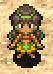

## Overview

Characters that can be found wandering around inside dungeons. 
They're represented as a yellow dot on the map, and only appear in <a href="/shiren-4/dungeons/emerald-terrace">Emerald Terrace</a>.

Characteristics:

- Slow movement.
- Can swap places with Shiren and ally characters.
- Day monsters won't attack them, but night monsters will.

Ally characters can also appear as wandering NPCs, and can be recruited by talking. NPCs never turn hostile, no matter what actions you take against them.

## NPC List

<table class="npcTable">
  <tr>
    <th>NPC</th>
    <th>Notes</th>
  </tr>
  <tr>
    <td class="highlightYellow"> Runner</td>
    <td>Offers to retrieve an item from the Boronga Village storehouse for free. You don't get the item right away, but instead have to wait until you see him again.</td>
  </tr>
  <tr>
    <td class="highlightYellow"> Ace Runner</td>
    <td>Offers to deliver an item to the Boronga Village storehouse for free. If he's defeated before he leaves, he'll drop the item you handed him on the ground.</td>
  </tr>
  <tr>
    <td class="highlightYellow"> Smith 1</td>
    <td>Pay 1000G to increase a selected item's upgrade value by 1. If you're lucky, upgrade value will be increased by 3 instead. Select a Legendary Fuuma+99 to turn it into a Helix Shield.</td>
  </tr>
  <tr>
    <td class="highlightYellow"> Smith 2</td>
    <td>Pay 1000G and deposit a weapon or shield to increase its upgrade value. He'll return the item to you the next time you meet him, and the upgrade value will have increased by +7~13. The smith's skill increases each time you place an order, and after a number of orders, he can turn a S-Class Kabura+99 into a Kaburagi.</td>
  </tr>
  <tr>
    <td class="highlightYellow"> Upgrader</td>
    <td>Deposit a weapon or shield, and he'll return it to you the next time you meet him with the item having gained lots of skill points (Often enough to increase level by 1). The Item Book is updated right away if the deposited item levels up.</td>
  </tr>
  <tr>
    <td class="highlightYellow"> Peddler</td>
    <td>Lets you purchase and sell items on the spot. Doesn't drop anything or trigger Thief Mode if defeated. Talks about opening his own store when you first talk to him, and after he does so, a blue shopkeeper replaces him as the Peddler NPC.</td>
  </tr>
  <tr>
    <td class="highlightYellow"> Torch Girl</td>
    <td>Sells Torches for 100G each, and occasionally charges 300G instead. If you buy torches each time, she can eventually be found sleeping on the ground, and offers to sell you a blessed Torch after waking her up.</td>
  </tr>
  <tr>
    <td class="highlightYellow"> Lost Youth</td>
    <td>Can only be found during the night. (He vanishes once it changes to daytime) Give him any torch and he'll give you a Navigation Scroll as thanks. </td>
  </tr>
  <tr>
    <td class="highlightYellow"> Mekky</td>
    <td>Pay 2000G to add the Rustproof rune to a weapon or shield of your choice. Can also plate Shiren, turning him invulnerable until the plating wears off.</td>
  </tr>
  <tr>
    <td class="highlightYellow"> Tag Shop</td>
    <td>Pay 2000G to tag a weapon or shield of your choice.</td>
  </tr>
  <tr>
    <td class="highlightYellow"> Purifier</td>
    <td>Pay 500G to remove a curse or seal from 1 item. However, it occasionally fails, and you don't get your money back.</td>
  </tr>
  <tr>
    <td class="highlightYellow"> Healer</td>
    <td>Pay 300G to restore Shiren's HP, strength, and status.</td>
  </tr>
  <tr>
    <td class="highlightYellow"> Hugger</td>
    <td>Old man who was blinded by a monster's attack. Talk to him after throwing Sight Grass or Heal Grass, and he'll raise max HP by 10. If you're lucky, he'll raise your max HP by 20 instead.</td>
  </tr>
  <tr>
    <td class="highlightYellow"> Bad Morph</td>
    <td>Only appears on 1-12F and 19-26F. Banana Morph who can't turn items into Yellow Bananas. He'll offer to change an item into a banana if you choose not to laugh at him. 1st: Spoiled Banana, 2nd: Green Banana, 3rd: Grilled Banana, 4th: Banana Peel, 5th: Shiren turns into a banana, 6th onward: Ice Banana.</td>
  </tr>
  <tr>
    <td class="highlightYellow"> Appraiser</td>
    <td>Identifies a random category of items for you. Afterward, you can pay 500G to identify 1 item.</td>
  </tr>
  <tr>
    <td class="highlightYellow"> Scribe</td>
    <td>Only appears on 11-12F and 19-26F. Give her a Blank Scroll to receive a scroll that you haven't read before. Occasionally fails, resulting in a Piece of Paper. Receive an Invitation if you've read all other scrolls.</td>
  </tr>
  <tr>
    <td class="highlightYellow"> Bargain Hunter</td>
    <td>Pay 1000G and she'll give you an item the next time you meet her. Nothing happens when you talk to her until you've heard the rumors in the Tavern. Asks for 3000G every 5 times, which results in the exclusive Bargain Blade.</td>
  </tr>
  <tr>
    <td class="highlightYellow"> Man</td>
    <td>Asks you to rescue his friend who collapsed inside the dungeon. Say "Yes", and his friend may appear in a Monster House.</td>
  </tr>
  <tr>
    <td class="highlightYellow"> Friend</td>
    <td>Appears in a Monster House after saying "Yes" to the Man NPC. Talk to him to rescue him. He'll then rescue you if you collapse, reviving you and warping you out of the room. He'll then be defeated by a monster, leveling them up.</td>
  </tr>
  <tr>
    <td class="highlightYellow"> Business Monkey</td>
    <td>He asks for Gitan, and grants access to the Monkey Village warehouse in return. 1000G (warehouse unlocked) → 3000G (expansion) → 5000G (expansion). After that, he gives you 10% of Diet Banana sales each time you run into him.  He appears if you're starving and offers 3 Diet Bananas in exchange for all Gitan. The Diet Lady NPC appears when you advance floors after buying Diet Bananas.</td>
  </tr>
  <tr>
    <td class="highlightYellow"> Diet Lady</td>
    <td>Gives you a Ripe Banana and 3000G in exchange for a Diet Banana.</td>
  </tr>
  <tr>
    <td class="highlightYellow"> Peko</td>
    <td>Appears and asks for the banana when you try to eat your last banana while starving. (Bananas underfoot and inside pots are ignored for the event). If you give the banana, Peko will appear in a subsequent adventure and replenish your fullness when you're starving.</td>
  </tr>
  <tr>
    <td class="highlightYellow"> Osteopath</td>
    <td>Give him a pot, and he'll restore your strength and increase your max strength by 1. If you're lucky, he'll increase your max strength by 3 instead.</td>
  </tr>
  <tr>
    <td class="highlightYellow"> Refresher</td>
    <td>Pay 300G to refresh all necklace abilities.</td>
  </tr>
  <tr>
    <td class="highlightYellow"> Tamo</td>
    <td>Begins to dig walls if you give him a Rusty Pickaxe type weapon. Periodically talk to him after letting him dig for a bit to receive an item.</td>
  </tr>
  <tr>
    <td class="highlightYellow"> Apprentice</td>
    <td>Teaches you a new necklace ability (Selected randomly) - Only appears on 1-7F. ・Cluster Confusion ・Bi-Direction Bind ・Circle Wave</td>
  </tr>
  <tr>
    <td class="highlightYellow"> Tradesman</td>
    <td>Teaches you a new necklace ability (Selected randomly) - Only appears on 6-12F. ・Billiards Blast ・8-Way Boom Bullet ・Piercing Blast ・Draining Circle</td>
  </tr>
  <tr>
    <td class="highlightYellow"> Master</td>
    <td>Teaches you a new necklace ability (Selected randomly) - Only appears on 19-23F. ・Room Shockwave ・Piercing Cross Blast ・Dazing Circle ・8-Way Slumber Shot ・8-Way Piercing Blast</td>
  </tr>
  <tr>
    <td class="highlightYellow"> Inn Girl</td>
    <td>Only appears on 6-12F and 19-20F. Guide her to Inn of the Wind to unlock the inn service.</td>
  </tr>
  <tr>
    <td class="highlightYellow"> Inn Boy</td>
    <td>Only appears on 6-12F and 19-20F. Guide him to Inn of the Wind to unlock the item shop.</td>
  </tr>
  <tr>
    <td class="highlightYellow"> Inn Gramps</td>
    <td>Only appears on 6-12F and 19-20F. Guide him to Inn of the Wind to unlock the storehouse.</td>
  </tr>
  <tr>
    <td class="highlightYellow"> Inn Man</td>
    <td>Only appears on 6-12F and 19-20F. Guide him to Inn of the Wind along with the other 3 inn NPCs to unlock <a href="/shiren-4/dungeons/trial-road">Trial Road</a>.</td>
  </tr>
  <tr>
    <td class="highlightYellow">Madam Ateska</td>
    <td>Disguises herself as a different NPC, and tells you a fortune. (The result of the fortune takes effect on the next floor)  Great: Floor items = Happy Grass. Good: Floor items = Gitan. Decent: 100% chance for a shop to appear. Average: Floor items = bananas. Bad: 100% chance for a Monster House to appear.</td>
  </tr>
</table>
