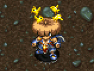

  

## Overview

Status conditions are states that affect a character's behavior in various ways. 
All statuses besides "Normal" can be categorized as positive or negative.

[Absorbiphant](/system/monsters#absorbiphant) monsters can remove all status conditions.

For information about auras, check the [Gameplay Basics](/system/gameplay-basics) page.

#### Shiren

- Negative statuses can be removed by items like Fixer Scroll or Medicine Scroll.
    - Heal Pot, Heal Grass, and Otogiriso can also cure some negative statuses.
- You can check your current status from the menu. (Other → Current Status)
- Most status conditions wear off after a number of turns, or when you change floors.
- Being revived by Revival Grass or Undo Grass will remove all status conditions.

#### Allies

- Negative statuses can be removed by Medicine Scroll.

#### Monsters

- Negative statuses can be removed by a Revitalize Trap.

## Status List

Key: Positive, Negative, Special 

<table class="itemDetailsTable">
  <tr>
    <th>Status</th>
    <th>Target</th>
    <th>Effect</th>
    <th>Causes</th>
  </tr>
  <tr>
    <th id="slow" rowspan="3" class="highlightPink">Slow</th>
    <td>Shiren</td>
    <td>Perform 1 action every 2 turns. (20 turns, or 10 from Shiren's perspective)</td>
    <td rowspan="2">Slow Trap, Poison Grass, Mutaikons, Mage Staff, Slow Staff, Slow Talisman, MC Sorceror</td>
  </tr>
  <tr>
    <td>Ally</td>
    <td>Perform 1 action every 2 turns. (20 turns)</td>
  </tr>
  <tr>
    <td>Monster</td>
    <td>Perform 1 action every 2 turns. (Trapper Status: 20 turns)</td>
    <td>The above, Water Pot, Slowing Blast</td>
  </tr>
  <tr>
    <th id="swift" rowspan="3" class="highlightBlue">Swift</th>
    <td>Shiren</td>
    <td rowspan="3">Perform 2 actions every turn.</td>
    <td rowspan="2">DJ Mage, Swift Grass, Swift Talisman</td>
  </tr>
  <tr>
    <td>Ally</td>
  </tr>
  <tr>
    <td>Monster</td>
    <td>The above, Swift Foe Scroll</td>
  </tr>
  <tr>
    <th id="confused" rowspan="3" class="highlightPink">Confused</th>
    <td>Shiren</td>
    <td>Movement or attack goes in a random direction. (12 turns) Projectiles, thrown items, and staves can be used normally. If a direct attack turns to face an ally, it'll deal damage.</td>
    <td rowspan="2">Spin Trap, Dazikon, MC Mage, Mage Staff, MC Wizard, Dizzy Grass, Dizzy Talisman, Foly</td>
  </tr>
  <tr>
    <td>Ally</td>
    <td>Moves randomly, and attacks if a creature is in the way.</td>
  </tr>
  <tr>
    <td>Monster</td>
    <td>Moves randomly, and won't use special attacks. (20 turns) Attacks if a creature is in the way.</td>
    <td>The above, Confusion Scroll, Cluster Confusion</td>
  </tr>
  <tr>
    <th id="asleep" rowspan="3" class="highlightPink">Asleep</th>
    <td>Shiren</td>
    <td>Unable to perform any actions. (6 turns)</td>
    <td rowspan="2">Sleep Trap, Mage Staff, Sleep Grass, Dozikon, Sleep Talisman</td>
  </tr>
  <tr>
    <td>Ally</td>
    <td>Unable to perform any actions. (4 turns)</td>
  </tr>
  <tr>
    <td>Monster</td>
    <td>Unable to perform any actions. (6 turns)</td>
    <td>The above, Sleepy Arrow</td>
  </tr>
  <tr>
    <th id="slumbering" class="highlightPink">Slumbering</th>
    <td>Monster</td>
    <td>Unable to perform any actions. (12 turns) Action speed is increased by 1 stage afterward.</td>
    <td>Slumber Scroll, 8-Way Slumber Shot</td>
  </tr>
  <tr>
    <th id="blind" rowspan="3" class="highlightPink">Blind</th>
    <td>Shiren</td>
    <td>Field of view reduced to zero, can't read scrolls. (10 turns) Overwrites Sharp Eyes status. Check for walls using show tiles controls. If you can detect enemies, they will be visible on the map. (Example: having a Monster Detector equipped)</td>
    <td rowspan="2">Blind Trap, Squid Kings, MC Mage, Blind Grass, Blind Talisman</td>
  </tr>
  <tr>
    <td>Ally</td>
    <td rowspan="2">Walks in a straight line until they hit something. (10 turns) Turns if they hit a wall, and attacks if there's a creature. Monsters won't use special attacks.</td>
  </tr>
  <tr>
    <td>Monster</td>
    <td>The above, Darkroom</td>
  </tr>
  <tr>
    <th id="paralyzed" rowspan="3" class="highlightPink">Paralyzed</th>
    <td>Shiren</td>
    <td>Unable to act until attacked or hit by an effect. The paralysis wears off after 40 turns.</td>
    <td rowspan="2">MC Mage, MC Wizard, Paralysis Staff, Transient Staff</td>
  </tr>
  <tr>
    <td>Ally</td>
    <td rowspan="2">Unable to act until attacked or hit by an effect.</td>
  </tr>
  <tr>
    <td>Monster</td>
    <td>The above, Fixer Scroll, Sticky Shot</td>
  </tr>
  <tr>
    <th id="s-paralyzed" rowspan="3" class="highlightPink">S-Paralyzed</th>
    <td>Shiren</td>
    <td>Unable to act until attacked or hit by an effect 2 times. The paralysis wears off after 40 turns.</td>
    <td rowspan="3">Paralysis Staff (blessed), Transient Staff (blessed)</td>
  </tr>
  <tr>
    <td>Ally</td>
    <td rowspan="2">Unable to act until attacked or hit by an effect 2 times. (Changes to Paralyzed after being hit 1 time)</td>
  </tr>
  <tr>
    <td>Monster</td>
  </tr>
  <tr>
    <th id="empathetic" rowspan="3" class="highlightPink">Empathetic</th>
    <td>Shiren</td>
    <td rowspan="2">When the target who inflicted this status takes damage, Shiren or the ally receives the same amount of damage. You won't receive damage if you defeat the target in 1 hit. Lasts until target is gone from floor, or you change floors.</td>
    <td rowspan="3">MC Sorceror, Empathy Staff</td>
  </tr>
  <tr>
    <td>Ally</td>
  </tr>
  <tr>
    <td>Monster</td>
    <td>Target takes the same amount of damage when you're hit.</td>
  </tr>
  <tr>
    <th id="s-empathetic" rowspan="3" class="highlightPink">S-Empathetic</th>
    <td>Shiren</td>
    <td rowspan="2">When the target who inflicted this status takes damage, Shiren or the ally will receive double the amount of damage. You won't receive damage if you defeat the target in 1 hit. Lasts until target is gone from floor, or you change floors.</td>
    <td rowspan="3">Empathy Staff (blessed)</td>
  </tr>
  <tr>
    <td>Ally</td>
  </tr>
  <tr>
    <td>Monster</td>
    <td>Target takes double the amount of damage when you're hit.</td>
  </tr>
  <tr>
    <th id="hiding" rowspan="3" class="highlightBlue">Hiding</th>
    <td>Shiren</td>
    <td>Unable to act for a while, won't be detected by monsters.</td>
    <td rowspan="3">Hide Pot</td>
  </tr>
  <tr>
    <td>Ally</td>
    <td>Unable to act. Won't be detected by monsters. Break free by talking or being hit by an attack or effect.</td>
  </tr>
  <tr>
    <td>Monster</td>
    <td>Unable to act, but won't be detected by other monsters. Can't break free until they get hit by an attack or effect.</td>
  </tr>
  <tr>
    <th id="decoy" rowspan="3" class="highlightPink">Decoy</th>
    <td>Shiren</td>
    <td>Same as Confused status.</td>
    <td rowspan="3">Decoy Staff, MC Wizard</td>
  </tr>
  <tr>
    <td>Ally</td>
    <td>Transforms into Fake Shiren. (30 turns) Monsters will aim for the fake, but allies won't attack it. Trying to talk to the fake will result in attacking it. Only 1 fake can be present, so the first character returns to normal and is left Confused if a 2nd fake is made.</td>
  </tr>
  <tr>
    <td>Monster</td>
    <td>Transforms into Fake Shiren. (30 turns) Monsters will prioritize it over Shiren and his allies. The fake won't use special attacks, and is treated as a character on land, even if it's a Floating or Aquatic type. Some monsters won't use special attacks if a fake is visible. Only 1 fake can be present, so the first character returns to normal and is left Confused if a 2nd fake is made.</td>
  </tr>
  <tr>
    <th id="apathetic" class="highlightPink">Apathetic</th>
    <td>Monster</td>
    <td>Unable to perform any actions. (3 turns)</td>
    <td>Amnesia Grass, Hide Gauge Trap, Cross Apathy Shot</td>
  </tr>
  <tr>
    <th id="berserk" rowspan="3" class="highlightPink">Berserk</th>
    <td>Shiren</td>
    <td>Player loses control of Shiren. (30 turns) Shiren will search out and attack the nearest creature.</td>
    <td rowspan="3">Rage Grass, Foly, Mesmerikon, MC Wizard, Berserk Talisman</td>
  </tr>
  <tr>
    <td>Ally</td>
    <td rowspan="2">Can't use special attacks. Attacks nearest creature. (30 turns)</td>
  </tr>
  <tr>
    <td>Monster</td>
  </tr>
  <tr>
    <th id="bound" rowspan="3" class="highlightPink">Bound</th>
    <td>Shiren</td>
    <td>Prevents movement. Can attack, change direction. (3 turns)</td>
    <td rowspan="3">Bind Talisman, Bind Trap, Foly</td>
  </tr>
  <tr>
    <td>Ally</td>
    <td>Prevents movement. Can attack, change direction.</td>
  </tr>
  <tr>
    <td>Monster</td>
    <td>Prevents movement. Can attack, change direction. (10 turns)</td>
  </tr>
  <tr>
    <th id="afraid" rowspan="3" class="highlightPink">Afraid</th>
    <td>Shiren</td>
    <td>Reverses direction of attacks and thrown items. (15 turns) Movement is not affected.</td>
    <td rowspan="2">Fear Talisman, Maneaters</td>
  </tr>
  <tr>
    <td>Ally</td>
    <td rowspan="2">Reverses direction of attacks. (15 turns) Can't use special attacks.</td>
  </tr>
  <tr>
    <td>Monster</td>
    <td>The above, Fear Scroll, Piercing Cross Fear</td>
  </tr>
  <tr>
    <th id="sealed" rowspan="3" class="highlightPink">Sealed</th>
    <td>Shiren</td>
    <td>Unable to eat, read, use abilities, use staves, or talk. (20 turns)</td>
    <td>Seal Staff, MC Wizard, Seal Talisman</td>
  </tr>
  <tr>
    <td>Ally</td>
    <td>Can't use special attacks, and can't talk to Shiren.</td>
    <td>The above, Imabikiso</td>
  </tr>
  <tr>
    <td>Monster</td>
    <td>Can't use special attacks or abilities, removes aura. Action speed is unchanged.</td>
    <td>The above, Water Pot, Seal Trap, Room Sealant</td>
  </tr>
  <tr>
    <th id="inaccurate" rowspan="3" class="highlightPink">Inaccurate</th>
    <td>Shiren</td>
    <td>Direct attacks will always miss. (10 turns)</td>
    <td rowspan="3">Miss Talisman, Foly, Dazing Circle</td>
  </tr>
  <tr>
    <td>Ally</td>
    <td rowspan="2">Direct attacks will always miss. (10 turns) Special attacks can still hit.</td>
  </tr>
  <tr>
    <td>Monster</td>
  </tr>
  <tr>
    <th id="banana" rowspan="3" class="highlightPink">Banana</th>
    <td>Shiren</td>
    <td>Transforms into a banana. (10 turns) Attack and defense set to 0, and equipment effects nullified. Can't use items, abilities, ascend or descend stairs. Collapse if you get hit by fire or explosion damage, or if you step on a Spoil Trap or land on a water tile.</td>
    <td rowspan="3">Banana Trap, Banana Boss, Banana Master, MC Sorceror</td>
  </tr>
  <tr>
    <td>Ally</td>
    <td></td>
  </tr>
  <tr>
    <td>Monster</td>
    <td>Transforms into an banana. (10 turns) Attack and defense set to 1, and can't use special attacks. Turns into a Grilled Banana if hit by fire or explosion damage. Turns into a Spoiled Banana if it steps on a Spoil Trap, gets splashed by water (Water Pot), or lands on a water tile. Banana Novices are immune, and will gain Attack Up instead.</td>
  </tr>
  <tr>
    <th id="slip" class="highlightPink">Slip</th>
    <td>Monster</td>
    <td>Unable to act, and receives double damage. (6 turns) If the target is Mixer, it will drop eaten items on the ground.</td>
    <td>Banana Peel</td>
  </tr>
  <tr>
    <th id="enraged" rowspan="3" class="highlightBlue">Enraged</th>
    <td>Shiren</td>
    <td rowspan="3">Doubles attack power.</td>
    <td rowspan="2">Rage Talisman</td>
  </tr>
  <tr>
    <td>Ally</td>
  </tr>
  <tr>
    <td>Monster</td>
    <td>The above, Rage Trap</td>
  </tr>
  <tr>
    <th id="furious" rowspan="3" class="highlightBlue">Furious</th>
    <td>Shiren</td>
    <td rowspan="3">Doubles attack power and grants Swift status.</td>
    <td rowspan="3">Fury Talisman</td>
  </tr>
  <tr>
    <td>Ally</td>
  </tr>
  <tr>
    <td>Monster</td>
  </tr>
  <tr>
    <th id="plated" rowspan="2" class="highlightBlue">Plated</th>
    <td>Shiren</td>
    <td rowspan="2">Character is immune to most attacks and traps. Chance to wear off when hit by attacks or trap effects.</td>
    <td rowspan="2">Mekky (NPC)</td>
  </tr>
  <tr>
    <td>Ally</td>
  </tr>
  <tr>
    <th id="sharp-eyes" rowspan="3" class="highlightBlue">Sharp Eyes</th>
    <td>Shiren</td>
    <td>Reveals hidden traps and invisible enemies, overwrites Blind. Wears off if you're inflicted with Blind or if you change floors.</td>
    <td rowspan="3">Sight Grass</td>
  </tr>
  <tr>
    <td>Ally</td>
    <td rowspan="2">Overwrites Blind status.</td>
  </tr>
  <tr>
    <td>Monster</td>
  </tr>
  <tr>
    <th id="gauge-blind" class="highlightPink">Gauge Blind</th>
    <td>Shiren</td>
    <td>HP and fullness bars are hidden. (100 turns) Other stats show as ????.</td>
    <td>Hide Gauge Trap</td>
  </tr>
  <tr>
    <th id="muzzled" class="highlightPink">Muzzled</th>
    <td>Shiren</td>
    <td>Unable to eat, read, use abilities, or talk. Wears off when you change floors.</td>
    <td>Muzzled Scroll</td>
  </tr>
  <tr>
    <th id="grounded" class="highlightPink">Grounded</th>
    <td>Shiren</td>
    <td>Unable to pick up items. Can still use items on the ground. Wears off when you change floors.</td>
    <td>Grounded Scroll, Foly</td>
  </tr>
  <tr>
    <th id="hypnotized" rowspan="3" class="highlightPink">Hypnotized</th>
    <td>Shiren</td>
    <td>Face a random direction and attack, use an item, or throw an item. (1 turn)</td>
    <td rowspan="3">Gazers</td>
  </tr>
  <tr>
    <td>Ally</td>
    <td rowspan="2">Same as Confused status.</td>
  </tr>
  <tr>
    <td>Monster</td>
  </tr>
  <tr>
    <th id="napping" class="highlightPink">Napping</th>
    <td>Monster</td>
    <td>The monster is sleeping and won't wake up on its own. May wake up if you move next to it, or enter / exit the room. Floaty, Traproid, and Zalokleft always spawn napping, along with monsters inside regular Monster Houses.</td>
    <td>-</td>
  </tr>
  <tr>
    <th id="invincible" rowspan="3" class="highlightBlue">Invincible</th>
    <td>Shiren</td>
    <td rowspan="3">Nullifies all damage received. (20 turns) It doesn't protect against effects unrelated to damage.</td>
    <td rowspan="3">Invincible Grass</td>
  </tr>
  <tr>
    <td>Ally</td>
  </tr>
  <tr>
    <td>Monster</td>
  </tr>
  <tr>
    <th id="potted" class="highlightPink">Potted</th>
    <td>Shiren</td>
    <td>Hand is stuck in a pot, and your weapon is unequipped. Unable to pick up or use items, and can't use abilities. Wears off when you change floors, or step on a Strip Trap. Chance to break free when you attack or get hit by enemies.</td>
    <td>Sticky Pot</td>
  </tr>
  <tr>
    <th id="growth" class="highlightBlue">Growth</th>
    <td>Shiren</td>
    <td>Gain x4.0 equipment skill points from enemies. (100 turns) Duration lasts for the entire floor if Growth Seed is blessed. Wears off when you change floors.</td>
    <td>Growth Seed</td>
  </tr>
  <tr>
    <th id="icy-cold" rowspan="3" class="highlightBlue">Icy Cold</th>
    <td>Shiren</td>
    <td rowspan="3">Makes the character immune to fire and explosion damage.</td>
    <td rowspan="3">Ice Banana, Icy Cold (Bana Power)</td>
  </tr>
  <tr>
    <td>Ally</td>
  </tr>
  <tr>
    <td>Monster</td>
  </tr>
  <tr>
    <th id="silent" class="highlightBlue">Silent</th>
    <td>Shiren</td>
    <td>Napping monsters won't wake up when you move next to them or when you enter or exit the room. Wears off when you change floors.</td>
    <td>Chocolate Banana</td>
  </tr>
  <tr>
    <th id="identifier" class="highlightBlue">Identifier</th>
    <td>Shiren</td>
    <td>Items are identified when picked up or inserted into pots. Wears off when you change floors.</td>
    <td>Chocolate Banana</td>
  </tr>
  <tr>
    <th id="satiated" class="highlightBlue">Satiated</th>
    <td>Shiren</td>
    <td>Stops natural fullness depletion. Wears off when you change floors.</td>
    <td>Chocolate Banana</td>
  </tr>
  <tr>
    <th id="insomnia" class="highlightBlue">Insomnia</th>
    <td>Shiren</td>
    <td>You won't fall asleep. Wears off when you change floors.</td>
    <td>Chocolate Banana</td>
  </tr>
  <tr>
    <th id="unwavering" class="highlightBlue">Unwavering</th>
    <td>Shiren</td>
    <td>Your strength can't be decreased. Wears off when you change floors.</td>
    <td>Chocolate Banana</td>
  </tr>
  <tr>
    <th id="starving" class="highlightYellow">Starving</th>
    <td>Shiren</td>
    <td>Natural HP regeneration stops, lose 1 HP every turn. Canceled when your fullness increases above 0.</td>
    <td>Fullness reaches 0</td>
  </tr>
  <tr>
    <th id="danger" class="highlightYellow">Danger</th>
    <td>Shiren</td>
    <td>Shiren's current HP is &lt; 30% of his max HP. (Red HP bar) Canceled when Shiren's HP &gt; 30% of his max HP.</td>
    <td>HP &lt; 30% of max HP</td>
  </tr>
  <tr>
    <th id="attack-up" rowspan="3" class="highlightBlue">Attack Up</th>
    <td>Shiren</td>
    <td rowspan="3">Boosts damage dealt.</td>
    <td>Power Up Grass, Edna's magic</td>
  </tr>
  <tr>
    <td>Ally</td>
    <td rowspan="2">Power Up Grass, Strength Grass</td>
  </tr>
  <tr>
    <td>Monster</td>
  </tr>
  <tr>
    <th id="attack-down" class="highlightPink">Attack Down</th>
    <td>Monster</td>
    <td>Reduces damage dealt.</td>
    <td>Hunger Trap, Strip Trap, Kamina's Sword</td>
  </tr>
  <tr>
    <th id="defense-up" class="highlightBlue">Defense Up</th>
    <td>Shiren</td>
    <td>Reduces damage received.</td>
    <td>Edna's magic</td>
  </tr>
  <tr>
    <th id="defense-down" class="highlightPink">Defense Down</th>
    <td>Monster</td>
    <td>Boosts damage received.</td>
    <td>Rust Trap, Strip Trap</td>
  </tr>
</table>
