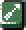

  

## Overview

Traps are dungeon objects that trigger when stepped on, and have a wide variety of effects. 
The effect also differs based on what caused it to trigger.

See <a href="/dungeons/trap-zone">Trap Zone</a> for details about Trapper Status.

## Trap List

Traps are listed in Item Book order.

<table class="trapTable">
  <tr>
    <th>Name</th>
    <th>Shiren</th>
    <th>Monster</th>
  </tr>
  <tr>
    <td id="trip-stone"> Trip</td>
    <td>Deals damage and makes you drop items. Balance Staff protects you from this effect.</td>
    <td>Deals damage. Mixers, Zaloklefts, and Froggos drop their item.</td>
  </tr>
  <tr>
    <td id="rust-trap"> Rust</td>
    <td>Lowers equipped weapon and shield upgrade value by 1.</td>
    <td>Lowers defense.</td>
  </tr>
  <tr>
    <td id="strip-trap"> Strip</td>
    <td>Unequips your weapon, shield, bracelets, and projectile.</td>
    <td>Lowers attack and defense.</td>
  </tr>
  <tr>
    <td id="curse-trap"> Curse</td>
    <td>1 of your items becomes cursed or sealed.</td>
    <td>Inflicts Sealed status.</td>
  </tr>
  <tr>
    <td id="spoil-trap"> Spoil</td>
    <td>All bananas in your inventory turn into Spoiled Bananas, excluding those in pots.</td>
    <td>The monster collapses and turns into a Spoiled Banana.</td>
  </tr>
  <tr>
    <td id="monster-trap"> Monster</td>
    <td>Items in the room transform into monsters.</td>
    <td>Items in the room transform into monsters.</td>
  </tr>
  <tr>
    <td id="summon-trap"> Summon</td>
    <td>Summons 4 monsters around the trap.</td>
    <td>Summons 4 monsters around the trap.</td>
  </tr>
  <tr>
    <td id="multiply-trap"> Multiply</td>
    <td>Generates lots of new traps on the floor.</td>
    <td>Generates lots of new traps on the floor.</td>
  </tr>
  <tr>
    <td id="pit-trap"> Pit</td>
    <td>Deals damage. If the dungeon has descending stairs, advance to the next floor.</td>
    <td>The monster vanishes from the floor.</td>
  </tr>
  <tr>
    <td id="spring"> Spring</td>
    <td>Warp to a different location on the floor.</td>
    <td>Warp to a different location on the floor.</td>
  </tr>
  <tr>
    <td id="log-trap"> Log</td>
    <td>A log flies at you from the front, dealing 5 damage and 10 tiles of knockback.</td>
    <td>A log flies at the monster from the front, dealing 5 damage and 10 tiles of knockback.</td>
  </tr>
  <tr>
    <td id="one-way-trap"> One-Way</td>
    <td>Move in the direction of the arrow. If someone is in your way, attack them.</td>
    <td>Move in the direction of the arrow. If someone is in the monster's way, attack them.</td>
  </tr>
  <tr>
    <td id="revitalize-trap"> Revitalize</td>
    <td>Removes ailments from all monsters on the current floor.</td>
    <td>Removes ailments from all monsters on the current floor.</td>
  </tr>
  <tr>
    <td id="spin-trap"> Spin</td>
    <td>Inflicts Confused status.</td>
    <td>Inflicts Confused status.</td>
  </tr>
  <tr>
    <td id="sleep-trap"> Sleep</td>
    <td>Inflicts Asleep status.</td>
    <td>Inflicts Asleep status.</td>
  </tr>
  <tr>
    <td id="slow-trap"> Slow</td>
    <td>Decreases action speed by 1 stage.</td>
    <td>Decreases action speed by 1 stage.</td>
  </tr>
  <tr>
    <td id="bind-trap"> Bind</td>
    <td>Inflicts Bound status.</td>
    <td>Inflicts Bound status.</td>
  </tr>
  <tr>
    <td id="banana-trap"> Banana</td>
    <td>Inflicts Banana status.</td>
    <td>Inflicts Banana status.</td>
  </tr>
  <tr>
    <td id="rage-trap"> Rage</td>
    <td>Monsters in the room gain Enraged status.</td>
    <td>Monsters in the room gain Enraged status.</td>
  </tr>
  <tr>
    <td id="blind-trap"> Blind</td>
    <td>Inflicts Blind status.</td>
    <td>Inflicts Blind status.</td>
  </tr>
  <tr>
    <td id="wood-arrow-trap"> Wood Arrow</td>
    <td>1 Wood Arrow flies at you from the left of the direction you're facing, dealing damage.</td>
    <td>1 Wood Arrow flies at the monster from the left of the direction they're facing, dealing damage.</td>
  </tr>
  <tr>
    <td id="iron-arrow-trap"> Iron Arrow</td>
    <td>1 Iron Arrow flies at you from the left of the direction you're facing, dealing damage.</td>
    <td>1 Iron Arrow flies at the monster from the left of the direction they're facing, dealing damage.</td>
  </tr>
  <tr>
    <td id="poison-arrow-trap"> Poison Arrow</td>
    <td>1 Poison Arrow flies at you from the left of the direction you're facing, dealing damage and lowering your strength by 1.</td>
    <td>1 Poison Arrow flies at the monster from the left of the direction they're facing, dealing damage and lowering their attack power.</td>
  </tr>
  <tr>
    <td id="rockfall-trap"> Rockfall</td>
    <td>Deals damage.</td>
    <td>Deals damage.</td>
  </tr>
  <tr>
    <td id="metal-trap"> Metal</td>
    <td>Deals damage.</td>
    <td>Deals damage.</td>
  </tr>
  <tr>
    <td id="landmine"> Landmine</td>
    <td>Deals damage equal to 50% HP. Monsters caught in the blast vanish.</td>
    <td>Monsters caught in the blast vanish. Trapper Status: Deals damage equal to 50% HP.</td>
  </tr>
  <tr>
    <td id="big-landmine"> Big Landmine</td>
    <td>Reduces HP to 1. Monsters caught in the blast vanish.</td>
    <td>Monsters caught in the blast vanish. Trapper Status: Reduces HP to 1.</td>
  </tr>
  <tr>
    <td id="hunger-trap"> Hunger</td>
    <td>Decreases fullness by 10.</td>
    <td>Lowers attack power.</td>
  </tr>
  <tr>
    <td id="hide-gauge-trap"> Hide Gauge</td>
    <td>Inflicts Hide Gauge status.</td>
    <td>Inflicts Apathetic status.</td>
  </tr>
  <tr>
    <td id="stairs-trap"> Stairs?</td>
    <td>A random trap disguised as stairs. Reveals itself and triggers when stepped on.</td>
    <td>A random trap disguised as stairs. Reveals itself and triggers when stepped on.</td>
  </tr>
  <tr>
    <td id="time-switch-trap"> Time Switch</td>
    <td>Switches day to night, or night to day.</td>
    <td>Switches day to night, or night to day.</td>
  </tr>
  <tr>
    <td id="floor-warp-trap"> Floor Warp</td>
    <td>Makes you advance 3 floors.</td>
    <td>The monster vanishes from the floor.</td>
  </tr>
</table>
