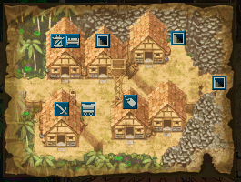
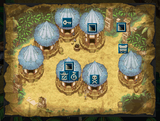
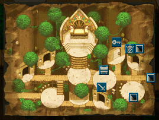

  

# Overview

There are 6 notable overworld areas in the game, and each village has their own NPCs and facilities. 
※ Check the individual dungeon pages for information on unlocking dungeons.

<ul class="quickLinksUL">
  <li><a href="#beach">Beach</a>
    <ul>
      <li><a href="#shore">Shore</a></li>
    </ul>
  </li>
  <li><a href="#boronga-village">Boronga Village</a>
    <ul>
      <li><a href="#boronga-shop">Shop</a></li>
      <li><a href="#boronga-bank">Bank</a></li>
      <li><a href="#boronga-storage">Storage</a></li>
      <li><a href="#rescue">Rescue</a></li>
      <li><a href="#novice-house">Novice House</a></li>
      <li><a href="#move-library">Move Library</a></li>
      <li><a href="#boronga-purifier">Purifier</a></li>
      <li><a href="#boronga-warehouse">Warehouse</a></li>
      <li><a href="#pot-breaker">Pot Breaker</a></li>
      <li><a href="#tavern">Tavern</a></li>
      <li><a href="#boronga-monkey-express">Monkey Express</a></li>
    </ul>
  </li>
  <li><a href="#gonchiki-village">Gonchiki Village</a>
    <ul>
      <li><a href="#gonchiki-inn">Inn</a></li>
      <li><a href="#gonchiki-shop">Shop</a></li>
      <li><a href="#gonchiki-blacksmith">Blacksmith</a></li>
      <li><a href="#sentry">Sentry</a></li>
      <li><a href="#gonchiki-monkey-express">Monkey Express</a></li>
    </ul>
  </li>
  <li><a href="#rakutata-village">Rakutata Village</a>
    <ul>
      <li><a href="#rakutata-shop">Shop</a></li>
      <li><a href="#rakutata-bank">Bank</a></li>
      <li><a href="#rakutata-purifier">Purifier</a></li>
      <li><a href="#rakutata-warehouse">Warehouse</a></li>
      <li><a href="#rakutata-monkey-express">Monkey Express</a></li>
    </ul>
  </li>
  <li><a href="#gonchiki-village">Monkey Village</a>
    <ul>
      <li><a href="#monkey-shop">Shop</a></li>
      <li><a href="#monkey-blacksmith">Blacksmith</a></li>
      <li><a href="#monkey-warehouse">Warehouse</a></li>
      <li><a href="#monkey-monkey-express">Monkey Express</a></li>
    </ul>
  </li>
  <li><a href="#inn-of-the-wind">Inn of the Wind</a>
    <ul>
      <li><a href="#wind-inn">Inn</a></li>
      <li><a href="#wind-shop">Shop</a></li>
      <li><a href="#wind-storage">Storage</a></li>
      <li><a href="#wind-purifier">Purifier</a></li>
    </ul>
  </li>
</ul>

# Beach

  <table class="locationTable">
    <thead>
      <tr>
        <th colspan="10" class="highlightGray">Location</th>
      </tr>
    </thead>
    <tbody>
      <tr>
        <td rowspan="2" class="currentLocation">Beach</td>
        <td>Southern Isle Beach</td>
        <td rowspan="2">Boronga Village</td>
        <td>Grasslands</td>
        <td>Crocodile Swamp</td>
        <td rowspan="2">Gonchiki Village</td>
        <td>Rocky Stretch</td>
        <td>Snake Hole</td>
        <td>Sea of Trees</td>
        <td rowspan="2">Rakutata Village</td>
      </tr>
      <tr>
        <td>1~3F</td>
        <td>1~2F</td>
        <td>3~5F</td>
        <td>6~7F</td>
        <td>8~10F</td>
        <td>10~12F</td>
      </tr>
    </tbody>
  </table>

  

 

- Area where you start the game after the opening.
- Dungeons:
    - <a href="/dungeons/southern-isle-beach">Southern Isle Beach</a>
    - <a href="/dungeons/bayside-monster-cave">Bayside Monster Cave</a>

#### Shore

- If you lose a weapon or shield, check the shore here to see if you can reclaim it.

 

  

 

# Boronga Village

  <table class="locationTable">
    <thead>
      <tr>
        <th colspan="10" class="highlightGray">Location</th>
      </tr>
    </thead>
    <tbody>
      <tr>
        <td rowspan="2">Beach</td>
        <td>Southern Isle Beach</td>
        <td rowspan="2" class="currentLocation">Boronga Village</td>
        <td>Grasslands</td>
        <td>Crocodile Swamp</td>
        <td rowspan="2">Gonchiki Village</td>
        <td>Rocky Stretch</td>
        <td>Snake Hole</td>
        <td>Sea of Trees</td>
        <td rowspan="2">Rakutata Village</td>
      </tr>
      <tr>
        <td>1~3F</td>
        <td>1~2F</td>
        <td>3~5F</td>
        <td>6~7F</td>
        <td>8~10F</td>
        <td>10~12F</td>
      </tr>
    </tbody>
  </table>

  

 

- Main village of the game, and you'll be returned here if you collapse.
- Dungeons:
    - <a href="/dungeons/emerald-terrace">Emerald Terrace</a>
    - <a href="/dungeons/double-strike-cave">Double Strike Cave</a>
    - <a href="/dungeons/jaguar's-hunting-forest">Jaguar's Hunting Forest</a>
    - <a href="/dungeons/emerald">Grass and Scroll Cave</a>
    - <a href="/dungeons/asura-realm">Asura Realm</a>
    - <a href="/dungeons/emerald">Mystery Shopping Mall</a>

  Novice House 

- Mini-game: <a href="/dungeons/statue-cave">Statue Cave</a>.
- Training facilities to help you learn how to play the game.
    - <a href="/dungeons/shrine-of-challenges">Shrine of Challenges</a>, <a href="shrine-of-night-adventures">Shirne of Night Adventures</a>

  Shop 

- The shopkeep can tag equipment for 3000 Gitan after you reach Gonchiki Village.
- 8 items are randomly selected from the following:

 

<table class="itemDetailsTable">
  <thead>
    <tr>
      <th colspan="6">Boronga Village</th>
    </tr>
    <tr>
      <th class="highlightGray">Item</th>
      <th class="highlightGray">Price</th>
      <th class="highlightGray">Item</th>
      <th class="highlightGray">Price</th>
      <th class="highlightGray">Item</th>
      <th class="highlightGray">Price</th>
    </tr>
  </thead>
  <tbody>
    <tr>
      <td>Palm Stick</td>
      <td>300</td>
      <td>Herb</td>
      <td>50</td>
      <td>Navigation Scroll</td>
      <td>100</td>
    </tr>
    <tr>
      <td>Copper Edge</td>
      <td>700</td>
      <td>Otogiriso</td>
      <td>100</td>
      <td>Confusion Scroll</td>
      <td>1000</td>
    </tr>
    <tr>
      <td>Palm Shield</td>
      <td>360</td>
      <td>Antidote Grass</td>
      <td>100</td>
      <td>Slumber Scroll</td>
      <td>1000</td>
    </tr>
    <tr>
      <td>Copper Guard</td>
      <td>740</td>
      <td>Revival Grass</td>
      <td>1000</td>
      <td>Air Slash Scroll</td>
      <td>1000</td>
    </tr>
    <tr>
      <td>Green Banana</td>
      <td>50</td>
      <td>Undo Grass</td>
      <td>1500</td>
      <td>Escape Scroll</td>
      <td>100</td>
    </tr>
    <tr>
      <td>Yellow Banana</td>
      <td>100</td>
      <td colspan="4" class="highlightGray"></td>
    </tr>
  </tbody>
</table>

 

- Items for sale change after clearing the main story:

 

<table class="itemDetailsTable">
  <thead>
    <tr>
      <th colspan="6">Boronga Village (Post-game)</th>
    </tr>
    <tr>
      <th class="highlightGray">Item</th>
      <th class="highlightGray">Price</th>
      <th class="highlightGray">Item</th>
      <th class="highlightGray">Price</th>
      <th class="highlightGray">Item</th>
      <th class="highlightGray">Price</th>
    </tr>
  </thead>
  <tbody>
    <tr>
      <td>Palm Stick</td>
      <td>300</td>
      <td>Green Banana</td>
      <td>50</td>
      <td>Empathy Staff</td>
      <td>1500+75*N</td>
    </tr>
    <tr>
      <td>Copper Edge</td>
      <td>700</td>
      <td>Yellow Banana</td>
      <td>100</td>
      <td>Transient Staff</td>
      <td>1500+75*N</td>
    </tr>
    <tr>
      <td>Katana</td>
      <td>1100</td>
      <td>Ripe Banana</td>
      <td>200</td>
      <td>Knockback Staff</td>
      <td>1000+50*N</td>
    </tr>
    <tr>
      <td>Palm Shield</td>
      <td>360</td>
      <td>Otogiriso</td>
      <td>100</td>
      <td>Seal Staff</td>
      <td>2000+100*N</td>
    </tr>
    <tr>
      <td>Copper Guard</td>
      <td>740</td>
      <td>Heal Grass</td>
      <td>200</td>
      <td>Mage Staff</td>
      <td>1000+50*N</td>
    </tr>
    <tr>
      <td>Iron Targe</td>
      <td>1300</td>
      <td>Antidote Grass</td>
      <td>100</td>
      <td>Lightning Staff</td>
      <td>1000+50*N</td>
    </tr>
    <tr>
      <td>Calm Bracelet</td>
      <td>3000</td>
      <td>Revival Grass</td>
      <td>1000</td>
      <td>Seal Talisman</td>
      <td>500*N</td>
    </tr>
    <tr>
      <td>Alert Bracelet</td>
      <td>3000</td>
      <td>Undo Grass</td>
      <td>1500</td>
      <td>Dizzy Talisman</td>
      <td>500*N</td>
    </tr>
    <tr>
      <td>Cleansing Bracelet</td>
      <td>3000</td>
      <td>Navigation Scroll</td>
      <td>100</td>
      <td>Fear Talisman</td>
      <td>500*N</td>
    </tr>
    <tr>
      <td>Staunch Bracelet</td>
      <td>3000</td>
      <td>Confusion Scroll</td>
      <td>1000</td>
      <td>Bind Talisman</td>
      <td>500*N</td>
    </tr>
    <tr>
      <td>Strength Bracelet</td>
      <td>2000</td>
      <td>Slumber Scroll</td>
      <td>1000</td>
      <td>Berserk Talisman</td>
      <td>500*N</td>
    </tr>
    <tr>
      <td>Wood Arrow</td>
      <td>10*N</td>
      <td>Air Slash Scroll</td>
      <td>1000</td>
      <td rowspan="2" colspan="4" class="highlightGray"></td>
    </tr>
    <tr>
      <td>Rock</td>
      <td>20*N</td>
      <td>Escape Scroll</td>
      <td>100</td>
    </tr>
  </tbody>
</table>

  Bank 

- Money deposited into your account won't be lost if you collapse.
- Receive items based on total Gitan deposited:

 

<table class="itemDetailsTable">
  <thead>
    <tr>
      <th>Item</th>
      <th>Savings</th>
    </tr>
  </thead>
  <tbody>
    <tr>
      <td>Revival Grass</td>
      <td>1</td>
    </tr>
    <tr>
      <td>Undo Grass</td>
      <td>5,000</td>
    </tr>
    <tr>
      <td>Blank Scroll</td>
      <td>10,000</td>
    </tr>
    <tr>
      <td>Item Detector</td>
      <td>50,000</td>
    </tr>
    <tr>
      <td>Fuuma Shield</td>
      <td>100,000</td>
    </tr>
    <tr>
      <td>Identify Bracelet</td>
      <td>500,000</td>
    </tr>
    <tr>
      <td>Holy Bracelet</td>
      <td>1,000,000</td>
    </tr>
    <tr>
      <td>Kaburagi</td>
      <td>99,999,999</td>
    </tr>
  </tbody>
</table>

  Storage 

- Deposit and withdraw up to 80 items.
    - Use Storage Pots to increase storage space.

  Warehouse 

- Leave items on the ground to store them.
- Dungeon gameplay mode inside the warehouse.
- 30 tiles total. (6x5)

  Pot Breaker 

- Pay 10 Gitan to break any pot, including normally unbreakable pots.
- The contents of the pot land inside the warehouse.

  Purifier 

- Removes curses and seals from all items not in pots for 500 Gitan.
    - Purified items will occasionally be blessed.

  Move Library 

- Organize <a href="/system/necklace-abilities">Necklace Abilities</a>.

  Rescue Branch 

- See <a href="/system/wanderer-rescue">Wanderer Rescue</a>.

  Tavern 

- Allies can be recruited from the tavern after they join you.
- Talk to the woman behind the counter to receive Undo Grass.
- Talk to the youth near the right wall to set the Bargain Hunter shopping flag.
- Talk to Banana Prince outside the tavern to set the Banana Kingdom flag.

  Monkey Express 

- Instantly travel to places you've been to before.
    - Unlocked when you reach <a href="#monkey-village">Monkey Village</a>.

 

<table class="itemDetailsTable">
  <thead>
    <tr>
      <th colspan="3">Monkey Express (Boronga Village)</th>
    </tr>
    <tr>
      <th class="highlightGray">Page 1</th>
      <th class="highlightGray">Page 2</th>
      <th class="highlightGray">Page 3</th>
    </tr>
  </thead>
  <tbody>
    <tr>
      <td>Gonchiki Village</td>
      <td>Trap Zone</td>
      <td>Static Forest</td>
    </tr>
    <tr>
      <td>Rakutata Village</td>
      <td>Cave of Endless Night</td>
      <td>Trial Road</td>
    </tr>
    <tr>
      <td>Monkey Village</td>
      <td>Entrancing Lane</td>
      <td>Asura Realm</td>
    </tr>
    <tr>
      <td>Inn of the Wind</td>
      <td>Jaguar's Hunting Forest</td>
      <td>Mystery Shopping Mall</td>
    </tr>
    <tr>
      <td>Bayside Monster Cave</td>
      <td>Double Strike Cave</td>
      <td>Grass and Scroll Cave</td>
    </tr>
    <tr>
      <td>Banana Kingdom</td>
      <td>Ceiling Cave</td>
      <td colspan="2" class="highlightGray"></td>
    </tr>
  </tbody>
</table>

 

# Gonchiki Village

  <table class="locationTable">
    <thead>
      <tr>
        <th colspan="10" class="highlightGray">Location</th>
      </tr>
    </thead>
    <tbody>
      <tr>
        <td rowspan="2">Beach</td>
        <td>Southern Isle Beach</td>
        <td rowspan="2">Boronga Village</td>
        <td>Grasslands</td>
        <td>Crocodile Swamp</td>
        <td rowspan="2" class="currentLocation">Gonchiki Village</td>
        <td>Rocky Stretch</td>
        <td>Snake Hole</td>
        <td>Sea of Trees</td>
        <td rowspan="2">Rakutata Village</td>
      </tr>
      <tr>
        <td>1~3F</td>
        <td>1~2F</td>
        <td>3~5F</td>
        <td>6~7F</td>
        <td>8~10F</td>
        <td>10~12F</td>
      </tr>
    </tbody>
  </table>

  

 

- Village you reach after progressing past Crocodile Swamp in <a href="/dungeons/emerald-terrace">Emerald Terrace</a>.
- Dungeons:
    - <a href="/dungeons/entrancing-lane">Entrancing Lane</a>
    - <a href="/dungeons/cave-of-endless-night">Cave of Endless Night</a>

 

  Inn 

- Pay 500 Gitan to fully restore HP, fullness and strength.
    - Occasionally increases max HP, max strength, or max fullness.

  Shop 

- 8 items are randomly selected from the following:

 

<table class="itemDetailsTable">
  <thead>
    <tr>
      <th colspan="6">Gonchiki Village</th>
    </tr>
    <tr>
      <th class="highlightGray">Item</th>
      <th class="highlightGray">Price</th>
      <th class="highlightGray">Item</th>
      <th class="highlightGray">Price</th>
      <th class="highlightGray">Item</th>
      <th class="highlightGray">Price</th>
    </tr>
  </thead>
  <tbody>
    <tr>
      <td></td>
      <td></td>
      <td></td>
      <td></td>
      <td></td>
      <td></td>
    </tr>
  </tbody>
</table>

 

- Items for sale change after clearing the main story:

 

<table class="itemDetailsTable">
  <thead>
    <tr>
      <th colspan="8">Gonchiki Village (Post-game)</th>
    </tr>
    <tr>
      <th class="highlightGray">Item</th>
      <th class="highlightGray">Price</th>
      <th class="highlightGray">Item</th>
      <th class="highlightGray">Price</th>
      <th class="highlightGray">Item</th>
      <th class="highlightGray">Price</th>
      <th class="highlightGray">Item</th>
      <th class="highlightGray">Price</th>
    </tr>
  </thead>
  <tbody>
    <tr>
      <td>Palm Stick</td>
      <td>300</td>
      <td>Calm Bracelet</td>
      <td>3000</td>
      <td>Otogiriso</td>
      <td>100</td>
      <td>Navigation Scroll</td>
      <td>100</td>
    </tr>
    <tr>
      <td>Copper Edge</td>
      <td>700</td>
      <td>Alert Bracelet</td>
      <td>3000</td>
      <td>Heal Grass</td>
      <td>200</td>
      <td>Purify Scroll</td>
      <td>500</td>
    </tr>
    <tr>
      <td>Katana</td>
      <td>1100</td>
      <td>Cleansing Bracelet</td>
      <td>3000</td>
      <td>Antidote Grass</td>
      <td>100</td>
      <td>Confusion Scroll</td>
      <td>1000</td>
    </tr>
    <tr>
      <td>Palm Shield</td>
      <td>360</td>
      <td>Staunch Bracelet</td>
      <td>3000</td>
      <td>Strength Grass</td>
      <td>500</td>
      <td>Slumber Scroll</td>
      <td>1000</td>
    </tr>
    <tr>
      <td>Copper Guard</td>
      <td>740</td>
      <td>Strength Bracelet</td>
      <td>2000</td>
      <td>Swift Grass</td>
      <td>300</td>
      <td>Air Slash Scroll</td>
      <td>1000</td>
    </tr>
    <tr>
      <td>Iron Targe</td>
      <td>1300</td>
      <td>Wood Arrow</td>
      <td>10*N</td>
      <td>Revival Grass</td>
      <td>1000</td>
      <td>Escape Scroll</td>
      <td>100</td>
    </tr>
    <tr>
      <td>Lamp Shield</td>
      <td>1500</td>
      <td>Rock</td>
      <td>20*N</td>
      <td>Undo Grass</td>
      <td>1500</td>
      <td>Storage Pot</td>
      <td>600+30*N</td>
    </tr>
    <tr>
      <td>Torch</td>
      <td>100</td>
      <td>Green Banana</td>
      <td>50</td>
      <td rowspan="3" colspan="2" class="highlightGray"></td>
      <td rowspan="3" colspan="2" class="highlightGray"></td>
    </tr>
    <tr>
      <td>Fine Torch</td>
      <td>200</td>
      <td>Yellow Banana</td>
      <td>100</td>
    </tr>
    <tr>
      <td>Super Torch</td>
      <td>400</td>
      <td>Ripe Banana</td>
      <td>200</td>
    </tr>
  </tbody>
</table>

  Blacksmith 

- Each service can only be performed once per adventure.
- Upgrade: 1000 Gitan.
    - Increase weapon or shield upgrade value by 1.
    - Small chance to increase by 3.
- Erase rune: 3000 Gitan.
    - Erase a rune of your choice.

  Sentry 

- Pick up tagged items here if you collapse or otherwise lose them.
    - See <a href="/system/gameplay-basics#equipment-tags">Equipment Tags</a> for details.
- Place a tag: 3000 Gitan
- Remove a tag: Free
- Pick up lost items: Varies

  Monkey Express 

- Instantly travel to places you've been to before.
    - Unlocked when you reach <a href="#monkey-village">Monkey Village</a>.

 

<table class="itemDetailsTable">
  <thead>
    <tr>
      <th colspan="3">Monkey Express (Gonchiki Village)</th>
    </tr>
    <tr>
      <th class="highlightGray">Page 1</th>
    </tr>
  </thead>
  <tbody>
    <tr>
      <td>Rakutata Village</td>
    </tr>
    <tr>
      <td>Monkey Village</td>
    </tr>
    <tr>
      <td>Inn of the Wind</td>
    </tr>
  </tbody>
</table>

 

# Rakutata Village

  <table class="locationTable">
    <thead>
      <tr>
        <th colspan="12" class="highlightGray">Location</th>
      </tr>
    </thead>
    <tbody>
      <tr>
        <td rowspan="2" class="currentLocation">Rakutata Village</td>
        <td>Ruins of Laferriere</td>
        <td rowspan="2">Monkey Village</td>
        <td>Eagle Valley</td>
        <td>Lava Field</td>
        <td rowspan="2">Inn of the Wind</td>
        <td>Devil's Navel</td>
        <td rowspan="2">Halfway Point</td>
        <td>Devil's Navel</td>
        <td rowspan="2">Green Cap</td>
        <td>Gold Palace</td>
        <td rowspan="2">Throne Room</td>
      </tr>
      <tr>
        <td>13~18F</td>
        <td>19~20F</td>
        <td>21~23F</td>
        <td>24~26F</td>
        <td>27~30F</td>
        <td>31~36F</td>
      </tr>
    </tbody>
  </table>

  

 

- Village you reach after progressing past Sea of Trees in <a href="/dungeons/emerald-terrace">Emerald Terrace</a>.
- Dungeons:
    - <a href="/dungeons/trap-zone">Trap Zone</a>
    - <a href="/dungeons/ceiling-cave">Ceiling Cave</a>

 

  Shop 

- The shopkeep can tag equipment for 3000 Gitan.
- 8 items are randomly selected from the following:

 

<table class="itemDetailsTable">
  <thead>
    <tr>
      <th colspan="6">Rakutata Village</th>
    </tr>
    <tr>
      <th class="highlightGray">Item</th>
      <th class="highlightGray">Price</th>
      <th class="highlightGray">Item</th>
      <th class="highlightGray">Price</th>
      <th class="highlightGray">Item</th>
      <th class="highlightGray">Price</th>
    </tr>
  </thead>
  <tbody>
    <tr>
      <td></td>
      <td></td>
      <td></td>
      <td></td>
      <td></td>
      <td></td>
    </tr>
  </tbody>
</table>

 

- Items for sale change after clearing the main story:

 

<table class="itemDetailsTable">
  <thead>
    <tr>
      <th colspan="6">Rakutata Village (Post-game)</th>
    </tr>
    <tr>
      <th class="highlightGray">Item</th>
      <th class="highlightGray">Price</th>
      <th class="highlightGray">Item</th>
      <th class="highlightGray">Price</th>
      <th class="highlightGray">Item</th>
      <th class="highlightGray">Price</th>
    </tr>
  </thead>
  <tbody>
    <tr>
      <td>Katana</td>
      <td>1100</td>
      <td>Wood Arrow</td>
      <td>10*N</td>
      <td>Navigation Scroll</td>
      <td>100</td>
    </tr>
    <tr>
      <td>Beast Fang</td>
      <td>1600</td>
      <td>Rock</td>
      <td>20*N</td>
      <td>Identify Scroll</td>
      <td>300</td>
    </tr>
    <tr>
      <td>Iron Targe</td>
      <td>1300</td>
      <td>Green Banana</td>
      <td>50</td>
      <td>Confusion Scroll</td>
      <td>1000</td>
    </tr>
    <tr>
      <td>Clan Shield</td>
      <td>1800</td>
      <td>Yellow Banana</td>
      <td>100</td>
      <td>Slumber Scroll</td>
      <td>1000</td>
    </tr>
    <tr>
      <td>Fine Torch</td>
      <td>200</td>
      <td>Ripe Banana</td>
      <td>200</td>
      <td>Air Slash Scroll</td>
      <td>1000</td>
    </tr>
    <tr>
      <td>Super Torch</td>
      <td>400</td>
      <td>Otogiriso</td>
      <td>100</td>
      <td>Escape Scroll</td>
      <td>100</td>
    </tr>
    <tr>
      <td>Calm Bracelet</td>
      <td>3000</td>
      <td>Heal Grass</td>
      <td>200</td>
      <td>Storage Pot</td>
      <td>600+30*N</td>
    </tr>
    <tr>
      <td>Alert Bracelet</td>
      <td>3000</td>
      <td>Antidote Grass</td>
      <td>100</td>
      <td>Synthesis Pot</td>
      <td>6000+300*N</td>
    </tr>
    <tr>
      <td>Cleansing Bracelet</td>
      <td>3000</td>
      <td>Revival Grass</td>
      <td>1000</td>
      <td rowspan="3" colspan="2" class="highlightGray"></td>
    </tr>
    <tr>
      <td>Staunch Bracelet</td>
      <td>3000</td>
      <td>Undo Grass</td>
      <td>1500</td>
    </tr>
    <tr>
      <td>Strength Bracelet</td>
      <td>2000</td>
      <td colspan="2" class="highlightGray"></td>
    </tr>
  </tbody>
</table>

 

  Bank 

- Money deposited into your account won't be lost if you collapse.
- The account is shared between Boronga Village and Rakutata Village.
- Receive items based on total Gitan deposited:

 

<table class="itemDetailsTable">
  <thead>
    <tr>
      <th>Item</th>
      <th>Savings</th>
    </tr>
  </thead>
  <tbody>
    <tr>
      <td>Revival Grass</td>
      <td>1</td>
    </tr>
    <tr>
      <td>Undo Grass</td>
      <td>5,000</td>
    </tr>
    <tr>
      <td>Blank Scroll</td>
      <td>10,000</td>
    </tr>
    <tr>
      <td>Item Detector</td>
      <td>50,000</td>
    </tr>
    <tr>
      <td>Fuuma Shield</td>
      <td>100,000</td>
    </tr>
    <tr>
      <td>Identify Bracelet</td>
      <td>500,000</td>
    </tr>
    <tr>
      <td>Holy Bracelet</td>
      <td>1,000,000</td>
    </tr>
    <tr>
      <td>Kaburagi</td>
      <td>99,999,999</td>
    </tr>
  </tbody>
</table>

  Warehouse 

- Leave items on the ground to store them.
- Dungeon gameplay mode inside the warehouse.
- 12 tiles total. (3x4)

  Purifier 

- Removes curses and seals from all items not in pots for 1000 Gitan.
    - Purified items will occasionally be blessed.

  Monkey Express 

- Instantly travel to places you've been to before.
    - Unlocked when you reach <a href="#monkey-village">Monkey Village</a>.

 

<table class="itemDetailsTable">
  <thead>
    <tr>
      <th colspan="3">Monkey Express (Rakutata Village)</th>
    </tr>
    <tr>
      <th class="highlightGray">Page 1</th>
    </tr>
  </thead>
  <tbody>
    <tr>
      <td>Monkey Village</td>
    </tr>
    <tr>
      <td>Inn of the Wind</td>
    </tr>
  </tbody>
</table>

 

# Monkey Village

  <table class="locationTable">
    <thead>
      <tr>
        <th colspan="12" class="highlightGray">Location</th>
      </tr>
    </thead>
    <tbody>
      <tr>
        <td rowspan="2">Rakutata Village</td>
        <td>Ruins of Laferriere</td>
        <td rowspan="2" class="currentLocation">Monkey Village</td>
        <td>Eagle Valley</td>
        <td>Lava Field</td>
        <td rowspan="2">Inn of the Wind</td>
        <td>Devil's Navel</td>
        <td rowspan="2">Halfway Point</td>
        <td>Devil's Navel</td>
        <td rowspan="2">Green Cap</td>
        <td>Gold Palace</td>
        <td rowspan="2">Throne Room</td>
      </tr>
      <tr>
        <td>13~18F</td>
        <td>19~20F</td>
        <td>21~23F</td>
        <td>24~26F</td>
        <td>27~30F</td>
        <td>31~36F</td>
      </tr>
    </tbody>
  </table>

  

 

- Village you reach after progressing past Ruins of Laferriere in <a href="/dungeons/emerald-terrace">Emerald Terrace</a>.
- Dungeons:
    - <a href="/dungeons/static-forest">Static Forest</a>
    - <a href="/dungeons/banana-kingdom">Banana Kingdom</a>

  Shop 

- The shopkeep can tag equipment for 3000 Gitan.
- 8 items are randomly selected from the following:

 

<table class="itemDetailsTable">
  <thead>
    <tr>
      <th colspan="6">Monkey Village</th>
    </tr>
    <tr>
      <th class="highlightGray">Item</th>
      <th class="highlightGray">Price</th>
      <th class="highlightGray">Item</th>
      <th class="highlightGray">Price</th>
      <th class="highlightGray">Item</th>
      <th class="highlightGray">Price</th>
    </tr>
  </thead>
  <tbody>
    <tr>
      <td></td>
      <td></td>
      <td></td>
      <td></td>
      <td></td>
      <td></td>
    </tr>
  </tbody>
</table>

 

- Items for sale change after clearing the main story:

 

<table class="itemDetailsTable">
  <thead>
    <tr>
      <th colspan="6">Monkey Village (Post-game)</th>
    </tr>
    <tr>
      <th class="highlightGray">Item</th>
      <th class="highlightGray">Price</th>
      <th class="highlightGray">Item</th>
      <th class="highlightGray">Price</th>
      <th class="highlightGray">Item</th>
      <th class="highlightGray">Price</th>
    </tr>
  </thead>
  <tbody>
    <tr>
      <td>Beast Fang</td>
      <td>1600</td>
      <td>Heal Grass</td>
      <td>200</td>
      <td>Empathy Staff</td>
      <td>1500+75*N</td>
    </tr>
    <tr>
      <td>Dotanuki</td>
      <td>2200</td>
      <td>Antidote Grass</td>
      <td>100</td>
      <td>Transient Staff</td>
      <td>1500+75*N</td>
    </tr>
    <tr>
      <td>Clan Shield</td>
      <td>1800</td>
      <td>Revival Grass</td>
      <td>1000</td>
      <td>Knockback Staff</td>
      <td>1000+50*N</td>
    </tr>
    <tr>
      <td>Beast Shield</td>
      <td>2400</td>
      <td>Undo Grass</td>
      <td>1500</td>
      <td>Seal Staff</td>
      <td>2000+100*N</td>
    </tr>
    <tr>
      <td>Fine Torch</td>
      <td>200</td>
      <td>Purify Scroll</td>
      <td>500</td>
      <td>Mage Staff</td>
      <td>1000+50*N</td>
    </tr>
    <tr>
      <td>Super Torch</td>
      <td>400</td>
      <td>Identify Scroll</td>
      <td>300</td>
      <td>Lightning Staff</td>
      <td>1000+50*N</td>
    </tr>
    <tr>
      <td>Calm Bracelet</td>
      <td>3000</td>
      <td>Confusion Scroll</td>
      <td>1000</td>
      <td>Seal Talisman</td>
      <td>500*N</td>
    </tr>
    <tr>
      <td>Alert Bracelet</td>
      <td>3000</td>
      <td>Slumber Scroll</td>
      <td>1000</td>
      <td>Dizzy Talisman</td>
      <td>500*N</td>
    </tr>
    <tr>
      <td>Cleansing Bracelet</td>
      <td>3000</td>
      <td>Air Slash Scroll</td>
      <td>1000</td>
      <td>Fear Talisman</td>
      <td>500*N</td>
    </tr>
    <tr>
      <td>Staunch Bracelet</td>
      <td>3000</td>
      <td>Escape Scroll</td>
      <td>100</td>
      <td>Bind Talisman</td>
      <td>500*N</td>
    </tr>
    <tr>
      <td>Strength Bracelet</td>
      <td>2000</td>
      <td rowspan="4" colspan="2" class="highlightGray"></td>
      <td>Berserk Talisman</td>
      <td>500*N</td>
    </tr>
    <tr>
      <td>Green Banana</td>
      <td>50</td>
      <td>Storage Pot</td>
      <td>600+30*N</td>
    </tr>
    <tr>
      <td>Yellow Banana</td>
      <td>100</td>
      <td>Synthesis Pot</td>
      <td>6000+300*N</td>
    </tr>
    <tr>
      <td>Ripe Banana</td>
      <td>200</td>
      <td>Heal Pot</td>
      <td>3800+190*N</td>
    </tr>
  </tbody>
</table>

  Blacksmith 

- Each service can only be performed once per adventure.
- Show this blacksmith a Storied Katana+99 to obtain a Fuuma Sword.
- Upgrade: 1000 Gitan.
    - Increase weapon or shield upgrade value by 1.
    - Small chance to increase by 3.
- Erase rune: 3000 Gitan.
    - Erase a rune of your choice.

  Warehouse 

- Leave items on the ground to store them.
- Dungeon gameplay mode inside the warehouse.
- Unlocked by giving 1000 Gitan to the Business Monkey NPC.
    - Give 3000 and 5000 Gitan in subsequent encounters to upgrade the warehouse.
- 6 tiles total after being fully upgraded.

  Monkey Express 

- Instantly travel to places you've been to before.
    - Unlocked after clearing the main story.

 

<table class="itemDetailsTable">
  <thead>
    <tr>
      <th colspan="3">Monkey Express (Rakutata Village)</th>
    </tr>
    <tr>
      <th class="highlightGray">Page 1</th>
    </tr>
  </thead>
  <tbody>
    <tr>
      <td>Inn of the Wind</td>
    </tr>
  </tbody>
</table>

 

# Inn of the Wind

  <table class="locationTable">
    <thead>
      <tr>
        <th colspan="12" class="highlightGray">Location</th>
      </tr>
    </thead>
    <tbody>
      <tr>
        <td rowspan="2">Rakutata Village</td>
        <td>Ruins of Laferriere</td>
        <td rowspan="2">Monkey Village</td>
        <td>Eagle Valley</td>
        <td>Lava Field</td>
        <td rowspan="2" class="currentLocation">Inn of the Wind</td>
        <td>Devil's Navel</td>
        <td rowspan="2">Halfway Point</td>
        <td>Devil's Navel</td>
        <td rowspan="2">Green Cap</td>
        <td>Gold Palace</td>
        <td rowspan="2">Throne Room</td>
      </tr>
      <tr>
        <td>13~18F</td>
        <td>19~20F</td>
        <td>21~23F</td>
        <td>24~26F</td>
        <td>27~30F</td>
        <td>31~36F</td>
      </tr>
    </tbody>
  </table>

  

 

- Village you reach after progressing past Lava Field in <a href="/dungeons/emerald-terrace">Emerald Terrace</a>.
- Guide lost <a href="/system/wandering-npcs">NPCs</a> to this location to unlock additional facilities.
- Dungeons:
    - <a href="/dungeons/trial-road">Trial Road</a>

  Inn 

- Unlocked by guiding <a href="/system/npcs#inn-girl">Inn Girl</a> to this location.
- Pay 1000 Gitan to fully restore HP, fullness and strength.
    - Occasionally increases max HP, max strength, or max fullness.

  Shop 

- Unlocked by guiding <a href="/system/npcs#inn-boy">Inn Boy</a> to this location.
- The shopkeep can tag equipment for 3000 Gitan.
- 8 items are randomly selected from the following:

 

<table class="itemDetailsTable">
  <thead>
    <tr>
      <th colspan="6">Inn of the Wind</th>
    </tr>
    <tr>
      <th class="highlightGray">Item</th>
      <th class="highlightGray">Price</th>
      <th class="highlightGray">Item</th>
      <th class="highlightGray">Price</th>
      <th class="highlightGray">Item</th>
      <th class="highlightGray">Price</th>
    </tr>
  </thead>
  <tbody>
    <tr>
      <td></td>
      <td></td>
      <td></td>
      <td></td>
      <td></td>
      <td></td>
    </tr>
  </tbody>
</table>

 

- Items for sale change after clearing the main story:

 

<table class="itemDetailsTable">
  <thead>
    <tr>
      <th colspan="8">Inn of the Wind (Post-game)</th>
    </tr>
    <tr>
      <th class="highlightGray">Item</th>
      <th class="highlightGray">Price</th>
      <th class="highlightGray">Item</th>
      <th class="highlightGray">Price</th>
      <th class="highlightGray">Item</th>
      <th class="highlightGray">Price</th>
      <th class="highlightGray">Item</th>
      <th class="highlightGray">Price</th>
    </tr>
  </thead>
  <tbody>
    <tr>
      <td>Dotanuki</td>
      <td>2200</td>
      <td>Wood Arrow</td>
      <td>10*N</td>
      <td>Purify Scroll</td>
      <td>500</td>
      <td>Empathy Staff</td>
      <td>1500+75*N</td>
    </tr>
    <tr>
      <td>Meteor Edge</td>
      <td>3000</td>
      <td>Iron Arrow</td>
      <td>30*N</td>
      <td>Identify Scroll</td>
      <td>300</td>
      <td>Transient Staff</td>
      <td>1500+75*N</td>
    </tr>
    <tr>
      <td>Beast Shield</td>
      <td>2400</td>
      <td>Silver Arrow</td>
      <td>50*N</td>
      <td>Heaven Scroll</td>
      <td>500</td>
      <td>Knockback Staff</td>
      <td>1000+50*N</td>
    </tr>
    <tr>
      <td>Meteor Guard</td>
      <td>3200</td>
      <td>Rock</td>
      <td>20*N</td>
      <td>Earth Scroll</td>
      <td>500</td>
      <td>Seal Staff</td>
      <td>2000+100*N</td>
    </tr>
    <tr>
      <td>Fine Torch</td>
      <td>200</td>
      <td>Porky Rock</td>
      <td>40*N</td>
      <td>Plating Scroll</td>
      <td>500</td>
      <td>Mage Staff</td>
      <td>1000+50*N</td>
    </tr>
    <tr>
      <td>Super Torch</td>
      <td>400</td>
      <td>Bomb Rock</td>
      <td>80*N</td>
      <td>Confusion Scroll</td>
      <td>1000</td>
      <td>Lightning Staff</td>
      <td>1000+50*N</td>
    </tr>
    <tr>
      <td>Calm Bracelet</td>
      <td>3000</td>
      <td>Green Banana</td>
      <td>50</td>
      <td>Slumber Scroll</td>
      <td>1000</td>
      <td>Storage Pot</td>
      <td>600+30*N</td>
    </tr>
    <tr>
      <td>Alert Bracelet</td>
      <td>3000</td>
      <td>Yellow Banana</td>
      <td>100</td>
      <td>Air Slash Scroll</td>
      <td>1000</td>
      <td>Synthesis Pot</td>
      <td>6000+300*N</td>
    </tr>
    <tr>
      <td>Cleansing Bracelet</td>
      <td>3000</td>
      <td>Ripe Banana</td>
      <td>200</td>
      <td>Escape Scroll</td>
      <td>100</td>
      <td>Presto Pot</td>
      <td>1000+50*N</td>
    </tr>
    <tr>
      <td>Staunch Bracelet</td>
      <td>3000</td>
      <td rowspan="2" colspan="2" class="highlightGray"></td>
      <td rowspan="2" colspan="2" class="highlightGray"></td>
      <td>Heal Pot</td>
      <td>3800+190*N</td>
    </tr>
    <tr>
      <td>Strength Bracelet</td>
      <td>2000</td>
      <td colspan="2" class="highlightGray"></td>
    </tr>
  </tbody>
</table>

  Storage 

- Unlocked by guiding <a href="/system/npcs#inn-gramps">Inn Gramps</a> to this location.
- The storage is shared between Boronga Village and Inn of the Wind.
- Deposit and withdraw up to 80 items.
    - Use Storage Pots to increase storage space.
    - Unidentified items can't be deposited.

  Purifier 

- Removes curses and seals from all items not in pots for 1500 Gitan.
    - Purified items will occasionally be blessed.
